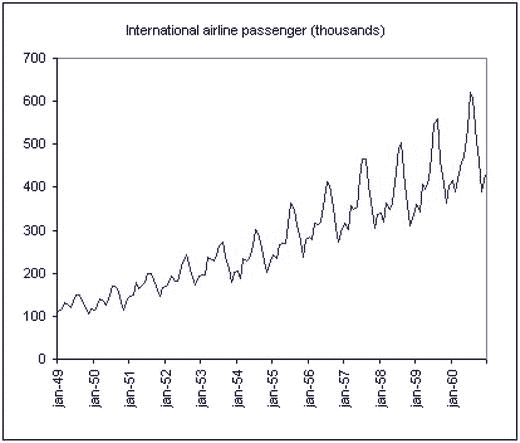
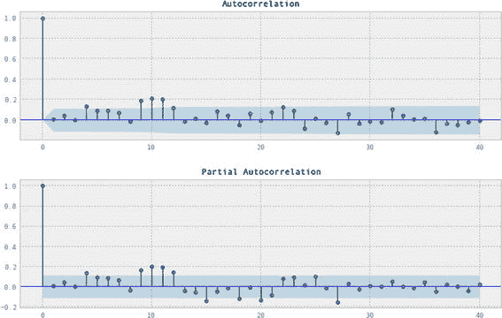
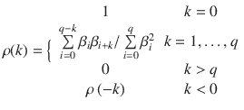
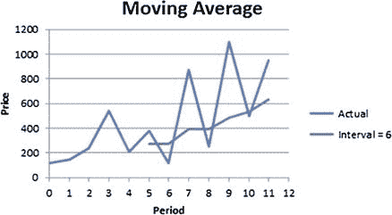
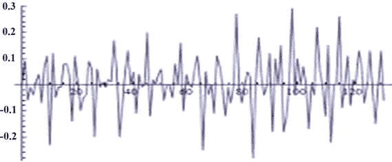

# 6.时间序列

时间序列是按时间顺序排列的一系列数据点。最常见的情况是，时间点间隔相等。几个例子是在过去两年中每个月记录的航空公司的乘客量，或者在过去一年中每天记录的股票市场中的一种工具的价格。时间序列分析的主要目的是根据一个参数的过去数据来预测其未来值。

## 变异的分类

传统上，时间序列分析将变化分为三个主要部分，即趋势、季节变化和其他周期性变化。剩下的变化归因于“不规则”波动或误差项。当变化主要由趋势和季节性组成时，这种方法特别有价值。

## 分析包含趋势的系列

趋势是平均水平的长期变化。例如，如果你有一个像 2，4，6，8 这样的数列，有人问你下一个值，很明显的答案是 10。您可以通过使用简单的最小二乘估计或任何其他回归方法对数据拟合一条线来证明您的答案。趋势也可以是非线性的。图 [6-1](#Fig1) 显示了一个带有趋势的时间序列的例子。



图 6-1

A time series with trends

最简单的时间序列类型是我们熟悉的“线性趋势加噪声”,时间 t 的观测值是一个随机变量 X <sub>t</sub> ,如下所示:


这里，α，β是常数，ε <sub>t</sub> 表示均值为 0 的随机误差项。t 时刻的平均水平由 m <sub>t</sub> = (α + βt)给出。这有时被称为趋势项。

### 曲线拟合

拟合简单的时间函数，例如多项式曲线(线性、二次等。)，Gompertz 曲线或逻辑曲线是一种众所周知的处理包含趋势的非季节性数据的方法，尤其是年度数据。全局线性趋势是最简单的多项式曲线类型。Gompertz 曲线可以写成以下格式，其中α、β和γ是 0 < r < 1 的参数:

x<sub>t</sub>=αexp[βexp(-t)]

如果γ > 0，这看起来非常不同，但实际上是等效的。逻辑曲线如下:

x <sub>t</sub> = a / (1+be <sup>-ct</sup>

这两条曲线都是 S 形的，当 t→∞时接近一个渐近值，Gompertz 曲线通常比 logistic 曲线收敛得慢。将曲线拟合到数据可能导致非线性联立方程。

对于这种性质的所有曲线，拟合函数提供趋势的度量，残差提供局部波动的估计，其中残差是观察值和拟合曲线的相应值之间的差。

### 从时间序列中移除趋势

对给定的时间序列进行微分，直到它变得稳定，这是一种特殊类型的过滤，对于去除趋势特别有用。你会发现这是 Box-Jenkins 程序的一个组成部分。对于具有线性趋势的数据，一阶差分通常足以消除趋势。

数学上，它看起来像这样:

y(t) = a*t + c

y(t+1) = a*(t+1) + c

z(t)= y(t+1)-y(t)= a+c；z(t)中不存在趋势

趋势也可以是指数型的。在这种情况下，您必须进行对数转换，将趋势从指数转换为线性。

数学上，它看起来像这样:

y(t) = a*exp(t)

z(t)= log(y(t))= t * log(a)；z(t)是 t 的线性函数

## 分析包含季节性的序列

许多时间序列，如航空客运量或天气预报，显示在特定时间段后重复的变化。例如，在印度，排灯节期间，航空公司的载客量总是会增加。这种每年的变化很容易理解，如果季节性是直接相关的，就可以估计出来。类似地，就像趋势一样，如果你有一个 1，2，1，2，1，2 这样的序列，你对该序列的下一个值的明显选择将是 1 和 2。

Holt-Winters 模型是实现具有季节性的时间序列的常用模型，也称为指数平滑。霍尔特-温特斯模型有两种变体:加法和乘法。在具有单一指数平滑时间序列的可加模型中，季节性实现如下:

x(t+1)=α-XT+(1-α)-ST-1

在这个模型中，每个点都被实现为前一个点和季节性的加权平均值。因此，X(t+1)将被计算为 X(t-1)和 S(t-2)的函数以及α的平方。这样越往前走，α值呈指数增长。这就是它被称为指数平滑的原因。在这种方法中，St 的初始值至关重要。通常，该值以 1 或前四次观察的平均值开始。

乘法季节模型时间序列如下:

X(t+1)= (b1 + b2*t)St +噪声，

这里，b1，通常称为永久分量，是季节性的初始权重；b2 表示趋势，在这种情况下是线性的。

然而，在 Python 中没有 Holt-Winters 模型的标准实现。它在 R 中可用(关于如何从 Python 代码中调用 R 的 Holt-Winters 模型，请参见第 [1](1.html) 章)。

## 从时间序列中删除季节性

有两种方法可以消除时间序列中的季节性。

*   通过过滤
*   通过差分

### 通过过滤

序列{x <sub>t</sub> }通过这里所示的线性运算转换成另一个称为{y <sub>t</sub> }的序列，其中{a <sub>r</sub> }是一组权重:

y<sub>=<sup>+s</sup><sub>【r =</sub>【a】<sub>【r】</sub><sub>【t+r】</sub></sub>

为了平滑局部波动和估计局部均值，你应该清楚地选择权重，使得∑a<sub>r</sub>= 1；那么该操作通常被称为移动平均线。它们通常对称于 s = q 和 a <sub>j</sub> = a <sub>-j</sub> 。对称平滑滤波器最简单的例子是简单移动平均，对于这种滤波器，a <sub>r</sub> = 1 / (2q+1)，其中 r = -q，…, + q。

x <sub>t</sub> 的平滑值由下式给出:

sm(x<sub>=<sup>+q</sup><sub>【r =-q</sub><sub>【t+r</sub></sub>

简单移动平均线对于去除季节变化是有用的，但是它不能很好地处理趋势。

### 通过差分

差分法被广泛使用，并且通常效果很好。季节差异消除了季节变化。

数学上，如果时间序列 y(t)包含时间周期为 T 的附加季节性 S(t ),则:

y(t) = a*S(t) + b*t + c

y(t+T) = aS(t+T) + b*(t+T) + c

z(T)= y(T+T)-y(T)= b * T+噪声项

与趋势类似，您可以通过对数变换将乘法季节性转换为加法季节性。

现在，找到时间序列中的时间段 T 是关键部分。这可以通过两种方式实现，或者在时域中使用自相关函数，或者在频域中使用傅立叶变换。在这两种情况下，您都会在图中看到一个尖峰。对于自相关，曲线尖峰将在滞后 T 处，而对于 FT 分布，尖峰将在频率 1/T 处。

## 转换

到目前为止，我已经讨论了时间序列中的各种变换。进行转换的三个主要原因将在接下来的章节中讨论。

### 为了稳定方差

这样做的标准方法是对级数进行对数变换；它拉近了空间中广泛分散的点。

### 为了增加季节效应

如果数列有一个趋势，并且季节性效应的数量似乎随着平均数而上升，那么修改数据以使季节性效应每年保持不变可能是明智的。这种季节性效应被称为是相加的。但是，如果季节效应的体积与平均值成正比，那么季节效应就被称为乘法效应，需要进行对数变换才能使其再次相加。

### 为了使数据分布正常

在大多数概率模型中，假设数据的分布是高斯分布或正态分布。例如，可能有趋势偏斜的证据，导致时间图中的“尖峰”都在同一方向。

要转换正态分布中的数据，最常见的转换是减去平均值，然后除以标准偏差。我在第 5 章[的 RNN 例子中给出了这种转换的例子；我会在本章的最后一个例子中给出另一个例子。这种转换背后的逻辑是，它使平均值为 0，标准差为 1，这是正态分布的一个特征。另一种流行的变换是使用对数。对数的主要优点是它减少了高斯分布数据(也是高斯分布)的变化和对数。转换可以是特定于问题的，也可以是特定于领域的。例如，在航空公司的乘客负荷数据的时间序列中，可以通过除以一个月中的天数或一个月中的假期数来对该序列进行规范化。](5.html)

#### 循环变化

在某些时间序列中，季节性不是一个常数，而是一个随机变量。这就是所谓的循环变化。在这种情况下，首先必须预测周期性，然后必须以与季节变化相同的方式消除周期性。

#### 不规则波动

一个没有趋势和周期变化的时间序列，可以实现为一个周平稳时间序列。在下一节中，您将研究各种概率模型来实现每周时间序列。

## 平稳时间序列

通常，如果一个时间序列的均值和方差没有系统的变化，并且去掉了严格的周期性变化，则称该时间序列是平稳的。在现实生活中，没有固定的时间序列。无论你通过变换得到什么样的数据，你都可以设法使它更接近于一个平稳序列。

### 平稳过程

如果 X(t <sub>1</sub> )的联合分布，...，X(t <sub>k</sub> )与 X(t <sub>1</sub> + τ)的联合分布相同，...，X(t <sub>k</sub> + τ)对于所有 t <sub>1</sub> ，…，t <sub>k</sub> ，τ。如果 k =1，严格平稳意味着 X(t)的分布对于所有 t 都是相同的，所以假设前两个矩是有限的，则有如下公式:

μ(t) = μ

ψ<sup>2</sup>(t)=σ<sup>2</sup>

它们都是常数，不依赖于 t 的值。

每周平稳时间序列是一个随机过程，其中均值是常数，自协方差是时滞的函数。

### 自相关和相关图

称为样本自相关系数的量是时间序列性质的重要指标。它们评估不同距离的观测值之间的相关性(如果有的话),并提供有价值的描述信息。您将会看到，它们也是建模中的一个重要工具，并且经常为给定数据集的合适概率模型提供有价值的线索。该量位于[-1，1]的范围内，并且测量两个变量之间的线性关联的强度。很容易证明，该值不依赖于两个变量的测量单位；如果变量是独立的，那么理想的相关性为零。

解释一组自相关系数的一个有用的补充是一个叫做相关图的图。相关图也可以称为样本自相关函数。

假设平稳随机过程 X(t)有均值μ，方差σ <sup>2</sup> ，自协方差函数(acv.f.) γ(t)，自相关函数(ac.f.) ρ(τ)。


### 估计自协方差和自相关函数

在[随机过程](https://en.wikipedia.org/wiki/Stochastic_process%23Stochastic%20process)中，自协方差是该过程在成对时间点与自身的[协方差](https://en.wikipedia.org/wiki/Covariance%23Covariance)。自动方差的计算如下:

T2】

图 [6-2](#Fig2) 显示了一个样本自相关分布。



图 6-2

Sample autocorrelations

## 用 Python 进行时间序列分析

Statsmodels 是一个 Python 包，它提供了对 SciPy 的统计计算的补充，包括描述性统计和统计模型的估计。除了早期的模型、线性回归、稳健线性模型、广义线性模型和离散数据模型之外，最新发布的 scikits.statsmodels 还包括一些用于时间序列分析的基本工具和模型，如描述性统计、统计测试和几个线性模型类。线性模型类别包括自回归(ar)、自回归移动平均(ARMA)和向量自回归模型(VAR)。

### 有用的方法

让我们从均线开始。

#### 移动平均过程

假设{Z <sub>t</sub> }是一个均值为 0，方差为σ <sub>z</sub> <sup>2</sup> 的纯随机过程。那么一个过程{X <sub>t</sub> }被称为 q 阶的移动平均过程


这里，{β <sub>i</sub> }是常数。Zs 通常被缩放，使得β <sub>0</sub> = 1。


Zs 是独立的。

T2】

由于γ(k)不依赖于 t，并且均值是常数，因此对于{β <sub>i</sub> }的所有值，该过程都是二阶平稳的。【T2

#### 拟合移动平均过程

移动平均(MA)模型是实现单变量周平稳时间序列的一种众所周知的方法(见图 [6-3](#Fig3) )。移动平均模型规定，输出变量是线性[的](https://en.wikipedia.org/wiki/Linear_prediction%23Linear%20prediction)，取决于其自身先前的误差项以及随机项。AR 模型被称为移动平均模型，它是一个特例，是[时间序列](https://en.wikipedia.org/wiki/Time_series%23Time%20series)的 ARMA 和 ARIMA 模型的重要组成部分。




图 6-3

Example of moving average

下面是移动平均模型的示例代码:

```py
import  numpy as np

def running_mean(l, N):
    # Also works for the(strictly invalid) cases when N is even.
    if (N//2)*2 == N:
        N = N - 1
    front = np.zeros(N//2)
    back = np.zeros(N//2)

    for i in range(1, (N//2)*2, 2):
        front[i//2] = np.convolve(l[:i], np.ones((i,))/i, mode = 'valid')
    for i in range(1, (N//2)*2, 2):
        back[i//2] = np.convolve(l[-i:], np.ones((i,))/i, mode = 'valid')
    return np.concatenate([front, np.convolve(l, np.ones((N,))/N, mode = 'valid'), back[::-1]])

print running_mean(2,21)

```

### 自回归过程

假设{Z <sub>t</sub> }是一个均值为 0，方差为σ <sub>z</sub> <sup>2</sup> 的纯随机过程。此后，一个过程{X <sub>t</sub> }被称为 p 阶自回归过程，如果你有这个:


自协方差函数由下面给出:


图 [6-4](#Fig4) 显示了 AR 模型的时间序列及其自相关图。



图 6-4

A time series and AR model

### 估计 AR 过程的参数

如果一个过程的均值是常数，并且自协方差函数只依赖于时滞，则称该过程为弱平稳过程。不存在弱平稳过程，而是强加在时间序列数据上做一些随机分析。假设 Z(t)是均值为 0、方差为常数的弱平稳过程。那么 X(t)是 p 阶的自回归过程，如果你有以下等式:

x(t)= a1 x x(t-1)+a2 x x(t-2)+…+AP x x(t-p)+z(t)，其中 a ∊ R 和 p ∊ I

现在，E[X(t)]是 X(t)的期望值。

协方差(X(t)，X(t+h))= E[(X(t)-E[X(t)])*(X(t+h)-E[X(t+h)]

= E[(X(t) - m) * (X(t+h) - m)]

如果 X(t)是弱平稳过程，则:

E[X(t)] = E[X(t+h)] = m(常数)

= E[X(t)* X(t+h)]–m<sup>2</sup>= c(h)

这里 m 是常数，对于弱平稳过程，cov[X(t)，X(t+h)]仅是 h(c(h))的函数。c(h)被称为自协方差。

类似的，相关性(X(t)，X(t+h) = ρ(h) = r(h) = c(h) =  c(0)被称为自相关。

如果 X(t)是实现为自回归模型的平稳过程，则:

X(t) = a1 * X(t-1) + a2 * X(t-2) + …..+ ap * X(t-p) + Z(t)

相关性(X(t)，X(t)) = a1 *相关性(X(t)，X(t-1)) + …+ ap *相关性(X(t)，X(t-p))+0

由于协方差，(X(t)，X(t+h))只依赖于 h，所以:

r0 = a1 * r1 + a2 * r2 + … + ap * rp

r1 = a1 * r0 + a2 * r1 + …。+行政助理* r(p-1)

因此，对于一个 n 阶模型，你可以很容易地生成 n 方程，然后通过求解 n 方程组得到 n 系数。

在这种情况下，仅在一阶和二阶自回归模型中实现数据集，并选择残差均值较小的模型。为此，简化公式如下:

*   一阶:a1 = r1
*   二阶:

以下是自回归模型的一些示例代码:

```py
from pandas import Series
from matplotlib import pyplot
from statsmodels.tsa.ar_model import AR
from sklearn.metrics import mean_squared_error

series = series.from_csv('input.csv', header=0)

J = series.value
train, test = J[1:len(J)-10], J[len(J)-10:]

model = AR(train)
model_fit = model.fit()
print('Lag: %s' % model_fit.k_ar)
print('Coefficients: %s' % model_fit.params)

predictions = model_fit.predict(start=len(train), end=len(train)+len(test)-1, dynamic=False)
for t in range(len(predictions)):
        print('predicted=%f, expected=%f' % (predictions[t], test[t]))
error = mean_squared_error(test, predictions)
print('Test MSE: %.3f' % error)

pyplot.plot(test)

pyplot.plot(predictions, color="red")
pyplot.show()

```

## 混合 ARMA 模型

混合 ARMA 模型是 MA 和 AR 过程的组合。包含 p AR 项和 q MA 项的混合自回归/移动平均过程称为(p，q)阶 ARMA 过程。它由下面给出:


以下示例代码取自 stat model 站点，用于将时间序列数据实现为 ARMA 模型:

```py
r1,q1,p1 = sm.tsa.acf(resid.values.squeeze(), qstat=True)
data1 = np.c_[range(1,40), r1[1:], q1, p1]
table1 = pandas.DataFrame(data1, columns=['lag', "AC", "Q", "Prob(>Q)"])
predict_sunspots1 = arma_mod40.predict('startyear', 'endyear', dynamic=True)

```

下面是模拟的 ARMA (4，1)模型识别码:

```py
from statsmodels. import tsa.arima_processimportarma_generate_sample, ArmaProcess

np.random.seed(1234)
data = np.array([1, .85, -.43, -.63, .8])
parameter = np.array([1, .41]
model = ArmaProcess(data, parameter)

model.isinvertible()

True

Model.isstationary()

True

```

以下是如何估计 ARMA 模型的参数:

1.  在指定了平稳 ARMA 过程的阶之后，您需要估计参数。
2.  假设如下:
    *   模型阶数(p 和 q)已知。
    *   该数据的平均值为零。 
3.  如果第 2 步不是一个合理的假设，您可以减去样本均值 y 并拟合一个 0 均值 ARMA 模型，如∅(B)X <sub>t</sub> = θ(B)a <sub>t</sub> 其中 x<sub>t</sub>= y<sub>t</sub>–y。然后使用 X <sub>t</sub> + Y 作为 Y <sub>t</sub> 的模型。

## 集成 ARMA 模型

为了拟合前面讨论过的静态模型，必须消除非静态的变异源。差分广泛用于计量经济数据。如果 X <sub>t</sub> 被∇ <sup>d</sup> X <sub>t</sub> 代替，那么你就有了一个能够描述某些类型的非平稳序列的模型。


这些是 ARIMA 模型的估计参数:

*   ARIMA 模型是由自回归、整合和移动平均水平指定的。
*   这并不假设任何模式都使用识别模型的迭代方法。
*   如果残差通常很小，随机分布，并且通常不包含有用的信息，则该模型“适合”。

以下是 ARIMA 模型的示例代码:

```py
from pandas import read_csv
from pandas import datetime
from matplotlib import pyplot
from statsmodels.tsa.arima_model import ARIMA
from sklearn.metrics import mean_squared_error

def parser(p):
        return datetime.strptime('190'+p, '%Y-%m')

series = read_csv('input.csv', header=0, parse_dates=[0], index_col=0, squeeze=True, date_parser=parser)
P = series.values
size = int(len(P) * 0.66)
train, test = P[0:size], P[size:len(P)]
history = [p for p in train]
predictions = list()
for t in range(len(test)):
        model = ARIMA(history, order=(5,1,0))
        model_fit = model.fit(disp=0)
        output = model_fit.forecast()
        yhat = output[0]
        predictions.append(yhat)
        obs = test[t]
        history.append(obs)
        print('predicted=%f, expected=%f' % (yhat, obs))

error = mean_squared_error(test, predictions)
print('Test MSE: %.3f' % error)
# plot
pyplot.plot(test)
pyplot.plot(predictions, color="red")
pyplot.show()

```

## 傅立叶变换

用永久指数信号表示非周期信号可以通过一个简单的极限过程来实现，我将说明非周期信号可以表示为永久指数信号的连续和(积分)。假设您想要表示非周期信号 g(t)。将任意一个非周期信号实现为具有无限时间周期的周期信号，得到如下:


于是:


G(w)被认为是 g(t)的傅立叶变换。

下面是自协方差和傅立叶变换的关系:


## 一个特殊的场景

在航空公司或酒店领域，t 月的客运量与 t-1 或 t-2 月的数据相关性较小，但与 t-12 月的数据相关性较大。例如，排灯节月份(10 月)的客运量与去年排灯节数据的相关性高于同年 8 月和 9 月的数据。从历史上看，皮卡模型用于预测这类数据。皮卡车型有两种变化。

在附加提取模型中，

X(t)= X(t-1)+[X(t-12)–X(t-13)]

在乘法拾音器模型中，

X(t) = X(t-1) * [X(t-12) / X(t-13)]

研究表明，对于这类数据，基于神经网络的预测器比时间序列模型更准确。

在投资银行的高频交易中，时间序列模型太耗时，无法捕捉到该工具的最新模式。因此，他们会实时计算 dX/dt 和 d2X/dt2，其中 X 是工具的价格。如果两者都是肯定的，他们就盲目地发出购买该仪器的指令。如果两者都是负面的，如果他们的投资组合中有这种工具，他们就会盲目卖出。但是如果它们有相反的符号，那么他们会使用时间序列数据进行更详细的分析。

正如我前面提到的，在时间序列分析的许多场景中，R 是比 Python 更好的选择。这是一个使用 r 进行时间序列预测的示例。auto.arima 模型的优点在于它会自动查找数据的顺序、趋势和季节性，并拟合该模型。在预测中，我们只打印平均值，但是模型在预测中提供了预测的上限和下限。

```py
asm_weekwise<-read.csv("F:/souravda/New ASM Weekwise.csv",header=TRUE)

asm_weekwise$Week <- NULL

library(MASS, lib.loc="F:/souravda/lib/")
library(tseries, lib.loc="F:/souravda/lib/")
library(forecast, lib.loc="F:/souravda/lib/")

asm_weekwise[is.na(asm_weekwise)] <- 0
asm_weekwise[asm_weekwise <= 0] <- mean(as.matrix(asm_weekwise))

weekjoyforecastvalues <- data.frame( "asm" = integer(), "value" = integer(), stringsAsFactors=FALSE)

for(i in 2:ncol(asm_weekwise))
{
  asmname<-names(asm_weekwise)[i]
  temparimadata<-asm_weekwise[,i]
  m <- mean(as.matrix(temparimadata))
  #print(m)
  s <- sd(temparimadata)
  #print(s)
  temparimadata <- (temparimadata - m)
  temparimadata <- (temparimadata / s)
  temparima<-auto.arima(temparimadata, stationary = FALSE, seasonal = TRUE, allowdrift = TRUE, allowmean = FALSE, biasadj = FALSE)
  tempforecast<-forecast(temparima,h=12)
  #tempforecast <- (tempforecast * s)
  #print(tempforecast)
  temp_forecasted_data<-sum(data.frame(tempforecast$mean)*s + m)
  weekjoyforecastvalues[nrow(weekjoyforecastvalues) + 1, ] <- c( asmname, temp_forecasted_data)
}

weekjoyforecastvalues$value<-as.integer(weekjoyforecastvalues$value)

#weekjoyforecastvalues

(sum(weekjoyforecastvalues$value)- 53782605)/53782605
#103000000)/103000000

```

## 缺失数据

时间序列和许多其他数据分析工作的一个重要方面是弄清楚如何处理缺失数据。在前面的代码中，您用平均值填充缺失的记录。当缺失数据实例的数量不是很高时，这是没问题的。但是如果它很高，那么最高和最低值的平均值是更好的选择。