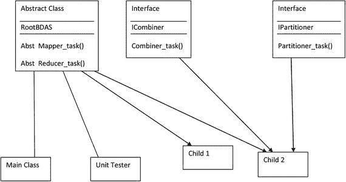
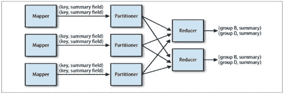
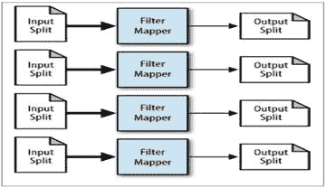
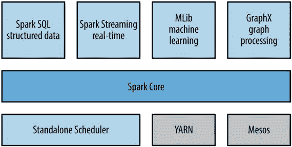
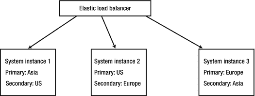

# 七、大规模分析

近几十年来，因为大数据，分析技术领域发生了革命性的变化。数据是从各种来源收集的，因此已经开发了在分布式环境中甚至实时分析这些数据的技术。

## 大数据

这场革命始于 Hadoop 框架的开发，它有两个主要组件，即 MapReduce 编程和 HDFS 文件系统。

### MapReduce 编程

MapReduce 是一种受函数式编程启发的编程风格，用于处理大量数据。程序员可以使用 MapReduce 代码处理大数据，而无需了解分布式环境的内部。在 MapReduce 之前，Condor 这样的框架是对分布式数据进行并行计算的。但是 MapReduce 的主要优势是它是基于 RPC 的。数据不会移动；相反，代码跳转到不同的机器来处理数据。在大数据的情况下，这是网络带宽和计算时间的巨大节省。

MapReduce 程序有两个主要组件:映射器和缩减器。在映射器中，输入被分成小单元。通常，输入文件的每一行都成为每个地图作业的输入。映射器处理输入，并向缩减器发出一个键-值对。reducer 接收特定键的所有值作为输入，并处理数据以最终输出。

以下伪代码是计算文档中单词频率的示例:

```py
map(String key, String value):
// key: document name
// value: document contents
for each word w in value:
EmitIntermediate(w, "1");

reduce(String key, Iterator values):
 // key: a word
 // values: a list of counts
int result = 0;
for each v in values:
result += ParseInt(v);
Emit(AsString(result));

```

### 分割函数

有时需要将特定的数据集发送给特定的 reduce 作业。分区函数解决了这个问题。例如，在前面的 MapReduce 示例中，假设用户希望输出按排序顺序存储。然后，他提到了 32 个字母的归约作业的编号 32，在从业者中，他为以 a 开头的键返回 1，为 b 返回 2，依此类推。然后，所有以相同字母开头的单词都进入相同的 reduce 作业。输出将存储在同一个输出文件中，因为 MapReduce 确保在给定的分区中，中间的键-值对以递增的键顺序进行处理，所以输出将按排序的顺序存储。

### 组合器功能

合并器是 MapReduce 中的一个工具，它在 map 阶段完成部分聚合。它不仅提高了性能，而且有时当数据集如此之大以至于 reducer 抛出堆栈溢出异常时，使用它是必不可少的。通常，reducer 和 combiner 逻辑是相同的，但是这可能是必要的，这取决于 MapReduce 如何处理输出。

为了实现这个字数统计示例，我们将遵循一个特定的设计模式。将有一个 RootBDAS (BDAS 代表大数据分析系统)类，它有两个抽象方法:一个映射器任务和一个缩减器任务。所有子类都实现这些映射器和缩减器任务。主类将使用反射创建子类的实例，并在 MapReduce 映射函数中调用实例的 mapper 任务和 reducer 任务的 reducer 函数。这种模式的主要优点是您可以对 MapReduce 功能进行单元测试，并且它是自适应的。任何新子类的添加都不需要主类或单元测试的任何改变。你只需要改变配置。一些代码可能需要实现合并器或分割器逻辑。它们必须继承 ICombiner 或 IPartitioner 接口。

图 [7-1](#Fig1) 显示了系统的类图。



图 7-1

The class diagram

下面是`RootBDAS`类:

```py
import java.util.ArrayList;
import java.util.HashMap;

/**
 *
 */

/**
 * @author SayanM
 *
 */
public abstract class RootBDAS {
       abstract  HashMap<String, ArrayList<String>>  mapper_task(String line);
       abstract  HashMap<String, ArrayList<String>>  reducer_task(String key, ArrayList<String> values);

}

```

下面是子类:

```py
import java.util.ArrayList;
import java.util.HashMap;

/**
 *
 */

/**
 * @author SayanM
 *
 */

public final class WordCounterBDAS extends RootBDAS{

       @Override
       HashMap<String, ArrayList<String>> mapper_task(String line) {
              // TODO Auto-generated method stub
              String[] words = line.split(" ");
              HashMap<String, ArrayList<String>> result = new HashMap<String, ArrayList<String>>();
              for(String w : words)
              {

                    if(result.containsKey(w))
                    {
                           ArrayList<String> vals = result.get(w);
                           vals.add("1");
                           result.put(w, vals);
                    }
                    else
                    {
                           ArrayList<String> vals = new ArrayList<String>();
                           vals.add("1");
                           result.put(w, vals);
                    }
              }
              return result;
       }

       @Override
       HashMap<String, ArrayList<String>> reducer_task(String key, ArrayList<String> values) {
              // TODO Auto-generated method stub
              HashMap<String, ArrayList<String>> result = new HashMap<String, ArrayList<String>>();
              ArrayList<String> tempres = new ArrayList<String>();
              tempres.add(values.size()+ "");
              result.put(key, tempres);
              return result;
       }

}

```

下面是`WordCounterBDAS`实用程序类:

```py
import java.util.ArrayList;
import java.util.HashMap;

/**
 *
 */

/**
 * @author SayanM
 *
 */

public final class WordCounterBDAS extends RootBDAS{

       @Override
       HashMap<String, ArrayList<String>> mapper_task(String line) {
              // TODO Auto-generated method stub
              String[] words = line.split(" ");
              HashMap<String, ArrayList<String>> result = new HashMap<String, ArrayList<String>>();
              for(String w : words)
              {
                    if(result.containsKey(w))
                    {
                           ArrayList<String> vals = result.get(w);
                           vals.add("1");
                           result.put(w, vals);
                    }
                    else
                    {
                           ArrayList<String> vals = new ArrayList<String>();
                           vals.add("1");
                           result.put(w, vals);
                     }
              }
              return result;
       }

       @Override
       HashMap<String, ArrayList<String>> reducer_task(String key, ArrayList<String> values) {
              // TODO Auto-generated method stub
       HashMap<String, ArrayList<String>> result = new HashMap<String, ArrayList<String>>();
              ArrayList<String> tempres = new ArrayList<String>();
              tempres.add(values.size()+ "");
              result.put(key, tempres);
              return result;
       }

}

```

下面是`MainBDAS`类:

```py
import java.io.IOException;
import java.util.ArrayList;
import java.util.HashMap;

import org.apache.hadoop.conf.Configuration;
import org.apache.hadoop.fs.Path;
import org.apache.hadoop.io.LongWritable;
import org.apache.hadoop.io.Text;
import org.apache.hadoop.mapreduce.Job;
import org.apache.hadoop.mapreduce.Mapper;
import org.apache.hadoop.mapreduce.Reducer;
import org.apache.hadoop.mapreduce.lib.input.FileInputFormat;
import org.apache.hadoop.mapreduce.lib.input.TextInputFormat;
import org.apache.hadoop.mapreduce.lib.output.FileOutputFormat;
import org.apache.hadoop.mapreduce.lib.output.TextOutputFormat;

/**
 *
 */

/**
 * @author SayanM
 *
 */
public class MainBDAS {

       public static class MapperBDAS extends Mapper<LongWritable, Text, Text, Text> {

              protected void map(LongWritable key, Text value, Context context)
                           throws IOException, InterruptedException {
                     String classname = context.getConfiguration().get("classname");

                     try {
                           RootBDAS instance = (RootBDAS) Class.forName(classname).getConstructor().newInstance();
                           String line = value.toString();
                           HashMap<String, ArrayList<String>> result = instance.mapper_task(line);
                           for(String k : result.keySet())
                           {
                                  for(String v : result.get(k))
                                  {
                                        context.write(new Text(k), new Text(v));
                                  }
                           }
                     } catch (Exception e) {
                           // TODO Auto-generated catch block
                           e.printStackTrace();
                    }

                    }

       }

       public static class ReducerBDAS extendsReducer<Text, Text, Text, Text> {

              protected void reduce(Text key, Iterable<Text> values,
                           Context context) throws IOException, InterruptedException {
                    String classname = context.getConfiguration().get("classname");

                    try {
                           RootBDAS instance = (RootBDAS) Class.forName(classname).getConstructor().newInstance();
                           ArrayList<String> vals = new ArrayList<String>();
                           for(Text v : values)
                           {
                                  vals.add(v.toString());
                           }
                           HashMap<String, ArrayList<String>> result = instance.reducer_task(key.toString(), vals);
                           for(String k : result.keySet())
                           {
                                  for(String v : result.get(k))
                                  {
                                         context.write(new Text(k), new Text(v));
                                  }
                           }
                     } catch (Exception e) {
                           // TODO Auto-generated catch block
                           e.printStackTrace();
                     }

              }

       }

       public static void main(String[] args) throws Exception {
              // TODO Auto-generated method stub

           String classname = Utility.getClassName(Utility.configpath);

              Configuration con = new Configuration();
              con.set("classname", classname);

              Job job = new Job(con);

              job.setJarByClass(MainBDAS.class);
              job.setJobName("MapReduceBDAS");

              job.setOutputKeyClass(Text.class);
              job.setOutputValueClass(Text.class);

              job.setInputFormatClass(TextInputFormat.class);
              job.setOutputFormatClass(TextOutputFormat.class);

              FileInputFormat.setInputPaths(job, new Path(args[0]));
              FileOutputFormat.setOutputPath(job, new Path(args[1]));
              job.setMapperClass(MapperBDAS.class);
              job.setReducerClass(ReducerBDAS.class);

              System.out.println(job.waitForCompletion(true));

        }

}

```

为了测试这个例子，你可以使用这个单元测试类:

```py
import static org.junit.Assert.*;

import java.util.ArrayList;
import java.util.HashMap;

import org.junit.Test;

public class testBDAS {

       @Test
       public void testMapper() throws Exception{
              String classname = Utility.getClassName(Utility.testconfigpath);
              RootBDAS instance = (RootBDAS) Class.forName(classname).getConstructor().newInstance();
              String line = Utility.getMapperInput(Utility.testconfigpath);
              HashMap<String, ArrayList<String>> actualresult = instance.mapper_task(line);
              HashMap<String, ArrayList<String>> expectedresult = Utility.getMapOutput(Utility.testconfigpath);

              for(String key : actualresult.keySet())
              {
                    boolean haskey = expectedresult.containsKey(key);
                    assertEquals(true, haskey);
                    ArrayList<String> actvals = actualresult.get(key);
                    for(String v : actvals)
                    {
                           boolean hasval = expectedresult.get(key).contains(v);
                           assertEquals(true, hasval);
                    }
              }

       }

       @Test
       public void testReducer(){
              fail();

       }

}

```

最后，这里是界面:

```py
import java.util.ArrayList;
import java.util.HashMap;

public interface ICombiner {
       HashMap<String, ArrayList<String>>  combiner_task(String key, ArrayList<String> values);

}

public interface IPartitioner {

       public int  partitioner_task(String line);

}

```

### HDFS 文件系统

除了 MapReduce，HDFS 是 Hadoop 框架中的第二个组件。它旨在为通用低成本硬件处理分布式环境中的大数据。HDFS 构建在 Unix POSSIX 文件系统之上，并做了一些修改，目标是处理流数据。

Hadoop 集群由两种类型的主机组成:名称节点和数据节点。name 节点存储元数据，控制执行，并充当集群的主节点。数据节点负责实际执行；它就像一个从机，执行由名称节点发送的指令。

### MapReduce 设计模式

MapReduce 是处理驻留在数百台计算机中的数据的原型。MapReduce 编程中有一些常见的设计模式。

#### 总结模式

总之，reducer 为每个键创建摘要(参见图 [7-2](#Fig2) )。如果您想要对数据进行排序或出于任何其他目的，可以使用该从业者。字数统计是 summarizer 模式的一个例子。此模式可用于查找数据的最小值、最大值和计数，或者查找平均值、中值和标准偏差。



图 7-2

Details of the summarization pattern

#### 过滤模式

在 MapReduce 中，过滤是以分而治之的方式完成的(图 [7-3](#Fig3) )。每个映射器作业过滤一个数据子集，reducer 聚合过滤后的子集并生成最终输出。生成前 N 条记录、搜索数据和采样数据是过滤模式的常见用例。



图 7-3

Details of the filtering pattern

#### 连接模式

在 MapReduce 中，可以在地图端或 Reduce 端进行连接(图 [7-4](#Fig4) )。对于地图端，将要连接的连接数据集应该存在于同一个簇中；否则，需要缩减端连接。该联接可以是外部联接、内部联接或反联接。


图 7-4

Details of the join pattern

以下代码是减速器端联接的一个示例:

```py
package MapreduceJoin;

import java.io.IOException;
import java.util.ArrayList;
import java.util.Iterator;

import org.apache.hadoop.fs.Path;
import org.apache.hadoop.io.LongWritable;
import org.apache.hadoop.io.Text;
import org.apache.hadoop.mapred.JobConf;
import org.apache.hadoop.mapred.MapReduceBase;
import org.apache.hadoop.mapred.OutputCollector;
import org.apache.hadoop.mapred.Reporter;
import org.apache.hadoop.mapred.lib.MultipleInputs;
import org.apache.hadoop.mapreduce.Job;
import org.apache.hadoop.mapred.Mapper;
import org.apache.hadoop.mapred.Reducer;
import org.apache.hadoop.mapreduce.lib.output.FileOutputFormat;
import org.apache.hadoop.mapred.TextInputFormat;

@SuppressWarnings("deprecation")
public class MapreduceJoin {

////////////////////////////////////////////////////////

       @SuppressWarnings("deprecation")
       public static class JoinReducer extends MapReduceBase implements Reducer<Text, Text, Text, Text>
       {
              public void reduce(Text key, Iterator<Text> values, OutputCollector<Text, Text> output, Reporter reporter) throws IOException
              {
                     ArrayList<String> translist = new ArrayList<String>();
                     String secondvalue = "";
                     while (values.hasNext())
                     {

                           String currValue = values.next().toString().trim();
                           if(currValue.contains("trans:")){
                                   String[] temp = currValue.split("trans:");
                                   if(temp.length > 1)
                                         translist.add(temp[1]);
                            }
                            if(currValue.contains("sec:"))
                            {
                                   String[] temp = currValue.split("sec:");
                                   if(temp.length > 1)
                                          secondvalue = temp[1];
                             }
                      }

                      for(String trans : translist)
                      {
                            output.collect(key, new Text(trans +'\t' + secondvalue));
                     }
               }
       }

       ////////////////////////////////////////////////////////

       @SuppressWarnings("deprecation")
       public static class TransactionMapper extends MapReduceBase implements Mapper<LongWritable, Text, Text, Text>
       {
             int index1 = 0;
             public void configure(JobConf job) {
                    index1 = Integer.parseInt(job.get("index1"));

             }

             public void map(LongWritable key, Text value, OutputCollector<Text, Text> output, Reporter reporter) throws IOException
              {
                    String line = value.toString().trim();
                    if(line=="") return;
               String splitarray[] = line.split("\t");
               String id = splitarray[index1].trim();
               String ids = "trans:" + line;
               output.collect(new Text(id), new Text(ids));

             }
       }

       ////////////////////////////////////////////////////////

       @SuppressWarnings("deprecation")
       public static class SecondaryMapper extends MapReduceBase implements Mapper<LongWritable, Text, Text, Text>
       {
             int index2 = 0;
             public void configure(JobConf job) {
                    index2 = Integer.parseInt(job.get("index2"));

             }

             public void map(LongWritable key, Text value, OutputCollector<Text, Text> output, Reporter reporter) throws IOException
             {
                    String line = value.toString().trim();
                    if(line=="") return;
               String splitarray[] = line.split("\t");
               String id = splitarray[index2].trim();
               String ids = "sec:" + line;
               output.collect(new Text(id), new Text(ids));
             }

       }

   ////////////////////////////////////////////////////////////

       @SuppressWarnings({ "deprecation", "rawtypes", "unchecked" })
       public static void main(String[] args) throws IOException, ClassNotFoundException, InterruptedException {
              // TODO Auto-generated method stub

              JobConf conf = new JobConf();
              conf.set("index1", args[3]);
              conf.set("index2", args[4]);
              conf.setReducerClass(JoinReducer.class);

              MultipleInputs.addInputPath(conf, new Path(args[0]), TextInputFormat.class, (Class<? extends org.apache.hadoop.mapred.Mapper>) TransactionMapper.class);
              MultipleInputs.addInputPath(conf, new Path(args[1]), TextInputFormat.class, (Class<? extends org.apache.hadoop.mapred.Mapper>) SecondaryMapper.class);
              Job job = new Job(conf);
              job.setJarByClass(MapreduceJoin.class);
              job.setJobName("MapReduceJoin");

              job.setOutputKeyClass(Text.class);
              job.setOutputValueClass(Text.class);

              FileOutputFormat.setOutputPath(job, new Path(args[2]));

              System.out.println(job.waitForCompletion(true));

       }

}

```

## Spark

继 Hadoop 之后，Spark 是大数据技术的下一次也是最新的革命。Spark 的主要优势在于它为整个大数据堆栈提供了一个统一的接口。以前，如果你需要一个类似 SQL 的大数据接口，你会使用 Hive。如果你需要实时数据处理，你可以使用 Storm。如果你想建立一个机器学习模型，你可以使用 Mahout。Spark 将所有这些设施集中在一起。此外，它还支持大数据的内存计算，这使得处理速度非常快。图 [7-5](#Fig5) 描述了 Spark 的所有组件。



图 7-5

The components of Spark

Spark 芯是 Spark 的基本部件。它可以运行在 Hadoop 之上，也可以独立运行。它将数据集抽象为弹性分布式数据集(RDD)。RDD 是只读对象的集合。因为它是只读的，所以当它与多个并行操作共享时，不会有任何同步问题。RDD 的操作是懒惰的。在 RDD 有两种类型的行动:转变和行动。在转换中，数据集上没有执行。Spark 只将操作序列存储为一个称为世系的有向无环图。当一个动作被调用时，实际的执行就发生了。第一次执行后，结果被缓存在内存中。因此，当一个新的执行被调用时，Spark 遍历谱系图并最大限度地重用之前的计算，新操作的计算变成最小。这使得数据处理非常快，也使得数据容错。如果任何节点出现故障，Spark 会查看该节点中数据的沿袭图，并轻松地再现它。

Hadoop 框架的一个限制是它在并行计算中没有任何消息传递接口。但是在一些用例中，并行作业需要相互通信。Spark 使用两种共享变量来实现这一点。它们是广播变量和累加器。当一个作业需要向所有其他作业发送消息时，该作业使用 broadcast 变量，当多个作业想要将它们的结果聚合到一个位置时，它们使用累加器。RDD 将其数据集分割成一个称为分区的单元。Spark 提供了一个接口来指定数据的分区，这对于像 join 或 find 这样的未来操作非常有效。用户可以在 Spark 中指定分区的存储类型。Spark 有 Python、Java 和 Scala 的编程接口。以下代码是 Spark 中字数统计程序的示例:

```py
val conf = new SparkConf().setAppName("wiki_test") // create a spark config object
val sc = new SparkContext(conf) // Create a spark context
val data = sc.textFile("/path/to/somedir") // Read files from "somedir" into an RDD of (filename, content) pairs.
val tokens = data.flatMap(_.split(" ")) // Split each file into a list of tokens (words).
val wordFreq = tokens.map((_, 1)).reduceByKey(_ + _) // Add a count of one to each token, then sum the counts per word type.
wordFreq.sortBy(s => -s._2).map(x => (x._2, x._1)).top(10) // Get the top 10 words. Swap word and count to sort by count.

```

在 Spark 核心之上，Spark 提供了以下功能:

*   Spark SQL，这是一个通过命令行或数据库连接器接口的 SQL 接口。它还为 Spark 数据框对象提供了 SQL 接口。
*   Spark Streaming，使您能够实时处理流数据。
*   MLib 是一个机器学习库，用于在 Spark 数据上构建分析模型。
*   分布式图形处理框架 GraphX。

## 云中的分析

像许多其他领域一样，分析正在受到云的影响。它受到两方面的影响。大型云提供商正在不断发布机器学习 API。因此，开发人员可以轻松编写机器学习应用程序，而不必担心底层算法。例如，Google 为计算机视觉、自然语言、语音处理等提供了 API。用户可以很容易地编写代码，用两行或三行代码就可以给出人脸或声音图像的情感。

云的第二个方面是在数据工程部分。在第 [1](1.html) 章中，我给出了一个如何使用 Falcon 将模型公开为高性能 REST API 的例子。现在，如果有一百万用户要使用它，并且负载变化很大，那么 autoscale 就是该应用程序的一个必需特性。如果在 Google App Engine 或 AWS Lambda 中部署应用，15 分钟就可以实现自动缩放功能。一旦应用程序被自动缩放，您需要考虑数据库。Amazon 的 DynamoDB 和 Google 的 Cloud Datastore 是云中的自动缩放数据库。如果您使用其中一个，您的应用程序现在是高性能和自动扩展的，但全球各地的人都将访问它，因此地理距离将产生额外的延迟或对性能的负面影响。您还必须确保您的应用程序始终可用。此外，您需要在三个地区部署您的应用程序:欧洲、亚洲和美国(如果预算允许，您可以选择更多的地区)。如果您使用带有地理平衡路由规则的弹性负载平衡器，将流量从一个地区路由到该地区的应用引擎，则它将在全球可用。在地理平衡中，您可以为每个规则提及一个辅助应用程序引擎，这使得您的应用程序高度可用。如果一个主要应用程序引擎关闭，辅助应用程序引擎将会处理这些事情。

图 [7-6](#Fig6) 描述了该系统。



图 7-6

The system

在第 [1](1.html) 章中，我展示了一些将深度学习模型发布为 REST API 的示例代码。以下代码是相同逻辑在云环境中的实现，其中其他存储由 Google 数据存储代替:

```py
import falcon
from falcon_cors import CORS
import json
import pygeoip
import json
import datetime as dt
import ipaddress
import math
from concurrent.futures import *
import numpy as np
from google.cloud import datastore

def logit(x):
       return (np.exp(x) / (1 + np.exp(x)))

def is_visible(client_size, ad_position):
        y=height=0
        try:
                height  = int(client_size.split(',')[1])
                y = int(ad_position.split(',')[1])
        except:
                pass
        if y < height:
                return "1"
        else:
                return "0"

class Predictor(object):
       def __init__(self,domain,is_big):
              self.client = datastore.Client('sulvo-east')
              self.ctr = 'ctr_' + domain
              self.ip = "ip_" + domain
              self.scores = "score_num_" + domain
              self.probabilities = "probability_num_" + domain
              if is_big:

                    self.is_big = "is_big_num_" + domain
                    self.scores_big = "score_big_num_" + domain
                    self.probabilities_big = "probability_big_num_" + domain
              self.gi = pygeoip.GeoIP('GeoIP.dat')
              self.big = is_big
              self.domain = domain

       def get_hour(self,timestamp):
              return dt.datetime.utcfromtimestamp(timestamp / 1e3).hour

       def fetch_score(self, featurename, featurevalue, kind):
              pred = 0
              try:
                     key = self.client.key(kind,featurename + "_" + featurevalue)
                     res= self.client.get(key)
                     if res is not None:
                           pred = res['score']
              except:
                     pass
              return pred

       def get_score(self, featurename, featurevalue):
              with ThreadPoolExecutor(max_workers=5) as pool:
                        future_score = pool.submit(self.fetch_score,featurename, featurevalue,self.scores)
                    future_prob = pool.submit(self.fetch_score,featurename, featurevalue,self.probabilities)
                    if self.big:
                           future_howbig = pool.submit(self.fetch_score,featurename, featurevalue,self.is_big)

                           future_predbig = pool.submit(self.fetch_score,featurename, featurevalue,self.scores_big)
                           future_probbig = pool.submit(self.fetch_score,featurename, featurevalue,self.probabilities_big)
                    pred = future_score.result()
                    prob = future_prob.result()
                    if not self.big:
                           return pred, prob
                    howbig = future_howbig.result()
                    pred_big = future_predbig.result()
                    prob_big = future_probbig.result()
                    return howbig, pred, prob, pred_big, prob_big

       def get_value(self, f, value):
             if f == 'visible':
                    fields = value.split("_")
                    value = is_visible(fields[0], fields[1])
                    if f == 'ip':
                    ip = str(ipaddress.IPv4Address(ipaddress.ip_address(value)))
                        geo = self.gi.country_name_by_addr(ip)
                    if self.big:
                           howbig1,pred1, prob1, pred_big1, prob_big1 = self.get_score('geo', geo)
                    else:
                           pred1, prob1 = self.get_score('geo', geo)
                    freq = '1'
                    key = self.client.key(self.ip,ip)
                    res = self.client.get(key)
                    if res is not None:
                            freq = res['ip']
                    if self.big:
                           howbig2, pred2, prob2, pred_big2, prob_big2 = self.get_score('frequency', freq)
                    else:
                           pred2, prob2 =  self.get_score('frequency', freq)
                    if self.big:
                           return (howbig1 + howbig2), (pred1 + pred2), (prob1 + prob2), (pred_big1 + pred_big2), (prob_big1 + prob_big2)
                    else:
                           return (pred1 + pred2), (prob1 + prob2)
              if f == 'root':
                    try:

                           res = client.get('root', value)
                           if res is not None:
                                  ctr = res['ctr']
                                  avt = res['avt']
                                  avv = res['avv']
                                  if self.big:
                                     (howbig1,pred1,prob1,pred_big1,prob_big1) = self.get_score('ctr', str(ctr))
                                     (howbig2,pred2,prob2,pred_big2,prob_big2) = self.get_score('avt', str(avt))
                                     (howbig3,pred3,prob3,pred_big3,prob_big3) = self.get_score('avv', str(avv))
                                     (howbig4,pred4,prob4,pred_big4,prob_big4) = self.get_score(f, value)
                                  else:
                                    (pred1,prob1) = self.get_score('ctr', str(ctr))
                                    (pred2,prob2) = self.get_score('avt', str(avt))
                                    (pred3,prob3) = self.get_score('avv', str(avv))
                                    (pred4,prob4) = self.get_score(f, value)
                           if self.big:
                                  return (howbig1 + howbig2 + howbig3 + howbig4), (pred1 + pred2 + pred3 + pred4), (prob1 + prob2 + prob3 + prob4),(pred_big1 + pred_big2 + pred_big3 + pred_big4),(prob_big1 + prob_big2 + prob_big3 + prob_big4)
                           else:
                                  return (pred1 + pred2 + pred3 + pred4), (prob1 + prob2 + prob3 + prob4)
                     except:
                           return 0,0
                if f == 'client_time':
                   value = str(self.get_hour(int(value)))
              return self.get_score(f, value)

       def get_multiplier(self):
              key = self.client.key('multiplier_all_num', self.domain)
                res = self.client.get(key)
                high = res['high']
                low = res['low']
             if self.big:

                            key = self.client.key('multiplier_all_num', self.domain + "_big")
                    res = self.client.get(key)
                    high_big = res['high']
                    low_big = res['low']
                    return high, low, high_big, low_big
             return high, low

       def on_post(self, req, resp):
             if True:
                    input_json = json.loads(req.stream.read(),encoding='utf-8')
                    input_json['visible'] = input_json['client_size'] + "_" + input_json['ad_position']
                    del input_json['client_size']
                    del input_json['ad_position']
                    howbig = 0
                    pred = 0
                    prob = 0
                    pred_big = 0
                    prob_big = 0
                    worker = ThreadPoolExecutor(max_workers=1)
                    thread = worker.submit(self.get_multiplier)
                    with ThreadPoolExecutor(max_workers=8) as pool:
                           future_array = { pool.submit(self.get_value,f,input_json[f]) : f for f in input_json}
                           for future in as_completed(future_array):
                                  if self.big:
                                         howbig1, pred1, prob1,pred_big1,prob_big1 = future.result()

                                         pred = pred + pred1
                                         pred_big = pred_big + pred_big1
                                         prob = prob + prob1
                                         prob_big = prob_big + prob_big1
                                         howbig = howbig + howbig
                                  else:
                                         pred1, prob1 = future.result()
                                         pred = pred + pred1
                                         prob = prob + prob1

                    if self.big:
                           if howbig > .65:
                                  pred, prob = pred_big, prob_big

                    resp.status = falcon.HTTP_200

                      res = math.exp(pred)-1
                    if res < 0.1:
                           res = 0.1
                    if prob < 0.1 :
                           prob = 0.1
                    if prob > 0.9:
                           prob = 0.9

                    if self.big:
                           high, low, high_big, low_big = thread.result()
                           if howbig > 0.6:
                                  high = high_big
                                  low = low_big
                    else:
                           high, low = thread.result()

                    multiplier = low + (high -low)*prob
                    res = multiplier*res
                    resp.body = str(res)
              #except Exception,e:
              #     print(str(e))

              #     resp.status = falcon.HTTP_200
              #     resp.body = str("0.1")

cors = CORS(allow_all_origins=True,allow_all_methods=True,allow_all_headers=True)  
wsgi_app = api = falcon.API(middleware=[cors.middleware])

f = open('publishers2.list_test')
for line in f:
       if "#" not in line:
             fields = line.strip().split('\t')
             domain = fields[0].strip()
             big = (fields[1].strip() == '1')
             p = Predictor(domain, big)
             url = '/predict/' + domain
             api.add_route(url, p)
f.close()

```

您可以通过以下方式在 Google App Engine 中部署此应用程序:

```py
gcloud app deploy --prject <prject id>  --version <version no>

```

## 物联网

物联网只是嵌入了传感器、软件、网络连接和必要电子设备的互联事物/设备的网络，使它们能够收集和交换数据，使它们能够响应。随着大数据、实时分析框架、移动通信和智能可编程设备等技术的兴起，该领域正在崛起。在物联网中，您可以使用整本书中介绍的技术在服务器端进行数据分析；您还可以使用 Raspberry Pi 将逻辑放在设备端，Raspberry Pi 是 Python 的嵌入式系统版本。