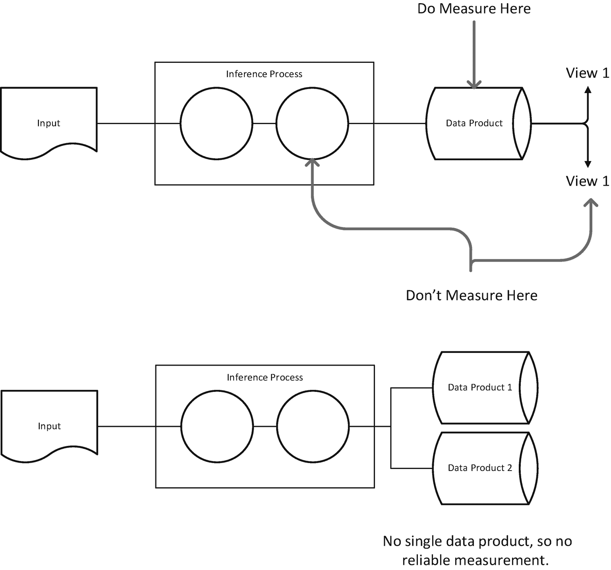

# 九、卓越的技术

> ***持续关注*** *到* ***技术卓越*******好的设计增强敏捷性*** *。—agilemanifesto.org/principles**

 *当我们想到敏捷性时，我们想到的是运动的效率和面对复杂多变的地形改变方向的能力，所有这些都是为了追求一个特定的目标。尤塞恩·博尔特 9.58 秒跑完 100 米令人印象深刻，但这并不是敏捷的表现。另一方面，莱昂内尔·梅西(Lionel Messi)则更像是在防守队员的格子间穿梭，同时让足球始终处于他的影响之下。敏捷当然需要快速的移动，但也需要让我们不分心的行为(梅西不会不系鞋带就走进球场)；它需要机动性或灵活性，以操纵环境或改变路线，同时保持稳定；它需要意识和头脑的存在，以实时阅读不断变化的地形和环境，以预测和调整，而不会错过任何一步。

许多开发人员混淆了快速进步的愿望和敏捷的基础。敏捷性是复合效率。这是流程和人员网络中低层次交互的影响。工程师所做的大部分工作应该会产生乘数回报。您编写了一个测试，您为每个使用您的代码的开发人员节省了在下游系统中调试复杂错误的时间；您自动化了部署，并且将发布更新所需的时间减少了一个数量级；您支持持续集成，并为克隆您代码的每个人省去调试构建过程中的无数麻烦；你投资设计，开发者会把你的系统用在你想象不到的应用上。

当它不直接在运输代码的路径上时，可能很难花费时间和精力投资于效率。当我们可以在几个小时内复制和粘贴数据时，为什么要构建标注工具呢？当测试明显有效并且我可以进入下一个任务时，为什么还要写测试呢？我们认识到，这里有一个信念的飞跃——如果你没有被偷工减料的负面影响咬过，也没有体验过你的文化中内置的效率优势，那就很难实现这个飞跃。

在这一章中，我们将考察一些场景，在这些场景中，对技术优势和良好设计的关注将帮助您建立一种高效、持续开发和交付数据项目的文化。我们将首先说服您，质量投资有利于敏捷性，然后我们将讨论质量投资对数据项目意味着什么。在我们做之前，先说一句*持续关注*。这个术语实际上是一个信号，表明需要工作、专注，而不是一点点哄骗来让团队改进这些行为。作为一名领导者，你必须想办法向你的团队证明这些确实是好事情。作为一名开发人员，你必须保持开放的心态，并愿意投资一些前期会让你付出代价，但最终会给你和你的团队带来回报的东西。

## 敏捷的软件工程实践

思考敏捷团队的一种方式是通过*开发人员生产力*的概念。你实现的每一个工具、行为和过程都应该主要关注于让每个人都有效率。当然，生产力是不够的——它需要被关注和指导，但是我们发现“为开发人员生产力优化”这句箴言作为一般的指导是简洁而有效的。如果你的团队不能从根本上高效地完成工作，那么，你永远不会成功。如果你在管理一个团队，你会希望不断地弄清楚你是否在支持和投资你的团队完成工作的能力。

当敏捷宣言原则谈到技术卓越的作用时，它是在阐述工程学科的一个核心真理:所有的行动和决策都通过团队和产品产生网络效应。好的行动是那些通过网络级联产生积极乘数效应的行动。一个好的 API 设计让开发者在上面构建更容易、更安全；好的计划更容易达成目标。

让我们从单元测试的角度来考虑这些网络效应——这是一般软件工程技术卓越的一个很好的例子。单元测试不仅有助于个人的生产力，也有助于整个团队以及合作伙伴和协作者的生产力。当编写代码时，从测试开始(即，实践测试驱动的开发)使开发人员能够清楚地了解要计算的函数的确切性质。有那么一个时刻，任何不清晰的地方都会被团队中的其他人或客户发现。开发者可以首先考虑成功是什么样子的。编写代码就变成了满足测试的一种练习。这将工作模块化——测试成为需求的表现。然后提交代码进行某种形式的审查。审查者可以查看测试，并了解该功能应该做什么(他们还将审查测试，以确保它是有意义和有用的)。代码一旦签入，就可能被其他开发人员使用、扩展或修改。因为测试已经就绪，开发人员可以确保使用代码的其他人受到保护(如果他们的测试失败，那么一定是出了问题，函数的语义不再完整)。测试投资对开发人员、代码审查人员、直接团队和合作伙伴团队来说是有回报的。

乐趣不止于此——如果测试被接受，那就意味着代码是为测试而设计的。如果代码是为测试而设计的，那么计算单元应该保持小规模和模块化——使它们对评审人员和维护人员来说是可理解的；测试可以增强面向对象编程的抽象和封装；当涉及到重构时，一组内置的测试将有助于保证代码可能已经改变，但功能仍然保留。

你有时会听到人们说“是的，但是你仍然可以写出糟糕的测试”或者“测试给人一种错误的安全感。”这就好比说，仅仅因为攀岩者系上了安全带，他们仍然可能会摔倒。事实证明，攀岩者有充分的动机通过测试来确保他们的安全设备工作——软件工程师也应该有动机通过测试来确保他们的代码工作。编写好的测试，就像编写好的代码一样，是一种技能。那些接受它的人将发展这种技能，并帮助他们的同龄人提高。

我们可以通过卓越的技术看到积极的网络效应的其他领域包括:

*   持续集成:当一个变更被提交评审时，它也应该触发一个构建。这个构建应该包括运行存储库中的所有测试。这使得团队可以免费获得关于明显缺陷的即时反馈。持续集成是 Azure DevOps 的标准功能。

*   按钮式部署:当您的代码被部署到许多目标(一个生产服务、测试工具、应用)时，如果每个步骤都是手工的，那么发布会是一件乏味的事情。每当团队面临平凡的任务时，他们会找到其他事情去做。结果是不一致且容易出错的发布——您的测试工具与当前运行在生产环境中的代码版本不同。为您的团队提供一个自动化整个事情(包括验证测试)的按钮是一个巨大的胜利。

*   代码保健:实践良好代码保健的团队避免复制代码，投资打包，避免签入二进制文件，避免签入自动生成的类，一致地遵循编码风格指南，编写注释，等等。这些好处中的许多都有前期成本，但一旦你开始从结果中受益，首期付款就很少了。

这些技术将在第 [3](03.html) 章“连续交付”中详细讨论。总之，通用软件开发中的技术优势有助于通过消除摩擦点来最大化开发人员的生产力。

原则 9 的第二条提出了好的设计。技术上的卓越也许很容易开处方。但是什么是好的设计呢？关于这个主题已经写了很多，通常被提炼为不同的原则或原则组:固体原则(归功于罗伯特·马丁)、亲吻原则(归功于美国海军)和爱因斯坦原则(“一切都应该尽可能简单，但不能更简单”)。这些通常由过程指导原则来补充，例如构建一个零特性版本(ZFR)或者建立一个最小可行产品(MVP)。根据我们的经验，建立团队对某些工程实践的态度真的很有帮助。

首先是对编程语言的态度。一方面，您可以修改语言，以便所有开发人员共享一个公共的参考点。这使得代码审查、测试和协作更加容易。另一个极端是语言的完全灵活性。这样可以更好地为工作选择合适的工具，但缺点是不太集中专业知识。在 Bing 的本地数据团队中，我们通常决定坚持面向对象编程，特别是使用 C#，同时利用其他系统编写脚本和一些非生产代码。面向对象编程提供了一个引人注目的框架，它足够灵活，可以对数据和流程进行建模，但是通过一些训练，它可以被限制得足够多，以帮助通过良好建立的模式来指导设计。面向对象设计的核心原则是抽象、封装、继承和多态。每个设计和代码评审都可以检查这些原则，团队可以将它们作为讨论的框架来共享。还有其他的选择可以考虑——函数式编程正处于上升期，像 Python 所支持的那些不太结构化的编码风格正在流行。

第二是团队对设计的态度。在我们的 web 挖掘团队中，我们开发了一个表达式*代码评审不是设计评审，除非它是*。这意味着，如果你不为你的特性运行设计评审，那么你将受到评审者的支配，他们可能不是因为代码质量问题，而是因为设计质量问题而阻碍代码评审。

第三是致力于具体的运作模式。这类似于团队对编程语言的态度，但涉及到围绕分布式计算和存储的选择，并且在很大程度上取决于您工作的系统环境。例如，如果您的公司已经围绕 MapReduce 构建了一个大型的专有基础设施，那么您很可能会按照该范例进行设计。另一方面，如果你发现自己处在一个面向服务的文化中，那么你的解决方案就会大不相同。虽然一种方法可能比另一种更好，但有两件事要记住。首先，确保你的核心计算资产建立在不依赖于操作范例的库中；其次，将操作范例的优化与核心功能的优化隔离开来。这将允许您在不可避免的切换发生时保持灵活性，而不会产生任何显著的前期成本。

### 开放但承诺

关于编码和平台有几乎无限多的选择，优秀的开发人员和管理人员需要了解这个空间的发展。然而，如果团队想要有交付的希望，就需要决策和承诺。不接受这些选择是不可接受的——事实上，技术领导和经理应该不断探索和保持更新；但是不断地改变可能更好的东西也是鲁莽的。项目的开始是回顾选项和实验的好时机，架构模块化和决策延期是帮助团队保持开放的好实践。

## 数据项目的卓越技术

考虑到开发人员的生产力和好的(和坏的)贡献的网络效应，我们对技术卓越对于软件工程的作用有了一个总体的概念。这如何转化为数据项目的数据方面？我们对网络效应的讨论解释了为什么卓越的技术是重要的。在数据项目方面，与“优化开发人员生产力”平行的是“最大化数据资产的价值”我们来分析一下。

随着数据项目的进展，我们会生成许多数据资产。这些包括模式、样本、标记数据、模型、分析(例如，模型在测试集上的性能)、比较等等。数据的价值可以从两个方面来考虑:即时价值和长期价值。直接价值是它被创建的原因——它解决了一个问题，提供了知识，或者以某种方式推进了项目。例如，一个带标签的数据集通过允许我们训练一个模型来提供价值，如果这个模型可以被接受，那么它就可以被运送到生产中。然而，长期价值是我们后来从数据中获得的价值。这可能是有计划的，也可能是无计划的。计划的长期价值可以是，例如，一个度量标准的基础事实数据集的连续使用。计划外的长期价值描述的是我们得到的意想不到的价值。例如，当使用新的测试集(旧模型创建时不可用的测试集)运行与新方法的比较时，我们可能会从旧模型中受益。我们可能希望应用一种新的方法来清理旧标签集的标签，看看它是否改进了最初生成的模型。在我们用来处理和检查数据的系统和工具中也可以发现价值，例如，采样脚本、定制标签和数据浏览工具以及数据清理工作流。

也许令人惊讶的是，数据项目在确保计划的数据长期价值方面投资不足是很常见的，更不用说投资于潜在的计划外价值了。

### 你衡量什么，你就是什么

如果您正在处理一个相当有趣的问题，您可能有一个管道或其他形式的包含几个阶段的流程工作流。可以在管道中的多个点收集数据。谈到衡量标准，重要的是你要清楚你在衡量什么。如果您报告的是合作伙伴或客户团队将依赖的官方指标，这一点尤其正确。重要的是你要清楚你的数据产品是什么，并且你要测量它。

离线数据管道的一个常见模型，也是我们为 Bing 的本地搜索产品所采用的模型，是交付一个 XML 产品。使用 XML 是因为它的普遍性(任何平台都可以使用它)、它的标准(关于什么是正确的 XML 几乎没有歧义)以及它合理的可读性。 [2](#Fn2) 这种 XML 格式是我们采样的格式，也是我们的测量系统中使用的格式。许多系统用户需要不同格式的数据——尤其是那些对空间(XML 很冗长)和计算性能有明确要求的用户。对于这些客户，要么他们自己编写数据转换，要么我们提供数据转换。这个最终的序列化是可以严格测试的，以确保它不会以任何方式破坏您基于生产指标所做的声明。这意味着测量系统从系统中明确定义的瓶颈点提取数据，所有数据视图都是从这个瓶颈点发出的。

通过此设置，您还可以构建验证过程，该过程将数据产品输出作为任何输入，并验证您可能提供给用户的其他版本的数据。例如，您可以获取 XML 文档的字段，并查看它们是否保留在节省空间的二进制序列化中。

有很多原因可以让你对你的数据有不同的看法。由于您的架构，在瓶颈阶段写入数据之前获取数据可能更简单；用户消费数据的形式可能与现有的测量管道不太匹配。这可能是因为输出格式已经改变，而您构建的测量系统使用的是传统格式，它缺乏重新定位到新格式的灵活性。不管是什么原因，你都应该不惜一切代价抵制这种诱惑。如果您做了除了度量一个定义良好的产品之外的任何事情，您就要冒转换的风险，这会引入一些变更，导致您的度量不正确。图 [9-1](#Fig1) 说明了这些不同的测量场景。

图 9-1

衡量这个，而不是那个——在上图中，系统产生了一个单一的数据产品，这是衡量质量的一个可靠的地方。质量不应在数据产品之前的阶段进行衡量，也不应从数据产品的不同的、客户特定的角度进行衡量。在下图中，产生了两个不同的数据产品，没有单一的伪像，因此无法进行可靠的测量。

### 避免无意的变换 [3](#Fn3)

当数据通过系统时，会经历一次或多次转换。顾名思义，有意的转换正是您希望系统执行的转换。他们在增加价值。无意的转换是那些对数据有实质性影响的转换，这些数据要么是未知的，要么是你的假设不成立的。这些可能发生在任何地方，但是最常见的两个是数据序列化和数据标记。当我们序列化数据时，我们必须将其从内存格式转换为磁盘(或流)格式。如果我们不注意，那么错误可能会在这里蔓延——编码错误(对于文本数据)、数据结构丢失(例如，将树结构变成顺序形式)、降低颜色深度(对于图像)等等。

当我们标记数据时，我们需要以某种方式显示给用户。这可能涉及某种形式的序列化，但转换也可能发生在贴标工具甚至贴标机使用的显示设备中。标注 web 数据就是因为这个问题而臭名昭著。当浏览器从 URL 下载字节、应用相关联的 CSS 样式并运行页面上出现的任何 JavaScript 时，就会为用户呈现 Web 页面。所有这些都会极大地改变数据，因此当我们保存 web 数据时，我们必须竭尽全力确保它以一种允许以后准确查看的格式保存。

思考这个问题的另一种方式是理解你的数据产品应该主要是为你而不是你的客户设计的。考虑到我们都关注客户，这听起来可能有些违反直觉。客户消费的是数据产品的特定视图和序列化。您的数据产品需要考虑开发团队的需求——将数据产品转化为适合客户的产品应该是最后一步，简单且经过充分测试。因此，卓越的衡量意味着衡量你生产的产品，并确保下游最后一英里的序列化不会改变你的数据。

我们已经讨论了系统输出的细节，以及它与测量过程的关系。现在让我们谈谈测量环境中的输入。要求您的标签系统的输入与您的过程的输入相同似乎是很直观的。这给所有组件带来了一定的一致性。然而，当人们判断或标记数据时，他们看到的数据视图可能与输入到您的系统的视图不同，这是有正当理由的。想象一个负责分类图像的推理管道。分类器必须确定图像是否包含美洲狮。因为该系统将部署许多低成本的数码相机，预算要求相机必须全部是黑白的。在开发判断工具来创建标签数据时，您发现由于缺少颜色，法官很难对图像进行分类。为了改进创建标签数据的过程，向法官展示更丰富的彩色图像是有意义的。

### 在构建指标的同时开发模型

恭喜你！你提出的项目已经得到了资助，你将和你的小团队一起开始工作来实现它。从零开始到第一次实际部署，您有 4 周的时间。你没有衡量标准。您计算了定义度量标准、实现工具、培训法官以及将开发集集成到您的内部循环中所花费的时间，并且发现这样做大约需要 3 周时间。这将使您没有时间以理想的度量驱动的方式处理您的推理组件。你是做什么的？

即使对于已经有某种形式的度量框架的团队来说，新的度量标准也需要时间来开发。被测量的概念将在为法官编写指导方针、培训他们、审查他们的输出以及调整指导方针以适应出现的模糊或混乱之间进行多次迭代。虽然度量驱动的方法应该总是首选的，但是您会发现您的团队经常不得不在没有它们的情况下开始。

导航到项目的这个阶段的诀窍是依赖于这样一个事实，即主要问题(即，你的推理问题中值得解决的挑战)应该可以在一个小的数据样本中观察到。这意味着开发人员可能会花费一两个小时来手动标记数据，以找到很有可能影响最终指标的改进领域。如果您的系统的 20%的输出受到一个特定问题的困扰，那么您应该有信心通过检查 100 个例子来观察这个问题。

### 为推理系统编写测试

当开发一个机器学习模型来提供某种形式的推理，同时使用相同的评估数据时，我们将生成任意数量的候选模型。随着这些模型在我们测量的精确度和召回率方面朝着可接受的性能发展，它们的输出会有变化。我们评估集中的许多示例将产生相同的结果(这些是模型捕捉到的更容易的情况)。然而，净改善也会导致一些边际回归，好的结果会转变为不正确的结果。系统的各个版本也是如此——我们通常会寻找净改进，并对以前正确的结果进行回归。对于过程化系统，除非正在实现的功能的语义发生变化，否则我们不会期望在取得进展时看到测试失败，除非出现了真正的 bug。然而，如果我们以同样的方式测试推理系统(给定一个输入，期望总是得到相同的输出)，我们将处理在通过和失败之间来回转换的测试。让我们走过一个典型的推理管道，看看我们如何着手编写测试。

一个明显的起点是特征生成阶段。 [4](#Fn4) 计算输入的特征是编写测试的教科书场景。应测试正在计算的每个要素，包括输入中不存在该要素的情况下的测试。没有什么比在已部署系统的特征计算中发现一个 bug，却发现修复该特征——这只会影响运行时推理，而不会影响用于构建已部署模型的训练数据——会导致回归更糟糕的了。

您还希望确保在训练期间和运行时推理期间用于生成特征的代码路径是相同的。当然，这可以在代码级别强制执行——它应该是完全相同的代码。不管这是否可以实现，奇偶性仍然可以通过测试来检查。奇偶校验测试虽然不是详尽的，但是可以相对容易地完成，方法是获取文档，在培训中运行特征，然后在测试中运行特征，并简单地测试它们是否相同。这种测试方法在测试其他形式的奇偶校验(如序列化/反序列化奇偶校验)时也非常有用。值得指出的是，要做到这一点，我们需要建立在一个基本的工程卓越实践之上——编写和测试对象之间的相等性。有了正确实现和维护的相等性实现，在任何场景中编写奇偶校验测试变得几乎微不足道——只需生成两个对象并测试相等性。正如我们将在后面看到的，实现(和测试)特性的序列化对于管道的整体设计也是至关重要的。

现在，我们来看看为您的系统中的特定推理编写测试的挑战。正如我们上面所讨论的，部署在代码中的模型会随着时间而改变；虽然越来越多的核心数据将享受稳定的预测，但随着您继续提供净改进，利润将会波动。例如，如果我们正在构建一个人名提取器，那么您的最佳模型可能不再能在文档 A 中找到所有的十个人名，即使您的模型的先前版本可以。此外，您正在测试的组件可能建立在其他组件之上。例如，您的人名提取器可能在您开发的子系统之后运行，该子系统识别网页中的主要内容(并丢弃网页上的导航、横幅、页脚和其他无关内容)。这个子系统也可以基于统计方法，这些方法表现出相同类型的净增益过程。

在测试这种情况时有几种策略。首先，构建一个独特的回归测试框架，它将允许您运行不同的模型，区分输出，并检查它们。这不应该是你的单元测试套件的一部分，因为它们不是单元测试，它们是长时间运行的测试，应该避免在内部循环中运行。第二，整个推理管道中的不同模块应该被隔离。在测试中，B 的输入应该是模块 A 的理想输出，而不是将模块 A 的输出馈入模块 B 的输入。换句话说，假设模块 A 提供了完美的输出，测试 B 的性能。第三，您应该为模型的特定版本编写测试。与其为您的人名提取器编写一个测试，不如为您的人名提取器版本 3 编写一个测试。这确保了测试是确定性的，并且总是以相同的方式工作。如果您的推理系统的实现发生了根本性的变化，它将会失败，但它不会失败，因为您已经改进了您的产品，并获得了净收益，这导致了您测试的特定案例的回归。

我们认为测试就像是支撑着墙上一幅巨大的、形状怪异的图片的大头针。放入一个销，固定一个自由度。放入另一个，并确保该形状的一个翼片保持固定在墙上。放入的引脚越多，图片受到的约束就越大，直到有足够多的引脚来保证图片准确地保持在所需的位置。最好的测试是那些以完全意想不到的方式失败的测试，提醒您注意您没有预料到的代码路径和输入场景。

### 自定义标签工具

标注工具是人类用来为训练和评估系统创建数据集的应用。它们提供了数据视图和一些控件，允许用户输入或编辑某种元数据。一个简单的例子:如果您正在为一个图像构建一个二元分类器，那么该工具可能会显示该图像，并提供一个按钮或一个击键工具来捕捉正面或负面的判断。我们在本章中介绍了标签工具，因为了解这些工具的用途、演示文稿的保真度以及创建标签的方式对您的整体产品质量非常重要。我们来分解一下。

查看数据似乎是整个难题中的一个简单部分。你在处理图像，你需要查看图像；你在处理网页，你需要查看网页。但是，在向人类展示数据时，深入考虑这些因素是值得的。

首先，你是否向法官展示了你的系统所看到的同样的东西？当然，在处理网络数据时，很容易向法官展示一些与机器“看到的”完全不同的东西。如果你把一个网页的 HTML 字节存到光盘上，以后再打开，你的浏览器将开始获取更多的信息流来显示这个网页。这可能与决定页面上元素的字体大小、颜色等的 CSS 样式信息一样微不足道。它也可以是页面上使用的图像。也许你正在看一个与新闻相关的页面，有一个横幅小部件，在页面的主要内容上面拉最新的标题。此外，每当使用额外的数据来更改页面的外观和内容时，这些数据就有可能不再存在，从而导致意外的布局、丢失图像等等。

这些表象上的缺陷可能并不重要。但是，让我们假设您正在构建一个分类器来确定一个页面是否是“垃圾邮件”。如果垃圾内容不再可以呈现给用户，那么它将不会被看到，因此不能准确地做出判断。

在处理以某种方式受到限制的 HTML 数据时，我们已经看到了这类问题的一些更极端的情况。例如，您的数据采集系统可能可以访问某个环境中的服务器；但是当您在本地查看同一个 URL 时，由于个人用户的权限不同，页面内容可能会被完全或部分阻止。

web 示例说明了潜在的陷阱，其中显示给法官的对象可能与系统看到的不同。我们还可以找到人和机器将会看到数据转换的例子。由于训练和推理系统的容量要求，图像处理系统通常将图像转换成普通的低分辨率版本。在这些情况下，您可以选择向法官显示原始源图像或机器将看到的缩小图像。

### 存储和管理培训和评估数据

有两种类型的标记数据——现有过程的丰富结果(例如，在搜索引擎中的查询导致点击成功或没有点击，失败)和人类判断的多样性。前者可以免费获得，但后者需要花费时间和金钱。当快速工作时(不要与敏捷混淆)，可以很容易地完成您的分类器，展示其有效性，满足客户，并转移到其他任务，避免持久化数据的开销。当需要更新模型时，数据的位置和来源就丢失了。正如敏捷世界中的许多过程一样，这个问题——价值损失——的解决方案是建立正确的行为、过程和工具链，这些可以在开发期间*使用。这意味着在任务结束时——当你的模型在指标中显示那些净收益时——没有额外的工作；一切都搞定了。*

管理数据集的主要考虑因素如下:

*   人口:人口是一组不可变的对象吗？任何替代方案都意味着您要冒样本之间差异很大的风险。让我们假设你有一个不断变化的商店——任何时候你取样，样品的性质都会改变。如果这是设计好的，那么很好——也许你每个月都在构建一个新的指标集。但是如果这是无意的，那么你将会对你的样本的等价性做出假设。

*   样本:您可以通过引用进行采样(在这种情况下，您将创建一个引用列表以纳入您的总体),也可以通过值进行采样(在这种情况下，您将创建对象数据的副本)。每种方法都有利弊。如果您通过引用进行采样，那么您可以确保数据点只有一个唯一的版本，即总体集中的版本。如果你按价值抽样，那么你就创建了一份数据拷贝，使你免受人口数据集可能存在的任何持久性问题的影响。但是现在你已经设置了一种情况，在这种情况下，两个对象可能由于某种原因而分开。

*   标注的版本:当标注数据用于评估或培训和开发目的时，您可能需要重新访问和更正标注。保留已标记数据的版本非常重要。为什么？敏捷是关于进展的，而进展中的效率需要测量实验之间差异的能力。对于任何跟踪项目的人来说，要求可以量化的比较是非常自然的，对于建立在最新一轮标签上的模型，您肯定会提出几个版本之前没有想到的新问题。

有几种管理数据集的实用方法。对于较大的卷，一个基本策略是使用某种形式的存储来管理您的总体，然后在用于处理代码的相同基础架构中处理较小的数据覆盖(对代表样本的总体子集的引用、与数据对象相关联的标签)。Git LFS(大文件存储)就是遵循这种模式的解决方案的一个例子。基本的工作流程是将数据集存储在大型文件存储库中。Git LFS 将对数据的引用放在主存储库中，这样 Git 交互是无缝的。现在可以通过引用 Git 和标签文件(例如，引用数据对象并序列化一些标签信息的文本文件)中的对象来定义样本，并以与代码完全相同的方式来处理样本。

### 管理模型

在开发过程中，并且随着您的产品的改进而继续，团队将会产生许多模型以及推断出相同输出的模型的许多版本。例如，当您发布您的产品时，您可能已经到达了您的蒸汽机名称提取器的版本 7。随着您的进展，您可能会创建版本 8、9 和 10，并在下一个版本发布时到达版本 11。类似地，您可能意识到您为该特定任务所采取的方法并不理想，并且您想要为下一轮实验和发布使用不同类型的模型。

在管理您的模型时，您有一个选择——您可以覆盖它们，也可以签入代码中可以引用的模型的显式实例。例如，如果您将名称提取器封装在类`SteamEngineNameExtractor`中，那么覆盖方法将简单地在模型的每次迭代中重构这个类。另一方面，显式方法会为每个版本创建一个类:`SteamEngineNameExtractorV3`、`SteamEngineNameExtractorV4,`等等。后一种方法允许您在任何时候在版本之间显式地运行比较实验，允许使用不同的数据集进行持续的比较度量和按需比较。

### 在工具链中尽可能多地计算

我们在数据项目环境中所做的一切都可以描述为

`outputData.`→`outputData.`

培训是

`model.`→`model.`

推论是

`prediction.`→`prediction.`

考虑到这一点，我们需要做出选择:有多少流程是在工具链之外运行的，有多少是在工具链之内运行的？例如，我们可以在构建框架之外训练模型，并检入参数。如果我们的训练范式涉及大型数据集、大量机器和大量时间，这是一件非常合理的事情。然而，如果我们处理的训练系统涉及相对较小的数据集和较短的训练时间，那么在构建时训练模型是有优势的。从根本上说，它确保我们所有的系统都是一致的。它保证不存在只有个别开发人员知道的代码，而这些代码是完成模型训练所必需的。我们可以使用只保存在本地机器上的脚本来聚集我们的度量；或者我们可以签入脚本，检查代码，并进行测试。更好的是，我们可以在每次签入时执行评估脚本，或者每天自动运行。我们在过程中引入的代码越多，我们的效率就越高；练习代码越多，我们就越有可能发现问题并纠正它们。

## 数据项目的良好设计

我们已经讨论了数据项目的技术优势，现在让我们继续讨论好的设计，特别是模式设计——如何表示系统的输入和输出。如果您正在构建一个用于分析 PDF 文档的系统来交付一个逻辑文档结构，那么输入是什么——仅仅是 PDF 吗？输出是什么——如何为文档设计合适的数据模型？如果您正在构建一个从 web 页面中提取企业名称的系统，那么如何在 URL 的末尾表示数据，以及如何在页面上显示企业名称？

我们将从最后开始——业务记录的正确模式是什么？表 9-1 显示了一个起点，一个简单的基于字符串的属性集。这最初看起来很合理，但是让我们考虑一些假设。首先，我们将地址表示为一个字符串。这带来了许多问题。地址有一个相当好理解的结构。通过将它们表示为一个字符串，我们将计算结构的任务传递给了消费者。我们希望对我们的地址做三件不同的事情——向用户显示它们，为搜索场景对它们进行索引，以及根据替代形式和我们的数据集作为一个集合对它们进行推理。显示地址看起来像是一个字符串就足够了的场景。但是，当您的 UX 团队希望确保在显示组件中保证某些标准化时，您会意识到，即使对于那个简单的场景，一些内部结构也是首选的。否则，你是在要求 UX 团队开发规范化这些字符串所需的领域知识——而这些领域知识定义了你的团队的价值！

表 9-1

简单的业务模式

<colgroup><col class="tcol1 align-left"> <col class="tcol2 align-left"> <col class="tcol3 align-left"></colgroup> 
| 

属性

 | 

类型

 | 

例子

 |
| --- | --- | --- |
| 名字 | 线 | 埃里克和马特的游戏店 |
| 地址 | 线 | 华盛顿州西雅图卢卡斯街 1138 号 |
| 电话号码 | 线 | 206 555 1970 |

所以让我们用一个结构化的地址对象替换我们的地址，如表 [9-2](#Tab2) 所示。在这样做的时候，我们需要认识到对我们系统中的数据源、生产者和消费者的要求——他们必须能够生成或消费新的结构化地址格式。

表 9-2

优化地址结构

<colgroup><col class="tcol1 align-left"> <col class="tcol2 align-left"> <col class="tcol3 align-left"></colgroup> 
| 

属性

 | 

类型

 | 

例子

 |
| --- | --- | --- |
| 名字 | 线 | 埃里克和马特的游戏店 |
| 地址 | 结构化地址 | 

<colgroup><col class="tcol1 align-left"> <col class="tcol2 align-left"> <col class="tcol3 align-left"></colgroup> 
&#124; Building number &#124; Line &#124; One thing D third-eight &#124;
&#124; Street name &#124; Line &#124; Lucas[T3 4] &#124;
&#124; Street type &#124; List type &#124; Street &#124;
&#124;  &#124; Line &#124; Seattle &#124;
&#124; Status &#124; Western Australia &#124;

 |
| 电话号码 | 线 | 206 555 1970 |

现在我们有了一个更有用的业务表示。我们正在更详细地思考所代表的概念的分解。将表示地址的字符串的概念与分解构成地址的概念的结构化对象进行比较。细绳简单百搭，但不透明。结构化地址为客户带来价值，但需要更多工作。当然，数据是杂乱的。对地址世界的更深入的回顾表明，并非所有的地区都符合欧洲和英联邦国家常见的面向街道的等级制度。例如，在日本，地址结构是基于街区的(地段号、街区、城区)；在许多国家的一些农村地区，地址更像是邮局要破译的位置描述。这导致了一个两难的问题——您是否试图为所有地址创建一个通用的数据模型？或者，当你的结构化对象不够用时，你是否引入了一种后退策略，允许至少包含某种形式的表示？

后退表示的一种方法是允许层次结构中的任何节点在数据结构中使用文本表示。例如，在我们的地址中，更高级别的结构是将 BuildingNumber、StreetName 和 StreetType 捆绑到一个街道节点中。这个节点可以有一个额外的属性来存储分解的字符串版本。这将允许街道未被分解或不属于模型的情况至少有一些记录。类似地，模型中的顶层节点(整个地址)有一个文本节点，它可以保存整个地址的字符串形式。表 [9-3](#Tab3) 显示了补充了回退内容的模式。

表 9-3

具有回退文本节点的业务模式

<colgroup><col class="tcol1 align-left"> <col class="tcol2 align-left"> <col class="tcol3 align-left"></colgroup> 
| 

属性

 | 

类型

 | 

例子

 |
| --- | --- | --- |
| 名字 | 线 | 埃里克和马特的游戏店 |
| 地址 | 结构化地址 | 

<colgroup><col class="tcol1 align-left"> <col class="tcol2 align-left"> <col class="tcol3 align-left"></colgroup> 
&#124; Building number &#124; Line &#124; One thing D third-eight &#124;
&#124; Street name &#124; Line &#124; Lucas[T3 4] &#124;
&#124; Street type &#124; List type &#124; Street &#124;
&#124;  &#124; Line &#124; Seattle &#124;
&#124; Status &#124; Western Australia &#124;

 |
| 地址文本 | 线 | 华盛顿州西雅图卢卡斯街 1138 号 |
| 电话号码 | 线 | 206 555 1970 |

### 开放图形表示

一种能够对结构化但未知的模式进行建模的方法是具有开放的图形表示，其中关系(或部分)的名称最初是未定义的，并且简单地表示为字符串。这种方法的缺点是没有编译时类型检查，但优点是能够在没有先验模式的情况下表示结构化数据。

### 数据模型中的表示和标识

讨论数据建模让我们想到了身份的概念。我们如何确定两个记录在现实世界中是否表示相同的东西？要回答这个问题，我们首先需要清楚地定义所代表的概念。我们的示例记录表示什么？人们很容易对这类事情过于哲学化。让我们从一个练习开始。让我们想想，作为人类，我们是如何谈论业务的。我们可能会说，“你应该去看看埃里克和马特的游戏店，”你可能会回答，“在哪里？”在这一点上，你已经暗示了商店独立于它的位置。它可能在任何地方(所以位置并不能定义它)。这让我们想到**企业** *在**地点**经营*。但这总是真的吗？如果我们说，“你去过我最喜欢的星巴克吗？”你可能会回答，“是哪一个？”答案显然是一个地点。我们在这里偶然发现了像连锁或特许经营这样的集合概念和像埃里克和马特的游戏商店这样的“单一”企业之间的区别。

事实证明，这种类型的检查可以导致关于如何表示您领域中的核心概念的基本见解。我们的本地搜索系统，很大程度上是因为遗留的原因，有点像表 [9-2](#Tab2) 所示的扁平结构。随着我们的项目越来越复杂，我们发现了各种各样的概念:

*   单一企业:只有一个地点的企业

*   企业集团:拥有共同所有者的差异化企业的集合——这方面的主要例子是一个餐饮集团，其中一家公司拥有一家寿司店、一家牛排餐厅、一家海鲜餐厅等

*   连锁店:拥有多个地点的企业，每个地点都提供相同的服务或体验(你希望在任何一家麦当劳餐厅都能买到相同的汉堡)

*   选举权

*   合作的

*   复杂实体:大学、医院、机场、政府等等

我们面临的最大挑战不是理解这些概念的结构，甚至不是找到我们可以以某种方式用所需的丰富结构填充模型的数据源。这是将我们的模式从原始的简单格式迁移到一个能够代表不断发展的模型的丰富性的结构的能力。

当涉及到丰富我们的模型时，我们最终采用的策略是将底层的简单业务表示视为基础类型，并将复杂性作为模型中的新属性，或者通过创建捕获概念空间的新部分并可以引用表示的其他部分的附加模型。例如，采用前面显示的简单模式，并添加一个新字段来表示，比如说，企业的类别，这是相对简单的。在处理连锁时，我们创造了一个新的连锁品牌概念空间。模式如表 [9-4](#Tab4) 所示。

表 9-4

连锁品牌模式

<colgroup><col class="tcol1 align-left"> <col class="tcol2 align-left"> <col class="tcol3 align-left"></colgroup> 
| 

属性

 |   | 

例子

 |
| --- | --- | --- |
| 名字 | 线 | 乔希的老窝 |
| 位置 | 引用数组 | [1, 88, 421] |
| 公司电话号码 | 电话号码 | 206 555 9943 |

### 表示歧义

当然，关于我们的数据，我们唯一能确定的是它会包含错误。你会遇到来自特定数据来源代理的热情声明，声称他们的数据没有错误——不要相信他们。我们发现，即使是企业也没有关于自身的准确信息。连锁店将在活跃商店的数据库中包括关闭的位置，电话号码在更改后将保持不变，等等。作为数据设计人员，您可能需要考虑如何表示数据中的模糊性或可信度。决定这样做是一个重要的决定。你越是把模糊性传递给你的客户，你就越是要求他们对你的产品进行某种形式的推理，使其对他们的场景有用。说“Eric 和 Matt 的游戏商店要么在地址 A，要么在地址 B，我们只是不确定”有用吗？最终，某个地方的某个人必须打个电话。如果您将它留给您的客户，他们将不可避免地被迫引入额外的推理层来解决您的数据中的问题，从而导致令人不舒服的依赖性和没有真正的事务信任。我们发现，确保您的系统具有设计良好的缓解途径与您的数据质量一样重要。总会有错误，但如果你能立即回应那些错误，你会得到很多原谅。为缓解而设计允许您对您在数据中发布的声明采取稍微强硬的立场——本质上，您可以做出决策，但您可以修正它们。

我们觉得传递某些类型的歧义是合理的。也许最突出的例子是企业名称。虽然某个地方的某个人可能对某个企业的独特名称有很好的想法，但是能够捕获两种类型的相关名称是很有价值的。第一个是真实姓名的变体。是“星巴克”还是“星巴克咖啡”？是“家得宝”还是“家得宝”？为“Eric and Matt's Game Store”捕获类似“Matt and Eric's Game Store”的替代项也很有用。这种类型的替代信息可以通过包括一些替代物使用分布的指示来进一步增强。这种类型的信息在搜索场景中特别重要。在我们的企业列表场景中有用的第二种相关信息是将以前的居住者的名字与特定的商店相关联。

但是让我们抓住自己。我们开始走上“属性填充”的道路我们正在向模型中添加属性，以支持特定的客户场景。这个场景的核心是什么？在认识到记录一个地方的前居住者的价值时，我们发现了一些额外的关键概念。首先，商业是暂时的。准确的说，在日期 1 和日期 2 之间，埃里克和马特的游戏商店占据了一个特定的位置。准确地说，在那个时候，可以用来在那个地点联系他们的电话号码是电话号码 1。该位置业务单元的当前占用者是 Josh 的 Poke Place。这里有一个分解模型和链接语句的机会，这样消费者就可以根据您的分解模型为他们的场景编译一个合适的表示。这与我们在定义和测量系统的数据产品中讨论的原则相同。宁可在你所描述的世界因素方面出错，也不要在特定客户或场景的细节方面出错。这是面向对象软件中良好的类设计在数据世界中的模拟。

### 表示输入

到目前为止，我们已经讨论了系统输出的数据模型。推理系统通常处理不同级别表示之间的移动。对于我们的 web 提取项目，我们从一些对象数据——一个文档——开始，以该文档内容的语义模型结束。当我们开始这个项目时，我们使用从企业网站下载的原始 HTML 数据作为输入。对于从 Web 中进行分类或实体提取的应用来说，这是一种非常常见的方法。然而，随着项目的进展，我们发现了一些问题。首先是下载的时间。这很重要，因为如果没有它，我们就不能准确地跟踪提取的字段何时被更新。第二，我们注意到，我们有时会提取页面上不可见的数据，而在其他时候，不会提取页面上可以找到的数据。在第一种情况下，问题是我们对所有的文本节点都一视同仁——即使 HTML 被设计成对用户隐藏一些文本。在第二种情况下，用户在浏览器中访问页面时看到的内容不仅包括导航到该页面时下载的 HTML 字节流，还包括用于设置页面样式的 CSS、页面呈现时动态加载的内容以及脚本对页面进行的修改。

数据的时间方面是存储*上下文*或数据采集条件的一个例子。这些数据本身就构成了整个系统的宝贵信息，而且对于管理数据集也很有用——想象一下一个图像数据集，其中包含一天中的时间和图片位置的附加信息。导致内容提取过度和提取不足的渲染问题是基本上能够描述系统需求的例子。虽然该项目的总体思想是从 web 页面中提取业务数据，但实现最初只是试图从用于向用户呈现 web 页面的部分和不完善的数据视图中提取业务数据。当我们更仔细地研究这个问题时，我们确定了两个稍微不同的场景。第一种是通过模拟一个人查看网页来从网页中提取业务数据。第二步是重新构建一家连锁店或其他大型多地点企业的网站上的列表页面的数据库。用这些术语思考对我们系统中使用的抽象以及提取器的设计和实现有相当大的影响。

## 结论

公平地说，敏捷工程实践中最常见的困惑是敏捷涉及抄近路和避免与既定目标不一致的任务。但是像任何努力一样，执行的效率来自于基础的坚实基础。这是工程师个人的基本技能，也是团队运行和项目运作的基础。早期和持续的质量投资将推动整个项目的效率。

在第 [9](09.html) 章“技术卓越”中，我们从总体上激发了对软件工程卓越性的投资—*优化开发人员生产力*—并讨论了数据项目中的相似之处—*最大化数据的价值*。

在第 [10](10.html) 章“简单性”中，我们将描述如何每天敏锐地发现为了推进项目应该做和不应该做的工作，从而使项目变得不同。

<aside class="FootnoteSection" epub:type="footnotes">Footnotes [1](#Fn1_source)

梅西还擅长第十条原则——最大化未完成的工作——这就是为什么他经常*看起来*在中场漫无目的地闲逛。

  [2](#Fn2_source)

JSON 是具有这些品质的另一种格式。从技术上来说，XML 是一种标记语言——与对象内容交织在一起——因此 JSON 是捕获数据结构的更好选择。

  [3](#Fn3_source)

也是给狼人的好建议。

  [4](#Fn4_source)

特征生成或特征化是 ML 管道中的过程，通过该过程，原始输入被转换成用作训练和预测的输入的一组固定变量。

 </aside>*