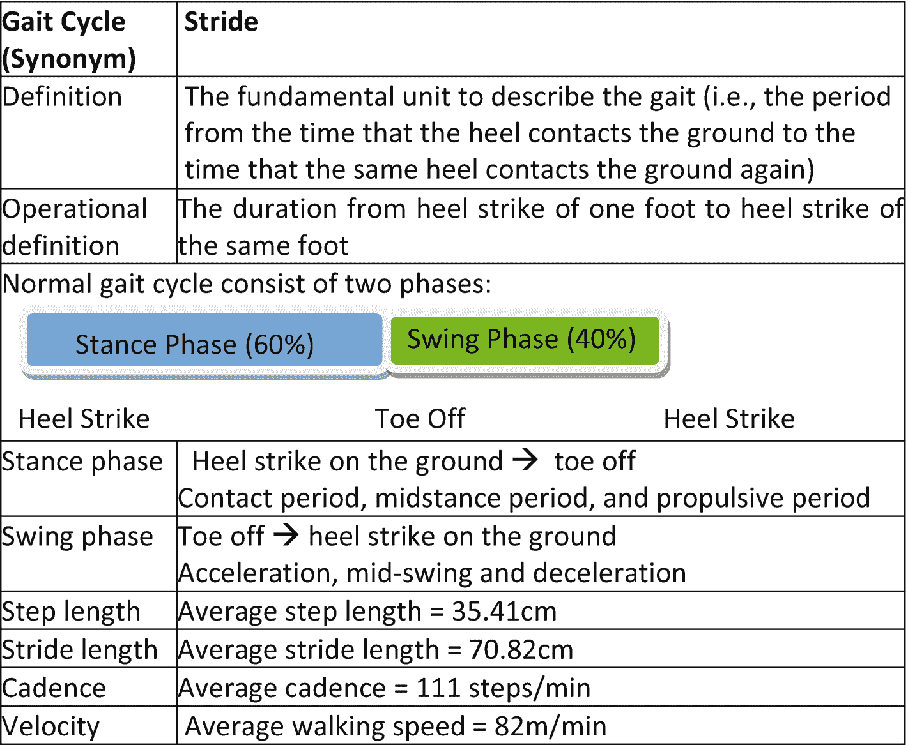
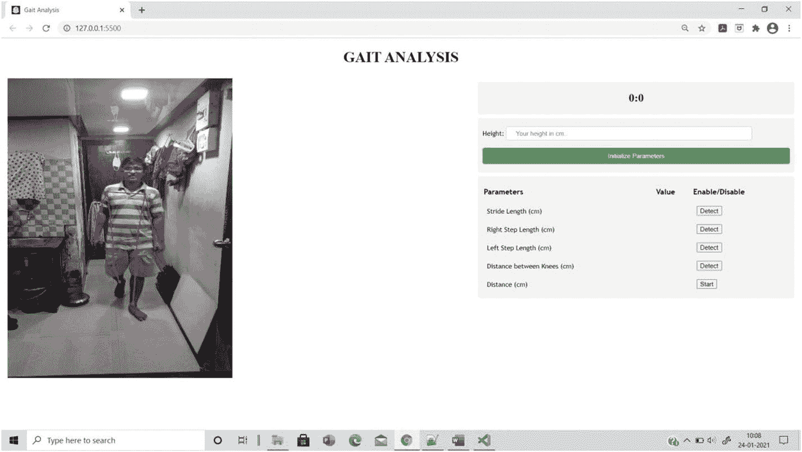
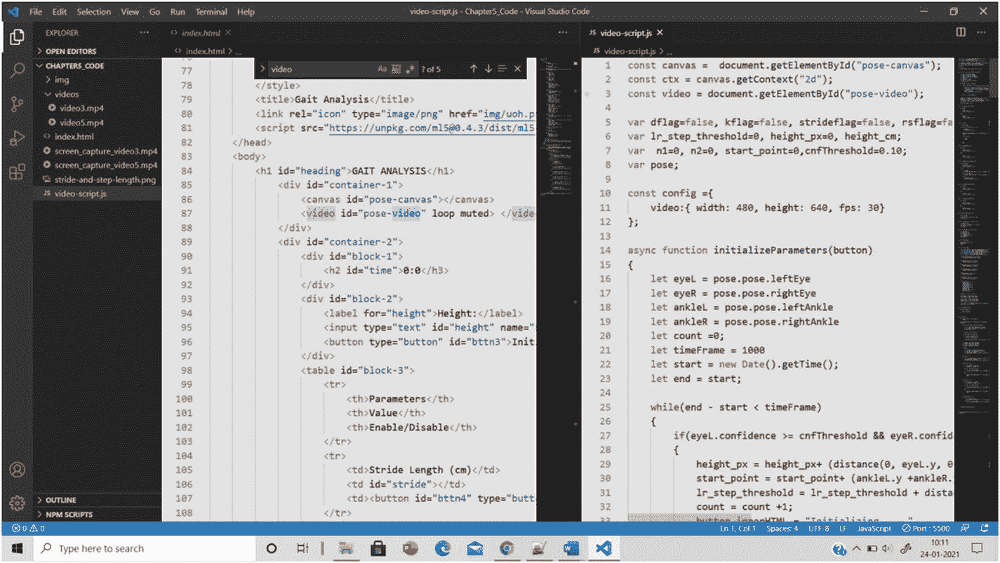
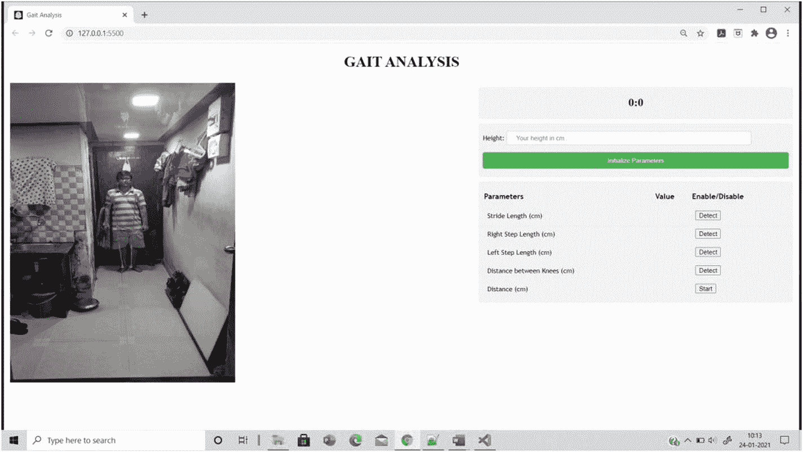
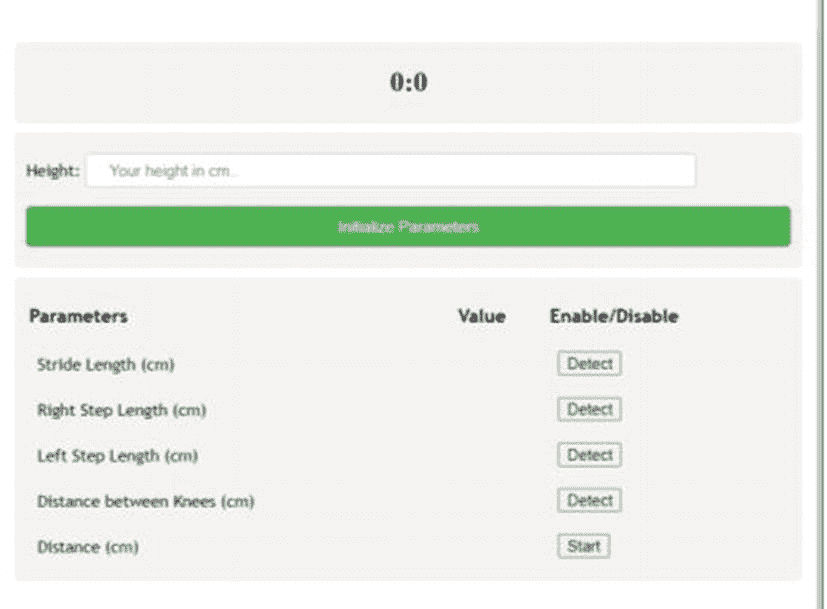
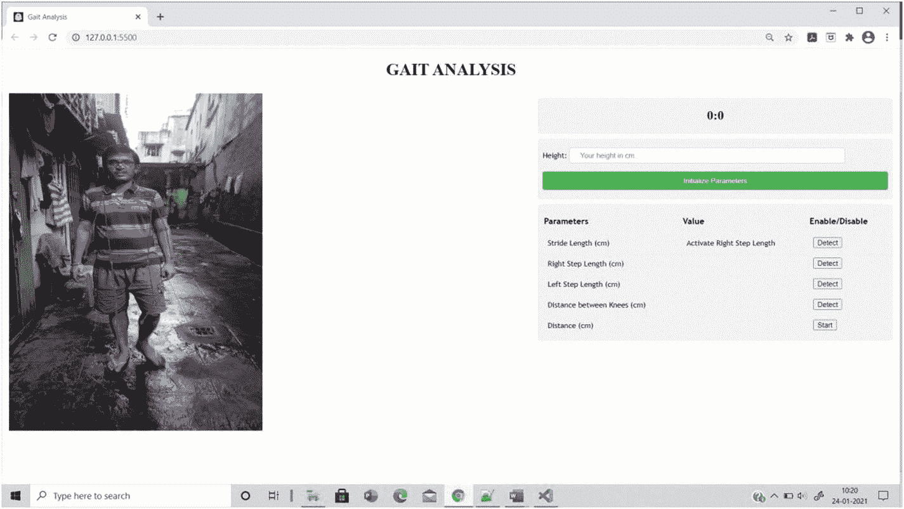
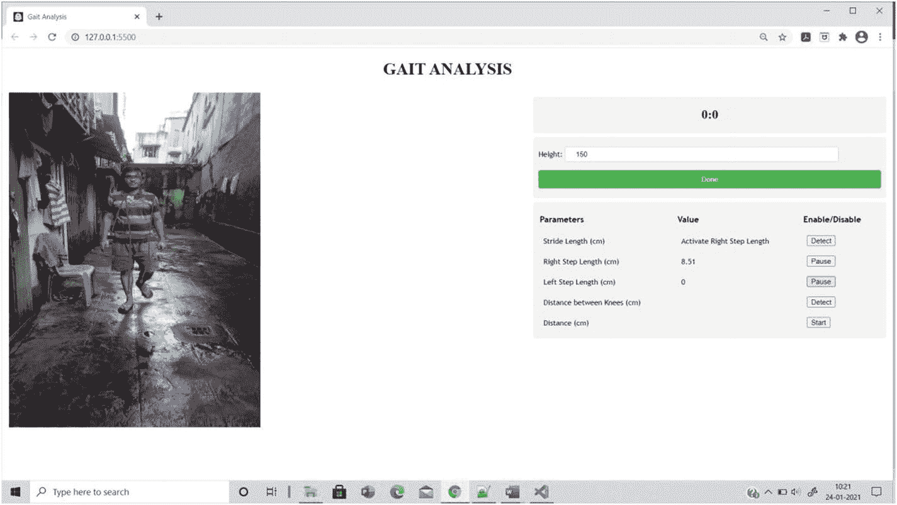

# 五、步态分析

步态分析是指对动物运动的系统研究，更具体地说是对人类运动的研究，使用由仪器增强的观察者的眼睛和大脑来测量身体运动、身体力学和肌肉活动。步态分析用于评估和治疗患有影响行走能力的疾病的人。

步态分析涵盖了对人的步态模式的测量(展示和调查可量化的行走边界)和解释。

## 步态测量技术

步态分析包括测量，其中引入、分析和解释可测量的参数，以推断受试者的行走风格(模式)。表 [5-1](#Tab1) 描述压力测量，表 [5-2](#Tab2) 标识运动测量。

表 5-2

运动测量

<colgroup><col class="tcol1 align-left"> <col class="tcol2 align-left"></colgroup> 
| 

**设备类型**

 | 

**测量类型**

 |
| --- | --- |
| 测角仪 | 运动范围 |
| 电子测角仪 | 连续瞬间的关节角度 |
| 观察步态分析:使用摄像机的导电走道 | 步幅、节奏、速度和动态基础 |
| 高速视频 | 停止运动测量 |
| 加速计 | 加速 |
| 陀螺仪 | 方向的改变 |
| 3D 标记系统 | 所有可能的运动学测量使用无源(反射器)和有源(灯)地标上的标记(通过“连接点”的关节角度) |
| 电磁场 | 所有可能的运动学测量嘈杂和定性肌肉何时活跃的指示器表面肌电图(sEMG)(最常见):便宜，简单由于串扰和噪音而难以解释细线和针肌电图:穿透皮肤分离单块肌肉 |

表 5-1

使用力/压力测量


Note

关于观察步态分析，本书考虑使用摄像机技术的导电走道，以使用低成本资源受限的计算设备(如 Raspberry Pi 或移动设备)来分析个人的步态模式。为了便于理解，程序可以使用笔记本电脑浏览器运行。

## 步态周期测量参数和术语

表 [5-3](#Tab3) 提供了步态周期测量的基本术语和正常条件。为了通过浏览器中的人工智能(AI)了解个人的行走模式，对于正常的步态模式，将考虑以下条件。

表 5-3

基本步态周期术语



在下一节中，通过浏览器设计和开发图形用户界面(GUI)将使我们能够测量个人的步态参数。

## 用于监测步态参数的网络用户界面

图 [5-1](#Fig1) 显示了在 ml5.js 库的帮助下使用 PoseNet 模型的关键点、骨骼和步态参数值的初始输出。



图 5-1

在浏览器上监控步态参数

源代码由以下两个文件组成:

*   index.html:显示输出的主页面，如图 [5-1](#Fig1)

*   video-script.js:我们的 JavaScript (JS)代码使用 ml5 库函数运行

图 [5-2](#Fig2) 显示了 Visual Studio 代码中对应的源代码截图。



图 5-2

步态参数监测源代码截图

### index.html

这是显示输出(PoseNet 骨架和测量参数)的首页。ml5.js 库是使用 index.html 文件头部分中的脚本标记添加的:

```js
<script src="https://unpkg.com/ml5@0.4.3/dist/ml5.min.js">
</script>

```

用户界面的首页是在 HTML 文件的主体部分定义的。我们自己的 JS 代码在主体内部。在 Visual Studio 代码中运行 index.html 文件以查看输出(清单 [5-1](#PC2) )。

Note

开发的程序从录制的视频文件中获取输入。如果用户希望从浏览器网络摄像头提供输入，第 [4](4.html) 章中给出的步骤适用于收集用户数据。

```js
 <body>
     <h1 id="heading">GAIT ANALYSIS</h1>
        <div id="container-1">
           <canvas id="pose-canvas"></canvas>
          <video id="pose-video" loop muted> </video>
        </div>
        <div id="container-2">
            <div id="block-1">
            <h2 id="time">0:0</h3>
             </div>
            <div id="block-2">
              <label for="height">Height:</label>
               <input type="text" id="height" name="height" placeholder="Your height in cm.."><br>
               <button type="button" id="bttn3">Initialize Parameters</button>
            </div>
       <table id="block-3">
        <tr>
          <th>Parameters</th>
          <th>Value</th>
          <th>Enable/Disable</th>
        </tr>
        <tr>
          <td>Stride Length (cm)</td>
          <td id="stride"></td>
          <td><button id="bttn4" type="button">Detect</button></td>
        </tr>
        <tr>
          <td>Right Step Length (cm)</td>
          <td id="rs-d"></td>
          <td><button id="bttn5" type="button">Detect</button> </td> </tr>

  <tr>

   <td>Left Step Length (cm)</td>
   <td id="ls-d"></td>
   <td><button id="bttn6" type="button">Detect</button></td>
  </tr>
  <tr>
    <td>Distance between Knees (cm)</td>
    <td id="knee-d"></td>
    <td><button id="bttn7" type="button">Detect</button></td>
  </tr>
  <tr>
   <td>Distance (cm)</td>
   <td id="distance"></td>
   <td><button id="bttn8"type="button">Start</button></td>
  </tr>
</table>
</div>
<script src="video-script.js"> </script>
</body>

Listing 5-1The body Section of the index.html File

```

图 [5-3](#Fig3) 显示了程序在浏览器上运行时的初始输出。



图 5-3

初始输出。用户必须输入高度值并点击适当的按钮来查看步态参数

index.html 的 head 部分由 web 界面首页的层叠样式表(CSS)样式组成(清单 [5-2](#PC3) )。

```js
<head>
        <style>
            #heading{
                text-align: center;
            }
            #pose-canvas{
                position: absolute;
            }
            #pose-video{
                display: none;
            }
            #container-1{
                float: left;
                width: 50%;
                padding: 5px;
            }
            #container-2{
                float: right;
                width: 40%;
                padding: 5px;
            }
            #block-1{

                text-align: center;
                border-radius: 5px;
                background-color: #f2f2f2;
                padding: 1px;
                margin: 8px 0;
            }
            #block-2{
                border-radius: 5px;
                background-color: #f2f2f2;
                padding: 10px;
            }
            #block-2 input[type=text] {
                width: 80%;
                padding: 6px 20px;
                margin: 8px 0;
                display: inline-block;
                border: 1px solid #ccc;
                border-radius: 4px;
                box-sizing: border-box;
            }
            #block-2 button{
                width: 100%;
                background-color: #4CAF50;
                color: white;
                padding: 10px 20px;
                margin: 8px 0;
                border: none;
                border-radius: 4px;
                cursor: pointer;
            }
            #block-2 label{
                font-family: "Trebuchet MS", Arial, Helvetica, sans-serif;
                font-size: 14px;
            }
            #block-3{
                font-family: "Trebuchet MS", Arial, Helvetica, sans-serif;
                width: 100%;
                margin: 8px 0;
                border-radius: 5px;
                background-color: #f2f2f2;
                padding: 10px;
            }

            #block-3 td, #gait-details th {
                padding: 8px;
            }
            #block-3 td{
                font-size: 14px;
            }
            #block-3 th{
                padding-top: 12px;
                padding-bottom: 12px;
                text-align: left;
            }
        </style>
<title>Gait Analysis</title>
<link rel="icon" type="image/png" href="img/uoh.png">
<script src="https://unpkg.com/ml5@0.4.3/dist/ml5.min.js">
</script>
</head>

Listing 5-2The head Section of the index.html file

```

下面的 Video-script.js 文件由这些函数组成:

*   `async function main()`:该功能只执行运行一次。当用户通过点击按钮从视频文件中读取相应的值进行交互时，初始设置在这里完成。视频文件的宽度和高度被初始化。`ml5.poseNet()`创建一个新的 PoseNet 模型，将视频文件作为输入。

*   `function modelReady()`:当`read.video.play()`函数重复播放视频文件后，调用`draw()`函数识别关键点。

*   `function draw()`:该函数循环`forever.invoke``drawImage()`函数，用宽度、高度、x 位置、y 位置和要显示的视频逐幅显示视频图像。在当前图像上绘制点和线的关键点和骨架。由于`draw()`在无限循环中这样做，它显示了用户的连续输出，这使它看起来像一个视频。

*   在视频的关键点的位置的帮助下，测量为行走一定距离而识别的(关键点的)测量值。

*   `function document.addEventListener()`:为类型属性值为`type`的事件追加一个事件监听器。`callback`参数设置当事件被调度时将被调用的回调。回调函数是`main()`函数。

```js
async function main()
{
const initializeBttn = document.getElementById("bttn3");
const strideBttn = document.getElementById("bttn4");
const rightStepBttn = document.getElementById("bttn5");
const leftStepBttn = document.getElementById("bttn6");
const kneeBttn = document.getElementById("bttn7")
const distanceBttn = document.getElementById("bttn8");

    initializeBttn.onclick = function(){
        initializeParameters(initializeBttn)
    }
// when the user clicks the buttons, appropriate //method is invoked
    strideBttn.onclick = function(){
        toggleStrideLength(strideBttn)
    }

    rightStepBttn.onclick = function(){
        toggleRightStep(rightStepBttn)
    }

    leftStepBttn.onclick = function(){
        toggleLeftStep(leftStepBttn)
    }

kneeBttn.onclick = function(){
        toggleKnee(kneeBttn)
    }

    distanceBttn.onclick = function(){

        toggleDistance(distanceBttn)
    }

const options = {
        imageScaleFactor: 0.3,
        outputStride: 16,
        flipHorizontal: false,
        minConfidence: 0.5,
        maxPoseDetections: 2,
        scoreThreshold: 0.5,
        nmsRadius: 20,
        detectionType: 'multiple',
        multiplier: 0.75,
    }

    video.src = "videos/video5.mp4"; // video File

    video.width = conFigure video.width;
    video.height= conFigure video.height;

    canvas.width = conFigure video.width;
    canvas.height = conFigure video.height;
    console.log("Canvas initialized");

const poseNet = ml5.poseNet(video,options, modelReady);
    poseNet.on('pose',gotPoses);
}

function modelReady()
{
    console.log('Model Ready')
    video.play();
    draw();
}

function draw()
{
    if (video.paused || video.ended) {
        return;
    }
    ctx.drawImage(video,0, 0, video.width, video.height)
//For each pose, measure the distance between the //respective keypoints of the body part.
    if(pose)
    {

     for(i=0;i< pose.pose.keypoints.length;i++)
        {
           let x = pose.pose.keypoints[i].position.x;
            let y = pose.pose.keypoints[i].position.y
            drawPoint(x,y,3,'red')
        }
        let skeleton = pose.skeleton
        for(i=0;i<skeleton.length;i++)
        {
            let partA = skeleton[i][0];
            let partB = skeleton[i][1];           drawLine(partA.position.x, partA.position.y, partB.position.x, partB.position.y,'red')
        }
        let ankleL = pose.pose.leftAnkle
        let ankleR = pose.pose.rightAnkle
        let kneeL = pose.pose.leftKnee
        let kneeR = pose.pose.rightKnee

        if(dflag)
        {
            let end_point = (ankleL.y+ankleR.y)/2
            let d = Math.abs(start_point - end_point)
            d = (height_cm / height_px) * d
document.getElementById("distance").innerHTML = d.toFixed(2)
        }

        if(kflag == true)
        {
            let d = distance(kneeL.x, kneeL.y, kneeR.x, kneeR.y)
            d = (height_cm / height_px) * d
            document.getElementById("knee-d").innerHTML= d.toFixed(2);
        }

        if(rsflag == true)
        {
            let d = ankleR.y - ankleL.y
            d = (height_cm / height_px) * d

            if (d <= lr_step_threshold)
            {

       document.getElementById("rs-d").innerHTML = 0;
            }
            else
            {
       document.getElementById("rs-d").innerHTML = (d-lr_step_threshold).toFixed(2);
                n1=d;
            }
        }

        if(lsflag == true)
        {
            let d = ankleL.y - ankleR.y
            d = (height_cm / height_px) * d

            if (d <= lr_step_threshold)
            {
       document.getElementById("ls-d").innerHTML = 0;
            }
            else
            {
       document.getElementById("ls-d").innerHTML = (d- lr_step_threshold).toFixed(2);
                n2=d;
            }
        }
        if(strideflag == true)
        {
            if( n1 > 0 && n2 > 0 )
document.getElementById("stride").innerHTML = (n1+n2).toFixed(2)
            else
document.getElementById("stride").innerHTML = "Unable to detect feet";
        }

    }

    requestAnimationFrame(draw);
}
document.addEventListener("DOMContentLoaded",function(){
    main();
});

```

## 浏览器上步态参数(模式)的实时数据可视化

我们有一个在图像上绘制检测点的功能。我们将 PoseNet 输出的所有结果保存在`poses`数组中。在这里，我们循环遍历图像中人的每个姿势，并获得其关键点:

```js
function gotPoses(poses)
{
    if(poses.length > 0)
    {
        pose = poses[0]
    }
}

```

我们循环遍历`keypoints`数组中身体部位的每一个点，该数组还包含以下内容:

*   *零件*:被检测零件的名称

*   *位置*:图像上一点的 x 和 y 值

*   *得分*:检测的准确性

我们仅使用填充(红色、绿色、蓝色)绘制一个点，采用范围从 0 到 255 的 RGB 强度值来决定点的颜色:

```js
function drawPoint(x, y, radius, color)
{
    ctx.beginPath();
    ctx.arc(x, y, radius, 0, 2 * Math.PI);
    ctx.fillStyle = color;
    ctx.fill();
}

function drawLine(x1,y1,x2,y2,color)
{
    ctx.beginPath();
    ctx.moveTo(x1, y1);
    ctx.lineTo(x2, y2);
    ctx.strokeStyle = color;
    ctx.lineWidth = 2;
    ctx.stroke();
}

//Similarly, the function initializeParameters do //adjust the confidence values

async function initializeParameters(button)
{
    let eyeL = pose.pose.leftEye
    let eyeR = pose.pose.rightEye
    let ankleL = pose.pose.leftAnkle
    let ankleR = pose.pose.rightAnkle
    let count =0;
    let timeFrame = 1000

    let start = new Date().getTime();
    let end = start;

    while(end - start < timeFrame)
    {
        if(eyeL.confidence >= cnfThreshold && eyeR.confidence >= cnfThreshold && ankleL.confidence >= cnfThreshold && ankleR.confidence>=cnfThreshold)
        {
            height_px = height_px+ (distance(0, eyeL.y, 0, ankleL.y) + distance(0, eyeR.y, 0, ankleR.y))/2
            start_point = start_point+ (ankleL.y +ankleR.y)/2
            lr_step_threshold = lr_step_threshold + distance(0, ankleL.y, 0, ankleR.y)
            count = count +1;
            button.innerHTML = "Initializing ...."
        }

        end = new Date().getTime();
    }

    height_cm = document.getElementById("height").value;
    height_px  = (height_px / count).toFixed(2);
    lr_step_threshold = ((lr_step_threshold/count) * (height_cm / height_px)).toFixed(2)
    start_point = (start_point / count).toFixed(2)

    button.innerHTML = "Done"
}
function toggleDistance(button)
{
    if (dflag)
    {
        dflag = false;
        button.innerHTML= "Start";
    }
    else
    {

        dflag = true;
        timer()
        button.innerHTML= "Stop";
    }
}
function timer()
{
    let sec=0,min=0;
    var time = setInterval(function(){
      if (!dflag) {
            clearInterval(time);
        }
document.getElementById('time').innerHTML=min+":"+sec;
        sec++;
        if(sec == 60)
        {
            sec=0;
            min++;
        }

    }, 1000);
}
function toggleKnee(button)
{
    if (kflag)
    {
        kflag = false;
        button.innerHTML= "Detect";
    }
    else
    {
       kflag = true;
        button.innerHTML= "Pause";
    }
}
function toggleStrideLength(button)
{

    if (strideflag)
    {
        strideflag = false;
        button.innerHTML= "Detect";
    }
    else {

        if(!rsflag){
document.getElementById("stride").innerHTML= "Activate Right Step Length"
        }
        else if(!lsflag){
document.getElementById("stride").innerHTML = "Activate Left Step Length"
        }
        else{
            strideflag = true;
            button.innerHTML= "Pause";
        }
    }
}
function toggleRightStep(button)
{
    if (rsflag)
    {
        rsflag = false;
        button.innerHTML= "Detect";
    }
    else
    {
        rsflag = true;
        button.innerHTML= "Pause";
    }
}

function toggleLeftStep(button)
{
    if (lsflag)
    {

        lsflag = false;
        button.innerHTML= "Detect";
    }
    else
    {
        lsflag = true;
        button.innerHTML= "Pause";
    }
}
function distance(x1,y1,x2,y2)
{
    let a = x2-x1;
    let b = y2-y1;
    let result = Math.sqrt( a*a + b*b);
    return result;
}

```

图 [5-4](#Fig4) 显示了输入人的身高之前的初始参数屏幕。



图 5-4

在浏览器上看到的初始输出。用户必须在用户界面中手动(输入)提供高度，并点击检测按钮来测量参数

图 [5-5](#Fig5) 显示了我们输入用户的身高(以厘米为单位)，点击初始化参数按钮，然后点击检测步幅长度按钮后的输出。



图 5-5

单击相应的按钮后，将显示步幅值

当用户点击右步长和左步长按钮时，数值显示如图 [5-6](#Fig6) 所示。



图 5-6

用户单击按钮后，将显示右步长和左步长值

点击距离按钮，显示行走的总距离，如图 [5-7](#Fig7) 所示。


图 5-7

步态参数显示在网络浏览器上

## 使用阈值确定步态模式

可以将选项变量中的阈值分数设置为某个值，以便显示分数高于阈值的相应姿势:

```js
const options = {
  imageScaleFactor: 0.3,outputStride: 16,
  flipHorizontal: false,minConfidence: 0.5,
  maxPoseDetections: 2,scoreThreshold: 0.5,
  nmsRadius: 20,detectionType: 'multiple',
  multiplier: 0.75,
 }
while(end - start < timeFrame)
{
if(eyeL.confidence >= cnfThreshold && eyeR.confidence >= cnfThreshold && ankleL.confidence >= cnfThreshold && ankleR.confidence>=cnfThreshold)
 {
height_px = height_px+ (distance(0, eyeL.y, 0, ankleL.y) + distance(0, eyeR.y, 0, ankleR.y))/2
start_point = start_point+ (ankleL.y +ankleR.y)/2
            lr_step_threshold = lr_step_threshold + distance(0, ankleL.y, 0, ankleR.y)
            count = count +1;
            button.innerHTML = "Initializing ...."
 }
end = new Date().getTime();
}

height_cm = document.getElementById("height").value;
height_px  = (height_px / count).toFixed(2);
lr_step_threshold = ((lr_step_threshold/count) * (height_cm / height_px)).toFixed(2)
start_point = (start_point / count).toFixed(2)
button.innerHTML = "Done"

```

## 摘要

用于步幅和姿态(步态)检查的深度神经网络是一种进步的思想。这些测量有助于评估步幅不规则性，这可以定量地表明影响行走和姿势的医疗状况严重性的比例。这些测量将有助于评估步态、运动、平衡和跌倒风险方面的障碍。在浏览器中使用人工智能的当前方法将有助于以下方面:

*   确定对辅助、适应、矫正、保护、支持或修复装置或设备的需求

*   整合感觉、运动和神经过程的难度评估

*   建立诊断、预后、护理计划、转介到其他服务

*   脚踏开关步幅分析

*   定义时间和距离因素，对患者的行走能力进行分类

*   测量对治疗方案的反应，计算速度、步幅长度、步调、单个站立姿势、初始和末端双站立姿势、总站立姿势、步态周期持续时间。

本书的读者将通过实现从第 [1](1.html) 章到第 [4](4.html) 章学到的功能来开发应用程序，如本章所述的步态分析。在步态分析应用程序的设计和开发中要考虑的主要特性和工具是 JS、DOM、jQuery、p5.js、ml5.js 和 TensorFlow.js。

## 参考

*   莱文·d·f·j·理查兹和 m·惠特尔。 [*惠特尔步态分析*](https://www.amazon.com/Whittles-Gait-Analysis-David-Levine/dp/070204265X) 。爱思唯尔健康科学，2012 年。

*   [T2`https://en.wikipedia.org/wiki/Gait_analysis`](https://en.wikipedia.org/wiki/Gait_analysis)

*   汉弗莱艾伦和吉姆.巴顿。“‘正常’步态——人体运动学的一部分。”西北大学医学院物理治疗和人体运动科学系。

*   [T2`https://www.medicine.missouri.edu/sites/default/files/Normal-Gait-ilovepdf-compressed.pdf`](https://www.medicine.missouri.edu/sites/default/files/Normal-Gait-ilovepdf-compressed.pdf)

*   正常步态，Heikki Uustal，医学博士，医疗主任，修复/矫正小组，JFK-约翰逊康复研究所，爱迪生，新泽西州