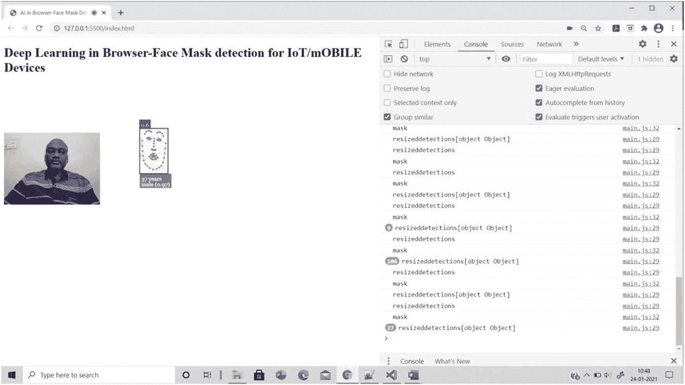
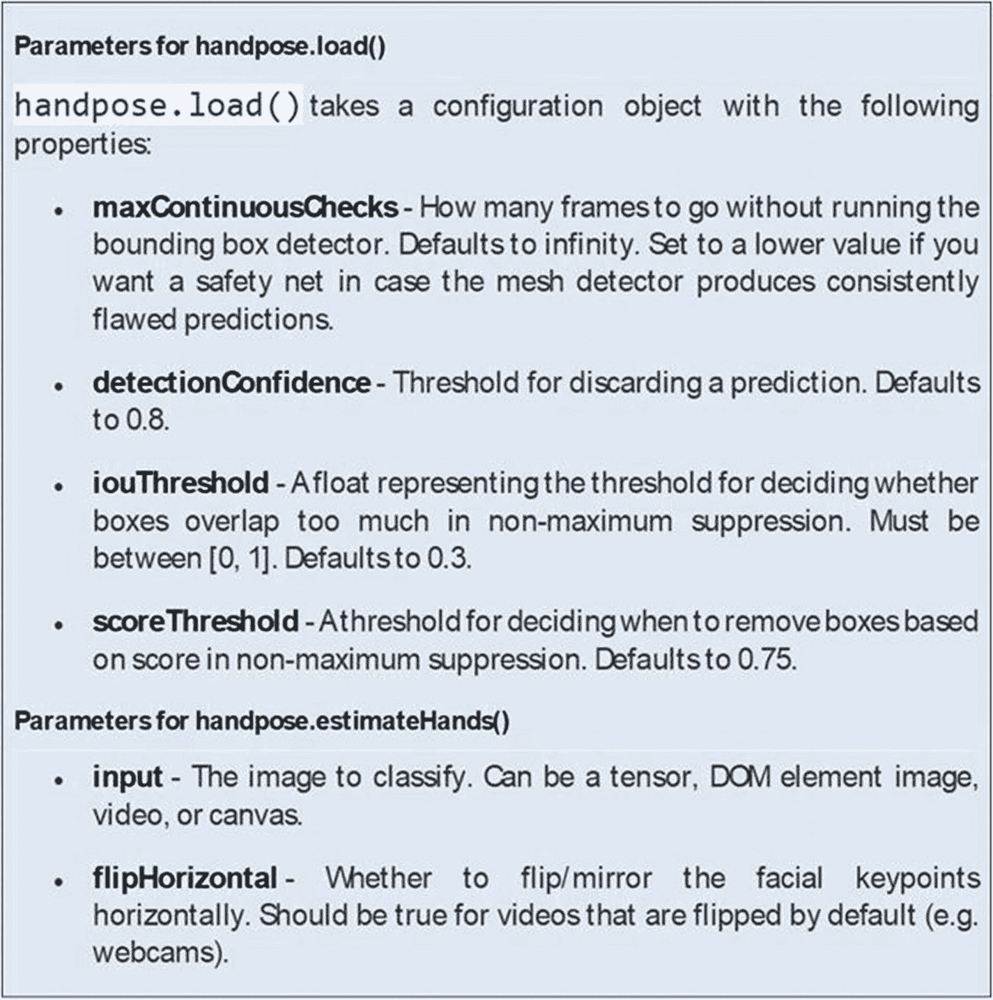

# 6.在浏览器中运行人工智能方法的未来可能性

本章介绍了两个借助 TensorFlow.js 框架运行的新 JavaScript (JS)库:face-api.js 和 handpose。不断发展的 JS 库展示了一条探索可以在浏览器和计算资源设备(计算能力较弱的电子设备)上运行的实时响应应用程序的道路。

## 介绍

如前几章所述，人体姿态评估在一些重要方面不同于其他基本的计算机视觉任务。对象识别在图片中查找对象。然而，这通常是粗粒度的，由包含对象的跳跃框组成。姿势评估走得更远，预测与人类主体相关的关键点的精确区域。

本质上，二维(2D)评估测量与图片或视频轮廓相比的 2D 空间中的关键点的面积。该模型为人类的每个关键点测量 x 和 y 坐标。三维(3D)评估试图通过将 z 坐标添加到预测中，将 2D 图像中的对象变为 3D 对象。

3D 评估使我们能够预测个人或物品的真实空间位置。正如你所料，3D 评估目前是机器学习(ML)学生的一个测试问题，因为制作数据集和计算需要考虑图片或视频体验场景或照明条件的各种变量。

资格适用于识别图片或视频中的一个或多个区域。2D 和 3D 方法可以被称为单人和多人评估。单人评估方法区分并跟踪一个人或项目，而多人评估方法识别并跟踪许多个人或项目。

通过思考姿势评估在各个方面的应用，我们可以清楚地想象姿势评估的强度:从虚拟游戏导师和人工智能(AI)驱动的健身教练到跟踪制造工厂车间的发展，再到保证工人的福祉。目前的 PoseNet 评估可能会导致旨在衡量人类发展准确性的机器人化设备泛滥。

PoseNet 评估方法打开了区域范围内的应用程序(例如，增强的真实性、生动性、游戏性和机械技术)。这不是一个彻底的纲要，但它记住了一部分的基本方式，目前的评估正在形成我们的未来。

TensorFlow.js 使 ML 分析师能够让其他人更容易获得他们的计算结果。例如，Magenta.js 库(Roberts 等人，2018 年)允许在程序中使用 Magenta 小组创建的生成性音乐模型，并通过 TensorFlow.js 移植到网络上。Magenta.js 扩大了他们的工作对其预期兴趣群体(特别是表演者)的渗透性。这使得该网络发布了各种各样的 ML 驱动的音乐应用。例子包括潜在周期 Parviainen (2018a)。和神经鼓机 Parviainen (2018b)。你可以在 [`https://magenta.tensorflow.org/demos`](https://magenta.tensorflow.org/demos) 找到这些和更多的模型。

TensorFlow.js 的一个基本专业承诺是安排方法，用于重新调整 web stage design 应用程序编程接口(API)的用途，以实现卓越的数字处理，同时保持与大量小工具和执行条件的相似性。

我们承认有各种机会来扩展和升级 TensorFlow.js。鉴于程序改进的快速发展，额外的 GPU 编程模型可能会开放。具体来说，程序开发人员看到了关于执行广泛有用的 GPU 编程 API Apple(2017)W3C(2017)的讨论，这将使这些工具箱更具性能，维护更简单。未来的工作将集中在提高执行、小工具相似性(特别是手机)的进展，以及扩大与 Python TensorFlow 使用的平等性。此外，我们还观察到需要为完整的人工智能工作流程提供帮助，包括信息、产出和变化。

## TensorFlow 的其他机器学习应用

剩下的部分讨论在各种 JS 库的帮助下可以在浏览器上运行的 AI 应用程序。

### 使用 face-api.js 进行人脸识别

在浏览器中使用 ML 和 TensorFlow 进行人脸检测和人脸识别。face-api.js JS 模块执行卷积神经网络(CNN)来检测人脸和识别人脸标记(关键点)。face-api.js 使用 TensorFlow.js，并针对工作区和便携式 web 进行了简化。

除了面部检测和识别之外，face-api.js 还提供了一些模型，可以实现面部表情识别、个人年龄评估和性别确定。

从 face-api.js 开始，web 开发人员包括 face-api.js 的最新 js 库，或者使用 npm 安装它。face-api.js 是开源软件，可以通过 MIT 许可获得。

使用 face-api.js 的人脸检测和人脸标记(关键点)的可视化可以在浏览器上查看，如图 [6-1](#Fig1) 所示。



图 6-1

通过使用 face-api.js 库将边界框绘制到画布中来可视化检测结果

应用程序有两个文件:index1.html(清单 [6-1](#PC1) 和 main.js，你可以从 [`https://justadudewhohacks.github.io/face-api.js/docs/index.html`](https://justadudewhohacks.github.io/face-api.js/docs/index.html) 下载。

```py
<!DOCTYPE html>
<html lang="en">
  <head>
    <meta charset="UTF-8" />
    <meta name="viewport" content="width=device-width, initial-scale=1.0" />
    <title>AI in Browser-Face Mask Detection</title>
     </head>
  <body>
    <h1>Deep Learning in Browser-Face Mask detection for IoT/mOBILE Devices</h1><br><br>
    <p id="GFG"></p>
    <video id="video" height="320" width="240" autoplay true></video>
    <script src="js/face-api.min.js"></script>
    <script src="js/main.js"></script>
  </body>
</html>

Listing 6-1Index1.html

```

### 手部姿态估计

能够看到手的形状和运动有助于改善客户在各种创新领域和阶段的体验。例如，它可以塑造基于手势的通信理解和手势控制的原因，并同样在增强的现实中授权在物理世界的头部覆盖高级物质和数据。虽然对个人来说没有任何问题，但鲁棒的持续手部识别是一项独特的测试计算机视觉任务，因为手部经常会妨碍自己或他人(例如，手指/手掌妨碍和握手)，并且需要高度差异的设计。

该工程类似于我们在后期分布式工作面 ML 管道中使用的工程，以及其他人在当前评估中使用的工程。将精确修剪的手掌图片提供给手部里程碑模型减少了对信息放大(例如，旋转、解释和缩放)的需求，并且允许组织将其大部分能力用于促进期望精度。

当手掌图像或视频作为输入给出时，手姿态估计方法确定关节(关键点)。基本上，手语精度可以从手姿态估计中容易地理解。

图 [6-2](#Fig2) 是在浏览器中运行一个 AI 程序后的截图(输出)。


图 6-2

基于关键点的手部姿态估计

我们打算通过更稳定、更强大的追随者来扩大这一创新，扩展手势信号的范围。在手部姿态估计的帮助下，可以探索新的应用，我们渴望看到使用该方法可以产生什么样的最佳效果。

清单 [6-2](#PC2) 和 [6-3](#PC3) 提供了手部姿态估计的源代码(index2.html 和 script.js)。

```py
const config ={
      video:{ width: 640, height: 480, fps: 50}
    };

function drawPoint(ctx, x, y, radius, color)
{
    ctx.beginPath();
    ctx.arc(x, y, radius, 0, 2 * Math.PI);
    ctx.fillStyle = color;
    ctx.fill();
}

function drawLine(ctx,x1,y1,x2,y2,color)
{
    ctx.beginPath();
    ctx.moveTo(x1, y1);
    ctx.lineTo(x2, y2);
    ctx.strokeStyle = color;
    ctx.stroke();
}

function draw(ctx,part,radius,color)
{
    let k=0;

    for(k=0; k<part.length-1; k++)
    {
        const[x1,y1,z1] = part[k];
        const[x2,y2,z2] = part[k+1];

        drawPoint(ctx,x1,y1, radius,color);
        drawLine(ctx,x1,y1,x2,y2,color);
    }

    const[x1,y1,z1] = part[k];
    drawPoint(ctx,x1,y1, radius, 0, 2 * Math.PI);
}

async function estimateHands(video, model, ctx)
{
    ctx.clearRect(0, 0, conFigure video.width, conFigure video.height);
    const predictions = await model.estimateHands(video);

    if (predictions.length > 0)
    {

      for(let i=0; i<predictions.length;i++)
      {
          const thumb_finger = predictions[i].annotations['thumb'];
          const index_finger = predictions[i].annotations['indexFinger'];
          const middle_finger = predictions[i].annotations['middleFinger'];
          const ring_finger = predictions[i].annotations['ringFinger'];
          const pinky_finger = predictions[i].annotations['pinky'];
          const palm = predictions[i].annotations['palmBase'];

          draw(ctx,thumb_finger,3,'red');
          draw(ctx,index_finger,3,'red');
          draw(ctx,middle_finger,3,'red');
          draw(ctx,ring_finger,3,'red');
          draw(ctx,pinky_finger,3,'red');

          let[x1,y1,z1] = palm[0];
          drawPoint(ctx,x1,y1, 3, 0, 2 * Math.PI);

          let[x2,y2,z2] = thumb_finger[0];
          drawLine(ctx,x1,y1,x2,y2,'red');

          [x2,y2,z2] = index_finger[0];
          drawLine(ctx,x1,y1,x2,y2,'red');

          [x2,y2,z2] = middle_finger[0];
          drawLine(ctx,x1,y1,x2,y2,'red');

          [x2,y2,z2] = ring_finger[0];
          drawLine(ctx,x1,y1,x2,y2,'red');

          [x2,y2,z2] = pinky_finger[0];
          drawLine(ctx,x1,y1,x2,y2,'red');

        }

    }
    setTimeout(function(){
      estimateHands(video, model, ctx);
    }, 1000 / conFigure video.fps)
}

async function main()
{
    const video = document.getElementById("pose-video");
    const model = await handpose.load();
    const canvas =  document.getElementById("pose-canvas");
    const ctx = canvas.getContext("2d");
      estimateHands(video, model,ctx);
      console.log("Starting predictions")
}

async function init_camera()
{
    const constraints ={
      audio: false,
      video:{
      width: conFigure video.width,
      height: conFigure video.height,
      frameRate: { max: conFigure video.fps }
      }
    };

    const video = document.getElementById("pose-video");
    video.width = conFigure video.width;
    video.height= conFigure video.height;

navigator.mediaDevices.getUserMedia(constraints).then(stream => {
       video.srcObject = stream;
        main();
    });
}

function init_canvas()
{
      const canvas =  document.getElementById("pose-canvas");
      canvas.width = conFigure video.width;
      canvas.height = conFigure video.height;
      console.log("Canvas initialized");
}

document.addEventListener('DOMContentLoaded',function(){
  init_canvas();
  init_camera();
});

Listing 6-3script.js

```

```py
<!DOCTYPE html>
<html>
      <head>
            <title>Hand Pose Detection</title>
            <script src="https://cdn.jsdelivr.net/npm/@tensorflow/tfjs-core@2.4.0/dist/tf-core.min.js"></script>
            <script src="https://cdn.jsdelivr.net/npm/@tensorflow/tfjs-converter@2.4.0/dist/tf-converter.min.js"></script>
            <script src="https://cdn.jsdelivr.net/npm/@tensorflow/tfjs-backend-webgl@2.4.0/dist/tf-backend-webgl.min.js"></script>
            <script src="https://cdn.jsdelivr.net/npm/@tensorflow-models/handpose@0.0.6/dist/handpose.min.js"></script>
            <script src="script.js"></script>
            <style>
                  #pose-canvas{

                        position: absolute;
                        top: 0;
                        left: 0;
                  }
            </style>
      </head>
      <body>
             <div id="video-container">
                  <video id="pose-video" autoplay="true"> </video>
                  <canvas id="pose-canvas"></canvas>
             </div>
      </body>
</html>

Listing 6-2Index2.html

```

以下是`async`功能中`handpose.load`的参数:



## 摘要

TensorFlow.js 使 web 开发人员能够完全在其浏览器或资源受限的设备中准备和运行 AI 模型。对于 JS 开发者来说，这是发现人工智能领域进步的一个很好的方式。最好的事情是 CoreML 不正常，它运行在苹果的环境内部。TensorFlow.js 可以运行在 iOS、macOS、Linux、Android 以及任何支持一个程序的阶段。

我相信本章提到的库会激励你开始构建令人惊讶的人工智能驱动的 web 应用程序。

## 参考

*   [T2`https://justadudewhohacks.github.io/face-api.js/docs/index.html`](https://justadudewhohacks.github.io/face-api.js/docs/index.html)

*   [T2`https://glitch.com/~face-api-js-for-beginners`](https://glitch.com/%257Eface-api-js-for-beginners)

*   [T2`https://github.com/tensorflow/tfjs-models/tree/master/handpose`](https://github.com/tensorflow/tfjs-models/tree/master/handpose)

*   [T2`https://blog.tensorflow.org/2020/03/face-and-hand-tracking-in-browser-with-mediapipe-and-tensorflowjs.html`](https://blog.tensorflow.org/2020/03/face-and-hand-tracking-in-browser-with-mediapipe-and-tensorflowjs.html)

*   A.Roberts，C. Hawthorne 和 I. Simon，“Magenta.js:用深度学习增强创造力的 JavaScript API”2018 音乐机器学习联合研讨会(ICML)。