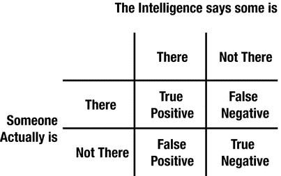

# 六、为什么创造智能体验很难

本章探讨了基于智能的体验不同于传统体验的一些方式。底线是:智力会犯错。

智力是要出错的；为了创造有效的智能体验，你必须对这个事实感到高兴。你将不得不接受错误。你必须做出正确的决定，如何处理和避免错误。

情报部门犯的错误:

*   不一定是直观的。
*   每天都不一样。
*   不容易提前发现。
*   不可能用“再多做一点智力工作”来解决

这一章是关于智能所犯的错误。它的目标是向您介绍创建有效智能体验所需解决的挑战。了解智能出错的方式和潜在的权衡将有助于您了解预期会发生什么，更重要的是，如何设计智能体验，尽管智能会出错，但仍能给用户带来尽可能好的结果，并实现系统的目标。

## 智力会出错

智能系统会犯错。这是没有办法的。错误会很不方便，有些甚至很糟糕。如果听之任之，这些错误会让智能系统看起来很愚蠢；它们甚至会使智能系统变得无用或危险。

以下是一些可能由情报失误导致的情况示例:

*   你让你的手机订购比萨饼，它会告诉你印度孟买的人口。
*   你的自动驾驶汽车开始沿着一条不存在的道路行驶，最后你掉进了一个湖里。
*   你的智能门铃告诉你有人正在接近你的前门，但在查看视频时，你意识到没有人在那里。
*   你把一片面包放进你的智能烤面包机，五分钟后回来，发现面包是冷的——烤面包机什么也没做。

这些类型的错误，以及许多其他错误，只是使用智能的成本的一部分，特别是在使用机器学习创造的智能时。

这些错误并不是产生智力的人的错。我的意思是，我想错误可能是他们的错——人们总是有可能做不好自己的工作——但即使是在应用机器学习方面非常优秀的人——世界级的——也会产生犯错误的智能。

因此，经验在智能系统中的一个重要作用是展示智能，这样当它正确时就有效，这样它犯的错误就会最小化，并且容易恢复。

考虑一下，一个 95%正确的智能在每 20 次交互中会犯一次错误。95%是非常高的准确率。如果你的智力生产者达到了 95%,他们会觉得自己做得很好。他们会希望自己的努力得到回报，然后他们会继续前进，从事其他项目。他们不想听到你告诉他们情报不够准确。

但是在一个每天有一百万用户交互的系统中，95%的准确率会导致每天 50，000 个错误。那是许多错误。如果这些错误耗费了用户的时间或金钱，那就会成为一个真正的问题。

考虑错误的另一个有用的方法是用户在看到错误之间有多少次交互。例如，一个每天进行 20 次交互、准确率为 97%的用户预计每周会出现 4.2 次错误。

这是一场灾难吗？

这取决于错误有多严重，以及用户有什么选择来恢复。

但是考虑一下构建会出错的系统的替代方案——也就是说，在围绕它构建产品之前，要求一个完美的智能。完美是非常昂贵的，在许多情况下是不可能的。从智能系统中获得真正的价值并不需要完美——坐以待毙等待完美是一种错过大量潜力的好方法。考虑这些例子:

*   语音识别并不完美，也许永远不会完美。
*   搜索引擎并不总是返回正确的答案。
*   游戏 AI 通常被嘲笑为转圈跑和向墙壁射击。
*   自动驾驶汽车发生事故。

但是，所有这些(有些)不准确的智能都是我们许多人每天使用的产品的一部分——它们让我们的生活变得更好。减少错误是产生智能体验的基本活动。

## 智力会犯疯狂的错误

冒着重复这一点的风险，智能会犯疯狂的错误。疯狂的，莫名其妙的，反直觉的错误。

考虑一下——如果一个人类专家 99%的时候都是正确的，你可能会认为他们犯的错误很快就会被纠正。你假设这位专家非常了解正在发生的事情，如果他们犯了一个错误，这可能会与世界如何运作的理性观点相一致。

机器学习和人工智能不是那样的。

一个人工智能可能在 99.9%的情况下是正确的，然后千分之一的人会说一些完全不符合 bat-o-bizarro 标准的话。例如:

*   一个推荐音乐的系统可能会向你推荐 999 首摇滚歌曲，然后向你推荐一首青少年流行歌曲。
*   一个智能烤面包机可能会完美地烘烤 99 片面包，并决定第 100 片面包不需要任何烘烤——无论如何，不需要加热。
*   一个从图像中读取人类情感的系统可能会正确地识别出 999 个人是快乐的，然后它可能会看到我的脸，并说我很悲伤，不管我笑得多么白痴。

这些疯狂的错误是智能系统工作的一部分。

甚至疯狂的错误也可以被减轻、恢复和最小化。但是，为了设计与智能一起工作的体验，你应该抛弃对理性事物如何行动的先入为主的观念。相反，你需要用你正在处理的智能来发展直觉。使用它。看看什么会使它混淆，以及如何混淆。想办法支持。

一种本能是对做出智能的人说，“得了吧，这太疯狂了。改正这个错误。它正在杀死我们！”

那很好。他们可能会改变智力来修复困扰你的错误。

但是修复一个错误通常会在其他地方引入新的错误。这个新的错误可能同样疯狂。你不知道新的错误会在什么时候或者以什么方式出现。修复明显的错误并不总是正确的事情；事实上，玩有明显错误的打地鼠游戏是有害的。有时候，最好让智能尽可能地优化，然后通过优雅的体验来掩盖错误，从而支持智能。

## 智力会犯不同类型的错误

尽管你可能确信我现在已经在反复强调这一点，但是智能系统会犯不同类型的错误；例如:

*   智能门铃可能会说有人正在靠近门，而实际上并没有人；或者当有人接近门口时，它可能无法通知用户。
*   智能烤面包机可能会烤不熟面包；或者它可能煮过头了。
*   语音识别系统可能会错误地解释用户所说的话；或者它可能拒绝尝试猜测用户说了什么。

这里有三种主要的错误类型:

1.  把一种情况错当成另一种情况。
2.  估计错误的值(例如，正确的烤面包时间)。
3.  太困惑(或者太保守)以至于什么也说不出来。

也许这种情况最简单的形式就是混淆两种情况，就像智能门铃的例子一样。像这样的系统的智能有四种可能的结果(图 [6-1](#Fig1) ):

图 6-1

Different types of mistakes

*   真正——当有人站在门口，智能认为有人站在门口时，称为真正(这是正确答案，不是错误)。
*   真正的否定——当没有人站在门口，智能认为没有人在那里，这被称为真正的否定(这是另一种类型的正确答案，而不是错误)。
*   假阳性——当没有人站在门口，但智能认为有人站在门口时，这被称为假阳性(这是一个错误)。
*   假阴性——当有人站在门口，但智能认为没有人在那里，这被称为假阴性(这是另一种类型的错误)。

系统的智能经常有可能被调整来控制它所犯的错误类型，多犯一种类型的错误，少犯另一种类型的错误。(通常，这涉及调整驱动智能的模型输出的概率阈值。)

例如，在设计智能门铃体验时，是让系统在门口没有人时提醒用户，还是当有人在门口时不提醒用户更好？

如果你能以增加一个第二类错误为代价，消除三个第一类错误，会怎么样？对用户来说，这是一个更好的权衡吗？它是否对实现系统目标更有帮助？

这将取决于经验。每种类型的错误对用户的影响有多大？哪种类型的错误更容易隐藏？哪种类型的错误更容易阻碍系统目标的实现？用户每天/每月/每年会经历多少次这样的错误？他们会变得疲劳并完全停止响应系统发出的警报吗？或者他们会不信任这个系统并关闭它吗？

其他权衡的例子包括:

*   用低估换取高估。例如，当智能烤面包机预测烘烤时间时，过度烘烤 5%还是欠烘烤 5%会更好？
*   权衡智能给出的选项数量。例如，在推荐系统中，系统可能非常确定用户想要阅读 15 本不同书籍中的一本。让用户从前 5 名中选择会更好吗？还是显示全部 15 个？
*   在有话要说和没话要说之间权衡。例如，在计算机视觉系统中，智能可能有 90%的把握知道图像中的人是谁。让智能给一张图片中的一张脸贴上 10 次中有 1 次会出错的名字标签会不会更好？还是让系统什么都不做更好？还是求用户帮忙？

## 智力变化

传统的用户体验是确定的。他们响应同样的命令做同样的事情。例如，当你右击一个文件时，每次都会出现一个菜单(除非有 bug)。确定性是好的，原因有很多。

智能系统会随着时间的推移不断自我完善。昨天做了一件事的行动今天可能会做不同的事。这可能是一件非常好的事情。考虑:

*   昨天你搜索你最喜欢的乐队，得到了一些 OK 的文章。今天，你再次搜索你最喜欢的乐队，你会得到更新、更好的信息。
*   昨天你用微波炉煮了些爆米花，有几片烧焦了。今天你煮爆米花，微波炉不会煮太久，所以爆米花出来很完美。
*   昨天，你的导航应用指引你开车穿过一个施工区，你的通勤时间比平时多了一个小时。如今，这款应用会为你指引另一条路线，让你更快乐、更有效率地去上班。

这些是积极变化的例子，这些类型的变化是智能系统的目标——从用户的角度来看，系统今天比昨天工作得更好。如果现在有些不对劲，那没问题——用户可以相信系统会改进，问题会随着时间的推移而减少。

这就是目标。但是变化也可能是破坏性的。即使从长远来看是积极的变化也会让用户在短期内感到困惑和失控。想象以下情况:

*   昨天你用智能笔做笔记，墨水是一种很好的蓝色。但是一夜之间，连接到服务的笔和服务——为你可能知道或可能不知道的东西优化——决定调整蓝色的阴影。今天你记的笔记是不同的颜色。
*   昨天你去了当地的便利店，买了一大杯你最喜欢的苏打水，喝了，很享受。一夜之间，汽水机连接上了它的服务，调整了配方。今天你又买了一杯你不喜欢的苏打水。

这些变化好吗？也许吧。也许它们改善了相关企业的一些非常重要的属性。也许你会意识到你确实喜欢这种改变的行为——最终——尽管一开始会让你感到困扰。

或者也许这些变化只是灾难性的。

在处理不断变化的情报时，需要考虑以下几点:

1.  变化的速度可以控制吗？这可以通过对情报生产者施加一些限制来实现。例如，也许智能每天在不超过 5%的交互上改变它的预测。走得太远，这可能会导致静态智能(并随着时间的推移消除智能提高的潜力)，但一些简单的约束可以有很大帮助。
2.  这种体验能帮助用户适应变化吗？也许这是通过让他们知道已经发生了变化来实现的。或者可能通过保持旧的行为，但是向用户提供改变的行为作为选项。例如，智能笔可以让用户知道它已经发现了一种新的墨水颜色，使笔记更加有用 5%,如果用户需要，可以进行更改，或者如果用户喜欢，可以保持旧的墨水颜色。
3.  这种体验能限制系统中变化部分的影响，同时仍然允许它们有足够的重要性来实现影响吗？例如，通过对智力中变化最大的部分进行更被动的体验？

## 人的因素

智能体验的成功在于以积极的方式与用户互动，让用户更快乐、更高效，并帮助他们以更有成效的方式行动(或更好地与积极的业务成果保持一致的方式)。

但是对于一些用户来说，与智能系统打交道是有压力的，因为挑战了他们的期望。

一种思考方式是这样的。

人类处理工具，像锯子、书、汽车、物体。这些事情以可预测的方式运行。我们已经进化了很长一段时间来理解它们，依赖它们，知道从它们身上可以期待什么。有时它们会断裂，但那是罕见的。大多数情况下，他们就是他们自己；我们学会使用它们，然后不再过多地考虑它们。

在某种程度上，工具成为了我们的一部分，让我们拥有了没有它们就无法拥有的力量。

它们能让我们感觉非常好、安全和舒适。

确切地说，智能系统不是这样的。

智能系统会犯错。他们改变了他们的“想法”他们在决定采取行动时会考虑非常微妙的因素。有时他们不会连续两次做同样的事情，即使用户看不出有什么不同。有时，他们甚至有自己的动机，与用户的动机不太一致。

与智能系统的互动看起来更像是人际关系，而不像是使用工具。以下是这可能影响用户的一些方式:

*   困惑:当智能系统以奇怪的方式行动或出错时，用户会感到困惑。他们可能想要(或需要)投入一些思想和精力去理解正在发生的事情。
*   不信任:当智能系统影响用户行为时，用户会喜欢还是不喜欢？例如，一个系统可能会神奇地让用户的生活变得更好，或者它可能会让用户做一些事情，特别是用户觉得把别人的利益放在自己利益之上的事情(比如给他们看广告)。
*   缺乏信心:用户是否足够信任系统，让它做自己的事情，或者用户开始相信系统是无效的，总是试图提供帮助，但总是做错？
*   疲劳:当系统需要用户的注意力时，它用得好吗，或者对用户要求太多了？用户善于忽略自己不喜欢的东西。
*   蠕变因素:交互会让用户感到不舒服吗？也许系统太了解他们了。也许这让他们做了他们不想做的事情，或者把他们觉得是隐私的信息发布到公共论坛上。如果智能电视看到一对情侣在沙发上亲热，它可以调低灯光，播放一些巴里·怀特音乐——但它应该这样做吗？

注意用户对智能体验的感受。管理他们的感觉，对要展示什么和要有多强硬做出正确的选择。

## 摘要

智能会出错。不管怎样，它都会犯错。抱怨无济于事。错误并不存在，因为其他人不擅长他们的工作。追逐错误，玩打地鼠，通常是有害的。

一个智能所犯的错误可能是完全违背直觉的。即使通常正确的智力也会犯奇怪的错误(没有人会犯的错误)。

有不同类型的错误。一种常见的表达方式是:假阳性(当事情没有发生时说事情发生了)和假阴性(当事情发生时说事情没有发生)。智能经常可以在这些类型的错误之间进行权衡(例如，通过增加几个假阳性来消除几个假阴性)。

变化对用户来说可能是破坏性的，即使变化从长远来看是积极的。智能系统经常变化。帮助用户处理变化是创建有效智能系统的一部分。

智能系统会对用户产生负面影响，导致他们不喜欢和不信任系统。

创造智能体验很难。

## 供思考…

阅读完本章后，您应该:

*   理解智能会犯错——这是智能体验需要解决的基本挑战之一。
*   认识到为什么这些挑战不是智能缺陷(应该被修复),而是使用智能所固有的(并且必须被接受)。
*   对用户将如何体验智能系统的负面部分有一种感觉，并有一些同理心来帮助创造体验以帮助用户。

你应该能够回答这样的问题:

*   你见过的智能系统犯的最严重的错误是什么？
*   一次聪明的经历能做些什么来减少错误的严重性呢？
*   对于什么样的产品变化，你有最激烈的反应，起初不喜欢，但随着时间的推移越来越喜欢？为什么？