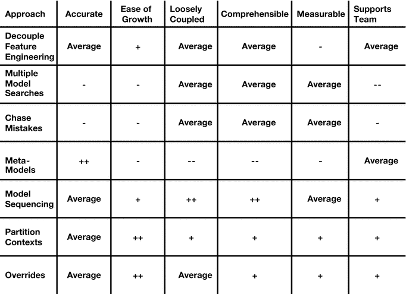

# 二十一、组织智能

在大多数大型系统中，智能创造是一项团队活动。多人可以同时处理智能，构建智能的不同部分，或者调查不同的问题领域。随着时间的推移，多人也可以处理智能，接替已经离开的团队成员，或者重新访问曾经工作但已经开始出现问题的智能。组织情报的一些方法包括:

*   对大多数事情使用机器学习智能，但使用人工智能来覆盖错误。
*   法国用户使用一台机器学习智能，日本用户使用另一台机器学习智能。
*   使用启发式智能的输出作为机器学习智能的特征。

本章讨论了组织智能的方法和创建智能的过程，以使智能更加强大，并允许许多人有效地协作。

## 组织智力的理由

有许多原因可以让您从构建单一的整体智能(例如，单一的机器学习模型)转变为有组织的智能:

*   协作:大规模智能建设是一项协作活动。你可能有 3、5 或 15 个人在研究一个智能系统的智能。如果你这样做了，你将需要找到让他们一起有效工作的方法，而不是竞争成为一个智能统治一切的主人。
*   清理错误:每个智能都会犯错误，纠正一个错误往往会使更多的错误在其他地方冒出来。此外，试图让基于机器学习的智能停止犯特定的错误并不容易——这往往需要一些实验和运气。组合智能可以提供快速的错误缓解来支持更复杂的智能。
*   用简单的方法解决简单的部分:有时问题的一部分很简单，一些启发法就可以做得很好(或完美)。在这些情况下，你可以尝试欺骗机器学习来学习一个模型，该模型可以做你已经知道如何做的事情，或者你可以划分问题，让启发式方法解决简单的部分，而机器学习专注于问题的较难部分。
*   整合传统智能:世界上已经有很多智能了。现有的智能和智能创造过程可能非常有价值。您可能希望将它们整合到一个智能系统中，以便充分利用它们的优势，帮助它们更有效地发展。

## 一个组织良好的智能的特性

组织情报可能是困难和有问题的。如果做错了，不同层次的智力会依赖于彼此的特质。一种智能的任何变化都会导致其他智能发生意想不到的(并且难以跟踪的)变化。你可能会遇到这样的情况，你知道你需要做一些改变，但是你就是不能——就像意大利面条代码一样，你可以有意大利面条智能。

一个组织良好的情报将包括以下所有内容:

*   准确:组织不应该过多地降低准确性潜力。这应该是短期成本(就较低的即时精度而言)与长期收益(就智能系统寿命期间的较高精度而言)之间的良好权衡。
*   易于发展:任何人都应该很容易有一个洞察力，创造一些智能，并将其放入系统中。
*   松散耦合:一种智能影响其他智能行为的能力应该最小化。智能之间的接口应该是清晰的，并且智能不应该使用关于彼此内部工作的信息。
*   可理解的:对于用户拥有的每一个结果，系统应该能够精确定位决策中涉及的智能，并且每个决策/结果中涉及的智能数量应该最小化。
*   可测量的:对于情报的每一部分，应该可以确定这部分情报给用户带来了多少好处。
*   团队的支持:组织战略应该与团队合作。该组织应该允许情报创造者的成功扩大彼此的工作。它应该避免将目标置于冲突之中，或者使参与者需要以非生产性的方式进行竞争。

## 组织情报的方法

本节讨论了许多组织情报的技术和创建情报的过程，并根据组织良好的情报的关键属性对它们进行了评估。大多数大型智能系统会同时使用多种方法。还有很多很多选择—这里的技术只是一个起点:

*   解耦特征工程
*   多模型搜索
*   追逐错误
*   元模型
*   模型排序
*   分区上下文
*   推翻

以下部分将描述这些方法，并根据它们满足组织良好的情报标准的程度对它们进行排序。这是一个主观量表，试图突出相对优势/劣势，如下所示:

<colgroup><col align="left"> <col align="left"></colgroup> 
| ++ | 真正的力量 |
| + | 高于平均水平 |
|   | 平均的 |
| - | 比平均水平差 |
| - - | 一个需要关注的挑战 |

所有这些方法都是可行的，并在实践中使用。但是你应该准备好减轻你所选择的组织战略中固有的挑战。

### 解耦特征工程

一种组织智能创造的方法是分离特征工程任务，以便每个智能创造者有一个清晰的上下文部分来探索并转化为特征。例如，如果试图理解一个网页:

*   一个智能创造者可以专注于页面的内容，使用标准的方法，如单词袋和 n-grams，将单词转换为特征。
*   另一个智能创建者可以专注于理解页面上文本的语义，使用词性标注、情感分析等等。
*   另一个人可以查看网站的历史，它在哪里托管，谁创建了它，以及他们还创建了什么。
*   另一个人可以探索网页上的图像，并尝试从中创建特征。
*   另一个可以查看用户的属性。

每个参与者需要能够将他们的特征提取代码注入到建模过程中。他们需要能够调整模型参数，以充分利用新的工作。他们需要能够部署他们的工作。

解耦特征工程的一些挑战包括:

*   模型构建上的冲突:一种类型的模型/参数集对于一种类型的特征可能比对于另一种类型的特征更好。参与者将需要权衡利弊来发展整个系统，而不是简单地从现有的功能集里分食价值。
*   冗余特征:创建特征的多种方法可以利用上下文中相同的底层信息。产生的特征可能彼此非常相似。关于如何消除冗余，情报创造者可能会有冲突。
*   特征值的不稳定性:当一个新特征被呈现给机器学习算法时，它通常会改变模型建立搜索的方向，这可能会对其他特征的值和模型犯的错误类型产生巨大影响。添加一个新的特性可能需要对特性集/模型有一些全局的理解，并对特性创建代码的其他部分做一些工作，以保持一切平衡。

总之，解耦特征工程的方法是

*   准确:一般来说，这种方法没有太多的妥协，情报创造者可以并行工作以获得收益。
*   易于扩展:+向现有模型中添加一些新功能在概念上很容易。不是绝对最简单的，但是相当不错。
*   松散耦合:一般的特性可以相互交互，但是只要您积极地消除冗余，耦合应该不是主要问题。
*   可理解性:一般当试图调试一个交互时，没有好的工具来指出有问题的特性，并且许多模型类型使得它特别困难。有时你只能“尝试一次删除一个特性，然后重新训练，看看问题什么时候会消失。”
*   可衡量的:最初添加特性时，很容易衡量改进。随着时间的推移，跟踪特性的贡献并不容易(例如，随着问题的变化)。
*   支持团队:一般情况下，当上下文中有清晰的边界时，事情可以很好地工作，但肯定有很多方法会导致冲突，例如哪些功能应该加入，哪些应该退出，特别是如果有任何运行时约束(CPU 或 RAM)。

### 多模型搜索

另一种组织智慧的方法是允许多个创建者尝试建模过程。例如，可能一个团队成员是线性模型专家，而另一个是神经网络大师。这些从业者都可以尝试创造智能，使用他们最舒服的东西，最好的模型获胜。

在以下情况下，使用多模型搜索可能会很有效:

*   你有对不同方法有经验的智能创造者。
*   您正处于构建智能系统的早期阶段，希望广撒网，看看哪些方法最有效。
*   您的系统发生了重大变化(比如问题的重大变化或者使用的大幅增加)，并且想要重新验证您已经选择了正确的建模方法。

但是使用多模型搜索会导致多余的工作和冲突，因为一种方法最终会赢，而其他方法会输。

多模型搜索的方法是

*   准确:-随着时间的推移，这种方法很难利用许多情报创造者。在智力创造过程的关键部分，应该谨慎使用它，比如当很明显需要改变的时候。
*   易于生长:-要运输新的智能，你必须击败旧的智能。这意味着新的想法需要非常完整，并在部署之前进行广泛的评估。
*   松散耦合:平均只有一个智能，所以没有任何特殊的耦合问题。
*   可理解的:平均只有一种智力，所以没有任何特别的理解问题。
*   可测量的:平均只有一种智力，所以不存在任何特殊的可测量的问题。
*   支持团队:- -这有点像赢者通吃的工作方式，这意味着有建模赢家和建模输家。它也倾向于促进浪费的工作——追求一个永远不会成功的建模想法。

### 追逐错误

另一种方法是像对待软件错误一样对待智力问题。bug 可以分配给智能创建者，他们可以找出解决问题所需的任何改变。例如，如果你对一个子群体——比如儿童——有困难，就派人去想办法在上下文中添加什么，或者改变什么特性，或者改变什么模型来更好地适应儿童。

智能总是会出错，所以这种方法可以永远继续下去。

这种方法的一个关键问题是弄清楚哪些错误只是随机错误，哪些是系统性问题，而智能创造的变化可能会有所帮助。在使用这种方法时，非常容易陷入追逐错误的问题，使所有人都感到不安，并且毫无进展。

在我看来，这种方法应该很少使用，只有在项目开始的时候(当有很多合法的 bug 时)或者当有灾难性的问题时才使用。

追错的方法是

*   准确:-智力有时以这种方式工作(就像子群体问题)，但它很容易被卷入追逐错误的错误。
*   易于发展:-每个人都需要了解一切，以发现和跟踪错误，开发富有成效的变化，并部署修复。此外，这种方法往往会导致对解决什么问题的糟糕决策。
*   松散耦合:平均并不真正影响耦合。
*   可理解性:平均并不真正影响可理解性。
*   可测量性:平均值并不真正影响可测量性。
*   支持团队:-这种方法没有为人们的工作提供良好的界限。通过造成另一个错误来修复一个错误也是很容易的，直到很久以后才知道是一个修复导致了另一个错误。如果做错了，这种方法会创造一个糟糕的工作环境。

### 元模型

元模型方法是将系统中各种智能的预测视为元智能的特征。每个基础智能运行并做出决定，然后一个元智能查看所有提出的预测并决定真正的输出应该是什么。使用元模型可以

*   非常准确，因为它将尽可能多的方法结合在一起，并了解每种方法在哪些情况下有效，在哪些情况下难以奏效。
*   整合传统智能的绝佳方式。例如，当你发现一个新的智能比你原来的试探法更好时，你可以扔掉你的试探法…或者你可以把它们作为新智能的一个特性。
*   让多个智能创造者一起工作的好方法。他们可以尝试什么没有限制。元模型将使用它们产生的有价值的信息，如果没有价值就忽略它。

但是元模型也可能有点难以管理。一些复杂性包括:

*   元智能和基础智能变得紧密耦合，改变其中的任何一部分都可能需要重新训练和调整。
*   如果系统的任何部分崩溃(例如，一个模型开始表现不佳)，整个系统都会崩溃，并且很难跟踪问题发生在哪里以及如何发生。

如果您想要使用元模型，您将需要控制相互依赖的模型所引入的复杂性的方法，可能是通过

*   强制实现一些关于哪些模型可以改变以及何时改变的结构——例如，冻结遗留智能，并且仅在发现严重问题时才改变它。
*   建造额外的机器来帮助非常非常容易地重新训练和调整组成系统的所有智能。

总之，使用元模型的方法是

*   准确:短期来看，元模型有能力成为这里列出的方法中最准确的。它们的成本在其他领域。为了原始的准确性，使用元模型。
*   易于发展:要运输一种新的智能，你需要重新训练元智能，这会带来全面结果不稳定的风险。可能需要进行仔细的测试。
*   松散耦合:改变任何基本智能通常需要重新训练元智能。任何智能中的意外变化(例如，它所依赖的某个数据源中的一些变化)都会影响整个系统，甚至会完全破坏系统。
*   易于理解:每一个智慧都有助于每一个决定。当有问题时，它会变得非常困难(也许不可能？)来追踪它的来源。
*   可测量:-当一个新的智能被添加到系统中时，很容易测量它。随着时间的推移，跟踪智能的贡献并不容易(例如，随着问题的变化)。
*   支持团队:一般来说，智能之间可能会有冲突，但它们可以独立产生。当智能需要在资源受限的环境中运行时，也可能存在资源冲突。

### 模型排序

模型排序是元模型方法的受限版本，其中元模型被限制为超级简单。在排序方法中，模型由智能创建者进行排序。每个模特都有机会投票决定结果。第一个以高可信度投票的模特获胜并决定答案。

这可以通过设置默认答案(如果没有人投票，答案是“男性”)并允许每个模型以“女性”答案的高精度操作点运行来实现分类。如果有哪个模型非常确定它能给出一个高精度的“女性”答案，那么它就给出了；如果没有一个模型是确定的，那么默认的“男性”就是返回值。

模型排序的准确性不如元模型，元模型可以同时合并所有的投票，但它更容易编排和控制。

模型排序的方法是

*   准确:平均这种方法牺牲了一些潜在的准确性，以便于管理和增长。
*   易于增长:+一个智能创造者可以在序列中放入一个新的模型(只要它有足够高的精度)而不影响系统的任何其他部分。
*   松散耦合:++模型是完全非耦合的，通过一个每个人都能理解的简单过程组合在一起。
*   可理解性:++每一次交互都可以追溯到决定结果的情报片段，每一个情报片段都可以有一个明确的所有者。
*   可衡量:平均很容易衡量每个智能给用户多少积极和消极的互动。不利的一面是，第一个有把握的答案被采用了，所以其他智能可能得不到它们应得的所有荣誉(或责备)。
*   支持团队:+任何人都可以轻松增值。潜在的冲突点包括对模型序列使用什么顺序以及需要什么精度阈值。但是遥测技术应该提供良好的数据，用于根据经验做出这些决定，所以它们不应该让人们争论太多。

### 分区上下文

根据上下文划分是组织多元智能的另一种简单方法。它的工作原理是在上下文上定义一些简单的规则，将它们划分为分区，然后为每个分区提供一个智能(或者模型序列、元模型等等)。例如:

*   一种智能适用于美国的服务器，另一种适用于所有其他国家的服务器。
*   一个智能用于小型网站，一个智能用于大型网站，一个智能用于聚合内容的网站。
*   一个智能用于灰度图像，一个智能用于彩色图像。
*   一个智能给新用户，一个给有很多历史的用户。

这种方法的优点是允许您在问题的不同部分使用不同类型的智能，以简单的方式解决简单的情况，还可以控制在不同分区上出现错误的几率。当然，机器学习算法在技术上可以在内部使用这种类型的信息——并且可能在原始准确性方面选择更好的分区——但是手动分区对于编排和组织来说可能非常方便。

分区的方法是

*   准确:平均这种方法把一个问题变成了几个问题。这不一定会影响准确性，但可能会，特别是当一个领域的创新可能无法移植到所有其他领域时。
*   易于扩展:++智能创建者可以定义一个特定的分区，并在不影响其他分区的情况下给出为其调整的智能。
*   松散耦合:+模型是完全非耦合的，并通过一个可理解的过程组合在一起(除非划分失控)。
*   可理解的:+每一次交互都可以追溯到决定结果的那一条情报，每一条情报都可以有一个明确的主人。
*   可衡量的:+很容易衡量每个智能给用户多少积极和消极的互动。
*   支持团队:+任何人都可以轻松增值。此外，当一个团队成员承担一个问题时(通过隔离给其他模型带来麻烦的东西)，这可以被视为一种帮助:“我很高兴你承担了这些错误，所以我的模型可以专注于增加这个其他的价值……”

### 推翻

对于处理错误来说，覆盖是一个非常重要的概念。组织智能的覆盖结构通过拥有一个受祝福的智能(通常由人类创建和维护)来工作，它可以覆盖所有其他智能(通常由机器学习创建)——无论它们说什么。

使用这种方法的一种方式是用特定的结果手工标记特定的上下文。这可以用来当场纠正特定的破坏性错误。例如:

*   这个网页一点都不好笑，不管任何智能怎么想。
*   当所有的烤面包机传感器读取到一个特定的组合时，烤 2 分钟(因为我们确切地知道那是什么产品)，不管智能怎么想。

另一种方法是创建可以作为护栏的规则，防止明显错误的事情发生。例如:

*   如果我们在过去的 5 分钟内已经放了 10 颗子弹到子弹烤架上，不管情报怎么说，都不要再放了。
*   如果网页上有这 15 个令人不快的单词/短语中的任何一个，不管情报怎么说，都不好笑。

应该非常谨慎地使用覆盖智能。它不应该试图解决问题；它应该只是掩盖最严重的错误。

使用覆盖的方法是

*   准确:平均，只要少用覆盖。他们应该是一个后盾，而不是一个复杂的手工智能。
*   易于成长:++一个智能创造者(或者一个没有受过训练但有一些常识的人)可以定义一个上下文并指定一个结果。工具会有所帮助。
*   松散耦合:平均覆盖与它们正在纠正的错误有些耦合，并且可能在系统中存在的时间比它们真正需要的时间更长。如果不加以管理，随着时间的推移，它们可能会变成一个维护问题。
*   可理解的:+每个交互都可以追溯到影响它的任何覆盖。然而，智能创建者在评估他们的新智能时可能会忘记检查所有的覆盖，所以这可能会导致一点混乱。
*   可衡量的:+很容易衡量每个覆盖为用户节省/提供了多少积极和消极的交互。
*   支持团队:+只要谨慎使用覆盖，它们提供了一种简单的方法来使智能创造者更有生产力。智能创造者和产生覆盖的人之间存在潜在的冲突。

## 摘要

大多数大型智能系统不具备整体智能；他们有组织地收集情报。组织智能允许多个智能创造者有效协作；廉价地清理错误，使用正确类型的情报来针对问题的正确部分，并整合遗留的情报。

一个组织良好的智能将是:准确，易于增长，松散耦合，可压缩，可测量，并支持团队。当然，它也是精确的，有时组织需要为了精确而牺牲。

有很多很多方法来组织智慧。本章介绍了一些突出的，但其他的是可能的。重要的组织技术包括:解耦特征工程；进行多模型搜索；追错；元模型；模型排序；划分上下文；和覆盖。图 [21-1](#Fig1) 为汇总表。

图 21-1

Comparing approaches to intelligence organization

## 供思考…

阅读完本章后，您应该:

*   了解在一个大型复杂的智能系统上工作，或者与一个智能创造者团队一起工作需要什么。
*   能够实现一个智能架构，允许正确的智能攻击您的问题的正确部分，并且所有参与者高效地一起工作。

你应该能够回答这样的问题:

*   描述一个不需要任何智能组织的智能系统——也就是说，它只与一个模型一起工作。
*   这可能会在哪些方面引起问题？最容易出现什么问题？
*   设计一个简单的情报组织计划，解决最有可能出现的问题。