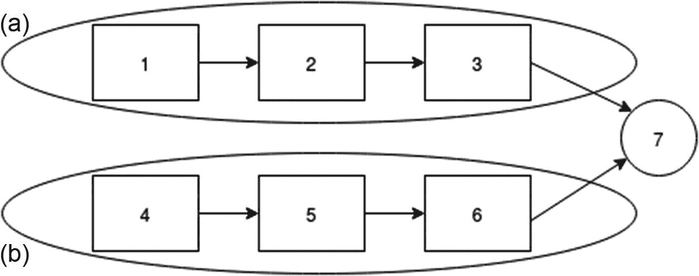
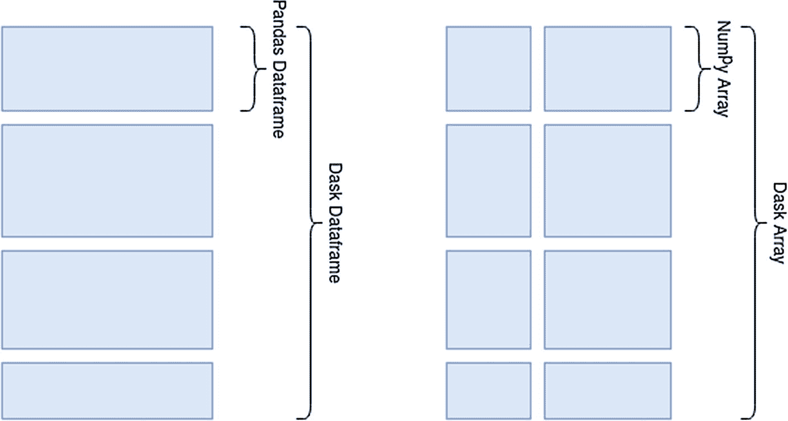
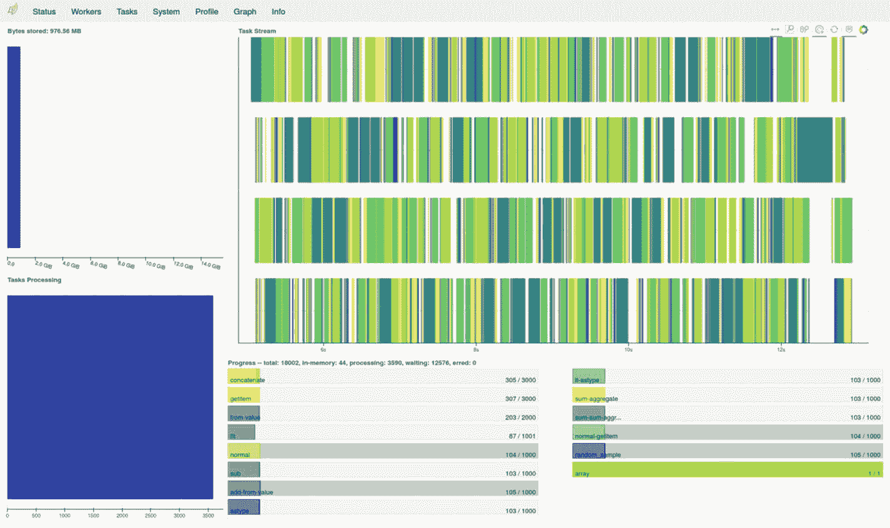
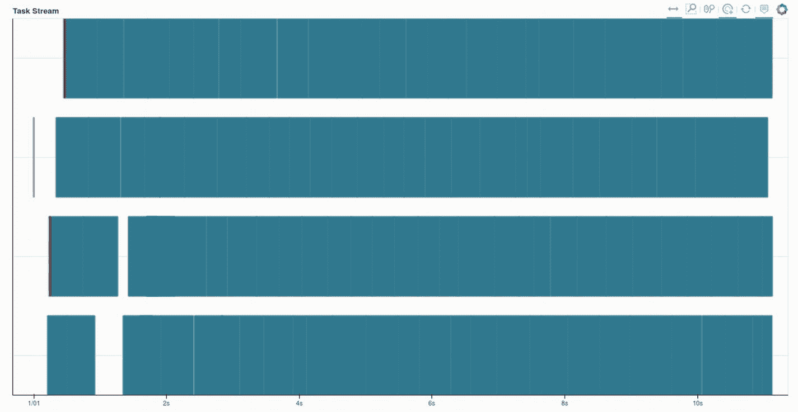
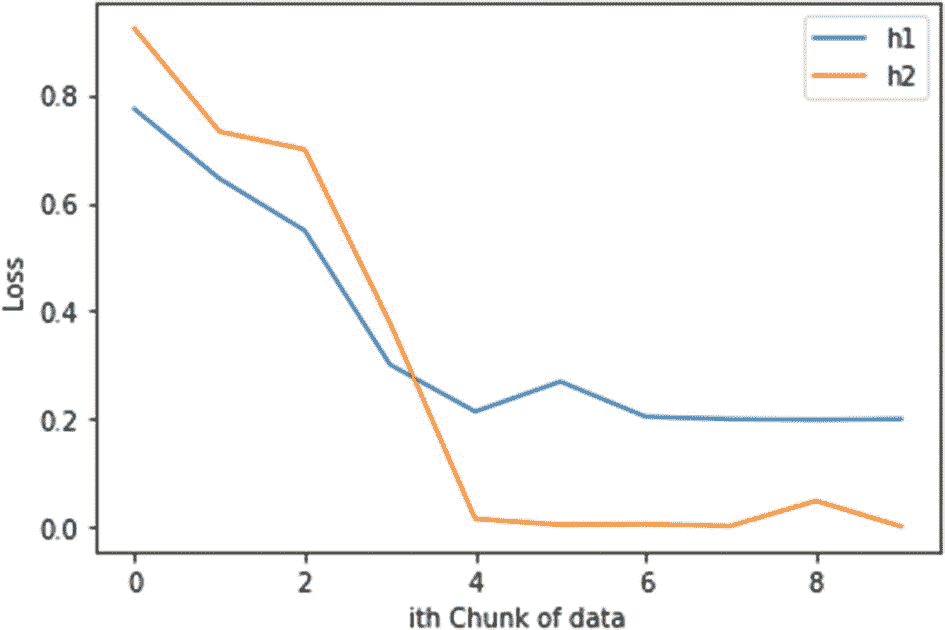
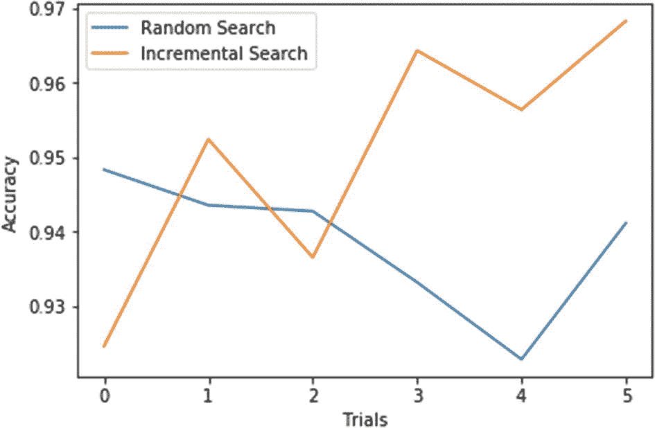

# 三、解决时间和内存限制

在优化超参数时，我们面临两个主要问题:

*   内存限制:有时我们不得不处理数百千兆字节的数据。我们不能在 RAM 中存储如此大量的数据。在训练一个神经网络的时候，我们批量发送数据。一个可能的解决方案是更大的内存，但这并不总是可行的。

*   **时间/计算约束**:假设我们的数据适合内存，但我们正在训练一个深度神经网络(DNN)或者超参数优化有巨大的搜索空间。这可能会耗费大量时间。

解决这两个问题的一个办法是使用更好的硬件。例如，在深度神经网络的情况下，可以使用图形处理单元(GPU)、张量处理单元(TPU)等来加速训练。虽然更好的硬件将在一定程度上解决这个问题，但它并不总是能够在这样的高端机器上工作。在第 [2](2.html) 章中，我们将网格搜索分布在一个高性能计算集群上，这解决了时间约束，但是高性能计算集群是一种昂贵的资源。有更简单的方法，使用不同类型的集群。在这一章中，我们将讨论 HPC 的更简单的替代方案，它们可以处理内存和时间约束。我们将主要关注培训的分布，以有效地利用可用资源。

我们将从 Dask 开始，它非常适合分发机器学习过程，并且与 scikit-learn 配合使用效果最好。然后我们将看到使用 PyTorch Distributed 和 Horovod 这样的包来分发神经网络的简单方法。

## 达斯克

Dask ( [`https://dask.org/`](https://dask.org/) )是 Python 中用于并行计算的库。它使用*动态任务调度*，类似于我们在第 [2](2.html) 章中在 HPC 集群上使用 ipyparallel 所做的，它解决了计算约束的问题。然而，Dask 比 ipyparallel 更灵活。使用动态任务调度，我们可以将训练分布在不同的机器上(而不仅仅是同一台机器上的多个内核)。

但是假设我们有一个内存限制，因为我们的数据太大了，无法一次加载到内存中。Dask 通过提供类似 Dask Dataframe、Dask array 等的*并行集合*来解决这个问题，它将数据集分布到可以在分布式环境中使用或解决大于内存的问题的块中。使用 Dask 执行的过程通常包含以下方面:

*   *收集→任务图→多线程/处理或分配*

首先，将 Dask 集合传递给任务图，任务图是所有操作的完整管道，如预处理、超参数优化、评估等。在这里，任务可以并行化或以串行方式排列。最后，调度器可以使用动态任务调度来执行任务图。如果使用单个机器，多线程/多处理可以用于在核心上并行化它，并且在集群上，任务图可以分布在节点上。在图 [3-1-1](#Fig1) 所示的任务图示例中，操作(a)和(b)是独立的，因此两者都可以并行执行。(a)中的任务 1、2 和 3 将连续执行。如果(a)在(b)之前完成，任务 7 将等待(b)完成。



图 3-1-1

任务图的一个例子

### Dask 分布式

达斯克。*分布式*是一个小型库，扩展到 *dask* 用于动态任务调度。使用 dask 时，我们主要使用来自`dask.distributed`的*客户端*():

```py
>>> from dask.distributed import Client
>>> client = Client()

```

*客户端*()帮助您连接到分布式集群。根据集群类型，Dask 集群被传递给*客户端*()。Dask 支持几种不同的集群类型，例如:

*   *SSH* :如果您有一个不受管理的集群，您需要使用 SSH 协议连接到每台机器。在这种情况下，使用下面的:

    ```py
    >>> from dask.distributed import Client, SSHCluster
    >>> cluster = SSHCluster(
                     ["localhost", "localhost", "localhost"],
                     connect_options={"known_hosts": None},
                     worker_options={"nthreads": 2},
                     scheduler_options={"port": 0,
                                      "dashboard_address": ":8797"},
                     )
    >>> client = Client(cluster)

    ```

在这里，我们为所有工人定义 IP，`connect_options`可以包含 SSH 连接的密码等信息。

*   *Kubernetes* :使用 Kubernetes 集群是使用 Dask 部署分布式应用程序的一种快速简单的方法:

    ```py
    >>> from dask_kubernetes import KubeCluster
    >>> cluster = KubeCluster.from_yaml('worker-template.yaml')
    >>> cluster.scale(40) #add 40 worker nodes

    >>> from dask.distributed import Client
    >>> client = Client(cluster)

    ```

您可以根据需要定义工作机，甚至可以使用*集群*根据工作负载对它们进行扩展。*改编*()而不是*集群*。*音阶*()。

除了这些集群类型，Dask 还支持通过 HPC、YARN(Apache Hadoop 集群)和 Amazon、Google 等提供的基于云的集群进行分发。

通过将'`processes=False'`传递给*客户端*()，将会创建一个本地集群，并且试验将会在内核上并行化:

```py
>>> from dask.distributed import Client
>>> client = Client(processes=False)
>>> print(client)
Client
Scheduler: tcp://127.0.0.1:35053
Dashboard: http://127.0.0.1:8787/status
Cluster
Workers: 1
Cores: 4
Memory: 16.73 GB

```

这显示了客户端和群集的详细信息。在这种情况下，我使用一台机器作为调度器和工作器。在实际的集群上，您可以利用更多的内核和工作线程，以及更多的内存。

Dask 提供的一个出色特性是在仪表板上可视化分布式计算(注意客户机信息下的仪表板地址)。执行搜索后，您可以在这里实时查看内核的利用率。稍后我们将看一些例子。

### 平行收藏

如图 [3-1-2](#Fig2) 所示，Dask 数据帧的大块由几个小熊猫数据帧组成。类似地，Dask 数组由更小的 NumPy 数组组成。您可以决定块的大小，以便它们适合内存。



图 3-1-2

Dask 数据帧(左)和 Dask 阵列(右)

此外，Dask dataframe 上的操作模拟了 pandas dataframe 的 API，数组也是如此。例如:

```py
#pandas
import pandas as pd
df = pd.read_csv("./dataset/train.csv")
print(df.Age.mean())

#dask
import dask.dataframe as dd
df = dd.read_csv("./dataset/train.csv")
print(df.Age.mean().compute())

```

唯一的区别是你需要使用`.compute()`来执行 Dask 中的操作。虽然不是所有的 NumPy 和 Pandas 接口都被支持。

由于 Daks 并行集合有助于解决内存限制，所以让我们对一个大型数据集建模，否则它将无法容纳在内存中，更不用说训练了。

首先初始化客户端:

```py
>>> from dask.distributed import Client
>>> client = Client(processes=False)

```

现在制作 Dask 系列:

```py
>>> from dask_ml import datasets
>>> from dask_ml.model_selection import train_test_split
>>> import dask.array as da

>>> X, y = datasets.make_classification(n_samples=100000000,
                                      n_features=7,
                                      random_state=0,
                                      chunks=100000)
>>> classes = da.unique(y_train).compute()

>>> X_train, X_test, y_train, y_test = train_test_split(X, y)

```

现在我们有一个巨大的数据集，它有 1 亿行，每一行有 7 个特征和两个类。图 [3-1-3](#Fig3) 显示了一个 5.6 GB 大的数据，该数据分为 1000 个区块，每个区块有 100，000 行，每个区块 5.6 MB。


图 3-1-3

(a)是变量 X 的表示，而(b)是变量 y 的表示

创建块的目的是不必将整个数据集加载到内存中；只有 scikit-learn 中带有' partial_fit '的算法支持这一点。我将使用 SGD 分类器对数据集建模:

```py
>>> from sklearn.linear_model import SGDClassifier
>>> clf = SGDClassifier(loss='log', penalty="l2", tol=0.01)

```

执行`clf.fit(X_train, y_train)`将在数据集上迭代一次。为了针对多次迭代进一步训练分类器，我们可以使用一个简单的`for`循环。我们必须将 scikit-learn 的 SGD 分类器包装到 Dask 的`Incremental`函数中，该函数管理数据，以便模型将被分块训练。

```py
>>> from dask_ml.wrappers import Incremental
>>> clf = Incremental(clf, scoring="accuracy")

>>> clf.fit(X_train, y_train, classes=classes)

```

一旦你执行了这个，查看 Dask 仪表板，在那里你可以看到正在进行的各种过程，如图 [3-1-4](#Fig4) 所示。



图 3-1-4

Dask dashboard 任务流窗格显示了代表四个内核的四个条形。

### 动态任务调度

scikit-learn 中实现的大多数算法都能够使用“joblib ”,它在单个机器的内核上提供基于线程/进程的分布。使用 Dask，我们可以将这些算法分布在一个集群上，就像我们在第 [2](2.html) 章的 HPC 集群示例中使用 ipyparallel 一样。

Dask 更加灵活，在所有不同类型的分布式系统上提供并行支持，如图 3-1-5 所示。


图 3-1-5

(a)sci kit——在 JobLib 的帮助下，learn 可以将训练分布到单个机器的核心上。(b)利用 Dask，相同的过程可以分布在单个机器或者甚至机器集群的核心上

让我们以使用 scikit-learn 的串行优化和使用 Dask 的分布轨迹优化支持向量机的超参数为例，并比较时间:

```py
from sklearn.datasets import load_digits
from sklearn.model_selection import GridSearchCV, train_test_split
from sklearn.svm import SVC

X, y = load_digits().data, load_digits().target

X_train, X_test, y_train, y_test = train_test_split(X, y, test_size = 0.3, shuffle=True)

c = 0.001
gamma = 1e-10
param_grid = {
           "C": [c*(10**i) for i in range(1,14)],
           "gamma": [gamma*(10**i) for i in range(1,14)]
          }

clf = SVC(kernel='rbf')
search = GridSearchCV(clf, param_grid, cv=3)

```

在前面的代码中，我们已经加载了“digits”数据集，我们将使用`GridSearchCV()`优化“C”和“gamma”。首先，让我们只使用不带 Joblib 的 ScikitLearn 示例。

```py
>>> import time

>>> since = time.time()
>>> model = search.fit(X_train, y_train)
>>> print(time.time()-since)

```

在超参数网格上的总试验次数为 169 次，耗时 75.01 秒。请注意，我们正在连续运行网格搜索。

现在，让我们使用 Dask 在内核上并行化我们的试验:

```py
>>> import joblib
>>> import time
>>> from dask.distributed import Client
>>> client = Client(processes=False)

>>> since = time.time()
>>> with joblib.parallel_backend('dask', scatter=[X_train, y_train]):
            model = search.fit(X_train, y_train)
>>> print(time.time()-since)

```

现在 JobLib 将使用 Dask 的客户端，在这种情况下，它是一个本地集群，用于在内核上分布 169 种可能的组合。同样的任务花费的时间是 34.73 秒。对于只有四个内核的情况来说，这是一个巨大的改进，因此在实际的机器集群上有很大的改进空间。检查 Dask 仪表板以可视化核心使用情况，如图 [3-1-6](#Fig6) 所示。



图 3-1-6

任务流窗格显示四个水平条，表示四个核心

Note

前面所有的实验都是在本地机器上进行的，其中调度器和集群是相同的。在“动态任务调度”一节给出的例子中，我们可以单独使用 scikit-learn 在一台机器的内核上进行分配，而不是使用 Dask。

### 利用 Dask 优化超参数

正如我们在前面几个例子中看到的，我们可以使用 Dask 进行超参数优化来解决时间和内存限制。让我们回顾一下 scikit-learn 中超参数优化的算法及其分布:

*   我们可以使用简单明了的 scikit-learn 的随机搜索和网格搜索，并传递参数`'n_jobs'=-1`来使用单台机器上的所有内核。这解决了计算/时间限制。

*   我们可以使用 scikit-learn 并将其代码包装在`with parallel_backend('dask'):`中，就像我们在“动态任务调度”一节的示例中所做的那样，无论是随机搜索还是网格搜索，或者是用“ *joblib* 实现的任何其他算法。我们可以在一台机器上使用所有内核，也可以将它们分布在一个集群上，这取决于 dask.distributed 的`client()`如何定义。如果使用集群，这将进一步减少时间。

现在让我们看看 Dask 还为我们提供了什么超参数优化。

#### Dask 随机搜索和网格搜索

我们不能使用 scikit-learn 提供的随机搜索或网格搜索来训练大型数据集，因为它们不支持“partial_fit”。然而，Dask 为我们提供了这两种算法的替代物，`dask_ml.model_selection.GridSearchCV`和`dask_ml.model_selection.RandomizedSearchCV`。Dask 和 scikit-learn 中各自算法的接口是相似的，但是 Dask 的接口实现了‘partial _ fit ’,因此我们可以在`Incremental`中包装 Scikit-Learn 的机器学习算法，并将其传递给这些超参数优化算法。

该设置不仅可以在数据块中训练模型，还可以将其分布在集群上，从而解决时间和内存问题。这些步骤非常简单，和我们之前做的一样:

1.  定义一个客户。

2.  定义搜索空间。

3.  制作一个巨大的数据集来测试我们的分布式模型。

4.  列车测试分离。

5.  定义使用部分拟合的 ML 算法，如 SGD 分类器。

6.  将 ML 算法封装在`Incremental`中，以便在将数据分发到内核/集群时，可以分块管理和训练数据。

7.  在从 Dask 导入的基础上使用网格搜索，因为它实现了“partial_fit”。

8.  在`joblib.parallel_backend`下训练模型，以便进一步分发。

然而，在遵循这些步骤时，我遇到了一个有趣的问题。当我执行代码时，我检查了 Dask 仪表板。内存开始变满。这个问题是由于准确性得分。在我使用了‘dask _ ml’中的准确性度量标准后，问题就解决了。

让我们来看一个例子:

```py
from dask_ml import datasets
from dask_ml.wrappers import Incremental
from dask_ml.model_selection import train_test_split, GridSearchCV
from dask_ml.metrics import accuracy_score

from sklearn.metrics import make_scorer
from sklearn.linear_model import SGDClassifier

import joblib

import dask.array as da
from dask.distributed import Client
client = Client(processes=False)
print(client.dashboard_link)

param_grid = {
            "penalty": ['l1', 'l2'],
            "tol": [1e-2, 1e-3, 1e-4]
            }

X, y = datasets.make_classification(n_samples=100000000,
                                  n_features=7,
                                  random_state=0,
                                  chunks=100000)

# providing an accuracy metrics from 'dask_ml'
scorer = make_scorer(accuracy_score)

X_train, X_test, y_train, y_test = train_test_split(X, y)

clf = SGDClassifier(loss='log')
clf_wrap = Incremental(clf, scoring=scorer)
searh_clf = GridSearchCV(clf_wrap, param_grid, cv=3)

with joblib.parallel_backend('dask'):
      model = searh_clf.fit(X_train, y_train)

```

Note

经过一番调查，我发现在缺省情况下计算分数时使用了“SGDClassifier.score ”,这会将大量的“dask arrays”转换为“ndarray ”,从而导致高内存使用率。当我使用‘dask _ ml’的记分员时，它解决了这个问题。

所以，你需要注意你的数据块没有被转换成“numpy 数组”；否则它最终会填满内存。这里使用 Dask 数据帧和 Dask 数组的目的是为了不填满内存。

#### 增量搜索

这是另一个搜索超参数的好方法。正如我们所知，Dask 可以将数据分成块，使用“partial_fit”的算法可以一次性训练小数据。增量搜索算法利用了这个概念。它在各种超参数集的较小数据集块上训练几个模型。它继续仅对表现最好的一组超参数进行进一步训练。然而，这种方法有一个缺点:如果超参数在后期开始表现得更好怎么办？例如，在图 [3-1-7](#Fig7) 中，我们有两个超参数，h1 和 h2，我们将模型训练到第九个数据块。最初，h1 表现得更好，但后来 h2 开始表现得更好。但是如果我们在第二次卡盘时停止训练，我们不会知道这一点，并且会丢弃 h2。



图 3-1-7

随着更多的数据块被传递用于训练，丢失减少

使用增量搜索非常简单，如下所示。该接口类似于 GridSearchCV 或 RandomSearchCV 的接口。

```py
from dask_ml.model_selection import IncrementalSearchCV
from sklearn.linear_model import SGDClassifier

param_grid = {
            "penalty": ['l1', 'l2'],
            "tol": [1e-1, 1e-2, 1e-3, 1e-4, 1e-5, 1e-6]
            }

clf = IncrementalSearchCV(SGDClassifier(), param_grid)

#fit the data to train

```

图 [3-1-8](#Fig8) 显示了对比随机搜索和增量搜索的试验与准确度图。



图 3-1-8

随机搜索和增量搜索的比较。数字数据集来自 sklearn，在 SGD 分类器上训练。比较前五次试验的结果

#### 连续搜索

成功减半搜索有点类似于增量搜索。时间预算(B)被均匀地分配给所有超参数集。我们开始在有限的数据量上训练模型，我们从使用所有超参数集开始。一旦所有的模型都被训练好，一半表现最差的集合被丢弃。在下一次迭代中，剩余的一半现在在比以前更多的数据上被训练，被评估，并且先前一半的一半再次被丢弃。

这个过程一直持续到剩下一个最佳集合，从而将更多的资源分配给性能更好的超参数。使用 Dask 实现连续减半，如下所示:

```py
from dask_ml.model_selection import SuccessiveHalvingSearchCV
from sklearn.linear_model import SGDClassifier

clf = SuccessiveHalvingSearchCV(SGDClassifier(), param_grid, n_initial_iter=2)
#call fit to train data

```

这里，我们必须将`n_initial_iter`传递给我们的搜索函数，它定义了最初调用‘partial _ fit’的次数。

不过，同样的问题可能会持续存在于增量搜索中，如果我们提前停止，可能会选择一组错误的超参数。

#### 超波段搜索

Hyperband <sup>[1](#Fn1)</sup> 是一种基于 bandit 的方法，用于解决超参数优化问题。基于 bandit 的方法在这里完美地解决了我们的问题:我们的资源数量有限，但是我们需要高效地将它们分配给所有的试验。同样，我们在性能更好的模型上花费更多时间，而不是在超参数的糟糕配置上浪费我们的资源和时间。

Hyperband 是连续减半的扩展版本。在连续的减半中，我们对于我们的超参数集(n)有固定的预算(B ),并且‘B/n’资源被均匀地分配给‘n’中的所有集。但是我们应该如何选择 n 仍然是一个问题。有两种可能性:

*   我们应该考虑较小的“n”值，以便为每个配置提供更多的资源，并且训练时间更长。但是这样会覆盖更少的搜索空间。当准确度分数更依赖于训练数据而不是超参数时，这种情况可能是有利的。

*   我们应该考虑较高的“n”值，以便用较少的训练量覆盖更多的搜索空间。如果超参数的变化导致准确性/损失分数的巨大变化，则较高的“n”值会更好，不像图 [3-1-7](#Fig7) 中的情况，在后一阶段，我们需要训练更长时间以使损失分数达到饱和。

Hyperband 通过保持 B 的值为常数并改变“n”的值来解决“n v/s B/n”的问题。因此，较大的“n”值导致积极的早期停止，因为每组超参数的预算减少了。在 Hyperband 中，我们每次迭代连续减半时都会改变“n”的值。有一个嵌套循环。当内部循环执行连续搜索时，外部循环在不同的‘n’值上迭代。并行化有很多可能性，Hyperband 的 Dask 实现利用了这一点:

```py
from dask_ml.model_selection import HyperbandSearchCV
from sklearn.linear_model import SGDClassifier

clf = HyperbandSearchCV(SGDClassifier(), param_grid)
#call fit to train data

```

给予 Hyperband 的两个重要参数是`max_iter`，它定义了调用‘partial _ fit’的次数，以及‘partial _ fit’的块大小。这两个参数都由经验法则确定，其中`max_iter`等于超参数组合的数量(n_param ),卡盘尺寸是 n_param/n_examples，其中 n_examples 是模型被训练的样本数量；例如，如果 X_train 经过五次迭代训练，则 n_examples = 5*len(X_train)。

Note

当使用这些优化算法(增量搜索、连续减半、增量搜索)时，您只能使用使用“partial_fit”的建模算法，因为整个想法是尽早停止训练，这是我们无法用其他算法做到的。虽然可以使用 RandomSearchCV 和 GridSearchCV 在一个集群上分布试验，但是当数据是成块训练的时候(大于内存的情况)就不能使用了；在这种情况下，您需要再次“partial_fit”。这些方法在处理神经网络时非常有用，因为它们是成批训练的。

Dask 序列化几个对象以便分发。scikit-learn 和 PyTorch 将更好地使用这些算法，因为它们使用 pickle 协议，不像 TensorFlow 和 Keras。但是当使用 Keras 和 TensorFlow 时，您可以应用其他算法，如 GridSearchCV、RandomSearchCV 等。这一点我们将在下一节讨论。

## 分发深度学习模型

深度学习模型的训练成本相当高。在集群上分布神经网络训练，然后在此基础上应用超参数优化，可以帮助我们节省大量时间。深度学习框架有用于分发的模块；例如，TensorFlow Distributed(扩展到 TensorFlow 和 Keras)、PyTorch Distributed(扩展到 PyTorch)、Horovod 等等。用 TensorFlow 分布式分发是一种痛苦。您必须创建参数服务器并更改大量代码。在本节中，我们将讨论 PyTorch 分布式和 Horovod 分布式深度神经网络，同时训练 MNIST 数据集。如果您想快速复习 PyTorch API 的使用，请参考附录 II。

### PyTorch 已分发

在机器上分布和在集群上分布的主要区别在于，在集群中，我们需要有一个后端通信 API 来在节点之间进行通信。这是 PyTorch 的强大之处之一。PyTorch 支持所有三种主要的后端通信 API:NCCL(NVIDIA 集体通信库，发音为“Nickel”)、Gloo 和 MPI(消息传递接口)。下面的例子强烈地基于一个 GitHub 回购( [`https://github.com/seba-1511/dist_tuto.pth`](https://github.com/seba-1511/dist_tuto.pth) ):

```py
import torch
import torch.nn as nn
import torch.nn.functional as F
import torch.optim as optim
import torch.distributed as dist
from torch.autograd import Variable
from torch.multiprocessing import Process

import os
from math import ceil
from random import Random
from torchvision import datasets, transforms

def init_processes(rank, size, fn, backend="gloo"):
      os.environ['MASTER_ADDR'] = '127.0.0.1'
      os.environ['MASTER_PORT'] = '29500'
      dist.init_process_group(backend, rank=rank, world_size=size)
      fn(rank, size)

```

我们从定义通信后端开始；我们将使用“gloo”。接下来，我们定义主地址和主端口，以便所有节点都向一个中央主节点报告。每次执行函数`init_processes`时，都会创建一个新的进程组，并执行函数`fn()`。在我们的例子中,`fn`将是一个训练神经网络的函数，因此我们稍后将编写一个函数，该函数将训练子样本上的模型，然后对梯度进行平均。

Note

PyTorch 文档建议在使用 CPU 时使用“gloo ”,在 GPU 上训练时使用“nccl”。

```py
class Net(nn.Module):

      def __init__(self):
            super(Net, self).__init__()
            self.conv1 = nn.Conv2d(1, 10, kernel_size=5)
            self.conv2 = nn.Conv2d(10, 20, kernel_size=5)
            self.conv2_drop = nn.Dropout2d()
            self.fc1 = nn.Linear(320, 50)
            self.fc2 = nn.Linear(50, 10)

      def forward(self, x):
            x = F.relu(F.max_pool2d(self.conv1(x), 2))
            x = F.relu(F.max_pool2d(self.conv2_drop(self.conv2(x)), 2))
            x = x.view(-1, 320)
            x = F.relu(self.fc1(x))
            x = F.dropout(x, training=self.training)
            x = self.fc2(x)
            return F.log_softmax(x)

```

我们需要创建一个神经网络来构建模型，因此我们在这里定义一个简单的卷积网络:

```py
class Partition(object):

      def __init__(self, data, index):
            self.data = data
            self.index = index

      def __len__(self):
            return len(self.index)

      def __getitem__(self, index):
            data_idx = self.index[index]
            return self.data[data_idx]

class DataPartitioner(object):

      def __init__(self, data, sizes=[0.7, 0.2, 0.1], seed=1234):
            self.data = data
            self.partitions = []
            rng = Random()
            rng.seed(seed)
            data_len = len(data)
            indexes = [x for x in range(0, data_len)]
            rng.shuffle(indexes)

            for frac in sizes:
                  part_len = int(frac * data_len)
                  self.partitions.append(indexes[0:part_len])
                  indexes = indexes[part_len:]

      def use(self, partition):
            return Partition(self.data, self.partitions[partition])

```

我们的模型是并行训练的，所以一旦对一批数据进行了训练，我们就需要更新所有的梯度。因此，一旦一批训练完成，我们收集所有梯度并取其平均值。数据以相等的分数发送到所有节点，使得每个模型的收敛保持一致。分区是根据正在运行的进程数量来完成的。我们可以使用前面清单中标识的类来获取特定部分的数据。

```py
def partition_dataset():
      transformations = [transforms.ToTensor(),
                         transforms.Normalize((0.1307, ), (0.3081, ))
                        ]
      dataset = datasets.MNIST('./data',
                               train=True,
                               download=True,
                               transform=transforms.Compose(transformations)
                              )
      size = dist.get_world_size()
      bsz = int(8 / float(size))
      partition_sizes = [1.0 / size for _ in range(size)]
      partition = DataPartitioner(dataset, partition_sizes)
      partition = partition.use(dist.get_rank())
      train_set = torch.utils.data.DataLoader(
                                  partition, batch_size=bsz, shuffle=True)
      return train_set, bsz

```

该函数加载 MNIST 数据集，并使用`DataPartitioner()`对数据进行分区。`dist.get_world_size()`返回当前进程组中的进程数。因此，如果运行三个进程，我们将有三个分区，每个分区的分数为 0.33。类似地，对于批量，我们将所需的批量除以流程数:

```py
def average_gradients(model):
      size = float(dist.get_world_size())
      for param in model.parameters():
            dist.all_reduce(param.grad.data, op=dist.reduce_op.SUM)
            param.grad.data /= size

```

这里我们平均梯度。`all_reduce`更新所有分布式模型中的参数。现在我们定义优化模型的函数，我们将传递给`init_processes()`。

```py
def run(rank, size):
      torch.manual_seed(1234)
      train_set, bsz = partition_dataset()
      model = Net()
      model = model
      optimizer = optim.SGD(model.parameters(), lr=0.01, momentum=0.5)

      num_batches = ceil(len(train_set.dataset) / float(bsz))
      for epoch in range(10):
            epoch_loss = 0.0
            for data, target in train_set:
                  data, target = Variable(data), Variable(target)
                  optimizer.zero_grad()
                  output = model(data)
                  loss = F.nll_loss(output, target)
                  epoch_loss += loss.item()
                  loss.backward()
                  average_gradients(model)
                  optimizer.step()
            print(f'Rank: {dist.get_rank()}, \
                    Epoch: {epoch}, \
                    Loss: {epoch_loss / num_batches}')

```

每一个等级表示被平行训练的模型。我们打电话让火车准备好。迭代时，我们使用函数`average_gradients()`来平均梯度。现在，我们终于可以通过将函数`run()`传递给`init_processes()`来开始分布式训练了:

```py
size = 3
processes = []
for rank in range(size):
      p = Process(target=init_processes, args=(rank, size, run))
      p.start()
      processes.append(p)

for p in processes:
      p.join()

```

这将启动您的分布式培训。利用这一点，根据网络和用例进行一些编辑，我们可以在计算机集群上训练深度学习模型。

### 霍罗沃德

Horovod 是一个开源的分布式深度学习训练库，可以与 PyTorch 和 TensorFlow/Keras 一起工作。如果您有未分发的培训代码，您可以简单地使用 Horovod，只需添加几行代码就可以使其分发。(请参考有关如何在不同集群上分发的文档。)与 PyTorch Distributed 类似，Horovod 能够使用 Gloo 和 MPI 以及其他后端通信。在这一节中，我们将研究我们需要进行哪些更改，以及它们与上一节中的 PyTorch 实现有何相似之处。

用 PyTorch 编写一个简单的代码，在一个简单的机器上训练一个神经网络。关于这一点，你可以参考附录二的 PyTorch 部分。创建以下函数:

*   `Network()`:从`torch.nn.Module`扩展的一个类，用于创建神经网络架构

*   `train_epoch()`:可以为单机训练神经网络的功能

还要定义这些全局变量:`batch_size`、`learning_rate`、`momentum`和`epochs`。下面这段代码展示了我们如何使用 horovod 来分发模型训练:

```py
import horovod.torch as hvd
from sparkdl import HorovodRunner
from torch.utils.data.distributed import DistributedSampler

def train_hvd():
      hvd.init()
      device = torch.device('cuda' if torch.cuda.is_available() else 'cpu')

      if device.type == 'cuda':
           torch.cuda.set_device(hvd.local_rank())

      transformation = [transforms.ToTensor(),
                        transforms.Normalize((0.1307,), (0.3081,))]
      train_dataset = datasets.MNIST(
                                root=f'data-{hvd.rank()}',
                                train=True,
                                download=True,
                                transform=transforms.Compose(transformation)
                                )

      train_sampler = DistributedSampler(train_dataset,
                                         num_replicas=hvd.size(),
                                         rank=hvd.rank())
      train_loader = torch.utils.data.DataLoader(train_dataset,
                                 batch_size=int(batch_size/hvd.size()),
                                 sampler=train_sampler)
      model = Network().to(device)
      optimizer = optim.SGD(model.parameters(),
                            lr=learning_rate,
                            momentum=momentum)
      optimizer = hvd.DistributedOptimizer(optimizer,
                          named_parameters=model.named_parameters())

      hvd.broadcast_parameters(model.state_dict(), root_rank=0)

      for epoch in range(1, epochs + 1):
            train_epoch(train_loader)

```

函数`train_hvd()`非常类似于我们在使用 PyTorch Distributed 时所做的。`hvd.rank()`给出了 worker ID，所以我们为集群中的每个 worker (rank)创建了一个单独的根文件夹。

类似于上一节中我们使用`partition_dataset()`在工作线程之间创建和划分数据，这里我们使用`DistributedSampler()`根据工作线程的数量创建数据集的分区，并将对象交给 Dataloader()来生成数据集。同样，有效的批量大小是根据工人的数量而定的。

在定义了`optimizer`之后，我们将其包装在`hvd.DistributedOptimizer()`中，这类似于我们之前使用的`all_reduce()`。梯度是在不同节点上运行的模型之间的平均值。`hvc.broadcast_parameters()`用新渐变更新所有渐变。它确保所有等级的模型都以相同的参数开始。

现在，为了跨集群分发此培训，我们将使用由`HorovodRunner`提供的简单接口:

```py
hr = HorovodRunner(np=2)
hr.run(train_hvd)

```

这里，`np`定义工人数量，`hr.run()`开始分布式培训。

当您在数百到数千维中优化超参数时，这些分布方法可以派上用场。优化超参数时，时间效率和资源利用率都是重要的方面。

在下一章，你将看到更高级的基于贝叶斯的优化方法，它实际上是从以前的试验中学习的。

<aside aria-label="Footnotes" class="FootnoteSection" epub:type="footnotes">Footnotes [1](#Fn1_source)

“Hyperband:一种新的基于 Bandit 的超参数优化方法”，L. Li，K. Jamieson，G. DeSalvo，A. Rostamizadeh 和 A. Talwalkar，*机器学习研究杂志* 18 (2018) 1-52。

 </aside>