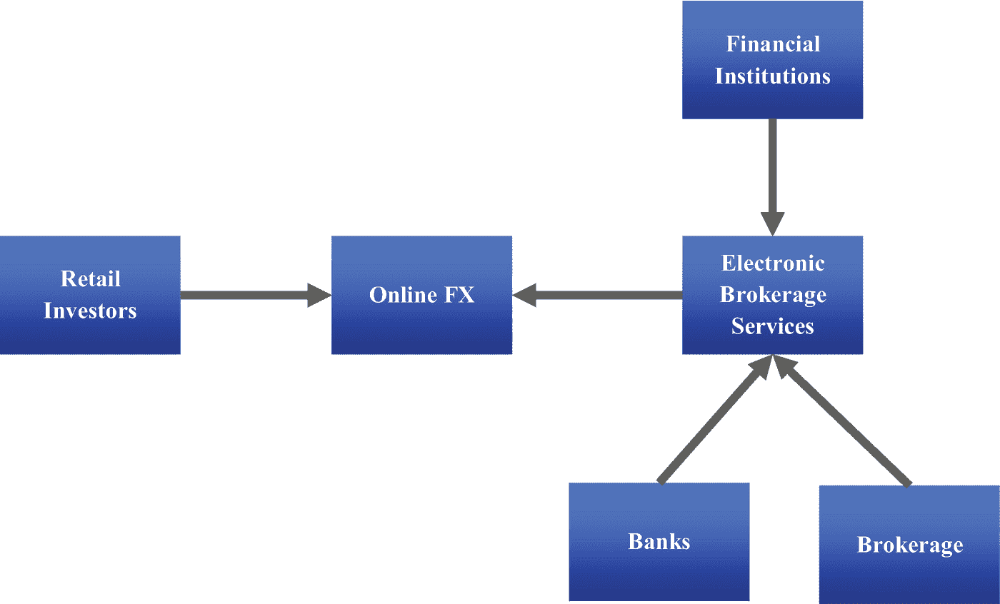
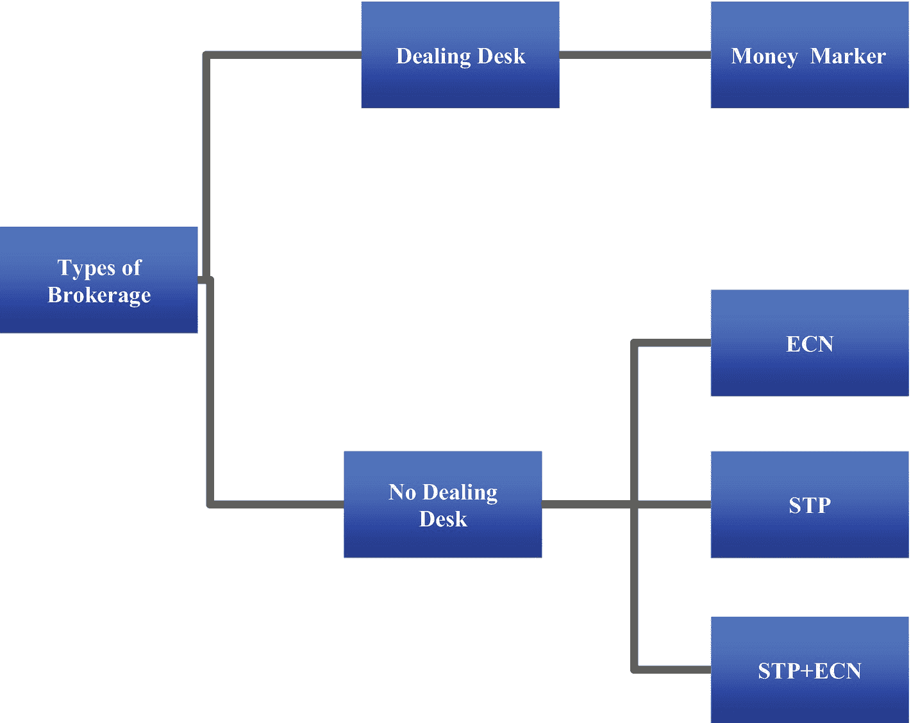
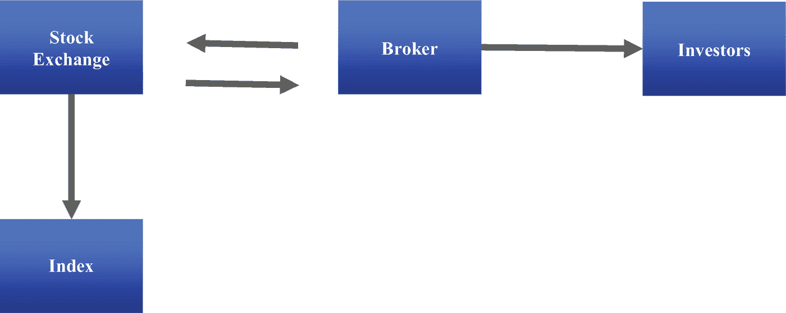
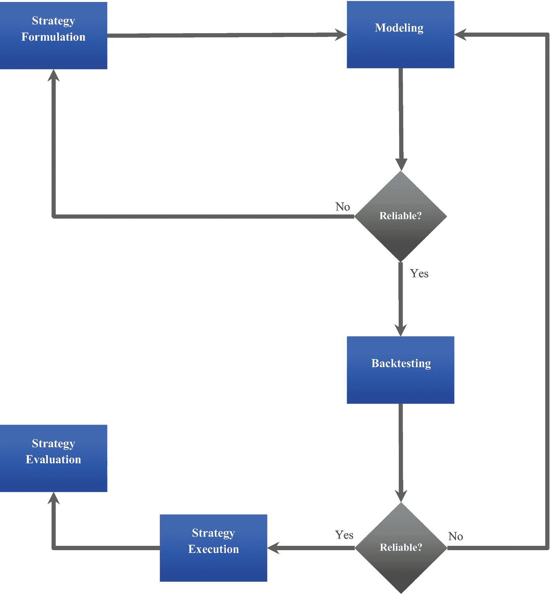
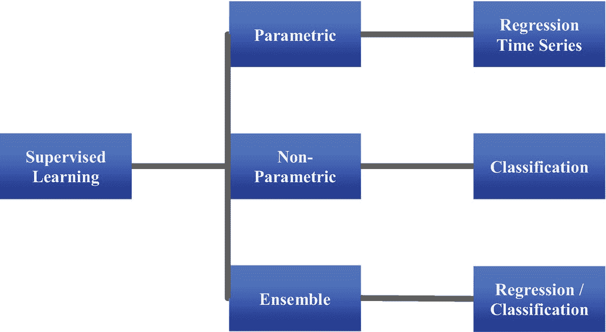
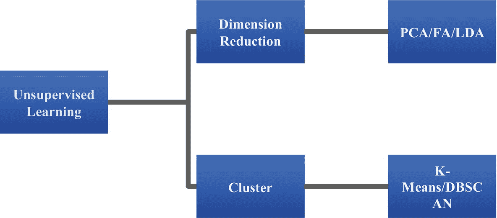

# 一、金融市场和算法交易介绍

这是一本介绍算法交易的书的第一章。本章仔细介绍了外汇市场和股票市场。它探索了我们如何配对、报价和交换官方货币。随后，它涵盖了证券交易所。此外，它还展示了主要的市场参与者、主要经纪人、流动性提供者、现代技术以及促进货币和股票交易的软件平台。此外，它着眼于外汇市场和股票交易市场的投机性质和投资风险管理的具体方面。最后，它涵盖了几种我们可以用来解决金融问题的机器学习方法。

## 外汇市场

外汇市场代表了一个国际市场，投资者可以在这个市场上将一种货币兑换成另一种货币。它没有交易发生的主要可见位置，每个投资者持有他们自己的交易记录，并且每个交易都以电子方式发生。主要市场参与者使用其地理边界内的监管机构规定的指导原则进行自我监管。

### 汇率

每个官方国家一般都有自己的货币。货币是由中央政府管理和分配的一类支付，分散在各地的地理边界。在对外贸易中，个人或公司购买外国商品或服务并在当地市场销售，通常需要兑换货币。我们普遍认为汇率是本币对外币的价格比率。主要的货币包括美元、欧元(€)、英镑、日元等。交叉汇率是一种货币对另一种货币的价格，其中不涉及美元。例如，欧元/英镑是欧元和英镑之间的交叉汇率。

#### 汇率报价

汇率代表一种货币相对于另一种货币的价格。我们直接或间接引用货币。使用直接法，汇率显示了一个单位的外币需要兑换多少当地货币。例如，欧元/美元= 1.19。间接法显示一个单位的当地货币可以兑换多少外币。例如，美元/欧元= 0.84。

### 汇率变动

汇率变化无常；它随时间而变化。影响汇率变化的主要因素有几个。例如，经济和增长因素，如国内生产总值增长、通货膨胀率(消费价格指数或国内生产总值平减指数)、股票交易、外债存量、经常账户余额、总储备等。在其他情况下，利率可能会对地缘政治新闻、自然灾害、工会活动、社会动荡、公司丑闻等做出反应。当变化降临时，我们说一种货币比另一种货币更强或更弱。例如，对于欧元/美元货币对，如果欧元走强，美元将逐步走弱。假设欧元/美元开盘于 1.2100，收盘于 1.2190；我们认为欧元走强，因为收盘时 1 欧元买入的美元比开盘时多。

*   Assuming an investor buys 1 million euros at 1.2100 at the open, assuming it will strengthen on that day, but the euro closes at 1.2190, the investor has experienced $7 383\. 10(€9000) loss.

    

### 出价和报价

做市商代表的是一个以反映在系统中的价格自行兑换货币的组织。普通的做市商包括银行和经纪人。他们报出两种费率如下:

*   出价:做市商买入货币的利率

*   报价:做市商卖出基础货币的利率

#### 左出价和右出价规则

尽管做市商交易可能很棘手，但他们是在同时买入和卖出。他们买入报价左边的基础货币，卖出报价右边的货币。例如，如果做市商对欧元/美元的报价为 1.2100/15，他们将在€1.2100 买入美元，在€1.2115 卖出美元。

<colgroup><col class="tcol1 align-left"> <col class="tcol2 align-left"></colgroup> 
| 

欧元/美元

 |   |
| --- | --- |
| **投标** | **提问** |
| 1.2100 | 1.2115 |

买价和卖价之间的差额叫做*价差*。它告诉我们流动性。市场流动性越强，价差就越小。为了理解这是如何工作的，让我们看看次要货币对和主要货币。新兴市场中的货币对，如南非兰特对卢比(are 印度卢比)、孟加拉塔卡对阿曼里亚尔(BDT/OMR)等，交易活动较少，交易量较小。这导致与英镑兑美元(USD)、澳元兑美元(USD)等主要货币相比存在较高的利差。等式 [1-1](#Equ1) 显示了我们如何找到价差。

(Equation 1-1)

考虑欧元/美元报价为 1.2100/15 的情况；价差等于 0.015。

保证金代表买价和卖价之间的差额除以卖价。数学上可以写成等式 [1-2](#Equ2) 。

(Equation 1-2)

*保证金*等于 1.2381%。

*   假设你是一个正在欧洲旅游的美国游客，想要欧元；你必须用你到达时携带的美元购买欧元。做市商会以€1.2115 卖给你。相反，如果你是卖方，做市商在€1.2100 买入货币。

### 银行间市场

银行间市场包含了外汇市场的很大一部分。这是一个大型金融公司的国际网络，尤其是使用现金余额进行货币交易的跨国银行。我们同样承认银行间市场是批发市场。该市场的主要参与者通过他们的采购活动和销售业务影响价格变动和利率风险的方向。他们根据未来价格预测设定货币对的买价和卖价。中央银行经常检查主要市场参与者的活动，以确定他们的交易对经济稳定的影响。此外，他们使用财政政策和货币政策等复杂工具来推动价格变动。

### 零售市场

零售市场是外汇市场的一个狭窄部分。它包括不直接参与银行间市场的投资者。在零售市场，投资者利用经纪公司提供的复杂技术、系统和软件在互联网上进行交易。

图 [1-1](#Fig1) 显示电子经纪服务(EBS)从银行、经纪公司和其他金融机构接收价格，然后提供给散户。它提供了一个电子平台，使散户投资者能够用货币标记进行交易。市场上的主要金融机构包括保险公司、投资公司、对冲基金等。EBS 妥协于领先银行(EBS 的替代方案是汤森路透匹配)。老牌银行包括高盛、摩根大通和汇丰等。一些最受欢迎的经纪公司包括盛宝银行、IG 集团、Pepperstone 等。

图 1-1

外汇市场的简单例子

#### 佣金

经纪业务包括提供一个促进交易的稳定平台。经纪公司通常会发行散户投资者的交易账户，以及用于交换金融工具的基础设施。图 [1-2](#Fig2) 展示了各种类型的经纪人。

图 1-2

经纪人的类型

经纪公司的运作方式略有不同。这些公司必须注册，并遵循其地理边界内的监管机构制定的合规性标准。主要监管机构包括美国商品和期货交易委员会、澳大利亚证券和投资委员会(ASIC)以及英国金融行为监管局(FCA)。下面，我们考虑一级经纪公司。

##### 桌面交易经纪人

桌面交易(DD)经纪人向投资者提供固定利差和流动性。他们为投资者建立了一个市场，并接受投资者相反的指令，这意味着他们与客户交易。他们根据自己对未来价格的预测，统一决定买卖价格。它们的利率并非来自银行间市场。

##### 没有桌面交易经纪人

无桌面交易(NDD)经纪人不通过桌面交易传递投资者的指令。他们也不接受投资者执行的交易的另一面。为了创收，他们收取少量佣金和/或略微影响价差。有两个主要的 NDD 经纪人，即:1)电子通信网络经纪人和 2)直通式处理经纪人。

###### 电子通信网络经纪人

电子通信网络(ECN)经纪人确保投资者的订单与网络中其他投资者的订单相互影响。传统上，投资者包括商业银行、机构投资者、对冲基金等。他们通过出价和要价进行交易。为了创收，他们收取少量佣金，并通过强有力的营销举措吸引大量投资者。

###### 直通式加工经纪人

直通式处理(STP)经纪商将投资者的订单转给能够进入银行间市场的流动性提供者。最多，这些经纪人顺利地从许多流动性供应商那里获得许多买价和要价，如花旗银行、巴克莱银行、摩根士丹利等，这些流动性供应商仔细地对它们进行分类，然后向投资者提供加价价格。为了创收，他们要求高额佣金。与前面提到的两类经纪公司不同，这些经纪人不关心影响交易活动。

### 了解杠杆和边际

与股票市场相比，外汇市场提供了更多的过度杠杆。杠杆代表经纪人借给投资者进行交易的金额。它使投资者暴露于他们的现金余额不会有的头寸。经纪人通过保证金交易提供使用杠杆的交易账户。保证金代表持仓总价值与贷款总价值之间的差额。杠杆降低会导致保证金数量增加，反之亦然。杠杆使投资者能够执行许多他们通常使用经常账户进行的交易；你基本上可以把它看成是信用，不需要抵押品的要求。它经常用一个比率来描述。标准交易账户的杠杆类型从 1:10 到 1:100 不等。然而，一些券商确实提供杠杆高达 1:1000 的账户。比率越低，执行交易所需的资本就越高。投资者利用杠杆作用，以微小的价格变化创造更多的回报。例如，与 1:10 相比，1:1000 的账户可以让投资者进行大量交易。此外，高杠杆账户放大了利润，也放大了亏损。在某种程度上，一个账户的杠杆类型可以让你对投资者的风险状况有所了解。例如，一个期望在市场上快速获利的投资者会有一个高杠杆的账户，而一个更保守的投资者会有一个低杠杆的账户。

### 差价交易合同

差价合约(CFD) [1](#Fn1) 代表具有来自金融资产的价值的金融衍生工具。它使投资者能够从差价中获利，而不是保护一项资产。因此，投资者可以对价格走势进行投机。除了差价合约，还有一种更复杂的金融衍生品叫做*期货*。与通过经纪人私下交易的差价合约不同，期货是通过大型交易所交易的。有了期货，买方的投资者有义务在合约到期时执行交易，卖方的投资者应该在某个时期交付资产。期货有到期日，投资者在某一时期可以执行的交易数量有上限。有鉴于此，未来拥有比差价合约更严格的监管机制。

## 股票市场

我们同样认为股票市场是股票市场或股票市场。它也是世界上流动性最强的市场之一。这是一个主要由交易上市股票的大型金融公司组成的国际市场。股份代表股权的所有权。公司出售股权来筹集资金。

### 筹集资本

公司最多是寻求扩大业务经营，但资金受到资本的制约。他们可能私下或公开寻求债务融资或股权融资。债务融资包括使用抵押品借入资金。最传统的债务融资来源是大型商业银行。大多数创业公司无法从这些银行获得金融资本，因为它们风险很高(大多数创业公司都会失败)。他们使用替代债务融资来源，如小额贷款人、天使投资人和种子投资人，这取决于他们在创业旅程中所处的阶段。更多的老牌公司可以通过向公众出售股票来筹集资金。

#### 公开上市

如果一个已建立的公司想要获得大量的金融资本，那么它可以在公共证券交易所上市。 [2](#Fn2) 在他们交换公司股票之前，他们必须首先遵守特定管辖区委员会的认可程序，并进行首次公开募股。

#### 证券交易所

股票市场交易促进了公司和投资者之间的股票交易。最受欢迎的证券交易所包括伦敦证券交易所、纽约证券交易所和纳斯达克等。图 [1-3](#Fig3) 显示了股票交易市场的一个简单例子。

图 1-3

股票交易市场的一个简单例子

图 [1-3](#Fig3) 显示经纪人与证券交易所互动，并将价格传递给投资者。此外，证券交易所发布股票市场指数。证券交易所有两个市场。首先是*一级市场*，一家公司通过发布官方新闻稿、参加路演让公众了解他们的意图、申请加入并进行首次公开募股(IPO)来表明其在证券交易所上市的意图，其中包括在加入之前发行股票。在交易所注册后，一家公司通过后续要约进入*二级市场*，并向公众开放交易活动。这发生在满足交易所的合规要求时。

#### 股票交易

股票市场交易所促进股票、债券和股票等证券的交易。股票交易所的主要市场包括:一级市场，公司可以在股票上市前发行股票，这被称为首次公开募股(IPO)，二级市场，实际交易发生的地方。

### 股票指数

股票指数代表对股票市场或其部分市场的估计。该指数由一组股票组成，投资者可以作为一个整体购买，也可以购买类似于该指数的 EFT 或共同基金。表 [1-1](#Tab1) 显示主要股票指数。

表 1-1

主要股票指数

<colgroup><col class="tcol1 align-left"> <col class="tcol2 align-left"></colgroup> 
| 

名字

 | 

描述

 |
| --- | --- |
| 标准普尔(S&P) 500 指数 | 衡量美国 500 家大公司的股票表现 |
| 道琼斯工业平均指数(DJI 30) | 衡量美国 30 家大公司的股票表现 |
| 纳斯达克综合指数 | 衡量几乎所有纳斯达克股票市场的股票表现 |

主要股票指数(标准普尔 500、DJI 30 和纳斯达克 100 等)。)应用除数(通常是离散的)除以总市值，得到指数值。他们损害了不同行业的股票。它们与其他资产类别的区别并不在于我们交换它们的方式。

## 市场的投机性质

在外汇市场，投资者对一项资产的未来价格进行投机并执行交易，因此当价格向他们的投机方向移动时，他们会获得合理的回报。如果价格向相反的方向移动，那么投资者就会遭受损失。由于杠杆作用，投资者暴露在高风险之下，因为投资者被给予交易他们无法负担的资产类别的空间，这意味着他们可能会随着市场的轻微变化而损失巨额资本(见 [`https://www.capitalindex.com/bs/eng/pages/trading-guides/margin-and-leverage-explained`](https://www.capitalindex.com/bs/eng/pages/trading-guides/margin-and-leverage-explained) )。大多数交易差价合约的散户投资者损失了他们的资本。投资者在投资之前必须了解与交易相关的风险。

### 投机市场运动的技巧

投资者使用主观方法或客观方法或两者的结合来投机市场。当使用主观手段时，投资者使用他们理性化的信念、经验、他人的意见和情绪来决定是否以特定的价格买入或卖出。当使用客观性时，投资者应用数学模型来识别数据中的模式并预测未来价格，然后决定是否在特定价格买入或卖出货币对。这本书只讲机器学习和深度学习模型。

## 投资策略管理流程

图 [1-4](#Fig4) 展示了一个简单的投资策略管理流程。

图 1-4

简单的投资策略管理流程

### 战略制定

战略制定是投资管理的第一步。它涉及以下任务:

*   识别风险和机会

*   设定短期和长期目标

*   确定资源以及组织、管理和指导这些资源的方式(人力、财务和技术)

*   建立结构和政策

系统投资者对数据进行建模，以得出影响策略的有意义的见解。

### 建模

在决定管理投资组合的方法后，接下来的步骤涉及建模。它涉及到定量方法的使用。这本书从金融角度专门关注机器学习和深度学习模型。接下来的部分讨论了适用于金融，尤其是投资管理的学习方法。

#### 监督学习

在监督学习中，模型使用一个函数来预测因变量的未来值，该函数基于我们在训练过程中提供的标签对一组自变量进行操作。监督学习要求我们将数据分成训练和测试数据(有时也包括验证数据)。我们提出一个具有一组正确答案的模型，并允许它预测看不见的答案。有三种主要类型的监督学习方法，即参数方法、非参数方法和集成方法。参见图 [1-5](#Fig5) 。

图 1-5

监督机器学习

##### 参数方法

参数法也称为线性法。它对数据的结构做了强有力的假设。我们假设数据的基本结构是线性的和正态的。它把因变量作为一个连续的因变量(被限制在特定范围内的因变量)来处理。这涵盖了第 [2](2.html) 章中的时间序列分析和第 [6](6.html) 章中的普通最小二乘模型。

##### 非参数方法

与参数方法不同，非参数方法不具有线性和正态性的实质性假设。它处理分类因变量(限制在特定范围内的因变量)。主要有两种非参数方法:二元分类和多类分类。

###### 二元分类

在二进制分类中，自变量产生两个类别，如否和是或失败和通过。我们将类别编码为 0 和 1，并训练二元分类器来预测后续类别。

###### 多类分类

当因变量超过两个类别(如负、中性或正)时，我们使用多类别分类。我们将这些类编码为 0，1，2...n .编码值不应超过 10。最流行的多类分类模型包括随机森林和线性判别分析等。这本书不包括多类分类模型。

##### 系综方法

集成方法包括参数方法和非参数方法。当因变量是连续变量或分类变量时，我们使用它。它解决了线性回归和分类问题。最流行的集成方法包括支持向量机和随机森林树等。这本书不包括集合模型。

#### 无监督学习

无监督学习不需要数据来将数据分成训练数据、测试数据和验证数据。我们不会给出一个模型的正确答案；我们允许它自己形成智能猜测。聚类分析是最流行的无监督学习方法。参见图 [1-6](#Fig6) 。

图 1-6

无监督学习

##### 降维

降维是一种通过将数据降维来汇总数据的技术。我们主要使用这种技术进行变量选择。流行的降维技术包括主成分分析(PCA)和因子分析(factor analysis ),主成分分析可识别数据中大部分变化的成分，因子分析可识别数据中大部分变化的潜在因素。本书在第[章和第](5.html)章讨论了降维。

##### 聚类分析

聚类分析包括基于相似性对数据进行分组。当我们对数据的结构没有任何假设时，这是很有用的。在聚类分析中，没有实际的因变量。最常见的聚类模型是 K-Means；它将数据分成 k 个具有最近平均值(质心)的簇；然后，它找出子组之间的距离来产生一个聚类。本书在第 [5](5.html) 章介绍了 K-Means。

### 回溯测试

在我们开发出一个模型之后，我们必须确定这个模型有多可靠。回溯测试 [3](#Fn3) 位于战略制定和执行之间。它涉及到确定模型执行的程度。最多，系统投资者的回溯测试模拟市场。理解市场模式最简单的方法是将历史交易执行和价格变动可视化。支持回溯测试的关键 Python 框架包括 PyAlgoTrade 和 Zipline。

### 战略实现

在找到一个可靠的投资策略后，我们可能会部署一个模型来买卖资产类别，从而使投资组合的资本面临风险。系统可以手动交易，也可以自动交易，使用可靠的系统应用。支持纸面和现场交易的关键 Python 框架包括 QuantConnect、Quantopia、Zipline 等。这本书不包括回溯测试和实时交易框架。

### 战略评估

战略评估包括评估战略的执行情况。它使投资者能够为业绩改善设计行动计划。在分析策略的表现时，投资者主要关注风险价值、年回报率、回报价值的累积率和提款。投资者利用这些统计数据来修正他们的策略。这本书涵盖了投资风险分析和使用 Pyfolio 的表现。

## 算法交易

投资者可以使用运行一组预定规则(算法)的复杂应用来自动或部分自动执行任务，而不是积极观察行动价格和实际执行订单。这种交易技术有助于有意义地减少多余的任务，从而让投资者专注于更重要的职责。使用自动化程序消除了主观性。也就是说，投资者不会根据表面上的观点、感觉或情绪来执行指令。相反，他们部署可扩展的机器学习和深度学习模型。这本书隐藏了开发和测试可扩展的机器学习模型和深度学习模型的艺术和科学。高频交易[4](#Fn4)T3】与算法交易齐头并进；然而，我们在本书中不涉及这个话题。你可以应用本书中讨论的模型来解决金融领域之外的复杂问题。

这本书没有提供任何财务建议。这是一本技术书籍，通过探索几种监督学习模型和非监督学习模型，向数据科学家、机器学习工程师、商业和金融专业人士介绍算法交易。

<aside aria-label="Footnotes" class="FootnoteSection" epub:type="footnotes">Footnotes [1](#Fn1_source)

[T2`https://web.archive.org/web/20160423094214/https://www.nsfx.com/about-nsfx/risk-disclosure/`](https://web.archive.org/web/20160423094214/https://www.nsfx.com/about-nsfx/risk-disclosure/)

  [2](#Fn2_source)

[T2`https://www.investopedia.com/terms/i/ipo.asp`](https://www.investopedia.com/terms/i/ipo.asp)

  [3](#Fn3_source)

Python 中系统交易策略的回溯测试:考虑因素和开源框架: [`https://www.quantstart.com/articles/backtesting-systematic-trading-strategies-in-python-considerations-and-open-source-frameworks/`](https://www.quantstart.com/articles/backtesting-systematic-trading-strategies-in-python-considerations-and-open-source-frameworks/)

  [4](#Fn4_source)

高频交易:解决关键问题的创新方案(harvard.edu): [`https://corpgov.law.harvard.edu/2014/09/17/high-frequency-trading-an-innovative-solution-to-address-key-issues/`](https://corpgov.law.harvard.edu/2014/09/17/high-frequency-trading-an-innovative-solution-to-address-key-issues/)

 </aside>