# 6.监督机器学习

机器学习可以大致分为四类:有监督的机器学习和无监督的机器学习，其次是半监督的机器学习和强化机器学习。因为有监督的机器学习驱动了许多商业应用，并显著影响了我们的日常生活，所以它被认为是最重要的类别之一。

本章回顾了使用多种算法的监督机器学习。在第 [7](7.html) 章，我们将看看无监督的机器学习。我将首先概述不同类别的监督机器学习。在第二部分，我将介绍各种回归方法，我们将使用 PySpark 的 MLlib 库建立机器学习模型。本章的第三部分也是最后一部分重点介绍分类，使用多种机器学习算法。

## 监督机器学习初级读本

在监督机器学习中，顾名思义，学习过程是受监督的，因为所使用的机器学习算法根据实际输出来校正其预测。在监督机器学习中，在模型训练阶段已经知道正确的标签或输出，因此，可以相应地减少误差。简而言之，我们试图映射输入数据和输出标签之间的关系，以便从训练数据中提取信号，并对看不见的数据进行归纳。模型的训练包括将实际输出与预测输出进行比较，然后对预测进行更改，以减少实际输出和预测输出之间的总误差。遵循的监督机器学习过程如图 [6-1](#Fig1) 所示。

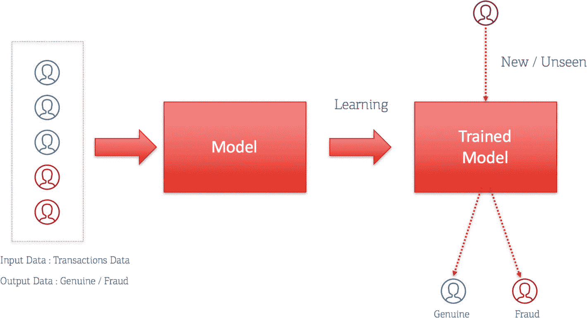

图 6-1

监督学习方法

对用于训练模型的数据进行预处理，并相应地创建特征。一旦训练了机器学习模型，它就可以用来对看不见的数据进行预测。因此，在上图中，我们可以看到如何使用输入数据来训练模型，以及现在如何使用训练好的模型来预测新交易是否真实。这种类型的学习主要用于历史数据可用并且必须根据未来数据进行预测的情况。监督学习的进一步分类基于用于预测的输出或目标变量的类型:

*   回归

*   分类

当预测的目标值本质上是连续的或数字的时，使用回归。例如，根据给定的经验或教育年限来预测工资就属于回归分析的范畴。

### 注意

尽管回归有多种类型，在这一章中，我将重点介绍线性回归和一些相关的算法，你很快就会看到。

如果目标变量是离散值或本质上是分类的，则使用分类。比如预测一个客户是否会流失就是一类分类问题，如图 [6-2](#Fig2) 所示。

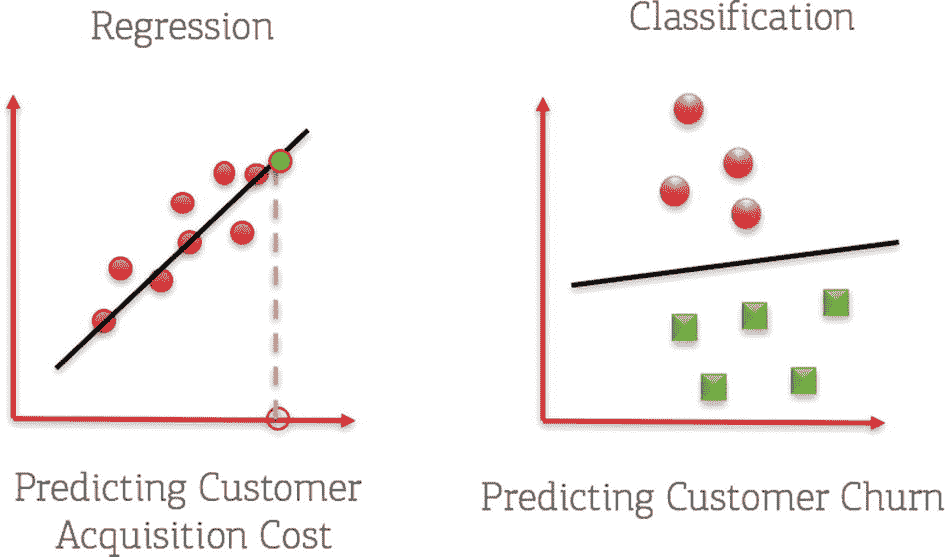

图 6-2

被监督任务的类型

分类任务可以进一步分为两类:二元类和多类，如图 [6-3](#Fig3) 所示。

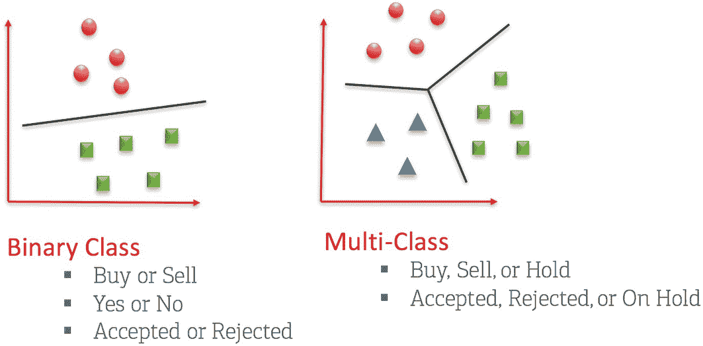

图 6-3

课程类型

### 二元分类

当目标或输出变量最多只包含两个类别时，它被称为二元分类。因此，数据中的每个记录只能属于这两个组中的一个。例如:

*   是或否

*   A 组还是 B 组

*   卖还是不卖

*   积极还是消极

*   接受或拒绝

### 多类分类

当目标或输出变量包含两个以上类别时，称为多类分类。因此，数据中可以有多个组，每个记录可以属于任何一个组。例如:

*   是或不是或也许

*   A 组或 B 组或 C 组

*   类别 1 或类别 2 或类别 3 或其他

*   等级 1 或等级 2 或等级 3 或等级 4 或等级 5

监督学习的另一个有用的属性是，可以根据训练和测试数据来评估模型的性能。基于模型的类型(分类或回归)，可以应用评估度量，并且可以测量性能结果。在这一章中，我将介绍如何构建机器学习模型来执行回归和二元分类。

## 构建线性回归模型

线性回归是指对一组自变量和输出或因变量(数值)之间的关系进行建模。如果输入变量包括一个以上的变量，这就是所谓的多变量线性回归。简而言之，假设因变量是其他自变量的线性组合。


这里 *X* <sub>1</sub> ， *X* <sub>2</sub> ，…是用于预测输出变量的自变量。线性回归的输出是一条直线，它使实际值与预测值最小化。线性回归模型不能处理非线性数据，因为只能对线性可分数据建模，因此多项式回归用于非线性数据，输出通常是曲线，而不是直线，如图 [6-4](#Fig4) 所示。

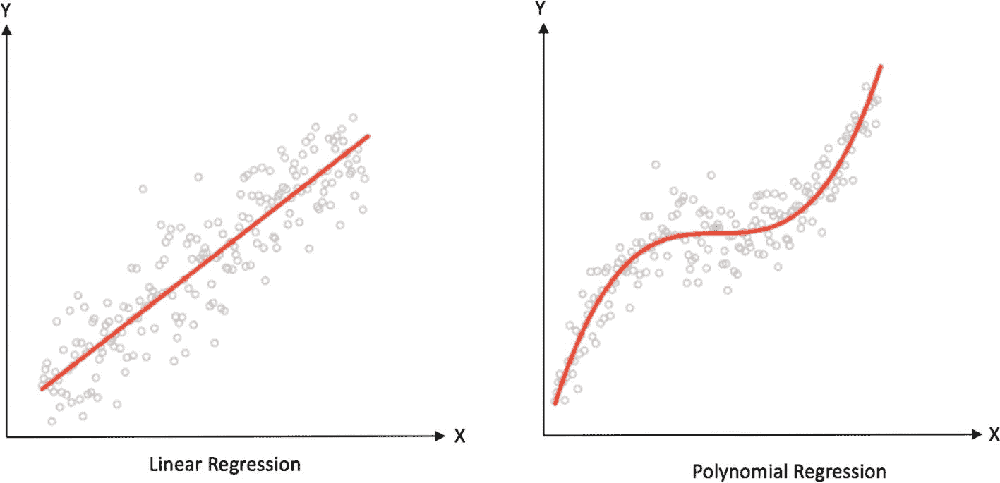

图 6-4

回归的类型

为了改进预测，线性回归还假设数据是正态分布的。线性回归是预测连续值的方法之一，现在您将看到我们如何使用其他替代方法来预测数字输出。

以下部分重点介绍使用多种机器学习算法解决回归任务。我将从数据摄取和探索性数据分析开始，然后构建模型。所有回归模型的步骤 1 到 4 都是一样的。

### 注意

完整的数据集，以及相关代码，可以从本书的 GitHub 资源库中获得参考，并在 Spark 2.3 和更高版本上执行得最好。

让我们使用 Spark 的 MLlib 库构建一个线性回归模型，并使用输入特性预测目标变量。

### 查看数据信息

我们将在本例中使用的数据集是一个样本数据集，总共包含 1，232 行和 6 列。我们必须使用线性回归模型，使用 5 个输入变量来预测目标变量。

#### 步骤 1:创建 Spark 会话对象

我们启动 Jupyter 笔记本，导入`SparkSession`，并创建一个新的`SparkSession`对象用于 Spark。

```py
[In]: from pyspark.sql import SparkSession
[In]: spark=SparkSession.builder.appName('supervised_ml').getOrCreate()

```

#### 步骤 2:读取数据集

然后，我们使用 DataFrame 在 Spark 中加载和读取数据集。我们必须确保我们已经从数据集可用的同一个目录文件夹中打开了 PySpark，否则我们必须提到数据文件夹的目录路径。

```py
[In]: df=spark.read.csv('Linear_regression_dataset.csv',inferSchema=True,header=True)

[In]:print((df.count(), len(df.columns)))
[Out]: (1232, 6)

```

前面的输出确认了数据集的大小，因此我们可以验证输入值的数据类型，以检查我们是否必须更改/转换任何列数据类型。在这个例子中，所有的列都包含已经符合我们要求的`integer`或`double`值。

```py
[In]: df.printSchema()
[Out]: root
 |-- var_1: integer (nullable = true)
 |-- var_2: integer (nullable = true)
 |-- var_3: integer (nullable = true)
 |-- var_4: double (nullable = true)
 |-- var_5: double (nullable = true)
 |-- output: double (nullable = true)

```

总共有六列，其中五列是输入列(`var_1`到`var_5`)和目标列(标签)。我们现在可以使用`describe`函数来检查数据集的统计度量。

```py
[In]: df.show(10)
[Out]:

```

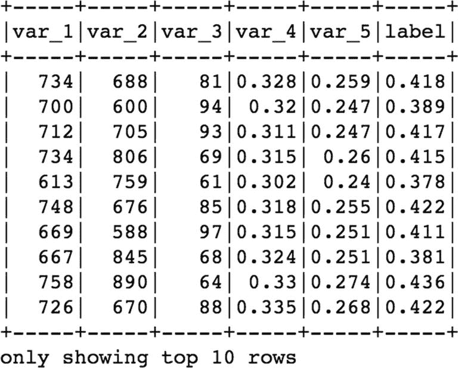

#### 步骤 3:特征工程

这是我们使用 Spark 的`VectorAssembler`创建一个结合所有输入特征的单一向量的部分。它仅创建一个要素来捕获该特定行的输入值。因此，引擎本质上不是五个输入列，而是以列表的形式将要素转换为具有五个输入值的单个列。

```py
[In]: from pyspark.ml.linalg import Vector
[In]: from pyspark.ml.feature import VectorAssembler

```

我们将传递所有五个输入列，以创建一个单独的 features 列。

```py
[In]: df.columns
[Out]: ['var_1', 'var_2', 'var_3', 'var_4', 'var_5', 'label']

[In]: vec_assmebler=VectorAssembler(inputCols=['var_1', 'var_2', 'var_3', 'var_4', 'var_5'],outputCol='features')
[In]: features_df=vec_assmebler.transform(df)

[In]: features_df.printSchema()
[Out]: root
 |-- var_1: integer (nullable = true)
 |-- var_2: integer (nullable = true)
 |-- var_3: integer (nullable = true)
 |-- var_4: double (nullable = true)
 |-- var_5: double (nullable = true)
 |-- label: double (nullable = true)
 |-- features: vector (nullable = true)

```

如您所见，我们有一个额外的列(要素)，其中包含所有输入的单个密集矢量。然后，我们选取数据帧的一个子集，只选择 features 列和 label 列来构建线性回归模型。

```py
[In]: df.select(['features','label']).show()
[Out]:

```

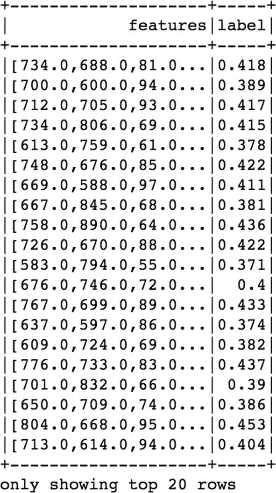

#### 步骤 4:拆分数据集

让我们将数据集分为训练数据集和测试数据集，以便训练和评估线性回归模型的性能。我们按照 70/30 的比例将其拆分，并在 70%的数据集上训练我们的模型。我们可以打印火车的形状和测试数据，以验证尺寸。

```py
[In]: train, test = df.randomSplit([0.75, 0.25])
[In]:print(f"Size of train Dataset : {train.count()}" )
[Out]: Size of train Dataset : 911
[In]: print(f"Size of test Dataset : {test.count()}" )
[Out]:  Size of test Dataset : 321

```

#### 步骤 5:建立和训练线性回归模型

现在，我们使用功能、输入和标签列来构建和定型线性回归模型。我们首先从 MLlib 导入线性回归，如下所示:

```py
[In]: from pyspark.ml.regression import LinearRegression

[In]: lr = LinearRegression()

```

### 注意

为简单起见，本章构建的所有机器学习模型都使用默认的超参数。读者可以使用自己的超参数集。

```py
[In]:lr_model = lr.fit(train)

[In]: predictions_df=lr_model.transform(test)
[In]: predictions_df.show()

[Out]:

```

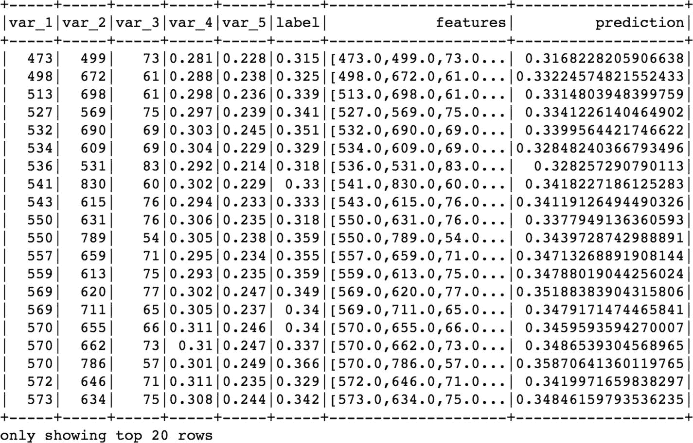

#### 步骤 6:评估测试数据的线性回归模型

为了检查模型在未知或测试数据上的性能，我们使用了`evaluate`。

```py
[In]: model_predictions=lr_model.evaluate(test)
[In]: model_predictions.r2
[Out]: 0.8855561089304634
[In]: print(model_predictions.meanSquaredError)
[Out]:0.00013305453514672318

```

### 广义线性模型回归

广义线性模型(GLM)是线性回归的高级版本，它认为目标变量具有不同于首选正态分布的误差分布。GLM 使用关联函数来推广线性回归，因此方差是预测值本身的函数。让我们尝试在同一数据集上构建 GLM，看看它是否比简单的线性回归模型表现得更好。首先，我们必须从 MLlib 导入 GLM。

```py
[In]: from pyspark.ml.regression import GeneralizedLinearRegression

```

#### 步骤 1:建立和训练广义线性回归模型

```py
[In]: glr = GeneralizedLinearRegression()
[In]: glr_model = glr.fit(train)

[In]: glr_model.coefficients

[Out]: DenseVector([0.0003, 0.0001, 0.0001, -0.6374, 0.4822])

```

我们可以使用该模型的系数函数来获得系数值。这里我们可以看到其中一个特征的系数值为负。通过使用`summary`函数，我们可以获得更多关于 GLM 模型的信息。它返回所有细节，如系数值、标准误差、AIC (Akaike 信息标准)值和 p 值。

```py
[In]: glr_model.summary

[Out]:

```

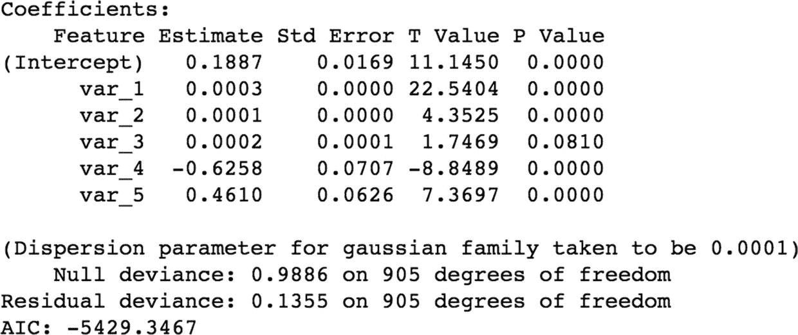

#### 步骤 2:根据测试数据评估模型性能

```py
[In]: model_predictions=glr_model.evaluate(test)

[In]: model_predictions.predictions.show()

[Out]:

```

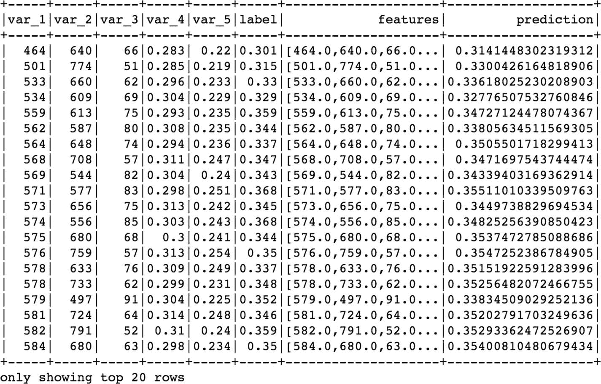

赤池信息标准(AIC)是对相同数据集的模型质量的相对性能的评价参数。AIC 主要用于在给定数据集的多个模型中进行选择。较小的 AIC 值表示模型质量较好。AIC 试图在模型的方差和偏差之间取得平衡。因此，它处理过拟合和欠拟合的机会。具有最低 AIC 分数的模型优于其他模型。

```py
[In]: model_predictions.aic
[Out]: -1939.88

```

我们可以为多个发行版运行 GLM，例如

1.  二项式

2.  泊松

3.  微克

4.  特威迪

```py
[In]: glr = GeneralizedLinearRegression(family='Binomial')
[In]: glr_model = glr.fit(train)
[In]: model_predictions=glr_model.evaluate(test)
[In]: model_predictions.aic
[Out]: 336.991

[In]: glr = GeneralizedLinearRegression(family='Poisson')
[In]: glr_model = glr.fit(train)
[In]: predictions=glr_model.evaluate(test)
[In]: predictions.aic
[Out]: 266.53

[In]: glr = GeneralizedLinearRegression(family='Gamma')
[In]: glr_model = glr.fit(train)
[In]:model_predictions=glr_model.evaluate(test)
[In]: model_predictions.aic
[Out]: -1903.81

```

这里我们可以看到，与其他模型相比，我们默认的高斯分布 GLM 模型具有最低的 AIC 值。

### 决策树回归

决策树回归算法可用于回归和分类。它在很好地拟合数据方面非常强大，但有时会有过度拟合数据的高风险。决策树包含基于熵或基尼指数的多重分裂。树越深，数据过度拟合的几率就越高。在我们的示例中，我们将使用参数的默认值(`maxdepth = 5`)构建一个用于预测目标值的决策树。

#### 步骤 1:建立和训练决策树回归模型

```py
[In]: from pyspark.ml.regression import DecisionTreeRegressor

[In]: dec_tree = DecisionTreeRegressor()
[In]: dec_tree_model = dec_tree.fit(train)
[In]: dec_tree_model.featureImportances
[Out]: SparseVector(5, {0: 0.9641, 1: 0.0193, 2: 0.0029, 3: 0.0053, 4: 0.0084})

```

#### 步骤 2:根据测试数据评估模型性能

```py
[In]: model_predictions = dec_tree_model.transform(test)

[In]: model_predictions.show()
[Out]:

```

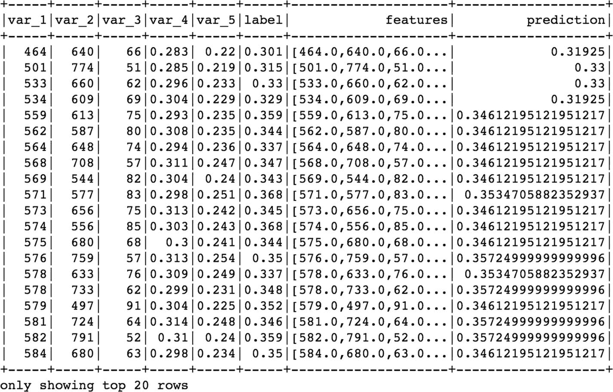

我们从 MLlib 中导入`RegressionEvaluation`,来评估决策树在测试数据上的性能。截至目前，有两个指标可供评估:*r*T3】2 和 RMSE(均方根误差)。*r*T7】2 主要表示数据集中有多少变化可以归因于回归。所以*r*T11】2 越高，模型的性能越好。另一方面，RMSE 指出了模型的总误差，即实际值和预测值之间的差异。

```py
[In]: from pyspark.ml.evaluation import RegressionEvaluator
[In]: dt_evaluator = RegressionEvaluator(metricName='r2')
[In]: dt_r2 = dt_evaluator.evaluate(model_predictions)
[In]: print(f'The r-square value of DecisionTreeRegressor is {dt_r2}')
[Out]: The r-square value of DecisionTreeRegressor is 0.8093834699203476
[In]: dt_evaluator = RegressionEvaluator(metricName='rmse')
[In]: dt_rmse = dt_evaluator.evaluate(model_predictions)
[In]: print(f'The rmse value of DecisionTreeRegressor is {dt_rmse}')
[Out]: The rmse value of DecisionTreeRegressor is 0.014111932287681688

```

这个特定模型的 *r* <sup>2</sup> 值接近 0.81，比简单线性回归模型的值低一点。

### 随机森林回归量

随机森林回归是使用不同数据样本构建的多个独立决策树的集合。组合这些单独的树的整个想法是采取多数投票或平均值(在回归的情况下)来有效地概括。因此，随机森林是一种采用打包方法的集合技术。它可用于回归以及分类任务。因为决策树倾向于过度拟合数据，所以随机森林通过取单个树的预测值的平均值来移除高方差的元素。在我们的示例中，我们将使用默认参数(`numTrees = 20`)构建一个用于回归的随机森林模型

#### 步骤 1:建立和训练随机森林回归模型

```py
[In]: from pyspark.ml.regression import RandomForestRegressor

[In]: rf = RandomForestRegressor()

[In]: rf_model = rf.fit(train)
[In]:  rf_model.featureImportances
[Out]: SparseVector(5, {0: 0.4395, 1: 0.045, 2: 0.0243, 3: 0.2725, 4: 0.2188})

```

如您所见，随机森林中的树的数量等于 20。这个数字可以增加。

```py
[In]: rf_model.getNumTrees
[Out]: 20
[In]: model_predictions = rf_model.transform(test)
[In]: model_predictions.show()
[Out]:

```

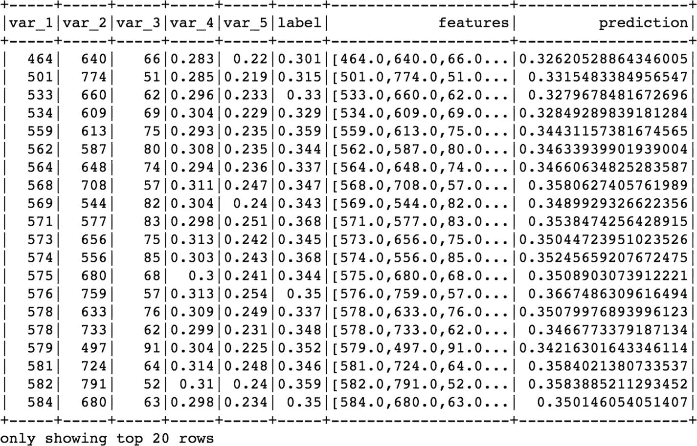

#### 步骤 2:根据测试数据评估模型性能

我们可以再次使用 *r* <sup>2</sup> 和 RMSE 作为随机森林模型的评估参数。

```py
[In]:rf_evaluator = RegressionEvaluator(metricName='r2')
[In]: rf_r2 = rf_evaluator.evaluate(model_predictions)
[In]: print(f'The r-square value of RandomForestRegressor is {rf_r2}')
[Out]: The r-square value of RandomForestRegressor is 0.8215863293044671
[In]: rf_evaluator = RegressionEvaluator(metricName='rmse')
[In]: rf_rmse = rf_evaluator.evaluate(model_predictions)
[In]: print(f'The rmse value of RandomForestRegressor is {rf_rmse}')
[Out]: The rmse value of RandomForestRegressor is 0.01365275410722947

```

如您所见，它明显优于决策树回归器，并且具有更高的 r <sup>2</sup> 。该模型的性能可以通过超参数调整进一步增强。

## 梯度增强树回归器

梯度增强树(GBT)回归器也是一种集成技术，它使用增强技术。提升是指利用单个弱学习者来提升整体模型的性能。bagging 和 boosting 之间的一个主要区别是，在 bagging 中，构建的单个模型本质上是并行的，这意味着它们可以彼此独立地构建，但在 boosting 中，单个模型是按顺序构建的。在梯度推进方法中，第二个模型关注第一个模型产生的误差，并试图减少这些数据点的总体误差。同样，下一个模型试图减少前一个模型产生的错误。这样，减少了预测的总体误差。在下面的例子中，我们将使用默认参数构建一个 GBT 回归器。

### 步骤 1:建立和训练 GBT 回归模型

```py
[In]: from pyspark.ml.regression import GBTRegressor

[In]: gbt = GBTRegressor()
[In]: gbt_model=gbt.fit(train)
[In]: gbt_model.featureImportances
[Out]: SparseVector(5, {0: 0.2325, 1: 0.2011, 2: 0.1645, 3: 0.2268, 4: 0.1751})
[In]: model_predictions = gbt_model.transform(test)
[In]: model_predictions.show()

[Out]:

```

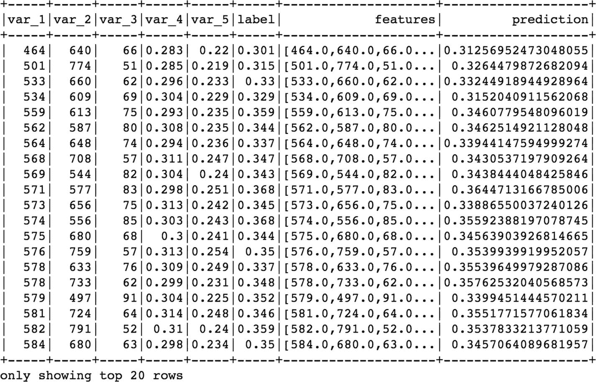

### 步骤 2:根据测试数据评估模型性能

```py
[In]: gbt_evaluator = RegressionEvaluator(metricName='r2')

[In]: gbt_r2 = gbt_evaluator.evaluate(model_predictions)
[In]: print(f'The r-square value of GradientBoostedRegressor is {gbt_r2}')
[Out]: The r-square value of GradientBoostedRegressor is 0.8477273892307596
[In]: gbt_evaluator = RegressionEvaluator(metricName='rmse')
[In]: gbt_rmse = gbt_evaluator.evaluate(model_predictions)
[In]: print(f'The rmse value of GradientBoostedRegressor is {gbt_rmse}')
[Out]: The rmse value of GradientBoostedRegressor is 0.013305445803592103

```

如你所见，GBT 回归优于随机森林模型。随着 r <sup>2</sup> 接近 0.85，经过适当的调整，可以认为是最终的模型。

## 为二元分类任务构建多个模型

在本章的第三部分也是最后一部分，您将看到如何为二进制分类任务构建多个机器学习模型。我们将为此使用的数据是来自 UCI ML 存储库的开源银行营销数据集的子集，可在`https://archive.ics.uci.edu/ml/datasets/Bank+Marketing`获得。

仅选择该数据的子集有两个原因。首先是为分类任务保持类别平衡，以免使其成为异常检测类别任务。仅选择要素子集的另一个原因是为了限制数据中的信号数量，因为数据集中的某些要素会严重影响输出，因此在本练习中会被忽略。

数据集包含 9，500 行和 8 列。其思想是根据其他属性，如年龄、工作、贷款等，预测用户是否会订购另一种产品或服务(定期存款)。这是一个典型的要求，其中利用机器学习来寻找业务可以针对的顶级用户，以进行交叉销售或追加销售。

我将从逻辑回归模型开始。

### 逻辑回归

逻辑回归由于其简单性和可解释性而被认为是基线模型之一。在引擎盖下，它相当类似于线性回归。它还假设输出是因变量的线性组合，但是为了将输出保持在 0 和 1 之间，因为它将概率作为输出返回，所以它利用非线性函数(`sigmoid`)，该函数产生 S 曲线而不是直线(线性回归)。

我们将首先在步骤 1–3 中构建基线，然后在步骤 4–6 中使用默认超参数完成逻辑回归模型。

#### 步骤 1:读取数据集

```py
[In]: df=spark.read.csv('bank_data.csv',inferSchema=True,header=True)

[In]: df.count()
[Out]: 9501

[In]: df.columns
[Out]: ['age', 'job', 'marital', 'education', 'default', 'housing','loan', 'target_class']
[In]: df.printSchema()
[Out]:

```

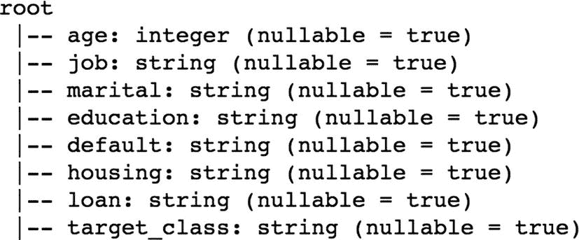

如您所见，输入列是除目标类列之外的所有列。就“是”和“否”标签的数量而言，目标类也是平衡的。我们必须将是和否转换为 1 和 0，并将`target_class`列重命名为“标签”，这是机器学习模型参数中默认的接受列名称。

```py
[In]: df.groupBy('target_class').count().show()
[Out]:

```

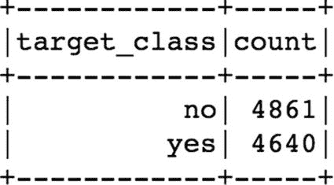

#### 步骤 2:模型的特征工程

```py
[In]: from pyspark.sql import functions as F
[In]: from pyspark.sql import ∗
[In]: df=df.withColumn("label", F.when(df.target_class =='no', F.lit(0)).otherwise(F.lit(1)))

[In]: df.groupBy('label').count().show()
[Out]:

```

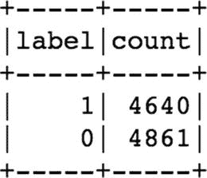

既然我们已经将输出列重命名为“label ”,并将目标类转换为 1 和 0，下一步就是为模型创建要素。因为我们有分类列，比如 job 和 edu，我们必须使用`StringIndexer`和`OneHotEncoder`将它们转换成数字格式。我们创建了一个 Python 函数`cat_to_num`，将所有的分类特征转换成数字特征。

```py
[In]: from pyspark.ml.feature import OneHotEncoder, StringIndexer, VectorAssembler
[In]: def cat_to_num(df):

    for col in df.columns:
        stringIndexer = StringIndexer(inputCol=col, outputCol=col+"_index")
        model = stringIndexer.fit(df)
        indexed = model.transform(df)
        encoder = OneHotEncoder(inputCol=col+"_index", outputCol=col+"_vec")
        df = encoder.transform(indexed)
    df_assembler = VectorAssembler(inputCols=['age','marital_vec','education_vec','default_vec','housing_vec','loan_vec'], outputCol="features")
    df = df_assembler.transform(df)
    return df.select(['features','label'])

```

我们只选择新功能列和目标标签列，因为我们不需要早期的原始列来进行模型训练。

```py
[In]: df_new=cat_to_num(df)
[In]: df_new.show()
[Out]:

```

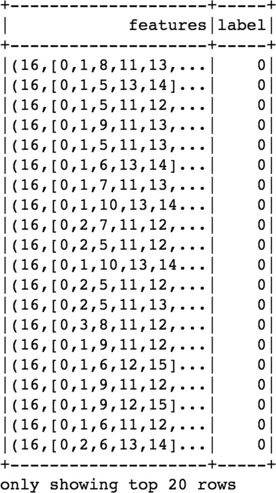

现在，我们已经将所有输入特征合并到单个密集向量(`'features'`)中，以及输出列标签，我们可以使用它们来训练机器学习模型。仅使用两列(特征、标签)创建的新数据框架现在被称为`df_new`，将用于每个模型。我们现在可以将新的数据帧分成训练和测试数据集。我们可以使用`randomplit`函数将数据分成 75%/25%的比例。

#### 步骤 3:将数据分成训练和测试数据集

```py
[In]: train, test = df_new.randomSplit([0.75, 0.25])

[In]: print(f"Size of train Dataset : {train.count()}" )
[Out]: 7121
[In]: print(f"Size of test Dataset : {test.count()}" )
[Out]: 2380

```

#### 步骤 4:建立和训练逻辑回归模型

```py
[In]: from pyspark.ml.classification import LogisticRegression

[In]: lr = LogisticRegression()
[In]: lr_model = lr.fit(train)
[In]:print( lr_model.coefficients)
[Out]:
[0.0272019114172,-0.647672064875,0.229030508111,-0.77074788287,-12.36869511,-12.8865599132,-13.2257790609,-12.6705131313,-13.0023164274,-13.0747662586,-12.6985757761,1.42220523957,0.301582233094,-0.0127231892838,0.218471149577,0.332362933568]

```

一旦建立了模型，我们就可以使用内部函数`summary`，它提供了关于模型的重要细节，如 ROC 曲线、精确度、召回率、AUC(曲线下面积)等。

#### 步骤 5:评估训练数据的性能

```py
[In]: lr_summary=lr_model.summary

[In]: lr_summary.accuracy
[Out]: 0.673079623648364
[In]: lr_summary.areaUnderROC
[Out]: 0.7186044694483512
[In]: lr_summary.weightedRecall
[Out]: 0.673079623648364
[In]: lr_summary.weightedPrecision
[Out]: 0.6750967624018298

```

在这里，使用`summary`函数，我们可以查看模型在训练数据上的性能，比如它的准确性、AUC、加权召回率和精确度。我们还可以查看其他详细信息，例如不同阈值的精度如何变化，精度和召回率之间的关系，以及召回率随不同阈值的变化，从而为模型选择正确的阈值。这些也可以被绘制出来，以查看它们之间的关系。

```py
[In]: lr_summary.precisionByThreshold.show()

[Out]:

```

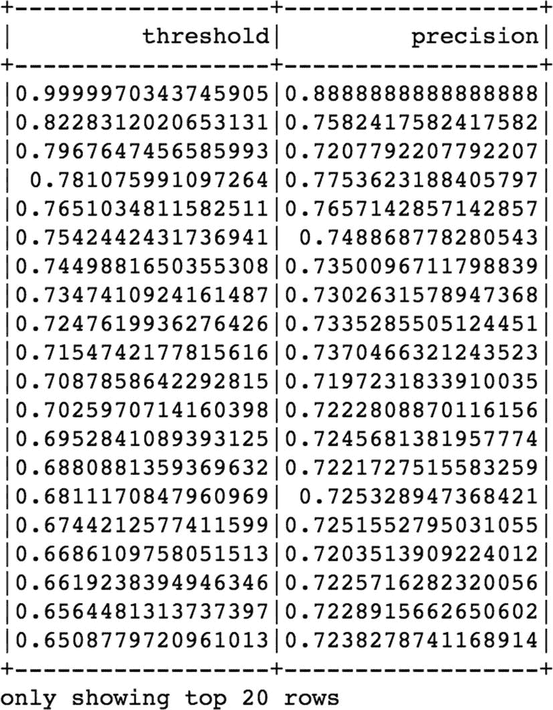

```py
[In]: lr_summary.roc.show()

[Out]:

```

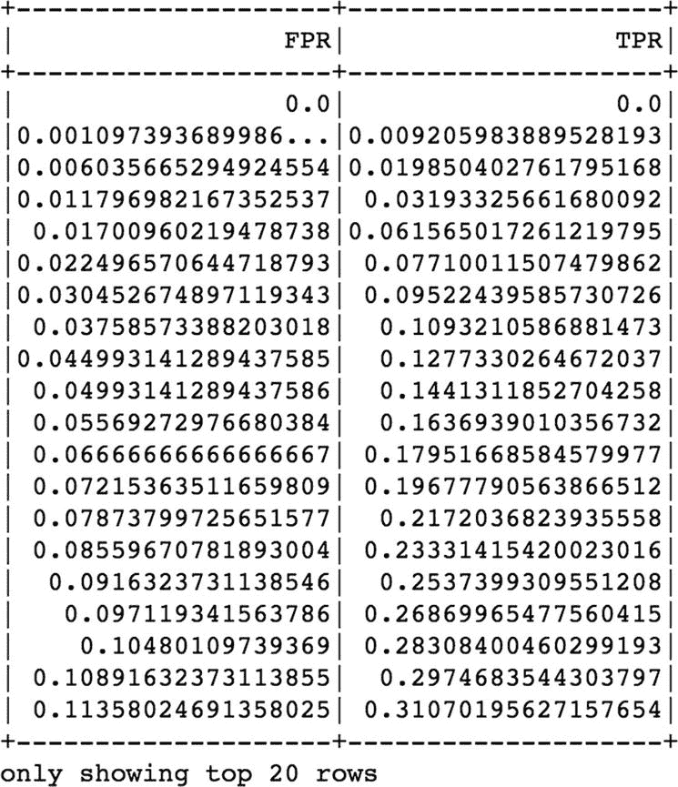

```py
[In]: lr_summary.recallByThreshold.show()

[Out]:

```

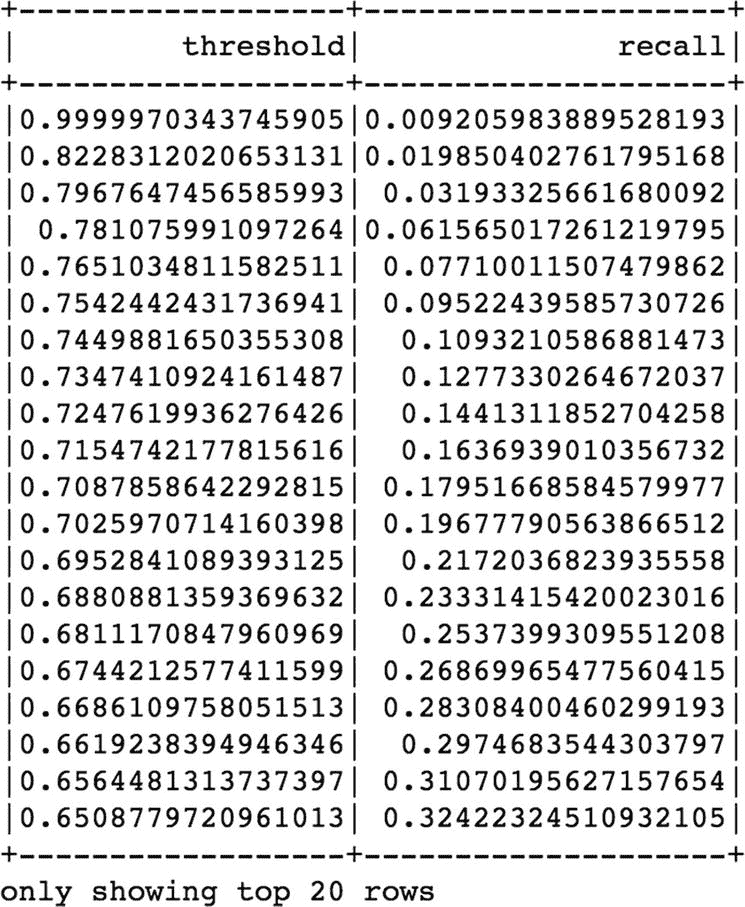

```py
[In]: lr_summary.pr.show()

[Out]:

```

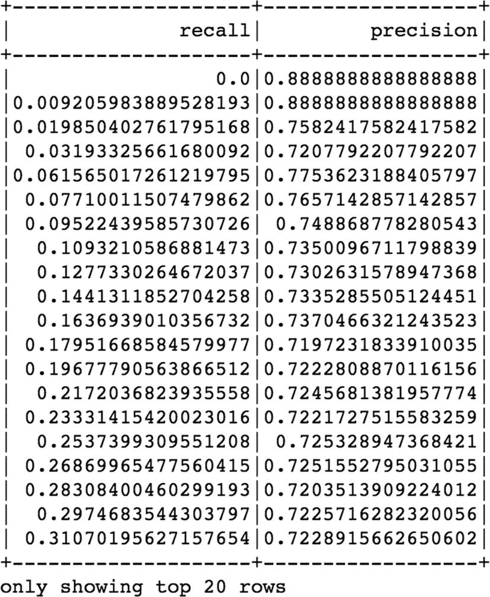

#### 步骤 6:评估测试数据的性能

```py
[In]: model_predictions = lr_model.transform(test)

[In]: model_predictions.columns
[Out]: ['features', 'label', 'rawPrediction', 'probability', 'prediction']
[In]: model_predictions.select(['label','probability','prediction']).show(10,False)
[Out]:

```

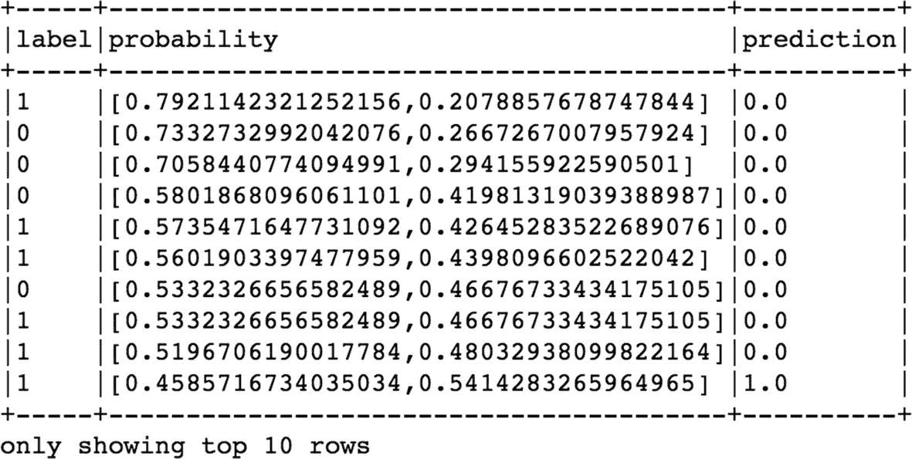

正如您所看到的，预测列显示了测试数据中每条记录的模型预测。概率列显示了两类的值(0 & 1)。第 0 个索引处的概率为 0；另一个是预测 1。可以使用`BinaryClassEvaluator`对测试数据的逻辑回归模型进行评估。我们可以得到 ROC 下的面积和 PR 曲线下的面积，如下所示:

```py
[In]:from pyspark.ml.evaluation import BinaryClassificationEvaluator
[In]:lr_evaluator = BinaryClassificationEvaluator(metricName='areaUnderROC')
[In]: lr_auroc = lr_evaluator.evaluate(model_predictions)
[In]: print(f'The auroc value of Logistic Regression Model is {lr_auroc}')
[Out]: The auroc value of Logistic Regression Model is 0.7092938229110143

[In]: lr_evaluator = BinaryClassificationEvaluator(metricName='areaUnderPR')
[In]: lr_aupr = lr_evaluator.evaluate(model_predictions)
[In]: print(f'The aupr value of Logistic Regression Model is {lr_aupr}')
[Out]: The aupr value of Logistic Regression Model is 0.6630743130940658

[In]: true_pos=model_predictions.filter(model_predictions['label']==1).filter(model_predictions['prediction']==1).count()

[In]: actual_pos=model_predictions.filter(model_predictions['label']==1).count()
[In]: pred_pos=model_predictions.filter(model_predictions['prediction']==1).count()
Recall
[In]: float(true_pos)/(actual_pos)
[Out]: 0.6701030927835051
Precision
[In]: float(true_pos)/(pred_pos)
[Out]: 0.6478405315614618

```

### 决策树分类器

如前所述，决策树可以用于分类和回归。这里，我们将使用默认超参数构建一个决策树，并使用它来预测用户是否会选择新的定期存款计划。

#### 步骤 1:建立和训练决策树分类器模型

```py
[In]: from pyspark.ml.classification import DecisionTreeClassifier

[In]: dt = DecisionTreeClassifier()
[In]: dt_model = dt.fit(train)
[In]: model_predictions = dt_model.transform(test)

[Out]: model_predictions.select(['label','probability','prediction']).show(10,False)

```

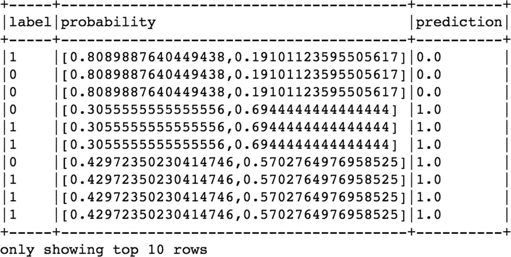

#### 步骤 2:评估测试数据的性能

```py
[In]: dt_evaluator = BinaryClassificationEvaluator(metricName='areaUnderROC')
[In]: dt_auroc = dt_evaluator.evaluate(model_predictions)

[In]: print(f'The auc value of Decision Tree Classifier Model is {dt_auroc}')
[Out]: The auc value of Decision Tree Classifier Model is 0.516199386190993
[In]: dt_evaluator = BinaryClassificationEvaluator(metricName='areaUnderPR')
[In]: dt_aupr = dt_evaluator.evaluate(model_predictions)
[In]: print(f'The aupr value of Decision Tree Model is {dt_aupr}')
[Out]: The aupr value of Decision Tree Model is 0.46771834172588167

[In]: true_pos=model_predictions.filter(model_predictions['label']==1).filter(model_predictions['prediction']==1).count()

[In]: actual_pos=model_predictions.filter(model_predictions['label']==1).count()

[In]: pred_pos=model_predictions.filter(model_predictions['prediction']==1).count()

[In]: float(true_pos)/(actual_pos)
[Out]: 0.6907216494845361
[In]: float(true_pos)/(pred_pos)
[Out]: 0.6661143330571665

```

### 支持向量机分类器

支持向量机(SVM)用于分类任务，因为它们可以找到最大化两个类别之间的间隔(垂直距离)的超平面。所有的实例和目标类都表示为高维空间中的向量，SVM 从支持最佳分割线或超平面的两个类中找出最近的两个点，如图 [6-5](#Fig5) 所示。

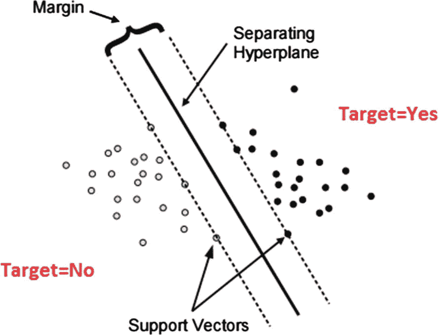

图 6-5

支持向量机

对于非线性可分离的数据，有不同的内核技巧来分离类。在我们的例子中，我们将使用默认的超参数构建一个线性可分的支持向量分类器。

#### 步骤 1:建立和训练 SVM 模型

```py
[In]: from pyspark.ml.classification import LinearSVC

[In]: lsvc = LinearSVC()
[In]: lsvc_model = lsvc.fit(train)
[In]: model_predictions = lsvc_model.transform(test)
[In]: model_predictions.columns
[Out]: ['features', 'label', 'rawPrediction', 'prediction']
[In]:model_predictions.select(['label','prediction']).show(10,False)

[Out]:

```

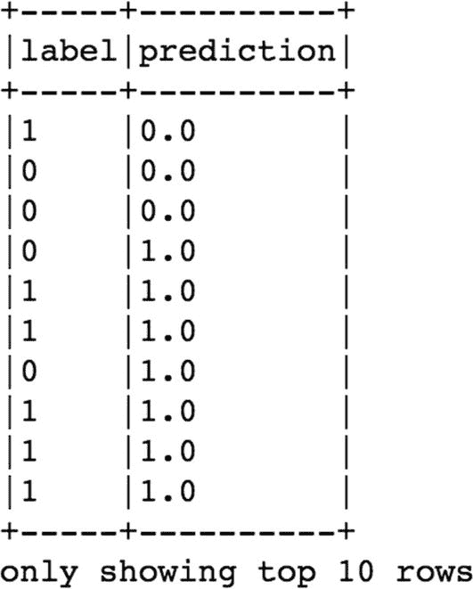

#### 步骤 2:评估测试数据的性能

```py
[In]: svc_evaluator = BinaryClassificationEvaluator(metricName='areaUnderROC')
[In]: svc_auroc = svc_evaluator.evaluate(model_predictions)

[In]: print(f'The auc value of SupportVectorClassifier  is {svc_auroc}')
[Out]: The auc value of SupportVectorClassifier  is 0.7043772749366973

[In]: svc_evaluator = BinaryClassificationEvaluator(metricName='areaUnderPR')
[In]: svc_aupr =svc_evaluator.evaluate(model_predictions)
[In]: print(f'The aupr value of SupportVectorClassifier Model is {svc_aupr}')
[Out]: The aupr value of SupportVectorClassifier Model is 0.6567277377856992

[In]: true_pos=model_predictions.filter(model_predictions['label']==1).filter(model_predictions['prediction']==1).count()
[In]: actual_pos=model_predictions.filter(model_predictions['label']==1).count()
[In]: pred_pos=model_predictions.filter(model_predictions['prediction']==1).count()
[In]: float(true_pos)/(actual_pos)
[Out]: 0.7774914089347079

[In]: float(true_pos)/(pred_pos)
[Out]: 0.600132625994695

```

### 朴素贝叶斯分类器

朴素贝叶斯(NB)分类器根据条件概率原理工作，并假设预测器之间绝对独立。NB 分类器没有很多超参数，并且可以胜过一些最复杂的算法。在下面的例子中，我们将构建一个 NB 分类器，并评估它在测试数据上的性能。

#### 步骤 1:建立和训练 SVM 模型

```py
[In]: from pyspark.ml.classification import NaiveBayes

[In]: nb = NaiveBayes()
[In]: nb_model = nb.fit(train)
[In]: model_predictions = nb_model.transform(test)
[In]: model_predictions.select(['label','probability','prediction']).show(10,False)
[Out]:

```

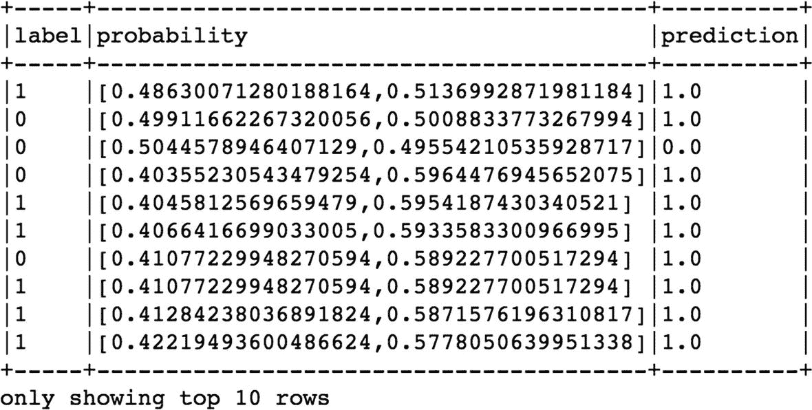

#### 步骤 2:评估测试数据的性能

```py
[In]: nb_evaluator = BinaryClassificationEvaluator(metricName='areaUnderROC')
[In]: nb_auroc = nb_evaluator.evaluate(model_predictions)

[In]: print(f'The auc value of NB Classifier is {nb_auroc}')
[Out]: The auc value of NB Classifier is 0.43543736717760884

[In]: nb_evaluator = BinaryClassificationEvaluator(metricName='areaUnderPR')
[In]: nb_aupr =nb_evaluator.evaluate(model_predictions)
[In]: print(f'The aupr value of NB Classifier Model is {nb_aupr}')
[Out]: The aupr value of NB Classifier Model is 0.4321001351769349

[In]: true_pos=model_predictions.filter(model_predictions['label']==1).filter(model_predictions['prediction']==1).count()
[In]: actual_pos=model_predictions.filter(model_predictions['label']==1).count()
[In]: pred_pos=model_predictions.filter(model_predictions['prediction']==1).count()

[In]: float(true_pos)/(actual_pos)
[Out]: 0.586
[In]: float(true_pos)/(pred_pos)
[Out]: 0.625

```

### 梯度提升树分类器

到目前为止，我们使用单一算法进行分类。现在我们继续使用集合方法，如 GBT 和随机森林，进行分类。根据与回归相似的原理，对分类进行打包和提升。

#### 步骤 1:建立和训练 GBT 模型

```py
[In]: from pyspark.ml.classification import GBTClassifier

[In]: gbt = GBTClassifier()
[In]: gbt_model = gbt.fit(train)
[In]: model_predictions = gbt_model.transform(test)
[In]: model_predictions.select(['label','probability','prediction']).show(10,False)
[Out]:

```

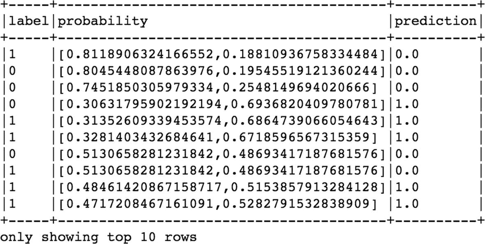

#### 步骤 2:评估测试数据的性能

```py
[In]: gbt_evaluator = BinaryClassificationEvaluator(metricName='areaUnderROC')
[In]: gbt_auroc = gbt_evaluator.evaluate(model_predictions)

[In]: print(f'The auc value of GradientBoostedTreesClassifier is {gbt_auroc}')
[Out]: The auc value of GradientBoostedTreesClassifier is 0.7392410330756018

[In]: gbt_evaluator = BinaryClassificationEvaluator(metricName='areaUnderPR')
[In]: gbt_aupr = gbt_evaluator.evaluate(model_predictions)
[In]: print(f'The aupr value of GradientBoostedTreesClassifier Model is {gbt_aupr}')
[Out]: The aupr value of GradientBoostedTreesClassifier Model is 0.7345982892755392

[In]: true_pos=model_predictions.filter(model_predictions['label']==1).filter(model_predictions['prediction']==1).count()

[In]: actual_pos=model_predictions.filter(model_predictions['label']==1).count()
[In]: pred_pos=model_predictions.filter(model_predictions['prediction']==1).count()
[In]: float(true_pos)/(actual_pos)
[Out]: 0.668
[In]: float(true_pos)/(pred_pos)
[Out]: 0.674

```

### 随机森林分类器

同样，随机森林分类器是多个决策树分类器的集合。它在投票机制上工作，并预测从所有单个决策树中获得最多投票的输出类。让我们用相同的数据构建一个随机森林分类器。

#### 步骤 1:构建并训练随机森林模型

```py
[In]: from pyspark.ml.classification import RandomForestClassifier

[In]: rf = RandomForestClassifier(numTrees=50,maxDepth=30)
[In]: rf_model = rf.fit(train)
[In]: model_predictions=rf_model.transform(test)
[In]: model_predictions.select(['label','probability','prediction']).show(10,False)
[Out]:

```

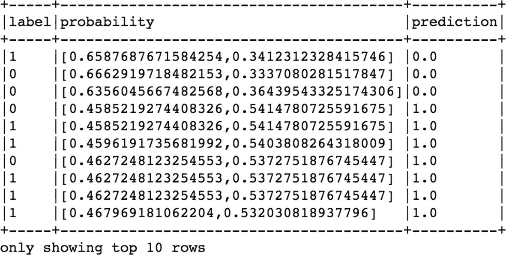

#### 步骤 2:评估测试数据的性能

```py
[In]: rf_evaluator = BinaryClassificationEvaluator(metricName='areaUnderROC')
[In]: rf_auroc = rf_evaluator.evaluate(model_predictions)

[In]: print(f'The auc value of RandomForestClassifier Model is {rf_auroc}')
[Out]:
The auc value of RandomForestClassifier Model is 0.7326433634020617
[In]: rf_evaluator = BinaryClassificationEvaluator(metricName='areaUnderPR')
[In]: rf_aupr = rf_evaluator.evaluate(model_predictions)
[In]: print(f'The aupr value of RandomForestClassifier Model is {rf_aupr}')
[Out]: The aupr value of RandomForestClassifier Model is 0.7277253895494864

[In]; true_pos=model_predictions.filter(model_predictions['label']==1).filter(model_predictions['prediction']==1).count()
[In]: actual_pos=model_predictions.filter(model_predictions['label']==1).count()
[In]: pred_pos=model_predictions.filter(model_predictions['prediction']==1).count()
[In]: float(true_pos)/(actual_pos)
[Out]: 0.67
[In]: float(true_pos)/(pred_pos)
[Out]: 0.67

```

到目前为止，我们已经为所有的模型使用了默认的超参数，但是很少有模型能够在这些默认设置下发挥其最大能力的情况。因此，我们必须针对超参数的正确组合来调整模型。

## 超参数调整和交叉验证

在下面的示例中，我们将采用刚刚构建的随机森林模型，并尝试找到其超参数的最佳组合，以提高性能。我们可以使用`ParamgridBuilder`和`CrossValidator`进行超参数调谐。我们将在参数网格中为三个超参数(`maxDepth`、`maxBins`和`numTrees`)传递不同的值。这可能需要几分钟才能完成，因为在返回此训练数据集的最佳可能组合之前，它会为所有这些组合构建随机森林模型。

```py
[In]: from pyspark.ml.tuning import ParamGridBuilder, CrossValidator
[In]: rf = RandomForestClassifier()
[In]: paramGrid = (ParamGridBuilder()
             .addGrid(rf.maxDepth, [5,10,20,25,30])
             .addGrid(rf.maxBins, [20, 60])
             .addGrid(rf.numTrees, [5, 20,50,100])
             .build())
[In]: cv = CrossValidator(estimator=rf, estimatorParamMaps=paramGrid, evaluator=rf_evaluator, numFolds=5)

[In]: cv_model = cv.fit(train)

[In]: best_rf_model = cv_model.bestModel

best_rf_model contains the best hyper-parameters to be used for training the model on this dataset.

[In]: model_predictions = best_rf_model.transform(test)
[In]: rf_evaluator = BinaryClassificationEvaluator(metricName='areaUnderROC')
[In]: rf_auroc = rf_evaluator.evaluate(model_predictions)

[In]: print(rf_auroc)
[Out]:  0.7425990374615659

```

如您所见，通过对我们的随机森林模型使用最佳超参数，AUC 得分增加了。

## 结论

本章详细介绍了不同类型的监督学习以及使用多种机器学习算法解决二元分类的方法。还解释了如何为模型选择最佳超参数，以及如何使用交叉验证技术在给定数据集上构建最佳可能模型。