# 七、无监督机器学习

顾名思义，无监督机器学习不包括寻找输入和输出之间的关系。老实说，在无监督学习中，没有我们试图预测的输出。它主要用于将在某种意义上看似相似的特征组合在一起。这些可以是这些特征之间的距离或者某种相似性度量。在这一章中，我将涉及一些无监督的机器学习技术，并建立一个机器学习模型，使用 PySpark 将用户分类成组，然后将这些组可视化。

## 无监督机器学习初级读本

正如所建议的，无监督学习的目的不是映射输入和输出之间的关系；相反，它试图对彼此相似的值进行分组。不会对输入数据进行任何训练。相反，它通过在数据中寻找潜在的信号和模式来完成这一任务，从而在数据中形成组。无监督学习可以进一步分为两个独立的类别:

1.  使聚集

2.  关联规则

聚类是指根据数据中存在的属性找到数据点的底层组，如图 [7-1](#Fig1) 所示。

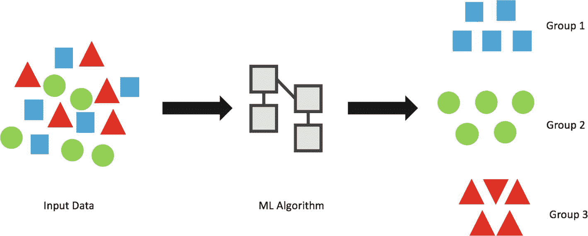

图 7-1

无监督机器学习

关联意味着共现的可能性。例如，如果有人买了 X 商品，他或她也可能用它买 Y 商品的概率是多少。在这一章中，我将只关注集群技术。我们可以很容易地利用聚类来理解数据中的不同组。例如，如果我们有一些关于足球运动员的数据，我们可以很容易地预测谁在场上踢什么位置——他们是前锋还是后卫。表 [7-1](#Tab1) 显示了足球比赛中球员的一些样本数据。捕获的两个值是

表 7-1

尝试与目标

<colgroup><col class="tcol1 align-left"> <col class="tcol2 align-left"> <col class="tcol3 align-left"></colgroup> 
| 

-你好。不，不

 | 

射门次数

 | 

铲球次数

 |
| --- | --- | --- |
| one | eight | Two |
| Two | Two | Ten |
| three | nine | one |
| four | Fifteen | one |
| five | Two | Seventeen |
| six | four | six |
| seven | eight | Two |
| eight | Zero | Twenty-five |
| nine | one | Seventeen |
| Ten | Zero | Fifteen |

1.  目标尝试的总数

2.  铲球总数

如果我们尝试在散点图上显示前面的值，我们会得到类似于图 [7-2](#Fig2) 所示的结果。x 轴表示球员的铲球次数，y 轴表示射门次数。

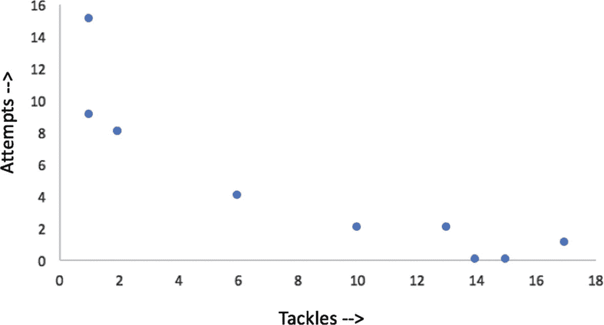

图 7-2

尝试次数与得分的散点图

到目前为止，我们不知道哪些球员是前锋、中场或后卫，但如果我们对这些数据使用某种聚类技术，我们会得到分组，如图 [7-3](#Fig3) 所示。该图清楚地显示了该数据中有三个组。图表的左上角是所有前锋的分组，右下角的分组代表铲球次数最多、得分次数最少的后卫。在这两组球员之间还有一名球员可能属于中场球员，他有一定数量的铲球并试图进球。

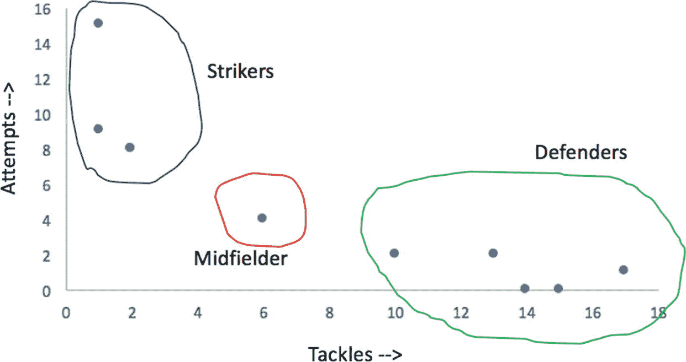

图 7-3

数据中的组

在这个例子中，我们看到了在没有任何监督训练的情况下，我们仍然可以预测数据中存在的组。

群集可以有多种应用，包括:

1.  异常检测

2.  预测性维护

3.  客户细分

根据可用数据和特定要求，可以使用许多聚类算法。在这一章中，我将重点介绍 k-means 算法，为在线收听不同流派音乐的用户群创建聚类。K-means 是这种分组练习中最强的算法之一。 *K* 代表必须从数据中形成的聚类或组的数量。K-means 的工作原理是计算每个数据点与其余数据点的距离，并尝试对最近的数据点进行分组，直到达到所需数量的 K 值。我们将尝试使用 k-means 算法将用户分成有意义的组，以便在特定的音乐流派中根据他们的口味进行推荐。

## 查看数据集

我们将用于此示例的数据集是一个采样数据集，它只包含两列:用户 id 和音乐类别。该数据集中有近 50 万条可用记录。

### 导入 SparkSession 并创建对象

第一步是导入`SparkSession`并创建一个 Spark 对象，以便使用 PySpark。

```py
[In]: from pyspark.sql import SparkSession
[In]: spark=SparkSession.builder.appName('unsupervised_learning').getOrCreate()

```

我们还将导入其他几个库，如 Pandas 和 NumPy，供以后使用。

```py
[In]: import pyspark
[In]: import pandas as pd
[In]: import numpy as np
[In]: import matplotlib.pyplot as plt
[In]: from pyspark.sql.functions import *
[In]: from pyspark.sql.types import *
[In]: from pyspark.ml.clustering import KMeans

[In]: df=spark.read.csv('music_data.csv',inferSchema=True,header=True)
[In]: df.count()
[Out]: 429023
[In]: df.printSchema()
[Out]:

```


前面的内容证实了我们只处理数据集中的两列。我们可以通过做一些聚合来进一步探索这个数据框架。使用`distinct`功能可以确定不同音乐类别的总数。通过对“音乐类别”列下分组的计数值进行排序，可以找到用户最喜欢的音乐类别，如下所示:

```py
[In]: df.select('music category').distinct().count()
[Out]: 21
[In]:df.groupBy('music category').count().orderBy('count',ascending=False).show(100,False)
[Out]:

```

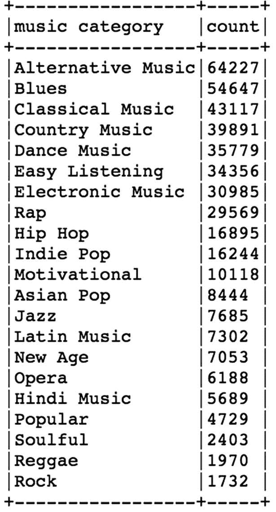

另类音乐和布鲁斯似乎是用户最喜欢的类型。我们还可以通过与前面类似的方式找到系统中唯一用户的总数。

```py
[In]: df.select('user_id').distinct().count()
[Out]: 775
[In]:df.groupBy('user_id').count().orderBy('count',ascending=False).show(20,False)
[Out]:

```

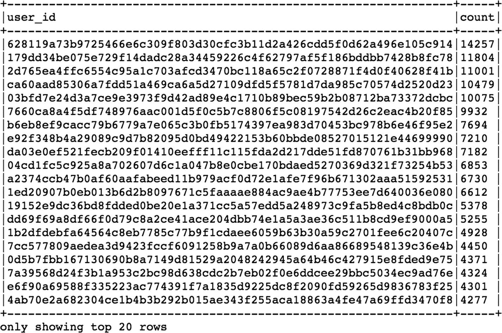

```py
[In]:df.groupBy('user_id').count().orderBy('count',ascending=True).show(20,False)
[Out]:

```

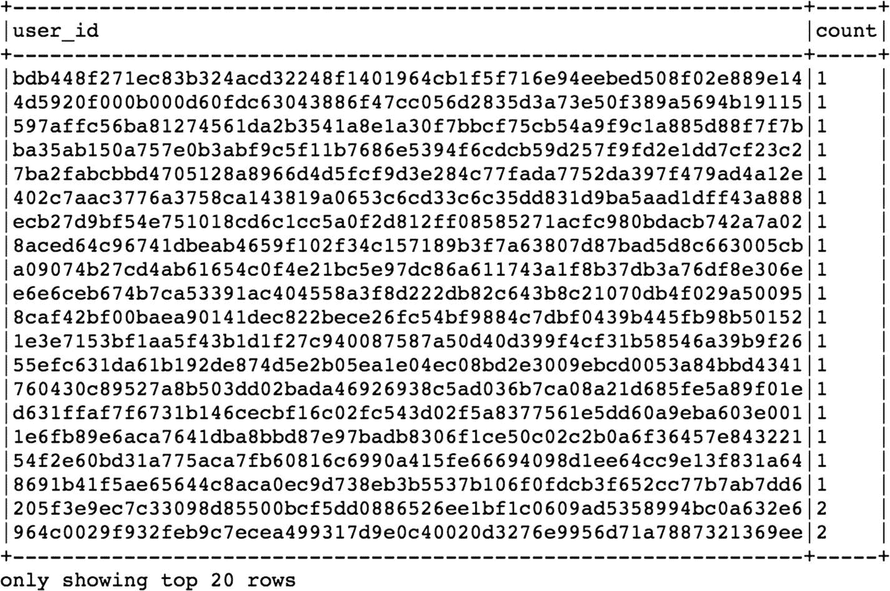

在这个数据框架中，我们有各种各样的用户。有的歌曲听了多达 14000 遍，有的只听了一遍。下一个任务是重塑该数据帧，以便在其上使用聚类。

## 重塑用于聚类的数据帧

我们将数据转换为用户 ID 和音乐类别，并用用户听过的歌曲总数填充这些值。我们使用`crosstab`函数来透视数据。

```py
[In]: feature_df=df.stat.crosstab("user_id", "music category")
[In]: feature_df.printSchema()
[Out]:

```

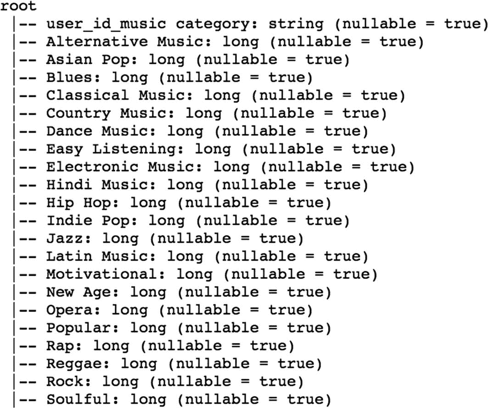

```py
[In]: feature_df.show(3,False)

[Out]:

```

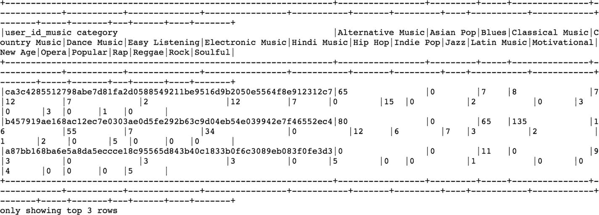

```py
[In]: from pyspark.ml.linalg import Vectors
[In]: from pyspark.ml.feature import VectorAssembler

```

既然我们在新的数据帧中有了所需的属性，我们必须使用`VectorAssembler`将它们组合起来，创建一个单一的特征向量。这里要记住的一件关键事情是，我们不使用 dataframe 的索引，它实际上包含了`VectorAssembler`的用户 id。

```py
[In]: print(feature_df.columns)
[Out]:

```


```py
[In]: feat_cols=[col for col in feature_df.columns if col != 'user_id_music category']
[In]: print(feat_cols)
[Out]:

```


```py
[In]: vec_assembler = VectorAssembler(inputCols = feat_cols, outputCol="features")
[In]: final_data = vec_assembler.transform(feature_df)

[In]: final_data.printSchema()
[Out]:

```

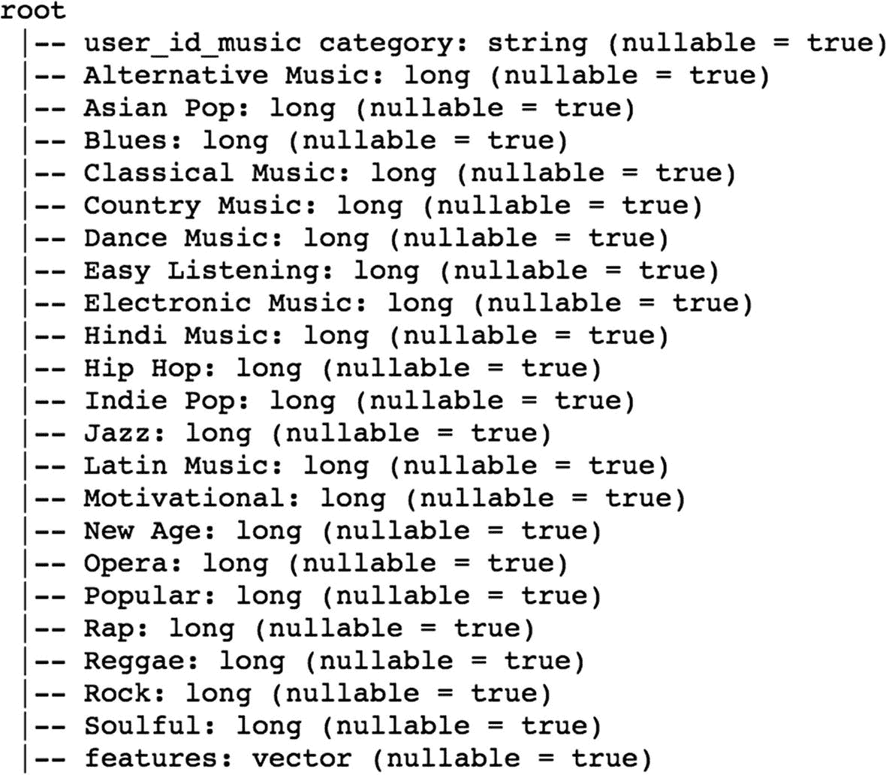

### 注意

需要记住的一点是，聚类对数据的规模很敏感，原因很简单，它使用距离度量来比较两个值之间的相似性(多维性)。因此，在应用聚类之前缩减数据总是一个好主意。

接下来，我们在 Spark 库中导入`StandardScaler`，并将其应用于特征向量。

```py
[In]: from pyspark.ml.feature import StandardScaler
[In]:scaler = StandardScaler(inputCol="features", outputCol="scaledFeatures", withStd=True, withMean=False)
[In]: scalerModel = scaler.fit(final_data)
[In]: cluster_final_data.columns
[Out]:

```

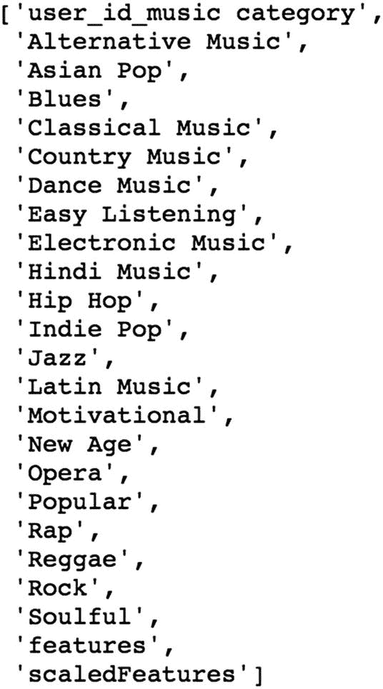

下一步是使用 k-means 聚类算法实际构建聚类。

### 用 K-Means 构建聚类

在进行聚类分析之前要问的一个关键问题是:“应该从数据中形成多少个聚类？”解决这个问题的一种方法是肘方法，通过这种方法，我们尝试绘制一个聚类内的误差平方和与聚类数的关系图。这给了我们一个概念，从给定的数据中可以形成多少个组。基本上，我们将 k-means 应用于由预定数量的聚类(2-10)组成的集合，并可视化其误差。在图表上任何有肘形形成的地方，都是选择 k 的好数字。

```py
[In]: errors=[]
for k in range(2,10):
    kmeans = KMeans(featuresCol='scaledFeatures',k=k)
    model = kmeans.fit(cluster_final_data)
    wssse = model.computeCost(cluster_final_data)
    errors.append(wssse)
    print("With K={}".format(k))
    print("Within Set Sum of Squared Errors = " + str(wssse))
    print('--'*30)

[Out]:

```

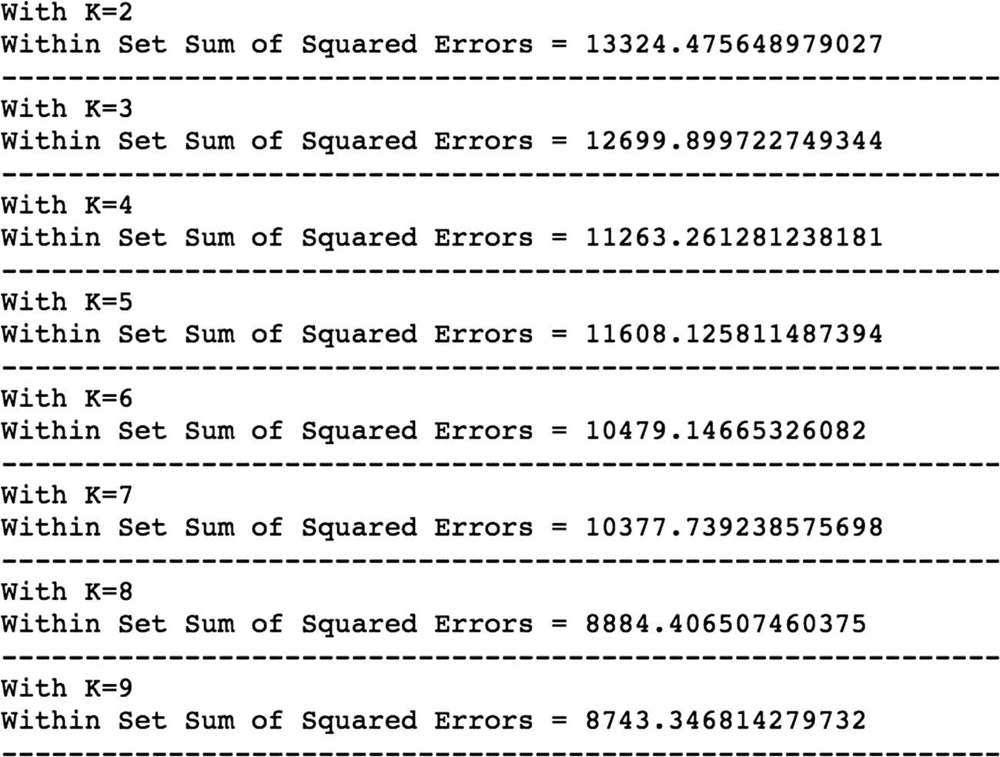

```py
[In]: cluster_number = range(2,10)

[In]: plt.scatter(cluster_number,errors)
[In]: plt.xlabel('clusters')
[In]: plt.ylabel('WSSE')
[In]: plt.show()
[Out]:

```

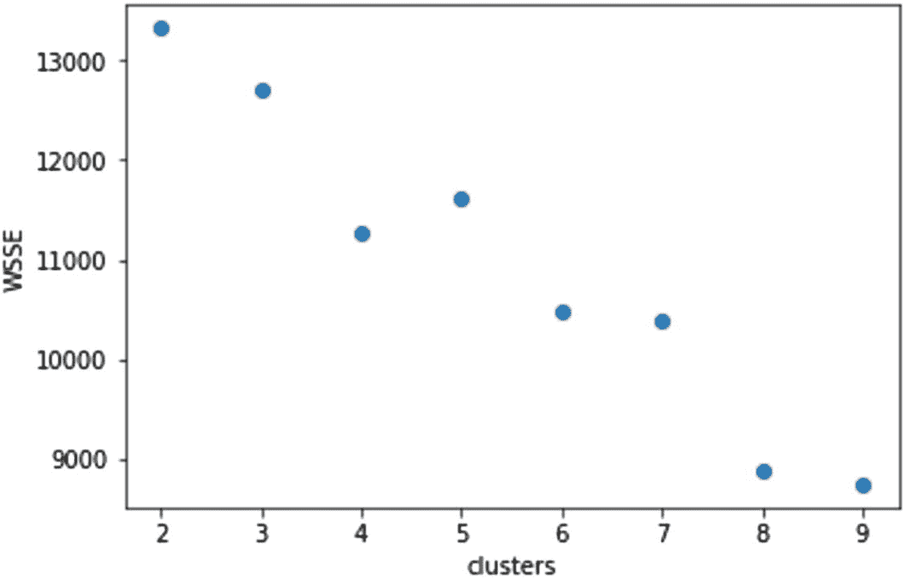

图 7-4

肘形图

在我们的例子中，图表中形成了多个弯头。所以我们可以选择`4`、`6`或者`8`中的任意一个作为 k 的值，有一点要记住，聚类是没有正确答案的。基于所使用的技术，您可以从相同的数据中获得不同的聚类，因为每种技术的起始点都不同。我们继续，选择 k 的值为`6`。

```py
[In]: kmeans6 = KMeans(featuresCol='scaledFeatures',k=6)
[In]: model_k6 = kmeans6.fit(cluster_final_data)
[In]: model_k6.transform(cluster_final_data).groupBy('prediction').count().show()
[Out]:

```

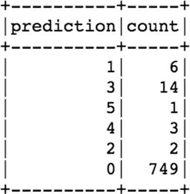

从我们的数据中，我们看到大多数用户属于一个集群。除此之外，还有五个值较小的集群。现在，我们将这个预测添加到现有的数据框架中，以便能够可视化集群。

```py
[In]: model_k6.transform(cluster_final_data).show()
[Out]:

```

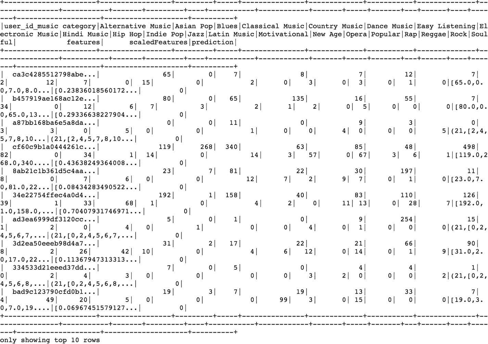

```py
[In]: cluser_prediction=model_k6.transform(cluster_final_data)
[In]: cluser_prediction.printSchema()
[Out]:

```

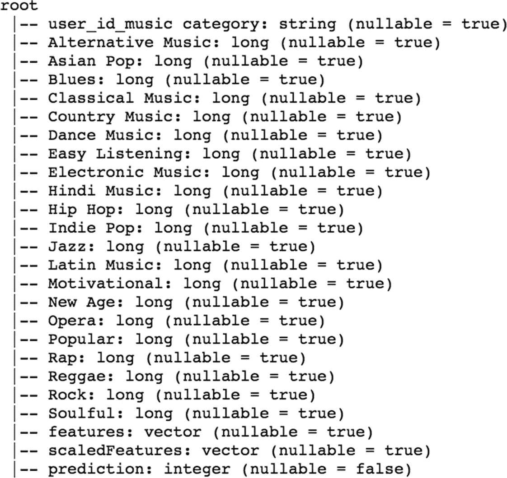

因为我们要处理多个维度，所以很难用聚类数来可视化数据。因此，我们使用 PCA(主成分分析)技术来减少总维数。在前面的章节中，你已经看到了如何使用 PCA。我们现在使用 PCA 将最初的 21 个特征减少到 3 个，如下所示。

```py
[In]: from pyspark.ml.feature import PCA
[In]: from pyspark.ml.linalg import Vectors

[In]: pca = PCA(k=3, inputCol="scaledFeatures", outputCol="pca_features")
[In]: pca_model = pca.fit(cluser_prediction)

[In]: result = pca_model.transform(cluser_prediction).select('user_id_music category',"pca_features",'prediction')
[In]: result.show(truncate=False)
[Out]:

```

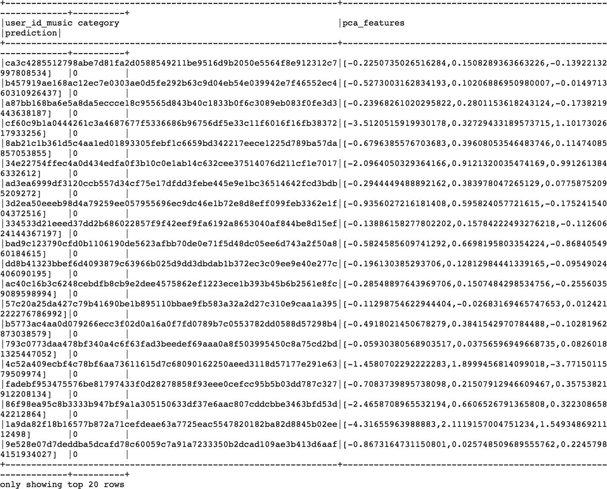

最后，我们将 PCA 数据帧转换为 Pandas 数据帧，此外，通过从列表中创建单独的列，从 PCA 特征列创建单独的列(x，y，z)。

```py
[In]: clusters = result.toPandas().set_index('user_id_music category')
[In]: clusters.head(10)
[Out]:

```

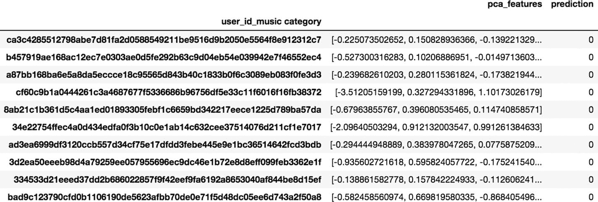

```py
[In]: clusters[['x','y','z']]=pd.DataFrame(clusters.pca_features.values.tolist(), index= clusters.index)
[In]: del clusters['pca_features']
[In]: clusters.head(10)
[Out]:

```

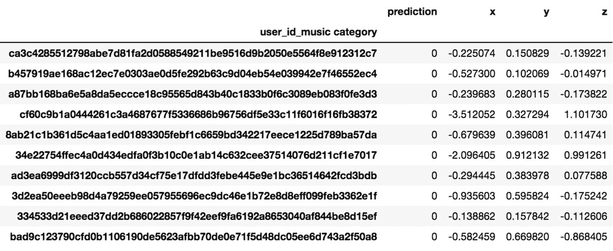

现在我们有了表示原始特征的三维(3D)数据和 k-means 的聚类预测，我们可以使用 3D 绘图技术在 3D 绘图上可视化这些聚类。

```py
[In]: from mpl_toolkits.mplot3d import Axes3D
[In]: cluster_vis= plt.figure(figsize=(10,10)).gca(projection='3d')
[In]: cluster_vis.scatter(clusters.x, clusters.y, clusters.z, c=clusters.prediction)
[In]: cluster_vis.set_xlabel('x')
[In]: cluster_vis.set_ylabel('y')
[In]: cluster_vis.set_zlabel('z')
[In]: plt.show()
[Out]:

```

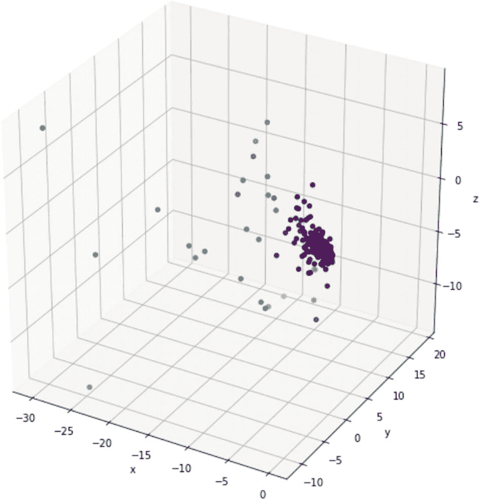

图 7-5

集群可视化

这个集群练习之后的后续活动之一可以是根据属性值为组分配不同的角色。这可能是一项手工活动，需要一些时间来创建有意义的人物角色。一旦创建完成，企业可以通过多种方式来营销和锁定特定用户。

## 结论

在本章中，您学习了有监督和无监督机器学习技术之间的区别。您还了解了如何使用 k-means 聚类从原始数据构建聚类。然后解释了寻找 k 的最佳值的方法以及如何可视化由 k-means 算法形成的最终聚类。