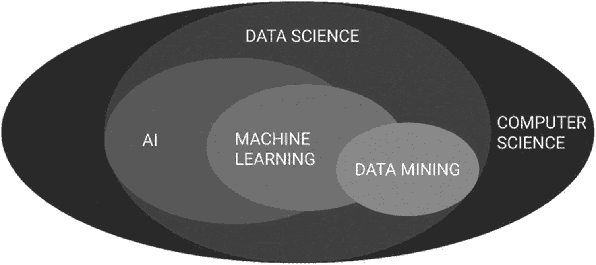
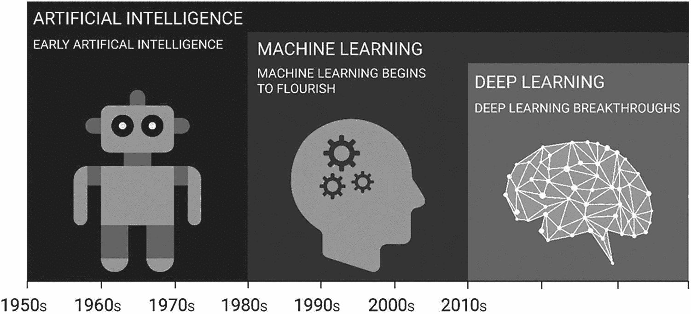
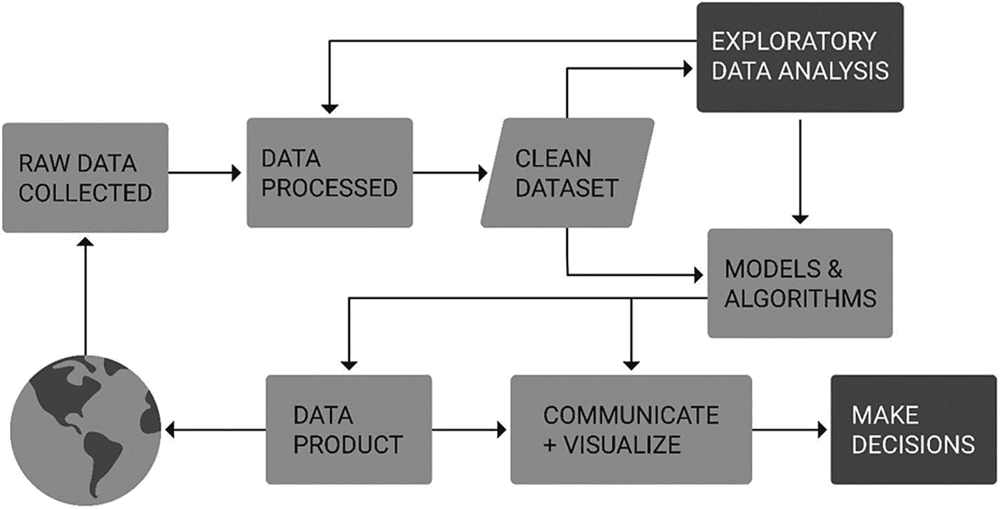
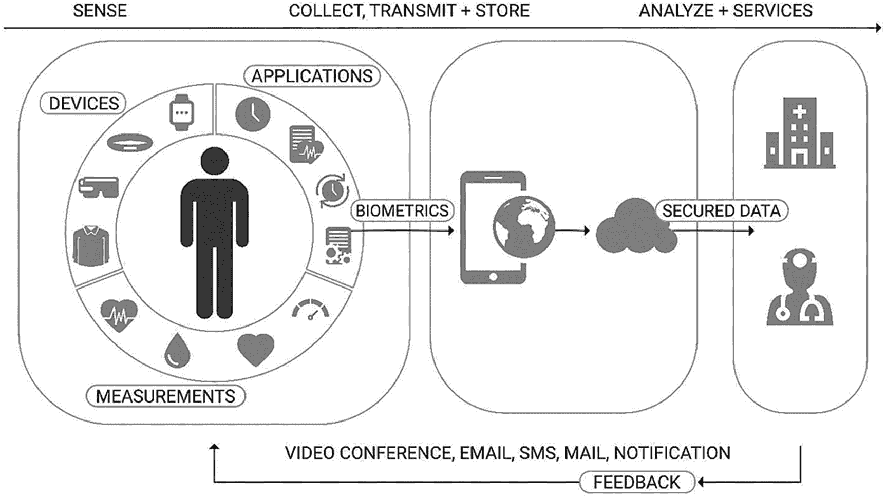

# 一、什么是人工智能？

> *知识本身算不了什么，但应用知识有用吗？那是强大的。*
> 
> —奥修

人工智能(AI)再次被认为是我们这个时代最令人兴奋的进步之一。虚拟助手可以非常准确地确定我们的音乐品味，汽车现在能够自动驾驶，移动应用程序可以帮助逆转一度被认为是慢性和渐进性的疾病。

许多人惊讶地发现，人工智能并不是什么新鲜事物。人工智能技术已经存在了几十年。事实上，在数据可用性和指数级廉价计算的推动下，它正在复兴。

## 多方面的学科

人工智能是计算机科学的一个子集，起源于数学、逻辑、哲学、心理学、认知科学和生物学等(图 [1-1](#Fig1) )。

图 1-1

人工智能、机器学习及其在计算机科学中的地位

对人工智能的最早研究受到了一系列思想的启发，这些思想始于 20 世纪 30 年代末，并在 1950 年达到高潮，当时英国先驱艾伦·图灵(Alan Turing)出版了《计算机械与智能》(Computing Machinery and Intelligence)，他在书中问道:“机器能思考吗？”图灵测试提出了一种测试机器展示“人工”智能能力的测试，评估机器的行为是否与人类的行为无法区分。图灵提出，如果人类评估者可以与计算机和人类进行自然语言对话，并且不区分两者(即成功模仿人类行为的代理或系统)，则可以认为计算机能够思考。

人工智能一词是由达特茅斯学院的约翰·麦卡锡教授在 1956 年首先提出的。麦卡锡教授提出了一个夏季研究项目，其想法是“学习的每个方面或智力的任何其他特征原则上可以如此精确地描述，以至于可以制造一台机器来模拟它”[6]。

事实是，人工智能的核心仅仅是编程。如图 [1-1](#Fig1) 所示，AI 可以理解为计算机科学的抽象。它受欢迎程度的飙升以及它的能力，与通过移动设备、智能手表、可穿戴设备和比以往任何时候都更便宜的访问计算机能力的数据爆炸有很大关系。据 IBM 估计，90%的全球数据是在之前的两年内创建的[7]。

据估计，未来十年将有 1500 亿个联网测量传感器，这是全球人口的 20 倍[8]。这种指数级的数据使一切都变得智能。从智能手机到智能洗车，智能家居、城市和社区等着我们。

这些数据带来了大量的学习机会，因此，现在的重点已经转移到从可用数据中学习和智能系统的开发。系统获得的数据越多，它学习的能力就越强，从而变得更加准确。

人工智能和机器学习在企业中的使用和应用仍然相对较新，在健康领域更是如此。Gartner 的“新兴技术炒作周期”将机器学习置于膨胀预期的顶峰，在平台期之前有 5-10 年[9]。

因此，机器学习在医疗保健环境中的应用是新鲜、令人兴奋和创新的。如今，移动设备比人还多，健康的未来是由来自患者、环境和医生的数据塑造的[31]。因此，利用人工智能和机器学习优化健康的机会正在成熟。

在当前的生态系统中，人工智能和机器学习在健康领域的实现不会更受欢迎，因为全球医疗保健成本正在增加，政府和私人账单支付者正在对服务施加越来越大的压力，以变得更具成本效益。通常必须在不对患者访问、患者护理和健康结果产生负面影响的情况下管理成本。

但是，人工智能和机器学习如何应用于日常医疗保健环境呢？这本书是为那些寻求理解什么是人工智能和机器学习，以及如何在他们的健康生态系统中开发，评估和部署智能系统的人准备的。包括健康智能方面的真实案例研究，以及人工智能和机器学习如何改善患者健康和人口健康以及促进显著节约成本和提高效率的例子。

到本书结束时，读者应该对人工智能和机器学习的关键主题有信心。读者将能够描述机器学习的方法和局限性，基本算法，数据的有用性和要求，学习的道德和治理，以及如何评估这种系统的成功。最重要的是，读者将学习如何规划现实世界的机器学习项目——从准备数据和选择模型到验证准确性和评估性能。

与其专注于压倒性的统计和代数，不如探索人工智能和机器学习在医疗保健中的理论和实际应用——以及如何评估人工智能和机器学习应用的有效性、适用性和成功的方法和技巧。

## 检验人工智能

从本质上来说，人工智能可以被定义为以我们人类认为聪明或类似人类的方式模拟智能体(计算机)的智能行为[10]。人工智能的核心概念包括智能体发展特性，包括知识、推理、解决问题、感知、学习、规划以及操纵和移动的能力。

具体而言，人工智能可被视为包括以下内容:

*   让系统理性推理:技术包括自动推理、证明计划、约束求解和基于案例的推理。

*   让程序学习、发现和预测:技术包括机器学习、数据挖掘(搜索)和科学知识发现。

*   让程序玩游戏:技术包括极大极小搜索和阿尔法-贝塔剪枝。

*   让程序与人类交流:技术包括自然语言处理(NLP)。

*   让一个程序展现出生命的迹象:技术包括遗传算法(g a)。

*   让机器在世界上智能导航:这涉及机器人技术，如规划和视觉。

对人工智能有很多误解，主要是因为它仍然是一个非常年轻的学科。事实上，对于它将如何发展也有许多看法。有趣的专家意见包括凯文·沃里克的意见，他认为机器人将接管地球。罗杰·彭罗斯认为计算机永远不可能真正智能。与此同时，马克·杰弗瑞甚至提出计算机将进化成人类。人工智能是否会在下一代接管地球不太可能，但人工智能及其应用将会一直存在。

在过去，由于有限的数据集、代表性的数据样本以及无法存储和随后索引和分析大量数据，人工智能的智能方面受到了阻碍。如今，在手机使用、数字设备、日益数字化的系统、可穿戴设备和物联网(IoT)的指数级增长推动下，数据是实时产生的。

现在，不仅数据是实时流，而且来自各种来源的数据也在快速增加，并且要求这些数据必须可供分析，并且从根本上是可解释的，以便做出更好的决策。

人工智能有四个不同的类别。

### 反应式机器

这是最基础的 AI。反应式系统在当前场景中做出反应，依靠教授或回忆的数据在其当前状态下做出决策。反应式机器很好地执行了它们被设计的任务，但是它们不能做别的。这是因为这些系统不能利用过去的经验来影响未来的决策。这并不意味着反应式机器是无用的。

国际象棋超级计算机深蓝是一台反应式机器，能够根据棋盘在那个时间点做出预测。深蓝在 1996 年击败了国际象棋世界冠军加里·卡斯帕罗夫。一个鲜为人知的事实是，卡斯帕罗夫赢了剩下 5 场比赛中的 3 场，以 4 比 2[11]击败了深蓝。最近，谷歌的 AlphaGo 战胜了世界领先的人类围棋选手[73]。

### 有限的记忆:理性思考和行动的系统

这是一种人工智能，它利用有限记忆的原理，使用预编程的知识和随后随着时间的推移进行的观察。在观察过程中，系统观察其环境中的项目，并检测它们如何变化，然后做出必要的调整。这项技术用于自动驾驶汽车。无处不在的互联网接入和物联网为有限的存储系统提供了无限的知识来源。

### 心智理论:像人类一样思考的系统

心智理论人工智能代表解释他们的世界和其中的行动者或人的系统。这种人工智能需要理解环境中的人和事物也可以改变他们的感觉和行为。虽然这种人工智能目前还很有限，但它可以用于护理角色，如帮助老年人或残疾人完成日常任务。

同样地，一个使用人工智能思维理论的机器人将能够衡量其世界中的事物，并认识到环境中的人有自己的思维、独特的情感、习得的经验等等。心理理论人工智能可以试图理解人们的意图，并预测他们可能的行为。

### 有自我意识的人工智能:属于人类的系统

这种最先进的人工智能涉及具有意识和识别人类以外世界的机器。这个 AI 现在还不存在，但是软件已经用对某些事物的欲望和对自身内在感情的认知来证明了。伦斯勒理工学院的研究人员给三个机器人做了一个聪明人谜题的更新版本，一个诱导自我意识测试，其中一个通过了。该测试要求人工智能倾听和理解非结构化文本，并能够识别自己的声音以及与其他机器人的区别[12]。

现在的技术足够灵活，可以实时访问大量数据集，并在旅途中学习。最终，人工智能的好坏取决于用来创建它的数据——有了强大的大容量数据，我们可以对自己的决策更有信心。

医疗保健在利用大数据和人工智能的优势方面进展缓慢，特别是与交通、能源和金融相比。尽管造成这种情况的原因很多，但医疗卫生部门的僵化是基于人们的生命处于危险之中这一事实。医疗服务与其说是消费者的选择，不如说是必需品；因此，从历史上看，医疗行业几乎没有威胁，这通常会推动其他行业寻求创新。

这加快了医疗机构所能提供的和患者所想要的之间的差距——这随后导致了护理和健康结果的差异以及全球公认的药物优先治疗疾病的方法。

数据的爆炸式增长推动了人工智能，实现了以数据为导向的智能方法。过去 5 年在医疗保健领域尤其具有破坏性，数据主导的人工智能应用不仅有助于智能系统预测、诊断和管理疾病，还能积极逆转和预防疾病，并实现数字治疗。

图像识别和分类方面的最新进展也开始渗透到行业中，深度神经网络(DNNs)在视觉识别任务中取得了显著的成功，通常可以达到或超过人类的表现(图 [1-2](#Fig2) )。

图 1-2

人工智能及其发展

人工智能的类型也可以通过它可以执行的任务来解释，并分为弱人工智能或强人工智能。

### 弱人工智能

弱或窄 AI 是指执行一个(窄)任务的 AI。弱人工智能系统不像人类，尽管如果训练正确，它会看起来很聪明。一个例子是国际象棋游戏，其中所有的规则和移动都是由人工智能计算的，每一个可能的场景都是确定的。

### 强人工智能

强人工智能能够像人类一样思考和执行任务。没有强人工智能的突出例子。弱人工智能有助于构建强人工智能系统。

## 什么是机器学习？

机器学习这个术语归功于 IBM 的亚瑟·塞缪尔，他在 1959 年提出，有可能教会计算机学习它们需要了解的关于世界的一切，以及如何为自己执行任务。机器学习可以理解为 AI 的一种形式。

机器学习诞生于模式识别和计算机无需编程即可执行特定任务的理论。这包括贝叶斯方法、神经网络、归纳逻辑编程、基于解释的自然语言处理、决策树和强化学习等技术。

具有硬编码知识库的系统通常会在新环境中遇到困难。能够获得自身知识的系统可以克服某些困难。这种能力被称为机器学习。这需要知识获取、推理、更新和提炼知识库、获取启发等等。

机器学习在第 [3](03.html) 章中有更深入的介绍。

## 什么是数据科学？

所有的人工智能任务都会使用某种形式的数据。数据科学是一门不断发展的学科，涵盖了与数据清理、提取、准备和分析相关的任何内容。数据科学是当试图从数据中提取见解(即试图理解)和信息时所使用的一系列技术的总称。

数据科学一词是由 William Cleveland 在 2001 年提出的，用来描述将统计学、商业和计算机科学紧密结合在一起的一门学科。

从事人工智能项目的团队无疑将与数据打交道，无论数据量是大是小。就大数据而言，实时数据通常需要实时分析。在大多数业务案例中，数据科学家或数据工程师需要执行许多与数据相关的技术角色，包括查找、解释和管理数据；确保数据的一致性；使用数据建立数学模型；以及向利益相关者展示和传达数据见解/发现。虽然没有数据科学就无法实现大数据，但是没有大数据也可以实现数据科学，所需要的只是数据。

因为数据探索需要统计分析，许多学者认为数据科学和统计学没有区别。数据科学团队(即使是一个人的团队)是部署成功项目的基础。

数据科学团队通常扮演两个关键角色。首先，从一个问题或疑问开始，它寻求用数据来解决它；其次，它通过分析使用数据来提取洞察力和情报(图 [1-3](#Fig3) )。

图 1-3

数据科学过程

## 从实时大数据中学习

人工智能此前一直被自己掌握的技术和数据所扼杀。在智能手机和廉价计算爆发之前，数据集在规模、有效性和代表性方面仍然有限，而不是实时性。

今天，我们拥有实时、可立即访问的数据和工具，可以进行快速分析。现代生活的数据化正在推动机器学习的成熟，并促进向基于证据、数据驱动的方法过渡。数据化是指将生活的方方面面数字化(或数据化)的现代趋势。现在的技术足够敏捷，可以访问这些庞大的数据集，以快速发展机器学习应用。

患者和医疗保健专业人员都会产生大量的数据。手机收集血压、地理位置、行走步数、营养日记等指标，以及其他非结构化数据，如对话、反应和图像。

也不仅仅是数字或临床数据。数据提取技术可应用于纸质文档或扫描的图像，以处理文档进行综合和调用。

医疗保健专业人员收集健康生物标志物以及其他结构化指标。不管数据来源如何，要学习，必须把数据变成信息。例如，当系统知道血糖水平目标时，将糖尿病患者的血糖读数输入到应用程序中具有更大的相关性，从而可以了解输入是否满足推荐的目标范围。

在二十一世纪，几乎每一个行为都会留下某种形式的交易痕迹。苹果 iPhone 6 的速度比阿波罗时代将人类送上月球的 NASA 电脑快 32000 多倍。事实上，一个简单的 Wi-Fi 路由器甚至 USB-C 充电器的计算能力足以将宇航员送上月球[13]。设备不仅比以往更小，而且比以往更强大。随着组织利用大数据源，已经出现了将来自数据的学习嵌入用户体验的每个方面的转变-从购买产品或服务到应用程序内的用户体验，并以多种不同的方式进行交互。

当数据以原始形式出现并转化为改变实践的知识时，数据的价值就被理解了。该值由项目和上下文驱动。例如，该价值可能是由于更快地识别依从性、依从性和循证护理中的不足而产生的。它可能是在医院或组织内更好地共享数据和见解，或者与患者建立更定制的关系，以推动坚持和遵守并促进自我护理。同样，这可能是为了避免更昂贵的治疗或昂贵的错误。

## 人工智能在医疗保健中的应用

人工智能代理完全取代医生和护士不太可能，但机器学习和人工智能正在改变医疗保健行业，并改善结果。它会一直留在这里。

机器学习正在改善诊断，预测结果，并开始触及个性化护理的表面(图 [1-4](#Fig4) )。

图 1-4

数据驱动的患者-医疗保健专业人员关系

想象一下这样一种情况，你走进去看医生(或通过电话会议应用程序),心脏周围疼痛。在听完你的症状(可能是通过视频或医疗物联网设备分享的)后，医生将它们输入到他们的计算机中，计算机会调出他们应该参考的最新证据库，以有效地诊断和治疗你的问题。你有一个核磁共振扫描，一个智能的计算机系统帮助放射科医师检测出任何对放射科医师的肉眼来说太小的问题。他们甚至可能建议在你佩戴或使用的设备旁边使用特定的智能手机应用程序，来测量心脏指标和一些潜在健康状况的风险。

您的手表可能一直在持续收集您的血压和脉搏，而连续血糖监测仪会实时记录您的血糖读数。你的戒指可能在测量你的体温。最后，你的医疗记录和家族病史会被一个电脑系统评估，该系统会向你建议精确识别的治疗途径。撇开数据隐私和治理不谈，我们从各种数据池中获得的启示是令人兴奋的。

### 预报

监控数据以预测疾病爆发的技术已经存在。这通常是通过使用社交媒体等实时数据源以及来自网络和其他来源的历史信息来完成的。通过分析包括降雨量、温度、病例数和各种其他数据点在内的数据，用人工神经网络(ann)预测了疟疾的爆发[14]。

### 诊断

许多数字技术为非紧急医疗系统提供了替代方案。考虑到未来，将基因组与机器学习算法相结合提供了了解疾病风险、改善药物遗传学和为患者提供更好治疗途径的机会[15]。

### 个性化治疗和行为矫正

数字治疗是数字健康的一个新兴领域。数字医疗可以根据用户体验进行个性化，以吸引人们进行可持续的行为改变[16]。

来自糖尿病数字媒体的数字疗法 Gro Health 是一个屡获殊荣的循证行为改变平台，通过解决健康的四个关键支柱(可改变的风险)来解决非传染性疾病。营养、活动、睡眠和精神健康领域的教育和支持由人工智能提供动力，通过人口健康管理中使用的远程监控支持，根据用户目标和重点、疾病概况、种族、年龄、性别和位置定制体验。该应用程序提供个性化的教育和集成的健康跟踪，从用户和更广泛的社区的进展中学习。

在第 8 周结束时，Gro Health 证明了精神健康的改善，包括在第 8 周时感知压力减少 23%，广泛性焦虑减少 32%，抑郁症减少 31%[17]。

### 药物发现

初步药物发现中的机器学习具有各种用途的潜力，从药物化合物的初步筛选到基于生物因素的预测成功率。这包括下一代测序等 R&D 发现技术。

药物不一定要有药理学的外观。数字疗法的使用和真实世界患者数据的聚合为曾经被认为是慢性和进行性的疾病提供了解决方案。例如，超过 300，000 名二型糖尿病患者使用的低碳水化合物计划(LCP)应用程序使 26%完成该计划的患者在 1 年后病情得到缓解[16，18]。

### 后续护理

医院再入院是医疗保健中的一个大问题。医生和政府都在努力保持病人的健康，尤其是在医院治疗后回家的时候。数字健康教练帮助护理，类似于电子商务网站上的虚拟客户服务代表。助手可以提示关于患者药物治疗的问题并提醒他们吃药，查询他们的病情症状，并将相关信息传达给医生[16]。在印度等一些地方，有一个“管家”市场，即精通技术的健康教练，他们为老年人或行动不便的病人提供数字护理。通过建立 Zoom 呼叫或其他服务，管家使患者能够与他们的医疗团队互动，消除了过程中的任何惰性。

## 实现人工智能在医疗保健领域的潜力

为了让人工智能和机器学习完全融入医疗保健系统，必须解决几个关键挑战。

### 理解差距

利益相关者对人工智能和机器学习的理解和应用之间存在巨大差距。思想、方法和评估的交流对于医疗保健中推进人工智能和机器学习所需的创新至关重要。数据，包括数据的共享和整合，是医疗向实现精准医疗转变的基础。

发展专注于从数据中学习的数据科学团队是成功医疗保健战略的关键。所需的方法是对数据进行投资。提高患者和提供商的价值需要数据，因此需要数据科学专业人员。

### 碎片数据

有许多障碍需要克服。数据目前是零散的，难以组合。患者通过手机、Fitbits 和手表收集数据，而医生则定期收集生物标志物和人口统计数据。在患者的体验中，这些数据从未被合并。也不存在以有意义的和健壮的方式解析和分析这个更大的数据集的基础设施。此外，电子健康记录(EHR)目前在数据库中仍然是杂乱和分散的，需要在患者和提供商方便时可用的机制中进行数字化。

新冠肺炎无疑加快了数据来源的连接；然而，向现实生活中有用的数据结构发展仍处于起步阶段。数据结构是指由架构、技术和服务组成的统一环境，用于帮助组织管理和改进决策。例如，特定国家内的健康数据结构可能具有与患者相关的所有健康数据，所有人都可以通过公共路线访问这些数据。

虽然这听起来有点乌托邦，但大部分健康应用和服务都使用安全的、基于云的主机提供商，如亚马逊网络服务、微软 Azure 云以及谷歌云。例如，厂商之间创建数据结构的联系可能比我们想象的更紧密。

### 适当的安全

与此同时，组织面临着安全性和满足政府法规要求的挑战，特别是在管理患者数据和确保其随时可访问性方面。此外，许多医疗机构正在使用更容易受到攻击的旧版软件。由于勒索软件 WannaCry 的愤怒，NHS(国家医疗服务系统)的数字基础设施陷入瘫痪。起源于美国的勒索软件扰乱了计算机上的数据，并要求支付 300-600 美元来恢复访问[19]。

英格兰和苏格兰的医院和全科医生诊所是受到“勒索软件”攻击的超过 16 个医疗服务组织之一。攻击的影响不仅仅是技术失败的代价；这关系到病人的生命。英格兰部分地区的医生诊所和医院不得不取消预约，拒绝手术。在一些地区，人们被建议只在紧急情况下寻求医疗护理。NHS 只是众多因使用黑客工具而瘫痪的全球组织之一；勒索软件声称已经感染了 150 个国家的电脑。

在新冠肺炎期间，NHS 因拒绝苹果和谷歌的新冠肺炎追踪计划而受到嘲笑，他们选择建立他们自己的有相当大的安全缺陷的计划。

安全性和安全性是医疗技术的首要考虑因素，无论是数字技术还是其他技术。

### 数据治理

数据安全带来了数据治理的概念。医疗数据是个人的，不容易获取。人们普遍认为，由于隐私问题，公众不愿意分享他们的数据。然而，一项关于英国公众对商业获取健康数据的态度的威康基金会调查发现，17%的人永远不会同意他们的匿名数据与第三方共享[21]。

遵守多套法规意味着灾难恢复和安全性至关重要，而网络基础设施在确保满足这些要求方面发挥着关键作用。

医疗保健组织需要对网络基础设施进行现代化改造，以确保他们做好充分准备，尽可能提供最佳的患者护理。

在新冠肺炎期间，一些医疗机构能够接触病人。这听起来可能很简单，但它改变了全世界的医疗服务。

如果医疗保健数据被看到，医疗保健专业人员感到有义务采取行动。这导致人们不愿意看到可识别的患者数据，尤其是在非工作时间。因此，患者向他们的医疗保健团队发送电子邮件时，事实上收到的回复是转变后的医疗服务。新冠肺炎让每个人都可以在自己的时间内完成任务——从基于时间的期望转移到基于任务的期望。

### 偏见

学习的一个重要问题是偏见。随着人工智能越来越多地与我们的日常生活交织在一起——与我们在家里、工作场所和路上的体验融为一体——我们有必要质疑机器如何以及为什么会做这些事情。在机器学习中，学会学习会根据以前的经验产生自己的归纳偏差。从本质上讲，系统可能会因其所处的数据环境而产生偏差。

直到算法被用于现实环境中，人们才发现固有的偏见，这种偏见往往会通过现实世界的互动而被放大。

这加速了对更加透明的算法的日益增长的需求，以满足对药物开发和期望的严格规定。透明度不是唯一的标准；必须确保决策是公正的，以充分信任其能力。通过看穿黑盒和理解机器结论背后的因果推理的能力，人们获得了信心。

偏见会导致健康不平等。令人震惊的是，一些偏见只在偶然、反思和/或灵感上表现出来。

直到 2020 年，伦敦大学圣乔治医学院的一名学生才根据黑人和亚洲人的肤色编写了一本医学诊断手册，因为当时还没有使用非白人肤色的医学诊断手册[23]。

## 软件

传统的人工智能系统是用 Prolog、Lisp 和 ML 开发的。今天大多数机器学习系统都是用 Python 编写的，因为许多机器学习的数学基础都可以作为库使用。

“学习”的算法可以用大多数语言开发，包括 Perl、C++、Java 和 C。这将在后续章节中更深入地讨论。

## 结论

机器学习在医疗保健领域的潜在应用是巨大而令人兴奋的。其中一些在传统医疗保健服务中变得越来越明显，但未来才刚刚开始。

智能系统可以帮助我们逆转疾病，检测我们患癌症的风险，并根据实时生物标志物建议药物治疗过程——分别存在。人工智能的潜力是无限的——特别是当服务被统一起来以创建一个无处不在的数据结构时。这将改变任何行业，但健康从未如此重要。年龄、肥胖和种族被证明是新冠肺炎期间的关键风险因素[24，25，26]。从来没有比这更好的激励去过好生活了。提供个性化的数字治疗来吸引老年人口、肥胖人群和通常被认为“难以接触”的人群，可以真正改变医疗保健。

随之而来的还有巨大的责任和更广泛的道德问题。我们还没有完全理解可以从健康数据中学到什么。因此，学习的伦理是一个需要考虑的基本话题。

在智能系统可以检测疾病风险的基础上，该系统应该告诉患者它正在跟踪即将到来的结果吗？如果一种算法可以根据你的血糖和体重测量值检测出你患胰腺癌的风险——一种通常是绝症的疾病——那么向有问题的患者透露这一点是否道德？是否应该与医疗团队共享如此敏感的患者数据——这种行为会带来哪些意想不到的后果？

数字连接设备和机器学习应用的爆炸正在实现这些曾经的未来概念，围绕这些主题的对话是进步的关键。

如果一个病人选择不分享数据，那么根据已知数据进行归纳来预测相同的患病风险是否道德？如果我没有胰腺癌检查就不能得到人寿保险怎么办？有相当多的隐私问题与个人数据的使用有关，哪些应该是隐私的，哪些数据是有用的。

不变的是，可用的数据越多，做出的决定就越精确——但是到底多少是太多是另一个问题。驱动因素是决定数据的价值。

人工智能的伦理目前没有关于如何管理巨大的数据和机会宝库的重要指导方针、法规或参数。

许多人认为人工智能具有客观性，可以超越道德问题，但事实并非如此。人工智能算法只像来自环境数据的学习一样公平和公正。正如社会关系、政治和宗教信仰以及性取向可以从数据中揭示一样，对健康数据的研究揭示了新的伦理困境。

数据治理和此类数据的披露仍然需要国家和国际层面的政策。未来，无人驾驶汽车将能够实时使用大量数据来预测发生碰撞时的生存可能性。让系统选择谁生谁死，或者让医生根据两个病人的苹果手表的读数来决定治疗谁，这样做道德吗？一个人应该在哪里参与卫生服务——是在当地的诊所或医院，还是在当地的外卖店、超市或便利店？

这只是开始。

随着技术的发展，新的和改进的治疗和诊断将拯救更多的生命，治愈更多的疾病。随着循证医学的未来建立在数据和分析的基础上，它回避了是否会有足够的数据的问题。即使是这种情况，人们想知道收集它的后果是什么。