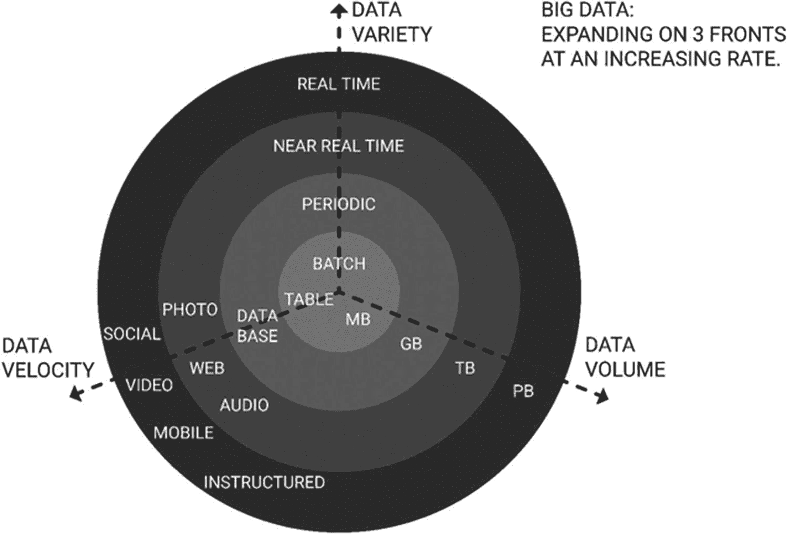
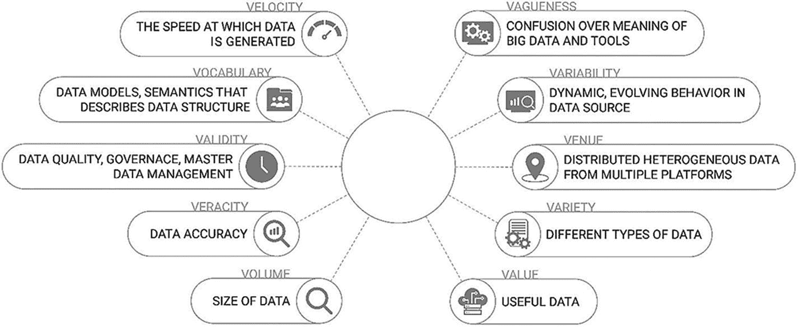
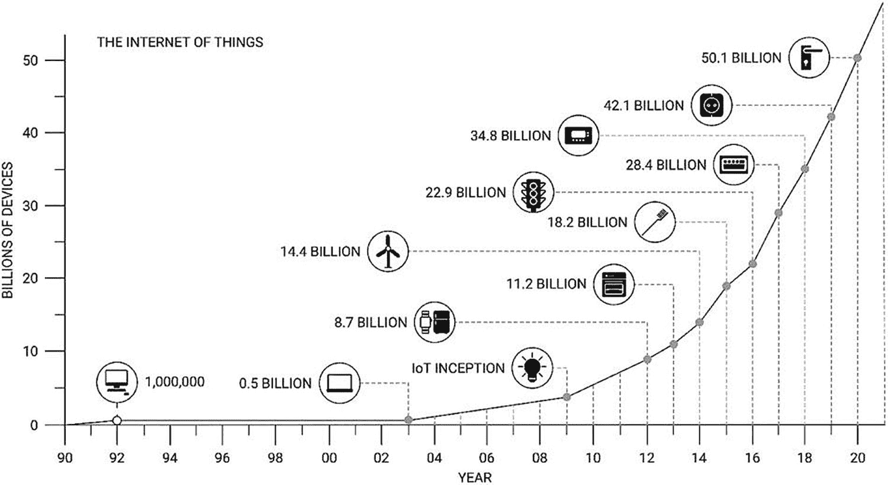
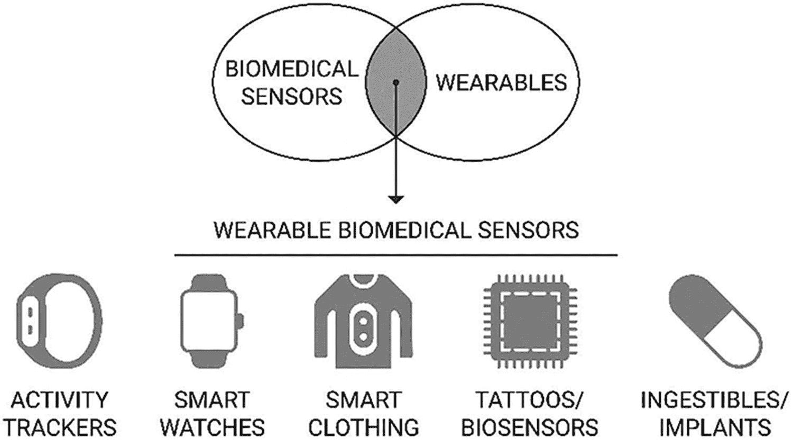
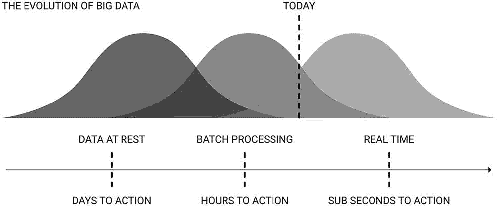
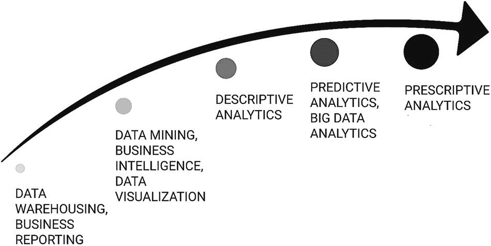
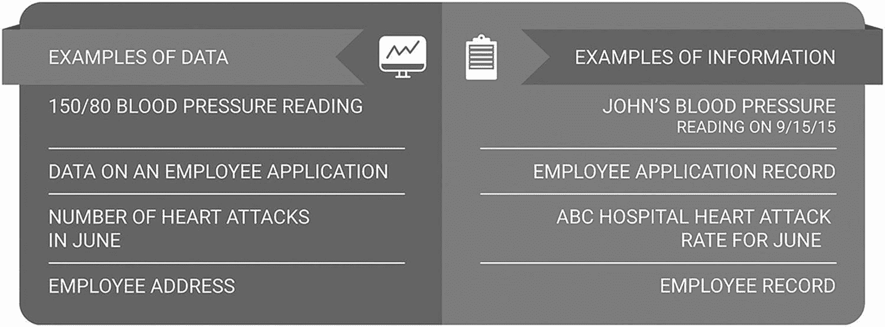

# 二、数据

> *轶事的复数是数据。*
> 
> —雷蒙德·沃芬格

数据无处不在。全球颠覆和国际倡议正在推动数据化。数据化指的是当今生活各个方面数字化(或数据化)的趋势[27]。这种数据创造使得数据能够转换成新的和潜在的有价值的形式。整个城市都被激励变得更聪明。在不久的将来，我们的城镇将实时收集数以千计的变量，以优化、维持和提高全体人口的生活质量。他们甚至可能连接到你的亚马逊或谷歌账户，并了解我们健康和日常生活中的所有重大事件，因为人机交互在智能医疗中变得更加深入。

人们有理由认为，除了管理交通，交通灯还可以收集其他数据，如空气质量、能见度和交通速度。人们不禁要问，超速罚款是否可以根据某人智能手表上的温度或智能戒指上的平均心率来决定。

数据无处不在。可能性是无限的。来自互联设备、嵌入式传感器和物联网的大数据推动了全球对数据分析、解释和可视化的需求。新冠肺炎本身被证明是国家和临床医生之间数据共享的一个很好的例子——特别是在新型冠状病毒的风险因素、共病和并发症方面。

## 什么是数据？

数据本身可以采取多种形式—字符、文本、单词、数字、图片、声音或视频。每条数据都分为两种主要类型:结构化和非结构化。

本质上，数据是一组定性或定量变量的值。要成为信息，数据需要解释。信息是有组织的或分类的数据，它对接收者有一些有意义的价值。信息是决策和行动所依据的经过处理的数据。

医疗保健正在经历一场数据革命，这要归功于两个巨大的转变:抑制不断增长的成本压力的需要，这产生了新的激励和报销结构；数字医疗，这通过数字设备和创新技术赋予人们权力，使医疗保健民主化。

临床趋势正在改变。社交媒体的出现以及通过互联网和健康社区即时获取信息意味着患者对自己的健康状况了如指掌。患者不断生成数据，并希望拥有和在服务间传输他们的数据。同时，循证医学正在努力实现个性化护理，以循证决策方法为主导。

患者和医疗保健专业人员都渴望获得所有可用的临床数据，以便根据现有证据做出更有效的治疗决策。2019 年 Diabetes.co.uk 的一项研究表明，三分之一的患者希望与他们的医疗保健专业人员分享他们的数据，但只有五分之一的患者可以这样做[9]。

将单个数据集聚合到更显著的群体中也提供了更有力的证据，因为亚群体中的细微之处可能不常见，因为它们在小样本中不容易显现。例如，将患有心血管疾病和高血压的患者聚集在一起，可能会比单独的数据集更有把握地呈现高胆固醇等健康状况。

现代医疗保健中的数据整合为众多领域的重大改进提供了机会。随着医学发展到循证和个性化，数据可用于改善

*   患者和人群健康

*   患者教育和参与

*   疾病和护理风险预测

*   服药依从性

*   远距离监控

*   病害治理

*   疾病逆转/缓解

*   治疗的个体化和个性化

*   和关心

*   财务、交易和环境预测、规划和准确性(与医疗保健组织内的任何运营和财务团队特别相关)

*   用户体验，可用于加快所有上述项目

数据促进信息。信息为洞察力提供动力，而洞察力会导致做出更好的决策。

## 数据类型

结构化数据通常是指存储在数据库中的某种东西，其结构遵循一种模型或模式。几乎每个组织都熟悉这种形式的数据，并且可能已经在有效地使用它。例如，大多数组织至少会在 Excel 电子表格中存储某种形式的数据。在临床环境中，EHR 也可以采用类似的结构化形式。

来自嵌入式传感器、智能手机、智能手表和物联网设备的读数通常是结构化数据的形式，无论是提供血糖读数、行走步数、消耗的卡路里、心率还是血压。

结构化数据类似于机器语言。结构化数据以其高度组织化的格式，方便了简单、直接的搜索和信息检索操作。为此，结构化数据通常存储在关系数据库中。

非结构化数据指的是其他一切。非结构化数据没有预定义的模型或模式。非结构化数据中没有可识别的结构，这给查询和信息检索带来了问题。电子邮件、短信、脸书帖子、Twitter 推文和其他社交媒体帖子都是非结构化数据的很好例子。非结构化数据可以释放信息和洞察力的宝库。

Gartner 报告指出，未来 5 年数据量将增长 800%，其中 80%将以非结构化数据的形式出现[29]。

非结构化数据带来的问题是容量问题。缺乏结构使得汇编和解释在时间和精力方面成为一项资源密集型任务。任何组织都将受益于非结构化数据分析机制，以减少非结构化数据增加的资源成本。除非数据很好理解，否则可能需要主题专家。

由于非结构化数据的原始和无组织形式，传统上结构化数据比非结构化数据更容易分析。然而，随着自然语言处理(NLP)等数据科学和机器学习方法的使用，非结构化、非正式数据集的分析正在改善，有助于对情感的理解和分类。

将非结构化数据转换成结构化模型并不总是可能的。例如，通过电子邮件或通知传输信息时，会将发送时间、主题和发件人等数据保存为统一字段。然而，信息的内容不容易被分解和分类。

半结构化数据适合结构化数据和非结构化数据之间的空间。半结构化数据不一定符合与关系数据库或数据表相关联的数据模式的正式结构。但是，半结构化数据可能包含标签或标记来分隔语义元素，并强制对数据中的记录和字段进行分组。

JSON (JavaScript 对象表示法)和 XML(可扩展标记语言)等语言都是半结构化数据的形式。两者都有助于促进数据交换。

数据是智能系统学习所需的燃料，是成功的人工智能最关键的组成部分。

它分为五个来源:

*   网络和社交媒体数据:点击、历史、健康论坛

*   机器对机器数据:传感器、可穿戴设备

*   大交易数据:健康索赔数据、账单数据

*   生物特征数据:指纹、遗传学、可穿戴设备驱动的生物标记

*   人为生成的数据:电子邮件、纸质文档、电子病历

当考虑典型的 Excel 电子表格时，在机器学习领域，以下定义也是有用的:

*   实例:单行数据或观察值。

*   特征:单列数据。这是观察的一个组成部分。

*   数据类型:这是指由特征表示的数据种类(例如，布尔、字符串、数字)。

*   数据集:用于训练和测试机器学习模型的实例的集合。

*   训练数据集:用于训练机器学习模型的数据集。

*   测试数据集:数据集用于确定

    机器学习模型的准确性/性能。

## 大数据

术语“大数据”是指作为发现和分析来源的海量、传统和数字数据的集合。

大数据是一个流行的术语，它定义了太大而无法在传统的关系数据库系统中存储和处理的数据集。这样，大数据这个术语就变得模糊了，尽管规模无疑是大数据的一部分，但规模本身并不能说明大数据真正变大的全部原因。

通过对大数据的分析，我们可以发现隐藏的模式；未知的相关性、趋势和偏好；和其他可以帮助利益相关者做出更好、更明智决策的信息。机器学习提供了一个技术工具箱，可以应用于数据集来实现这一目的。

Laney 在 2001 年首次将大数据描述为具有以下特征，也称为三个 v(图 [2-1](#Fig1) ) [30]:

图 2-1

数据的三个 v

*   容量:生成和存储的数据量。大数据通常数量庞大。庞大的数据带来了存储、索引和检索形式的复杂性。

*   多样性:大数据的类型和性质各不相同，需要高效的存储和分析以及处理此类数据的系统。

*   速度:大数据的接收速度带来了需求和挑战。

数据科学讨论大数据的三个 v 已经有一段时间了。然而，数据的另外两个方面可能比大数据的三个 v 更重要:数据准确性和数据价值的概念。Mark van Rijmenam 提出了另外四个 v，以进一步理解大数据极其复杂的本质[31]。

再进一步，一共十个 v(图[2-2](#Fig2))【32】。实际上，在制定数据策略时，组织需要牢记不同的 Vs 子集，这一点非常重要。

图 2-2

数据的十个 v

这里包括了现在提出的许多 Vs 的子集。

Gartner 对 199 名成员的调查显示，对大数据的投资正在增加；但调查显示出增长放缓的迹象，未来有意投资大数据计划的公司越来越少。只有 15%的企业报告部署了他们的大数据项目，这表明采用曲线仍在成熟，人才和专业知识需求很大[33]。

患者和医生正在推动大数据的采用。患者通过临床数据、可穿戴设备、移动健康应用和远程医疗/远程医疗服务来驱动数据。同时，医生会留下大量的临床数据(如书面记录、成像和保险数据)、患者记录和机器生成的数据。

### 卷

Laney 在 2001 年定义了大数据的一个关键特征，即第一个 V——大量存在的命题。

历史上，大数据采用的关键惯性是相关的存储需求及其相应的成本。数据中心从本地转移到云中消除了这种担忧。更好的是，它带来了好处—主要是安全性和可伸缩性。这大大降低了存储成本，并在数据存储、协作和灾难恢复方面提供了灵活性。云或云计算是指通过互联网交付的分布式计算。

摩尔定律不仅仅影响了存储容量；它也有利于成本。摩尔定律是英特尔的创始人之一戈登·摩尔在 1965 年提出的。Moore 指出，集成电路上能够安装的晶体管数量大约每 18 个月翻一番。1981 年，1gb 存储的价格是 30 万美元。在 2004 年，这是 1 美元；2010 年是 0.10 美元。如今，可以在云中以每月 0.023 美元的价格租用 1 GB，第一年的存储是免费的[34]。

医疗保健，无论是通过公共卫生服务、政府、制药组织还是企业提供，对大数据都不陌生。数据以数字和非数字方式持续收集，涵盖各种患者、行为、流行病学、环境和医疗信息。

数据被消费、管理和生成，以用于患者护理、交易记录、研究、法规遵从性、流程和法规要求。

截至 2020 年，患者的 EHR 还不能以安全透明的方式进行数字化。许多组织都在努力将这些信息放在区块链上，这通过创建分散的网络系统彻底改变了对健康数据的访问。

患者和医疗保健组织正在他们的环境中采用智能手机、智能手表和健身追踪器等可穿戴设备、家庭传感器、智能个人助理和社交网络。数据是丰富的，可访问的，并且确定是可靠的。但是，目前大多数医疗保健提供商并不使用它，突出了以下几点:

*   患者数据生成发生在医疗保健系统之外。

*   患者生成的数据需要在更广泛的患者记录或健康时间表中进行整合和探索。

*   患者数据从医疗标记扩展到更全面的标记，包括行为和环境健康。

*   从机会和成本效益来看，医疗保健组织仍有巨大的兴趣有待实现。

在英国最近的一项倡议中，通过使用社交媒体标签#facesofdiabetes 和#letstalk，绘制了儿童 1 型糖尿病患病率的地理分布图。还对用户的情绪进行了描述，通过使用机器学习工具对帖子类型进行分类，为用户提供了适当的支持[35]。

以人为本的数据及其近乎实时的使用是个性化护理的圣杯。数据化在金融、能源和零售领域进展顺利。随着健康可穿戴设备和移动医疗的普及，每个个人和组织都有潜力利用这一不断增长的数据量。

#### 应对数据量

为了让大数据为您的组织服务，高效且经济高效的存储至关重要。选择最合适的存储解决方案取决于几个因素:

*   方法:数据存储成本随着存储需求的增加而增加。因此，确定是否要收集特定数据或是否需要一个包罗万象的数据方法取决于项目和监管要求。低成本云存储提供商使一揽子方法变得可行。为了简单起见，数据科学和机器学习的初学者可能希望确定一组用于评估的关键数据指标。

*   数据类型:考虑是存储结构化数据还是非结构化数据，以及数据来源，例如音频或视频内容、文本、图像等等。与文本相比，视频、音频或图像存储需要更多的资源。

*   部署:确定解决方案的部署方式，包括本地部署、内部部署或基于云的部署。

*   访问:确定如何访问解决方案——通过应用程序、web 界面、内部网等等。

*   操作:这包括数据结构、体系结构、归档、恢复、事件记录和法律要求。

*   未来使用:这涉及到对更多数据源、系统扩展和潜在未来用例的规划。

数据集的分布式本质意味着采用大数据的惯性以前指的是此类系统的碎片化本质。

### 多样

数据的第二个 V 是多样性。这不仅指数据类型的变化，也指来源和用例的变化。二十年前，我们通常以电子表格和数据库的形式存储数据。如今，数据可能以照片、传感器数据、推文、加密文件等形式存在。这种非结构化数据的多样性给存储、挖掘和分析数据带来了问题。这也是机器学习可以极大地帮助人类的一个领域。

数据可以以结构化数据(以临床记录和结果的形式)、非结构化数据(例如，以通信和交互数据的形式)以及半结构化数据(例如，具有书面注释的 X 射线)的形式获得。

服务的日益数字化以及可穿戴设备和网络物理设备的广泛采用，不断为发现和分析提供令人兴奋的新数据源。这有助于创建由传感器数据、临床记录、沟通和参与、人口统计和账单记录支持的新风险模型，从而做出准确的预测并节省宝贵的时间和资源。

#### 物联网

物联网指的是迅速增加的各种智能、互联设备和传感器以及它们产生的大量数据(图 [2-3](#Fig3) )。

图 2-3

物联网的发展

数据在设备、服务之间传输，最终在人与人之间传输。您可能还会听到类似的术语，如工业物联网和医疗保健物联网，它们指的是物联网中各自的垂直领域或行业。

如今，各种各样的设备可以监控患者的各种行为——从血糖监护仪到胎儿监护仪，再到心电图和血压监护仪。这些测量中的许多需要保健专业人员的随访。

与其他设备、服务和系统通信的更智能的监控设备可以极大地完善这一过程，可能减少直接临床干预的需要，或许可以用护士的电话来代替。当前智能设备的创新包括可以检测药物是否被服用的药物分配器——通过蓝牙进行数据传输。如果确定用户没有服药，则通过电话联系他们，讨论并鼓励他们坚持服药。有用于检测皮肤癌和提供尿液分析服务的应用程序。物联网带来了大量机会，不仅可以改善患者护理，同时还可以降低医疗成本。

各种大数据包括传统数据源以及结构化和非结构化数据的新来源。随着数据种类的增加，医疗保健中部署的算法和机器学习工具可以实现的潜力也在增加。

与各种来源一样，大数据的多样性可能以以下形式出现:

*   数据类型:文本、数字、音频、视频、图像等等。

*   功能:用例及用户需求。

*   数据的价值:数据适合某个目的吗？这将是在数据使用背景下对质量的关注。更多的数据不一定意味着更好的数据。

正如有各种各样的数据源、值、类型和用例一样，数据也有各种各样的应用。这些包括接入点(即 Web、移动、SaaS[软件即服务]，有时也称为 MDA as[医疗设备即服务]、API[应用程序编程接口])和用户(通常是人或机器)。

数据种类呈指数增长。随着新的医疗保健物联网设备的开发，从噪声中识别有用的数据特征将变得势在必行。

#### 遗留数据

遗留数据，无论是基于计算机的还是基于非计算机的，也可以在您的项目中使用。越来越多的服务实现了自然语言处理或分类目的的数字化。通过使用遗留数据，利益相关者可以从未充分利用的数据中获得最大的洞察力。遗留数据或传统数据也可以被称为少量或小型数据，这将在本章稍后讨论。

通常，遗留数据是零碎和不完整的，特别是对于今天期望的标准。例如，10 多年前的许多记录可能没有关联的电子邮件地址或正确的电话号码。

### 速度

大数据的第三个 V 是速度，指的是创建、存储数据以及为分析和可视化做准备的速度。数据的速度对底层计算机硬件基础设施提出了独特的要求。

云计算的一个好处是能够快速存储和处理大量各种各样的大数据，这些数据通常会让传统服务器不堪重负。由于存储和成本方面的灵活性，云计算是大数据项目的首选途径。云提供商可以存储数 Pb 的数据，并根据需求实时扩展数千台服务器。也许更有价值的是，计算能力也是廉价的和可分配的。

2010 年海地地震后，与传统方法相比，Twitter 数据是检测和跟踪致命霍乱爆发的更快方式。随后的一项研究确定，社交媒体平台在检测霍乱进展的速度和准确性方面都优于官方监测疾病流行的方法[36]。

在大数据时代，数据是实时或接近实时创建的。网络物理设备、嵌入式传感器和其他设备的无处不在意味着，除了 MAC 地址和互联网接入之外，数据传输可以在创建的那一刻发生。

数据产生的速度是不可想象的。众所周知，前 2 年生成的数据比从时间开始到那时创建的数据要多[37]。组织面临的挑战是如何应对实时创建和消费数据的巨大速度。

随着可穿戴设备和传感器的不断渗透，它们在临床医疗保健中的应用也将继续(图 [2-4](#Fig4) )。最大化临床价值的关键在于整合各种不同的数据源。

图 2-4

可穿戴生物医学传感器

<colgroup><col class="tcol1 align-left"> <col class="tcol2 align-left"> <col class="tcol3 align-left"></colgroup> 
| 

**类型**

 | 

**例子**

 | 

**特性**

 |
| --- | --- | --- |
| 耐心的行为和情绪 | 社交媒体智能手机网络论坛 | 大多数数据是非结构化或半结构化的。数据量大且实时。学习、参与和理解的机会。通常是开源的。 |
| 患者健康数据 | 传感器血糖仪智能手机健身追踪器图片 | 归患者所有。数据通常由设备报告。存储要求通常较低。图像存储要求因存储所需的数据而异。传感器数据是高速的。结构化数据使分类和模式检测变得容易。有些项目可能需要数字化。 |
| 制药和 R&D 数据 | 临床试验数据人口数据 | 包括制药公司、研究机构、学术界和政府拥有的人口和疾病数据。 |
| 网络上的健康数据 | 患者门户(Diabetes.co.uk)数字干预(例如，低碳水化合物计划、Gro Health、Hypo 计划) | 有用的元数据。通常是设备报告而非临床报告。 |
| 临床资料 | EHR 患者登记处医生数据图像(扫描和其他) | 本质上是结构化的。由提供商拥有。 |
| 索赔、成本、管理数据 | 索赔数据费用数据 | 本质上是结构化的。包含任何与报销相关的数据集。 |
| 交易数据 | 健康信息交流 | 可能需要预处理才能成为有用的数据。 |

传统的三个 v 让我们深入了解数据的规模以及这些庞大数据集增长和繁殖的速度。然而，数据多样性只是大数据深度和挑战的皮毛。

2009 年，monolith Google 最好地展示了大数据的力量，当时它能够通过分析相关的搜索词，仅延迟一天就跟踪流感在美国的传播，比疾病控制和预防中心(CDC)还快[38]。

然而，在 2013 年，谷歌流感趋势搞错了——这引发了对数据价值和有效性概念的质疑[39]。

在临床环境中，数据的价值和准确性将继承一个更高的位置，因为临床决策是在有生命危险的数据上做出的，远远超出了交易的影响。

### 价值

价值是指数据的有用性。建立对数据信任的关键是确保其准确性和可用性。在医疗保健领域，这将通过定性和定量分析进行评估。价值可以通过各种因素来界定，主要是对患者结果或行为改变的临床影响、患者和利益相关者的参与、对流程和工作流程的影响以及货币化(成本节约、成本收益等)。).

麦肯锡表示，大数据对美国医疗保健的潜在年价值为 3000 亿美元。他们还提到，大数据对欧洲公共部门管理部门的潜在年价值为 2500 亿€[40]。

数据的价值来自对其进行的分析。正是这种对数据的分析使其能够转化为信息，目的是最终将其转化为知识。价值在于组织如何使用可用的数据，变得以信息为中心并以数据为驱动来制定决策。找不到值；它是人造的。关键是通过良好的管理使数据对您的用户和组织有意义。

2013 年，谷歌在追踪流感症状搜索方面做得非常好。然而，它无法知道其结果在预测流感流行方面是否有效。谷歌流感趋势，至少在这种情况下，没有为这个用例提供有价值的结果。雪上加霜的是，谷歌从来不知道真实世界的流感病例与搜索分布和频率不匹配——所以它永远也不能做任何事情。也许如果这个项目得以扩展，分析社交媒体帖子在确定流感流行方面可能会更有价值。社交媒体和更广泛的非结构化数据源提供了大量通常未经探索的信息。

识别二型糖尿病风险人群、预测心房颤动(AFIB)、帮助患者从健康事件中恢复，以及向患者推荐最新的循证医学疗法，这些任务都具有明确而宝贵的投资回报。

### 诚实

没有价值的数据，不管有多丰富，总是没有价值的。准确性指的是数据的真实性，以及数据在与数据中的偏差、噪声和异常相关的使用环境中是否具有最佳质量和适用性。

各种因素都会影响数据的准确性，包括:

*   数据输入:数据输入是否正确？是否有任何错误或事件？是否有数据输入的审计跟踪？

*   数据管理:在系统中移动的数据的完整性如何？

*   集成质量:数据是否被适当地引用、评论，并且是唯一的？

*   陈旧:数据适合使用吗？是否及时且相关？

*   用法:数据是否以可操作的方式可用？数据对实现业务目标有用吗？使用这些数据道德吗？

可信数据的六个 c 可以帮助评估你在项目中使用的数据是否真实。确保您的数据集干净、完整、最新、一致且合规至关重要。

*   干净数据:这是良好数据质量程序的结果，如重复数据删除、标准化、验证、匹配和处理。干净的数据使得能够对质量做出稳健的决策，

    未受污染的数据。干净的数据是用户信任的最大挑战。干净的数据是彻底的数据准备的产物。

*   完整的数据:这是整合的数据基础设施、技术和流程的结果，可实现稳健的决策。

*   当前数据:新数据通常被认为比旧数据更可信。那么问题就变成了，什么时候数据不是最新的？随着实时、当前数据的增长，从噪声中破译信号可能成为一项更具挑战性的任务。

*   一致的数据:数据必须一致(从而使机器可读)。这是系统交叉兼容性所必需的，也适用于元数据。

*   法规遵从性数据:法规遵从性可能来自各种来源，如利益相关者、客户、法律法规，或者是新政策的结果。尽管存在许多数据基础设施和标准，但数据科学作为一个类别仍然会首次出现需要治理和立法的问题。对于内部和外部的利益相关者来说，遵从可能意味着不同的东西。在内部，将有标准来确保数据符合质量、安全和隐私程序。所有利益相关者都需要相信，数据已经按照内部和外部法规进行了访问和分发。通常，组织可能有一个数据和信息的治理委员会。

第六个 C 是**协作数据**，指的是数据上的协作，以确保数据管理和业务管理目标一致。第六个 C 更多的是指数据的方法而不是数据本身。虽然所有的 Cs 都是可信数据所必需的，但其目的是让干净的数据代表真实的世界，最好没有或几乎没有偏差。

虽然大多数人主张临床护理数据的完全准确性，但在数据输入如此多样化的现实世界中，临床护理的黄金标准更难实现。有人会问，如果数据没有得到有效利用，为什么还需要添加更多的数据。实施数据质量可能被认为太困难，难以实现成本效益。在这种情况下，训练一个智能系统来学习估计看不见的参数可能是有用的。准确性可以指确保大量的训练样本用于丰富的模型构建和验证，从而实现整体分析。

准确性可以应用于对数据执行的分析，确保它们是正确的。不仅数据需要可信，解释数据的算法和系统也需要可信。

如果没有良好的数据科学，数据输入可能是一个被忽视的风险点。这是一个典型的人为问题。即使在小数据设置中，人类也会犯错误。为了与临床相关，数据需要最大的准确性。随着数据准确性的提高，对这些数据进行机器学习可以得出更准确的结论。

### 有效期

与大数据的准确性类似，还有一个数据有效性的问题，指的是数据对于预期用途是否正确和准确。在临床应用中，有效性可能被认为是优先的 V——以确保只使用有用和相关的数据。

数据的真实性或准确性是绝对的，而有效性是上下文相关的。有效数据代表真实世界，没有偏见。

### 变化性

大数据是可变的。可变性定义了含义有规律变化的数据。可变性与执行情感分析非常相关。例如，在一系列推文中，一个单词可能有完全不同的意思。

可变性经常与多样性混淆。举例来说，一个花店可能出售五种玫瑰。这就是多样性。现在，如果你连续两个星期去花店，每天都买同样的白玫瑰，每天它都会有微妙不同的形状和香味。这就是可变性。

为了进行正确的情感分析，算法需要能够理解文本的上下文，并能够破译特定上下文中某个单词的确切含义。即使自然语言处理能力有所进步，这仍然非常困难。

### 形象化

可视化是八个 v 中的最后一个，指的是对大数据进行适当的分析和可视化，以使其可读、可理解和可操作。

可视化听起来可能并不复杂；然而，克服可视化复杂数据集的挑战对于利益相关者的理解和发展至关重要。通常，数据可视化成为将从数据集学到的知识传递给利益相关者的主要组成部分。

## 海量数据

术语“海量数据”适用于由大量记录组成的数据集。EHRs 会被认为是海量数据。海量数据集可能是简单的二维关系表。大规模数据所需的资源超过了简单的电子表格分析，并且由于计算中涉及的巨大矩阵而计算密集。

## 小数据

小数据(或小数据)是大数据的直接对比。大数据是分布式的、多种多样的、实时的，而小数据是可访问的、信息丰富的、可操作的数据，这是其格式和数量的结果。

小数据的例子包括患者病历、处方数据、生物特征测量、扫描甚至互联网搜索历史。与谷歌和亚马逊等组织和服务相比，数据量要小得多。

大数据的采用和需求推动了分析的快速发展。不应该忽视回到传统数据集并应用机器学习等更现代的技术，这是数据科学家的一个很好的起点。不是数据的大小；重要的是你用它做了什么。

## [计]元数据

元数据是关于数据的数据，是关于每项资产或数据片段的描述性数据。元数据提供关于单个文件的粒度信息，支持从元数据及其支持的数据中发现模式和趋势的工具。

元数据给出了关于文件的来源、日期、时间和格式的信息；它可能包括注释或评论。在战略信息管理中投入资源(主要是时间)的关键是确保资产被正确地命名、标记、存储和归档到与集合中的其他资产一致的分类中。这有助于加快数据集链接，并保持一致的资产管理方法，以确保文件易于查找、检索和分发。

大数据炒作盖过了元数据。然而，随着大数据而来的是大元数据，使组织能够产生知识和利用价值。例如，谷歌和脸书使用分类语言，如 Open Graph [41],这有助于创建一个更加结构化的网络，从而能够向用户提供更加强大和描述性的信息。这反过来为用户提供了人性化的结果，优化了点击和转化。

元数据在任何数据导向的项目中都非常有用。例如，机器学习算法可以使用属于一段音乐的元数据，而不是(或与实际音乐本身一起)来建议进一步的相关音乐。可以从相关结果的元数据中获得音乐的特征，例如流派、艺术家、歌曲名称和发行年份。

## 医疗保健数据:小型和大型用例

医疗保健利益相关者知道他们被来自患者、专业人员和交易的大量数据所包围。了解如何推动价值并满足 KPI(关键绩效指标)非常重要。以下是一些激动人心的医疗保健数据用例。

### 预测等待时间

在法国巴黎，巴黎公共医院援助组织(AP-HP)的四家医院与英特尔合作，使用来自内部和外部的数据，包括 10 年的入院记录，来确定基于日和小时的预计入院患者数量[42]。

时间序列分析技术用于预测不同时间的入院率。所有的外科手术和诊所都可以获得这些数据，并展示了数据可以用来提高效率和增强利益相关者能力的直接方式。

世界各地的大多数诊所(如果不是全部的话)都可以访问类似的数据，这表明医疗保健只是刚刚开始触及数据应用的表面。

### 减少再入院

等待时间的相同方法可以用来帮助管理医院成本。使用数据分析，可以根据病史、人口统计数据和行为数据识别高危患者群体。这可用于提供必要的护理，以降低再入院率。

在美国 UT 西南医院，EHR 分析通过成功识别高危患者，使心脏病患者的再入院率从 26.2%降至 21.2%[23]。

### 预测分析

前面的例子可以很好地使用静态数据(即，非实时的小数据)，并相当准确地预测等待时间和再入院间隔。分析数据的相同概念可以大规模用于疾病预测和护理民主化。

在美国，Optum Labs 已经收集了超过 3000 万名患者的电子病历，为预测分析工具创建了一个数据库，以改善护理服务。其目的是使医生能够在接近的情况下做出数据驱动的知情决策，从而改善患者的治疗[44]。

3000 万份健康记录提供的稳健性允许训练和验证模型，以找到符合某些疾病(如高血压、心血管疾病、中风、二型糖尿病、心脏病和代谢综合征)的预测风险趋势的人。

通过分析患者数据，包括年龄、社会和经济人口统计数据、健康状况和其他健康生物标志物，提供者不仅可以预测风险，还可以通过提供最佳患者结果的治疗来改善个人和群体水平的护理。

### 电子健康记录

EHR 还没有完全实现。这个想法理论上很简单:每个病人都有一个数字健康记录，包括他们的详细资料、人口统计、病史、过敏、临床结果等等。在患者同意的情况下，可以通过安全的计算机系统共享记录，公共和私营部门的医疗保健提供者都可以使用这些记录。每个记录包含一个可修改的文件，这意味着医生可以随着时间的推移进行更改，而没有数据复制或不一致的危险。

EHRs 非常有意义；然而，在全国范围内全面实施是一项艰巨的任务。根据 HITECH research 的数据，在美国，高达 94%的合格医院使用电子病历。欧洲更加落后。欧盟委员会的一项指令已经设定了到 2020 年建立一个集中的欧洲健康记录系统的任务[46]。

在美国，Kaiser Permanente 已经实施了一个系统，可以在所有设施之间共享数据，并使 EHR 的使用变得更加容易。麦肯锡的一份报告强调，由于减少了办公室访问和实验室测试，数据共享系统实现了约 10 亿美元的节约。数据共享系统改善了心血管疾病的结果[47]。

EHR 正在演变成区块链，它寻求分散和分配对数据的访问。

### 基于价值的关怀/参与

病人不再被认为是护理的被动接受者。医疗保健现在必须让患者参与到他们的健康、医疗保健决策、护理和治疗中来。可以通过数字手段保持参与。请注意，患者参与不要与患者体验相混淆，后者是患者可能经历的途径(旅程)。

财务驱动因素已经看到医疗保健实践变得越来越有激励性，以最好地与每个患者接触，以确保获得的服务是令人满意的和高质量的。

数据驱动型解决方案的关键驱动因素之一是患者参与需求和向基于价值的护理的转变。更好的患者参与增强了患者、治疗提供者和账单支付者之间的信任。此外，它为提供者带来了更好的健康结果和成本节约(或一些其他好处)。

开创性的健康保险计划试图通过将保费与健康挂钩来吸引患者，以实现更好的健康结果。英国华威糖尿病数字媒体的健康创新者正在与全球保险提供商和健康组织合作，为用户提供可扩展的数字健康技术，以优化他们的健康和福祉[18]。

加州蓝盾公司正在通过开发一个集成系统来改善患者的治疗效果，该系统将医生、医院和医疗保险与患者更广泛的健康数据联系起来，以提供基于证据的个性化护理[48]。目的是帮助提高疾病预防和护理协调的绩效。

### 医疗保健物联网:实时通知、警报、自动化

数百万人使用将他们的生活数据化为量化自我的设备。连接到互联网的设备目前包括称重秤；测量心率、运动和睡眠的活动监测器(如 Fitbit、Apple Watch、Microsoft Band)；和血糖仪，所有这些都可以实时发送指标，并以最新的方式跟踪用户行为。甚至还有胎心可穿戴[50]。

记录的数据可以用来检测疾病的风险，警告医生，或根据收到的生物特征请求紧急服务。许多集成设备超越了脉搏和运动，可以测量汗液、氧化水平、血糖、尼古丁消耗量等。

复杂的设备带来了解决新问题的复杂方法。例如，现在心率监测更便宜、更普及，房颤等疾病的检测比以往更容易、更早。心率波动超过 300 次/分(而不是 60-80 次/分)可能是房颤的症状。被诊断患有这种疾病的患者患痴呆症的可能性增加了 33%;超过 70%的患者会死于中风[51，52]。治疗通常很简单:抗凝血剂和血液稀释剂，有效率高达 80%。

医疗保健提供商正在慢慢转向复杂的工具包，以利用患者创建的大量数据流，并在每次结果出现令人不安的时候做出反应。这种采用是由成熟的数字组织和初创企业以及医疗账单支付者共同推动的。

在另一个使用案例中，加州大学欧文分校的一个创新项目让心脏病患者有机会带着无线体重秤回家，并定期称重。预测分析算法确定了不安全的体重增加阈值，并提醒医生在需要紧急再入院前主动检查患者[31]。

值得注意的是，这些互联医疗设备并不一定能激发最有可能发生不良健康事件的受众或人群。根据几项随机试验，Fitbit 佩戴者确实锻炼得更多，但不足以保证减肥和改善健康状况。

事实上，一些研究已经确定它们会让人失去动力[55]。然后就是准确度的问题。克利夫兰诊所的一项研究发现，市场上四个品牌的心率监测器在 10-20%的时间里报告不准确的读数，这表明该技术的精确度还有一段路要走[56]。

虽然这些设备显示出潜力，但在使用一段时间后，仍然存在平均废弃率超过 30%的问题。软件应用程序现在是参与的渠道，用作设备和物联网之上的智能层，他们还可以在其中引入行为改变心理学，以实现可持续的行为改变和使用。

向设备用户提供这些有形的激励措施，如健康或人寿保险折扣，可能会变得更加主流，并推动许多慢性生活方式相关疾病的预防，类似于嵌入黑盒传感器的激励性汽车保险。

实时警报也可用于通知患者他们所开药物的不良反应。目前，患者不会收到任何通知，除非他们向治疗提供者注册。医疗保健提供商可以使用公共源来通知他们的患者潜在的不良反应。电子邮件或短信足以作为一种参与形式，可以根据需要提供尽可能多的指导，减少与临床医生的时间。

EHRs 还可以触发警告、警报和提醒，提醒患者何时应该进行新的实验室测试或跟踪处方，以查看患者是否遵循了治疗说明。

### 走向循证医学

循证医学是一个术语，指的是在追求最佳可能结果的过程中，基于经证实的科学方法进行的治疗。临床试验在小范围内进行，在小组中测试具有内部有效性的新治疗方法(即，除了指定的情况外，没有其他情况或问题)，并观察治疗效果，确定是否有任何副作用。

随着数据化的发展，也有越来越多的“真实世界证据”或数据，可以在个人层面进行分析，以创建患者数据模型，并在人群中进行汇总，以获得关于疾病流行率、治疗、参与和结果的更大见解。这种方法提高了护理质量、透明度、结果和价值，其核心是使医疗保健服务民主化。

使用类似患者组的数据，我们可以了解具有类似特征的患者所采取的治疗计划，从而根据人群中其他人对任何给定治疗的反应推荐最佳治疗计划。推荐的治疗途径对患者来说是最好的，并且可以向患者和保健专业人员解释为什么这是遵循的最佳途径。这植根于预测分析，并超越了人口和治疗的识别。

通过挖掘真实世界的患者数据，包括临床患者记录和实时的个人患者健康数据，以及关于疾病流行率、治疗途径和结果的人口统计和健康数据，我们可以了解针对个人的最佳治疗计划，促进精准医疗，这是循证医学的巅峰。

通过将真实世界的患者和临床数据与基因组联系起来，可以针对患者和人群的基因构成对其进行个性化处理，具体如下:

*   药物处方

*   副作用和反应

*   预防策略

*   未来疾病的可能性风险

### 公共卫生

对疾病模式和爆发的分析使得公共卫生能够通过分析驱动的方法得到显著改善。

大数据可以帮助确定需求、所需服务或治疗方法；它可以预测和预防未来的危机，以造福人民。通过绘制患者位置图，有可能预测可能在一个区域内传播的疫情，如流感，从而更容易制定处理患者、接种疫苗和提供护理的计划。

在西非，手机定位数据被证明在跟踪人口传播方面非常宝贵，因此有助于预测埃博拉病毒的传播范围[57]。

2010 年海地地震后，瑞典卡罗林斯卡学院和美国哥伦比亚大学的一个团队分析了 Digicel Haiti 网络上 200 万部手机的通话数据[58]。电话记录被用来了解人口流动情况，并帮助联合国更有效地分配资源。这些数据还被用来确定随后可能爆发霍乱的地区。

## 数据及其分析的演变

邻近驱动着未来。作为数字世界中的人、患者或代理人，我们期望给出的数据和收到的反馈之间在时间上的接近程度。随着数据规模的增加，减少数据创建与洞察和行动之间的时间的需求也在增加。减少从检测到事件到自动响应的时间有很大的经济价值。这有助于在交易完成前发现欺诈交易，甚至提供符合利益或需求的信息。

随着数据的发展，数据分析也在发展(图 [2-5](#Fig5) )。

图 2-5

大数据及其分析的演变

作为一个概念，数据分析或分析已经经历了几次迭代，这是由访问数据以推动决策的需求所驱动的。

Analytics 1.0 采用了对小型低速数据集进行传统分析的形式，通常以电子表格和静态文档的形式出现。这适用于小数据。典型的分析是描述性的和基于报告的。

数据在本质上通常是结构化的。这在 20 世纪 90 年代推动了具有预定义查询和详细或历史视图的商业智能，通常由利用结构化数据(如客户数据、行为数据、销售数据、患者记录等)的 web 仪表盘推动。在传统的关系数据库中收集、汇总和分析有关生产流程、销售、互动和交易的数据。在 Analytics 1.0 时代，数据科学家花费大量时间准备用于分析的数据，而不是自己执行分析。

Analytics 2.0 标志着大数据与传统分析的集成，其接口支持实时查询大数据集。大数据分析始于 21 世纪初，它通过复杂的查询以及利用结构化和非结构化数据(如社交媒体、行为数据和不断增长的各种用户数据)的预测视图，促进了竞争洞察力。无法在集中式平台上快速适应或分析的大数据将通过 Hadoop 等框架进行处理，Hadoop 是一种开源软件框架，用于在云中或内部的并行服务器上快速批量处理数据。

非结构化数据不仅仅通过 SQL(结构化查询语言)数据库来支持，还支持键和值、文档、图形、列和地理空间数据。在此期间推出的其他大数据技术包括用于快速分析的“内存中”分析，通过这种分析，数据在内存中而不是在磁盘上进行管理和处理。

如今，大量数据正在网络边缘创建，传统的分析方式不再可行。与消费者打交道的组织(无论他们是制造物品、搬运物品、消费物品还是与客户合作)在这些设备和活动上拥有越来越多的数据。每个设备、货物和人都会留下被称为数据耗尽的痕迹。

分析 3.0 标志着组织从传统分析和大数据的结合中实现可衡量的业务影响的成熟阶段。该方法支持在决策时进行敏捷洞察发现和实时分析。分析 3.0 主要是传统商业智能、大数据和分布在整个网络中的物联网的结合。组织可以为了特定受众的利益分析这些数据集，以实现他们的目标-无论是改善健康结果还是盈利。他们还可以将高级分析和优化几乎实时地嵌入到他们在运营一线做出的每个产品或服务决策中。

## 将数据转化为信息:使用大数据

数据的价值体现在将数据转换为信息的能力上，这些信息可以推动可操作的洞察力，从而推动行为和工作流。数据分析/分析是数据科学的一个子集，旨在从原始数据来源中获取洞察力。

今天在分析大数据方面的进步使研究人员能够在几分钟内解码人类 DNA，预测恐怖分子计划在哪里袭击，并确定哪个基因最有可能导致特定疾病，当然，还有你最有可能对脸书上的哪些广告做出回应。

对大数据的分析可以帮助组织了解数据中包含的信息，并确定对业务目标、成果和决策最重要的数据。利益相关者通常希望从分析数据中获得知识，这是基于产生的结果类型和推理方法来确定的。

大部分大数据是非结构化的。IBM 估计，全球 80%的大数据是非结构化的，包括照片、音频、视频、文档和交互[59]。

数据需要经过处理才有价值。要做到这一点，需要资源——时间、才能和金钱。这里有一个采用大数据方法的惰性:将数据处理成具有可用洞察力的东西是否值得这样做的资本和风险？

数据科学分析分类中有四个流(图 [2-6](#Fig6) )。分类是基于产生的结果的类型。

图 2-6

分析流

### 描述性分析

描述性分析通过分析历史数据来洞察过去，关注发生了什么的问题。描述性分析使用数据聚合和数据挖掘等技术来提供历史理解。从描述性分析中可以学到很多东西。

描述性分析的常见示例是提供问题答案的报告，例如去年 7 月有多少患者入院，多少患者在 30 天内再次入院，以及多少患者受到感染或因护理失误而受伤。描述性分析是大数据分析的第一种形式。

许多组织仍然缺乏这种基本的报告水平。专有数据标准保留了无用的信息坑；缺乏可用的人类专业知识或适当的组织支持会导致数据收集和未使用。

通过数据集链接，数据可以变得更有价值。例如，将医生预约与入院、教育出勤、药物治疗依从性和服务访问联系起来，可以为医疗服务的优化和成本节约提供实质性的见解和理解。

描述性分析的局限性在于，它指导决策的能力有限，因为它是基于过去的快照。虽然这很有用，但并不总是预示着未来。

### 诊断分析

诊断分析是一种分析形式，它检查数据以回答为什么会发生某些事情的问题。诊断分析包括诸如决策树、数据发现、数据挖掘和相关性等技术。

接下来的两种类型的分析，预测性分析和规范性分析，需要使用学习算法，将在后面的章节中更深入地讨论。

### 预测分析

预测分析让我们了解未来，并预测未来结果的可能性。预测分析使用您可支配的数据，并尝试用最佳猜测估计值来填补缺失的数据。

预测分析的特征在于回归分析、多元统计、数据挖掘、模式匹配、预测建模和机器学习等技术。预测分析使用历史和当前数据来预测未来事件或可操作结果的可能性。

随着医疗保健提供商寻求以证据为基础的方法来降低成本，利用基于价值的报销，并避免与未能控制其力所能及的慢性疾病和不良事件相关的处罚，预测分析技能是必需的。预测分析正处于颠覆之中。过去 5 年的创新取得了重大进展，对患者的生活产生了可衡量的影响。可穿戴技术和移动应用程序现在使得发现哮喘、心房颤动和慢性阻塞性肺病等疾病成为可能[60]。

预测性分析仍然难以捉摸，因为它需要访问实时数据，从而允许近实时的临床决策。为了支持这一点，医疗传感器和连接设备必须完全集成，以提供关于患者健康的最新信息。

此外，临床医生需要有使用这些数据的经验。除了使用单个患者的数据，更准确的诊断和治疗必须尽可能多地利用患者数据，包括人群水平的数据。

随着数据源和技术的发展，来自认知计算引擎、自然语言处理和预测分析的高级决策支持可以帮助提供商精确定位他们可能会忽略的诊断。人口健康管理工具可以突出那些最有可能再次住院、有可能患上昂贵的慢性疾病或对药物有不良反应的人。

#### 用例:实现个性化护理

代谢健康已被证明会影响各种健康状况的风险，包括二型糖尿病、高血压、一些痴呆症和一些癌症。作为二型糖尿病的数字干预措施，低碳水化合物计划应用程序使用健康生物标志物和人口统计数据形式的各种特征，包括血糖、体重、性别和种族，来对患者的代谢健康进行评分。随着应用程序扩展到与可穿戴健康设备集成，体重和血糖数据的增加使算法能够扩展到确定胰腺癌的可能风险。在相关的情况下，与患者的医疗团队进行沟通，并通过群组数据比较进行参考[16]。

用户会收到受支持的通知，告知他们的数据似乎不符合预期的人口统计，并提示用户向其医疗保健专业人员咨询。如本例所示，随着进一步的生物传感器和算法的开发，预测分析的伦理意义重大。

#### 用例:实时患者监控

典型的医院病房会看到病房护士手动访问患者，以监测和确认重要的健康体征。然而，不能保证患者的健康状况在预定的就诊时间之间不会偏离，无论是好是坏。因此，护理人员经常对不良事件导致的问题做出反应，而在这一过程中更早地到达可以对患者的福祉产生重大影响。无线传感器捕捉和传输病人生命体征的频率远远高于人类在床边观察的频率。

随着时间的推移，相同的数据可以应用于预测分析技术，以确定紧急情况的可能性，然后才能通过床边访问进行检测。

### 规定性分析

规范分析力求做出最佳结果的决策，也就是说，使用所有可用的数据和分析来提供信息并制定采取何种行动的决策，也就是更明智的决策。规范分析试图量化未来决策的影响，以便在做出决策之前对可能的结果提出建议。

在最好的情况下，说明性分析不仅预测将会发生什么，还预测为什么会发生，以提供关于将利用预测的行动的建议。

规范分析使用人工智能技术和工具的组合，如机器学习、数据挖掘和计算建模程序。这些技术应用于来自许多不同数据集的输入，包括历史和事务数据、实时数据馈送和大数据集。

说明性分析执行上下文预测，考虑可用的证据。例如，典型的医院再入院分析显示了未来 14-30 天内可能复诊的患者预测。一个更有用的预测器可以将同一个仪表板与预计成本、实时床位数、可用教育材料和后续护理集成在一起。有了额外的信息，临床医生可以确定具有高再入院风险的患者，并采取措施最大限度地降低这种风险，从而改善患者的预后并减少医院资源的消耗。人群管理方法可以考虑肥胖患者，增加高胆固醇或心脏病风险等因素的过滤器，以确定治疗的重点和目标。制药公司可以通过识别最适合临床试验的受众，使用规定性分析来加快药物开发。这包括假定顺从的患者和那些预计不会有并发症的患者。

规范分析通过为风险分层人群中的个体识别适当的干预模型，结合临床、患者和更广泛的可用健康数据，实现人群健康管理的优化。

分析正在经历进一步的转变，从规范分析到情境分析。情境分析在制定最佳行动方案时会考虑更广泛的数据，如环境、位置和情境数据。

#### 用例:从数字到药理学

不同的治疗途径对不同的人起不同的作用。在大规模收集的基础上，医生可以根据对患者群体的最新循证、预测和处方分析开出治疗方案。

通过将数字教育和药物疗法相结合，通过这种资源提供的治疗通过确保总是开出最精确的治疗来实现医疗保健的大众化，具有可跟踪的依从性和进度洞察力，同时确保资源集中在需要的地方。

## 论证

一个系统可以使用三种主要的方法:演绎、归纳和推理，根据知识库中的信息来确定结论。虽然不要求有逻辑背景，但理解不同推理方法之间的差异是有用的。任何数据科学家都应该熟悉这些推理技术。

### 扣除

演绎推理允许你根据你知道的事实做出必要的陈述。例如，给你两个事实:

1.  每个星期六都下雨。

2.  今天是星期六。

演绎推理让你确定如果今天是星期六，今天就要下雨的真实陈述。

在演绎推理中，人们从前提 p 推导出逻辑上有意义的命题 q。大多数报告系统和商业智能软件都是演绎的。

### 感应

归纳推理使你能够根据迄今为止积累的证据做出陈述。但是，关键的一点是，证据不等同于事实。某件事的实质性证据只是表明，不管多么强烈，某件“事”是事实。因此，在归纳方法中，确定的陈述很可能是真实的，而不是绝对的。

通过归纳推理，人们试图推断出一个命题 q，它从 p 而来，但不一定是 p 的逻辑结果。

例如，如果在超过 50 年的历史记录中，英国的沃里克在 12 月份下雨，那么你就有了强有力的证据(数据)来推断沃里克在即将到来的 12 月份会下雨。然而，这并不意味着它会发生；这不是事实。

统计学习是关于归纳推理的:看一些数据，科学地猜测一个一般性的假设，并基于这个前提对测试数据做出陈述或预测。

### 绑架

溯因推理是归纳推理的一种适应。溯因推理试图用一个假设 p 来解释一个命题 q，在溯因推理中，推理的流向与演绎推理相反。最佳假设，即最有效地解释数据的假设，被推断为最可能正确的假设。

一个典型的例子如下:

*   (q)观察:当我醒来时，窗外的草是湿的。

*   (p)知识库，包括信息:雨水会使草变湿。

*   溯因推理:晚上大概下雨了。

通常有许多甚至无限可能的结果，因此溯因推理在决定如何优先考虑要调查的解释时很有用。大数据集为通过机器学习进行归纳和推理提供了机会。

## 我的项目需要多少数据？

尽管大数据是由存储在分布式系统中的事实来定义的，但在创建机器学习算法时，它关乎质量而不是数量。例如，如果你有一个病人的超过 1000 个数据点，你如何从噪音中理解最重要的属性？此外，从 5，000、10，000 或 100，000 个数据点中，您可能会获得更好的结果吗？这个问题最好通过数据科学来解决，并且完全依赖于数据样本的领域和质量。

循证医学的未来是实现数据驱动的个性化医疗保健。当医疗服务提供者、患者和从所有临床文档中获得的数据之间存在协同合作关系时，数据驱动的医疗服务就出现了。这使得分析能够实时推动可行的见解，从而增强患者体验并简化临床和管理工作流程。

## 大数据的挑战

大数据计划的发展面临着几个挑战。

### 数据增长

就大数据的本质而言，存储是一项挑战。人们普遍认为，数字世界的规模将每两年翻一番，这相当于从 2010 年到 2020 年增长 50 倍。

大多数大数据是非结构化的，这意味着它不驻留在传统的数据库模式中。文档、照片、音频、视频和其他非结构化数据可能难以搜索、分析和检索。因此，非结构化数据的管理是一个日益严峻的挑战。大数据项目的发展速度与项目中使用的数据一样快。

### 基础设施

大数据消耗基础架构、存储、带宽、数据库等形式的技术资源。与其说挑战是技术性的，不如说是找到可靠的服务和支持供应商以及获得正确的报酬经济模式的挑战。

与内部解决方案相比，从云中交付的解决方案将具有更高的可扩展性、成本效益和效率。

### 专家的意见

在数据分析和数据科学领域寻找高质量的专业知识(或深入的专业知识)是许多组织面临的挑战。相对于产生的数据量，数据科学家的比例很少。

### 数据源

大数据面临的一个重大挑战是数据生成和交付的数量和速度。管理过多的输入数据源本身就是一项任务。

### 数据质量

数据质量当然不是一个新问题，但是存储实时生成的每条数据的能力使问题更加复杂。必须解决脏数据的常见原因，包括用户输入错误、重复数据和不正确的数据链接。除了维护数据，大数据算法还可以用来帮助清理数据。

### 安全性

患者数据的安全性和隐私性存在重大风险。对于敏感的健康数据，对安全和隐私问题的敏感性自然会增加。用于分析、存储、管理和利用数据的工具来自各种来源，这使数据面临风险。网络安全令人担忧。医疗保健行业发生了重大数据泄露事件。在英国，信息专员办公室(ICO)在发现数千人的敏感数据存储在易贝拍卖的硬盘上后，对布莱顿和苏塞克斯大学医院 NHS 信托基金处以罚款[61，62]。

迄今为止，记录在案的最严重的医疗违规事件是美国健康保险公司 Anthem [63]。这次入侵暴露了超过 7000 万名现任和前任会员的个人记录，包括家庭住址和个人信息。数据丢失，包括数据被盗，是一个真正的问题，它不断地被测试到极限。

安全挑战包括对访问数据集的每个团队和团队成员进行身份验证，根据用户需求限制访问，记录数据访问历史，满足合规性法规，并确保数据加密以防止窥探和任何恶意行为。

由于医疗设备的技术多样性，其安全性构成了独特的威胁。从智能手机上的健康应用程序到胰岛素泵，医疗设备正变得越来越网络化，为黑客留下了独特的机会[64]。这种活动被认为是危险的，尽管对那些更技术性的人来说，这可以被理解为积极的利益。在制药公司或数字公司之前，胰岛素泵和连续葡萄糖监测器已经被狂热分子“黑”成了人工胰腺。然而，关键的问题是，如果被利用，类似的设备漏洞不仅会导致数据泄露，还会导致依赖医疗设备的人死亡。今天，颠覆和进步之间的平衡是现实世界的经验之一。昨天的颠覆者是今天的创新者。

然后就是第三方服务和厂商的话题。大多数健康设备和健康应用程序都提供 API 访问。请记住，外部供应商服务和 API 的好坏取决于开发它们的开发人员。一个人真正依赖的是有据可查的信任和声誉。

## 抵抗

对机器学习项目的价值和结果缺乏理解可能会导致内部利益相关者的抵制。如果你能把清晰的价值归于结果，并优先向利益相关者清晰地解释结果，你就能有效地管理一个项目。

除了惰性之外，一旦确定了关键模式，组织必须准备好采取必要的行动并实施变更，以从中获取价值。这通常是一个主要的惯性，因此精确且没有术语的文档和治理对于理解项目和治理的目的是有用的。

## 政策和治理

通过可穿戴设备和传感器捕获的大量大数据引发了关于如何收集数据、如何处理数据、如何分析数据以及数据应如何影响决策过程的问题。此外，数据隐私和安全是处于不断发展和演变状态的法律领域。

## 分裂

大多数组织数据都是高度分散的。医院团队有他们的患者数据，医生和三级护理团队也是如此。这在几个层面上产生了挑战:语法层面(例如，定义跨团队、站点和组织的通用格式)，语义层面(就通用定义达成一致)，以及政治层面(确定和确认所有权和责任)。这是在通过手机、健康应用、可穿戴设备等收集患者自己的数据之前。

## 缺乏数据策略

为了从数据科学投资中获益，组织必须拥有一致的数据战略。确定对数据的需求并确定要使用的数据的正确类型和来源非常关键。数据的预期目标是什么？目标是什么？重要的是确定数据需求，以避免浪费资源和收集无用数据的工作。

例如，在医院急诊部，需要收集患者入院、分诊和咨询的时间，以了解患者需要多长时间才能得到治疗，但这对于确定护理质量或结果几乎没有用处。

## 形象化

为了真正从数据科学投资中受益，利益相关方必须了解数据分析和探索的结果。数据可视化效果差与缺乏数据策略有关:如果没有确定具体的使用案例和目标，由于缺乏明确的方向，数据结果的可视化可能会具有挑战性。

## 分析的及时性

与邻近性相关，数据的价值可能会随着时间的推移而降低。像银行业一样，医疗保健领域的欺诈检测等应用需要尽可能接近实时地交付数据才能有效。

## 伦理学

随着数据集变得足够大，引发了对伦理的实际而非理论关注，数据伦理正在成为一个话题。患者正在通过传感器、可穿戴设备、交易、社交媒体和交通工具留下持续的数据踪迹。例如，基因检测公司 23andMe 出售十多种疾病的基因风险处置报告，包括阿尔茨海默病和帕金森病。这摒弃了关于什么是合适的，什么是不合适的具有挑战性的对话，在第 [8](08.html) 章中有更多的讨论。

## 数据和信息治理

数据是任何企业或组织的宝贵资产；但在医疗保健行业，数据治理对于确保一致性、安全性以及任何组织向数据驱动型和分析驱动型发展至关重要。

对数据治理的需求主要是由规避风险的行业中的责任要求驱动的。随着数据价值的实现，数据治理也在发展，以定义组织中数据的方法、管理和利用。ISO(国际标准化组织)10027 和 GDPR(通用数据保护法规)等流程和标准已被用于使整个数据行业符合最佳实践。

数据治理和信息治理经常互换使用，但确实不同。

数据治理是指在数据资产的整个生命周期中管理数据资产的实践，以确保它们符合质量和完整性标准。数据治理的目标是通过最佳的数据有效性和责任来提供用户对数据的信任。它为创建高质量的数据和以安全、道德和协商一致的方式使用数据设定了框架。医疗保健中的数据治理旨在提高效率，建立问责制，并建立一个可供提供商和患者用来做出正确健康决策的数据池。

通常，数据治理的最佳方法是以最少的必要程度进行治理，以实现最大的公共利益。在一些情况下，治理是为还不需要治理的环境设置的。

组织可能会在管理和决策过程中浪费大量时间，包括对数据的限制，这会阻碍项目的开发和方向。医疗保健组织应该通过获取更多数据来学习，以收集信息来更好地管理风险和改善结果。

数据治理需要支持各种标准来返回高质量的信息。

### 数据管理

管理者对定义的数据及其适当的使用负责。数据治理这一方面的目标是确保数据准确性的质量；数据可访问性；以及数据的一致性、完整性和更新。这通常是运行项目的组织。此外，大多数组织会指定一名或多名官员，负责访问数据，并授予更高的权限。

### 数据质量

除了安全性之外，确保数据质量可以说是数据治理最重要的功能。数据质量差会对准确性产生不利影响，尤其是对学习项目而言。治理应该寻求加强数据的质量、准确性和及时性。

### 数据安全

数据的安全性至关重要。首先，数据治理规定了如何保护数据，通常是如何加密数据，谁有权访问数据，处理数据的流程(包括如何使用数据)以及在发生违规时应采取的措施。这是由几个驱动因素推动的:要求采取行动的监管要求(如欧洲发生的 GDPR 事件)、日益增长的网络安全风险，以及对数字弱点的看法可能损害声誉和信任的事实。自 2012 年以来，使用安全 https://协议运行的网站数量增加了 4，000%，这就证明了这一点[65]。患者希望他们的数据是安全的。

话虽如此，2020 年的 Garmin 勒索软件攻击表明，人们将对他们所依赖的服务保持耐心，当服务恢复在线时，会有支持和庆祝的消息[66]。Babylon Health 的情况与此类似，该公司公开分享了其他全科医生会诊的记录，并向少数患者用户开放[67]。

人们意识到数据安全是所有参与者的持续关注，Garmin 网络攻击表明，人们将对他们喜欢的服务和品牌或给他们带来用途或价值的服务和品牌保持耐心。值得注意的是，即使科技公司的创始人和高管被带到州长面前，时间也表明，负责提问的人对所涉及的技术或使用的复杂性知之甚少。

### 数据可用性

数据碎片是医疗机构面临的最大问题之一。确保利益相关者、提供商和患者的数据访问至关重要。

人们“拥有”他们的数据；因此，对所有人来说，访问都需要透明、快速和高效。数据访问治理可以为系统的用户角色设置权限和身份验证级别。

### 数据内容

项目的数据和信息治理可能会说明收集的数据类型，包括健康数据；元数据；以及位置、简档和行为数据。数据治理还可能详细说明数据的用途。

### 主数据管理(MDM)

随着数据传输成为优先事项，MDM 充当主参考，以确保跨组织一致地使用数据。MDM 的目标是创建一个可以在组织内共享的公共参考点。

### 用例

在几乎所有情况下，数据治理策略都将包括数据访问的用例以及“如果……会发生什么”的场景。让所有团队成员都参与到模拟运行中是很有用的，这样可以确保数据访问或访问请求不会出现静默期。

用例将包括根据患者的数据请求、删除请求、确保适当的角色能够访问数据、确保保留适当的事务日志等而发生的一组过程。

除了内部优势之外，数据治理还提供了多种优势，包括:

*   保护数据的利益

    利益相关者——尤其是数据“提供者”

*   标准化程序和过程，以简化重复和最小化错误

*   降低成本和提高效率

*   数据传输方之间更大的透明度和责任

信息治理的目的略有不同。信息治理是对信息的管理和控制。这些信息是通过使用数据资产形成的(图 [2-7](#Fig7) )。

图 2-7

数据与信息—有什么区别？

没有任何额外的上下文或元数据的单个数据点，如血糖读数，提供的信息很少。然而，过去 3 个月的一系列血糖读数可以显示患者的血糖控制是好还是坏，例如，这可能是共病的危险因素。它关注与患者和员工相关的个人敏感信息。

在大多数组织中，数据和信息治理是整合的；但是理解其中的区别是很有用的。

一个果断的数据治理计划将涉及一个治理机构或委员会、一组定义好的程序，以及维护和验证所述程序的方式。

随着学习系统的发展，信息治理变得越来越重要。随着数据集无限增长，数字健康应用和集成的生物人类健康设备将很快能够预测和确定患病风险和时间。

不考虑准确性的问题，需要立法来规定这些信息能做什么和不能做什么。

## 开展大数据项目

任何大数据项目的开始都包括三个步骤。大数据项目不一定是更大的机器学习项目的一部分:

1.  了解项目将如何影响您的组织。

    这包括确定商业案例；目标(我想实现什么？);当前和所需的基础设施；数据来源；质量、工具和衡量成功的 KPI。确定量化目标是衡量成功和绩效的关键。确定一个可度量的 ROI 来确定项目的成功对于向涉众展示价值是有用的。与来自技术、医疗和运营团队的成员一起确定目标有助于保持焦点和方向的清晰。如果时间允许和需要，确定潜在的用例并创建用例场景和角色。

2.  找到你需要的技能和技术。

    确定项目的用例有助于定义项目所需的技术、基础设施和能力。Python 和 R(开源编程语言)技能很可能是必需的，数据科学也需要分析技能。这可以外包、承包或发展成全职角色。

3.  实施项目。

    确定您希望包含的数据，并确定也将从用例中排除的数据。确定数据所需的分析类型，以从项目中收集所需的输出。探索收集数据和将数据准备成算法可用格式的必要要求；持有和使用数据所需的治理；以及如何呈现给利益相关者，最重要的是，最终用户。在这一点上，可以做出诸如数据库结构、平台提供者和模型类型之类的架构决策。此时，您可以考虑应用于数据的分析类型。

您可能希望考虑项目的阶段划分以及当前和未来功能之间需要解决的差距。

在测试环境中开发项目，并以有意义的方式向用户展示结果。

## 大数据工具

有各种开源和付费工具可用于大数据收集和机器学习项目。基础知识从 Hadoop 和 NoSQL(非关系型)数据库开始。

Hadoop 是大数据的同义词，是一个基于 Java 的开源软件框架或软件生态系统，用于在计算机集群上分布式存储大型数据集。Hadoop 可以处理大而复杂的数据集，以获得见解和答案。Hadoop 分布式文件系统(HDFS)是 Hadoop 使用的存储系统，用于分离大数据并将其分布在集群内的节点上。这也可以在集群中复制数据，从而提供高可用性。对于那些自己不想钻研 Java 的人来说，微软 Azure、Cloudera、谷歌云平台和亚马逊 Web 服务都提供了由 Hadoop 支持的大数据托管服务。

MongoDB 是一种现代的数据库方法，对于管理频繁变化的数据或非结构化或半结构化的数据非常有用。该体系结构具有更好的写入性能，通过压缩占用更少的存储空间，并降低了操作开销。MongoDB 是被称为 NoSQL 数据库的不断发展的运动的一部分，该运动用于存储没有特定模式的非结构化数据。行都可以有自己的一组唯一的列值。NoSQL 一直受到在存储大数据方面提供更好性能的需求的推动。

r 是一种开源软件和编程语言，用于数据挖掘、统计分析和图形技术。

Python 是另一种流行的开源编程语言，用于机器学习和数据挖掘，用于数据预处理、计算和建模。

## 结论

大数据和医疗保健意味着实现大量机会的重大进展。这包括远程患者监测、精准医疗、预防再入院和增进对疾病的了解。

从数据输入和记录的日常任务到高级功能应用，如观察和理解人们的血糖模式，数据正在成为我们日常生活的一部分。

大数据驱动的解决方案可能带来的潜在积极影响似乎超过了任何负面情绪。医疗数据集中化、病人监护化的趋势越来越令人担忧；然而，只要隐私和安全得到维护，它就有可能促进新疗法的发展，并有助于医学理解的演变。医疗保健行业仍处于将大数据用于临床和商业用途的初级阶段。可穿戴设备和健康物联网的爆炸使得心率或一天中采取的步骤的测量成为可能，这可能看起来像是一个相对普通的数据集；但是对预防医学和大众健康的潜在影响是巨大的。

大数据通过提供数据驱动的循证医学，为精准医学提供了机遇。好处很多，首先是通过为患者提供更精确的治疗。

随之而来的是通过更少的错误、更少的住院、更低的死亡率和更高的患者满意度来节约成本。这也通过优化医生和更广泛的医疗团队的时间使用节省了资金，因为更多的时间花在有需要的患者身上。