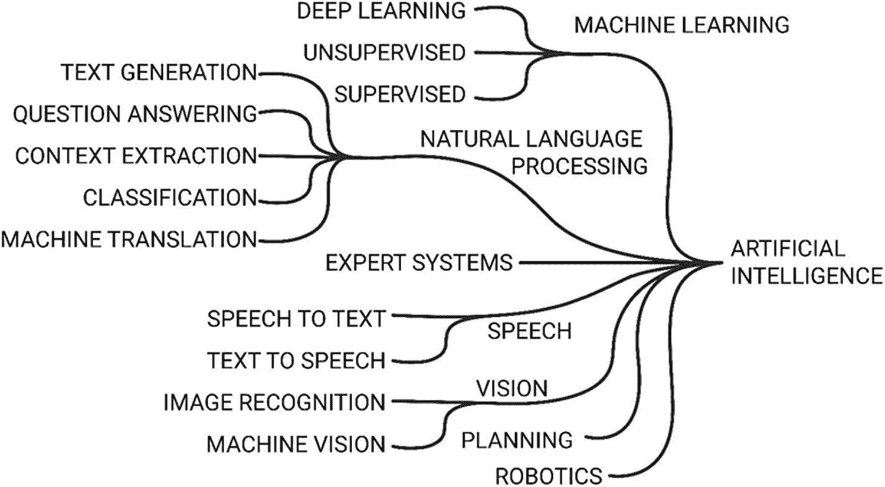
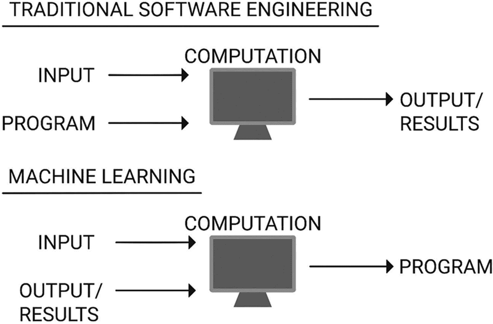
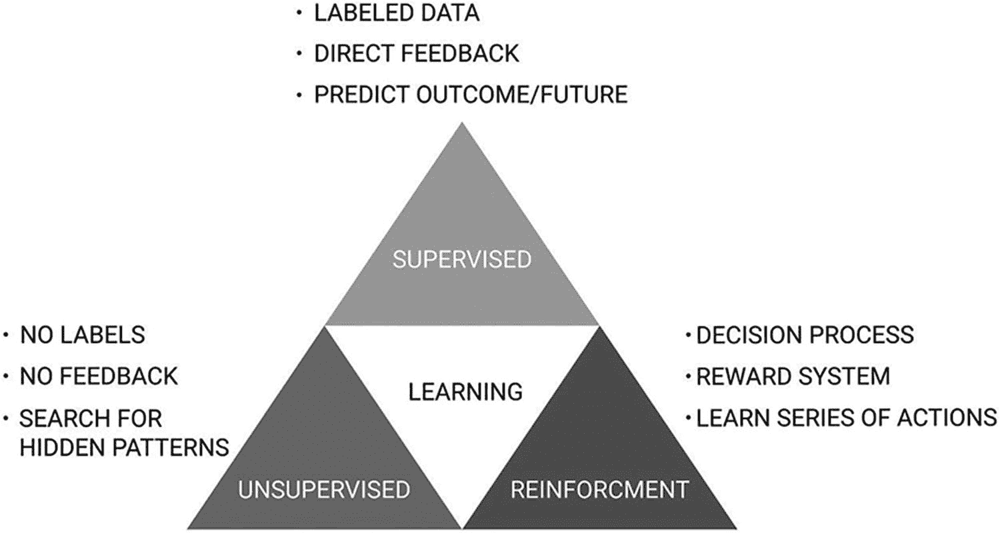
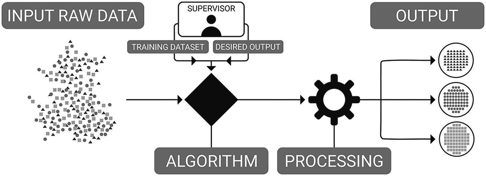
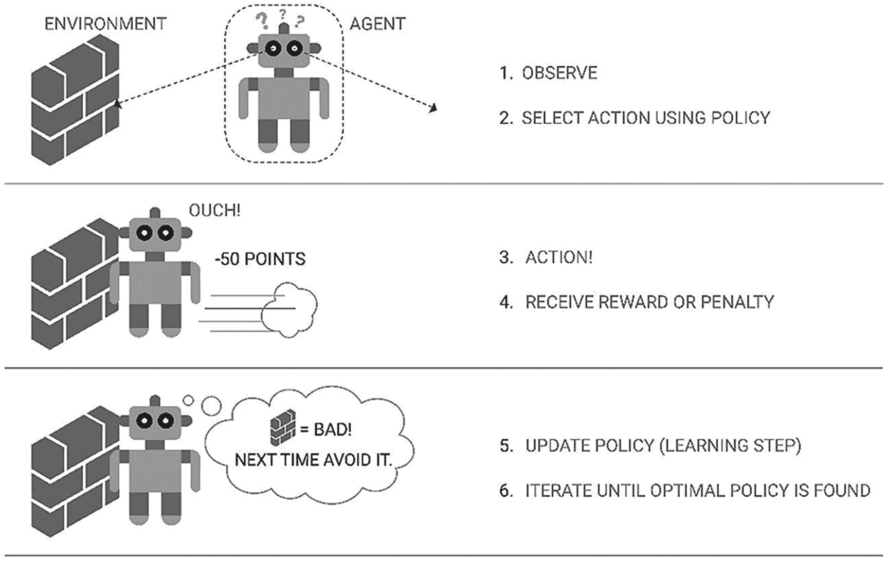
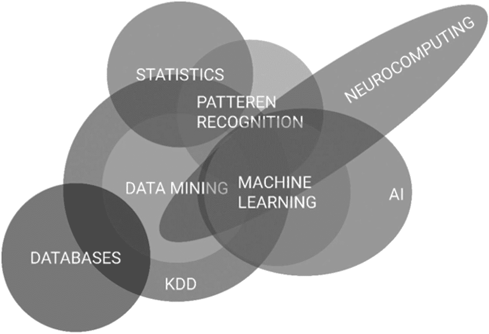
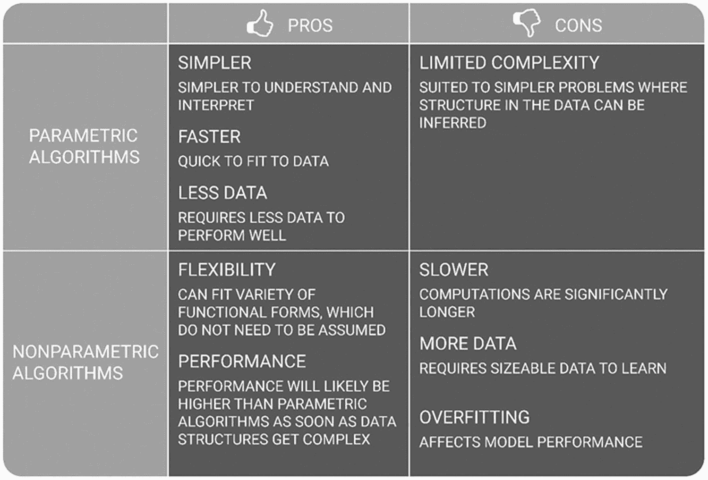

# 三、什么是机器学习？

> *任何傻瓜都能知道。重点是要理解。*
> 
> —爱因斯坦

机器学习先驱亚瑟·塞缪尔的第一个跳棋程序于 1956 年首次亮相，展示了人工“智能”能力[68]。

从那以后，不仅人工智能的应用越来越多；现在有了前所未有的速度、容量和各种数据。塞缪尔的软件在 IBM 701 上运行，这是一台双人床大小的计算机。数据通常是离散的。

近 70 年后，数据无处不在，计算机现在更强大，100 个 IBM 701s 可以放在我们的手掌中。这促进了人工智能中机器学习和深度学习的领域(见图 [3-1](#Fig1) )。

图 3-1

人工智能的组件

我们在日常生活中看到并参与“人工”智能，无论是由机器学习还是其他方式开发的:点优步，在数字菜单上点餐，寻找 Airbnb，在易贝上搜索，向 Alexa 提问，滚动脸书，以及参与数字治疗。

在第 [10](10.html) 章中进一步详述了一个关于使用人工智能驱动的数字疗法的案例研究。

对人类能够开发的人工智能的思考仅仅受到人类想象力的限制。新的和创新的设备越来越多地连接到云，增加了医疗保健领域的机会财富。

随着大量数据作为一个行业的掌舵，人工智能正在将其重点转移到机器学习和深度学习的力量上，机器可以自我学习——这正在加速人工智能领域的当代突破。

如果塞缪尔的跳棋程序演示了简单的 AI，那么机器学习最好通过 AlphaGo Zero 来演示，AlphaGo Zero 简单地通过与自己对弈来学习下跳棋，超越了人类的下棋水平，并以 100 局比 0 [69]击败了上一版本的 alpha go。

机器学习系统在医疗保健领域并不少见。德克萨斯州休斯顿卫理公会研究所的研究人员开发了一种代理，它能够以比人类医生快 30 倍的速度审查和翻译乳房 x 光片，准确率为 99%[70]。

根据美国癌症协会的数据，每年进行的 1210 万次乳房 x 光检查中有 50%产生了错误的结果，这意味着健康女性被告知她们患有癌症[70]。该软件可以理解为一个自主实体，从数百万份乳房 x 光记录中学习，降低了假阳性的风险。

人工智能和机器学习领域有许多书籍和资源。虽然这是一门综合的数学基础学科，但这本书旨在为有洞察力的读者涵盖该主题，而不深入探究线性代数、概率和统计的语义。

本章将涵盖机器学习中的许多主题，首先介绍人工智能和术语的基础知识，然后继续学习和数据挖掘的各种形式。

算法将在下一章介绍。

## 基础

在深入研究 AI 和机器学习之前，了解几个关键定义是有用的。下面是有用术语的简要指南，在本书末尾有更深入的术语表。

### 代理人

代理是任何可以被视为通过传感器感知其环境并通过效应器作用于它们的东西。这采用了罗素和诺维格对代理人的方法。因此，这包括机器人、人类和软件程序。

有许多不同类型的代理，可以根据它们的特征进行分类。人工智能:一种现代方法 (AIMA)是一本由人工智能专家 Stuart J. Russell 和 Peter Norvig [71]编写的关于人工智能的综合教材。

代理应该如何表现？理性的代理是做正确事情的代理。这可以用一个数学度量或代理的性能评估来表示，代理可以寻求最大化。

代理可以理解为感知序列和动作之间的映射。例如，医疗诊断系统可以将医院中的患者视为其环境:感知症状、发现和患者的回答。然后，它可以通过问题、测试和治疗对这些进行操作，目标是拥有一个健康的患者。

代理的定义适用于软件程序或算法。

### 自治

在人工智能中，自主性是指主体的行为在多大程度上由其自身的经验决定。

如果没有自主性，所有决策都是从静态数据集或知识库中做出的。在完全自主的情况下，代理人会随机做出决定。随着时间的推移，代理具有变得更加自主的明确能力。

软件就像人类一样，可以随着时间的推移从经验中学习。系统可以从其环境中的经验中学习(最基本的，从一些新数据中“学习”)，从而变得更加自主。

### 连接

接口代理是为复杂系统提供接口的代理。

### 表演

性能是用于评估环境中代理的行为的度量。它回答了这个问题，“代理在环境中做了它应该做的事情吗？”

### 目标

目标是指代理试图实现的目标。在机器学习领域，目标不是能够让代理“学习”。相反，这是指总体目标或目的。

目标可以分解成更小的任务。例如，为了完成剖腹产的目标，任务可以考虑切开腹部，取出婴儿，检查婴儿是否健康，并再次缝合腹部。

### 效用

效用是指代理人自己的内部绩效评估，即代理人自己在任何给定状态下的绩效度量。这可能与代理的性能不同。值得注意的是，效用函数不一定与性能度量相同，尽管它可以是相同的。

一个代理可能没有明确的效用函数，而总是有一些性能测量。效用函数用于将一个状态映射到一个实数，该实数描述了快乐的相关程度或朝着一个目标或目的的进展。

这允许在有几条路径通向同一个目标的情况下做出理性的决策，允许代理比其他代理更好地区分路径。

### 知识

智能体通过其传感器或关于环境的知识获得知识。

知识可以用来决定如何行动；如果它被存储，它可以被用来存储以前的知识状态(或者，换句话说，一个历史)；它可以用来确定行动如何影响环境。

机器学习是数据驱动的。因此，无处不在的数据和普适计算的出现对于开发具有真实世界应用的系统来说是非常棒的。

### 环境

环境是代理人的世界状态。按照罗素和诺维格的说法，一个环境有几个特征。

#### 易接近

这是指代理可以访问多少环境。在信息缺失的情况下，代理可能需要做出明智的猜测以理性地行动。

#### 决定论

环境可以是确定性的，也可以是不确定性的。确定性环境是可以理解世界确切状态的环境。在这种情况下，效用函数可以理解它们的性能。在非确定性环境中，世界的确切状态无法确定，这使得效用函数依赖于做出最佳猜测决策。

#### 插曲

情节环境是指主体的当前行为选择不依赖于其过去行为的环境。非偶发性环境要求代理人计划他们当前行为的影响。

#### 环境类型

静态环境是指当代理做出决策时，环境不会改变。动态环境在处理过程中会发生变化，因此代理可能需要反馈到环境中，或者预测输入和输出之间的变化。

#### 数据流向环境

代理设计的一个关键方面是如何接收数据。例如，在国际象棋游戏中，代理人只能选择有限的几步棋。这将是一个离散的环境，因为只能执行这么多移动。另一方面，例如在手术台上，事情可能在最后一毫秒发生变化。连续数据环境是指数据看起来无限或没有尽头的环境。

一个智能代理从根本上来说是一个可以显示诸如学习、独立、适应性、推理以及某种程度上的独创性等特征的代理。

要做到这一点，智能体必须能够通过搜索、规划和适应环境的变化，以及根据过去的经验反馈，自主地决定行动的顺序。在机器学习中，还有更多术语。

### 培训用数据

训练数据是学习算法将用来学习可能的假设的数据。一个例子是 x 的样本，包括它从目标函数的输出。

### 指标函数

这是从 x 到 f(x)的映射函数 f。

### 假设

这是 f 的近似值。在数据科学中，机器学习模型近似于将输入 x 映射到输出(y)的目标函数。

### 学习者

学习者是创建分类器的学习算法或过程。

### 确认

验证包括机器学习开发中使用的方法，这些方法提供了评估模型性能的方法。

### 资料组

数据集是示例的集合。

### 特征

特征是数据属性及其值。例如，肤色是棕色是一个特征，其中*肤色*是属性，*棕色*是值。

### 特征选择

这是选择解释统计模型输出所需的特征，同时排除不相关特征的过程。

## 什么是机器学习？

机器学习是人工智能的一个子集，计算机模型被训练成随着时间的推移从它们的行为和环境中学习，以达到更好的表现。

1959 年，跳棋的创造者亚瑟·塞缪尔(Arthur Samuel)将机器学习定义为“在没有明确编程的情况下赋予计算机学习能力的研究领域”[72]。

机器学习诞生于模式识别和理论，即计算机可以在没有被编程来执行特定任务的情况下学习——也就是说，系统在没有被显式编程的情况下学习。因此，学习是由数据驱动的，而智能是通过根据学习信号或反馈的性质做出有效决策的能力获得的。根据目标评估这些决策的效用。

机器学习侧重于开发适应新数据和发现的呈现的算法。机器学习体现了数据挖掘的原则，但也能够推断相关性，并从中学习以应用于新的算法。目标是模仿人类通过经验学习的能力，并在没有或只有最少外部(人类)帮助的情况下完成指定的任务。

正如人类的学习一样，机器学习由许多方法组成。最基本的是，首先，事情被记住了。第二，我们从提取信息中学习(通过阅读、倾听、学习新事物)。第三，我们从例子中学习。

例如，如果我们正在学习平方数，如果向学生展示一组数 Y = {1，4，9，16，…}，并教授 Y = n*n，他们通常会理解平方数的概念，而无需明确地学习每个平方数。

## 机器学习和传统软件工程有什么不同？

传统的软件工程和机器学习有一个共同的目标，那就是解决一个或一组问题。这两种范式的区别在于解决问题的方法。

传统的软件工程或编程指的是使任务计算机化或自动化的任务，使得给定输入的功能或程序提供输出。换句话说，写一个函数 f，使得给定输入 x，输出 y = f(x)。

这是通过逻辑实现的，通常是 if–else 语句、while 循环和布尔运算符。

机器学习与传统编程的不同之处在于，不是提供关于函数 f 的指令，而是向计算机提供输入 x 和输出 y，并期望计算机确定或预测函数 f(见图 [3-2](#Fig2) )。

图 3-2

机器学习是如何工作的

传统的程序是由人类编写来解决问题的，而机器学习程序通过推理来学习，从例子、规则和信息中解决问题。机器学习中的许多分类器有助于预测。

由于使用了统计学和概率驱动技术，机器学习程序还可以学习归纳和帮助解决不确定性问题。模型可以从以前的计算或经验中学习，以产生可靠的、可重复的决策和结果。

互联网上数据和信息的可用性，以及生产、存储和可供分析的数字数据量的飞跃，使工程师能够实现能够学习我们偏好的内容并根据我们的要求进行个性化的机器。

如果你足够努力，机器学习随处可见——在网络搜索排名、药物设计、偏好和社交网络订阅源的个性化、音乐推荐、物流、网页设计、自动驾驶汽车、冰箱、洗衣机、电视和虚拟助手中。

## 机器学习基础

机器学习算法的任务大致分为以下几类(见图 [3-3](#Fig3) ):

图 3-3

学习方法

*   监督学习(也称为归纳学习)

*   无监督学习

*   半监督学习

*   强化学习

### 监督学习

在监督学习中，算法以训练数据的形式提供示例输入和随后所需的输出，目的是学习将输入映射到输出的一般规则(见图 [3-4](#Fig4) )。输入数据被称为训练数据，并且具有与之相关联的已知输出(结果)。

图 3-4

监督学习:它是如何工作的

训练数据指导算法的开发。模型是通过训练过程创建的，在训练过程中，模型进行预测，并在预测不正确时进行修正。

训练继续进行，直到模型在训练数据上达到期望的准确度水平。监督算法包括逻辑回归。监督机器学习算法可以使用标记的数据示例将过去学习的内容应用到新数据中，以预测未来事件。

学习算法还可以将输出与正确的输出进行比较，以找到任何错误并相应地修改模型。

监督学习问题可以采用以下形式。

#### 分类

这是基于训练数据集来预测结果，其中输出变量是不同类别的形式。通过以预标记数据的形式输入训练数据来建立模型。

分类技术定义了决策界限，包括

*   支持向量机

*   奈伊夫拜厄斯

*   高斯贝叶斯

*   k-最近邻

*   逻辑回归

分类的一个例子是根据一组症状给某人贴上生病或不健康的标签(或者，在实际应用中，诊断)。

#### 回归

回归与分类非常相似。分类和回归之间的唯一区别是，回归是给定样本的结果，其中输出变量是真实值的形式(即，作为值的温度，而不是热或冷的分类)。

例子包括身高、体温和体重。线性回归、多项式回归、支持向量机(SVM)、集成、决策树和神经网络都是回归模型的例子。

#### 预测

这是一种根据过去和现在的数据进行预测的方法。这也被称为时间序列预测。集成是一种监督学习，它结合多个不同的机器学习模型来预测新样本的结果。在合奏中，模特变成了特色。

### 无监督学习

当人们引用可以自己学习的系统时，他们实际上是在引用无监督学习(见图 [3-5](#Fig5) )。在无监督学习中，学习算法不接收数据的标签，让算法从输入中寻找结构。

图 3-5

无监督学习:它是如何工作的

由于数据是未标记的，因此无法评估算法输出的结构的准确性。

数据可能缺少分类和标签。因此，模型是通过解释开发的:通过在输入数据中发现隐藏的结构和推论。这可能是通过提取规则，减少数据冗余，或作为组织数据的结果。

这包括聚类、降维以及关联规则学习。该算法可能永远找不到正确的输出，而是对数据的底层结构进行建模。

下面定义了三种无监督学习问题。

#### 联合

关联是发现一个集合中项目同时出现的概率。这在市场营销和医疗保健中广泛使用，为决策提供信息。

例如，如果被诊断为肥胖，这将是患任何形式癌症的可能性百分比。联想类似于分类；然而，任何属性都可以关联预测，而分类是二元的。

#### 使聚集

聚类是指对项目进行分组，使得同一聚类内的项目比来自另一聚类的项目彼此更相似。

#### 降维

降维可以通过特征选择和特征提取来实现。降维可以用数学方法重新表示或转换数据。

##### 特征抽出

特征提取执行从高维空间到低维空间的数据转换。这可能涉及减少数据集的变量，同时保持数据完整性，并确保最重要的信息得到体现。

特征提取方法可用于降维。通常，会从原始特征集创建一组新的特征。一个例子是将患者的所有临床测试结果合并到健康风险评分中，该评分来自被证明影响死亡率的结果。

减少维度的数量允许更容易的可视化，特别是在二维或三维中，以及减少存储所需的时间和空间。算法包括

*   Apriori 算法

*   FP 增长(也称为频繁模式增长)

*   隐马尔可夫模型

*   主成分分析

*   奇异值分解

*   k 均值

*   神经网络

*   深度学习

深度学习利用深度神经网络架构，这是一种机器学习算法。

### 半监督的

半监督学习是一种混合，其中输入中混合了标记和未标记的数据。尽管可能会有预期的结果，但模型还会学习组织数据和进行预测的结构。示例问题是分类和回归。

### 强化学习

这是系统与动态环境交互的地方，在动态环境中，代理必须执行特定的目标。强化学习是机器学习、行为心理学、伦理学和信息论的交叉点。

该算法在处理问题时会得到关于奖励和惩罚的反馈。强化学习允许代理根据其当前状态并通过学习将最大化回报的行为来决定下一个最佳行动。最佳行动(或最佳策略)通常是通过反复试验和反馈来学习的。这允许算法确定上下文中的理想行为。

强化学习通常用于机器人学，例如，机器人吸尘器通过碰撞桌子、椅子等接收负面反馈来学习避免碰撞——尽管今天，这也涉及计算机视觉技术。

强化学习不同于标准的监督学习，它不会给出正确的例子，也不会明确地纠正次优决策。重点是在现实世界中的表现。

与人类的学习方式类似，强化学习假设从个人经验中学习的理性行为，因此有助于理解人类如何从经验中学习以做出好的决策(见图 [3-6](#Fig6) )。

图 3-6

强化学习:它是如何工作的

例如，DeepMind 通过向“AlphaGo”展示大量强大的业余游戏，帮助它发展自己对合理的人类游戏看起来像什么的理解，暴露了他们的 AlphaGo 代理掌握中国古代围棋。然后，我们让它与不同版本的自己进行数千次比赛，每次都从错误中学习，并逐步改进，直到它变得非常强大”[73]。

强化学习用于自动驾驶汽车。在现实世界中，代理需要考虑环境的各个方面，包括当前速度、道路障碍、周围交通、道路信息和操作员控制。

代理学习以适合于特定环境状态的方式行动(或制定策略)。这导致了人工智能和机器学习给具有奖励驱动编程的代理人带来了新的伦理困境。

### 数据挖掘

数据挖掘，也称为数据库中的知识发现，被定义为使用复杂的算法探索数据以提取新颖信息(包括模式和关系)的过程。这可应用于生活和工业的各个方面，并实现以下功能:

*   基于趋势和行为的模式预测

*   基于可能结果的预测

*   大型数据集(尤其是非结构化数据集)的分析

*   通过识别以前未知的事实进行聚类

数据挖掘利用机器学习、统计和数据库技术的力量，是分析工作的核心(见图 [3-7](#Fig7) )。数据挖掘通常使用大量数据，也可以提供更简单的描述性分析。例如，在医疗保健领域，数据挖掘应用程序可用于识别经常一起出现的情况或医疗程序。

图 3-7

数据挖掘及其更广泛的协同作用

数据挖掘最常见于对用户、客户或患者反馈的日常情感分析。

数据挖掘还允许通过识别数据中的关系进行预测。这可以帮助保险公司发现有风险的客户行为模式。

机器学习可以用于数据挖掘。数据挖掘将为决策提供信息，比如哪种学习模型最适合解决手头的问题。然而，数据挖掘还包括机器学习之外的技术。在数据挖掘中，任务是未知知识的发现，而机器学习的性能是相对于复制已知知识来评估的。

例如，如果您有一个患者血压的数据集，您可以执行异常检测，这被认为是一个数据挖掘任务，用于识别以前未知的异常值。该任务可以利用机器学习技术，也许是用于聚类分析的 k-means 算法，来识别异常数据并帮助算法的学习。

数据挖掘不同于自然语言处理(NLP)。NLP 可能是数据挖掘中使用的一种技术，用于帮助代理理解或“阅读”文本。数据挖掘算法包括

*   C4.5

*   k 均值

*   支持向量机

*   推测的

*   EM(期望最大化)

*   网页等级

*   adaboost 算法

*   近邻算法

*   朴素贝叶斯

*   分类和回归树

### 参数和非参数算法

算法在形式上可以是参数的或非参数的。可以简化为已知的有限形式的算法被标记为参数算法，而非参数算法从训练数据中学习函数形式。

换句话说，对于非参数算法，模型的复杂性随着训练数据量的增加而增加。对于参数模型，有一个固定的结构或一组参数，使得参数模型比非参数模型更快。

如果在训练数据和时间方面为非参数模型提供足够的训练资源，非参数模型可以提供更好的准确性(见图 [3-8](#Fig8) )。

图 3-8

参数与非参数算法

#### 何时使用参数和非参数算法

参数算法将函数简化为已知形式，并从训练数据中学习函数系数。因此，对数据做出了强有力的假设。参数算法非常有用，因为它们可以快速地从数据中学习，并且不需要太多数据，并且可以用于需要简单解释结果的场景中。

非参数算法使用不同数量的参数。k-最近邻、神经网络和决策树是非参数的，适用于有更多数据和更高性能要求的情况。

## 机器学习算法如何工作

监督学习是从标记的训练数据推断函数的计算机化任务。

*   Y = f(x)，

这可以理解为

*   输出=功能(输入)。

输入和输出可以被称为变量，通常是向量格式:f 是指函数，它是你试图从输入中推断出来的。

以一个要接受特殊治疗的病人为例。在现实生活中，该过程可能包括患者查看描述他们被推荐的药物或治疗质量的研究。

例如，如果他们看到研究主要由“好”、“很好”、“安全”等词语组成，那么我们会从情感上得出结论，这种治疗是一种好的治疗，我们可以自信地接受它。然而，如果像“坏的”、“质量不好的”和“不安全的”这样的词经常出现，那么我们会得出这样的结论:寻找另一种治疗方法可能更好。这项研究有助于我们根据治疗研究中存在的词语模式采取行动。

机器学习试图通过算法来理解人类的这种决策过程。它专注于开发可以访问数据并使用数据进行自我学习的算法(或程序)。机器学习非常适合分类和预测任务。

机器学习最常用于预测分析——学习 Y = f(X)的映射，以预测新 X 的 Y。

机器学习的实际例子如下:

*   欺诈检测 x 是交易的属性 f(x)是交易是否欺诈。

*   疾病诊断 x 是病人的属性 f(x)是病人是否有疾病。

*   语音识别 x 是语音输入的属性 f(x)是对包含在语音输入中的指令的响应。

机器学习的过程始于作为示例、直接经验或指令提供的输入数据，以识别数据中的模式，并基于提供的数据在未来做出更好的决策。

目的是使程序能够在没有人工干预或帮助的情况下自动学习，并相应地调整合理的行动。

## 结论

读者应该了解机器学习和数据挖掘，执行学习任务的方法和使用这些技术时的主要考虑因素。最重要的是，它涵盖了机器学习算法是如何工作的。

下一章将使用这一基础知识来关注算法选择和设计、模型考虑和最佳实践。