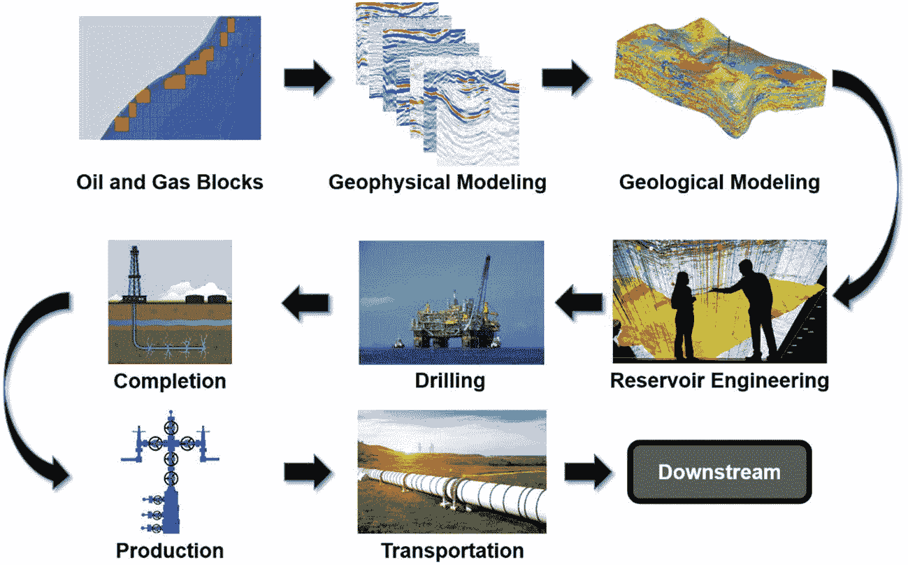
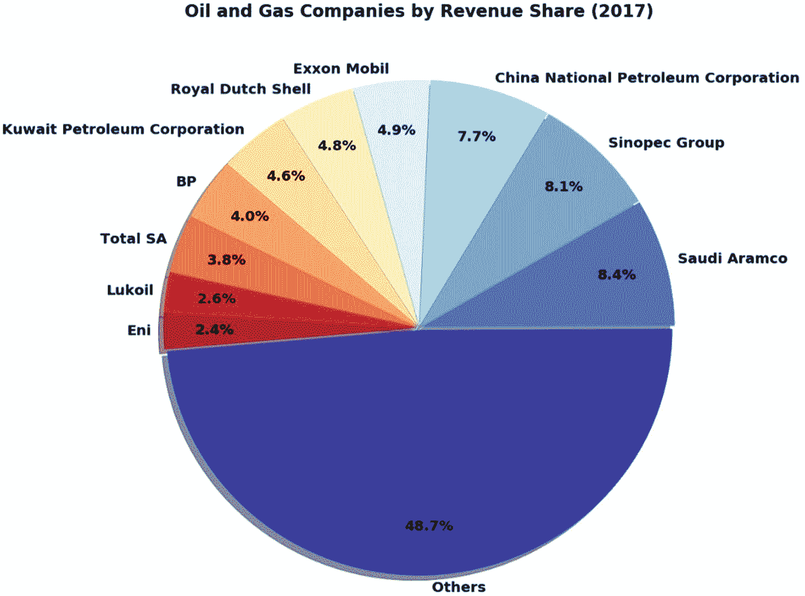
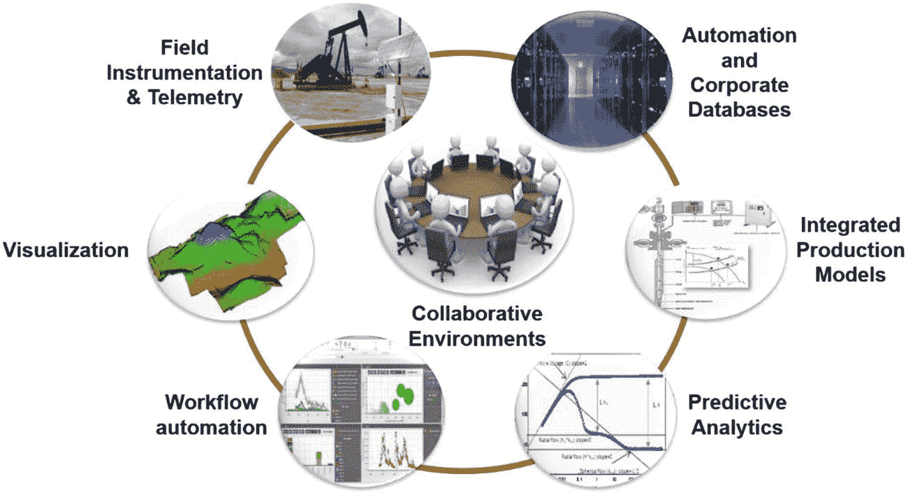
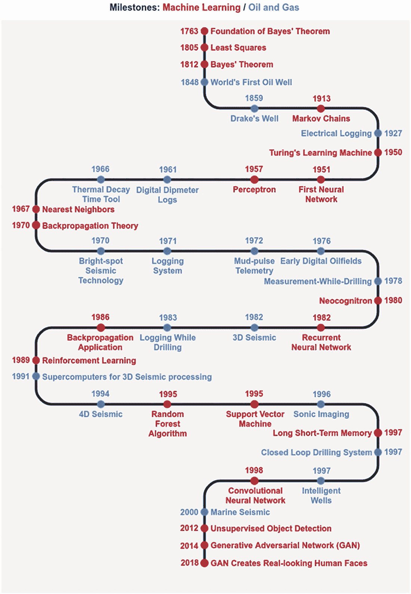
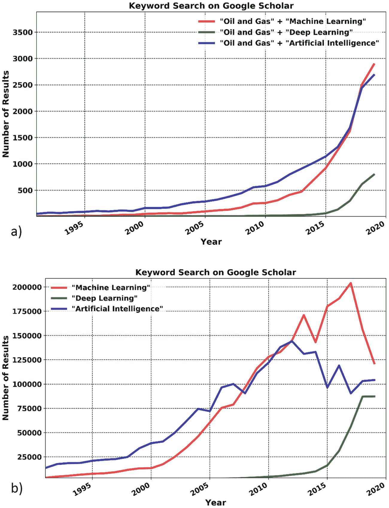

# 一、走向石油和天然气 4.0

能源是维持现代人类生活的基本需求之一。2016 年，全球能源需求为 552 万亿英国热量单位(quads)。其中，177 辆由石油供应，127 辆由天然气供应。这表明 2016 年全球能源需求的 55%由石油和天然气行业供应[ [1](#Par130) ]。还预计到 2040 年，石油和天然气行业将满足全球 57%的能源需求。这些数字展示了石油和天然气行业目前和未来对我们日常生活的影响。虽然石油作为能源的使用可以追溯到几百年前，但是现代历史上的第一口油井却是 1848 年在阿塞拜疆的巴库钻出来的。

1859 年，埃德温·德雷克(Edwin Drake)在美国钻出第一口商业油井(见图 [1-1](#Fig1) )。德雷克井是现代石油和天然气工业的一个转折点，它导致了油井钻探投资的巨大浪潮。150 多年来，该行业不断发展并采用新技术。石油和天然气行业可能是为数不多的推动工业革命的行业之一。在过去的几个世纪里，世界经历了三次工业革命。

图 1-1

德雷克油井被认为是第一口使用钻机成功钻探的油井[ [3](#Par132)

*   随着蒸汽机的发明，第一次工业革命开始于 1760 年左右。在这个时代，蒸汽动力工具促进了工厂的机械生产，蒸汽机彻底改变了人们的出行方式。

*   在 19 世纪末到 20 世纪初，生产的科学原理被引入到工业中。这导致了装配线上产品的大规模生产。福特汽车公司制造的汽油发动机汽车是第二次工业革命期间大规模生产的最令人印象深刻的例子之一。

*   随着 1945 年第一台通用计算机 ENIAC 的问世，第三次工业革命或数字革命的种子就此播下。到了 20 世纪 80 年代，随着计算从大型计算机转移到个人计算机，半导体技术的进步彻底改变了全世界的工业。互联网的到来将世界连接起来，信息技术的进步开启了一个新的工业化时代。

当前，全球各行业正在经历第四次工业革命。这场革命是由计算基础设施、预测技术、数据存储和数据处理能力的飞速发展推动的。第四次工业革命——有时被称为 4.0 版本，与不同的行业名称联系在一起——受到以下因素的推动。

*   工业物联网(IIoT)，促进企业和运营环境中众多设备之间的无缝连接，并支持协作决策。

*   大数据技术，利用分布式数据存储和处理来高效地存储和处理海量数据。

*   云计算机器利用加速计算设备，如图形处理单元(GPU)。

石油和天然气行业也在经历数字化转型，这被称为“石油和天然气 4.0”从人类生命和环境角度来看，石油和天然气行业的运营都涉及高风险情况。因此，只有经过严格的验证阶段才能采用新技术，以确保适当满足健康、安全和环境(HSE)标准。尽管在采用新技术时非常谨慎，但石油和天然气行业仍然对优化和简化现有流程的新技术持开放态度。

这本书专注于机器学习(人工智能的子集)在石油和天然气行业的应用。在这一章中，我们不讨论机器学习技术的具体细节，而是讨论一些与上游石油和天然气行业不同生命周期阶段相关的示例应用。对于那些对石油和天然气行业了解不多的人来说，我们首先简要介绍一下不同的行业领域。

## 主要石油和天然气行业

石油和天然气矿床通常位于地表以下几千英尺的地方。将石油和天然气从这些深度开采到地表，然后将其转化为可用的能源，这一过程涉及各种各样的操作。图 [1-2](#Fig2) 显示了石油和天然气行业运营的不同生命周期阶段。概括地说，生产石油和天然气的整个过程分为以下三个行业。

图 1-2

典型石油和天然气行业运营环境中的不同生命周期阶段

*   上游产业

*   中游产业

*   下游产业

### 上游产业

上游石油和天然气行业也被称为勘探和生产，或 E&P，行业。上游行业的运营重点是确定地表以下具有生产石油和天然气潜力的位置。在潜在储量确定之后，详细的勘探规划、油井钻探和油气生产也属于上游行业。从逻辑上讲，上游作业可分为以下活动。

*   勘探和评估

*   油田开发规划

*   钻井和完井

*   生产操作

*   放弃

#### 勘探和评估

寻找地球表面下的石油和天然气储藏的确切位置是一项像大海捞针一样具有挑战性的活动。在过去的一个世纪里，对地球地下结构的科学认识有了显著的提高。地质调查提供了地球表面下结构的地质图或模型。结合地球物理勘测，这些模型有助于产生对地下结构的详细了解。

地球物理勘测可以是各种类型，取决于用于勘测的技术，例如磁性、电磁、重力和地震勘测等。近年来，地震勘探已被证明是寻找潜在石油和天然气矿藏最可靠的方法。地震勘测可以在岸上(陆地)或海上(海洋)进行。

地震成像的基本原理类似于人体的超声波成像。获取地震勘测的过程涉及声能源。在海洋地震的情况下，这些震源可以是陆地上的大型振动器卡车和气枪。从不同地下结构反射的声波由地球或水面附近的地震检波器或水听器(非常灵敏的麦克风)接收。3D 和 4D 地震勘探是石油和天然气行业中最庞大的数据集之一，有时会达到 Pb 级。来自这些地震勘测的信息有助于识别地下结构特征以及潜在的石油和天然气沉积。

地质学家对地球的沉积环境有详细的了解，这有助于他们了解不同的岩石层(地层)在地球表面下是如何排列的。地质学家利用他们对盆地和层序地层学的深入了解，以及从地震数据解释中获得的信息，来确定可以找到石油的位置。

一旦在一定程度上确定了石油储量的潜在位置，运营的石油和天然气公司就获得了石油和天然气区块的租约。基于对地球物理和地质的综合理解，钻探探井(也称为*探井*)以验证潜在的石油和天然气储量位置。如果在第一口油井中发现了石油，油藏工程师将参与油田评估过程。

在这个过程中，更多的评价井在原来的探井周围钻探。从探井收集不同的测井记录和岩心记录，进一步用于对已发现的石油和天然气储量进行更详细的了解。

地质学家和岩石物理学家使用地质模型以及来自测井记录的数据来建立感兴趣区域的物理属性的详细 3D 储层模型，该过程被称为*岩石物理建模*。在感兴趣的区域中计算岩石物理性质，例如孔隙度(岩石中可以储存或运输石油和天然气的空隙率)，以及油和水饱和度。这些详细的岩石物理模型有助于计算已发现的石油储层中的石油和天然气的总可用和可开采体积的概率估计。

#### 油田开发规划

一旦勘探和评估活动结束，储层工程师和地球科学家(地质学家和地球物理学家)将一起制定一份详细的计划，以进一步开发油气田。从勘探和评价阶段获得的所有信息和见解——包括详细的油藏模型——都被考虑在内。该阶段做出的决策包括确定钻井的精确位置、油井最佳位置的详细设计、完井设计(包括所需的射孔和增产)。

设施工程师、油藏工程师和生产工程师还开发处理油气所需的详细设施设计(例如，分离油、水和气的分离器)。油田开发计划还包括将生产的石油和天然气运输到储存或加工设施的策略。一旦油气田开发计划获得批准，就开始按照油气田开发计划中提供的规范建造设施、钻井和完井。

#### 钻井和完井

钻井过程的重点是为石油和天然气从石油和天然气储层流向地球表面创造通道。钻井是一项高风险和高资本支出(CAPEX)的作业。深水海上钻井平台的租赁费和其他相关费用可能接近每天 100 万美元。作为一个大概的数字，一口海上油井的成本可能在 1 亿到 2 亿美元之间——在深水中甚至更多。陆上钻井的成本可能在 500 万美元到 800 万美元之间。

在钻井作业期间，钻头连接到钻柱的最下端，钻柱是一长列顺序连接的由钢或铝合金制成的钻杆。钻柱的顶端连接到驱动器(机械装置)，该驱动器向钻柱提供扭矩。

由于这种扭矩，连接到钻柱底部的钻头旋转并切割岩石以形成井眼。在钻井作业期间，钻井泥浆流过钻杆以冷却钻头。钻井泥浆还有助于清除钻井过程中产生的岩屑。

在钻井过程中，定期收回钻柱，并通过固井和套管内衬来稳定井筒。套管是高强度空心钢管，它与固井一起加固井筒，防止井筒坍塌。除了提供结构强度，套管还确保钻井过程中使用的化学流体不会污染附近的含水层和地下水源。

在固井和在井眼中下套管之后，生产油管被下入井眼中。油管是中空的耐腐蚀不锈钢管，直径总是小于套管，通过密封装置固定在套管内。油管提供从井底到地面的油气通道，保护套管免受腐蚀和其他可能的磨损。

一旦套管和油管就位，就在套管或套管和油管中形成射孔，以促进油气从储层岩石流入井筒。除了射孔之外，完井活动还可以包括水力压裂和其他增产活动。

在水力压裂过程中，水以非常高的压力注入井筒内。高压在岩石中产生裂缝，并为石油和天然气从储层流向井筒创造了额外的通道。支撑剂是小直径砂粒，在压裂过程中用于确保裂缝保持打开。支撑剂运动由转向剂支持，转向剂是促进支撑剂颗粒从井筒流向裂缝内部的化合物。

一旦油田开发计划中规定的所有完井活动完成，油井就开始生产石油和天然气。应该注意的是，最后三页中提到的活动有时可能需要五到十年才能从油井中产出第一滴油。

#### 生产操作

一旦油井开始生产油气，生产工程师和油藏工程师将继续监控油井的生产趋势。在油井的整个寿命期间，油井的油气产量会随着时间的推移而下降。生产工程师制定计划，通过使用人工举升等技术来保持石油从油井流出。人工举升可以使用泵(电潜泵、有杆泵等)。)，或通过向井底注入气体来增加或保持油井的油 Airflow 量的气举。在生产作业期间，还可以进行其他修井和修井活动，例如更换完井以保持油井的流量。

#### 放弃

经过几年的连续生产，油井的油气产量不断下降。如前所述，工程师试图通过修井和修井活动来恢复油井。然而，在某个时间点之后，鉴于油井的生产潜力极低，恢复油井可能被认为是不经济的。在这种情况下，油井被水泥堵塞并废弃。这是油气井生命周期的最后一个阶段。在封堵和废弃过程中，严格遵循不同监管机构提出的封堵油井的要求，以确保合规性。

### 中游产业

中游工业负责将油井生产的原油运输到下游加工设施。运输可以通过管道、油轮、卡车或铁路进行。此外，中游行业还负责石油商品的储存和销售，包括原油和天然气。这样，中游产业在偏远地区的石油和天然气生产设施与下游加工设施之间起着连接纽带的作用，而下游加工设施通常建在人口密集地区附近。

### 下游产业

下游工业的主要功能包括原油的分馏或裂化(将稠的高分子量原油转化为透明的低分子量石油燃料的过程)和相关的化学处理。随后是混合操作，这就产生了作为燃料大量消费的石油成品。此外，下游炼油厂还负责天然气的净化。下游产业的完整范围包括炼油厂、石化厂、分销业务、零售中心和其他相关设施。在石油和天然气行业的三个行业中，下游行业最受公众关注，因为我们几乎所有人都在日常通勤中使用汽油或柴油。喷气燃料、沥青、润滑剂、塑料和天然气是下游工业生产的其他各种石油产品。

到目前为止，我们已经讨论了石油和天然气行业的三个领域。我们故意把对中下游行业的描述保持得很短。在接下来的章节中，我们将重点讨论上游石油和天然气行业的数字化及其与机器学习的联系。

## 数字油田

全球石油和天然气行业的经济足迹令人印象深刻。根据公共领域的可用数据，2017 年石油和天然气公司的全球收入约为 5.5 万亿美元[ [5](#Par134) ]。其中，排名前十的公司分享了近一半的收入(见图 [1-3](#Fig3) )。近年来，几乎所有这些公司都开始投资数字化转型。根据世界经济论坛发布的一份报告，在 2016 年至 2025 年期间，石油和天然气行业的数字化转型可能价值 1.6 万亿至 2.5 万亿美元[ [6](#Par135) ]。这些数字显示了石油和天然气行业数字化工作的巨大规模。

图 1-3

基于 2017 年的数据，世界领先的石油和天然气公司及其在全球收入中的份额[5]

数字化对石油和天然气行业来说并不新鲜。计算机辅助联网油田可以追溯到 20 世纪 70 年代末。在过去的二十年中，上游石油和天然气行业面临着实时数据和现场驱动设备使用的指数级增长，这导致了许多数字油田的实施。这些技术在提高作业效率、优化生产和最大限度提高油气采收率方面具有显著价值。与此同时，数字油田的实施促进了更好、更快的决策，同时降低了健康、环境和安全风险。从形式上看，数字油田是一个测量-计算-控制循环的过程，其频率在系统的时间常数约束内始终保持系统的最佳运行条件，同时可持续地

*   最大化生产

*   最大限度地减少资本支出/运营支出(OPEX)

*   最小化环境影响

*   保护相关人员的安全和相关设备的完整性[ [8](#Par137) ] [ [9](#Par138)

这些目标可以通过同步四个相互关联的领域来实现:人员、自动化工作流、过程和技术。应该注意的是，正确描述支持数字油田实施的工作过程需要付出巨大的努力。简而言之，数字油田是自动化和信息技术的集合，这些技术改变了石油资产管理方式的理念，并推动了更高效的作业流程。它涉及由数字自动化支持的规程、数据、应用程序和工作流集成工具的编排(见图 [1-4](#Fig4) )，包括以下内容。

图 1-4

数字油田的不同组成部分

*   现场仪器仪表

*   遥感勘测

*   自动化

*   数据管理

*   集成生产模型

*   工作流自动化

*   形象化

*   协作环境

*   预测分析

成功的数字油田实施需要所有这些组件之间的同步。数字油田的预测分析组件负责为油田的当前和未来前景生成数据驱动的洞察。该组件通常承载机器学习算法，是成功实施数字油田的关键。在下一节中，我们将讨论机器学习如何为数字油田实施以及整个石油和天然气行业提供预测分析能力。

## 上游产业和机器学习

上游行业使用机器学习已经几十年了。然而，它可能被称为人工智能，或其他替代名称。图 [1-5](#Fig5) 显示了机器学习和石油天然气行业里程碑的复合时间表。在时间表中，特别强调了代表数据采集和数字化进步的石油和天然气行业里程碑。基于时间线中进展的性质，我们可以将时间线分成不同的时期。二十世纪前十年是这两个行业的基础。

图 1-5

石油天然气行业和机器学习里程碑。根据参考文献[ [2](#Par133) 和[ [10](#Par139) 编译

早些年，机器学习领域出现了基础理论发现，如贝叶斯定理和最小二乘法。在石油和天然气行业，第一口商业油井被钻了出来，石油作为一种重要的燃料受到欢迎，慢慢取代了燃煤蒸汽机。当我们迈向二十世纪中叶时，我们看到了电测井在石油和天然气工业中的应用。相比之下，图灵的学习机是在第一台通用计算机(ENIAC，1945)出现后不久出现的。

20 世纪 50 年代标志着机器学习领域的两个非常重要的发现:神经网络和感知机。两者都被认为是二十世纪后期开发的强大的高级机器学习算法的基础。20 世纪 60 年代标志着石油和天然气工具的一些重要进步，包括数字倾角仪(它可以记录井筒中的倾角，并有助于区分不同类型的岩石层)。20 世纪 60 年代也标志着最近邻算法的发明，这是机器学习的基本算法之一。

随着我们继续深入，我们看到了石油和天然气行业在 20 世纪 70 年代的几项重大发展。一些重要的技术，如亮点地震、测井系统、泥浆脉冲遥测和随钻测量(MWD)，在这十年间出现。所有这些都是数据采集技术的重大发展，至今仍是石油工程师非常重要的数据来源。在这十年中，最早的数字油田的概念化和实施发生了，其中不同信息平台的集成是通过计算机系统执行的。对于机器学习，反向传播理论应运而生。反向传播理论的重要性可以从这样一个事实来理解，如果没有这个理论，我们就不会看到神经网络近年来在人工智能领域带来的革命。

在 20 世纪 80 年代，三维地震永远改变了地球科学家研究地下结构的方式。大约在同一时间，随钻测井(LWD)能够在钻井作业期间获取实时数据，提供关于地下地层物理特性的精确信息。在同一十年中，neocognitron 的发明奠定了高级计算机视觉的基础，递归神经网络(RNN)为序列建模提供了新的工具。地下三维地震成像中最重要的进展之一与基本计算机视觉算法 neocognitron 的发现相隔几年，这只能是一种巧合。在本书的第 4 章中，你将看到这两个发生在两个不同行业、仅相隔两年的事件是如何联系在一起的，通过将计算机视觉算法应用于地震图像，可以产生关于地球地下结构的洞察力。

20 世纪 80 年代机器学习领域的两个更重要的发现是应用反向传播理论来促进神经网络的训练和强化学习的基础。强化学习是机器学习范式之一，它依靠奖励函数来训练软件代理完成特定任务。这些算法可以教会虚拟玩家赢得与人类的比赛，或者教会机器人像人类一样走路。 [1](#Fn1)

20 世纪 90 年代，地震技术取得了重大进步。一方面，超级计算机被用来处理三维地震数据。另一方面，4D 地震数据有助于地球科学家解释和可视化地下结构随时间的演变。这也是另一个美丽巧合的十年。随着地球科学家获得了理解地震在时间序列中演化的能力，机器学习发现了一种称为*长短期记忆* (LSTM)的新算法用于序列预测。这两个事件在时间线上相隔仅三年。LSTM 解决了传统递归神经网络的一些局限性，并提供了更好的序列预测能力。你将在第三章[中了解更多关于 LSTMs 的知识。](3.html)

20 世纪 90 年代还见证了随机森林和支持向量机算法的发现。随着时间的推移，随机森林算法在每个机器学习实践者的首选算法中赢得了一席之地。

20 世纪 90 年代是机器学习领域加速研究的十年，在这十年期间将要发表的令人着迷的算法之一是卷积神经网络(CNN)。在过去十年中，CNN 一直是计算机视觉领域的驱动力。在 20 世纪 90 年代，石油和天然气行业也见证了新技术，如声波测井、闭环钻井系统和智能井。

自 21 世纪初以来，石油和天然气行业在数据采集领域取得了显著的技术进步。除了海上地震勘测获得的大量数据，非常规石油和天然气行业的繁荣也是大量数据的来源。此外，计算硬件的进步，例如基于图形处理单元(GPU)的计算机，已经显著地加速了计算能力。利用快速计算硬件和大量训练数据，近年来开发的机器学习算法已经能够在没有任何人工监督的情况下识别图像和视频中的对象。另一方面，一类新的算法，生成对抗网络(GAN)已经能够生成人脸，这些人脸几乎不可能与真实的人脸图像区分开来。有趣的是，gan 也有效地用于地震图像重建[ [11](#Par140) ]。

对这两个行业的里程碑回顾表明，这两个行业在数据采集、数字化和从大量数据中学习的能力方面都取得了显著进步。在本章的以下部分，我们将简要回顾机器学习在上游行业不同部分的使用。首先，我们简要概述了特定上游行业部分中可用的不同类型的数据，然后我们讨论了这些数据与机器学习算法一起使用来解决上游行业问题的案例。对于那些没有机器学习背景的人来说，在学习这些算法在石油和天然气行业的应用之前，先了解一下这些算法是很重要的。因此，在本书接下来的章节中，我们首先回顾这些机器学习算法的细节。然后，我们展示了这些算法如何用于解决特定行业的问题的例子。在这一章中，你了解有不同种类的机器学习算法就足够了，这些算法已经被应用于解决各种类型的行业相关问题。

### 地学

地球科学可以理解为一门由地质学、地球物理学和岩石物理学组成的学科。在下面的章节中，我们将讨论一些与地球科学相关的问题，这些问题已经通过应用机器学习算法得到了解决。

#### 地球物理建模

地球物理学家处理地震数据。地震数据可以是 2D、三维或 4D(描述时间演化)。由于数量庞大，地震数据集最适合高级机器学习算法，如 CNN，这些算法需要大量数据来进行充分训练。这里讨论了应用机器学习可以解决的地球物理学中的一些问题。

##### 自动故障解释

断层解释是地震解释中的一个重要步骤。断层是由地下运动的不同机制形成的，这导致了结构的不连续性。在考虑感兴趣区域中断层的存在之后，需要采取某些操作决策。在传统的工作流程中，故障解释是一个耗时的过程。卷积神经网络可能有助于将故障解释公式化并作为计算机视觉问题来解决。然而，可能并不总是能够生成大量的表示地震图像的标记数据和相应的断层位置来训练 CNN 模型。然而，最近的研究已经建立了用最少的训练数据集训练高级 CNN 变体的方法，同时在所提供的地震图像中提供高精度的逐像素断层位置预测[ [12](#Par141) ] [ [13](#Par142) ]。

##### 自动化盐鉴定

地震解释中的另一个关键任务是识别地下环境中的盐体。在传统工作流程中，目测盐/沉积物边界是执行盐识别的标准方式。这是一个耗时的手动过程，可能会受到个人偏见的影响。基于 CNN 的高级分类以及残差学习在描绘盐体方面表现出高精度。这些基于 CNN 的算法的结果与人工解释的盐体显示出良好的一致性。这些结果表明了应用 CNN 进行自动盐识别的潜力[ [14](#Par143) ]。

##### 地震插值

高分辨率、规则采样的地震数据的获取经常由于物理或财政限制而受到阻碍。

这导致欠采样的地震数据集。此外，数据质量问题的存在，如坏的或死的轨迹，给依赖于高分辨率和高质量地震图像的勘探和生产活动带来了额外的挑战。解决这些挑战可以使地球科学家、油藏工程师和其他行业专业人员提高其模型的预测能力。

近年来，生成对抗网络已经被用于地震图像的插值。地震插值有助于重建坏的和死的道。它也可以用作地震数据的分辨率增强工具。使用生成对抗网络的地震插值结果使其成为经典方法的有趣替代方法[ [11](#Par140) ]。

##### 地震反演

地震反演过程将地震数据转换成描述储层的定量岩石性质估计。在最近的研究中，GAN 已被结合为一个*先验*模型，用于创建地下地质结构及其岩石物理特性。生成的结构和属性信息用于辅助地震反演[ [15](#Par144) ]。这是 GANs 在地震处理领域的另一个有趣的应用。

#### 地质建模

地质建模是在感兴趣的区域中，在地球表面上和表面下，生成物理属性的详细 2D 或 3D 模型的过程。建模过程使用地球表面的地质观察、来自该地区钻井的不同类型测井记录的可用数据以及地震数据。这里讨论一些机器学习在地质建模中的应用。

##### 岩石物理建模

岩石物理模拟对于了解储层中油气沉积带的结构和性质至关重要。神经网络已经被成功地应用于创建油气藏中岩石物理性质分布的详细表示，这有时被称为*神经克里金法*[[16](#Par145)[[17](#Par146)]。近年来，深度神经网络已被应用于生成详细的 2D 和 3D 模型或储层[ [18](#Par147) ] [ [19](#Par148) ]。这些研究证明了机器学习方法在构建岩石物理性质的详细模型中的有效性。

##### 相分类

岩相可以理解为一类具有明显特征的岩石。了解油气储层中的相分布有助于识别更可能具有产油气岩石的区域。近年来，应用深度神经网络的机器学习方法在根据测井记录[ [20](#Par149) ]和远离油井[ [19](#Par148) ]的随机感兴趣点的岩石物理性质进行相分类方面显示出合理的准确性。

### 油藏工程

油藏工程师几乎可以接触到地球科学家使用的所有数据。他们还拥有自己负责的油田的油气生产和运营历史数据。他们使用各种各样的数据来制定一个计划，以便从油藏和整个油田中经济地开采石油和天然气。接下来将讨论一些油藏工程活动，在这些活动中，机器学习已经显示出潜在的好处。

#### 油田开发规划

在油田开发规划期间，油藏工程师使用现有油井的数据。基于对现有油井数据的分析，他们决定新井的位置。具体来说，这是非常规油气资源开发中的标准做法。基于历史数据，已经有几种应用机器学习来规划新井的方法。

其中一种方法是通过应用主成分分析(PCA)进行降维，然后采用回归方法预测新提议油井的生产潜力[ [21](#Par150) ]。基于机器学习方法的分析也证明了发现隐藏模式的能力，这在高维空间中不容易被注意到。通过识别这些模式，证明可以识别预期表现相似的油井。进一步的分析可以揭示表现出相似性能的油井的共同特性，表现不令人满意的油井性能不佳的根本原因，以及避免新井出现类似性能不佳的措施[ [22](#Par151) ]。

#### 辅助历史匹配

历史拟合过程遵循用于调整储层参数的迭代方案。当历史拟合油藏动态和观测油藏动态之间达到合理匹配时，该过程收敛。在具有高度非均质性和复杂性的储层中，历史拟合可能是耗时的过程，具有高计算成本。近年来，基于人工神经网络的方法已被应用于油藏历史拟合[ [23](#Par152) ]。这种方法采用完全数据驱动的代理模型，大大降低了计算成本。与全尺寸数值储层模拟器相比，代理储层模型的运行成本只是计算成本的一小部分。这种计算成本的降低使得历史匹配的过程非常高效[ [24](#Par153) ]。

#### 产量预测和储量估算

预测产油井的石油产量是储层工程师的主要职责之一。基于生成的产量预测，做出关于未来油田开发活动的决策。产量预测有助于估计可用储量和经济评价。传统上，数值模拟和递减曲线分析(DCA)技术广泛用于产量预测。这些技术需要了解油藏动态，并且缺乏对复杂物理建模的灵活性。

近年来，使用前馈神经网络[ [25](#Par154) ] [ [26](#Par155) ]和递归神经网络的机器学习方法已经证明了它们在单井和多井生产预测中的有效性和准确性。这些机器学习方法使得对具有或不具有重要操作历史信息的资产进行预测的过程高效且准确[ [27](#Par156) ]。

### 钻井和完井

海上钻井是一项高风险和高资本支出的作业。深水海上钻井每天的成本可能高达 100 万美元，在深水钻井场景中，一口井的成本可能高达数亿美元。鉴于这些事实，采用机器学习模型的自动化可以显著提高钻井作业的操作安全性，同时降低钻井成本。接下来将讨论机器学习在钻井和完井活动中的一些应用，这些应用展示了提高作业安全性和成本效益的重要前景。

#### 自动事件识别和分类

上游资产从手动生成的操作员报告和传感器数据(如钻压、立管压力、旋转频率等)中获得有价值的信息。当且仅当数据具有足够的质量并且信息被正确地解释、存储和使用时，这样的价值才能实现。报告和数据为获取油井事件提供了基础。井事件的例子包括生产时间(例如，钻孔)、非生产时间或 NPT(例如，卡钻、粘滑振动、井眼清洁、管道故障、循环漏失、井底钻具组合旋转、过大扭矩和阻力、低钻速、钻头磨损、地层损坏和井眼不稳定等)。)，以及不可见的损失时间或 ILT(例如，缓慢的管道连接、次优钻井和起下钻)。

多年来，钻井和完井作业得到了广泛的数据收集过程的支持。在过去的二十年里，随着井下传感器和远程通信能力的引入，在钻井和完井作业期间出现了广泛的实时数据收集过程。当前的挑战是从实时数据中识别事件，并获得防止 NPT 和 ILT 的见解。传统上，每日钻井报告(DDR)是描述钻井现场发生的关键作业和事件的详细日志的真实来源；然而，它们容易受到人的偏见的影响，并且它们使用不一致的文本格式和命名法。自动事件识别和分类的目的是查明和纠正钻井过程[ [28](#Par157) ]中出现的问题，并在一个时间框架内实现最佳和安全的钻井作业。

已经提出了各种机器学习技术来通过在事件发生时检测钻井参数的变化趋势来自动识别和分类钻井事件。使用定义的专家规则、阈值和标准[ [29](#Par158) ]，以及回归和分类方法[ [30](#Par159) ]，从大规模 DDR 和实时钻井数据库中提取钻井事件。也有人试图将 DDR 和实时数据的价值最大化[ [31](#Par160) ]。

#### 非生产时间(NPT)最小化

钻井作业中的非生产时间(NPT)可能由多种原因引起。由于钻井设备的高额租赁费用，因此有一种经济激励来最大限度地减少这种非生产时间。井涌和卡钻是导致非生产时间的两个最重要的问题。接下来讨论预测这些问题发生率的机器学习方法。

##### 早期井涌检测

*井涌*是气体突然开始从地层渗入井筒的事件。随着气体进入井筒，它开始上升到地面。气体的向上运动表现为地面泥浆体积的增加，伴随着流出油井的泥浆流速的增加。

踢腿是一项危险的活动，对这种活动的后果的补救证明是昂贵的。越早检测到井涌，钻井平台上的工作人员就能越早采取必要的纠正措施。然而，传统的报警系统要么存在许多错误报警，要么无法准确识别井涌。机器学习算法的应用提供了钻井过程中泥浆体积和流量的精确估计。它还显著降低了错误警报的频率。这有助于钻井队迅速采取有效的纠正措施。

##### 卡钻预测

在钻井作业期间的某些情况下，钻杆可能会卡在井筒内。一旦钻杆被卡住，钻井作业将暂停，直到采取补救措施。卡钻问题是钻井作业期间非生产时间的最大贡献者之一。为了预测卡管事件周围的非线性行为，由粒子群优化算法优化的人工神经网络在提前预测卡管事件的可能性方面显示出高精度。从这种机器学习方法获得的预测，加上合理的工程判断，有可能防止卡管事件[ [33](#Par162) ]。

#### 自主钻机

大型海上钻井平台通常位于偏远地区，每天会产生高达 1 或 2tb 的数据。使用 2 Mbps 的卫星链路传输海上钻井平台在一天内产生的如此大量的数据需要 12 天或更长时间。因此，任何关键的数据驱动决策都需要在海上钻井平台上进行。自主钻机结合了机器学习、IIoT 和机器人技术。此外，钻机上的决策需要安装在钻机上的边缘计算设备(具有嵌入机器学习和其他算法的电子电路的设备)。钻机上的精密机械和大量传感器为决策提供了所有相关信息。IIoT 设备获取的数据可以被运行在边缘计算设备上的机器学习算法使用。最后，从算法传回给钻井操作员或机器人的建议导致最终的行动。自主钻机的目标包括以下内容。

*   以最佳速度钻井(钻速或机械钻速优化)[ [35](#Par164) 。

*   最小化非生产时间(NPT)，例如，提前预测卡钻的可能性，增加不同补救措施的成功概率(钻井作业期间总 NPT 的 25%归因于卡钻)[ [33](#Par162) 。

*   操作安全，例如早期井涌检测，以确保人类生命安全和保护生态系统[ [32](#Par161) ]。

### 工艺设计

随着油气田的成熟，储层和油井条件不断变化，并且很可能恶化。因此，由于含水率(油中存在的水的分数或百分比)增加、举升设备效率低下、缺乏足够的储层压力支持或地面背压瓶颈等原因，产量迅速下降。油藏和油田产量下降可能是单井产量下降的结果，也可能是不活跃管柱(非生产井)快速增加的结果。

需要钻新井或干预现有油井来控制产量下降。为了通过现有油井提高产量，油藏和生产工程师计划并执行修井作业，包括挤水泥、油井完整性、打捞作业和区域隔离，以优化和维持石油产量。

生产工程的作用是确保油藏生产在已批准的油田开发计划的现有界限内交付，包括井数、设施容量和有限的支出。生产工程师的职责可能包括以下内容。

*   计划、收集和解释生产监督数据。

*   建立、维护和开发油井性能管理模型的使用。

*   建立运行良好的包络线和设定点。

*   识别、排序、实施和评估增产机会，包括修井。

#### 修井机会候选识别

在油井寿命期间的某些情况下，油井可能无法令人满意地运行和生产。识别此类油井，并采取干预和补救措施(也称为*修井*)使油井性能达到令人满意的水平，已显示出显著的经济影响。专家系统已经在石油和天然气行业使用了几十年，其流程从问题检测的数据集成和清理，到根据产量收益、成本、风险和净现值对候选者进行排序。已经提出了利用数据分析、机器学习和推理工具的新颖系统，如贝叶斯信念网络[ [36](#Par165) ] [ [37](#Par166) ]，并用于检测井、储层或设施中各种问题发生可能性的生产问题。这些系统有助于区分根本原因，并优先考虑手头的不同对策。这些筛选逻辑作为一个可重复的自动化过程工作，可以根据需要安排或执行。

##### 生产优化

生产优化的目标是管理和确保资产目标的盈利，使用到该点为止的所有可用信息，满怀信心地预测结果，做出产生最佳结果的决策，并实施这些决策，直到下一个决策时间点。油田中实时井下测量和远程激活阀门的可用性不断增加，这使得油田范围内的实时作业优化成为可能[ [38](#Par167) ]。有了更多的实时数据和测量，就有可能建立机器学习模型，这些模型可以随着新数据的出现而更新。虽然实时优化(RTO)这一术语并不陌生，而且 RTO 在生产运营的各个环节都有实践，但是 RTO 在日常生产运营中的可行性已经大大提高了。

##### 加密钻井

加密钻井指的是在油田开发周期的后期选择的额外排水位置，以增加井-储层接触面积。加密钻井的目的是加速或提高油井的采收率，这些油井可能绕过了其排水区域内的石油和天然气储层。选择加密井候选井需要仔细分析，以验证、量化和定位这些被绕过的储层位置。已经开发了许多数据驱动的方法来预测潜在侧钻的产量，提供了一套选择最适合侧钻的井的标准，利用了所有相关的不确定性，并与随机经济分析[ [39](#Par168) ]相联系。

#### 最佳完成战略

*完井*是一个术语，表示部署在井筒内的硬件，以确保从储层到井口的生产提升。最佳完井策略要求正确理解储层潜力(即多相流体、固体、产能和压力状态随时间的变化)以及生产要求(即产量目标和井口压力)。

许多作者使用多元分析，包括使用多学科数据的多元线性回归分析和统计模型，如岩石物理(如厚度、渗透率、饱和度)、完井(如油管尺寸、增产液和压裂强度)和生产(如压力和多相流测试数据)。传统上，生产工程模型，如节点分析井模型，足以为成功完井提供准确预测性能关系。在未知油井故障或不确定储层现象的情况下，数据驱动模型比纯工程模型提供更好的预测。

在过去的五年里，机器学习算法在预测非常规课程的完成情况方面的应用呈爆炸式增长[ [40](#Par169) ] [ [41](#Par170) ]。数据驱动方法有助于作业者选择最佳完井参数，这些参数对生产有积极影响，并有利于降低单位成本，如阶段强度、堵塞和射孔固井设计、注入速率、每侧英尺支撑剂质量和每侧英尺流体体积[ [42](#Par171) ]。

#### 预测性维护

上游石油和天然气行业使用大量设备。在最终失效之前，所有设备都有使用寿命。超过 90%的生产油井需要人工举升方法来增加石油产量。*电潜泵* (ESP)广泛用于人工举升，使其成为确保油井持续产油的关键部件。

尽管电潜泵是上游作业中的关键设备，但其故障率非常高[ [43](#Par172) ] [ [44](#Par173) ]。这些故障通常是随机的，并导致油井产量损失。据估计，电潜泵故障每年导致数亿桶石油产量损失或推迟。先前的研究使用了一种*主成分分析* (PCA)方法来检测电潜泵故障，并通过使用完整的历史数据来预测故障前设备的剩余使用寿命。即将发生的故障通常表现为偏离原点的 PCA 数据。将这些来自基于机器学习的模型的预测与工程原理相结合，以在静电潜泵的问题发生之前很久就检测出这些问题，并规定预防措施，可以产生重大的经济影响[ [45](#Par174) ] [ [46](#Par175) ]。

## 行业趋势

到目前为止，我们已经讨论了机器学习在上游石油和天然气行业的几种应用。现在，我们通过分析研究出版物趋势来分析石油和天然气行业以及机器学习行业的一些趋势(见图 [1-6](#Fig6) )。

为了分析行业趋势，我们在谷歌学术上使用了不同的搜索查询，以了解石油和天然气行业内的机器学习社区和一般机器学习社区的出版趋势是如何发展的。出现了以下有趣的趋势。

*   There was a crossover in the dominance of the term *artificial intelligence* over the term *machine learning* in the general research community in 2008\. A similar crossover was observed in the oil and gas community in 2018\. This indicates that the oil and gas industry has adopted a machine learning lexicon with a delay of ten years.

    

    图 1-6

    从 1991 年到 2019 年的趋势，基于 a)石油和天然气行业，以及 b)所有与机器学习、深度学习和人工智能出版物相关的行业的谷歌学术关键词搜索结果的数量。2019 年的引用计数是根据 2019 年 3 月的数据估计的

*   2012 年后，人工智能一词在普通研究界的受欢迎程度急剧下降。这种下降推动了术语*机器学习*和*深度学习*的使用增长。2019 年可能标志着石油和天然气行业类似趋势的开始。

*   2010 年在一般研究社区观察到的深度学习模式在 2015 年左右开始出现在石油和天然气行业，几乎延迟了五年。

*   对于一般的研究社区来说，*机器学习*在 2017 年出现了急剧下降。大约在同一时间，*深度学习*的兴起还在继续。

根据这些观察，可以得出以下结论。

*   与一般行业相比，石油和天然气行业对机器学习和深度学习的采用落后了大约五到十年。

*   目前，机器学习和深度学习在行业中的采用正在上升。

*   在不久的将来，机器学习和深度学习应该会继续增长。在某种程度上，深度学习将在受欢迎程度上取代机器学习。

如果你想知道投入时间学习机器学习而不是深度学习是否仍然值得，答案是肯定的。深度学习是机器学习的一个子领域。在第 [3](3.html) 章，我们将讨论机器学习和深度学习的基础知识。这些技术在石油和天然气行业的采用率有很大的增长潜力。

## 摘要

在本章中，我们概述了石油和天然气行业的不同领域。我们还比较了上游石油和天然气行业的数据采集和集成技术的时间表，以及机器学习算法的历史演变。此外，我们还概述了机器学习在一些上游行业问题中的应用。我们希望您现在对上游石油和天然气行业有了大致的了解，在这个行业中，机器学习可以提供有价值的解决方案。在接下来的章节中，我们将选择其中的一些问题，并看看如何使用真实数据集来构建这些问题的机器学习解决方案。在此之前，接下来的几章将致力于 Python 编程、机器学习和深度学习概念的概述。

## 参考

[1]埃克森美孚公司，*能源展望*，2018。

[2]石油工程师学会，“石油技术史”，[在线]。可用: [`https://www.spe.org/industry/history/timeline/`](https://www.spe.org/industry/history/timeline/) 。

[3]维基百科，“德雷克井”，[在线]。可用: [`https://en.wikipedia.org/wiki/Drake_Well`](https://en.wikipedia.org/wiki/Drake_Well) 。

[4]美国地球科学协会，“石油和天然气工业中的地下数据”，[在线]。可用: [`https://www.americangeosciences.org/critical-issues/factsheet/pe/subsurface-data-oil-gas-industry`](https://www.americangeosciences.org/critical-issues/factsheet/pe/subsurface-data-oil-gas-industry) 。

[5]维基百科，“收入最大的石油和天然气公司名单”，[在线]。可用: [`https://en.wikipedia.org/wiki/List_of_largest_oil_and_gas_companies_by_revenue`](https://en.wikipedia.org/wiki/List_of_largest_oil_and_gas_companies_by_revenue) 。

[6]世界经济论坛，“白皮书:数字化转型计划:石油和天然气行业”，2017 年。

[7] R. A. Startzman、W. M. Brummett、J. C. Ranney、A. S. Emanuel 和 R. M. Toronyi，“计算机结合海上设施和油藏预测”，*《石油工程师》，*，第 65-76 页，1977 年 5 月。

[8] S. Mochizuki、L. A. Saputelli、C. S. Kabir、R. Cramer、M. Lochmann、R. Reese、L. Harms、C. Sisk、J. R. Hite 和 A. Escorcia，“实时优化:分类和评估”， *SPE 生产&作业，*第 21 卷第 4 期，第 SPE-90213-PA 页，2006 年。

[9] L. Berendschot，K.-C. Goh，M. Stoever，R. Cramer 和 S. Mehrotra，“上游/下游实时监控和优化系统:一枚硬币的两面，或者两者永远不会相遇”，美国石油工程师协会年度技术会议和展览，德克萨斯州圣安东尼奥，2013 年。

[10]维基百科，“机器学习的时间线”，[在线]。可用: [`https://en.wikipedia.org/wiki/Timeline_of_machine_learning`](https://en.wikipedia.org/wiki/Timeline_of_machine_learning) 。

[11] D. A. B. Oliveira，R. S. Ferreira，R. Silva，E. V. Brazil，“用条件生成对抗网络内插地震数据”， *IEEE 地球科学与遥感通讯，*第 15 卷，第 12 期，第 1952–1956 页，2018 年。

[12] S. Li，C. Yang，H. Sun，H. Zhang，“使用具有小训练集的编码器-解码器卷积神经网络进行地震断层检测”，*地球物理与工程学报，*第 16 卷第 1 期，第 175–189 页，2019 年。

[13] X. Wu，Y. Shi，S. Fomel，和 L. Liang，“用于地震图像中断层解释的卷积神经网络”，SEG 国际博览会和第 88 届年会，美国加利福尼亚州阿纳海姆，2018 年。

[14]曾耀华，蒋克明，陈军，“利用深度卷积神经网络进行地震盐层自动解释”，第三届信息系统与数据挖掘国际会议，2018 年。

[15] L. Mosser，O. Dubrule，M. J. Blunt，“使用生成对抗网络作为地质先验的随机地震波形反演”，*数学地球科学*，2018 年 11 月。

[16] D. M. Rizzo 和 D. E. Dougherty，“使用人工神经网络描述含水层特性:神经克里金法”，*《水资源研究》，*第 30 卷，第 2 期，第 483-497 页，1994 年。

[17] S. Mohaghegh、R. Arefi、S. Ameri、K. Aminianda 和 R. Nutter，“人工神经网络辅助下的石油储层表征”，*《石油科学与工程杂志》，*第 16 卷，第 4 期，第 263-274 页，1996 年。

[18] M .科尔贾尼、A .波帕、e .格里贾尔瓦、s .卡西迪和 I .埃尔沙吉，“利用深度学习神经网络进行油藏表征的新方法”，美国石油工程师学会西部地区会议，阿拉斯加州安克雷奇，2016 年。

[19] Y. N. Pandey，K. P. Rangarajan，J. M. Yarus，N. Chaudhary，N. Srinivasan 和 J. Etienne，“基于深度学习的油藏建模”，专利 PCT/US2017/043228，2017 年 7 月 21 日。

[20] B. Hall，“利用机器学习进行相分类”，*前沿，*第 35 卷，第 10 期，第 906–909 页，2016。

[21] S. Bhattacharya 和 M. Nikolaou，“利用现有井的数据规划非常规气田开发中的新井”，加拿大非常规资源会议，加拿大阿尔伯塔省卡尔加里，2011 年。

[22] S. Bhattacharya 和 M. Nikolaou，“用统计方法分析非常规气藏的生产历史”，*《美国石油工程师协会杂志》，*第 18 卷，第 5 期，2013 年。

[23] L. C. Reis，“使用实验设计或人工神经网络进行历史匹配的风险分析”，欧洲石油工程师协会/EAGE 年度会议和展览，奥地利维也纳，2006 年。

[24] A. Shahkarami、S. D. Mohaghegh、v .戈拉米和 S. A. Haghighat，“人工智能(AI)辅助历史匹配”，美国石油工程师学会北美西部和落基山联合会议，科罗拉多州丹佛，2014 年。

[25] S. D. Mohaghegh、O. S. Grujic、S. Zargari 和 A. K. Dahaghi，“使用人工智能对页岩储层动态进行建模、历史拟合、预测和分析”，美国石油工程师协会数字能源会议和展览，德克萨斯州伍德兰兹，2011 年。

[26] J. Rebeschini、M. Querales、G. A .卡瓦亚尔、M. Villamizar、F. M. Adnan、J. Rodriguez、S. Knabe、F. Rivas、L. Saputelli、A. Al-Jasmi、H. Nasr 和 H. K. Goel，“使用节点和时间序列分析建立基于神经网络的模型进行短期产量预测”，SPE 中东智能能源会议和展览，巴林麦纳麦，2013 年。

[27] J. Sun，X. Ma 和 M. Kazi，“递减曲线分析 DCA 与递归神经网络 RNN 对多口井产量预测的比较”，美国石油工程师协会西部地区会议，加利福尼亚州花园林，2018 年。

[28] F. E. Finch、G. M. Stanley 和 S. P. Fraleigh，“使用 G2 诊断助手进行实时故障诊断”，基于知识的诊断的工业应用欧洲会议，意大利，1991 年。

[29] C. I. Noshi 和 J. J. Schubert，“机器学习在钻井作业中的作用；回顾”，SPE/AAPG 东部地区会议，宾夕法尼亚州匹兹堡，2018 年。

[30] J. Zhao、Y. Shen、W. Chen、Z. Zhang 和 S. Johnston，“基于钻井数据的基于机器学习的钻井事件触发检测”，美国石油工程师协会东部地区会议，肯塔基州列克星敦，2017 年。

[31] F. Zausa、S. Masi、J. Michelez 和 N. Rossi，“通过结合作业报告和传感器数据进行先进的钻井时间分析”，2013 年在意大利拉韦纳举行的海上地中海会议和展览。

[32] S. Unrau、P. Torrione、M. Hibbard、R. Smith、l .奥勒森和 J. Watson，“应用于井控事件检测的机器学习算法”，沙特阿拉伯石油工程师协会年度技术研讨会和展览，沙特阿拉伯达曼，2017 年。

[33] H. Toreifi、A. Manshad、H. Rostami 和 A. Mohammadi，“使用人工智能技术预测和消除钻柱卡钻”，*重油*，纽约:Nova 科学出版社，2017 年，第 221-241 页。

[34]思科加拿大博客，“超越桶:数据和分析将如何成为石油和天然气的新货币”，[在线]。可用: [`https://gblogs.cisco.com/ca/2018/06/07/beyond-the-barrel-how-data-and-analytics-will-become-the-new-currency-in-oil-and-gas/`](https://gblogs.cisco.com/ca/2018/06/07/beyond-the-barrel-how-data-and-analytics-will-become-the-new-currency-in-oil-and-gas/) 。

[35] B. Mantha 和 R. Samuel，“使用统计回归耦合的人工智能技术进行机械钻速优化”，SPE 年度技术会议和展览，阿联酋迪拜，2016 年。

[36] G. Zangl，L. Neuhofer，D. Zabel，P. Tippel，C. Pantazescu，V. Krcmarik，L. Krenn 和 B. Hachmö ller，“智能和自动化修井候选选择”，SPE 智能能源国际会议和展览，英国苏格兰阿伯丁，2016 年。

[37] M. Stundner、G. Zangl、L. Neuhofer、D. Zabel、P. Tippel、C. Pantazescu、V. Krcmarik、A. I. Staicu、L. Krenn 和 B. Hachmö ller，“部署通用专家系统，在不断变化的经济条件下自动排列运营业务机会”，SPE 年度技术会议和展览，阿联酋迪拜，2016 年。

[38] L. Saputelli、M. Nikoalou 和 M. J. Economides，“自我学习油藏管理”，美国石油工程师协会年度技术会议和展览，科罗拉多州丹佛市，2003 年。

[39] P. W. von Pattay、J. A. Hamer 和 R. Strasser，“释放成熟油田的潜力:识别成熟水淹油田侧钻候选井的创新过滤和分析方法”，亚太石油和天然气会议和展览，印度尼西亚雅加达，2007 年。

[40] B. L. Williams、B. M. Weaver 和 L. Weijers，“完成第二个目标:使用多元统计分析寻找威利斯顿盆地三叉地层的最佳完井方法”，美国石油工程师协会水力压裂技术会议，德克萨斯州伍德兰兹，2015 年。

[41] F. Miller、J. Payne、H. Melcher、J. Reagan 和 L. Weijers，“岩石物理和完井参数对丹佛-朱尔斯堡盆地生产的影响”，美国石油工程师协会低渗透研讨会，科罗拉多州丹佛，2016 年。

[42] M. Mayerhofer、O. Oduba、K. Agarwal、H. Melcher、E. Lolon、J. Bartell 和 L. Weijers，“使用基于物理学的建模/多元分析混合方法对威利斯顿盆地完井选择的成本/效益审查”， *SPE 生产&作业，*第 34 卷，第 01 期，第 1-17 页，2019 年。

[43] R. Lastra，“实现 10 年电潜泵运行寿命”，美国石油工程师协会电潜泵研讨会，德克萨斯州伍德兰兹，2017 年。

[44] R. Pragale 和 D. D. Shipp，“电潜泵过早故障调查和油田谐波分析”，*《IEEE 工业应用汇刊》，*第 53 卷第 3 期，第 3175–3181 页，2017 年。

[45] S. Gupta、L. Saputelli 和 M. Nikolaou，“应用大数据分析检测、诊断和预防电潜泵即将发生的故障”，SPE 年度技术会议和展览，阿联酋迪拜，2016 年。

[46] M. Abdelaziz、L. Rafael 和 J. J. Xiao，“电潜泵数据分析:预测故障以提高生产性能”，阿布扎比国际石油展览会，阿联酋阿布扎比，2017 年。

<aside aria-label="Footnotes" class="FootnoteSection" epub:type="footnotes">Footnotes [1](#Fn1_source)

我们在本书中不涉及这些主题，但在你对机器学习有了基本的了解之后，请随意在容易获得的资源中探索它们，如 [`https://gym.openai.com`](https://gym.openai.com) ，这将在第 [3](3.html) 章中介绍。

 </aside>