# 七、工艺设计

生产工程处理油田数据和模型的分析，以决定如何最佳地维持油井和地面生产设施的性能。本章涵盖了使用机器学习方法的生产建模的选定主题。主题包括预测油井产量的模型识别、实现最佳产量的早期行动的识别以及生产井的识别，生产井可能从修井活动中受益。

## 生产工程概述

生产优化包含各种活动，包括测量、分析、建模、优先排序和实施行动以提高生产率和盈利能力。生产工程师广泛考虑多种选择，以从技术、经济和环境方面改善生产系统条件。作为从源储层到销售点的上游综合生产系统的例子，图 [7-1](#Fig1) 显示了从储层界面到销售点 [1](#Par130) 的煤层气生产系统的示意图。

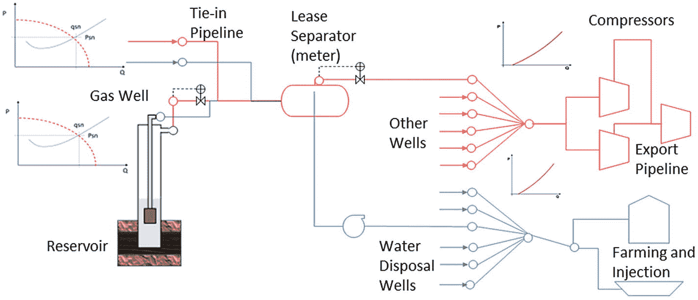

图 7-1

气水一体化生产系统[ [1](#Par130)

作为液体流量函数的流动压力关系描述了任何时间点的稳态油井动态(图 [7-2](#Fig2) )。油井优化的结果可能是提高储层的产能(左图)，从而在较高的流动压力下产生较高的液体流量，和/或减少流出限制(右图)，从而在较低的流动压力下增加液体流量。

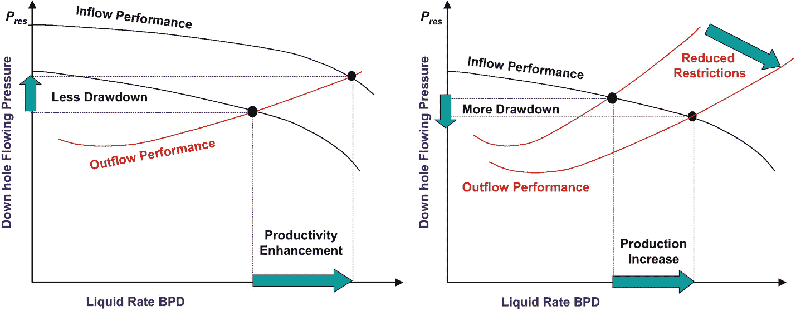

图 7-2

沿流入和流出性能曲线的速率增加

随着过去几十年数字自动化的引入，一个成熟的技术框架已经存在，可以实现一次性和连续的油气田优化[ [2](#Par131) ]。持续优化需要整合油田硬件(例如，井下传感器、远程激活完井、地面设施)和计算机算法，以便做出决策，包括数据处理、虚拟传感、模式识别和物理模型整合。

生产工程通常通过数据分析和物理建模解决以下问题。

*   资产(油藏、油井、设施)是否发挥了全部潜力？

*   关于资产健康状况，监控数据揭示了什么？

*   产量限制因素是什么？

*   生产损失/延期最可能的原因是什么？

*   阻止衰退、恢复或增加产量的最有效行动是什么？

*   如果采取一项行动，它会成功、有利可图并可持续吗？

生产工程是提高油气田技术和财务绩效的连续过程。目标是以最小的成本和努力最大化有效生产系统的能力。这个循环过程包括常规数据采集、分析数据和整合信息、选项分析和决策，以及详细的工程设计和执行(见图 [7-3](#Fig3) )。

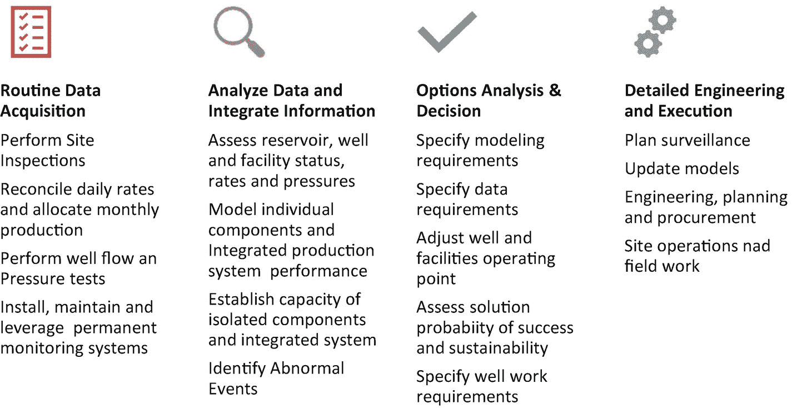

图 7-3

生产工程关键流程

通过常规监控程序获取大量不同种类的数据，这些数据被吸收以识别异常事件。因此，生产工程师分析并整合所有获取的数据，以评估状态、模拟系统性能并建立油井和设施的最佳操作范围。这种分析允许标记油井和设施的关键性能标签。

*   基于流动状态:活动健康、活动不健康和非活动

*   基于预期绩效:如预期，高于或低于预期绩效

*   基于问题识别:无、先兆事件、问题、故障

*   基于潜在和受限容量:储层、油井、设施、法律、计划维护

随着机器学习在石油和天然气行业的引入，已经发布了许多应用程序来帮助研究流动状态识别、性能计量、问题识别和生产能力约束。

使用多种方法在储层层面寻找机会，包括钻新井或通过堵水修复现有井、化学增产、在其他区域重新钻孔、侧钻至储层的其他区域或废弃现有井。生产工程师专注于挑战油井生产和注入目标、增加注入支持、选择最佳人工举升系统、清除生产油管中的固体等。生产工程师还审查并确保最大限度地提高地面设施可操作性和维护性，包括仪表，控制，井口，管道，分离器，泵，压缩机，加热器等。

## 生产优化

优化生产作业可能涉及到对生产系统(油藏、油井、地面设备)的增产机会进行排序，而这一过程只需付出最小的努力。此外，为了维持精益运营，生产运营需要不断审查流程、管理系统、人员调整以及智能技术的应用。通常，尽管存在油井性能、地下响应、设备故障率和下游需求的不确定性，仍必须做出决策。信息的异构性和当前资产的复杂性意味着识别可行机会的迭代方法。管理生产优化机会涉及风险和不确定性的管理。

生产优化是一个关于生产绩效和资产运营的持续改进过程[ [3](#Par132) ]。持续的生产优化意味着预期的绩效经常受到挑战，这是通过更新具有更高级目标和当前资产状态的最优预测来实现的(见图 [7-4](#Fig4) )。这是通过采取措施缩小实际绩效和预期绩效之间的差距来实现的。更快的监控循环将实际性能与预期性能进行比较，以确定每分钟、每小时和每天的差距。较慢的监视循环更新资产的预期性能。

连续生产优化环境中的主要输入包括(I)用于校准和验证生产模型的现场数据，(ii)用于建立资产状态的现场数据，(iii)油井和管道几何形状，以及(iv)先前的工艺知识。主要输出是(I)指示预期或实际性能的模型响应，(ii)指示现场诊断的模型不匹配，(iii)指示最佳解决方案的操纵变量运动，以及(iv)优化的预测和假设情景。

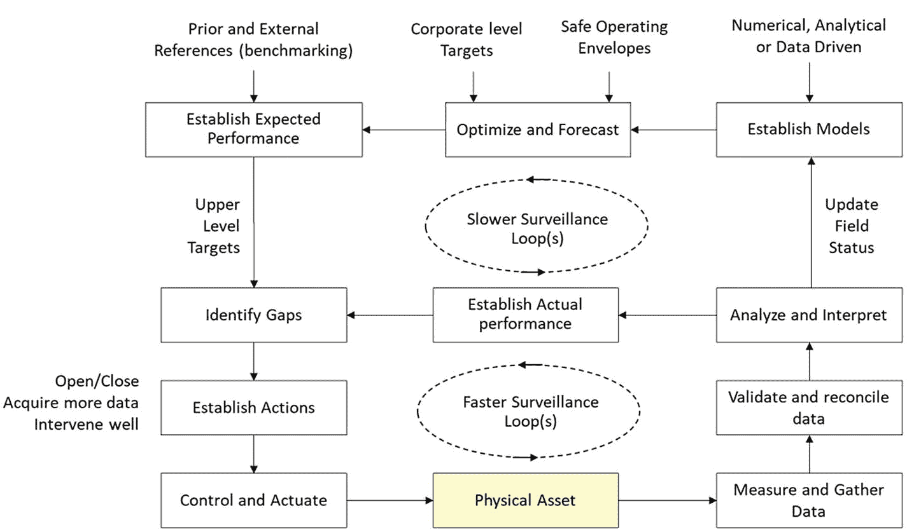

图 7-4

连续生产优化循环

由于生产系统的复杂性(见图 [7-1](#Fig1) )，操作员可以做出许多决定来找到最佳性能。这些决策可分为短期决策和长期决策，前者包括调整油井作业点和确定油井服务要求，后者包括油井数量、井距和地面设施容量。

在石油工业中，多变量优化技术以多种方式用于支持决策和完成日常任务，例如资源调度、储层参数的最佳历史匹配、最佳井位和井距、生产参数设置[ [4](#Par133) ] [ [5](#Par134) ]，以及驱替效率或采收率的优化[ [6](#Par135) 。这种优化使用通过使用第一原理离线生成的模型，或者通过使用现场获得的数据半凭经验生成的模型。

尽管多变量优化在石化工业中广泛使用，但它还没有渗透到上游工业中。在所使用的程度上，它缺乏与真实领域的联系，并且没有考虑包括用于模型的连续更新的动态数据。

## 预测油井产量潜力

*油井产量潜力*预测是评估油井性能的一项关键活动，需要确定当前测量的任何差距。传统上，稳态液体流量(*Q*<sub>T5】液体</sub> )是通过使用直井多孔介质 [7](#Par136) 中流体流动的基本方程(方程 6.1)，完全穿透单层、裸眼和循环排水区域(见图 [7-5](#Fig5) )和从井底到地面的生产系统压降来预测的。


(7.1)

井速潜力 *Q* <sub>*液体*</sub> 取决于岩石-流体性质，包括对油( *k* <sub>*ro*</sub> )和水(*k*<sub>*rw*</sub>)的相对渗透率，岩石性质包括绝对渗透率( *k* )和厚度( *h* ，流体性质(油和水的粘度( **μ* <sub>*w*</sub> )和油水地层体积因素( *β* <sub>*o*</sub> ， *β* <sub>*w*</sub> )、静态油藏压力(*P*<sub>*Res*</sub>)、井筒结构包括井筒半径( *r* 油藏流入动态关系(IPR)如图 [7-2](#Fig2) 所示，可以通过从零到静态油藏压力(*P*<sub>*Res*</sub>)改变流动井底压力(*P*<sub>*fbhp*</sub>)来获得。*

*P*<sub>T3】fbhpT5】也是 *Q* <sub>*液体*</sub> 的函数，流体性质(即初始溶解气体，*Rsi*；石油密度。流出系统的压降取决于井口回压(*P*<sub>*sep*</sub>)、油嘴内径( *ID* <sub>*油管*</sub> )、油管长度( *TVDSS* <sub>*井*</sub> )、井斜角、井眼长度( *MD* <sub>*井*</sub> )</sub>

## 利用虚拟传感器提高油井意识

在许多情况下，由于传感器故障、技术可用性、仪器可靠性或经济原因，直接物理测量不可用或与过程性能不一致。在这种情况下，虚拟传感器是物理传感器的方便替代物，物理传感器在仪器井众所周知的条件下使用可用数据来预测其他测量值[ [8](#Par137) ]。已经开发了许多技术来通过其他间接测量(例如，虚拟计量或软传感器)来估计速率和压力。

例如，对于特定的节流器直径，井口压力(WHP)和温度(WHT)与出油管线压力(FLP)相关；因此，在这四个变量之间建立一个机器学习模型是很方便的，以便它可以在任何需要的时候充当替代品。由于大多数油气井表现出非平稳过程，其中边界条件可能随着其寿命而变化，因此可以安全地认识到虚拟传感器模型可能不是在油井的整个寿命期间有效，而是在特定的时间段内有效。

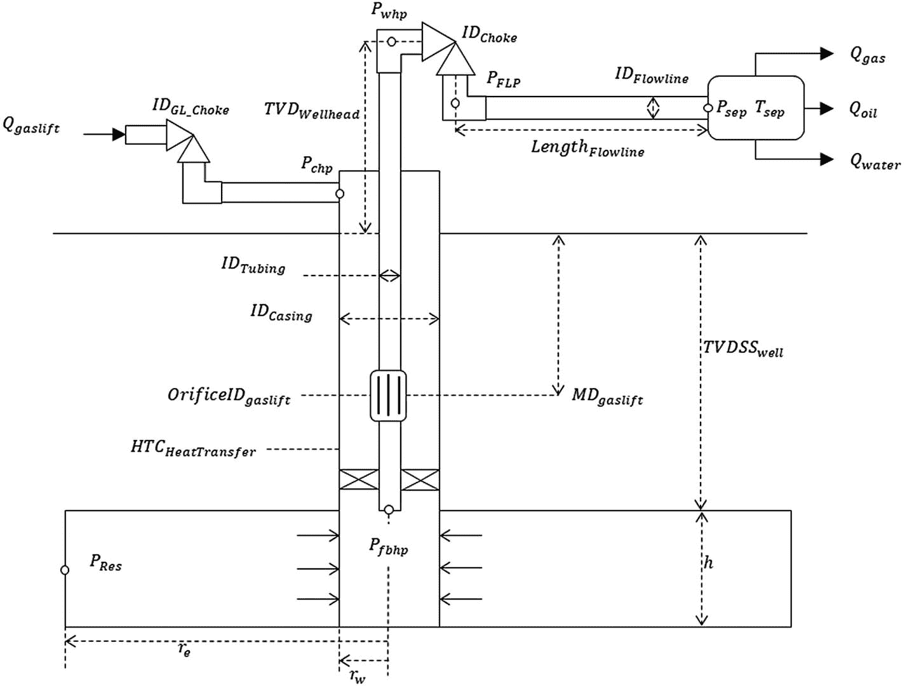

图 7-5

气举垂直井

### 虚拟速率计量

油井监测对于油藏表征、管理生产潜力和选择增产活动至关重要。监督的关键是了解油井流动条件(即流量和流动状态)。通常，井速率(即，油、水和气体)并不是一直都被直接测量的；然而，使用虚拟传感器，可以建立和实施连续的*井速率估算* (WRE)，也称为*虚拟速率估算器* (VRE)。虚拟速率计量是虚拟传感器[ [9](#Par138) ]的一种。

在石油和天然气工业中非常公知的一类虚拟速率估计器是从基于物理的节点分析模型中导出的。这种速率估算需要一致的压力-体积-温度(PVT)数据、适用的生产井测试和可靠的传感器[ [10](#Par139) ]。在这些类型的模型中，丢失的数据、有偏差的数据或失效的传感器可能破坏速率估计，并且需要新的校准。此外，在这些方法中，传感器输入不确定性和速率估计置信度通常被忽略[ [11](#Par140) ]。

另一种方法是关注由机器学习算法实现的数据驱动的 VRE。该过程包括预测模型，用于使用地面的实时传感器数据、历史产量和试井数据来生成多相流率、累积产量和其他感兴趣的量(例如 WCT GOR)的瞬时预测。

当测量数据足够时，数据驱动 VRE 产生令人鼓舞的结果，包括频繁的试井(例如，每年 8-12 次)、永久井口和出油管线传感器(压力、温度)。井下传感器的可用性是理想的，但不是必需的。

### 根据间接测量预测油井产量

考虑一口有 2000 多次流动测试的自喷井。预测虚拟比率(包括石油、水和天然气)的机器学习模型是用一半的测试来预测另一半的。输入数据指可用的油井测量值，包括井底压力(BHP)、井口压力(WHP)、井口温度(WHT)、分离器压力(Psep)、分离器温度(TSep)和节流器内径(ID_Choke)。预测输出包括作为所有给定测量值的函数的油、水和气体速率。

*   输入数据:“Well_Rates.csv”

*   Python 代码:" chapter 07 _ Well _ Rate _ Predictor _ RF _ GBM . ipynb "

笔记本提供了使用随机森林(RF)回归方法(即 rate = *f* (BHP、WHP、WHT、Tsep、Psep、Choke))的石油预测器的简化代码。在提供的文件中还提供了额外的虚拟计量功能。

```py
df = pd.read_csv("./data/Well_Rates.csv")
X = df[["BHP", "WHP", "WHT", "Tsep", "Psep", "Choke_in"]]
y = np.array(df[["Qoil"]].values).reshape(-1, )
scaler = MinMaxScaler()  # Scale Data

```

对归一化 PCA 数据的无监督分类(例如，DBSCAN、GMIX)可以在馈送到回归步骤之前选择干净的数据。

```py
X_scaled = scaler.fit_transform(X)
pca = PCA()
X_pca = pca.fit_transform(X_scaled)  # Perform PCA
pca_df = pd.DataFrame(X_pca)
# Cluster using DBSCAN
clustering = DBSCAN(eps=0.5, min_samples=12).fit(X_pca)
pca_df["DBSCAN"] = clustering.labels_ + 1
# Keep only the rows where DBSCAN=0
clust_df = pca_df[(pca_df["DBSCAN"] == 1)]
# Delete text columns "DBSCAN"
clust_df.drop(columns=["DBSCAN"],inplace=True)
# Merge data
X_merge = X.merge(pca_df,left_index=True,right_index=True)
X_merge["Labelled Y"] = y

```

创建训练数据，并将该数据集拆分为训练数据集和验证数据集。

```py
# Bring only the Xrows selected as per Clust_df --> # X.iloc[clust_df.index.tolist(),:]
# Bring only the Yrows selected as per Clust_df --> # y[clust_df.index.tolist()
train_X, test_X, train_y, test_y = train_test_split(X.iloc[clust_df.index.tolist(),:],y[clust_df.index.tolist()], test_size=0.5, random_state=123)

```

构建一个 RF 估算器。

```py
# Random Forest Regression
model_RF = RF(n_estimators=200, random_state=123)
model_RF.fit(train_X, train_y)

```

训练和验证数据集的预测。

```py
pred_y_RF_test = model_RF.predict(test_X) # Blind test
pred_y_RF_train = model_RF.predict(train_X)
pred_y_RF_all = model_RF.predict(X.iloc[clust_df.index.tolist(),:])
# Compute  r2 scores
r2_RF_train = r2_score(train_y, pred_y_RF_train)
r2_RF_test = r2_score(test_y, pred_y_RF_test)
r2_RF_all = r2_score(y[clust_df.index.tolist()], pred_y_RF_all)

```

包括原始数据集的计算，以便可以绘制它们。

```py
# RF to X_merge file
all_pred = np.array([np.nan for i in range(len(X_merge))])
all_pred[clust_df.index.tolist()] = pred_y_RF_all
X_merge["Predicted_RF"] = all_pred
X_merge.to_csv("X_merge.csv", index=False)

```

准备剧情。

```py
# Xplot of predicted and actual values
fig = plt.figure(figsize=(6,6))
ax = plt.axes()
plt.scatter(y[clust_df.index.tolist()], pred_y_RF_all, c="blue")
plt.scatter(test_y, pred_y_RF_test, c="red")
ax.set(xlabel="Test Data", ylabel="RF Model Prediction", title="Oil Rate RF Predictor Model")
plt.show()

```

可以使用 GBM 估计器或您喜欢的任何其他算法重复相同的过程。RF 和 GBM 回归方法的结果如图 [7-6](#Fig6) 所示。

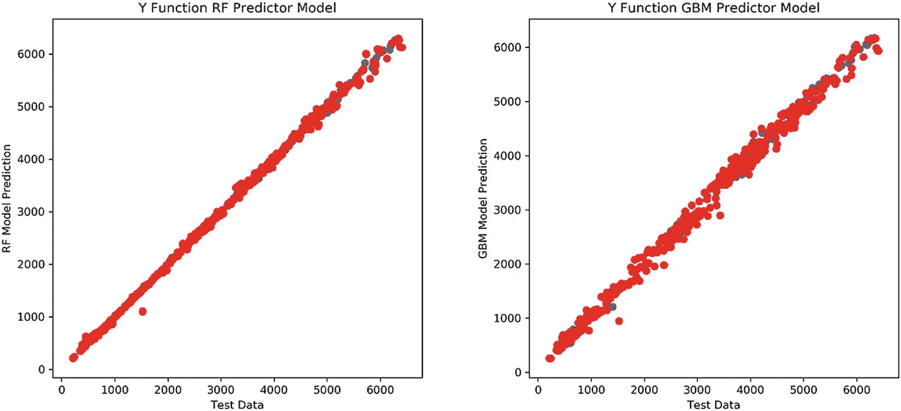

图 7-6

RF 和 GBM 方法的井虚拟速率估计器(红色为训练数据，蓝色为盲测数据)

回归变量得分如下。

*   使用随机森林的训练数据的 R <sup>2</sup> 为 0.999838。

*   使用随机森林的盲测数据的 R <sup>2</sup> 为 0.998584。

*   使用随机森林的所有数据的 R <sup>2</sup> 是 0.999230。

*   使用 GradientBoostingRegressor 的列车数据的 R <sup>2</sup> 为 0.995428。

*   使用 GradientBoostingRegressor 的盲测数据的 R <sup>2</sup> 为 0.992874。

*   使用 GradientBoostingRegressor 的所有数据的 R <sup>2</sup> 为 0.994193。

请注意，由于有六种可用的测量值([井底压力、WHP、WHT、Tsep、Psep、Choke_in)，工程师只需改变训练矩阵 X 和输出向量 y 中的输入特征，就可以实现多个虚拟速率计算器，也称为控制量

一种方法是“取消注释”所需的 X 和 Y 组合。

```py
# Create input feature and target
#X = df[["WHP", "Psep"]] # flow line performance
#X = df[["WHP", "Psep", "Choke_in"]] # flow line and choke performance
#X = df[["BHP", "WHP"]] # tubing vertical lift performance (VLP)
#X = df[["BHP", "WHP", "Choke_in"]] # VLP and choke performance
#X = df[["WHP", "WHT", "Tsep", "Psep"]] # flow line P&T performance
#X = df[["WHP", "WHT", "Tsep", "Psep", "Choke_in"]] # choke performance
#y = np.array(df[["Qoil"]].values).reshape(-1, )
#y = np.array(df[["Qwater"]].values).reshape(-1, )
#y = np.array(df[["Qgas"]].values).reshape(-1, )

```

另一种方便的方法是构建独立的虚拟计量函数，并同时运行所有这些函数(即 Y1oil = f(X1)，Y1water = f(X1)，Y1gas = f(X1)，Y2oil = f(X2)，Y2water = f(X2)，Y2gas = f(X2)，等等。).

```py
# Create input feature and target
X0 = df[["BHP", "WHP", "WHT", "Tsep", "Psep", "Choke_in"]]
X1 = df[["WHP", "Psep"]]
X2 = df[["WHP", "Psep", "Choke_in"]]
X3 = df[["BHP", "WHP"]]
X4 = df[["BHP", "WHP", "Choke_in"]]
X5 = df[["WHP", "WHT", "Tsep", "Psep"]]
X6 = df[["WHP", "WHT", "Tsep", "Psep", "Choke_in"]]
Y1 = np.array(df[["Qgas"]].values).reshape(-1, )
Y2 = np.array(df[["Qoil"]].values).reshape(-1, )
Y3 = np.array(df[["Qwater"]].values).reshape(-1, )

```

这种方法的优点是所有 7 个输入矩阵(X0 到 X6)和每个速率(Y1，Y2，Y3)都是用不同的物理过程假设构建的；例如流过出油管线、流过节流器或流过油管。

当工艺条件稳定时，获得的模型趋于一致，并且模型被很好地校准。但它们也是识别系统异常的有力工具；当工艺条件不同于原始假设时，这些模型会出现分歧；例如，增加含水量或增加 GOR。

### 预测气举井的井速

一口气举井(见图 [7-7](#Fig7) )，其性质见表 [7-1](#Tab1) ，约有 12538 个流动测试数据点。将建立一个用于预测井率(包括石油、水和天然气)的机器学习模型。输入数据是指油井的可用测量值，包括井底压力(BHP)、井口压力(WHP)、井口温度(WHT)、出油管压力和温度(FLT FLP)以及节流器内径(ID_Choke)。预测输出包括作为所有给定测量值的函数的油、水和气体速率。

表 7-1

具有气举特性的垂直井

<colgroup><col class="tcol1 align-left"> <col class="tcol2 align-center"> <col class="tcol3 align-center"></colgroup> 
|   | 

平均的

 | 

标准偏差

 |
| --- | --- | --- |
| 石油比重，API | Thirty-six point three | Zero point two |
| 石油初始溶解气，Rsi，SCF/bbl | Five hundred and sixteen point seven | Three |
| 气体比重， | Zero point eight | Zero |
| 水的盐度，ppm | Two hundred and thirty thousand and ten | One thousand three hundred and thirty point two |
| 储层温度，华氏 | Two hundred and forty | One point four |
| 储层压力，psi | Four thousand three hundred and forty-seven | Three hundred and seventy-six point three |
| 油管长度，英尺 | Twelve thousand two hundred and sixty-nine | Seven point one |
| 套管内径，英寸 | Six point two | Zero |
| 管道内径，英寸 | Three point one | Zero |
| 气举孔深度，英尺 | Twelve thousand and sixty-nine | Seven point one |
| 出油管内径，英寸 | Three point one | Zero |
| 出油管长度，英尺 | Ten | Zero point one |
| 表面温度， <sup>o</sup> F | Eighty | Zero point five |
| 传热系数，BTU/(hr∙ft <sup>2</sup> ∙ <sup>o</sup> F) | Nine point two | one point six |

*   输入数据:“Well_Choke_GL.csv”

*   Python 代码:" chapte 07 _ GL _ Well _ Rate _ and _ Pressure _ MLP _ predictor . ipynb "

使用多层感知器(MLP)回归方法(即 rate = f(BHP，WHP，WHT，FLP，FLT，ID_Choke，ID_orifice，Q_Gas_lift))实现油、水和气体速率预测的 Python 代码。

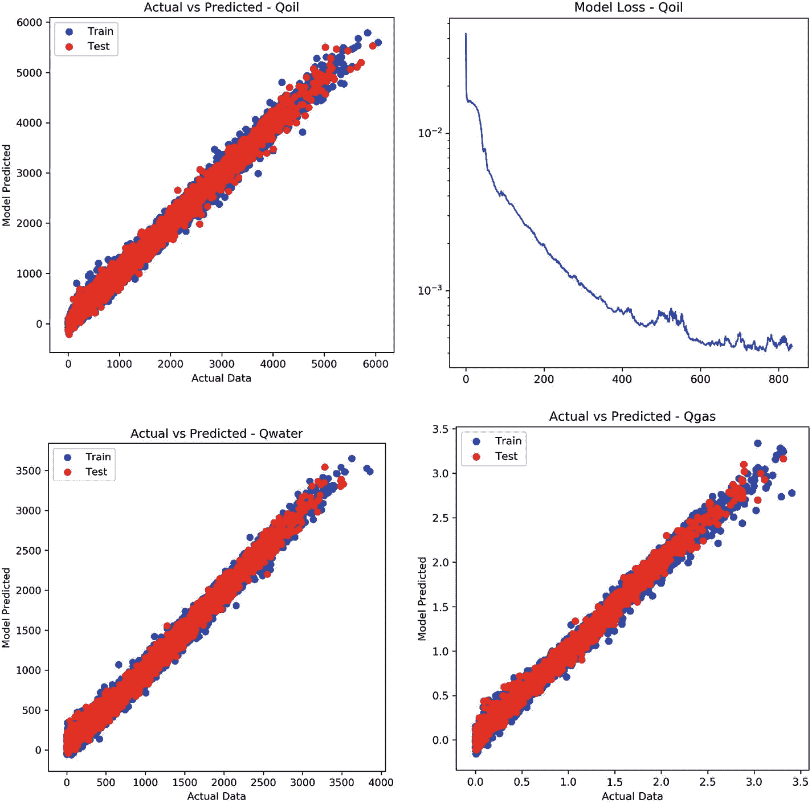

图 7-7

气举井采用 MLP 算法的井速(油、水、气)估算器

## 预测油井故障

生产工程师的任务之一是建立主动检测和预防油井故障的实践和方法，并对油井(和设施)操作范围提出行动建议。储层、近井筒环境、井下设备和地面生产系统的任何组件都可能在任何时间点发生故障，从而导致相当大的计划外停工期、生产损失和不受控制的作业费用。油井故障的主动识别和预防导致适当的维护计划，最终减少不适当的维修，最大限度地减少停工时间，并随后提高作业效率[ [12](#Par141) ]。

工程师们面临的挑战是，纯粹从性能数据中识别候选对象和排列增产机会。标准生产数据管理和决策平台很难预测油井的正常运行时间、可用性和最佳作业范围的下降。这些挑战通常与正确的系统理解、井况诊断、主动机会识别、有效的机会排序和作业后绩效分析有关。

检测有杆抽油井(SRP)故障的系统模式识别工作流程已成功实施[ [12](#Par141) ]。这为检测 SRP 故障带来了巨大的工程成本节约，并最大限度地减少了生产损失。

推荐最佳处理方法也是管理作业费用的一项必要任务，不仅可以最大限度地降低钻机和设备成本，还可以使油井更快投产，避免未来因相同原因出现故障[ [13](#Par142) ]。其理念是将历史成功和失败数据、现场人员意见和基本业务规则结合到一个数据驱动模型中，该模型能够推荐优化设计、现场规划、设备使用和工作绩效的处理方法。

建立任何预测油井故障的咨询解决方案的步骤包括数据筛选、数据特征工程、根本原因分析、建议措施和反馈。

### 数据筛选

数据筛选识别出表明资产表现不如预期的症状。检测井之间的模式以识别相似的行为，并将筛选问题的复杂性从几百个传感器降低到几类相似的测量类型。

### 数据特征工程

数据特征工程可能涉及使用领域知识、特征提取和模式识别来生成数据特征。这一步的目的是允许算法作用于趋势而不是实际值。例如，咨询系统应该考虑油管头压力是增加、稳定还是降低，而不是承认油管头压力为 1200 kPa 的事实。任何输入变量的变化率只是数据流中需要提取的特征之一。

领域专家访谈和对监控逻辑的阐述表明，它是专家通常用来检测事件的数据流特征的组合。只有在少数情况下，是一个绝对值或阈值引起了专家的警觉；通常，它是一个信号中的一系列特征或许多信号的组合。

### 根本原因分析

应用技术分析方法和诊断来确定性能可能高于或低于预期的原因。目标是识别约束条件，例如液体产量是否受到储层产能、油井生产潜力或设施处理极限的限制。

由于上一步(特征工程)中确定的一些症状的模糊性，RCA 的结果通常是概率性的，表明了最可能的原因，但也表明了可能的替代原因。

一种已知的根本原因识别方法是贝叶斯网络。用于确定井下泵性能下降的最可能原因的例子是通过考虑观察和实时测量的贝叶斯网络模型来确定的。观察结果可以是独立的(例如泵送量和储层压力)，但也可以通过因果关系联系起来(例如井口压力和生产率)。

在本例中，关于泵、储层、流体、测量液体下降速率和井口压力的信息用于确定最可能的原因是气体摄入；然而，这并不完全排除机械问题和可能的过度泵磨损(例如，由于泵中的沙子)。

### 建议改进绩效的措施

高水平的井“健康分数”可以从井传感器和其他测量数据中识别的特征来计算。可以计算额外的分数，以量化问题严重性(即问题分数)、井被修复或改进时的机会大小(即潜在分数)等。将一口井的所有计算分数相加，得出最终分数。最终分数可以被认为是健康分数；数值越小，油井出现严重问题的可能性越小。然后，可以根据最终得分对油井进行排名，以给出日常作业的优先级列表。

计算的事件、条件和推荐的动作可用于生产系统中的每个元素(例如，每个井、每个设施)。事件发生的可能性乘以事件影响的严重程度(安全问题、生产损失、时间损失)的结果就是某个事件的得分。

基于效用的定义(例如，最大化生产、最小化损失、增加净现值、减少损失时间等。)，建议决策来解决前面步骤中确定的问题。该建议可以是概率性的。总体效用值是各种子效用的组合；因此，必须为每个组织甚至每个项目建立一个统一的评估系统，以便对货币目标和非货币目标进行比较。

### 预测油井性能不佳

预测不良油井动态时遇到的一个挑战是，在生产的早期阶段，很少有迹象表明产量会快速下降。然而，通过使用无监督的机器学习技术，如聚类算法，有可能识别出在一定年限内可能出现石油产量减少的油井。基于聚类的方法如图 [7-8](#Fig8) 所示。

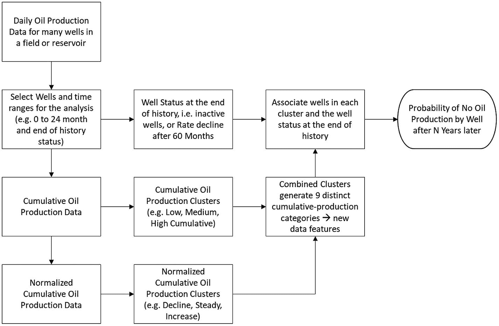

图 7-8

一种基于聚类的方法，用于识别未来极有可能减产的油井

在生产的早期阶段(例如最初的 24 个月)，许多油井的每日生产数据被考虑用于计算油井的累积石油产量。此外，每口井的累积产油量通过使用该井在考虑持续时间结束时的累积产油量标准化为 1。然后，这两个累积产量图可以分别创建井丛。如图 [7-9](#Fig9) (左)所示，基于累积产油量的聚类导致三类不同的井。


图 7-9

累积石油产量(左)和标准化累积产量的聚类显示了不同的井组(右)

*   低累积产量井(蓝线)

*   中等累积产量井(红线)

*   高累积产量井(绿线)

此外，基于归一化累积产油量的聚类显示了三类井(见右图 [7-9](#Fig9) )。黑色虚线显示每个时间实例的聚类平均值。观察聚类平均值，可以清楚地看出，这三个聚类代表以下三种不同的生产趋势:

*   生产率下降(蓝线)，聚类平均值的斜率下降

*   稳定的生产率(红线)，聚类平均值的斜率几乎不变

*   生产率增加(绿线)，聚类平均值的斜率增加

通过组合基于累积石油产量和归一化累积石油产量的聚类，识别九个不同的井类别，每个属于累积石油产量和生产率类别的组合(例如，高累积产量-增加的生产率，低累积产量-下降的生产率等。).

此外，生产数据分析的油井数量表明，在五年或更长的时间范围内，石油产量出现了严重下降。对于这九个类别中的每一个，石油产量临界下降的概率是通过考虑该类别中的油井总数和未来显示临界下降的油井数量来计算的。表 [7-2](#Tab2) 总结了一口井在未来五年内死亡的计算概率。

很容易观察到,“高累积产量”组中的井在本研究考虑的时间范围内没有表现出任何不活跃的可能性，不管它们属于哪个生产速率组。

表 7-2

五年内死井概率

<colgroup><col class="tcol1 align-left"> <col class="tcol2 align-left"> <col class="tcol3 align-left"> <col class="tcol4 align-left"></colgroup> 
| 

生产率→

 | 

递减率

 | 

稳定速率

 | 

增长率

 |
| --- | --- | --- | --- |
| 

累计产量↓

 |
| --- |
| **低** | Zero point two five eight | **0.308** | **0.357** |
| **中等** | Zero point one two | Zero point one four | Zero point one nine |
| **高** | Zero | Zero | Zero |
| 平均含水率和死井概率相关系数:0.719563 |

此外，在考虑的时间范围内，累积产量较低且产量稳定或增加的油井出现闲置的概率明显较高。基于这些观察结果，建议对所研究油田中累积产油量低且产量稳定或下降的新井进行仔细监测。根据前 24 个月的生产数据，属于这两类的井可以优先用于更频繁的监测活动和增产修井活动。

*   输入数据:“Well_Monthly_Production.csv”

*   输出:“油井失效的概率”

*   Python 代码:" chapter 07 _ Well _ Failure _ Clustering _ using _ k means . ipynb "

*   方法:k 均值聚类

## 管理与速度相关的含水率

在许多情况下，含水率(WCT)和气/油比(GOR)是与速度相关的现象，可以通过降低速度来最小化。这些现象可能是较高流动性相粘性指进和/或锥进的结果。

当油井下的油水接触面由于油井压降形成锥形剖面，克服了油水重力分离时，就会发生水锥。见水后，锥进会增加含水率，显著降低石油产量和采收率[ [14](#Par143) ]。操作者可以以不会导致水或气突破的速度生产井。稳态条件下的最大产量被称为*临界产油率*。临界油率准则限制了短期利益；因此，明智地计算它是很重要的，特别是在天然裂缝储层(NFRs)中。

由于底水驱动的 NFRs 因瞬时见水和极高的含水率而臭名昭著，当采油速度太低时，远低于临界采油速度的采油可能变得不经济。因此，有必要研究 NFRs[14](#Par143)中临界采油速度的可行性。

### 预测临界采油速度

通过使用在商业模拟器[ [15](#Par144) ]上实施的双孔隙度-双渗透率(DPDP)模型，对各种带底水的 nfr 进行建模，开发了临界采油速度预测器。模拟输入数据显示，一些 nfr 的临界产油量可能高达 200 bopd，这是经济的。

在开发临界油率的半分析模型[ [14](#Par143) ]的过程中，执行了以下步骤。

1.  通过将裂缝网络表示为等效的连续多孔介质来简化 NFR。

2.  在用 NFR 等效渗透率代替基质渗透率后，用 NFR 的模拟临界速率值验证了伴侣的临界速率机械模型[ [16](#Par145) ]。

3.  使用一系列设计好的代表各种 nfr 的模拟实验，在统计上校准产生的机械模型，以包括忽略的物理效应。

这些步骤产生了统计校准的机械模型[ [16](#Par145) ]，用于 NFRs 中的临界油率(*q*<sub>T5】Cr， *fr*</sub> )，其可被写成等式 [7.2](#Equ2) 。


(7.2)

其中，k <sub>f，m</sub> = k <sub>fh</sub> + k <sub>mh</sub>

式中，k <sub>fh</sub> 为有效裂缝渗透率，MD；k <sub>mh</sub> 为基质渗透率，MD；k <sub>f，m</sub> 是 NFR 的平均渗透率，MD；h <sub>o</sub> 为油层厚度，ft；r <sub>e</sub> 为油藏半径，ft； *μ* <sub>*o*</sub> 是油的粘度，CP； *B* <sub>*o*</sub> 是油层体积系数；*h*<sub>*op*</sub>为射孔井段，ft；为裂缝网络的各向异性比；q <sub>*cr* ， *fr*</sub> 是 NFR 压裂井的临界产油量。

为了确定模型的经验成分(方程 [7.1](#Equ1) )，，我们通过改变井-储层性质设计了一系列模拟实验，包括有效裂缝渗透率、基质渗透率、流度比、储层半径、各向异性比和渗透率比 [17](#Par146) 。Box-Behnken 实验设计[ [ 18 ](#Par147) ] [ [ 19 ](#Par148) ]是一种三级析因设计，它创建了模拟实验的矩阵，可以捕捉非线性效应，同时最大限度地减少实验数量。为了建立回归模型，等式 7-2 以标准化临界速率的形式重写，如(等式 [7.3](#Equ3) )所示。


(7.3)

运行线性回归后，归一化临界速率与纵横比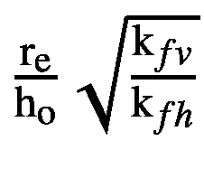相关，其回归系数如表 [7-3](#Tab3) 所示。

表 7-3

经验参数回归模型，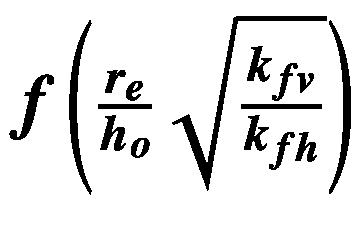

<colgroup><col class="tcol1 align-left"> <col class="tcol2 align-left"> <col class="tcol3 align-left"> <col class="tcol4 align-left"></colgroup> 
| 

可变的

 | 

系数

 | 

t 值

 | 

pr > &#124;t&#124;

 |
| --- | --- | --- | --- |
| 拦截 | Zero point seven two eight | Two hundred and fourteen point seven | Zero |
| 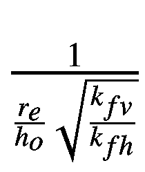 | One point nine nine seven | Eighteen point four | Zero |

回归模型在 0.85 的 R 平方值下显示了与实验数据的良好拟合。因此，NFR 压裂井临界产量的最终方程可以写成方程 [7.4](#Equ4) 。


(7.4)

作为输入参数的函数的临界油率的实现。

*   输入数据:“Critical_Oil_Rate.csv”

*   输出:“临界油率”

*   Python 代码:" chapter 07 _ Critical _ Oil _ Rate _ Predictor _ using _ ols . ipynb "

*   方法:多元线性回归方法

```py
import statsmodels.api as sm
from statsmodels.tools.tools import add_constant
import pandas as pd
import statsmodels
df = pd.read_csv("Critical_Oil_Rate.csv")

Y = df.normalized_criticalrate.values
x = df.Empirical_component.values
X = sm.add_constant(x) # adding a constant

model = sm.OLS(Y, X).fit()
predictions = model.predict(X)
model.summary()

OLS Regression Results
Dep. Variable:               y   R-squared:               0.850
Model:                     OLS   Adj. R-squared:          0.847
Method:          Least Squares   F-statistic:             339.5
Date:         Wed, 15 Jul 2020   Prob (F-statistic):   2.21e-26
Time:                 21:36:44   Log-Likelihood:         170.01
No. Observations:           62   AIC:                     -336.0
Df Residuals:               60   BIC:                     -331.8
Df Model:                    1
Covariance Type:     nonrobust

                          coef    std err          t      P>|t|      [0.025      0.975]
const                   0.7277      0.003    214.698      0.000       0.721      0.734
x1                      1.9969      0.108     18.426      0.000       1.780      2.214

Omnibus:                119.548   Durbin-Watson:          1.967
Prob(Omnibus):            0.000   Jarque-Bera (JB):    5122.268
Skew:                    -6.193   Prob(JB):               0.00
Kurtosis:                45.772   Cond. No.               53.9

```

## 推荐 NFRs 中的最佳井距

极限含水率定义了水锥油藏的理论最大含水率，它决定了底水油藏的最大经济可采原油量。在此类储层的生产过程中，在水锥形成阶段，初始含水率迅速增加，随后在未封闭的油层(无限油层)中，含水率稳定下来(最终含水率)。然而，在多井油藏中，每口井都受到非流动边界(NFB)的限制，含水率永远不会稳定，而是被缓慢的含水率上升/上升速率所取代。这是因为有限边界油藏中的石油枯竭导致含水率缓慢增加。

如果井的排水面积足够大，其尺寸超过了水锥的横向长度(在水锥形成(膨胀)阶段结束时)，NFB 系统的后期、含水、缓慢推进阶段主要由产油衰竭控制，因为水锥膨胀的影响变得可以忽略不计。

后期含水可能使采油变得不经济，因此井的采收率主要由锥体膨胀结束的时间控制。这意味着油井的最佳排水半径应等于水锥的横向长度，这使得油井的采油量最大。图 [7-10](#Fig10) 展示了这一概念。该最小井间间距被定义为临界井距，或两倍的临界井排水半径[ [14](#Par143) ]。

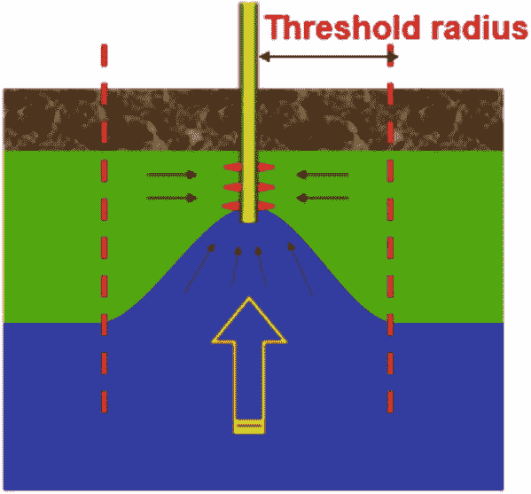

图 7-10

临界排水半径等于水锥侧向长度(临界半径),可实现最大的油井采收率

### 预测临界油藏半径

通过改变包括水平渗透率(k <sub>h</sub> )、各向异性比(和渗透率比()、产油层厚度(h <sub>o</sub> )、流度比(M)和含水层厚度(h <sub>w</sub> )在内的属性，可以使用针对各种井/储层系统的大量模拟实验来统计确定阈值半径。Box 和 Behnken 方法可以设计一个模拟实验的矩阵[ [ 18 ](#Par147) ]。设计规定总共进行 54 次不同的模拟运行(水库/含水层系统),通过系统地增加排水区域的大小来确定临界半径，直到它等于最大水锥的横向长度。然后，使用多元二阶多项式回归，将结果用于开发临界排水半径 r <sub>eTh</sub> 的经验公式。

由此得到的预测门限油藏半径的公式为

![$$ {\mathrm{r}}_{eTh}=14920.6-3563.7\mathrm{M}-68.5{\mathrm{h}}_{\mathrm{w}}-34586\frac{{\mathrm{k}}_{\mathrm{v}}}{{\mathrm{k}}_{\mathrm{h}}}+99.65{\mathrm{h}}_{\mathrm{o}}+288{\mathrm{M}}^2+0.107{\mathrm{h}}_{\mathrm{w}}^2+31290{\left(\frac{{\mathrm{k}}_{\mathrm{v}}}{{\mathrm{k}}_{\mathrm{h}}}\right)}^2+1.5\mathrm{M}{\mathrm{h}}_{\mathrm{w}}-0.55M{\mathrm{k}}_{\mathrm{h}}-10.13{Mh}_{\mathrm{o}}-0.087{\mathrm{h}}_{\mathrm{w}}{\mathrm{h}}_{\mathrm{o}}+0.1{\mathrm{k}}_{\mathrm{h}}{\mathrm{h}}_{\mathrm{o}}. $$](img/480430_1_En_7_Chapter_TeX_Equ5.png)

(7.5)

以下是阈值储层半径预测值作为输入参数的函数的实现。

*   输入数据:Threshold_reservoir_radius.csv

*   输出:“阈值半径值”

*   Python 代码:" chapter 07 _ Threshold _ Radius _ Predictor _ using _ ols . ipynb "

*   方法:多元线性回归方法

```py
import statsmodels.api as sm
from statsmodels.tools.tools import add_constant
import pandas as pd
import statsmodels
from statsmodels.stats.outliers_influence import variance_inflation_factor
df = pd.read_csv("Threshold_reservoir_radius.csv")
Y = df.threshold_radius.values
x = df.drop(['threshold_radius' ], axis=1)
vif = pd.DataFrame()
vif = [variance_inflation_factor(x.values, i) for i in range(x.shape[1])]
print(vif)
X = sm.add_constant(x) # adding a constant
model = sm.OLS(Y, X).fit()
predictions = model.predict(X)
model.summary()

                                 OLS Regression Results
===========================================================================================
Dep. Variable:                              y   R-squared:                            0.693
Model:                                    OLS   Adj. R-squared:                       0.654
Method:                         Least Squares   F-statistic:                           7.67
Date:                        Sat, 02 May 2020   Prob (F-statistic):                1.39e-10
Time:                                23:17:49   Log-Likelihood:                     -512.69
No. Observations:                          54   AIC:                                   1039.
Df Residuals:                              47   BIC:                                   1053.
Df Model:                                   6
Covariance Type:                    nonrobust
===========================================================================================
                                 coef     std err         t    P>|t|       [0.025      0.975]
-------------------------------------------------------------------------------------------
const                       6094.0420    1815.138     3.357    0.002     2442.455    9745.629
Oil-zone thickness            71.2688      10.830     6.581    0.000       49.482      93.055
Mobility                    -888.1647     144.831    -6.132    0.000    -1179.528    -596.802
Aquifer thickness            -10.5367       2.554    -4.125    0.000      -15.675      -5.398
Horizontal permeability        5.0949       2.719     1.874    0.067       -0.375      10.565
Penetration ratio           -275.2788    2302.091    -0.120    0.905    -4906.489    4355.932
Anisotropy ratio           -1728.2702    1189.820    -1.453    0.153    -4121.879     665.339
===========================================================================================
Omnibus:                                7.561   Durbin-Watson:                         1.358
Prob(Omnibus):                          0.023   Jarque-Bera (JB):                     6.630
Skew:                                   0.762   Prob(JB):                             0.0363
Kurtosis:                               3.791   Cond. No.                           1.73e+03
===========================================================================================

```

## 摘要

在本章中，我们提供了生产工程的简要概述。我们还讨论了生产优化和预测油井产量动态的公式。使用第一原理模型生成的真实合成数据，我们向您展示了虚拟计量的机器学习方法。虚拟计量示例展示了从油井获得的传感器数据如何帮助我们持续监控油井产量。本章的一节还提供了机器学习算法的实施示例，用于使用历史生产数据预测即将发生的油井故障。

在本章的最后几节中，我们讨论了预测天然裂缝性油藏临界采油速度和确定最佳井距的问题。我们希望您能够很好地理解使用传感器数据和生产数据以及机器学习算法来解决生产工程问题的各种方法，这些问题是在生产操作过程中观察到的。

## 承认

我们要感谢 Samir Prasun 博士对本章的宝贵建议和贡献。

## 参考

[1] A. Shields、S. Tihonova、r .斯托特、L. Saputelli、Z. Haris 和 A. Verde，“CSG 产量预测的综合生产建模”，2015 年澳大利亚布里斯班美国石油工程师协会亚太地区非常规资源会议和展览。

[2] L. Saputelli、C. Bravo、M. Nikolaou、C. Lopez、R. Cramer、S. Mochizuki 和 G. Moricca，“数字油田(DOF)实施 10 年后的最佳实践和经验教训”，美国石油工程师协会科威特石油和天然气展览和会议*，*科威特，科威特市，2013 年。

[3] W. Omole、L. Saputelli、J. Lissanon、O. Nnaji、F. Gonzalez、G. Wachel、K. Boles、E. Leon、N. Parekh、N. Nguema、J. Borges 和 P. Hadjipieris，“赤道几内亚近海 Okume 复杂油田的实时生产优化”，美国石油工程师协会数字能源会议和展览*，*德克萨斯州伍德兰兹，2011 年。

[4] W. Ramirez，“提高石油采收率的最佳注入政策:第 1 部分理论和计算策略”，*《石油工程师学会杂志》*，1984 年 6 月。

[5] W. Liu 和 W. Ramirez，“蒸汽驱的交互式个人计算机最佳控制计算”，*《石油工程师学会杂志》*，1992 年 1 月。

[6] B. Sudaryanto 和 Y. Yortsos，“利用速率控制优化多孔介质中的位移”，美国石油工程师协会年度技术会议和展览*，*路易斯安那州新奥尔良，2001 年。

[7] H. Darcy，*第戎市的公共喷泉*，巴黎:Dalmont，1856 年。

[8] H. Melb、S. Morud、B. Bringedal、R. van der Geest 和 K. Stenersen，“利用长回接和有限或不精确的仪器实现油井流量计量的软件”，德克萨斯州休斯顿海上技术会议，2003 年。

[9]美国石油协会， *API 推荐规程 86:多相流测量推荐规程*，DC 华盛顿州，2005 年。

[10] A. Petukov、L. Saputelli、J. Hermann、A. Traxler、K. Boles、O. Nnaji、B. Vrielynck 和 D. Vegunopal，“虚拟计量系统在赤道几内亚近海 Ceiba 油田的应用”，美国石油工程师协会数字能源会议和展览*，*德克萨斯州伍德兰兹，2011 年。

[11] H. Melb、B. Bringedal、N. Hall、S. Morud、E. Birkemoe 和 C. Smith，“使用虚拟多相流计量的基于不确定性的分配”，第 22 届北海流量测量*、*，苏格兰圣安德鲁斯，2004 年。

[12] F. Liu 和 A. Patel，“基于模式识别的有杆泵人工举升系统油井故障检测”，国际石油技术会议，北京，2013。

[13] C. S .波帕，“重油资产的人工智能:解决方案和组织能力的演变”，美国石油工程师协会年度技术会议和展览，德克萨斯州圣安东尼奥，2012 年。

[14] S. Prasun 和 A. Wojtanowicz，“水锥开发油藏井距设计中极限含水率的确定及意义”，*能源技术杂志，* 2018。

[15] CMG，“IMEX”，2020 年。【在线】。可用: [`https://www.cmgl.ca/imex`](https://www.cmgl.ca/imex) 。

[16] I. Chaperon，“各向异性地层中水平井和垂直井的锥进理论研究:亚临界和临界速度”，美国石油工程师协会第 61 届 ATCE 会议，新奥尔良，1986 年。

[17] S. Prasun 和 A. Wojtanowicz，“带水锥的天然裂缝性油藏临界采油速度的半解析预测”，*《石油科学与工程学报》，*第 180，779–792 页，2019 年。

[18] M. Cavazzuti，*最优化方法:力学中从理论到设计的科技方面*，柏林/海德堡:施普林格出版社，2013 年。

[19] S. Ferreira，“Box-Behnken 设计:优化分析方法的替代方案”，*《分析化学学报》，*第 597 页(02)，2007 年。

[20] R. Roberts 和 R. Flin，“释放潜力:了解影响上游石油和天然气行业技术采用的心理因素”，*《美国石油工程师协会杂志》，*第 25 卷，第 1 期，第 515-528 页，2020 年 2 月 1 日。

[21] A. Phillips 和 B. Briegendal，“虚拟流量计量作为多相流测量装置的备份或替代的应用”，水下技术协会，2006 年。