# 五、实用深度学习人工神经网络演示

本章展示了几个实际的 DL 演示。如果你已经阅读了前一章或者已经获得了 DL 技术和概念的经验，你将准备好跟随演示。在写这一章的时候，我有两个目标。第一个是清楚地展示如何完成一个完整的人工神经网络项目，以产生现实和有用的结果。第二是指出在人工神经网络开发中常见的一些潜在的陷阱和不切实际的假设。

## 零件目录表

您将需要一个标准的 RasPi 桌面配置和 Pi 摄像机来进行这些章节的演示。

<colgroup><col class="tcol1 align-left"> <col class="tcol2 align-left"> <col class="tcol3 align-left"> <col class="tcol4 align-left"></colgroup> 
| 

项目

 | 

模型

 | 

量

 | 

来源

 |
| --- | --- | --- | --- |
| 树莓派 3 或 4 | 型号 B 或 B+ (RasPi 3)型号 B (RasPi 4) | one | mcmelectronics.comadafruit.comdigikey.commouser.comfarnell.com |
| 微型 SD 卡 | 16 GB，10 级或更大 | one | amazon.com |
| 带带状电缆的 Raspberry Pi 摄像机 | 版本 2 或更高版本 | one | amazon.com |
| Raspberry Pi 相机支架 | 任何符合版本 2 模型的 | one | amazon.com |
| USB 键盘 | 亚马逊基础版 | one | amazon.com |
| USB 鼠标 | 亚马逊基础版 | one | amazon.com |
| HDMI 监控器 | 商品 | one | amazon.com |

## 识别手写数字演示

这个人工神经网络项目被认为是人工神经网络社区中的经典项目。它专注于识别手写数字。然而，在我深入研究这个项目的细节之前，我想先评论一些通用的项目开发指南。遵循这些准则将帮助你成功完成大多数项目，包括像这样的小项目。这些准则可以分为一系列步骤，将在列表后单独讨论:

1.  写下要求。

2.  建立人员、硬件和软件资源。

3.  创建一个现实的时间表，包括里程碑。

4.  开始构建、开发和/或实现。

5.  开始测试。

6.  根据测试结果修改开发/实现。

7.  开始生产或现场发布。

8.  制定维护计划。

写下需求——写下项目需求是很重要的，即使只有你一个人在做这个项目。写需求迫使你坚定地理解项目完成后应该完成什么。如果有多个团队成员在一个项目中工作，这个指导方针就变得特别重要。将需求写在纸上，并让所有团队成员都同意它们，以避免将来在要做什么和如何完成方面的分歧。

为人员、资金、硬件和软件建立资源——了解项目所需的所有资源要么立即可用，要么有获取它们的计划，这是成功完成项目的关键。对于要求有限的单人项目来说，这一步可能是可选的，但是对于有专门团队的大中型项目来说，这一步是必不可少的。

创建一个包括里程碑在内的切实可行的时间表——无论项目的规模有多大，建立一个时间表总是一个好主意。对于单人软件项目来说，在你的桌子或日历上放一张简单的便条就足够了，而更正式的日程安排工件适用于中型到大型的项目。创建里程碑也是有用的，即使它只是提醒你自己，你正在按计划进行或落后，这是更常见的情况。对于长期的大规模项目，通常会建立专门的项目进度团队，帮助项目经理按计划进行。

开始建设、开发和/或实现——这是实际项目工作开始的时候。对于软件开发项目，比如本书中所描述的，你应该分配足够的时间在没有太多干扰的情况下工作。我知道这在家庭环境中很难做到，但拥有不受干扰的时间对于高效完成项目很重要。正式项目是一个不同的故事，因为那是它们存在的理由。

开始测试——这一步适用于涉及原型和/或软件开发的项目。测试硬件原型以确定它们是否满足需求是绝对必要的，没有这一步，任何项目都无法合理地进行。类似地，测试软件以查看它是否满足需求也是一个需求。根据项目的性质和规模，可能有正式的方法来记录原型/软件满足需求的程度。

基于测试结果修改开发/实现——更改和/或修改开发/实现必须遵循测试结果的审查和验收。不使用测试结果会挫败测试的整个目的，并最终导致项目失败。有时，测试揭示出最初的需求列表是不现实的，或者在某些方面是错误的。在一个项目的生命周期中，由于潜在的发现，甚至是计划中的资源被意外延迟或变得不可用的不幸事件，需求会发生一些变化，这种情况并不罕见。您需要警惕的是需求“蔓延”，在这种情况下，将需求悄悄地添加到列表中是件好事。这种情况会导致有问题的项目结果。

开始生产或现场发布——项目基本上已经完成，可以发布了。有时，项目经理会推迟最终发布，等待一些小的“调整”应该避免这种情况，因为如果项目是使用确定的指导方针开发的，它应该在预定的日期准备好。此时还应该提供适当的文档，说明潜在用户应该如何与项目进行交互。在大型项目中，用户培训可能已经开始，甚至在发布日期之前已经完成。

制定维护计划——除了小型个性化项目，所有项目都应包括维护计划。这可能是一个正式的计划，也可能只是一个更新的网站。这完全取决于项目范围和预期的项目生命周期。

只有前面的四个步骤适用于这个项目。最后一步是前面列表中步骤 4、5 和 6 的混合组合:

1.  写下要求。

2.  建立人员、硬件和软件资源。

3.  创建一个现实的时间表，包括里程碑。

4.  开始开发和测试，并根据需要修改开发。

在现实世界中，这些步骤包括以下细节:

写下要求:

*   创建一个树莓 Pi 控制的手写数字识别系统。

*   它将使用人工神经网络来适应可用的训练/验证数据集。

*   它将在监控器屏幕上显示结果。

*   用户将使用终端窗口与系统进行交互。

建立人员、硬件和软件资源:

*   人员-仅限自己。

*   设备–见零件清单。下载所需数据集需要互联网访问。

创建一个现实的时间表，包括里程碑:

*   创建和测试初始人工神经网络需要三个工作日

*   一个工作日测试视觉识别功能

*   一个工作日完成文件

开始开发和测试，并根据需要修改开发:

*   对每个开发人员来说都是非常独特的体验。我怀疑，我的方法与其他开发人员的方法有很大不同。

*   我尝试在开发过程中进行评论/记录，并将根据最终结果回溯修改评论。

### 项目历史和准备细节

识别手写数字已经成为全球邮政服务的重要优先事项。在许多国家，邮政编码写在信件和包裹上，以改善这些物品在系统中的处理方式。使用摄像机和手写数字识别软件的自动化系统被用于机械分拣信件和包裹，而无需人工干预。当然，技术不断进步，现在通过邮政服务发送的大多数包裹都有条形码。尽管如此，许多信件仍然是用手写的邮政编码邮寄的，仍然需要处理。

安被创造出来，可以很容易地识别手写数字。本项目中使用的训练和验证/测试数据集来自两个混合的国家标准和技术研究所(MNIST)数据库。这些数据库已经在人工智能社区中广泛使用了许多年，并被广泛认为是一种公认的标准，用于评估特定人工神经网络执行这项任务的能力。

MNIST 数据库是从 500 人手写的数字中提取的数千幅图像中创建的。这些人中有一半是美国人口普查局的雇员，另一半是高中生。原始的黑白图像被标准化以适合 20×20 像素的图像。通过使用反走样对它们进行进一步处理，以生成原始图像中每个像素的 1 字节灰度值。

MNIST 数据集很大，由 60，000 幅训练图像(104 MB)和 10，000 幅验证图像(18 MB)组成。它们以逗号分隔值的格式免费提供，网址为

训练集:

`www.pjreddie.com/media/files/mnist_train.csv`

测试集:

`www.pjreddie.com/media/files/mnist_test.csv`

这两个数据集都将在这个项目中使用。我建议您下载它们，并将其存储在一个您可以轻松访问的指定目录中。如前所述，这两个数据集都是 CSV 格式的，这便于导入 Python 脚本。两个数据集中的每个记录都有一个标签，指示图像所代表的实际数字位数。标签的使用对于训练和验证人工神经网络都是至关重要的。使用标签数据集被称为监督学习，这是人工神经网络如何学习的一个基本概念。如果每个记录都没有标签，则无法训练或测试本项目中使用的人工神经网络。

在这种情况下，有单独的数据集可用于训练和测试。情况并非总是如此。当只有单个数据集可用时，必须对其进行解析以提供训练记录和测试记录。对于如何解析单个数据集，没有硬性规定。就我个人而言，我使用 80/20 规则，其中 80%的数据集将用于训练，20%用于测试/验证。其他人工智能从业者可能会有他们自己的经验法则，但我发现 80/20 法则在大多数情况下似乎工作得很好。

图 [5-1](#Fig1) 显示了训练数据集中第一条记录的开始。这张图是在我的 MacBook Pro 笔记本电脑上运行的十六进制编辑器的截图。

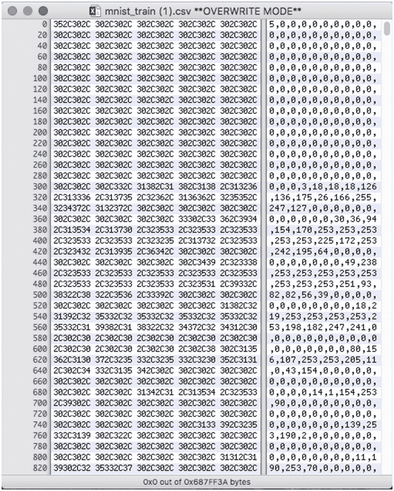

图 5-1

MNIST 训练数据集中第一条记录的一部分

有 784 个字节组成一个图像，因为每个图像已经从 20×20 像素重新缩放到 28×28 像素。每个像素代表一个灰度像素强度，取值范围从 0 到 255，其中 0 表示全黑，255 表示全白。数据库中的每条记录都有 784 个像素值、785 个逗号和 1 个字节的标签值。这些值加起来有 1570 字节。当您考虑到有超过 60，000 条训练记录时，整个数据集的大小大约为 100 MB。即使对于最快的处理器来说，在开发脚本的同时处理这么大的数据集也是一件苦差事，而 RasPi 不属于这一类。幸运的是，MNIST 训练和测试数据集有两个小的子集，可用于开发。这些可从以下网址获得

训练数据集:

`https://raw.githubusercontent.com/makeyourownneuralnetwork/makeyourownneuralnetwork/master/mnist_dataset/mnist_train_100.csv`

测试数据集:

`https://raw.githubusercontent.com/makeyourownneuralnetwork/makeyourownneuralnetwork/master/mnist_dataset/mnist_test_10.csv`

前面描述的所有数据集都是 CSV 格式，其中逗号用于分隔各个数据值。Python 语言包含有用的函数，可以将 CSV 数据以易于使用的数字格式输入到脚本中。下面的代码片段打开一个 CSV 文件，并将内容“读入”一个数据列表。数据列表是一个对象，它有效地存储和检索数据以供脚本快速访问。

```py
dataFile = open('mnist_train_100.csv')
dataList = dataFile.readlines()
dataFile.close()

```

我将前面的代码输入到一个交互式 Python 会话中，以展示这个代码片段是如何工作的。图 [5-2](#Fig2) 显示了交互会话。

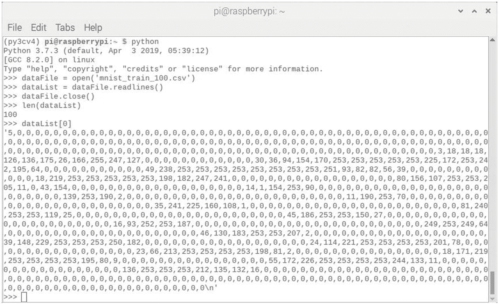

图 5-2

用于数据文件操作的交互式 Python 会话

您应该能够看到数据列表被正确实例化。我还输入了一个长度命令，该命令返回 100。这反映了数据列表中元素的数量，这也是对`mnist_train_100.csv`文件的期望。此外，我显示了第一条记录 dataList [0]的内容，它显示为一系列 1570 个整数，全部用逗号分隔。注意，第一个整数是 5，它对应于记录标签。

您还应该注意在显示的整数的开头和结尾出现的单引号。这表明 Python 认为数据是一个长字符串。虽然它可能显示为数字，但 Python 解释器认为它是一串 ASCII 字符。就在结束单引号之前显示的字符是“\n”。这是“转义”字母 n。在 ASCII 术语中，它代表回车功能，这意味着在解释 ASCII 字符时，将在记录的这一点上创建一个新行。新行字符用作数据集的分隔符。分隔符指示一条记录的停止位置和下一条记录的开始位置。所有 100 条记录都由 list 对象进行索引，这意味着可以随机访问任何特定的记录，而无需读取或写入导致该记录的所有记录。索引从 0 开始，这意味着所有记录的索引范围是 0 到 99。使用 Python 的数组元素符号可以随机访问任何记录。例如，中间或第 50 个元素将被引用为 dataList [49]。

回想一下，在前面的章节中，不管所尝试的数学运算是什么类型，了解你正在处理的数据的性质是很重要的。在这种情况下，直观地查看单个手写记录可以让您深入了解整个问题领域，而这仅仅通过查看数字数据列表是无法获得的。

Matplotlib Python 库将用于提供任何选定数据列表记录的图像。输入以下两个命令，以便将 Matplotlib 库导入到脚本中:

```py
sudo apt-get update
sudo apt-get install python-matplotlib

```

以下脚本将用于查看 100 条记录的 MNIST 训练数据集中的任何记录。该脚本名为 viewRecord.py，可从该书的配套网站获得:

```py
# Import required libraries
import numpy as np
import matplotlib.pyplot as plt

# Create data list
dataFile = open('mnist_train_100.csv')
dataList = dataFile.readlines()
dataFile.close()

# Get the record number
print('Enter record number to be viewed: ', end = ' ')
num = input()

# Get the record
record = dataList[int(num)].split(',')

# Reshape the array for imaging
imageArray = np.asfarray(record[1:]).reshape(28,28)

# Image it as a grayscale
plt.imshow(imageArray, cmap="Greys", interpolation="None")
plt.show()

```

名为 dataList 的对象包含所请求记录中的所有 785 个元素。这些是独立的元素，因为 split 方法是基于逗号分隔符创建它们的。为了成像，必须将`dataList`对象重新成形为 28 x 28 numpy 阵列。数组中的每个值现在将对应于原始图像中所示的像素强度。还要注意，numpy 数组从第二个元素开始，其索引等于 1。这是因为第一个元素是标签，您不希望它包含在图像中。另一个需要注意的是，`imshow`命令中的`Greys`是故意拼错的。我只能猜测一个开源开发者不太熟悉如何正确拼写它。

通过输入以下命令运行脚本:

```py
python3 viewRecord.py

```

记录 0 的结果图像如图 [5-3](#Fig3) 所示。

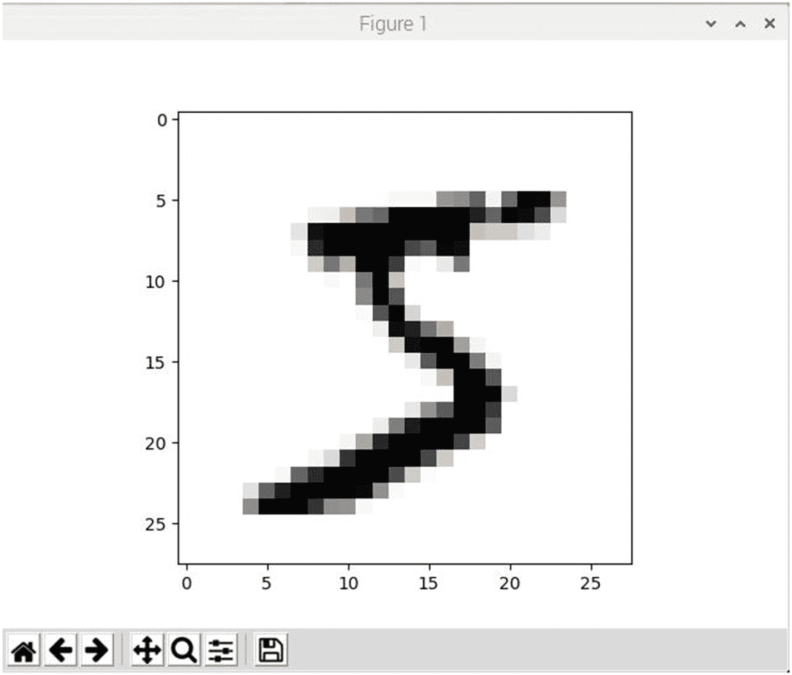

图 5-3

录制 0 图像

该图清楚地显示了一个相当“懒惰”的数字 5 位数绘制。您可以通过检查图 [5-2](#Fig2) 所示的数字记录列表中的第一个元素来确认它应该是数字 5。

在这一点上，您应该能够自如地处理将在项目中使用的数据集。下一节将向您展示如何调整或修改数据集，以便它们与实际的人工神经网络所需的输入数据源兼容。

### 调整输入数据集

在前面的讨论中，已经指出像素值的范围是从 0 到 255。这个范围大大超出了人工神经网络可接受的数据值输入范围。回想一下，在第 4 章中，我讨论了一些关于人工神经网络的问题和局限性。在这一节中，我指出

> 因此，人工神经网络训练数据集应该将 x 值限制在大约-3 到 3 的伪线性范围内。

原因是 s 形函数的限制作用。超过+/- 3 的输入数据值将使函数输出饱和，有效地关闭任何人工神经网络学习功能。在通信电子术语中，这种情况通常被称为超出动态范围。幸运的是，很容易将输入数据值调整到 0.01 到 1.00 的可接受范围内，而不会损失人工神经网络的精度。进行这种调整的 Python 语句是

```py
adjustedRecord = (np.asfarray(record[1:])/255.0 * 0.99) + 0.01

```

我将这个语句添加到我之前运行的交互式 Python 会话中。图 [5-4](#Fig4) 显示了修改后的结果以及互动环节。

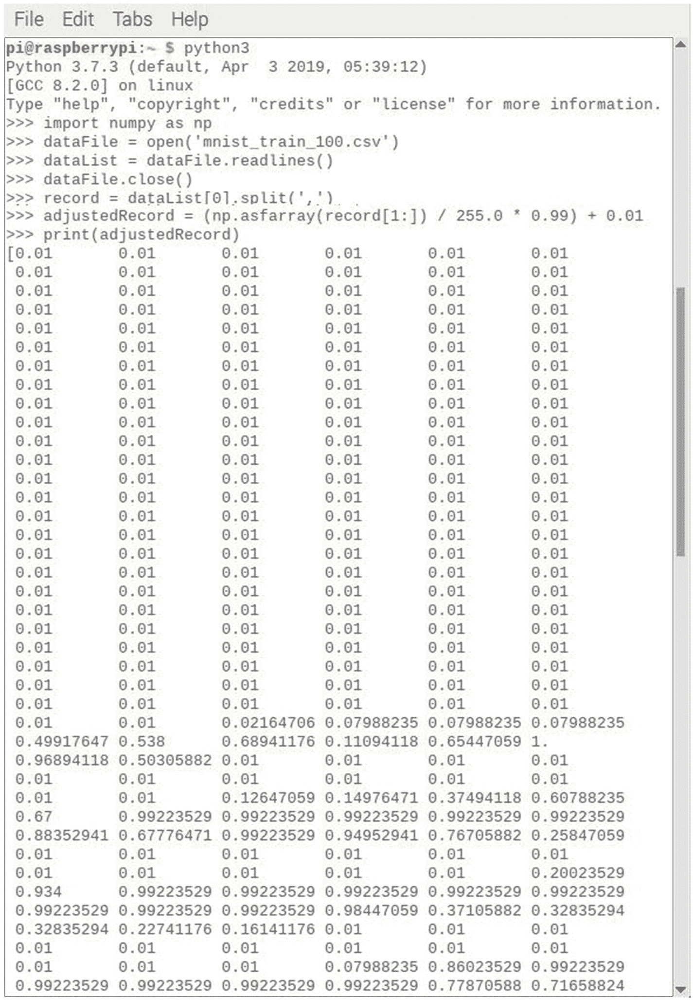

图 5-4

修订了用于数据文件操作的交互式 Python 会话

我将记录调整语句添加到脚本中，以便为输入数据值设置一个可接受的值范围。但是输出数据值呢？接下来我将讨论这个问题。

### 解释人工神经网络输出数据值

我在前面的章节中提到过，人工神经网络做两件事情中的一件。他们要么预测要么分类。本项目中使用的人工神经网络是一种分类类型，因为它的目的是接受一个数字化的手写数字，并将其分为十类，即数字 0 到 9。我刚刚展示了输入数据值现在将如何被调整以保持在 0.01 到 1.00 的范围内。这只能意味着所有人工神经网络输出也必须保持在该范围内。普通人工神经网络中不存在乘法或增益函数，这将产生大于最大输入值的输出值。因此，输出范围将从 0.0 到 1.0。请注意，我将输出范围下限从输入范围下限 0.01 降低到了 0.0。这是因为给定的输出节点完全可能没有输入。实际上，输出层中所有节点的输出总会有一些噪声。您将看到 5 x 10-9 这样的级别，实际上是 0。

问题的答案不在于输出电平可以或应该如何调整，而在于如何解释最终产生的电平。在理想的手写数字识别 ANN 中，当来自训练集的记录 0 被呈现给 ANN 时，输出将如下面的数据向量所示:


实际上，你可能会看到这样的向量


十个数字中有九个接近 0，一个比其余的高得多。认为高值是 ANN“相信”输入图像是 5 的概率是合理的。没有形式上的数理逻辑，可以用来证明这个 ANN 产生了一个真概率，但是大多数从业者接受我对结果的解读。请注意，在其他人工神经网络结构中，可以添加层，这将生成真实概率，但在这个简化的人工神经网络中不会。有时，可能会有一两个更高的类，但低于最大值。这种情况表明 ANN 在对输入进行分类时遇到困难，并且“相信”输入数据模式可能与其他类有某种关联。在这种情况下，只有更多的训练才能缓解这种情况。请记住，训练一个能够做出完美预测或分类的人工神经网络几乎是不可能的。在考虑人类专家时也是如此。没有人能 100%正确地将任何一个手写数字分类。

这个项目开发的下一步是创建一个人工神经网络结构，这对于取得成功的结果至关重要。

### 创建一个进行手写数字识别的人工神经网络

要做的第一个决定是确定要使用的基本人工神经网络结构。我认为三层人工神经网络是最简单也是最有效的设计。不能因为只有一个隐藏层就低估三层人工神经网络。如果发现三层设计表现不佳，总是可以添加额外的隐藏层。本演示中使用的人工神经网络结构使用多层感知器模型。这是因为康奈尔航空实验室的弗兰克·罗森布拉特在 1958 年将用作计算元件的基本人工神经命名为感知器。

创建 ANN 结构的下一步是确定每层中的节点数。在这个应用中，设置输入和输出层节点的数量很容易。输入层必须有 784 个节点来表示每个像素值的输入。输出层必须有十个节点来表示每个可能被识别的类。隐藏层是剩下的一层，必须设置节点号。确定要分配给隐藏层的节点数比设置输入或输出节点的节点数更困难。关于如何设置隐藏层节点数量，我做了大量的研究。有各种各样的“经验法则”来确定这个数字。以下是最常见的几种:

*   使用输入层节点数(N <sub>i</sub> )和输出层节点数(N <sub>o</sub> )的平均值。

*   用 N <sub>i</sub> 乘以 N <sub>o</sub> 的平方根。

*   隐含层节点数(N <sub>h</sub> )应该在 N <sub>i</sub> 和 N <sub>o</sub> 的大小之间。

*   N <sub>h</sub> 应该是 N <sub>i</sub> 加上 N <sub>o</sub> 的三分之二大小。

*   N <sub>h</sub> 应该小于 N <sub>i</sub> 的两倍。

我很快明白，设置 N <sub>h</sub> 是一种试错实验。此时，我希望讨论两个术语，当考虑要实例化多少隐藏层节点时，这两个术语是合适的。第一个是欠拟合，当创建的节点太少时会发生这种情况。拟合不足的症状是 ANN 不能被训练和/或错误率高得不可接受。另一个术语是过度拟合，即节点过剩。在这种情况下，症状包括由于额外的节点，训练从不收敛，以及由于 ANN 对噪声和伪像过于敏感，精度降低的情况。当过度拟合发生时，人工神经网络具有如此多的信息，以至于输入数据集不足以训练隐藏层中的所有节点；此外，训练时间的长度可以急剧增加到一个点，它永远不会停止或收敛，如前所述。设置适当数量的隐藏层节点的最佳目标是避免欠拟合和过拟合。

基于前面的讨论和我的实验，我得出了以下关于设置隐藏层节点数量的结论:

> 三层人工神经网络中的隐层节点数应设置为输出节点数的平方，但不应超过输入和输出层节点数的平均值。

这个指导方针是我之前引用的几个经验法则的混搭。我还有趣地注意到，在设计人工神经网络结构时，似乎经常出现平方关系。当计算设置权重的平均值和计算误差函数斜率时，存在这种关系。10 的输出节点数的平方意味着应该设置 100 个隐藏层节点。给定大尺寸的输入层和相对小尺寸的输出层，该值似乎是合适的。如果人工神经网络表现不佳，可以随时修改 100 这个数字。

既然已经确定了人工神经网络的结构，是时候向您展示初始的训练脚本了。

### 初始人工神经网络训练脚本演示

以下数据实现了一个简短的脚本，该脚本设置了一个 ANN，并使用缩减的 100 条记录的 MNIST 训练数据集对其进行训练。它还没有测试人工神经网络的准确性。这将在讨论完这个脚本之后。这个脚本被命名为 trainANN.py，它使用了在第 [4](4.html) 章中开发的 ANN 类。请重读关于这个类的那一章，因为它是这个脚本的关键部分。该脚本可从该书的配套网站获得:

```py
# Import required libraries
import numpy as np
import matplotlib.pyplot as plt
from ANN import ANN

# Setup the ANN configuration
inode =784
hnode =100
onode =10

# Set the learning rate
lr = 0.2

# Instantiate an ANN object named ann
ann = ANN(inode, hnode, onode, lr)

# Create the training list data
dataFile = open('mnist_train_100.csv')
dataList = dataFile.readlines()
dataFile.close()

# Train the ANN using all the records in the list
for record in dataList:
      recordx = record.split(',')
      inputT = (np.asfarray(recordx[1:])/255.0*0.99) + 0.01
      train = np.zeros(onode) + 0.01
      train[int(recordx[0])] =0.99
      # Training begins here
      ann.trainNet(inputT, train)

```

在运行前面的脚本之前，必须设置几个先决条件。文件 ANN.py 必须与脚本在同一个目录中，mnist_train_100.csv 数据集也必须在同一个目录中。只需输入以下命令来运行脚本:

```py
python trainANN.py

```

如果脚本运行时没有任何错误，则不会显示任何结果，因为其目的只是为了训练 ANN。在继续本演示的下一部分之前，您应该纠正任何错误。

### 人工神经网络测试脚本演示

现在必须测试前一部分中完成的经过训练的 ANN，以评估它在分类手写数字方面的表现如何。要使用的测试数据集是从下载 100 条记录训练数据集的同一网站下载的小 10 条记录集。本次测试将使用 trainANN 脚本的修改版本。我将修改后的 trainANN 脚本重命名为 testANN_short.py，以反映它的新用途，并将其与后续版本区分开来，该版本将采用全尺寸的训练和测试数据集。

该脚本可从该书的配套网站获得:

```py
# Import required libraries
import numpy as np
import matplotlib.pyplot as plt
from ANN import ANN

# Setup the ANN configuration
inode =784
hnode =100
onode =10

# Set the learning rate
lr = 0.2

# Instantiate an ANN object named ann
ann = ANN(inode, hnode, onode, lr)

# Create the training list data
dataFile = open('mnist_train_100.csv')
dataList = dataFile.readlines()
dataFile.close()
# Create the test list data
testDataFile = open('mnist_test_10.csv')
testDataList = testDataFile.readlines()
testDataFile.close()

# Train the ANN using all the records in the list
for record in dataList:
      recordx = record.split(',')
      inputT = (np.asfarray(recordx[1:])/255.0*0.99) + 0.01
      train = np.zeros(onode) + 0.01
      train[int(recordx[0])] =0.99
      # Training begins here
      ann.trainNet(inputT, train)

# Iterate through all 10 test records and display output
# data vectors

for record in testDataList:
      recordz = record.split(',')
      # Determine record's label
      labelz = int(recordz[0])
      # Adjust record values for ANN
      inputz = (np.asfarray(recordz[1:])/255.0*0.99)+0.01
      outputz = ann.testNet(inputz)
      print('output for label = ', labelz)
      print(outputz)

```

与前面的脚本一样，确保文件 ANN.py、mnist_train_100.csv 和 mnist_test_10.csv 数据集与脚本位于同一目录中。输入以下命令运行脚本:

```py
python testANN.py

```

图 [5-5](#Fig5) 显示了运行脚本后的完整结果。为了捕捉所有的结果，我用两张截图做了一个合成图。

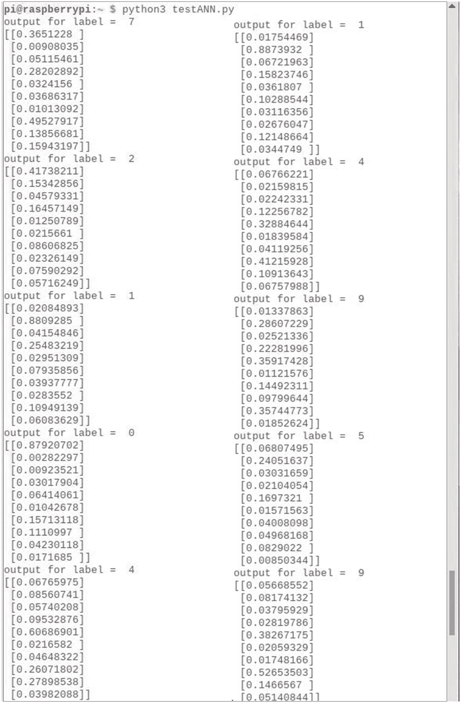

图 5-5

testANN 脚本结果

表 [5-1](#Tab1) 显示的 60%匹配率勉强令人满意；然而，考虑到人工神经网络仅用潜在的 60，000 条可用于训练的记录中的 100 条来训练，这并不奇怪。当遇到明显较大的错误结果时，我也喜欢钻研细节。因此，我修改了 viewResults 脚本来检查未被正确识别的四条记录。我收集并组合了他们的图像，形成图 [5-6](#Fig6) ，以识别任何可能导致错误识别的共同属性。

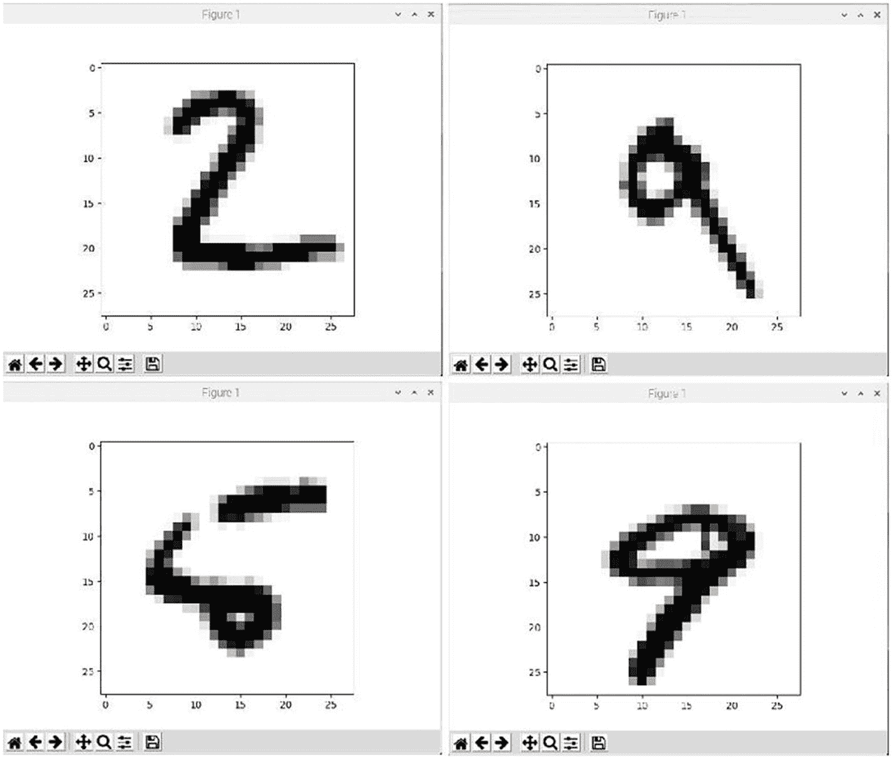

图 5-6

错误识别的手写数字

表 5-1

人工神经网络测试运行的结果

<colgroup><col class="tcol1 align-left"> <col class="tcol2 align-left"> <col class="tcol3 align-left"> <col class="tcol4 align-left"> <col class="tcol5 align-left"> <col class="tcol6 align-left"> <col class="tcol7 align-left"> <col class="tcol8 align-left"> <col class="tcol9 align-left"> <col class="tcol10 align-left"> <col class="tcol11 align-left"></colgroup> 
| 标签 | seven | Two | one | Zero | four | one | four | nine | five | nine |
| **索引** | seven | three | one | Zero | four | one | four | eight | one | four |
| **匹配** | x |   | x | x | x | x | x |   |   |   |

你可以立即看到 ANN 对数字 9 有困难。四幅图像中有两幅是这个数字。左下方的数字 5 写得很糟糕，没有人(机器或人类)能识别它，所以 ANN 就免了。这使得 2 号图像位于左上角。写得很清楚，应该有正确的标识。这些问题的唯一解决方案是进一步训练人工神经网络，除了数字 5 的可能例外。鉴于这个早期实验的结果，我完全可以预期，一个训练有素的人工神经网络将很容易达到 90%以上的准确率。

我还对多次运行 testANN 脚本的结果感兴趣，但不显示输出数据向量，而只显示匹配结果，这是一个准确性指标。因此，我修改了 testANN_short 脚本以适应这些变化，并将其重命名为 testANN_metrics.py。

```py
# Import required libraries
import numpy as np
import matplotlib.pyplot as plt
from ANN import ANN

# Setup the ANN configuration
inode =784
hnode =100
onode =10

# Set the learning rate
lr = 0.2

# Instantiate an ANN object named ann
ann = ANN(inode, hnode, onode, lr)

# Create the training list data
dataFile = open('mnist_train_100.csv')
dataList = dataFile.readlines()
dataFile.close()

# Create the test list data
testDataFile = open('mnist_test_10.csv')
testDataList = testDataFile.readlines()
testDataFile.close()

# Train the ANN using all the records in the list
for record in dataList:
      recordx = record.split(',')
      inputT = (np.asfarray(recordx[1:])/255.0*0.99) + 0.01
      train = np.zeros(onode) + 0.01
      train[int(recordx[0])] =0.99
      # Training begins here
      ann.trainNet(inputT, train)

# Iterate through

all 10 test records and display output
# data vectors
match = 0
no_match = 0
for record in testDataList:
      recordz = record.split(',')
      # Determine record's label
      labelz = int(recordz[0])
      # Adjust record values for ANN
      inputz = (np.asfarray(recordz[1:])/255.0*0.99)+0.01
      outputz = ann.testNet(inputz)
      max_value = np.argmax(outputz)
      if max_value == labelz:
            match = match + 1
      else:
            no_match = no_match + 1
      success = float(match) / float(match + no_match)
print('success rate = {0}'.format(success))

```

通过输入以下命令运行脚本:

```py
python3 testANN_metrics.py

```

图 [5-7](#Fig7) 显示了我连续运行脚本十次后的结果。

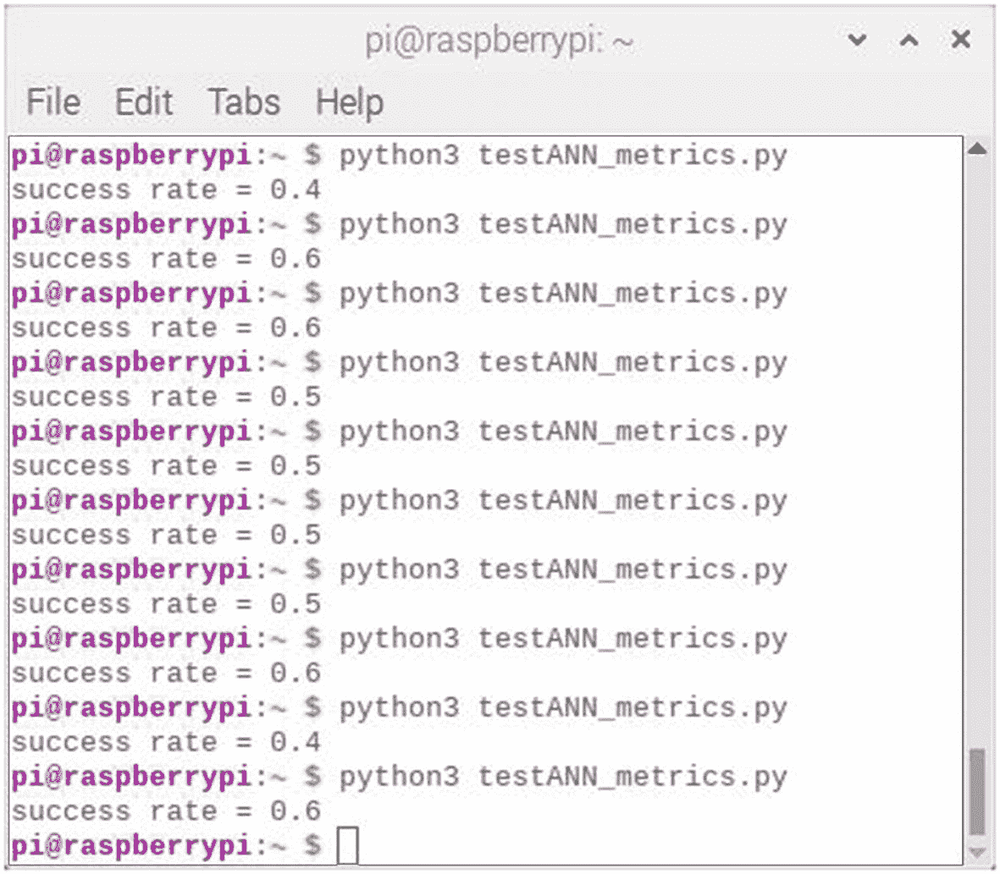

图 5-7

脚本 testANN_metrics 连续十次运行的结果

你应该能看到成功率在 0.4 到 0.6 之间。我计算了所有十个值的平均值，确定平均成功率等于 0.52。这是一个相当差的结果，但正如我前面解释的那样，人工神经网络只使用 60，000 多个可用记录中的 100 个进行了很差的训练。顺便说一句，那些具有 Python 技能的读者可能会奇怪，为什么我没有包含连续十次脚本运行或时期的循环。我没有这样做，因为每次运行都必须重新初始化人工神经网络，否则每次运行都将使用同一个经过训练的人工神经网络，从而产生相同的成功率。重写脚本以适应重新初始化的 ANN 当然是可行的，但是我不想花时间这么做，因为手动重新运行脚本十次要简单得多。

你可能会问为什么每个时代的结果是不同的？答案是初始加权矩阵是使用随机正态分布生成的。因此，有些矩阵比其他矩阵更适合产生更准确的结果。当使用完整的 60，000 个训练记录集训练 ANN 时，这些初始分布变化将消失，这是演示计划中的下一步。

### 使用完整训练数据集的人工神经网络测试脚本演示

您只需对 testANN_metrics 脚本做一点小小的更改，就可以使用完整的训练集。将以下语句从

```py
dataFile = open('mnist_train_100.csv')

```

到

```py
dataFile = open('mnist_train.csv')

```

我没有包括一个新的脚本清单，因为修改很小，很容易做到。然后，您可以使用这十个测试记录重新运行 testANN_metrics 脚本；但是，由于有 60，000 多条培训记录需要处理，因此执行时间会更长。根据 RasPi 处理器的速度，可能需要等待 10 分钟。我运行新修改的脚本，发现只用了 6 分 3 秒就完成了。这是一个惊喜，向我展示了 A-72 ARM、四核、1.5 GHz 处理器在 RasPi 4 中的强大功能。

结果显示 0.9 的成功率，这是我所期望的，因为我考虑的 10 张图片中有一张是无法辨认的。

本演示系列的下一步是使用完整的 10，000 条记录测试数据集运行脚本。同样，这很容易通过修改如下语句来实现

```py
testDataFile = open('mnist_test_10.csv')

```

到

```py
testDataFile = open('mnist_test.csv')

```

同样，我没有包括新的脚本清单，因为修改很小，很容易对现有的脚本完成。然后，您可以使用 10，000 条测试记录重新运行 testANN_metrics 脚本；然而，它将花费比上面更长的时间来完成执行，因为除了用 60，000 条记录进行训练之外，还有 10，000 条测试记录要处理。幸运的是，按记录测试 ANN 比按记录训练 ANN 要快得多。

我重新运行了新修改的脚本，发现只用了 6 分 15 秒就完成了。结果显示成功率为 0.9458，这是我基于之前所有关于完全训练好的人工神经网络的讨论所预期的。这个成功率值通常被认为是一个好的人工神经网络结果。

学习率也会对人工神经网络的准确性产生重大影响。我再次修改了 testANN_metrics 脚本，以测试学习率对准确性的影响。修改包括创建一个循环，将学习率从 0.1 修改为 0.6，同时重新计算成功率。我还认为在任何实际的人工神经网络中设置超过 0.6 的学习率值是不现实的。这一次，修改的幅度很大，我认为包含一个完整的脚本清单是合适的。我还将脚本重命名为 testANN_metrics_lr.py，以指示学习率的变化。该列表可从该书的配套网站获得:

```py
# Import required libraries
import numpy as np
from ANN import ANN

# Setup the ANN configuration
inode =784
hnode =100
onode =10

# Set the initial learning rate
lr = 0.1

# Create the training list data
dataFile = open('mnist_train.csv')
dataList = dataFile.readlines()
dataFile.close()

#  Create the test list data
testDataFile = open('mnist_test.csv')
testDataList = testDataFile.readlines()
testDataFile.close()

# Loop to iterate learning rates from 0.1 to 0.6 in 0.1 steps
for i in range(6):
      # Instantiate an ANN object named ann
      ann = ANN(inode, hnode, onode, lr)

      # Train the ANN using all the records in the list
      for record in dataList:
            recordx = record.split(',')
            inputT = (np.asfarray(recordx[1:])/255.0*0.99) + 0.01
            train = np.zeros(onode) + 0.01
            train[int(recordx[0])] =0.99
            # Training begins here
            ann.trainNet(inputT, train)

      # Iterate through all the test records
      match = 0
      no_match = 0
      for record in testDataList:
            recordz = record.split(',')
            # Determine record's label
            labelz = int(recordz[0])
            # Adjust record values for ANN
            inputz = (np.asfarray(recordz[1:])/255.0*0.99)+0.01
            outputz = ann.testNet(inputz)
            max_value = np.argmax(outputz)
            if max_value == labelz:
                   match = match + 1
            else:
                   no_match = no_match + 1
            success = float(match) / float(match + no_match)

      # Display the learning rate and success rate
      print('lr = {0} success rate = {1}'.format(lr,success))
      lr = lr + 0.1

```

预先警告一下，这个脚本几乎需要一个小时才能完整运行一遍。它通过输入以下命令来运行:

```py
python3 testANN_metrics_lr.py

```

图 [5-8](#Fig8) 显示了我运行脚本后的结果。

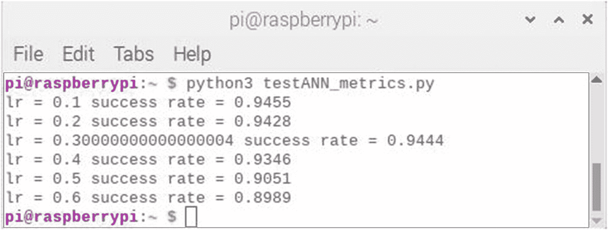

图 5-8

运行 testANN_metrics_lr 脚本后的结果

您应该能够看到，对于范围从 0.1 到 0.6 的学习率，成功率范围分别从 0.9456 到 0.8989。随着学习速率的增加，人工神经网络的精度大大降低。这是因为没有达到全局最小值，因为梯度下降算法步骤的数量在增加。如果你对这一过程感到困惑，我建议你重读第 [4](4.html) 章中的相关章节，以使自己对学习率和梯度下降算法的关系有所了解。我认为我为初始测试运行选择的 0.2 的学习率是最佳的，因为 0.9458 的成功率比这次运行中记录的任何成功率都高。然而，实际的成功率差异微乎其微，可能与随机变化有关。在任何情况下，0.1 或 0.2 的学习率对于这个 ANN 来说都是理想的。

如果您将演示复制到这一点，现在您将拥有一个性能良好的 ANN。任何准确率约为 95%的人工神经网络通常被认为是高性能的。我建议继续试验这种人工神经网络，比如改变隐藏节点的数量，看看它对网络性能有什么影响。

接下来的一系列演示将在这个人工神经网络的基础上进行扩展，加入一个 Pi 摄像头来实现实时数字识别。

### 识别您自己的手写数字

这是前面演示的自然延伸，您可以尝试自己的手写数字识别，而不是依赖存储的示例。使用 Pi 摄像机可以轻松实现这一功能，Pi 摄像机是一种专门设计用于与 RasPi 无缝协作的摄像机。Pi Camera 接口已经被合并到所有最新版本的 Raspbian Linux 发行版中。所需要做就是激活它，我将很快讨论这一点。但首先，您需要了解如何安装硬件。

#### 安装 Pi 摄像机

我将讨论如何在 RasPi 4 上安装 Pi 相机的版本 2。这些说明也适用于 RasPi 2 和 3 版本。图 [5-9](#Fig9) 显示了 Pi 摄像机，版本 2，将在接下来的几个演示中使用。

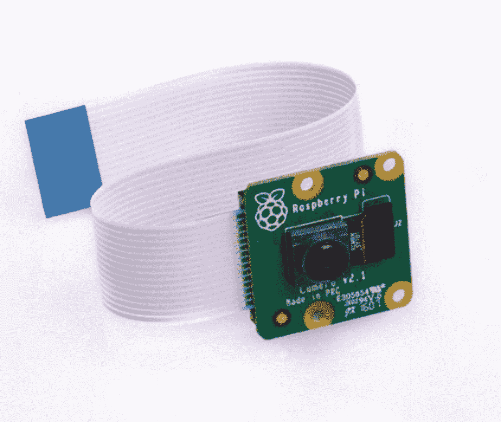

图 5-9

Pi 摄像机，版本 2

这款相机的规格令人印象深刻，因为它体积小巧，成本低廉。我将关键规格总结如下:

*   800 万像素原生分辨率、高质量索尼 IMX219 图像传感器

*   最大静态照片分辨率为 3280 x 2464 像素

*   以 1080p30、720p60 和 640x480p90 分辨率拍摄视频

*   Raspbian 操作系统最新版本支持的所有软件

*   光学尺寸为 1/4 英寸

*   广角镜头，范围从 4 英寸到无限远

相机带有一根短的柔性带状电缆，插入 RasPi 上 RJ45 插座正后方的相机串行接口(CSI)插座。图 [5-10](#Fig10) 显示了 CSI 插座在 RasPi 上的位置。

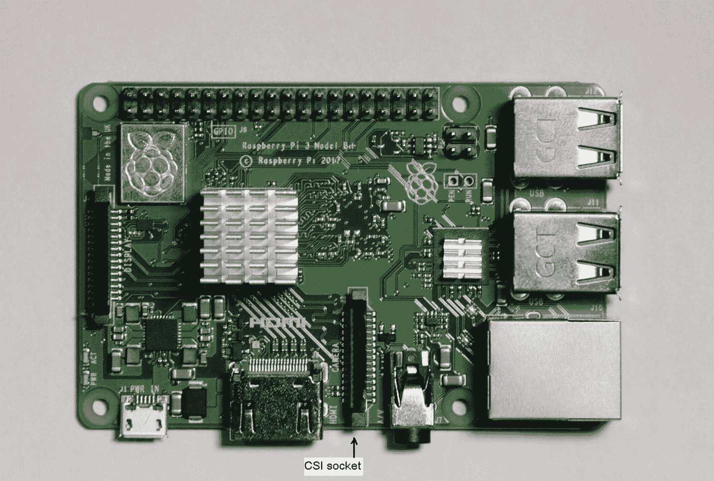

图 5-10

CSI 插座位置

请注意，RasPi 2、3 和 4 型号上还有另一个类似的插座。那个是显示器串行接口(DSI)插座。你可能会不小心把相机线插到那个插座上，但不会造成任何损害。这台照相机根本就不能工作。

要将摄像机电缆插入 CSI 插座，您必须小心地直接拉起细长塑料棒两侧的两个黑色塑料片。非常小心，因为塑料棒很脆弱，过度用力很容易折断。塑料棒会变松，但提起时仍与插座相连。

接下来，小心地将柔性电缆插入插座，露出的银色手指触点背向 RJ45 连接器。带状电缆上的蓝色背衬现在应该面向 RJ45 连接器。确保电缆牢固地固定在插座的底部，并且电缆垂直于电路板，没有倾斜。接下来，轻轻按下黑色塑料卡舌，将电缆锁定到位。只是用一个坚定，但温和的压力锁定电缆。

请注意，当移动或重新定位 RasPi 时，电缆可能会移位。如果发生这种情况，操作系统将开始报告奇怪的错误，它无法加载某些驱动程序或你应该启用相机。在追查这些错误之前，我总是检查摄像机电缆是否正确插入。图 [5-11](#Fig11) 显示了正确插入的摄像机电缆。

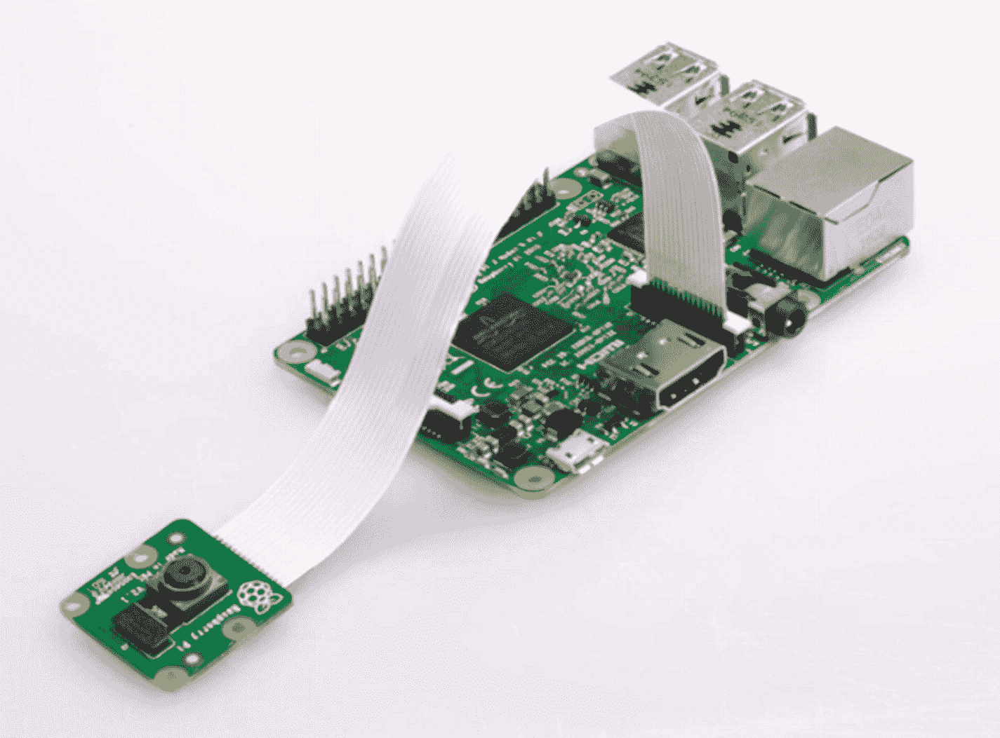

图 5-11

正确插入摄像机电缆

接下来，您需要安装一些额外的软件包，以便在演示中使用摄像机。

#### 安装 Pi 摄像头软件

首先要做的是在 Raspbian 操作系统中启用摄像头。这是使用 raspi-config 实用程序完成的。通过输入以下命令启动该实用程序:

```py
sudo raspi-config

```

图 [5-12](#Fig12) 显示了输入该命令后的初始菜单。选择 5 个接口选项，这将安装 Pi 摄像机的所有驱动程序。初始选择启用相机驱动程序后，会出现一个后续屏幕。

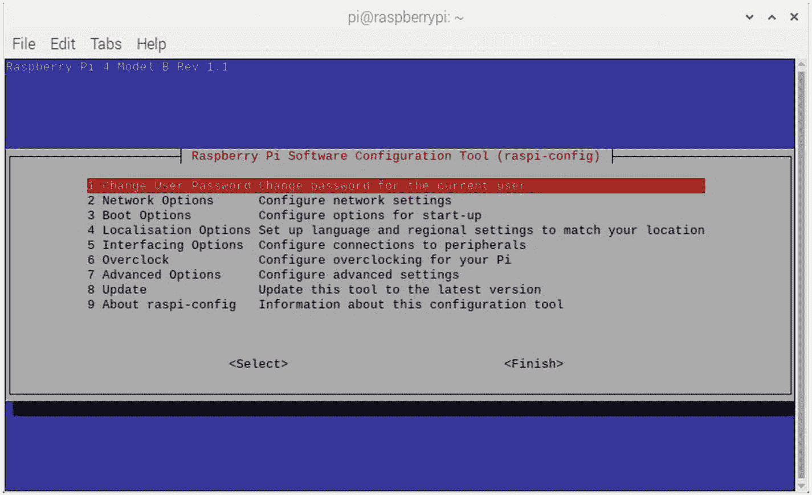

图 5-12

raspi-配置菜单屏幕

一旦相机被启用，你将需要安装一些额外的软件。输入以下命令安装 Python picamera 库:

```py
sudo apt-get update
sudo apt-get install python-picamera

```

您需要安装 Pillow 包，它包含 Python 图像库(PIL)。输入以下命令:

```py
sudo apt-get install python-pillow

```

这就是开始演示所需安装的所有软件。

#### 手写数字识别演示

您应该尝试的第一个操作是测试 Pi 摄像机的安装。输入以下命令:

```py
raspistill -t 5000

```

你应该看到一个全高的彩色视频在你的监控器上显示 5 秒钟，不管摄像机指向哪里。由于长宽比的原因，宽度不会完全扩展到监控器宽度；但是，如果您看到实时图像，您可以确信 Pi 摄像机工作正常。如果没有图像显示，我会重新检查相机电缆连接，以确保它们是适当和正确的。根据我的经验，至少 95%的硬件问题都与电气连接有关。

如果您通过了第一项检查，您就可以使用 Pi 摄像头进行手写数字识别的初步演示了。

你需要做一个目标来成像。我建议使用 3 x 5 的白色卡片纸和一个黑色的尖尖记号笔来书写。白色卡片上的标记将为数字成像提供良好的对比。不推荐在纸上使用钢笔或铅笔，因为没有足够的对比度来定义与用于训练 ANN 的图像一致的图像。请记住，如果人工神经网络呈现的是未经训练识别的图像，它就无法正确执行。图 [5-13](#Fig13) 显示我的目标手写数字。


图 5-13

目标手写数字

该图是使用以下命令制作的:

```py
raspistill -o zerobw.jpg

```

在图像的形式适于输入到人工神经网络进行数字识别之前，需要对其进行预处理。这个预处理将是我用来处理这个图像的修改过的 testANN 脚本的一部分。我将修改后的脚本重新命名为 testANN_Image.py，它可以从本书的配套网站上获得。

```py
# Import required libraries
import numpy as np
import matplotlib.pyplot as plt
from ANN import ANN
import PIL
from PIL import Image

# Setup the ANN configuration
inode = 784
hnode = 100
onode = 10

# Set the learning rate
lr = 0.1

# Instantiate an ANN object named ann
ann = ANN(inode, hnode, onode, lr)

# Create the training list data
dataFile = open('mnist_train.csv')
dataList = dataFile.readlines()
dataFile.close()

# Train the ANN using all the records in the list
for record in dataList:
      recordx = record.split(',')
      inputT = (np.asfarray(recordx[1:])/255.0*0.99) + 0.01
      train = np.zeros(onode) + 0.01
      train[int(recordx[0])] = 0.99
      # Training begins here
      ann.trainNet(inputT, train)

# Create the test list data from an image
img = Image.open('zerobw.jpg')
img = img.resize((28,28), PIL.Image.ANTIALIAS)

# Read pixels into list
pixels = list(img.getdata())

# Convert into single values from tuples
pixels = [i[0] for i in pixels]

# Save to a temp file named test.csv with comma delimiters
imgTmp = np.array(pixels)
imgTmp.tofile('test.csv', sep=',')

# Open the temp file and read into list
testDataFile = open('test.csv')
testDataList = testDataFile.readlines()
testDataFile.close()

# Iterate through all list elements
for record in testDataList:
      recordx = record.split(',')
      # Adjust record values for ANN
      input = (np.asfarray(recordx[0:])/255.0*0.99)+0.01
      output = ann.testNet(input)

# Display output data vector
print(output)

```

以下注释适用于脚本中的修改，以预处理使用 Pi 摄像机采集的图像。

```py
import PIL
from PIL import Image

```

使用 Python 处理采集的图像需要 Python 图像库(PIL)及其子库图像。

```py
img = Image.open('zerobw.jpg')
img = img.resize((28,28), PIL.Image.ANTIALIAS)

```

第一个命令加载文件，该文件被硬编码到脚本中。然后，加载的图像被调整为 28×28 像素大小的图像。`ANTIALIAS`参数确保在缩小操作过程中不会产生工件。

```py
pixels = list(img.getdata())

```

该命令将 784 个像素值转换成一个名为`pixels`的列表。

```py
imgTmp = np.array(pixels)
imgTmp.tofile('test.csv', sep=',')

```

这些命令将列表转换成一个名为`imgTmp`的数组。这个数组然后被转换成一个逗号分隔的数组，这个数组随后被存储到一个名为`test.csv`的文件中。

我通过输入以下命令来运行这个脚本:

```py
python3 testANN_image.py

```

该脚本运行时间超过 6 分钟，这是意料之中的，因为所有 60，000 条记录都用于训练人工神经网络。结果如图 [5-14](#Fig14) 所示。

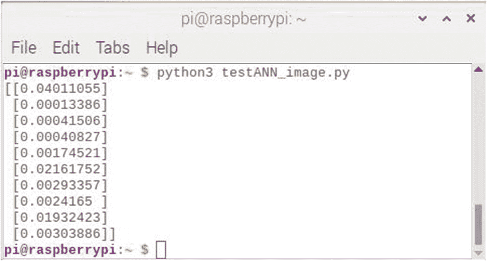

图 5-14

运行 testANN_image 脚本的结果

结果清楚地表明，第 0 个指数具有最高值，这意味着 ANN 将输入图像分类为 0，这是正确的结果。

最后一个演示花费了相当大的努力，目的是向您展示一个 RasPi 控制的摄像头和一个训练有素的人工神经网络可以识别手写数字。

## 基于 Keras 的手写数字识别

除了我刚才演示的相对简单的方法之外，还有许多技术可以用来识别手写数字。使用 Keras ANN 完全有可能达到 95%以上的准确率。但是现在，我必须解释 Keras 是什么，以及它如何用于这个应用。

### Keras 简介

Keras 是一个用 Python 编写的开源神经网络库，运行在 Theano、CNTK 或 TensorFlow 后端之上。它是由谷歌工程师 Franç ois Chollet 设计和开发的，模块化，快速，易于使用。

Keras 是一个高级 API，用于制作模型、定义层和/或建立多个输入输出模型。Keras 还利用损失和优化功能来编译网络模型。也有一个适合功能可用的训练过程。

Keras 不处理低级 API 函数，如制作计算图、创建张量或其他变量，因为这些函数被归入后端引擎，即 TensorFlow、CNTK 或 Theano。

在 Keras 中，神经层、成本函数、优化器、初始化方案、激活函数和正则化方案是独立的模块，它们可以组合起来创建新的模型。新的模块很容易添加，新的类和函数也是如此。所有模型都是在常规 Python 代码中定义的，不需要使用单独的模型配置文件。

如前所述，Keras 不做低级运算，比如张量积和卷积。相反，它依赖于后端引擎。虽然 Keras 支持多个后端引擎，但它的主要(也是默认)后端是 TensorFlow，它的主要企业支持者是 Google。Keras API 在 TensorFlow 中打包为`tf.keras`，从 2019 年初开始成为主要的 TensorFlow API。

### 安装 Keras

Keras 应该安装在 Python 虚拟环境中，最好是支持 OpenCV 的虚拟环境。以下命令将安装 TensorFlow 和 Keras 的最新版本。在撰写本文时，TensorFlow 后端的最新版本是 2.0，Keras 的最新版本是 2.2.4。

实例化虚拟环境并输入以下命令来安装 TensorFlow:

```py
pip install tensorflow

```

接下来，输入以下命令来安装 Keras:

```py
pip install keras

```

请注意，使用 pip 软件包管理器安装的 TensorFlow 版本是 1.13，而不是 2.0。这是因为在撰写本文时，2.0 版本仍被归类为测试版，显然负责 pip 库的人不想发布测试版。无论如何，这个 TensorFlow 版本在所有的书籍演示中都运行得相当好。

接下来，确保虚拟环境中安装了以下 Python 依赖项:

*   数组

*   我的天啊

*   Matplotlib

此时，可以使用 Keras 创建一个相对简单的多层感知器(MLP)模型。

### 下载数据集并创建模型

本节的第一步是向您展示如何下载完整的 MNIST 数据集。Keras 深度学习库为加载 MNIST 数据集提供了一种便捷的方法。以下语句加载完整大小的训练数据集和测试数据集:

```py
(X_train, y_train), (X_test, y_test) = mnist.load_data()

```

我将在代码清单后用注释的方式分章节介绍 Python 脚本。

```py
# Import required Keras libraries
from keras.datasets import mnist
from keras.models import Sequential
from keras.layers import Dense
from keras.utils import np_utils
import numpy as np

```

该代码导入将用于构建人工神经网络和 MNIST 数据集的 Keras 模块。Numpy 也是导入的。

```py
# Set a random seed
seed = 42
np.random.seed(seed)

```

初始化一个随机数生成器，确保人工神经网络的结果是可重复的。

```py
# Load the MNIST dataset into training and test datasets.
(X_train, y_train), (X_test, y_test) = mnist.load_data()

```

加载定型数据集和测试数据集。

```py
# Flatten the 28 x 28 image into a 784 element input data vector
num_pixels = X_train.shape[1] * X_train.shape[2]
X_train = X_train.reshape(X_train.shape[0], num_pixels).astype('float32')
X_test = X_test.reshape(X_test.shape[0], num_pixels).astype('float32')

```

此代码部分将 3D 数据集转换为 1D 数据矢量。使用 4 字节数据浮点值有助于减少内存使用。

```py
# Normalize data input values from 0 - 255 to 0 -1.0.
X_train = X_train / 255.0
X_test = X_test / 255.0

```

这个代码只是调整像素强度的另一种方式，像素强度的范围从 0 到 255 到人工神经网络所需的 0 到 1.0。

```py
# One hot encoding of the categorical outputs
y_train = np_utils.to_categorical(y_train)
y_test = np_utils.to_categorical(y_test)
num_classes = y_test[1]

```

一种热门的编码是将分类变量表示为二进制向量。它应该总是用于编码具有类别或类作为输出的 ANN 输出，即使在输出是数字的情况下也是如此。

这种编码首先要求将分类值映射到整数值。然后，将每个整数值表示为一个二进制向量，即除了整数的索引(用 1 标记)之外的所有零值。

下面的例子应该有助于澄清这个概念:

假设有一系列值为“红色”和“绿色”的标签

将整数值 0 赋给“红色”，将整数值 1 赋给“绿色”。只要把这些数字赋给这些标签，就叫整数编码。一致性很重要，以便以后可以反转编码，并从整数值恢复标签。

接下来，创建一个二进制向量来表示每个整数值。对于 2 个可能的整数值，向量的长度为 2。编码为 0 的“红色”标签将用二进制向量[1，0]表示，其中第 0 个索引用值 1 标记。反过来，编码为 1 的“绿色”标签将用二进制向量[0，1]来表示，其中索引 1 等于 1。

因此，如果序列是

*   "红色" "红色" "绿色"

它可以用下面的整数编码来表示

*   0, 0, 1

和一个热编码

*   [1, 0]

*   [1, 0]

*   [0, 1]

初学者经常问的一个问题是，为什么要为一个热门编码而烦恼呢？答案是，机器学习算法不能直接处理分类数据。类别必须转换成数字。对于分类的输入和输出变量都是如此。

有时，整数编码可以直接应用，并根据需要重新调整。这可能适用于类别和整数值之间存在自然顺序关系的问题，例如温度标签“冷”、“暖”和“热”当没有顺序关系时，问题就出现了，并且允许这种表示存在对于 ANN 学习的发生可能是有问题的。考虑如何处理“狗”和“猫”这样的标签。

```py
# Baseline model definition
def baseline_model():
      # Create model
      model = Sequential()
      model.add(Dense(num_pixels, input_dim=num_pixels, kernel_initializer="normal", activation="relu"))
      model.add(Dense(num_classes, kernel_initializer="normal", activation="softmax"))
      # Compile model
      model.compile(loss='categorical_crossentropy', optimizer="adam", metrics=['accuracy'])
      return model

```

这是定义 ANN 并编译它的代码部分。ANN 定义采用方法的形式，允许在需要时调用以进一步完善模型。定义中有一个隐藏层，使用了一个“`relu`”激活函数。ReLU 是整流线性单元的缩写，是深度学习模型中最常用的激活函数。如果该函数接收到任何负输入，则返回 0。对于实际输入，它根据以下等式返回值:


从图形上看，该函数如图 [5-15](#Fig15) 所示。

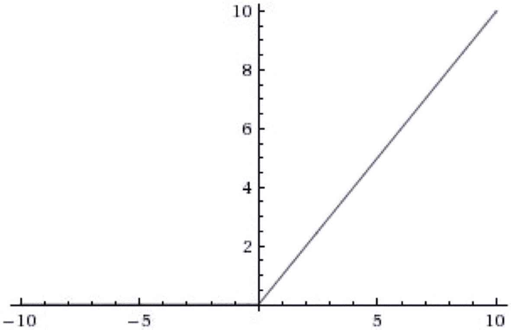

图 5-15

ReLU 情节

令人惊讶的是，这样一个简单的函数(以及由两个线性部分组成的函数)将允许一个模型如此好地考虑非线性和相互作用。但是 ReLU 函数在大多数应用中工作得很好，因此它被广泛使用。

最后一层使用“softmax”激活功能。softmax 函数，也称为`softargmax`或`normalized exponential function`，是一个将 K 个实数向量作为输入并将其归一化为由 K 个概率组成的概率分布的函数。也就是说，在应用 softmax 之前，一些向量分量可能是负的或大于 1，并且可能总和不为 1；但是在应用 softmax 之后，每个分量将处于 [*区间*](https://en.wikipedia.org/wiki/Interval_%2528mathematics%2529) 0 到 1，并且所有分量加起来为 1，因此它们可以被解释为概率。此外，较大的输入分量将对应于较大的概率。因此，softmax 函数通常用作人工神经网络中的激活函数，将网络的非归一化输出映射到所有预测输出类别的概率分布。

此代码部分中的最后一条语句编译模型。在训练模型之前需要编译。该模型在编译期间根据三个参数进行配置:

*   损失函数——这是模型试图最小化的目标。可以是已有损失函数的字符串标识符(如`categorical_crossentropy`或`mse`)，也可以是目标函数。

*   优化器——这可以是现有优化器的字符串标识符(如`adam`、`rmsprop`或`adagrad`)或优化器类的实例。

*   度量列表——对于任何分类问题，该参数将被设置为`metrics=['accuracy']`。指标可以是现有指标的字符串标识符，也可以是自定义指标函数。

```py
# Run the demo
model = baseline_model()
model.fit(X_train, y_train, validation_data=(X_test, y_test), epochs=10, batch_size=200, verbose=2)
# Final evaluation
scores = model.evaluate(X_test, y_test, verbose=0)
print('Baseline error: %.2f%%'%(100-scores[1]*100))

```

最后的代码部分是驱动程序代码，它用 MNIST 数据集测试新的人工神经网络。名为`model`的模型首先被实例化，然后使用 Keras fit 函数进行训练。然后通过调用 Keras `evaluate`方法生成一个分数元组。测试持续 10 个时期，最终结果显示了最终的人工神经网络精度。

带注释的完整脚本显示在以下数据中。我将这个脚本命名为 kerasTest.py，它可以从本书的配套网站上获得。

```py
# Import required libraries
import numpy as np
from keras.datasets import mnist
from keras.models import Sequential
from keras.layers import Dense
from keras.utils import np_utils

# Random seeding
seed = 42
np.random.seed(seed)

# Load MNIST data
(X_train, y_train), (X_test, y_test) = mnist.load_data()

# Flatten the 28 x 28 image
num_pixels = X_train.shape[1] * X_train.shape[2]
X_train = X_train.reshape(X_train.shape[0], num_pixels).astype('float32')
X_test = X_test.reshape(X_test.shape[0], num_pixels).astype('float32')

# Normalize inputs from 0-255 to 0-1
X_train = X_train / 255.0
X_test = X_test / 255.0

# One hot encoding
y_train = np_utils.to_categorical(y_train)
y_test = np_utils.to_categorical(y_test)
num_classes = y_test.shape[1]

# Define baseline model

def baseline_model():
      # Create model
      model = Sequential()
      model.add(Dense(num_pixels, input_dim=num_pixels, kernel_initializer="normal", activation="relu"))
      model.add(Dense(num_classes, kernel_initializer="normal", activation="softmax"))
      # Compile model
      model.compile(loss='categorical_crossentropy', optimizer="adam", metrics=['accuracy'])
      return model

# Run the demo
model = baseline_model()
model.fit(X_train, y_train, validation_data=(X_test, y_test), epochs=10, batch_size=200, verbose=2)

# Final evaluation
scores = model.evaluate(X_test, y_test, verbose=0)
print('Baseline error: %.2f%%'%(100-scores[1]*100))

```

应该使用以下命令在虚拟环境中运行该脚本:

```py
python kerasTest.py

```

该脚本确实需要一些时间来完成，因为它不仅使用完整的 60，000 个 MNIST 训练数据集来训练模型，还重复 10 次或 10 个时期的 10，000 个测试记录测试。最终结果如图 [5-16](#Fig16) 所示。

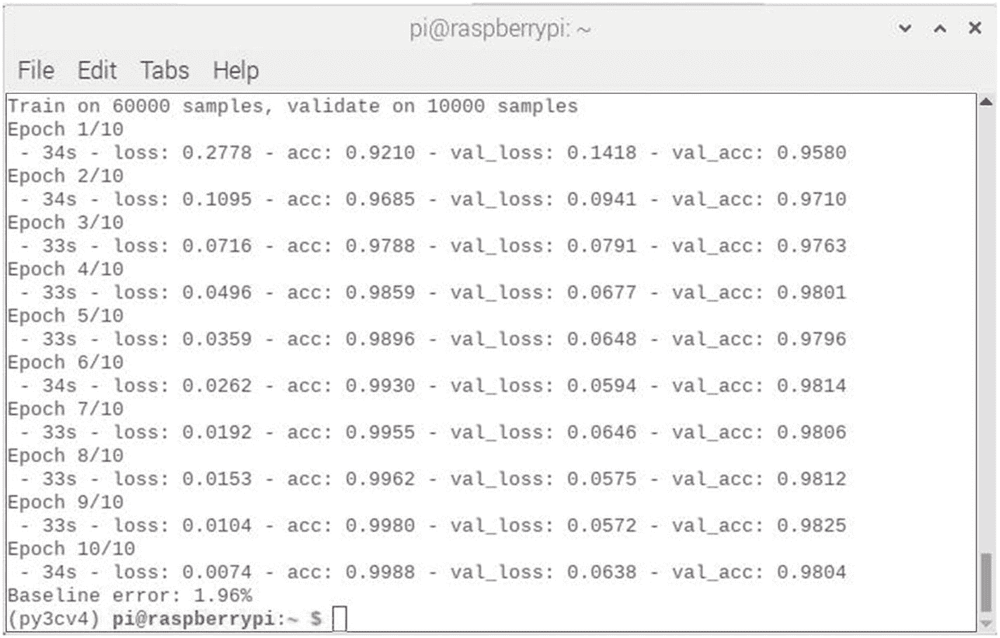

图 5-16

运行 kerastase 脚本后的最终结果

这个使用 Keras 实现并在 TensorFlow 2 后端运行的非常简单的网络实现了略高于 98%的出色准确性。这比我之前的 MLP 模型高出了三个百分点。然而，信不信由你，使用更高级的算法甚至有可能达到稍高的精度，这我将在下一章讨论。