# 1.无服务器技术简介

我们将创建一个非常简单的 Flask web 应用程序(图 [1-1](#Fig1) )，在接下来的四个部分中，当我们探索来自 Amazon AWS、Google Cloud、Microsoft Azure 和 Python Anywhere 的基于云的服务时，我们将重用这个应用程序。


图 1-1

瓶

在冒险进入云之前，在本地机器上运行本地版本的网站是一个好主意。

### 注意

进入 [`www.apress.com/9781484238721`](http://www.apress.com/9781484238721) 并点击源代码按钮，下载第 [1 章](01.html)的文件。打开 Jupyter 笔记本" **chapter1.ipynb** "跟随本章内容。

## 简单的本地烧瓶应用程序

本节中的代码非常简单，您可以从头开始编写，也可以使用文件夹“**simple-local-flask-application**中的文件

### 第一步:基本的“你好，世界！”例子

让我们直接从官方的 Flask 帮助文档中创建一个非常简单的 Flask 脚本(清单 [1-1](#PC1) )。

```py
from flask import Flask
app = Flask(__name__)

@app.route("/")
def hello():
    return "Hello World!"

Listing 1-1Simple Flask Script

```

就是这样！尽管这并没有做太多，但它代表了启动和运行 Flask 网站所需要的最基本的东西；它是一个真正的 web 应用程序。将脚本保存为本地机器上的“ **main.py** ”(您可以随意命名)。

### 步骤 2:启动虚拟环境

使用虚拟环境将您的开发工作与您的机器的其余部分隔离开来总是一个好主意(这在构建" **requirements.txt** "文件`—`时也很方便，参见简介中关于"**创建' requirements.txt '文件**"的部分)。让我们开始一个虚拟环境(清单 [1-2](#PC2) )。

```py
$ python3 -m venv simple_flask
$ source simple_flask/bin/activate

Listing 1-2Starting a Virtual Environment

```

### 第三步:安装烧瓶

安装烧瓶。这假设您可以运行" **pip3** "来安装库；否则，使用您通常用于 Python 3.x 的任何安装工具，或者查看官方的 Flask 文档。<sup>1[1](#Fn1)T5】见清单 [1-3](#PC3) 。</sup>

```py
$ pip3 install Flask

Listing 1-3Install Flask

```

### 步骤 4:运行 Web 应用程序

打开一个命令/终端窗口，在 Mac 或 Windows 上输入以下命令(清单 [1-4](#PC4) 和 [1-5](#PC5) )。

```py
$ export FLASK_APP=main.py
$ flask run

Listing 1-4On the Mac

```

```py
$ export FLASK_APP= main.py
$ python -m flask run

Listing 1-5On Windows

```

### 步骤 5:在浏览器中查看

您应该在命令窗口中看到下面的消息，提供了一个本地的" **HTTP** "地址。将其复制并放入浏览器的地址栏中(列表 [1-6](#PC6) )。

```py
manuel$ export FLASK_APP=main.py
manuel$ flask run
 * Serving Flask app "main.py"
 * Environment: production
   WARNING: Do not use the development server in a production environment.
   Use a production WSGI server instead.
 * Debug mode: off
 * Running on http://127.0.0.1:5000/ (Press CTRL+C to quit)

Listing 1-6Flask Application Successfully Running on Local Machine

```

然后打开浏览器，复制/粘贴(或键入)列出的本地地址(图 [1-2](#Fig2) )。

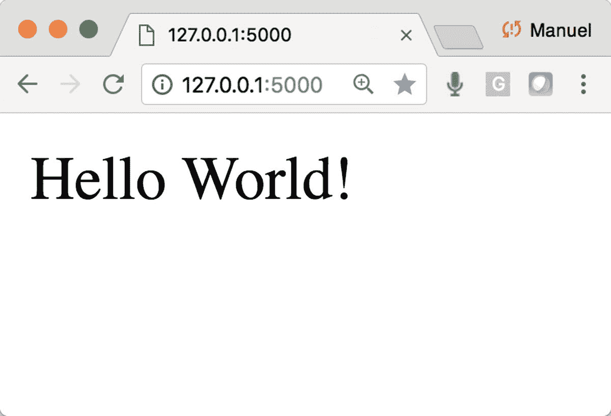

图 1-2

本地烧瓶应用程序按预期运行

### 第六步:稍微快一点的方法

这就是了，一个真正的服务器生成的网页。有一种更简单的方法可以让你的 Flask 应用程序在本地启动和运行，方法是在你的“ **main.py** ”脚本的末尾添加下面两行。这仅在本地模式下有效，但允许脚本本身运行实例化的 Flask 应用程序，并允许您跳过导出步骤(清单 [1-7](#PC7) )。

```py
if __name__ == '__main__':
    app.run(debug=True)

Listing 1-7Automatically Starting Flask Scripts in Local Mode

```

保存修改后的“ **main.py** ”脚本，它应该看起来像清单 [1-8](#PC8) 。

```py
from flask import Flask
app = Flask(__name__)

@app.route("/")
def hello():
    return "Hello World!"

if __name__=='__main__':
        app.run(debug=True)

Listing 1-8Full Flask Script

```

回到您的命令/终端窗口，指向修改后的脚本并输入较短的版本(清单 [1-9](#PC9) )。

```py
$ python3 main.py

Listing 1-9Easier Command to Start Local Flask Script

```

### 第七步:全部关闭

停止 web 应用程序服务于" **Hello World！在你的终端窗口中点击 **ctrl-c** 。**

我们在脚本的最后一行将“ **debug** 标志设为 true。这将把脚本中的任何 Flask 错误直接打印到浏览器中。对于快速开发和调试脚本来说，这是一个很好的特性，但是记住在把它转移到云中之前，要把它设置为 false。

最后，终止您的虚拟环境(清单 [1-10](#PC10) )。

```py
$ deactivate

Listing 1-10Closing the Virtual Environment

```

## 介绍 Microsoft Azure 上的无服务器托管

Azure Cloud 为 web 应用程序提供了一个易于使用、无服务器和完全托管的平台，提供了大量可定制的选项，从存储到数据库、监控和分析(图 [1-3](#Fig3) )。


图 1-3

微软 Azure

让我们看看如何在微软 Azure 的无服务器 web 应用上运行我们的基本 Flask 应用。这里，我们将尽可能保持步骤简单，因为我们将在后续章节中更深入地研究这个提供者。

### 注意

进入 [`www.apress.com/9781484238721`](http://www.apress.com/9781484238721) 点击源代码按钮，下载第 [1 章](01.html)的文件，打开“**server less-hosting-on-Microsoft-azure**文件夹。

### 第一步:在 Microsoft Azure 上获得一个帐户

你需要一个微软 Azure 账户，在撰写本文时，微软提供了 200 美元的所有服务 30 天试用和 12 个月访问。更多信息请参见: [`https://azure.microsoft.com/en-us/free/`](https://azure.microsoft.com/en-us/free/) 。

### 步骤 2:下载源文件

将本章的文件下载到您的本地机器上，并导航到名为“**server less-hosting-on-Microsoft-azure**的文件夹您的本地文件夹结构应该如下所示(注意 Flask 脚本的名称“ **main.py** ”，Azure 上的默认名称；清单 [1-11](#PC11) )。

```py
serverless-hosting-on-microsoft-azure/
├── main.py
├── ptvs_virtualenv_proxy.py
├── requirements.txt
└── web.3.4.config

Listing 1-11All Files Needed for Our Web Application on Azure

```

#### 支持文件

“ **requirements.txt** ”文件包含 web 应用程序需要的 Python 库名称，在应用程序部署期间由无服务器云使用。你可以创建你自己的" **requirements.txt** "并把它放在与 Flask 脚本" **main.py** "相同的文件夹中在这种情况下，它只包含一个库和一个版本需求(清单 [1-12](#PC12) )。

```py
Flask>=0.12

Listing 1-12All Files for our Web Application

```

“ **web.3.4.config** ”是 web 服务器的配置文件。我们将使用 Python 3.4 版本并使用默认值。如果你决定进一步探索这个云提供商，那么一定要打开它，看看里面。

### 步骤 3:安装 Git

对于这个项目，您需要在本地机器上安装 Git(您可以在 [`www.git-scm.com/downloads`](https://www.git-scm.com/downloads) 找到安装二进制文件)。如前所述，Git 是一个源代码版本管理工具，它是一个完全准备好的 Git 包，我们将把它推出给 Microsoft Azure(参见简介部分中关于 Git 的简要介绍)。在大多数章节中，我们会创建一个虚拟环境来运行以下步骤，但由于这已经是一个大项目，我们将保持简单并跳过它。

打开你的终端/命令行窗口，指向本章的“**server less-hosting-on-Microsoft-azure**”文件夹，初始化一个 Git 会话(清单 [1-13](#PC13) )。

```py
$ git init

Listing 1-13Initialize a Git Session

```

接下来，从“**server less-hosting-on-Microsoft-azure**”文件夹添加所有 web 应用程序文件，并检查其状态(列表 [1-14](#PC14) 和图 [1-4](#Fig4) )。

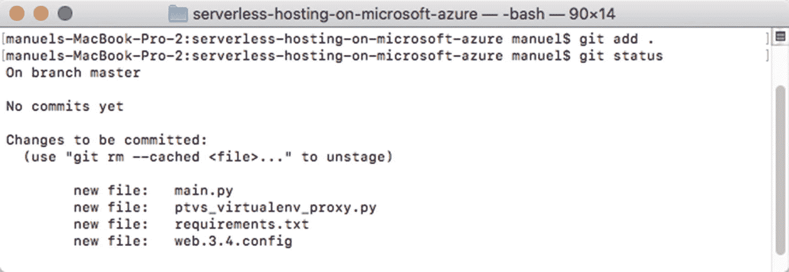

图 1-4

显示准备提交的 web 应用程序文件

```py
$ git add .
$ git status

Listing 1-14Add All Files in Folder to Git and Check Status

```

执行一个本地 Git 提交并添加一个有意义的注释，以防将来需要重新访问您过去的操作(清单 [1-15](#PC15) )。

```py
$ git commit -am "Intro to Cloud Azure commit"

Listing 1-15Committing Files to Git

```

所有需要的文件都在本地存储库中。有关 Git 部署到 Azure 应用服务的更多信息，请访问 [`https://docs.microsoft.com/en-us/azure/app-service/app-service-deploy-local-git`](https://docs.microsoft.com/en-us/azure/app-service/app-service-deploy-local-git) 。

### 第四步:打开 Azure 云壳

登录你的微软 Azure dashboard，点击脱字下划线打开 Azure Cloud Shell(图 [1-5](#Fig5) )。


图 1-5

正在启动 Azure 云外壳

系统将提示您创建一个 Linux 或 Power Shell 窗口。使用 Linux，因为命令将类似于您在本地终端窗口中使用的命令(图 [1-6](#Fig6) )。

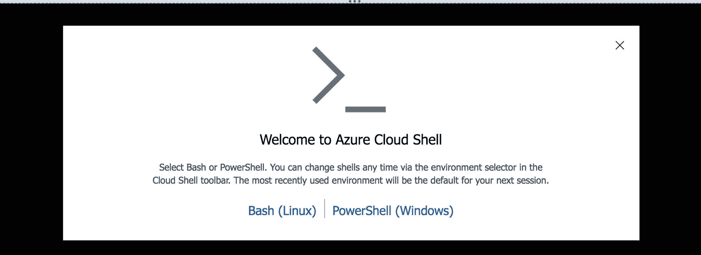

图 1-6

在 Bash (Linux)和 PowerShell (Windows)之间选择；使用熟悉的 Linux

它还会提示您创建存储，您将需要它来托管应用程序(图 [1-7](#Fig7) )。如果这是你的第一次，你可能会在下拉列表中看到“**免费试用**”选项。不管是哪种方式，都要顺其自然，创造储物空间。

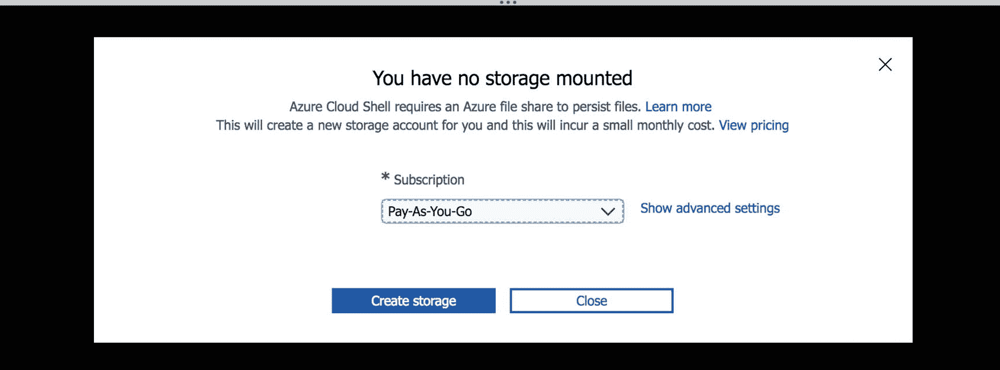

图 1-7

您需要创建一个存储库

### 步骤 5:创建部署用户

你现在应该在 Azure Cloud Shell 中。该用户将拥有使用 FTP 和本地 Git 的适当权限。在这里我将我的用户名设置为“ **flaskuser11** ”，密码设置为“**flask 123**”；想出你自己的名字并记住它，因为你以后会需要它(列出 [1-16](#PC16) )。

```py
$ az webapp deployment user set --user-name <<REPLACE-WITH-YOUR-USER-NAME>> --password flask123

Listing 1-16Creating a User

```

命令和大多数后续命令的响应应该类似于下面的屏幕截图。仔细查找任何错误或问题，并相应地进行修复(列表 [1-17](#PC17) )。

```py
manuel@Azure:~$ az webapp deployment user set --user-name flaskuser11 --password flask123
{
  "id": null,
  "kind": null,
  "name": "web",
  "publishingPassword": null,
  "publishingPasswordHash": null,
  "publishingPasswordHashSalt": null,
  "publishingUserName": "flaskuser11",
  "type": "Microsoft.Web/publishingUsers/web",
  "userName": null
}

Listing 1-17Response Format from Azure’s “webapp” Commands

```

您的输出 JSON 应该充满空值；如果您看到“**冲突，**“您的”**用户名**不是唯一的，如果您看到“**错误请求**”，您的密码不符合要求(它应该至少有八个字符长，由字符、数字或符号组合而成)。

### 步骤 6:创建资源组

在这里，我们为一个靠近您的位置`—`创建一个资源组，在我的例子中为"**美国西部**"(有关位置，请参见 [`https://azure.microsoft.com/en-us/regions/`](https://azure.microsoft.com/en-us/regions/) 或使用命令"**az appservice list-locations-SKU FREE**"`—`参见清单 [1-18](#PC18) )。

```py
Input:

$ az group create --name myResourceGroup --location "West US"

Output:

manuel@Azure:~$ az group create --name myResourceGroup --location "West US"
{
  "id": "/subscriptions/1e9ea6de-d6b9-44a5-b319-68b0ab52c2bc/resourceGroups/myResourceGroup",
  "location": "westus",
  "managedBy": null,
  "name": "myResourceGroup",
  "properties": {
    "provisioningState": "Succeeded"
  },
  "tags": null
}

Listing 1-18Creating a Resource Group and Response

```

### 步骤 7:创建 Azure 服务计划

创建您的 Azure 服务计划。将名称设置为“ **myAppServicePlan** ”(可以是你想要的任何名称；清单 [1-19](#PC19) 。

```py
Input:

$ az appservice plan create --name myAppServicePlan --resource-group myResourceGroup --sku FREE

Truncated Output:

manuel@Azure:~$ az appservice plan create --name myAppServicePlan --resource-group myResourceGroup --sku FREE
{
  "adminSiteName": null,
  "appServicePlanName": "myAppServicePlan",
  "geoRegion": "West US",
  "hostingEnvironmentProfile": null,
  "id": "/subscriptions/1e9ea6de-d6b9-44a5-b319-68b0ab52c2bc/resourceGroups/myResourceGroup/providers/Microsoft.Web/serverfarms/myAppServicePlan",
  "isSpot": false,
  "kind": "app",
  "location": "West US",
  "maximumNumberOfWorkers": 1,
  "name": "myAppServicePlan",
  "numberOfSites": 0,
  "perSiteScaling": false,
  "provisioningState": "Succeeded"
...

Listing 1-19Creating a Service Plan and Successful Response

```

### 步骤 8:创建 Web 应用程序

接下来，创建一个 web 应用程序，并将 name 参数设置为应用程序的名称(它必须是唯一的)。我将我的设置为“**amunateguintrolweb app**”，并告诉 web 应用程序代码将通过本地 Git 部署(清单 [1-20](#PC20) )。

```py
$ az webapp create --resource-group myResourceGroup --plan myAppServicePlan --name <<REPLACE-WITH-YOUR-APP-NAME>> --runtime "python|3.4" --deployment-local-git

Listing 1-20Creating a Web App (replace this with your app name)

```

检查来自" **az web app create** 命令的大型响应字符串，并在"**本地 git 配置了……**的 url "之后复制链接，或者从" **deploymentLocalGitUrl** "值`—`中复制链接，两者都相同，因此选择最容易的一个。当您将 Flask 文件推送到 Azure 时，您将需要这个(清单 [1-21](#PC21) )。

```py
Local git is configured with the URL 'https://flaskuser11@amunateguiintrowebapp.scm.azurewebsites.net/AmunateguiIntroWebApp.git'
{
  "availabilityState": "Normal",
  "clientAffinityEnabled": true,
  "clientCertEnabled": false,
  "cloningInfo": null,
  "containerSize": 0,
  "dailyMemoryTimeQuota": 0,
  "defaultHostName": "amunateguiintrowebapp.azurewebsites.net",
  "deploymentLocalGitUrl": "https://flaskuser11@amunateguiintrowebapp.scm.azurewebsites.net/AmunateguiIntroWebApp.git",
  ...

Listing 1-21Copy Your Git URL; You Will Need It Later

```

提取 Azure 项目的本地 Git 配置 URL(清单 [1-22](#PC22) 和 [1-23](#PC23) )。

```py
https://<<REPLACE-WITH-YOUR-USER-NAME>>@<<REPLACE-WITH-YOUR-APP-NAME>>.scm.azurewebsites.net/<<REPLACE-WITH-YOUR-APP-NAME>>.git

Listing 1-23Yours Will Look Like the Following

```

```py
https://flaskuser11@amunateguiintrowebapp.scm.azurewebsites.net/AmunateguiIntroWebApp.git

Listing 1-22The Extracted Git URL in My Case

```

## 检查您的网站占位符

如果一切正常，您应该可以访问占位符网站。将“<<**REPLACE-WITH-YOUR-APP-NAME**>>”替换为您在“ **az webapp create** ”步骤中创建的应用程序名称，并将其拖放到您的浏览器中(清单 [1-24](#PC24) 和图 [1-8](#Fig8) )。

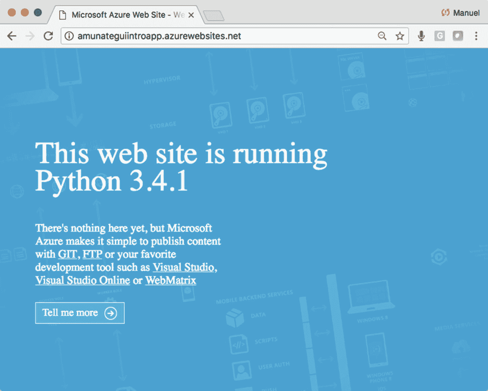

图 1-8

确认您站点的占位符已创建并正在运行

```py
http://<<REPLACE-WITH-YOUR-APP-NAME>>.azurewebsites.net

Listing 1-24Checking Your Web Placeholder

```

如果这不起作用，您需要再次检查每个步骤，确保您没有遗漏任何一个步骤，或者是否有任何步骤返回了需要解决的错误。

### 步骤 9:推出 Web 应用程序

现在回到本地计算机上的本地终端/命令窗口，指向正确的目录，并使用我们之前创建的初始化 Git 会话。将我们之前保存的带有您的 GIT 存储库位置的 URL 附加到“ **add azure** ”命令中(清单 [1-25](#PC25) )。

```py
$ git remote add azure https://flaskuser11@amunateguiintrowebapp.scm.azurewebsites.net/AmunateguiIntroWebApp.git

Listing 1-25Final Code Push to Azure

```

它可能会提示您输入密码；确保使用您在“ **az webapp 部署用户**”步骤中创建的用户名(在我的例子中为“**flask 123**”)；清单 [1-26](#PC26) )。

```py
$ git push azure master

Listing 1-26Final Code Push to Azure

```

### 步骤 10:在浏览器中查看

就是这样！你可以回到你的占位符浏览器页面，点击刷新(或者打开一个新的浏览器页面，输入`http://<<REPLACE-WITH-YOUR-APP-NAME>>.azurewebsites.net`，你应该会看到" **Hello World！**”；图 [1-9](#Fig9)

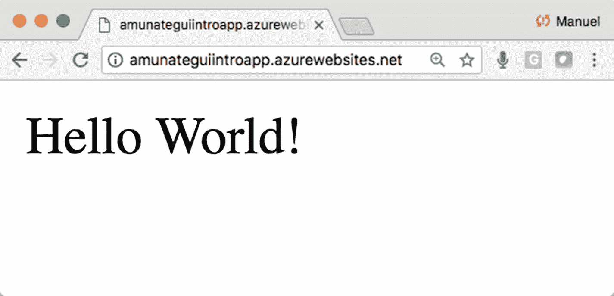

图 1-9

Flask 应用程序在 Amazon Azure 上成功运行

如果你没有看到" **Hello World！**站点，你可以直接在你的命令窗口`—`中访问日志的尾部，只需将名称换成网站名称(在我的例子中为“**amunateguintrolapp**”)和组(在我的例子中为“**my resource group**”)；参见清单 [1-27](#PC27) 。

```py
$ az webapp log tail --resource-group myResourceGroup --name amunateguiintroapp

Listing 1-27Final Code Push to Azure

```

### 步骤 11:不要忘记删除你的网络应用程序！

如果您不再使用您的 web 应用程序，不要忘记删除它。如果你不这样做，计价器将继续运行，吃掉信用或累积成本。删除一切最简单的方法就是登录 Azure Dashboard，在搜索栏输入“**所有资源**，删除你创建的一切(图 [1-10](#Fig10) )。


图 1-10

删除您的应用程序以避免产生额外费用

### 结论和补充信息

微软 Azure 是一个强大的云提供商，提供很多产品。它运行简单的 Flask 应用程序，部署迅速。为了加载更复杂的库，你将需要 Python 轮子的支持( [`https://pythonwheels.com/`](https://pythonwheels.com/) )。

如需更多信息，请参见微软 Azure Docs 上题为“在 Azure 中创建 Python web 应用程序”的精彩帖子，本节基于该帖子: [`https://docs.microsoft.com/en-us/azure/app-service/app-service-web-get-started-python`](https://docs.microsoft.com/en-us/azure/app-service/app-service-web-get-started-python) 。

## 介绍 Google Cloud 上的无服务器托管

Google Cloud 是构建、管理和部署 web 应用程序的强大平台。它与 TensorFlow 及其分布式图形机制无缝集成(图 [1-11](#Fig11) )。


图 1-11

谷歌云

让我们看看如何在 Google Cloud 的无服务器应用引擎上运行我们的基本 Flask 应用程序。我们将使步骤尽可能简单，因为我们将在后续章节中更深入地研究这个提供者。

### 注意

到 [`www.apress.com/9781484238721`](http://www.apress.com/9781484238721) 下载第 [1 章](01.html)的文件，点击源代码按钮，打开“**server less-hosting-on-Google-cloud**文件夹。

### 第一步:在谷歌云上注册一个账户

在撰写本文时，Google 正在提供一个为期 12 个月、300 美元的免费信用试用，以帮助您入门。更多信息请参见 [`https://console.cloud.google.com/start`](https://console.cloud.google.com/start) 。

有两种类型的应用程序引擎可供选择:简单但不太可定制的“**标准环境**，以及灵活的“**环境**，它可以或多或少地处理你扔给它的任何东西。在这一节中，我们将坚持使用简单的环境，即“**标准环境**

### 步骤 2:下载源文件

将本章的文件下载到你的本地机器上，并导航到名为“**server less-hosting-on-Google-cloud**”的文件夹(列表 [1-28](#PC28) )。

```py
serverless-hosting-on-google-cloud/
├── app.yaml
├── appengine_config.py
├── main.py
└── requirements.txt

Listing 1-28All Files Needed for Our Web Application on Google Cloud

```

" **app.yaml** "声明控制 Flask Python 应用程序(在本例中为" **main** ")驻留的位置，以及静态和模板文件夹的位置(列表 [1-29](#PC29) )。

```py
runtime: python27
api_version: 1
threadsafe: true

handlers:
- url: /static
  static_dir: static
- url: /.*
  script: main.app
- url: /favicon.ico
  static_files: statimg/favicon.ico
  upload: statimg/favicon.ico

libraries:
- name: ssl
  version: latest

Listing 1-29A Look at app.yaml

```

“ **appengine_config.py** ”指向 lib 文件夹，以在部署期间保存额外的 Python 库(清单 [1-30](#PC30) )。

```py
from google.appengine.ext import vendor
# Add any libraries installed in the "lib" folder
vendor.add('lib')

Listing 1-30A Look at “appengine_config.py”

```

“ **requirements.txt** ”保存 Python 库名和要安装并添加到 lib 文件夹中的版本(清单 [1-31](#PC31) )。

```py
Flask>=0.12

Listing 1-31Content of “requirements.txt”

```

" **main.py** "是 Flask 操作的大脑，保存着每个 HTML 页面的所有 Python 代码和指令(清单 [1-32](#PC32) )。

```py
from flask import Flask
app = Flask(__name__)

@app.route("/")
def hello():
    return "Hello World!"

Listing 1-32Content of “main.py”

```

### 第三步:打开谷歌云外壳

登录您的 Google Cloud 实例，选择您希望应用程序引擎驻留的项目(如果您没有，请参见创建和管理项目: [`https://cloud.google.com/resource-manager/docs/creating-managing-projects`](https://cloud.google.com/resource-manager/docs/creating-managing-projects) )。通过单击右上角的插入符号按钮启动云外壳命令行工具。这将在 GCP 仪表板的下半部分打开一个熟悉的命令行窗口(图 [1-12](#Fig12) )。


图 1-12

启动谷歌云外壳

在 GCP 仪表板的终端部分，创建一个名为“ **GoogleCloudFlaskIntro** ”(列表 [1-33](#PC33) )的新文件夹。

```py
$ mkdir GoogleCloudFlaskIntro
$ cd GoogleCloudFlaskIntro

Listing 1-33Creating Directory in GCP

```

### 第四步:上传 Flask 文件到 Google Cloud

有很多方法可以继续，你可以一个一个上传文件，克隆一个 GitHub 库，或者你可以把它们压缩成一个归档文件，然后一次性上传。我们将选择后者。所以只把以下四个文件压缩成一个归档文件:“ **app.yaml** 、“ **appengine_config.py** 、“ **main.py** 、“ **requirements.txt** ”(图 [1-13](#Fig13) )。

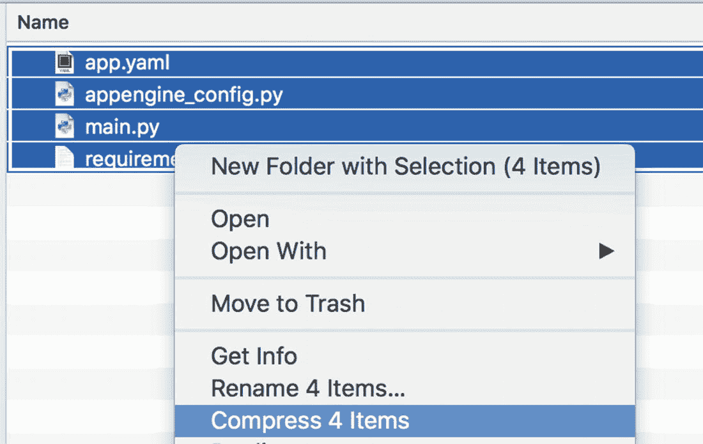

图 1-13

压缩 web 应用程序文件以上传到 Google Cloud

使用“**上传文件**选项将其上传(该选项位于外壳窗口的右上角，三个垂直圆点图 [1-14](#Fig14) 下)。

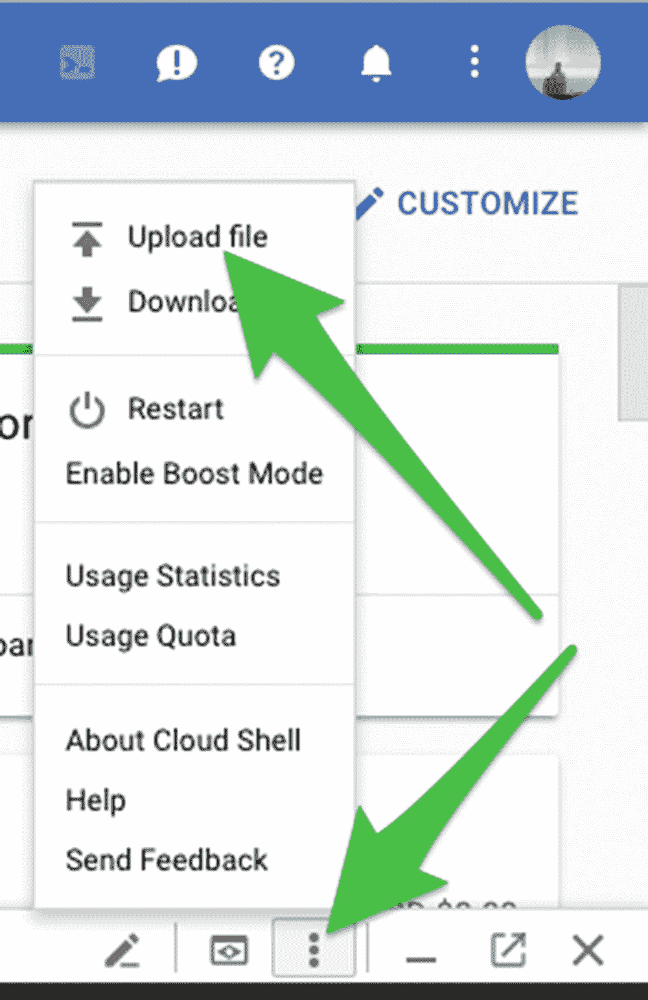

图 1-14

通过 Google Cloud shell 上传文件

它会将文件(在我的例子中称为“ **Archive.zip** ”)上传到根目录，因此您需要将它移动到“ **GoogleCloudFlaskIntro** ”文件夹中并解压缩它(清单 [1-34](#PC34) )。

```py
$ mv ../Archive.zip Archive.zip
$ unzip Archive.zip

Listing 1-34Moving and Unzipping Web Application Files

```

运行“ **pip install -t lib** 命令，安装“ **requirements.txt** ”文件中的所有库(清单 [1-35](#PC35) )。这将创建必要的" **lib** "文件夹来保存任何需要的 Python 库(如果您不使用" **sudo** "可能会受到一些抱怨，它给了您 root 权限，但是不要滥用它！)

```py
$ sudo pip3 install -t lib -r requirements.txt

Listing 1-35Filling the lib Directory with Necessary Python Libraries

```

此时，如果您运行“ **ls** ”命令(清单 [1-36](#PC36) ，您在云中的文件夹目录应该如下所示。

```py
Input:

$ ls

Output:

$ appengine_config.py app.yaml Archive.zip lib main.py requirements.txt

Listing 1-36Checking Content of the “GoogleCloudFlaskIntro” Folder on GCP

```

### 步骤 5:在 Google Cloud 上部署您的 Web 应用程序

我们现在准备部署“ **Hello World** ”站点。从仪表板的 shell 窗口中的“ **GoogleCloudFlaskIntro** ”文件夹下调用“ **gcloud app deploy 命令**”。它将要求您确认您确实想要部署到我们所做的`—`和**Y**es(清单 [1-37](#PC37) )。

```py
Input:

$ gcloud app deploy app.yaml

Truncated Output:

...
File upload done.
Updating service [default]...done.
Setting traffic split for service [default]...done.
Deployed service [default] to [https://apt-memento-192717.appspot.com]

Listing 1-37Deploying the Web Application

```

```py
To view your application in the web browser, run:
$ gcloud app browse

```

如果一切顺利，可以调用方便的“ **gcloud app browse** ”命令获取完整的网址(列表 [1-38](#PC39) )。

```py
Input:

$ gcloud app browse

Output:

Did not detect your browser. Go to this link to view your app:
https://apt-memento-192717.appspot.com

Listing 1-38Getting Our Web Application’s URL Address

```

要么点击 Google Cloud Shell 中的链接，要么将其粘贴到浏览器中(图 [1-15](#Fig15) )。

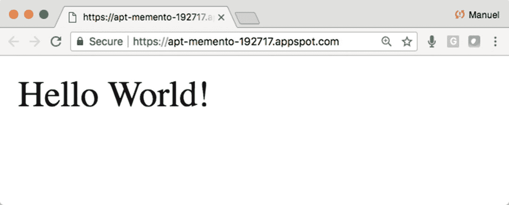

图 1-15

Flask 应用程序在 Google Cloud 上成功运行

### 第六步:不要忘记删除你的网络应用程序！

如果您不再使用您的 web 应用程序，不要忘记删除它。如果你不这样做，计价器将继续运行并增加费用。如果 App Engine 应用程序是您唯一的应用程序(您需要有一个默认应用程序)，您不能直接删除它，而是将流量重定向到一个空白应用程序。

在 Google Cloud shell 中，进入 Linux 文本编辑器“ **vi** ”(列表 [1-39](#PC40) )。

```py
$ vi app.yaml

Listing 1-39Editing the “app.yaml” File

```

这将打开一个小的命令行编辑器；然后按“ **i** 键插入或编辑文件(列表 [1-40](#PC41) 和 [1-41](#PC42) )。

```py
script: main.app

Listing 1-40Scroll Down and Replace “main.app”

```

```py
script: blank.app

Listing 1-41With “blank.app”

```

你的“ **app.yaml** ”文件现在应该有了它的“ **url** ”处理程序指向“ **blank.app** ”这将阻止 GCP 提供任何服务，因为“ **blank.app** ”不存在，并将停止累计费用(列表 [1-42](#PC43) )。

```py
runtime: python27
api_version: 1
threadsafe: true

handlers:
- url: /static
  static_dir: static
- url: /.*
  script: blank.app
- url: /favicon.ico
  static_files: statimg/favicon.ico
  upload: statimg/favicon.ico

libraries:
- name: ssl
  version: latest

Listing 1-42Pointing Our Yaml File to a Black Script

```

单击 escape 键退出插入模式，键入“ **wq** 表示写入并退出。然后重新部署您的 web 应用程序(清单 [1-43](#PC44) )。

```py
$ gcloud app deploy app.yaml

Listing 1-43Redeploying Blank Web Application

```

在 App 引擎有时间传播之后，URL 应该显示错误，而不是“ **Hello World** ”(图 [1-16](#Fig16) )。


图 1-16

该错误确认您的站点已关闭

### 结论和补充信息

GCP 提供了许多功能，并与谷歌的其他产品紧密集成(如他们在 [`https://cloud.google.com/apis/`](https://cloud.google.com/apis/) 的优秀云 API)和 TensorFlow。如果需要使用更强大的 Python 库，可以从标准的 App Engine 切换到灵活的。

如需更多信息，请参见谷歌云文档上标题为“**Python 应用引擎标准环境**快速入门”的便捷文章: [`https://cloud.google.com/appengine/docs/standard/python/quickstart`](https://cloud.google.com/appengine/docs/standard/python/quickstart)

顺便说一下，如果您的 Google Cloud 应用程序引擎有任何问题，您可以使用以下命令访问日志(清单 [1-44](#PC45) )。

```py
$ gcloud app logs tail -s default

Listing 1-44Viewing Deployment Logs

```

## 介绍亚马逊 AWS 上的无服务器托管

AWS Elastic Beanstalk 是一个用于部署 web 应用程序的简单而强大的平台。它配备了所有便利设施，如扩展、负载平衡、监控等。它只对使用的资源收费(图 [1-17](#Fig17) )。


图 1-17

亚马逊网络服务

让我们看看如何在 Amazon 的 AWS Elastic Beanstalk 上运行基本的 Flask 应用程序。我们将使步骤尽可能简单，因为我们将在后续章节中更深入地研究这个提供者。

### 注意

到 [`www.apress.com/9781484238721`](http://www.apress.com/9781484238721) 下载第 [1 章](01.html)的文件，点击源代码按钮，打开“**server less-hosting-on-Amazon-AWS**文件夹。

### 第一步:在亚马逊 AWS 上注册一个账户

亚马逊 AWS 提供了一个“ **AWS 免费等级**”账户，允许你免费试用它的一些服务。有关创建帐户的更多信息，请访问: [`https://aws.amazon.com/free/`](https://aws.amazon.com/free/) 。

### 步骤 2:下载源文件

将本章的文件下载到您的本地机器上，并导航到名为“**server less-hosting-on-Amazon-AWS**的文件夹文件夹结构应该类似于清单 [1-45](#PC46) 。

```py
serverless-hosting-on-amazon-aws/
├── application.py
└── requirements.txt

Listing 1-45All Files Needed for Our Web Application on AWS Elastic Beanstalk

```

### 步骤 3:为 Elastic Beanstalk 创建一个访问帐户

登录 AWS web 控制台，转到身份和访问管理(IAM)控制台。一个快捷的方法是在登录页面的 AWS 服务搜索框中输入“ **IAM** ”。在导航区选择**用户**，点击**添加用户**按钮(图 [1-18](#Fig18) )。

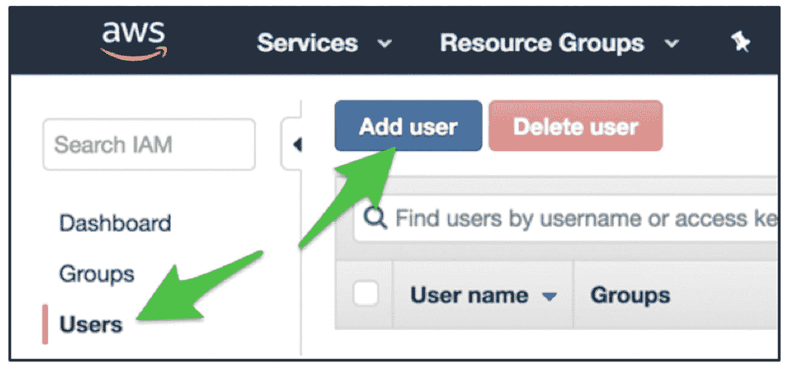

图 1-18

通过访问管理控制台添加用户

选择一个用户名`—`在这里我们输入“ **ebuser** ，勾选“**访问类型:程序化访问**”(图 [1-19](#Fig19) )。

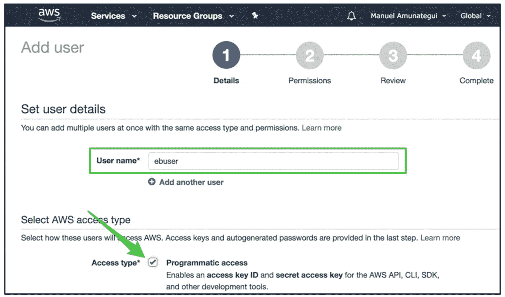

图 1-19

向" **ebuser** 添加正确的访问权限

点击蓝色的**下一步:权限**按钮。这将带您到“**设置权限**页面；点击“**将用户添加到群组**”大菜单按钮，然后点击“**创建群组**”创建一个组名，在本例中为“T8”ebadmins，并为其分配策略名“**wselasticbeankstalkfullaccess**”然后点击**创建组**按钮，完成该组(图 [1-20](#Fig20) )。

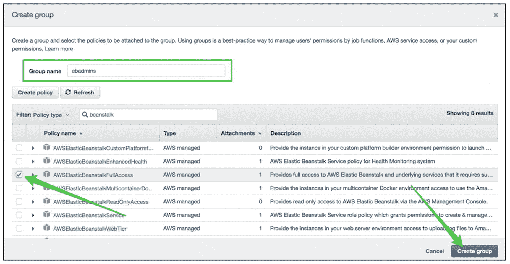

图 1-20

创建具有"**WSElasticBeanstalkFullAccess**"访问权限的组

点击**下一步:审核**蓝色按钮，在接下来的页面中，点击蓝色的**创建用户**按钮(图 [1-21](#Fig21) )。

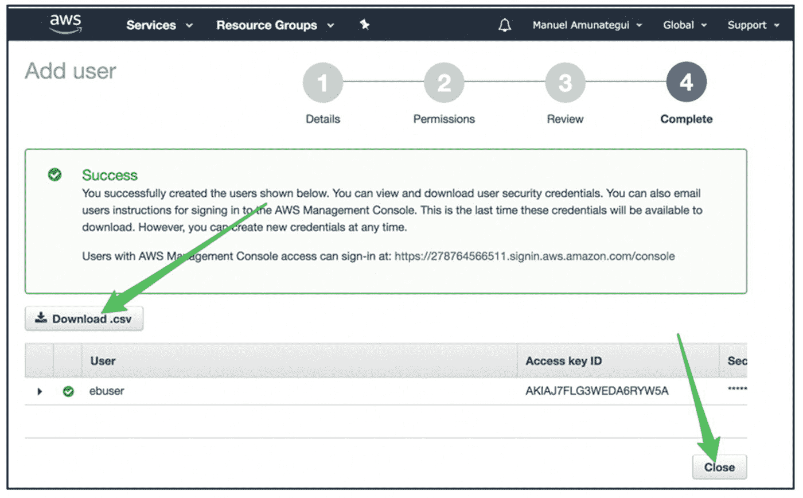

图 1-21

成功创建用户后下载访问密钥

一旦您看到“**成功**”消息，这意味着您已经成功创建了“ **ebuser** 账户。确保你下载了**。csv** 文件下载到您的本地机器上。csv 按钮。这个文件很重要，因为它保存着你的密钥和密码。将它存储在本地机器上的一个已知位置，因为您将需要这些信息来上传 web 应用程序代码，并将安全 Shell (SSH)保存到您的 eb 中(在本节中我们不需要 SSH，但在后面的部分中会用到)。

### 步骤 4:安装弹性豆茎(EB)

首先创建一个虚拟环境来隔离安装。这不是一项义务，但它将通过将这个环境与机器的其他部分分离来帮助您保持整洁(如果您还没有安装它，请参见前面名为“**虚拟环境**”的部分)；见清单 [1-46](#PC47) 。

```py
$ python3 -m venv amazon_aws_intro
$ source amazon_aws_intro/bin/activate

Listing 1-46Start a Virtual Environment

```

安装“ **awsebcli** ”库，在 AWS 上交互和管理我们的 EB 服务(清单 [1-47](#PC48) 和 [1-48](#PC49) )。

```py
$ pip3 install awscli –-user
$ pip3 install awsebcli --user

Listing 1-48For Windows (if it complains about the “user” parameter, try without it)

```

```py
$ pip3 install awscli
$ pip3 install awsebcli

Listing 1-47For Mac and Linux Users

```

### 步骤 5: EB 命令行界面

是时候初始化弹性 Bean 接口了(清单 [1-49](#PC50) )。

```py
$ eb init -i

Listing 1-49Start the Elastic Beanstalk Command Line Interface

```

这将问你一系列问题，你可以使用大多数默认设置。在**下输入应用名称**，输入 **AWSBeanstalkIntroduction** (图 [1-22](#Fig22) )。


图 1-22

创建新的电子商务应用程序

如果这是你第一次在你的电脑上运行 AWS，它会要求你的凭证。打开创建用户时在机器上下载的“ **credentials.csv** ”并输入两个必填字段(图 [1-23](#Fig23) )。


图 1-23

输入您的凭据

使用 Python 默认值(需要是 3.x 版本)；忽略警告。对 SSH 说好(图 [1-24](#Fig24) )。


图 1-24

打开 SSH 设置

创建一个新的密钥对或选择一个现有的密钥对，并保持默认值。如果你创建了一个新的密钥对，它将把它保存在一个文件夹中，并告诉你位置(图 [1-25](#Fig25) )。


图 1-25

创建或重用 RSA 密钥对

接下来，您需要创建您的 EB(这必须是一个唯一的名称)。这个命令将自动压缩文件夹中的数据，并将其上传到 AWS cloud(清单 [1-50](#PC51) 和 [1-51](#PC52) )。这可能需要几分钟，请耐心等待。

```py
$ eb create AWSBeanstalkIntroduction

Listing 1-51My EB for This Example

```

```py
$ eb create <<ENTER-YOUR-EB-NAME>>>

Listing 1-50Create Your EB and Upload it to AWS

```

### 第六步:兜一圈

这需要几分钟，如果一切顺利，您应该会收到一条成功消息。然后您可以简单地使用“ **eb open** 命令来实时查看 web 应用程序(列表 [1-52](#PC53) )。

```py
$ eb open AWSBeanstalkIntroduction

Listing 1-52Fire Up Your Web Application

```

第一次运行应用程序可能需要一点时间，甚至可能会超时。如果超时，再运行一次 **eb 打开**(图 [1-26](#Fig26) )。

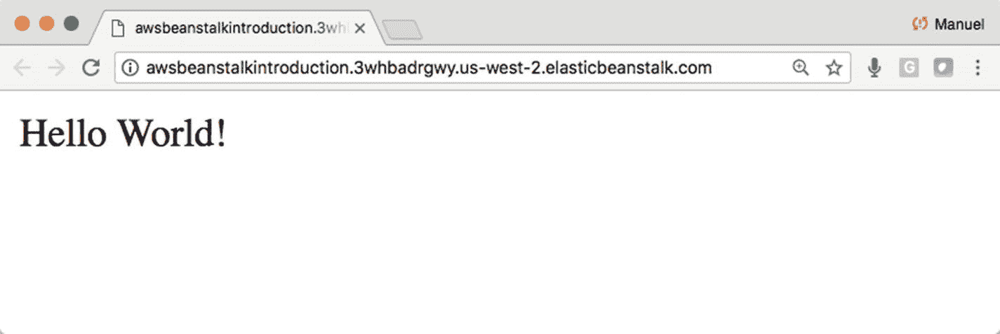

图 1-26

Flask 应用程序在 Amazon AWS 上成功运行

如果事情没有按计划进行，检查日志中的任何错误消息(清单 [1-53](#PC54) )。

```py
$ eb logs

Listing 1-53Access the Logs in Case of Problems

```

### 第七步:别忘了关机！

最后，我们需要终止 Beanstalk 实例，以免产生额外的费用。这是一个重要的提醒，这些云服务大多不是免费的。它会要求您输入环境的名称；在我这里是“ **AWSBeanstalkIntroduction** ”(列表 [1-54](#PC55) )。

```py
$ eb terminate AWSBeanstalkIntroduction
$ deactivate

Listing 1-54Don’t Forget to Terminate Your EB and Deactivate Your Virtual Environment

```

这确实需要几分钟，但会使网站瘫痪。在您的 AWS 仪表板上仔细检查所有服务确实被关闭是一个好主意。这很容易做到:只需在 [`https://aws.amazon.com/`](https://aws.amazon.com/) 登录你的 AWS 账户，确保你的 EC2 和 Elastic Beanstalk 账户没有任何你不打算拥有的活动服务(图 [1-27](#Fig27) )。如果您在每次"**终止**"它之后，看到一个实例似乎一直在复活，请检查 EC2 " **负载平衡器**下，首先终止那些，然后再次终止实例。


图 1-27

检查 Amazon AWS 仪表板，确保没有不需要的服务仍在运行

### 结论和补充信息

毫无疑问，AWS 是云领域的领导者。它可能不是最简单或最便宜的，但它很可能做你要求它做的任何事情。

如需更多信息，请参见亚马逊 AWS 文档 [`https://docs.aws.amazon.com/elasticbeanstalk/latest/dg/create-deploy-python-flask.html`](https://docs.aws.amazon.com/elasticbeanstalk/latest/dg/create-deploy-python-flask.html) 上标题为“**将 Flask 应用程序部署到 AWS Elastic Beanstalk** ”的便捷帖子。

## PythonAnywhere 上的主机介绍

PythonAnywhere 是一个在互联网上快速构建 Python 交互式想法和模型原型的好方法。它是为任何 Python 集成和设计的！它不是传统意义上的无服务器，但它是一个专用的 Python 框架，它不需要信用卡来注册，并且它可以立即制作概念证明(图 [1-28](#Fig28) )。


图 1-28

皮顿 Anywhere

证据就在布丁里；这个项目不需要任何代码，因为当您启动一个实例时，PythonAnywhere 已经默认为一个“ **Hello World** ”示例。

### 第一步:在 PythonAnywhere 上注册一个帐户

在 [PythonAnywhere 上注册一个免费帐户。com](http://pythonanywhere.com) 并登录(您必须确认您的电子邮件地址)。

### 步骤 2:设置 Flask Web 框架

让我们用 Flask web 服务平台在 PythonAnywhere 上创建一个 web 服务器。这是非常容易做到的。在“ **Web** 选项卡下，点击“**添加新的 web app** 蓝色按钮。并接受默认设置，直到你到达“选择一个 Python Web 框架”并点击“ **Flask** ”，然后是最新的 Python 框架(图 [1-29](#Fig29) )。

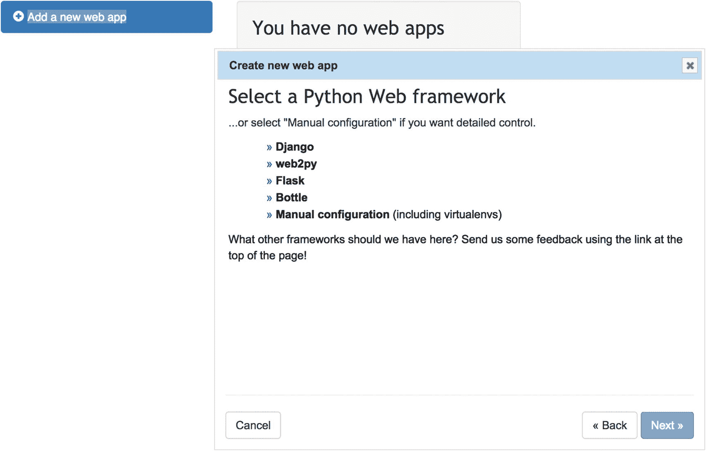

图 1-29

在 PythonAnywhere 上添加新的 web 应用程序

你将进入登陆配置页面，点击绿色的"**重新加载你的 account.pythonanywhere.com**"按钮，然后带着你的新网址兜一圈(图 [1-30](#Fig30) )。

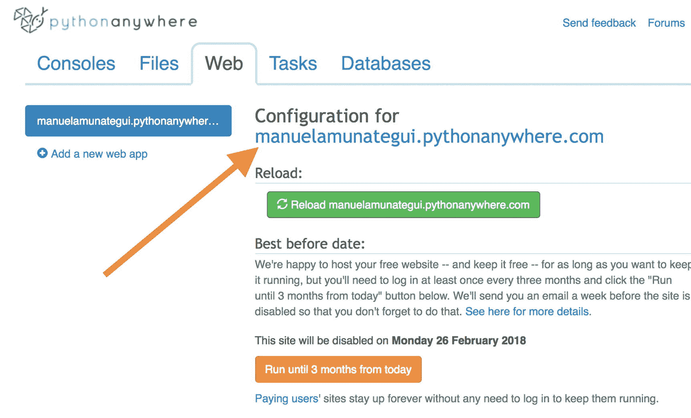

图 1-30

访问 Web 选项卡下的网站配置

您应该看到一个简单但真实的网页，带有来自 Flask 的“ **Hello！**"开箱即用的消息(图 [1-31](#Fig31) )。


图 1-31

Flask 应用程序在 PythonAnywhere 上成功运行

### 结论和补充信息

PythonAnywhere 可能不是 100%的无服务器云提供商，但它的基本托管是免费的。它是最容易操作的，可以直接从它的在线仪表板上运行。这是旅行时的一个很好的选择。

有关帮助文档和分步指南的宝库，请参见 [`https://help.pythonanywhere.com/pages/`](https://help.pythonanywhere.com/pages/) 。

## 摘要

如果你能走到这一步，干得好！我们已经介绍了一个使用 Flask 的非常简单的独立 web 应用程序，并将其部署在四个云提供商上。请期待将 web 应用上传到每个云提供商的方法会有所不同，因为他们确实会不时地改变一些东西。关注文档是至关重要的。

是时候卷起袖子，开始处理一些更有趣、更复杂的 web 应用程序了！

<aside class="FootnoteSection" epub:type="footnotes">Footnotes [1](#Fn1_source)

[`http://flask.pocoo.org`](http://flask.pocoo.org) /

 </aside>