# 四、AWS 上使用梯度提升器的预训练智能

是什么造就了顶级葡萄酒？通过亚马逊网络服务上难以抗拒的实时网络仪表板找到答案。

在本章中，我们将借助“ **sklearn** ”库中强大的“**梯度提升分类器**”<sup>[1](#Fn1)</sup>算法来学习葡萄酒品质。它可以将数据分类为多个类别，这就是我们将用来将我们的葡萄酒分组为“**质量**”桶。我们将在实时滑块的帮助下，在我们的 web 仪表板中突出显示这种力量(图 [4-1](#Fig1) )。

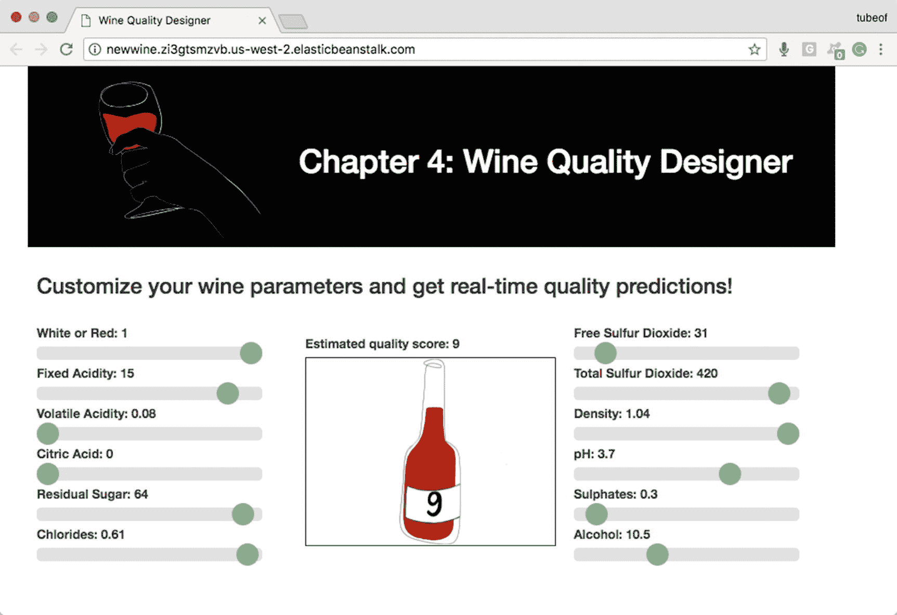

图 4-1

本章的最后一个 web 应用程序

这将邀请参观者以一种有趣的、有针对性的、有教育意义的方式与模型互动。这些数据是为一篇名为“**通过对物理化学特性**进行数据挖掘来模拟葡萄酒偏好”的论文收集的 <sup>[2](#Fn2)</sup> 它是由加州大学欧文分校的 UCI 机器学习库提供的。 <sup>[3](#Fn3)</sup>

### 注意

进入 [`www.apress.com/9781484238721`](http://www.apress.com/9781484238721) 并点击源代码按钮，下载第 [4 章](04.html)的文件。打开 Jupyter 笔记本" **chapter4.ipynb** "跟随本章内容。

## 规划我们的 Web 应用程序:什么造就了顶级葡萄酒？

与任何 web 应用程序一样，在将其扩展到 web 上之前，首先解决简单的问题是至关重要的。我们将从探索数据、试验建模、构建本地 Flask 应用程序开始，只有当一切正常时，我们才会将其扩展到 Amazon Web Services(AWS)Elastic Beanstalk。 <sup>[4](#Fn4)</sup>

## 探索葡萄酒质量数据集

葡萄酒质量数据集可以使用 Python“**Pandas**”库直接从 UCI 机器学习库中下载。它由两个数据集组成，1，599 个红酒实例和 4，898 个白酒实例。这些数据代表“与葡萄牙 **Vinho Verde** “葡萄酒”的红色和白色变种相关的”化学读数 <sup>[5](#Fn5)</sup> 继续将本章的文件下载到一个名为“**第 4 章**的文件夹中打开 Jupyter 笔记本，跟着做。

根据 UCI 的数据描述，有 11 个基于理化测试的属性和一个基于感官数据的输出列:

*   **输入**
    *   固定酸度

    *   挥发性酸度

    *   柠檬酸

    *   残糖

    *   氯化物

    *   游离二氧化硫

    *   二氧化硫总量

    *   密度

    *   pH 值

    *   硫酸盐

    *   酒精

*   **输出**
    *   质量(0-10 分)

我们将创建一个名为“ **color** 的新特征来描述葡萄酒是白还是红，并将两个数据集连接成一个数据集。作为优秀的网络公民，我们还为我们的网络应用程序保存了一个完成并合并的数据集的本地副本，这样我们就不会在每次用户与它交互时都访问服务器(清单 [4-1](#PC1) )。

```py
white['color'] = 0
red['color'] = 1
wine_df = pd.concat([white, red], ignore_index=True)

Listing 4-1Create a New Wine Color Feature and Concatenate White and Red Together

```

现在我们已经准备好了数据集，让我们深入研究一下，看看我们有什么(清单 [4-2](#PC2) )。

```py
Input:

wine_df.info()

Output:

<class 'pandas.core.frame.DataFrame'>
RangeIndex: 6497 entries, 0 to 6496
Data columns (total 13 columns):
fixed acidity           6497 non-null float64
volatile acidity        6497 non-null float64
citric acid             6497 non-null float64
residual sugar          6497 non-null float64
chlorides               6497 non-null float64
free sulfur dioxide     6497 non-null float64
total sulfur dioxide    6497 non-null float64
density                 6497 non-null float64
pH                      6497 non-null float64
sulphates               6497 non-null float64
alcohol                 6497 non-null float64
quality                 6497 non-null int64
color                   6497 non-null int64
dtypes: float64(11), int64(2)
memory usage: 659.9 KB

Listing 4-2A look at the Feature Data Types

```

“ **info()** ”函数告诉我们许多关于数据的信息。我们看到有 13 列，除了两个整数，“T2”质量和“T4”颜色之外，其他都是浮动的“ **color** ”功能是我们添加的功能，可以跟踪葡萄酒是红还是白。“**质量**”特征是结果标签，代表特定葡萄酒的质量水平。这是一个重要的特性，因为它按质量对数据进行聚类，这也是我们的模型将尝试学习的内容(清单 [4-3](#PC3) )。

```py
Input:

wine_df['quality'].value_counts()

Output:

6    2836
5    2138
7    1079
4     216
8     193
3      30
9       5
Name: quality, dtype: int64

Listing 4-3Total Rating Counts of Wine Quality in Wine Data Frame

```

“ **value_counts()** ”函数统计特定分类特征的值的频率。在“**质量**”的情况下，“我们看到有 7 种不同的质量类型，其中大多数是“高质量” **6** 。”这个特征可以潜在地用作连续变量，这意味着我们假设最低和最高质量之间的某种形式的线性。由于这种质量是基于投票的，我们只是不能假设它是一个连续的数值范围，以及一些数字缺失的事实(官方数据描述表明质量在 0 到 10 之间，但我们只看到 3 到 9 之间的数字)。

我们将谨慎行事，假设它是一个分类变量，并使用多分类模型而不是回归模型。

可视化分类变量的另一个好方法是使用直方图。这可以很容易地在熊猫图书馆学习中完成(列表 [4-4](#PC4) 和图 [4-2](#Fig2) )。

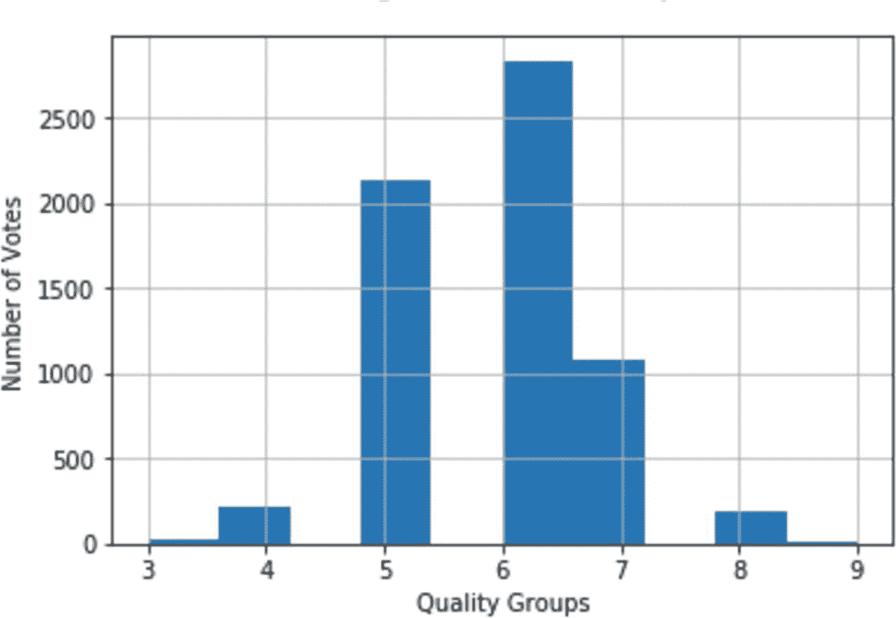

图 4-2

葡萄酒数据框中的葡萄酒质量等级直方图

```py
wine_df['quality'].hist()
plt.suptitle('Historgram of Wine Quality')
plt.xlabel('Quality Groups')
plt.ylabel('Number of Votes')
plt.show()

Listing 4-4Histogram of Wine Quality Ratings by Groups and Votes

```

这是与“ **value_counts()** ”相同的信息，但是更容易理解。我们看到一个中等范围的正态分布，这是很直观的，因为大多数葡萄酒都很一般，很少有非常差或非常好的。

根据" **info()** "函数，既没有空值，也没有文本或基于文本的分类数据。两个整数特征“**质量**和“**颜色**”是数字类别，并且在建模期间应当如此对待。

## 使用不平衡的类

参考葡萄酒质量直方图，我们看到大部分质量位于第 5、6 和 7 桶。这将使预测边缘质量桶更具挑战性，因为模型不会从足够的案例中受益。对于关键的建模项目，您要么通过删除一些中间类来平衡数据集，要么获得更多的边缘案例。在本章的 Jupyter 笔记本中，你可以看到重新平衡的过程。

另一种方法是移除较弱的特征。在某些情况下，弱特征可能会混淆模型，通过删除它们，您不仅可以提高分数，还可以使模型运行得更快。这可以很容易地用基于树的模型来完成，该模型返回某种形式的可变重要性。您将获得按重要性降序排列的特性列表，并尝试仅包含最佳特性的模型。您不断添加特性，直到分数不再提高，并且您最终获得了一组可以使用的良好特性(这被称为前向特性选择)。

让我们看看如果我们将所有的类限制在最多 500 行数据会发生什么(清单 [4-5](#PC5) 和图 [4-3](#Fig3) )。

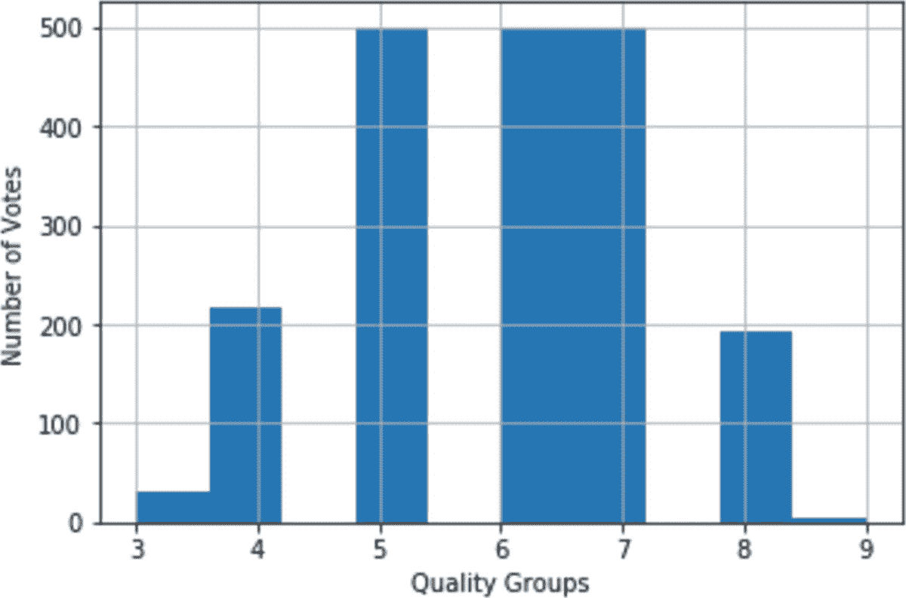

图 4-3

封顶葡萄酒质量直方图

```py
Input:

wine_balanced_df['quality'].value_counts()

Output:

7    500
6    500
5    500
4    216
8    193
3     30
9      5
Name: quality, dtype: int64

Listing 4-5Numerical Distribution of Capped Wine Quality

```

它确实在中心类周围变平了，但是边缘仍然非常不平衡。更好的方法是重新划分质量等级。我们将把它们分成三个质量组。质量等级 3、4、5 现在将属于组 3，质量等级 6 将与 6 保持一致，质量等级 7、8、9 将属于等级 9(图 [4-4](#Fig4) )。

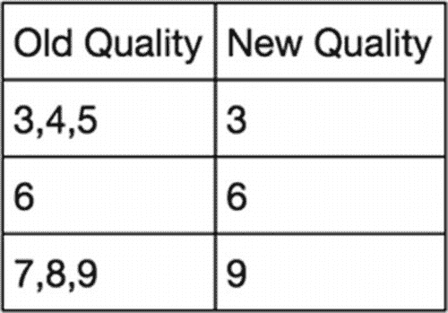

图 4-4

简化的葡萄酒质量超级群体

实质上，我们正在创造三个超级群体:“**差的**、“**一般的**、“**好的**”在应用这些新的分组后，我们得到了一个更加平衡的分布(列表 [4-6](#PC6) 和图 [4-5](#Fig5) )。

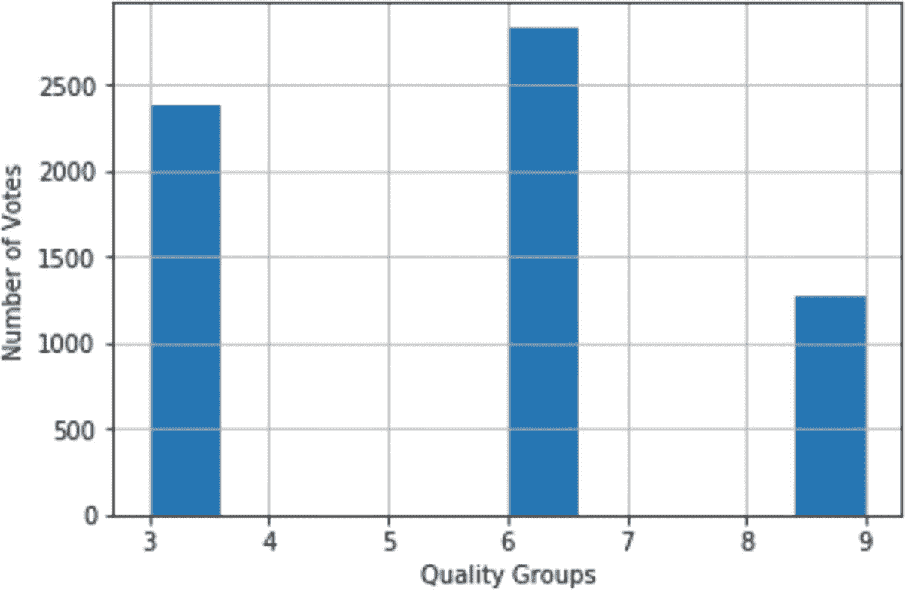

图 4-5

较小酒桶中葡萄酒质量的直方图分布

```py
Input:

wine_df['quality'].value_counts()

Output:

6    2836
3    2384
9    1277
Name: quality, dtype: int64

Listing 4-6Aggregating Wine Quality Down to Three Groups

```

当我们在直方图中绘制质量分组时，类别之间的平衡要好得多，范围从 1，200 到 2，800。

## 用梯度推进分类器建模

改进不平衡数据集的另一种方法是使用可以处理它们的模型。一个非常受欢迎的是 sklearn 的“**梯度提升分类器**”，这是一个强大的基于树的提升模型。它创建树的组，并根据它们的预测强度优化它们。

要使用 sk learn GradientBoostingClassifier 算法，您需要安装“ **scikit-learn** ”和“ **scipy** ”，如果您以前从未使用过它们(使用适合您的操作系统和软件的安装工具)。为了使事情变得更简单，你可以简单地运行“ **requirements_jupyter.txt** ”文件，该文件包含本章所需的所有 Python 库。您可以通过运行“ **pip3** ”命令快速安装它们(清单 [4-7](#PC7) )。

```py
$ pip3 install -r requirements_jupyter.txt

Listing 4-7Installing the Required Files to Run the Notebook

```

我们将“**质量**特征转换为熊猫“**”分类()**函数的分类类型。这将允许我们使用该特性的“**类别代码**”而不是实际值。我们这样做是因为真正的质量类别是 3-6-9，通过使用“**类别代码**”，我们将范围在 0 和 2 之间下移。然后，我们使用 sk learn "**train _ test _ split**"函数(就像我们在上一章中所做的那样)将数据随机分成一个训练块和一个测试/验证块。如果你看一下代码，我们将" **test_size** "设置为 0.2，这意味着我们将分配 20%的数据用于测试，我们使用" **random_state** "设置一个种子，以保证我们的分割总是相同的(清单 [4-8](#PC8) )。

```py
from sklearn.model_selection import train_test_split
wine_df['quality'] = pd.Categorical(wine_df['quality'])wine_df['quality_class'] = wine_df['quality'].cat.codes
outcome = 'quality_class'
outcome_buckets = len(set(wine_df['quality_class']))
X_train, X_test, y_train, y_test = train_test_split(wine_df[features],
wine_df[outcome], test_size=0.2, random_state=42)

Listing 4-8Preparing Our Training and Testing Datasets

```

现在，我们可以将这些训练数据输入到“**GradientBoostingClassifier**中进行建模(列表 [4-9](#PC9) )。

```py
from sklearn.ensemble import GradientBoostingClassifier
gbm_model = GradientBoostingClassifier(random_state=10, learning_rate=0.1, max_depth=10)
gbm_model.fit(X_train[features], y_train)

Listing 4-9Modeling with GBM

```

从片段中可以看出，“**GradientBoostingClassifier**”采用了各种参数，使用它们很重要，被称为超参数调优。

下面是调优 GBM 模型的一些关键参数(有关更多详细信息，请参见 scikit-learn help<sup>[6](#Fn6)</sup>)

*   **learning_rate:** 学习率决定了每棵树的贡献。

*   **n_estimators:** 要执行的升压阶段的数量

*   **最大深度:**回归估计量的最大深度

*   **max_features:** 每次分割要考虑的特征数量

*   **random_state** **:** 用于再现性的种子

训练"**GradientBoostingClassifier**"模型的最佳方式是使用不同的参数设置运行多次。查看添加“ **n_estimators** ”参数是否会提高精度，以及更大或更小的“ **learning_rate** ”或“ **max_depth** ”如何影响精度。对于那些想要深入研究模型调优的人来说，有许多额外的工具可以提供帮助，比如交叉验证、超参数调谐器等。我最喜欢 GradientBoostingClassifier 的一个方面是，它非常快，可以处理相当大的数据集，因此您可以轻松地编写自己的循环机制来尝试各种变化并比较准确性。

有关 Python API 参考的更多详细信息，请参见文档。 <sup>[7](#Fn7)</sup>

### 评估模型

如果你参考 Jupyter 笔记本的本章内容，你会看到在我们运行模型后，我们通过要求它根据样本外数据`—`预测葡萄酒质量来评估它，我们的 20%的测试数据(列表 [4-10](#PC10) )。这是一个需要记住的重要概念:模型永远不会看到测试数据，这允许我们用一组新的数据来评估模型的性能。

```py
preds = gbm_model.predict_proba(X_test)

Listing 4-10Predicting Using the Testing Data Split

```

“ **preds** ”变量包含每行三个概率的列表，描述属于每个葡萄酒质量等级的概率(这很拗口)。每行的概率总和为 1。例如，让我们看看第一行的预测概率(列出 [4-11](#PC11) )。

```py
Input:

preds[0]

Output:

array([0.50623207, 0.48718144, 0.00658649])

Listing 4-11Looking at One Wine’s Prediction

```

对于第 0 行的数据(即特定葡萄酒的化学读数)，模型预测指数 0 附近的最高概率为 0.56，因此质量桶" **3** "这可以通过使用 NumPy 的“ **argmax** ”来获得列表中最大数字的索引，然后使用该索引位置来获得桶编号(列表 [4-12](#PC12) )来轻松完成。

```py
Input:

print('Argmax: %i' % np.argmax(preds[0]))
print('Quality class: %i' % list(wine_df['quality'].cat.categories)[np.argmax(preds[0])])

Output:

Argmax: 0
Quality class: 3

Listing 4-12Using NumPy’s “argmax()” Function to Get the Largest Number in the Array

```

我们可以对测试数据中的每种葡萄酒做同样的事情，并使用 sk learn . metrics "**precision _ score()**"函数将其与实际的"**地面实况**"类进行比较。这将返回一个介于 0 和 1 之间的数字，其中 0 是最差的分数，1 是最好的分数。在这种情况下，精度比准确度更好，因为我们不是在讨论一个平衡数据集的简单二元预测。相反，我们想知道在不平衡的数据集上，该模型在特定葡萄酒的三个质量等级之间选择的有多好，这不是一件容易的事！(列表 [4-13](#PC13) )

> *精度是 tp / (tp + fp)的比值，其中 tp 是真阳性的数量，fp 是假阳性的数量。精确度直观上是分类器不将阴性样品标记为阳性的能力。* <sup>[8](#Fn8)</sup>

```py
Input:

from sklearn.metrics import precision_score
best_preds = np.asarray([np.argmax(line) for line in preds])
print ("Precision_score: %0.2f" % precision_score(y_test, best_preds, average="macro"))

Output:

Precision_score: 0.74

Listing 4-13Get the Highest Probability for Each Predicted Quality Class

```

另一个用多类模型观察全局的有用方法是使用混淆矩阵。这将绘制一个大的正方形矩阵，显示模型对实际情况的最佳预测(列表 [4-14](#PC14) 和图 [4-6](#Fig6) )。当处理大量数据时，使用图形混淆矩阵代替打印出来的混淆矩阵会很方便。产生这些图形矩阵的代码直接来自 scikit-learn.org 关于混淆矩阵的帮助文件。 <sup>[9](#Fn9)</sup>

```py
from sklearn.metrics import confusion_matrix
cnf_matrix = confusion_matrix(y_test, best_preds)
plt.figure()
plot_confusion_matrix(cnf_matrix, classes=set(wine_df['quality']),
                      title='Confusion matrix, without normalization')
plt.show()

Listing 4-14Wine-Quality Predictions Shown on a Confusion Matrix

```

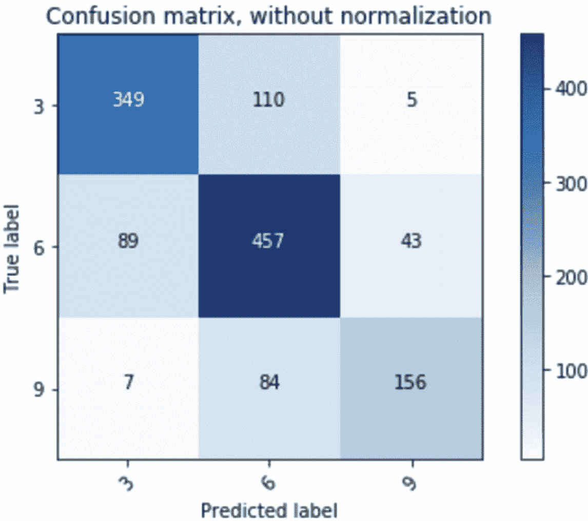

图 4-6

预测与实际混淆矩阵

花一点时间分析这张图表是值得的。y 轴表示实际情况，x 轴表示来自 GradientBoostingClassifier 模型的最佳预测。

在理想情况下，除了从图表左上角一直到右下角的一条对角线，所有的数字都是 0。这意味着所有的预测都是正确的(参见图 [4-7](#Fig7) 中的虚构图表)。

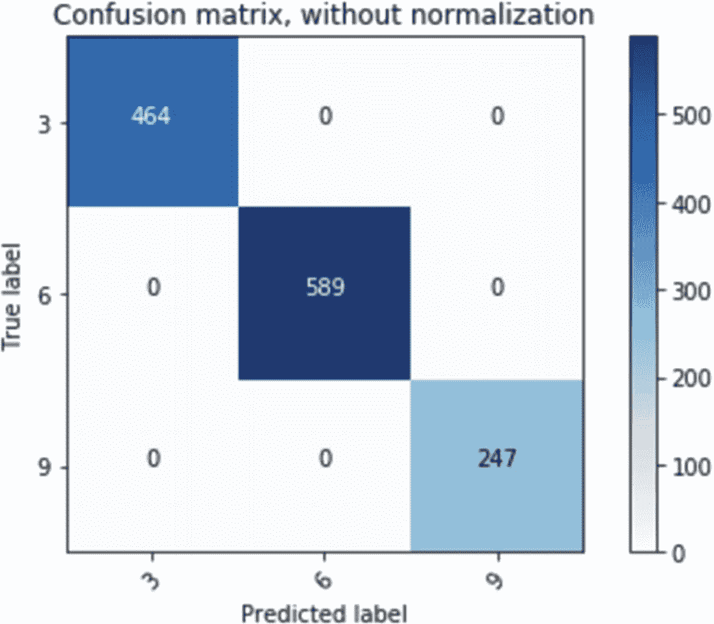

图 4-7

完美的混淆矩阵是什么样子的(如果你看到真实模型的这种完美程度，请怀疑，因为建模从来都不是完美的)

我们模型的混淆矩阵告诉我们一些关于数据的有趣的事情。首先，它做得很好，因为从左上角到右下角的对角线包含了最大的数字。当数据偏离对角线时(即，不正确的预测)，它仍然保持接近其组。这就是为什么模型预测为 3 而实际为 9 或者模型预测为 9 而实际为 3 的边非常小。这可以看作是一个小小的安慰:无论何时预测是错误的，它可能并没有那么远，错误的预测只是到相邻的桶。

### 坚持模型

在第 [3](03.html) 章中，我们的 web 应用程序的构造器训练了模型(每当 web 服务器重新启动时，它就训练它)。在这里，我们将对其进行预训练、提炼，并将其用作我们的建模引擎。很少有数据集和模型小到可以直接在云端和 web 服务器上训练。大多数模型都很大，需要很长时间的训练，甚至需要特殊的硬件。通过保存一个完全训练好的模型的副本，我们可以将它移动到我们需要的任何地方，并且处于一个可以预测的状态。**picking**，如果你不熟悉那个 Python 术语，是一个将对象以其当前状态保存到文件中的工具。 <sup>[10](#Fn10)</sup> 就像逗号分隔文件(CSV)用于移动数据一样，腌泡文件用于移动 Python 对象。你可以腌制任何你想要的东西，包括训练有素的模特。关于 Python 版本，AWS Beanstalk 默认为 Python 3.x，pickle 在 Python 2.x 和 3.x 版本之间存在兼容性问题，因此请坚持使用 Python 3.x 来阅读本章。

这被称为模型持久性，它应该在大多数生产场景中使用，我们也将在本书的大多数章节 <sup>[11](#Fn11)</sup> (清单 [4-15](#PC15) )中使用这种方法。

```py
with open('gbm_model_dump.p', 'wb') as f:
        pickle.dump(gbm_model, f, 2)

Listing 4-15Pickling Our Trained GBM Model

```

### 根据新数据进行预测

就像我们在前一章所做的一样，我们需要确保我们可以运行我们的模型，并根据新数据提取预测。这是构建交互式 web 应用程序的重要一步，该应用程序的目标是基于用户输入的数据提供新的预测。

首先，我们计算每个特征的平均值，并使用这些值来预测葡萄酒的质量(清单 [4-16](#PC16) )。

```py
fixed_acidity = 7.215307
volatile_acidity = 0.339666
citric_acid = 0.318633
residual_sugar = 5.443235
chlorides = 0.056034
free_sulfur_dioxide = 30.525319
total_sulfur_dioxide = 115.744574
density = 0.994697
pH = 3.218501
sulphates = 0.531268
alcohol = 10.491801
color = 0

# create data set of new data
x_test_tmp = pd.DataFrame([[fixed_acidity,
        volatile_acidity,
        citric_acid,
        residual_sugar,
        chlorides,
        free_sulfur_dioxide,
        total_sulfur_dioxide,
        density,
        pH,
        sulphates,
        alcohol,
        color]], columns = X_test.columns.values)

Listing 4-16Get Mean Values of Each Feature and Store in Data Frame

```

在创建一个新的数据框架来存储定制的葡萄酒化学读数之后，我们将它传递给模型的“ **predict** ”函数。我们可以添加任何结果变量，因为模型在做出预测时会忽略它(列表 [4-17](#PC17) )。

```py
preds = gbm_model.predict_proba(x_test_tmp)

Listing 4-17Predict the Quality of a Wine Based on Our Mean Values

```

因为我们使用平均值作为我们的新酒，所以预测的质量值应该接近地面真相/实际葡萄酒质量`—`我们基本上创造了一种无聊的葡萄酒，既不好也不坏(列表 [4-18](#PC18) )。

```py
Input:

print(('Predicted wine quality: %i') % list(wine_df['quality'].cat.categories)[np.argmax(preds)])
print(('Actual mean wine quaity: %0.2f') % np.mean(wine_df['quality'].values))

Output:

Predicted wine quality: 6
Actual mean wine quality: 5.49

Listing 4-18Get Wine-Quality Prediction

```

还不错！模型预测第 6 组，平均值为 5.49。请记住，这个模型可以更好地预测普通葡萄酒和边缘葡萄酒。所以，它能做到这一点并不奇怪。如果我们看一下预测数组，我们会看到模型在将这款葡萄酒归入质量 3 或质量 6 (35% 3 和 64% 6)时有一点点困难，但质量组 6 胜出了(列表 [4-19](#PC19) )。

```py
array([[0.34124871, 0.63933304, 0.01941825]])

Listing 4-19Predicted Probabilities of Our Average Wine

```

## 设计一个 Web 应用程序来交互和评估葡萄酒质量

在我们的本地模型上构建一个全功能的 Flask 版本是本书所有章节的共同主题和正确的下一步。通过足够的练习，你可以跳过这一步，但是同时，在本地解决问题比在云上解决问题会节省你大量的时间和麻烦。

好的第一步是将代码归纳成一个大函数。这将允许我们向它传递新的值，并以尽可能少的麻烦得到一个好的预测作为回报。

下载完本章的所有文件后，打开命令行窗口，将驱动器切换到“ **web 应用程序**文件夹。你的文件夹应该看起来像清单 [4-20](#PC20) 。这里我们展示的是隐藏的文件夹“**”。AWS EB 所需的 EB 扩展**。您可以按原样使用它，也可以在“**修复 WSGIApplicationGroup** ”部分创建自己的版本(在运行站点的本地版本时不必担心这一点，因为它不受此修复的影响)。

```py
web-application
├── application.py
├── requirements.txt
├── static \
                └── images
                                ├── quality_wine_logo.jpg
                                ├── wine_red_9.jpg
                                ├── wine_white_9.jpg
                                ├── wine_red_3.jpg
                                ├── wine_white_3.jpg
                                ├── wine_red_6.jpg
                                └── wine_white_6.jpg
├── pickles
                └── gbm_model_dump.p
└──templates
                └── index.html
└── .ebextensions <-- hidden folder
                └── wsgi_fix.config

Listing 4-20Web Application Files

```

值得注意的是，在某些章节中，我们称我们的主 Flask Python 文件为“ **main.py** ”，但是在这里我们使用“**application . py**”`—`这是 Amazon 的 Elastic Beanstalk 默认命名约定(总是有办法解决这个问题，但是需要编辑配置文件)。从现在开始，我们将在虚拟环境中工作。

## AJAX 简介——动态服务器端 Web 呈现

在这一章中，我们将开始使用 Ajax，这是一项非常酷的技术，它允许我们更新网页内容，而无需重新构建整个页面。这对于执行大量微更新的高度交互的 web 应用程序非常有用。Ajax 也非常容易使用，由两部分组成，一个前端脚本函数调用" **$。ajax** 和后端 Flask 函数来捕捉和处理调用。我们将在第 10 章[中更深入地探讨 Ajax。](https://doi.org/10.1007/978-1-4842-3873-8_10)

## 在虚拟环境中工作——试验、安全和清晰的沙箱

使用虚拟环境有许多优势:

*   创建未安装 Python 库的环境

*   确切地知道应用程序运行需要哪些 Python 库

*   保护计算机系统的其他部分免受在此环境中安装的任何 Python 库的攻击

*   鼓励实验

要启动一个虚拟环境，您可以使用" **venv** "命令。如果您的计算机上没有安装它，建议您安装(它可通过 pip3、conda、brew 等安装获得)。有关为您的操作系统安装虚拟环境的更多信息，请参见“ **venv -创建虚拟环境**”用户指南: [`https://docs.python.org/3/library/venv.html`](https://docs.python.org/3/library/venv.html)

在命令行窗口中，如果您尚未找到“ **web 应用程序**”文件夹，请导航到该文件夹。在命令行上调用 Python 3 的“ **venv** ”函数，为我们的开发工作在 Python 3 中创建一个沙箱区域和一个名为“**winenv**”的文件夹(列表 [4-21](#PC21) )。

```py
$ python3 -m venv wineenv
$ source wineenv/bin/activate

Listing 4-21Starting a Virtual Environment

```

您现在可以在虚拟环境中工作了。让我们看看是否可以通过调用“ **python3** ”在本地运行网络应用程序(或者使用适用于您的操作系统的命令)；列表 [4-22](#PC22) 。

```py
$ python3 application.py

Listing 4-22Run a local version of the web application

```

这是行不通的，因为我们在一个干净的虚拟环境中，没有加载专门的 Python 库。您将需要安装它所抱怨的所有库(替换为适用于您的操作系统和软件的安装命令)。最简单的是" **pip3 安装**"内含的" **requirements.txt** "文件(清单 [4-23](#PC23) )。

```py
$ pip3 install -r requirements.txt

Listing 4-23Installing Requirements

```

我们有一个全面的 requirements.txt 文件，包含运行我们的 web 应用程序所需的所有 Python 库。这对于我们 web 应用程序的本地版本来说确实没有用，但是对于我们基于云的版本来说却是必需的。 <sup>[12](#Fn12)</sup> 无论你何时部署你的应用，无论是在亚马逊、谷歌还是微软的云上，它都使用需求文件来安装所有需要的 Python 库，无论它从哪里运行你的 web 应用。

回到我们的本地版本实验，运行与我们之前的烧瓶实验相同的命令(清单 [4-24](#PC24) )。

```py
$ python3 application.py

Listing 4-24Run a Local Version of the Web Application

```

然后将 URL:“`http://127.0.0.1:5000/`”(或终端窗口中显示的任何内容)复制到您的浏览器中，您应该会看到 web Wine Quality Designer 应用程序出现(图 [4-8](#Fig8) )。希望它成功了；如果没有，读取输出错误并相应地解决它们(记住本章需要 Python 3.x)。

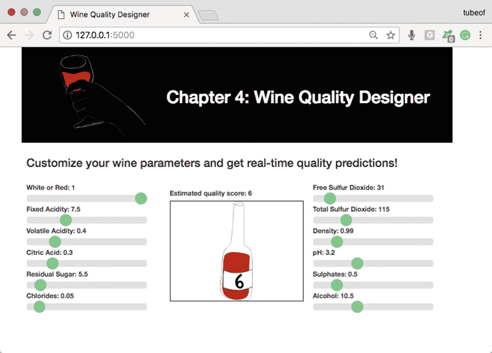

图 4-8

在本地服务器上运行的 Web 应用程序

## 亚马逊网络服务(AWS)弹性豆茎

对于本章基于云的部分，我们将在 Amazon 的 Elastic Beanstalk 上托管我们的应用程序。这是一个方便的托管解决方案，可以自动打包、部署、扩展和平衡您的站点。它在一个方便的基于 web 的仪表板中提供日志记录、流量和健康监控统计数据，让您随时了解正在发生的事情。这应该可以让你专注于你的应用程序，几乎完全忘记网站管理。

您将需要一个 Amazon Web 服务帐户并设置安全凭证。如果你已经有一个 Amazon.com 帐户，你应该可以很容易地把它转移到 AWS。如果您是这项服务的新手，您可以创建一个免费帐户，让您访问基本的 Beanstalk 功能。转到 AWS 自由层( [`https://portal.aws.amazon.com/gp/aws/developer/registration/index.html`](https://portal.aws.amazon.com/gp/aws/developer/registration/index.html) )。

### 为弹性豆茎创建一个访问帐户

一旦您有了 AWS 帐户，就应该设置您的安全凭证，以便从您的计算机上与 AWS Elastic Beanstalk 进行交互。亚马逊的入门教程( [`https://aws.amazon.com/getting-started/tutorials/set-up-command-line-elastic-beanstalk/`](https://aws.amazon.com/getting-started/tutorials/set-up-command-line-elastic-beanstalk/) )是一个很好的指导你完成许可过程的指南。

登录 AWS web 控制台，转到身份和访问管理(IAM)控制台。一个快捷的方法是在登录页面的 AWS 服务搜索框中输入“ **IAM** ”。在导航区选择**用户**，点击**添加用户**按钮(图 [4-9](#Fig9) )。

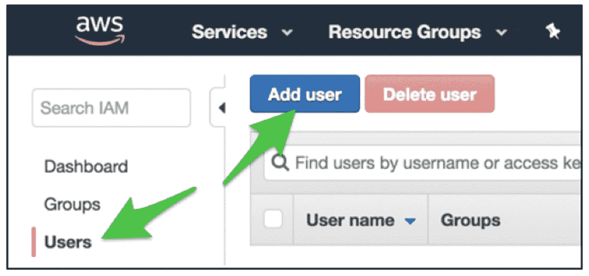

图 4-9

在 AWS 中创建用户

选择一个用户名`—`在这里我们输入“ **ebuser** ，勾选“**访问类型:程序化访问**”(图 [4-10](#Fig10) )。


图 4-10

为我们的新用户分配编程访问权限

点击蓝色的**下一步:权限**按钮。这将带您到“**设置权限**页面；点击“**添加用户到群组**大菜单按钮，然后点击“**创建群组**”(图 [4-11](#Fig11) )。


图 4-11

将 WSElasticBeanstalkFullAccess 授予新用户

创建一个组名，在本例中为“T0”ebadmins，并为其分配策略名“**wselastic beanstalkfullaccess**然后点击**创建组**按钮，完成分组。点击“ **Next: review** ”蓝色按钮，在下一页点击蓝色“ **Create user** ”按钮(图 [4-12](#Fig12) )。

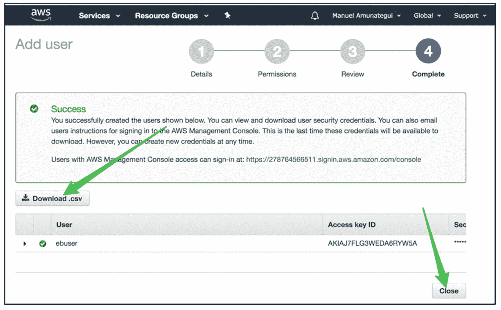

图 4-12

成功创建用户后下载访问密钥

一旦您看到“**成功**”消息，这意味着您已经成功创建了“ **ebuser** 账户。确保你下载了**。csv** 文件下载到您的本地机器上。csv 按钮。这个文件很重要，因为它保存了您的密钥和密码。将它存储在本地机器上的一个已知位置，因为您将需要该信息来连接和保护您的 EB 中的 Shell (SSH)。

### 弹性豆茎

我们将把弹性豆茎称为 EB。我们需要安装" **awsebcli** "库来在 AWS 上交互和管理我们的 EB 服务。

对于 Mac 和 Linux 用户(如果它报错“**用户**”参数，就不用它试试)。见清单 [4-25](#PC25) 。

```py
$ pip install awscli
$ pip install awsebcli

Listing 4-25Installing “awsebcli”

```

对于 windows(如果它抱怨“**用户**”参数，请尝试不使用它)。参见清单 [4-26](#PC26) 。

```py
$ pip install awscli --user
$ pip install awsebcli --user

Listing 4-26Installing “awsebcli” on Windows

```

有关“ **awsebcli** ”库的安装和故障排除的更多信息，请参考亚马逊的帮助文档: [`https://docs.aws.amazon.com/elasticbeanstalk/latest/dg/eb-cli3-install.html`](https://docs.aws.amazon.com/elasticbeanstalk/latest/dg/eb-cli3-install.html) 。

### EB 命令行界面

从 AWS 帮助文件中:

> *EB 是一个* *命令行界面(CLI)工具* *，它会向您提出一系列问题，并使用您的答案来部署和管理弹性 Beanstalk 应用程序。本节提供了使用 EB 启动、查看、更新和删除示例应用程序的端到端演练。*<sup>[13](#Fn13)T9】</sup>

这是一个方便的命令行集，用于初始化、推送、控制和终止我们的 EB 实例。

*   **eb init** :初始化 eb 服务<sup>T3】14T5】</sup>

*   **eb 创建**:创建一个新的 eb 实例

*   **eb open** :打开一个指向你的 eb 实例的网页

*   **eb deploy** :部署对代码或配置的任何更改

*   **eb 配置**:打开 eb 实例配置文件进行读取和编辑

*   **eb 日志**:为打开的 eb 实例提取各种日志文件

*   **eb 终止**:杀死 eb 实例(如果你不想继续增加费用，就终止)

有关 EB 命令的更多完整信息，请参见 [`https://docs.aws.amazon.com/elasticbeanstalk/latest/dg/eb-cli3-getting-started.html`](https://docs.aws.amazon.com/elasticbeanstalk/latest/dg/eb-cli3-getting-started.html) 。

我们等到现在才安装" **awsebcli** "库，因为我们不想让它进入我们的 requirements.txt 文件(清单 [4-27](#PC27) )。

```py
$ eb init -i

Listing 4-27Initializing “awsebcli”

```

这会问你一系列的问题，你可以使用大多数的默认设置。在**下输入应用名称**，输入 **winetest** (图 [4-13](#Fig13) )。

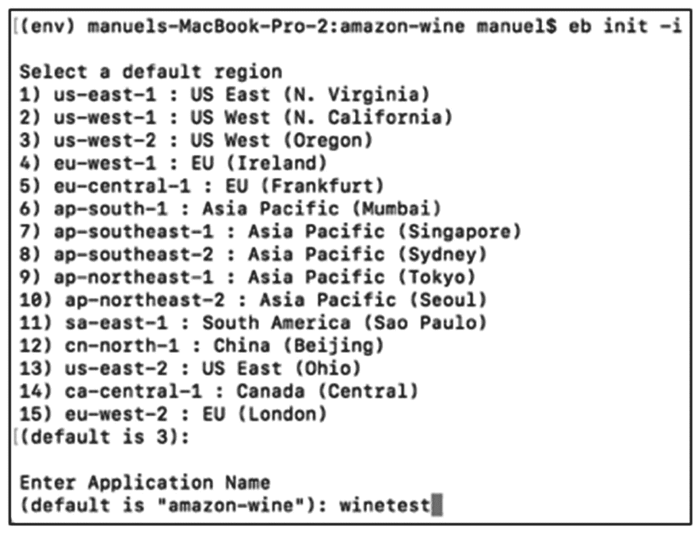

图 4-13

创建应用程序名称

如果这是你第一次在你的电脑上运行 AWS，它会要求你的凭证。打开创建用户时在机器上下载的“ **credentials.csv** ”并输入两个必填字段(图 [4-14](#Fig14) )。


图 4-14

输入您的凭据

使用 Python 的默认设置(需要是 3.x 版本),但是设置 SSH 时要说是(图 [4-15](#Fig15) )。


图 4-15

创建 SSH 密钥

对于它可能询问的所有其他问题，使用默认设置。在我们创建 web 应用程序之前，您需要定制 WSGI 配置文件，通知它您将需要 Python 子解释器模式。

### 修复 WSGIApplicationGroup

当使用 Python 库(如 NumPy、Pandas 或任何其他大量使用 Python 的库)时，您需要告诉 WSGI 进入特殊的 Python 子解释器模式。这样做是因为这些库加载起来更复杂，需要更多的线程等，因此默认情况下是关闭的(更多信息请参见 Python 简化的 GIL 状态 API <sup>[15](#Fn15)</sup> )。切换需要将清单 [4-28](#PC28) 中的变量添加到配置文件中(这来自 Stackoverflow 解决方案 <sup>[16](#Fn16)</sup> )。下载中包含该文件的副本，或者您可以使用文件夹中提供的副本(这是一个隐藏的文件夹，您可能会也可能不会看到`—`如果您不确定，请尝试按照说明创建该文件夹，如果它出现问题，则意味着您已经有了该文件夹)。

```py
'WSGIApplicationGroup %{GLOBAL}'

Listing 4-28Adding the ‘WSGIApplicationGroup’ Variable

```

要打开它，你需要在“ **web 应用程序**”文件夹下创建一个名为“**的新文件夹。ebextensions** 。在本地终端窗口中输入清单 [4-29](#PC29) 中的命令。

```py
$ mkdir .ebextensions

Listing 4-29Creating the “wsgi_fix” File

```

这将创建一个名为“**的新文件夹。ebextensions** 并打开一个“ **vi** 窗口，这是一个简单的文本编辑器。点击“ **i** 键，从只读模式切换到“**插入**模式，并将下面一行粘贴到文档末尾(该修复的文本文件也包含在本章文档所在的文件夹中)。读取该文件的过程非常挑剔；如果添加了空格或制表符，它将失败。密切关注部署过程中与文件相关的任何错误，并相应地进行处理。

从本地终端窗口打开“ **vi** ”(列表 [4-30](#PC30) )。

```py
$ vi .ebextensions/wsgi_fix.config

Listing 4-30Open a “vi” Session and Hit “i” to Enter Insert Mode

```

将以下代码粘贴到其中(代码可以从本章下载中的文件" **ebextensions_fix.txt** "中复制)。这是非常挑剔的；一个放错位置的标签会破坏这个过程，所以我建议从下载中获取内容或者使用已经提供的默认文件(清单 [4-31](#PC31) )。

```py
#add the following to wsgi_fix.config
files:
  "/etc/httpd/conf.d/wsgi_custom.conf":
    mode: "000644"
    owner: root
    group: root
    content: |
      WSGIApplicationGroup %{GLOBAL}

Listing 4-31Paste the Following Code into Your “vi” Session

```

现在点击“**转义**退出“**插入**模式，进入只读模式，输入“ **:wq** ”写入并退出“ **vi** ”(列表 [4-32](#PC32) )。

```py
:wq

Listing 4-32Save and Quit “vi” Session

```

接下来，你需要创建你的 EB。

### 创建 EB

现在我们准备创建我们的 web 应用程序。使用之前创建的应用程序的名称运行“ **eb create** 命令(列表 [4-33](#PC33) )。

```py
$ eb create winetest

Listing 4-33Initializing “awsebcli”

```

这将需要几分钟时间，如果一切顺利，您应该会收到一条成功消息。然后您可以简单地使用“ **eb open** 命令来实时查看 web 应用程序。

### 带它去兜风

第一次运行应用程序可能需要一点时间，甚至可能会超时。如果是这种情况，再尝试一次“ **eb open** ”命令(列表 [4-34](#PC34) 和图 [4-16](#Fig16) )。

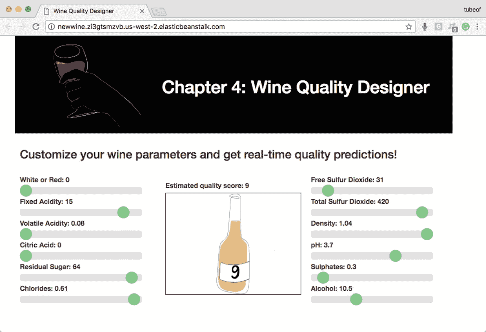

图 4-16

运行在 AWS 弹性豆茎上的葡萄酒质量设计师

```py
$ eb open

Listing 4-34Open Web Site with the Following Command

```

## 别忘了关掉它！

最后，我们需要终止 Beanstalk 实例，以免产生额外的费用。这是一个重要的提醒，大多数云服务都不是免费的(清单 [4-35](#PC35) )。

```py
$ eb terminate winetest

Listing 4-35Terminate Your Instance

```

这确实需要几分钟，但会使网站瘫痪。在您的 AWS 仪表板上仔细检查所有服务确实被关闭是一个好主意。这很容易做到:只需在 [`https://aws.amazon.com/`](https://aws.amazon.com/) 登录你的 AWS 账户，确保你的 EC2 和 Elastic Beanstalk 账户没有任何你不打算拥有的活动服务。如果在每次"**终止**之后，您看到一个实例似乎又复活了，请检查 EC2 " **负载平衡器**并首先终止它们，然后再次终止实例。一旦完成，您还可以停用您的虚拟会话(清单 [4-36](#PC36) )。

```py
$ deactivate

Listing 4-36Deactivate Your Virtual Environment

```

在云中登录你的账户，并确保一切都被关闭，这总是一个好主意(实际上是一个重要的主意)(警告:如果你不这样做，你可能会在计费周期结束时得到一个丑陋的惊喜)。登录你的 AWS 账户，确保你的 EC2 和 Elastic Beanstalk 账户没有任何你不打算拥有的活动服务(图 [4-17](#Fig17) 和 [4-18](#Fig18) )。

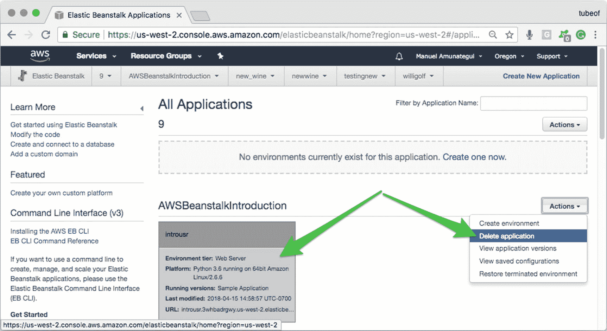

图 4-18

找到您想要终止或删除的实例，并使用“ **Actions** ”下拉按钮进行选择

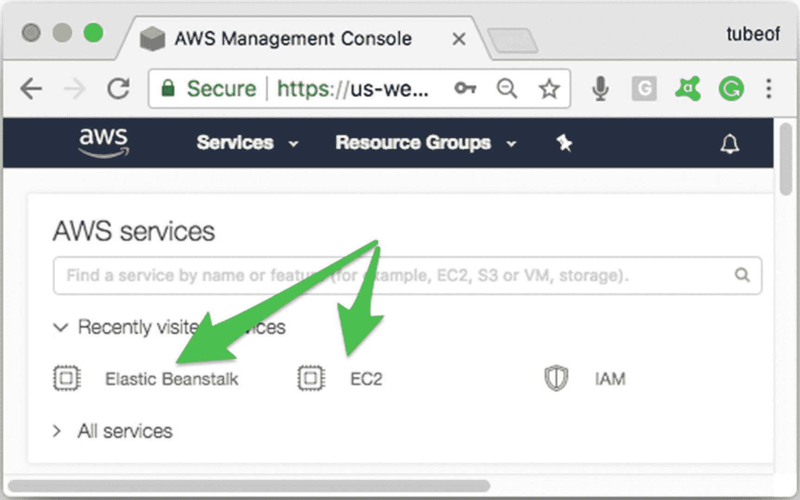

图 4-17

在 AWS 仪表板上检查任何活动的和不需要的实例

如果您每次"**删除应用程序**、"在 EC2 下检查"**负载平衡器**"并首先终止那些负载平衡器，然后返回并再次终止流氓实例(图 [4-19](#Fig19) )之后，您都看到一个实例似乎不断复活。

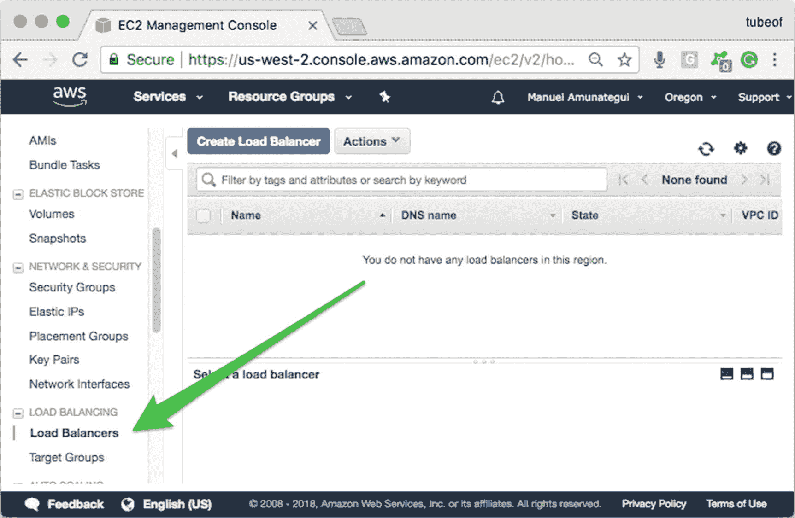

图 4-19

"**负载平衡器**"可以防止应用程序终止；如果您不小心启动了多个同名的实例，这种情况就会发生

## 步骤概述

让我们按照步骤将葡萄酒质量设计器 web 应用程序部署到 Amazon Web Services 上。

**第一步:启动虚拟环境**

```py
$ python3 -m venv wineenv
$ source wineenv/bin/activate

```

**第二步:安装 Python 库**

```py
$ pip3 install -r requirements.txt

```

**步骤 3:在本地测试 web 应用程序**

```py
$ python3 application.py

```

**第四步:创建 wsgi_fix.config 文件**

```py
$ mkdir .ebextensions
$ vi .ebextensions/wsgi_fix.config

#add the following to wsgi_fix.config
files:
  "/etc/httpd/conf.d/wsgi_custom.conf":
    mode: "000644"
    owner: root
    group: root
    content: |
      WSGIApplicationGroup %{GLOBAL}

```

**第五步:弹性豆茎**

```py
$ eb init -i
$ eb create winetest
$ eb open

```

**步骤 6:终止 web 应用程序**

```py
$ eb terminate

```

**第七步:退出虚拟环境**

```py
$ deactivate

```

## 解决纷争

在本地工作的 web 应用程序和云中工作的应用程序之间可能会出现各种各样的问题。如果你没有看到你所期望的，第一站是日志！

### 访问日志

如果您遇到问题，请检查日志并查找任何错误。使用清单 [4-37](#PC44) 中的以下命令可以在终端窗口中直接访问日志。

```py
$ eb logs

Listing 4-37Accessing the Logs

```

日志也可以在 Amazon Elastic Beanstalk 仪表板页面上访问(图 [4-20](#Fig20) )。

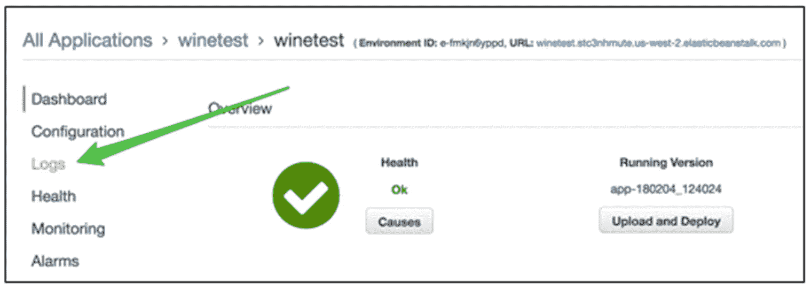

图 4-20

访问日志

选择最后 100 行日志(图 [4-21](#Fig21) )。


图 4-21

请求最后 100 行

### SSH 到您的实例

如果您想通过 SSH 直接进入您的新实例，请参见清单 [4-38](#PC45) 和图 [4-22](#Fig22) 。


图 4-22

直接 SSH 到您的弹性 Beanstalk 实例中

```py
$ eb ssh

Listing 4-38SSH into Your Instance

```

它将询问您是否希望 SSH 进入您的实例；键入“**是**”(图 [4-23](#Fig23) )。

你被录取了。这是您刚刚用" **eb create** 命令创建的 AWS Beanstalk 实例。


图 4-23

实例就绪

## 结论

在这一章中，我们创建了一个关于葡萄酒质量的 web 应用程序，使用了彩色图像和诱人的滑块(谁能抗拒滑块呢？).后端处理依赖于使用 Ajax 进行即时反馈的实时处理，而无需刷新整个页面`—`非常酷。

网上有很多关于 AWS 弹性豆茎和 EB with Flask 的免费资料。

*   EB 入门: [`https://docs.aws.amazon.com/elasticbeanstalk/latest/dg/command-reference-get-started.html`](https://docs.aws.amazon.com/elasticbeanstalk/latest/dg/command-reference-get-started.html)

*   将烧瓶应用程序部署到 AWS Elastic Beanstalk:AWS Beanstalk 上的简单烧瓶示例: [`https://docs.aws.amazon.com/elasticbeanstalk/latest/dg/create-deploy-python-flask.html#python-flask-`](https://docs.aws.amazon.com/elasticbeanstalk/latest/dg/create-deploy-python-flask.html#python-flask-)

*   使用 EB CLI 管理弹性 Beanstalk 环境: [`https://docs.aws.amazon.com/elasticbeanstalk/latest/dg/eb-cli3-getting-started.html`](https://docs.aws.amazon.com/elasticbeanstalk/latest/dg/eb-cli3-getting-started.html)

亚马逊网络服务是当今云计算领域的领导者。它拥有超过十年的市场主导地位，这是它的优势之一。用户可能会寻找其他地方的一些原因是多样性、冗余和成本节约。

<aside class="FootnoteSection" epub:type="footnotes">Footnotes [1](#Fn1_source)

[T2`http://scikit-learn.org/stable/modules/generated/sklearn.ensemble.GradientBoostingClassifier.html`](http://scikit-learn.org/stable/modules/generated/sklearn.ensemble.GradientBoostingClassifier.html)

  [2](#Fn2_source)

页（page 的缩写）Cortez，A. Cerdeira，F. Almeida，T. Matos 和 J. Reis，“通过物理化学性质的数据挖掘对葡萄酒偏好进行建模”，*决策支持系统* 47，第 4 期(2009): 547-553。

  [3](#Fn3_source)

[T2`https://archive.ics.uci.edu/ml/index.php`](https://archive.ics.uci.edu/ml/index.php)

  [4](#Fn4_source)

[T2`https://aws.amazon.com/elasticbeanstalk/`](https://aws.amazon.com/elasticbeanstalk/)

  [5](#Fn5_source)

[T2`https://archive.ics.uci.edu/ml/machine-learning-databases/wine-quality/winequality.names`](https://archive.ics.uci.edu/ml/machine-learning-databases/wine-quality/winequality.names)

  [6](#Fn6_source)

[T2`http://scikit-learn.org/stable/modules/generated/sklearn.ensemble.GradientBoostingClassifier.html`](http://scikit-learn.org/stable/modules/generated/sklearn.ensemble.GradientBoostingClassifier.html)

  [7](#Fn7_source)

[T2`http://scikit-learn.org/stable/modules/generated/sklearn.ensemble.GradientBoostingClassifier.html`](http://scikit-learn.org/stable/modules/generated/sklearn.ensemble.GradientBoostingClassifier.html)

  [8](#Fn8_source)

[T2`http://scikit-learn.org/stable/modules/generated/sklearn.metrics.precision_score.html`](http://scikit-learn.org/stable/modules/generated/sklearn.metrics.precision_score.html)

  [9](#Fn9_source)

[T2`http://scikit-learn.org/stable/auto_examples/model_selection/plot_confusion_matrix.html`](http://scikit-learn.org/stable/auto_examples/model_selection/plot_confusion_matrix.html)

  [10](#Fn10_source)

[T2`https://wiki.python.org/moin/UsingPickle`](https://wiki.python.org/moin/UsingPickle)

  [11](#Fn11_source)

[T2`http://scikit-learn.org/stable/modules/model_persistence.html`](http://scikit-learn.org/stable/modules/model_persistence.html)

  [12](#Fn12_source)

[T2`https://docs.aws.amazon.com/elasticbeanstalk/latest/dg/python-configuration-requirements.html`](https://docs.aws.amazon.com/elasticbeanstalk/latest/dg/python-configuration-requirements.html)

  [13](#Fn13_source)

[T2`https://docs.aws.amazon.com/elasticbeanstalk/latest/dg/command-reference-get-started.html`](https://docs.aws.amazon.com/elasticbeanstalk/latest/dg/command-reference-get-started.html)

  [14](#Fn14_source)

[T2`https://docs.aws.amazon.com/elasticbeanstalk/latest/dg/eb3-init.html`](https://docs.aws.amazon.com/elasticbeanstalk/latest/dg/eb3-init.html)

  [15](#Fn15_source)

[T2`http://modwsgi.readthedocs.io/en/develop/user-guides/application-issues.html#python-simplified-gil-state-api`](http://modwsgi.readthedocs.io/en/develop/user-guides/application-issues.html#python-simplified-gil-state-api)

  [16](#Fn16_source)

[`https://stackoverflow.com/questions/41812497/aws-elastic-beanstalk-script-timed-out-before-returning-headers-application-p`T2](https://stackoverflow.com/questions/41812497/aws-elastic-beanstalk-script-timed-out-before-returning-headers-application-p)

 </aside>