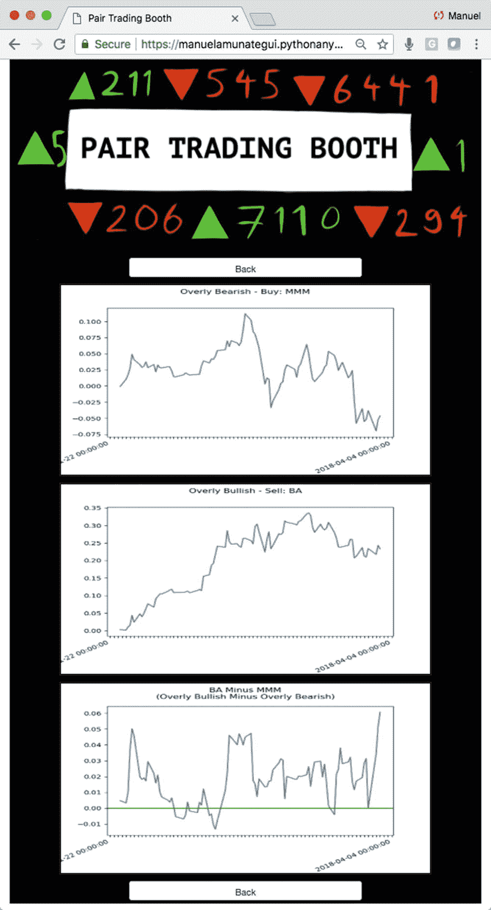
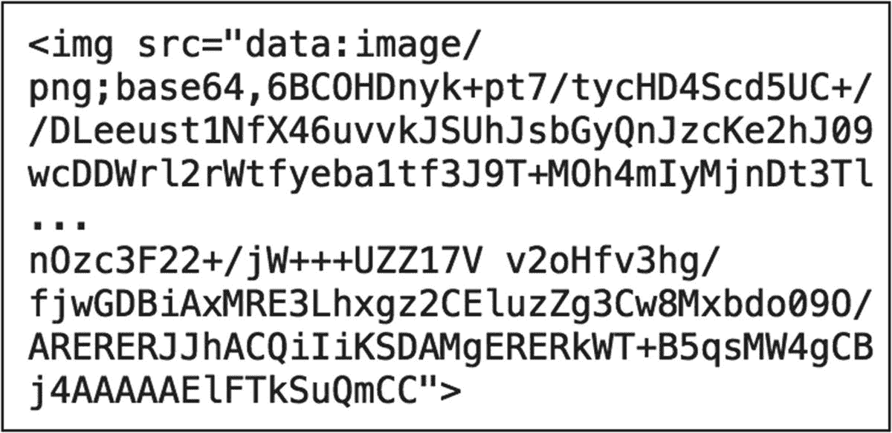
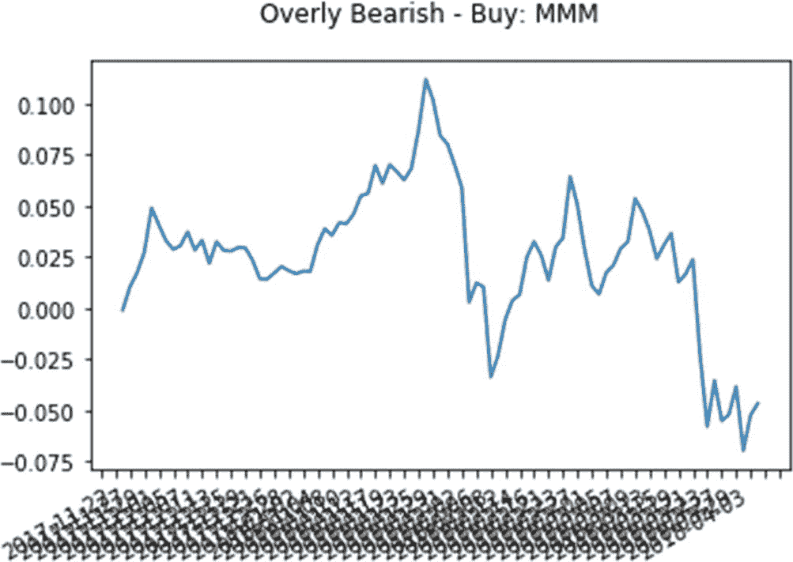
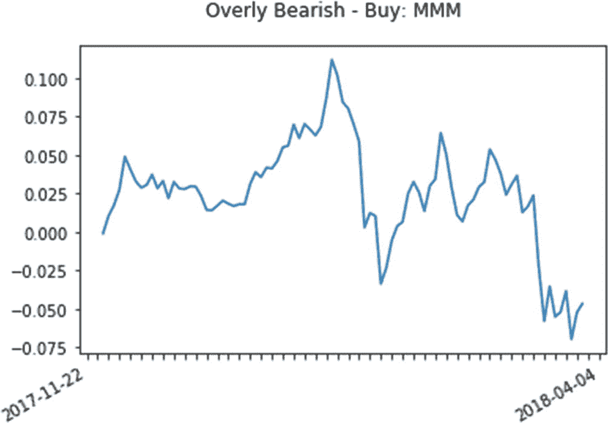
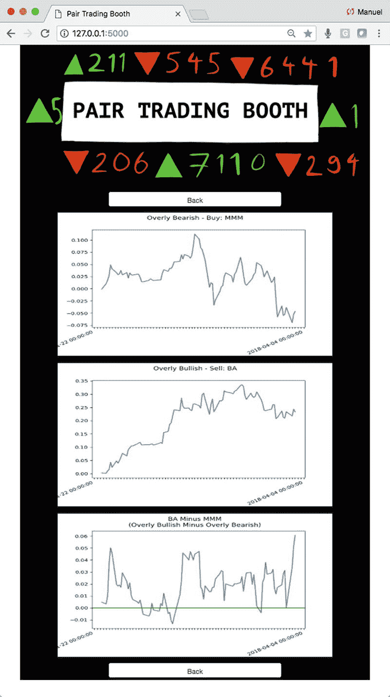
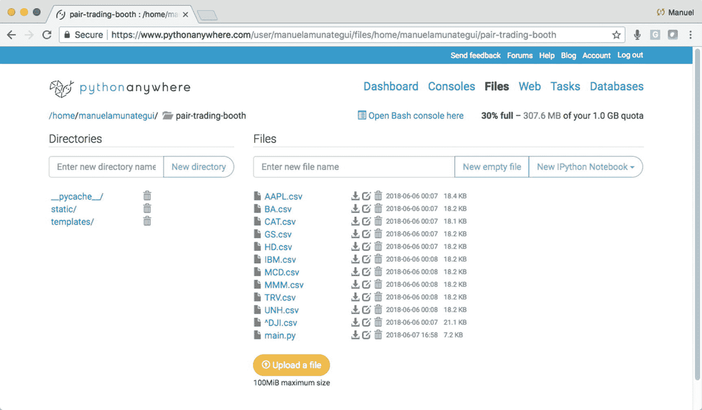
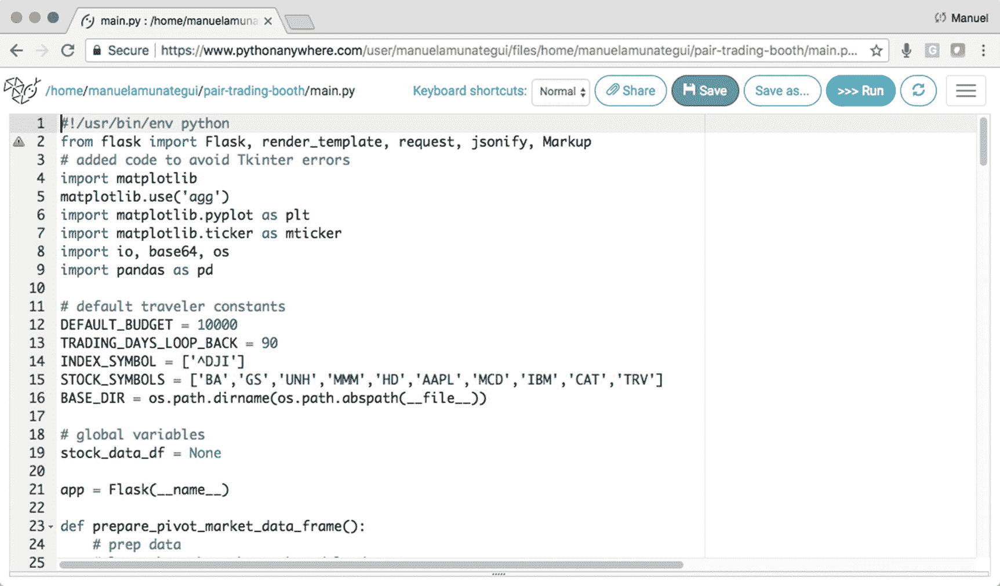
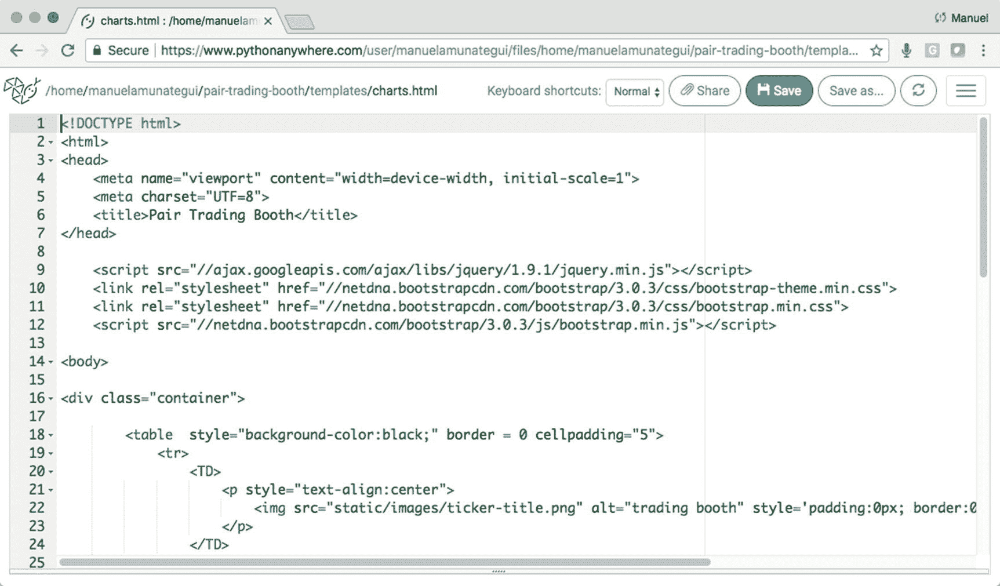
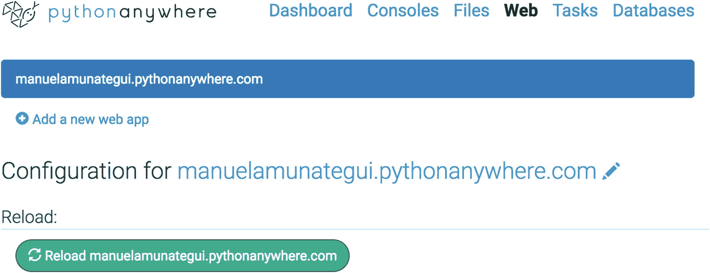
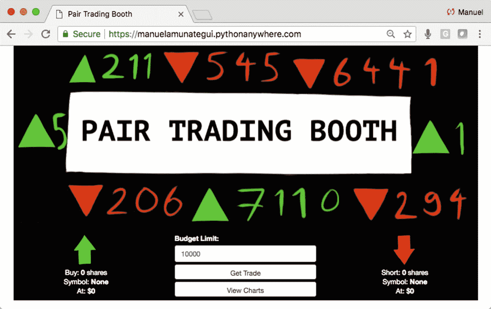

# 9.案例研究第 2 部分:显示动态图表

在 PythonAnywhere 上显示动态股票图表。

让我们为最初的案例研究 web 应用程序添加一些特性(确保您熟悉第 [5](05.html) 章中的“**运行在 PythonAnywhere** 上”)。成语“一张图胜过千言万语”在这里绝对适用，通过提供围绕推荐的配对交易的价格行为的可视化图表支持，将大大有助于用户评估事物。我们将添加三个图表(图 [9-1](#Fig1) )，一个图表显示每只股票的变化百分比，强势股票减去弱势股票的累计和。



图 9-1

本章的最后一个 web 应用程序

图表是在 Flask 中动态创建的，并被转换成 PNG 文件以供查看。这是我们用来构建 Titanic web 应用程序的相同技术，该应用程序允许您使用 Matplotlib 库方便地构建动态图，并将它们从二进制翻译成文本以供 web 发布。这允许随意创建动态图像，而不必将任何内容保存到文件中。

### 注意

进入 [`www.apress.com/9781484238721`](http://www.apress.com/9781484238721) 并点击源代码按钮，下载第 [9 章](09.html)的文件。打开 Jupyter 笔记本" **chapter9.ipynb** "跟随本章内容。

## 用 Matplotlib 创建股票图表

让我们开始吧；将本章的文件下载到一个名为“ **chapter-9** 的文件夹中，然后打开 Jupyter 笔记本继续学习。这是我们在前几章中用过的方法，我们将继续使用。这种方法允许我们使用 Matplotlib 创建图像，然后将它们翻译成字符串，这样它们就可以被 HTML 解释器动态地输入和理解。

在下面的简化代码片段中，我们使用“ **matplotlib.pyplot** ”库(清单 [9-1](#PC1) )在 Python 中创建了一个图像。

```py
import matplotlib.pyplot as plt
fig = plt.figure()
plt.bar(y_pos, performance, align="center", color = colors, alpha=0.5)
img = io.BytesIO()
plt.savefig(img, format="png")
img.seek(0)
plot_url = base64.b64encode(img.getvalue()).decode()

Listing 9-1Creating Encoded String Images

```

然后可以使用 Flask Jinja2 模板符号将变量“ **plot_url** ”注入到 HTML 代码中(清单 [9-2](#PC2) )。

```py
model_plot = Markup(''.format(plot_url))

...

<div>{{model_plot}}</div>

Listing 9-2Injecting Dynamic Images Using Flask and Jinja2

```

如果你查看 HTML 源文件的输出，你会发现 HTML 图像标签是由一个巨大的字符串输出组成的(在这里被彻底地截断了)，解释器知道它要翻译成一个图像(图 [9-2](#Fig2) )。



图 9-2

转换成字符串的图像

## 探索配对交易图表

继续将本章的文件下载到名为“ **chapter-9** ”的文件夹中打开 Jupyter 笔记本，继续学习。您将在这个笔记本中看到许多重复的代码，以便加载和处理所有需要的财务数据，从而进入图表部分。

我们将为我们的访问者提供三个图表，一个图表显示每只股票的变化百分比，以及强势股票减去弱势股票的累计和。Jupyter 笔记本的前半部分是第 9 章的重复。我们需要不断重复代码，因为我们是在以前的基础上构建这些图表的。向下滚动到“**第二部分**

让我们通过不同的步骤运行一个图表，将它转换成文本格式，以便从 web 服务器正确地提供给 web 客户机。我们构建它就像我们在 Matplotlib 中构建任何图表一样。我们创建子情节来启动一个情节对象，向其传递我们的财务数据，创建一个标题，并旋转 x 轴日期字段(列表 [9-3](#PC3) 和图 [9-3](#Fig3) )。



图 9-3

x 轴旋转但仍不可读的原始图

```py
fig, ax = plt.subplots()
ax.plot(temp_series1.index , long_trade_df)
plt.suptitle('Overly Bearish - Buy: ' + weakest_symbol[0])

# rotate dates
myLocator = mticker.MultipleLocator(2)
ax.xaxis.set_major_locator(myLocator)
fig.autofmt_xdate()

Listing 9-3
Plotting Price Difference

```

我们还做了一些额外的工作来正确格式化 x 轴上的标签。轮换确实有帮助，但我们需要删除一些日期。有许多方法可以实现这一点，但是我们将删除除第一个和最后一个日期之外的所有日期(具体来说，我们将只保留第二个日期和倒数第二个日期；列表 [9-4](#PC4) 。

```py
Input:

labels = [" for item in ax.get_xticklabels()]
labels[1] = temp_series1.index[0]
labels[-2] = temp_series1.index[-1]
labels = [" for item in ax.get_xticklabels()]
labels[1] = temp_series1.index[0]
labels[-2] = temp_series1.index[-1]
ax.set_xticklabels(labels)

Output:

[Text(0,0,"),
 Text(0,0,'2017-11-22'),
 Text(0,0,"),
 Text(0,0,"),
 Text(0,0,"),
 Text(0,0,"),
 Text(0,0,"),

 ...
 Text(0,0,"),
 Text(0,0,"),
 Text(0,0,"),
 Text(0,0,"),
 Text(0,0,"),
 Text(0,0,"),
 Text(0,0,"),
 Text(0,0,"),
 Text(0,0,"),
 Text(0,0,'2018-04-04'),
 Text(0,0,")]

Listing 9-4Fixing Label to Only Show First and Last Date

```

这产生了一个可读性更强、更轻松的图表，只显示了两个标题日期，第二个和倒数第二个(图 [9-4](#Fig4) )。



图 9-4

仅显示极端日期的可读性更强的图表

最后，我们使用 IO 库中的“ **BytesIO()** ”函数将图像数据转换成文本。我们从 Matplotlib 调用“ **savefig()** ”函数来指定输出格式(尽管这没有被保存到文件中)，最后调用 base64 库的“ **b64encode()** ”函数。此时，我们的" **plot_url** "变量保存了图像的文本表示，我们可以使用 Flask 轻松地将它传递给 web 客户端。这是一种以可伸缩和无会话方式创建动态图像的非常聪明的方法(清单 [9-5](#PC5) )。

```py
Input:

img = io.BytesIO()
plt.savefig(img, format="png")
img.seek(0)
plot_url = base64.b64encode(img.getvalue()).decode()
plot_url

Output:

'iVBORw0KGgoAAAANSUhEUgAAAbAAAAEgCAYAAADVKCZpAAAABHNCSVQICAgIfAhkiAAAAAlwSFlzAAALEgAACxIB0t1+/AAAADl0RVh0U29mdHdhcmUAbWF0cGxvdGxpYiB2ZXJzaW9uIDIuMi4yLCBodHRwOi8vbWF0cGxvdGxpYi5vcmcvhp/UCwAAIABJREFUeJzs3Xl4lOXV+PHvJJPJvu9MAlkmhBCWAImAK7JFUWMVyiaCVqVaW1vfWrGtYtVX5bWtb1+r/hS1EhSNiEoQZccFRIEgwUBYEkgg+77vs/...

Listing 9-5
Sampling Encoded Output

```

## 设计 Web 应用程序

如果您还没有下载本章的代码，请继续下载；打开命令行窗口，将驱动器更改为“ **web 应用程序**文件夹。它应该包含以下文件，如清单 [9-6](#PC6) 所示。

```py
web-application
        ├── main.py
        ├── requirements.txt
        ├── static
                                └── images
                                       ├── ticker-title.png
                                       ├── up-arrow.png
                                       └── down-arrow.png

        ├── templates
                                ├── charts.html
                                └── index.html
        ├── ^DJI.csv
        ├── AAPL.csv
        ├── BA.csv
        ├── CAT.csv
        ├── GS.csv
        ├── HD.csv
        ├── IBM.csv
        ├── MCD.csv
        ├── MMM.csv
        ├── TRV.csv
        ├── UNH.csv
        ├── requirements.txt
        └── main.py

Listing 9-6Web Application Files

```

像往常一样，我们将启动一个虚拟环境来隔离我们的 Python 库安装，并在需要时创建“ **requirements.txt** ”文件(清单 [9-7](#PC7) )。

```py
$ python3 -m venv pairtrading
$ source pairtrading/bin/activate

Listing 9-7Starting Virtual Environment

```

然后通过运行“ **pip3 install -r** ”命令安装所有需要的 Python 库(清单 [9-8](#PC8) )。

```py
$ pip3 install -r requirements.txt
$ python3 main.py

Listing 9-8Installing Requirements and Run a Local Version of the Web Application

```

以通常的方式运行 web 应用程序，并确保它像宣传的那样工作。第一次运行时可能会有点慢，但之后应该会变得更加灵活。另外，尝试页面上的各种选项，以确保一切正常运行。

## 移动友好型桌子

我们通过在表格单元格中绘制图表来保持 web 应用程序的移动友好性，以确保无论屏幕大小如何，图表都能正确调整大小。我们在“ **< img >** ”标签的宽度和高度参数中使用百分比大小(如果您愿意，您可以限制高度，但是如果我们希望它自动调整，我们需要宽度是一个百分比)，并将每个图像包装在一个“ **< td >** ”单元格中(清单 [9-9](#PC9) )。

```py
Input:

chart1_plot = Markup(''.format(plot_url))

Output:

<table>
...
        <tr>
              <td align="center">
                    {{chart1_plot}}
              </td>
        </tr>
        <tr>
              <td align="center">
                    {{chart2_plot}}
              </td>
        </tr>
        <tr>
              <td align="center">
                    {{chart_diff_plot}}
              </td>
        </tr>
...
</table>

Listing 9-9
Friendly Tables

```

这是一种简单的方法，可以利用 HTML 中图像的灵活性，根据其边框来调整大小(图 [9-5](#Fig5) )。



图 9-5

股价图的窄视图会根据客户端的网页大小自动调整大小

## 将我们的 Web 应用程序上传到 PythonAnywhere

让我们将更新后的代码上传到 PythonAnywhere。本章的项目是第[5](05.html)T0】章的延续。请按照这个顺序处理案例研究，因为我们将建立在我们之前的 PythonAnywhere 工作的基础上。登录你的 PythonAnywhere 账户，找到我们之前创建的文件夹“ **pair-trading-booth** ”。点击顶部菜单栏中的“**文件**链接，进入“ **pair-trading-booth** 目录(图 [9-6](#Fig6) )。



图 9-6

我们在 PythonAnywhere 上的配对交易应用程序

所需的所有财务 CSV 文件应该已经存在(如果没有，请再次浏览第 [5](05.html) 章)，我们需要做的就是更新“ **main.py** ”和“【index.html】T4”文件，并添加一个新的“**charts.html**文件来显示我们的股票和衍生图表。最好的方法是在本地编辑器中打开这些文件，将内容复制并粘贴到 PythonAnywhere 中。

例如，让我们更新“ **main.py** ”，在您的本地编辑器中打开文件，并在 PythonAnywhere 中打开文件，然后将新版本复制并粘贴到您在 PythonAnywhere 上的“ **main.py** ”文件中。在移动到其他文件之前，不要忘记点击绿色的“**保存**”按钮(图 [9-7](#Fig7) )。



图 9-7

更新 PythonAnywhere 上的“ **main.py** ”代码库，处理动态图表的创建

以同样的方式在模板文件夹中为文件“**index.html**”创建一个名为“**charts.html**”的新 HTML 文件(图 [9-8](#Fig8) )。



图 9-8

在 PythonAnywhere 上创建一个名为“**charts.html**”的新文件来处理动态图表的创建

现在您已经准备好刷新您的 web 服务并启动 web 应用程序了。点击“ **Web** ”菜单标签，点击绿色大按钮，重新加载应用程序(图 [9-9](#Fig9) )。



图 9-9

点击“**重新加载**按钮来更新你的网络服务器

如果你在浏览器中输入 PythonAnywhere 网站的 URL，你应该会看到新的“ **Pair Trading Booth** ”网站的辉煌。点击“**获取交易**”和“**查看图表**”按钮(图 [9-10](#Fig10) )，继续进行测试。



图 9-10

新的" **Pair 交易摊位**"网站增加了图表

## 结论

在本章中，我们对“**Pair Trading Booth**”web 应用程序进行了第二次测试，并用图表功能对其进行了增强。虽然我们没有引入任何新技术，但我们成功地增强了它的额外功能，同时保留了它的移动观看功能。我们使用百分比而不是固定大小来调整表格和动态图像的大小；有时候简单的事情才是最有力量的。