# 十、基于 GCP 的奇异值分解推荐

接下来看什么？让我们推荐使用 SVD 和 Google Cloud 上的维基百科 API 的电影选项。

在这一章中，我们将使用 MovieLens 数据集构建一个电影推荐 web 应用程序(图 [10-1](#Fig1) ),该数据集包含“ **100，000 个评级和 1，300 个标签应用程序，由 700 个用户应用于 9，000 部电影**” <sup>[1](#Fn1)</sup> 我们将探索不同的相似性度量技术，并设计一个推荐应用程序，使用奇异值分解(SVD)和协同过滤来推荐优秀的电影。


图 10-1

本章的最后一个 web 应用程序

### 注意

进入 [`www.apress.com/9781484238721`](http://www.apress.com/9781484238721) 并点击源代码按钮，下载第 [10 章](10.html)的文件。打开 Jupyter 笔记本" **chapter10.ipynb** "跟随本章内容。

## 规划我们的 Web 应用程序

我们将重点关注使用 MovieLens 数据集中的电影评级进行协同过滤。 <sup>[2](#Fn2)</sup> 这可能是学习这个话题最流行的数据集。我们基本上是要利用群众的智慧来提出电影推荐。我们将构建一个 web 应用程序，用户可以选择几部电影，应用程序将返回相关的电影推荐。为了让它更有知识性和趣味性，我们还会从维基百科中获取关于热门电影推荐的相关信息和图片。

## 推荐系统概述

推荐系统在网络和电子商务中非常重要。任何时候，一个网站根据你正在看的东西或你的偏好进行推荐，它都在使用某种形式的推荐模型。推荐系统的类型变化很大，这取决于所使用的工具以及定制和智能数据的可用性。两个流行的领域是"**基于内容的**和"**协同过滤**"

在这一章中，我们将集中讨论协同过滤，而不是基于内容的过滤。来自 MovieLens 的数据包含各种电影的用户评级。使用这些数据应用 CF 背后的原因是，如果你和一个评论者喜欢同一部电影，那么你很有可能会喜欢那个人评论的其他电影。

## 探索 MovieLens 数据集

我们来看看 MovieLens 的数据。根据 ml-latest-small 数据集上的 movie lens liner notes<sup>[3](#Fn3)</sup>，该数据集包含 9125 部电影的 100004 个评级，由 671 名用户在 1995 年至 2016 年间创建。

### 更多来自 MovieLens 数据集的 Liner 注释

**收视率数据文件结构(" ratings.csv"):**

*   所有评级都包含在文件“ **ratings.csv** ”中标题行之后的每一行表示一个用户对一部电影的一个评价，格式如下:userId，movieId，rating，timestamp。

*   该文件中的行首先按 userId 排序，然后在 user 中按 movieId 排序。

*   评分等级为 5 星，增量为半星(0.5 星-5.0 星)。

*   时间戳表示自协调世界时(UTC)1970 年 1 月 1 日午夜以来的秒数。

**电影数据文件结构(" movies.csv"):**

*   电影信息包含在文件“ **movies.csv** ”中标题行之后的每一行代表一部电影，格式如下:movieId，title，genres。

*   手动输入或从 [`https://www.themoviedb.org/`](https://www.themoviedb.org/) 输入电影名称，并在括号中注明上映年份。这些标题中可能存在错误和不一致之处。

*   流派是一个用竖线分隔的列表，可从以下列表中选择:
    *   行动

    *   冒险

    *   动画

    *   孩子们的

    *   喜剧

    *   犯罪

    *   纪录片

    *   戏剧

    *   幻想

    *   电影-黑色

    *   恐怖

    *   音乐的

    *   秘密

    *   浪漫性

    *   科幻小说

    *   惊悚片

    *   战争

    *   西部风格

    *   (未列出流派)

继续把这一章的文件下载到一个名为“**第 10 章**的文件夹中下载“ **ml-latest-small.zip** ”数据集( [`http://files.grouplens.org/datasets/movielens/ml-latest-small.zip`](http://files.grouplens.org/datasets/movielens/ml-latest-small.zip) )，解压到你的“ **chapter-10** ”文件夹。我们将只使用" **ratings.csv** "和" **movies.csv** "数据集。你应该在 Jupyter 笔记本上记下本章需要的所有东西。

## “ratings.csv”和“movies.csv”概述

快速看一下熊猫“**外形**”、“**尾巴()**”、**收视率. csv** 的功能这是一个又窄又长的表，它的时间戳是 Unix 时间，这是从 UTC 1970 年 1 月 1 日开始以秒为单位的时间的整数表示。我们会解决这个问题的。这里我们有一个名为“ **ml-latest-small** 的文件夹中的 CSV 文件；相应地调整您的(列表 [10-1](#PC1) 和图 [10-2](#Fig2) )。

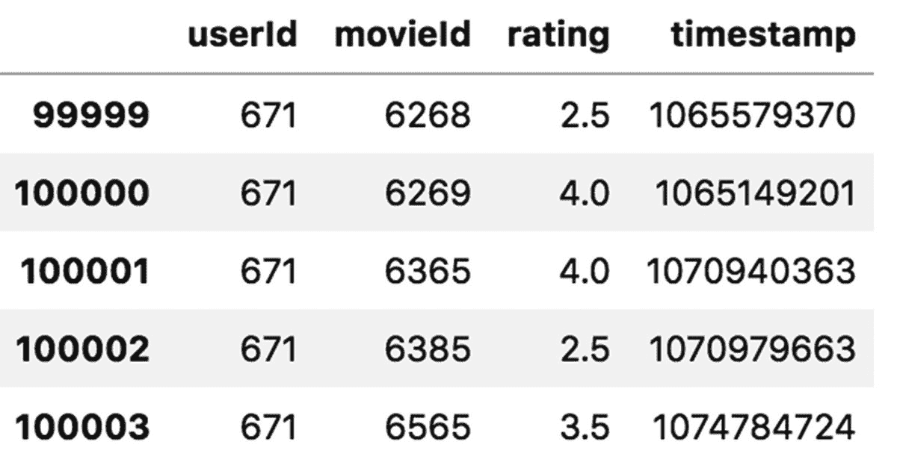

图 10-2

" **ratings.csv** 的原始输出

```py
Input:

pd.read_csv('ml-latest-small/ratings.csv')
print('Shape:', ratings_df.shape)
print('Tail:', ratings_df.tail())

Output:

Shape: (100004, 4)

Listing 10-1A look at “ratings.csv”

```

我们将使用 datetime 的" **fromtimestamp()** "函数将 Unix 时间转换成实际的可读时间戳。使用“ **describe()** ”我们可以确认这一变化，并看到评级范围从 1995 年 1 月到 2016 年 10 月(列表 [10-2](#PC2) )。

```py
Input:

import datetime
ratings_df['timestamp'] = [datetime.datetime.fromtimestamp(dt) for dt in ratings_df['timestamp'].values]
ratings_df['timestamp'].describe()

Output:

count                  100004
unique                  78141
top       2016-07-23 05:54:42
freq                       87
first     1995-01-09 03:46:49
last      2016-10-16 10:57:24
Name: timestamp, dtype: object

Listing 10-2A Look at Timestamps

```

当我们在“ **ratings.csv** 上运行熊猫“ **describe()** ”时，我们看到最低评分为 0.5，最高为 5，平均为 4(列表 [10-3](#PC3) ，图 [10-3](#Fig3) )。

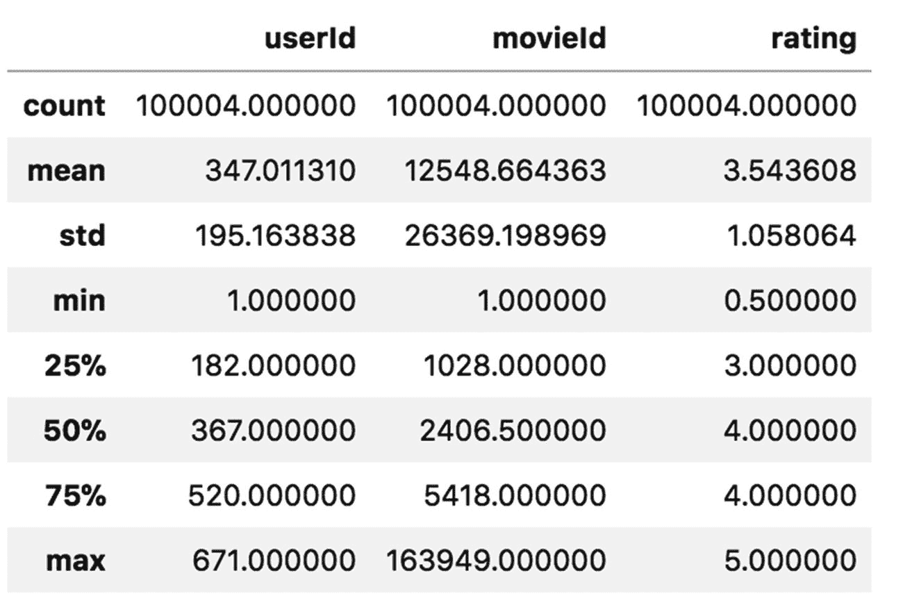

图 10-3

" **Describe()** “数据帧输出” **ratings_df** "

```py
ratings_df.describe()

Listing 10-3Function “describe()” on “ratings_df”

```

对于我们的需求，电影数据框中有多少部电影并不重要；我们关心的是收视率数据中有多少电影被评级(列表 [10-4](#PC4) )。

```py
Input:

print('Unique number of rated movies: %i' % len(set(ratings_df['movieId'])))

Output:

Unique number of rated movies: 9066

Listing 10-4Count of Unique Movies

```

因此，我们实际上只有 9066 部电影可以处理，而不是像班轮说明中提到的 9125 部。并且唯一评论数为 671(列表 [10-5](#PC5) )。

```py
Input:

print('Unique user count with ratings: %i' % len(set(ratings_df['userId'])))

Output:

Unique user count with ratings: 671

Listing 10-5Unique User Count with Ratings

```

我们来看看“ **movies.csv** ”特征“**标题**”很简单，而“**流派**”是一个有趣的类别，我们将进一步探索(列表 [10-6](#PC6) 和图 [10-4](#Fig4) )。


图 10-4

" **movies.csv** 的原始输出

```py
Input:

movies_df = pd.read_csv('ml-latest-small/movies.csv')
print('Shape:', movies_df.shape)
movies_df.tail()

Output:

Shape: (9125, 3)

Listing 10-6A Look at “movies.csv”

```

当我们运行“ **describe()** ”时，我们注意到特征“ **movieId** ”与数据帧的索引不匹配。最大 movieId 为 164，979，只有 9，124 行。它很可能是一个通用的 MovieLens 标识符。这是我们需要调整的，以确保 movieId 遵循表的索引；一旦我们从数据框架转移到矩阵，这将使我们的生活变得容易得多(列表 [10-7](#PC7) 和图 [10-5](#Fig5) )。

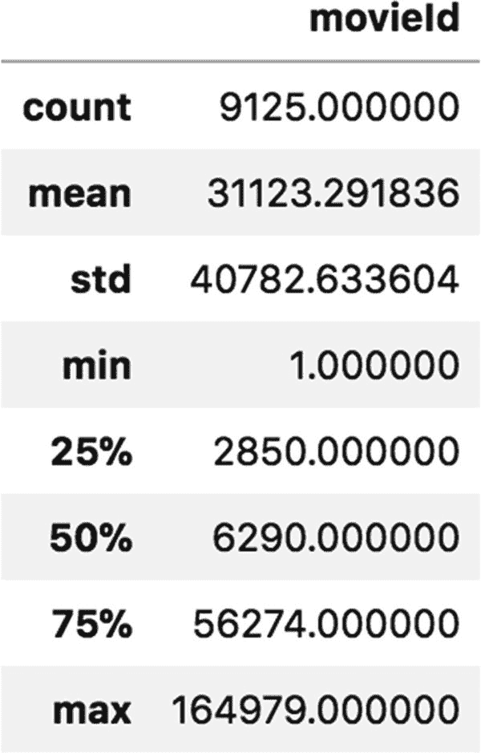

图 10-5

" **describe()** "输出

```py
movies_df.describe()

Listing 10-7Running Function “describe()” on “movies_df”

```

## 理解评论和评论文化

现在，我们对这两个数据框有了基本的了解，我们将重点关注它们包含的内容。让我们从每个用户 id 的评论数量开始(列表 [10-8](#PC8) 和图 [10-6](#Fig6) )。

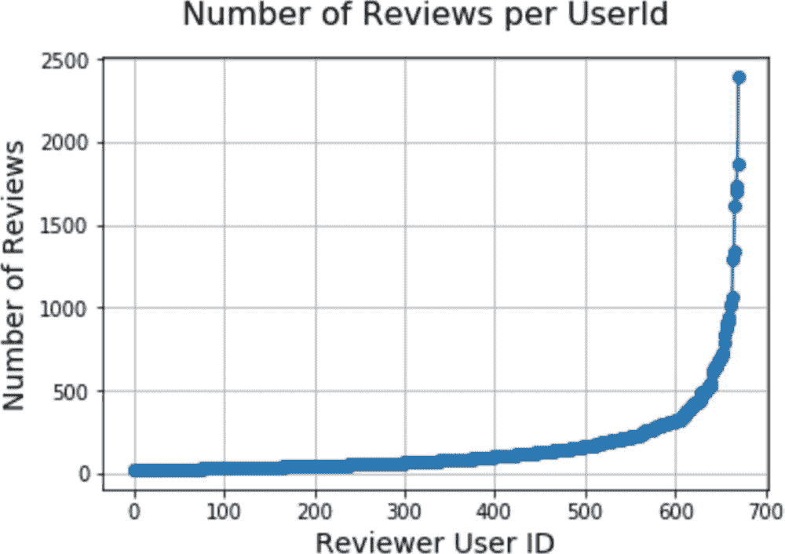

图 10-6

每个用户 ID 的评论总数

```py
plt.plot(sorted(ratings_df['userId'].value_counts(normalize=False)), marker="o")
plt.suptitle('Number of Reviews per UserId', fontsize=16)
plt.xlabel('Reviewer User ID', fontsize=14)
plt.ylabel('Number of Reviews', fontsize=14)
plt.grid()
plt.show()

Listing 10-8Plot Reviews per Users

```

我们看到大多数评论者的评论不到 200 条，但是一个评论者有将近 2500 条！让我们来看看实际收视率的分布(列表 [10-9](#PC9) 和图 [10-7](#Fig7) )。

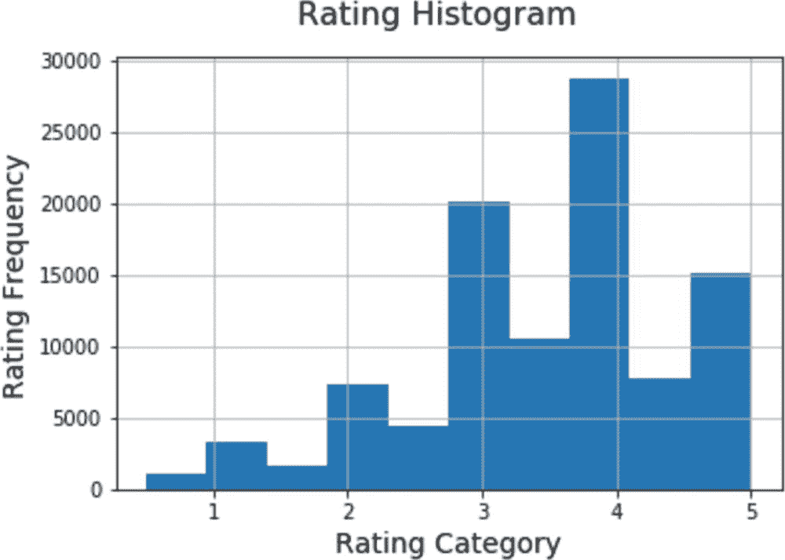

图 10-7

每个类别的总评分直方图

```py
ratings_df['rating'].plot.hist()
plt.suptitle('Rating Histogram', fontsize=16)
plt.xlabel('Rating Category', fontsize=14)
plt.ylabel('Rating Frequency', fontsize=14)
plt.grid()
plt.show()

Listing 10-9Count of Unique Movies

```

这个图表很重要，因为它显示了我们的评论者喜欢使用的评级类型。在 1 到 5 的范围内，您可能会认为平均分布会使“ **3** ”成为使用最多的等级。我们清楚地看到，事实并非如此，评分为“ **4** 是最受欢迎的评分，其次是“ **3** 和“ **5** ”花些时间思考这一点至关重要。我们即将围绕用户评级建立模型，我们需要能够在平等的基础上比较每个评论者。我们如何将每个用户的评级归纳为可以与所有其他用户相比较？一种技术是将每个用户的评论集中在该用户评级的平均值周围。这将创建一个中心“ **0** ”点，该点将与所有其他审阅者的中心点`—`保持一致，即中性审阅级别。当然，如果一个评审员只有一个评审，这个系统就不行。

电影数据集的分类“**流派**”字段有助于快速了解数据集包含的电影类型。戏剧和喜剧似乎是最大的类别(图 [10-8](#Fig8) )。

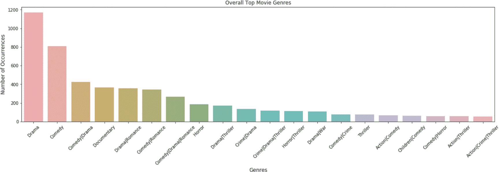

图 10-8

总体顶级电影类型

我们还可以通过结合评级和电影数据框架，来查看这些年来电影"**流派**的分类。这很容易用 Pandas 的 **merge()** 函数来完成。我们在公共索引字段" **movieId** 上加入，然后从"**时间戳**"特性中提取年份(清单 [10-10](#PC10) )。

```py
reviews_by_genres = pd.merge(movies_df, ratings_df, how = 'inner', on ='movieId')
reviews_by_genres['year'] = reviews_by_genres['timestamp'].dt.year

Listing 10-10Merging Movies and Reviews by Year

```

现在我们可以绘制由这两个表中按年份细分的特征组成的数据，例如每年回顾的最受欢迎的“**流派**”。我们必须执行一个稍微复杂一点的" **groupby()** "函数调用来获得一个"**流派**"按年份的总计数(清单 [10-11](#PC11) 和图 [10-9](#Fig9) )。


图 10-9

按回顾年份统计的热门流派

```py
def top_category_count(x, n=1):
    return x.value_counts().head(n)

reviews_by_genres = reviews_by_genres.groupby(['year']).genres.apply(top_category_count).reset_index()

plt.figure(figsize=(20,5))
g = sns.barplot(reviews_by_genres['year'], reviews_by_genres['genres'], alpha=0.8)
plt.title('Top Genres Count by Year Reviewed')
plt.ylabel('Number of Occurrences', fontsize=12)
plt.xlabel('Genres', fontsize=12)
plt.xticks(rotation=45)

for index, row in reviews_by_genres.iterrows():
    g.text(row.name, row.genres, row.level_1, ha="center", rotation=45, color="blue", verticalalignment="bottom", fontsize=10)

plt.show()

Listing 10-11Top Genres by Year Reviewed

```

不足为奇的是，“**戏剧**”是最常见的，也有一些“**喜剧**”2000 年似乎是 T4 戏剧电影的好年景。

## 获得推荐

到目前为止，您应该对我们正在使用的数据有了清晰的理解，这将使下面关于建模的部分变得更加容易理解。

为了简化我们的过滤过程，我们将创建一个“**矩阵**，它仅由收视率数据帧中的三个字段组成:“**用户 Id** 、“**电影 Id** 、“**收视率**”(列表 [10-12](#PC12) )。

```py
Input:

ratings_df.set_index(['userId', 'movieId'], inplace=True)
ratings_matrix = sps.csr_matrix((ratings_df.rating,
                      (ratings_df.index.labels[0], ratings_df.index.labels[1]))).todense()
print('shape ratings_matrix:', ratings_matrix.shape)

Output:

shape ratings_matrix: (671, 9066)

Listing 10-12Creating User by Movie Ratings Matrix

```

这是通过将索引设置为“ **userId** 和“ **movieId** ”，然后使用一个行索引和另一个列索引创建一个矩阵来实现的。因为许多评级将为零，所以我们使用“**scipy . sparse . CSR _ matrix()**”函数来创建高效的稀疏矩阵(有关更多信息，请参见位于 [`https://docs.scipy.org/doc/scipy-0.15.1/reference/generated/scipy.sparse.csr_matrix.html`](https://docs.scipy.org/doc/scipy-0.15.1/reference/generated/scipy.sparse.csr_matrix.html) 的官方文档)。矩阵将如图 [10-10](#Fig10) 所示。

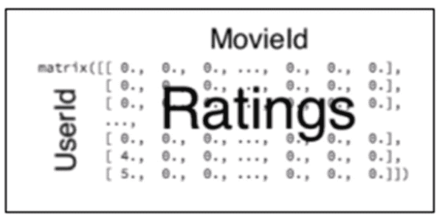

图 10-10

非常重要的"**用户**"通过"**分级电影**矩阵

使用这个矩阵将使我们的查询、相似性度量和最终的 SVD 模型运行得更快。

我们还需要创建一个连续索引的电影列表，其排序顺序与电影数据帧中原始电影 id 的排序顺序相同。这可以通过删除原始的“ **movieId** ”字段并用行索引替换它来轻松完成。然后我们将其合并到收视率表中，并为收视率和电影采用新的 Id(列表 [10-13](#PC13) 和图 [10-11](#Fig11) )。


图 10-11

旧的参差不齐的电影 Id 与新的增量电影 Id 的对比

```py
movies_df_raw = pd.read_csv('ml-latest-small/movies.csv')
movies_df_raw['movieId_new'] = movies_df_raw.index
movies_df_raw.tail()

Listing 10-13Fixing Movie Ids

```

我们将依靠这个行索引来提取相似性。通过查看尾部，我们确认总共有 9，066 部独特的电影。我们需要将这个新的电影 Id 应用于收视率和电影数据帧，并将其重命名为“ **movieId** ”以保持一致性(清单 [10-14](#PC14) )。

```py
ratings_df_raw = ratings_df_raw.merge(movies_df_raw[['movieId', 'movieId_new']], on="movieId", how="inner")
ratings_df_raw = ratings_df_raw[['userId',  'movieId_new', 'rating']]
ratings_df_raw.columns = ['userId',  'movieId', 'rating']

movies_df_raw = movies_df_raw[['movieId_new', 'title', 'genres']]
movies_df_raw.columns = ['movieId', 'title', 'genres']

Listing 10-14Applying Fixed Movie Id

```

在深入研究相似性度量之前，我们需要做的最后一件事是提取一个基础电影，我们将在所有后续的相似性算法中使用它。我们将把评级表中的评级数据放在索引" **0** "处；这代表了原《玩具总动员》电影的所有评分(列表 [10-15](#PC15) )。

```py
Input:

movie_toy_story = (mat[:,0])
movie_toy_story[0:20]

Output:

matrix([[ 0\. ],
        [ 0\. ],
        [ 0\. ],
        [ 0\. ],
        [ 0\. ],
        [ 0\. ],
        [ 3\. ],
        [ 0\. ],
        [ 4\. ],
        [ 0\. ],
        [ 0\. ],
        [ 0\. ],
        [ 5\. ],
        [ 0\. ],
        [ 2\. ],
        [ 0\. ],
        [ 0\. ],
        [ 0\. ],
        [ 3\. ],
        [ 3.5]])

Listing 10-15Basing Reviews on Toy Story

```

## 协同过滤

协同过滤是一种流行的推荐系统，它基于利用具有相似性的其他用户的喜好。

## 相似性/距离测量工具

有大量的距离测量公式来测量两个数字列表之间的相似性或不相似性。当你想比较不同组的数字时，这非常方便。这里，我们将通过使用具有欧几里德距离和余弦相似性度量的用户推荐来比较电影。

我们将再次利用伟大的 Scipy 库，并使用它的距离计算" **scipy.spatial.distance()** "函数来满足本章中的大部分需求。

## 欧几里得距离

简单来说，欧几里德距离是两点之间的距离，可能是最流行的距离算法。这里我们将使用 Scipy 的"**spatial . distance . Euclidean()**"函数来计算我们的玩具总动员的种子行与所有其他行的欧几里德距离(列表 [10-16](#PC16) 和图 [10-12](#Fig12) )。

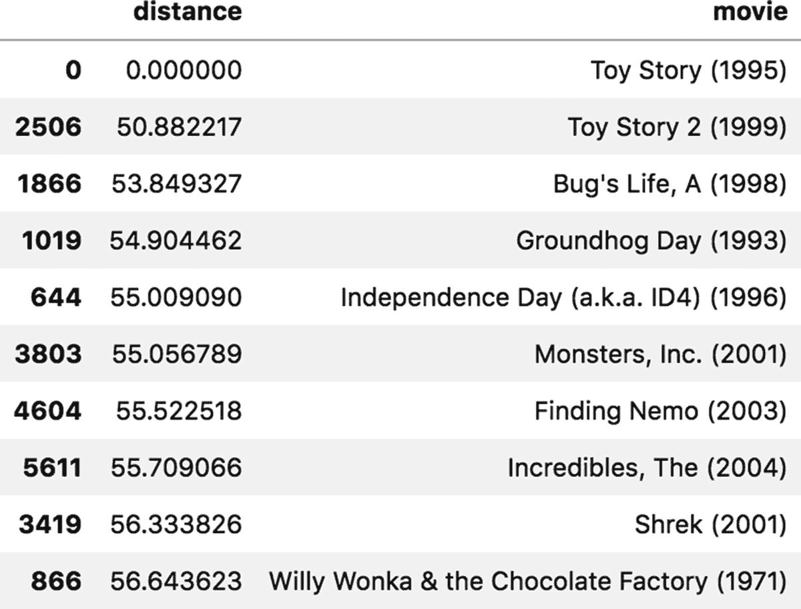

图 10-12

与《玩具总动员》( 1995)欧氏距离最短的电影

```py
distances_to_movie = []
for other_movies in mat.T:
    distances_to_movie.append(scipy.spatial.distance.euclidean(movie_toy_story, other_movies.tolist()))

# create dataframe of movie and distance scores to Toy Story
distances_to_movie = pd.DataFrame({'movie':movies_df['title'],'distance':distances_to_movie})

# sort by ascending distance (i.e. closest to movie_toy_story)
distances_to_movie = distances_to_movie.sort_values('distance')
distances_to_movie.head(10)

Listing 10-16Getting Similar Movies

```

欧几里德距离很好地将《玩具总动员》与“**玩具总动员 2** ”和“**一只虫子的一生**”联系起来；直觉上，是有道理的。

## 余弦相似距离

余弦相似性度量两个向量之间的余弦角。 <sup>[4](#Fn4)</sup> 这是欧几里德距离的一种更复杂的测量形式，我们将在本章通篇使用。

让我们重复前面的练习，使用 Scipy 的"**spatial . distance . cosine()**"函数来计算从玩具总动员的种子行到所有其他行的余弦距离(列表 [10-17](#PC17) 和图 [10-13](#Fig13) )。

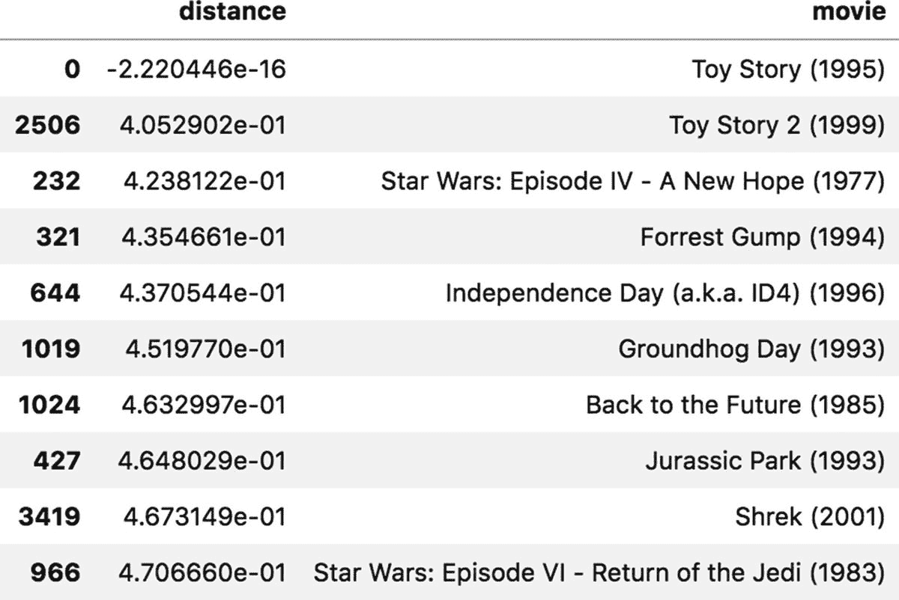

图 10-13

余弦距离玩具总动员(1995)最短的电影

```py
distances_to_movie = []
for other_movies in mat.T:
    distances_to_movie.append(scipy.spatial.distance.cosine(movie_toy_story, other_movies.tolist()))

# create dataframe of movie and distance scores to Toy Story
distances_to_movie = pd.DataFrame({'movie':movies_df['title'],'distance':distances_to_movie})

# sort by ascending distance (i.e. closest to movie_toy_story)
distances_to_movie = distances_to_movie.sort_values('distance')
distances_to_movie.head(10)

Listing 10-17Getting Similar mMovies

```

余弦距离将《玩具总动员》与《玩具总动员 2》以及其他家庭电影联系起来。有趣的是，余弦距离得出了一个不同于欧几里得距离的列表。

## 奇异值分解

您可以使用所涵盖的任何距离方法轻松构建一个具有协作过滤的系统，但它无法扩展到更大的数据集，处理稀疏数据，或者知道在冷启动的情况下该做什么(在冷启动的情况下，很少或没有交叉的用户/电影数据)。像 SVD 这样的模型被设计成通过使用低秩近似来减轻这些问题中的一些，并且具有在压缩数据上估计匹配的能力。 <sup>[5](#Fn5)</sup>

这绝对不是简单的东西，但简而言之，它试图减少数据，使重要的主题和连接冒泡，让噪音或离群值下降到底部。它将删除嘈杂和不规则的信息，以建立一个更清晰的地图，什么适合哪里，什么是近的，什么是远的。SVD 将我们按流派和用户排列的电影评级矩阵分解为三个部分，一个用户矩阵，一个电影矩阵，以及两者之间的关系向量。然后，我们可以使用关系向量来匹配彼此接近的不同用户和评论，并收集周围的信息作为潜在的推荐。SVD 返回一个代表用户特征空间的矩阵和另一个代表电影特征空间的矩阵。然后，我们应用点积来寻找相似之处和建议。

此外，这并不是一门关于 SVD 细节的课程，因为它可能会变得很复杂。已经有关于这个主题的博士论文，网上也有数百个教程可供那些想要深入研究的人使用。我还推荐这篇代码所基于的博客文章( [`https://beckernick.github.io/matrix-factorization-recommender/`](https://beckernick.github.io/matrix-factorization-recommender/) )，以及一个简单明了的 SVDs 运行示例，推荐傻瓜引擎( [`http://zwmiller.com/projects/simple_recommender.html`](http://zwmiller.com/projects/simple_recommender.html) )。

## 将用户评分集中在零附近

由于这个数据集已经被研究了好几年，一些有趣的技巧已经被证明是有用的，我们也将在这里应用它们。我们将从每个用户的平均推荐中减去他们的推荐。这确保了所有用户都相应地调整，并且接近于零。如果一个用户的最高评分是 5 分，最低评分是 3 分，而其他用户使用整个范围进行评分，取每个平均值并减去其推荐值将使两者具有可比性(列表 [10-18](#PC18) )。

```py
user_ratings_mean = np.mean(ratings_mat, axis = 1)
ratings_mat_centered = ratings_mat - user_ratings_mean.reshape(-1, 1)

Listing 10-18Centering All Reviews Around Mean

```

## 看看 SVD 的作用

让我们完成对 Jupyter 笔记本中的 SVD 代码的分析(请参考 e 部分“**奇异值分解**”)。这是一个重要的部分，因为它代表了我们推荐引擎背后的大脑。

我们做的第一件事是建立一个用户与分级电影的矩阵(图 [10-14](#Fig14) )。在我们的例子中，它需要清理一些东西，比如重建电影 id 以从零开始，使它们连续无间隙，以及重置分级 id 也从零开始。

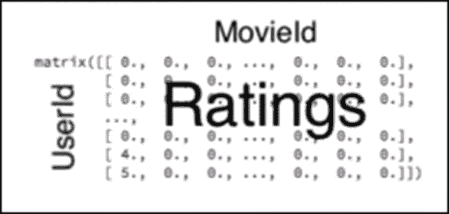

图 10-14

非常重要的"**用户**"通过"**分级电影**矩阵

让我们的推荐器在新数据上工作的一种方法是将我们的访问者的电影品味作为新的“ **UserId** ”添加到矩阵中。然后，我们使用“**压缩稀疏行矩阵**”函数“ **sps.csr_matrix()** ”来重建矩阵，这会将矩阵转换为 SVD 友好的格式，并考虑来自新访问者的信息(清单 [10-19](#PC19) )。

```py
# create a new user id - add 1 to current largest
new_user_id = np.max(ratings_df_cp['userId']) + 1

# add movie preference to matrix and assign 5-star votes
# to all of them
new_user_movie_ids = user_history_movie_ids
new_user_ratings = [5] * len(new_user_movie_ids)

# fix index to be multilevel with userId and movieId
ratings_df_cp.set_index(['userId', 'movieId'], inplace=True)

# add new movie rating as a pandas series and insert new row
# at end of ratings_df_cp
for idx in range(len(new_user_movie_ids)):
        row_to_append = pd.Series([new_user_ratings[idx]])
        cols = ['rating']
        ratings_df_cp.loc[(new_user_id, new_user_movie_ids[idx]), cols] =         row_to_append.values

# create new ratings_matrix
ratings_matrix_plus = sps.csr_matrix((ratings_df_cp.rating,
(ratings_df_cp.index.labels[0], ratings_df_cp.index.labels[1]))).todense()

Listing 10-19Getting Recommendations for our New User

```

然后，我们将矩阵发送给执行矩阵分解的" **GetSparseSVD** "函数，并返回为我们的新用户和其他具有相似兴趣的用户获得点积所需的三个矩阵。这使用了稀疏线性代数 SVDS 库“ **scipy.sparse.linalg.svds** ”，它在处理含有大量零的大型矩阵方面做得很好(大多数人只看过少数几部电影，所以当你建立一个用户到电影的矩阵时，大多数单元格都是空白的；清单 [10-20](#PC20) )。

```py
Ua, sigma, Vt = GetSparseSVD(ratings_matrix_centered, K=50)
all_user_predicted_ratings = np.dot(np.dot(Ua, sigma), Vt) + user_ratings_mean.reshape(-1, 1)

Listing 10-20Getting the SVD

```

我们对返回的矩阵(在我们的例子中是 Ua 和 sigma)进行点积运算，并将所有内容打包到一个名为“ **predictions_df** 的数据帧中这些数据利用 SVD 的魔力将用户和他们的兴趣组织到不同的维度中(列表 [10-21](#PC21) 和图 [10-15](#Fig15) )。

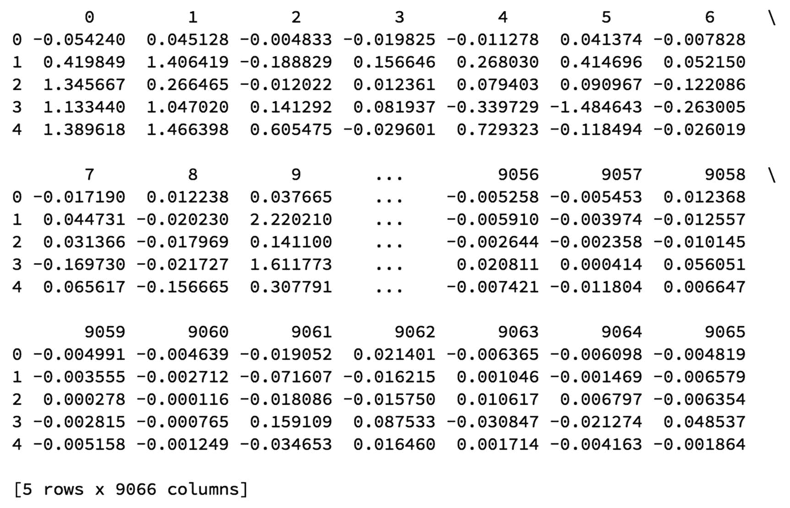

图 10-15

点阵输出通过多维度的相似性组织我们的用户

```py
predictions_df = pd.DataFrame(all_user_predicted_ratings, columns = movies_df.index)
predictions_df.head()

Listing 10-21Viewing “head()” of Dot Matrix

```

我当然不会假装理解这些分组背后的逻辑，但它确实有效，所以我会信任 SVD，并建议您也这样做。

为我们的新用户获取推荐的最后一个阶段是只为该用户从"**predictions _ df**"中提取 SVD 的点积数据，然后附加电影信息，并简单地挑选一些用户尚未看过的新电影。例如，让我们假设我们的新用户非常喜欢以下三部戏剧/战争电影(图 [10-16](#Fig16) )。


图 10-16

我们用户的偏好

我们通过“**分级电影**”矩阵将这个新用户的选择作为新用户传递到我们的“**用户**”中，并将这三个具有高分级的选择相加。然后我们运行 SVD 并提取这个新用户的预测(图 [10-17](#Fig17) )。

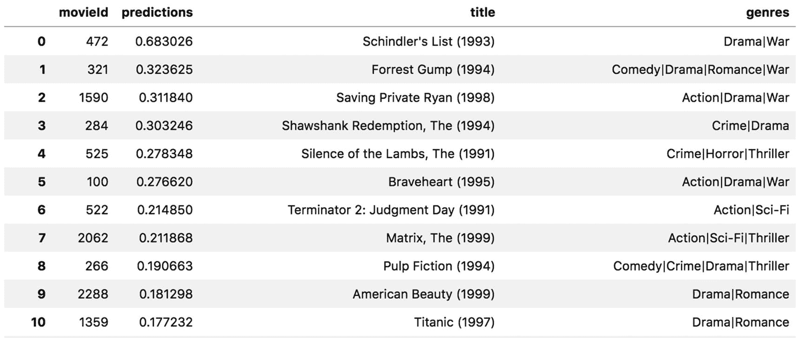

图 10-17

对我们新用户的分类推荐

显然，我们不会向这个用户推荐"**《辛德勒的名单**"，因为他们已经看过了。相反，我们推荐"**《阿甘正传》**、**《拯救大兵瑞恩》**、**《肖申克的救赎》**。"好了，代码说够了；让我们建造这个东西！

## 下载并运行“接下来看什么？”本地编码

让我们下载第 [10 章](10.html)的文件，如果你还没有的话，在你的本地机器上解压。您需要将之前创建的 CSV 文件“ **movies.csv** ”和“ **ratings.csv** ”复制到与 **main.py** 同一个文件夹中的 web 应用文件`—`的根目录下。您的“ **web 应用程序**”文件夹应该包含以下文件，如清单 [10-22](#PC22) 所示。

```py
web-application
        ├── appengine_config.py
        ├── app.yaml
        ├── main.py
        ├── requirements.txt
        ├── movies.csv
        ├── ratings.csv
        ├── static
                    └──images
                    ├── curtain-left.png
                    └── curtain-right.png
        └──templates
                └── index.html

Listing 10-22Web Application Files

```

按照惯例，我们将启动一个虚拟环境来隔离我们的 Python 库安装(清单 [10-23](#PC23) )。

```py
$ python3 -m venv whattowatchnext
$ source whattowatchnext/bin/activate

Listing 10-23Starting Virtual Environment

```

然后通过运行“ **pip install -r** ”命令安装所有需要的 Python 库(清单 [10-24](#PC24) )。

```py
$ pip3 install -r requirements.txt
$ python3 main.py

Listing 10-24Install Requirements and Take the Site for a Local Spin

```

您可以在本地计算机上运行应用程序，就像我们在前面的练习中所做的那样。打开一个命令行窗口，将驱动器切换到“ **web-application** ”文件夹，运行您之前运行过的相同命令(比如运行“ **python3 main.py** ”)。它应该类似于图 [10-18](#Fig18) 中的屏幕截图。


图 10-18

"**接下来看什么？**“本地运行

## 这是怎么回事？

让我们仔细看看 Flask web 应用程序中发生的一些有趣的事情。

## main.py

让我们过一遍" **main.py** "在数据探索期间提取的电影类型被复制并硬编码为脚本中的常量列表。从每次的数据中动态计算它没有实际价值，因为它与历史数据联系在一起，不会改变(列表 [10-25](#PC25) )。

```py
MOVIE_GENRES = ["Action", "Adventure", "Animation", "Children", "Comedy", "Crime",
                "Documentary", "Drama", "Fantasy", "Film-Noir", "Horror",
                "IMAX", "Musical", "Mystery", "Romance", "Sci-Fi", "Thriller",
                "War", "Western"]

Listing 10-25Hardcoding Movie Genres

```

这个流派列表用于填充 web 应用程序的第一个下拉框。该下拉框是页面上唯一预填充的字段，每当用户更改它时，它会自动用该类型的电影标题填充其他下拉框。这有助于集中应用程序，并大大减少可用选项的数量。

该脚本包含四个方便的函数，在访问者与站点交互的不同时间调用。

*   **get oviesygens(电影 _df，体裁)**
    *   是一个函数，它将返回特定类型的所有电影和电影 id 的列表。每当用户更改“**电影类型**”下拉框时，都会调用该函数。

*   **GetSparseSVD(ratings _ centered _ matrix，K)**
    *   就是我们之前看到的 SVD 算法。它需要计算 ratings/movieids 矩阵和" **K** "奇异值的数量，并返回用户矩阵、两者之间的关系向量(对角矩阵)和电影矩阵。

*   **getrecommended movies(ratings _ df，movies_df，user_history_movie_ids)**
    *   这是一个关键的功能，它将获取收视率和电影数据帧，用户观看和喜欢的电影的历史(用户在三个下拉框中选择的电影)。它将在由访问者选择的电影以及最高评级(我们假设用户真的喜欢)组成的评级数据框上追加几个新行。它将调用" **GetSparseSVD** "函数，并使用原始数据以及来自访问者的附加新电影来获得 SVD 分解。现在我们知道了用户的电影口味，就可以使用点积从 SVD 中找到类似的电影。该函数将返回前三部推荐电影。

*   **在 getwikipediadata 上(title_name)**
    *   该函数获取一个电影标题，将它传递给 Wikipedia API，并返回关于该电影的第一段以及与该电影相关联的第一幅图像(通常是电影的海报)。

该脚本还包含三个 Flask 特定函数:

*   **启动()**
    *   每当 flask 服务器启动`—`时，就会调用“ **startup()** ”函数，换句话说，它是一个构造函数。这是通过添加装饰者“**@ app . before _ first _ request**来完成的它加载两个数据集:" **movies.csv** "和" **ratings.csv** "然后，它会像我们在 exploration Jupyter 笔记本中所做的那样，通过删除未使用的“ **movieId** ”来清理它们，并将所有索引重置为从零开始。

*   **就绪()**
    *   每当页面第一次加载、刷新或电影类型改变时，都会调用“ **ready()** ”函数。此函数在第一次调用时为“【index.html】T2”页面设置变量默认值。如果这不是第一次(即，这是一个通过类型值更改提交的表单，并且“ **request.method == 'POST'** ”的“ **if** ”函数返回 true)，该函数将保留用户设置的任何值，并通过“**getmoviesbyperings()**”函数调用获得一个新的电影选择列表。它还检查用户是否至少从三个下拉列表中选择了一部电影，并将这些 id 传递给“ **GetRecommendedMovies()** ”函数。这将返回三个新电影推荐。顶级电影推荐被传递给“ **GetWikipediaData()** ”函数，用于所述电影的描述片段和海报图像。

*   **后台 _ 进程()**
    *   该函数与“**index.html**中的前端 AJAX 函数相关联每当用户单击三个推荐的电影链接中的一个时，就会调用这个函数。它获取电影的名称，并将其传递给“ **GetWikipediaData()** ”函数，就像“ **ready()** ”函数一样。这将获得焦点电影的描述片段和海报图像。

## index.html

让我们来看看“**index.html**”脚本(列表 [10-26](#PC26) )中前端发生的一些有趣的事情。

```py
<script>

$(document).on("click", "a", function(){
    var move_title = this.innerHTML;
    $(this).text(move_title);
    document.getElementById("movie_poster").innerHTML = move_title;
    fetchdata(move_title);
});

function fetchdata(move_title)
{
    $.ajax({
        type : "GET",
        url:'{{ url_for('background_process') }}',
        data:{ 'movie_title': move_title},
        success: function(data){
            update_dashboard(data.wiki_movie_description, data.wiki_movie_poster);
        }

    });
}

function update_dashboard(wiki_movie_description, wiki_movie_poster){
    document.getElementById('movie_description').innerHTML = wiki_movie_description;
    document.getElementById('image_poster').src = wiki_movie_poster;
}

</script>

Listing 10-26On the JavaScript Side

```

我们有三个功能:

*   **$(文档)。on("click "，" a"…)**
    *   这个函数监听锚标记，当点击时，获取内部文本并将其传递给函数" **fetchdata()** "

*   **fetchdata(move_title)**
    *   该函数使用 AJAX 将 GET post 传递给服务器，以从维基百科获取电影描述和电影海报，并将结果传递给函数" **update_dashboard()** "

*   **更新 _ 仪表板(维基 _ 电影 _ 描述，维基 _ 电影 _ 海报)**
    *   这个函数从函数"**fect data()**"中获取结果，并用返回的内容替换 HTML 内容描述文本和电影海报。

## 在 Google 应用引擎上部署

到目前为止，您应该对 Google Flexible App Engine 有了一些经验，所以这将是一个快速启动和运行这个 web 应用程序的指南。

### 第一步:启动谷歌云外壳

登录您的 Google Cloud 实例，创建或选择您希望应用引擎驻留的项目(如果您没有项目，系统会提示您创建一个项目`—`参见创建和管理项目 <sup>[6](#Fn6)</sup> )。通过单击右上角的插入符号按钮启动云外壳命令行工具。这将在 GCP 仪表板的下半部分打开一个熟悉的命令行窗口(图 [10-19](#Fig19) )。


图 10-19

访问谷歌云外壳

### 第二步:压缩并上传所有文件到云端

压缩“ **web-application** ”文件夹中的文件，但不压缩虚拟环境文件夹“**whatstowatchnext**”，因为不需要(图 [10-20](#Fig20) )。


图 10-20

压缩 web 应用程序文件以上传到 Google Cloud

使用“**上传文件**选项上传文件(该选项位于外壳窗口右上方的三个垂直点下方；图 [10-21](#Fig21) 。

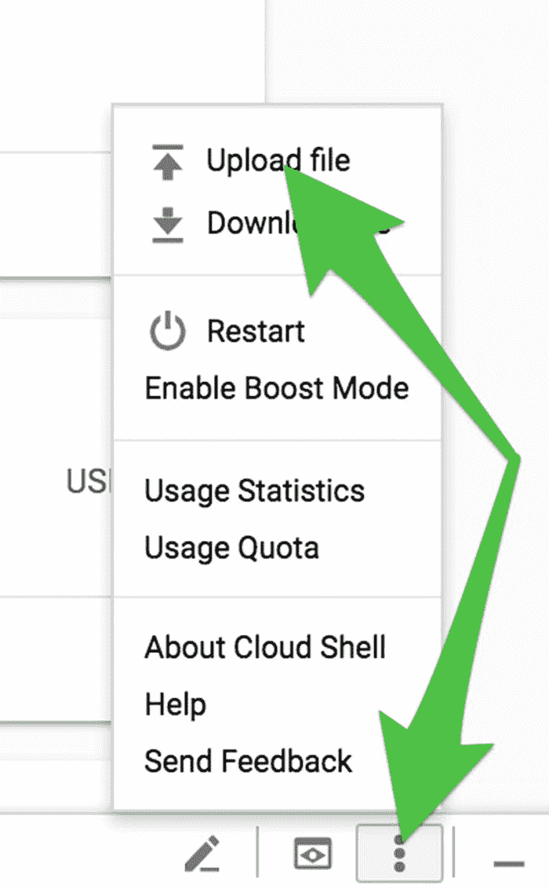

图 10-21

通过 Google Cloud shell 上传文件

### 第三步:在 Google Cloud 上创建工作目录并解压文件

文件上传成功后，新建一个目录，比如“**第 10 章**”(列表 [10-27](#PC27) )。

```py
$ mkdir chapter-10
$ cd chapter-10

Listing 10-27Creating Folder on Cloud

```

将所有的 zip 存档文件转移到新文件夹中并解压缩(清单 [10-28](#PC28) )。

```py
$ mv ../Archive.zip Archive.zip
$ unzip Archive.zip

Listing 10-28Loading Needed Files

```

你在 Google Cloud 上的文件夹应该类似于清单 [10-29](#PC29) 。

```py
Input:

$ ls

Output:

appengine_config.py app.yaml Archive.zip lib main.py movies.csv ratings.csv requirements.txt static templates

Listing 10-29Checking Unzipped Content

```

### 步骤 4:创建库文件夹

运行以下命令，将所有需要的附加库安装到 lib 文件夹中。当您部署 web 应用程序时，lib 文件夹将与所需的库一起移动(清单 [10-30](#PC30) )。

```py
$ sudo pip3 install -t lib -r requirements.txt

Listing 10-30Installing Required Libraries

```

### 步骤 5:部署 Web 应用程序

最后用“ **gcloud app deploy** ”命令将其部署到全球(列表 [10-31](#PC31) )。

```py
Input:

$ gcloud app deploy app.yaml

Output:

Services to deploy:

descriptor: [/home/amunategui/chapter-10/app.yaml]
source: [/home/amunategui/chapter-10]
target project: [apt-memento-192717]target service: [default]
target version: [20180702t150114]
target url: [https://apt-memento-192717.appspot.com]

Do you want to continue (Y/n)?

Listing 10-31Deploying Web Application and Confirming We Want to Deploy Our Application (yes, please)

```

就是这样！坐下来，让工具部署网站。这是灵活的应用程序引擎，因此完全部署可能需要 30 分钟。一旦完成所有设置，它将提供一个可点击的链接，直接跳转到已部署的 web 应用程序(清单 [10-32](#PC32) )。

```py
$ gcloud app browse

Listing 10-32You Can Also Get There with the Following Command:

```

享受你的劳动成果，并确保通过寻求一些电影推荐来进行实验！(图 [10-22](#Fig22) )。


图 10-22

谷歌云上的网络应用

## 解决纷争

在有些情况下，你会遇到问题，而谷歌云日志会是你最好的朋友。您可以直接在 Google Cloud dashboard 中或者通过调用日志 URL(清单 [10-33](#PC33) )轻松找到它们。

```py
https://console.cloud.google.com/logs

Listing 10-33Logs URL

```

或者您可以通过在云 shell 中输入清单 [10-34](#PC34) 中的以下命令来传输日志的尾部。

```py
$ gcloud app logs tail -s default

Listing 10-34Viewing Logs in Terminal Window

```

## 关闭商店

在我们结束本章之前，还有最后一件事:不要忘记停止或删除你的应用引擎云实例。即使你使用的是免费信用，计价器仍然在运行，没有必要浪费金钱或信用。

与标准应用引擎相比，灵活应用引擎的情况略有不同，因为灵活应用引擎的成本更高。所以，如果你不使用它，停止它是很重要的。此外，这一切都可以通过谷歌云仪表板方便地完成。

导航至应用程序引擎，然后导航至版本。点击您的活动版本并停止(图 [10-23](#Fig23) )。如果有多个版本，可以删除旧的；您将无法删除默认的，但停止它应该足够了(如果你真的不想要它的任何痕迹，只需删除整个项目)。

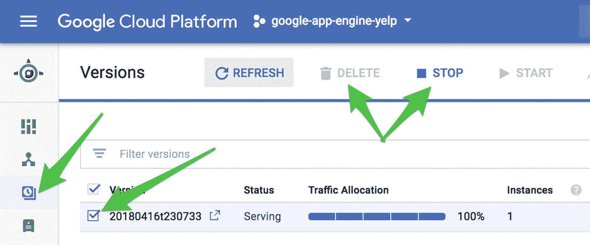

图 10-23

停止和/或删除您的应用引擎版本

就是这样！如果一切都完成了，不要忘记停用虚拟环境(清单 [10-35](#PC35) )。

```py
$ deactivate

Listing 10-35Deactivating the virtual environment

```

## 结论

推荐系统的协同过滤在许多商业应用中非常棒，非常受欢迎。这绝对不是一个简单的章节，因为 sdv 的内部工作是相当模糊的，但这里的要点是我们可以构建一个背后有一些严肃建模力量的 web 应用程序。

虽然 SVD 已经存在了一段时间，并且仍然在积极地使用，但是使用卷积神经网络(CNN)已经取得了有趣的进展。 <sup>[7](#Fn7)</sup>

<aside class="FootnoteSection" epub:type="footnotes">Footnotes [1](#Fn1_source)

[T2`https://grouplens.org/datasets/movielens/`](https://grouplens.org/datasets/movielens/)

  [2](#Fn2_source)

[T2`https://grouplens.org/datasets/movielens/`](https://grouplens.org/datasets/movielens/)

  [3](#Fn3_source)

F.麦克斯韦·哈珀和约瑟夫·a·康斯坦，2016。《MovieLens 数据集:历史与语境》，*ACM Transactions on Interactive Intelligent Systems(TiiS)*5 第 4 期，第 19 篇(2016 年 1 月)，19 页。DOI =[https://DOI . org/10 . 1145/2827872](https://doi.org/10.1145/2827872)

  [4](#Fn4_source)

[T2`http://mines.humanoriented.com/classes/2010/fall/csci568/portfolio_exports/sphilip/cos.html`](http://mines.humanoriented.com/classes/2010/fall/csci568/portfolio_exports/sphilip/cos.html)

  [5](#Fn5_source)

[T2`http://web.mit.edu/be.400/www/SVD/Singular_Value_Decomposition.htm`](http://web.mit.edu/be.400/www/SVD/Singular_Value_Decomposition.htm)

  [6](#Fn6_source)

[T2`https://cloud.google.com/resource-manager/docs/creating-managing-projects`](https://cloud.google.com/resource-manager/docs/creating-managing-projects)

  [7](#Fn7_source)

[T2`https://medium.com/@libreai/a-glimpse-into-deep-learning-for-recommender-systems-d66ae0681775`](https://medium.com/@libreai/a-glimpse-into-deep-learning-for-recommender-systems-d66ae0681775)

 </aside>