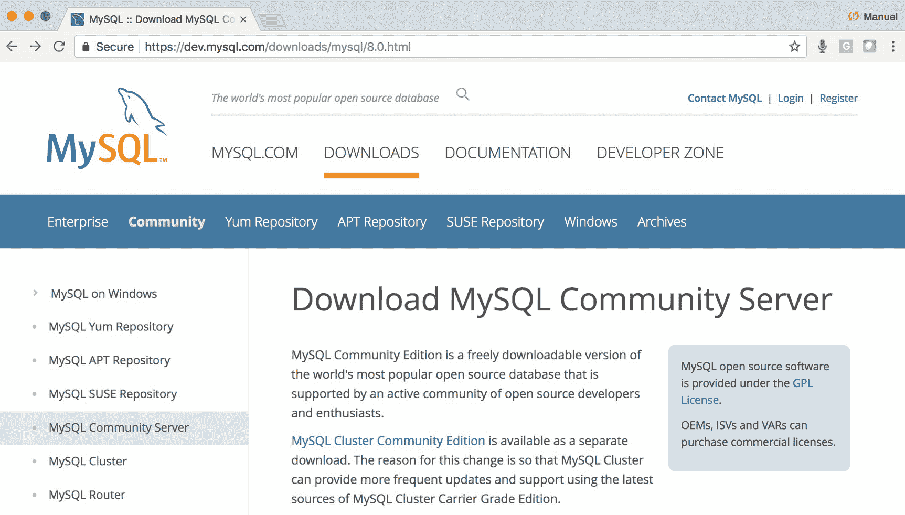
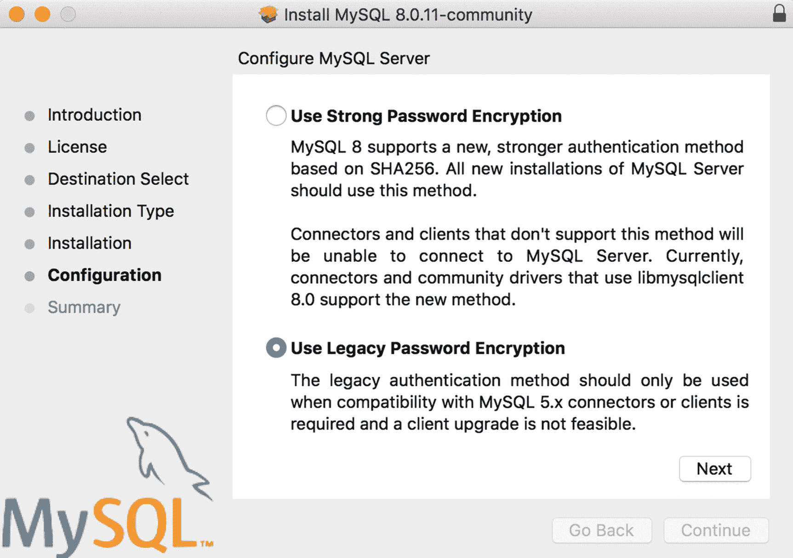
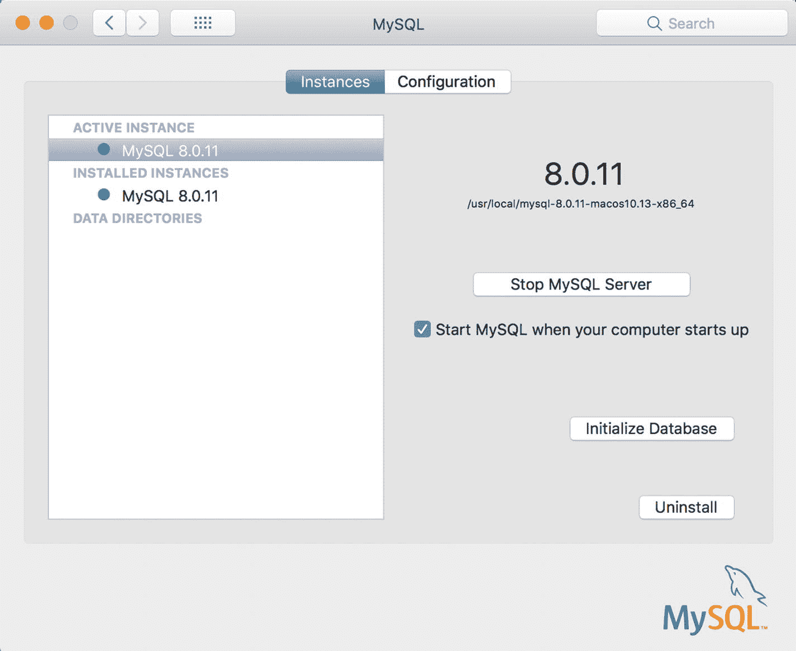
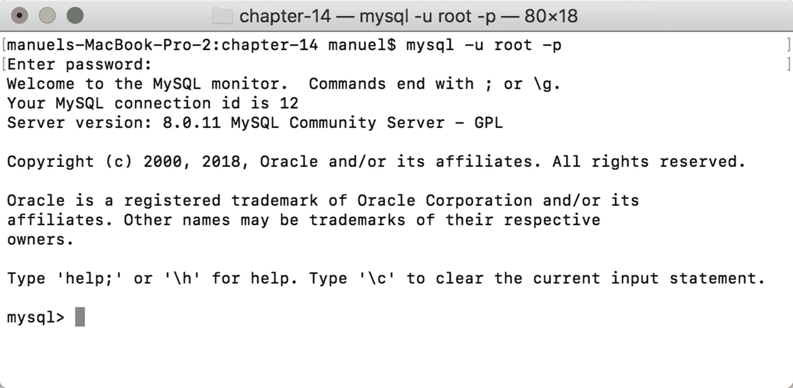
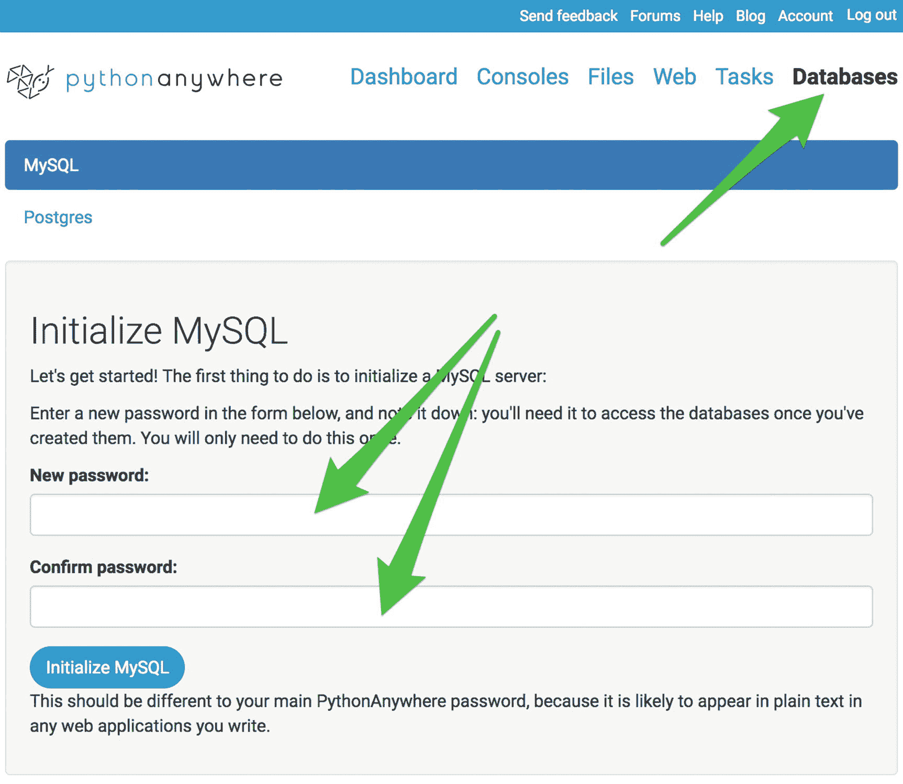
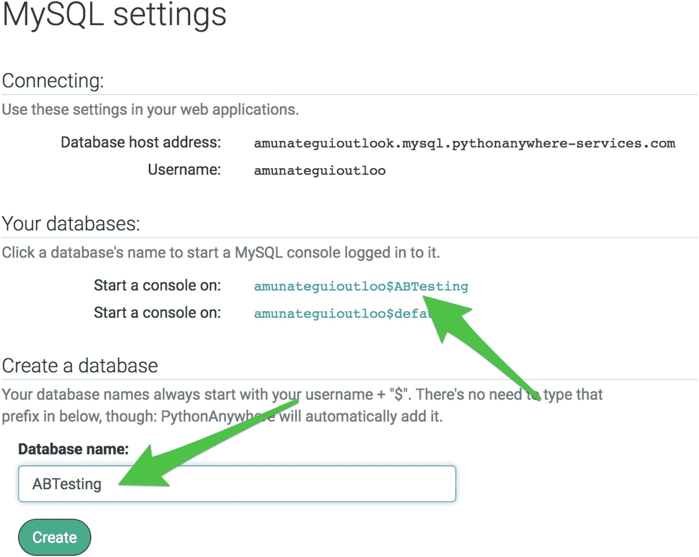
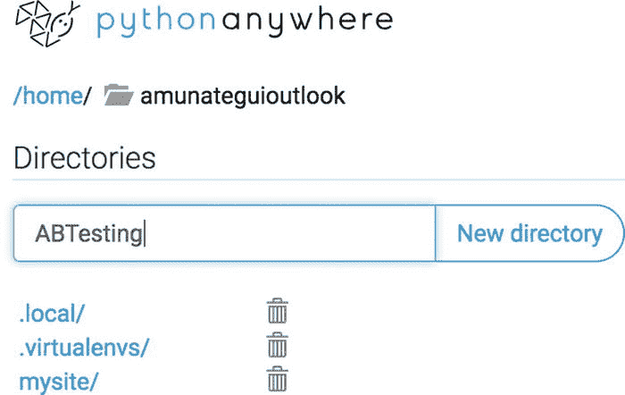
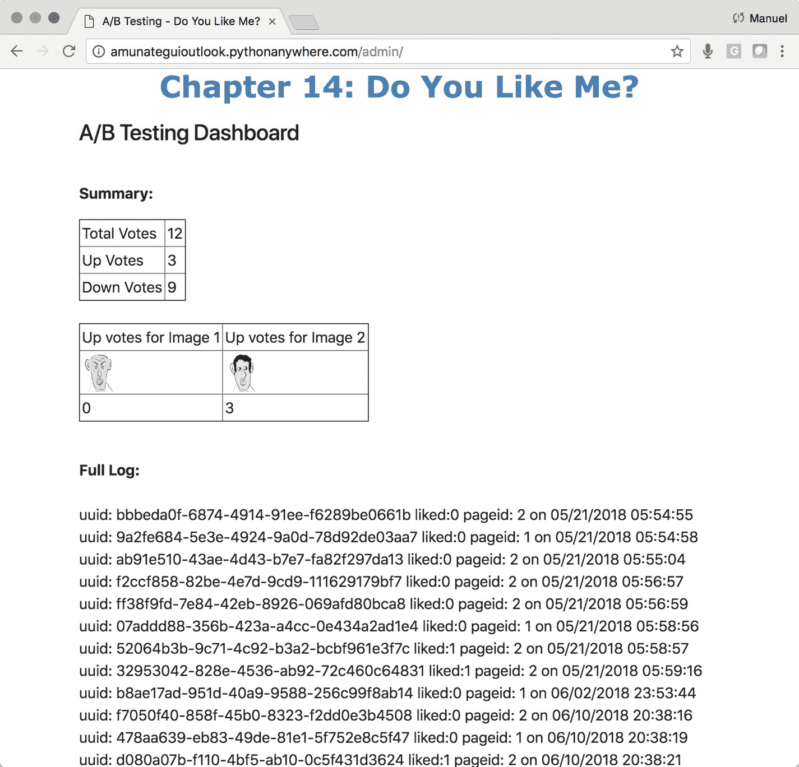

# 十四、PythonAnywhere 和 MySQL 上的 A/B 测试

这是一个雄心勃勃的章节，所以我们将限制范围，以便在不过度的情况下提取这个丰富主题的本质。我们将首先构建一个简单的 MySQL 数据库和表格来跟踪访问者是否喜欢登录页面上的艺术作品。因为这是 A/B 测试，我们将创建两个登录页面，并在用户访问网站时随机切换它们(图 [14-1](#Fig1) )。


图 14-1

本章的最后一个 web 应用程序

### 注意

进入 [`www.apress.com/9781484238721`](http://www.apress.com/9781484238721) 并点击源代码按钮，下载第 [14 章](14.html)的文件。你需要在你的本地机器上安装 MySQL 以便跟随 Jupyter 笔记本" **chapter14.ipynb** "

在分析中，A/B 测试意味着使用某种东西的两个不同版本，并测量人们对每个版本的反应。这通常用于网站，以尝试新的设计，产品，销售等。在我们的例子中，我们将向访问者展示两个不同版本的登录页面。版本将被随机分配，访问者将有机会给网页竖起大拇指，如果他们喜欢它。在后台，我们将跟踪这些流量，以及是否有用户竖起大拇指。如果用户没有竖起大拇指，我们会认为这是一个反对票。

这是一个重要的话题，可以产生关于你的业务和用户的有价值的知识。有一个著名的轶事，玛丽莎·梅耶尔在谷歌工作时，进行了一次 A/B 测试，以确定用户更喜欢 40 种蓝色中的哪一种。很明显，人们可能会对这些类型的测试过分热衷。

## A/B 测试

A/B 测试的目标是将不同的产品暴露给公众，并测量他们的反应。在我们的 web 应用程序中，我们将用两种不同的图像显示一个网页:一张愤怒的脸和一张友好的脸。我们将在页面上添加一个简单的标签，询问访问者是否喜欢该图片。在后台，我们将计算每次访问和每次竖起大拇指的次数。为了简单起见，我们将第一次访问计为否定，如果访问者点击了投票按钮，则更新为肯定。每个图像的版本见图 [14-2](#Fig2) 和 [14-3](#Fig3) 。


图 14-3

图片二


图 14-2

图片一

### 跟踪用户

有多种方法可以追踪匿名访客。流行的方法包括使用 cookies 和数据库。每一种都有其优点和用途。cookie 的优势在于可以长期跟踪用户，不管他们是否关闭了浏览器或计算机。网页可以很容易地检查访问者的计算机上以前的 cookies，并与他们的数据库进行比较，以确定这是否是一个重复的访问者。

我们不需要使用 cookies，因为我们只考虑单次访问。相反，我们将使用 HTML 隐藏标签跟踪用户，并使用 post 请求发送回该标签。当访问者第一次访问页面时，我们将在数据库中插入一行，其中包含页面背景图像、时间戳和唯一标识符(对于该用户来说是唯一的一个很长的字符串；创造两个相同的几率微乎其微)称为 UUID。如前所述，我们假设第一次页面访问是否定的，并将其写入数据库。在构建页面时，我们插入一个包含 UUID 的隐藏 HTML 标记，这样如果用户通过单击竖起大拇指按钮与页面进行交互，我们会将 UUID 传递回 web 服务器，这样我们就可以更新之前在数据库中输入的行。这种方法允许我们同时为许多访问者服务，而不用担心谁拥有什么页面。根据您的需要，有许多方法可以调整和改进这个过程。您甚至可以在客户机和服务器之间来回传递 UUID，次数不限，并且始终知道您正在处理哪个会话和用户。

### 全球唯一标识符

通用唯一标识符(UUID)长 128 位，并且保证是唯一的。我们将使用方便的" **uuid** " Python 库来自动生成一个有保证的惟一标识符(清单 [14-1](#PC1) )。

```py
Input:

import uuid
str(uuid.uuid4())

Output:

'e7b1b80e-1eca-43a7-90a3-f01927ace7c9'

Listing 14-1The “uuid” Kibrary

```

在“ **uuid** ”库中，“ **uuid4()** ”函数生成一个新的随机 id，不依赖于你计算机的标识符，所以是唯一的，私有的。点击 [`https://docs.python.org/3/library/uuid.html`](https://docs.python.org/3/library/uuid.html) 查看文档，了解更多 UUID 详情和选项。

## 关系型数据库

我们将使用 MySQL 社区服务器，这是一个很棒的流行的免费数据库。它非常适合支持我们的 A/B 测试需求。它是一个开源的关系数据库，可以支持各种各样的需求，并被包括 WordPress 在内的大玩家以及谷歌和脸书这样的大型媒体公司所使用。

前往 [`https://dev.mysql.com/downloads`](https://dev.mysql.com/downloads) 下载适用于您的操作系统的 MySQL 社区服务器版本。如果您有任何疑问或问题，还可以找到操作系统的安装说明。我们不会使用任何前端，尽管有相当多的前端可供您使用(图 [14-4](#Fig4) )。



图 14-4

查找并下载适用于您的操作系统的正确版本

系统会提示您一系列问题，包括设置 root 密码和密码加密类型(图 [14-5](#Fig5) )。



图 14-5

保持简单并使用传统的密码系统

您还可以通过操作系统的控制中心启动和停止数据库(这也可以通过命令行完成；图 [14-6](#Fig6) 。



图 14-6

设置 MySQL 服务器在计算机启动时自动启动

### 命令行控件

启动和停止 MySQL(在大多数情况下，它应该在你安装并重启机器后自动启动)。在 [`https://dev.mysql.com/doc/`](https://dev.mysql.com/doc/) 查看其他操作系统的文档、自本书出版以来的更改以及其他命令。让我们看看如何启动 MySQL(清单 [14-2](#PC2) 和 [14-3](#PC3) ，图 [14-7](#Fig7) )。

```py
$ sudo /usr/local/mysql/support-files/mysql.server start

Listing 14-2Starting MySQL on the Mac

```


图 14-7

使用命令行启动 MySQL

```py
C:\> "C:\Program Files\MySQL\MySQL Server 8.0\bin\mysqld"

Listing 14-3Starting MySQL on Windows

```

让我们看看如何停止 MySQL(清单 [14-4](#PC4) 和 [14-5](#PC5) )。

```py
$ sudo /usr/local/mysql/support-files/mysql.server stop

Listing 14-4Stopping MySQL on the Mac

```

```py
C:\> "C:\Program Files\MySQL\MySQL Server 8.0\bin\mysqladmin" -u root shutdown

Listing 14-5Stopping MySQL on Windows

```

### MySQL 命令行监视器

命令行监视器是一个方便的工具，允许您管理用户和权限，创建数据库和表格，等等(参见 [`https://dev.mysql.com/doc/`](https://dev.mysql.com/doc/) 的其他操作系统和附加命令的文档)。

要进入监视器，请将驱动器更改为您的 MySQL 目录或导出一个路径，然后输入" **mysql -u root -p** "命令，系统会提示您输入您在安装过程中创建的密码(清单 [14-6](#PC6) 和图 [14-8](#Fig8) )。



图 14-8

运行 MySQL 命令行监视器

```py
$ export PATH=$PATH:/usr/local/mysql/bin
$ mysql -u root -p

Listing 14-6Code Input

```

一旦你的提示符变成“ **mysql >** ”，你就知道你进入了监视器让我们为我们的 A/B 测试创建一个用户、一个数据库和一个表。

### 创建数据库

让我们创建一个名为“ **ABTesting** ”(列表 [14-7](#PC7) )的数据库。

```py
mysql> CREATE DATABASE ABTesting;

Listing 14-7Creating a Database

```

### 创建表格

让我们使用“ **CREATE TABLE** ”语句创建一个新表。每当创建新表时，最好先删除它，否则会出现错误(但是要确保确实想删除它，因为这样会丢失其中包含的所有数据)。我们将创建一个名为“ **tblFrontPageOptions** 的表，该表将有一个名为“ **uuid** 的唯一标识符字段，一个名为“**like**的布尔标志来保存用户是否点击了拇指，一个 page_id 来标记这是一个“ **A** 还是“ **B** 页面，以及一个自动时间戳字段(清单 [14-8](#PC8) )。

```py
mysql> DROP TABLE ABTesting.tblFrontPageOptions;
mysql> CREATE TABLE ABTesting.tblFrontPageOptions (
      uuid VARCHAR(40) NOT NULL,
   liked BOOLEAN NOT NULL DEFAULT 0,
      pageid INT NOT NULL,
      time_stamp  TIMESTAMP NOT NULL DEFAULT CURRENT_TIMESTAMP);

Listing 14-8Creating a Table

```

您可以通过使用“ **INSERT INTO** ”语句(清单 [14-9](#PC9) )向表中插入一些数据来轻松测试您的表是否在工作。

```py
mysql> INSERT INTO ABTesting.tblFrontPageOptions (uuid, liked, pageid) VALUES(9999, 1, 2);

Listing 14-9Inserting Data

```

为了检查数据确实进入了表中，我们使用了一个" **SELECT *** "语句(清单 [14-10](#PC10) )。

```py
Input:

mysql> SELECT * FROM ABTesting.tblFrontPageOptions;

Output
:

+------+-------+---------+---------------------+
| uuid | liked | page_id | time_stamp          |
+------+-------+---------+---------------------+
| 9999 |     1 |       2 | 2018-05-19 14:28:44 |
+------+-------+---------+---------------------+
1 row in set (0.00 sec)

Listing 14-10Querying Data

```

我们看起来不错。现在表格中有了新的一行。如果您想从一个干净的状态开始，您可以删除并使用前面的代码重新创建该表。互联网上有很多关于 SQL 语法的初级读本，但最好从位于 [`https://www.w3schools.com/sql`](https://www.w3schools.com/sql) 的 w3schools 开始。退出“ **mysql >** ”提示符，打开 Jupyter 笔记本，练习将数据插入到我们的表中，并通过“**MySQL . connector**”Python 库读出数据。

### 创建数据库用户

我们将创建一个专门用于 A/B 测试 web 应用程序的用户。在你的 Flask 代码中使用你的根密码是一个坏主意。我们的用户将被称为“ **webuser** ”，其密码将为“ **thesecre** ”(列表 [14-11](#PC11) )。

```py
mysql> CREATE USER 'webuser'@'localhost' IDENTIFIED BY 'thesecret';

Listing 14-11Creating a user

```

接下来，我们将授予该用户所有权限，一旦您对 my SQL 更熟悉了(不，不是我的 SQL，MySQL 产品…您知道他们可能整天在 MySQL 总部开这种玩笑…)，您可以将这种权限降低到只对特定的表具有读/写权限。参见清单 [14-12](#PC12) 。

```py
mysql> GRANT ALL PRIVILEGES ON ABTesting.* TO 'webuser'@'localhost' WITH GRANT OPTION;

Listing 14-12Granting Rights

```

最后，您可以使用下面这个方便的命令(清单 [14-13](#PC13) )来检查“ **webuser** ”用户是否被成功添加。

```py
mysql> SELECT User FROM mysql.user;

+------------------+
| User             |
+------------------+
| mysql.infoschema |
| mysql.session    |
| mysql.sys        |
| root             |
| webuser          |
+------------------+
5 rows in set (0.00 sec)

Listing 14-13Checking Users

```

您可以通过简单地输入“ **exit** ”命令来退出 MySQL 命令行工具。

## Python 库:mysql.connector

与我们数据库的大部分交互将通过 Python 和 Flask 使用方便的“ **mysql.connector** ”库来完成。在这里，您可以参考相应的 Jupyter 笔记本，以了解第 [14 章](14.html)(请安装“**需求 _jupyter.txt** ”文件以获取所需的库)。请记住，在本章中，我们不会创建本地 Flask 版本，所以请熟悉使用笔记本的命令，然后我们将直接跳到云。

我们将使用“**选择**、“**插入**”和“**更新**”SQL 函数编写三种类型的函数。如果您不熟悉这些经典的 SQL 函数，请查看 w3schools 的优秀初级读本(我知道，我一直在推那个网站；我发誓我和他们没有任何关系。

### 选择 SQL 语句

" **SELECT** 是最常见的 SQL 命令，用于从表中读取数据。使用“ **mysql.connector** ”库很容易做到这一点。首先，通过调用“ **connect()** ”函数并传递数据库的许可凭证，创建一个到数据库的连接。该连接返回一个游标，以便与数据库通信并向其发送订单。这是通过使用包含“ **SELECT** 语句的查询字符串来完成的。我们将在所有的 SQL 语句中使用这种方法。该语句与“ **INSERT** ”和“ **UPDATE** ”的区别在于，我们期望从数据库接收数据。在通过“ **execute()** ”函数执行我们的查询字符串之后，我们可以通过一个循环访问返回的数据。每个循环代表一行数据。注意，在调用结束时，一个打开的游标和连接都被关闭，因为我们不想占用资源超过我们需要的时间(清单 [14-14](#PC14) )。

```py
Input:

cnx = mysql.connector.connect(user='webuser', password="thesecret", database="ABTesting")
cursor = cnx.cursor()
query = "SELECT * FROM ABTesting.tblFrontPageOptions"
cursor.execute(query)
for (uuid, liked, pageid, time_stamp) in cursor:
        print("uuid: {} liked:{} pageid: {} on {:%m/%d/%Y %H:%M:%S}".format(
        uuid, liked, pageid, time_stamp))
cursor.close()
cnx.close()

Output (example, your output

will only contain what's in the table so far):

uuid: 704a44d0-29f4-4a2d-bc6a-fe679017f7e9 liked:1 pageid: 2 on 05/19/2018 17:03:29

Listing 14-14“select” Statement with Cursor

```

### 插入 SQL 语句

“ **INSERT** 语句允许我们将数据插入数据库的 ABTesting 表中。当访问者第一次点击网页时，我们插入一个包含以下字段的行，一个“ **UUID** ，“一个“**喜欢**”标志变为假，“ **pageid** ”代表用户正在查看的两个背景图像中的哪一个，以及一个“**时间戳**”正如在" **SELECT** 语句中所做的那样，我们首先打开一个到数据库的连接，然后创建一个游标并向它传递我们的查询语句。在这种情况下，我们的查询语句不是" **SELECT** "而是" **INSERT** "我们还使用方便的" **%s** "语句作为变量占位符，然后用" **args** "元组中保存的任何值填充。在这里，我们插入一个新的惟一 ID，将“ **liked** ”设置为 false(或拇指向下)，并查看页面 ID。

此外，每当您插入或更新一个表时，不要忘记在关闭连接之前调用" **commit()** "函数来提交您的插入。如果您不提交，您的更改将被忽略(清单 [14-15](#PC15) )。

```py
cnx = mysql.connector.connect(user='webuser', password="thesecret", database="ABTesting")
cursor = cnx.cursor()
query = "INSERT INTO ABTesting.tblFrontPageOptions (uuid, liked, pageid) VALUES (%s, %s, %s);"
args = ("704a44d0-29f4-4a2d-bc6a-fe679017f7e9", 0, 1)
cursor.execute(query, args)
cursor.close()
cnx.commit()
cnx.close()

Listing 14-15SQL “INSERT” Statement with Cursor

```

### 更新 SQL 语句

“ **UPDATE** 语句类似于“ **INSERT** 语句，但是不是在表的末尾添加一个新行，而是更新一个现有的行。为了更新特定的行，您必须能够在更新它之前找到正确的行。在这种情况下，因为我们有方便的“ **UUID** ”保证是唯一的，我们可以很容易地找到特定的行，而不必担心错误地更新另一行。为了正确地构建" **UPDATE** "语句，我们必须向它传递两个值，即"**704 a4d 0-29 F4-4a2d-bc6a-Fe 679017 f7e 9**"的" **UUID** ，以及设置为 true 的"**like**"标志(清单 [14-16](#PC16) )。

```py
cnx = mysql.connector.connect(user='webuser', password="thesecret", database="ABTesting")
cursor = cnx.cursor()
query = "UPDATE ABTesting.tblFrontPageOptions SET liked = %s WHERE uuid = %s;"
args = (1, "704a44d0-29f4-4a2d-bc6a-fe679017f7e9")
cursor.execute(query, args)
cursor.close()
cnx.commit()
cnx.close()

Listing 14-16SQL “update” Statement with Cursor

```

同样，不要忘记在关闭连接之前调用" **commit()** "函数来提交您的更改(否则，您的更改将被忽略)。

## 将代码抽象成方便的函数

我们需要将所有的 SQL 代码抽象成简单易用的函数。我们首先创建两个全局变量来保存 MySQL 用户帐户和密码。这使我们只需设置一次，而不必担心后续的 SQL 调用。当您需要更改用户帐户时，它也会派上用场(清单 [14-17](#PC17) )。

```py
mysql_account = 'webuser'
mysql_password = 'thesecret'
mysql_database = 'ABTesting'
mysql_host = 'localhost'

Listing 14-17Abstracting Account Data

```

我们还可以抽象 Uuid 生成代码，以保持简洁明了(清单 [14-18](#PC18) )。

```py
def GetUUID():
    return (str(uuid.uuid4()))

Listing 14-18Abstracting “GetUUID()” function

```

接下来，我们创建一个函数将新的访问插入到数据库中。该函数将从" **GetUUID()** "中获取一个新的 UUID，"将" **liked** "设置为 false，因为我们假设所有新的访问都不喜欢或不想与该站点交互，" **pageid** "表示为他们随机选择的图像，时间戳由 MySQL 自动生成(清单 [14-19](#PC19) )。

```py
def InsertInitialVisit(uuid_, pageid):
    try:
        cnx = mysql.connector.connect(user=mysql_account, password=mysql_password, database=mysql_database, host=mysql_host)
        cursor = cnx.cursor()
        query = "INSERT INTO ABTesting.tblFrontPageOptions (uuid, liked, pageid) VALUES (%s,%s,%s);"
        args = (uuid_, 0, pageid)
        cursor.execute(query, args)
        cursor.close()
        cnx.commit()
        cnx.close()
    except mysql.connector.Error as err:
        app.logger.error("Something went wrong: {}".format(err))

Listing 14-19Abstracting “InsertInitialVisit()” Function

```

当用户与页面交互并单击竖起大拇指的按钮时，Flask 使用“ **UpdateVisitWithLike()** ”函数使用会话的唯一标识符更新行，并将“**like**标志变为 true(清单 [14-20](#PC20) )。

```py
def UpdateVisitWithLike(uuid_):
    try:
        cnx = mysql.connector.connect(user=mysql_account, password=mysql_password, database=mysql_database, host=mysql_host)
        cursor = cnx.cursor()
        query = "UPDATE ABTesting.tblFrontPageOptions SET liked = %s WHERE uuid = %s;"
        args = (1, uuid_)
        cursor.execute(query, args)
        cursor.close()
        cnx.commit()
        cnx.close()
    except mysql.connector.Error as err:
        app.logger.error("Something went wrong: {}".format(err))

Listing 14-20Abstracting “UpdateVisitWithLike()” Function

```

最后，我们创建了一个管理仪表板，通过提供总访问次数、总竖起大拇指和向下竖起大拇指的次数以及每张图片竖起大拇指的次数来查看 A/B 测试的进展情况。我们还提供了一个日志视图，在这里我们转储 ABTesting 表中的所有内容(清单 [14-21](#PC21) )。

```py
def GetVoteResults():
    results = "
    total_votes = 0
    total_up_votes = 0
    total_up_votes_page_1 = 0
    total_up_votes_page_2 = 0
    try:
        cnx = mysql.connector.connect(user=mysql_account, password=mysql_password, database=mysql_database, host=mysql_host)
        cursor = cnx.cursor()
        query = "SELECT * FROM  ABTesting.tblFrontPageOptions"
        cursor.execute(query)

        for (uuid_, liked, pageid, time_stamp) in cursor:
            total_votes += 1
            if liked==1 and pageid==1:
                total_up_votes_page_1 += 1
            if liked==1 and pageid==2:
                total_up_votes_page_2 += 1
            if liked == 1:
                total_up_votes += 1
            results += ("uuid: {} liked:{} pageid: {} on {:%m/%d/%Y %H:%M:%S}".format(uuid_, liked, pageid, time_stamp)) + "<br />"
        cursor.close()
        cnx.close()
    except mysql.connector.Error as err:
        app.logger.error("Something went wrong: {}".format(err))

    return (results, total_votes, total_up_votes, total_up_votes_page_1, total_up_votes_page_2)

Listing 14-21Abstracting “GetVoteResults()” Function

```

## 设计 Web 应用程序

让我们下载第 [14](14.html) 章的文件，如果你还没有这样做的话，把它们解压到你的本地机器上。您的“**网络应用**”文件夹应该包含以下文件，如清单 [14-22](#PC22) 所示。

```py
web-application
        ├── main.py
        ├── static
                    └──images
                          ├── background1.jpg
                          ├── background2.jpg
        └── templates
                    ├── admin.html
                    └── index.html

Listing 14-22Web Application Files

```

### 运行本地版本

抱歉各位，这次没有本地版本。相反，我们将使用 PythonAnywhere 向导在云中创建一个 MySQL 实例，并像以前一样一个文件一个文件地上传所有需要的数据。

## 在 PythonAnywhere 上设置 MySQL

使用内置向导在 PythonAnywhere 上设置 MySQL 非常简单。点击仪表板右上角的“**数据库**”链接，继续完成设置，就像我们之前在本地版本上所做的一样(图 [14-9](#Fig9) )。



图 14-9

在 PythonAnywhere 上设置 MySQL

在您初始化 MySQL 之后，您将能够创建一个数据库并进入 MySQL 控制台来创建" **tblFrontPageOptions** "有两个警告你将不得不与之抗衡。首先，PythonAnywhere 将您的帐户名附加在数据库名的前面。在我的例子中，数据库“ **ABTesting** ”变成了“**amunateguiutloo $ ab testing**”这没什么大不了的，但是我们将不得不更新任何与数据库对话的代码。第二个问题是，它为您创建的用户是您必须添加到脚本中的用户，因为它不允许您使用“**创建用户**”命令创建其他用户(图 [14-10](#Fig10) )。



图 14-10

创建 ABTesting 数据库并单击控制台链接进行设置

单击“ **…$ABTesting** ”数据库的控制台链接，创建“ **tblFrontPageOptions** ”表和“ **webuser** ”帐户。确保更新数据库以反映您的数据库名称(清单 [14-23](#PC23) )。

```py
Input:

CREATE TABLE amunateguioutloo$ABTesting.tblFrontPageOptions (
       uuid VARCHAR(40) NOT NULL,
   liked BOOLEAN NOT NULL DEFAULT 0,
       pageid INT NOT NULL,
       time_stamp  TIMESTAMP NOT NULL DEFAULT CURRENT_TIMESTAMP);

Output:

mysql> CREATE TABLE amunateguioutloo$ABTesting.tblFrontPageOptions (
    -> uuid VARCHAR(40) NOT NULL,
    ->    liked BOOLEAN NOT NULL DEFAULT 0,
    -> pageid INT NOT NULL,
    -> time_stamp  TIMESTAMP NOT NULL DEFAULT CURRENT_TIMESTAMP);
Query OK, 0 rows affected (0.03 sec)

Listing 14-23Create Table Command and PythonAnywhere Confirming That the Table “tblFrontPageOptions” was Successfully Created

```

这就是我们在控制台中需要做的所有事情；其他一切都将通过 Python 来完成。

## PythonAnywhere 上的 A/B 测试

让我们上传并更新所有代码，以便在 PythonAnywhere 上使用我们的新数据库。在**文件**下新建一个名为 **ABTesting** 的文件夹(图 [14-11](#Fig11) )。



图 14-11

创建新文件夹来托管我们的 ABTesting 站点

接下来，我们需要将所有的文件一个接一个地上传到网站上，就像我们对其他 PythonAnywhere 项目所做的那样(图 [14-12](#Fig12) 到 [14-14](#Fig14) )。


图 14-14

在“ **ABTesting/templates/** ”下上传两个 HTML 文件


图 14-13

在“ **ABTesting/static/** ”下上传两幅图像


图 14-12

上传“ **ABTesting** 文件夹下的“ **main.py**

上传完所有文件后，您需要进入“ **main.py** ”并更新数据库帐户和所有表引用。您需要用 PythonAnywhere 分配给您的变量来更新以下变量。点击 PythonAnywhere 仪表盘右上角的“**数据库**来访问变量(列表 [14-24](#PC24) )。

```py
mysql_account='<<ENTER-YOUR-DATABASE-USERNAME>>'
mysql_password='thesecret'
mysql_database='<<ENTER-YOUR-DATABASE-USERNAME>>$ABTesting'
mysql_host="<<ENTER-YOUR-DATABASE-USERNAME>>.mysql.pythonanywhere-services.com"

Listing 14-24Assigned account data

```

确保将" **main.py** "代码中的所有"**<<ENTER-YOUR-DATABASE-USERNAME>>**"替换为您的数据库用户名，否则无法工作。

点击 web 选项卡上的绿色大按钮，并运行 web 应用程序。继续投票(然后查看管理页面；图 [14-15](#Fig15) 。


图 14-15

**你喜欢我吗？**“python anywhere 上运行的 web 应用程序

## A/B 测试结果仪表板

为了查看我们的 A/B 测试操作的结果，我们需要创建一个仪表板。虽然这不是必需的，而且您也可以使用 SQL 语句直接通过 MySQL 查询结果，但仪表板将允许任何人在整个测试过程中查看结果，而不需要 SQL 知识或查询 ABTesting 表的权限(图 [14-16](#Fig16) )。



图 14-16

一个简单的仪表板，上面有我们 A/B 测试的最新结果

我们将在这里保持简单，并提供总票数，总向上和向下投票，每张图片的向上投票，以及所有参与者的完整日志。

## 结论

A/B 测试是更好地了解用户的流行工具之一。这也是一门复杂的科学，有许多方法可以接近它。这里，我们假设任何新的访问都不喜欢这个站点，因此默认为否定。这并不一定意味着他们认为这个页面不好，因为这也可能意味着他们没有时间阅读这个问题。因此，在这种情况下，我会更关注每张图片的投票数，而不是担心投票数；在这两种情况下，你都可以提取出大多数人喜欢的图像。

这里介绍的另一个工具是 MySQL 它是一个伟大的开源免费关系数据库，被广泛使用和支持。

<aside class="FootnoteSection" epub:type="footnotes">Footnotes [1](#Fn1_source)

[T2`https://iterativepath.wordpress.com/2012/10/29/testing-40-shades-of-blue-ab-testing/`](https://iterativepath.wordpress.com/2012/10/29/testing-40-shades-of-blue-ab-testing/)

 </aside>