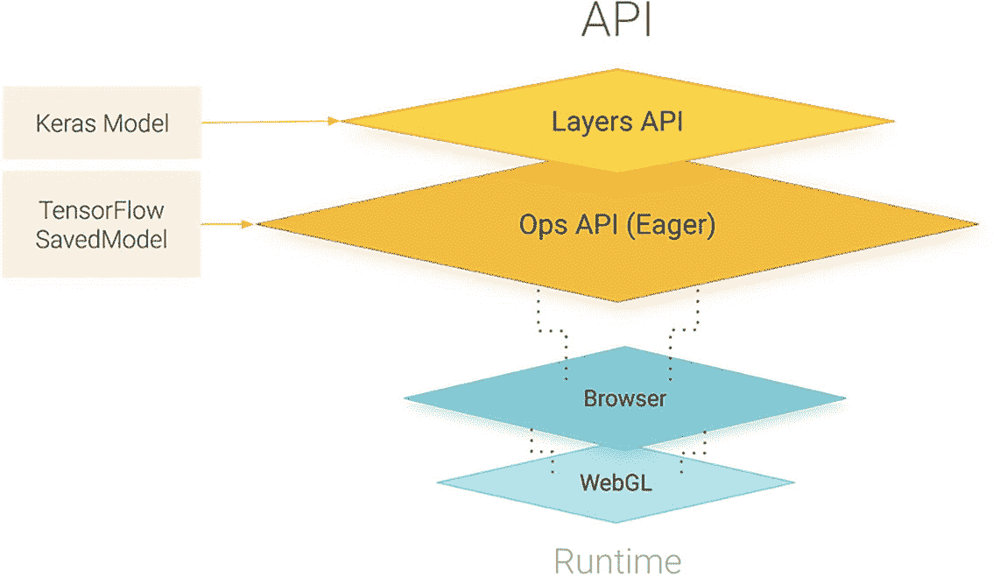

# 2\. 张量流.js

TensorFlow.js 是一个用于机器学习的开源 JavaScript 库。它是由 Google 开发的，是 Python 中 TensorFlow 的姊妹库。

该工具使您能够构建可以在浏览器或 Node.js 中运行的机器学习应用程序。

这样，用户不需要安装任何软件或驱动程序。只要打开一个网页，你就可以与程序进行交互。

## 2.1 tensor flow . js 基础知识

TensorFlow.js 由 WebGL 提供支持，提供了用于定义模型的高层 API 和用于线性代数的低层 API(以前是 deeplearn.js)。



图 2-1

TensorFlow.js API 的可视化表示。来源: [https://博客。张量流。org/2018/03/introducing-tensorflowjs-机器学习-javascript。html](https://blog.tensorflow.org/2018/03/introducing-tensorflowjs-machine-learning-javascript.html)

它还支持导入从 TensorFlow 和 Keras 保存的模型。

TensorFlow 的核心是**张量**。张量是一个数据单位，是一组形成一维或多维数组的值。它类似于多维数组。

### 2.1.1 创建张量

例如，你想象以下 2D 阵列的例子。

```py
const data = [
     [0.456, 0.378, 0.215],
     [0.876, 0.938, 0.276],
     [0.629, 0.287, 0.518]
];

Listing 2-1Example of 2D array

```

将它转换成张量以便用于 TensorFlow.js 的方法是用内置方法`tf.tensor`包装它。

```py
const data = [
     [0.456, 0.378, 0.215],
     [0.876, 0.938, 0.276],
     [0.629, 0.287, 0.518]
];

const dataTensor = tf.tensor(data);

Listing 2-2Creating a tensor out of an array

```

现在，变量`dataTensor`可以与其他 TensorFlow 方法一起用于训练模型、生成预测等等。

在`tf.tensor`中可以访问一些额外的属性，如`rank`、`shape`和`dtype`。

*   **秩**:表示张量包含多少维

*   **形状**:定义数据每个维度的大小

*   **dtype** :定义张量的数据类型

```py
const tensor = tf.tensor([[1, 2, 3], [4, 5, 6], [7, 8, 9]]);

console.log("shape: ", tensor.shape); // [3,3]
console.log("rank: ", tensor.rank); // 2
console.log("dtype: ", tensor.dtype); // float32

Listing 2-3Logging a tensor’s shape, rank, and dtype

```

在示例张量中，形状返回`[3, 3]`，因为我们可以看到包含 3 个值的 3 个数组。

当我们使用 2D 数组时，rank 属性打印出`2`。如果我们在数组中增加了另一个维度，那么这个秩应该是 3。

最后，dtype 是`float32`，因为这是默认的数据类型。

张量也可以使用其他数据类型创建，如 bool、int32、complex64 和 string 数据类型。为此，我们需要将 shape 作为第二个参数，将 dtype 作为第三个参数传递给`tf.tensor.`

```py
const tensor = tf.tensor([[1, 2], [4, 5]], [2,2], "int32");

console.log("shape: ", tensor.shape); // [2,2]
console.log("rank: ", tensor.rank); // 2
console.log("dtype: ", tensor.dtype); // int32

Listing 2-4Creating different kinds of tensors

```

在目前显示的示例代码中，我们使用了`tf.tensor`来创建张量；但是，有更多的方法可以用不同的尺寸创建它们。

根据您正在处理的数据，您可以使用从`tf.tensor1d`到`tf.tensor6d`的方法创建多达六维的张量。

如果您正在转换的数据是一个六层的多维数组，您可以同时使用`tf.tensor`和`tf.tensor6d;`，但是，使用`tf.tensor6d`会使代码更具可读性，因为您可以自动知道维度的数量。

```py
const tensor = tf.tensor6d([
  [
    [
      [
        [[1], [2]],
        [[3], [4]]
      ],
      [
        [[5], [6]],
        [[7], [8]]
      ]
    ]
  ]
]);

// Is the same thing as

const sameTensor = tf.tensor([
  [
    [
      [
        [[1], [2]],
        [[3], [4]]
      ],
      [
        [[5], [6]],
        [[7], [8]]
      ]
    ]
  ]
]);

Listing 2-5Creating multidimensional tensors

```

当创建张量时，你也可以传入一个平面数组并指出你希望张量具有的形状。

```py
const tensor = tf.tensor2d([
  [1, 2, 3],
  [4, 5, 6]
]);

// is the same thing as

const sameTensor = tf.tensor([1, 2, 3, 4, 5, 6], [2, 3]);

Listing 2-6Creating tensors from flat arrays

```

一旦张量被实例化，就可以使用`reshape`方法改变它的形状。

### 2.1.2 访问张量中的数据

一旦张量被创建，你可以使用`tf.array()`或`tf.data()`来获得它的值。

`tf.array()`返回多维数组值，`tf.data()`返回扁平化数据。

```py
const tensor = tf.tensor2d([[1, 2, 3], [4, 5, 6]]);

const array = tensor.array().then(values => console.log("array: ": values));
// array: [ [1, 2, 3], [4, 5, 6] ]

const data = tensor.data().then(values => console.log("data: ", values));
// data: Float32Array [1, 2, 3, 4, 5, 6];

Listing 2-7Accessing data in tensors

```

正如您在前面的示例中看到的，这两个方法返回一个承诺。

在 JavaScript 中，promise 是一个值的代理，该值在调用 promise 时尚未创建。承诺表示尚未完成的操作，因此它们与异步操作一起使用，以便在将来某个时候操作完成时提供一个值。

然而，也使用`arraySync()`和`dataSync()`提供同步版本。

```py
const tensor = tf.tensor2d([[1, 2, 3], [4, 5, 6]]);

const values = tensor.arraySync();
console.log("values: ": values); // values: [ [1, 2, 3], [4, 5, 6] ]

const data = tensor.dataSync()
console.log("data: ", values); // data: Float32Array [1, 2, 3, 4, 5, 6];

Listing 2-8Accessing data in tensors synchronously

```

不建议在生产应用程序中使用它们，因为它们会导致性能问题。

### 张量上的运算

在上一节中，我们了解到张量是一种数据结构，它允许我们以 TensorFlow.js 可以使用的方式存储数据。我们看到了如何创造它们，塑造它们，以及评估它们的价值。

现在，让我们来看看允许我们操纵它们的一些不同的操作。

这些操作可以分为几类。其中一些允许您对张量进行算术运算，例如，将多个张量相加，其他运算专注于进行逻辑运算，例如评估一个张量是否大于另一个张量，其他运算提供了一种进行基本数学运算的方法，例如计算张量中所有元素的平方。

可在 [`https://js.tensorflow.org/api/latest/#Operations`](https://js.tensorflow.org/api/latest/%2523Operations) 获得完整的操作列表。

这里有一个如何使用这些操作的例子。

```py
const tensorA = tf.tensor([1, 2, 3, 4]);
const tensorB = tf.tensor([5, 6, 7, 8]);

const tensor = tf.add(tensorA, tensorB); // [6, 8, 10, 12]

// or

// const tensor = tensorA.add(tensorB);

Listing 2-9Example of operation on a tensor

```

在这个例子中，我们将两个张量相加。如果你在看张量的第一个值，是 1，和张量的第一个值，是 5，加上 1 + 5 会得到数字 6，这是我们最终张量的第一个值。

为了能够使用这种运算，你的张量必须有相同的**形状**，但不一定有相同的**等级**。

如果你还记得最后几页，形状是张量每个维度的值的数量，秩是维度的数量。

让我们用另一个例子来说明这一点。

```py
const tensorA = tf.tensor2d([[1, 2, 3, 4]]);
const tensorB = tf.tensor([5, 6, 7, 8]);

const tensor = tf.add(tensorA, tensorB); // [[6, 8, 10, 12],]

Listing 2-10Example of operation on a tensor

```

在这种情况下，张量现在是 2D 张量，但张量仍然是一维的。

两者相加的结果现在是一个张量，其值与之前相同，但维数不同。

但是，如果我们试图将多个不同形状的张量相加，就会产生误差。

```py
const tensorA = tf.tensor([1, 2, 3, 4]);
const tensorB = tf.tensor([5, 6, 7]);

const tensor = tf.add(tensorA, tensorB);
// Error: Operands could not be broadcast together with shapes 3 and 4.

Listing 2-11Error generated when using an incorrect shape

```

这个错误告诉我们，这个操作数不能和这两个张量一起使用，因为其中一个有四个元素，而另一个只有三个。

张量是不可变的，所以这些操作不会改变原来的张量，而是总是返回一个新的`tf.Tensor`。

### 内存

最后，在使用张量时，需要使用`dispose()`或`tf.dispose()`显式地清理内存。

```py
const tensor = tf.tensor([1, 2, 3, 4]);

tensor.dispose();

// or

tf.dispose(tensor);

Listing 2-12Using the dispose method

```

管理内存的另一种方法是在链接操作时使用`tf.tidy()`。

由于张量是不可变的，每次运算的结果都是一个新的张量。为了避免在所有生成的张量上调用 dispose，使用`tf.tidy()`可以只保留所有操作生成的最后一个张量，并处理所有其他的张量。

```py
const tensorA = tf.tensor([1, 2, 3, 4]);

const tensor = tf.tidy(() => {
  return tensorA.square().neg();
});

console.log(tensor.dataSync()); // [-1, -4, -9, -16]

Listing 2-13Using the tidy method

```

在这个例子中，`square()`的结果将被释放，而`neg()`的结果不会被释放，因为它返回了函数的值。

既然我们已经介绍了 TensorFlow.js 的核心是什么以及如何使用 tensors，那么让我们来看看该库提供的不同功能，以便更好地了解什么是可能的。

## 2.2 特点

在这一小节中，我们将探讨 TensorFlow.js 中目前可用的三个主要功能。这包括使用预训练的模型；做迁移学习，就是用自定义输入数据重新训练一个模型；用 JavaScript 做所有的事情，意思是，创建一个模型，训练它，运行预测，都在浏览器中。

我们将涵盖这些功能，从最简单到最复杂。

### 2.2.1 使用预先训练的模型

在本书的第一章中，我们将术语“模型”定义为一种数学函数，它可以采用新的参数，根据训练数据进行预测。

如果这个定义对你来说仍然有点混乱，希望在讨论第一个特性的时候把它放到上下文中会让它变得更清晰。

在机器学习中，为了能够预测结果，我们需要一个模型。然而，没有必要自己构建模型。使用所谓的“预训练模型”是完全没问题的

术语“预先训练的”意味着该模型已经用某种类型的输入数据进行了训练，并且已经被开发用于特定目的。

例如，您可以找到一些专注于对象检测和识别的开源预训练模型。这些模型已经被输入了数百万张物体图像，经历了所有的训练过程，现在在预测新实体时应该具有令人满意的准确度。

创建这些模型的公司或机构将它们开源，因此开发人员可以在他们的应用程序中使用它们，并有机会更快地构建机器学习项目。

正如您可以想象的那样，收集数据、格式化数据、标记数据、试验不同的算法和参数的过程可能会花费大量时间，因此能够通过使用预先训练的模型来替代这些工作可以腾出大量时间来专注于构建应用程序。

目前可用于 TensorFlow.js 的预训练模型包括身体分割、姿势估计、对象检测、图像分类、语音命令识别和情感分析。

在应用程序中使用预先训练好的模型相对容易。

在下面的代码示例中，我们将使用 mobilenet 对象检测模型来预测新图像中的实体。

```py
const img = document.getElementById("img");

const model = await mobilenet.load();

const predictions = await model.classify(img);

return predictions;

Listing 2-14Classifying an image using the mobilenet model

```

在实际应用中，该代码需要 TensorFlow.js 库和 mobilenet 预训练模型，但是在接下来的几章中，当我们深入构建实际项目时，将会展示更完整的代码示例。

前面的示例从获取应该包含我们想要预测的图像的 HTML 元素开始。下一步是异步加载 mobilenet 模型。

模型可能非常大，有时有几兆字节，所以需要使用`async/await`来加载它们，以确保在运行预测时这个操作已经完全完成。

一旦模型准备好了，就可以对它调用`classify()`方法，在这个方法中传递 HTML 元素，这将返回一个预测数组。

在一个例子中，您将使用一只猫的图像，预测的输出将类似于此。


图 2-3

先前应用于猫的图片的来自 mobilenet 模型的图像分类的结果


图 2-2

一只猫的照片

使用`classify()`的结果总是一个包含两个键的三个对象的数组:*类名*和*概率*。

className 是一个包含标签或类的字符串，模型根据之前训练的数据对新输入进行了分类。

概率是一个介于 0 和 1 之间的浮点值，表示输入数据属于类名的可能性，0 表示不太可能，1 表示非常可能。

它们按降序排列，因此数组中的第一个对象是最有可能为真的预测。

在前面的输出中，模型预测图像包含“虎猫”的可能性为 70%。

其余预测的概率值下降得相当明显，有 21%的可能性包含“虎斑猫”，约 0.02%的可能性包含“领结”。

一般来说，您应该关注预测中返回的第一个值，因为它的概率最高；但是，70%其实没那么高。

在机器学习中，当使用预测时，你的目标是拥有尽可能高的概率。在这种情况下，我们只预测了图像中猫的存在，但在实际应用中，您可以想象 30%的预测不正确输出的可能性是不可接受的。

为了改善这一点，一般来说，我们会做所谓的“超参数调整”，并重新训练模型。

**超参数调整**是调整和优化生成模型时使用的参数的过程。它可以是在神经网络中添加层、更改批量大小等等，并查看这些更改对模型的性能和准确性的影响。

然而，当使用一个预先训练好的模型时，您将无法做到这一点，因为您唯一可以访问的是输出模型，而不是创建它的代码。

这是使用预训练模型带来的限制之一。

使用这些模型时，您无法控制它们是如何创建的以及如何修改的。您通常无法访问培训过程中使用的数据集，因此您无法确定它是否满足您的应用程序的要求。

此外，你冒着继承公司或机构偏见的风险。

如果您的应用程序涉及实现面部识别，并且您决定使用开源的预训练模型，您不能确定该模型是在多样化的人群数据集上训练的。因此，你可能会在不知不觉中支持某些偏见。

在过去，面部识别模型只在白人身上表现良好，留下了一大群肤色较黑的用户，这是一个问题。

尽管已经做了一些工作来解决这个问题，但我们经常听到机器学习模型做出有偏见的预测，因为用于训练它们的数据不够多样化。

如果您决定在生产应用程序中使用预先训练的模型，我认为事先做一些研究是很重要的。

### 迁移学习

TensorFlow.js 提供的第二个功能叫做“迁移学习”。

**迁移学习**是重用为一项任务开发的模型的能力，作为第二项任务模型的起点。

如果你想象一个物体识别模型，它已经在你无法访问的数据集上进行了预训练，那么这个模型的核心功能就是识别图像中的实体。使用迁移学习，您可以利用此模型创建一个新模型，该模型的功能将是相同的，但使用您的自定义输入数据进行训练。

迁移学习是生成半定制模型的一种方式。您仍然不能修改模型本身，但是您可以向它提供您自己的数据，这可以提高预测的准确性。

如果我们重复使用上一节中的例子，使用预先训练的模型来检测图片中猫的存在，我们可以看到预测返回了标签“老虎猫”这意味着模型是用这样标记的图像训练的，但如果我们想检测非常不同的东西，如金荆条(澳大利亚的花)呢？

第一步是搜索模型可以预测的类的列表，并查看它是否包含这些花。如果是的话，就意味着这个模型可以直接使用，就像上一节中展示的那样。

然而，如果它没有用金合欢的图像进行训练，它将无法检测到它们，直到我们使用迁移学习生成一个新的模型。

为此，一部分代码类似于上一节中显示的示例，因为我们仍然需要从预先训练的模型开始，但是我们引入了一些新的逻辑。

首先，我们需要将一个 K-nearest neighbors 分类器与 TensorFlow.js 和 mobilenet 预训练模型一起导入到我们的应用程序中。

```py
<script src="https://cdn.jsdelivr.net/npm/@tensorflow/tfjs/dist/tf.min.js"></script>

<script src="https://cdn.jsdelivr.net/npm/@tensorflow-models/mobilenet@1.0.0"></script>

<script src="https://cdn.jsdelivr.net/npm/@tensorflow-models/knn-classifier"></script>

Listing 2-15Importing TensorFlow.js, mobilenet, and a KNN classifier

```

这样做可以让我们访问一个`knnClassifier`对象。

要实例化它，我们需要调用`create`方法。

```py
const classifier = knnClassifier.create();

Listing 2-16Instantiating the KNN classifier

```

这个分类器将用于使我们能够根据自定义输入数据进行预测，而不是仅使用预先训练的模型。

这个过程中的主要步骤包括对模型进行所谓的**推理**，这意味着将 mobilenet 模型应用于新数据，将这些示例添加到分类器中，并预测类。

```py
const img = await webcam.capture();
const activation = model.infer(img, 'conv_preds');
classifier.addExample(activation, classId);

Listing 2-17Adding example data to a KNN classifier

```

前面的代码示例并不完整，但我们将在后面的章节中更深入地讨论它，届时我们将重点关注在应用程序中实现迁移学习。

这里最重要的是理解我们将来自网络摄像头馈送的图像保存在一个变量中，将它用作模型上的新数据，并将它作为带有类(标签)的示例添加到分类器，因此最终结果是模型不仅能够识别与 mobilenet 模型的初始训练过程中使用的数据相似的数据，还能够识别我们的新样本。

向分类器提供一个新的图像和例子不足以让它准确地识别我们的新输入数据；因此，这个步骤必须重复多次。

一旦你认为你的分类器准备好了，你就可以像这样预测输入。

```py
const img = await webcam.capture();
const activation = model.infer(img, 'conv_preds');
const result = await classifier.predictClass(activation);

const classes = ["A", "B", "C"];
const prediction = classes[result.label];

Listing 2-18Classifying a new image

```

第一步是相同的，但是我们没有将示例添加到分类器中，而是使用`predictClass`方法返回它认为新输入是什么的结果。

我们将在下一章更深入地讨论迁移学习。

### 2.2.3 创建、训练和预测

最后，第三个特性允许您自己创建模型、运行训练过程并使用它，所有这些都在 JavaScript 中完成。

这个特性比前两个更复杂，但将在第 [5](5.html) 章中更深入地讨论，当我们使用我们自己创建的模型构建应用程序时。

重要的是要知道自己创建一个模型需要一个试错的方法。

解决一个问题没有单一的方法，如果您决定走这条路，您将需要用不同的算法、参数等进行大量的实验。

最常用的模型类型是顺序模型，您可以用一系列层来创建它。

这种模型的一个例子如下所示。

```py
const model = tf.sequential();

model.add(tf.layers.conv2d({
      inputShape: [28, 28, 1],
      kernelSize: 5,
      filters: 8,
      strides: 1,
      activation: 'relu',
      kernelInitializer: 'VarianceScaling'
}));

model.add(tf.layers.maxPooling2d({
      poolSize: [2, 2],
      strides: [2, 2]
}));

model.add(tf.layers.conv2d({
      kernelSize: 5,
      filters: 16,
      strides: 1,
      activation: 'relu',
      kernelInitializer: 'VarianceScaling'
}));

Listing 2-19Creating a model

```

我们首先使用`tf.sequential`实例化它，并向它添加多个不同的层。

这一步有点武断，因为选择层的类型和数量，以及传递给层的参数，与其说是科学，不如说是艺术。

您的模型在第一次编写时可能并不完美，并且需要多次修改才能得到性能最佳的结果。

要记住的一件重要事情是在模型的第一层提供一个`inputShape`参数，以指示模型将要被训练的数据的形状。后续层不需要它。

创建模型后，下一步是用数据对其进行训练。该步骤使用`fit`方法完成。

```py
await model.fit(data, label, options);

Listing 2-20Fitting a model with data

```

一般来说，在调用此方法之前，您会将数据分成几批，以一点一点地训练您的模型。整个数据集通常太大，无法一次使用，因此将其分成几批非常重要。

传递给函数的 options 参数是一个包含有关训练过程的信息的对象。您可以指定**时期**的数量，即整个数据集通过神经网络的时间，还可以指定批次大小，即单个批次中存在的训练示例的数量。

由于数据集在`fit`方法中分批传递，我们还需要考虑用完整数据集训练模型所需的**次迭代**的次数。

例如，如果我们的数据集包含 1000 个示例，并且我们的批量大小是一次 100 个示例，则需要 10 次迭代来完成 1 个时期。

因此，我们需要循环并调用我们的`fit`方法 10 次，每次更新批量数据。

一旦模型完全训练好，就可以使用`predict`方法进行预测。

```py
const prediction = model.predict(data);

Listing 2-21Predicting

```

关于这个特性还有更多的内容要介绍，但是我们将在接下来的几章中用我们的实际例子进一步研究它。