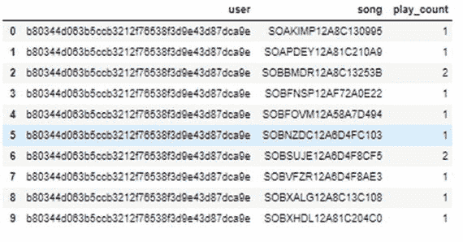
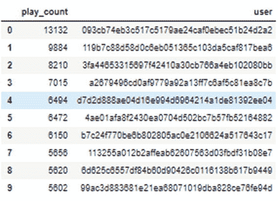
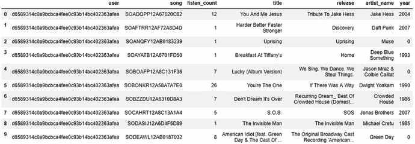
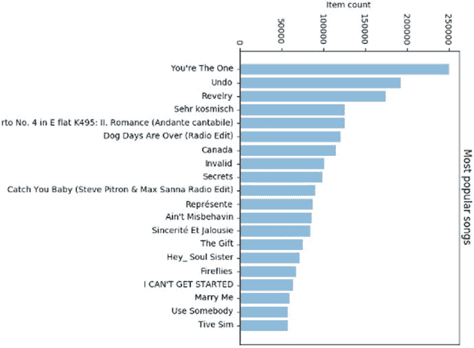
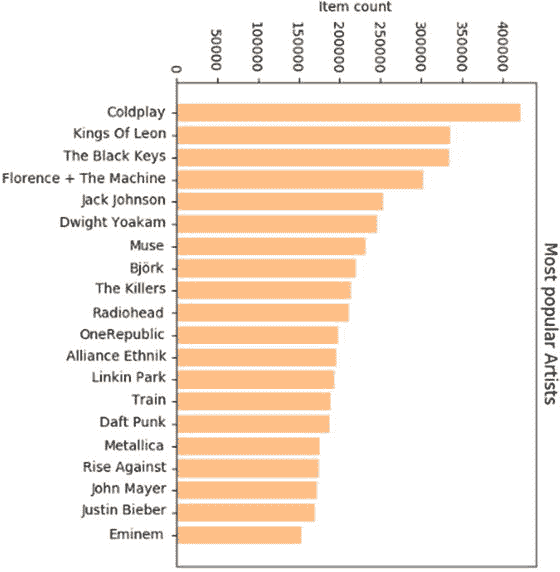
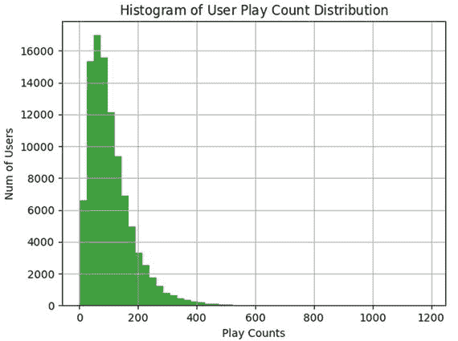
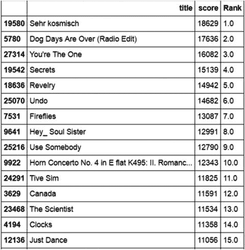
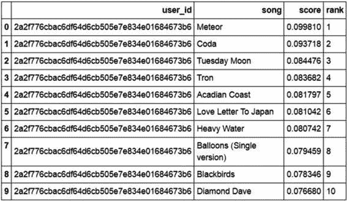

# 10.分析音乐趋势和推荐

推荐引擎可能是最流行和最著名的机器学习应用之一。很多不属于机器学习社区的人经常认为推荐引擎是它唯一的用途。虽然我们知道机器学习有一个巨大的子空间，推荐引擎只是其中的一个候选，但不可否认的是推荐引擎的普及。它们受欢迎的原因之一是它们无处不在的性质；任何上网的人，无论以何种方式，都曾以某种形式接触过推荐引擎。它们用于推荐电子商务网站上的产品、旅游门户上的旅游目的地、流媒体网站上的歌曲/视频、食品聚合门户上的餐馆等。一份长长的清单强调了它们的普遍应用。

推荐引擎的流行源于它们非常重要的两点:

*   它们很容易实现:推荐引擎很容易集成到现有的工作流程中。我们需要的只是收集一些关于用户趋势和模式的数据，这些数据通常可以从企业的交易数据库中提取。
*   它们有效:这种说法对于我们已经讨论过的所有其他机器学习解决方案同样适用。但是一个重要的区别在于它们的负面影响非常有限。例如，考虑一个旅游门户，它从其数据集中建议一组最受欢迎的地点。推荐系统可以是一个微不足道的系统，但是它仅仅出现在用户面前就可能引起用户的兴趣。公司肯定可以通过一个复杂的推荐引擎获益，但即使是一个非常简单的引擎也能保证以最少的投资获得一些回报。这一点使它们成为一个非常有吸引力的命题。

本章研究我们如何使用事务数据来开发不同类型的推荐引擎。我们将学习一个非常有趣的数据集的辅助数据集，“百万首歌曲数据集”。我们将浏览用户的收听历史，然后用它来开发不同复杂程度的多个推荐引擎。

## 百万首歌曲数据集品味档案

百万首歌曲数据集是一个非常受欢迎的数据集，可在 [`https://labrosa.ee.columbia.edu/millionsong/`](https://labrosa.ee.columbia.edu/millionsong/) 获得。原始数据集包含了多年来大约一百万首歌曲的量化音频特征。该数据集是 Echonest ( [`http://the.echonest.com/`](http://the.echonest.com/) )和 LABRosa ( [`http://labrosa.ee.columbia.edu/`](http://labrosa.ee.columbia.edu/) )之间的合作项目。虽然我们不会直接使用这个数据集，但是我们会使用它的一部分。

其他几个数据集是从最初的百万首歌曲数据集衍生出来的。其中一个数据集被称为 Echonest 味觉轮廓子集。这个特殊的数据集是由 Echonest 和一些未披露的合作伙伴创建的。该数据集包含匿名用户对包含在百万首歌曲数据集中的歌曲的播放计数。味觉轮廓数据集是相当大的，因为它包含大约 4800 万行三元组。三元组包含以下信息:

(用户 id、歌曲 id、播放次数)

每一行给出由歌曲 ID 标识的歌曲对于由用户 ID 标识的用户的播放计数。整个数据集包含大约 100 万个独立用户，其中包含来自百万首歌曲数据集中的大约 384，000 首歌曲。

读者可以从 [`http://labrosa.ee.columbia.edu/millionsong/sites/default/files/challenge/train_triplets.txt.zip`](http://labrosa.ee.columbia.edu/millionsong/sites/default/files/challenge/train_triplets.txt.zip) 下载数据集。压缩数据集的大小约为 500MB，解压缩后，您需要约 3.5GB 的空间。下载并解压缩数据后，您将了解如何对数据集进行子集化以减小其大小。

百万歌曲数据集还有其他几个有用的辅助数据集。我们不会在这里详细讨论它们，但是我们鼓励读者探索这些数据集，并利用他们的想象力来开发创新的用例。

## 探索性数据分析

探索性数据分析是任何数据分析工作流的重要组成部分。到这个时候，我们已经在读者心中牢牢地确立了这个事实。在大型数据集的情况下，探索性数据分析变得更加重要，因为这通常会引导我们获得一些信息，我们可以使用这些信息来对数据集进行一点精简。正如我们将看到的，有时我们还会超越传统的数据访问工具，以绕过大数据量带来的问题。

### 加载和整理数据

该过程的第一步是从未压缩的文件中加载数据。由于数据大小约为 3GB，因此我们不会加载完整的数据，而只会从数据集中加载指定数量的行。这可以通过使用`pandas`提供的`read_csv`函数的`nrows`参数来实现。

```py
In [2]: triplet_dataset = pd.read_csv(filepath_or_buffer=data_home+'train_triplets.txt',
   ...: nrows=10000,sep='\t', header=None, names=['user','song','play_count'])

```

由于数据集没有标题，我们还向函数提供了列名。数据子集如图 [10-1](#Fig1) 所示。



图 10-1。

Sample rows from The Echonest taste profile dataset

在这种规模的数据集中，我们可能要做的第一件事是确定我们应该考虑多少不同的用户(或歌曲)。在原始数据集中，我们有大约一百万个用户，但是我们想要确定我们应该考虑的用户数量。例如，如果 20%的用户占总播放次数的 80%左右，那么将我们的分析集中在这 20%的用户上是一个好主意。通常，这可以通过按用户(或按歌曲)汇总数据集并获得播放计数的累积和来完成。然后我们就可以知道有多少用户占了 80%的播放次数等等。但是由于数据的大小，`pandas`提供的累积求和函数会遇到麻烦。因此，我们将编写代码来逐行读取文件，并提取用户(或歌曲)的播放计数信息。这也是一种可能的方法，读者可以在数据集大小超过系统可用内存的情况下使用。下面的代码片段将逐行读取文件，提取所有用户的总播放次数，并保存该信息以供以后使用。

```py
In [2]: output_dict = {}
   ...: with open(data_home+'train_triplets.txt') as f:
   ...: for line_number, line in enumerate(f):
   ...:      user = line.split('\t')[0]
   ...:      play_count = int(line.split('\t')[2])
   ...:      if user in output_dict:
   ...:          play_count +=output_dict[user]
   ...:          output_dict.update({user:play_count})
   ...:      output_dict.update({user:play_count})
   ...: output_list = [{'user':k,'play_count':v} for k,v in output_dict.items()]
   ...: play_count_df = pd.DataFrame(output_list)
   ...: play_count_df = play_count_df.sort_values(by = 'play_count', ascending = False)
   ...: play_count_df.to_csv(path_or_buf='user_playcount_df.csv', index = False)

```

然后可以根据我们的要求加载和使用持久化的数据帧。我们可以使用类似的策略来提取每首歌曲的播放次数。数据集中的几行如图 [10-2](#Fig2) 所示



图 10-2。

Play counts for some users

关于我们的数据集，我们想知道的第一件事是，我们需要占播放次数大约 40%的用户数量。我们任意选择了 40%的值，以保持数据集大小的可管理性；您可以试验这些数字以获得不同大小的数据集，甚至利用 Hadoop 上的 Spark 等大数据处理和分析框架来分析完整的数据集！下面的代码片段将确定占数据百分比的用户子集。在我们的例子中，大约 10，000 个用户占了播放次数的 40%，因此我们将对这些用户进行分组。

```py
In [2]: total_play_count = sum(song_count_df.play_count)
   ...: (float(play_count_df.head(n=100000).play_count.sum())/total_play_count)*100
   ...: play_count_subset = play_count_df.head(n=100000)

```

以类似的方式，我们可以确定解释 80%的总播放次数所需的独特歌曲的数量。在我们的例子中，我们会发现 30，000 首歌曲占播放计数的 80%左右。这些信息已经是一个很大的发现，因为大约 10%的歌曲贡献了 80%的播放量。使用类似于前面给出的代码片段，我们可以确定这些歌曲的子集。有了这些歌曲和用户子集，我们可以对原始数据集进行子集划分，以减少数据集，使其只包含过滤后的用户和歌曲。下面的代码片段使用这些数据帧来过滤原始数据集，然后持久存储生成的数据集以供将来使用。

```py
In [2]: triplet_dataset =
   ...: pd.read_csv(filepath_or_buffer=data_home+'train_triplets.txt',sep='\t', header=None,   
   ...: names=['user','song','play_count'])
   ...: triplet_dataset_sub = triplet_dataset[triplet_dataset.user.isin(user_subset) ]
   ...: del(triplet_dataset)
   ...: triplet_dataset_sub_song =
   ...: triplet_dataset_sub[triplet_dataset_sub.song.isin(song_subset)]
   ...: del(triplet_dataset_sub)
   ...: triplet_dataset_sub_song.to_csv(path_or_buf=data_home+'triplet_dataset_sub_song.csv', index = False)

```

这个子集将为我们提供一个具有大约 1000 万行元组的数据帧。我们将使用它作为我们所有未来分析的起始数据集。你可以摆弄这些数字来得到不同的数据集和可能不同的结果。

### 增强数据

我们加载的数据只是三元组数据，所以我们看不到歌曲名、艺术家名或专辑名。我们可以通过添加关于歌曲的信息来增强我们的数据。这些信息是百万首歌曲数据库的一部分。这些数据以 SQLite 数据库文件的形式提供。首先，我们将通过在 [`https://labrosa.ee.columbia.edu/millionsong/pages/getting-dataset#subset`](https://labrosa.ee.columbia.edu/millionsong/pages/getting-dataset#subset) 从网页下载`track_metadata.db`文件来下载数据。

下一步是将这个 SQLite 数据库读取到一个数据帧中，并通过将其与我们的三元组数据帧合并来提取轨迹信息。我们还将删除一些我们在分析中不会用到的额外列。下面的代码片段将加载整个数据集，将它与我们的子集三元组数据连接起来，并删除额外的列。

```py
In [2]: conn = sqlite3.connect(data_home+'track_metadata.db')
   ...: cur = conn.cursor()
   ...: cur.execute("SELECT name FROM sqlite_master WHERE type='table'")
   ...: cur.fetchall()

Out[2]: [('songs',)]

```

上面代码片段的输出显示数据库包含一个名为`songs`的表。我们将从该表中获取所有行，并将其读入数据帧。

```py
In [5]: del(track_metadata_df_sub['track_id'])
   ...: del(track_metadata_df_sub['artist_mbid'])
   ...: track_metadata_df_sub = track_metadata_df_sub.drop_duplicates(['song_id'])
   ...: triplet_dataset_sub_song_merged = pd.merge(triplet_dataset_sub_song, track_metadata_df_sub, how='left', left_on='song', right_o
   ...: n='song_id')
   ...: triplet_dataset_sub_song_merged.rename(columns={'play_count':'listen_count'},inplace=True)
   ...: del(triplet_dataset_sub_song_merged['song_id'])
   ...: del(triplet_dataset_sub_song_merged['artist_id'])
   ...: del(triplet_dataset_sub_song_merged['duration'])
   ...: del(triplet_dataset_sub_song_merged['artist_familiarity'])
   ...: del(triplet_dataset_sub_song_merged['artist_hotttnesss'])
   ...: del(triplet_dataset_sub_song_merged['track_7digitalid'])
   ...: del(triplet_dataset_sub_song_merged['shs_perf'])
   ...: del(triplet_dataset_sub_song_merged['shs_work'])

```

合并了三元组数据帧的最终数据集看起来类似于图 [10-3](#Fig3) 中的描述。这将形成我们探索性数据分析的起始数据框架。



图 10-3。

Play counts dataset merged with songs metadata

### 视觉分析

在我们开始开发各种推荐引擎之前，让我们对数据集进行一些可视化分析。我们会试着看看关于歌曲、专辑和发行的不同趋势。

#### 最受欢迎的歌曲

我们可以为数据绘制的第一个信息涉及数据集中不同歌曲的流行程度。我们将尝试确定数据集中的前 20 首歌曲。对这种流行度稍加修改，也将作为我们最基本的推荐引擎。

下面的代码片段为我们提供了数据集中最流行的歌曲。

```py
In [7]: import matplotlib.pyplot as plt; plt.rcdefaults()
   ...: import numpy as np
   ...: import matplotlib.pyplot as plt
   ...:
   ...: popular_songs = triplet_dataset_sub_song_merged[['title','listen_count']].groupby('title').sum().reset_index()
   ...: popular_songs_top_20 = popular_songs.sort_values('listen_count', ascending=False).head(n=20)
   ...: objects = (list(popular_songs_top_20['title']))
   ...: y_pos = np.arange(len(objects))
   ...: performance = list(popular_songs_top_20['listen_count'])
   ...:
   ...: plt.bar(y_pos, performance, align='center', alpha=0.5)
   ...: plt.xticks(y_pos, objects, rotation='vertical')
   ...: plt.ylabel('Item count')
   ...: plt.title('Most popular songs')
   ...: plt.show()

```

代码片段生成的图如图 [10-4](#Fig4) 所示。该图显示，我们数据集最受欢迎的歌曲是“非诚勿扰”。我们还可以搜索音轨数据帧，查看负责该特定音轨的乐队是黑键乐队。



图 10-4。

Most popular songs

#### 最受欢迎的艺术家

读者可能感兴趣的下一个信息是，谁是数据集中最受欢迎的艺术家？绘制这些信息的代码与前面给出的代码非常相似，所以我们不包括确切的代码片段。结果图如图 [10-5](#Fig5) 所示。



图 10-5。

Most popular artists

根据我们的数据集，我们可以通过阅读剧情来了解酷玩乐队是最受欢迎的艺术家之一。一个敏锐的音乐爱好者可以看到，我们没有很多像 U2 或披头士这样的经典艺术家的代表，也许除了金属乐队和电台司令。这强调了两个关键点——首先，数据主要来源于不总是在网上听经典艺术家的一代人，其次，我们很少有艺术家不是当代人，但在网上播放时仍然得分很高。令人惊讶的是，在我们的数据集中，这种行为的唯一例子是金属乐队和电台司令乐队。它们起源于 20 世纪 80 年代，但当涉及到在线播放计数时，仍然非常受欢迎。然而，不同的音乐流派表现在顶级艺术家中，流行说唱艺术家如 Eminem，另类摇滚乐队如 Linkin Park 和 The Killers，甚至流行摇滚乐队如 Train 和 OneRepublic，此外还有经典摇滚或金属乐队如电台司令和 Metallica！

另一个稍有偏差的解读是，酷玩乐队是最受欢迎的艺术家，但他们在最受欢迎歌曲名单中没有候选人。这间接暗示了这些播放计数在所有曲目中的平均分布。你可以把它当作练习来确定出现在图 [10-5](#Fig5) 中的每个艺术家的歌曲播放分布。这将为你提供一个线索，让你知道这位艺术家的受欢迎程度是不平衡的还是一致的。这个想法可以进一步发展成为一个成熟的推荐引擎。

#### 用户与歌曲分发

我们可以从数据集中找到的最后一个信息是关于用户歌曲数量的分布。这些信息将告诉我们用户平均收听的歌曲数量是如何分布的。我们可以使用这些信息来创建不同类别的用户，并在此基础上修改推荐引擎。收听精选歌曲的用户可以用于开发简单的推荐引擎，而为我们提供大量行为洞察的用户可以用于开发复杂的推荐引擎。

在我们继续绘制该分布图之前，让我们试着找到一些关于该分布的统计信息。下面的代码计算该分布，然后显示关于它的汇总统计信息。

```py
In [11]: user_song_count_distribution = triplet_dataset_sub_song_merged[['user','title']].groupby('user').count().reset_index().sort_values(by='title', ascending = False)
    ...: user_song_count_distribution.title.describe()
Out[11]:
count    99996.000000
mean       107.752160
std         79.741555
min          1.000000
25%         53.000000
50%         89.000000
75%        141.000000
max       1189.000000
Name: title, dtype: float64

```

这为我们提供了一些关于歌曲数量如何在用户中分布的重要信息。我们看到，平均来说，一个用户会听 100 多首歌曲，但有些用户对歌曲多样化有更大的胃口。让我们试着想象一下这个特殊的分布。下面的代码将帮助我们绘制出播放次数在数据集上的分布。我们有意识地将 bin 的数量保持在一个较小的数量，因为这可以给出关于我们拥有的用户类别数量的大致信息。

```py
In [12]: x = user_song_count_distribution.title
    ...: n, bins, patches = plt.hist(x, 50, facecolor='green', alpha=0.75)
    ...: plt.xlabel('Play Counts')
    ...: plt.ylabel('Probability')
    ...: plt.title(r'$\mathrm{Histogram\ of\ User\ Play\ Count\ Distribution}\ $')
    ...: plt.grid(True)
    ...: plt.show()

```

代码生成的分布图如图 [10-6](#Fig6) 所示。该图清楚地显示，尽管我们在最小和最大播放计数上有巨大的差异，但分布的大部分集中在 100+歌曲计数上。



图 10-6。

Distribution of play counts for users

鉴于数据的性质，我们可以进行各种各样的酷的可视化；例如，绘制艺术家的热门曲目如何播放、每年的播放计数分布等。但是我们相信到现在为止，你在提出相关问题的艺术和通过可视化回答这些问题方面已经足够熟练了。因此，我们将总结我们的探索性数据分析，并转移到本章的主要焦点，即推荐引擎的开发。但是，请随意尝试对这些数据进行额外的分析和可视化，如果您发现了一些很酷的东西，请像往常一样，随时向该书的代码库发送一个拉请求！

## 推荐引擎

推荐引擎的工作简洁地体现在它的名字中——它所要做的就是做推荐。但我们必须承认，这种描述看似简单。推荐引擎是一种对关于用户偏好的可用信息进行建模和重新排列的方式，然后使用该信息在该信息的基础上提供明智的推荐。推荐引擎的基础总是用户和产品之间记录的交互。例如，电影推荐引擎将基于用户提供给不同电影的评级；新闻文章推荐器将考虑用户过去读过的文章；等等。

本节使用用户歌曲播放次数数据集来揭示我们可以向不同用户推荐新曲目的不同方式。我们将从一个非常基础的系统开始，并尝试线性发展成一个复杂的推荐系统。在我们开始构建这些系统之前，我们将检查它们的效用和各种类型的推荐引擎。

### 推荐引擎的类型

不同推荐引擎的主要区别在于它们认为在生成推荐的过程中最重要的实体。选择中心实体有不同的选择，这种选择将决定我们将开发的推荐引擎的类型。

*   基于用户的推荐引擎:在这些类型的推荐引擎中，用户是中心实体。该算法将寻找用户之间的相似性，并在这些相似性的基础上提出推荐。
*   基于内容的推荐引擎:在推荐引擎的另一端，我们有基于内容的推荐引擎。在这些中，中心实体是我们试图推荐的内容；例如，在我们的例子中，实体将是我们试图推荐的歌曲。这些算法将试图找到关于内容的特征并找到相似的内容。然后，这些相似性将用于向最终用户提出建议。
*   混合推荐引擎:这些类型的推荐引擎将考虑用户的特征和内容来开发推荐。这些有时也被称为协同过滤推荐引擎，因为它们通过使用内容和用户的相似性来“协作”。这些是最有效的推荐引擎之一，因为它们吸收了两种推荐引擎的最佳特性。

### 推荐引擎的效用

在前一章中，我们讨论了任何组织的一个重要要求，即了解客户。这一要求对于在线企业来说变得更加重要，因为在线企业几乎没有与客户的实际互动。推荐引擎为这些组织提供了极好的机会，不仅可以了解他们的客户，还可以利用这些信息增加收入。推荐引擎的另一个重要优势是它们潜在的负面影响非常有限。用户能做的最糟糕的事情就是不注意向他做的推荐。组织可以很容易地在与用户的交互中集成一个粗糙的推荐引擎，然后根据其性能，决定开发一个更复杂的版本。尽管未经证实的说法经常是关于推荐引擎对像网飞、亚马逊、YouTube 等主要在线服务提供商的销售的影响。一些论文提供了对其有效性的有趣见解。我们鼓励你在 [`http://ai2-s2-pdfs.s3.amazonaws.com/ba21/7822b81c3c9449014cb92e197d8a6baa4914.pdf`](http://ai2-s2-pdfs.s3.amazonaws.com/ba21/7822b81c3c9449014cb92e197d8a6baa4914.pdf) 阅读一篇这样的论文。该研究声称，一个好的推荐引擎往往会增加约 35%的销量，并引导客户发现更多的产品，这反过来又增加了积极的客户体验。在我们开始讨论各种推荐引擎之前，我们要感谢我们的朋友和同事数据科学家、作者和课程讲师 Siraj Raval，他帮助我们编写了本章中与推荐引擎相关的大部分代码，并分享了他开发推荐引擎的代码库(请访问 Siraj 的 GitHub，网址为 [`https://github.com/llSourcell`](https://github.com/llSourcell) )。我们将修改他的一些代码样本来开发推荐引擎，我们将在后面的章节中讨论。感兴趣的读者还可以在 [`www.youtube.com/c/sirajology`](http://www.youtube.com/c/sirajology) 查看 Siraj 的 YouTube 频道，在那里他制作了关于机器学习、深度学习、人工智能和其他有趣的教育内容的优秀视频。

### 基于流行度的推荐引擎

最简单的推荐引擎自然是最容易开发的。因为我们可以很容易地开发推荐引擎，所以这种类型的推荐引擎非常容易开发。这个推荐引擎的驱动逻辑是，如果某个项目被我们的绝大多数用户群喜欢(或收听)，那么向没有与该项目交互的用户推荐该项目是一个好主意。

开发这种推荐的代码非常简单，实际上只是一个总结过程。为了开发这些推荐，我们将确定数据集中哪些歌曲有最多的用户收听，然后这将成为我们对每个用户的标准推荐集。接下来的代码定义了一个函数，该函数将进行汇总并返回结果数据帧。

```py
In [1]:
def create_popularity_recommendation(train_data, user_id, item_id):
    #Get a count of user_ids for each unique song as recommendation score
    train_data_grouped = train_data.groupby([item_id]).agg({user_id: 'count'}).reset_index()
    train_data_grouped.rename(columns = {user_id: 'score'},inplace=True)

    #Sort the songs based upon recommendation score
    train_data_sort = train_data_grouped.sort_values(['score', item_id], ascending = [0,1])

    #Generate a recommendation rank based upon score
    train_data_sort['Rank'] = train_data_sort['score'].rank(ascending=0, method='first')

    #Get the top 10 recommendations
    popularity_recommendations = train_data_sort.head(20)
    return popularity_recommendations

In [2]: recommendations = create_popularity_recommendation(triplet_dataset_sub_song_merged,'user','title')
In [3]: recommendations

```

我们可以在数据集上使用这个函数来为我们的每个用户生成前 10 个推荐。我们的普通推荐系统的输出如图 [10-7](#Fig7) 所示。在这里，您可以看到这些推荐非常类似于您在上一节中看到的最受欢迎的歌曲列表，这是意料之中的，因为两者背后的逻辑是相同的，只是输出不同。



图 10-7。

Recommendation by the popularity recommendation engine

### 基于项目相似度的推荐引擎

在上一节中，我们见证了一个最简单的推荐引擎。在这一节中，我们将讨论一个稍微复杂一点的解决方案。这个推荐引擎是基于计算用户项目和数据集中其他项目之间的相似性。

在我们进一步进行开发工作之前，让我们描述一下我们计划如何计算“项目-项目”相似性，这是我们推荐引擎的核心。通常，为了定义一组项目之间的相似性，我们需要一个特征集来描述这两个项目。在我们的情况下，它将意味着歌曲的特征，在此基础上一首歌曲可以与另一首区分开来。尽管我们还没有准备好使用这些特性(或者我们有吗？)，我们将根据收听这些歌曲的用户来定义相似性。迷茫？考虑这个数学公式，它会让您对这个指标有更多的了解。

相似度 <sub>ij</sub> =交集(用户 <sub>i</sub> ，用户<sub>j</sub>)/联合(用户 <sub>i</sub> ，用户 <sub>j</sub> )

这个相似性度量被称为 Jaccard 指数( [`https://en.wikipedia.org/wiki/Jaccard_index`](https://en.wikipedia.org/wiki/Jaccard_index) )，在我们的例子中，我们可以使用它来定义两首歌曲之间的相似性。基本思想仍然是，如果两首歌曲被全部听众中的大部分普通用户收听，那么这两首歌曲可以说是彼此相似的。基于这个相似性度量，我们可以定义算法将向用户 k 推荐歌曲所采取的步骤

1.  确定用户 k 听的歌曲。
2.  使用前面定义的相似性度量，计算用户列表中的每首歌曲与我们的数据集中的歌曲的相似性。
3.  确定与用户已经听过的歌曲最相似的歌曲。
4.  基于相似性得分选择这些歌曲的子集作为推荐。

由于当我们有大量歌曲时，步骤 2 可能成为计算密集型步骤，因此我们将我们的数据分成 5，000 首歌曲的子集，以使计算更加可行。我们将选择最受欢迎的 5000 首歌曲，因此我们不太可能错过任何重要的推荐。

```py
In [4]:
song_count_subset = song_count_df.head(n=5000)
user_subset = list(play_count_subset.user)
song_subset = list(song_count_subset.song)
triplet_dataset_sub_song_merged_sub = triplet_dataset_sub_song_merged[triplet_dataset_sub_song_merged.song.isin(song_subset)]

```

这段代码将我们的数据集分成子集，只包含最流行的 5，000 首歌曲。然后，我们将创建基于相似性的推荐引擎，并为随机用户生成推荐。我们在这里利用 Siraj 的推荐器模块来实现基于项目相似性的推荐系统。

```py
In [5]:
train_data, test_data = train_test_split(triplet_dataset_sub_song_merged_sub, test_size = 0.30, random_state=0)
is_model = Recommenders.item_similarity_recommender_py()
is_model.create(train_data, 'user', 'title')
user_id = list(train_data.user)[7]
user_items = is_model.get_user_items(user_id)
is_model.recommend(user_id)

```

随机用户的建议如图 [10-8](#Fig8) 所示。请注意与基于流行度的推荐引擎的明显区别。所以这个特定的人几乎肯定不喜欢我们数据集中最流行的歌曲。



图 10-8。

Recommendation by the item similarity based recommendation engine Note

在这一节的开始，我们提到我们不容易获得可以用来定义相似性的宋的特征。作为百万首歌曲数据库的一部分，我们为数据集中的每首歌曲都提供了这些功能。我们鼓励你用基于歌曲特征的显式相似性替换这种基于普通用户的隐式相似性，看看推荐是如何变化的。

### 基于矩阵分解的推荐引擎

当在生产中实现推荐引擎时，基于矩阵分解的推荐引擎可能是最常用的推荐引擎。在本节中，我们将基于直觉介绍基于矩阵分解的推荐引擎。我们避免进行大量的数学讨论，因为从从业者的角度来看，目的是看我们如何利用这一点从真实数据中获得有价值的建议。

矩阵分解是指从一个初始矩阵中识别出两个或多个矩阵，这样当这些矩阵相乘时，我们就得到原始矩阵。矩阵分解可以用来发现两种不同实体之间的潜在特征。这些潜在的特征是什么？在进行数学解释之前，我们先讨论一下这个问题。

考虑一下你为什么喜欢某首歌——答案可能从深情的歌词，到朗朗上口的音乐，再到它的悠扬等等。我们可以尝试用数学术语来解释一首歌，通过测量它的节拍、速度和其他类似的特征，然后根据用户来定义类似的特征。例如，我们可以定义，从用户的收听历史中，我们知道他喜欢节拍偏高的歌曲，等等。一旦我们有意识地定义了这样的“特征”，我们就可以使用它们根据一些相似性标准为用户找到匹配。但是通常情况下，这个过程中最困难的部分是定义这些特性，因为我们没有手册来说明什么是好的特性。它主要基于领域专家和一些实验。但是正如您将在本节中看到的，您可以使用矩阵分解来发现这些潜在的特征，它们看起来非常有效。

任何基于矩阵分解的方法的起点都是效用矩阵，如表 [10-1](#Tab1) 所示。效用矩阵是用户 X 项目维度的矩阵，其中每行代表一个用户，每列代表一个项目。

表 10-1。

Example of a Utility Matrix

<colgroup><col> <col> <col> <col> <col> <col></colgroup> 
|   | 项目 1 | 项目 2 | 项目 3 | 项目 4 | 项目 5 |
| --- | --- | --- | --- | --- | --- |
| 用户 A | Two |   |   |   | five |
| 用户 B |   | one |   | five |   |
| 用户 C | five | one |   |   |   |

请注意，我们在矩阵中有许多缺失值；这些是用户没有评价的项目，要么是因为他没有看过，要么是因为他不想看。我们可以马上猜测，假设项目 4 是对用户 C 的推荐，因为用户 B 和用户 C 不喜欢项目 2，所以他们可能最终喜欢相同的项目，在这种情况下是项目 4。

矩阵分解的过程意味着找出效用矩阵的低秩近似。所以我们想把效用矩阵 U 分解成两个低秩矩阵，这样我们就可以通过将这两个矩阵相乘来重建矩阵 U。数学上，

R = U * I <sup>t</sup>

还有


这里 R 是我们的原始评分矩阵，U 是我们的用户矩阵，I 是我们的物品矩阵。假设该过程帮助我们识别 K 个潜在特征，我们的目标是找到两个矩阵 X 和 Y，使得它们的乘积(矩阵乘法)接近 r。

X = |U| x K 矩阵(维数为 num_users * factors 的矩阵)

Y = |P| x K 矩阵(具有因子* num_movies 的维数的矩阵)


图 10-9。

Matrix Factorization

我们也可以试着把矩阵分解的概念解释成一个图像。基于图 [10-9](#Fig9) ，我们可以通过将两个矩阵相乘来重新生成原始矩阵。为了向用户做出推荐，我们可以将来自第一矩阵的对应用户行乘以项目矩阵，并从具有最高评级的行中确定项目。这将成为我们对用户的建议。第一个矩阵表示用户和潜在特征之间的关联，而第二个矩阵负责项目(在我们的例子中是歌曲)和潜在特征之间的关联。图 [10-9](#Fig9) 描述了一个电影推荐系统的典型矩阵分解操作，但其目的是理解该方法并扩展它以在该场景中构建一个音乐推荐系统。

#### 矩阵分解和奇异值分解

有多种算法可用于确定任何矩阵的因式分解。我们使用一种最简单的算法，即奇异值分解或 SVD。记得我们在第 [1](01.html) 章中讨论过 SVD 背后的数学原理。在这里，我们解释如何将 SVD 提供的分解用作矩阵分解。

您可能还记得第 [1](01.html) 章中的内容，矩阵的奇异值分解会返回三个不同的矩阵:U、S 和 v。您可以按照这些步骤，使用 SVD 函数的输出来确定矩阵的分解。

*   分解矩阵以获得 U、S 和 V 矩阵。
*   将矩阵 S 简化为前 k 个分量。(我们用的函数只会提供 k 维，所以可以跳过这一步。)
*   计算简化矩阵 S <sub>k</sub> 的平方根，得到矩阵 S <sub>k</sub> <sup>1/2</sup> 。
*   计算两个结式矩阵 U*S <sub>k</sub> <sup>1/2</sup> 和 S <sub>k</sub> <sup>1/2</sup> *V，因为这些将作为我们的两个分解矩阵，如图 [10-9](#Fig9) 所示。

然后，我们可以通过取第一个矩阵的第 i <sup>行与第二个矩阵的第 j <sup>行</sup>的点积来生成用户 I 对产品 j 的预测。这些信息为我们提供了为我们的数据构建基于矩阵分解的推荐引擎所需的所有知识。</sup>

#### 构建基于矩阵分解的推荐引擎

在讨论了基于矩阵分解的推荐引擎的机制之后，让我们试着在我们的数据上创建这样一个推荐引擎。我们注意到的第一件事是，我们的数据中没有“评级”的概念；我们有的只是各种歌曲的播放次数。在推荐引擎的情况下，这是一个众所周知的问题，称为“隐式反馈”问题。有许多方法可以解决这个问题，但我们将着眼于一个非常简单和直观的解决方案。我们将用分数播放计数替换播放计数。逻辑是这将在[0，1]的范围内测量一首歌曲的“相似性”的强度。我们可以讨论更好的方法来解决这个问题，但这是一个可以接受的解决方案。以下代码将完成该任务。

```py
In [7]:
triplet_dataset_sub_song_merged_sum_df = triplet_dataset_sub_song_merged[['user','listen_count']].groupby('user').sum().rese
t_index()
triplet_dataset_sub_song_merged_sum_df.rename(columns={'listen_count':'total_listen_count'},inplace=True)
triplet_dataset_sub_song_merged = pd.merge(triplet_dataset_sub_song_merged,triplet_dataset_sub_song_merged_sum_df)
triplet_dataset_sub_song_merged['fractional_play_count'] = triplet_dataset_sub_song_merged['listen_count']/triplet_dataset_s
ub_song_merged['total_listen_count']

```

修改后的数据帧如图 [10-10](#Fig10) 所示。


图 10-10。

Dataset with implicit feedback

所需的下一个数据转换是将我们的数据帧转换成效用矩阵格式的 numpy 矩阵。我们将把我们的数据帧转换成一个稀疏矩阵，因为我们将有很多缺失值，而稀疏矩阵适合于表示这样的矩阵。由于我们不能将歌曲 id 和用户 id 转换成 numpy 矩阵，我们将把这些索引转换成数字索引。然后，我们将使用这些转换后的索引来创建我们的稀疏 numpy 矩阵。下面的代码将创建这样一个矩阵。

```py
In [8]:
from scipy.sparse import coo_matrix
small_set = triplet_dataset_sub_song_merged
user_codes = small_set.user.drop_duplicates().reset_index()
song_codes = small_set.song.drop_duplicates().reset_index()
user_codes.rename(columns={'index':'user_index'}, inplace=True)
song_codes.rename(columns={'index':'song_index'}, inplace=True)
song_codes['so_index_value'] = list(song_codes.index)
user_codes['us_index_value'] = list(user_codes.index)
small_set = pd.merge(small_set,song_codes,how='left')
small_set = pd.merge(small_set,user_codes,how='left')
mat_candidate = small_set[['us_index_value','so_index_value','fractional_play_count']]
data_array = mat_candidate.fractional_play_count.values
row_array = mat_candidate.us_index_value.values
col_array = mat_candidate.so_index_value.values
data_sparse = coo_matrix((data_array, (row_array, col_array)),dtype=float)

In [8]: data_sparse
Out   : <99996x30000 sparse matrix of type '<class 'numpy.float64'>'
        with 10774785 stored elements in COOrdinate format>

```

一旦我们将矩阵转换成稀疏矩阵，我们将使用由`scipy`库提供的`svds`函数将我们的效用矩阵分解成三个不同的矩阵。我们可以指定我们想要分解数据的潜在因素的数量。在本例中，我们将使用 50 个潜在因素，但鼓励用户尝试不同的潜在因素值，并观察推荐结果如何变化。下面的代码创建了矩阵的分解，并预测了与商品相似性推荐用例中相同用户的推荐。我们利用我们的`compute_svd(...)`函数来执行 SVD 操作，然后在因子分解后使用`compute_estimated_matrix(...)`进行低秩矩阵近似。函数实现的详细步骤一如既往地出现在 jupyter 笔记本中。

```py
In [9]:
K=50
#Initialize a sample user rating matrix
urm = data_sparse
MAX_PID = urm.shape[1]
MAX_UID = urm.shape[0]
#Compute SVD of the input user ratings matrix
U, S, Vt = compute_svd(urm, K)
uTest = [27513]
#Get estimated rating for test user
print("Predicted ratings:")
uTest_recommended_items = compute_estimated_matrix(urm, U, S, Vt, uTest, K, True)
for user in uTest:
    print("Recommendation for user with user id {}". format(user))
    rank_value = 1
    for i in uTest_recommended_items[user,0:10]:
        song_details = small_set[small_set.so_index_value == i].drop_duplicates('so_index_value')[['title','artist_name']]
        print("The number {} recommended song is {} BY {}".format(rank_value, list(song_details['title'])[0],list(song_details['artist_name'])[0]))
        rank_value+=1

```

图 [10-11](#Fig11) 中也显示了基于矩阵分解的系统提出的建议。如果您参考 jupyter 笔记本中的代码，您会发现 ID 为 27513 的用户与我们之前执行基于项目相似性的推荐的用户是同一个人。请参考笔记本，进一步了解我们之前使用的不同功能是如何实现的，以及如何用于我们的建议！请注意这些建议与前两个系统有何不同。看起来这个用户可能喜欢听一些酷玩乐队和电台司令，肯定很有趣！


图 10-10。

Recommendation using the matrix factorization based recommender

我们在用例中使用了最简单的矩阵分解算法之一；你可以尝试找出矩阵分解例程的其他更复杂的实现，这将导致不同的推荐系统。另一个我们忽略了一点的话题是歌曲播放计数到“隐式反馈”的转换。我们选择的系统是可以接受的，但远非完美。有很多文献讨论了这个问题的处理。我们鼓励你找到不同的处理方式，并尝试各种措施！

## 关于推荐引擎库的一个注释

您可能已经注意到，我们没有使用任何现成的软件包来构建我们的推荐系统。像所有可能的任务一样，Python 也有多个库可用于构建推荐引擎。但是我们没有使用这样的库，因为我们想让你体验一下推荐引擎背后的工作。这些库中的大多数将稀疏矩阵格式作为输入数据，并允许您开发推荐引擎。我们鼓励您至少继续使用其中一个库进行试验，因为它将让您有机会探索同一问题的不同可能实现，以及这些实现可能带来的差异。您可以使用的一些库包括`scikit-surprise`、`lightfm`、`crab`、`rec_sys`等。

## 摘要

在这一章中，我们学习了推荐系统，这是一个重要且广为人知的机器学习应用。我们发现了一个非常受欢迎的数据源，允许我们窥视一小部分在线音乐听众。然后，我们开始学习构建不同类型的推荐引擎。我们从一个简单的基于流行歌曲的香草版本开始。之后，我们通过开发一个基于项目相似度的推荐引擎来提高推荐引擎的复杂度。我们强烈建议您使用作为百万首歌曲数据库一部分提供的元数据来扩展推荐引擎。最后，我们通过构建一个采用完全不同观点的推荐引擎来结束这一章。我们探讨了矩阵分解的一些基础知识，并了解了如何使用奇异值分解等非常基本的分解方法来开发建议。在本章的最后，我们提到了不同的库，您可以使用这些库从我们创建的数据集开发复杂的引擎。

我们想通过进一步强调推荐引擎的重要性来结束这一章，特别是在在线内容交付的环境中。一个经常与推荐系统联系在一起的未经证实的事实是“60%的网飞电影观看是通过推荐进行的”。根据维基百科，网飞的年收入约为 80 亿美元。即使其中一半来自电影，即使这个数字是 30%而不是 60%，这也意味着大约 10 亿美元的网飞收入可以归因于推荐引擎。虽然我们永远无法验证这些数字，但它们绝对是推荐引擎及其所能产生的价值的有力论据。