# 十一、预测股票和商品价格

在迄今为止的章节中，我们涵盖了各种概念，并解决了各种现实世界的问题。在本章中，我们将深入探讨预测/预测用例。预测分析或建模涉及数据挖掘、高级统计、机器学习等概念，用于对历史数据进行建模以预测未来事件。预测建模在金融服务、医疗保健、电信等领域都有使用案例。

多年来开发了许多技术来理解时态数据和模型模式，以对未来事件和行为进行评分。时间序列分析形成了此类数据的描述性方面，这种理解有助于对其进行建模和预测。多年来，回归分析(见第 [6 章](06.html))和 Box-Jenkins 方法等传统方法已得到深入研究和应用。最近，计算和机器学习算法的改进已经看到了像神经网络这样的机器学习技术，或者更具体地说，深度学习，在预测用例方面取得了一些令人惊讶的结果。

本章讨论使用股票和商品价格数据集进行预测。我们将利用传统的时间序列模型以及深度学习模型(如递归神经网络)来预测价格。通过本章，我们将涵盖以下主题:

*   时间序列分析概述
*   使用 ARIMA 等传统方法预测商品价格
*   使用更新的深度学习方法(如 RNNs 和 LSTMs)预测股票价格

本章的代码示例、jupyter 笔记本和示例数据集可在本书的 GitHub 资源库中获得，该资源库位于第 [`https://github.com/dipanjanS/practical-machine-learning-with-python`](https://github.com/dipanjanS/practical-machine-learning-with-python) 的第 [11 章](11.html)的目录/文件夹下。

## 时间序列数据和分析

时间序列是按时间顺序排列的一系列观察值。观测值以相等的时间间隔记录下来。时间序列数据可用于统计、经济、金融、天气建模、模式识别等领域。

时间序列分析是对产生观察结果的潜在结构和力量的研究。它提供了描述性的框架来分析数据的特征和其他有意义的统计数据。它还提供了技术，然后利用这一点来拟合一个模型，以预测，监测和控制。

还有另一个学派将时间序列的描述和建模部分分开。这里，时间序列分析通常只涉及对时间序列数据的描述性分析，以理解各种组件和底层结构。利用时间序列进行预测/预报用例的建模方面被称为时间序列预测。尽管总的来说，这两个学派都使用相同的工具和技术。它更多的是关于如何为一个结构化的学习和应用对概念进行分组。

注时间序列及其分析本身是一个完整的研究领域，我们在这里仅仅讨论我们用例的某些概念和技术。本章绝不是时间序列及其分析的完整指南。

时间序列可以在频域和时域进行分析。频域分析包括频谱和小波分析技术，而时域包括自相关和互相关分析。在本章中，我们主要关注时间域中的时间序列预测，并围绕时间序列数据的描述性特征进行简要讨论。此外，我们集中于单变量时间序列分析(时间是一个隐含变量)。

为了更好地理解与时间序列相关的概念，我们利用一个样本数据集。下面的代码片段使用`pandas`以每天的频率加载网站访问数据。你可以参考 jupyter 笔记本`notebook_getting_started_time_series.ipynb`中必要的代码片段和例子。数据集在 [`http://openmv.net/info/website-traffic`](http://openmv.net/info/website-traffic) 可用。

```py
In [1] : import pandas as pd
    ...:
    ...: #load data
    ...: input_df = pd.read_csv(r'website-traffic.csv')
    ...:
    ...: input_df['date_of_visit'] = pd.to_datetime(input_df.MonthDay.\
    ...:                                             str.cat( input_df.Year.astype(str),
    ...:                                             sep=' '))

```

该代码片段首先使用基本数据帧中可用的日、月和年值的组合创建一个名为`date_of_visit`的新属性。由于数据集是关于网站每天的访问量的，感兴趣的变量是当天的访问量，其中时间维度，即`date_of_visit`是隐式的。日访问量产出图如图 [11-1](#Fig1) 所示。

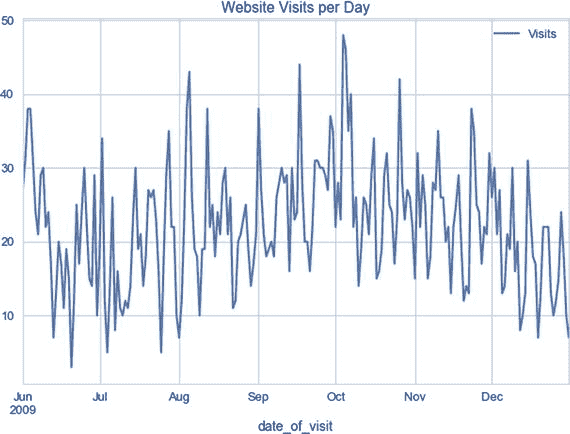

图 11-1。

Web site visits per day

### 时间序列组件

手头的时间序列是与给定网站每天的网站访问量相关的数据。如前所述，时间序列分析旨在理解导致我们所看到的序列的潜在结构和力量。现在让我们试着解构一下构成手头时间序列的各种成分。时间序列据说由以下三个主要部分组成:

*   季节性:这些是观察数据的周期性波动。例如，天气模式或销售模式。
*   趋势:这是序列随时间增加或减少的行为。例如，人口增长模式。
*   残差:这是去除季节性和趋势信号后剩余的信号。它还可以被进一步分解以去除噪声成分。

有趣的是，大多数真实世界的时间序列数据都有这些组成部分的组合。然而，大多数情况下，噪音总是明显存在，在某些情况下，趋势和季节性是可选的。在下面的代码片段中，我们利用`statsmodels`将我们的网站访问时间序列分解成它的三个组成部分，然后绘制相同的图表。

```py
In [2] : from statsmodels.tsa.seasonal import seasonal_decompose
    ...:
    ...: # extract visits as series from the dataframe
    ...: ts_visits = pd.Series(input_df.Visits.values,
    ...:                         index=pd.date_range(
    ...:                                         input_df.date_of_visit.min(),
    ...:                                         input_df.date_of_visit.max(),
    ...:                                         freq='D')
    ...:                         )
    ...:
    ...:
    ...: deompose = seasonal_decompose(ts_visits.interpolate(),
    ...:                               freq=24)
    ...: deompose.plot()  

```

我们首先创建一个`pandas` `Series`对象，特别注意设置时间序列索引的频率。值得注意的是，`statsmodels`有许多可用的时间序列建模模块，它们依赖于底层数据结构(如`pandas, numpy`等)。)来指定时间序列的频率。在这种情况下，由于数据是每日级别的，我们将`ts_visits`对象的频率设置为表示每日频率的“`D`”。然后我们简单地使用`statsmodels`中的`seasonal_decompose()`函数来获得所需的成分。分解后的系列如图 [11-2](#Fig2) 所示。

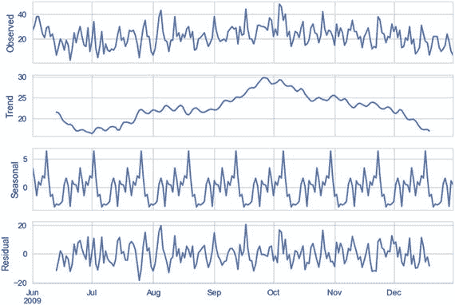

图 11-2。

Web site visit time series and its constituent signals

从图 [11-2](#Fig2) 可以明显看出，手头的时间序列既有上升趋势，也有下降趋势。到 10 月份，它呈现出逐渐上升的趋势，之后开始下降。这个系列当然有每月的周期性或季节性。剩余的信号在图 [11-2](#Fig2) 中被标记为剩余信号。

### 平滑技术

正如前面章节中所讨论的，原始数据的预处理取决于数据和用例需求。然而，每种类型的数据都有特定的标准预处理技术。与我们目前所见的数据集不同，我们认为每个观察值都独立于其他(过去或未来)观察值，时间序列与历史观察值有着内在的相关性。从网站访问系列的分解中可以看出，影响每个观察的因素有很多。时间序列数据的一个固有属性是，除了它的其他成分之外，它还具有随机变化。为了更好地理解、建模和利用预测相关任务的时间序列，我们通常执行一个预处理步骤，更好地称为平滑。平滑有助于减少随机变化的影响，并有助于清楚地揭示序列的季节性、趋势和残差成分。有多种方法可以平滑时间序列。它们大致分类如下。

#### 移动平均数

移动平均不是采用完整时间序列的平均值(我们在非时间数据的情况下这样做)来总结，而是利用滚动窗口方法。在这种情况下，我们计算过去数据的每个连续较小窗口的平均值，以消除随机变化的影响。下面是移动平均计算的一般公式。

T2】

其中，MA <sub>t</sub> 为时间段 t 的移动平均值，x <sub>t</sub> ，x <sub>t-1</sub> 等表示特定时间段的观测值，n 为窗口大小。例如，下面的代码片段计算窗口大小为 3 的访问的移动平均值。

```py
In [3] : # moving average
    ...: input_df['moving_average'] = input_df['Visits'].rolling(window=3,
    ...:                                                        center=False).mean()
    ...:
    ...: print(input_df[['Visits','moving_average']].head(10))
    ...:
    ...: plt.plot(input_df.Visits,'-',color='black',alpha=0.3)
    ...: plt.plot(input_df.moving_average,color='b')
    ...: plt.title('Website Visit and Moving Average Smoothening')
    ...: plt.legend()
    ...: plt.show()

```

使用窗口大小 3 计算的移动平均值具有以下结果。很明显，对于窗口大小为 3 的情况，前两次观察没有任何可用的移动平均值，因此有了`NaN`。

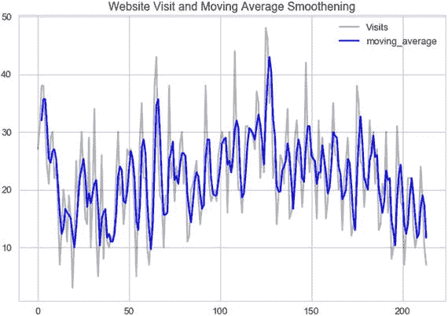

图 11-3。

Smoothening using moving average

```py
Out[3]:
   Visits  moving_average
0      27             NaN
1      31             NaN
2      38       32.000000
3      38       35.666667
4      31       35.666667
5      24       31.000000
6      21       25.333333
7      29       24.666667
8      30       26.666667
9      22       27.000000

```

图 [11-3](#Fig3) 中的曲线显示了平滑后的访问时间序列。平滑后的系列始终保持原始系列的整体结构，同时减少其中的随机变化。鼓励您探索和试验不同的窗口大小，并比较结果。

根据使用案例和手头的数据，除了不同的窗口大小之外，我们还尝试了不同的移动平均变化，如中心移动平均、双移动平均等。在本章接下来的章节中，当我们处理实际的用例时，我们将会用到其中的一些概念。

#### 指数平滑法

基于移动平均的平滑是有效的，但它是一种非常简单的预处理技术。在移动平均的情况下，窗口中所有过去的观察值被赋予相同的权重。与前面的方法不同，指数平滑技术将指数递减的权重应用于旧的观测值。简而言之，指数平滑方法与旧的观测相比，给予最近的过去的观测更多的权重。根据所需的平滑级别，在指数平滑的情况下，可能需要设置一个或多个平滑参数。

指数平滑也被称为指数加权移动平均或简称 EWMA。单指数平滑是最简单的入门方法之一。通式如下所示。

T2】

其中，E <sub>t</sub> 为第 t <sup>次</sup>平滑后的观测值，y 为 t-1 时刻的实际观测值，`α`为 0-1 之间的平滑常数。有不同的方法来自举 E <sub>2</sub> 的值(平滑开始的时间段)。这可以通过将其设置为 y <sub>1</sub> 或前 n 个时间段的平均值等等来实现。此外，α的值决定了过去占了多少。接近 1 的值会快速减弱过去的观察，而接近 0 的值会缓慢减弱。下面的代码片段使用`pandas ewm()`函数来计算访问的平滑系列。在这种情况下，参数`halflife`用于计算α。

```py
In [4] : input_df['ewma'] = input_df['Visits'].ewm(halflife=3,
    ...:                                                 ignore_na=False,
    ...:                                                 min_periods=0,
    ...:                                                 adjust=True).mean()
    ...:
    ...: plt.plot(input_df.Visits,'-',color='black',alpha=0.3)
    ...: plt.plot(input_df.ewma,color='g')
    ...: plt.title('Website Visit and Exponential Smoothening')
    ...: plt.legend()
    ...: plt.show()

```

图 [11-4](#Fig4) 中描绘的情节展示了 EWMA 平滑系列以及原始系列。

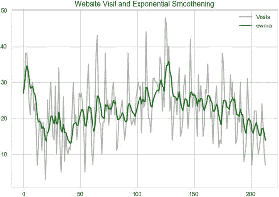

图 11-4。

Smoothening using EWMA

在接下来的章节中，我们将应用我们对时间序列、预处理技术等的理解，使用不同的预测方法来解决股票和商品价格预测问题。

## 预测黄金价格

黄金，这种黄色闪亮的金属，自古以来就是人类的最爱。从制作珠宝到用作投资，黄金涵盖了广泛的应用领域。和其他金属一样，黄金也在世界各地的商品指数上交易。为了更好地理解现实世界中的时间序列，我们将使用历史上收集的黄金价格并预测其未来价值。让我们从正式陈述问题开始。

### 问题陈述

黄金等金属已经在全球范围内交易了多年。黄金的价格是由多种因素决定的，并用于在商品交易所进行日常交易。仅使用每日价格水平信息，我们的任务是预测黄金的未来价格。

### 资料组

对于任何问题，首要的就是数据。股票和商品交易所在存储和共享每日价格数据方面做得非常好。出于本使用案例的目的，我们将利用 Quandl 的黄金定价。Quandl 是一个金融、经济和替代数据集的平台。你可以参考 jupyter 笔记本`notebook_gold_forecast_arima.ipynb`中必要的代码片段和例子。

为了访问 Quandl 上公开共享的数据集，我们可以使用`pandas-datareader`库和`quandl`(来自 Quandl 本身的库)。对于这个用例，我们将依赖于`quandl`。请使用`pip`或`conda`进行安装。下面的片段展示了一个快速的小程序，让你了解自 20 世纪 70 年代以来的黄金定价信息。

```py
In [5]: import quandl
   ...: gold_df = quandl.get("BUNDESBANK/BBK01_WT5511", end_date="2017-07-31")

```

`get()`函数将股票/商品标识符作为第一个参数，后面是我们需要数据的截止日期。请注意，并非所有数据集都是公开的，对于其中一些数据集，必须获得 API 访问权限。

### 传统方法

时间序列分析和预测已经被详细研究了很长时间。有成熟的和广泛的建模技术可用于此。在众多技术中，以下是一些最常用和探索的技术:

*   基于简单移动平均和指数平滑的预测
*   基于霍尔特-温特指数平滑的预测
*   博克斯-詹金斯方法学(AR，MA，ARIMA，S-ARIMA 等。)

Note

因果或横截面预测/建模是指目标变量与一个或多个预测变量之间的关系，例如回归模型(参见第 [6](06.html) 章)。时间序列预测是关于预测随时间变化的变量。这两种技术都归入定量技术。

如上所述，有相当多的技术可用，每一个都是深入的研究课题。在这一节和这一章的范围内，我们将集中在 ARIMA 模型(来自 Box-Jenkin 的方法)来预测黄金价格。在我们继续讨论 ARIMA 之前，让我们先来看几个关键概念。

#### 关键概念

*   平稳性:我们接下来要讨论的 ARIMA 模型背后的关键假设之一。平稳性是指一个时间序列的均值、方差和自相关不随时间变化的性质。换句话说，均值、方差和自相关不随时间变化。例如，具有上升(或下降)趋势的时间序列是非平稳性的明显标志，因为它的平均值会随时间而变化(参见上一节中的网站访问数据示例)。
*   差分:平稳化数列的方法之一。虽然可以有其他变换，但差分被广泛用于稳定时间序列的平均值。我们简单地计算连续观测值之间的差值，以获得一个差分序列。然后我们可以应用不同的测试来确认结果序列是否是平稳的。根据手头的时间序列，我们还可以进行二阶差分、季节差分等等。
*   单位根检验:帮助我们理解给定序列是否平稳的统计检验。扩充的迪基-富勒检验从一个非平稳序列的零假设开始，而科维亚特科夫斯基-菲利普斯-施密特-申检验或 KPSS 有一个平稳序列的零假设。然后，我们进行回归拟合，拒绝或未能拒绝零假设。

#### 阿里马

Box-Jenkin 的方法由广泛的统计模型组成，这些模型被广泛用于预测时间序列的建模。在这一节中，我们将集中讨论一个叫做 ARIMA 的模型。

ARIMA 代表自回归综合移动平均模型。听起来很复杂，对吧？让我们看看这个模型的基础和组成部分，然后根据我们的理解来预测黄金价格。

*   Auto Regressive or AR Modeling: A simple linear regression model where current observation is regressed upon one or more prior observations. The model is denoted as.

    

    where, X <sub>t</sub> is the observation at time t, ε<sub>t</sub> is the noise and

    

    the dependency on prior values is denoted by p or the order of AR model.
*   Moving Average or MA Modeling : Is again essentially a linear regression model that models the impact of noise/error from prior observations to current one. The model is denoted as

    

    where, μ is the series mean, ε <sub>i</sub> are the noise terms, and q is the order of the model.

在 Box-Jenkin 的方法提出之前，AR 和 MA 模型早已为人所知。然而，这种方法提供了一种系统的方法来识别和应用这些预测模型。

Note

Box，Jenkins 和 Reinsel 在他们的书《时间序列分析:预测和控制》中介绍了这种方法。鼓励你通过它进行更深入的理解。

ARIMA 模式是这两种模式的逻辑发展和结合。然而，如果我们将 AR 和 MA 与一个不同的序列结合起来，我们得到的就是所谓的 ARIMA(p，d，q)模型。

在哪里，

*   p 是自回归的阶
*   q 是移动平均线的阶数
*   d 是差分的阶数

因此，对于平稳的时间序列，ARIMA 模型结合了自回归和移动平均的概念来模拟长期运行的时间序列的行为，并有助于预测。现在让我们将这些概念应用到黄金价格预测模型中。

### 建模

在描述数据集时，我们使用`quandl`提取了黄金价格信息。我们先出图，看看这个时间序列是什么样子的。下面的代码片段使用了`pandas`来绘制相同的内容。

```py
In [6]: gold_df.plot(figsize=(15, 6))
   ...: plt.show()

```

图 [11-5](#Fig5) 中的曲线显示了总体上升趋势，在 20 世纪 80 年代突然上升，然后在 2010 年附近上升。

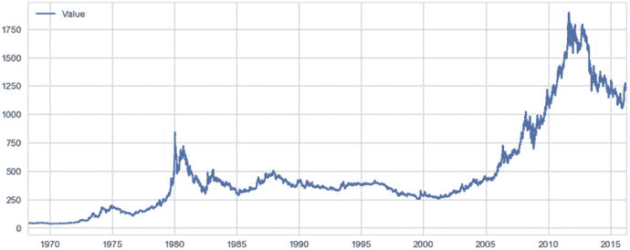

图 11-5。

Gold prices over the years

由于平稳性是 ARIMA 模型的主要假设之一，我们将利用扩展的 Dickey Fuller 测试来检查我们的序列的平稳性。以下片段帮助我们计算 AD Fuller 测试统计数据，并绘制系列的滚动特征。

```py
In [7]: # Dickey Fuller test for Stationarity
   ...: def ad_fuller_test(ts):
   ...: dftest = adfuller(ts, autolag='AIC')
   ...: dfoutput = pd.Series(dftest[0:4], index=['Test Statistic',
   ...:                                                 'p-value',
   ...:                                                 '#Lags Used',
   ...:                                                 'Number of Observations Used'])
   ...: for key,value in dftest[4].items():
   ...:         dfoutput['Critical Value (%s)'%key] = value
   ...: print(dfoutput)
   ...:
   ...: # Plot rolling stats for a time series
   ...: def plot_rolling_stats(ts):
   ...: rolling_mean = ts.rolling(window=12,center=False).mean()
   ...: rolling_std = ts.rolling(window=12,center=False).std()
   ...:
   ...: #Plot rolling statistics:
   ...: orig = plt.plot(ts, color='blue',label='Original')
   ...: mean = plt.plot(rolling_mean, color='red', label='Rolling Mean')
   ...: std = plt.plot(rolling_std, color='black', label = 'Rolling Std')
   ...: plt.legend(loc='best')
   ...: plt.title('Rolling Mean & Standard Deviation')
   ...: plt.show(block=False)

```

如果 AD Fuller 检验的统计量小于临界值，我们拒绝非平稳性的零假设。AD Fuller 测试作为`statsmodel`库的一部分提供。由于很明显，我们的原始黄金价格序列是非平稳的，我们将执行一个对数变换，看看我们是否能够获得平稳性。下面的代码片段使用滚动统计图和 AD Fuller 测试来检查这一点。

```py
In [8]: log_series = np.log(gold_df.Value)
   ...:
   ...: ad_fuller_test(log_series)
   ...: plot_rolling_stats(log_series)

```

检验统计量-1.8 大于任何一个临界值，因此我们无法拒绝零假设，即，即使在对数变换后，序列也是非平稳的。图 [11-6](#Fig6) 中描述的输出和曲线也证实了这一点。

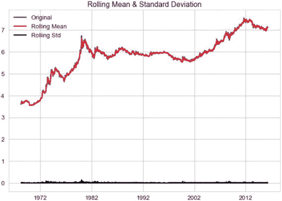

图 11-6。

Rolling mean and standard deviation plot for log transformed gold price

```py
Test Statistic                    -1.849748
p-value                            0.356057
#Lags Used                        29.000000
Number of Observations Used    17520.000000
Critical Value (1%)               -3.430723
Critical Value (5%)               -2.861705
Critical Value (10%)              -2.566858
dtype: float64

```

该图指出了序列的时变平均值，因此具有非平稳性。正如在《关键概念》中所讨论的，差分数列有助于获得平稳性。在下面的片段中，我们准备了一个一阶差分对数序列，并执行相同的测试。

```py
In [9]: log_series_shift = log_series - log_series.shift()
   ...: log_series_shift = log_series_shift[∼np.isnan(log_series_shift)]
   ...:
   ...: ad_fuller_test(log_series_shift)
   ...: plot_rolling_stats(log_series_shift)

```

在-23.91 的检验统计量甚至低于 1%的临界值，因此我们拒绝了 AD Fuller 检验的零假设。以下是测试结果。

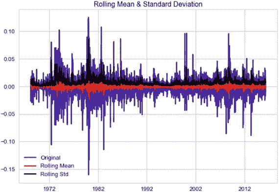

图 11-7。

Rolling mean and standard deviation plot for log differenced gold price series

```py
Test Statistic                   -23.917175
p-value                            0.000000
#Lags Used                        28.000000
Number of Observations Used    17520.000000
Critical Value (1%)               -3.430723
Critical Value (5%)               -2.861705
Critical Value (10%)              -2.566858
dtype: float64

```

这个练习告诉我们，我们需要使用 ARIMA 的对数差分序列来模拟手头的数据集。见图 [11-7](#Fig7) 。然而，我们仍然需要弄清楚自回归和移动平均分量的顺序，即 p 和 q。

与其他模型相比，构建 ARIMA 模型需要一些经验和直觉。确定模型的 p、d 和 q 参数可以用不同的方法来完成，尽管得出正确的一组数字取决于需求和经验。

一种常用的方法是绘制 ACF 和 PACF 图来确定 p 和 q 值。ACF 或自相关函数图和 PACF 或部分自相关函数图有助于我们缩小确定 p 和 q 值的搜索空间，但有一些注意事项。多年来开发了某些规则或试探法来最好地利用这些图，因此这些不能保证最好的可能值。

ACF 图有助于我们理解观察值与其滞后(或先前值)的相关性。ACF 图用于确定 MA 阶数，即 q。ACF 下降的值是 MA 模型的阶数。

同样，PACF 指出了观测值和特定滞后值之间的相关性，排除了其他滞后的影响。PACF 下降的值指向 AR 模型的阶或 ARIMA 中的 p(p，d，q)。

Note

有关 ACF 和 PACF 的更多详情，请访问 [`http://www.itl.nist.gov/div898/handbook/eda/section3/autocopl.htm`](http://www.itl.nist.gov/div898/handbook/eda/section3/autocopl.htm) 。

让我们再次利用`statsmodels`为我们的系列生成 ACF 和 PACF 图，并尝试确定 p 和 q 值。以下代码片段使用对数差分序列来生成所需的绘图。

```py
In [10]: fig = plt.figure(figsize=(12,8))
    ...: ax1 = fig.add_subplot(211)
    ...: fig = sm.graphics.tsa.plot_acf(log_series_shift.squeeze(), lags=40, ax=ax1)
    ...: ax2 = fig.add_subplot(212)
    ...: fig = sm.graphics.tsa.plot_pacf(log_series_shift, lags=40, ax=ax2)

```

输出图(图 [11-8](#Fig8) )显示了 ACF 和 PACF 在滞后 1 时的突然下降，从而指出 q 和 p 的可能值分别为 1。

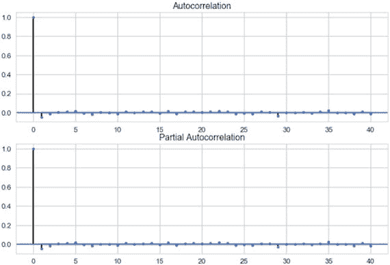

图 11-8。

ACF and PACF plots

ACF 和 PACF 图也帮助我们理解一个序列是否是平稳的。如果一个序列的 ACF 和 PACF 值逐渐减小，则表明该序列具有非平稳性。

Note

确定任何 ARIMA 模型的 p、d 和 q 值既是科学也是艺术。更多细节请访问 [`https://people.duke.edu/~rnau/411arim.htm`](https://people.duke.edu/%7Ernau/411arim.htm) 。

推导 p、d、q 参数的另一种方法是对参数空间进行网格搜索。这更符合超参数调优的机器学习方式。虽然 statsmodels 没有提供这样的实用程序(因为显而易见的原因)，但是我们可以编写自己的实用程序来识别最适合的模型。此外，就像任何其他机器学习/数据科学用例一样，我们需要将数据集分成训练集和测试集。我们利用`scikit-learn`的`TimeSeriesSplit`实用程序来帮助我们获得适当的训练和测试集。

我们编写一个效用函数`arima_grid_search_cv()`来进行网格搜索，并使用手头的黄金价格交叉验证结果。该功能在`arima_utils.py`模块中提供，以供参考。下面的代码片段使用自动 ARIMA 执行五重交叉验证，以找到最适合的模型。

```py
In [11]: results_dict = arima_gridsearch_cv(gold_df.log_series,cv_splits=5)

```

注意，我们将经过对数变换的序列作为输入传递给`arima_gridsearch_cv()`函数。正如我们之前看到的，对数差分序列帮助我们实现平稳性，因此我们使用对数变换作为我们的起点，并拟合一个 d 设置为 1 的 ARIMA 模型。该函数调用为每个训练测试分割生成详细的输出(我们有五个排列好的分割)，每次迭代在 p、d 和 q 上执行网格搜索。图 [11-9](#Fig9) 显示了第一次迭代的输出，其中训练集仅包括 2924 个观察值。


图 11-9。

Auto ARIMA

类似于我们使用 ACF-PACF 的发现，ARIMA 汽车公司建议，基于 AIC 标准，最佳拟合模型是 ARIMA(1，1，1)。请注意，AIC 或阿凯克信息标准衡量的是拟合优度和简约度。这是一个相对的衡量标准，并不代表绝对意义上的模型质量，也就是说，如果所有被比较的模型都很差，AIC 将无法指出这一点。因此，AIC 应该作为一个启发。低值表示模型更适合。以下是 ARIMA(1，1，1)拟合生成的汇总，见图 [11-10](#Fig10) 。

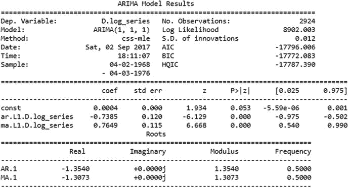

图 11-10。

Summary of ARIMA(1,1,1)

总结是不言自明的。顶部显示了有关训练样本、AIC 和其他指标的详细信息。中间部分讨论拟合模式的系数。在迭代 1 的 ARIMA(1，1，1)的情况下，AR 和 MA 系数在统计上是显著的。拟合 ARIMA(1，1，1)的迭代 1 的预测图如图 [11-11](#Fig11) 所示。


图 11-11。

The forecast plot for ARIMA(1,1,1)

从图 [11-11](#Fig11) 中的曲线可以明显看出，该模型捕捉到了整体上升趋势，尽管它没有捕捉到 1980 年前后的价值突然跃升。然而，它似乎给出了一个很好的想法，使用这种方法可以实现什么。`arima_gridsearch_cv()`函数为五个不同的列车测试分段生成相似的统计数据和图表。我们观察到 ARIMA(1，1，1)为我们提供了足够好的拟合，尽管我们可以定义额外的性能和误差标准来选择特定的模型。

在这种情况下，我们为已经有数据的时间段生成预测。这有助于我们可视化和理解模型是如何执行的。这也被称为回溯测试。通过`forecast()`方法，`statsmodels`也支持样本外预测。此外，图 [11-11](#Fig11) 中的曲线显示了转换后的标度值，即对数标度。逆变换可以很容易地应用于获得原始形式的数据。

你还应该注意到，大宗商品价格受到许多其他因素的影响，比如全球需求、经济衰退等经济状况。因此，在某种程度上，我们在这里展示的是一个复杂过程的简单模型。我们需要更多的特征和属性来进行复杂的预测。

## 股票价格预测

股票和金融工具交易是一个有利可图的命题。世界各地的股票市场促进了这种交易，从而促进了财富的交换。股票价格总是上下波动，有能力预测它的运动有巨大的潜力让一个人变得富有。

股票价格预测长期以来一直吸引着人们的兴趣。有一些假说，比如有效市场假说，认为持续战胜市场几乎是不可能的，还有一些人不同意这种观点。

有许多已知的方法和新的研究正在进行，以找到让你变得富有的神奇公式。传统方法之一是时间序列预测，我们在上一节中已经看到了。基本面分析是另一种方法，通过分析许多业绩比率来评估给定的股票。在新兴的前沿，有神经网络、遗传算法和集成技术。

注股票价格预测(以及上一节中的黄金价格预测)试图解释概念和技术，以模拟真实世界的数据和用例。这一章决不是算法交易的详尽指南。算法交易本身是一个完整的研究领域，你可以进一步探索。仅仅这一章的知识不足以进行任何种类的交易，也超出了本书的范围和意图。

在本节中，我们将学习如何将递归神经网络(RNNs)应用于股票价格预测问题，并了解其中的复杂性。

### 问题陈述

股票价格预测是预测给定股票未来价值的任务。给定标准普尔 500 指数的历史每日收盘价，准备并比较预测解决方案。

标准普尔 500 或标准普尔 500 指数是由美国经济不同部门的 500 只股票组成的指数，是美国股票的指标。其他类似的指数有道琼斯 30 指数、NIFTY 50 指数、日经 225 指数等。出于理解的目的，我们利用 S&P500 指数，概念和知识也可以应用于其他股票。

### 资料组

与黄金价格数据集类似，历史股票价格信息也是公开的。对于我们当前的用例，我们将使用雅虎财经数据库，利用`pandas_datareader`库来获取所需的标准普尔 500 指数历史。我们将利用数据集中的收盘价信息，但也可以利用其他信息，如开盘价、调整后的收盘价等。，也是可用的。

我们准备一个实用函数`get_raw_data()`来提取`pandas`数据帧中所需的信息。该函数将索引股票名称作为输入。标准普尔 500 指数的代号是^GSPC.下面的代码片段使用 utility 函数来获取所需的数据。

```py
In [1]: sp_df = get_raw_data('^GSPC')
   ...: sp_close_series = sp_df.Close
   ...: sp_close_series.plot()

```

收盘价的曲线如图 [11-12](#Fig12) 所示。

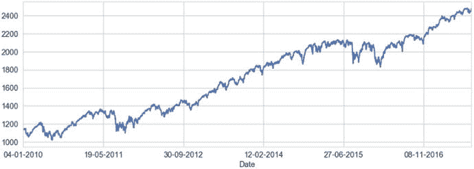

图 11-12。

The S&P 500 index

图 [11-12](#Fig12) 中的曲线显示，我们有从 2010 年到最近的收盘价信息。

请注意，同样的信息也可以通过`quandl`(我们在上一节中使用它来获取黄金价格信息)获得。您也可以使用相同的方法来获取这些数据。

### 递归神经网络:LSTM

人工神经网络正被用于解决各种领域中的许多用例。递归神经网络是一类具有模拟序列数据能力的神经网络。LSTMs 或长短期记忆是一种 RNN 架构，可用于对任意间隔的信息进行建模。第 [1](01.html) 章讨论了 rnn，尤其是 LSTMs，而第 [7](07.html) 章探讨了一个实际用例，用于分析来自电影评论的文本数据以进行情感分析。

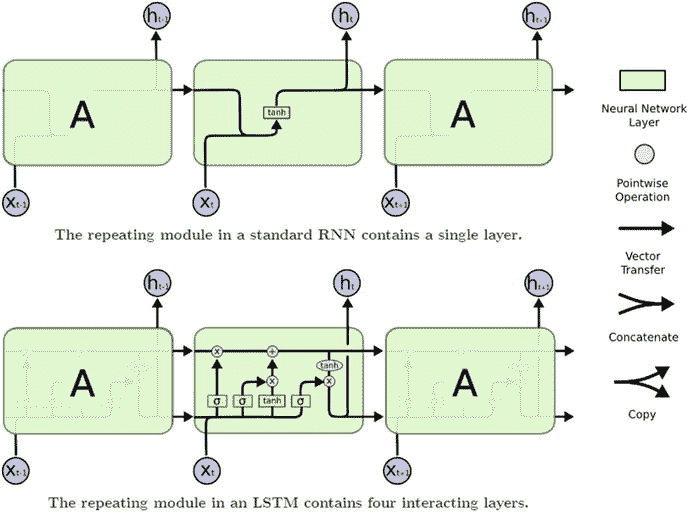

图 11-13。

Basic structure of RNN and LSTM units. (Source: Christopher Olah’s blog: colah.github.io)

作为快速复习，图 [11-13](#Fig13) 指出了 RNN 的总体架构以及典型 LSTM 装置的内部结构。LSTM 由三个主要的门组成——输入门、输出门和遗忘门。这些门协同工作来学习和存储长期和短期序列相关信息。有关更多详细信息，请参考高级监督深度学习模型，第 [7](07.html) 章。

对于股票价格预测，我们将利用 LSTM 单位来实现 RNN 模型。rnn 通常在序列建模应用中是有用的；其中一些如下:

*   序列分类任务，如给定语料库的情感分析(详细用例见第 [7](07.html) 章)
*   序列标记任务，如给一个给定的句子进行词性标记
*   语音识别等序列映射任务

传统的预测方法(如 ARIMA)需要对时间序列信息进行预处理，以符合平稳性和其他假设以及参数识别(例如 p，d，q)，与此不同，神经网络(特别是 RNNs)施加的限制要少得多。

由于股票价格信息也是一个时间序列数据，我们将探索 LSTMs 在这个用例中的应用并生成预测。有许多方法可以模拟这个问题来预测值。以下部分涵盖了两种这样的方法。

#### 回归建模

我们在第 [6](06.html) 章中介绍了回归建模，根据某些预测变量来分析自行车需求。本质上，回归建模是指调查因变量和自变量之间关系的过程。

为了将我们当前的用例建模为回归问题，我们声明时间戳 t+1(因变量)的股票价格是时间戳 t、t -1、t -2、…、t -n 的股票价格的函数，其中 n 是股票价格的过去窗口。

既然我们已经有了一个关于如何建模时间序列的框架，我们需要将时间序列数据转换成窗口形式。参见图 [11-14](#Fig14) 。


图 11-14。

Transformation of stock price time series into windowed format

窗口变换如图 [11-15](#Fig15) 所示，其中窗口大小为 4。使用过去的四个值来预测时间 t+1 的值。我们有 2010 年以来标准普尔 500 指数的数据，因此我们将以滚动方式应用这种窗口变换，并创建多个这样的序列。因此，如果我们有一个长度为 M 的时间序列和一个大小为 n 的窗口，那么总共会产生 M-n-1 个窗口。

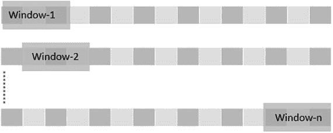

图 11-15。

Rolling/sliding windows from original time series

对于本节中的实践示例，您可以参考 jupyter 笔记本`notebook_stock_prediction_regression_modeling_lstm.ipynb`中必要的代码片段和示例。为了使用 LSTMs 来建模我们的时间序列，我们需要再应用一个级别的转换来输入我们的数据。LSTMs 接受 3D 张量作为输入，我们以(N，W，F)格式变换每个窗口(或序列)。这里，N 是原始时间序列的样本数或窗口数，W 是每个窗口的大小或历史时间步长数，F 是每个时间步长的特征数。在我们的例子中，由于我们只使用收盘价，F 等于 1，N 和 W 是可配置的。以下函数使用`pandas`和`numpy`执行窗口和 3D 张量变换。

```py
def get_reg_train_test(timeseries,sequence_length= 51,
                   train_size=0.9,roll_mean_window=5,
                   normalize=True,scale=False):
    # smoothen out series
    if roll_mean_window:
        timeseries = timeseries.rolling(roll_mean_window).mean().dropna()

    # create windows
    result = []
    for index in range(len(timeseries) - sequence_length):
        result.append(timeseries[index: index + sequence_length])

    # normalize data as a variation of 0th index
    if normalize:
        normalised_data = []
        for window in result:
            normalised_window = [((float(p) / float(window[0])) - 1) \
                                   for p in window]
            normalised_data.append(normalised_window)
        result = normalised_data

    # identify train-test splits
    result = np.array(result)
    row = round(train_size * result.shape[0])

    # split train and test sets
    train = result[:int(row), :]
    test = result[int(row):, :]

    # scale data in 0-1 range
    scaler = None
    if scale:
        scaler=MinMaxScaler(feature_range=(0, 1))
        train = scaler.fit_transform(train)
        test = scaler.transform(test)

    # split independent and dependent variables  
    x_train = train[:, :-1]
    y_train = train[:, -1]

    x_test = test[:, :-1]
    y_test = test[:, -1]

    # Transforms for LSTM input
    x_train = np.reshape(x_train, (x_train.shape[0],
                                   x_train.shape[1],
                                   1))
    x_test = np.reshape(x_test, (x_test.shape[0],
                                 x_test.shape[1],
                                 1))

    return x_train,y_train,x_test,y_test,scaler

```

函数`get_reg_train_test()`还执行许多其他可选的预处理步骤。它允许我们在应用窗口之前使用滚动平均来平滑时间序列。我们还可以标准化数据，并根据需求进行扩展。神经网络对输入值很敏感，通常建议在训练网络之前缩放输入。对于这个用例，我们将利用时间序列的归一化，其中，对于每个窗口，每个时间步长都是该窗口中第一个值的百分比变化(我们也可以使用缩放或两者并用，并重复该过程)。

对于我们的例子，我们从六天的窗口大小开始(您可以试验更小或更大的窗口并观察差异)。下面的代码片段使用了规范化设置为 true 的`get_reg_train_test()`函数。

```py
In [2] : WINDOW = 6
    ...: PRED_LENGTH = int(window/2)
    ...: x_train,y_train,x_test,y_test,scaler = get_reg_train_test(sp_close_series,
    ...:                                                         sequence_length=WINDOW +1,
    ...:                                                         roll_mean_window=None,
    ...:                                                         normalize=True,
    ...:                                                         scale=False)

```

这个代码片段创建了一个七天的窗口，由六天的历史数据(`x_train`)和一天的预测`y_train`组成。训练和测试变量的形状如下。

```py
In [3] : print("x_train shape={}".format(x_train.shape))
    ...: print("y_train shape={}".format(y_train.shape))
    ...: print("x_test shape={}".format(x_test.shape))
    ...: print("y_test shape={}".format(y_test.shape))
x_train shape=(2516, 6, 1)
y_train shape=(2516,)
x_test shape=(280, 6, 1)
y_test shape=(280,)

```

`x_train`和`x_test`张量符合我们之前讨论的(N，W，F)格式，并且是我们的 RNN 的输入所必需的。我们的训练集中有 2516 个序列，每个序列有六个时间步长和一个预测值。类似地，我们的测试集中有 280 个序列。

现在我们已经预处理好了数据集，我们使用`keras`建立了一个 RNN 网络。`keras`框架为我们在`theano`和`tensorflow`后端使用神经网络提供了高级抽象。下面的代码片段展示了使用`get_reg_model()`函数准备的模型。

```py
In [4]: lstm_model = get_reg_model(layer_units=[50,100],
   ...:                         window_size=window)

```

生成的 LSTM 模型架构有两个相互堆叠的隐藏`LSTM`层，第一层有 50 个 LSTM 单元，第二层有 100 个。输出层是一个具有线性激活函数的`Dense`层。我们使用均方误差作为我们的损失函数来优化。由于我们正在堆叠 LSTM 层，我们需要设置`return_sequences`为真，以便后续层获得所需的值。显然，`keras`抽象了大部分繁重的工作，使得用几行代码构建复杂的架构变得非常直观。

下一步是训练我们的 LSTM 网络。我们使用 16 的批量，20 个时期和 5%的验证集。下面的代码片段使用了`fit()`函数来训练模型。

```py
In [5]: # use early stopping to avoid overfitting
   ...: callbacks = [keras.callbacks.EarlyStopping(monitor='val_loss',
   ...:                                                 patience=2,
   ...:                                                 verbose=0)]
   ...: lstm_model.fit(x_train, y_train,
   ...:                 epochs=20, batch_size=16,
   ...:                 verbose=1,validation_split=0.05,
   ...:                 callbacks=callbacks)

```

该模型为其运行的每个时期生成关于训练和验证损失的信息。如果连续两个时期没有观察到进一步的改善，停止回调使我们能够停止训练。我们从 16 个批量开始；您可以尝试更大的批量并观察差异。

一旦模型合适，下一步就是使用`predict()`函数进行预测。由于我们将此建模为具有固定窗口大小的回归问题，因此我们将为每个序列生成预测。为此，我们编写了另一个名为`predict_reg_multiple()`的实用函数。该函数将 lstm 模型、窗口数据集、窗口和预测长度作为输入参数，以返回每个输入窗口的预测列表。`predict_reg_multiple()`功能的工作方式如下。

1.  对于窗口序列列表中的每个序列，重复步骤 a-c:
    1.  使用 keras 的`predict()`函数生成一个输出值。
    2.  将此输出值附加到输入序列的末尾，并删除第一个值以保持窗口大小。
    3.  然后重复这个过程(步骤 a 和 b ),直到达到所需的预测长度。 
2.  该函数利用预测值来预测后续值。

该功能在脚本`lstm_utils.py`中可用。下面的代码片段使用了`predict_reg_multiple()`函数来获得对测试集的预测。

```py
In [6] : test_pred_seqs = predict_reg_multiple(lstm_model,
    ...:                                         x_test,
    ...:                                         window_size=WINDOW,
    ...:                                         prediction_len=PRED_LENGTH)

```

为了分析性能，我们将计算拟合序列的 RMSE。我们同样使用`sklearn`的`metrics`模块。下面的代码片段计算了 RMSE 分数。

```py
In [7] : test_rmse = math.sqrt(mean_squared_error(y_test[1:],
    ...:                                                 np.array(test_pred_seqs).\
    ...:                                                 flatten()))
    ...: print('Test Score: %.2f RMSE' % (test_rmse))
Test Score: 0.01 RMSE

```

输出是 0.01 的 RMSE。作为练习，您可以比较不同窗口大小和预测长度的 RMSE，并观察整体模型性能。

为了可视化我们的预测，我们根据标准化的测试数据绘制预测图。我们用的是`plot_reg_results()`这个函数，在`lstm_utils.py`中也有参考。以下代码片段使用相同的函数生成所需的绘图。

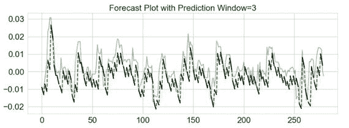

图 11-16。

Forecast Plot with LSTM, window size 6 and prediction length 3

```py
In [8]: plot_reg_results(test_pred_seqs,y_test,prediction_len=PRED_LENGTH)

```

在图 [11-16](#Fig16) 中，灰线是原始/真实测试数据(标准化)，黑线表示三天期间的预测/预报值。虚线用于解释预测系列的总体流程。显然，预测在某种程度上偏离了实际数据趋势，但它们似乎与实际数据有一些相似之处。

在我们结束本节之前，有几个要点需要记住。LSTMs 是非常强大的单元，具有存储和使用过去信息的存储器。在我们当前的场景中，我们利用了一种具有堆叠 LSTM 架构的窗口方法(在我们的模型中有两个 LSTM 层)。这也称为多对一架构，其中多个输入值用于生成单个输出。这里的另一个要点是窗口大小以及网络的其他超参数(如时期、批量大小、LSTM 单位等)。)对最终结果有影响(这个留做练习让你自己去探索)。因此，在生产中部署这样的模型之前，我们应该小心。

#### 序列建模

在上一节中，我们将时间序列建模为一个回归用例。本质上，问题公式虽然利用了过去的窗口进行预测，但它没有使用时间步长信息。在这一节中，我们将通过将 LSTMs 建模为一个序列来解决相同的股票预测问题。对于本节中的实践示例，您可以参考 jupyter 笔记本`notebook_stock_prediction_sequence_modeling_lstm.ipynb`中必要的代码片段和示例。

递归神经网络自然适用于序列建模任务，如机器翻译、语音识别等。rnn 利用记忆(不同于普通的前馈神经网络)来跟踪上下文，并利用它来产生输出。一般来说，前馈神经网络假设输入是相互独立的。这种独立性在很多情况下可能不成立(比如时序数据)。rnn 对序列的每个元素应用相同的变换，结果取决于先前的值。

对于我们的股票价格时间序列，我们现在想把它建模为一个序列，其中每个时间步的值是以前值的函数。与类似回归的建模不同，这里我们不将时间序列划分为固定大小的窗口，而是利用 LSTMs 从数据中学习并确定利用哪些过去的值进行预测。

为此，我们需要对上一个案例中处理数据的方式以及构建 RNN 的方式进行一些调整。在上一节中，我们使用(N，W，F)格式作为输入。在当前设置中，格式保持不变，但有以下变化。

*   n(序列数):这将被设置为 1，因为我们只处理一只股票的价格信息。
*   w(序列长度):这将被设置为我们拥有的价格信息的总天数。这里我们将整个系列作为一个大序列。
*   f(每个时间戳的特征):这又是 1，因为我们只处理每个时间戳的收盘价。

谈到输出，在上一节中，我们考虑到每个窗口/序列都有一个输出。在将我们的数据建模为序列/时间序列时，我们希望我们的输出也是序列。因此，输出也是 3D 张量，遵循与输入张量相同的格式。

我们编写一个小的效用函数`get_seq_train_test()`来帮助我们从时间序列中扩展和生成训练和测试数据集。在这种情况下，我们使用 70-30 分割。然后，我们使用`numpy`将我们的时间序列重塑为 3D 张量。下面的代码片段利用了`get_seq_train_test()`函数来做同样的事情。

```py
In [1]: train,test,scaler = get_seq_train_test(sp_close_series,
   ...:                                         scaling=True,
   ...:                                         train_size=TRAIN_PERCENT)
   ...:
   ...: train = np.reshape(train,(1,train.shape[0],1))
   ...: test = np.reshape(test,(1,test.shape[0],1))
   ...:
   ...: train_x = train[:,:-1,:]
   ...: train_y = train[:,1:,:]
   ...:
   ...: test_x = test[:,:-1,:]
   ...: test_y = test[:,1:,:]
   ...:
   ...: print("Data Split Complete")
   ...:
   ...: print("train_x shape={}".format(train_x.shape))
   ...: print("train_y shape={}".format(train_y.shape))
   ...: print("test_x shape={}".format(test_x.shape))
   ...: print("test_y shape={}".format(test_y.shape))
Data Split Complete
train_x shape=(1, 1964, 1)
train_y shape=(1, 1964, 1)
test_x shape=(1, 842, 1)
test_y shape=(1, 842, 1)

```

准备好数据集后，我们现在开始设置 RNN 网络。因为我们计划生成一个序列作为输出，而不是前一种情况下的单个输出，所以我们需要调整我们的网络架构。

这种情况下的要求是对每个时间步长应用类似的转换/处理，并能够获得每个输入时间戳的输出，而不是等待整个序列被处理。为了支持这样的场景，`keras`提供了一个称为`TimeDistributed`的密集层包装器。这个包装器将相同的任务应用于每个时间步长，并提供钩子以在每个这样的时间步长之后获得输出。我们使用`Dense`层上的`TimeDistributed`包装器从每个被处理的时间步骤中获取输出。下面的代码片段展示了生成所需模型的`get_seq_model()`函数。

```py
def get_seq_model(hidden_units=4,input_shape=(1,1),verbose=False):
    # create and fit the LSTM network
    model = Sequential()

    # input shape = timesteps*features
    model.add(LSTM(input_shape=input_shape,
                   units = hidden_units,
                   return_sequences=True
    ))

    # TimeDistributedDense uses the processing for all time steps.
    model.add(TimeDistributed(Dense(1)))
    start = time.time()

    model.compile(loss="mse", optimizer="rmsprop")

    if verbose:
        print("> Compilation Time : ", time.time() - start)
        print(model.summary())

    return model

```

该函数返回具有四个`LSTM`单元和一个`TimeDistributed Dense`输出层的单个隐藏层 RNN 网络。我们再次使用均方误差作为损失函数。

Note

`TimeDistributed`是一个强大而复杂的工具，可以通过`keras`获得。你可以在 [`https://github.com/fchollet/keras/issues/1029`](https://github.com/fchollet/keras/issues/1029) 和 [`https://datascience.stackexchange.com/questions/10836/the-difference-between-dense-and-timedistributeddense-of-keras`](https://datascience.stackexchange.com/questions/10836/the-difference-between-dense-and-timedistributeddense-of-keras) 了解更多。

我们对数据集进行了预处理，并使用函数`get_seq_model()`将其分成训练和测试以及模型对象。下一步是使用`fit()`函数简单地训练模型。在将股票价格信息建模为一个序列时，我们假设整个时间序列是一个大序列。因此，在训练模型时，我们将批量大小设置为 1，因为在这种情况下只有一种股票需要训练。下面的代码片段获取模型对象，然后使用`fit()`函数对其进行训练。

```py
In [2]: # get the model
   ...: seq_lstm_model = get_seq_model(input_shape=(train_x.shape[1],1),
   ...:                                 verbose=VERBOSE)
   ...:
   ...: # train the model
   ...: seq_lstm_model.fit(train_x, train_y,
   ...:                         epochs=150, batch_size=1,
   ...:                         verbose=2)

```

这个代码片段返回一个模型对象及其摘要。我们还可以看到模型根据训练数据进行训练时，150 个时期中每个时期的输出。

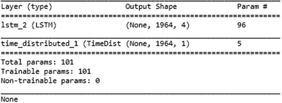

图 11-17。

RNN Summary

图 [11-17](#Fig17) 显示了 RNN 试图学习的全部参数，总共 101 个。我们强烈建议您研究上一节中准备的模型摘要，结果应该最令人惊讶(提示:该模型需要学习的参数非常少！).这个总结也指出了一个重要的事实，第一 LSTM 层的形状。这清楚地表明，模型期望输入符合这种形状(训练数据集的形状),以便进行训练和预测。

由于我们的测试数据集更小`(shape: (1,842,1)`，我们需要一些方法来匹配所需的形状。当用 RNNs 对序列建模时，为了匹配给定的形状，填充序列是一种常见的做法。通常在有多个序列要训练的情况下(例如，文本生成)，使用最长序列的大小，并填充较短的序列以匹配它。我们这样做只是出于编程的原因，否则会丢弃填充的值(更多信息见`keras`屏蔽)。填充实用程序可从`keras.preprocessing.sequence`模块获得。以下代码片段在实际数据后用 0 填充测试数据集(您可以在填充前和填充后之间选择)，然后使用填充序列进行预测。我们还计算并打印预测的 RMSE 分数。

```py
In [3]: # Pad input sequence
   ...: testPredict = pad_sequences(test_x,
   ...:                                 maxlen=train_x.shape[1],
   ...:                                 padding='post',
   ...:                                 dtype='float64')
   ...:
   ...: # forecast values
   ...: testPredict = seq_lstm_model.predict(testPredict)
   ...:
   ...: # evaluate performance
   ...: testScore = math.sqrt(mean_squared_error(test_y[0],
   ...:                         testPredict[0][:test_x.shape[1]]))
   ...: print('Test Score: %.2f RMSE' % (testScore))
Test Score: 0.07 RMSE

```

我们也可以在训练集上执行相同的步骤，并检查性能。在生成训练和测试数据集时，函数`get_seq_train_test()`也返回了 scaler 对象。接下来，我们使用这个 scaler 对象来执行逆变换，以获得原始比例的预测值。以下代码片段执行逆变换，然后绘制序列。

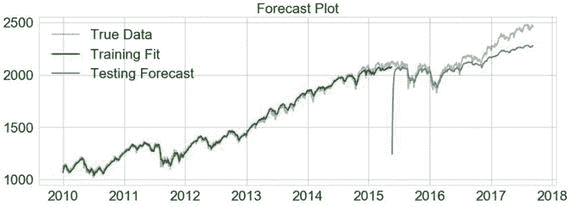

图 11-18。

Forecast for S&P 500 using LSTM based sequence modeling

```py
In [4]: # inverse transformation
   ...: trainPredict = scaler.inverse_transform(trainPredict.\
   ...:                                         reshape(trainPredict.shape[1]))
   ...: testPredict = scaler.inverse_transform(testPredict.\
   ...:                                         reshape(testPredict.shape[1]))
   ...:
   ...: train_size = len(trainPredict)+1
   ...:
   ...: # plot the true and forecasted values
   ...: plt.plot(sp_close_series.index,
   ...:                 sp_close_series.values,c='black',
   ...:                 alpha=0.3,label='True Data')
   ...:
   ...: plt.plot(sp_close_series.index[1:train_size],
   ...:                 trainPredict,
   ...:                 label='Training Fit',c='g')
   ...:
   ...: plt.plot(sp_close_series.index[train_size+1:],
   ...:                 testPredict[:test_x.shape[1]],
   ...:                 label='Forecast')
   ...: plt.title('Forecast Plot')
   ...: plt.legend()
   ...: plt.show()

```

图 [11-18](#Fig18) 中的预测图显示了一幅充满希望的画面。我们可以看到，训练配合近乎完美，这是意料之中的。测试性能或预测也显示了不错的性能。尽管预测与实际有所偏差，但从 RMSE 和飞度来看，整体表现似乎还是不错的。

通过使用`TimeDistributed`层包装器，我们实现了将这些数据建模为时间序列的目标。该模型不仅在整体拟合方面具有更好的性能，而且需要更少的特征工程和更简单的模型(就训练参数的数量而言)。在该模型中，我们还真正利用了 LSTMs 的能力，允许它学习并计算出过去的信息对预测的影响程度(与我们限制窗口大小的回归建模案例相比)。

在我们结束本节之前，有两个要点。首先，这两种模式各有利弊。这一部分的目的是指出给定问题建模的潜在方法。实际的使用主要取决于用例的需求。其次，也是更重要的一点，这两种模型都是为了学习/演示。实际的股票价格预测需要更多的严谨和知识；我们只是触及了冰山一角。

### 即将到来的技术:先知

数据科学领域一直在不断发展，新的算法、调整和工具正在快速涌现。一个这样的工具叫做先知。这是一个框架，由脸书的数据科学团队开源，用于分析和预测时间序列。

Prophet 使用一个附加模型，可以处理趋势和季节数据。该工具的目的是实现大规模预测。这仍处于测试阶段，但有一些真正有用的功能。更多信息请访问 [`https://facebookincubator.github.io/prophet/`](https://facebookincubator.github.io/prophet/) 。这个工具背后的研究和直觉可以在 [`https://facebookincubator.github.io/prophet/static/prophet_paper_20170113.pdf`](https://facebookincubator.github.io/prophet/static/prophet_paper_20170113.pdf) 找到。

网站上列出了安装步骤，通过`pip`和`conda`可以很容易地完成。Prophet 还使用了`fit()`和`predict()`的`scikit`风格的 API 和额外的工具来更好地处理时间序列数据。对于本节中的实践示例，您可以参考 jupyter 笔记本`notebook_stock_prediction_fbprophet.ipynb`中必要的代码片段和示例。

Note

Prophet 仍处于测试阶段，正在经历变化。此外，它在 Windows 平台上的安装也会导致问题。请使用 Anaconda 发行版的`conda install`(网站上提到的步骤)来避免问题。

因为我们已经有了数据框架/系列中的标准普尔 500 指数价格信息。我们现在测试如何使用这个工具进行预测。我们首先将时间序列索引转换成它自己的一列(简单地说就是 prophet 如何预测数据)，然后将序列拆分成训练和测试(90-10 拆分)。以下代码片段执行所需的操作。

```py
In [1] : # reset index to get date_time as a column
    ...: prophet_df = sp_df.reset_index()
    ...:
    ...: # prepare the required dataframe
    ...: prophet_df.rename(columns={'index':'ds','Close':'y'},inplace=True)
    ...: prophet_df = prophet_df[['ds','y']]
    ...:
    ...: # prepare train and test sets
    ...: train_size = int(prophet_df.shape[0]*0.9)
    ...: train_df = prophet_df.ix[:train_size]
    ...: test_df = prophet_df.ix[train_size+1:]

```

准备好数据集后，我们创建一个`Prophet`类的对象，并使用`fit()`函数简单地拟合模型。请注意，模型期望时间序列值位于名为“`y`”的列中，时间戳位于名为“`ds`”的列中。为了进行预测，prophet 需要我们需要预测的一组日期。为此，它提供了一个名为`make_future_dataframe()`的简单实用程序，该程序将预测所需的天数作为输入。以下代码片段使用此数据框架来预测值。

```py
In [2] : # prepare a future dataframe
    ...: test_dates = pro_model.make_future_dataframe(periods=test_df.shape[0])
    ...:
    ...: # forecast values
    ...: forecast_df = pro_model.predict(test_dates)

```

`predict()`函数的输出是一个数据帧，包括样本内预测和预测值。数据帧还包括置信区间值。所有这些都可以使用模型对象的`plot()`函数很容易地绘制出来。以下代码片段绘制了原始时间序列的预测值及其置信区间。

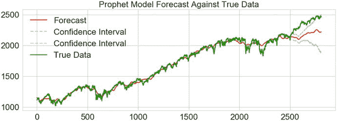

图 11-19。

Forecasts from prophet against true/observed values

```py
In [3] : # plot against true data
    ...: plt.plot(forecast_df.yhat,c='r',label='Forecast')
    ...: plt.plot(forecast_df.yhat_lower.iloc[train_size+1:],
    ...:                 linestyle='--',c='b',alpha=0.3,
    ...:                 label='Confidence Interval')
    ...: plt.plot(forecast_df.yhat_upper.iloc[train_size+1:],
    ...:                 linestyle='--',c='b',alpha=0.3,
    ...:                 label='Confidence Interval')
    ...: plt.plot(prophet_df.y,c='g',label='True Data')
    ...: plt.legend()
    ...: plt.title('Prophet Model Forecast Against True Data')
    ...: plt.show()

```

该模型的预测有点偏离目标(见图 [11-19](#Fig19) ，但是这个练习清楚地展示了这里的可能性。预测数据框架提供了更多关于季节性、每周趋势等的详细信息。我们鼓励您进一步探索这一点。`Prophet`基于斯坦。Stan 是统计建模语言/框架，为所有主要语言提供通过接口公开的算法，包括`python`。你可以在 [`http://mc-stan.org/`](http://mc-stan.org/) 探索更多。

## 摘要

本章介绍了使用股票和商品价格信息进行时间序列预测和分析的概念。通过这一章，我们介绍了时间序列的基本组成部分以及预处理这类数据的常用技术。然后，我们处理黄金价格预测用例。这个用例利用`quandl`库获取每日黄金价格信息。然后，我们讨论了传统的时间序列分析技术，并介绍了与 Box-Jenkin 的方法，特别是 ARIMA 相关的关键概念。我们还讨论了使用 AD Fuller 检验、ACF 和 PACF 图来识别非平稳时间序列并将其转换为平稳时间序列的技术。我们使用基于 statsmodel APIs 的 ARIMA 对黄金价格信息建模，同时开发了一些关键的实用函数，如`auto_arima()`和`arima_gridsearch_cv()`。还讨论了关键见解和告诫。本章的下一节介绍了股票价格预测用例。这里，我们利用`pandas_datareader`获得标准普尔&500 每日收盘价信息。

为了解决这个用例，我们利用了基于 RNN 的模型。首先，我们提供了两种表述预测问题的观点，两种观点都使用 LSTMs。第一个公式严格模仿了前面几章中讨论的回归概念。一个两层堆叠的 LSTM 网络被用来预测股票价格信息。第二个视角利用来自`keras`的`TimeDistributed`层包装器来实现股票价格信息的序列建模。在处理用例时，讨论了各种实用程序和关键概念。最后，讨论了一个即将到来的工具(仍在测试中)，来自脸书的`Prophet`。该工具由脸书的数据科学团队提供，用于进行大规模预测。我们利用该框架快速评估了其在相同股票价格信息上的表现，并分享了结果。本章介绍了大量的技术和概念，以及如何用公式表达某些时间序列问题的直觉。请继续关注下一章中一些更令人兴奋的用例。