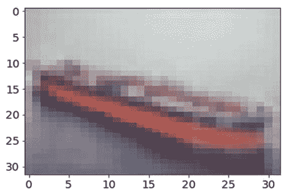
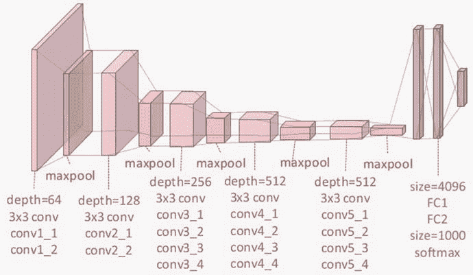
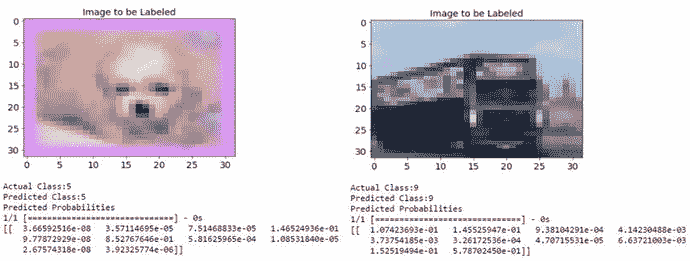
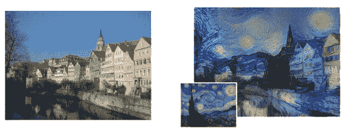
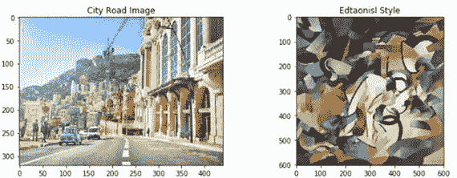
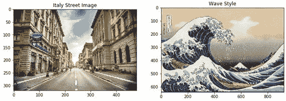

# 12.计算机视觉的深度学习

深度学习不仅仅是行业和学术界的一个关键词，它已经打开了一个全新的可能性领域。深度学习模型正在各种用例及领域中使用，其中一些我们在前面的章节中已经看到。深度神经网络具有学习复杂非线性函数、模式和表示的巨大潜力。他们的力量正在推动多个领域的研究，包括计算机视觉、视听分析、聊天机器人和自然语言理解等。在这一章中，我们将触及计算机视觉领域的一些高级领域，这些领域最近随着深度学习的出现而变得突出。这包括现实世界中的应用，如图像分类和分类，以及非常流行的图像艺术风格转换的概念。计算机视觉是关于让机器理解图像和视频的高级有用模式和表示的艺术和科学，以便它能够做出类似于人类观察周围环境时所做的智能决策。基于卷积神经网络和迁移学习等核心概念，本章通过几个来自计算机视觉的真实案例研究，让你一瞥深度学习研究的前沿。

这一章讨论卷积神经网络通过图像分类的任务使用公开可用的数据集，如 CIFAR，ImageNet 和 MNIST。我们将利用我们对 CNN 的理解来承担风格转换的任务，并理解如何使用神经网络来理解高级特征。在本章中，我们将详细介绍以下主题:

*   卷积神经网络概述
*   从头开始使用 CNN 进行图像分类
*   迁移学习:使用预训练模型的图像分类
*   基于细胞神经网络的神经类型转移

本章的代码示例、jupyter 笔记本和示例数据集可在本书的 GitHub 资源库中获得，该资源库位于第 [`https://github.com/dipanjanS/practical-machine-learning-with-python`](https://github.com/dipanjanS/practical-machine-learning-with-python) 的第 [12 章](12.html)的目录/文件夹下。

## 卷积神经网络

卷积神经网络(CNN)类似于我们在本书中讨论过的一般神经网络。额外的输入是图像(张量)的显式假设使得 CNN 被优化并且不同于通常的神经网络。这种明确的假设允许我们设计深度 CNN，同时保持可训练参数的数量处于可控状态(与一般的神经网络相比)。

我们在第 [1](01.html) (在“深度学习”一节)和第 [4](04.html) (在“图像数据的特征工程”一节)中提到了 CNN 的概念。但是，作为快速复习，以下是值得重申的关键概念:

*   卷积层:这是 CNN 区别于其他神经网络的关键部分。卷积层或 conv 层是一组可学习的滤波器。这些过滤器有助于捕捉空间要素。这些通常很小(沿宽度和高度)，但覆盖了图像的整个深度(颜色范围)。在向前传递的过程中，我们在图像的宽度和高度上滑动过滤器，同时计算过滤器属性和任意位置的输入之间的点积。输出是来自每个过滤器的二维激活图，然后堆叠这些图以获得最终输出。
*   池层:这些基本上是用于减少空间大小和参数数量的下采样层。这些层也有助于控制过度拟合。在 conv 层之间插入池层。池层可以使用最大值、平均值、L2 范数等函数执行向下采样。
*   全连接层:也称为 FC 层。这些类似于一般神经网络中的全连接层。这些与前一层的所有神经元都有完全的联系。这一层帮助执行分类任务。
*   参数共享:除了 conv 层，CNN 的独特之处在于参数共享。Conv 层在滤波器上使用相同的权重集，从而减少了所需参数的总数。

图 [12-1](#Fig1) 描述了一个典型的 CNN 架构，它是一个 LeNet CNN 模型(来源:`deeplearning.net`)。


图 12-1。

LeNet CNN model (source: deeplearning.net)

CNN 已被深入研究，并在不断改进和试验。要深入了解 CNN，请参考斯坦福大学 [`http://cs231n.github.io/convolutional-networks`](http://cs231n.github.io/convolutional-networks) 的课程。

## 基于细胞神经网络的图像分类

卷积神经网络是神经网络从图像中学习详细特征表示和模式并执行复杂任务的潜力和能力的主要例子，从对象识别到图像分类等等。CNN 经历了大量的研究，进步导致了更复杂和更强大的架构，如 VGG-16、VGG-19、Inception V3 和许多更有趣的模型。

我们首先通过解决一个图像分类问题来获得一些 CNN 的实践经验。我们通过笔记本`Bonus - Classifying handwritten digits using Deep CNNs.ipynb,`在第 [4](04.html) 章分享了一个基于 CNN 的分类的例子，它讲述了通过利用基于 CNN 的深度学习来分类和预测人类手写数字。如果您没有经历过，不要担心，因为我们将在这里经历一个详细的例子。对于我们的深度学习需求，我们将利用 keras 框架和`tensorflow`后端，类似于我们在前面章节中使用的。

### 问题陈述

给定一组包含现实世界物体的图像，人类识别它们是相当容易的。我们在这里的任务是建立一个多类(10 个类或类别)图像分类器，它可以识别给定图像的正确类别标签。对于此任务，我们将利用`CIFAR10`数据集。

### 资料组

`CIFAR10`数据集是跨越 10 个不同类别的微小标记图像的集合。该数据集由 Alex Krizhevsky、Vinod Nair 和 Geoffrey Hinton 收集，可在 [`https://www.cs.toronto.edu/~kriz/cifar.html`](https://www.cs.toronto.edu/%7Ekriz/cifar.html) 获取，也可通过 keras 中的数据集模块获取。

该数据集包含大小为 32 x 32 的微小图像，具有 50，000 个训练样本和 10，000 个测试样本。每个图像可以归入且只能归入以下类别之一。

*   汽车
*   飞机
*   伯德
*   猫
*   鹿
*   狗
*   青蛙
*   马
*   船
*   卡车

每个类都是互斥的。数据集还有另一个更大的版本，叫做`CIFAR100`。在本节中，我们将考虑`CIFAR10`数据集。

我们将通过`keras.datasets`模块访问`CIFAR10`数据集。如果不存在所需的文件，请下载它们。

### 基于 CNN 的深度学习分类器

与任何机器学习算法类似，神经网络也要求输入数据具有一定的形状、大小和类型。因此，在我们到达建模步骤之前，首先要做的是预处理数据本身。下面的代码片段获取数据集，然后对标签执行一次热编码。记住有 10 个类要处理，因此我们正在处理一个多类分类问题。

```py
In [1]: import keras
   ...: from keras.datasets import cifar10
   ...:
   ...: num_classes = 10
   ...:
   ...: (x_train, y_train), (x_test, y_test) = cifar10.load_data()
   ...:
   ...: # convert class vectors to binary class matrices
   ...: y_train = keras.utils.to_categorical(y_train, num_classes)
   ...: y_test = keras.utils.to_categorical(y_test, num_classes)

```

如果本地没有数据集，将自动下载。下面是得到的物体的形状。

```py
In [2]: print('x_train shape:', x_train.shape)
   ...: print(x_train.shape[0], 'train samples')
   ...: print(x_test.shape[0], 'test samples')
   ...:
x_train shape: (50000, 32, 32, 3)
50000 train samples
10000 test samples

```

现在我们有了训练和测试数据集。下一步是建立 CNN 模型。因为我们有二维图像(第三维是通道信息)，我们将使用`Conv2D`层。如前一节所述，CNN 使用卷积层和池层的组合，后跟一个全连接端来识别/分类数据。模型架构构建如下。

```py
In [3]: model = Sequential()
   ...: model.add(Conv2D(32, kernel_size=(3, 3),
   ...:                         activation='relu',
   ...:                         input_shape=input_shape))
   ...: model.add(Conv2D(64, (3, 3), activation='relu'))
   ...: model.add(MaxPooling2D(pool_size=(2, 2)))
   ...: model.add(Dropout(0.25))
   ...: model.add(Flatten())
   ...: model.add(Dense(128, activation='relu'))
   ...: model.add(Dropout(0.5))
   ...: model.add(Dense(num_classes, activation='softmax'))

```

它从具有总共 32 个 3×3 滤波器的卷积层和作为校正线性单元的激活函数开始(`relu`)。输入形状类似于每个图像大小，即 32 x 32 x 3(彩色图像有三个通道—RGB)。接下来是另一个卷积层和最大池层。最后，我们有完全连接的致密层。因为我们有 10 个类可供选择，所以最终的输出层有一个`softmax`激活。

下一步是编译。我们使用`categorical_crossentropy`作为我们的损失函数，因为我们正在处理多个类。除此之外，我们使用 Adadelta 优化器，然后根据训练数据训练分类器。下面的片段展示了同样的情况。

```py
In [4]: model.compile(loss=keras.losses.categorical_crossentropy,
   ...:                 optimizer=keras.optimizers.Adadelta(),
   ...:                 metrics=['accuracy'])
   ...:
   ...: model.fit(x_train, y_train,
   ...:                 batch_size=batch_size,
   ...:                 epochs=epochs,
   ...:                 verbose=1)
Epoch 1/10
50000/50000 [==============================] - 256s - loss: 7.3118 - acc: 0.1798   
Epoch 2/10
50000/50000 [==============================] - 250s - loss: 1.7923 - acc: 0.3564   
Epoch 3/10
50000/50000 [==============================] - 252s - loss: 1.5781 - acc: 0.4383   
 ...
Epoch 9/10
50000/50000 [==============================] - 251s - loss: 1.1019 - acc: 0.6163   
Epoch 10/10
50000/50000 [==============================] - 254s - loss: 1.0584 - acc: 0.6284   

```

从前面的输出可以清楚地看出，我们为模型训练了 10 个时期。这在 CPU 上需要 200-400 秒，使用 GPU 时性能会提高很多。我们可以看到，基于上一个纪元，准确率约为 63%。我们现在将评估测试性能，这是使用模型对象的 evaluate 函数检查的。结果如下。

```py
Test loss: 1.10143025074
Test accuracy: 0.6354

```

因此，我们可以看到，我们非常简单的基于 CNN 的深度学习模型达到了 63.5%的准确率，因为我们已经建立了一个非常简单的模型，并且我们没有做太多的预处理或模型调整。我们鼓励您尝试不同的 CNN 架构，并尝试超参数调谐，看看如何改善结果。

模型的最初几个 conv 层用于特征提取，而最后几层(完全连接)用于数据分类。因此，看看我们刚刚创建的`conv-net`如何处理图像数据将会很有趣。幸运的是，keras 提供了钩子来提取模型中间步骤的信息。它们描述了图像的各个区域如何激活 conv 图层，以及如何提取相应的要素制图表达和模式。



图 12-2。

Sample image from the CIFAR10 dataset

笔记本`notebook_cnn_cifar10_classifier.ipynb`中解释了 CNN 如何查看图像的示例流程。它包含本节中讨论的其余代码。图 [12-2](#Fig2) 显示了来自测试数据集的图像。它看起来像一艘船，并且模型正确地识别了它，正如这个片段中所描述的。

```py
# actual image id
img_idx = 999
# actual image label
In [5]: y_test[img_idx]
array([ 0.,  0.,  0.,  0.,  0.,  0.,  0.,  0.,  1.,  0.])

# predict label with our model
In [6]: test_image =np.expand_dims(x_test[img_idx], axis=0)
   ...: model.predict_classes(test_image,batch_size=1)
1/1 [==============================] - 0s
Out[16]:
array([8], dtype=int64)

```

您可以使用笔记本中的`get_activations(...)`和`display_activations(...)`功能，根据 conv 图层学习和提取的内容，提取并查看图像的激活图。图 [12-3](#Fig3) 显示了我们刚刚建立的 CNN 模型的初始 conv 层的激活。


图 12-3。

Sample image through a CNN layer

我们还建议您阅读第 [4](04.html) 章中的“具有深度学习的自动化特征工程”一节，以了解有关使用卷积层从图像中提取特征表示的更多信息。

### 基于 CNN 的预训练模型深度学习分类器

从头开始构建分类器有它自己的优缺点。然而，更精确的方法是在大型复杂数据集上利用预先训练的模型。有许多著名的 CNN 架构，如 LeNet、ResNet、VGG-16、VGG-19 等等。这些模型具有深度和复杂的体系结构，这些体系结构已经在不同的大型数据集上进行了微调和训练。因此，这些模型已被证明在复杂的对象识别任务中具有惊人的性能。

因为获得大型标记数据集和训练高度复杂和深度的神经网络是一项耗时的任务(训练像 VGG-19 这样复杂的 CNN 可能需要几周时间，即使使用 GPU)。在实践中，我们利用了一个概念，正式称为迁移学习。迁移学习的概念帮助我们利用现有的模型来完成任务。核心思想是利用学习，该模型通过在大型数据集上进行训练来学习，然后通过重用相同的模型从新图像中提取特征表示来转移该学习。进行迁移学习有几种策略，其中一些如下所述:

*   作为特征提取器的预训练模型:预训练模型用于提取数据集的特征。我们在这些特征的基础上建立一个全连接的分类器。在这种情况下，我们只需要训练完全连接的分类器，这不会花费太多时间。
*   微调预训练模型:通过固定一些层并允许其他层学习/更新完全连接的层之外的权重，可以微调现有的预训练模型。通常观察到初始层捕获一般特征，而更深的层在特征提取方面变得更具体。因此，根据需求，我们修复某些层并微调其余的层。

在本节中，我们将看到一个示例，其中我们将利用预训练的 conv 网络作为特征提取器，并在其上构建基于全连接层的分类器，并训练该模型。我们将不训练特征提取层，因此通过使用预训练的 conv 层进行特征提取来利用迁移学习的原理。

牛津大学视觉几何小组的 VGG-19 模型是一种最先进的卷积神经网络。在各种基准测试和比赛中，这种方法表现得非常好。VGG19 是在`ImageNet`数据集上训练的 19 层 conv 网络。`ImageNet`是一个包含超过 9，000 个类别的 1000 万张手绘图像的可视化数据库。这个模型已经被广泛地研究和应用于迁移学习等任务中。

Note

关于这项研究和 VGG 小组其他研究的更多详情，请点击 [`http://www.robots.ox.ac.uk/~vgg/research/very_deep/`](http://www.robots.ox.ac.uk/%7Evgg/research/very_deep/) 。

该预训练模型可通过`keras.applications`模块获得。如上所述，我们将利用 VGG-19 作为特征提取器，帮助我们在`CIFAR10`数据集上构建分类器。

因为我们将使用 VGG-19 进行特征提取，所以我们不需要该模型的顶层(或全连接层)。keras 让这变得简单，只需将一个标志值设置为`False`。下面的代码片段加载了由 conv 层组成的`VGG-19`模型架构，并省略了完全连接的层。

```py
In [1]: from keras import applications
   ...:
   ...: vgg_model = applications.VGG19(include_top=False, weights='imagenet')

```

既然预训练模型可用，我们将利用它从训练数据集中提取特征。记住 VGG-19 是在`ImageNet`上训练的，而我们将使用`CIFAR10`来建立一个分类器。由于 ImageNet 包含超过 1000 万张跨越 9000 多个类别的图片，因此可以有把握地假设`CIFAR10`的类别是这里的一个子集。在使用 VGG-19 模型进行特征提取之前，检查一下模型的架构是个好主意。

```py
In [1]: vgg_model.summary()
_________________________________________________________________
Layer (type)                 Output Shape              Param #   
=================================================================
input_1 (InputLayer)         (None, None, None, 3)     0         
_________________________________________________________________
block1_conv1 (Conv2D)        (None, None, None, 64)    1792      
_________________________________________________________________
block1_conv2 (Conv2D)        (None, None, None, 64)    36928     
_________________________________________________________________
block1_pool (MaxPooling2D)   (None, None, None, 64)    0         
_________________________________________________________________
block2_conv1 (Conv2D)        (None, None, None, 128)   73856     
_________________________________________________________________
block2_conv2 (Conv2D)        (None, None, None, 128)   147584    
_________________________________________________________________
block2_pool (MaxPooling2D)   (None, None, None, 128)   0         
_________________________________________________________________
block3_conv1 (Conv2D)        (None, None, None, 256)   295168    
_________________________________________________________________
block3_conv2 (Conv2D)        (None, None, None, 256)   590080    
_________________________________________________________________
block3_conv3 (Conv2D)        (None, None, None, 256)   590080    
_________________________________________________________________
block3_conv4 (Conv2D)        (None, None, None, 256)   590080    
_________________________________________________________________
block3_pool (MaxPooling2D)   (None, None, None, 256)   0         
_________________________________________________________________
block4_conv1 (Conv2D)        (None, None, None, 512)   1180160   
_________________________________________________________________
block4_conv2 (Conv2D)        (None, None, None, 512)   2359808   
_________________________________________________________________
block4_conv3 (Conv2D)        (None, None, None, 512)   2359808   
_________________________________________________________________
block4_conv4 (Conv2D)        (None, None, None, 512)   2359808   
_________________________________________________________________
block4_pool (MaxPooling2D)   (None, None, None, 512)   0         
_________________________________________________________________
block5_conv1 (Conv2D)        (None, None, None, 512)   2359808   
_________________________________________________________________
block5_conv2 (Conv2D)        (None, None, None, 512)   2359808   
_________________________________________________________________
block5_conv3 (Conv2D)        (None, None, None, 512)   2359808   
_________________________________________________________________
block5_conv4 (Conv2D)        (None, None, None, 512)   2359808   
_________________________________________________________________
block5_pool (MaxPooling2D)   (None, None, None, 512)   0         
=================================================================
Total params: 20,024,384
Trainable params: 20,024,384
Non-trainable params: 0
_________________________________________________________________

```

从前面的输出中，您可以看到这个体系结构非常庞大，有很多层。图 [12-4](#Fig4) 以一种更容易理解的视觉方式描绘了所有层。请记住，我们没有使用图 [12-4](#Fig4) 最右侧所示的完全连接层。我们推荐阅读牛津大学工程科学系视觉几何组的[卡伦·西蒙扬](https://arxiv.org/find/cs/1/au:+Simonyan_K/0/1/0/all/0/1)和[安德鲁·齐塞曼](https://arxiv.org/find/cs/1/au:+Zisserman_A/0/1/0/all/0/1)的论文《用于大规模图像识别的深度卷积网络》。该论文可在 [`https://arxiv.org/abs/1409.1556`](https://arxiv.org/abs/1409.1556) 获得，并详细讨论了这些模型的架构。



图 12-4。

Visual depiction of the VGG-19 architecture

加载`CIFAR10`训练和测试数据集与上一节讨论的相同。我们也执行类似的标签热编码。由于 VGG19 模型是在没有最终完全连接的图层的情况下加载的，因此模型的`predict(...)`函数可以帮助我们在数据集上获取提取的要素。下面的代码片段提取了训练数据集和测试数据集的功能。

```py
In [2]: bottleneck_features_train = vgg_model.predict(x_train, verbose=1)
   ...: bottleneck_features_test = vgg_model.predict(x_test, verbose=1)

```

这些特征被广泛认为是瓶颈特征，因为事实上输入数据点的数量总体上减少了。为了理解 VGG 模型是如何转换数据的，研究模型摘要是值得的。这个阶段的输出(瓶颈特性)被用作我们接下来要构建的分类器的输入。下面的代码片段构建了一个简单的完全连接的两层分类器。

```py
In [3]: clf_model = Sequential()
   ...: clf_model.add(Flatten(input_shape=bottleneck_features_train.shape[1:]))
   ...: clf_model.add(Dense(512, activation='relu'))
   ...: clf_model.add(Dropout(0.5))
   ...: clf_model.add(Dense(256, activation='relu'))
   ...: clf_model.add(Dropout(0.5))
   ...: clf_model.add(Dense(num_classes, activation='softmax'))
   ...: clf_model.compile(loss=keras.losses.categorical_crossentropy,
                          optimizer=keras.optimizers.Adadelta(),
                          metrics=['accuracy'])

```

模型的输入层与瓶颈特征的维度相匹配(原因很明显)。和我们从头构建的 CNN 模型一样，这个模型也有一个带有`softmax`激活功能的密集输出层。与完整的`VGG19`相比，训练这个模型相当简单快速，如下面的代码片段所示。

```py
In [4]: clf_model.fit(bottleneck_features_train, y_train, batch_size=batch_size,
   ...:               epochs=epochs, verbose=1)
Epoch 1/50
50000/50000 [==============================] - 8s - loss: 7.2495 - acc: 0.2799     
Epoch 2/50
50000/50000 [==============================] - 7s - loss: 2.2513 - acc: 0.2768     
Epoch 3/50
50000/50000 [==============================] - 7s - loss: 1.9096 - acc: 0.3521     
 ...
Epoch 48/50
50000/50000 [==============================] - 8s - loss: 0.9368 - acc: 0.6814     
Epoch 49/50
50000/50000 [==============================] - 8s - loss: 0.9223 - acc: 0.6832     
Epoch 50/50
50000/50000 [==============================] - 8s - loss: 0.9197 - acc: 0.6830    

```

我们可以根据提前停止标准等添加挂钩来提前停止训练。但是现在，我们保持事情简单。本节的完整代码可在笔记本`notebook_pretrained_cnn_cifar10_classifier.ipynb`中找到。总的来说，我们在训练数据集上达到了 68%的准确率，在测试数据集上达到了 64%左右。

现在，您将看到这个分类器的性能是建立在测试数据集的预训练模型之上的。以下代码片段展示了一个实用函数，该函数将测试数据集中图像的索引号作为输入，并比较实际标签和预测标签。

```py
def predict_label(img_idx,show_proba=True):
    plt.imshow(x_test[img_idx],aspect='auto')
    plt.title("Image to be Labeled")
    plt.show()

    print("Actual Class:{}".format(np.nonzero(y_test[img_idx])[0][0]))

    test_image =np.expand_dims(x_test[img_idx], axis=0)
    bf = vgg_model.predict(test_image,verbose=0)
    pred_label = clf_model.predict_classes(bf,batch_size=1,verbose=0)

    print("Predicted Class:{}".format(pred_label[0]))
    if show_proba:
        print("Predicted Probabilities")
        print(clf_model.predict_proba(bf))

```

下面是对测试数据集中的几幅图像进行测试时，`predict_label(...)`函数的输出。如图 [12-5](#Fig5) 所示，我们正确预测图像属于类别标签 5(狗)和 9(卡车)！



图 12-5。

Predicted labels from pre-trained CNN based classifier

本节展示了迁移学习的力量和优势。我们不用花时间重新发明轮子，只需几行代码，就能利用最先进的神经网络来完成分类任务。

迁移学习的概念是神经类型迁移的基础，我们将在下一节讨论。

## CNN 的艺术风格转换

绘画(或任何形式的艺术)需要特殊的技能，而少数人已经掌握了这些技能。绘画呈现了内容和风格之间复杂的相互作用。另一方面，照片是透视和光线的结合。当两者结合时，结果是惊人的。一个这样的例子如图 [12-6](#Fig6) 所示。



图 12-6。

Left Image: The original photograph depicting the Neckarfront in Tubingen, Germany. Right Image: The painting (inset: The Starry Night by Vincent van Gogh) that provided the style for the respective generated image. Source: A Neural Algorithm of Artistic Style, Gatys et al. (arXiv:1508.06576v2)

图 [12-6](#Fig6) 中的结果展示了一幅画(梵高的《星夜》)的风格是如何被转移到领口的照片上的。乍一看，这个过程似乎从照片中提取了内容，从绘画中提取了风格、颜色和笔触模式，并生成了最终结果。结果很惊人，但更让人吃惊的是，是怎么做到的？

图 [12-6](#Fig6) 展示了一个被称为艺术风格转移的过程。这个过程是 Gatys 等人的研究成果，并在他们的论文《艺术风格的神经算法》中提出。在这一节中，我们将从实现的角度讨论本文的复杂性，并看看我们如何自己执行这项技术。

Note

Prisma 是一款应用程序，它使用基于卷积神经网络的艺术风格转换技术将照片转换为艺术作品。有关该应用的更多信息，请访问 [`https://prisma-ai.com/`](https://prisma-ai.com/) 。

### 背景

形式上，神经风格转移是将参考图像的“风格”应用于特定目标图像的过程，使得在该过程中，目标图像的原始“内容”保持不变。这里，样式被定义为参考图像中存在的颜色、图案和纹理，而内容被定义为图像的整体结构和更高级别的组件。

这里的主要目的是保留原始目标图像的内容，同时在目标图像上叠加或采用参考图像的样式。为了从数学上定义这个概念，考虑三个图像——原始内容(表示为 c)、参考样式(表示为 s)和生成的图像(表示为 g)。因此，我们需要一种方法来衡量图像 c 和 g 在内容上的差异。如果 c 和 g 完全不同，则趋向于 0，否则增长的函数。这可以用损失函数简明地表述为:

L <sub>内容</sub> =距离(c，g)

距离是一个像 L2 一样的标准函数。同样，我们可以定义另一个函数来捕捉图像 s 和 g 在风格上的不同。换句话说，这可以表述如下:

L <sub>style</sub> =距离(s，g)

因此，对于神经风格转移的整体过程，我们有一个整体损失函数，它可以定义为内容和风格损失函数的组合。

L<sub>style-transfer</sub>= arg min<sub>g</sub>(αL<sub>内容</sub> (c，g) + βL <sub>style</sub> (s，g))

其中α和β是用于控制内容和风格成分对整体损失的影响的权重。我们试图最小化的损失函数由三部分组成，即内容损失、风格损失和总变差损失，我们将在后面讨论。

深度学习的妙处在于，通过利用像深度卷积神经网络(CNN)这样的架构，我们可以从数学上定义上述风格和内容功能。我们将使用迁移学习的原理来建立我们的神经类型迁移系统。我们使用像 VGG-19 这样的预训练深度 CNN 模型引入了迁移学习的概念。我们将利用相同的预训练模型来完成神经类型转移的任务。主要步骤概述如下。

*   利用 VGG-19 帮助计算样式、内容和生成图像的层激活。
*   使用这些激活来定义前面提到的特定损失函数。
*   最后，使用梯度下降，使整体损失最小化。

我们建议您使用标题为`Neural Style Transfer.ipynb`的笔记本来学习本节内容，其中包含风格转变过程的逐步细节。我们还要特别提到并感谢 Franç ois Chollet 和 Harish Narayanan 提供了一些关于风格转换的优秀资源。关于这一点的细节将在后面提到。我们还建议您查看以下论文(详细链接稍后分享)。

*   艺术风格的神经算法由[莱昂·a·加蒂丝](https://arxiv.org/find/cs/1/au:+Gatys_L/0/1/0/all/0/1)、[亚历山大·s·埃克](https://arxiv.org/find/cs/1/au:+Ecker_A/0/1/0/all/0/1)和[马蒂亚斯·贝奇](https://arxiv.org/find/cs/1/au:+Bethge_M/0/1/0/all/0/1)
*   由[贾斯廷·约翰逊](https://arxiv.org/find/cs/1/au:+Johnson_J/0/1/0/all/0/1)、[亚历山大·阿拉希](https://arxiv.org/find/cs/1/au:+Alahi_A/0/1/0/all/0/1)和[李菲菲](https://arxiv.org/find/cs/1/au:+Fei_Fei_L/0/1/0/all/0/1)进行实时风格转换和超分辨率的感知损失

### 预处理

在这种情况下，实现这种网络的第一步也是最重要的一步是预处理数据或图像。以下是预处理图像以调整大小和通道的快速实用程序。

```py
import numpy as np
from keras.applications import vgg19
from keras.preprocessing.image import load_img, img_to_array

def preprocess_image(image_path, height=None, width=None):
    height = 400 if not height else height
    width = width if width else int(width * height / height)
    img = load_img(image_path, target_size=(height, width))
    img = img_to_array(img)
    img = np.expand_dims(img, axis=0)
    img = vgg19.preprocess_input(img)
    return img

def deprocess_image(x):
    # Remove zero-center by mean pixel
    x[:, :, 0] += 103.939
    x[:, :, 1] += 116.779
    x[:, :, 2] += 123.68
    # 'BGR'->'RGB'
    x = x[:, :, ::-1]
    x = np.clip(x, 0, 255).astype('uint8')
    return x

```

因为我们要编写定制的损失函数和操作例程，所以我们需要定义某些占位符。keras 是一个高级库，它利用张量操纵后端(如`tensorflow`、`theano`和`CNTK`)来执行繁重的工作。因此，这些占位符提供了与底层张量对象一起工作的高级抽象。下面的代码片段为样式、内容、生成的图像以及神经网络的输入张量准备了占位符。

```py
In [1]: # This is the path to the image you want to transform.
   ...: TARGET_IMG = 'data/city_road.jpg'
   ...: # This is the path to the style image.
   ...: REFERENCE_STYLE_IMG = 'data/style2.png'
   ...:
   ...: width, height = load_img(TARGET_IMG).size
   ...: img_height = 320
   ...: img_width = int(width * img_height / height)
   ...:
   ...:
   ...: target_image = K.constant(preprocess_image(TARGET_IMG,
   ...:                                                 height=img_height,
   ...:                                                 width=img_width))
   ...: style_image = K.constant(preprocess_image(REFERENCE_STYLE_IMG,
   ...:                                                 height=img_height,
   ...:                                                 width=img_width))
   ...:
   ...: # Placeholder for our generated image
   ...: generated_image = K.placeholder((1, img_height, img_width, 3))
   ...:
   ...: # Combine the 3 images into a single batch
   ...: input_tensor = K.concatenate([target_image,
   ...:                                 style_image,
   ...:                                 generated_image], axis=0)

```

我们将加载预训练的 VGG-19 模型，就像我们在上一节中所做的那样，即，没有顶部完全连接的层。这里唯一的区别是，我们将提供模型构造器，输入张量的大小。下面的代码片段获取预训练的模型。

```py
In [2]: model = vgg19.VGG19(input_tensor=input_tensor,
   ...:                         weights='imagenet',
   ...:                         include_top=False)

```

您可以使用`summary()`功能来理解预训练模型的架构。

### 损失函数

正如在背景小节中所讨论的，神经风格转移的问题围绕着内容和风格的损失函数。在这一小节中，我们将讨论和定义所需的损失函数。

#### 内容损失

在任何基于 CNN 的模型中，来自顶层的激活包含更多的全局和抽象信息(高层结构，如面部)，底层将包含关于图像的局部信息(低层结构，如眼睛、鼻子、边缘和角落)。我们希望利用 CNN 的顶层来捕捉图像内容的正确表示。

因此，对于内容损失，考虑到我们将使用预训练的 VGG-19 CNN，我们可以将我们的损失函数定义为在目标图像上计算的顶层(给出特征表示)的激活和在生成的图像上计算的相同层的激活之间的 L2 范数(缩放的和平方的欧几里德距离)。假设我们通常从 CNN 的顶层获得与图像内容相关的特征表示，则所生成的图像应该看起来与基本目标图像相似。下面的代码片段展示了计算内容损失的函数。

```py
def content_loss(base, combination):
    return K.sum(K.square(combination - base))

```

#### 风格丧失

关于神经风格转移的原始论文，Gatys 等人的艺术风格的神经算法，利用 CNN 中的多个卷积层(而不是一个)来提取有意义的模式和表示，从而从跨所有空间尺度的参考风格图像中捕获与外观或风格有关的信息，而不管图像内容如何。

忠于原文，我们将利用 Gram 矩阵，并对卷积层生成的特征表示进行同样的计算。Gram 矩阵计算任意给定 conv 图层中生成的特征地图之间的内积。内积项与相应特征集的协方差成比例，因此捕获了倾向于一起激活的层的特征之间的相关模式。这些特征相关性有助于捕获特定空间尺度的模式的相关集合统计数据，这些统计数据对应于样式、纹理和外观，而不是图像中存在的组件和对象。

因此，风格损失被定义为参考风格的 Gram 矩阵和生成的图像之间的差异的比例和平方 Frobenius 范数。最小化这种损失有助于确保在参考样式图像中的不同空间尺度上找到的纹理在生成的图像中是相似的。

因此，下面的代码片段定义了一个基于 Gram 矩阵计算的样式损失函数。

```py
def style_loss(style, combination, height, width):

    def build_gram_matrix(x):
        features = K.batch_flatten(K.permute_dimensions(x, (2, 0, 1)))
        gram_matrix = K.dot(features, K.transpose(features))
        return gram_matrix

    S = build_gram_matrix(style)
    C = build_gram_matrix(combination)
    channels = 3
    size = height * width
    return K.sum(K.square(S - C)) / (4\. * (channels ** 2) * (size ** 2))

```

#### 总变异损失

据观察，仅减少样式和内容损失的优化导致高度像素化和噪声输出。为了弥补这一点，引入了总变差损失。

总变差损失类似于正则化损失。这是为了确保生成的图像的空间连续性和平滑性，以避免噪声和过度像素化的结果。函数中的定义如下。

```py
def total_variation_loss(x):
    a = K.square(
        x[:, :img_height - 1, :img_width - 1, :] - x[:, 1:, :img_width - 1, :])
    b = K.square(
        x[:, :img_height - 1, :img_width - 1, :] - x[:, :img_height - 1, 1:, :])
    return K.sum(K.pow(a + b, 1.25))

```

#### 总损失函数

定义了神经类型转移的总损失函数的组成部分后，下一步是将这些构件拼凑在一起。由于内容和风格信息是由 CNN 在网络的不同深度捕获的，因此我们需要针对每种类型的损失在适当的层应用和计算损失。利用 Gatys 等人和 Johnson 等人在他们各自的论文中的见解和研究，我们定义了以下效用来识别 VGG-19 模型的内容和风格层。尽管 Johnson 等人利用 VGG-16 模型来获得更快更好的性能，但为了便于理解和跨运行的一致性，我们将自己约束于 VGG-19 模型。

```py
# define function to set layers based on source paper followed
def set_cnn_layers(source='gatys'):
    if source == 'gatys':
        # config from Gatys et al.
        content_layer = 'block5_conv2'
        style_layers = ['block1_conv1', 'block2_conv1', 'block3_conv1',
                        'block4_conv1', 'block5_conv1']
    elif source == 'johnson':
        # config from Johnson et al.
        content_layer = 'block2_conv2'
        style_layers = ['block1_conv2', 'block2_conv2', 'block3_conv3',
                        'block4_conv3', 'block5_conv3']
    else:
        # use Gatys config as the default anyway
        content_layer = 'block5_conv2'
        style_layers = ['block1_conv1', 'block2_conv1', 'block3_conv1',
                        'block4_conv1', 'block5_conv1']
    return content_layer, style_layers

```

然后，下面的代码片段根据从内容和样式的`set_cnn_layers()`函数中选择的图层应用整体损失函数。

```py
In [2]: # weights for the weighted average loss function
   ...: content_weight = 0.025
   ...: style_weight = 1.0
   ...: total_variation_weight = 1e-4
   ...:
   ...: # set the source research paper followed and set the content and style layers
   ...: source_paper = 'gatys'
   ...: content_layer, style_layers = set_cnn_layers(source=source_paper)
   ...:
   ...: ## build the weighted loss function
   ...:
   ...: # initialize total loss
   ...: loss = K.variable(0.)
   ...:
   ...: # add content loss
   ...: layer_features = layers[content_layer]
   ...: target_image_features = layer_features[0, :, :, :]
   ...: combination_features = layer_features[2, :, :, :]
   ...: loss += content_weight * content_loss(target_image_features,
   ...:                                         combination_features)
   ...:
   ...: # add style loss
   ...: for layer_name in style_layers:
   ...: layer_features = layers[layer_name]
   ...: style_reference_features = layer_features[1, :, :, :]
   ...: combination_features = layer_features[2, :, :, :]
   ...: sl = style_loss(style_reference_features, combination_features,
   ...:                 height=img_height, width=img_width)
   ...: loss += (style_weight / len(style_layers)) * sl
   ...:
   ...: # add total variation loss
   ...: loss += total_variation_weight * total_variation_loss(generated_image) 

```

### 自定义优化器

目标是在优化算法的帮助下迭代地最小化总损失。在 Gatys 等人的论文中，使用 L-BFGS 算法进行优化，该算法是基于拟牛顿法的优化算法，其广泛用于解决非线性优化问题和参数估计。这种方法通常比标准梯度下降法收敛得快。`SciPy`在`scipy.optimize.fmin_l_bfgs_b()`中有一个可用的实现。然而，限制包括该函数仅适用于平面 1D 向量，不像我们正在处理的 3D 图像矩阵，以及损失函数和梯度的值需要作为两个独立的函数传递的事实。

我们基于`keras`创建者 Franç ois Chollet 遵循的模式构建了一个`Evaluator`类，以在一个过程中计算损失和梯度值，而不是独立和单独的计算。这将在第一次调用时返回损失值，并将为下一次调用缓存梯度。因此，这将比单独计算两者更有效。下面的代码片段定义了`Evaluator`类。

```py
class Evaluator(object):

    def __init__(self, height=None, width=None):
        self.loss_value = None
        self.grads_values = None
        self.height = height
        self.width = width

    def loss(self, x):
        assert self.loss_value is None
        x = x.reshape((1, self.height, self.width, 3))
        outs = fetch_loss_and_grads([x])
        loss_value = outs[0]
        grad_values = outs[1].flatten().astype('float64')
        self.loss_value = loss_value
        self.grad_values = grad_values
        return self.loss_value

    def grads(self, x):
        assert self.loss_value is not None
        grad_values = np.copy(self.grad_values)
        self.loss_value = None
        self.grad_values = None
        return grad_values

```

损失和梯度检索如下。该代码片段还创建了一个`Evaluator`类的对象。

```py
In [3]: # Get the gradients of the generated image wrt the loss
   ...: grads = K.gradients(loss, generated_image)[0]
   ...:
   ...: # Function to fetch the values of the current loss and the current gradients
   ...: fetch_loss_and_grads = K.function([generated_image], [loss, grads])
   ...:
   ...: # evaluator object
   ...: evaluator = Evaluator(height=img_height, width=img_width) 

```

### 风格转移正在进行

拼图的最后一块是使用所有的构建模块，并查看实际的风格转换。艺术/风格和内容图片可在数据目录中参考。以下代码片段概述了如何评估损失和梯度。我们还在规则的时间间隔(5 次、10 次等迭代)后写回输出，以便稍后理解神经类型转移的过程如何转换所考虑的图像。

```py
In [4]: result_prefix = 'style_transfer_result_'+TARGET_IMG.split('.')[0]
   ...: result_prefix = result_prefix+'_'+source_paper
   ...: iterations = 20
   ...:
   ...: # Run scipy-based optimization (L-BFGS) over the pixels of the generated image
   ...: # so as to minimize the neural style loss.
   ...: # This is our initial state: the target image.
   ...: # Note that `scipy.optimize.fmin_l_bfgs_b` can only process flat vectors.
   ...: x = preprocess_image(TARGET_IMG, height=img_height, width=img_width)
   ...: x = x.flatten()
   ...:
   ...: for i in range(iterations):
   ...:         print('Start of iteration', (i+1))
   ...:         start_time = time.time()
   ...:         x, min_val, info = fmin_l_bfgs_b(evaluator.loss, x,
   ...:                                 fprime=evaluator.grads, maxfun=20)
   ...:         print('Current loss value:', min_val)
   ...:         if (i+1) % 5 == 0 or i == 0:
   ...:                 # Save current generated image only every 5 iterations
   ...:                 img = x.copy().reshape((img_height, img_width, 3))
   ...:                 img = deprocess_image(img)
   ...:                 fname = result_prefix + '_at_iteration_%d.png' %(i+1)
   ...:                 imsave(fname, img)
   ...:                 print('Image saved as', fname)
   ...:         end_time = time.time()
   ...:         print('Iteration %d completed in %ds' % (i+1, end_time - start_time))

```

现在很明显，神经类型转换是一项计算量很大的任务。对于考虑中的这组图像，在具有 8GB RAM 的 Intel i5 CPU 上，每次迭代花费 500-1000 秒。平均来说，每次迭代需要大约 500 秒，但是如果你同时运行多个网络，每次迭代需要 1000 秒。如果使用 GPU 进行同样的操作，您可能会观察到加速。下面是一些迭代的输出。我们打印每次迭代的损失和时间，并在五次迭代后保存图像。

```py
Start of iteration 1
Current loss value: 2.4219e+09
Image saved as style_transfer_result_city_road_gatys_at_iteration_1.png
Iteration 1 completed in 506s
Start of iteration 2
Current loss value: 9.58614e+08
Iteration 2 completed in 542s
Start of iteration 3
Current loss value: 6.3843e+08
Iteration 3 completed in 854s
Start of iteration 4
Current loss value: 4.91831e+08
Iteration 4 completed in 727s
Start of iteration 5
Current loss value: 4.03013e+08
Image saved as style_transfer_result_city_road_gatys_at_iteration_5.png
Iteration 5 completed in 878s
 ...
Start of iteration 19
Current loss value: 1.62501e+08
Iteration 19 completed in 836s
Start of iteration 20
Current loss value: 1.5698e+08
Image saved as style_transfer_result_city_road_gatys_at_iteration_20.png
Iteration 20 completed in 838s

```

现在，您将了解神经类型转移如何适用于所考虑的图像。请记住，我们在对每一对样式和内容图像进行一定的迭代后执行检查点输出。

Note

我们为第一张图片使用的风格，如图 [12-7](#Fig7) 所示，被命名为 Edtaonisl。这是弗朗西斯·皮卡比亚 1913 年的杰作。通过这幅油画，弗朗西斯·皮卡比亚开创了一种新的视觉语言。关于这幅画的更多细节可以在 [`http://www.artic.edu/aic/collections/artwork/80062`](http://www.artic.edu/aic/collections/artwork/80062) 找到。

我们利用`matplotlib`和`skimage`库来加载和理解风格转换魔术！下面的代码片段加载了城市道路图像作为我们的内容，Edtaonisl painting 作为我们的样式图像。



图 12-7。

The City Road image as content and the Edtaonisl painting as style image for neural style transfer

```py
In [5]: from skimage import io
   ...: from glob import glob
   ...: from matplotlib import pyplot as plt
   ...:
   ...: cr_content_image = io.imread('results/city road/city_road.jpg')
   ...: cr_style_image = io.imread('results/city road/style2.png')
   ...:
   ...:
   ...: fig = plt.figure(figsize = (12, 4))
   ...: ax1 = fig.add_subplot(1,2, 1)
   ...: ax1.imshow(cr_content_image)
   ...: t1 = ax1.set_title('City Road Image')
   ...: ax2 = fig.add_subplot(1,2, 2)
   ...: ax2.imshow(cr_style_image)
   ...: t2 = ax2.set_title('Edtaonisl Style')

```

下面的代码片段加载第一次、第十次和第二十次迭代后观察到的生成的图像(样式转换的图像)。


图 12-8。

The City Road image style transfer at the first, tenth, and twentieth iteration

```py
In [6]: fig = plt.figure(figsize = (20, 5))
   ...: ax1 = fig.add_subplot(1,3, 1)
   ...: ax1.imshow(cr_iter1)
   ...: t1 = ax1.set_title('Iteration 1')
   ...: ax2 = fig.add_subplot(1,3, 2)
   ...: ax2.imshow(cr_iter10)
   ...: t2 = ax2.set_title('Iteration 10')
   ...: ax3 = fig.add_subplot(1,3, 3)
   ...: ax3.imshow(cr_iter20)
   ...: t3 = ax3.set_title('Iteration 20')
   ...: t = fig.suptitle('City Road Image after Style Transfer')

```

图 [12-8](#Fig8) 中描绘的结果确实令人愉快和惊奇。很明显，在最初的迭代中生成的图像与内容的结构相似，随着迭代的进行，样式开始越来越多地影响纹理、颜色、笔画等。

Note

图 [12-9](#Fig9) 中描绘的下一个例子中使用的风格是葛饰北斋的名画《巨浪》。这幅作品完成于 1830-1832 年。看到如此有才华的艺术家的风格被转移到日常照片中，真是令人惊讶。更多关于这件艺术品的信息请访问 [`http://www.metmuseum.org/art/collection/search/36491`](http://www.metmuseum.org/art/collection/search/36491) 。



图 12-9。

The Italy Street image as content and Wave Style painting as the style image for neural style transfer

我们用另外几组图像做了实验，结果看起来确实令人惊讶和愉快。图 [12-10](#Fig10) 显示了在不同迭代下，描绘意大利街道的图像的神经风格传递的输出(见图 [12-9](#Fig9) )。


图 12-10。

Italian street image style transfer at the first, tenth and twentieth iteration

图 [12-10](#Fig10) 中描绘的结果绝对是一种享受，给人一种整座城市都在水下的感觉！我们鼓励你在这个框架中使用你自己的图片。还可以随意试验利用不同的卷积层来表示样式和内容特征，如 Gatys 等人和 Johnson 等人所述。

Note

Gatys 等人和 Johnson 等人在他们各自的论文 [`https://arxiv.org/abs/1508.06576`](https://arxiv.org/abs/1508.06576) 和 [`https://arxiv.org/abs/1603.08155`](https://arxiv.org/abs/1603.08155) 中介绍和解释了神经风格转移的概念和细节。您还可以查看弗朗索瓦·乔莱(Franç ois Chollet)的《用 Python 进行深度学习》(Deep Learning with Python)一书以及哈里什·纳拉亚南(Harish Narayanan)的优秀博客，了解详细的神经风格转移分步指南: [`https://harishnarayanan.org/writing/artistic-style-transfer/`](https://harishnarayanan.org/writing/artistic-style-transfer/) 。

## 摘要

本章介绍了机器学习领域最前沿的主题。通过这一章，我们利用了关于机器学习的一般知识，特别是深度学习，来理解图像分类、迁移学习和风格迁移的概念。这一章从快速复习与卷积神经网络相关的概念开始，以及它们是如何处理图像相关数据的优化架构。然后我们致力于开发图像分类器。第一个分类器是从零开始开发的，在 keras 的帮助下，我们能够获得不错的结果。第二个分类器利用预训练的 VGG-19 深度 CNN 模型作为图像特征提取器。基于预训练模型的分类器帮助我们理解迁移学习的概念及其益处。本章的结尾部分介绍了神经类型转移的高级主题，这是本章的主要亮点。风格转移是将参考图像的风格应用于特定目标图像的过程，使得在该过程中，目标图像的原始内容保持不变。这个过程利用了细胞神经网络的潜力来理解不同粒度的图像特征以及迁移学习。基于我们对这些概念的理解以及 Gatys 等人和 Johnson 等人的研究工作，我们提供了实现神经风格转移系统的逐步指南。我们通过展示神经类型转移过程中的一些惊人结果来结束这一部分。

深度学习每天都在打开新的大门。它在不同领域和问题上的应用展示了它解决以前未知问题的潜力。机器学习是一个不断发展和非常复杂的领域。通过这本书，我们从机器学习框架的基础，Python 生态系统到不同的算法和概念。然后，我们在章节中介绍了多个用例，展示了使用机器学习工具箱中的工具解决问题的不同场景和方法。机器学习的世界正在以极快的速度扩张；我们在这里的尝试是让你开始在正确的轨道上，在这个美好的旅程。