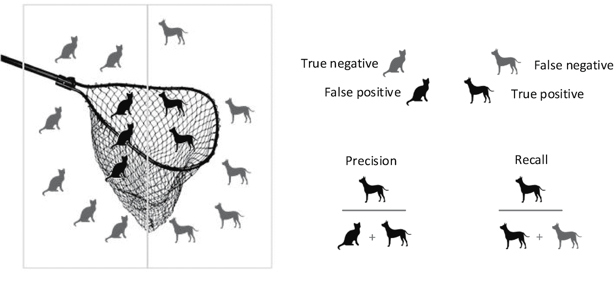
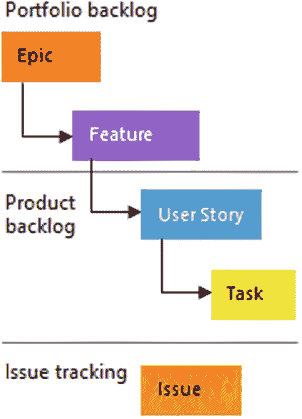
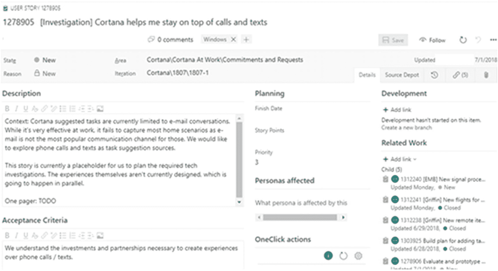
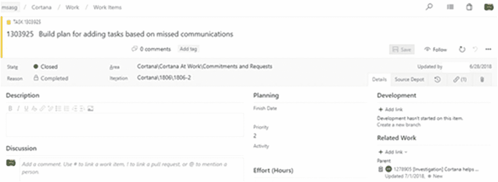
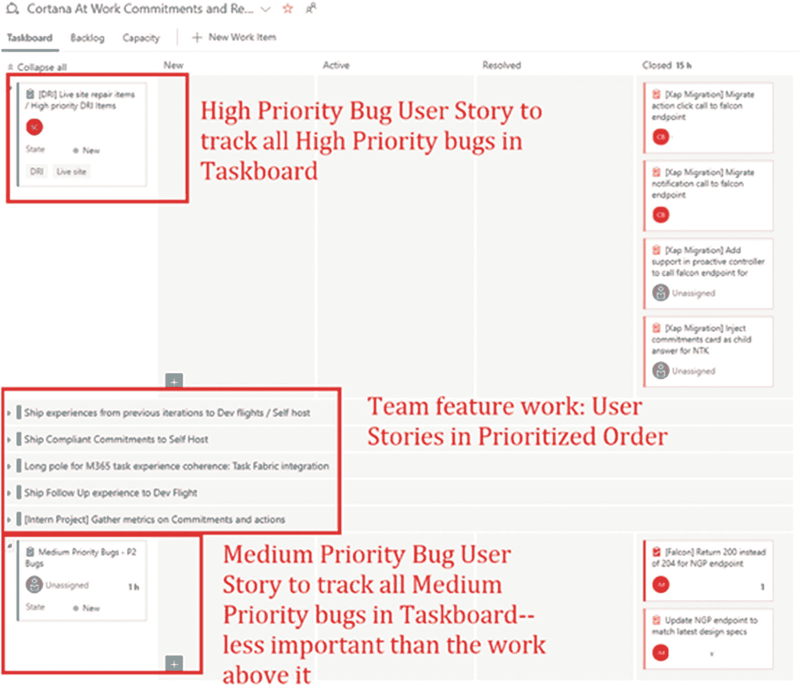
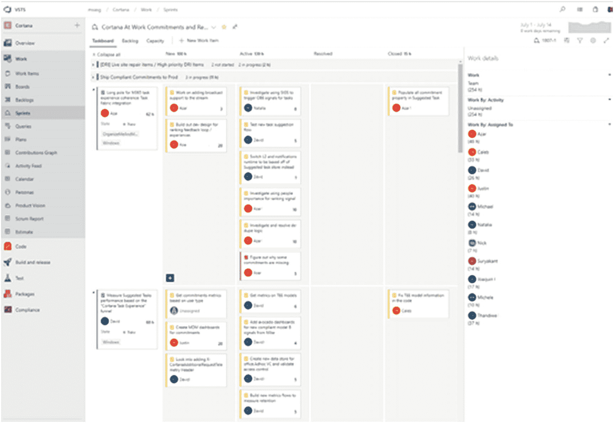
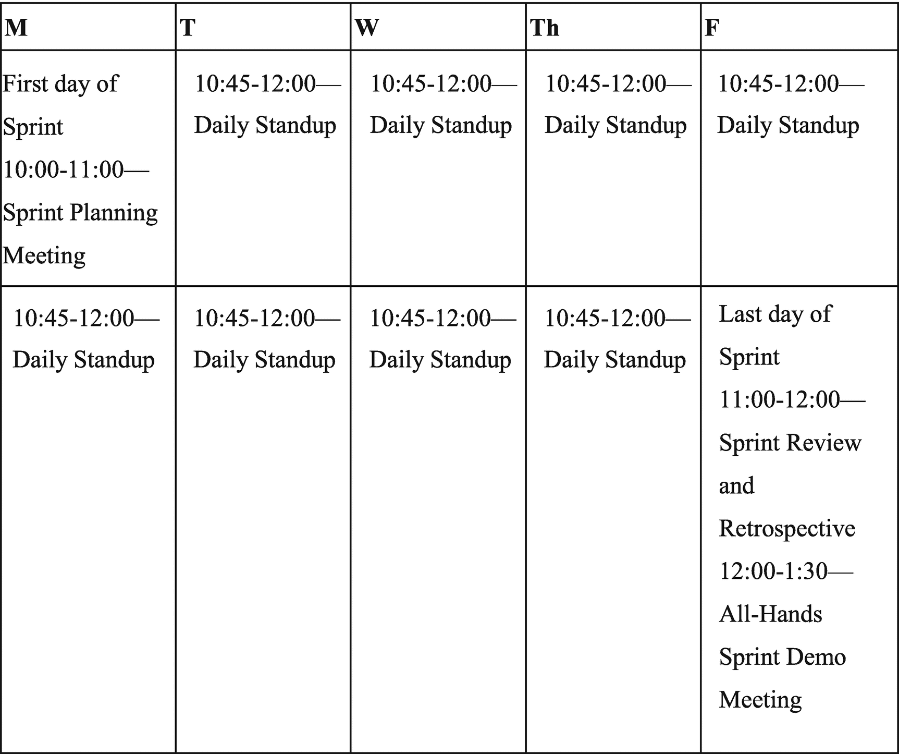
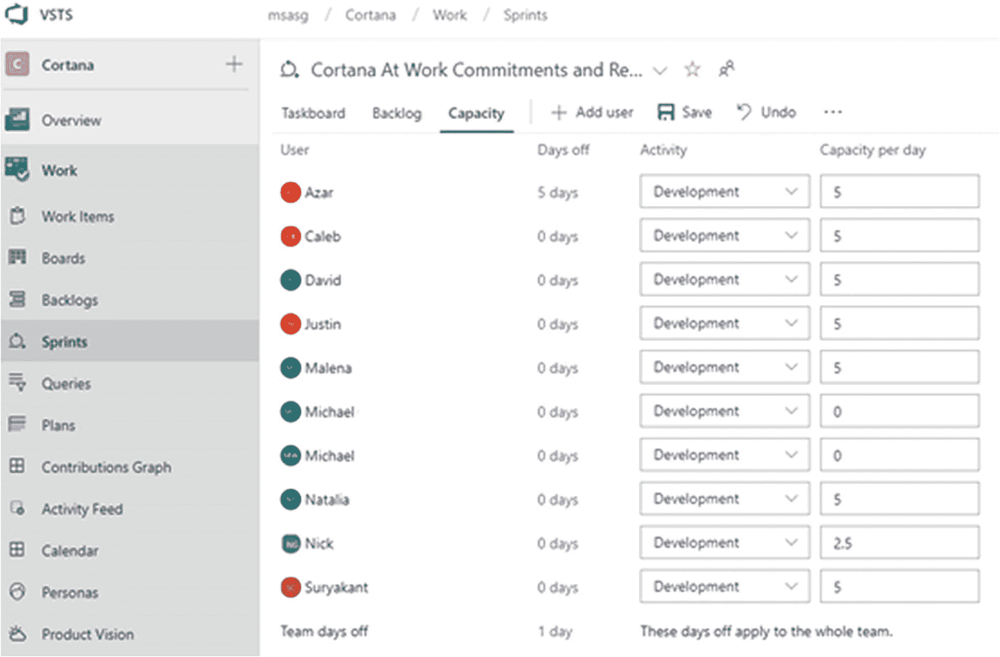

# 四、与业务保持一致

> ***业务人员和开发人员*** *必须一起工作* ***日常*** *整个 project.—agilemanifesto.org/principles*

Ciao 是一家价格比较和产品评论网站，成立于德国，到 2008 年，它已成为许多欧洲市场的顶级购物网站(如图 [4-1](#Fig1) 所示)，在欧洲每月吸引 1960 万独立访问者。微软于 2008 年收购 Ciao，以支持其在欧洲的必应搜索引擎。在微软收购后，Eric 有机会作为新的工程经理与 Ciao 团队一起工作。Eric 观察到的是一个与业务非常一致的开发团队——比他在之前的工作中观察到的大多数微软团队更加一致。有许多因素允许这种高度的一致。在这一章中，我们将研究让 Ciao 成功的几个因素。

图 4-1

2012 年 Ciao 网站的英文版

## 日常的重要性

在微软工作了 10 年后，Eric 来到 Ciao 工作，最让他震惊的可能是，业务人员和工程人员都在同一栋大楼里，甚至经常在同一层楼。软件开发人员会去厨房用微波炉加热他们的午餐；在同一个厨房里，他们会遇到为网站销售广告的人、为网站创建内容的人、营销网站的人以及维护托管网站的服务器的人。推动业务发展的人实际上与编写业务运行代码的人肩并肩。相比之下，在埃里克在微软的时候，他从来没有遇到过一个营销人员，一个为产品写内容的人，或者一个主持产品的人。

Ciao 的这种肩并肩并没有在午餐室结束。对网站上的广告系统有问题的商务人士会到工程团队的日常讨论中来解释他们的问题或提出改进意见。软件开发人员可以走到使用内容标签系统有困难的人的办公桌前，他们会观察挑战是什么，通常他们会带着改进或修复的具体想法回到他们的办公桌。

为了本章的目的，让我们进一步考虑谁是 Ciao 网站的“客户”，谁是“业务人员”有三种类型的顾客。首先，最大的顾客群是那些来网站搜索他们想买的东西并找到最低价格的人。第二个客户群体是评论社区:人们来到网站留下评论，这是由声誉和对有用评论的金钱奖励进一步推动的。最后一个客户群是商家——有产品要卖的第三方卖家，他们希望自己的价格列在网站上，并有一个链接指向他们的网站，客户最终会在那里购买他们正在购买的产品。

Ciao 的业务人员都是非工程人员，他们支持三个客户群的需求，保持网站运行，保持资金流入，并保持业务向前发展。在 Ciao，这包括以下内容:

*   销售人员说服商家在网站上列出他们的价格，然后用工具支持商家定期轻松上传他们的价格数据

*   编辑和修改人们能买到的所有东西的目录的人

*   负责管理评审社区并确保他们充满活力和欣欣向荣的社区人员

*   与其他公司一起组织特别活动的营销人员——例如，他们与某些汽车制造商一起开展活动，让 Ciao 成员试驾并评估特定年份推出的新车型

*   计费和财务人员，他们确保在网站上列出价格的商家为重定向到他们网站的流量付费

*   SEO(搜索引擎优化)确保网站从流行的搜索引擎获得稳定增长的流量的人

*   确保数据中心正常运行的运营人员

相比之下，Eric 在微软的经历与他在微软工作的产品中扮演类似角色的业务人员更加分离。在微软，“项目经理”的角色与业务人员互动，然后将他们的需求转化为对工程团队的要求。通过项目管理(PM)团队，Eric 将间接获得代表许多业务人员希望在 Visual Studio 产品中发生什么的指导。这种级别的间接性对于业务和开发都很方便，但是它也使业务人员与作为工程经理的他有了另一种程度的分离。

### 每日运输的力量

Eric 在 Ciao 与业务中的其他工作人员进行日常互动时所经历的颠簸，因他从世界上最大的 Windows C++应用(Visual Studio)之一(每隔几年才发布一次)转向通过 Web 交付并每隔几天更新一次的应用而进一步加速。能够为 Web 构建一个功能并在第二天发布以查看人们是否喜欢该功能的即时性对于理解业务和业务的客户具有惊人的意义。在 Visual Studio 中，一个特性会被开发几年，最后发布；尽管一年中经常向客户咨询和演示，但 Visual Studio 经常会发布一个客户不喜欢或不使用的特性。然而，在 Web 上，这个周期大大缩短了，功能可以在几周而不是几年内逐步发布，并且功能的业务影响可以立即测量和量化。在 Bing 中，我们甚至走得更远——由于将一个新的更改发送给少数用户，以及一个可以对系统的任何更改进行广泛测试的系统相结合，更改每天都会发送。

## 主机代管的优势

让我们列举一下让 Ciao 的业务人员和工程人员在同一楼层的一些优势，以及即使建筑空间和人员位置不允许真正的同处一地，也可以复制这些优势的一些方法。

第一个优势是，当某个特定月份的业务进展顺利，销售良好，流量增加时，工程团队会沉浸在业务人员的良好氛围和兴奋中，这无疑会对士气产生影响。对于工程团队来说，成功的一个月可能非常具有激励性，尤其是当他们看到他们所做的工作和企业所取得的收益之间的直接联系时。在事情进展不顺利的一个月里，开发者也能感受到这一点也是有益的。通常在那些不景气的月份，业务人员和工程人员之间会进行自发的对话，从而产生新的功能想法或对网站的改进，以解决销售疲软、流量下降或客户投诉等问题。

重要的是要找到方法来帮助工程师们感觉到他们的工作和它对业务的影响之间的某种关联。一个好的做法是每月进行一次业务回顾，检查业务的关键数字。可以报告的包括月环比变化的一些数字如下:

*   网站的总访问量、页面浏览量和独立访问者

*   有机访问与搜索引擎营销访问

*   参与度(用户离开网站前浏览的页面数量)

*   现场时间/每次访问时间

*   应用的下载次数(如果是业务的一部分)

*   月活跃用户(mau，在过去 30 天内与网站有过一些有意义互动的独立用户)

*   月活跃用户(MEUs，比月活跃用户更活跃的独立用户——这些代表你的粉丝，通常是你的活跃用户的一小部分)

*   留存数字(每月持续不断地进来的独立用户和每月不断流失的独立用户)

*   每月总收入

*   运营指标——在 Ciao，这包括网站上列出了多少商家，网站上有多少优惠(特定产品的唯一商家价格)，网站上有多少产品，以及网站上有多少评论

*   可用性指标–在过去的一个月中，该站点经历了多长时间的停机，在哪里

*   竞争对手比较指标——网站比主要竞争对手好/差多少

*   康姆斯克指标(康姆斯克是一个衡量网站受欢迎程度和流量的网站)

*   与当前推动的业务目标密切相关的任何其他指标

有许多方法可以将这些类型的业务度量和内容交付给开发人员。我们看到的一些成功的方法包括作为开发团队的可选会议进行的每月业务回顾，以及通过每月电子邮件发送的业务信息，这些信息可以在始终最新的自助仪表板中获得，或者在全体会议上呈现。由于开发团队通常更喜欢构建产品，而不是阅读邮件或参加更长的会议，我们也建议在 sprint 结束演示会议上简要总结业务指标。有多种方式向团队传达这一信息以确保其被接收是非常值得的。

### 不要求物理搭配

当然，身体上的搭配并不总是可行的。第 [6](06.html) 章:有效沟通谈到了面对面交流的敏捷原则，并为真正的物理共处不可行时提供了一些思路。

## 业务驱动的 Scrum 团队

Ciao 非常擅长的一件事是将 scrum 团队直接映射到关键业务目标。概括地说，业务目标如下:

*   增加网站的访问量。

*   通过提高网站的转换率(离开网站到商家网站的流量百分比，这意味着 Ciao 的收入)，尽可能多地将流量货币化。

Ciao 的主要业务目标如下:

*   提高产品目录的规模和质量。

*   增加网站上商家提供的优惠数量，并将这些优惠与我们目录中的商品相匹配。

*   增加用户在网站上撰写的高质量评论的数量。

这五个业务目标被直接映射到五个 scrum 团队。团队“流量”不断地监控网站的流量，并做开发工作来增加网站的流量。团队“转换率”不断监控网站的转换率，并努力提高该比率。“产品”团队改进了目录的质量和规模。“报价”团队提高了网站上产品报价的数量和匹配率。“评论”团队找到了新的方法来激励和提高评论的质量以及网站上评论作者社区的参与度。

有时一个团队追求的目标和度量标准会从根本上反对另一个团队追求的目标。例如，产品团队有时会发布一些功能，这些功能会增加用户在网站上的停留时间，但会减少离开网站转到我们的商业网站的点击次数。产品团队正在实现他们提高目录质量和丰富度的目标，因此人们更多地参与到内容中，但他们并没有很快或有时根本没有去商业网站购买影响转化率团队的东西。当一个团队交付的工作对另一个团队的目标和指标有影响时，将咨询业务领导来决定哪个优先级胜出。

在创建 scrum 团队时，要记住几件事。首先，试着找到将 scrum 团队尽可能紧密地与业务目标联系起来的方法，并且尽可能容易地定期测量业务度量。如果像“转换率”这样的直接的日常业务指标对于一个特定的 scrum 团队的指标驱动的目标来说是不可计算的，那么尝试找出一种方法来量化和评估团队驱动的目标。让一个 scrum 团队拥有一套他们可以持续监控的度量标准，检查他们的工作是否移动了度量标准，以及是否直到它移动了度量标准才重新评估他们的工作，这是非常有效的。团队应该为每一次冲刺设定他们认为在每一次冲刺中他们能够推动的业务度量的目标。

表 [4-1](#Tab1) 显示了一些具体的业务指标的例子，我们在书中已经讨论过的一些团队中使用了这些指标。您可以在该列表中看到计算的和判断的指标。计算出的指标可以很容易地从系统中的数据计算出来。判断的指标更昂贵，因为它们需要人类法官查看数据来计算它们——这也使得它们不能像计算的指标那样经常被计算。

表 4-1

具体的业务指标

<colgroup><col class="tcol1 align-left"> <col class="tcol2 align-left"> <col class="tcol3 align-left"></colgroup> 
| 

组

 | 

韵律学

 | 

度量的类型

 |
| --- | --- | --- |
| 本地数据合并团队 | 优势率不匹配率 | 评判(每周)评判(每周) |
| 本地数据网络提取团队 | 从网上提取的前 1000 家连锁企业的百分比通过从网络上提取的数据显示企业的网站流量百分比从网上提取的电话号码的准确性从网上提取的有电话号码的企业的百分比 | 从目录计算 |
| 本地数据管道团队 | 从提要中出现新数据到在网站上显示新数据只需几秒钟 | 根据目录和站点计算 |
| Ciao 交通小组 | 每月独立用户的数量 | 从站点计算 |
| Ciao 产品团队 | 有图片的产品数量有评论的产品数量产品图片匹配的准确性产品评论匹配的准确性 | 从目录计算 |
| Ciao 提供团队 | 商家网站的点击数具有相关商家价格的产品数量 | 从站点计算 |
| Ciao 社区和审核团队 | 上个月发布了被其他社区成员认为有帮助的评论的社区成员数量 | 从站点计算 |

由于度量是由每个团队决定的，所以要找到自动化度量的方法。如果可能的话，每天跟踪它们，并维护一个仪表板，团队成员可以在其中观察度量是否朝着正确的方向发展。

### 命名团队的力量

另一个对团队非常有用的工具是如何命名团队。Eric 所在的团队在他们的产品上有两个主要问题。首先，它没有正确地支持许多用户和大量数据。第二，开发人员为产品构建新功能时，会苦读现有的代码和复杂的 API，从而降低了发布新功能的速度。团队最初的名字反映了他们在产品中拥有的子系统。例如，“图形”团队拥有产品的图形引擎。“布局”团队拥有产品的布局引擎。不出所料，名为“Graphics”的团队花费了大量工作来调整和继续改进图形引擎，布局团队也对他们的布局引擎做了同样的事情。通过将团队重命名为“Scale”团队和“Velocity”团队，团队的工作产出自然会发生变化，以与团队总体上最重要的问题保持一致，而不是与团队架构图中的架构块保持一致。

如果可能的话，最好有一个统一的度量标准，整个团队最终都明白这是他们努力的方向。对于网络资产，我们已经看到这个数字通常是月活跃用户数——这个数字持续上升吗？在移动应用团队中，App Store 评分和每月活跃用户数被视为最重要的推动因素。对于必应的本地数据团队，我们想得最多的数字是“Q”——本地企业目录的综合质量分数。但这个数字有些缺陷，因为它假设仅仅一个高度准确的目录就会推动产品的使用——随着时间的推移，我们发现这个指标不能很好地保持，因为它与 Bing 上的真实用户体验相差太多。即使有了高质量的目录，仍然有许多关于如何以及何时将目录呈现给用户的问题，这使得 Q 不能完美地反映用户对网站上本地业务数据的体验。

## 与企业合作了解数据

我们在 Bing 本地搜索上最有成效的一次经历是拜访了一些数据提供商，他们为我们提供数据，我们将这些数据组合在一起，创建了企业目录。通过与为我们收集数据的业务人员交谈，它提供了重要的见解，使我们能够了解我们所依赖的数据馈送，并建立更好的机器学习模型来处理和优先处理数据。

在 Bing Local 的早期，我们去参观了一个主要数据源的总部，这个数据源用于创建我们的目录。我们研究了他们的数据，觉得这导致了很多质量问题，特别是，它创造了很多重复的业务。我们与工程团队讨论了他们的重复数据消除系统，很快就发现他们使用的系统非常原始。此外，一位工程负责人指出，因为他们数据的主要客户是通过美国邮政系统向其他企业发送邮件的公司，所以“有副本通常是件好事”，因为向一家受欢迎的企业发送几封额外的邮件(他们目录中更受欢迎的企业更有可能有副本)并不是一件坏事，因为这将增加您的营销邮件被受欢迎的企业打开的机会。

另一家数据提供商为我们提供了大量关闭的业务。通过与该提供商进行更密切的交谈并了解他们如何获取记录，我们了解到他们数据的一个主要来源是使用 OCR 扫描电话簿。在一些市场，他们的扫描没有其他市场及时。在他们的后端系统中，他们维护了每条记录被扫描的日期，但他们没有在提要中提供该数据。通过与业务人员和工程师交谈，我们很快发现，他们向我们提供他们系统中由 OCR 获得的每条记录的扫描日期是相对简单的。这提供了一个有价值的额外信号，我们的机器学习模型可以用来确定特定业务关闭的可能性。

### 数据提供者

与提供您数据的第三方交谈，确保您了解他们收集数据的方式和他们的商业模式。数据提供商通常愿意为您提供他们后端系统中可能有的额外信号，但不会在他们的 feed 中提供给您。

## 帮助企业理解机器学习的局限性

对于一个以基于机器学习的解决方案起步的企业来说，期望开发团队创造奇迹是很常见的。虽然机器学习可以产生惊人的结果，但确保企业了解机器学习的局限性是有帮助的。我们与商业人士一起面临的最艰难的挑战之一是帮助他们理解特定机器学习模型的功能特征。

虽然有许多衡量标准可用于评估特定的机器学习模型，如 F1 分数，但我们通常使用精确度和召回率作为与企业沟通机器学习模型性能的指标。这里有一个快速复习，应该去神秘化精度和回忆。

想象一个场景，一个捕狗人的任务是外出捕捉城市里所有的狗。捕狗者未能完美地做到这一点，除了没有捕获城市中所有的狗之外，还意外地捕获了一些猫。图 [4-2](#Fig2) 显示了这个故事如何映射到机器学习的精度和召回概念。如果每个狗或猫的图标代表 1000 只狗或猫，抓狗人抓了 2000 只狗和 3000 只猫——但实际上这个城市有 7000 只狗。捕狗者抓到 3000 只假阳性(猫)和 2000 只真阳性(狗)。因此，捕捉的精确度是被捕捉的狗的数量除以被错误捕捉的猫的数量加上被捕捉的狗的数量，即 2000/3000+2000，即 40%。召回数量是被捕获的狗的数量除以被捕获的狗的数量加上未被捕获的剩余狗的数量或者 2000/2000+5000，大约是 29%。

图 4-2

捕狗器的精确度和召回率

随着企业开始了解各种虚拟捕狗器模型的精确度和召回率，并熟悉如何讨论精确度和召回率术语，您可以开始与他们就特定模型的表现进行细致入微的讨论。例如，随着时间的推移，业务人员将会认识到，通常不可能有精度或召回率接近 100%的模型。一个具有 95%准确率和 95%召回率的模型通常需要付出巨大的努力才能实现。即使是 99%精度的模型听起来也很棒，但这意味着每 100 次中有 1 次你会得到错误的答案。还有，如果那个型号的召回率是 1%，那可就没用了。现实和完美之间的这种差距是机器学习团队面临的持续挑战——企业必须有一个计划来应对算法出错的情况。

在本地数据的世界中，我们处理了模型实现高精度和高召回率的现实，但在几个方面都不是 100%。首先，我们建立了一个系统，它可以很容易地用手快速纠正在网站上发现的任何错误，这样当机器学习的模型出错时，它们就可以被覆盖。我们还把人放在循环中，特别是在最有可能显示给用户的数据上。我们发现，尽管我们的本地企业目录中有数百万个美国市场的企业，但人们在我们网站上实际搜索的 20%是一组 50，000 个实体——网站上最受欢迎的本地企业。对于这 50，000 个实体，我们使用机器学习算法来创建它们，但我们也使用人工检查和反复检查它们，以确保它们 100%正确，而不是 98%正确，因为这对整体用户体验有很大影响，因为它影响了我们 20%的流量。

我们发现的另一件事是，经常与业务部门讨论诸如“封闭业务分类器的精度现在是 97%，召回率是 85%”这样的事情是有用的，因为随着时间的推移，业务部门会知道在给定的几个月的开发中期望精度和召回率提高是多么合理。企业将了解到，移动精度所需的工作类型通常不同于移动召回所需的工作类型。他们将学会权衡召回率和精确度的能力——例如，牺牲精确度来提高召回率是相当容易实现的。他们将了解到，随着模型在 90 年代开始变得精确并在 90 年代被回忆起来，未来的发展将会更加昂贵。

### 强大竞争对手的好处

我们在 Bing 本地空间的一个优势是，除了报告我们自己的模型的精确度和召回率，我们还可以评估竞争对手的精确度和召回率。当设定超过 6 个月的目标时，我们经常使用“差距减半”规则，这被证明是设定目标的一个有用的经验法则。在我们落后于竞争对手的领域，例如，我们可能测得 Google 的电话号码准确率为 98%，Bing 的电话号码准确率为 94%，我们发现计划在 6 个月内将与 Google 的差距减半是合理的，这意味着我们发现如果我们有另一个竞争对手比我们实现更高准确率的“存在证据”,我们可以设定一个从 94%到 96%的目标。在真空中，这更难做到，因为如果没有现有技术表明有可能达到那么高的精度水平，您真的不知道在特定数据属性上达到 98%精度的可能性有多大。

## 向企业传达工程的节奏:我们如何做 Scrum

正如工程团队了解业务中发生的事情很重要一样，业务部门了解工程团队中发生的事情也很重要。如果做不到这一点，可能会导致企业对工程团队及时解决关键业务问题的能力失去信心。我们使用 Scrum 和 Scrum 工件与业务进行有效的沟通。在这一节中，我们将更详细地描述我们对 Scrum 所做的专门化。本节假设你对 Scrum 的一般原理有基本的了解。如果你不熟悉 Scrum，我们推荐在 [`www.scrum.org/scrum-guides/`](http://www.scrum.org/scrum-guides/) 找到的 Ken Schwaber 和 Jeff Sutherland 的 Scrum Guide 和在 [`www.infoq.com/minibooks/scrum-xp-from-the-trenches`](http://www.infoq.com/minibooks/scrum-xp-from-the-trenches) 找到的 Henrik Knibert 的 *Scrum 和 XP from the Trenches】。*

### Scrum 团队

对于我们在微软的团队来说，产品负责人通常是项目经理或架构师。scrum 大师是开发经理或领导，或者是开发团队中热衷于推动 scrum 并帮助团队成功的人。无论 scrum 大师是谁，他们都应该意识到，他们不能被安排满负荷地进行编码工作——他们需要每天花一些额外的时间帮助人们疏通障碍，并保持积压工作整洁。

### 组合和产品积压

Azure DevOps 提供了对史诗和特性的 scrum 概念的支持。这些主要是帮助业务团队或产品所有者管理产品计划的业务概念。史诗和特写有时被称为“项目组合积压”特性应该足够大，以支持许多用户故事与它们相关联——一个用户故事是开发团队在所谓的“产品 backlog”中使用的主要概念这些关系如图 [4-3](#Fig3) 所示。

一般来说，史诗超越了多个版本，可以被一个团队追求多个季度(一年的 1/4 段)。特性通常不能在一个 sprint 中交付，但是可以在一个产品发布周期中交付。一个五到七人的团队可以在一个 sprint 中完成多个用户故事，但是有时一个用户故事可以跨越多个 sprint。特性和用户故事之间的联系是业务驱动的“项目组合积压”和开发驱动的“产品积压”之间的桥梁

Scrum 团队通常只会在 sprint 计划或 sprint 评审会议上讨论特性，他们会试图弄清楚一个特性是否完整，以及为了完成一个给定的特性还需要计划哪些额外的用户故事。

图 4-3

项目组合积压和产品积压的关系。来源: [`https://docs.microsoft.com/en-us/azure/devops/boards/work-items/guidance/agile-process-workflow`](https://docs.microsoft.com/en-us/azure/devops/boards/work-items/guidance/agile-process-workflow)

表 [4-2](#Tab2) 显示了一些史诗、功能、用户故事和任务的具体示例，以及一个假设团队的典型持续时间和每个父类型的典型数量，该团队致力于允许用户在 Bing 中搜索 Office 365 内容(文档、联系人、电子邮件、日历)。

表 4-2

史诗、特性、用户故事和任务

<colgroup><col class="tcol1 align-left"> <col class="tcol2 align-left"> <col class="tcol3 align-left"> <col class="tcol4 align-left"></colgroup> 
| 

概念

 | 

例子

 | 

典型持续时间

 | 

每个父母的典型数量

 |
| --- | --- | --- | --- |
| 史诗 | 允许用户在 Bing 中搜索他们的 Office 365 数据 | 多次发布(季度) | 五到十个主要版本的史诗 |
| 特征 | 允许用户在 Bing 中搜索他们的 Office 365 联系人 | 发布(月) | 一部史诗中有五十到数百个特征 |
| 用户故事 | 构建允许用户浏览其 Office 365 联系人的体验 | 短跑(一到三次短跑) | 几十个用户故事来完成一个功能 |
| 工作 | 编写代码以从 Office 365 图形中获取联系人 XML | 几天(一到五天左右) | 每个用户故事有几十个任务 |

我们的产品 backlog 由 Azure DevOps“用户故事”组成，如图 [4-4](#Fig4) 所示，这些“用户故事”又被分解成任务。产品 backlog 记录了团队想要做的所有事情。sprint backlog(在 Azure DevOps 中位于“sprints”之下，然后是“backlog ”)显示了 sprint backlog。sprint backlog 是作为 sprint 规划会议的一部分创建的，理想情况下，可以从查看产品 backlog 中优先级最高的用户故事(在 Azure DevOps 中，在“工作”下，然后在“backlog”下)中提取，并按优先级顺序将它们添加到下一个 sprint 中，直到 sprint 完成。

图 4-4

Azure DevOps 用户案例积压示例

产品待办事项中的用户故事不应该太多。根据经验，它们应该在一周内完成，但最多在三次两周冲刺内完成。作为对你的用户故事的粒度是否正确的评估，一个典型的五到六人的 scrum 团队应该能够在一次 sprint 中承担大约七个用户故事。这当然会有所不同，但是要努力让用户故事不要太大也不要太小。

### 吉拉和其他驱动 Scrum 的模型

尽管本节将 Azure DevOps 描述为一个在其中驱动 scrum 的环境，但是所有这些原则在吉拉内部也是有效的，Eric 在 Ciao 时广泛使用了这些原则。同样值得一提的是，其中大部分可以在基于纸张的系统中工作，该系统是在物理板上完成的。前面提到的《战壕》一书中的 Scrum 和 XP 描述了一个基于纸张的系统。我们也这样做了，尽管根据业务人员所在的位置，您可能需要每天拍摄物理板的照片或转录关键信息，并定期通过电子邮件发送出去，以告知业务部门您的进展。

用户故事可以从一个 sprint 延续到另一个 sprint——但是如果可能的话，它们应该在少量的 sprint 中完成，最好是一次。如果用户故事太大，无法在少量的 sprints 中完成，这是一个好的迹象，表明它们应该被进一步分解。寻找包含“和”的用户故事名称——这是一个好迹象，表明用户故事应该分成两部分。

### 积压清理

管理产品积压的最佳实践是经常“清理”积压。擦洗包括不断地查看产品 backlog 上的前“十个”用户故事，并确保它们被正确地划分了优先级并得到了很好的描述。一些团队安排每周或每两周一次的会议来清理积压——这可以帮助 sprint 计划会议进行得更快。

### 用户故事

图 4-5 显示了 Azure DevOps 中的一个用户案例。

图 4-5

Azure DevOps 中的一个用户案例

用户故事可以有选择地与一个特性相关联——这将“产品待办事项”与“项目组合待办事项”联系起来，并帮助项目管理团队跟踪他们在项目组合待办事项领域的进展。任何人都可以创建用户故事，但是只有产品负责人设置优先级，只有开发团队评估规模，并将用户故事添加到 sprint 中。

用户故事有许多字段，包括以下内容:

*   特性反向链接:这表明这个故事是为项目组合 backlog 中的哪个特性实现的。如果一个用户故事与一个特性没有联系，这是不需要的——例如，scrum 团队可能决定在它自己的开发人员工具或 DRI 工具上做一些工作，如果 PM 团队不真正关心它，这就不必成为一个特性的父级。

*   ID:唯一的标识，只是一个自动递增的数字。这是为了避免在我们重命名故事时丢失它们的踪迹。

*   名称:故事的简短描述性名称。这个名字应该足够具体，让开发人员和产品负责人能够大致理解我们正在谈论的内容，并且足够清晰，以便与其他故事区分开来。

### 命名用户故事

因为我们鼓励业务团队查看 scrum 板，所以至少以业务中任何人都可以理解的方式编写用户故事名称和描述是很重要的，避免使用行话，并描述我们试图实现的业务结果。因此，与其有一个用户故事说“生成更好的 n 元语法来改变匹配函数以提高匹配率”，我们不如把它写成“通过更好的词分离来减少重复业务的数量。”用户故事下的任务可以而且应该是技术性的，使用行话，因为它们是 scrum 团队跟踪自身的方式——业务团队从任务中收集的唯一重要信息是谁在处理用户故事，还有多少工作要做，以及已经完成了多少工作。

*   描述:在许多情况下，可能只是名称，或者是用户故事的更详细的解释。同样，这需要用团队以外的人能理解的语言来写。

*   商业价值:产品所有者对这个故事的重要性评级。在 Azure DevOps 中，您可以通过拖动用户故事在 backlog 中上下垂直移动来表明这一点。

*   故事点:单位是故事点，对于我们的团队来说，这大致相当于“典型的人-日”问团队，“如果你能为这个故事找到最佳的人数(不要太少也不要太多，通常是两个)，他们有一个典型的被打断的一天和会议，他们可能有大约 5 个小时在流编码中，几天后你会拿出一个完成的、可演示的、测试的、可发布的实现？”如果答案是“三个人大约需要 4 天”，那么最初的估计是 12 个故事点。

*   一旦你对用户故事有了一个初始的故事点估计，你就不用再担心它了。这是您最初的“最佳猜测”,主要用于 sprint 规划期间，以估计您可以在给定的 sprint 中加载多少用户故事。一旦 sprint 开始了，对用户故事成本的跟踪就从故事点转移到将用户故事分解成以理想开发时间计算成本的任务(我们在我们的团队中假设一个开发人员每天可以做 5 个小时的工作，包括中断、会议、分心等。)

### 故事要点

对于 scrum 纯粹主义者来说，我们对故事点的掺杂可能是令人不快的。故事点的工作方式应该是团队随着时间的推移了解他们在一次迭代中可以实现多少故事点，并且单元是灵活的，团队可以很好地了解一个十层的点工作项目有多少工作量。但是我们发现这在实践中很难用在有几个不同 scrum 团队的大型团队中——也很难向企业解释“团队 A 的故事点大小不同于团队 B 的故事点大小”因此，在实践中，我们不能让故事点成为灵活的单位，而是退回到“一个故事点是一个典型的人工工作日”和“当你进行任务分解时，你可以一天做 5 个小时的工作。”

*   接受标准或“如何演示(HTD)”:这是一个在 sprint 演示会议上如何演示这个故事的高级描述。这本质上是一个简单的测试规范。“这样做，然后这样做，然后这应该发生。”使用 TDD(测试驱动开发)，这个描述可以作为你的验收测试代码的伪代码。这通常放在“验收标准”字段中，但也可以放在描述中——只需标记“HTD”即可。

*   用户故事可以分配给某人——通常是对故事最了解的人，他可以回答外部人员提出的关于故事的问题。但是实际上，很多用户故事从来没有分配给任何人。这很好，因为用户故事中真正的“工作”是由任务跟踪的，并且任务总是被分配给单独的开发人员。因此，如果用户故事没有被分配，你可以在任务板上看到所有的开发人员，因为通常会有多个任务，上面有不同的开发人员。

### 任务

图 [4-6](#Fig6) 显示了一个与用户故事相关的任务。任务可以是非常轻量级的，通常只捕获这些元素:标题、分配给、剩余时间、状态(新/活动/完成)以及“这与哪个用户故事相关联。”任务用于协调用户故事中谁在做什么，并将用户故事分解成完成该故事所需的逻辑任务。我们不使用“估计”字段。描述可以被用来捕获额外的细节——但是只有当它对开发人员工作有用的时候。大多数情况下，开发人员将任务仅仅作为他们必须编码的工作的一个简单的“TODO ”,并且大多数情况下，他们从任务描述中理解工作。在这里，我们不关心业务人员是否能够阅读任务——任务的客户是处理该任务的开发人员。

我们以这种方式使用剩余时间字段:当一个任务第一次被分配给一个开发人员来处理时(这都是在每日站立会议或 sprint 计划会议中完成的)，开发人员会快速估计它在几个小时内有多少工作——例如，开发人员可能会说，“这可能需要 10 个小时”(例如，2 个开发日)。这个初始估计应该放在“剩余时间”字段，而不是“估计”字段。然后，在随后的每日例会上，每个有活动任务的开发人员都会重新估计每个活动任务的剩余时间——例如，“这个任务看起来还剩下 10 个小时；它比我想象的要大”或者“这个任务只剩下 3 个小时了；这比我想象的要简单”，或者“该任务已经完成”，在这种情况下，该任务只是被移动到“完成”列。

下面的示例任务说明了用户故事中的第一个任务通常是指派该领域的专家来“创建一个如何交付该用户故事的计划”

图 4-6

简单的任务

#### 链接到 Git 中的拉请求的任务

在微软，我们使用 Git 作为我们的版本控制系统。跟踪导致任务完成的拉取请求是很有价值的。当开发人员发出拉请求时，他或她可以在该拉请求中指定一旦该拉请求被合并就完成的所有任务。这允许审计人员在将来将我们的积压工作与开发工作联系起来。

#### 疯狂的

任何用户故事都可以有一个 bug，如图 4-7 所示。当一个 bug 是根据一个用户故事创建的，这个 bug 几乎总是优先于这个用户故事中的其他任务。原则是在推进用户故事的状态之前修复现有的 bug。

图 4-7

用户故事可以与任务和错误相关联

如果存在针对已经发布的用户故事的 P0(优先级 0)错误，这些应该立即引入到 sprint 中——它们被认为是 sprint 破坏者。如果可能的话，已经发布的用户故事应该添加一个 bug，然后转移到 sprint 的当前迭代路径中——但是在实践中这通常不会发生。我们将在下面描述看起来更有效的方法。当 scrum 团队进行日常工作时，他们应该寻找这些新的高优先级的 bug，并立即将工作安排到 sprint 中来修复它们。

优先级较低的错误应该在下一次 sprint 计划会议中考虑，如果它们被认为是在后续 sprint 中需要修复的关键问题，那么就把它们带到 sprint 中。

一旦项目开始运行，就很难在已经发布的用户故事中添加 bug。因此，我们看到团队通常使用的方法是他们在 sprint 中创建“高优先级错误”、“中优先级错误”和“低优先级错误”用户故事，如图 [4-8](#Fig8) 所示。然后，他们将进来的 bug 与这三个用户故事中的一个联系起来，并适当地确定工作的优先级——例如，他们首先尝试完成高优先级的 bug，然后是高优先级的用户故事，然后是中优先级的 bug，然后是中优先级的用户故事，等等。

图 4-8

在 Azure DevOps 任务板中跟踪 bug

### 不符合故事情节的任务

有时你会遇到团队正在做的工作不适合现有的用户故事。这很好——工作仍然应该被跟踪(您可以创建一个包罗万象的“其他”用户故事来捕获它)。通过捕获团队所做的所有工作，团队可以更清楚地知道“这个冲刺的时间去了哪里”；在随后的 sprint 计划会议中，他们可能会为“其他”工作确定一个主题，从而创建一个新的用户故事来跟踪它。例如，一个团队可能会发现他们花费了大量额外的时间来修复构建。当他们看到花费在 sprint 上的时间超过 sprint 时，他们可能会决定深入修复错误。或者，他们可能只是不断地安排一个占据五个故事点的“其他”项目(如果其他项目通常占据一周的开发时间)，这样他们就可以更现实地了解他们在给定的 sprint 中可以实现什么。

#### Scrum 任务板

Azure DevOps 中的 Scrum task board(sprints 下的 task board，而不是“Boards”下的“Board”)是团队查看团队正在进行的所有工作的状态的地方。您可以将任务板配置为根据分配给他们的开发人员来过滤任务。在 sprint 规划会议期间，产品 backlog 中的顶级用户故事被分配故事点；基于团队已经知道他们可以为一个 sprint 提交多少故事点，团队将产品待办事项中优先级最高的故事带入新的 sprint 待办事项中。一旦故事进入冲刺阶段，团队就通过将每个故事分解成任务来进一步细化它们(最初的故事点评估将被忽略，但可以在以后观察，以了解团队在最初评估时的表现)。

通过单击任务板中用户情景右侧的“+”按钮，可以轻松地将任务添加到用户情景中。当任务被水平地从“新”列拖到“活动”列时，它们开始流动。当任务被移动到活动列时，它们总是被分配一个开发者，并且总是被分配一个以小时为单位的“剩余时间”(其中 5 小时= 1 个开发者日)。“新”列中的任务可以预先分配给将要执行这些任务的开发人员，并预先计算成本，但这不是必需的，并且受 sprint 规划会议和 sprint standups 中可用时间的限制。

当任务完成时，当任务被验证为“完成”时，它们被水平拖动到“关闭”对于用户故事，我们不使用“已解决”列；是给虫子的。Scrum 任务板如图 [4-9](#Fig9) 所示。

注意，当一个 Bug 修复在 sprint backlog 中完成时,“已解决”列被用来代替“已关闭”列。当开发人员开始处理这个 Bug 时，它就被激活了。当 bug 被修复、测试、检入并部署到生产环境中时，它就被转移到“已解决”状态。最初打开 bug 的人应该验证该 bug 已经修复，然后将其转移到 Closed。

图 4-9

Scrum 任务板

我们使用 Azure DevOps 的任务板作为每个团队的单一状态页面。此页面包括一个燃尽图(位于右上角),当团队定期移动和更新他们的任务时，它会自动更新:当任务第一次移动到活动列时更新任务的剩余时间，此后每天更新活动任务的剩余时间，直到任务完成并移动到关闭列。

所有这些都有时间限制(敏捷术语的意思是在固定的时间内完成),不需要在会议之外进行任务更新。scrum master 是团队的仆人，帮助团队保持任务板的更新，这样就不会影响到他们以外的人。在每天的 sprint 会议上，scrum master 投影 scrum 仪表盘；每个参与者可以报告他们正在进行的工作项目的剩余时间，scrum master 在投影的同时更新所有活动的任务(更新右下角的剩余时间，通过垂直拖动分配新任务，通过水平拖动将任务标记为完成)。

### 剧本

对于我们的团队来说，我们通常会进行两周的冲刺。冲刺长度对于任何进行 scrum 的团队来说都是一个有争议的话题，我们发现我们在 2 周和 3 周冲刺之间争论。有 2 周的冲刺可以确保计划过程不会变得太繁重，并且在没有新一轮计划的情况下冲刺不会偏离轨道太远。

#### 两周的节奏

在我们的团队中，我们根据图 [4-10](#Fig10) 中的日历安排 Scrum 会议。这个具体的例子是一个五到七人的团队——我们希望确保其他兄弟团队的日常会议时间不重叠，以便在任何特定的一天，业务中感兴趣的一方都有可能参加整个团队的所有会议，以快速了解开发工作的进展。

图 4-10

Scrum 日历

#### 每日 Scrum 站立

每天的 Scrum“站立会议”将会被安排成两个站立会议不会同时进行。站立被限制在不超过 15 分钟。

每日站立在一个有投影仪或电视或 Surface Hub 的房间里完成，scrum master 投影 Azure DevOps 任务板。任务板依次显示，由会议中的每个开发人员筛选。房间里的每个开发人员都可以在回答 Scrum 问题“我昨天做了什么？”时引用他们的活动任务“我今天要做什么？”以及“我被屏蔽了吗？”然后，开发人员对每项任务说“该任务完成了”，在这种情况下，scrum master 立即将任务拖到 Closed 列，或者开发人员估计活动任务的剩余小时数(如果自从上次起立以来已经改变)，scrum master 立即更新任务的剩余时间(在任务的右下角)。

如果开发人员已经完成了所有活动任务，则将先前分配给开发人员但尚未开始的任务从“新”列拖到“活动”列，并且开发人员估计剩余的小时数。scrum master 将剩余的小时数放在任务的右下角。

或者，开发人员可能没有分配未开始的(也称为新的)任务，因此任务是从“新的”行或其他需要帮助的开发人员那里获取的。任何时候将任务移动到活动列中，必须将初始剩余时间放入任务中。

### 在 Standup 之外更新任务板

我们实际上要求我们的开发人员不要在每天的 scrum 站立会议之外更新任务板，因为任务板的更新(这个任务已经完成，这个任务现在剩余的时间更少了，我正在接受这个新任务)是与团队其他人的基本沟通，如果这种沟通发生在站立会议之外，那么每个开发人员的进度沟通对团队来说都是丢失的。

站立会议还应该用于对团队遇到的阻碍问题进行分类。除非这些问题可以很快解决，否则起立发言不应花太多时间讨论这些问题——记住 15 分钟的时间盒。如果一个问题需要更多的讨论，scrum master 会在当天晚些时候安排另一个时间与相关方讨论

#### 迭代结束会议

我们喜欢让我们所有的兄弟团队在同一天开始和停止他们的 sprints，我们将我们不同的五到七人兄弟团队的一些会议结合起来，以举行更大的演示会议。因此，对于一个由大约 50 名开发人员组成的典型团队，他们都在为同一个项目工作——例如，Bing 的本地数据团队——我们将有大约 6 个 scrum 团队，他们将一起参与一个联合的所有人参与的 sprint 演示。

##### 全手冲刺演示

在 sprint 的最后一个星期五，全体人员参加的 sprint 演示是一个 1.5 小时的会议。我们亲自参加这个会议，但是我们也记录会议，以便它作为 scrum 的另一个工件。全手冲刺演示的格式如下。

根据团队中开发人员的数量，每个团队都有时间限制——每个团队每个开发人员有 2 分钟时间。因此，如果一个团队有七个开发人员，他们有 14 分钟来演示，另一个有五个开发人员的团队有 10 分钟，以此类推。演示时间由 Eric 可怕的倒计时计时器严格计时，如图 [4-11](#Fig11) 所示。当时钟发出哔哔声时，发言的人完成他们的句子，并将会议移交给下一个团队。我们发现有必要设置一个计时器，以确保演示会议不会拖拖拉拉——设置计时器可以确保每个人都很准时，快速地展示他们的工作。

但是，如果有人在演示过程中提出问题或有疑问或意见，我们会让时间回到倒计时，因为我们不想阻止好的意见、问题或建议。scrum master 有权力在倒计时时返还时间，并建议将失控的讨论离线。

图 4-11

倒计时时钟–用于计时 sprint 演示会议

关于物流的一些话使这项工作——我们已经为多达 50 名开发人员的团队遵循了这个过程(会议持续了大约 1.5 小时，有六个不同的团队出席)。为了确保会议顺利进行，我们做了以下工作。

在所有 scrum 团队共享的会议之前，准备了一个所有人都参与的 sprint 演示平台。每个 scrum 团队都有一个“封面幻灯片”,显示他们的冲刺目标，是否达到了目标，团队的关键指标，以及他们在冲刺阶段对这些指标做了哪些改进。然后，团队可以在他们要演示的特定工作的封面幻灯片后添加他们自己的幻灯片。

### 冲刺目标

我们非常清楚 sprint 的目标是什么，以及是否达到了目标。正如你将在本章后面看到的，sprint 的目标以及它们是否达到，都是向业务团队和其他利益相关者公布的。一个接一个的 sprint 沟通你没有达到 sprint 的目标，这对于其他团队来说是一个很好的信号，他们不相信你会完成你说要完成的工作——所以你需要不断地强调团队不要认为 sprint 的目标太远大，而是可以实现的。Eric 已经开始将 sprint 目标称为“Sprint Commitments ”,以进一步向他的团队强调这一概念，即这些目标需要经过深思熟虑和成本计算，以确保它们能够实现。

在可能的情况下，演示是预先录制好的，可以直接从幻灯片上链接。然而，我们鼓励团队不要花太多时间准备演示会议，所以临时演示也是经常的。

我们使用像 Skype 或微软团队这样的会议软件来设计演示板；演示即席演示、视频演示或幻灯片演示的用户可以连接到正在进行的会议，并在演示时共享他们自己的屏幕。

##### 冲刺回顾

sprint 回顾会议通常安排在 sprint 的最后一个星期五，而不是一个联合会议——这只是为每个 5 到 7 人的小型团队单独进行的。这个会议也是 sprint 的最后一次“站立”,在会议中，任务被关闭，尚未完成的用户故事被转移到下一个 sprint，待办事项被审查并重新排列优先级。

我们尝试在新的 sprint 中添加至少一个用户故事，它是会议回顾部分中改进建议的直接结果。

我们还喜欢通过电子邮件向所有其他团队发送其他人的回顾会议报告，这样团队的其他人至少可以了解其他团队对他们的 sprint 的感受。

#### 冲刺计划会议

根据这个时间表，冲刺计划会议安排在冲刺的第一个星期一。这个会议尽可能错开，这样外部的“鸡”可以观察——但是记住鸡和猪的混战原则。

### Scrum 鸡和猪

鸡和猪的故事讲的是一只鸡和一只猪想开一家火腿鸡蛋早餐店。猪请求离开，因为他将被**承诺**到餐馆，但是鸡将只**参与**。

尽管在 sprint demo 会议期间可能会进行讨论，从而产生关于 backlog 的想法，但是我们使用 sprint planning 会议，而不是召开 sprint demo 会议来提出产品 backlog 建议。

sprint 规划会议通常在一个配有投影仪的会议室举行，时间限制为 1.5 小时。所有的开发团队都到场了。也欢迎非开发团队成员观察，但是他们的参与应该是有限的。如果座位不够，猪就坐在桌子旁边，鸡靠墙坐。

理想情况下，产品待办事项在这个会议之前已经被清理了——如果产品待办事项已经被优先化、定义并准备好了，这将使这个会议进行得更快。

首先，在 sprint 规划会议中，前一个 sprint 被关闭，任何突出的用户故事都从旧的 sprint 转移到新创建的 sprint 中。

如果产品待办事项列表还没有被清理，团队会花一些时间查看产品待办事项列表，并确保所有被考虑的高重要性用户故事都在待办事项列表中，并被正确地划分了优先级。这是一个“小鸡”可以插话并建议用户故事的地方，这些故事可能是团队没有想到但需要做的。产品负责人在讨论中很有影响力，帮助团队理解接下来需要完成什么。

在会议期间，团队还应该花些时间来确定他们的冲刺目标。请参阅本文中的“冲刺目标”一节，了解为什么冲刺目标很重要。

然后，团队在 Azure DevOps 的“冲刺”部分填写“容量”选项卡。在这一点上，团队决定休假，是否 scrum 团队中的每个人都全职在 sprint 这个 scrum 上，或者是否有些人只是部分在 sprint 上，部分在另一个 scrum 团队上(这是不希望的，但有时会发生)。团队成员也可以记录他们的 sprint 假期。图 [4-12](#Fig12) 显示了已填写的容量页面。任何开发人员每天的最大容量总是被限制在五个。查看这个 sprint 的 Capacity 选项卡，一眼就可以看出

*   阿扎尔将在冲刺阶段休假一周。

*   Michael 和 Michael 不打算参与这个 sprint-他们的容量被设置为 0(可能他们在列表中是因为他们参与了过去的 sprint)。

*   Nick 将只能在冲刺阶段的大约半场时间参与(在这种情况下，因为他是领导者)。

*   The team has 1 day off – maybe a cool morale event!

    

    图 4-12

    Azure DevOps 容量选项卡

一旦容量被设定，团队立即知道他们在 sprint 中可以承担多少故事点(小时内的总容量除以 5)。然后，团队查看顶级用户故事，并以故事点估计其规模(一个故事点等于 1 个开发日或 5 个小时)。

### 策划扑克

一种评估用户故事规模的有用技术是规划扑克。规划扑克的主要思想是让多个团队成员同时估计一个用户故事的成本，然后找出团队中谁的估计高，谁的估计低，并确定高和低的估计中包含哪些假设。通常，某个高估计值的人会想到团队中其他人没有想到的需要考虑的事情。此外，估计值较低的人可能有一个比其他人认为必须完成的工作更干净、更简单的想法。更多关于规划扑克的内容，请看这篇博文: [`www.mountaingoatsoftware.com/agile/planning-poker`](http://www.mountaingoatsoftware.com/agile/planning-poker) 。

一旦团队的能力被确定，并且在之前的 sprint 中没有完成的现有的故事被从新 sprint 的能力中扣除，额外的故事将被添加到 sprint 的能力中，它们被列在产品 backlog 中的优先级顺序。团队不需要为产品 backlog 中的每个用户故事估计故事点，只需要将那些适合 sprint backlog 的故事加上一些缓冲，以防一些故事比预期更早完成，并且在 sprint 的后期，新的故事从产品 backlog 添加到 sprint backlog。sprint backlog 中的所有用户故事都必须有一个初始故事点估计。

在 sprint backlog 中填充了足够的故事点来覆盖团队的能力后，如果还有剩余时间，团队就将每个用户故事分解成更细粒度的任务。他们通过向用户场景添加子 Azure DevOps 任务来实现这一点。一些用户故事可能已经足够小，以至于它们只是一个单独的任务——这是可以的，但是只需要为用户故事创建一个与用户故事同名的子任务。当 sprint 规划会议的时间到了，任何还没有被分解的剩余用户故事都可以被分配给单独的团队成员，在他们自己的时间里分解成任务。

### 通过电子邮件向企业传达 Scrum 状态

我们会定期向业务部门发送两封电子邮件，一封在周五 sprint 结束后的全体 sprint 演示会议上，总结过去 sprint 的工作；另一封在周一 sprint 规划会议后，总结新 sprint 的工作。

#### 冲刺结束电子邮件

sprint 结束演示会议电子邮件包含以下内容:

*   全手冲刺演示会议视频的链接

*   所有人参加的 sprint 演示会议中使用的幻灯片的链接

*   会议的简短“CliffNotes”版本，以书面形式包括哪些目标已实现和未实现，会议中演示了哪些内容，以及演示发生时视频的时间标记。

sprint 结束演示会议邮件的示例如下所示:

<colgroup><col class="tcol1 align-char"> <col class="tcol2 align-char"></colgroup> 
| 你好——这是 10 月 25 日完成的 sprint 8 本地数据摘要。我们演示会议的视频在这里，幻灯片在这里。以下是我们各个团队在本次冲刺中完成的任务:**管道团队**完成冲刺目标部署本地探针 V.Next，支持在最近 5 次完整运行之间切换和搜索标识符发布管道优化(合并作业并移至公共数据访问层)将运行时间减少了 1.5 小时市场现在可以使用自己特定于市场的逻辑来配置非结构化地址地理编码。ko-KR 团队利用这一技术修复了 88%的不良韩国地理编码地址。未完成更新邻居缓存，为 EN-US 增加 210 万个实体的邻居信息 |
| **我们展示:****本地探针与下一个演示(5:15)**本地探测器 v.4 已经部署到自动驾驶。旧的本地探测器现已失效。现在，您可以在最近 5 次完整运行之间切换。您也可以通过标识符进行搜索。例如，“1x1”允许您在标识符列表中搜索 sentinel 实体。**发布管道优化演示(8:30)**我们将另外两个作业整合到发布作业中。我们将 LesGeoOntoloty 和 Neighborhood 作业合并到 PublishIndex 作业中。我们还迁移了 PublishIndex 作业中的内容生成，以使用公共的 DAL。这项工作减少了大约 1.5 小时的发布管道运行时间。新的发布管道运行时间大约为 5 小时。**合并团队**完成冲刺目标最终 Feeds 设计提案 Corrections Dashboard 提供了多种更正视图，包括正在更正的提要、正在更正的属性，以及验证已对实体应用更正的方法未完成 ID 流失仪表板**我们展示:****TCL 模型 Bin 文件自动化(11:15)**我们现在可以在构建过程中自动准备 TCL bin 文件。**最终饲料设计方案(14:29)**我们提出了一个名为确定性提要的新特性的提案。动机:考虑一个类似贝尔维尤星巴克的查询。由于旧的/坏的数据，我们显示的星巴克比实际的要多得多。然而，我们可以包装星巴克网站，并准确地知道当前的星巴克。我们需要的是一个功能，可以从他们的网站上吸收星巴克的最终提要并发布，同时删除所有其他与最终提要不匹配的星巴克。 |

#### 冲刺开始邮件

sprint 开始邮件包含以下内容:

*   每个团队的任务板链接

*   每个团队的团队成员及其 sprint 能力的列表(通过到 sprint 团队的 Azure DevOps 能力页面的链接)

*   业务的“英语”能力——告诉团队在下一个 sprint 中有多少开发日的能力

*   新冲刺阶段的高级冲刺目标

冲刺阶段的电子邮件示例如下:

<colgroup><col class="tcol1 align-left"> <col class="tcol2 align-left"></colgroup> 
| 大家好。平台团队完成了 1812.1 sprint 的规划会议(12 月 3 日至 12 月 14 日)。这里是所有团队的计划结果和冲刺任务板链接和冲刺目标。**管道团队**冲刺任务板链接*这里*泰勒团队成员:Abram、Joan、Dave、Emma、Patrick、沙哈尔、Stan (65 天开发能力)**冲刺目标:**让墨西哥市场运转起来刷新邻域缓存减少缓存文件的总体大小**合并团队**冲刺任务板链接*这里*马特团队成员:Ade、Max、Linus、Amy、Leah、Mike (45 天开发能力)**冲刺目标:**运送 ID 流失仪表板船舶墨西哥合并模型将强制匹配移动到管道中稍后运行 |

#### 追溯邮件

我们偶尔发给企业的另一封邮件是回顾报告。在我们的回顾中，我们收集了逐字的“好”、“坏”和“不好”的评论，以及作为回顾的结果而安排的特定用户故事。下面是一个 sprint 之后的本地数据团队回顾性读数的例子:

<colgroup><col class="tcol1 align-left"> <col class="tcol2 align-left"></colgroup> 
| 大家好，管道团队刚刚完成了这次冲刺的回顾，以下是结果:**管道团队回顾****好的****节假日****对 codegen** 感到兴奋**收集更多团队目标/指标****删除 PRs 已进入****与合并团队的良好沟通使平台增加了两个特性****代码审查带来了有益的反馈，并得到了快速处理****感到富有成效****无效配料设计的主要进展****结束管道事件工作，兴奋地移动到工装****有了一个新的客户****富有成效的会议****Meh****遗留的构建/基础设施问题****以前团队遗留下来的大量长尾工作****坏****常见的工作流程错误没有得到解决，因为没有人直接投诉****我们仍然需要改进组建“团队”的工作流程/责任委派****忘记使用测试驱动开发，导致时间浪费****没有很好的流程来处理大型 PRs 和持续合并冲突****构建总是失败，有时完全没有原因****《挂虫》** |
| **跟进**让我们的性能测试在 CI 服务器上运行每周至少一次更好/更彻底的错误分类找出防止资产挂起 ci 服务器的方法发布一个 wiki，列出支持/工作的配置想出短期减少内存使用的计划 |

## 结论

在第 [4](04.html) 章“与业务保持一致”中，我们讨论了与业务团队沟通的重要性。我们已经描述了拥有尽可能直接与业务度量和业务目标一致的团队是多么重要。我们分享了一些关于如何与企业合作的想法，以帮助他们了解机器学习的局限性。我们还描述了我们如何进行 scrum，以及我们如何通过 scrum 会议、scrum 工件和围绕 Scrum 节奏的电子邮件与业务团队进行交流。

在第 [5](05.html) 章“受激励的个人”中，我们将考虑围绕受激励的个人构建项目的重要性，以及如何增加团队中受激励的个人数量。