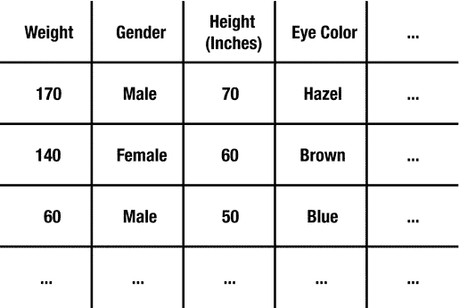

# 3.关于使用数据的简要复习

数据是每个智能系统的核心。本章给出了使用数据的概念性概述，介绍了来自数据科学、统计学和机器学习的关键概念。目标是建立理解的基线，以促进智能系统项目所有参与者之间的讨论和决策。

本章将涵盖:

*   结构化数据。
*   询问数据问题。
*   数据模型。
*   概念机器学习。
*   处理数据的一些常见陷阱。

## 结构数据

数据正在改变世界，这是肯定的。

但这是什么呢？磁盘上的一堆图片？你高中写的所有学期论文？所有参加过比赛的棒球运动员的平均击球率？

是的，所有这些都是数据。数据太多了——数字的海洋，用 1 和 0 填满了地球上所有的硬盘驱动器。原始形式的数据通常被称为非结构化数据，很难处理。

当我们将数据转化为智能时，我们通常使用具有某种结构的数据。也就是说，数据被分解成描述实体或事件的单元。

例如，想象一下处理关于人的数据。每个数据单元描述一个人的体重、身高、性别、眼睛颜色等等。

一种方便的方式是将其视为电子表格中的表格(图 [3-1](#Fig1) )。每个人占一行，每个人的每个财产占一列。可能每一行的第一列都包含一个数字，就是对应的人的体重。也许每一行的第三列包含一个数字，这个数字就是这个人的身高。没完没了。

图 3-1

An example of structured data

这些列通常包含数字(如身高和体重)，或者从少量类别中选择(如眼睛颜色的棕色或蓝色)，或者是像姓名这样的简短文本字符串。当然，还有更高级的选项，但这个简单的方案非常强大，可以用来表示各种各样的东西(并释放我们对它们进行统计和机器学习的能力)。

例如:

*   您可以通过以下方式来表示一个网页:它包含的字数、它包含的图像数、它包含的链接数以及它包含 1000 个常用关键字中的每一个的次数。
*   您可以通过以下方式来表示对搜索引擎的访问:用户键入的查询、用户在结果页面上停留的时间、用户点击的搜索结果的数量以及他们点击的最终结果的 URL。
*   您可以通过以下方式在我们的互联网烤面包机上表示烘烤事件:放入烤面包机的物品的温度、用户选择的强度设置、用户在取出物品之前停止和启动烤面包机的次数，以及物品放入烤面包机和取出烤面包机之间的总时间。

这些都是简单的例子。在实践中，即使是简单的概念，在它们的表示中也往往有几十或几百个元素(每行几十或几百列)。选择要收集的正确数据集和正确的表示方法对于从数据中获得好的结果至关重要。在你做对之前，你可能会犯几次错误——做好进化的准备。

## 问一些简单的数据问题

那么你能用数据做什么呢？你可以问它问题。例如，在您可能想了解的人的数据集中:

*   平均身高是多少？
*   谁是最高的人？
*   有多少人比 5 英尺 5 英寸矮？

这些都很容易回答；只需浏览数据并计算值(将数字相加，或计算符合标准的行数)。

在智能系统中，你会问很多类似的问题。比如:

*   用户每天做多少次特定的动作？
*   在参与智能体验后，点击广告的用户比例是多少？
*   每个客户每月的平均收入是多少？

回答这样的问题对于理解一个系统是否达到它的目标(并确保它没有失控)是很重要的。

你可以用数据做的另一件事是做预测。想象一个有 100 个人的数据集。想知道平均身高？没问题；算算就知道了。但是如果你想知道下一个将被添加到数据集的人的身高呢？或者下一个加入的人会比 5 英尺高还是矮？

你能做这些事情吗？当然可以！嗯，某种程度上，使用基本的统计数据。

通过一些简单的假设，统计学可以估计下一个加入到数据集中的人最可能的身高。但是统计可以做得更多。它可以准确地表达估计的准确性；例如:

> The most likely height of the next person is 5 feet 10 inches, with 95% certainty that the next person will be between 5 feet 8 inches and 6 feet.

这被称为置信区间。置信区间的宽度取决于你有多少数据，以及数据的“良好表现”程度。更多的数据导致更窄的窗口(例如，下一个人 95%可能在 5 英尺 9 英寸和 5 英尺 11 英寸之间)。更少的数据导致更宽的数据(如 5 英尺 5 英寸到 6 英尺 3 英寸)。为什么这很重要？

让我们想象一下，通过降低客户支持能力来节省资金，从而优化互联网业务。假设当前系统每周有 200 个客户支持电话的能力。因此，查看历史遥测数据，您可以计算出平均每周有 75 个支持呼叫，任何一周的最大呼叫数为 98 个。直觉上，200 比 75 高得多——这个系统一定浪费了很多钱。将容量减半(降至 100)似乎是安全的，尤其是因为你没有任何一周的通话量高于这个数字。

但是检查置信区间。如果结果显示最有可能的呼叫量是每周 75 个，并且有 95%的把握下周会有 40 到 110 个呼叫，那会怎么样？好吧，那么 100 似乎不是一个很好的答案。在数据密集型项目中，你应该总是寻求答案。但是你也应该问问答案有多确定。你应该确保你做的决定考虑到了答案和确定的程度。

## 使用数据模型

模型从数据中获取答案，将它们转换成更方便或更有用的格式。

从技术上讲，我们之前讨论的投影是一个模型。回想一下，关于呼叫中心业务量的数据集被转换成平均每周业务量 75，95%置信区间为 40 - 110。原始数据可能非常庞大。它可能包含十年前的 10tb 遥测数据。但是这个模型只包含四个数字:75、95%、40 和 110。

这个简单的模型对于制定容量规划的决策更有用，因为它准确地包含了相关信息，并以直观的方式为手头的任务捕获了这些信息。

模型还可以填补数据中的空白，并估计数据中不包含的问题的答案。

考虑人们的数据集以及他们的身高和体重。假设数据集包含一个身高 5 英尺 8 英寸的人和一个身高 5 英尺 10 英寸的人，但没有身高 5 英尺 9 英寸的人。

如果你需要预测一个 5 英尺 9 英寸的人有多重呢？

你可以建立一个简单的模型。查看数据，你可能会注意到数据集中的人倾向于每英寸身高 2.5 磅。根据这个模型，一个 5 英尺 9 英寸的人会有 172.5 磅重。太好了。或者是？

评估模型质量的一种常见方法称为泛化误差。这是通过保留数据集的一部分，对进行建模的人隐藏它，然后在维持数据上测试模型，以查看模型的表现如何——它对其未见过的数据的概括能力如何。

例如，也许数据集中真的有一个 5 英尺 9 英寸的人，但是有人在建模过程中隐藏了他们。也许隐藏的 5 英尺 9 英寸重 150 磅。但是模型预测的体重是 172.5 磅。减了 22.5 磅。

好吗？不好？取决于你需要模型做什么。

如果你总结了几十或几百个在建模过程中遇到的人的这些类型的错误，你可以感觉到这个模型有多好。有许多技术方法可以总结错误并传达模型的质量，其中两个重要的方法是:

*   回归误差是数值和预测值之间的差异，如在重量示例中。在上例中，模型的回归误差为 22.5。
*   分类错误是针对预测类别的模型，例如，一个试图根据身高和体重预测一个人是男是女的模型(是的，我同意这个模型不会有很多朋友)。衡量分类误差的一种方法是准确性:该模型区分雄性和雌性的准确率为 85%。

## 概念机器学习

简单的模型可能是有用的。身高体重模型非常简单，很容易发现它的缺陷。例如，它没有考虑性别、体脂百分比、腰围或者这个人来自哪里。统计数字对做计划很有用。创建一个简单的模型，用它来回答问题。但是模型也可能很复杂——非常非常复杂。

机器学习使用计算机来改进从数据产生(复杂)模型的过程。这些模型可以从数据中做出预测，有时惊人地准确，有时又惊人地不准确。

机器学习算法探索这些数据，以确定将表示形式(数据集中的列)中包含的信息组合到一个模型中的最佳方式，该模型可以准确地概括出您尚未见过的数据。

例如，机器学习算法可能预测以下任何一项:

*   通过结合身高、体重、年龄和姓名来区分性别。
*   使用性别、身高、年龄和姓名计算体重。
*   身高来自性别和体重。
*   诸如此类…

该模型的工作方式可能非常复杂，以对人类毫无意义但却能产生准确结果的方式放大和缩小各种输入。

可能有数千种机器学习算法可以生成数据模型。有的很快；其他人在制作一个模型前要跑上几天或几周。有些生产非常简单的模型；有些产品需要兆字节或千兆字节的磁盘空间。一些人开发的模型可以根据新数据非常快速地做出预测，不到一毫秒；有些模型的执行计算量很大。有些人在某些类型的数据上做得很好，但在其他类型的问题上却失败了。

似乎没有一种通用的最佳机器学习算法适用于所有情况——大多数算法在某些情况下工作良好，但在其他情况下则很差。每隔几年就会出现一种新技术，这种技术在解决重要问题时表现惊人地好，并得到很多关注。

一些机器学习人员非常喜欢他们最熟悉的算法，并将誓死捍卫它，尽管有任何相反的证据。你已经被警告了。

机器学习过程通常分为以下几个阶段，所有这些阶段都很困难，需要专家付出大量努力:

*   将数据用于建模。这包括处理噪声，并准确计算出将预测什么，以及如何获得建模算法的训练样本。
*   特征工程。这包括将数据处理成具有正确表示(电子表格中的列)的数据集，以暴露给机器学习算法。
*   建模。这包括在数据集上运行一个或多个机器学习算法，查看它们犯的错误，调整和调整东西，并重复直到模型足够准确。
*   部署。这包括选择运行哪种模型，如何将其连接到系统中以产生积极的影响，并将错误造成的损害降至最低。
*   保养。这包括监控模型是否按预期运行，并在它开始失控时修复它。例如，通过对新数据重新运行训练算法。

这本书是关于如何为大型复杂系统完成这些步骤的。

## 处理数据的常见陷阱

数据可能很复杂，而且有很多地方可能出错。在使用数据密集型系统(如智能系统)时，需要记住一些常见的陷阱。

置信区间是可以打破的。置信区间非常有用。知道某个东西有 95%的可能在两个值之间是很棒的。但是有 95%的可能性在区间内意味着有 5%的可能性在区间外。如果它出去了，那就太远了。那是什么意思？5%是二十分之一。因此，如果您每周评估一些事情，例如调整呼叫中心的容量，每二十周就会有一周超出间隔，也就是说，每年有 2.6 次您的容量过多或不足。5%听起来很小，像是永远不会发生的事情，但请记住，如果你得寸进尺，即使是低概率的结果最终也会发生。

你的数据中有噪音。噪音是错误的另一种说法。例如，数据集中可能有一个人的身高为 1 英寸或 15 英尺 7 英寸。这是真的吗？大概不会。噪音来自哪里？各种各样的地方。比如软件有 bugs 数据也有缺陷。遥测系统记录不正确的值。数据在处理过程中被破坏。实现统计查询的代码有错误。用户在奇怪的时间关闭他们的计算机，导致奇怪的客户端状态和疯狂的遥测。有时当客户端出错时，它不会生成数据元素。有时候会产生一个局部的。有时这种噪音是由计算机以它们不应该的方式运行引起的。有时候是人与人之间沟通不畅造成的。每一个大型数据集都会有噪声，噪声会给从数据中创建的东西注入一些误差。

你的数据有偏见。当收集数据的方式与使用数据的方式有系统性差异时，就会出现偏差。例如，也许我们用来估计身高的人数据集是通过在纽约街头随机采访人而创建的。这个数据的模型对于估算日本人的身高准确吗？在危地马拉？在廷巴克图？

偏见会让数据变得不那么有用，偏见可能来自各种各样的无辜之处，比如对数据收集地点的简单疏忽，或者数据收集时间的背景。例如，对某样东西“有点喜欢”的用户比喜欢或讨厌它的用户不太可能对调查做出回应。确保数据被用来做它应该做的事情，或者确保你花时间去理解你的数据有偏见的含义。

您的数据已过期。大多数(简单的)统计和机器学习技术都有一个很大的潜在假设——即事物不会改变。但是事情确实变了。想象一下，构建一个支持呼叫量模型，然后使用它来尝试估计一个主要新功能发布后一周的支持呼叫量。或者是大风暴后的一周。实现智能系统的所有部分的主要原因之一是使系统对变化具有鲁棒性。

你想让数据说出它没有说的东西。有时候数据没有定论，但人们喜欢有答案。这是人之常情。人们可能会说“答案是 42”，而不是说“我们不能回答这个问题”或“答案在 12 到 72 之间”，从而淡化不确定性的程度。精确一点会让人觉得更聪明。给人们可以使用的答案(而不是给他们一个冗长的、不完整的答案)似乎更有礼貌。在数据中发现故事很有趣，比如“我们最好的产品是牙膏，因为我们上个月重新设计了展示柜。”这些故事是如此的诱人，以至于人们甚至会在不存在的地方找到它们。

Tip

在处理数据时，总是要问几个问题:这是对的吗？我们有多确定？有没有另一种解读？怎么才能知道哪个是正确的呢？

你的数据模型会出错。智能系统，尤其是由建模数据构建的智能系统是错误的。很多。有时候这些错误是有道理的。但有时它们完全是反直觉的胡言乱语。有时很难在不引入新错误的情况下纠正一个错误。但这很好。不要害怕犯错。请记住:任何基于模型的系统都需要一个处理错误的计划。

## 摘要

数据正在改变世界。当数据的结构符合其用途时，它才是最有用的。结构化数据就像一个电子表格，每样东西(人、事件、网页等等)占一行，每样东西的属性(身高、体重、性别)占一列。

数据可以用来回答问题和做出预测。统计数据可以回答简单的问题，并指导你答案的准确性。机器学习可以创建非常复杂的模型来进行非常复杂的预测。机器学习有很多很多有用的工具，可以帮助建立精确的数据模型。更多的一直在开发中。

数据可能被严重滥用——你必须小心。

## 供思考

阅读完本章后，您应该:

*   了解数据的用途。
*   对如何应用数据能做的事情有一些直觉。
*   对数据如何出错并导致糟糕的结果有一些直觉。

你应该能够回答这样的问题:

*   你所知道的最大的错误是什么，可能是因为有人滥用了数据？