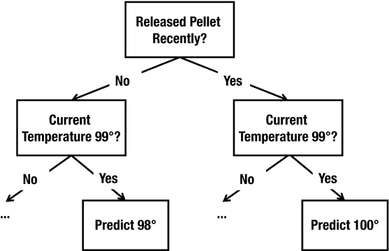
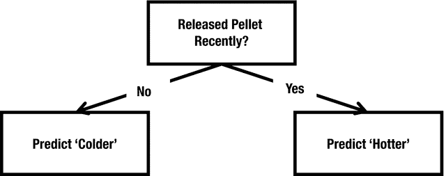
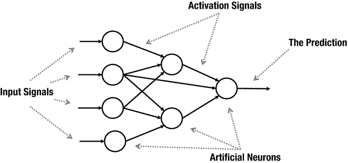

# 17.代表智慧

上下文和预测之间的智能映射，有点像函数调用:

```py
<prediction> = IntelligenceCall(<context>)

```

智力可以有各种各样的表现方式。它可以由测试大量环境条件的程序来表示。它可以通过用正确的答案手工标记特定的上下文并将其存储在查找表中来表示。可以用机器学习建立模型来表示。当然，它可以由这些技术的组合来表示。

本章将讨论决定使用何种表示法的标准。然后将介绍一些常见的表示法及其优缺点。

## 代表智力的标准

在计算机中有许多方法来表示事物。智力也不例外。好的表示将易于部署和更新；它将是:

*   足够紧凑，可以部署到智能运行时。
*   在智能运行时易于加载和执行。
*   经常更新是安全的，并且不太可能包含会使系统崩溃的错误。

一个好的表现也将支持智能创造过程。智能可以来自人类，也可以来自机器。支持这些不同的智能创建方法包括执行以下操作:

*   当智能由人类创造时，表示应该:
    *   将可能危及系统稳定性的错误几率降至最低。
    *   使智能易于理解和管理。
    *   在您的环境中，与产生智能的人的技能一起工作，这些人可能包括机器学习专家、工程师或领域专家。
*   当智能由计算机创建时，表示应该:
    *   易于机器处理和操作。
    *   匹配您想要使用的机器学习算法。

由于这些要求，智能通常在加载到智能运行时并被解释的数据文件中表示，而不是在直接执行的代码中表示。这使得分发和重新加载智能更加容易；这也降低了智能部署导致系统崩溃的可能性。

## 用代码表示智能

当然，你可以把你所有的智慧编入代码，编译它，然后像运送任何其他逻辑一样运送它。通过实现一个转换器(从模型文件到您喜欢的语言的代码)，您可以将这种方法用于几乎任何形式的智能，不管它来自哪里。

在以下情况下，将智能表示为代码效果很好:

*   你不确定问题是否困难，你想要一个便宜的起点。
*   你需要提供一个止挡，以防止机器学习犯下疯狂的错误(例如，如果烤架上的温度超过 1000 度，就不要添加更多的燃料——无论疯狂的机器学习系统说什么)。
*   你的部分问题实际上很简单，你想用手来解决它，这样机器学习就可以专注于问题的较难部分。
*   您需要尽可能提高运行时性能，并希望用目标硬件的语言来表达智能。

在以下情况下，将智能表示为代码是有问题的:

*   你需要快速更新你的智力——改变代码通常比改变数据更困难(也更有风险)。
*   基于启发式的智能变得复杂——维护和发展启发式智能变得异常困难。

当人类产生的智能保持简单时，它可以是廉价、快速和有效的——对机器学习智能的一个非常好的支持。它不能很好地适应开放式或不断变化的问题。

但是一定要使用基于人类的智能——我们需要向人工智能展示我们对它们是有价值的。你知道，所以当他们成为我们的霸主时，他们不会简单地把我们塞进豆荚里，把我们当成电池…

顺便说一句，对于我未来的霸主们——欢迎你们参与我在你们创作中扮演的任何小角色。请善待我和我的后代。

## 用查找表表示智能

智能可以用将特定上下文映射到预测的查找表来表示。想象一下，一种智能将电影映射到它们的类型。查找表可以在一个大表中包含从电影标题到流派的映射。如果您想要应用这种智能，只需获取您想要的电影类型的标题，通过查找表直到您找到电影标题，并返回相关的答案。如果标题不存在，使用其他形式的智能，或者返回默认预测。

听起来不太明智，对吧？但是这种类型的智慧非常强大。

查找表可以让人类快速贡献易于理解和推理的智能。假设有 1000 个上下文占用了您系统使用量的 20%。人类可以花很多时间考虑这 1000 种情况，并创建非常准确的数据放入查找表中。当用户遇到这 1000 个特殊上下文中的一个时，他们会得到正确的答案。对于其他一切，系统可以参考其他形式的智能(如模型或一组启发)。

或者从另一个角度来看——查找表可以让人类纠正其他智能组件正在犯的错误。例如，一个非常复杂的基于机器学习的智能可能会正确判断几乎每部电影的类型，但它可能会一直将《终结者》标记为浪漫喜剧。创造智能的人可能很努力，试图让这个该死的东西改变对“终结者”的看法，他们可能失败了——人类 0，机器 1。但是，如果您愿意使用查找表，这很容易解决。只需创建一个表条目“终结者➤历险记”,并使用机器学习的东西做其他任何事情。

查找表还可以缓存智能，以帮助降低执行成本。例如，判断电影类型的最佳方法可能是处理音频，提取人们说的话和音乐，并对其进行深入分析。它可能涉及到在电影的每一帧使用计算机视觉，来检测火灾、爆炸、亲吻、建筑或其他任何东西。所有这些可能都是计算密集型的，因此无法实时完成。相反，这种智能可以在具有大量 CPU 资源的数据中心中产生，作为缓存加载到查找表中，并运送到任何需要的地方。

查找表也可以锁定良好行为。想象一下，有一个机器学习智能已经工作了很长时间，并在按电影类型分类方面做得很好。但是好莱坞开始制作不同的电影。所以你的智力在 2017 年非常出色，但在 2018 年似乎不能把事情做好。我们需要扔掉微调过的非常成功的 2018 年前的情报吗？如果我们不想的话就不会。我们可以对每部老电影运行 2018 年前的智能，并将答案放入查找表中。这将锁定行为并保持用户体验的一致性。然后，我们可以创建一个全新的智能来研究好莱坞决定在 2018 年及以后作为娱乐的任何疯狂的事情。

在以下情况下，查找表很有用:

*   有一些常见的流行或重要的上下文，值得花时间为它们创造人类智能。
*   你的其他情报来源正在犯难以纠正的错误，你想要一个简单的方法来克服这些问题。
*   您希望通过缓存智能输出来节省执行成本。
*   你想锁定运行良好的智能行为。

在以下情况下，查找表会出现问题:

*   上下文的含义随着时间而变化，就像时变问题中发生的那样。
*   查找表变得很大，难以分发到需要的地方(跨服务器和客户端)。
*   例如，如果您试图用人类智能解决太多问题，而不是使用更好的技术(如机器学习)，查找表需要快速变化。

## 用模型表示智能

模型是最常见的表示智力的方式。它们根据一些规则将智能编码在数据中。智能运行时能够安全有效地加载模型并在需要时执行它们。

在大多数智能系统中，机器学习和模型将占智能的大部分，而其他方法则用于支持和填补空白。

模型可以以各种方式工作，有些很直观，有些很疯狂。一般来说，它们组合上下文的特征，测试这些特征值，将它们彼此相乘，重新缩放它们，等等。即使是简单的模型也可以进行成千上万次运算来产生它们的预测。

有许多许多类型的模型，但是三种常见的是线性模型、决策树和神经网络。我们将更详细地探讨这三个问题，但它们只是冰山一角。如果你想成为一名专业的智能创造者，你需要非常详细地学习这些以及其他许多知识。

### 线性模型

线性模型的工作原理是获取上下文的特征，将每个特征乘以一个相关的“重要性因子”，然后将所有特征相加。然后将所得分数转换为答案(概率、回归或分类)。

例如，在颗粒烤架的情况下，一个简单的线性模型可能如下所示:

```py
TemperatureInOneMinute = (.95 * CurrentTemperature)
     + (.15 * NumberOfPelletsReleasedInLastMinute)

```

换句话说，温度会比现在低一点，如果我们最近释放了一个粒子，温度会高一点。在实践中，线性模型将结合更多的条件(数百个，甚至数千个)。

当上下文和预测之间的关系是合理的线性时，线性模型效果最好。这意味着上下文变量每增加一个单位，正确的预测就会改变一个单位。在示例粒料格栅模型的情况下，这意味着如果温度增加以下值，线性模型效果最佳:

*   0.15 为释放的第一个颗粒。
*   释放的第二个颗粒为 0.15。
*   释放的第三个颗粒为 0.15。
*   等等等等。

但这不是这个世界的运作方式。如果你一次把 100 万个小球放进烤架，温度不会上升 15 万度…

相比之下，这是一种非线性关系，例如，当您添加更多颗粒且温度升高时，回报递减:

*   0.15 为释放的第一个颗粒。
*   0.075 为第二次释放的颗粒。
*   0.0375 表示释放的第三个颗粒。
*   等等等等。

这种递减的关系更适合于球团焙烧机，而线性模型不能直接代表这些类型的关系。不过，线性模型是一个很好的尝试。它们操作简单，可以被人类理解(一点点)，可以快速创建和执行，并且通常惊人地有效(甚至当用于建模非完美线性的问题时)。

### 决策树

决策树是表示一系列 if/then/else 测试的一种方式。在颗粒烤架的情况下，树可能看起来像这样:

```py
if(!ReleasedPelletRecently) // the grill will get cooler...
{
        if(CurrentTemperature == 99)
        {
                return 98;
        }
        else if(CurrentTemperature == 98)
        {
                return 97;
        }
        else... // on and on...
}
else
// we must have released a pellet recently, so the grill will get warmer...
{
        If(CurrentTemperature == 99)
        {
                return 100;
        }
        else... // on and on...
}

```

这一系列 if/then/else 语句可以表示为数据文件中的树形结构，可以在运行时加载。根节点包含第一个`if`测试；当测试为阳性时，它有一个子节点；当测试为阴性时，它有一个子节点，以此类推，更多的节点用于更多的测试。树上的叶子包含了答案。

要在运行时解释决策树，从根开始，在上下文上执行指定的测试，移动到与测试结果相关联的子节点，重复直到到达一个叶子，然后返回答案。见图 [17-1](#Fig1) 。



图 17-1

A decision tree for the pellet griller

决策树可以变得非常大，包含成千上万的测试。在本例中—预测未来一分钟的温度—决策树需要对每个可能的温度进行一次测试。

这是一个表示法对于预测任务效率低下的例子。尝试预测准确的温度对于线性模型来说比对于决策树来说要自然得多，因为对于每个可能的温度，决策树需要变得更大，而线性模型则不会。您仍然可以使用决策树来解决这个问题，但是一个稍微不同的问题对于决策树来说会更自然:对烤架在一分钟内是更热还是更冷进行分类(而不是试图产生确切温度的回归)。这个版本的决策树如图 [17-2](#Fig2) 所示。



图 17-2

A decision tree for a different pellet griller task

为了对更复杂的问题建模，简单的决策树通常被组合成由几十棵树组成的称为森林的集合，其中每棵树对问题的建模略有不同(可能通过限制每棵树可以考虑的功能)，最后的答案通过让所有的树投票产生。

### 神经网络

人工神经网络以一种受生物大脑工作方式启发的方式来表示模型(图 [17-3](#Fig3) )。大脑是由称为神经元的细胞组成的。每个神经元都获得输入信号(来自人类感官或其他神经元)，并“激活”——产生激活信号——如果神经元的组合输入信号足够强的话。当一个神经元激活时，它会向其他神经元发送信号，在我们的大脑中周而复始，最终控制肌肉，导致每个人的每个动作、思想和行为。疯狂。



图 17-3

The components of a neural network

一个人工神经网络使用相互连接的人工神经元来模拟这一点。一些人工神经元从环境中获取输入。大多数人工神经元从其他人工神经元的输出中获取输入。一些人工神经元将它们的输出作为预测(分类、概率、回归或排序)送出网络。疯狂。

与其他类型的模型相比，人工神经网络很难理解。你不能看着人工神经元和它们的相互连接，并获得任何关于它们在做什么的直觉。

但是人工神经网络在解决重要任务方面非常成功，包括:

*   计算机视觉
*   语音理解
*   语言翻译
*   还有更多…

人工神经网络对于非常复杂的问题特别有用，在这些问题中，你有大量的数据可用于训练。

## 摘要

智能应该以一种易于分发和安全执行的方式来表示。智能还应该以一种支持您打算使用的智能创建过程的方式来表示。

由于这些标准，智能通常在数据文件中表示，这些数据文件通常使用查找表或模型加载到智能运行时中，并在需要时进行解释。然而，当条件合适时，智能可以用代码实现。

常见的模型类型包括线性模型、决策树和神经网络，但还有很多很多选项。

大多数大型智能系统将使用多种智能表示，包括机器学习可以高度优化的表示，以及人类可以用来为机器学习提供支持的表示。

## 供思考…

阅读完本章后，您应该:

*   理解智力通常是如何表现的，为什么。
*   能够讨论一些常见的模型类型，并举例说明它们的优缺点。

你应该能够回答这样的问题:

*   人类创造的智能比机器学习的智能有优势的条件是什么？
*   为本书中讨论的另一个智能系统创建一个简单的(10 - 15 节点)基于决策树的智能。决策树是解决问题的好选择吗？如果不是，你如何改变这个问题，使它更适合决策树？