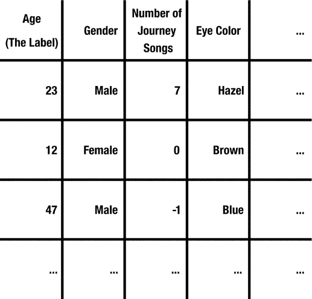
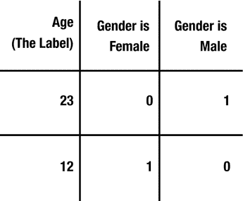
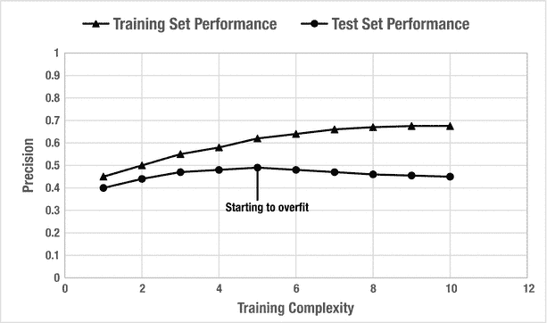

# 二十、机器学习智能

机器学习是一种强大的技术，用于为大型、困难、开放式、时变的问题产生智能。它的工作原理是向计算机显示大量(和大量)的上下文和预期结果的例子。计算机从这些例子中产生模型。这些模型可以用来预测未来环境的结果。

机器学习可以成为一个巨大的力量倍增器，让计算机专注于它擅长的事情(如调整一个巨大模型的每个细节，以便它在数百万个上下文中有效工作)，而人类可以专注于他们擅长的事情(如选择一个可以很好地概括的模型表示，并建立将模型转化为客户和商业价值的系统和智能体验)。本章将概述机器学习，介绍步骤和一些关键问题。

## 机器学习是如何工作的

机器学习算法本质上是一个寻找精确模型的搜索过程，使用训练数据来评估准确性。通常，机器学习算法执行以下操作:

*   从一个简单的模型开始。
*   尝试稍微改进的模型版本(通常由训练数据提供信息)。
*   查看改进后的版本是否更好(使用训练数据)。
*   并且迭代(粗略地)直到他们的搜索过程不能找到更好的模型。

有时，细化采取的形式是增加模型的复杂性(例如，向决策树添加更多的 if-then-else 测试)。有时，优化采取调整模型中参数的形式(例如，更新线性模型中的权重)。

例如，回想一下决策树用树来表示智能。每个节点包含一个`if`条件，当`if`测试为真时有一个子节点，当`if`测试为假时有一个子节点。下面是一个预测电影票房的决策树示例:

```py
If <won Academy Award>:
        Is True: If <has a top 10 star in the cast>:
                Is True: then $100,000,000.
                Is False: then $1,000,000.
        Is False: If <opened on labor day weekend>:
                Is True: then $50,000,000.
                Is False: then $1,000.

```

决策树的机器学习通过添加 if 测试来产生越来越复杂的树，直到没有进一步的添加来改进模型(或者直到模型达到某个复杂度阈值)。例如，对电影成功预测的样本决策树的提炼可能是:

```py
If <won Academy Award>:
        Is True: If <has a top 10 star in the cast>:
                Is True: If <opened on labor day weekend>:

                        Is True: then $500,000,000.

                        Is False: Then $10,000,000.

                Is False: then $1,000,000.
        Is False: If <opened on labor day weekend>:
                Is True: then $50,000,000.
                Is False: then $1,000.

```

这个模型更复杂一点，也可能更精确一点。

人类可以手动执行相同的过程，但机器学习算法可以自动执行该过程，可以考虑数百万个上下文，并在人类键入“hello world”所需的时间内产生数十万个小的改进。

智能创造者在使用机器学习时必须控制的因素包括:

*   特征工程:如何将上下文转换为机器学习算法可以添加到其模型中的特征。您选择的特性应该与目标概念相关，并且应该包含足够的信息来做出好的预测。
*   模型结构复杂性:模型变得有多大。例如，决策树中的测试数或线性模型中的特征数。
*   模型搜索复杂度:机器学习算法在搜索中尝试了多少东西。这与结构复杂性是分开的(但是相关的)。搜索尝试的东西越多，它就越有机会找到一些偶然看起来不错但不能很好概括的东西。
*   数据量:你有多少训练数据。指导机器学习搜索的优质、多样的数据越多，你的模型就会变得越复杂、越精确。

这些元素必须得到平衡，才能从机器学习过程中获得尽可能好的模型。

## 复杂性的利与弊

机器学习的一个关键挑战是控制它产生的模型的复杂性。他们的关键张力如下:

1.  你需要非常复杂的模型来解决困难的、大的、开放式的问题。
2.  你允许的复杂性越多，你就有越多的机会去学习一个误解概念的模型。

作为应用机器学习实践者，你的工作就是平衡这些紧张关系。机器学习过程可能以两种方式失败:

*   它可能对这个概念理解不足，因为它对这个概念的理解可能过于简单。
*   它可能过度适应这个概念，因为它对这个概念的理解是错误的；这在某些情况下可能行得通，但它就是不对。

让我们看一个例子。考虑建立智能，检查书籍并按类型分类——科幻、浪漫、科技、惊悚、历史小说，诸如此类。

你收集了 1000 本书，手工给它们贴上流派标签，然后开始创造智慧。我们的目标是能够找到一本新书(不属于 1000 本书的那一本)并准确预测它的类型。

### 欠拟合

如果你采取的方法过于简单，以至于无法理解什么是“流派”，你就会吃不饱。它可能是这样的:

1.  针对每种类型，找出最能代表该类型的单词:
    *   对于浪漫来说，这个“指示词”可能是“爱”
    *   对于科幻小说来说，可能是“激光”
    *   等等 
2.  当你拿到一本新书时，检查它是否包含任何指示性词语，并用相关的流派给书贴上标签:
    *   如果这本书包含“爱”这个词，那就称之为浪漫吧。
    *   如果这本书包含“激光”这个词，就叫它科幻小说吧。 

如果每本书都有且只有一个指示词，这种模式可能会很好。但是大多数书都有很多单词。一本同时用了“爱”和“激光”两个词的书，我们该怎么办？我们应该称之为爱情片还是科幻片？无论我们做出哪个选择，我们都会犯错误，因为一些科幻小说谈论爱情；还有一些言情书讲激光。

这种建模方法(检查每种类型的单个单词)太简单了。这种简单的方法不符合体裁的概念，不能很好地推广。

### 过度拟合

现在想象另一种方法——使用非常非常复杂的决策树，本质上是将书中的精确单词串编码成树的形式，例如:

1.  如果这本书的第一个词是“当”
2.  这本书的第二个词是“the”
3.  这本书的第三个词是“地球”
4.  以此类推，精确匹配书中的每一个单词…
5.  那么类型就是“科幻小说”

这个模型非常复杂，而且高度准确(基于用来创建它的数据)，但它根本不能推广到新书。

这听起来很傻，完全记住书中的每个单词，但这只是一个例子。根本问题是，机器学习几乎总是以与潜在现象不匹配的方式对问题进行建模。正因为如此，这个模型的某些部分会碰巧对你所知道的一切都有效，但是在新的情况下就失效了。这用专业术语来说就是过度适应，避免过度适应是创建有效智能的关键挑战之一。

当一个智能不足或过度适应一个问题时，这个智能在处理新的环境时就不准确；不会一概而论。

### 平衡复杂性

对于我们的图书类型例子来说，一个更好的模型应该介于两者之间。也许它会检查与每个流派最相关的 50 个单词的存在:

*   对于科幻小说，它可能会使用激光、曲速、星光、光束等等。
*   对于浪漫，它可能会使用…其他的话…

然后，你可以使用决策树、线性模型或神经网络来自动学习每个单词对每个流派的重要性，以及如何对它们进行组合和加权，以准确预测流派。

这将是比其他两种方法更好的方法。你看得出来，我也看得出来。但是机器呢？也许不是。

这种 50 字的方法仍然是不正确的。这肯定会使体裁的概念不充分，因为它没有考虑单词的上下文，它们所用的句子，它们所描述的思想。

但是没关系。机器学习的目的不是找到问题的“正确”表示。重点是找到产生最佳概括的建模过程。你需要有意识地选择如何和在哪里吃得不足和吃得过多来达到这个目的。

## 特征工程

智能系统中的上下文编码了与交互相关的所有数据。这可能包括关于用户的信息、他们的历史、他们正在做什么、他们正在交互的内容等等。特征工程是将上下文转化为机器学习可以使用的表示的过程。这包括使信息具有模型表示的正确格式。它还包括使信息与用于学习模型的搜索过程很好地配合。

本节的其余部分将讨论实现这一点的方法，包括:

*   将数据转换成有用的形式。
*   帮助模型使用数据。
*   标准化特征值。
*   暴露隐藏的信息。
*   扩展上下文。
*   消除误导的东西。

### 将数据转换成可用格式

通常，机器学习算法将训练集作为输入。训练集由一组训练示例组成。每个训练示例都包含一组对上下文进行编码的变量。这些变量被称为特征。每个训练示例还包含一个结果变量，指示上下文的正确答案。这通常被称为标签。

回想一下，结果通常是以下之一:一组可能性中的一个类别(用于分类)；一个数字(用于回归)；或者一个概率(可能是一个从 0 到 1.0 的数字，代表从 0 到 100%的概率，缩小到 0.0-1.0 的范围)。

培训示例可以被视为电子表格中的一行。一列包含标签；其余的列包含特征值。训练集中的每个训练示例必须具有相同数量的特征，尽管一些特征值可能会丢失-机器学习对于这种事情是鲁棒的。

例如，如果您试图建立一个模型，根据一个人听的音乐类型来预测他的年龄，那么您可能有一个特征来表示他的性别、眼睛颜色以及他上周听的旅行歌曲的数量(图 [20-1](#Fig1) )。有些用户可能听过 7；有些人可能听过 14。针对这些用户的培训示例将在“旅程歌曲数量”列(特性)中填入正确的值(7 或 14，或其他值)。但也许你爸爸不会告诉你他听了多少首旅行歌曲——也许他对这类事情感到害羞。因此，您父亲的培训示例仍然有一个关于旅程歌曲数量的列(特性)，但是该值是未定义的(或者–1，或者 0，或者其他一些特殊代码，具体取决于您的工具)。



图 20-1

Example features

机器学习系统通常具有两种功能:

*   数字特征，是整数或者浮点数(比如上周听的征途歌的数量)。
*   分类特征，是来自一小组值的标签(比如人的性别)。

大多数机器学习模型和算法都支持数字和分类特征。但是有时需要一些预处理。例如，内部神经网络只处理数字特征。要将分类特征输入神经网络，必须将它们转换成数值。一种常见的方法是使用一键编码，将一个分类特征转换成 N 个数字特征，每个数字特征对应一个可能的分类值。例如，要以这种方式对性别进行编码，您需要进行以下转换:

*   男-> [ 0，1 ]
*   女性-> [ 1，0 ]

图 [20-2](#Fig2) 在表格中显示了这种编码。



图 20-2

One-hot encoding of gender

### 帮助您的模型使用数据

特征工程是一门艺术，它将上下文转换成适合您的问题和模型结构的特征。例如，考虑从这个人听的歌曲中预测年龄的模型。一种方法是为每一位曾经录制过歌曲的艺术家制作一个特写。每个训练示例都有数万列，每个艺术家一列，指示用户听了该艺术家的多少首歌曲。

这种表示包含大量的信息，这应该有助于机器学习过程避免欠拟合。它也很复杂。它要求学习算法在做出决定时考虑很多很多事情，并可能鼓励过度拟合。这是最好的方法吗？

可能吧，取决于你的工具和你有多少数据。知道的唯一方法是尝试一堆不同的东西，建立模型，评估它们，然后看看。

以下是针对此问题创建要素的一些其他可行方法:

*   按十年分解歌曲:每十年有一个特征，其值是这个人听的那十年的歌曲数量。
*   把流行歌曲和晦涩的歌曲分开:因为也许在某个特定年代长大的人会更多地接触音乐，所以听晦涩的歌曲可能会暴露他们。所以每个十年有两个特征，一个是那个十年的流行歌曲，另一个是那个十年的晦涩歌曲。
*   按流派划分歌曲:每个流派一个特征，其中值是从该流派收听的歌曲的数量。
*   流派、年代和流行之间的某种结合:你同时做前面三种方法。

一旦你开始行动，你就会想出各种方法来分解问题，从上下文中提取信息(这个人听的歌曲和听的模式)，并部分消化它，以将最相关的部分暴露给机器学习算法。

这么想吧。如果你碰巧知道有一个叫做“流派”的相关概念，并且你以一种有用的方式在你的特征中暴露了这个概念，那么机器学习算法可以利用它。这需要你做一些工作，但是通过对你对世界的先验知识进行编码，它可以帮助产生更好地匹配你的问题空间中正在发生的事情的模型。

相比之下，将原始数据提供给机器学习过程(这样算法就可以自己解决所有问题)。就你需要付出的努力而言，这可能是非常有效和高效的——如果你有很多很多的数据，这样你就可以避免过度拟合。

不同的算法用不同的方法会做得更好。学习您的工具，获得直觉，并确保您的评估框架非常容易探索。

### 常化

有时数字特征具有非常不同的值。例如，年龄(可以在 0 到大约一百之间)和收入(可以在 0 到大约一亿之间)。规范化是更改数字特征以使它们更具可比性的过程。不是说一个人 45 岁，收入 75，000 美元，而是说一个人比平均年龄高 5%，比平均收入高 70%。

执行归一化的一种标准方法是对所有数字特征进行后处理，并用它们的归一化值替换它们:

1.  减去平均值(将平均值移至零)。
2.  除以变量的标准差。

例如，在每个培训示例中，替换为:


学习算法当然可以处理非标准化数据。但是进行预处理可以消除复杂性，使建模任务变得简单一些，这样算法就可以专注于其他事情。有时候会有帮助。

### 暴露隐藏的信息

有些功能孤立起来没有用。它们需要与其他功能相结合才有帮助。或者(更常见的)一些特性在单独使用时很有用，但与其他特性结合使用时会变得更加有用。

例如，如果您试图为箱子的运输成本构建一个模型，您可能有一个箱子的高度、宽度和深度的特征。这些都是有用的。但是一个更有用的特征是盒子的总体积。

一些机器学习算法能够自己发现这些类型的关系。有些不是。

您可以根据自己的直觉和对问题的理解来制作复合特征。或者你可以自动尝试一堆，通过组合你想出的初始特征来创建新的特征。

### 扩展上下文

您可以使用外部智能或查找来添加内容，以添加上下文中没有明确的信息。例如，您可以执行以下任一操作:

*   在上下文中查找身份的历史记录，如 web 服务器的流量。
*   根据位置从 web 服务中查找外部温度。
*   对文本块运行情感分析程序，并将预测的情感作为特征包括在内。

回想一下，只有在智能运行时和智能创建环境中以完全相同的方式创建这些类型的功能时，才能使用它们。

下一章将讨论更多组织智能的方法，这将帮助你决定如何最好地利用资源或遗留智能来扩展上下文。

### 消除误导

另一种方法是从数据中删除要素。

什么！？！

是啊。您刚刚完成了所有这些工作，从上下文中创建了特性，现在我说您应该删除一些特性。坚果！

但是你可能创建了一些非常糟糕的功能(抱歉)。这些会增加学习过程的复杂性，而不会增加任何价值。比如用一个人眼睛的颜色来预测年龄。当然，每个人都有眼睛的颜色。当然，它在上下文中。但是这和预测这个人的年龄有关系吗？不完全是。

包含不相关的特征会降低你学习概括良好的模型的能力——因为有时不相关的特征会偶然看起来很好，并欺骗你的机器学习算法将其包含在模型中。

或者，您可能创建了超出数据支持范围的更多要素。你所有的特性可能都很出色，但是它们仍然会导致过度拟合和伤害泛化。

所以你真的应该:

1.  移除没有任何结果信息的要素。
2.  选择您的数据和模型结构以及搜索过程支持的尽可能多的特征，并选择最佳特征。

这称为特征选择。有许多技术可用于执行特征选择。以下是一些简单的例子:

1.  测量每个特征和结果特征之间的互信息(考虑相关性),并删除得分最低的特征。
2.  训练具有和不具有每个特征的模型，评估每个模型，然后移除无助于概化准确性的特征。
3.  用你的直觉和对问题的理解，把没有意义的东西删掉。

这些技术也可以帮助调试您关于特性工程的决策。创建新特征。将其添加到现有的要素集中。训练一个新的模型——如果结果不是更好，你可能在错误的道路上。盯着它看一会。然后停下来想一想。也许它会帮助你理解到底发生了什么。

## 建模

建模是使用机器学习算法搜索有效模型的过程。智能创造者可以通过多种方式协助这一过程:

*   决定使用哪些功能。
*   决定使用哪些机器学习算法和模型表示。
*   决定使用什么数据作为训练的输入。
*   控制模型创建过程。

但是，在所有这些中，目标是得到概括最好的模型，具有最好的错误概况，并将为您的客户创造最大的价值。本节将讨论如何做到这一点，包括调整建模过程的常用方法。

### 复杂性参数

每个机器学习算法都有参数，让智能创造者控制他们增加多少复杂性。

有些提供控制算法产生的模型大小的参数。一些模型在搜索时添加结构，例如，向决策树添加节点；向随机林添加树。这些类型的算法通常有一些参数，这些参数对结构的数量(树中的节点数量，或者随机森林中的树的数量)进行了硬性限制。许多算法也有继续搜索所需的最小训练集增益的参数。

当你过度合身时，你应该限制尺寸；当你不合身时，你应该允许更大的尺寸。

机器学习算法可能有参数来控制算法的搜索策略。最常见的方法(到目前为止)是沿着梯度采取贪婪的步骤，也就是说，进行最能提高模型在训练数据上的性能的更改。其他选项可以包括一点随机性，如随机重启(以防搜索陷入局部最大值)，或一些前瞻。

算法也可能具有控制搜索中所采取的步长的参数。也就是说，他们找到梯度，然后他们必须决定沿着梯度移动模型多远。步长越小，复杂度越高。随着搜索的继续，一些算法自适应地调整步长，从大的开始以找到好的一般区域，然后变小以改进模型。

当你过度适应时，你应该使用更简单的搜索策略；当你不适合的时候，你可以尝试更复杂的搜索。

有的算法还直接用优化算法；例如，通过在内部将问题表示为矩阵，并使用线性代数来寻找关键属性。这些算法可能支持各种权衡复杂性的优化选项。

基本上，您应该始终根据问题的复杂性和您拥有的数据量来调整这些类型的参数。在不调整算法复杂性参数的情况下，成功执行机器学习是非常非常罕见的。

### 识别过度拟合

回想一下，建模的目标是构建最能概括新设置的模型。识别建模过程何时开始过度拟合的一个策略是:

1.  根据训练数据建立一系列越来越复杂的模型，从简单到复杂。如果您的要素和模型表示法选择合理，那么在训练数据上，更复杂的模型应该比不太复杂的模型做得更好。
2.  现在在一个坚持测试集上运行这些模型。脑残的简单模型应该表现(大概)最差。下一个稍微复杂一点的模型应该表现得更好一点。下一个更复杂的应该会表现得更好。等等——在某种程度上。最终，更复杂的模型在坚持测试数据上的表现会比不太复杂的模型差。而它们开始表现变差的地方，就是你的特性集、模型搜索策略、模型表示和可用数据开始陷入困境的地方。

例如，参见图 [20-3](#Fig3) 。



图 20-3

An example of overfitting

如果你开始过度适应，你需要:

*   更好地匹配问题的特征。
*   更好地匹配问题的模型结构。
*   少搜索生产模型。
*   或者更多的数据！

更多的数据是避免过度拟合的最佳方式，允许您创建更复杂和精确的模型。谢天谢地，你已经做了所有的工作，建立了一个智能系统，有很好的智能体验和大量的用户为你生成数据。这是智能系统可以大放异彩的地方，让您的智能随着更多用户的交互而增长。

## 摘要

机器学习从数据中自动产生智能。它包括让计算机搜索对您的数据(在训练集中)工作良好的模型。一个关键的矛盾是增加的准确性和基于过拟合的较差的泛化能力。

特征工程是机器学习的重要组成部分。它包括将上下文转换成模型可以使用的表示。但它也涉及到理解你的表示，你的问题，以及足够好的机器学习算法的搜索策略，以正确的方式呈现数据。常见的技术包括标准化、特征选择和复合特征。

建模过程涉及大量迭代，挑选正确的机器学习算法，调整参数，并通过仔细管理复杂性，从可用的训练数据中挖掘出最大价值。

## 供思考…

阅读完本章后，您应该:

*   对机器学习有很好的概念性理解，包括特征、模型、建模过程以及复杂性和过度拟合之间的关键张力。
*   了解应用机器学习的步骤，以及通用机器学习算法的大致工作原理。
*   能够带着机器学习工具包，产生可用的模型，并准备在学习特定算法和技术时采取更多步骤。

你应该能够回答这样的问题:

描述一个你在本书之前的回答中没有使用过的智能系统的背景。

*   为上下文创建十个数字特征。
*   为上下文创建五个分类特征。
*   提出一种方法来简化功能。
*   创建一个使用你的特征过度拟合的模型的例子——发疯，找到令人愤慨的过度拟合的极限。
*   额外收获:设计一个非常简单的机器学习算法。你的代表权是什么？你的搜索是什么？你的复杂性参数是什么？