# 6.使用线性回归预测未来价格

本章介绍参数法，也称为*线性回归法*。我们用这种方法来确定自变量(连续的或分类的)和因变量(总是连续的)之间关系的性质。自变量是连续变量或分类变量，而因变量必然是连续变量。它研究自变量的变化如何影响因变量的变化。用于寻找截距和斜率估计值的最传统的模型是最小平方模型。我们用等式 [6-1](#Equ1) 表示公式。


(方程式 6-1)

这里，表示期望因变量，*β*T3】0 表示截距，*β*T7】1 表示斜率， *X* <sub>1</sub> 表示自变量， *ε* <sub>* i *</sub> 表示误差项(表示为 *n* 个数据点的第 i <sup>th</sup> 的残差)

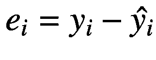

(方程式 6-2)

最小平方模型确保残差的平方和很小。我们通过应用等式 [6-3](#Equ3) 中的属性来找到残差的平方和。

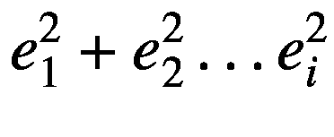

(方程式 6-3)

该属性假设残差总是等于零，并且估计是无偏的。

## 实践中的线性回归

在本章中，我们根据最高价和最低价的变化和收益来预测[黄金](https://finance.yahoo.com/quote/GC%253DF/)的收盘价。上市公司 [6-1](#PC1) 从雅虎财经收集数据。

```py
from pandas_datareader import data
start_date = '2010-11-01'
end_date = '2020-11-01'
ticker = 'GC=F'
df = data.get_data_yahoo(ticker, start_date, end_date)
df_orig=df

Listing 6-1Scraped Data

```

清单 [6-2](#PC2) 计算股价的最高和最低价格变化和收益(见表 [6-1](#Tab1) )。

表 6-1

资料组

<colgroup><col class="tcol1 align-left"> <col class="tcol2 align-left"> <col class="tcol3 align-left"> <col class="tcol4 align-left"> <col class="tcol5 align-left"></colgroup> 
| 

日期

 | 

接近的

 | 

HL_PCT(多氯三联苯)

 | 

百分比变化

 | 

卷

 |
| --- | --- | --- | --- | --- |
| **2010-11-01** | 1350.199951 | 0.711013 | -0.742490 | Forty |
| **2010-11-02** | 1356.400024 | 0.095846 | -0.029483 | Seventeen |
| **2010-11-03** | 1337.099976 | 2.370799 | -1.058166 | One hundred and thirty-five |
| **2010-11-04** | 1382.699951 | 1.728504 | 1.030248 | One hundred and nine |
| **2010-11-05** | 1397.300049 | 1.417022 | 0.474588 | One hundred and nine |

```py
df['HL_PCT']=(df['High']-df['Low'])/df['Adj Close'] *100.0
df['PCT_change']= (df['Adj Close']-df['Open'])/df['Open'] *100.0
df = df[['Adj Close','HL_PCT','PCT_change','Volume']]
date = df.index
df.head()

Listing 6-2Calculate the Highest and Lowest Price Change and Returns

```

## 相关方法

相关性估计自变量和因变量之间线性关系的表面强度。在训练回归模型之前，我们必须确定变量之间关联的严重程度，因为严重程度会影响模型的性能。确定变量间相关性的主要相关方法有三种:皮尔逊相关法，估计连续变量间的相关性；肯德尔相关法，估计排名和序数变量之间的关联；和 Spearman 相关法，该方法也估计变量组合的等级之间的关联。

### 皮尔逊相关法

假设我们处理的是连续变量，我们使用皮尔逊相关法，它产生的值范围从-1 到 1。这里，-1 表示强负相关关系，0 表示无相关关系，1 表示强正相关关系。列表 [6-3](#PC3) 产生皮尔逊相关矩阵。我们使用热图直观地表示矩阵(见图 [6-1](#Fig1) )。要在 conda 环境中安装`seaborn`，请使用`conda install -c anaconda seaborn`。

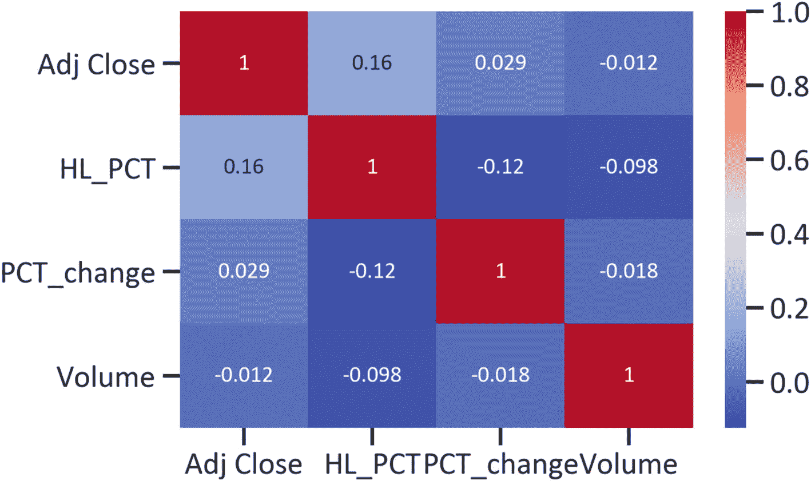

图 6-1

皮尔逊相关矩阵热图

```py
import seaborn as sns
dfcorr = df.corr(method="pearson")
sns.heatmap(dfcorr, annot=True,annot_kws={"size":12},cmap="coolwarm")
plt.show()

Listing 6-3Pearson Correlation Matrix

```

从左上角到右下角有一行 1。这意味着每个变量都与自身完美相关。相关性为 0.98(接近 1)。

## 协方差方法

清单 [6-4](#PC4) 估计了两个变量之间的联合可变性。它估计变量如何一起变化(见图 [6-2](#Fig2) )。

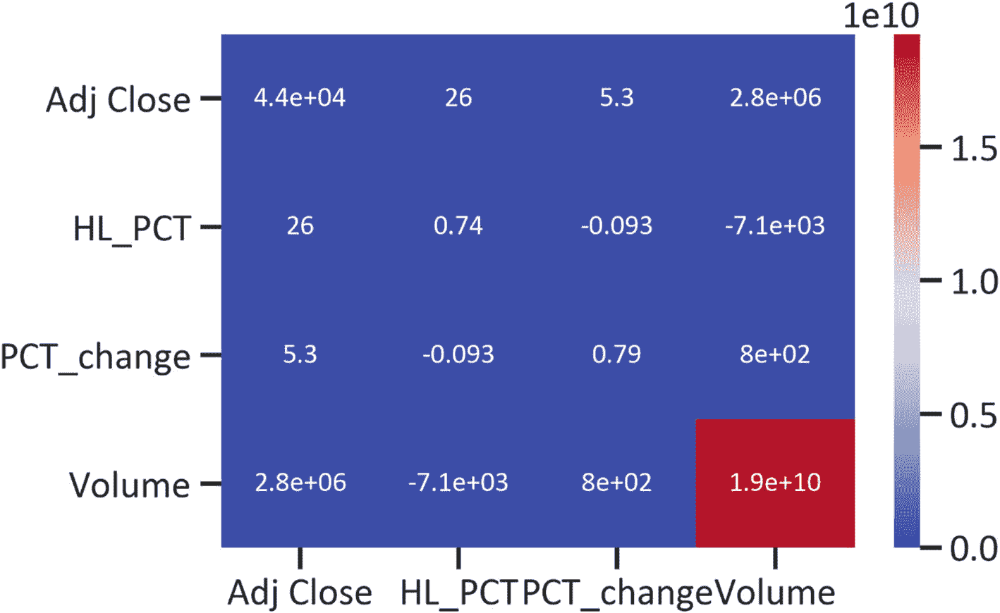

图 6-2

协方差矩阵热图

```py
dfcov =df.cov()
sns.heatmap(dfcov, annot=True,annot_kws={"size":12},cmap="coolwarm")
plt.show()

Listing 6-4Estimate and Plot a Covariance Matrix

```

协方差矩阵证实了更积极的联合可变性。当我们使用皮尔逊相关方法时，我们必须首先找到协方差，因为该方法的系数是两个变量之间的协方差除以它们与平均值的偏差。

## 成对散点图

通常需要成对散点图来检验正态性。当独立观察值接近平均值时，我们认为数据是正态分布的。回归模型假设正态性:非正态数据会导致负面的模型性能。在数据不正常的情况下，我们可以执行数据转换，即对于正偏斜数据的平方根转换(数据在分布的右侧饱和的情况)或者对于负偏斜数据的指数/幂转换(数据在分布的左侧饱和的情况)。有几个因素可能会影响非正态性，即缺失值和异常值(存在极值)等。参见清单 [6-5](#PC5) 。

```py
sns.jointplot(x="HL_PCT",y="Adj Close",data=df,kind="reg",color="navy")
plt.ylabel("Adj Close")
plt.xlabel("HL_PCT")
plt.show()

Listing 6-5Highest and Lowest Price Changes and Closing Price

```

图 [6-3](#Fig3) 显示了一条穿过数据点的直线。而且数据点完美的不分布到一条直线上。

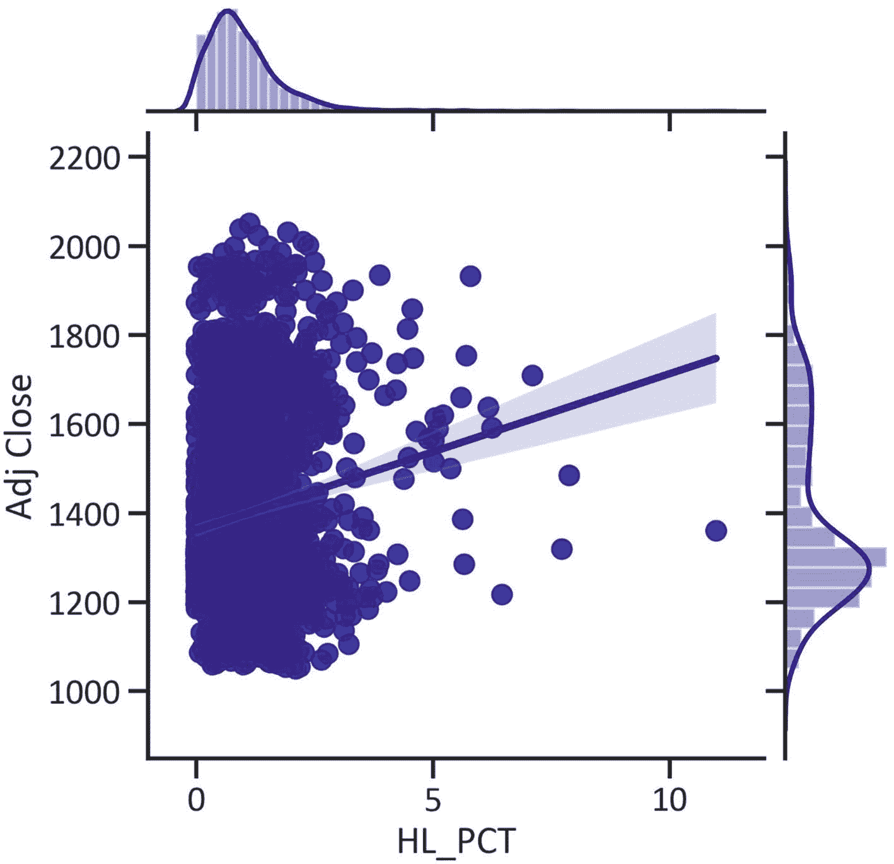

图 6-3

最高和最低价格变化和收盘价散点图

清单 [6-6](#PC6) 构建了一个成对散点图，显示了回报和收盘价之间的相关性(见图 [6-4](#Fig4) )。联合图还显示 HL_PCT 为负偏态，Adj Close 为正偏态。

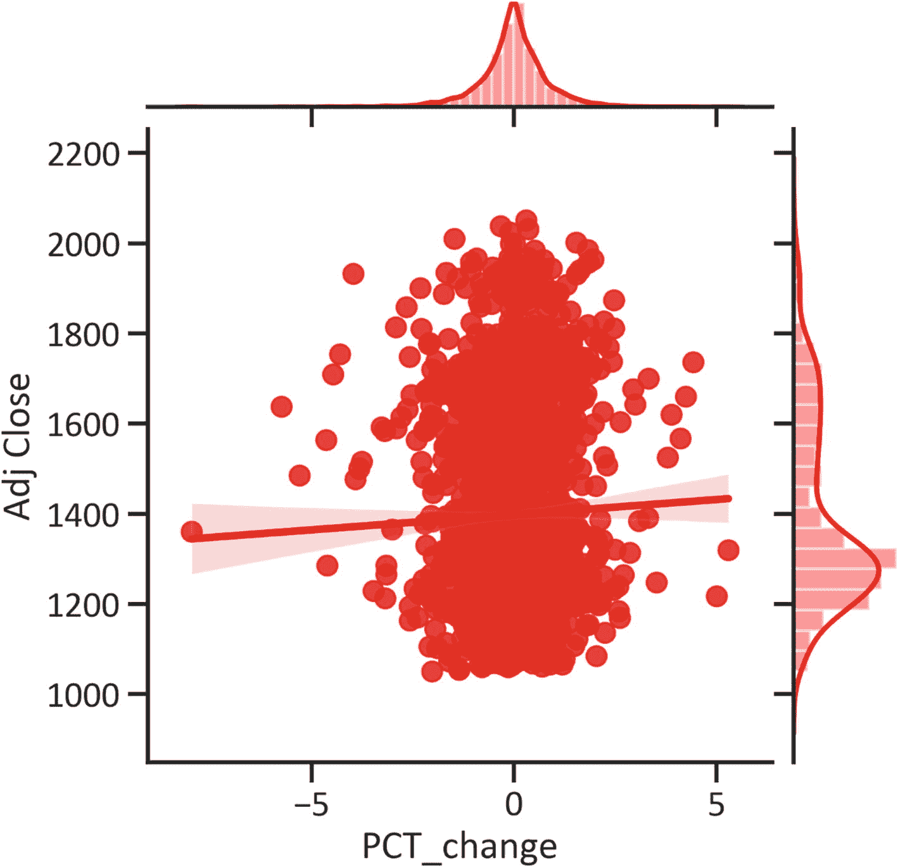

图 6-4

回报和收盘价散点图

```py
sns.jointplot(x="Corr",y="Adj Close",data=xy,kind="reg",color="red")
plt.ylabel("Adj Close")
plt.xlabel("Corr")
plt.show()

Listing 6-6Returns and Closing Price

```

我们可以建立一个直线关系的公式。而且，直线不是线性的。图 [6-5](#Fig5) 说明了成交量与调整后收盘价之间的关联。该图还显示，PCT_change 遵循正态分布(分布为钟形)。参见清单 [6-7](#PC7) 。

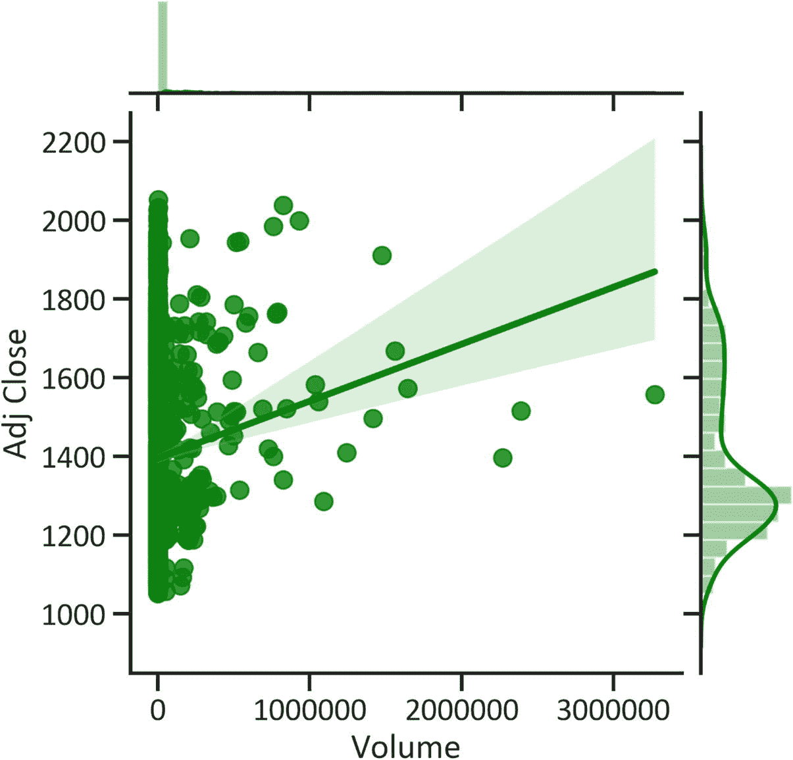

图 6-5

成交量和收盘价散点图

```py
sns.jointplot(x="Corr",y="Adj Close",data=xy,kind="reg",color="red")
plt.ylabel("Adj Close")
plt.xlabel("Corr")
plt.show()

Listing 6-7Volume and Closing Price

```

图 [6-5](#Fig5) 显示的是一条直线，但数据点并不靠近该直线。

## 自定义矩阵

在上一节中，我们发现了变量之间线性关系的强度。接下来，我们必须使用特征值来诊断变量间相关性的严重程度。特征值代表相关矩阵的平坦方差。两个以上高度相关变量的组合可能会降低模型的预测能力。特征矩阵在模型选择中是一种方便的工具。表 [6-2](#Tab2) 显示了作为变量的等价数量的特征值。小于 0 的特征值表示没有多重共线性；介于 10 和 100 之间表示中度多重共线性，超过 100 表示极度多重共线性。清单 [6-8](#PC8) 返回特征矩阵。多重共线性是指两个以上的变量高度相关的问题。

表 6-2

自定义矩阵

<colgroup><col class="tcol1 align-left"> <col class="tcol2 align-left"> <col class="tcol3 align-left"> <col class="tcol4 align-left"> <col class="tcol5 align-left"> <col class="tcol6 align-left"></colgroup> 
|   | 

特征值

 | 

接近的

 | 

HL_PCT(多氯三联苯)

 | 

百分比变化

 | 

卷

 |
| --- | --- | --- | --- | --- | --- |
| **调整关闭** | 1.921528e+10 | -1.448570e-04 | 1.000000 | -5.758481e-04 | -2.688695e-04 |
| **HL_PCT** | 4.334201e+04 | 3.710674e-07 | 0.000624 | 8.106354e-01 | 5.855510e-01 |
| **百分比变化** | 6.528812e-01 | -4.166475e-08 | 0.000119 | 5.855510e-01 | -8.106356e-01 |
| **体积** | 8.540129e-01 | -1.000000e+00 | -0.000145 | 3.598192e-07 | 2.900014e-07 |

```py
eigenvalues, eigenvectors = np.linalg.eig(dfcov)
eigenvalues = pd.DataFrame(eigenvalues)
eigenvectors = pd.DataFrame(eigenvectors)
eigen = pd.concat([eigenvalues,eigenvectors],axis=1)
eigen.index = df.columns
eigen.columns = ("Eigen values","Adj Close","HL_PCT","PCT_change","Volume")
eigen

Listing 6-8Eigen Matrix

```

表 [6-2](#Tab2) 突出显示存在中度多重共线性(特征值小于 10)。

## 进一步描述性统计

有几种方法可以总结数据。列表 [6-9](#PC9) 汇总了不同时间的开盘价和收盘价(见图 [6-6](#Fig6) )。

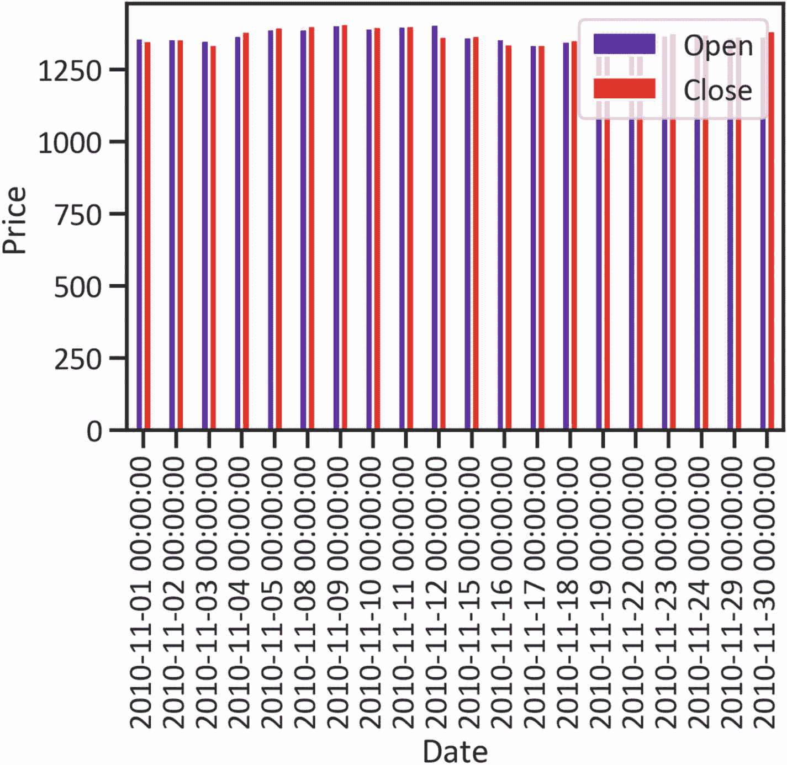

图 6-6

开盘价和收盘价

```py
df_orig[["Open","Close"]].head(20).plot(kind='bar',cmap="rainbow")
plt.ylabel("Price")
plt.show()

Listing 6-9Opening and Closing Prices

```

图 [6-6](#Fig6) 显示收盘价与开盘价没有大的偏离。图 [6-7](#Fig7) 描绘了不同时间的最低价和收盘价。见清单 [6-10](#PC10) 。

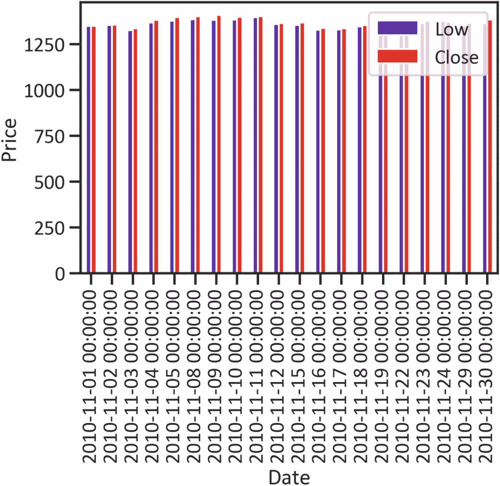

图 6-7

低价和收盘价

```py
df_orig[["Low","Close"]].head(20).plot(kind="bar",cmap="rainbow")
plt.ylabel("Price")
plt.show()

Listing 6-10Low and Closing Prices

```

为了进一步了解价格的变化，我们可以用图形表示不同时间的最高价和收盘价(见图 [6-8](#Fig8) )。见清单 [6-11](#PC11) 。

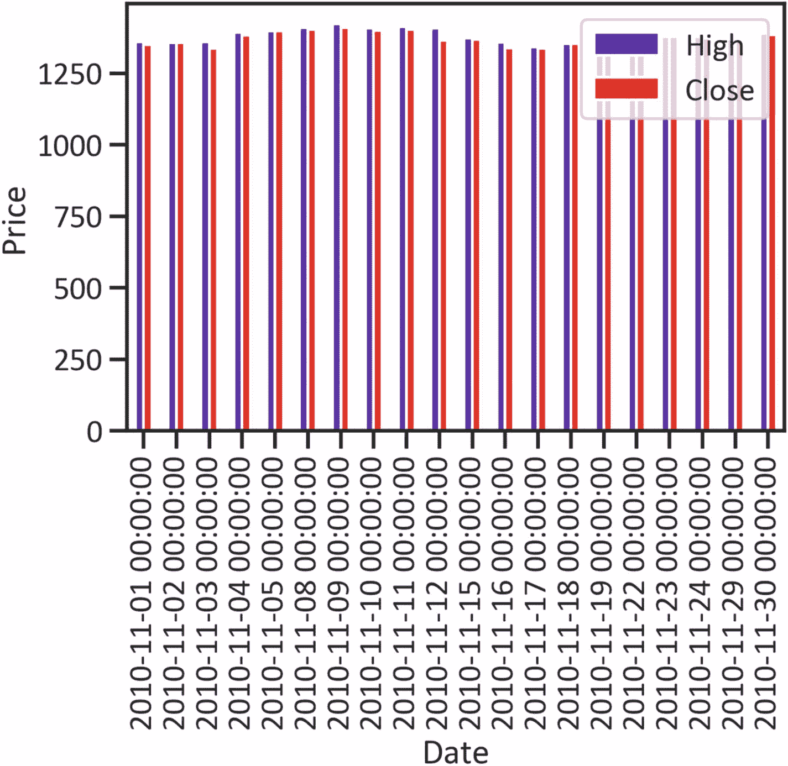

图 6-8

低价和调整后的收盘价

```py
df_orig[['High','Close']].head(20).plot(kind='bar',cmap="rainbow")
plt.ylabel("Price")
plt.show()

Listing 6-11High and Adjusted Close Prices

```

列表 [6-12](#PC12) 显示了 2020 年 11 月 1 日至 2020 年 11 月 2 日期间的交易量(见图 [6-9](#Fig9) )。

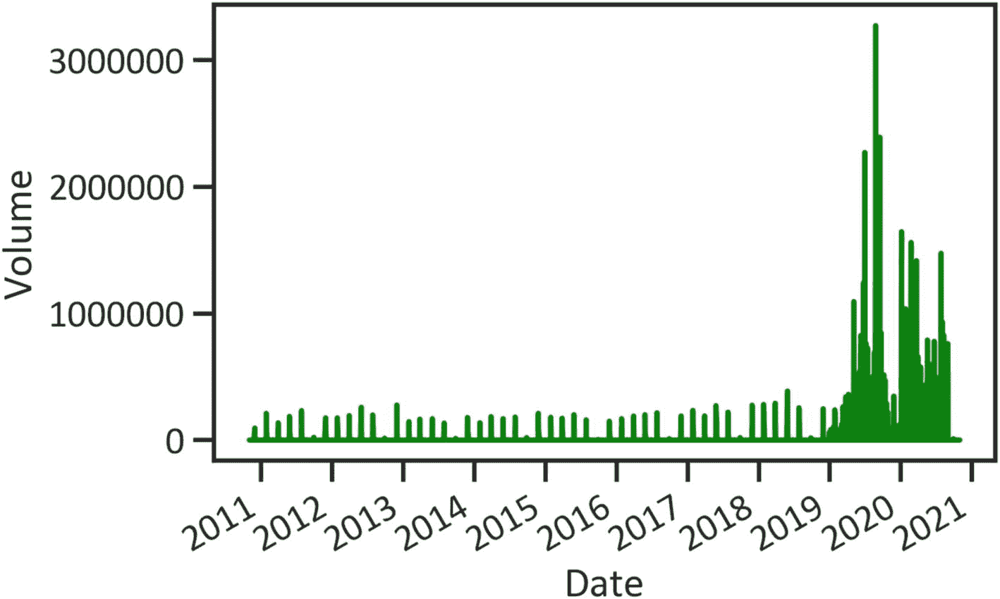

图 6-9

卷

```py
df_orig.Volume.plot(color="green")
plt.ylabel("Volume")

Listing 6-12Volume

```

图 [6-1](#Fig1) 显示，从 2011 年到 2019 年初，市场参与不太活跃。2019 年年中，该数量呈指数级增长，超过 300 万。2019 年后，贸易额出现严重下滑；数量在 50 万到 200 万之间。

### 开发最小二乘模型

清单 [6-13](#PC13) 应用 80/20 分割比率将数据分割成训练和测试数据。

```py
from sklearn.model_selection import train_test_split
x_train, x_test, y_train, y_test = train_test_split(x,y,test_size=0.2, random_state=0)

Listing 6-13Split Data into Training and Test Data

```

清单 [6-14](#PC14) 使用`StandardScaler()`方法标准化训练数据(以平均值为 0，标准偏差为 1 的方式转换数据)。

```py
from sklearn.model_selection import StandardScaler
scaler = StandardScaler()
x_train = scaler.fit_transform(x_train)
x_test = scaler.transform(x_test)

Listing 6-14Normalize Data

```

清单 [6-15](#PC15) 用默认超参数拟合最小二乘模型。

```py
from sklearn.linear_model import LinearRegression
lm = LinearRegression()
lm.fit(x_train,y_train)

Listing 6-15Develop the Least Squares Model

```

清单 [6-16](#PC16) 定义了一个函数，通过应用 R <sup>2</sup> 作为查找交叉验证分数的标准来查找交叉验证分数的平均值和标准偏差。

```py
from sklearn.model_selection import cross_val_score
def get_val_score(model):
    scores = cross_val_score(model, x_train, y_train, scoring="r2")
    print("CV mean: ", np.mean(scores))
    print("CV std: ", np.std(scores))
    print("\n")

Listing 6-16Develop a Function to Obtain Cross-Validation Mean and Standard Deviation

```

清单 [6-17](#PC17) 打印交叉验证分数的平均值和标准偏差值。

```py
get_val_score(lm)
CV mean:  0.9473235769188586
CV std:  0.018455084710127526

Listing 6-17Cross-Validation Mean and Standard Deviation

```

清单 [6-18](#PC18) 查找参数的名称和默认值。

```py
lm.get_params()

Listing 6-18Find Default Parameters

```

清单 [6-19](#PC19) 创建一个网格模型。超参数表示我们在训练之前必须为模型配置的设置或值。我们执行超参数优化，以确定产生最佳模型性能的值。`GridSearchCV`方法考虑所有参数并发现最合适的组合。例如，在清单 [6-19](#PC19) 中，我们想知道我们是否必须拟合截距，在拟合模型之前归一化 X，并复制 X

```py
from sklearn.model_selection import GridSearchCV
param_grid = {'fit_intercept':[True,False],
              'normalize':[True,False],
              'copy_X':[True, False]}
grid_model  = GridSearchCV(estimator=lm,
                           param_grid=param_grid,
                           n_jobs=-1)
grid_model.fit(x_train,y_train)

Listing 6-19Develop a Grid Model

```

清单 [6-20](#PC20) 查找最佳分数和最佳超参数。

```py
print("Best score: ", grid_model.best_score_, "Best parameters: ", grid_model.best_params_)

Listing 6-20Hyperparameter Optimization

```

结果如下:

*   最佳成绩 : 0 分。18660.888686886617

*   *最佳参数* : {'copy_X': True，' fit_intercept': True，' normalize': False}

清单 [6-21](#PC21) 通过应用网格模型返回的超参数来训练模型，从而完成最小二乘模型。

```py
lm = LinearRegression(copy_X= True,
                      fit_intercept= True,
                      normalize= False)
lm.fit(x_train,y_train)

Listing 6-21Finalize the Least Squares Model

```

清单 [6-22](#PC22) 找到截距。截距是自变量的平均值，假设我们持有因变量常数。

```py
lm.intercept_
15.725513886138613

Listing 6-22Intercept

```

清单 [6-23](#PC23) 估算系数。

```py
lm.coef_
array([1.45904887, 0.04329147])

Listing 6-23Coefficients

```

### 模型评估

清单 [6-24](#PC24) 应用`predict()`方法返回表 [6-3](#Tab3) (它突出显示回归器产生的值)。

表 6-3

预报

<colgroup><col class="tcol1 align-left"> <col class="tcol2 align-left"></colgroup> 
|   | 

预报

 |
| --- | --- |
| **0** | 1469.400024 |
| **1** | 1466.699951 |
| **2** | 1475.599976 |
| **3** | 1478.400024 |
| **4** | 1475.000000 |
| **...** | ... |
| **253** | 1902.699951 |
| **254** | 1908.800049 |
| **255** | 1876.199951 |
| **256** | 1865.599976 |
| **257** | 1877.400024 |

```py
y_pred = lm.predict(x_test)
pd.DataFrame(y_pred,columns=["Forecast"])

Listing 6-24Forecast Values

```

清单 [6-25](#PC25) 绘制了调整后收盘价的未来实例(见图 [6-10](#Fig10) )。

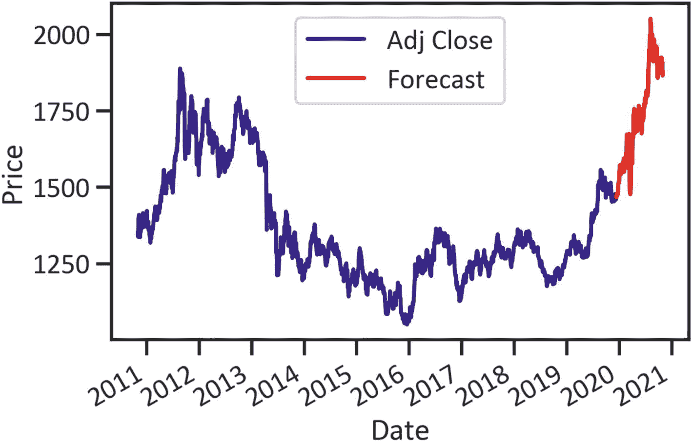

图 6-10

预报

```py
num_samples = df.shape[0]
df['Forecast'] = np.nan
df['Forecast'][int(0.9*num_samples):num_samples]=y_pred
df['Adj Close'].plot(color="navy")
df['Forecast'].plot(color="red")
plt.legend(loc="best")
plt.xlabel('Date')
plt.ylabel('Price')
plt.show()

Listing 6-25Forecast

```

清单 [6-26](#PC26) 返回一个包含回归器性能信息的表格(见表 [6-4](#Tab4) )。它显示了关键的回归评估指标，如平均绝对误差(不考虑方向的误差大小)、均方误差(考虑线性关系后解释的可变性)和 R2 分数(由关于数据的模型解释的可变性)。

表 6-4

模型性能

<colgroup><col class="tcol1 align-left"> <col class="tcol2 align-left"></colgroup> 
|   | 

价值观念

 |
| --- | --- |
|  | 2.820139e-13 |
| 姆塞 | 1.150198e-25 |
| RMSE | 3.391457e-13 |
| **R2** | 1.000000e+00 |
| **解释方差得分** | 1.000000e+00 |
| **平均伽马偏差** | -2.581914e-18 |
| **平均泊松偏差** | 0.000000e+00 |

```py
from sklearn import metrics
MAE = metrics.mean_absolute_error(y_test,y_pred)
MSE = metrics.mean_squared_error(y_test,y_pred)
RMSE = np.sqrt(MSE)
R2 = metrics.r2_score(y_test,y_pred)
EV = metrics.explained_variance_score(y_test,y_pred)
MGD = metrics.mean_gamma_deviance(y_test,y_pred)
MPD = metrics.mean_poisson_deviance(y_test,y_pred)
lmmodelevaluation = [[MAE,MSE,RMSE,R2,EV,MGD,MPD]]
lmmodelevaluationdata = pd.DataFrame(lmmodelevaluation,
                                     index = ["Values"],
                                     columns = ["MAE",
                                                "MSE",
                                                "RMSE",
                                                "R2",
                                                "Explained variance score",
                                                "Mean gamma deviance",
                                                "Mean Poisson deviance"]).transpose()
lmmodelevaluationdata

Listing 6-26Model Performance

```

表 [6-4](#Tab4) 强调了该模型解释了数据中 100%的可变性。时间序列数据中存在显著的相关性。平均而言，不考虑方向的误差幅度为 2.82，误差的平均和为 1.15。

## 结论

在本章中，我们简要介绍了最小二乘模型及其应用。首先，我们讨论了协方差和相关性。接下来，我们向您展示了如何设计、构建和测试回归器。在仔细检查回归器的性能后，我们发现该模型能最好地解释数据。我们可以用它来进行可靠的未来价格预测。在下一章中，我们将讨论市场模拟。