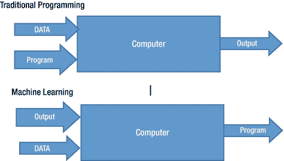
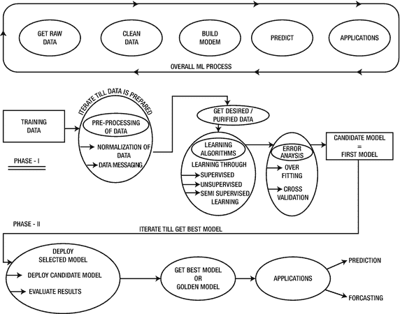
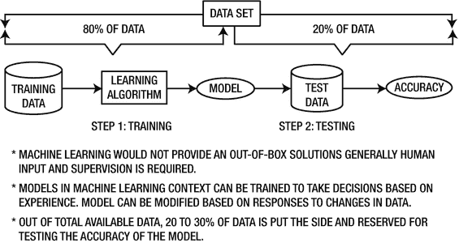
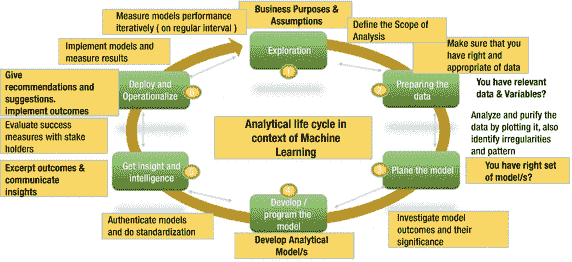
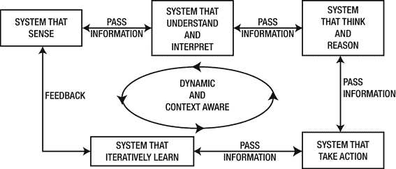
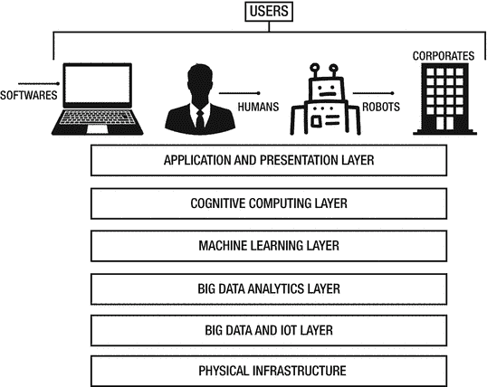
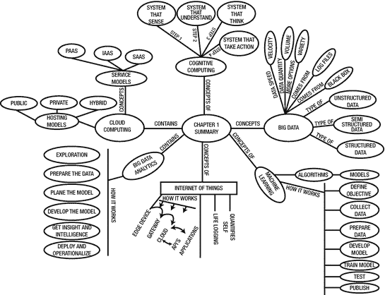

# 1.让我们与机器学习相结合

在这一章中，我介绍了机器学习如何与物联网、大数据分析、云和认知计算等其他技术相结合的整体概要。从技术上讲，机器学习不能也“永远”不应该被孤立地理解。这是一个多学科的课题。这就是为什么在进入机器学习技术领域的细节之前，需要一套概念和技术的综合视图。即使出于学术目的，如果有人想了解机器学习的工作原理，他们也必须详细了解具体细节。因此，商业领袖和经理们自然会对机器学习有一个整体和综合的理解，以抓住这个主题。如果他们出于商业原因对这门学科感兴趣，这就变得更重要了。既然你已经开始阅读这本书，我假设你想要熟悉机器学习的概念。

在我努力提供机器学习及其相关技术的概念基础的过程中，我解决了多个商业问题，例如“什么是机器学习？”“机器学习的商业案例是什么？”，“我们如何使用机器学习？”，“机器学习的关键特征是什么？”，“哪里可以实现机器学习？”，“机器学习中使用的主要技术/类型是什么？”，以及“为什么商业需要机器学习？”

这些问题将在本章或后面的章节中详细回答。此外，在适当的地方讨论了成功的机器学习实现的关键商业利益和价值。

几乎同样的问题、想法和概念也适用于其他相关技术。本章探讨高级分析背后的核心概念，并讨论如何在知识驱动的认知环境中利用它们。通过适当级别的高级分析，系统可以获得更深入的见解，并以更准确、更有洞察力的方式预测业务结果。因此，以实用的方式研究它们是至关重要的。本章设置了知识平台，并为您提供了您正在寻找的实用知识。

## 你的业务，我的技术，以及我们思想的相互作用

我的论点很简单，你会在整本书中发现它的影子。我认为技术——如云、大数据分析、机器学习和认知计算——能够促进增长、利润和收入。我的重点不是逐步解释这个模型及其好处，而是解释它背后的技术。

在任何业务场景中，结果或成果都有多个维度。但是对企业、商业领袖和利益相关者来说，重要的是知道它如何影响他们的商业策略。结果取决于多种因素，例如基础设施准备就绪的速度、每次过渡的成本、新应用的实现时间，甚至包括供应商在内的合作伙伴如何融入整个供应链和决策过程。另一个重要因素是企业的自动化水平(自下而上)。

机器学习，或者换句话说，“自动化的自动化”，以及认知计算正在改变决策的方式。单调、重复和不太熟练的人工干预正被“智能”自动化所取代，这正在改变决策的动力。然而，这样做的结果是积极的，提高了整体业务流程和决策制定的效率和有效性。它将对企业利润、收入增长和运营效率产生影响。企业将在其投资的所有层面和领域获得商业价值，无论是 it 基础设施、IT 应用、业务流程、运营还是财务。如果他们采用正确的基于环境的方法来采用技术，那么好处一定会到来。

采用云使公司能够快速配置资源，并降低每个过渡和工作站的成本。在基于云的环境中，应用开发的大部分需求都是按需提供的，因此实现新应用的速度很快。供应商可以获得强大的供应链，因此整合他们的服务和物流变得很容易。云以自动化的方式提供按需数据分析和基于机器学习的面向上下文的认知计算功能。这使得企业能够享受高收入增长和增加的投资回报。

如果我们跟踪过去几年 IT 行业的趋势和方向，就会发现一个非常明显的信号——行业在新一代技术上下了很大的赌注。旧的思想和技术支柱正在被摧毁，新的思想和技术支柱正在迅速堆积。IBM、微软、谷歌和脸书近年来申请的专利显示了该行业的发展方向。微软是专利申请的领导者，自 2009 年以来，已有超过 200 项人工智能相关的专利申请。谷歌以 150 多项专利申请位居第二。专利包括云计算、认知计算、大数据分析和机器学习的元素。以下链接提供了近年来的专利概况。

*   [T2`https://www-03.ibm.com/press/us/en/presskit/42874.wss`](https://www-03.ibm.com/press/us/en/presskit/42874.wss)
*   [T2`https://cbi-blog.s3.amazonaws.com/blog/wp-content/uploads/2017/01/1-ai-patents-overall.png`](https://cbi-blog.s3.amazonaws.com/blog/wp-content/uploads/2017/01/1-ai-patents-overall.png)

云、物联网(IoT)、大数据和分析实现了有效和适当的机器学习实现和有针对性的策略。机器学习是认知计算的核心，它为企业提供基于证据的实时自动化决策能力。你将在期望的步骤中获得有针对性的知识，并能够将所有的片段组合在一起，以可视化完整的图片。其实这是一次从数据到智慧的旅程。你通过物联网系统和其他数据来源获得数据，将数据存储在基于云的数据存储中，然后对其应用分析技术，从中获得意义。然后，您通过应用机器学习技术来自动执行分析过程，以找到模式并做出准确的预测，从而获得更好的业务结果。您可以通过模型/算法的迭代运行来细化结果。选项由置信度和建议证据支持。端到端解决方案！

这里值得一提的是，这种技术的分离和层的划分是合乎逻辑的，即在标准和专业文献中没有定义“硬”边界。例如，许多技术文献将大数据分析和机器学习结合在一起。一些人将机器学习和认知计算视为一体。然而，分离使思维过程整洁，因此我采用这种方法。

通过研究当前和未来创新和基于知识的商业生态系统的五大技术支柱(云、大数据、物联网、机器学习和认知计算)，您将能够得出正确的推论，并为您的企业做出合适的商业战略和决策。在本章结束时，你将理解这些技术是什么，它们意味着什么，以及它们对商业生态系统有什么影响。

## 机器学习概述

如今，机器学习是一个迷人的概念，几乎商界的每个人都在谈论它。这是一项很有前途的技术，有可能改变普遍的商业环境，带来行动上的颠覆。决策者已经开始考虑将机器学习作为一种工具来设计和实现他们的战略和创新思想。在组织或企业中实现机器学习并不容易。其中一个原因是缺乏有用和可靠的数据。拥有相关数据对于有效的机器学习实现是必不可少的。但是，获得相关的和纯化的数据是一个巨大的挑战。借助物联网技术和大数据分析领域的最新进步和发展，企业现在可以相对轻松地高效地存储和分析数据。这种按需和实时大数据可用性的奢侈导致了机器学习项目、产品、应用和服务的成功实现。

这也使决策者能够创造一些伟大的和振奋人心的战略。正因为如此，我们开始看到、听到、实现围绕机器学习的成果和成功故事。机器学习的概念并不是最近才出现的，它可以追溯到人工智能和专家系统。如前所述，最近一段时间，由于一些开创性的成就，它受到了很多关注和牵引。例如，IBM Watson 比医生更好地预测肿瘤结果的能力，或者脸书在准确识别人脸方面的成功。

在机器学习和大数据分析的时代，广义预测几乎是每个科学/商业决策的核心。对数据归纳的研究是机器学习的中心课题。在当前和未来的业务场景中，预测结果是组织成功的关键。决策者希望看到并允许制定和实现策略，这些策略不仅要考虑历史数据，还要从中得到意义。乐观地说，他们希望这能自动发生。expect 系统将“预测”客户的行为，并将他们未来的需求作为报告提交给他们。然后，公司可以根据报告和仪表盘实时做出有效的决策。例如，在投资银行中，决策者希望开发软件来帮助他们的信用风险官预测最有可能的客户违约。一家电信公司希望根据客户的行为分析来预测客户拖欠账单的倾向。这将为他们提供实时的未来支付责任预测。基于客户的历史支付细节和机器学习，这是很有可能的。

事实上，决策者不仅仅满足于预测，他们更感兴趣的是了解为什么有人要做某事。决策者希望探究故事的“为什么”,并围绕这种心态或行为制定他们的策略。从技术上来说，我们知道，机器学习从数据中学习。学习的结果取决于对数据集的分析水平。因此，看一看学习分析的水平是很重要的。我在这里给出了这个概念的一个简短的引子，并在后面的章节中回来，在那里它需要进一步的阐述。

通常，有四个级别的学习分析与机器学习相关联:

*   描述性的:已经发生了什么，正在发生什么？它通常着眼于事实、数据和数字，并提供详细的分析。它用于为高级分析或日常商业智能准备数据。
*   诊断:为什么会这样？检查描述性元素，并允许批判性推理。
*   预测:会发生什么？提供不同的元素并关注结果。证明未来的可能性和趋势。使用统计技术，如线性和逻辑回归，以了解趋势和预测未来的结果。
*   规定性:我应该做什么，为什么要做？如何通过使用一组特定的要素来实现特定的结果或成果。它的重点是决策和效率的提高。模拟用于分析复杂的系统行为和识别用途。

认知计算领域的最新发展鼓励了认知分析，因为它的输出更像人类，所以更有益。认知分析将视角分析推向了新的高度。公司本质上需要规定性分析来推动洞察、建议和优化。认知分析实际上是随着时间的推移进行测试、学习和适应，并获得更深刻的见解。它高度自信地实时弥合了机器学习、大数据和实际决策之间的差距，并提供了上下文洞察。

基于对数据集执行的分析级别的结果，公司根据其需求鼓励或阻止特定行为。这引发了人机协作、合作和沟通的新时代。当机器识别模式时，人类的责任是解释它们，将它们放到不同的微细分中，并推荐和建议一些行动过程。简而言之，机器学习技术是为了帮助人类完善和增加他们的潜力。

## 机器学习的细节

机器学习以其多学科性质而闻名。它包括多个研究领域，从哲学到社会学到人工智能。然而，在本书中，机器学习被视为人工智能的一个子领域，被解释为机器以人类的方式学习、思考和解决问题或争议的能力。它帮助计算机(软件)在没有明确编程的情况下行动和响应。

以下是机器学习的一些正式定义:

*   机器学习与允许计算机学习的算法和技术的设计和开发有关。ML 的主要焦点是通过计算和统计方法从数据中自动提取信息。因此，它与数据挖掘和统计学密切相关。(斯文森和索德伯格，2008 年)
*   机器学习继承和借鉴了许多领域的概念和成果，例如人工智能、概率统计、计算复杂性理论、控制理论、信息论、哲学、心理学、神经生物学和其他领域。(米切尔，1997 年，第 2 页)

以下是关于机器学习的一些重要亮点:

*   机器学习是一种人工智能(AI)，它使计算机能够在没有显式编程的情况下进行学习。
*   机器或软件通过机器学习从过去的经验中学习。
*   软件可以通过以迭代的方式使用智能程序(机器学习)来提高其性能。
*   机器学习算法具有学习、教授、适应变化以及随着数据/环境中的经验而改进的能力。
*   机器学习是关于开发代码，使机器能够学习执行任务。
*   如果计算机程序或算法从与某类任务和性能测量相关的经验中学习(迭代)，则它被视为学习程序。
*   如果机器学习程序在任务中的性能随着经验(基于数据)而提高，那么它就是成功的。

机器学习专注于使用高级计算机制来开发动态算法，这些算法可以检测数据中的模式，从经验中学习，调整程序，并相应地进行改进。

机器学习的目的是在无序的复杂性中找到有意义的简单性和信息/洞察力。它试图使用基于其学习的过去经验来优化性能标准。实际上，数据驱动的科学是通过一套数据驱动的算法运行的。机器学习为计算机提供了在“巨大的数据仓库”中发现和发现模式的能力。

机器学习不是使用传统的程序编程方式(如果条件 A 有效，则执行 B 组任务)，而是使用先进的计算机制技术，允许计算机从经验中学习，并相应地调整和改进程序。见图 [1-1](#Fig1) 。

图 1-1。

Traditional programming compared to machine learning Quick Bytes

我们什么时候应用机器学习？

*   当系统需要动态、自学习和自适应时。
*   在多次迭代和复杂程序的时候。
*   如果必须立即实时做出决定。
*   当我们有复杂的多个来源和大量的时间序列数据时。
*   当需要对观察进行概括时。

机器学习的应用:

*   机器洞察力和计算机视觉，包括物体识别
*   自然语言处理，句法模式识别
*   搜索引擎、医学分析、脑机接口
*   检测信用卡欺诈、股票市场分析、DNA 序列分类
*   语音和手写识别、自适应网站、机器人移动
*   计算广告、计算金融、健康监测
*   情感分析/意见挖掘、情感计算、信息检索
*   推荐系统，系统优化

机器学习从根本上帮助教会计算机(通过数据、逻辑和软件)“如何学习和做什么”。机器学习程序寻找或发现数据中的模式，然后相应地采取行动。计算包括两个阶段(见图 [1-2](#Fig2) )。

*   在计算的第一阶段，机器学习算法或程序识别指定的数据集。在此基础上，它会提出一个模型。
*   第二阶段使用该模型(在第一阶段创建)进行预测。

这个序列在迭代中继续，用户得到精确的结果。在迭代中通过自身学习是机器学习算法和程序的基本特征。为了实现这一点，机器学习主要使用两种方法，称为监督和非监督学习。

图 1-2。

Machine learning process

### 监督学习

监督学习是输出变量已知的学习过程。变量的输出证据明确用于训练。在监督学习中，数据有“标签”，换句话说，你知道你试图预测什么。实际上，这个算法包含一个目标或结果变量，它是从一组给定的预测器(独立变量)中预测出来的。使用这组变量，将生成一个将输入映射到预期结果的函数。训练过程一直进行到模型在训练数据上达到预期的正确水平(见图 [1-3](#Fig3) )。

图 1-3。

Supervised learning

1.  学习或训练:模型使用训练数据进行学习。
2.  使用看不见的测试数据测试模型，以测试模型的准确性。

### 无监督学习

在无监督学习中，结果是未知的。聚类发生在可用的数据集上，以揭示有意义的分区和层次。与监督学习不同，非监督学习用于没有历史记录的数据。在无监督学习中，算法必须探索并找到被超越的数据。此外，它必须找到数据集中隐藏的结构。数据的类别级别未知。在无监督学习中，没有目标或结果变量可以预测/估计。

无监督学习用于从不同的可用聚类中填充特定的聚类。这种技术最适合将客户划分到不同的群中，以获得特定的参与度。它的一些应用领域是自组织映射、最近邻映射、奇异值分解和 k-均值聚类。像亚马逊这样的电子商务公司使用这种技术进行在线推荐、识别数据异常值和分割文本主题。

机器学习改变了数据提取和解释的方式。它使用通用方法和算法的自动集合。在此之前，传统的统计技术被用于类似类型的分析。公司正在利用这些新的学习理论和实践来创收。因此，机器学习已经开始影响许多商业和研究机构。产品和服务围绕机器学习构建，以实现市场领先地位。

由于颠覆和创新是大多数商业战略成功的咒语，机器学习及其相关技术占据了中心舞台。这是数据密集型机器学习方法在科学、技术、商业和管理领域被采用的主要原因。这是一场革命，在各行各业的计算机的帮助下，它正引导着行业做出更多基于证据的决策。循证决策的五个步骤是:

1.  提问:将实际问题转化为可回答的问题。
2.  获取:系统地搜索和检索证据。
3.  评价:批判性地判断证据的可信度。
4.  应用:将证据纳入决策过程。
5.  评估:评估决策的结果。

机器学习具有强大的科学基础，包括模式重组、数学优化、计算学习理论、自我优化、自然启发的算法等研究。机器学习是如此普遍，以至于我们每天都在不知不觉中使用它几十次。我们将它用于在线娱乐(网飞)、实用的语音识别(苹果的 Siri)、有效的网络搜索，以及增进我们对人类基因组的了解。机器学习回答了如何建立智能计算机和软件，通过自我学习来提高自己的能力，并协助各行各业的人类。

### 机器学习的特征

现在是时候来看看机器学习的特点了。理解这些特征会让你对这项技术有一个全面的认识。我们来看看特点:

*   基于用户需求自动采用和修改行为的能力。例如，个性化的电子邮件或新闻。
*   从大量事实数据库中发现新知识的能力。
*   能够协助人类，并取代单调的任务，这需要一些智能。
*   能够通过反复操作数据和从错误中学习来产生“洞察力”。

### 机器学习当前面临的商业挑战

机器学习的实现包含许多挑战。它的应用领域和范围很广，因此面临的挑战也是多方面的。让我们来看看它们。

处理、管理和使用复杂和异构的数据:每天(准确地说，每秒钟)都会从客户的多个异构数据源生成大量复杂的数据。然而，从这些数据中获得洞察力是一个挑战。此外，数据可用性有时会使业务需求/决策变得更加复杂和耗时，因为客户的需求和期望非常高。满足客户的期望是一项具有挑战性的任务。

通常，未知的关系和相关性隐藏在大量多源和多结构的数据中。开发从这些数据中发现有意义规律的算法是另一组挑战。然而，机器学习与先进的计算、数据处理和分析技术的结合使之成为可能。

存储、管理和分析大量数据是一项挑战。然而，机器学习、大数据和存储技术的最新进展为我们提供了一系列解决方案来应对数据复杂性和异构性的挑战。好的方面是这些提供的解决方案是可扩展的、定制的、快速的、自动化的、准确的和高效的。它们还支持实时环境。

动态业务场景、系统和方法:关于任务、活动和业务的新知识和见解不断被人类发现、生成和创造。因此，如果在前面提到的领域(包括从动态基础上的组织角度来看的业务环境)中发生频繁的变化，则很难连续地“手工”重新设计或重新创建同步的系统和模型。因此，复杂的数据和不断变化的业务场景需要一些方法和技术来教会系统(计算机)代表它们这样做。然而，创建这种类型的动态系统并不容易。为了应对这一挑战，机器学习是最重要的工具之一。最大似然系统根据定义好的方法进行预测，这种方法在本质上是自我动态和自适应的。由于它们是动态的、灵活的系统，所以可以提高它们的计算效率。

不可预测的系统行为:系统设计者和技术专家经常制造出不能按预期工作的机器。即使他们全力以赴地工作，他们在提供实时帮助和决策支持方面也不太有效。然而，企业通常需要高效、专注且准确的系统，轻松高效地满足他们的需求。因此，能够学会在很少或没有人工干预的情况下自己得出结论并帮助做出决策的系统是当前所需要的。但是，设计一个或多个系统来解决决策中普遍存在的不可预测性是一项具有挑战性的任务。随着传统技术的出现，这变得更加乏味。机器学习技术能够通过分析数据来实现这一点，而无需事先对业务数据的结构做出任何假设。因此，面对不可预测的系统行为的挑战，ML 是最好的可用技术。

### 机器学习的需求和商业驱动力

ML 是当今最被炒作和成长的领域，位于计算机科学、统计学、人工智能和数据科学的交叉点。决策者、数据科学家、软件开发人员和研究人员正在使用机器学习来获得洞察力和竞争力。他们正在努力实现以前遥不可及的目标。例如，从经验中学习并理解消费者行为的程序/软件/机器在几年前是不可能的。然而，提供购买建议、识别图像和防止欺诈系统现在已经成为生活的一部分。

新的学习算法和创新研究的发展推动了机器学习的最新进展，在线和离线数据的持续爆炸为其提供了支持。此外，低成本计算的可用性也起着重要作用。以下是证明机器学习的必要性的几个驱动力，并看看它的业务驱动力。

*   数据的多样性:数据是从不同的渠道产生的，其性质和格式是不同的。
*   容量和维度:数据源数量的增加和业务多样化的全球化导致数据呈指数级增长。
*   速度:随着数据量的增加，捕获和转换数据的速度也必须提高。
*   复杂性:随着数据复杂性的增加，需要高质量和安全性的数据来进行数据收集、转换和分析，以实现快速决策。
*   适用性:上述这些因素会损害数据对业务流程和性能改进的适用性。

## 什么是大数据和大数据分析？

大数据是我们这个时代的重要概念之一。这是一种席卷全球的现象。数据正以每年近 60%的复合年增长率增长。根据研究，这些海量数据中有 70%是非结构化的。非结构化数据的示例有视频文件、与社交媒体相关的数据等。看一看数据本身的多样性就知道了这个故事以及与之相关的挑战。大数据是 IT 和商业界的热门话题。不同的人对此有不同的看法和意见。然而，每个人都同意:

*   大数据是指海量的非结构化或半结构化数据。
*   存储如此庞大的细节超出了典型的传统数据库系统(关系数据库)的能力。
*   传统软件工具无法捕获、管理和处理大数据。

大数据是一个相对术语，取决于组织的规模。大数据不仅仅指传统的数据仓库，还包括可用于实时应用的运营数据存储。此外，大数据是关于从可用数据中发现价值，这是企业成功的关键。公司试图更好地了解他们的客户，以便为他们提供更有针对性的产品和服务。为此，他们越来越多地采用分析技术对更大的数据集进行分析。为了有效、高效和准确地对数据执行操作，他们正在扩展传统数据集，将它们与社交媒体数据、文本分析和传感器数据相集成，以全面了解客户的行为。

一旦对数据进行分析，更多的数据可能会提供准确的见解。所以，大数据也可以成为优化业务流程的利器。公司开始使用它来创建新的流程或微调现有的流程。例如，零售商根据预测模型的建议优化他们的库存，预测模型通过分析社交媒体、网络搜索趋势和天气预报数据生成“洞察力”。领导者明白，这只是大数据和分析时代的开始，如果他们没有意识到或不愿意利用这一点，他们肯定会落后，并失去竞争优势。这对他们来说是一个巨大的风险！

以下是一些关于大数据的正式定义和一些见解:

*   大数据是指其规模超出典型数据库软件工具捕获、存储、管理和分析能力的数据集。
*   分析公司 IDC 将其定义为:大数据技术描述了新一代的技术和架构，旨在通过实现高速捕获、发现和/或分析，从大量各种各样的数据中经济地提取价值。
*   大卫·凯洛格(David Kellogg)用非常简单的语言将大数据定义为“大到无法用当前/传统技术合理处理”，咨询公司麦肯锡公司(McKinsey & Company)也同意这一点。
*   大数据技术描述了新一代的技术和架构，旨在通过实现高速捕获、发现和/或分析，从大量各种各样的数据中经济地提取价值。在当今世界，大数据在创造卓越商业价值方面发挥着重要作用。如今，这包括从各种数据源生成的大量数据，如企业范围的交易系统、机器日志、RFID 系统、传感器数据源、客户呼叫中心、网络日志和社交媒体日志。
*   大数据是高容量、高速度的数据资源，要求以经济高效的创新方式处理信息，以获得更好的洞察力和有效的决策。

The Major Sources of Big Data

*   黑匣子数据:这是飞机产生的数据，包括喷气式飞机和直升机。黑匣子数据包含飞行人员的声音、麦克风录音和飞机性能相关信息。
*   社交媒体数据:Twitter、脸书、Instagram、Pinterest 和 Google+等社交媒体网站产生的数据。
*   股票交易数据:这通常包含交易员或个人客户做出的股票买卖决定的相关信息。
*   电网数据:这包含基于使用信息、功耗细节等的节点信息。
*   运输数据:这包含关于可能的容量、车辆型号、车辆可用性和车辆行驶距离的信息。现在，随着车辆内置智能系统并通过物联网连接，它们产生的信息量是巨大的。
*   搜索引擎数据:这是大数据的主要原因和来源之一。搜索引擎有大量的数据库和信息库，它们从那里获取和存储这种类型的数据。

### 大数据的三个 v

小型组织的大数据就是大型组织的小数据。对于一些企业来说，2TB 可能显得很大，而对于其他企业来说，20TB 可能很大。一些较大的企业认为 200GB 很大。这个术语是定性的、相对的，很难做出统一的指引。因此，有必要通过一些特征来识别大数据。大数据的这些特征通常被称为大数据的三个 v:

*   速度:近时、实时、批处理等。
*   多样性:结构化、非结构化、半结构化、日志、传感器数据、图像等。
*   容量:兆兆字节、千兆字节、事务、文件、记录等。

#### 速度

大数据是快速增长的数据。数据增长的速度是惊人的。一些预测说，每秒钟观看全球网络上的大量视频需要五到六年的时间。速度表示创建数据的速度。不同的应用有不同的延迟要求。然而，在当今的竞争环境中，领导者和决策者希望尽快从数据/信息中提取必要的“洞察力”。一旦数据到达企业边界，即时分析就是成功的关键。这是必需的，因为数据、信息和洞察力与决策紧密结合。对于不同的业务，数据以不同的速度产生，大部分是实时或接近实时的。例如，交易和股票相关数据、Twitter 上的推文、脸书/其他社交媒体网站上的状态更新/喜欢/分享，以及许多其他实时/接近实时生成的数据。

#### 多样

多样性表示创建和存储数据的不同格式。不同的应用以不同的格式创建和存储数据。在当今的业务环境中，组织或企业正在创建和维护大量的非结构化、结构化和半结构化数据。在大数据技术领域取得巨大进步之前，该行业没有任何可靠的工具和技术可以处理企业获得的如此庞大的非结构化数据。

数据不仅存储在传统的平面文件、电子表格、关系数据库等中。，但是许多非结构化数据以图像、音频文件、视频文件、网络日志、传感器数据和许多其他格式的形式存储。这种数据格式多样化的特征在大数据环境中被称为多样性。除了数字、表格和文字等结构化数据，大数据还包括大量非结构化数据，如来自传感器的视频监控、流、医疗记录和发布到社交网站的照片等。我们都知道，即使它是非结构化的，它也会非常有用，因为这种非结构化的多样性，它构成了最大的挑战。大多数技术专家预测，在未来的时间里，大多数互联网流量将是视频，特别是长格式视频。

在当前动态变化的业务场景中，企业需要来自所有来源的数据。这包括来自企业数据库和仓库系统的结构化数据，以及在组织外部生成的数据类型，如点击流数据、社交媒体等。将这些数据集成到组织的现有系统中，使他们能够实时或接近实时地与客户保持联系。这种与客户的密切关系有助于组织保持竞争力和相关性。

#### 卷

容量表示企业用于多种目的的数据的大小。随着最近技术的进步和发展以及社交媒体的普及，数据量正在快速增长。这些数据以不同的格式分布在不同的地方，数据量很大，从千兆字节到千兆字节、千兆字节甚至更多。数据不仅仅是由个人创造和生成的，大量的数据也是由机器创造的。

大数据通常以 TB(1，000 GB)甚至 Pb(1，000 TB)的数据量来衡量。1000 Pb 等于 1，1000 EB 等于 1 zetta byte，相当于 10 亿 TB。为了可视化一个 zettabyte，想象一下这个——如果一杯 11 盎司的咖啡代表 10 亿字节的数据，那么 zettabyte 就是中国的长城。

### 什么是分析

分析基本上是在有意义的数据集模式中发现和寻找交流，这可以通过任何数据集实现，无论大小。实际上，大数据并不是利用分析和推动基于数据的决策的必要标准。如果大数据不符合三个 Vs 参数，就不具备大数据的资格。

分析生命周期经历了六个主要的标准和稳健的程序阶段，这些阶段相互依赖、相互关联，直到每个阶段都满足特定的标准(见图 [1-4](#Fig4) )。运营始于对业务环境的了解，止于得出结果、提出建议、实现以及将发现纳入系统。最后，通过定期校准，不断提高模型性能的准确性和效率。如图 [1-4](#Fig4) 所示。

图 1-4。

Major steps followed in analytics

以下列表以综合方式解释了分析中涉及的所有主要步骤:

*   业务目标和假设:在此阶段，将分析大数据平台中的业务场景、目标和数据可用性。这也称为发现阶段。
*   数据提取、准备和采样:在第二阶段，定义变量列表和用于分析的暂定时间段。
*   模型规划和预测模型/算法的开发:在此阶段，设计模型，并最终确定基于结果的高效模型。
*   得出结果，制定战略解决方案、建议和可操作性:在这一阶段，根据结果及其向战略解决方案的转化，从模型中得出见解。在此阶段还会提出业务建议。最后，在建议的基础上制定行动项目，公司可以根据他们的优先事项和偏好实现这些项目。

## 什么是云计算？

云计算的一个被广泛采用的定义来自美国国家标准与技术研究所:

*   云计算是一种模式，支持对可配置计算资源(例如，网络、服务器、存储、应用和服务)的共享池进行无处不在的、方便的、按需的网络访问，可以通过最少的管理工作或服务提供商交互来快速调配和发布这些资源。

在抽象层面上，云计算是最佳实践的集合，可以成为设计、实现和使用传统和创新技术的方法之一。云计算范例使企业能够以简单、高效和可靠的方式实现解决方案。云计算与围绕建立和发展过程、框架和最佳实践的组合创建稳定、健壮和安全的技术基础的技术诀窍相关。云计算模式具有以下特点:

*   五大特征
*   三种服务模式
*   云计算的四种部署模式

让我们详细了解一下特性、服务和部署模型。

### 云计算的本质特征

以下是基本特征:

*   按需自助服务和配置:这一特性使用户能够根据需要自行配置计算能力。这包括但不限于管理服务器时间和存储。服务的供应自动发生，无需人工交互和干预。
*   更广泛的网络接入:服务和其它能力可通过网络的网络获得。这些服务通过多种平台、框架、设备和装置提供给用户。移动电话、笔记本电脑、台式机和可穿戴系统等设备和装置通过更广泛的网络连接到大量用户，并可供他们使用。更宽的网络接入提供了高可用性，这在多个业务场景中非常关键。
*   资源池化:计算资源和服务被池化以服务具有不同物理和虚拟资源的多个消费者。根据消费者需求动态分配和取消分配资源的功能使得资源池非常有用。
*   快速弹性:快速提供计算和其他资源能力的能力，在大多数情况下自动快速扩展，并快速释放以快速扩展，实现快速弹性。
*   可测量的服务:资源和服务的使用可以被监控、测量、控制和报告，主要是在仪表板或图形用户界面的帮助下。因此，服务的提供者和消费者了解他们使用服务和产品的数量和时间。这对战略决策和微调过程至关重要。
*   动态定价模型:动态定价模型，因此用户可以在按使用付费的基础上使用服务和其他功能。

特征、需求、部署和服务模型的组合创建了云解决方案。这个解决方案由许多供应商提供，包括微软、谷歌、亚马逊和 IBM。现在我们来看看服务和部署模型。

### 部署模型

有三种不同类型的云计算部署模型，通常称为公共、私有和混合。

*   公共云:在公共云部署模型中，资源通过互联网共享，由不同的团体、个人或组织按需使用。典型的公共云产品是应用和服务。这同样适用于按使用付费模式的用户。在这个部署模型中，提供者和消费者之间存在一对多的关系。这意味着一个提供商服务于多个用户。
*   私有云:如果有一个提供者和一个消费者，它属于私有部署模型。在这种类型的服务模型中，消费者和提供者之间存在一对一的映射。这些资源不是共享的，而是专用于组织、个人用户或企业。定制很容易，但没有规模经济的空间。
*   Hybrid cloud: A hybrid cloud refers to a mix or combination of public and private clouds. In this model, a combination of two or more deployment models (public and private) are integrated. This model is popular among users for multiple reasons. It provides the power of flexibility and control on the resources. For instance, a banking organization may use public cloud for storing non-critical and unimportant transactional data but use private cloud for storing and monitoring critical information, like bank details of customer (sometimes they would rather use on-premise arrangements for that). For additional information related to risk and benefits, see Table [1-1](#Tab1).

    表 1-1。

    Deployment Model Benefits and Risks

    <colgroup><col> <col> <col></colgroup> 
    | 部署模型 | 利益 | 风险和问题 |
    | 公共 | 1.成本 2。上市时间。弹性 4。自助服务 5。简单 | 1.缺乏控制。安全 3。监管与合规 4。数据迁移 5。应用开发。软件许可。供应商锁定 8。限制 |
    | 私人的 | 1.控制 2。安全 3。服从 | 1.音阶 2。管理工具。收费 4。收养 5。投资收益率 |
    | 混合物 | 1.灵活性 2。安全 3。效率 | 1.多点故障 2。与公共和私有托管模式相关的大多数风险和问题在这里也同样适用 |

除了流行的部署模型(即公共、私有和混合)之外，还存在另一种变体，通常称为社区云。这是一项专业服务。

在社区云模型中，基础设施由多个组织共享。它支持有共同关注的特定社区。因此，它是一种服务模型，为有限数量的个人或组织提供云计算解决方案，这些个人或组织由所有参与组织共同治理、管理和保护。另一种可能性是，所有这些都由第三方服务提供商管理和维护，该提供商向所有相关方(在这种情况下是组织)提供公共服务。

### 服务模式

有三种不同的云服务产品—基础设施即服务(IaaS)、平台即服务(PaaS)和软件即服务(SaaS)。除了这些，还有很多其他的，比如功能即服务，分析即服务，机器学习即服务，甚至生活即服务，一切即服务。但是，这里只讨论主要的三种。

*   基础设施即服务(IaaS):提供商提供高度选择性的计算功能，如计算能力、存储、归档或其他可通过互联网(准确地说是在云上)获得的基础设施组件。他们通常将可定制的公用事业定价和交付方案与产品联系起来。服务提供商拥有设备、网络设备和存储硬件，并负责托管、编码、操作和维护。
*   平台即服务(PaaS):服务提供商提供或建立全功能计算和解决方案或技术堆栈。一旦平台被“建立”，应用就被部署在其上。提供商为环境或“平台”提供网络、服务器和存储。他们还负责与可伸缩性和维护相关的需求。
*   软件即服务(SaaS):应用由供应商或提供商托管，并通过网络提供给消费者。通常是通过互联网。软件应用功能通过基于使用的定价模型交付。大量用户共享底层应用资源。

有关这些服务模式相关优势的详细信息，请参见表 [1-2](#Tab2) 。

表 1-2。

Benefits of Service Models

<colgroup><col> <col></colgroup> 
| 服务模式 | 利益 |
| --- | --- |
| 软件即服务(SaaS) | 应用集中托管软件测试速度更快降低 IT 运营成本无需安装新软件或发布更新 |
| 平台即服务(PaaS) | 促进托管功能设计和开发应用集成 web 服务和数据库提供安全性、可扩展性和存储 |
| 基础设施即服务(IaaS) | 桌面虚拟化互联网可用性计费模式的使用计算机化管理任务 |

随着云计算模式的持续快速发展，以“即服务”模式为形式的新业务不断出现。例如，大数据和云的集成现在产生了分析(AaaS)。它是一个服务平台，旨在以更快、可扩展的方式集成、分析、转换和可视化结构化、半结构化和非结构化数据(实时)。

类似地，其他模型和服务，如合规性即服务、通信即服务和人力资源即服务，都是针对特定需求的。在非常原始的形式中，这种业务模式被描述为“任何东西都是服务”，或缩写为“XaaS”，其中 X 表示某人想要的可以在云中获得的任何服务。

### 云计算的挑战

以下是与云计算相关的挑战:

*   隐私和安全:云环境数据不是托管在公司自己的基础设施上，因此公司对安全性和隐私有所顾虑。数据泄露或病毒攻击的可能性潜在地导致安全和隐私方面的危急情况。但是，提供商或第三方在强大的体系结构、智能备份技术、安全框架、适当的部署模型以及自动化流程和策略的帮助下，解决了之前的所有问题。此外，云计算现在是成熟的技术，能够处理任何与安全和隐私相关的挑战。
*   可用性:从云的角度来看，可用性是系统或组件运行的时间与它需要或预期运行的总时间的比率。这可以通过直接比例(例如，8/10 或 0.8)或百分比(例如，80%)来表达。可用性通常由应用或服务器在给定时间段内的停机时间总和来衡量。通常，年份被用作标准参数。为了准确计算，计划外停机时间和计划内停机时间都考虑在内。此外，云提供商无法保证其外部互联网连接的正常运行时间，这可能会关闭对云的所有访问。
*   可靠性:从云计算环境的角度来看，可靠性是指与云相关的硬件或软件组件持续完成和执行任务的能力。性能的一致性和任务的完成必须根据服务提供者给出的规范和承诺同步。理论上，一个可靠的产品或服务是完全没有错误的。在实践中，云供应商或服务提供商通常用百分比来表示产品的可靠性。然而，在现实生活中，云服务提供商的基础设施或设备会出现停机和服务故障的情况。有时会发生非常严重的事件，最终影响业务。这引发了人们对云解决方案和产品可信度的担忧。然而，企业现在已经准备好应对基于云的环境中某种程度的故障和可靠性问题。云服务供应商通常保证 99.999%的正常运行时间。随着新技术的出现，他们也能够实现承诺。但一些公司仍然对停电时失去控制持怀疑态度。
*   文化变革:企业希望在 it 领域建立“创新、敏捷、灵活和快速采用的文化”，尤其是在基于云的环境中，因为就其本质而言，IT 是敏捷和动态的。It 企业支持新的想法、思想和项目快速起步并允许更快的迭代是很重要的。云计算有助于缩短配置环境的准备时间，对于企业来说，它将时间从数周缩短到几分钟。构建环境的成本也显著下降。现收现付的定价模式确保企业在实验完成后不必担心基础设施和资源成本。此外，这也降低了实验成本。云还提供了多种现成的特性、功能和工具来支持敏捷开发。

## IoT 是什么？

物联网(IoT)被理解为传感器和设备的自配置无线网络。它的最终目标和目的是连接所有的“事物或物体”。在物联网中，一个物体或事物通过互联网与其他物体或事物相连，要么作为数据源，要么作为消费者。一些对象可能配备了小型计算机或处理单元，可以处理它们接收到的数据。

大多数专家认为，物联网对我们生活的影响将远远超过迄今为止计算机和互联网的综合影响。随着物联网(IoT)的到来，近场通信(NFC)和可穿戴智能手机等技术已经成为现实，并融入了我们的日常生活。

物联网通过将不同的想法、元素和组件整合在一起，基本上整合了物理和数字世界。它试图创建一个无缝互联的设备(有线或无线)网络，通过互联网以整体的方式进行通信。连接的设备数量以万亿计。实际上，我们可以将物联网想象为对象网络，这是指常见对象的联网互连。

这是一个既定的事实，物联网通过其对社会和商业的更广泛影响，影响着几乎每个企业和个人。

此外，移动、云、机器学习、认知计算和物联网的集成影响了一系列业务运营和个人习惯。例如，它改变了组织中用于连接目的的设备类型。与创新服务相结合的新一代连接设备实现了独特的智能系统。这些智能系统由物联网设备生成的数据驱动。

物联网有助于企业提高效率和效力，并利用各种互联和可用设备的智能。总体而言，一旦一个组织由物联网驱动，其运营能力就会提高。这反过来以客户满意度的形式得到回报。物联网也将对人们的生活产生深刻的影响。它有助于通过更好的信息和更快的运输和通信来改善公共安全、运输和医疗保健。事实上，物联网以多种方式影响着社会、人们和组织。

这里提到了物联网的一些正式定义:

*   物联网是利用互联网技术与我们周围的日常事物联系起来。
*   物联网从连接您的物品开始，也就是对您的业务最重要的物品。物联网就是让你的数据以新的方式聚集在一起。利用支持物联网的仪表盘获取数据。发现可操作的情报。它有助于您实现业务现代化。(微软，在其物联网登陆页面。)
*   物联网将智能物体链接到互联网。它可以实现前所未有的数据交换，并以更安全的方式为用户提供信息。思科估计，到 2020 年，物联网将由 500 亿台连接到互联网的设备组成。使用我们的物联网系统获得更深入的分析洞察力，以提高生产力、创建新的业务模式并创造新的收入流。(思科，在其物联网登陆页面。)

### 物联网的演进、发展和未来

物联网的量子增长和普遍性创造了多种访问异构数据的方式。它还提升了从绝望的数据源中提取数据的分析技术，并组合了对决策非常重要的数据类型。积累、存储和连接所有这些数据，然后从中获得意义的能力将有助于企业脱颖而出。实时访问和分析数据的能力提供了快速增长的机会，并给他们的业务模式带来了颠覆。

Jargon Buster

*   生活日志是跟踪和维护我们自己的行为活动产生的个人数据的过程。你可以通过简单地使用笔或纸或者通过电子工具和应用来帮助你做到这一点。生活日志最初是作为一种保存原始个人数据的方式出现的。生活日志实际上跟踪个人行为数据，如锻炼、运动、跑步、睡觉和吃饭。
*   量化的自我可以定义为通过数字的自知。量化自我是指分析生活日志数据，找出个人数据集之间的相关性，并在此基础上得出结论。

所有这一切的目标是改善个人的健康、福利和生活。

### 物联网的特征

物联网设备通过无线和有线互联网连接链接或连接到互联网。这些传感器和设备可以使用多种类型的局域网和连接，如 RFID、NFC、WiFi 和蓝牙进行连接。传感器还可以具有广域连接，例如全球移动通信系统(GSM)、通用分组无线业务(GPRS)、第三代/第四代(3G/4G)移动网络和长期演进(LTE)。物联网将做到以下几点。

能够连接非生物和生物:物联网系统必须能够连接到互联网。它包括几乎所有的东西，从工业机械到家庭到日常用品。物品的类型从汽车到宇宙飞船到牙刷。它也可以是生物、有机体，例如植物、农场动物和人。

物联网有通过互联网连接一切的潜力。因此，基于其本质，下一步通常被称为“万物互联”，这一术语起源于思科。指的是物联网的自然延伸。愿景是连接一切，包括人、地点、对象、流程和数据。基本上，任何可以通过传感器和网络潜在连接到互联网的东西都参与到这些连接的生态系统中。

能够通过传感器收集和传输数据:被连接的物理对象必须包含传感器(一个或多个)。每个传感器都能够感测特定的条件，如位置、振动、运动、手势和温度。在物联网生态系统中，这些传感器和设备相互连接，并连接到其他系统，这些系统可以理解并根据传感器的数据反馈提供信息。这些传感器必须能够为企业的系统、流程和人员提供新信息。

通过 IP 网络进行通信:支持物联网的设备或装置可以通过底层支持技术相互通信。技术为支持物联网的对象提供了能力，通过这些对象，他们可以与人、软件系统和其他机器共享有关其状况和周围环境的数据。这些数据可以实时共享、存储或收集，并可随时随地根据需要最大化业务收益。

随着物联网系统和生态系统的成熟，网络上的一切(人、地点、流程和事物)都将具有数字身份和连接性。这意味着可以实时识别和跟踪“事物、地点、人或物体”。它们可以根据情况的危急程度实时与对象或对象系统进行通信。众所周知，互联设备的数量非常大，并且在快速增长。因此，由于可用 IP 地址数量有限，IPv4 标准是不够的，因此鼓励使用 IPv6。

物联网的概念随着互联网的成熟而发展。智能设备和服务正变得日益智能。

### 物联网的挑战

物联网技术和商业生态系统需要大量的研究和专业知识来建立、设置、运营和执行，然后才能开始获得回报。这些生态系统具有复杂的技术特性，包括流程需求、网络多样性、数据和设备的异构性，因此需要采取谨慎和深思熟虑的方法进行决策。因此，它们的实现面临许多挑战。说到这里，我们来看看物联网生态系统面临的挑战。

*   与各种利益相关者、设备、标准、硬件和协议合作:建立、构建和确保物联网生态系统正常运行是最大的挑战之一。因为它涉及到多种多样的技术、协议、流程和与多个利益相关方的沟通方法的微调和同步。此外，它可以与各种设备一起工作，并确保所有东西都以理想的方式整体工作，这是一个挑战。
*   管理远程设备:物联网云生态系统通常包含大量传感器、网关、设备和装置。此外，它们分布在不同的地理位置，其中一些可能位于偏远地区。以高效和有效的方式远程管理所有这些设备，使它们以集成的方式工作，是主要挑战之一。
*   设备的互操作性:数据和通信的无缝传输，以及它们之间的同步和协作是一个挑战。因为数据在复杂的网络上流动，有时在网络的网络上流动。数据流的这种性质要求传感器、设备和其他设备之间的无缝通信。通常，设备由不同的供应商和公司根据其专业领域来制造或创造。实现设备、传感器和装置的互操作性是一个挑战。
*   数据集成和整合:一旦物联网系统或生态系统建立起来，来自多个传感器、移动设备、社交媒体网络以及其他网络或连接资源的数据流开始以特定的方式到来。该数据持续可用。最大的挑战之一是通过确保数据完整性不被破坏来处理数据，并且它与应用逻辑同步可用。
*   系统灵活性:物联网仍处于萌芽阶段，有些不成熟。它的标准和协议仍在发展，并处于发展的开始阶段。当它们完全发展成为一个成熟的系统时，越来越多的传感器和应用将会涌现出来，并以一种无组织和随机的方式增加。因此，现有的应用、网络、设备和服务生态系统需要足够灵活，以适应未来的变化。
*   数据安全:在物联网生态系统中，大部分数据是从各种设备收集的，这些设备是企业或个人专用网络的一部分。它包含敏感的个人和企业业务关键数据，需要加以保护，防止未经授权的访问。
*   处理巨大的数据量:物联网系统处理许多设备，这导致大量数据以高频率出现。实时管理、测量和有效使用这些数据是一项挑战。它与数据性能和延迟问题密切相关。

### 物联网的工作原理

物联网生态系统由许多组件或层构成或创建。在设备层面，如前所述，它包含一些传感器和处理单元。然后，互联网或确切地说是网络出现了，它将这些设备连接到更大的网络。网关充当这些传感器、其他微小设备和装置之间的安全桥梁。它还通过标准网络连接到云。顶层处理物联网生态系统的整体监控和管理。同样在这一层，对收集和保存的数据执行分析，包括应用和物联网生态系统展现的价值。

现在，让我们来看看物联网生态系统的每个部分，以及它所涉及的广泛技术:

*   网关可以用于多种目的，但其中有两个非常重要。首先，它可以作为将收集的边缘数据迁移到云的桥梁，其次，它可以用作数据处理器。网关有助于减少通往云的可用数据量，因为它通过根据可用数据即时做出决策来过滤“垃圾数据”。

*   边缘设备和传感器:物联网是关于设备和对象之间的无缝通信和连接。这是通过边缘设备和传感器实现的。他们可以感知和触发不同层次的参与。其中一个例子是在可穿戴设备领域，智能腕带和手表包含生物识别传感组件。在汽车领域，你会发现智能设备的网络和套件通过传感器相互协调和通信，并与用户一起封装复杂性。这些“技术上”连接的系统为驾驶员提供了更愉快的驾驶体验。
*   网关及其通信技术:网关是物联网环境的重要组成部分。物联网网关是设备和网络之间的“中间”设备。网关提供从设备和装置向网络收集和安全传输数据的能力。网关本质上不是一个单独的组件，而是一个连接到所有远程设备的网关网络。它通常能够随着设备的增长而扩展。

云是物联网生态系统不可或缺的一部分。物联网赋予了云扩展和弹性的能力。随着边缘设备的数据增长，扩展存储和网络资源的能力变得非常重要。云环境中的计算资源支持物联网生态系统的发展。在云计算环境中，虚拟化使弹性计算成为可能。虚拟化提供了将一个处理器分割成两个或更多虚拟处理器的灵活性，其中每个虚拟处理器在逻辑上时间共享物理处理器。当一个处理器需要更少的计算能力和资源，而另一个虚拟处理器需要更多的资源时，系统可以逻辑地利用这些物理资源。这实现了可用资源的最大化利用。

虚拟化不是一个新概念；它已经足够成熟，可以为几乎所有可用于信息技术的技术栈增加价值，尤其是云计算和相关领域。虚拟化意味着当更多的物联网数据从边缘设备流出时，物理处理器可以根据需要自动增加，以应对这些数据流的需求。当数据流减少时，可以将这些资源重新分配给其他任务和职责，以节省电力、精力和成本。

## 什么是认知计算？

“认知”一词指的是认识的心理过程，包括意识、简明性、洞察力、推理能力和判断力等特征。认知计算指的是自学系统，它使用数据挖掘、模式识别和匹配以及自然语言处理，与人脑的工作方式非常相似。

在形式上，我们可以将认知计算系统定义为能够学习并与用户自然交互，以扩展人类或机器的能力。这样，在没有认知计算支持的环境下，人类就能做更多他们自己能做的事情。这些系统将自行响应环境，无需预先编程。他们可以感知、学习、推断和互动。简而言之，认知计算系统可以感知或感知环境，并根据需要和情况收集数据。根据收集的数据和信息理解、解释和分析“上下文”，并根据推理做出决定并采取相应行动。

广义的认知计算系统使用机器学习算法和大数据分析来实现期望的行为，但它并不局限于这些技术。认知计算的目标是创建自动化系统，不仅能够解决问题，而且能够在不需要人类帮助的情况下，从可用选项中提出最佳可能的替代方案。从技术上讲，认知计算系统可以访问和分析大量历史数据，然后应用机器学习算法和技术来确定所有这些信息片段之间的联系和相关性。它使用知识库作为发现模式、决策支持和深度学习的工具。它决定在给定的情况下什么是正确的，并在适当的时间、适当的环境下提供适当的答案。

认知计算的一些专业定义:

*   认知计算是在计算机模型中对人类思维过程的模拟。认知计算涉及自学系统，这些系统使用数据挖掘、模式识别和自然语言处理来模仿人脑的工作方式。认知计算的目标是创建自动化的 IT 系统，能够在不需要人类帮助的情况下解决问题。(Whatis.com)
*   认知计算系统基于面向对话的自然语言界面和机器学习算法；拥有知识支持的流程并模仿人类的决策能力，使人和机器能够更自然地互动，从而通过智能地分析大量数据并在现在所需时间的一小部分内提出见解和解决方案来扩展人类的专业知识和效率。(Wipro 的认知计算登陆页面。)

认知系统不同于当前的计算系统，因为它们超越了制表、计算和预先编译的规则和程序。这项技术允许人们和企业使用英语等自然语言与计算机进行交互。

这使得客户能够以更自然的方式传达他们的想法、关注和期望。因此，理解客户和用户要容易得多。这种“自然的人类般的理解”使组织和企业能够实现最高程度的客户满意度，并帮助他们赢得客户的信任。此外，他们能够获得客户的喜悦，从而产生终身的客户关系忠诚度。用自然语言与计算机和自动化系统(机器人)进行交互的想法并不新鲜。其实是科幻片和 sorties(包括星球大战)最喜欢的话题之一。

以下是一些认知计算的使用案例，说明这些系统可以实现什么:

*   通过实时诊断进行应用管理:识别与应用相关的问题，并提供解决方案，在用户意识到之前修复这些问题。
*   服务帮助台:通过电话/视频/文本方式了解用户的问题，并实时提供解决方案。
*   安全控制与管理:对设备、器材、社会，通过人脸、语音、肢体动作识别。
*   生产力管理:将智能融入日常任务中，以减少/最小化人力。

### 认知计算如何工作

认知技术使设备和事物能够像人类一样通过视觉和听觉来感知，然后通过在预测个体需求的背景下进行实时推理和分析来做出推断。最后，这些技术使设备能够基于上下文“直观地”以活动的形式采取行动。

过去，用户需要以某种预定义的格式书写文本来执行任务，这样系统才能理解并相应地产生结果。而在认知环境中，系统基于数据分析理解情况，并通过对数据集应用智能来产生适当的结果。如果用户想要进行搜索，他们必须手动输入关键词，而在自然语言处理的帮助下，认知技术允许并允许人们在与系统交互时提问或用句子说话，就像他们与另一个人交谈以获得答案一样。

例如，使用苹果 Siri 或微软 Cortana，你只需提出一个问题，软件就会根据所有可用的选项分析你的问题(在内部，它使用机器学习和大数据技术来实现这一点)，并为你提供最合适的答案。

认知计算系统使用机器学习来随着时间变得更聪明，就像人类一样(见图 [1-5](#Fig5) )。与旧技术不同，新一代认知计算系统分析大量数据并产生见解。认知计算为解决人类今天面临的一些最大挑战提供了机会。它通过对抗癌症和帕金森氏症等疾病，帮助医生解决全球的健康危机。它允许科学家综合现有的研究并开发新的突破。它帮助政府和非营利组织规划和应对灾难。而且，它使几乎所有行业的企业都能够更好地为客户服务。

图 1-5。

Cognitive computing

认知计算受到人脑的启发，它通过作为我们感官的自然延伸来扩展我们的能力。它有可能根据上下文定制和个性化我们的体验，同时创建类似人类的与设备和事物的交互。它能够进行个性化。此外，个性化是基于用户在哪里、用户在做什么以及他们计划做什么来完成的。例如，当用户参加商务会议时，他的移动设备将向他显示会议的相关信息，代表他做笔记，甚至建议他下次会议的地点和时间。当他在家时，它会识别不同的家庭成员，并以适当的内容呈现每个成员。这将帮助他看到他的工作电子邮件，而他的孩子将看到他最喜欢的卡通节目。

从根本上说，认知技术使计算机能够通过分析数据来发现和发现数据中隐藏的模式，从而理解给定上下文中的结构化、半结构化和非结构化数据。然而，就像现在一样，人类最终会验证或丢弃从认知技术中获取的信息。这个过程反复发生，随着每一次迭代，认知计算机在识别模式方面变得更好。

在过去的几年里，我们见证了设备、机器和事物(包括汽车、冰箱和其他常用产品)变得越来越直观。他们正在帮助和简化我们的日常生活。最好的例子是智能手机，它越来越了解我们的偏好和周围环境。他们变得“聪明”，能够预测我们的需求，并在适当的时候为我们提供相关信息。

### 认知计算的特征

认知计算的特征如下:

*   参与对话生成和假设评估
*   理解和理解自然语言
*   为决策提供支持证据
*   消费异构(大)数据
*   带着一定程度的自信回答，并提供同样的证据
*   从每一次互动中学习，并随着时间的推移不断提高
*   为所提供的行动提供上下文指导和见解
*   为决策提供支持
*   关系之间的联系
*   在更深层次上理解用户

Nervana Systems: A Machine Learning Startup

Nervana Systems 最近被英特尔收购。他们是提供深度学习解决方案的专家。他们正在使用人工智能和机器学习或者更准确地说是“深度学习”作为计算范式。Nervana 正在建立从算法到硅的解决方案，以解决机器学习问题。在过去的两年里，Nervana Systems 的 Naveen Rao(创始人)和他的 48 人团队一直在开发技术，为下一代智能和智能应用提供动力。

Nervana 作为开发机器学习和认知技术的先驱之一获得了声誉和信誉。最近，美国芯片制造巨头英特尔以 4.08 亿美元收购了总部位于圣地亚哥的初创公司。Nervana 的创始人认为，他们的人工智能专业知识与英特尔的能力和巨大的市场影响力(英特尔拥有世界上最好的半导体技术)相结合，将使 Nervana 实现他们的愿景，创造出真正特殊的东西。创始人 Naveen Rao 向他的团队保证，他们将保持“创业心态”,同时与英特尔这样的大公司同步发展。Nervana Systems 由 Naveen Rao、Arjun Bansal 和 Amir Khosrowshaki 共同创建。

### 云、物联网、机器学习、大数据分析和认知计算如何协同工作

这些技术之间关系的复杂性使得认知计算和机器学习在实现物联网和大数据的真正价值方面至关重要。这种思想在技术和业务流程的动态和敏捷生态系统中变得更加相关，这些生态系统需要持续的创新和破坏。物联网的动机是将企业、数据和人更紧密地联系在一起。数据的效用会受到其自身复杂性的限制，直到从中得出有用的推论。没有感觉或推断，物联网数据是没有用的。

机器学习与分析相关联，通过实时连续处理(新数据)，通过模型和算法来提炼数据。这训练系统适应数据中变化的模式和关联。此外，更广泛的分析流程和工具有助于发现大量数据中的模式和异常，从而预测业务成果。

在这个完整的过程中，数据是非常重要的，因为对于毁灭或推荐的准确性。为了提供行动步骤，认知系统需要大量、有效和足够的数据。基于可用数据集的质量，认知系统可以发现数据集中的模式(在机器学习算法的帮助下)。如果数据不大，结果就不一致，不准确。这将导致不正确的毁灭和错误和无用的模式，这对企业来说是危险的，并违背了总体目标。认知系统还需要摄取和映射数据，以便系统可以开始发现数据源之间的联系，从而获得洞察力。

为了实现发现洞察力和价值的目标，认知系统使用几乎所有形式的数据，包括结构化、半结构化和非结构化数据。机器学习算法是这一切的核心和支柱。它们支持完整的流程，并通过发现数据中的模式、相关性和异常，在提供增值物联网和大数据服务方面发挥重要作用。

现在我们来看看这一总体思想的技术和实现。您可以通过物联网系统和其他来源(如日志文件和档案)获取数据。物联网充当数据生成器(因为物联网将虚拟和物理对象连接到互联网)和创造者的无限来源。云可以为物联网和其他数据源扮演组织者和资源提供者的角色。此外，云通常作为隐藏复杂性和实现功能的抽象。数据以连续和实时的方式存储在云中，然后应用数据分析来理解这些数据。机器学习技术寻找模式，为获得更好的业务结果做出预测。

让我们把这个系统化。为了便于理解，我将完整的流程分成了多个层次。然而，这不是标准的隔离，并且取决于实现。此外，它因企业而异，取决于围绕它的策略。例如，在一些实现中，机器学习层与数据分析层配对，而在其他认知计算实现中，该层与机器学习、数据分析和大数据层合并。但总的来说，所有专家都同意，层/技术是任何机器学习或认知计算实现策略的一部分。这里是完整故事的一瞥。

1.  云基础设施:这一层提供了云中所有的基础设施，包括软件和硬件资源。托管模型将根据需要给出选择哪个模型的选项。之后可以根据需要选择服务模式。一旦完成了，你就为下一步做好了准备。如果你已经准备好了这一层，那么直接进入下一层。没有必要强制某人“购买”云提供商提供的服务。您可以跳过这一步，转到其他层提供的可用服务。
2.  大数据层:这一层接收、存储并为您提供所有类型的数据(结构化、非结构化、半结构化，包括物联网和实时流数据块)，以供进一步分析。
3.  大数据分析层:在这一层，对大数据层接收和存储的数据进行分析。这一层对于任何认知或机器学习平台、架构或框架都非常重要。因为在这里，只有从数据后见之明到远见卓识才能实现。
4.  机器学习层:在这一层中，机器学习活动是在与数据分析层协作和密切沟通的情况下对数据执行的。可用的机器学习算法，即。监督、非监督和半监督在这里发挥作用，它们以迭代的方式对接收到的数据集重复运行算法。在此基础上，执行规定的、预测的和诊断的预测。
5.  认知计算层:在这一层中，执行认知计算活动。比如根据可用的行动项目列表建议最佳行动。为人机协作和交流提供自然语言“真实生活”界面。
6.  Presentation and reporting layer : This is the layer where the end user interacts with the system by either providing input or getting output. For example, if someone want to see some report that contains trends in a particular region of the country. He would get that information through the tools involved in this layer, like Microsoft BI.

    

    图 1-6。

    comprehensive model  

## 视频波道

[T2`http://pages.skytree.net/webinar-od-machine-learning-how-to-make-it-work-watch.html?aliId=7353129`](http://pages.skytree.net/webinar-od-machine-learning-how-to-make-it-work-watch.html?aliId=7353129)

## 摘要

本章为商业用户设置了机器学习和相关技术的背景。它还简要介绍了技术细节和业务案例，以及它们在当前业务生态系统中的重要性。它讨论了云、大数据、大数据分析、机器学习和认知计算。在本章的结尾，你会读到一个整体的综合模型，它以分层的方式包含了机器学习的所有相关技术。这解释了他们如何合作提供解决方案来应对业务挑战。

## 思维导图

