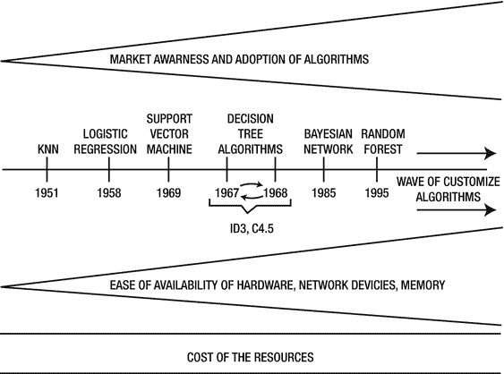
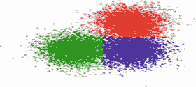
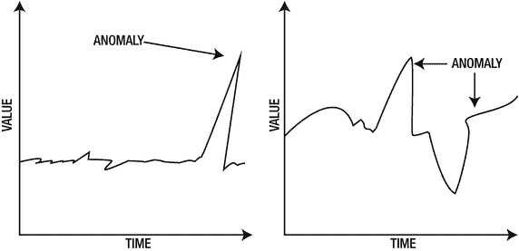
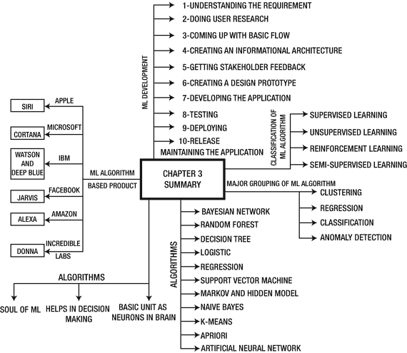

# 三、机器学习算法及其与现代技术的关系

在这一章中，我提供了机器学习算法的执行摘要。我这样做是因为对于任何决策者来说，理解、分析和评估业务和技术领域的基础现实是很重要的。这对于管理人员来说同样至关重要，因为对算法和相关技术的正确理解将使他们更有信心以更好的方式管理他们的项目。当涉及到基于机器学习的项目实现和策略时，由于该主题的高技术方面，它变得更加重要。因此，对算法及其在实时业务场景中的行为有一个实用的概述将启发您做出准确的决策，并为您的团队和组织定义深思熟虑的路线图。

算法是机器学习过程和技术的灵魂。但是它们很复杂，很难理解。在这一章中，我在复杂性和理解之间架起了一座桥梁。我用简单的英语借助例子、成功故事和实际场景解释了算法，以便任何人都可以解码潜在的智慧并使用它们。

## 算法，算法，无处不在

算法是解决问题的一系列步骤。人们通常把它们与计算机联系在一起。但是为什么呢？为了执行任务，计算机需要准确的指令和步骤。因此，如果我们想让计算机解决一个特定的问题，我们必须以步骤的形式提供适当准确的指令。换句话说，算法对计算机很重要，因为它们是计算机智能的基石。更准确地说，没有算法，计算机只是由材料和塑料组成的哑盒子。正如细胞在生物系统中发挥其作用一样，算法在软件中也有类似的意义。为了更好地理解，我们甚至可以在细胞和算法之间画一条平行线。

在过去的几十年里，硬件已经变得越来越便宜、越来越强大、越来越高效。这一进步使移动设备能够在本地和云中运行强大的机器学习、人工和深度学习算法。硬件的这一进步将为所有设备带来更深入、更集成的机器学习算法。然而，为了获得 ML 的最大好处，云模型总是可取的。此外，在产品和服务的本地和云实现之间没有硬性的分离规则。他们协同工作。算法已经成为商业中无处不在、不可或缺的一部分。例如，壳牌将算法用于石油勘探和实现市场竞争力，而微软和 IBM 则利用它们向其客户提供创新产品。在这些不断变化的时代，公司已经开始使用机器学习算法来提高内部效率，并加深消费者的忠诚度和信任。例如，网飞的观众信任算法来获得个性化的内容供他们欣赏。类似地，亚马逊的客户相信算法可以为他们的定制购买获得一些有用的产品和建议。

事实是，今天的算法是企业生产力和智能的非凡梯队。那些不能很快掌握算法的公司将面临风险。打个比喻，这类似于在计算机处理器和键盘时代用打字机工作。为了赢得大众的信任，算法走过了一段不平凡的旅程(见图 [3-1](#Fig1) )。观察最大似然算法的发展是很好的。

图 3-1。

The evolution of machine learning algorithms and adoption

## 机器学习算法的分类

数据科学或统计算法进一步分为多个机器学习特定算法类别:

*   监督学习算法(标签和输出已知)
*   无监督学习算法(标签和输出未知)
*   强化学习算法(基于奖励的代理行为)
*   半监督学习算法(监督和非监督的混合)

这些算法又包含多个子算法和类型(见表 [3-1](#Tab1) )。例如，一些算法属于参数化类别，而其他算法是非参数化的。在参数算法中，关于总体的信息是完全已知的，而非参数算法则不是这样。通常，参数模型处理有限数量的参数，而非参数学习模型能够处理无限数量的参数。因此，当训练数据增长时，非参数模型的复杂性会增加。线性回归、逻辑回归和支持向量机都是参数算法的例子。k 近邻和决策树是非参数学习算法。与非参数算法相比，这些算法的计算速度更快。

如表 [3-1](#Tab1) 所示，机器学习算法数量庞大。

表 3-1。

Machine Learning Algorithms

<colgroup><col> <col> <col></colgroup> 
| 监督学习 | 无监督学习 | 强化学习 |
| --- | --- | --- |
| 人工神经网络 | 人工神经网络 |   |
| 贝叶斯统计 | 关联规则学习 | q 学习 |
| 基于案例的推理 | 分层聚类 | 学习自动机 |
| 决策树 | 分割聚类 |   |
| 学习自动机 |   |   |
| 基于实例的学习 |   |   |
| 回归分析 |   |   |
| 线性分类器 |   |   |
| 决策树 |   |   |
| 贝叶斯网络 |   |   |
| 隐马尔可夫模型 |   |   |

出于方便和实用的原因，算法可以进一步分为四类:

*   使聚集
*   回归
*   分类
*   异常检测

这种分组有助于理解算法并提供清晰性。您可以在可用于机器学习的文献中找到其他分类和归类。然而，我在整本书中遵循并坚持前面提到的分类。那么，让我们开始用聚类探索算法奇妙世界的旅程吧。

### 使聚集

聚类是根据一些预定义的相似性或不相似性度量将样本收集到组中的活动。简而言之，在聚类中，特定聚类中的数据必须与该特定聚类的其他成员相似(见图 [3-2](#Fig2) )。例如，由于其对相似样本分组的特殊属性，它被用于将客户捆绑到营销或电子商务公司的不同细分市场中。

图 3-2。

Clustered data

这里提到了一些聚类类型:

*   分层聚类:生成一个组/聚类树，其中每个节点都是其母节点的子组。它是集群之间父子关系的一种形式。
    *   优点:更适合详细的数据分析
    *   缺点:效率低于非分层集群
*   非层次聚类:聚类之间的关系经常是不确定的。大多数非层次聚类算法是重复的。他们从一组原始的聚类开始，然后使用重新分配的方法反复改进它们。
    *   优点:如果数据集非常大，则更好
*   排他性聚类:一个项目属于一个聚类，而不是多个。
*   重叠群:一个项目属于多个群。

K-means 是应用最广泛的聚类算法之一。

#### 集群的应用和使用案例

以下是一些使用案例:

*   基于相似的功能进行分组。
*   用于汇总或减少大型数据集的大小。
*   客户细分。
*   图像和视频处理，以识别视频中的对象。
*   基于特定类别的植物、动物和人类的分类。
*   根据地震数据的类型确定可能的石油勘探区域。

#### 何时使用集群

当需要发现数据集中的结构时，聚类是一种很好的方法。

### 回归

回归用于预测值。例如，这类算法为您提供诸如“明天的温度是多少”或“一场体育比赛的总比分是多少”等问题的答案。回归算法属于监督学习。回归分析用于估计两个或多个变量之间的关系。

有数百种回归类型。这里讨论了主要的几个问题:

*   一种统计建模技术。它用于检查因变量和自变量之间的关系。这是最古老的回归类型之一。
*   逻辑回归:它是一种统计建模技术。它在行业中广泛用于多种目的，包括欺诈检测。
*   多项式回归:一种回归分析类型，处理自变量 x 和因变量 y 之间的关联，因变量 y 被建模为 x 中的 n 次多项式。反过来，多项式被定义为两个以上算术项的外观，特别是包含相同变量的不同幂的许多项的总和。它用于交叉验证。
*   岭回归:一种用于处理高度相关的多个独立变量的建模技术。

以下是优点:

*   预测和预报
*   用于查找异常值
*   易用性
*   高效使用数据
*   根据数据分析为业务决策提供支持
*   发现隐藏的和新的见解

现在缺点是:

*   有时输出超出范围
*   需要长期假设
*   对异常值非常敏感

#### 回归的应用和用例

一些使用案例:

*   预测
*   最佳化
*   评估金融服务和保险领域的风险
*   分析营销效果
*   商业和政府机构的需求预测
*   分析建议的放射对肿瘤的影响以减小其大小

#### 何时使用回归

当需求是预测和预测值时，回归是一个很好的选择。

### 分类

分类用于预测类别。例如，当一幅图像需要被分类为人或机器的图片时，这样做的算法将属于这一类别。它包含受监督的算法类型。如果你只有两个选择，这种分类被称为两类或二项式分类。当有两个以上的类别可用时，用于其分类的算法集称为多类分类。比如在回答类似“哪辆车最急需服务”这样的问题时？或者“哪趟航班会从德里到亚特兰大”？要回答这些问题，有多种选择。这些类型的场景需要进行多类分类研究。侧栏提供了分类和回归算法之间的差异的更广泛的解释。

Difference Between Classification and Regression

<colgroup><col> <col></colgroup> 
| 分类 | 回归 |
| --- | --- |
| 分类算法将输出分组。例如，它用于寻找诸如这种被识别的肿瘤是癌性的还是非癌性的等问题的答案。 | 回归算法用于使用训练数据预测值。例如，它将用于预测一家公司的特定股票的股价。 |
| 分类问题中使用了非连接变量和分类变量。 | 数字和连续变量用于衰退问题。 |

分类算法的更广泛类别是:

*   人工神经网络(ANN):一种模拟人脑功能的计算模型。它是在生物神经网络结构的基础上创建的。
*   决策树:广义而言，决策树是一种支持工具。为决策提供树状图表或模型。它还解释了决策的各种可能意义，包括但不限于偶然事件结果、资源支出和有用性。是呈现算法的方式之一。
*   集成学习:一种基于机器学习的模型，其中不同的学习者被训练来解决相同的问题。

分类算法的一些例子是:

*   线性分类器
*   支持向量机
*   二次分类器
*   核估计
*   助推
*   决策树
*   神经网络
*   随机森林
*   奈伊夫拜厄斯

分类算法包含多个子类别，因此有很多算法。所有的算法和类别都各有利弊。然而，在这里，我总结了一些基本的优点:

*   超级简单，易于解释和说明
*   高准确度
*   关于过度拟合的强大理论基础
*   数据集之间的简单关联

现在缺点是:

*   对于巨大的数据集不是很有效
*   容易过度合身
*   难以调整的参数
*   建立模型需要时间

#### 分类的应用和用例

一些使用案例:

*   视频、图像和音频分类
*   网页分类
*   产品分类
*   根据客户的行为和财务历史预测可能的银行贷款拖欠者
*   识别客户流失

#### 何时使用分类

当需求是预测和预测类别时，分类是一个很好的工具。

### 异常检测

异常被定义为偏离或背离标准、正常或预期的东西。有些情况下，需要在可用数据集中发现和观察异常。“识别的异常”数据点将有助于检测独特的行为(见图 [3-3](#Fig3) )。例如，您可以检测或识别员工行为的变化，这种变化表明员工可能违反了安全规定。这项活动将提醒你的雇主在损害发生之前采取纠正措施。异常检测也有助于欺诈检测。例如，任何异常的信用卡消费模式都会被怀疑。

图 3-3。

Anomaly detection

异常检测采用的方法是从正常的动作或活动中学习。在前面的示例中，算法分析非欺诈性交易的历史数据，并识别任何明显不同的数据。

分类算法的更广泛类别是:

*   监督异常检测:一组检测标记数据集中异常值的技术。标签可用于正常数据和异常值。
*   无监督异常检测:一组检测未标记数据集中异常值的技术。标签仅适用于正常数据。
*   半监督异常检测:一组检测未标记数据集中异常值的技术。不存在带标签的数据集。

由于异常检测算法包含多个子类，因此算法很多。所有的算法和类别都各有利弊。然而，在这里，我总结了一些基本的优点:

*   不需要被监督
*   轻松适应在线模式
*   适用于从时态数据中进行异常检测

现在缺点是:

*   计算成本高
*   将数据分组到不同密度的组中，这样易于管理

#### 异常检测的应用和用例

*   信用卡和其他金融欺诈检测
*   电信和零售欺诈检测
*   探伤
*   异常实例发现
*   识别不正确的数据
*   网络入侵检测

#### 何时使用异常检测

当需要找到不寻常的数据点时，异常检测是可以使用的工具。

## 如何根据您的需求选择正确的算法/模型

通常，模型开发和维护包括多个阶段，从收集数据到准备和准备数据。同样，应用不同的机器学习技术和算法来找到最适合给定需求的模型是非常重要的。根据数据集的变化不断调整算法的参数并提炼结果是最重要的。传统上，要完成这一切，数据科学家必须做大量的工作。他必须对模型进行编码，选择适当的参数，包括运行时环境。数据科学家还必须根据数据(包括批处理)训练模型，监控过程，并在需要时排除错误。跟踪完整周期中的所有步骤是单调的，因为流程会反复重复。

最后，数据科学家与其他团队合作，比较多个模型。他们这样做是基于精度和性能等参数。选择和部署性能最佳的模型。多个团队和个人参与整个模型的概念化、开发、验证和部署。简而言之:

1.  商业专家定义问题。
2.  基于这些数据，专家确定数据的来源，并提供一种使用过程、智能、经验和技术来收集和存储数据的机制。
3.  数据科学家通过算法的帮助创建实际模型，然后测试和部署应用或产品。他们通过使用过程、智力、经验和技术来做到这一点。
4.  业务专家验证一切是否正常。
5.  这个完整的流程以迭代的方式发生。
6.  流程的迭代执行有助于消除任何错误，并有助于优化模型。

在正确的地点、时间、条件和场景下使用正确的算法非常重要。此外，将算法与有效实现它们的特定需求相关联是一门艺术和科学。以下各节给出了这些算法的概要。

### 处理这个问题

对于任何机器学习算法的实现，在新一代编程语言中有许多编写良好、经过测试、灵活、健壮和高效的库可用。此外，它们是可定制的。因此，您可以根据自己的需求量身定制。然而，选择最佳的机器学习算法是一项非常主观的努力。这主要取决于您的需求、任务、领域、业务需求和可用的技术情况。

此外，算法的选择是基于人们面临的问题。例如，如果要求处理文本分类问题，那么支持向量机可能是一个好的选择，因为它提供了准确性和效率。而对于基于推荐的情况，决策树算法将是选择和处理的良好候选。因此，找到最佳算法和方法是一个相对的决定，它基于与您的特定需求相关的领域和情况，并取决于问题和业务需求。

### 选择正确的算法

当你有更少的选择时，做决定是容易的。例如，如果您有连续的问题需要解决，使用回归模型是一个直接的选择，而如果您必须从二元选项中选择，使用逻辑回归算法是明智的。然而，情况并非总是如此。我们会遇到许多我们应该解决的复杂问题和需求。通常，标准算法或它们的定制/修改版本被应用于解决问题或需求。这里有一些最佳实践、指南和标准，可以帮助您选择正确的算法或模型。

1.  数据调查和发现变量之间的关系。
2.  算法和模型的理性选择和有效比较。
3.  交叉验证。
4.  经过适当的调查、仔细的研究和提纯的数据。
5.  工具选择、易用性、基础设施的可用性、人才和其他资源。
6.  确定适当的目标和商业价值。
7.  学会把商业问题转化为机器学习算法。

#### 步骤 1:数据调查和寻找变量之间的关系

在选择算法时，了解数据的性质是非常重要的，以便可以将合适的算法附加到数据集上。例如，如果业务需求是分析视频和图像文件形式的非结构化数据，则关联算法必须高效处理非结构化和半结构化数据，如文本、时间序列、空间、图形数据和图像。如果不知道数据的性质，就永远不可能选择合适的算法。

数据调查是建立正确、有效和高效的预测模型不可避免的一部分。为了根据您的需求选择正确的算法和模型，需要确定关系并评估变量之间以及变量对整体环境的影响。为了得到一个理想的模型，必须选择好方法和与该方法相关的参数。

寻找最佳值以便在给定的数据集中获得尽可能高的精确度，这导致了密集的数据调查和寻找变量之间的关系。直觉和经验有助于获得最佳结果。通常，数据科学家训练大量模型，查看它们的交叉验证分数，并考虑决定下一步尝试什么参数。他们还进行适当的聚类或分组，以获得最佳结果。市场上有多种工具可用于进行数据调查，包括 Microsoft Azure。然而，如果数据集不太大，手动方法和过程也是有效的。

#### 第二步:算法和模型的理性选择和高效比较

一种算法不能满足所有要求，因此需要一种逻辑的、合理的、有统计支持的(数学驱动的)比较。不同指标的分析，如参数的统计显著性，在这里起着重要的作用。例如，决策树是一种流行的学习算法，用于进行预测和提出建议。因此，由于其准确性，它们被企业从业者广泛使用。然而，尽管在整个行业中流行和采用，决策树不应该不假思索地作为每个问题的算法。相反，您应该始终使用最适合数据特征和问题类型的算法。

#### 第三步:交叉验证

交叉验证是一种评估 ML 模型的方法，通过在呈现的输入数据的子类别上训练多个机器学习模型，并在数据的匹配子类别上评估它们。将数据集划分为两个集群或组，并对它们进行交叉验证，这是获得满足需求的正确模型和算法的一种很好的方式。交叉验证将训练数据分成许多部分，通常称为折叠。折叠只不过是将输入数据分成数据的子类别。在分割之后，除了一个(全部-1)子类别之外，所有的 ML 模型都被训练。

下一步是在没有用于训练的子类别上评估模型。这个过程重复多次(实际上等于折叠的总数)，每次保留不同的子类别用于评估(并且从训练中排除)。最后，选择性能最佳的模型。如果使用大量数据，交叉验证可能需要很长时间。因此，在构建和测试的初始阶段使用交叉验证模型是明智的。交叉验证通常用于检测过度拟合。交叉验证也是评估用于预测和预报的模型的最佳方式之一。

#### 第四步:适当的调查，仔细的研究和提纯数据

在类似情况下研究模型和算法的历史性能是有帮助的。机器学习算法的性能取决于数据质量；它们和数据一样好。因此，不适当的数据收集和清理方法将对您构建良好的预测性、可概括的机器学习模型的能力产生负面影响。另一方面，当经过仔细研究的数据与监管主题的自动化工具相集成时，专家将保证提供出色的见解。通常，遵循这一数据清理过程有助于识别与记录、特征、值或采样相关的数据质量问题。

#### 步骤 5:工具选择、易用性以及基础设施、人才和其他资源的可用性

选择实现算法的工具是非常重要的一步。此外，在为特定项目选择算法之前，需要考虑实现的容易程度、合适人才的可用性以及基础设施/资源。例如，算法处理的数据越多，它就变得越准确、高效和有效。因此，选择一个能够处理巨大数据集的工具成为最关键的方面。现在，即使你选择了最好的工具，如果你没有适当的才能来使用这个工具，这个工具实际上是没有用的。因此，在做出任何决定之前，必须考虑这些相互关联的方面。

#### 步骤 6:确定适当的目标和商业价值

理解数据中隐藏的特征，然后通过创建新的特征和消除不相关的特征来改进它们，这对可预测性有很大的影响。机器学习算法和方法意味着处理原始数据，并将它们转换到丰富的特征空间，这些特征空间可以被公司有效和高效地用于适当的商业目的。因此，需要找到用于表征数据的特征集合，该集合将更好地捕捉数据的各种复杂特征，例如非线性和多个特征之间的相互作用/相互依赖。这些对于学习过程的成功也很重要。选择适当的算法来确定适当的目标会影响业务价值，这对于应用和项目的最终成功非常重要。因此，在选择算法或模型时，必须考虑这一方面。

必须根据业务问题选择机器学习算法。例如，一些业务问题，如欺诈检测、产品建议/推荐、垃圾邮件检测和广告定位，都有“标准”的机器学习公式和算法，并在这些特定情况下有经过验证的跟踪记录。然而，即使对于这些众所周知的问题，也有一些鲜为人知但更强大的公式可以带来更高的预测准确性。因此，基于知识、业务目标和研究的选择是关键。

#### 第七步:学习和发展灵活性、适应性、创新性和创新思维

我们这个时代的一些重要商业问题——如欺诈检测、产品推荐/建议和广告定位——通常与标准的机器学习算法公式相关联。它们被附在特定的配方上，因为那些配方在实践中相当成功。然而，还有一些鲜为人知但更强大的方法，它们有能力带来更高的预测准确性。因此，创新的方法和打破常规的思维非常重要。机器学习本质上是一个非常具有创造性和实验导向的领域，因此灵活性和适应性是成功的重要参数。最后，将业务需求转化为实际的实现是一门艺术和科学，它是这些品质(灵活性、适应性、创新性和创新思维)的副产品。

Expert Opinion

当一项新技术像机器学习一样无处不在并不断改变游戏规则时，让它保持黑箱状态是不明智的。不透明为错误和误用打开了大门。亚马逊的算法，比任何一个人都更能决定当今世界读什么书。国家安全局的算法决定你是否是潜在的恐怖分子。气候模型决定了大气中二氧化碳的安全水平。选股模型比我们大多数人更能驱动经济。你不能控制你不理解的东西，这就是为什么你需要理解机器学习——作为一个公民，一个专业人士，一个从事追求幸福的人。

—佩德罗·多明戈斯(Pedro Domingos)，华盛顿大学教授，机器学习领域的领先研究员。他写了一本名为《大师算法:对终极学习机器的探索将如何重塑我们的世界》的书。

## 一些重要的机器学习算法综述

当考虑业务或项目需求的算法时，总需要考虑几个方面。这包括算法在不同关键业务场景中的有用性、使用频率等等。寻找问题的答案，比如“这个算法在一个特定的项目中有什么用？”、“它的效率和效果如何？”，“实现起来有多容易？、“这种算法有助于实现业务竞争力吗？”变得非常重要。

我选择了一些算法，是基于它们的受欢迎程度和它们在未来一段时间的前景。在得出最终结论的过程中，我向决策者、开发人员、数据科学家和业务分析师询问了多个问题。我从各种来源收集数据科学家、商业领袖和项目经理的意见，包括市场研究、技术和流程文档处理、公司新闻分析、市场预测、财务见解等。然后，在得出最终结论之前，对这些数据进行分析。向他们提出的几个问题包括:

1.  工业和企业中的使用强度
    1.  穷人
    2.  平均的
    3.  好的
    4.  很好
    5.  优秀的 
2.  工业的未来前景
    1.  钝的
    2.  好
    3.  高的
    4.  非常高
    5.  明亮醒目的颜色 

我分析的基础是互联网、大学图书馆和企业知识库上可用的主要和次要数据来源。其他一些来源包括行业采访、供应商简报、会议见解以及公司提供的产品演示。案例研究、白皮书、研究论文、技术文章以及这些算法在特定情况下的历史表现也是我研究的重要来源。简而言之，几乎所有可用的定量和定性数据都用于这一目的。除了我的研究之外，还审查和分析了与该主题相关的所有其他二手信息，包括可用的技术规格信息、产品属性、政府经济数据和技术愿景文档，以及来自第三方来源的行业报告和数据库。

基于对这些问题的回答，记录用户的回答。其他信息来源证实了这一点。此外，通过使用对报告、案例研究、产品文档等的仔细研究，产生了洞察力。在此基础上，对这些算法的发展前景进行了展望。

以下部分讨论了九种算法的优点、缺点和应用，以及其他细节，如它们的历史和创建者。为了提供实用的见解，只要有可能，我都会加入成功的故事。讨论了业界常用的九大算法。

### 随机森林算法

随机森林算法使用“捕捉”方法来创建一组包含随机数据子集的决策树。一旦树被创建，它们的输出被组合以做出最终的预测。随机森林算法的最终预测是通过对所有决策树的结果进行轮询，或者仅使用决策树中大多数时间出现的预测来获得的。可以说随机森林是一组特定类型的决策树。

*   1995 年开发:田锦浩。它的扩展是由利奥·布雷曼和阿黛尔·卡特勒开发的。
*   算法类型:分类/监督
*   工业和企业中的使用强度:良好
*   工业的未来前景:光明
*   为什么使用这个算法:随机森林算法可以用于分类和回归类型的问题和需求。
*   何时使用:准确性很重要的时候
*   谁会使用随机森林算法:从事在线业务且分类很重要的团队/企业/组织。
*   我们如何实现随机森林算法:我们可以通过多种方式实现它，因为有很多工具可用。不过 Apache Mahout 和微软 Azure ML 都是比较热门的选择。
*   应用:点击流分析:电子商务公司正在使用随机森林算法，根据用户的点击历史和当前模式来分析和预测客户购买。它还用于语音分类和识别。例如，谷歌将其用于 Siri。

#### 随机森林的优势

*   当存在缺失数据时，它有助于保持准确性，并抵抗异常值。
*   它可以有效地节省数据准备时间，因为它不需要任何输入准备。
*   它提供了隐式特征选择的好处，因为它估计哪些变量在分类器中是重要的。
*   它通常对大型数据集的操作很有效。当数据集很大时，随机森林算法是可取的，因为很难构建糟糕的随机森林算法。
*   它具有较高的分类精度。
*   多个随机森林算法可以并行发展。
*   它可以在不删除变量的情况下处理数千个变量。

#### 不足之处

*   这种方法易于实际应用，但理论分析困难。
*   它往往会低估高值，高估低值。此外，它不会预测超出训练数据中响应值的范围。

#### 成功案例

百度是一家中国网络公司。他们的人工智能软件 WRAP-CTC 用于提高他们的 E2E 语音识别程序 Deep Speech 2 的语音识别能力。该软件可以识别英语和普通话。在某些情况下，观察到软件的表现比人类更好。很难说清楚他们内部使用了哪种算法来实现软件程序中的这些功能。然而，对于分类和语音识别相关的功能，随机森林算法是与其他机器学习算法一起的选择之一。GitHub 上的开源社区可以获得该软件。来源:百度研究网站( [`http://research.baidu.com/institute-of-deep-learning/`](http://research.baidu.com/institute-of-deep-learning/) )

网飞是采用机器学习技术的先驱之一。他们对 ML 采取了整体和综合的方法。网飞在他们的业务中使用了多种算法。网飞正在应用这些算法来改善他们的客户体验。

### 决策树算法

决策树算法是一种决策支持工具/算法，它使用树状图形来提供决策。它是一种分支方法，展示基于某种条件的决策的可能结果。决策树是对分类实例的简单描述。决策树机器学习算法是监督机器学习中使用最广泛的技术之一。

决策树创建一种流程图，它由一个节点(称为叶子)和一组基于该节点做出的决策(称为分支)组成。内部节点(非叶节点)表示属性(标有输入要素)。来自节点的弧标有一个特征，用于表示该特征的每个可能值或结果。决策树的每一片叶子都标有一个类或这些类的概率分布。分类规则通过从根到叶节点的路径来表示。树叶和树枝结构形成了模仿树的形式的分层表示。决策树是机器学习中应用最广泛的算法之一。它比其他算法更能反映人类的决策。决策树生态系统中广泛使用的三种基本算法是 ID3、C4.5 和 CART。

*   历史和发展:决策树是由 J. Ross Quinlan 在悉尼大学工作时开发的。他的第一个决策树创建算法被称为迭代二分法 3 (ID3)。
*   算法类型:分类/监督
*   工业中的使用强度:良好
*   为什么使用这种算法:决策树可能是线性决策边界类型问题的最佳候选。
*   何时使用:准确性和速度很重要的时候
*   谁会使用决策树算法:在线业务团队/企业/组织，其中分类/分组很重要。
*   我们如何实现决策树算法:我们可以通过多种方式实现它，因为有许多工具可用。然而，Apache Mahout 和 Microsoft Azure ML 是实现这种算法的两个流行工具。但是同样，这取决于项目场景和需求。

#### 决策树的优势

*   它快速、准确(与其他分类技术相比)、简单且廉价地构建和分类未知记录。
*   生成易于理解和解释的规则。
*   清楚显示哪些字段对分类和预测最重要。
*   C4.5 是决策树，是 ID3 的扩展，由于其能够提供快速鉴定和高精度，在多个行业中使用。
*   CART 是另一种重要的决策树算法，它在生成回归树方面非常高效，在许多需要快速决策的行业中使用，如电子商务行业。
*   它能够处理数字和分类数据。这种特性使它比其他算法更有优势，因为大多数算法通常专门分析只有一种变量的数据集。例如，关系规则只能用于名义变量，而神经网络只能用于数值变量。

#### 决策树的缺点

*   如果数据集中有许多不相关的变量，决策树的性能就不好。
*   训练的计算代价很高，因为它形成了许多子树，这些子树要进行比较。
*   决策树通常很容易使用，但是制作决策树，特别是有许多部门或分支的大型决策树，是很复杂的。这是一项耗时的工作。

#### 决策树的应用

*   在决策过程中用于多种目的。例如，广泛用于风险识别和分析。
*   用于流程优化。例如，壳牌将其用于基于石油和天然气的流程优化。
*   在对对象、产品和商品进行分类时，效率和效果都很高，因此许多电子商务组织都使用它。使用这些算法的一些领先组织是亚马逊和 FlipKart。
*   用于金融领域的可选定价。此外，银行等金融机构使用这些算法对贷款申请人进行分类，以区分好客户和坏客户。
*   用于基于遥感的模式识别应用。

#### 成功案例

股票市场基于供给、需求和经济增长。在股票市场中，预测非常重要，几种数学和统计技术通常应用于股票市场数据，以获得更好的结果和洞察力。交易者和分析师使用一系列不同的方法，根据金融和客户前景进行预测，这些都是从基本的技术和心理分析中得出的。在机器学习时代，多决策树机器学习算法被用于价格和份额预测。通常，交易者和经纪人使用由算法组合驱动的软件，如 LR 和 SVR，以及决策树算法，以获得有效和高效的结果。

### 逻辑(分类)和线性回归

逻辑回归算法用于建模因变量和自变量之间的关系。他们还会查看模型的适用性，以及被建模的因变量和自变量之间关系的重要性。在线性回归中，因变量和自变量之间的关系是线性的，而这一假设在逻辑回归中是不存在的。

回归模型是在包含因变量和自变量的历史数据的基础上开发和构建的。通常，因变量是使用自变量测量的特性或质量。一旦这(因变量/自变量的一般化)完成，这可用于使用新案例的未来预测。

当响应是连续变量时，使用线性回归。确定产品销售数字或寻找/预测公司收入都是例子。当需要预测类别时，使用逻辑回归(对于两个或更多级别)。例如根据历史数据或板球比赛的结果预测一个人的性别。除了逻辑和线性回归算法，还有多种回归算法。其中一些是:

*   多项式回归
*   逐步回归
*   里脊回归
*   套索回归
*   弹性网络回归

然而，逻辑和线性是通用算法，在行业中最常用。其他的是专门化的，用于特定的目的。

*   历史和发展:回归技术起源于最小二乘法，由勒让德在 1805 年和高斯在 1809 年提出。然而，弗朗西斯·高尔顿在 19 世纪用“回归”一词来解释一种生物现象。后来，尤德尼·尤尔和卡尔·皮尔逊将他的工作扩展到更一般的统计范畴。
*   算法类型:分类/监督
*   工业中的使用强度:良好
*   工业的未来前景:光明
*   为什么使用此算法:回归算法最适合于需要预测连续值并且分类不那么重要的情况。此外，它还用于优化结果。
*   何时使用:当您需要确定影响输出的因素时。回归算法也可以用于短暂性研究。
*   谁会使用回归算法:任何对建立数据类型之间的关系感兴趣的个人/团队/企业。逻辑回归被任何想要从大而简单的数据集中获得洞察力的人所使用。
*   我们如何实现回归算法:我们可以通过多种方式实现它。比如机器学习编程语言提供的各大统计包和库都可以做回归，包括 F#(微软)，R，Python。此外，Classias 是用于分类的机器学习算法的集合，除了 Apache Mahout 和 Microsoft Azure ML 之外，还将用于其实现。

#### 逻辑回归的优势

*   基于回归的预测技术用于研究和分析，以预测未来会发生什么。因此，许多公司正在利用这些来了解下一个季度、下一年甚至更远的将来会发生什么。基于回归的分析作为一种预测工具，可以提供对如何管理更高税收的洞察。
*   回归和预测算法也被用作决策支持工具，因为它们通过将大量原始数据转化为可操作的信息，为企业管理带来了科学和统计的角度。
*   预测和回归可以为管理直觉提供实验支持。当证据表明并非如此时，这些算法可能会纠正管理决策。例如，零售店经理可能认为延长购物时间会大大增加销售额。然而，回归分析可能表明，更长的工作时间不会显著增加销售额，以证明增加的运营成本(如额外的员工劳动)是合理的。
*   大型数据集有潜力发现有价值的新信息，并提供关于企业及其运营方式的智慧。然而，数据本身并不能说明问题，因此有必要进行分析。回归和预测技术通过揭示管理者以前没有注意到或考虑到的模式和关系，可以产生新的洞察力。

#### 逻辑回归的缺点

*   在解决问题时，由于数学方程的复杂性，有时模型会变得复杂。至于创建模型，需要多个方程。
*   线性回归只关心因变量和自变量之间的线性关系。它在理论上接受变量之间存在直线关联。然而，情况并非总是如此，并且在许多情况下证明是不正确的。例如，在公司员工的收入和年龄之间应用线性回归是不准确的。
*   线性回归假设数据是独立的，但这并不总是正确的。因此，当考虑将该算法用于实现关键需求时，需要谨慎的方法和策略。例如，假设一个班里的一群学生在许多方面都很相似——例如，他们可能来自同一个地区，他们有相同的老师，等等。然而，他们也可能有差异，如文化、宗教、智力水平和父母的经济状况，这可能会影响他们的整体行为。因此，它们不是完全独立的。在这种情况下，基于回归算法的预测可能是错误的。

#### 逻辑回归的应用

*   在决策过程中用于多种目的。例如，它被广泛用于风险识别和分析。
*   用于流程优化。例如，壳牌公司将其用于基于石油和天然气的流程优化。
*   在对物体、产品和货物进行分类时高效且有效；因此许多电子商务组织都在使用这些算法。正在使用这些算法的一些领先组织是亚马逊和 FlipKart。
*   用于金融领域的可选定价。此外，银行等金融机构使用这些算法对贷款申请人进行分类，以区分好客户和坏客户。
*   用于基于遥感的模式识别应用。

#### 成功案例

PayPal 是一家受人尊敬的金融公司，为金融交易提供第三方服务。他们有必要定期提出欺诈防范技术，然后继续改进和提高他们对复杂算法的使用，以高效和有效地管理海量数据。PayPal 使用线性和神经网络机器学习算法的组合，以智能的方式整理和分析大量数据。此外，他们在智能算法的帮助下，从可用的数据山中提取关于买家和卖家的见解。他们收集的数据包含网络信息、基于机器的信息和交易数据。他们使用所有这些数据来保护客户的金融身份和交易。简而言之，使用算法的聪明方式使他们能够追求最终的品牌目标——信任。PayPal 也在使用神经网络机器学习算法在他们的组织中实现深度学习技术。

来源:摘自 InfoWorld 2015 年的文章。基于 PayPal 风险科学高级总监汪卉博士的选择。

### 支持向量机算法

支持向量机算法用于分析数据和发现模式。例如，给定一组训练样本，每个样本被标记为两个类别中的一个，SVM 训练算法建立一个模型，将新样本分配到一个类别或另一个类别，使其成为非概率二元线性分类器。SVM 模型将示例表示为空间中的一个点，其映射方式使得不同类别的示例被尽可能宽的清晰间隙分开。然后，新的示例被映射到相同的空间，并根据它们落在间隙的哪一侧来预测属于哪个类别。

*   历史与发展:由 Vladimir N. Vapnik 和 Alexey Ya 开发。Chervonenkis 在 1963 年的原始版本。然而，Bernhard E. Boser、Isabelle M. Guyon 和 Vladimir N. Vapnik 在 1992 年开发了通过对最大间隔超平面应用核技巧来使用非线性分类器，这对于机器学习来说更具体。
*   在行业和企业中的使用强度:高，因为它在分类相关任务中表现最佳。同样适用于文本和基因组数据。
*   算法类型:分类/监督
*   行业前景:光明
*   为什么使用这种算法:适用于二进制分类类型的问题。
*   何时使用:用于简单分类，以及速度是优先考虑的因素。
*   谁会使用 SVM 算法:当练习集在决策之前就已经暴露了。电商公司用它来分类。
*   我们如何实现向量机(SVM)算法:我们可以通过多种方式实现它，因为有许多工具可用。然而，SVMlight 及其相关工具/算法/方法是特定于 SVM(用于学术和科学目的)实现的。出于商业目的，可以使用微软 Azure ML、Apache Mahout 等。

#### SVM 的优势

*   门槛形式选择的灵活性
*   对少量数据点的稳健性
*   使用正确的内核，您几乎可以做任何事情(棘手！)
*   当结构未知时，SVM 工作得很好
*   当维数大于可用样本数时，性能会更好

#### SVM 的缺点

*   尽管支持向量机具有良好的泛化性能，但在测试阶段它们可能会非常慢。需要以适当的方式解决这个问题，以获得良好的优化解决方案。通过使用干净和准确的数据，这将得到优化。
*   支持向量机最严重的问题是大规模任务中所需的二次规划的高算法复杂度和大量的存储器需求。
*   如果边界上的点没有提供信息(例如，由于噪声)，支持向量机将不会做得很好。
*   可能计算量很大。

#### SVM 的应用

*   手写字符识别
*   面部识别
*   应用于多个科学领域，用于分类目的。比如蛋白质和基因组分类。
*   在医学领域中用于肿瘤的分类。例如，将特定类型的癌细胞分组。
*   文本和超文本分类。
*   被电子商务公司用来比较购物网站。例如，从许多站点提取产品和价格信息。

#### 成功案例

网飞正出于多种目的使用多种机器学习算法——流行度和评级预测就是其中的几种。通过使用这些算法，他们实现了排名的提高。典型的选择包括逻辑回归、支持向量机、神经网络或基于决策树的算法，以及梯度推进决策树(GBDT)。网飞利用其丰富的源数据、创新的测量技术和实验来创建数据驱动型组织的文化。自公司创立以来，数据就已经成为网飞文化的一部分。他们称之为消费者(数据)科学。总的来说，他们的主要目标是以一种创新的方式为他们的成员(客户)提供一种有效且高效的消费科学方法。

### 奈伊夫拜厄斯

朴素贝叶斯属于算法的分类范畴。它不是单个算法，而是一组算法。这一组的所有算法共享相同的属性和原理。贝叶斯网络是一种图形模型，它对感兴趣的变量之间的概率关系进行编码。朴素贝叶斯是机器学习世界中最常用的算法之一。尽管朴素贝叶斯基于贝叶斯定理的简单原理，但它在垃圾邮件检测等场景中非常有效。

例如，如果一种蔬菜是橙色的，很短，大约 5 英寸长，那么它可以被认为是胡萝卜。朴素贝叶斯分类器认为这些特征(橙色、短、长度为 5 英寸)单独影响蔬菜是胡萝卜的概率，而不考虑特征之间的任何相关性。但是一般来说，特征并不总是独立的。以这种方式处理问题通常被认为是朴素贝叶斯算法的一个缺点。这是它被称为幼稚的一个突出原因。简而言之，朴素贝叶斯算法允许我们在给定一组特征的情况下，使用概率理论来预测一个类。

*   历史和发展:贝叶斯定理是以伟大的数学家托马斯·贝叶斯牧师的名字命名的，他生活在 1702 年到 1761 年之间。贝叶斯工作是二项式分布的里程碑。贝氏去世后，他的朋友理查德·普莱斯在 1763 年编辑并展示了他的作品。然而，在机器学习中，朴素贝叶斯分类器是基于应用贝叶斯定理的简单概率分类器族，具有特征之间的强(朴素)独立性假设。
*   在行业和企业中的使用强度:高，因为它在分类相关任务中表现最佳。同样适用于文本和基因组数据。
*   算法类型:分类/监督
*   行业前景:光明
*   为什么要用这种算法:当特征和变量有条件地相互独立时，朴素贝叶斯是一个很好的选择。此外，实现起来也很简单。
*   何时使用:通过机器和算法进行简单过滤和分类。
*   谁会使用朴素贝叶斯:电子商务、软件产品和制造公司。
*   我们如何实现朴素贝叶斯:我们可以通过多种方式实现它，因为有很多工具可用。然而，通过 Apache Mahout 实现这一点是很常见的。其他工具包括微软 Azure ML、Weka、jBNC 等。

#### 朴素贝叶斯的优势

*   理解和构建相对简单
*   即使只有很少的可用数据集，它也是可以轻松训练的
*   它很快
*   它对无关的特征不敏感

朴素贝叶斯算法在下列情况下特别有效:

*   如果您有一个中等或大的训练数据集。
*   如果实例有多个属性。
*   给定分类参数，描述实例的属性应该是有条件独立的。
*   同样有效的文本分类和垃圾邮件过滤。
*   推荐系统应用机器学习和数据挖掘技术来过滤看不见的信息，并可以预测用户是否会喜欢给定的资源。
*   在线申请。
*   简单的情感建模。

#### 朴素贝叶斯的缺点

*   它假设每个特性都是独立的，但事实并非总是如此。变量之间往往存在依赖关系。
*   计算密集型。

#### 朴素贝叶斯的应用

*   情绪分析:它在脸书用于分析表达积极或消极情绪的状态更新。
*   文档分类:Google 使用文档分类来索引文档并找到相关性分数，即 PageRank。PageRank 机制认为数据库中标记为重要的页面是使用文档分类技术解析和分类的。
*   也用于对科技、娱乐、体育、政治等新闻文章进行分类。
*   垃圾邮件过滤:Google Mail 使用朴素贝叶斯算法将邮件分类为垃圾邮件或非垃圾邮件。
*   信贷审批和目标营销。
*   医疗诊断和治疗效果分析。

#### 成功案例

Microsoft SQL server 2005 在 Analysis Services (SSAS)中使用朴素贝叶斯算法进行分类。它用于预测建模。背后的主要原因是该算法擅长计算输入列和可预测列之间的条件概率。在此过程中，该算法假设这些列相互独立。然而，这样做的缺点是，该算法不考虑不同列之间的任何依赖关系，即使它们存在。该算法在 analysis services 中用于实现数据挖掘功能，因为与其他可用算法相比，它的计算质量较低。SQL Server 2005 在其“analysis services”引擎中使用此算法以及其他算法来对数据进行初步探索。NB 算法将初始阶段的结果提供给另一组算法，它们使用这些结果来创建额外的精确挖掘模型。因为在数据挖掘的分析的后期阶段，需要更多的计算密集型处理(其中 NB 较弱)来提供更准确的结果。除此之外，它还被几家电子商务公司用来做分类，包括亚马逊、乐购等等。

### k 均值聚类

k-means 聚类算法用于发现类别。k 均值聚类是一种调查数据分析技术/算法。这是一种将不同对象分组在一起的非分层方式。根据定义，聚类分析是对一组对象进行分组的技术。通常，聚类允许您将对象放在同一个组(称为聚类)中，这些对象彼此之间比其他组或聚类中的对象更相似。例如，零售商店对其商店中相似的物品或事物进行分类或聚类，如女装和男装。此外，像亚马逊这样的在线电子商务网站通过将个人信息与购买历史结合起来，向客户展示个性化产品。

k-means 聚类使用非常直接的逻辑来执行聚类任务。首先，它在可用数据集中随机选择 k(分区数)个点。之后，它会将数据中的每个优秀样本映射到最接近的“平均值”。此后，对于每个聚类或组，通过取映射到该聚类的中点来计算不同的平均值。这些不同的新方法将导致数据到集群或组的完全不同的映射。这个过程反复进行，直到达到合理的数据分区。

*   历史和发展:詹姆斯·麦克奎恩在 1967 年开发了它。它也被称为劳埃德算法，因为斯图尔特·劳埃德于 1957 年在贝尔实验室用于脉冲编码调制。
*   算法类型:聚类/无监督
*   工业中的使用强度:平均
*   行业未来前景:正常
*   为什么使用这种算法:当需要对数据进行分组时，k-means 聚类算法非常有用。
*   何时使用:当有大量组需要分类时。
*   谁会使用 k-means:对算法有很好理解的团体或个人。
*   我们如何实现 k-means:我们可以通过多种方式实现它，因为有许多工具可用。然而，通过 Apache Mahout 实现这一点是常见的方法之一。其他工具包括微软 Azure、IDL Cluster、MATLAB k-means 等。

#### k 均值的优势

*   通常，对于给定的数据集，当时间复杂度的顺序是线性的时，k-means 提供更快的结果。如果集群是球形的，效果会很好。它不适用于非圆形的簇形状。此外，为了获得更好的结果，需要预先指定聚类数和初始种子值。
*   提供易于解释的聚类结果。
*   在计算成本方面快速而有效。
*   与其他聚类算法相比，非常适合预聚类。
*   通常，比分层聚类更快(如果 k 很小)。
*   在 k-means 算法中，项目是自动分配的。
*   最简单的算法，易于分析和实现。你所需要做的就是识别 k 并运行多次。

#### k-means 的缺点

*   对异常值和噪声非常敏感。有时很难预测 k 值。
*   不适用于非圆形的簇形状。此外，需要预先指定聚类的数量和初始种子值。
*   通过局部最优的能力低。
*   对于全局集群(更广泛的和分布式的)，效果并不好。
*   不同的初始划分会导致不同的最终聚类。
*   它不能很好地处理不同密度和数据大小的原始原始聚类。为了获得更好的结果，需要根据需要重新组织数据，然后将它们分成逻辑组。
*   固定数目的聚类会使预测 k 数变得困难。

#### k-均值的应用

*   用于搜索引擎，如 Bing 和 Google，将相似的网页聚集在一起，使搜索变得相关。
*   它可以应用于任何场景，其中有人想要从随机散布的事物集合中创建相似事物的组。例如，在企业中，文档集群是必需的，因为它们必须出于多种目的对大量不同主题(Java、ERP 和 ETL)的文档进行分类。
*   将 k-means 算法应用于一组图片，并基于用户的类似测试对它们进行聚类分类。

#### 成功案例

Salesforce 通过其 Salesforce1 平台，使用 k-means 算法对客户和用户的记录进行聚类。例如，他们的一个客户 Acme Inc .销售不同的冷却和加热设备，拥有超过 100，000 名客户。他们使用 Salesforce1 平台，该平台反过来使用 k-means 将他们的客户记录分成组并对他们进行分析。他们可以更好地向每个群体推销他们的产品。这种算法也有助于他们了解群体成员的概况。

来源: [`https://developer.salesforce.com/page/Machine_Learning_With_Apex`](https://developer.salesforce.com/page/Machine_Learning_With_Apex)

### 推测的

Apriori 是一种用于无监督学习的“独立且并发”的算法。它帮助您确定给定数据集中的重复项目集。当有大的过渡数据时，Apriori 工作得很好。例如，亚马逊使用它来根据 Apriori 算法处理的大量数据向客户提供建议。这类算法实际上试图在数据集中找到模式。它们获取用户的历史过渡数据(通常存储在数据存储中),以便可以识别频繁出现的项目或项目集，然后可以用公式表示出一些有意义的规则。

例如，如果某人购买了笔记本电脑，那么他/她很可能会购买手提袋。Apriori 算法是识别和预测这类事务的最佳候选算法。

*   历史与发展:由 Agrawal 和 Srikant 于 1994 年开发。Apriori 基本上是为由事务记录组成的数据库存储而设计的。
*   行业中的使用强度:高，因为它在分类相关任务中表现最佳。同样适用于文本和基因组数据。
*   算法类型:分类/监督
*   行业前景:光明

#### 先验的优势

*   在处理大型项目集时高效且有效
*   容易被人遗忘
*   提供关于亲和力促销的真实见解(根据对客户先前购买行为的分析，客户可能会购买哪些产品)

#### 先验的缺点

*   假设过渡数据库驻留在内存中
*   需要多次数据库扫描
*   慢的
*   更高的执行运行时间

#### 先验的应用

*   用于洞察哪些产品可能会一起购买，并向客户提供建议。
*   对于智能感知/自动完成文本(搜索)类型应用的建议。
*   运用消费者购买行为的实证分析进行客户分析。也用于识别消费者行为的频率或特定购买的倾向。
*   用于市场购物篮分析和产品分组。也用于发现购物行为的规律性。
*   通过网络取证分析来预测犯罪行为。

#### 成功案例

Apriori 是一种典型的传统预测分析机器学习算法，用于通过关联分析技术发现关联规则。关联分析是一种揭示看不见的模式和相关性的技术。例如，通过关联分析，我们了解客户希望购买哪些产品和服务，然后还可以预测客户的未来行为。

SAP HANA 通过实时处理大量内存数据，将该算法用于预测分析。此外，像百思买、亚马逊和易贝这样的公司正在将 Apriori 算法用于多种目的。比如根据点击量给出个性化的推荐和建议。

### 马尔可夫和隐马尔可夫模型

在马尔可夫模型中，模型的状态对于观察者或观察者是直接可见的，因此状态变化概率被认为是唯一的参数。然而，在隐马尔可夫模型(HMM)中，观测器不能直接观测状态。在 HMM 中，依赖于状态的输出是可见的。

马尔可夫模型是概率序列模型。马尔可夫模型贯穿一系列发射信号的状态。如果不能从单个序列中确定状态序列，则称该模型是隐藏的。隐马尔可夫模型用于模式识别，例如，在手写和语音分析中。在马尔可夫模型中，被建模的系统被假设为具有隐藏(未观察到的)状态的马尔可夫过程。

*   历史和发展:Andrey Markov 在 1906 年以 Markov 链的形式发展了该模型。隐马尔可夫模型是由 L. E. Baum 及其同事在 20 世纪 60 年代后半期开发的。语音识别可以被认为是 HMM 的第一个应用。
*   算法类型:分类/回归
*   工业中的使用强度:良好
*   工业的未来前景:光明

#### 马尔可夫模型的优势

*   这些模型相当易读易懂。
*   经过充分研究和建立的算法。
*   在有连续步骤的问题中有用。
*   可以处理记录结构的变化，如下所示:
    *   可选字段
    *   可变字段排序

#### 马尔可夫模型的缺点

*   只能观察状态的输出，而不是状态本身。
*   不是完全自动的。
*   可能需要手动标记。
*   训练数据的大小可能是一个问题。

#### 成功案例

AbsolutData 是一家致力于诉讼建议问题的公司，它将为回答一些常见问题提供解决方案，如某个特定案件需要多长时间，案件的总成本是多少，以及其他一些类似的问题。美国每年将提起约 1500 万起诉讼(2016 年数据，来源:公共利益)。律师面临的问题是接适合他们资历的适当案件，并有更高的胜算，因为在已完成的案件中，有些案件有胜算，而另一些则有被法官驳回的机会。AbsolutData 正在开发一个分析系统，用于根据 20 多年的案件和诉讼数据对诉讼的特征进行分类，这些数据是该公司从存储它们的公共存储库中提取的，例如 PACER。然后，企业应用文本分析技术将单词数字化成主要概念。之后，它使用机器学习算法，如隐马尔可夫模型，来寻找数据中的相关性。

### 贝叶斯网络和人工神经网络(ANN)

贝叶斯网络基于概率论，准确地说是基于贝叶斯定理。贝叶斯网络在概率范围内建立事件之间的关系。简而言之，它映射了特定事件的存在对不同事件发生概率的影响。

尽管神经网络是一种计算方法，但它是基于一个巨大的神经元素集合，粗略地模拟了生物大脑工作和解决问题的方式。在这种情况下，连接电子组件的人工网络的工作方式与人脑中大型生物神经元集群的工作方式相同。

一般来说，基于人工神经网络(ANN)的算法是一种模拟人脑的机器学习方法，由许多人工神经元组成。人工神经网络中人工神经元往往比生物神经元具有更少的连接。人工神经网络中的每个神经元接收大量输入。激活函数被应用于这些输入，这导致神经元的激活水平(神经元的输出值)。关于学习任务的知识以示例的形式给出，称为训练示例。一个人工神经网络由三个方面来规定——神经元模型，它是 NN 的信息处理单元；体系结构，它是一组神经元和连接神经元的链接；以及学习算法，它用于通过修改权重来训练 NN，以便在训练示例上正确地模拟特定的学习任务。

*   历史与发展:以提出贝叶斯定理的托马斯·贝叶斯命名。他的朋友弗兰克·罗森布拉特在 1958 年提出了这个名字。
*   在工业中的使用强度:高，因为它可以解决涉及分类和连续值属性的问题。
*   算法类型:受监督的
*   未来前景:光明
*   为什么使用这种算法:人工神经网络算法是多类分类问题的好选择。它们在遇到非线性边界时也表现良好。为了实现类似人类的决策，神经网络是一个很好的选择。它也用于聊天机器人和机器人。为了实现数据分类器的功能，神经网络是一个很好的选择。
*   何时使用:当我们有足够的时间、处理能力和技术来模拟并行处理时，神经网络是一个很好的选择。当我们有时间训练系统时，我们可以使用人工神经网络。此外，如果我们有足够多的处理器可以并行处理，神经网络就有很大的意义。
*   谁会使用人工神经网络:需要进行预测、数据分析全息摄影和应用神经动力学因素的行业、企业和组织。
*   我们如何实现人工神经网络:我们可以通过多种方式实现它，因为有许多工具可用。大多数面向机器语言的编程语言都支持它。不过市面上也有很多特定的工具，包括 NeuralWorks、NeuroShell Predictor、Xerion 等。

#### 人工神经网络的优势

*   神经网络很容易实现。
*   神经网络通常表现出与人类相似的模式。因此，使用这些算法来模仿人类特定的任务是合适的。
*   人工神经网络在特征选择、密度估计、分类和异常检测方面提供了有效和高效的解决方案。
*   人工神经网络适合在线学习，因为它能够通过改变权重值非常有效地反映模型上新实例的信息。
*   与经典的统计建模方法相比，人工神经网络方法证明了其作为建模技术的优越性，特别是对于显示非线性关系的数据集。

#### 人工神经网络的缺点

*   需要很长时间来训练。神经网络不能被重新训练。如果以后再添加数据，几乎不可能添加到现有网络中。
*   在神经网络中处理时间序列数据是非常复杂的。
*   由于训练时间很长，通常需要大量数据集。

#### 人工神经网络的应用

*   语音、面部和图像识别
*   自然语言处理
*   推荐系统
*   分类和聚类
*   模式关联和预测
*   光学字符识别
*   股票市场预测
*   汽车导航
*   应用于智能安防系统

#### 成功案例

百度为他们的视频段落字幕程序使用分层循环神经网络。它是一种生成一个或多个句子(根据情况和需求)的技术，为真实的视频添加适当的标题。

此外，对于他们的“具有大规模知识库的条件聚焦神经问题回答程序”，通常称为 CFO，使用了不同的神经网络算法变体。Compology 使用神经网络来清除废物。网飞和亚马逊也在使用它。

## 机器学习应用构建

随着机器学习成为我们生活中不可或缺的一部分(有意或无意)，围绕该技术进行应用并不是一件容易的事情。从了解涉众的需求或决定应用的目的，到部署，应用经历了不同的阶段。下面是应用构建的各个阶段:

1.  理解需求:这包括将业务视角分解成可行的现实。基本上，这一步就是要了解最终用户，以及当应用在他们手中时，他们期望从应用中得到什么。例如，该应用是针对儿童、青少年、成人，还是更广泛，如脸书或网飞？
2.  做用户研究:作为实践研究的一部分，在工作开始之前，必须对可能成为产品或应用用户的大约 5%或 10%的人进行访谈。这提供了关于他们需要什么以及应用/产品感觉如何的洞察力，等等。
3.  接下来是基本流程:在这个阶段，用户的旅程是有计划的。第一步是注册，下一步可以是应用的介绍，然后搜索产品，最后完成任务。
4.  创建信息架构:应用应该是什么样子？哪些信息应该是最明显的？接下来会发生什么？某个任务应该放在哪里？为什么在那里？等等。
5.  获取利益相关者的反馈:在每个主要步骤之后，设计师、开发商和建筑师(通过与利益相关者的协调检查)检查是否需要任何过程修正。
6.  创建设计原型:创建最终产品的原型，以获得涉众的批准。
7.  开发应用:在这个阶段，应用被创建。
8.  测试:应用经过测试，这样开发人员就可以确保它在各种环境下都能以相同的效率工作。最佳实践是在每个主要步骤之后进行测试。
9.  部署和发布:应用最终发布到市场上。
10.  维护应用:应用的维护在这里进行。这是一个持续的过程。

遵循敏捷方法是实现有效机器学习项目的一种有效方式。我们来看看这个方法论。

### 敏捷性、机器学习和分析

传统上，分析和基于分析的数据可视化是使用瀑布方法创建的。在瀑布方法中，客户/团队/专家在流程的所谓需求阶段向 IT 团队提出需求，并在称为实现的阶段结束时用需求验证最终结果。然而，在大数据中，敏捷方法更合适，利益相关者和 IT 团队可以通过更加协作的方式一起构建解决方案。敏捷过程本质上是动态的，有时间限制的。此外，在流程中，任务开发的可见性和整体透明度非常好。接下来的部分提供了敏捷方法的简要总结，以及它与瀑布方法的比较。

敏捷方法是开发项目的重复/迭代、增量和进化的方式。它在通常一到三周的短期迭代中工作。每次迭代的目标都是提供用户有价值的特性(对用户来说真正重要的)。在特定迭代的开发过程中，每个开发的特性都必须经过充分的测试。敏捷开发方法不是创建在现实世界中没有价值的乏味的例子。此外，实现敏捷方法的期望之一是尽可能自动化日常流程。测试自动化可能是其中最重要的。敏捷有多种变体和类型，比如极限编程、SCRUM、LeanUX、看板、ScrumBan 等等。所有这些方法都有各自的优点、适用性和缺点。Scrum、看板和 XP 是最常见的。

要了解更多信息，以下链接很有用: [`http://blog.crisp.se/wp-content/uploads/2016/10/Agile-poster-2016-ver10.pdf`](http://blog.crisp.se/wp-content/uploads/2016/10/Agile-poster-2016-ver10.pdf) 。

### 为什么需要敏捷？

分析和机器学习项目本质上是复杂的，如果你很好地跟踪它，你可能会更好地开发它。如果不是，您可能属于以下情况:

*   这个项目预算过高。
*   进度已经落后了。
*   一些预期的功能没有实现。
*   用户不高兴。
*   性能无法接受。
*   仓库应用的可用性很差。
*   没有扩张的能力。
*   数据和/或报告很差。
*   这个项目的成本不合理。
*   管理层没有认识到该项目的好处。

发生这些情况的原因是:

*   缺乏经验。
*   雄心勃勃而不切实际的目标。
*   领域知识和主题专长是不存在的。
*   对项目不切实际的期望。
*   只关注技术，不关注业务。
*   缺乏协作。
*   缺乏专业技能。
*   项目/组织缺乏多种技能。
*   实现敏捷方法的困难。
*   工具支持:支持测试驱动的机器学习开发等技术实践的工具并不多。
*   数据量:使用轻量级开发实践来构建大容量数据仓库和 BI 系统需要创造性思维。您需要使用小型的、有代表性的数据样本来快速构建和测试您的工作。
*   缺乏知识:没有足够的端到端敏捷开发实践的知识。

### 请给我看些水…

瀑布软件开发生命周期，简称 SDLC，是一种传统的方法。在瀑布开发方法中，产品生命周期的每个阶段都是按顺序进行的。它被称为瀑布，因为进展像瀑布一样通过这些阶段稳定地向下流动。瀑布软件开发模型以分阶段的方式运行，并且通常是僵化的。通常，它包含定义、开发、测试和实现等阶段。

在瀑布项目中进行变更是相对昂贵的。而在敏捷中，对需求的变更通常可以在过程中的任何一点被合并。即使在开发的高级阶段，敏捷也愿意接受和适应变化。因此，这样成本更低。

### 敏捷的缺点

*   它需要利益相关者的持续参与和合作。
*   它要求客户有清晰的优先级和愿景，而这有时是不可能的。不合规有时会导致项目的偏离和失败。
*   实现过程中需要有决策能力的资深经验程序员。因此，有时，如果没有经验丰富的资源提供帮助，没有经验的程序员可能会感到不舒服。
*   由于过程的定性本质，很难量化总的努力、估计和成本。
*   在分散的团队中很难执行。

### 敏捷使用

*   最适合截止日期紧迫的情况。
*   适用于需求不明确的项目。它非常适合项目后期的变更。
*   适用于复杂的项目。
*   有利于创新项目。

## 一些基于机器学习算法的产品和应用

有多种应用和产品可以使用机器学习和人工智能技术来帮助人类。它们无处不在，从我们的日常生活到工作场所，从宇宙飞船到棋盘。下表显示了一些产品的快照:

<colgroup><col> <col> <col></colgroup> 
| 产品 | 公司 | 描述 |
| --- | --- | --- |
| iPhone4S 上的语音控制功能 | 苹果 | Apple 的语音/个人助理应用。该应用的名字来自一位挪威女性，她是 Siri 的共同创始人，被称为 Dag Kittlaus。在 Siri 发布一年后，苹果还推出了男声选项。Siri 于 2011 年 10 月推出。 |
| 科尔蒂纳 | 微软 | 微软的个人助理应用。它于 2014 年 4 月推出。Cortana 是以非常受欢迎的 Halo 视频游戏系列中的 26 世纪女性人工智能角色命名的。 |
| 深蓝 | 国际商用机器公司 | 深蓝是一台 AI 下棋机。IBM 的“深蓝”因与国际象棋大师加里·卡斯帕罗夫对弈而闻名。1996 年 2 月,“深蓝”成为第一台战胜执政赢家的机器。这台大型国际象棋机器严重依赖于大规模并行处理和基于人工智能的技术，并根据 IBM 举办的“命名竞赛”命名。 |
| 贾维斯（m.） | 脸书(马克·扎克伯格) | 这是这个街区最新的。作为一个新年决心，马克·扎克伯格开始了一项个人挑战，并建立了这个简单的人工智能应用来控制他家周围的不同事物。家庭助手的名字来自科幻电影《钢铁侠的助手》。它由摩根·弗里曼和阿诺德·施瓦辛格的声音提供动力。 |
| 阿莱夏 | 亚马孙 | Echo 是亚马逊的产品。它是无线扬声器和语音命令设备的结合。它使用女性的声音进行交流，名为 Alexa。亚马逊实际上试图复制电视剧《星际迷航》中的全知电脑的概念，这种电脑通过一个语音命令激活。选择 Alexa 这个名字是出于对亚历山大图书馆的尊重，亚历山大图书馆是古代世界最大的图书馆之一。 |
| 沃森 | 国际商用机器公司 | 沃森是 IBM 的一个认知系统。它以第一任首席执行官托马斯·J·沃森命名。沃森作为一个认知系统参加了流行的智力竞赛节目 Jeopardy 并获胜。这种先进的软件/系统正在用于肺癌的治疗，并使用机器学习算法对多个其他领域进行预测。像凯捷这样的公司利用 it 为客户提供高效的解决方案。现在，名为“小沃森”的沃森剪影版也上市了。 |
| (意)女士(置于女士名字前的尊称ˌ相当于 Madam) | 难以置信的实验室 | 唐娜的名字取自虚构人物唐娜·莫斯。唐娜·莫斯在电视剧《白宫风云》中担任白宫助理。不可思议实验室于 2013 年被雅虎收购。雅虎在 2014 年 2 月决定关闭其服务。 |
| 谷歌主页 | 字母顺序 | Google Home 强调了它是为家庭设计的。这是一个由谷歌助手驱动的声控 WiFi 扬声器。它还可以作为智能家居控制中心。背后的理念是为整个家庭提供一个助手。Google Home 将被用来为整个房子提供娱乐。这种语音辅助将能够顺利管理您的日常任务。Google Home 不同于亚马逊的 Alexa，因为它实际上是你手中的一个谷歌。 |

## 基于算法的商业主题和趋势

变化是现实。社会、技术、流程、业务以及生活都在快速变化。新的思想被接受，旧的思想金字塔被摧毁。例如，就在几年前，没有人认为无人驾驶汽车和智能服装可以成为现实。与他们相关的故事部分是科幻电影和小说。然而，无人驾驶汽车已经成为现实，并且即将上路。这些突破性技术的真实例子正迅速从实验室走向工作场所。此外，企业领导人和消费者已经准备好迅速适应这些快速变化。以下部分包含一些现实的见解以及商业主题和趋势，它们可能会影响我们未来几年的经营和生活方式。

### 可穿戴设备的经济性

智能物联网(IoT)可穿戴设备的趋势始于智能手表和腕带。现在他们已经成长到了成为一个人生活的一部分的程度。现在我们有了智能眼镜、智能衣服、夹式设备和头盔。服装品牌和电子公司现在正在开发更直观的智能服装，连接到蜂窝网络，用于访问或传输人类产生的大量数据。IDC 报告称，到 2016 年底，全球可穿戴设备市场将达到 1.019 亿台，到 2020 年将达到约 2.14 亿台。物联网、大数据分析和机器学习算法为消费品相关行业的企业创造了并将继续创造巨大的机会。

### 基于共享经济的新商业模式

企业不再需要拥有资产来经营业务(例如，优步没有一辆出租车)。AirBnB 没有一家自有酒店，但它们改变了市场经济，这是其他任何酒店都无法比拟的。Lyft 是一家在美国 200 多个城市提供基于应用的共乘设施的公司，它正在研究一种将改变汽车所有权理念的模式。他们提供汽车投票服务，并鼓励人们使用这些服务，而不是拥有一辆汽车。这正在成为一种主要的交通趋势。

在 Lyft 的联合创始人约翰·齐默(John Zimmer)撰写的一篇发人深省的文章中，他预测，到 2025 年，美国主要大都市地区的私人汽车所有权将会终结。这些趋势不仅限于美国。在世界各地，企业、个人和企业家都在采用这些理念并以此激励自己。例如，在印度，人们通过 Oyo(一个基于互联网的酒店和物业预订平台)向度假者开放他们的家。他们提供了一个设施，将您的财产转换为度假目的地。这种策略迫使旅馆和私人客房重新制定他们的经营策略。

### 基于互联互通的经济

全球各地的设备、机器和其他资源之间随时随地的动态连接是当今企业的支柱。思科的一份报告称，到 2020 年，将有 500 亿台设备联网。这种智能网络是最近发展起来的。现在，一种新的经济围绕着这一点产生了，因为在世界任何地方做生意都和在你的社区做生意一样简单。例如，Practo 是一家总部位于孟加拉鲁鲁(印度)的公司，现在被称为世界上最大的预约平台。它每年处理大约 4000 多万次预约。

### 永续经济时代的新管理方式

技术支持的服务在我们的生活中发展和发生得如此之快，以至于我们实际上认为它们是理所当然的。例如，排队买火车票或从银行取钱实际上是过去的现实。事情变化如此之快，以至于我们开始相信“网上银行”和“网上预订”一直是我们生活的一部分。

网上银行、ATM 取款、手机银行、数字钱包改变了传统的货币交易方式。这种数字经济背后的驱动力是交易成本、速度、易用性、时间节约和安全性。像 Paytm、Apple Pay 和 Android Pay 这样的应用内支付解决方案以及基于零售商的专有支付解决方案正在以光速入侵我们的经济。零售商提供创新的解决方案，这些解决方案与强大的后端流程相集成，使客户能够进行安全、无缝的交易。

### 宏观层面的变化和混乱的经济

在过去几年中，我们已经看到企业及其政策受到地缘政治环境变化的影响，如英国退出欧盟的到来或中东危机及其对世界的影响(如燃料价格)。监管变化也影响了企业。例如，印度有关萨班斯-奥克斯利法案或 Solvency II 或去货币化的变化，或者德里的柴油出租车禁令提案都会影响业务。自然灾害和疾病，如海啸、地震或非洲的埃博拉病毒或南美的寨卡病毒的传播，也会影响企业。

这些宏观层面的偏离是任何人都无法控制的，并会扰乱世界和商业的既定目标。企业、公司、组织和政府正致力于多种策略来摆脱这些问题或提供有效的解决方案。因为大多数这些都需要以有效的方式操纵数据，所以机器学习起着核心作用。机器学习(基于算法)以及大数据分析技术是这些宏观解决方案的核心，可以治愈被破坏的经济。

### 物联网、大数据分析、机器学习和工业安全的联姻

物联网现在是一个熟悉的概念，我们认为它不是下一件大事。然而，它与机器学习和认知计算的结合正在发展，值得关注。这对搭档(物联网和机器学习)已经开始推动跨业务的创新。机器学习、物联网和大数据的融合正在慢慢成为 IT 基础设施和创新不可或缺的一部分。企业和普通用户正在广泛采用基于智能算法的互联设备。这是提高协作和生产力的最大驱动力之一。这种跨级别的超智能连接可能会暴露企业中连接到互联网的所有东西，因此安全性变得非常重要。此外，这迫使企业采用严格的安全协议。他们明白，如果不采取必要的安全措施，最终会导致灾难。DynDDoS 攻击等例子向世界展示了不安全的物联网可以被操纵和破坏，因此也向企业展示了这一点。

汽车行业也有望成为制造商、用户和开发者之间的安全战场。随着越来越多的智能部件成为汽车的附属部件，它们很容易被操纵和黑客攻击。此外，随着无人驾驶汽车也即将上路，这种情况下的安全漏洞最终可能会造成物理损害。随着无人驾驶汽车成为现实，汽车黑客也成为市场谈论的话题。这方面的例子包括为勒索赎金而扣留汽车，这可以通过获取劫持汽车的位置来实现。这也将导致软件供应商和汽车制造商之间的责任问题，这将对联网汽车的未来产生长期影响。说了这么多，这方面的未来还是挑衅性的值得观望。在当今全球化的世界中，任何地方的企业都可能受到影响，需要适应市场变化并相应调整其模式。

Startup For the Thought: Belong

传统上，印度(或世界上)的大部分招聘都是通过工作门户网站进行的。候选人选择的流程是这样的:候选人需要活跃在工作门户网站上，然后招聘人员从那里获取他们的简历，并根据他们对候选人概况的理解将简历提供给合适的公司。他们组织候选人与感兴趣的公司进行面试。最后，根据面试结果，选择或拒绝候选人。这是一个耗时的过程，并不能保证候选人的可信度。它不能提供对候选人行为特征的任何洞察。公司和招聘人员想知道候选人对他/她的记录是否真实。但大多数情况下他们毫无头绪。当前流程无法回答这些问题/顾虑。现在机器学习正在改变一切。

由于竞争激烈的人才市场中“最合适的资源”有限，公司在从市场中选择合适的候选人方面也面临着许多挑战。招聘成本和招聘时间也是一个大问题。因此，招聘公司面临着越来越大的压力来克服这些障碍。因此，他们正在寻找一套新的技术、流程和能力来克服这些挑战，并确立自己作为市场领导者的地位。

总部位于孟加拉国的初创公司 Belong 选择了机器学习和大数据技术，以在这一领域有所作为。他们使用机器学习的创新方式正在帮助公司实现他们想要的。他们将雇主和潜在雇员联系起来。他们正在使这种联系进入下一步，这超出了技能和经验。他们试图使雇员和雇主的价值观和文化同步。为了实现这一目标，begin 通过大数据和机器学习技术，分析了候选人在脸书、Twitter、Quora、GitHub、博客等平台上的行为和反应。为了分析候选人的好恶，他们会将这些信息用于就业前景，并使其符合潜在雇主的前景文化。这有助于创建候选人的更全面的个人资料，然后使用机器学习算法将这些资料与相关公司和职位进行匹配。Belong 专有的预测分析平台可以识别每个候选人档案的“DNA”——最合适的会出现在结果的第一页，就像排名一样。该公司的算法确保没有两家公司会看到同一职位的同一组候选人资料。

完整故事见 subra manian Senthamarai Kannan/2016 年 12 月 3 日，发表于 LinkedIn。

## 工业 4.0:物联网和机器学习算法

维基百科将工业 4.0 定义为制造技术自动化和数据交换的当前趋势。它包括信息物理系统、物联网和云计算。工业 4.0 就是把一切都集中连接起来，通过算法更好地使用它。这包括服务、产品和公司可能不会自己提供或外包的事务。在工业 4.0 中，计算机或一般智能处理和自动化将以一种全新的方式集成。远程连接到由机器学习算法驱动的信息系统的系统(包括机器人)将学习和控制自动化系统，而人类操作员只需很少的输入。

本节从技术角度考虑工业 4.0 的更大生态系统，包括但不限于机器学习技术、分析和物联网。这些技术相辅相成。例如，基于物联网的技术用于与第三方和所有连接的系统共享简单信息。而通过基于云的门户，最终用户可以访问协作各方和系统的所有数据。分析和机器学习用于理解这些数据。最终，随着物联网、分析和机器智能的使用，许多以前不可避免的生产过程，尽管它们是垫脚石，现在可以跳过。这为该公司创造了空间，让他们审视现有的业务模式，并对其进行调整，以大众产品的价格提供定制服务。

总体而言，如果我们考虑实现工业 4.0 系统，这需要一个强大的信息技术系统，该系统必须能够处理和分析大量数据。此外，需要技术基础设施和过程来记录数据和信息交换 24/7 的传输。工业 4.0 模型在危险的工作环境中非常有用，在这种环境中，人类工人的健康和安全受到威胁，他们的生活质量将随着它的使用而大幅提高。

借助基于工业 4.0 模型的技术和流程，制造企业可以更有效地控制其供应链，因为数据是通过自动化连接系统在各个层面收集、分析和处理的。这将增强制造和交付过程。电脑控制可以产生更可靠和一致的生产力和产量。工业 4.0 技术生态系统的正确实现有助于企业增加收入、市场份额和利润。从农业到零售，工业 4.0 模式和物联网正在改变许多行业的公司做生意的方式。以下是工业 4.0 模式展示其潜力的领域:

*   农业:在农业中实现工业 4.0 模式的影响之一是在基于农业的产品(拖拉机和收割机)中安装自动化和基于物联网的设备。该市场预计将从 2015 年的 3000 万左右增长到 2020 年的 7500 万左右。通过自动化系统，农民可以实时收集关于他们作物的数据，并利用云、分析和机器学习技术，将这些信息转化为洞察力。这些结果可通过多种方式优化产量。
*   医疗保健:通过自动化系统连接医疗保健行业不仅意味着更高效的业务，还意味着为患者提供更好的服务。例如，通过将 MRI 机器连接到互联网和信息系统，医院员工在需要他们帮助时会收到通知。
*   制造业:受工业 4.0 冲击最大的行业。2020 年，全球制造商将在物联网和工业 4.0 解决方案上投资约 700 亿美元。这使得工厂工人不仅可以看到设备的一部分何时需要维修或修改，还可以了解如何使整个系统更有效地工作。
*   能源:工业 4.0、物联网和机器学习技术的结合正在改变能源公司的经营方式。世界各地的能源和公用事业公司，例如 PG&E，开始使用智能技术。由于通过设备的智能和有效的通信，能源和公用事业公司可以更好地预测需求，发现停电，并安排维修。
*   交通:从供应链物流到公共交通，工业 4.0 和物联网解决方案的结合正被用于以多种方式改善业务。例如，通过将运输车辆与传感器相连以监控温度，企业可以帮助在安全的条件下运送货物，特别是食品。传感器和支持机器学习的软件可以用于以自动方式收集数据，这可以帮助驾驶员以有助于节省燃料的方式运行车辆。在未来，互联、高效、有效和智能的基础设施还将与其他互联系统协同工作，帮助减少交通流量，防止事故和其他有害事件。

## 音频和视频链接

1.  佩德罗·多明戈斯在谷歌语音“算法大师”。来源: [`https://www.youtube.com/watch?v=B8J4uefCQMc`](https://www.youtube.com/watch?v=B8J4uefCQMc)
2.  如何读取基因组并建造一个人类？来源: [`https://www.ted.com/talks/riccardo_sabatini_how_to_read_the_genome_and_build_a_human_being`](https://www.ted.com/talks/riccardo_sabatini_how_to_read_the_genome_and_build_a_human_being)

## 清盘前

你需要考虑最后两件事:

*   特斯拉制造了 100%自动驾驶的汽车。自动驾驶汽车可以通过以下方式改善我们的生活:
    *   减少碳排放
    *   由于司机的过失，每年有成千上万的人(124 万人)死于交通事故，因此生命可以得到挽救
    *   减少交通拥堵
    *   由于交通流量减少，空闲时间更多
    *   提高生产率
    *   人们的流动性将会提高
    *   不用再找停车位了
*   爱立信(Ericsson)一份关于未来消费者趋势的报告称，随着智能技术的采用加速，人工智能和虚拟现实将变得更大，但人们也有可能被困在孤岛中，意识不到对立的观点和多元化的世界观。这是对未来的展望。

## 摘要

本章讨论了一些重要的算法及其用途。它还提供了一些以有效和高效的方式使用算法和机器学习模型的指南。在讨论算法的重要方面时，本章提供了与特定算法/模型/技术相关的成功案例。本章的结尾包括一些重要的基于机器学习的趋势和对业务的影响。

## 思维导图

