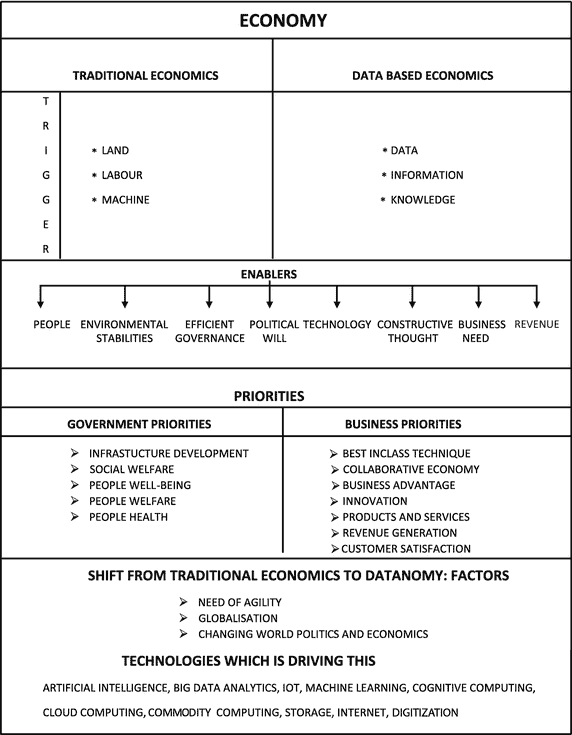
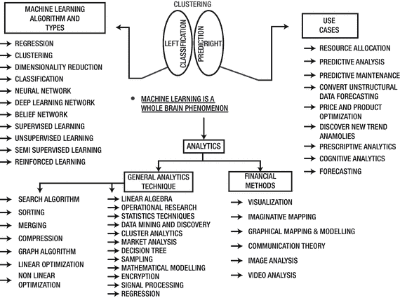
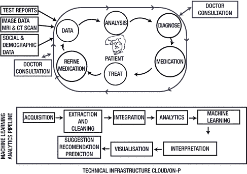
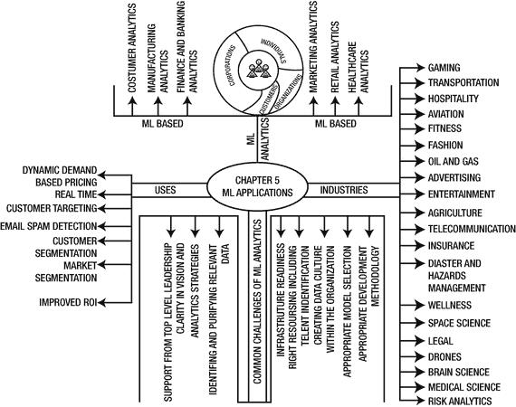

# 5.机器学习的工业应用

机器学习将引发下一波数字革命。希望企业做好准备。早期采用它的公司正从中受益。机器人和自动驾驶汽车、计算机视觉、自然语言处理、虚拟代理、深度学习和机器学习等技术是未来的技术。新一代机器学习应用基于数字化。在大多数情况下，采用数字化的部门也在引领机器学习领域。此外，预计它们将推动增长。机器学习可能会加快市场份额、收入和利润池的变化。所有这些都是被数字化破坏的部门、产品和应用的商标。

有多种方法对机器学习技术进行分类，但起草一份相互排斥且集体穷举的列表是有问题的。这是因为人类通常融合和匹配多种技术来产生针对单独问题的解决方案。这些形态不时被视为自主技术，有时被视为补充技术的子类别，有时被视为应用。一些框架根据基本功能对机器学习技术进行分组，如文本、语音或图像识别，其他框架根据商业应用进行分组，如商业或网络安全。因此，各个行业对机器学习的采用程度极不均衡，至少目前如此。这种接受技术的趋势并不新鲜；我们在接受社交技术的公司中遇到过这种行为。这表明，至少在未来的时间里，机器学习部署有望在数字前沿快速发展。最终结果是企业、行业和地理区域中采用者和落后者之间的差距越来越大。

IT 文献中的一个传统统计数据是，大公司通常是创新技术的早期采用者，而较小的公司通常不热衷于成为第一个行动者。这种数字鸿沟也存在于机器学习领域。较大的公司在采用机器学习方面有非常高的接受率和响应速度。大公司的行业、应用和产品，特别是那些在员工数量方面具有更大优势的公司，比小公司更有可能采用机器学习技术。一个非常明显的原因是，较大的公司通常可以获得额外的、结构更好的数据。此外，他们的员工具备理解机器学习投资的商业案例和有效吸引经销商所需的适当技术技能。更大的公司还有一个额外的好处就是做固定成本的投资，这是机器学习实现一般需要的。因为它最初需要一个优越的价格和收入基础，它往往会产生更高的回报。商业驱动因素也因部门、行业、应用和产品而异。更有可能采用机器学习技术的企业是那些拥有多方面流程和地理位置的企业。他们的行动是由预测、快速和精确的决策以及定制客户推动的。

本章讨论机器学习的商业含义。机器学习以独特的方式影响着商业和经济。它改变了我们计划、行动和做事的方式。以数据为中心的机器学习和基于分析的经济学正在蓬勃发展。我称之为“datanomcis”。这种经济不同于以土地、劳动力、机器和工业为基础的传统经济。它也不同于知识经济。这种经济是基于数据及其智能使用。它影响各行各业，以及所有类型的个人、团体、社会和国家，最终影响整个世界。

## 数据、机器学习和分析

近来，数据呈指数级增长。它推动了基于分析和机器学习的行业、技术和服务。制造业、医疗保健和零售业等传统行业正在陷入困境，并以超快的速度采用机器学习和分析的最佳部分。与此同时，相对较新的行业，如基于云的客户服务，正在从根本上使用机器学习作为其商业模式的基础。然而，分析和机器学习并不局限于商业、行业和企业。在边界层面，政府政策和世界政治也受到它的影响。例如，在建立“智能城市”之前，政府必须进行大量的数据处理和基于数据的技术评估。为了制定对人民友好的政策或防止犯罪，数据分析和洞察生成逐渐成为政府机构的强制性要求。在不久的将来，所有的政策、社会福利活动和基础设施发展都将受到大数据的指导(见图 [5-1](#Fig1) )。



图 5-1。

Traditional and data based economics

世界上大多数治理和商业生态系统都出现了明显的转变。基于数据的决策不仅是一种精英和利基能力，它是现实，它将在这里停留。国家、次大陆和政府正在使用机器学习分析来提高其人口的生活方式。商行、企业和公司正在利用这一点来获取市场份额，并提高他们的利润率和收入。数据是经济系统的新血液，它正在改变它的 DNA 和 RNA。

本章的计划是在机器学习的背景下为你提供一个关于工业的功能、运作和未来的综合总结。此外，本章还调查了将机器学习应用于核心商业模式的好处及其对政府决策等更广泛视角的影响。它还展示了特定于这些特定行业的相关用例。本章讨论了一个新术语“数据经济学”。本章试图建立一个案例，说明数据如何在一个国家、商业或企业的经济中发挥关键的核心作用。

## 什么是机器学习分析？

分析的范围非常广泛，是一门多学科的科学(事实上，它通常被称为数据科学)。它包含了从数学、心理学到视觉科学等多个领域的许多好的元素。所以，它需要善于逻辑和想象力的人。能够同时使用大脑两部分的人在分析方面更成功。总体而言，机器学习分析等同于机器学习，加上其他类型的分析(见图 [5-2](#Fig2) )。



图 5-2。

A conceptual view of machine learning analytics

## 需要机器学习分析

机器学习分析是当前的需要；有许多市场和商业因素需要它。例如，全球经济动态不断变化，知识工作者的成本不断增加，客户不断要求降低总体成本。这些都迫使公司寻找一些创新的方式来迎合这些问题。然而，将机器学习分析实现到您希望它发挥作用的空间并不是一件容易的事情。存在反对它的力量。

最终，组织在向客户提供基于价值的服务/产品过渡时，必须使用信息技术(大数据或非大数据)来提高分析效率。此外，通过基于预测分析的机器学习，公司可以带来更好的结果，遇到更少的合规和法律问题，并减少不必要的运营负担。这将使公司以更低的成本体验到更高水平的客户满意度。简而言之，如果正确应用机器学习分析，那么可以实现以下好处。

*   基于数据的改进动态组织策略
*   提高客户和利益相关方的参与度
*   改进和透明的基于数据的治理
*   改进的服务交付模式
*   改进基于事实和数据的成果衡量
*   提高能力
*   减去欺诈损失
*   最佳定价，有助于盈利
*   提高营销投资回报率
*   减去信用损失

## 与机器学习分析相关的挑战

以下是组织在机器学习分析的准备和实现阶段遇到的一些主要挑战:

*   以统一的方式将不同形式的数据集成在一起。
*   管理组织从不同来源收到的大量数据。
*   技术的集成和互操作性。
*   细化和定义整个组织的数据需求。
*   文化变迁和变革阻力。
*   缺乏合适的人才。
*   缺乏统一的数据模型。
*   缺乏安全模型/框架/标准。
*   适当的基础设施。
*   缺乏合规标准。
*   定义适当的指标来衡量实现的有效性。

然而，通过对受影响的各方进行适当的解释、推理和教育，这些“抗拒力”可以减少或消除。实现改进的业务成果、法规遵从性和战略目标的复杂性意味着组织需要在客户服务方面变得更加主动。目前的技术已经允许解决方案提供商跨运行数据库、数据仓库和结构化或非结构化数据集的不同系统执行数据分析，而不影响常规的日常操作或访问可用数据。有些组织已经实现了分析，而其他组织则处于更高级的阶段。

## 机器学习分析的业务驱动因素

组织总是有动机利用市场潜力并从中赚取利润。然而，实现这一目标并非易事。赚取利润和成为领导者的目标由多种因素驱动。这包括社会、政治和环境因素。最重要的因素是价格、收入、有效性和效率驱动因素。以下是一些组织考虑在市场中脱颖而出的重要驱动因素。

成本和收入驱动因素:

*   为经过验证的服务和产品实现有效定价
*   尽量减少损失
*   获得效率并最大限度地利用容量
*   获得市场份额
*   树立品牌
*   需求激增

效率和有效性驱动因素:

*   需求和供应预测的准确性
*   存货管理

组织押注于机器学习分析，因为他们明白在数据驱动的世界中，他们可以通过使用它们来取得成功。

## 行业、领域和机器学习分析

基于机器学习的分析可能适用于所有行业和领域。以下部分讨论了一些已经使用基于机器学习的分析作为解决方案的领域。

### 基于机器学习的制造分析

制造业以其严格的流程导向和文档、程序合规性、流程矩阵、风险和质量框架以及详细的报告而闻名。技术领域出现了繁荣，尤其是在数字化、制造组织/企业以及补充生产和技术日志领域，这些日志包含来自遥测、传感器和其他机器生成数据的大量信息。他们正在使用机器学习、物联网、云计算和数据科学技术来帮助他们的客户。一场无声的革命正在发生，它将数据转变为多种用途的宝贵工具，包括盈利能力和生产力。它的用途包括化学、气象、汽车和许多其他制造业领域。从历史上看，与金融、客户服务和医疗保健等其他行业相比，制造业对采用机器学习技术并不十分热情。然而，机器学习分析在各行业的广泛成功促使制造业的领导者采用它。

#### 在制造业中实现机器学习的挑战

*   缺乏适当的基础设施和将机器学习应用于业务问题的意识。
*   缺乏适当的高质量数据。
*   由于缺乏足够的知识和清晰的业务需求，缺乏在整个组织中应用机器学习的承诺
*   组织中缺乏数据文化和思维模式，因此机器学习实现无法满足日常工作。
*   缺乏具备良好机器学习知识的合适人才。
*   遗留系统的集成:制造组织传统上使用旧的遗留系统。因此，他们依赖于此，因为他们的流程和生产依赖于此。引入新的系统和技术并将其与现有的技术流程生态系统集成是一项挑战。
*   统一的数据模型:统一不同的数据模型并使它们彼此共享数据是一个挑战。然而，随着新的业务和流程模型的出现，如分析操作(在 DevOps 系列上)，这将得到解决。
*   安全挑战:分散的控制系统通过网络，特别是通过互联网相互连接和链接，非常适合快速响应不断变化的情况和场景。但是，它可能会将系统暴露给黑客的非法、未授权和未经请求的访问，黑客可能会损坏系统或导致停机。物联网设备通过网关相互连接并连接到网络，这可能允许从任何地方控制和访问系统、机器、设备。使用智能软件和系统可以有效降低这种风险。

#### 制造业机器学习分析的驱动因素

将大数据分析和物联网技术与机器学习相结合，可以使组织和制造商受益。在故障发生之前分析和预测故障的能力将是机器学习的一个有用功能，一些制造公司已经在利用它来最小化生产损失以及风险和财务损失。及时的预测导致在生产和计划中实现更高水平的效率和有效性。在制造业中有数百个机器学习技术的应用和用例。

机器学习分析的一个重要用途是为其用户提供实时跟踪需求和预测波动的能力。这将有助于组织优化其需求，并及时做出相应的响应。这实际上提高了平衡管理供需的效率。最终，这些将引发成本、废料和冗余的最小化。机器学习分析可以应用于制造业的多个领域，从生产规划到产出优化。以下是推动采用机器学习分析的几个领域。

*   有效和高效的生产和运营管理
*   工厂优化
*   有效需求预测
*   准确和主动的错误检测
*   高效的绩效管理
*   更好的预测性维护和互操作性
*   设备故障预测
*   有意义的模式重组
*   增加收入和盈利能力
*   员工激励
*   通过采用技术在市场中保持相关性和领先地位

#### 基于机器学习的分析:在制造业中的应用

机器学习分析可能适用于制造业的所有层面，从降低成本到提高效率。以下是一些用途:

*   机器监控和预测:持续监控机器/设备并预测其健康状况。在机器学习分析的帮助下，所有关于设备和机器的信息都被收集起来并进行基准测试。这进而比较机器、生产线和工厂，以推动持续改进。
*   通过预测分析进行预测、需求和营销管理:机器学习的这些功能有助于制造组织根据市场需求找到特定机械的适当推出时间。此外，他们制定具体的营销计划。机器学习也可以用作制造组织的有效活动工具。
*   智能质量保证:随着机器学习分析的使用，实时连续监控将成为现实。监控已售或在制品变得非常重要。这使得执行质量检查变得简单而有效。如果产品有缺陷，它更有可能在早期被发现。因此，机器学习有助于通过在造成损害之前收集、识别和警告质量问题来减少测试的需求。基于机器学习的分析通过提高整体质量来提高机器/设备/产品的效率和有效性。
*   能源消耗优化:在实时跟踪的帮助下，通过预测能力，现代一代机器学习设备能够捕捉需求波动并预测能源消耗模式。这些见解用于能源消耗利用。
*   用正确的分析模型预测零件故障:在应用统计分布预测故障之前，复合分析模型增加了一个探索步骤。要研究的数据量是巨大的，它涉及到识别各种数据元素之间的关系，以及识别性能相似的设备、数据故障的常见原因等等。诸如关联分析和决策树之类的技术有力地帮助执行这样的分析。这反过来有助于降低维护成本，提高产品成功率，并确保客户满意度
*   深入了解根本原因:通过找到真正的根本原因来解决复杂的工厂问题。因此，经常出现的问题不会影响生产力和效率。假设情景分析和模拟就是这样做的一种方式。当它们与机器学习分析配对时，它们会提供很好的结果。

#### 机器学习分析在制造业中的其他用途

机器学习用于制造业的多个层面。因此，它的用例也存在于所有层次，从设备维护到预测和预报未来事件。以下是捕捉到的一些事件。

*   制造过程的优化和改进。
*   供应链和价值链优化。
*   通过基于数据预测结果来降低研发成本。
*   智能电表和电网管理。
*   预测资产失败。
*   使用历史数据、趋势和制造特定算法来主动管理潜在的资产故障。
*   减少停机时间。洞察最常见的停机原因有助于关注对业务伤害最大的停机时间。
*   提高机器/系统的产能利用率。此外，实时资产利用率和停机智能统计使组织能够在正确的时间最大限度地利用正确的资产。
*   擅长监控监管信息、出生证明以及跟踪和追踪设备。
*   帮助维护关于产品的全面和准确的信息。
*   实时制造产量优化。

### 基于机器学习的金融和银行分析

金融市场总是非常活跃，不断发展，随时准备适应变化。这个行业总是欢迎能有效分析市场行为、情绪和金融专业人士态度的技术和新系统。最近出现了一种新的金融范式，其中行为金融学的倡导者所考虑的心理特征和已建立的新古典金融学的实践者所青睐的量化技术被结合在一起。机器学习分析是一种分析、合并和使用金融的定量方面的行为方面的极好方法。机器学习分析在金融和银行业有成千上万的应用。熟练和智能的手机银行应用程序、智能聊天机器人和搜索引擎就是其中的几个例子。维护和收集大量客户数据、保持准确的历史记录，以及理解金融世界基于数量/数字的本质，是金融和银行业中机器学习实现的触发因素。

#### 在银行和金融机构中实现机器学习分析的挑战

机器学习分析的实现涉及战略、财务、流程导向和技术方面。因此，执行的道路并不平坦，出现了一些真正严重的挑战。以下是该行业在实现机器学习分析时面临的一些挑战。

*   预测误差:人工预测会带来误差。
*   处理不确定性:数据孤立存在，关联、分析并从中获得洞察力是最大的挑战。
*   数据的统一视图:事实、图形和数字来自组织内的不同领域和不同系统，并以各种形式存在。综合这些统计数据是一个巨大的挑战。
*   协作和沟通:整合从多个来源收到的输入，分析它们，并以决策者可以理解和理解的格式交流结果或输出是另一个巨大的挑战。
*   实时结果:每个人都希望获得实时更新的可用信息。需要时立即提供所需信息是一项巨大的挑战。
*   数据安全性:由于多种未知原因，大多数数据存在于云基础架构上，有时甚至不在私有云上。因此，数据操纵的风险增加了。

#### 金融机构机器学习分析的驱动因素

机器学习分析技术的广泛使用/实现的驱动力是为客户提供完美的解决方案。行业正在积极寻找包含优秀价值主张的解决方案/产品。为了实现这一点，他们正在整合不同产品、客户行为数据、营销策略、可用财务投入、地理细节和不同渠道分析的最佳元素。然而，这也给银行和金融机构带来了最大的挑战之一。通过有效利用数据科学来设计针对适当客户的新产品和服务至关重要。因此，银行正在使用机器学习分析技术来提出灵活和集成的流程，以便更好地了解客户。他们通过分析自己的购买习惯和洞察参与渠道来做到这一点。这对银行以有效和优化的方式销售其产品非常重要。将机器学习应用于个性化产品是下一代银行业成功的关键。

*   改善业务战略:借助于通过机器学习进行的基于数据的动态建模，金融机构可以制定更有利可图和以客户为中心的战略。保持市场竞争力是最大的驱动力之一。数据是会议室中发生的干扰的灵魂，并且被记录和认可为关键的业务优势。决策者应该知道他们现在可以访问哪些数据，以及他们可以从哪里获得更多适合其企业未来成就的数据。谷歌、亚马逊、网飞和脸书是围绕数据制定战略并大规模扰乱市场的公司中最常用的例子。他们从根本上改变了他们的文化，从传统的业务运营方式转向基于数据和创新的运营方式。这开始得到回报，现在他们的大部分收入都是基于对数据的聪明和智能的使用。他们从客户每天通过使用他们的服务产生的大量数据中提取洞察力，并反过来使用这些数据来制定盈利策略。
*   一个重要的能力将是使关系格式中不可用的或不能用传统方法分析的数据变得可用。今天产生的很多数据都是“平面数据”，这意味着它没有关系结构。估计 90%的数据是平坦的。要使这些数据可用，需要能够高效处理大量不同类型数据的新方法，例如 NoSQL 和 Hadoop 技术。
*   稳健的风险管理:金融机构是黑客、攻击者和欺诈的主要目标。因此，稳健的风险管理是强制性的。机器学习分析是实现这一目标的一种方式，通过使用自动异常检测技术和实现其他算法方法。
*   更好的营销:客户细分、营销活动管理和线索挖掘等技术有助于金融机构在这方面表现更好。
*   渠道执行:向客户提供净可用的最佳报价可能会增加组织的盈利能力和销售业绩。因此，这也是实现基于机器学习的分析的主要驱动力。
*   擅长客户体验管理:在不断变化的时代，通过向客户实时提供即时信息来吸引他们是最大的挑战之一。随着虚拟代理(聊天机器人)的出现，根据他们的需求、行为和财务状况提出下一个最佳行动有助于培养客户忠诚度。因此，它是实现机器学习分析的驱动因素之一。
*   客户洞察:通过情绪、社交媒体和客户盈利能力分析获得市场优势是金融机构的重要驱动力。

#### 基于机器学习的分析:在金融机构中的应用

基于机器学习的分析在金融和银行生态系统中发挥着至关重要的作用。它的应用是广泛和多维的，包括欺诈检测、贷款审批、处理风险和保护在线交易。

*   违约贷款识别和预测:金融巨头使用机器学习来预测不良贷款。原因很简单，因为如果应用正确，学习算法很容易根据客户数据进行训练。例如，基于算法的模型可以使用与客户年龄、工作、婚姻状况、财务状况以及历史和当前贷款支付相关的数据来生成洞察。数据由系统收集和分析。之后，处理发生。这种执行流程通过找到问题的答案来确定关于客户金融行为的事实，这些问题包括:客户是否按时支付了贷款或是否违约，他的在线行为如何，他是否曾卷入任何类型的金融或其他类型的欺诈等。
*   良好的决策:机器学习分析可能会自动执行端到端流程，从数据收集到生成可操作的见解，再到从可用选项中建议最佳行动。预测、感知和认知洞察力不仅仅是提供“做什么”、“何时做”和“如何做”的想法。
*   欺诈检测:金融欺诈是金融直觉关注的主要领域。机器学习系统可以识别独特的活动或行为，或者检测异常并标记它们。通常，机器学习欺诈检测解决方案可以使用基于算法的模型来分析可用的历史交易数据，该模型可以识别客户执行的交易和活动中的欺诈模式。然而，挑战在于训练系统来检测误报情况。当合法交易被识别为风险并被标记时，就会出现误报。
*   交易算法:在当前盛行的市场条件背景下，基于算法的交易正变得流行。算法交易的概念是多方面的，并与全球所有金融市场相关。它们涵盖了几乎所有的重要领域，如股票、固定收益和货币。机器学习分析正在发现自己在为有利可图的交易决策制定算法方面的作用。算法交易，也称为高频交易，有助于自动化或创建足够智能的系统，在海量数据集中找到有用的模式，以获得与交易决策相关的盈利决策。机器学习分析在通过工具获取模式以提取任何隐藏的市场趋势洞察力方面极其有效。机器学习交易系统一般一天做几百万笔交易，近段时间金融机构变得技术化。
*   客户服务:金融专用聊天机器人越来越受欢迎，因为它们有助于为客户提供答案。这些聊天机器人也被称为虚拟助手。他们用像英语这样的自然语言与顾客交流。它们包含智能有效的自然语言处理引擎和大量特定于金融的客户交互数据。聊天机器人不仅仅局限于银行和客户服务领域；它们也被用于许多其他行业。(有关详细信息，请参考本章中的聊天机器人部分。)
*   情绪分析:这正在成为一种更重要的软技术工具，随着时间的推移，它将成为以有效的方式处理商业智能和组织、市场和商品的绩效评估的重要因素/技术之一。基于不同商品期货价格的消息捕捉的情绪被用于制定有利可图的基于情绪的交易策略。新闻和观点在金融领域非常重要，因为市场动态严重依赖于它们。结构化和非结构化数据经过分析、处理和呈现，为相关利益方提供有价值的见解。例如，为了提高交易者和营销者的绩效，情感挖掘可以有效地应用于新闻、微博和在线搜索结果的文本挖掘。在情感分析的过程中，大量的数据被提纯并从中提取信息。这些信息反过来被用于制定可行的路线图。从金融角度来看，情绪分析在交易、基金管理、投资组合开发、股票动态分析以及风险评估和控制中发挥着作用。
*   金融和保险产品和服务的推荐:金融公司/机构、银行和保险组织现在已经开始经常使用 robo-advisor 向他们的客户推荐产品和服务。甚至在建议投资组合变化、根据当前财务状况和行为情况从一种服务切换到另一种服务等领域，公司都在使用机器学习技术。在未来几年，这些功能将变得更加可靠，客户也会更加认真地对待它们，因为他们相信电子商务产品推荐网站，如 FlipKart。

#### 机器学习分析在金融机构中的其他用途

机器学习分析可能适用于所有级别的银行和金融组织，从降低成本到提高效率。以下是一些用途:

*   以自动化的方式理解和分析组织的财务绩效。
*   基于数据帮助管理和维护组织的物理和虚拟财产的价值。
*   聪明地管理公司的投资。
*   在基于数据的决策的坚实基础上预测和预测市场的变化，这强化了信息系统的功能。当它与基于数据的文化相结合时，其结果就是精心设计的业务流程和利润。
*   机器学习分析是强化合规和监管要求的关键技术。它用于交易审查，识别异常的交易模式和行为。
*   客户细分是机器学习非常有用的另一个领域。银行和金融机构的愿景从以产品为中心的经营转变为以客户为中心的业务。因此，机器学习分析通过处理数据和检测有用的信息来实现这一愿景。
*   企业正在使用机器学习分析进行个性化营销。金融机构借助分析向客户提供个性化产品。此外，它还用于对客户或财产进行信用风险评估。这为金融机构了解是否继续进行交易提供了洞察力。
*   为了更好的风险管理。例如，提供实时警告(如果超过风险阈值)。另一个例子是发现金融系统中新的复杂相互作用，并进行高级风险建模。
*   增加银行业的销售和收入，因为这有助于他们尽早发现与客户流失相关的风险，并相应地实现重新谈判策略。
*   对于熟练劳动力的优化。这有助于金融机构以优化的方式使用可用的技能，并降低整个组织的运营成本，包括前端和后端。
*   分行和 ATM 中心的优化。
*   根据客户偏好将电话适当地转接到呼叫中心，客户偏好是通过分析多模型/多渠道数据(社交媒体、手机、网络)获得的。这最终有助于他们提高客户满意度并降低运营总成本。

### 基于机器学习的医疗保健分析

医疗保健行业影响着我们所有人。创新技术正在改变传统医疗机构的工作方式。在短短几年内，随着包括分析在内的技术在管理患者群体健康方面发挥着至关重要的作用，it 从医生专用发展到技术支持型行业。机器学习分析是一种改善治疗效果和结果，同时控制成本的绝佳方式。机器学习和深度学习与人工智能相结合，通过改变医疗保健，为医疗保健赋予了新的意义和方向。例如，通过将成像数据库与自动注意和识别医疗状况的算法和模型相集成，深度学习算法被用于教计算机阅读医疗图像。准确的影像诊断帮助数百万人及时接受适当的药物治疗。因此，这有助于拯救数百万人的生命。

医生们也采用了这种变化，因为它增强了他们应对我们这个时代威胁生命的挑战的能力和潜力，如癌症、艾滋病等……在所有可用信息的帮助下，系统试图在可用数据点中找到模式和相关性，并将它们与相关数据集进行比较(见图 [5-3](#Fig3) )。这个完整的过程在几分钟内完成，最后向医生建议适当的治疗方法。



图 5-3。

Working with healthcare analytics

机器学习系统提供的建议反过来可以由医生根据你的需求和个性化的健康状况进行定制。听起来像小说，但它不是。IBM 的 Watson 和 Baby Watson(一种认知计算系统)已经在做类似的事情。此外，一家名为 AiCure 的人工智能平台公司可以使用面部识别技术确认患者服用了所需剂量的药物。此外，它还提供实时摄取确认和自动药物识别。AiCure 是一个经过临床验证的平台，可在智能手机上运行。AiCure 在进行临床试验的制药公司中非常受欢迎，在这些公司中按时服药是至关重要的。

#### 在医疗保健领域实现机器学习分析的挑战

机器学习分析可能适用于医疗保健的所有层面，从降低成本到提高效率。然而，它在实现方面有自己的挑战，特别是在这样一个传统上组织混乱的部门。以下是医疗保健机器学习分析中存在的一些挑战。

*   缺乏集中的信息:医疗机构需要一个集中的信息数据库来保存患者的记录。这有助于医疗机构以更好的方式管理他们的数据。企业主患者索引(EMPI)是医疗保健组织中用于此目的的数据库。它保存了一致、正确和最新的患者健康、人口统计和重要治疗数据。该数据库是通过收集和存储特定患者通过访问医疗保健机构的几个部门而产生的数据来构建的，这些数据可以是社会、个人和其他形式的数据。通常，患者被分配一个唯一的标识符，用于在整个企业中引用/识别他。EMPI 只有在有助于跨所有数据集唯一识别患者记录时才有用。真正的挑战是以正确的方式实现，因为由于多种原因，如不正确的技术实现、新系统与遗留系统缺乏集成等等，这并不是在所有地方都是正确的。
*   不同的格式:医疗和临床数据包含不同于流行编码方案的编码。编码方案用于临床目的，通常为 CPT、ICD9、ICD10 或 NDC。由于这些代码包含非标准编码方案，它们需要翻译，以便有一个用于数据分析的通用字典。
*   非结构化数据:来自医疗保健系统的数据源大多是非结构化的(80%)，并且以 HL7 这样的平面文件格式提供，在使用之前需要对其进行反序列化。一旦取消序列化，就必须为临床处理管道进行转换。此外，数据通常被拆分到包含数百万行多个平面文件中。因此，需要健壮、有效和高效的提取-转换-加载(ETL)过程。
*   医疗保健组织将患者健康记录和健康信息保存在其数字数据存储中，用于记录和分析目的(有时也以传统方式保存)。显然，这些数据包含敏感内容。因此，信息保护是关键。想象一下，如果包含患者信息的信息出现数据泄露。威胁生命的数据必须尽可能受到保护。机器学习分析是保护信息的重要武器。机器学习算法/系统/解决方案能够自动识别网络或数据存储中的异常行为。当未经授权访问数据的人试图操纵或窃取数据时，就会发生这种情况。

#### 医疗保健行业机器学习分析的驱动因素

机器学习分析成为预测和预报不利条件的关键。基于灾难和预测，由保健专业人员和患者亲属接收的通知/警报使他们能够为了患者的利益采取主动预防性措施。因此，治疗和预防疾病的结果和结果或受试者的健康状况得到改善。此外，它还可用于动态评估与医疗保健相关的当前政策和协议，以提出新的或修改后的政策和协议。此外，患者信息可通过多种渠道和来源获得，因此数据分析变得相对容易。以下是关于病人的一些重要信息来源。关联这些信息/数据提供了关于患者的隐藏见解，这将极大地增强治疗。

*   扫描报告
*   健身跟踪器
*   物联网设备
*   基因测序
*   药物研究
*   临床试验
*   地理记录
*   文化信息
*   社会化媒体
*   治疗记录
*   其他与患者相关的记录(如与特定患者相关的医生/护士对话)

所有这些因素支持并推动了分析在医疗保健领域的应用。机器学习分析的应用同时帮助多个利益相关者，包括但不限于患者及其亲属、保险公司、医生等。

#### 基于机器学习的分析:在医疗保健行业的应用

机器学习分析可能适用于医疗保健组织的所有级别，从降低成本到提高效率。以下是一些应用:

*   成像分析:通过训练计算机自动读取、处理和诊断医学成像数据，机器学习分析可用于根据患者的基本医学成像数据自动处理和诊断患者。例如，机器学习分析公司 Zebra Medical Vision 正在开发临床研究平台，为医疗保健行业提供下一代成像分析服务。其成像分析技术有助于机构找出有特定疾病风险的患者。这使得医疗保健专业人员能够提供预防性治疗路线图，以改善患者护理。他们的愿景很简单，医学成像和机器学习，这导致了医疗保健的变革。他们的平台名为“Zebra platform”，已经开始为医疗界做出贡献，产生了已经通过数百万例案例验证的成像见解。他们的算法正在骨骼健康、心血管分析以及肝脏和肺部适应症等领域发挥作用。
*   药物开发:药物开发的挑战之一是正确的测试。正在开发的药物可能含有副作用未知的有害化学物质。因此，在推向市场之前，需要在真实的主题上品尝它们。然而，由于多种原因，如生命威胁和伦理问题，受试者的可用性对制药公司来说是一个挑战。机器学习分析通过使用预测建模提供了非常方便的解决方案。它将准确预测药物对特定医疗条件下产生特定反应的个体患者的影响。例如，Life Extension 和 Insilco Medicine 共同开发了基于人工智能的抗衰老技术，以寻找模拟许多已知干预措施和与健康和长寿相关的途径的组织特异性转录反应(细胞调节 DNA 向 RNA 的转化)的营养药物(药物级和标准化营养素)。这反过来提供了真实的人体组织模拟，这将有助于测试药物。
*   合规性:机器学习在发现模式方面非常优秀。因此，公司正在使用机器学习来检测模式，以阻止未经识别的访问，并在诊所和医院中合法实现对患者病历和历史记录的访问控制。例如，健康数据保护初创公司 Protenus 正在构建一个足够智能的系统，以确定患者数据和记录何时被不当访问。他们的产品帮助卫生系统了解访问病历的方式和原因。
*   实时监测和护理患者:传统医学与支持智能物联网的传感器相结合，为医学和医疗保健开辟了新的可能性和途径。机器学习、分析和物联网有助于疾病和医疗数据的实时收集和无缝聚合。医学是由互联设备、传感器和技术组成的更大生态系统的一部分。从患者身上提取或捕获的感觉数据通过网络传输到云基础设施。然后，机器学习分析从这些数据中获得实时洞察。传感器在医学和医疗保健领域的应用并不新鲜。温度计、血压监测器以及尿液和妊娠分析试纸是在该领域使用了很长时间的传感器。然而，这些传感器是哑的，通过使用机器学习分析将智能融入这些设备是一种新现象，这使行业受益匪浅。
*   危急疾病的决策支持:对于传染病，基于机器学习的动态模型非常有效。使用马尔可夫决策过程(MDP)和优化强化学习等算法创建的模型可以生成模式，之后医生就有了更好的数据点来治疗疾病。这种策略有助于快速做出有效的决策。
*   非结构化文档的有效使用:疾病按时间顺序发展。普通患者对与疾病相关的状况发展或恶化的确切时间的信息有限。因此，定期检查和病人收集的其他形式的数据是有帮助的。但挑战在于它们是以非结构化格式(处方、扫描报告、测试报告等)提供的。).然而，如果正确有效地解释它们，它们可以帮助阐明和理解疾病的时间路径。他们可以通过对聚合的大数据集执行分析来做到这一点。通过有效解码和从数据集获得洞察力，Hear 机器学习分析来拯救我们。一旦数据被分析，它甚至可以预测病人将来可能会遇到什么类型的疾病。例如，基于他的腹部超声波报告与杠杆功能和肾脏功能测试报告的配对，机器学习使能的系统可以预测特定患者患肾脏疾病的机会以及这种情况可能何时发生。医生也可以利用这些见解来回答病人的问题。
*   链接历史和当前数据以获得健康见解:分析所有事件、治疗、行为方面和健康趋势的数据有助于正确诊断疾病。与最新健康数据相关联的历史处方信息的分析给出了患者健康的真实情况。此外，算法模式提取和机器学习分析揭示了未被识别为特定疾病的患者群体，但他们的医疗旅程显示他们可能患有或正在患有特定疾病。
*   使用智能分析进行有效的临床试验:制药公司现在使用分析来分析在选择特定临床试验之前整合患者的封闭和禁止条件的影响。
*   治疗和药物市场规模:这是通过考虑产品的用途、转换、提供商类型和开/关标签处方模式等因素来分析市场中产品的当前状况，以了解潜在的市场规模机器学习分析。根据分析结果，将确定机会。
*   远程医疗保健:机器学习解决方案将通过移动设备或其他便携式设备远程分析患者的健康状况，然后将其与相关的医疗记录进行实时比较，预测健康状况，并提出健身计划或可能患病的警告。
*   智能诊断设备:使用机器学习和其他人工智能技术进行简单的医疗测试，如血糖测试、血压监测，在没有人工干预或帮助的情况下识别“发烧”的程度。这有助于医生、护士和其他医疗支持人员做更重要的工作，而不是做与患者相关的日常活动。
*   准确的诊断:机器学习驱动的分析工具使用历史医疗数据和患者档案，更快地识别疾病并对其进行分类，准确性更高。
*   识别公共健康威胁和高危患者:初级卫生保健工作者将向患者提供关于预防措施的信息，包括医疗服务、生活方式和环境因素，如营养、锻炼史和避免污染。此外，医院官员将做好准备，以智能和聪明的方式预测入院人数的激增，这在今天是不可用的。他们将能够更好地跟踪传染性病毒的出现。此外，结合个人医疗记录、天气数据以及地理、文化和其他信息，这将帮助机器学习工具智能地猜测有多少人需要住院治疗。

#### 机器学习分析在医疗保健行业的其他用途

*   预测患者的终身价值。
*   患病客户流失的风险。
*   跟踪患者的行为变化，以提供合适的药物治疗。
*   基于从可穿戴设备接收的数据的有效应急系统。
*   实时分析疾病的严重程度。
*   实时分析医生的表现，并提出适当的改进建议。
*   通过个性化消息、警报和基于传感器的观察来改善和跟踪老年人的健康状况。
*   预测医院中需求最高的区域。
*   通过自动跟踪更好地管理药品及其及时移动。
*   预测健康中心和医院中的人员和患者的入院率。
*   优化人员配备和资源配置。
*   通过分析异构可用数据(临床/运营/管理)，识别、预测和预报欺诈、盗窃、异常和浪费。
*   借助对活检、测试、扫描和核磁共振成像的准确分析，在疾病实际发生之前诊断疾病。
*   快速 DNA 分析和绘图。
*   降低药物测试、开发和营销的研发成本。
*   根据过去和现在的数据，优化和制定准确的药物上市策略。
*   创新和发现药物的新用途。
*   优化药物组合的定价策略。
*   为医疗保险公司提供无价的信息。
*   给出更准确的 PSSP 概念(患者特异性生存预测)。
*   协助放射科医生发现不寻常的迹象。
*   帮助医生了解病人的风险状况。
*   改进基因组分析。
*   机器学习算法通过使用医疗和环境因素来预测患者行动和患病可能性，从而增强医院流程、员工时间表和会计。
*   智能和智能通信亭将患者分类并指引他们到合适的医生处，提高他们的参与度并减少等待时间。

Unique Applications Of VR In Healthcare

集成虚拟现实的机器学习应用于各行各业，包括游戏、制造、室内设计、客户支持、房地产、银行、金融和时尚。下面是一篇文章的链接，这篇文章非常适合决策者阅读:

```py
http://economictimes.indiatimes.com/small-biz/security-tech/technology/a-virtual-revolution-in-the-head/articleshow/57932219.cms

```

### 基于机器学习的营销分析

营销就是适应。新一代营销人员正在使用社交技术来帮助他们衡量和了解潜在的影响客户。Web 分析技术使组织能够在 web 上跟踪人们，并了解他们的浏览行为。理解和跟踪技术的进步是智能机器学习技术的副产品。机器学习分析以多种方式帮助营销。例如，在个性化信息和产品推荐领域，潜力是巨大的。这将客户从一个特定网站的访问者转变为该网站或企业的参与客户。顾客能和公司产生共鸣，因为看起来公司很关心他。成功的、高度相关的营销的结果是增加客户忠诚度、参与度和消费。

基于机器学习的分析使营销组织能够收集、分析和处理来自不同来源的大量数据(例如，购买行为、网站访问流量、移动应用使用以及对之前活动的响应)。实现营销机器学习分析弥合了数据、信息和分析之间的差距。基于机器学习的分析为组织提供了通过从中产生洞察力来使用数据以获得竞争优势的能力。数据科学、数据挖掘、预测建模、基于“假设”的分析、模拟、新一代智能统计和文本分析将识别数据中有意义的模式和相关性。由此产生的洞察力将预测不断变化的条件，并评估各种行动的吸引力。

#### 市场营销中机器学习分析面临的挑战

这里提到了一些大的营销/营销分析挑战(其中大部分都是不言自明的，或者在本章的前面已经解释过，因此在这里会更详细地讨论):

*   数据整合
*   从高层寻找合适的人才和支持
*   行业内的竞争
*   替代产品的威胁
*   确定产品/产品组的客户类型
*   对特定细分市场的产品/服务进行细分和优化
*   由于错误或不恰当地利用数据，未能专注于特定的业务计划
*   投资于收益很少或没有收益的工具
*   未能落实调查结果

你可以通过遵循这些步骤来克服这些挑战。

1.  确定并澄清你想解决的问题领域。
2.  收集、存储、处理和分析解决问题所需的数据。
3.  确定在解决问题的过程中哪些信息是可用的，哪些是不可用的。
4.  获取不可用的信息。
5.  根据可用的信息和知识，选择解决问题所需的适当工具、技术和策略。
6.  解决问题。

#### 市场营销机器学习分析的驱动因素

当今的业务是由数据推动的。大数据、基于云的交付模式和机器学习等技术正在推动数据驱动的营销和销售。因此，预测分析获得了惊人的关注。机器学习分析的早期采用者正在欣赏显著的投资回报。机器学习和评分技术用于在营销和销售渠道的特定点识别和优先处理财务记录、线索、联系人和客户。为了利用和增加投资回报，营销组织正在将机器学习分析作为其营销技术堆栈中一个新的、不可协商的组件。以下是市场营销机器学习分析的一些业务驱动因素:

*   提高客户保持率
*   锁定最适合该产品/业务的客户
*   线索挖掘
*   销售发展
*   机会管理
*   巩固社交媒体战略
*   实时吸引客户
*   想象整个企业的成功
*   将数据视为战略资产
*   确定下一个让客户参与进来的最佳行动

#### 基于机器学习的分析:在营销分析中的应用

营销是一个非常动态和适应的领域。因为顾客通过营销活动了解产品、服务或策略。这里解释一些应用。

*   客户细分:客户细分模型在挖掘包含相同行为和偏好的小型相似客户群方面非常有效。成功的客户细分增加了价值。
*   客户流失预测:通过确定由过去流失的客户产生的可用数据集中的模式。支持学习分析的系统可以准确预测哪个或哪些关联客户存在高风险的客户流失。这种[客户流失预防](http://www.optimove.com/learning-center/customer-churn-prediction-and-prevention/)可以为市场提供留住和吸引高风险客户的行动。因此，如果营销人员在这方面取得成功，他们就能增加收入。
*   客户终身价值预测:通过机器学习和客户关系管理(CRM)的结合，企业可以预测[客户](http://www.optimove.com/learning-center/customer-lifetime-value/) (LTV)。LTV 用于细分客户，并通过预测增长和关联性来衡量他们对企业未来价值增加或减少的贡献。
*   客户价值最大化:通过实现客户价值最大化技术和 it 建议的行动，企业可以鼓励客户激增其交易的发生和支出。它还增加了客户保持活跃并与企业保持联系的时间。
*   客户行为建模:客户行为建模用于确定在特定客户群中观察到的公共行为和模式。同样，它也用于预测相似客户在相似条件或情况下的表现。客户行为模型是基于客户数据的数据挖掘而构建的。在客户行为模型中，每个模型都被设计为在某个时间点响应一个问题或查询。例如，可以应用特定的客户模型来预测特定的客户群如何对特定的营销活动做出反应。这将为采取必要的行动提供必要的洞察力。
*   数字营销:机器学习分析允许数字营销人员在进入点预测、分类和隔离客户，并个性化内容以最大化业务成果。最终，由于这种努力，客户受到了积极的影响。他们看到的广告和优惠变得更相关，更符合他们的需求。
*   给客户排名:机器学习分析的一个重要用途是根据商业价值给客户排名。这将有助于公司根据客户的价值定制产品/服务。例如，电子商务公司在机器学习算法的帮助下，根据客户的排名动态定制和个性化页面设计、报价、帖子和内容，这些算法有办法评估每个访问者的预期价值。
*   虚拟协助:用于向每个人提供所有级别的支持，并且变得越来越聪明。例如，聊天机器人现在可以分辨出两个回复之间的语义相似性。此外，他们提出的回答不仅在措辞上不同，而且在基本含义上也不同。
*   让用户生成的内容变得有价值:例如，Yelp 使用用户上传的照片作为个人摄影师的语义数据。
*   改善客户服务:从海量数据中智能地识别有用的数据集，并产生洞察力以提供卓越的客户服务。此外，机器学习算法可以发现隐藏在客户数据中的深刻见解。此外，它通过找到诸如提供什么、何时提供以及向谁提供等问题的答案，将它们转化为数据资产。

Jargon Buster

市场规模分析:市场规模分析是关于提供关于你的产品和服务的市场潜力的洞察力，例如特定产品的市场有多大。它还提供了有关产品增长前景的信息。市场规模分析对于了解产品潜在市场的规模和预测非常重要。了解你的产品在其生命周期中的位置，以及你是在一个增长的市场还是在一个衰退的市场中竞争，这是非常重要的。

#### 机器学习分析在市场营销中的其他用途

机器学习分析可以应用于多个领域，以获得业务和竞争优势。以下是一些使用案例:

*   根据店内顾客流量预测设计营销策略。
*   用于支付安全的客户行为分析:借助异常检测技术，即使在数据/交易/通信量非常大的情况下，也可以实时识别不当行为。
*   创建、分析和优化实时运营指标。
*   识别并分析根本原因。
*   设计基于未来数据的业务和运营关键绩效指标。
*   基于实时数据的销售预测:可以开发模型来预测客户流失、信用风险或火车/公共汽车/航班延误。
*   预测筹款活动的成功:例如，它根据元数据为您提供特定筹款活动的成功和失败的想法。
*   预测合适的销售和购买时间，提出有效的产品建议，并为企业划分最佳客户。
*   防止数据泄露。
*   执行社交语义。
*   语音和语言识别。

Audio and Video

一个有趣的视频系列，提供了关于机器在当今在线广告活动中的作用的见解。包括数字媒体在时代变迁中的角色等等。参见:

[T2`http://exponential.com/trust-the-machine-video/`](http://exponential.com/trust-the-machine-video/)

### 零售业中基于机器学习的分析

机器学习正在以建设性的方式改变零售业。它使零售商能够识别隐藏在大量未使用的数据和机会下的关键行动领域。此外，它为他们提供了消费和分析数据的能力，他们认为这超出了人类能力的处理能力(至少是手动的)。它使零售商能够在客户流失分析的帮助下预测未来，并做出有用的决策。由于数据采集和存储技术的进步，可以获得与产品、价格、销售、绩效、消费者行为、物流细节等相关的海量数据…组织正利用这些数据来解码消费者的购买和财务 DNA。

#### 在零售行业实现机器学习分析的挑战

随着零售业的发展，与之相关的挑战也在增加。挑战是多方面的，并将影响人员、流程和技术。本章的讨论仅限于基于机器学习的分析相关挑战。以下是一些关键的问题:

*   正确的数据:收集高质量的数据是最大的挑战之一。
*   面向数据的管理:一旦你得到数据，它的管理是至关重要的。组织获得的大多数数据本质上是异构的，并且通常来自多个来源。
*   技术专长:合适的人才极度匮乏。寻找像数据科学家和数据工程师以及专门管理机器学习或分析项目的技术经理这样的角色很难。
*   集成:在大多数情况下，在组织中实现基于机器学习的分析的决策被视为新的举措。然而，如果一些新的创业公司开业时间差不多，那么情况就不一样了。但是在这两种情况下，集成多个系统和技术，以正确的方式获得数据和智慧，才是最重要的。因此，各级都需要正确的战略、人才和专业知识。这使组织能够减少“孤立”系统之间的差异，并使数据在核心业务应用程序之间顺畅流动。

所有项目都是独一无二的，需要根据情况、要求和需求制定解决方案。因此，挑战也不同。然而，有一些指导方针肯定有助于应对困难的情况，并制定适当的策略。以下是一些最佳实践/指南。这里，这些是在“零售行业”的背景下提出的，但也适用于几乎所有其他行业。

*   将信息技术融入组织的 DNA 中。
*   保持敏捷，通过试点将愿景快速转化为现实。
*   确保接收到的数据在进入复杂系统之前质量良好，或者通过有效使用可用工具以适当和智能的方式进行过滤。此外，创建简单的数据访问策略。
*   重用现有的过程、流程、技术和人员技能。根据需要对员工进行交叉培训。
*   在通过问正确的问题和记录观点来开始理解问题之前，遵循基本原则。
*   建立能够理解和解释问题的高效团队。此外，努力把合适的人放在合适的位置。
*   根据您的需求选择技术，而不是基于宣传。
*   产生可以轻松有效地付诸行动的见解。

#### 零售业中机器学习分析的驱动因素

*   为客户带来可靠、量身定制的产品组合和定价，并增加销售额。
*   在市场上出类拔萃。
*   “我的第一”方法是成为市场中的一个差异化因素，并提供创新产品以实现差异化的客户体验。
*   通过了解行为和购物模式提高客户忠诚度。
*   根据客户特征和心理，开展有针对性的营销活动。
*   通过改善库存、价值和供应链管理来降低成本。
*   增加通过多种渠道了解产品和服务的客户的转化率。
*   人工数据分析现在变得越来越普遍。因为即使是大多数有经验的零售商也发现很难通过使用数据库、电子表格和旧的仓储技术等传统技术从现有数据中获得价值。这有多种原因，包括大量数据、按需分析的要求以及基础架构功能的动态变化。然而，通过使用机器学习分析，零售业可以确保即使是单个数据都得到分析，并为他们提供有效的见解。

#### 基于机器学习分析的分析:在零售业中的应用

零售业是最早采用机器学习分析的行业之一。它帮助采纳者在市场中脱颖而出，并在竞争中获得竞争优势。以下是 it 在零售业的一些应用。

*   定价:机器学习分析使零售商能够通过比较和考虑竞争对手的价格来实时管理他们产品的价格。基于预测定价模型的智能算法可以处理所有形式的数据，并实时提供准确的信息。例如，它可以分析销售数据，并动态优化特定时间点的价格。
*   库存管理:聪明、高效和有效的库存管理是零售商成功的关键。而低效的管理会导致业务亏损。以销售为例，根据不准确的过去数据做出的预测会给出不准确的需求预测，从而对某些商品产生错误的需求，而根据历史和实时数据的适当组合做出的预测有助于产生正确的商品需求，并最终有助于移动库存。零售商可以使用预测分析，根据敏感度以及偏好、天气和客户的环境和地区差异，决定存储什么以及存储在哪里。
*   推荐引擎:为了向顾客推荐合适的和最合适的产品，电子商务公司正在使用推荐引擎。但是，这不仅仅局限于电商公司；传统零售业也使用它们。
*   智能收入预测:零售业正在使用机器学习分析，根据客户的购买习惯进行准确的预测。

#### 零售机器学习分析的其他用途

*   根据顾客需求优化店内产品种类，实现销售最大化。
*   根据 his/她的数据向客户提供次佳的个性化服务。
*   通过动态库存管理实现实时数据驱动的库存优化。
*   使用实时数据预测和预报超理性销售、需求、供应和其他相关业务洞察。
*   分析、预测和创新市场规模和潜力。
*   优化支出。
*   通过流程优化优化市场组合。
*   通过情绪、情感、评论、视频和语音分析增强理解客户的能力。
*   根据人口统计、顾客感知和其他数据输入，预测、预测和决定将哪些产品运送到相关和最合适的商店。
*   根据客户数据优化店内产品投放，这样获得关注的可能性就增加了。
*   根据客户偏好实时优化广告，以提高销售额和客户忠诚度。

### 客户机器学习分析

客户分析使公司能够预测和预期他们为客户做了什么，哪些客户面临风险，如何将客户添加到他们的业务中，哪些客户忠于他们的业务，哪些不忠于他们的业务。此外，它有助于组织对客户进行适当的细分，以便他们可以实现最佳的业务计划来留住和获得客户。它还找到了一些问题的答案，如哪些高价值客户面临风险，或确定向特定客户群提供什么。

当大量数据可用时，将基于机器学习的分析应用于客户数据对于做出适当的商业决策至关重要。然而，基于机器学习的分析的成功取决于拥有正确的策略、高质量的数据、计划和适当解决方案的实现。

组织很容易获得客户数据，因为他们善于从多个来源收集数据。然而，除非进行一些智能处理和分析，否则数据的可用性和存储是无用的。因此，组织的重点转移到从堆积如山的数据中提取“洞察力”，而不是收集它。通过应用机器学习技术，组织以更好的方式了解他们的客户，并且他们使公司的产品和服务与客户更相关。

为了附加、关联和建立亲密的客户关系，大数据和机器学习技术发挥着至关重要的作用。他们在制定以客户为中心的商业战略的组织旅程中扮演了核心角色。然而，客户满意度的基本原则——每个客户都是不同的，他们需要得到不同的对待——仍然适用。这很重要，因为每个人都有不同强度的情感、习惯和偏好。与机器学习相结合的分析通过将客户分类和细分为不同的群体并独特地对待他们来发挥出色的作用。完美和成功的细分的最重要的目标是实现最优化。

#### 实现客户机器学习分析的挑战

在客户领域实现机器学习分析存在一些挑战。以下是其中的一些:

*   高层领导愿景和对分析策略的支持:在实现客户分析时，需要高层领导对分析愿景的支持。它需要跨越组织政策、框架和思维过程的巨大变化。例如，客户收集的数据驻留在多个异构系统中，许多人/团体访问和使用这些数据。强大的领导愿景和支持确保分析战略在整个组织内得到正确实现和协调。这确保了组织中的每个人都朝着同一个方向前进，并且清楚地知道如何收集、分析、处理和使用数据来实现业务成果。
*   选择正确的数据:要使客户分析工作成功，首先也是最重要的一步是为组织选择合适的数据。这是一项资源密集型的工作，但却至关重要，值得投资。在这个竞争激烈的时代，需要定义和创建清晰的数据战略和路线图。如果存在差距，将会及时填补。这将允许组织有效地将数据转化为洞察力，然后转化为智慧。
*   基础设施就绪:机器学习分析项目不同于一般的软件或硬件项目。因此，他们的需要、要求和需求是不同的。建设基础设施可能需要额外的投资，领导层必须愿意接受这一点。
*   正确的资源配置:选择正确的资源，将组织的愿景、战略和想法转化为可操作的步骤，这非常重要。然而，寻找合适的资源和人才是困难的，因为客户分析是一个多学科领域。确定哪个数据集是重要的和相关的对于成功非常重要，而找到具有这些能力的所谓数据科学家是很困难的。培养以商业为导向(具备社会学、商业、心理学知识)的科学家至关重要，因为他们为企业提供了竞争优势。
*   在组织内创建数据文化:这非常重要。数据文化意味着组织中的每个人都必须有尊重数据的心态。整个组织和员工必须理解数据的重要性。所有小组，尤其是数据密集型分析小组，必须进行整合。必须有工具来帮助他们集成数据和无缝通信。所有业务线必须通过统一的平台协作和共享数据。即使是非技术用户也有机会处理数据。简而言之，数据感知型企业投资于所有级别的工具，使业务人员能够使用数据来推动决策。

#### 客户机器学习分析的驱动因素

来自机器学习分析的数据需要以可操作步骤的形式呈现，并且必须足够简单才能付诸行动。然而，仅仅知道做什么是不够的。决策必须以一种允许相关方理解的格式提供。采取行动的最终决定取决于决策者，如首席信息官、首席执行官和产品经理。因此，行动步骤需要清晰准确。只有这样，决策者才有信心在现实生活中实现这些步骤。根据对客户的行为数据分析，向特定个人或群体提供或建议适当的产品或服务，或为客户创新独特的东西等决策需要谨慎的方法。根据所有这些参数作出的任何决定都是至关重要的。任何决策的成败都会影响公司的业务和品牌。因此，在采取行动之前，需要对任何基于数据的决策进行适当的测试和再测试。

*   更好地了解顾客
*   改善产品和服务
*   创造新的收入来源
*   改进欺诈的检测和预防

#### 客户机器学习分析的其他用途

机器学习分析在客户支持/服务领域发挥了最大作用。这里有一些例子。

*   情感分析
*   最佳下次报价分析
*   客户流失分析
*   预测客户钱包份额
*   永久的客户忠诚度
*   客户体验和销售分析
*   虚拟客户服务援助
*   最佳客户的识别和管理
*   客户保留
*   跨渠道行为跟踪
*   访问分钟交易数据
*   客户快速入职
*   服务质量
*   客户全景图:企业可以通过多种渠道获取客户数据。通过使用信息亭、呼叫中心、手机、合作伙伴、电子商务和社交媒体渠道，可以收集数据并用于全面了解客户。
*   更积极有效的组织:基于机器学习的营销分析有助于组织预测客户和市场行为。相应地，他们会主动地做出适当的应对策略。
*   个性化客户营销和参与:基于机器学习的营销分析使组织能够预测客户对不同报价的回复概率。因此，他们准备得更充分，也更了解客户。

Machine Learning Analytics In Real Life

*   谷歌提出了新的语音识别技术，并整合到其“下一代”手机中。苹果的 Siri 和微软的 Cortana 是其他例子。
*   谷歌 Gmail 垃圾邮件检测和电子邮件标记都是基于机器学习的。
*   电子商务公司正在使用机器学习来预测客户可能会退回哪些产品。
*   从用户评论中提取洞察，以更好地理解客户和更好地理解评级系统。
*   以自动化的方式回答客户的复杂询问。
*   例如，欺诈和重复检测，自动识别某人是否使用复制图像而不是原始图像进行授权。
*   评估客户评级的质量。
*   推荐和预测重复购买。
*   产品分类。
*   苹果 iPhone 使用机器学习分析从说话者的声音中提取背景声音。
*   苹果 iPhone 的虚拟键盘技术正在使用机器学习分析来确定每个键的敲击面积。
*   微软、Android 和 iOS 的拼写纠正技术使用机器学习分析。
*   用于在 iPhoto 应用程序和脸书社交媒体网站中识别面孔。
*   IBM Watson 将其用于癌症诊断。许多其他公司正在使用它在扫描和核磁共振成像的基础上检测疾病。

### 其他行业的机器学习分析

机器学习分析已经应用于许多行业/领域，从时尚到空气动力学。以下章节描述了一些使用 it 的行业/领域。

#### 视频游戏

虽然它还没有被游戏公司广泛使用，但它已经开始在那里显示它的存在。例如，微软 Kinect 中的手势识别就是其主流应用的一个例子。

#### 灾害和危害管理

机器学习已经在控制和预测自然消化物方面发挥了作用，例如地质、生物、水文和气候问题。通过分析和处理地球物理和生物数据，它提供了控制它们或至少采取主动措施的洞察力。物联网、大数据和云计算的集成对组织和政府的帮助如下:

*   监控危险
*   预测灾害风险的强度
*   跟踪灾难的影响并监控恢复工作
*   控制灾难风险
*   检测地震、洪水和飓风，并在传感器和分析的帮助下预测这些灾害的未来发生

#### 运输

运输公司正在大量使用机器学习来实时进行准确的预测。下面列出了它的一些用途:

*   为运输服务选择最佳/最有利可图的网络
*   对未来事故的预测/对交通系统的及时反馈
*   车辆延误分析
*   模式选择和行程分配
*   各种方式的出行模式行为，包括时间、位置和需求
*   跟踪拥堵情况，节省司机的时间和麻烦

#### 款待

在这个领域，机器学习分析的应用非常成熟。许多公司正在使用各种各样的机器学习技术来解决各自的问题。他们收集大量不同形式的数据，包括视频、音频和网络数据。他们将它们用于客户细分、忠诚度信息、动态定价和资源(房间)分配、客户特征分析、选址、房间可用性预测、客户关系管理、菜单工程、个性化营销网站优化、以合适的价格提供合适的房间，甚至投资管理等领域。此外，机器学习分析用于提供客户价值和改善酒店运营。

#### 航空

机器学习分析已经被航空航天工业以有效的方式采用。传统上，飞机使用传感器来收集数据。这集成在飞机的系统中，以便在飞行过程中收集信息。该数据/信息用于监控飞机的健康状况和维护计划。现在，机器学习分析可以更努力地预测天气状况，并在故障发生前识别故障部件，使整个系统更加安全。

#### 健康

许多健康和健身公司正在他们的健身产品中使用机器学习，以更好地了解他们的用户。例如，Atlas 设备可以根据用户的手势和动作来检测用户正在进行哪种锻炼。有很多设备可以收集睡眠模式和饮食选择，监控心率，检查血糖水平，所有这些都是为了提供更健康的生活方式。Fitbit 是一家提供一系列设备的公司。苹果、微软和三星都有自己的变种，并整合到他们的设备/软件中。

#### 时尚

时尚产业对全世界的社会和经济都有影响。这个行业充分利用机器学习技术为客户提供价值。像数据挖掘、知识发现、深度学习、计算机视觉以及结构化和非结构化的自然语言理解等技术正在改变这个行业的工作方式。奢侈时装公司正在为他们的虚拟渠道重建实体店内体验。此外，许多科技初创公司正在为时尚行业提供趋势、预测和造型服务。

#### 石油和天然气

石油和天然气传统上是一个数据密集型行业，在石油和天然气勘探过程中会产生大量数据。采用物联网和大数据技术的机器学习分析用于处理与运营活动、监控、压力点、泥浆属性、表面硬度、地震波和温度相关的数据。这最终有助于算法准确理解特定油井的井下情况。该数据以自动方式进行调查，以了解与勘探相关的当前情况。此外，还对井涌、井喷或井口故障等非最佳事件进行了分析。潜在地，算法理解什么促成非最佳事件的能力被识别。可以进行推荐。石油和天然气公司也在使用机器学习算法来开发更好的钻井、工具维护等模型。

#### 广告

在线广告正在使用先进的机器学习技术来处理一些问题，如如何为广告选择合适的观众，如何为广告定价，或如何衡量广告的效果。广告、搜索和展示这两大类别在机器学习分析上下了大赌注。

#### 娱乐

在为恐怖电影《摩根》制作预告片时，大量使用了机器学习技术和 IBM 的沃森平台的实验 API。这部电影的制片人和导演想给观众带来一些不同的东西。他们与 IBM 合作，带沃森去了电影学校。在那里，该系统分析了数百部现存的恐怖电影预告片。他们吸收了从那项研究中产生的见解。节目选出了影片中 10 个最激烈的瞬间。最后，一名人类编辑使用沃森选择的那些剪辑创建了最终的预告片。

#### 农业

使用机器学习分析和物联网为农民提供好处。例如，卡特彼勒公司在其机器上使用传感器用于农业用途。该机器能够洞察土壤质量，并建议哪种作物最适合该类型的条件。

#### 电信

电信行业成功的最重要标准之一是减少客户流失。客户经常以不可预测的方式更换服务提供商。在机器学习分析的帮助下，结构化和非结构化数据的分析变得很容易。因此，公司可以精确地预测和预报哪些客户有离开的风险。这种洞察力有助于他们减少流失。由机器学习指导的营销个性化和客户体验测量等措施有助于管理和吸引客户。

#### 保险

机器学习分析帮助保险公司审查分析并处理所有形式的数据，包括图片、视频和音频。产生的洞察力用于提高合规性和防止产品和服务的不当销售。其他好处包括:

*   通过客户数据的机器学习分析实现产品个性化和认可。
*   基于异构数据源(如社交媒体、点击流和 web)分析的风险分类。
*   通过自动化图像分类(深度学习算法)加快索赔处理。
*   客户流失实时预测。
*   快速准确的保险欺诈识别和检测。
*   增加收入和盈利能力。

A Curious Case Of Bots And Chatbots: A Journey From Physicality To Mindfulness

Touchkin 想出了“快乐伙伴”Wysa。这是一个基于情感健康和幸福机器学习的聊天机器人。这个聊天机器人是一只可爱的“关心”企鹅，它可以和用户谈论他们的感受，并试图理解他们。一旦从用户那里收集到输入，它就通过提供基于个性化正念冥想的建议来指导用户，或者基于用户的特定需求推荐适当的练习。企鹅聊天机器人的设计和开发是为了理解一个人的情绪和心情。它有效地跟踪用户的情绪状态。因此，它可以通过适当且最合适的建议机制来激励用户。它还配备了健身应用程序的一般功能，如通过手机跟踪睡眠模式的能力。为了完整性，聊天机器人每周向用户提供健康状况的总体总结报告。这些报告提供了他们一整周的工作情况。

目前，聊天机器人还没有得到充分利用，但它们肯定会远远超出发短信的用途。新一代支持机器学习的智能聊天机器人即将问世。将用于建立与利益相关方的关系，并将这种令人兴奋的关系提升到下一个层次。随着界面的发展，交互性也会提高。个性化和个性化的机器人将用于与利益相关者、用户和客户建立长期联系，并帮助企业建立自己的品牌。在未来几年，围绕机器人的技术融合将带来行业革命。我们消费和处理信息的方式将会改变。交互式语音响应(IVR)技术、认知计算和机器学习技术将为机器人带来一种新的信息消费方式。

机器人的用途是巨大的。例如，它们将变得非常有助于消除孤独感，例如当没有人可以与老人交谈或父母没有时间与孩子交谈时。机器人来救援了。

在最近的新闻中，机器人的用途之一是帮助签证申请人。Andrey Zinoviev 和 Artem Goldman 开发了一款名为 Visabot 的机器人，可以帮助申请人获得美国签证。最初，它是通过 B-2 旅游签证和 O-1 签证申请进行测试的。它以一种非常自然的方式工作，从关于国籍和访问目的的问题开始。一旦收集到信息，就会进行处理，然后向特定用户建议合适的签证类型。之后，它建议相关文件并填写表格。一旦表格填好了，它就检查它们的正确性和顺序。想象一下 Visabot 可以消除多少时间、精力和不必要的麻烦。人们喜欢它，数据本身也表明了这一点。在撰写本文时，有 40，000 人正在使用 visa bots(2011 年 2 月/3 月 17)。使用遍及全球，包括中东、欧洲、拉丁美洲、印度和中国。因此，很自然的，它的推广者正在计划扩大它的覆盖面，并有雄心勃勃的计划。在接下来的时间里，你会看到处理 H-1B 的 Visabots 来帮助更广泛的受众。

通过分析对机器人市场需求的预测，包括服务提供商在内的许多企业都在押注互联网机器人/聊天机器人能够与客户进行对话。有一种观点认为，对自动化机器人和聊天机器人需求的增加将许多低级工作置于危险之中。特别是，信息技术支持的服务部门将受到聊天机器人兴起的影响。然而，另一种想法认为，机器人实际上可以创造更多的就业机会，尤其是高端就业机会。在现实中，机器人将为动态变化的市场带来动力，并提高现有流程的效率。这肯定会影响金字塔底层的工作。一家名为 HDFC 的印度私营银行开发了名为 Eva 的聊天机器人。处理客户聊天。它具有根据需求扩展其功能的出色能力。因此，当更多的需求到来时，它使用并发聊天技术，大约一次可以处理 150 个客户。Eva 是一个基于机器学习的基于网络的聊天机器人软件，旨在模拟与人类的对话。它实际上是 HDFC 银行用来帮助客户和访问者在网上寻找最好的产品和服务。

这些机器人(95%正在使用的机器人是聊天机器人)在商业社区中受欢迎的一个原因是它们易于集成到现有的通信平台中。语音机器人(会说话的机器人)可能需要更多时间才能投入使用，因为技术挑战，如理解不同的语言、口音、语气和与语音相关的情绪。在世界各地，基于软件的企业、研究机构和实验室都在努力创造接近人类的机器人，特别是在理解和模仿人类方面。聊天机器人背后的终极愿景和理念是，它是一个沟通和协作的网关。这就是为什么私人银行、电信公司、服务提供商、旅游公司、电子商务门户网站、私人保险公司和药品制造商在机器人身上下大赌注的原因。

机器人在组织内被跨地域采用。只有发展中国家和大企业在寻找解决问题的办法的日子已经一去不复返了。由于其潜力和可用性，机器人超越了发展中国家和发达国家的界限。例如，亚洲公司采用机器人的比率高于欧洲和美国的同行。亚洲以外的企业/公司，如中国和印度，是聊天机器人的最大买家。其主要原因是移动电话和其他便携式设备的激增。它可以轻松“安装”机器人。此外，从长期来看，机器人具有成本效益，与传统的投资和成本削减方法相比，它们的投资回报率很高。例如，就机器人而言，建立一个专门的客户服务中心比找到合适的机器人更昂贵，也更具挑战性。每天服务和处理顾客的需求是非常昂贵的。此外，日复一日的任务是例行公事，无聊，单调，一般来说，员工不是很热衷于这种类型的工作。因此，雇佣机器人来完成日常单调的工作更有商业意义。如果这一战略得到正确实现，它将大大降低运营成本。多项研究表明，在执行单调的任务时，“机器”效率更高，能够同时服务于更广泛的人群(在本例中为客户)。

机器人如何工作

bot(互联网机器人)是一种基于软件的应用程序，它在网络/互联网上执行自动脚本(用某种编程语言编写)。机器人被用来执行简单的和结构上重复的任务。与人类相比，它们执行这些任务的速度要快得多。例如，人类不擅长执行并发任务，因此他们发现很难同时回答多个问题/查询。然而，一个单独的机器人可以有效且高效地处理来自众多客户的任何格式(语音、聊天或电子邮件)的多个(并发)查询。一个典型的机器人在自动化脚本的帮助下做到这一点，自动化脚本通常在服务器上执行，并根据用户提供的数据操作和输入提供响应。数据被插入到数据存储中，并驻留在云基础设施上的超大容量服务器上。为了给用户提供答案，它定期与知识库通信。

一旦聊天机器人收到顾客的询问，它就会阅读并试图理解和解释顾客的询问。基于理解，它查看知识库(通俗地说，一个智能数据存储/数据库)来寻找答案。一旦聊天机器人得到答案，它会向用户/客户提供合适的响应。然而，对于更聪明的机器人来说，强制性标准是在一致的基础上更新知识库，高质量内容的增长会使其变得苍白。因此，随着时间的推移，知识库会随着内容的增加而变得更宽。这将有助于机器人回答复杂的用户查询。机器人的智能和效率取决于知识库中存储的数据质量。

在不断发展的技术、框架和 API 的帮助下，聊天机器人正在被定制，以在其响应中带来“人情味”。例如，Watson cognitive APIs 或 Microsoft cognitive API 都具有整合视觉、图片和情感的能力。为了更好地与客户联系，公司不仅仅想要机械机器人。他们希望机器人听起来像人类，对文化和语言更加敏感。因此，他们在机器人中融入文化信息，这是最大的挑战之一。然而，随着时间的推移，在知识库和机器学习技术的帮助下，机器人学习和处理本地敏感性，并更加了解上下文。因此，他们的反应变得更加恰当。为了变得更像人类，机器人需要理解正式术语之外的非正式术语。例如，他们需要学习一些俚语或当地的问候语，这样他们的谈话就有了人情味。

数据导向、机器学习、人工智能技术是基础。为了最大限度地利用机器人，该公司必须收集和存储高质量的数据。各种各样的异构数据使机器人变得智能、聪明、更直观，并更好地装备以进行类似人类的对话。企业也在使用机器人来提高内部效率。例如，客户服务主管非常有效地使用机器人来回答客户的查询。机器人可以帮助高管向客户提供合适的解决方案，并与他们建立有意义、有效和高效的对话。

机器人的可用性

为了更好地了解客户，公司正在将客户的行为数据输入机器人。在这些机器人的基础上，他们可以理解和捕捉客户的行为模式。因此，他们可以发现有关客户行为变化的“奇怪”信息。机器人的这种能力被视为通过异常检测来防止欺诈的一个重要步骤。

新一代聊天机器人可以测量和预测客户情绪，感知更广泛的情绪，并根据键入的语言预测未来的想法。例如，如果有人键入“为什么你到现在才给我提供信息！！!"对于机器人来说，机器人会预测用户正在生气，并自动进入警报模式，因为该语句包含大写字母和感叹号。它的回复大概是这样的，“看起来你今天心情不太好。我会帮你联系客服专员，他会帮你解决问题”。这不是一个陌生的想法，因为机器人已经包含这些特性和功能。

基于机器人的咨询服务，如“机器人咨询”金融服务(投资建议)，已经在全球范围内流行起来。在印度，一些公司，如 FundsIndia.com、Scripbox 和 MyUniverse，是一些受欢迎的机器人咨询平台，正在创造势头。咨询机器人是机器人做得非常好的领域之一。这些机器人正在帮助客户做出正确的投资决策。这些程序在考虑了大量技术和基本参数后提供信息，最棒的是，与人类投资顾问不同，机器人不受情绪、偏见或贪婪的影响。

电信公司也在使用机器人来完成他们的日常操作和提供客户服务。电信公司正在进行试验，将他们的机器人放在各种通信和协作平台上。企业与客户之间的互动越多的行业越倾向于在机器人的实现上投资更多。因此，在全球范围内，电子商务创业公司的数量越来越多。旅游公司和保险公司正在使用机器人来满足客户的需求。

听着，我不会放弃我的工作

人们越来越担心机器人会取代人类的工作。像 BPO 和基于语音流程的呼叫中心这样的行业和服务可能会因为其工作的单调性质而受到影响。商业和企业使用机器人来降低他们的运营成本，并保护/增加利润率。企业使用机器人进行较低层次的过渡和操作工作；因此，他们需要更少的工人。在 BPO 行业，聊天机器人可以通过最大限度地减少代理(呼叫中心)的重复工作，让企业更加高效地工作。如果使用得当，它们可以减少顾客的等待时间。他们甚至可以通过在代理与客户交谈时提出回应建议来缩短平均客户处理时间，从而更快地解决问题。大多数这类工作都是重复性的，可以通过机器人自动完成。因此，在这个水平上，机器人完全有可能取代由低技能工人完成的日常工作。原因很简单——单调和例行的工作机器人很容易训练。然而，另一方面，先进的机器人技术肯定会推动更多需要人类智慧的高价值工作。在可预见的未来，机器人不会取代人类。当他们这样做时，他们的想法是人类将拥有其他高价值、高收入的工作。

## 摘要

本章详细讨论了机器学习分析。它广泛讨论了机器学习分析在制造、零售、营销、销售、银行和金融等领域的用途、应用、挑战和用例。除此之外，本章还介绍了一些重要的行业，如视频游戏、农业、灾难管理、石油和天然气、时尚、酒店、旅游和航空，并简要讨论了机器学习分析的作用。如今，几乎所有行业都需要职能和运营的敏捷性。机器学习本身是一个非常敏捷和迭代的研究领域。这一章包括了一个关于敏捷软件方法论的部分。还包括了敏捷方法和瀑布方法的简单比较。

## 思维导图

