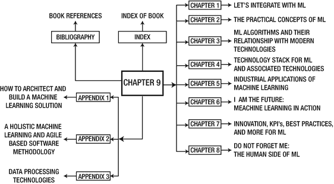

# 九、让我们总结一下：最终目标

你现在在这本书的末尾。对我来说这是一次伟大的旅程，我非常享受。写这本书背后有一个原因——机器学习及其相关技术非常庞大、复杂和具有挑战性。我喜欢挑战，所以选择写。向实际上不需要数学的人群展示一门纯数学学科本身就是一个挑战。但是，我尽力用通俗易懂的语言呈现事实，使它成为一本没有方程式的书。我的目标是让所有人都能理解。

这本书的目标是提供适当的工具和技术的概述。第 [1](1.html) 章为商业用户设置机器学习及其相关技术的背景。它还简要解释了技术细节、商业案例及其在机器学习背景下当前商业生态系统中的重要性。本章简要讨论了云、大数据、大数据分析、机器学习和认知计算。简而言之，这一章提供了这些技术的整体和综合的观点。本章解释了各种技术如何协同工作来提供解决业务挑战的解决方案。

了解技术的流程不足以掌握主题的命令，因此第 [2](2.html) 章提出了基本实用机器学习概念的论文。同时，在人工智能和脑科学的背景下讨论了 ML 的演变和历史。本章简要介绍了广义机器学习架构等概念，并讨论了其相关组件。它还向用户展示了如何构建或设计机器学习解决方案。它还详细介绍了机器学习背景下的商业机会，这些机会存在于多个行业、领域、垂直和水平领域。这一章介绍了一些创新的模型，这些模型本质上是对机器学习及其相关技术的可能的可见和不可见的机会和维度的未来观点。在这个过程中，本章提供了机器学习生态系统的工具、框架、库、语言和 API 的一瞥。机器学习是一门高度数学化和基于算法的学科。

第 [3](3.html) 章讨论了一些重要的算法及其用途。它还提供了一些以有效和高效的方式使用算法和机器学习模型的指南。在讨论算法的重要方面时，本章提供了一些与特定算法/模型/技术相关的成功案例。为了确保用户了解基于机器学习的重要趋势以及对当前业务的影响，本章简要介绍了这些主题。如今，几乎每个行业都需要职能和运营的敏捷性。机器学习本身是一个敏捷和创新的研究领域。因此，在第 3 章[中提供了一个关于敏捷软件方法的章节。](3.html)

第 [4](4.html) 章详细解释了可用于 IOT、大数据分析、机器学习和认知计算的技术堆栈。它解释了几乎所有适用于各个堆栈的主要技术。它还提供了对当前业务场景中的技术的理解。然而，这是一项具有挑战性的任务，因为在同一地区有多种产品的复杂性和可用性。在机器学习、云、大数据分析和认知计算等技术中，产品和服务也有很多重叠。因此，在这两种技术之间划一条清晰的界线是困难的。

第 5 章在前几章打下的基础上建造房子。它详细讨论了机器学习分析。它广泛讨论了机器学习分析在多个领域的用途、应用、挑战和用例，如制造、零售、营销、销售、银行和金融。它提供了我们这个时代的一些重要部门的综合视图，如视频游戏、农业、灾害管理、石油和天然气、时尚、酒店、旅游和航空。它还简要讨论了机器学习分析的作用。

将这些概念付诸实践是很重要的，这也是第 6 章发挥作用的地方。第 6 章[讲述了机器学习及其相关技术的“真实行动”。本章涵盖了大量关于机器学习和相关技术的重要信息。第 6 章](6.html)详细讨论了一些以机器学习为中心的成熟产品，如苹果 Siri、IBM Watson、微软 Crotona 以及联网和无人驾驶汽车。

IT 行业正在经历变革，这是毫无疑问的。无数的报告、趋势和预测表明了这一事实。因此，了解当前的业务动态非常重要。此外，理解供应商、客户和合作伙伴之间的思想和业务模型的相互作用也很重要。因此，第 [7](7.html) 章提供了当前 IT 供应商对新的和不断发展的业务模式的采用策略的转变状态。这是基于像机器学习这样的技术。它提供了一个思考过程的伙伴关系将如何在整个场景中发挥作用的观点。它还涵盖了机器学习生态系统背景下的风险、合规性、最佳实践和 KPI，并提供了一些关于这些技术如何潜在地改变信息技术和业务的未来状态的见解。

最后，我们都同意“人”是这场全面讨论的最重要的方面，任何思想都不会仅仅通过思考他们而实现。想法需要来自参与过程的人和利益相关者的适当支持。此外，从传统 IT 向数据驱动型 IT 转变需要改变思维方式。因此，第 8 章讨论了组织和企业的人的方面。它讨论了一个有效的团队对于实现机器学习项目是多么重要，以及构建该项目所需的要素。这是通过组织中数据文化的心理和技术方面来实现的，因为这是成功组织的强制性标准。

大多数时候，我们认为并相信我们的职业和个人生活是不同的，不能重叠。在某些方面，这是真的，但条件是我们都是人，而不是机器，因此，无论我们去哪里，我们都带着情感。职场也不例外。然而，通过对个人情绪、道德和社会智力的适当管理，团队和组织可以获得非常好的结果。好消息是这些技能是可以学习的；它们不像智商，智商在人的一生中大多是固定不变的。因此，如果组织促进他们的员工磨练他们的 MQ、EQ 和 SQ 技能，他们可以获得多种好处，如更好的承诺、有动力的劳动力和优秀的团队动力。第 8 章讨论了人和组织心理学的重要方面——组织和企业的文化和行为部分。

有一些关键的技能需要磨练，这些技能有可能在人类努力的四个关键方面——身体、情感、社交和精神——走向卓越:

*   复杂的问题解决技巧
*   批判性思维技能
*   设计思维
*   创造力和追求卓越的激情
*   人员和人才管理
*   沟通、协作、协调以及人际和个人技能
*   情感、社交、道德和精神智商
*   即时判断和决策能力
*   面向服务
*   谈判技巧
*   认知灵活性
*   正确的工作态度
*   将正念技巧应用于工作、生活等的能力