# 1.使用 Raspberry Pi (RasPi)介绍机器学习(ML)

本章将向你介绍 RasPi 和 ML。RasPi 讨论将是第一个，它将帮助您理解将用于运行本书所有演示的硬件平台。接下来是对 ML 的介绍性讨论，它将为你提供一个框架来理解 ML 是什么，以及为什么它是一个如此令人兴奋和快速发展的研究领域。

## RasPi 简介

为了运行本书的演示，您需要使用一个 RasPi。在接下来的几节中，我将向您展示如何设置和配置一个 RasPi 3 Model B 或 B+作为工作站，运行各种 ML 演示所需的脚本和程序。图 [1-1](#Fig1) 显示的是一个 RasPi 3 型号 B+，本书使用的就是这个型号。

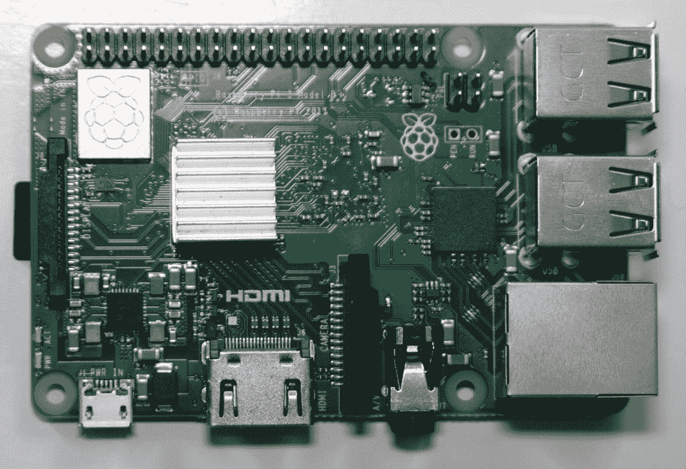

图 1-1

树莓 Pi 3 型号 B+

RasPi 3 型号 B and B+之间有一些差异。它们基本上是相同的，除了 B+的处理器时钟速度比 B+稍快，并且在无线功能方面有所改进。如果您使用 B 而不是 B+模型，这些改进都不会对运行本书的项目产生重大影响。

我不会讨论 RasPi 单板计算机的组成，因为许多书籍和博客已经充分讨论了这一点。如前所述，我在工作站配置中使用了一个 RasPi 3 Model B+。这个设置是 RasPi 与 USB 键盘、USB 鼠标和 HDMI 监视器连接的地方。在我的设置中，RasPi 由 2.2A、5V 电源供电，带有微型 USB 连接器。

RasPi 不使用机械磁盘驱动器来实现包含操作系统(OS)的文件系统。所有最新的 RasPi 版本都依赖于可插拔的微型 SD 卡作为辅助存储。虽然可以将传统的磁盘驱动器连接到 RasPi，但它只能作为辅助存储设备，而不能作为操作系统的主存储设备或可引导分区。接下来，我将向您展示如何在 micro SD 卡上下载和安装操作系统，以使 RasPi 能够作为一个功能性的 ML 微控制器。

毫无疑问，最简单的方法就是购买一个预编程的微型 SD 卡。这种卡是现成的，只需要进行配置以匹配您的特定工作站配置，包括您的 WiFi 网络。WiFi 配置过程将在后面的部分讨论，但首先我想讨论如何创建自己的微型 SD 卡，如果你愿意的话。

要加载的 micro SD 卡软件被称为 Raspbian Image，可以从许多在线网站免费获得，我推荐的网站是 Raspberry Pi Foundation 网站，位于 [raspberrypi。org](http://raspberrypi.org/) 。最新的操作系统映像总是可以从网站的下载部分获得。您可以下载两种类型的操作系统映像。第一种叫做 NOOBS，是“新的开箱即用软件”的缩写 NOOBS 有两个版本。一个版本被命名为 NOOBS，另一个版本被命名为 NOOBS 建兴。在撰写本文时，这两个版本都被确定为 v3.0.0。NOOBS 有一个简单的操作系统安装程序，其中包含 Raspbian 操作系统以及另一个流行的操作系统 LibreELEC。此外，NOOBS 版本提供了一个可供选择的操作系统，随后从互联网上下载并安装。NOOBS 建兴包含相同的操作系统安装程序，没有 Raspbian 预装和没有 LibreELEC 选项。但是，这个版本提供了相同的操作系统选择菜单，允许下载和安装 Raspbian 和其他操作系统映像。

NOOBS 和 NOOBS 建兴图像只是文件和子目录的集合，可以使用 BitTorrent 应用程序或简单地作为原始 Zip 文件下载。BitTorrent 和 Zip 下载的大小约为 1.2 GB。提取的映像大小为 1.36 GB，但最终安装的大小超过 4 GB。这意味着您将需要使用至少 8 GB 的 micro SD 卡来保存最终图像。然而，要复制本书中的所有 ML 演示，我强烈建议您使用至少 16 GB、10 类 micro SD 卡，以确保有足够的存储空间，并通过操作 RasPi 最大化数据吞吐量。

第二种映像类型是直接操作系统下载。当前可用的映像是 Raspbian Linux 发行版，代码名称为 Stretch。这个 Raspbian 版本可以使用 BitTorrent 下载，或者作为最终图像大小类似于 NOOBS 图像的 Zip 文件下载。

下载映像后，必须配置 micro SD 卡。我将只讨论直接 Raspbian 下载类型，因为我相信本书的读者对基本的计算机操作和 RasPi 有足够的经验，所以他们绝大多数会选择使用直接下载的方法。

### 将 Raspbian 图像写入微型 SD 卡

在写入图像之前，不需要对微型 SD 卡进行格式化。该过程的这一部分由将图像写入卡的应用程序自动完成。你只需要根据你的主机设置一个合适的应用程序。对于 Windows 机器，我强烈建议您使用 Win32DiskImager，可从

[`https://sourceforge.net/projects/win32diskimager/files/latest/download`](https://sourceforge.net/projects/win32diskimager/files/latest/download) 。

下载文件是一个 Zip 文件，需要在使用前解压缩。然后只需运行应用程序，选择磁盘映像所在的位置，还可以选择 micro SD 卡逻辑文件字母。图 [1-2](#Fig2) 显示了我将 Raspbian Stretch 版本写入 Windows 机器上的 micro SD 卡的配置屏幕。

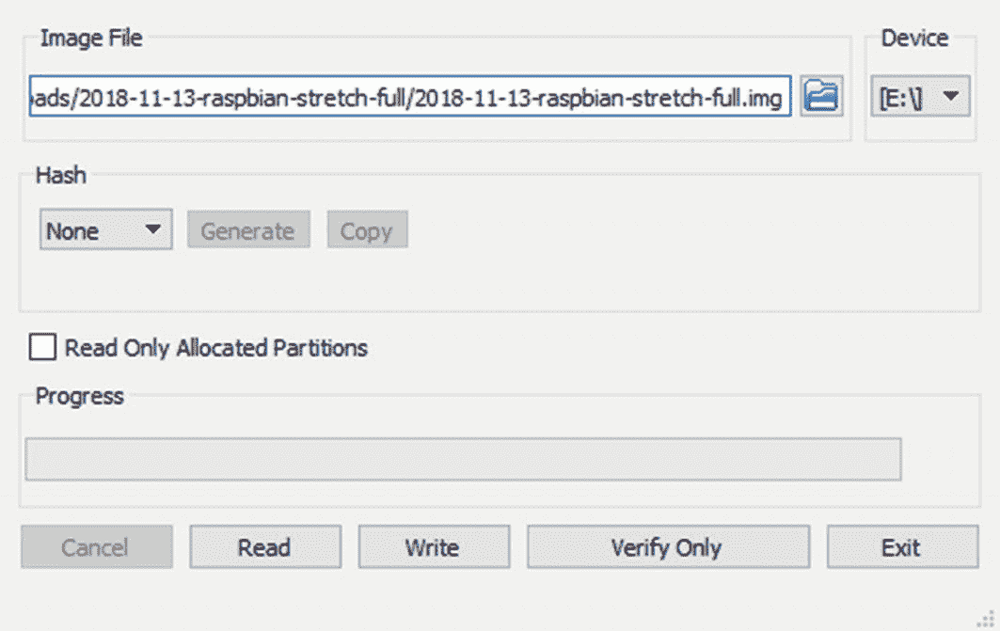

图 1-2

win32 磁盘映像屏幕截图

如果你用的是 Mac，我推荐用 Etcher 程序写磁盘镜像。它可从 [`https://etcher.io/`](https://etcher.io/) 获得。该应用程序的功能与 Win32DiskImager 程序类似。图 [1-3](#Fig3) 是它在我的 MacBook Pro 上运行的截图。

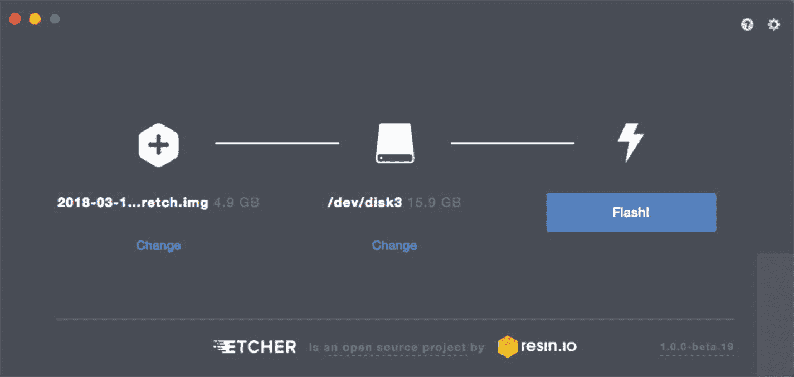

图 1-3

尊敬的屏幕快照

将操作系统映像写入 micro SD 卡后，接下来必须对其进行配置。我将配置过程分为两个部分。第一个问题是我认为哪些配置是强制性的，也就是说，如果不这样做，操作系统就可以按照您的情况运行。第二组配置涉及“微调”已经广泛调整的操作系统，以满足您的特定需求。

### 注意

RasPi 配置过程是动态的，不断发展的。通过这一声明，我的意思是传达以下说明，虽然在撰写本文时适用，但在您试图复制这些说明时可能不适用。这个事实仅仅是由于开源软件的本质。然而，我相信，无论制定了什么程序，它们都将是明确和易于遵循的。

#### 强制配置

图 [1-4](#Fig4) 显示 RasPi 启动后的打开屏幕。


图 1-4

初始配置截图

您必须单击“下一步”按钮，开始如图所示的配置过程。图 [1-5](#Fig5) 将立即出现，显示国家、语言和时区的默认值。

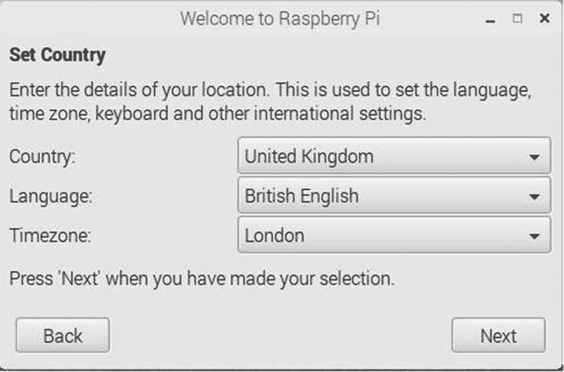

图 1-5

默认 ***设置国家*** 对话框

至少选择适当的国家和语言是很重要的，否则由于物理键盘的设置方式与您想要输入的字符之间的冲突，您将很难输入任何脚本或程序。时区菜单也会自动调整，以反映所选国家/地区的时区。

图 [1-6](#Fig6) 显示了我做出特殊选择后的方框。

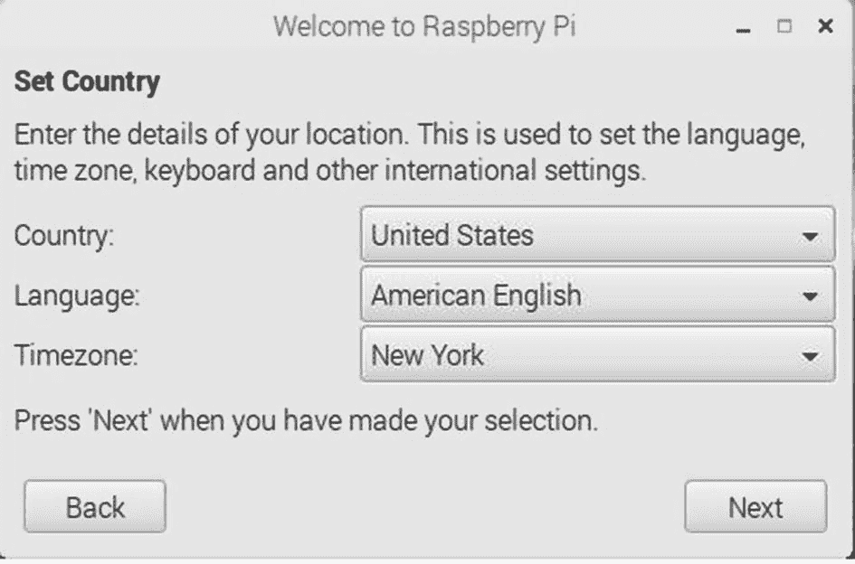

图 1-6

定制 ***设置国家*** 对话框

点击下一步按钮将弹出**修改密码**对话框，如图 [1-7](#Fig7) 所示。


图 1-7

***修改密码*** 对话框

更改 raspberry 的默认密码，这可能是众所周知的，应该可以提高系统的安全性。这个选择完全取决于你，坦率地说，对复制本书的任何演示都没有影响。你只需要记住密码，否则你需要安装一个新的镜像。我不认为有一种简单的方法可以在 Raspbian 操作系统上找回忘记的密码。如果您选择不更改密码，只需单击下一步按钮，就会出现**选择 WiFi 网络**对话框。图 [1-8](#Fig8) 显示我点击按钮后的情况对话框。

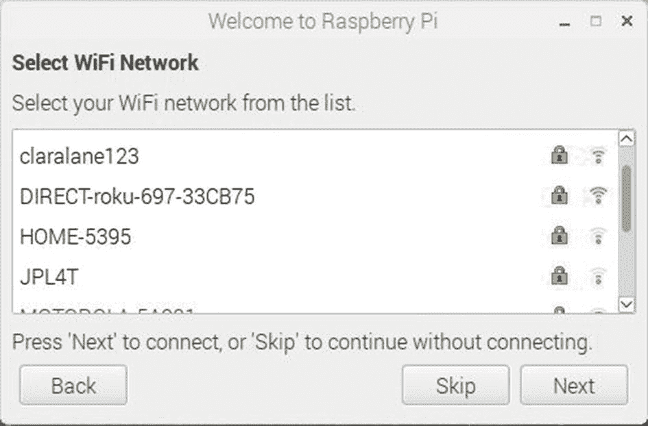

图 1-8

***选择 WiFi 网络*** 对话框

您需要单击适当的 WiFi 网络 SSID，以建立 WiFi 通信链接。将出现另一个对话框，提示您按物理路由器上的按钮或输入与所选 WiFi SSID 相关联的密码。出于明显的安全原因，我选择不显示这个对话框。点击下一步按钮将弹出**检查更新**对话框，如图 [1-9](#Fig9) 所示。

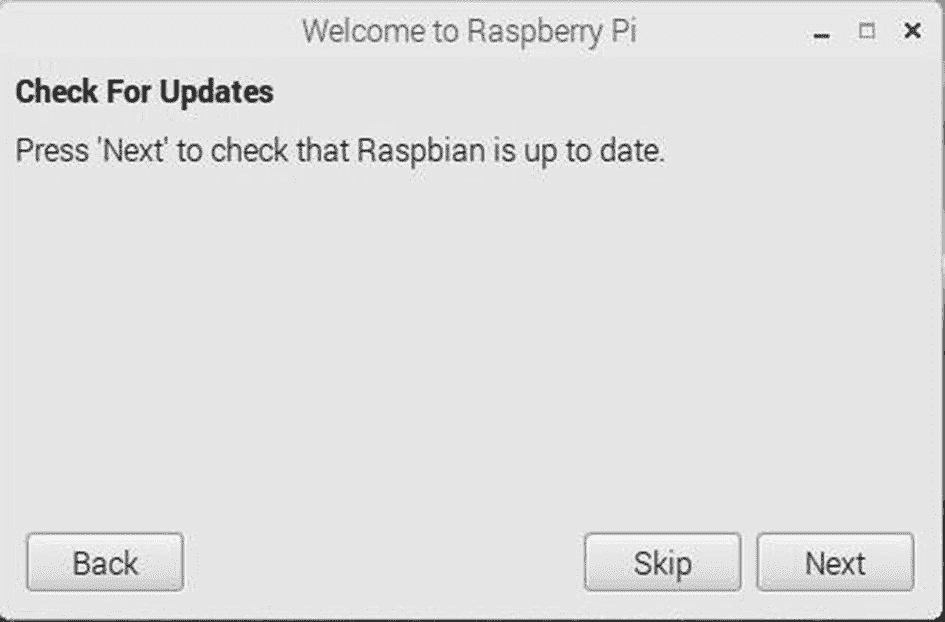

图 1-9

***检查更新*** 对话框

如果您没有设置 WiFi 连接，则无法检查更新。实际上，我不确定如果没有有效的 WiFi 链接设置，这个对话框是否会出现。假设您确实建立了一个 WiFi 链接，那么单击 Next 按钮将使 RasPi 访问互联网并检查包含在新映像中的当前安装的软件的状态。但是，您不需要在配置的这一点上运行检查，因为我将很快向您展示如何使用终端窗口命令进行更新。选择权在你。实际上，除了在配置过程中花费一些额外的时间之外，这两者都没有坏处。如果您想使用手动更新过程，只需单击跳过按钮；否则，请单击“下一步”按钮。图 [1-10](#Fig10) 显示了在我点击下一步按钮后**检查更新**对话框是如何变化的。

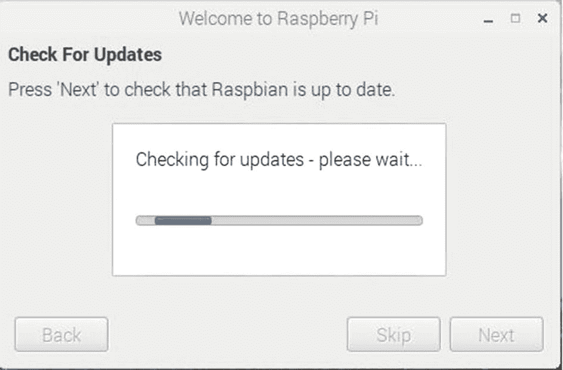

图 1-10

激活 ***检查更新*** 对话框

根据检测到的更新数量，活动栏将保持活动状态几分钟。更新完成后，您将看到一个信息框，通知您配置过程即将完成，您需要单击重新启动按钮来完成该过程。我建议您这样做，如果您更改了密码，不要忘记输入新密码。

我现在建议您在终端窗口中输入以下命令来检查您的 WiFi 连接状态:

```py
Ifconfig

```

图 [1-11](#Fig11) 显示了在我的 RasPi 系统上输入这个命令的结果。

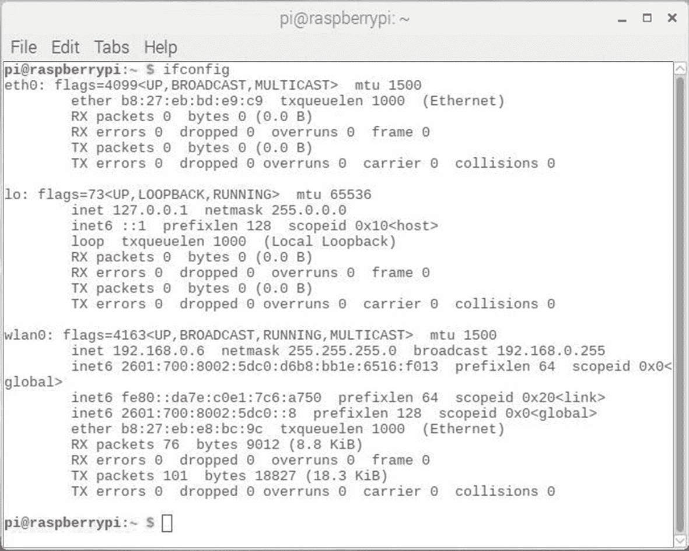

图 1-11

将显示 ifconfig 命令

您应该能够在 wlan0 部分看到，家庭 WiFi 路由器为 RasPi 分配了一个本地 IP 地址 192.168.0.6。该任务确认 RasPi 能够连接到互联网。检查您的家庭路由器是否设置了 DHCP，以防您看不到与图中所示类似的 IP 地址。

#### 可选配置

可选的配置过程使用名为 raspi-config 的实用程序。该实用程序在初始下载的映像中提供。您可以通过打开终端窗口并输入以下命令来运行 raspi-config 实用程序:

```py
sudo raspi-config

```

图 [1-12](#Fig12) 显示了 raspi-config 实用程序的开始屏幕。

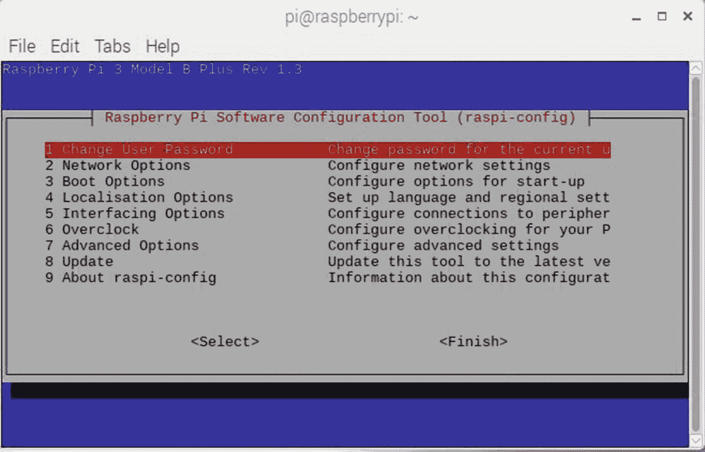

图 1-12

raspi-config 开始屏幕

从菜单中选择接口选项将会出现如图 [1-13](#Fig13) 所示的子菜单。

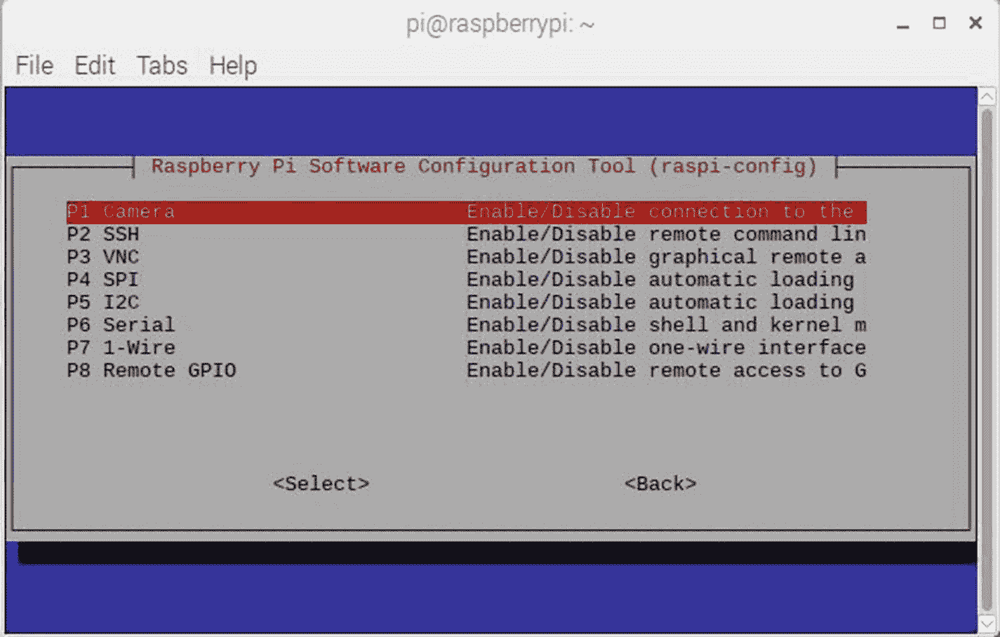

图 1-13

界面选项菜单

如图所示，该菜单有八个选项。您启用的选项将取决于您在 RasPi 系统中使用的设备类型。我建议启用以下选项来匹配本书中讨论的演示和过程:

*   照相机

*   嘘

*   精力

*   I2C

*   连续的

*   单线

通过重新运行 raspi-config 实用程序，您可以随时轻松地添加或减少接口选项。在任何情况下，添加接口选项只会最小程度地增加整个操作系统的大小。还要注意，启用接口只会调用该特定设备的相关驱动程序。

您将再次需要重启 RasPi 来完成这些可选的配置选择。在终端窗口中输入以下内容以重新启动计算机:

```py
sudo reboot

```

至此，您已经成功地设置和配置了您的 RasPi 系统。接下来，您需要更新和升级您的系统，以确保安装了最新的 Raspbian 操作系统软件。

### 更新和升级 Raspbian 发行版

如前所述，Raspbian Linux 发行版一直在改进。一旦建立了互联网连接，就很容易确保您拥有最新更新和升级的发行版。在终端窗口中输入以下命令来更新安装的操作系统:

```py
sudo apt-get update

```

更新操作会更改内部系统的程序包列表，以匹配当前的在线程序包列表。如果已经安装的软件包过时了，它实际上并不会改变它们。这些更改通过在终端窗口中输入以下命令来实现:

```py
sudo apt-get upgrade

```

如果最初安装发行版不太旧，更新会相当快。但是，如果已经安装了许多过时的软件包，升级操作可能需要相当长的时间。

请记住，在升级之前一定要更新。本书中的所有项目都是使用更新升级的 Stretch Raspbian 发行版创建的。我发现，不更新和升级有时会导致一些意想不到和令人费解的奇怪错误和系统故障。

在安装和配置过程的这一点上，您应该有一个功能完整的 RasPi 系统。现在，在继续讨论 ML 之前，我需要介绍一下虚拟 Python 环境的概念。

#### Python 虚拟环境

本节回答两个问题:

什么是 Python 虚拟环境？

为什么需要它们？

我将首先回答第二个问题。像许多类似的面向对象语言一样，Python 依赖于许多支持库和例程来运行。在 Python 中，这些库被称为依赖项，并根据它们的起始点存储在两个目录中的一个。原点意味着那些被认为是 Linux 内核的基本或核心的库被存储在系统包目录中。所有其他的，尽管对于正确的 Python 操作可能极其重要，但都存储在 Site-packages 目录中。每次发布新的 Python 语言修订版时，系统包目录都会根据需要进行更新和修改，以支持最新的修订版。因此，这个目录中只存储了每个必需的系统库的版本。对于站点包目录，情况并非如此。这是因为用户通常会安装所需的软件以及该软件所需的任何和所有库或依赖项。仅仅因为安装了多个软件，在 Site-packages 目录中有一个或多个相同依赖项的版本是完全可能的。一个问题很快就出现了，因为 Linux 仅仅根据名字安装了一个依赖项，而忽略了任何版本检查。完全有可能让项目 A 需要软件库 X，版本 1，而项目 B 需要软件库 X，版本 2。Linux 无法消除版本不一致，一个或两个项目将无法正常运行。Python 虚拟环境旨在消除这个问题。

Python 虚拟环境的主要目的是为每个 Python 项目创建一个隔离的环境。这意味着每个项目都有自己的依赖项，而不管其他项目需要什么依赖项。

为项目 A 和 B 创建单独的虚拟环境将消除版本不一致的问题。每个环境将能够独立于任何其他项目，依赖于所需的软件 X 的任何版本*，*。

虚拟环境的一个好处是，除了物理内存的限制之外，您创建的环境数量没有限制。回答前面提出的第一个问题很简单。Python 虚拟环境只是包含一些脚本和符号链接的一组分层目录，仅此而已。创造它们不涉及任何黑魔法或黑艺术。我相信一旦你开始使用它们，就没有回头路了。许多开发人员经常使用它们，在试图解决由疏忽的依赖问题引起的未知错误时，为自己节省了许多潜在的沮丧和焦虑的时间。

#### 安装 Python 虚拟环境

在遵循这些说明之前，请确保 Python 3 已安装并正常运行。还要确保您已经按照本章前面的讨论更新和升级了 Raspbian Stretch Linux 发行版。

这个程序有六个步骤。请遵循这些步骤，以便成功创建将用于处理数据模型的 Python 虚拟环境:

1.  Install pip, which is a Python package manager utility. This utility is very similar to advanced packing tool (apt), but uses a separate distribution repository. Enter the following commands:

    ```py
    wget https://bootstrap.pypa.io/get-pip.py
    sudo python3 get-pip.py

    ```

    **注意**在撰写本文时，最新的 pip 版本是 19.0.3。

2.  安装`virtualenv`和`virtualenvwrapper`实用程序。`virtualenv`实用程序用于在 Python 3 中创建虚拟环境。`virtualenvwrapper`实用程序创建 Python 语言和要在环境中执行的 Python 代码之间的链接。输入以下命令:

    ```py
    sudo pip install virtualenv virtualenvwrapper
    sudo rm -rf ~/get-pip.py ~/.cache/pip

    ```

3.  名为的隐藏文件。必须编辑位于主目录中的配置文件，以包含一些初始化数据。我建议您使用 nano 编辑器并添加数据，如下所示:

    ```py
    cd ~
    sudo nano .profile

    ```

    要添加的数据位于现有文件的最后一行:

    ```py
    # virtualenv and virtualenvwrapper
    export WORKON_HOME=$HOME/.virtualenvs
    export VIRTUALENVWRAPPER_PYTHON=/usr/bin/python3
    source /usr/local/bin/virtualenvwrapper.sh

    ```

    或者，您可以使用以下命令在命令行提示符下直接输入初始化数据:

    ```py
    echo -e "\n# virtualenv and virtualenvwrapper" >> ~/.profile
    echo "export WORKON_HOME=$HOME/.virtualenvs" >> ~/.profile
    echo "export VIRTUALENVWRAPPER_PYTHON=/usr/bin/python3" >> ~/.profile
    echo "source /usr/local/bin/virtualenvwrapper.sh" >> ~/.profile

    ```

4.  现在必须对文件`~./profile`进行源化。source 命令用于将命名文件中包含的函数加载到当前 shell 中以供执行。

    ```py
    source ~/.profile

    ```

### 注意

第一次运行上述命令后，您应该会看到图 [1-14](#Fig14) 中显示的文本。

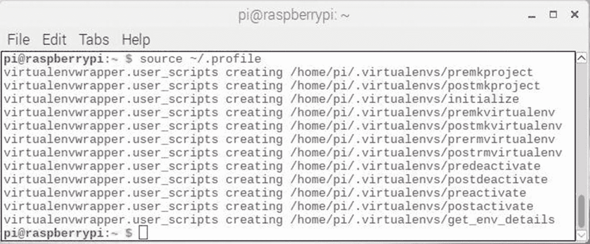

图 1-14

初始源命令结果


图 1-16

`workon`命令结果

1.  该步骤实际上使用先前在步骤 2 中安装的`virtualenv`和`virtualenvwrapper`实用程序生成了一个虚拟环境。您需要为环境提供一个唯一的名称。本例中使用的是 py3cv4_1。如果您计划生成多个环境，那么可能会使用 py3cv4_1、py3cv4_2、py3cv4_3 等命名方案。py3cv4_1 这个名字指的是虚拟环境使用 Python 3 的事实，它还包含 OpenCV 4 软件包。此外，最好记录下创建每个环境的原因，否则您会很快感到困惑。输入以下内容以生成 py3cv4_1 Python 虚拟环境:

    ```py
    mkvirtualenv py3cv4_1 -p python3

    ```

    创建虚拟环境大约需要 40 秒。图 [1-15](#Fig15) 显示了运行该命令的结果。您应该注意到常规命令行提示符前面的`(py3cv4_1)`。这表明虚拟环境当前有效。

    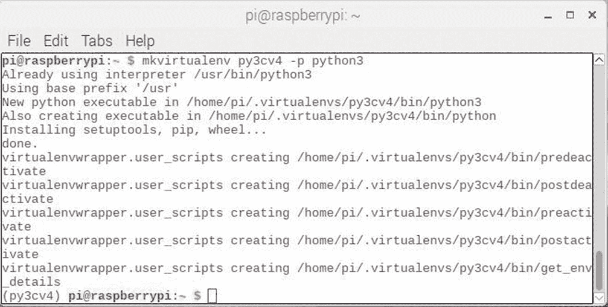

    图 1-15

    `mkvirtualenv`命令结果

    只需关闭终端窗口，就可以轻松关闭 py3cv4_1 虚拟环境。我建议这样做。

2.  Open a new terminal window to verify that you can start the py3cv4_1 virtual environment. Enter the following command:

    ```py
    source ~/.profile
    workon py3cv4_1

    ```

    `workon`命令包含在`virtualenvwrapper`软件包中。该命令允许轻松快速地启动任何 Python 虚拟环境。图 [1-16](#Fig16) 显示了前面命令的结果。

出现的这个图将确认您有一个工作的虚拟环境，并准备好继续下一步来创建数据模型框架。

#### 安装依赖项

下一个演示需要安装许多软件包来支持它。有些包已经预安装在原始下载的映像中，而其他包必须显式安装。以下命令将安装所有软件包。如果软件包已经安装，您将得到一个信息性声明；否则，将进行完全安装。这些命令需要一些时间，因为软件包可能很大，安装起来很复杂:

```py
pip install numpy
pip install scipy
pip install matplotlib
pip install pandas
sudo apt-get install libatlas-base-dev
pip install -U scikit-learn

```

以下 Python 脚本名为 checkLib.py，将返回加载的所有软件包的版本号。我建议您运行以确认所有依赖项都已安装。该脚本可从该书的配套网站获得:

```py
# Check library versions
# Python version
import sys
print('Python: {}'.format(sys.version))
# scipy
import scipy
print('scipy: {}'.format(scipy.__version__))
# numpy
import numpy
print('numpy: {}'.format(numpy.__version__))
# matplotlib
import matplotlib
print('matplotlib: {}'.format(matplotlib.__version__))
# pandas
import pandas
print('pandas: {}'.format(pandas.__version__))
# scikit-learn
import sklearn
print('sklearn: {}'.format(sklearn.__version__))

```

图 [1-17](#Fig17) 显示了我运行脚本后的结果。


图 1-17

checkLib.py 脚本的结果

您显示的版本可能在某种程度上与图中的有所不同，因为开源软件在不断地被修改。但是，这些包应该以与早期版本相同的方式运行，除非进行了一些根本的和不可预见的更改。出于一致性的考虑，通常不会这样做。

一旦所有的依赖项都已安装并运行，您现在就可以开始处理 ML 演示了。

### ML 事实

人工智能是人工智能母领域中的一个重要子课题。图 [1-18](#Fig18) 是强调 AI、ML 和深度学习(DL)之间关系的文氏图。

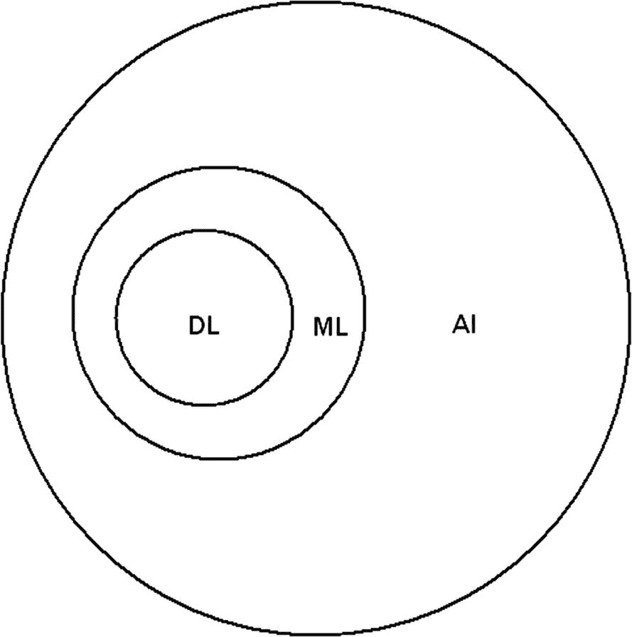

图 1-18

AI、ML 和 DL 的维恩图

从图中应该很清楚，ML 是 AI 的重要部分，DL 是 ML 的重要部分。就目前的兴趣和发展而言，该图应该颠倒过来，DL 受到的关注最多，对 ML 的重要性逐渐降低，然后是 AI。本书也将关注 DL 的层次结构，因为 DL 是实现计算机视觉的基本要素，而计算机视觉是目前 AI 和 ML 中最热门的话题。我将在后面的章节中深入探讨 DL；然而，在尝试更复杂的 DL 问题之前，我必须首先探索一些基本的 ML 主题。

#### ML 基础

如果你问十几个人工智能/人工智能研究人员什么是人工智能，你可能会得到十几个不同的，但有点相似的回答。我研究了许多定义，我相信下面这个定义和我发现的其他定义一样合适。

> 机器学习是创建算法的科学和艺术，使计算机能够在没有明确编程的情况下从数据中学习。

有趣的是，我发现多个定义使用了完全相同的短语“未经显式编程”，这证实了我的信念，即任何纯 ML 应用程序都必须排除所有封装专家知识的算法或系统。请注意，专家系统是人工智能的一个非常重要的部分，但不在 ML 中。然而，很可能存在混合系统，其结合了 ML 和专家系统，利用了这些技术中的每一个所提供的最佳能力。

机器学习最早是在 1959 年由麻省理工学院教授亚瑟·塞缪尔定义的，他是计算机科学和人工智能领域公认的先驱。塞缪尔教授部分指出"...赋予计算机无需明确编程就能学习的能力。”本质上，他想说的是，计算机可以用算法编程，既可以从输入数据中学习，又可以基于相同的数据做出相应的预测。这意味着这些学习算法可以完全脱离任何预编程或静态算法，并可以通过基于输入数据建立模型来自由做出数据驱动的决策或预测。

ML 模型主要用于预测和分类。在讨论更复杂的 ML 应用程序之前，有必要向您介绍一些关于这些操作的基本概念。这个介绍将以一个小的，但是完整的 ML 项目的形式出现。

#### 线性预测和分类

该项目主要基于 2016 年 6 月题为“*你在 Python 中的第一个机器学习项目一步一步”*的博客，由 Jason Brownlee 博士撰写，他目前是居住在澳大利亚的活跃的 ML 研究员。我推荐在 [`MachineLearningMastery.com`](http://machinelearningmastery.com) 看他的博客，里面有丰富的 ML 信息和资源。Jason 建议，我也完全同意，你应该用一种结构化的方法来开始所有的 ML 项目，这种方法由以下步骤组成，我从博客中转述了这些步骤:

1.  定义问题。

2.  准备和清理所有相关数据。

3.  评估所有适用的算法。

4.  不断改善结果，直到收益递减。

5.  尽可能清晰明确地展示结果。

这个最开始的 ML 项目是一个关于鸢尾花分类的著名项目。Iris flower 数据是一个多变量数据集，由英国统计学家和生物学家罗纳德·费雪在其 1936 年的论文“分类问题中多重测量的使用”中提出，作为线性判别分析(LDA)的一个例子。该数据集有时被称为安德森虹膜数据集，因为埃德加·安德森收集了这些数据来量化三个相关物种的虹膜花的形态变化。这三个物种中的两个是在加拿大魁北克的加斯佩半岛采集的，安德森的论文中引用了“所有这些都来自同一个牧场，在同一天由同一个人用同样的仪器在同一时间采集和测量”。三种鸢尾花的照片如图 [1-19](#Fig19) 所示。

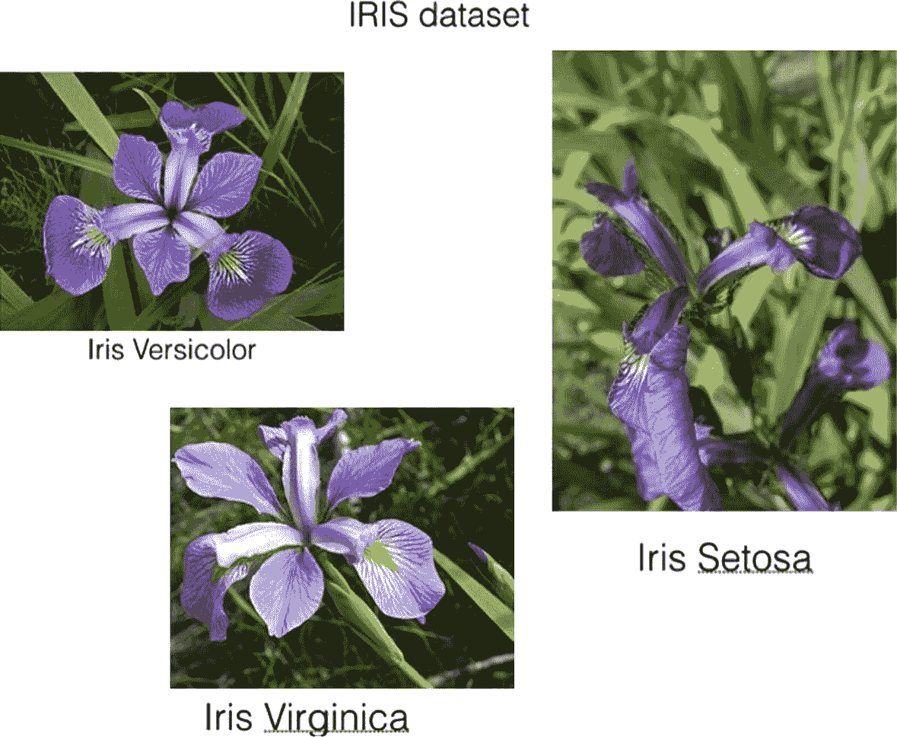

图 1-19

三种鸢尾花

该数据集由三种鸢尾(刚毛鸢尾、海滨鸢尾和杂色鸢尾)各 50 个样本组成。测量每个样品的四个特征:萼片和花瓣的长度和宽度，以厘米为单位。Fisher 基于这四个特征的组合开发了一个线性判别模型来区分鸢尾属物种。萼片是被子植物(开花植物)花的一部分，通常是绿色的。萼片通常起到保护含苞待放的花的作用，并且通常在开花时支撑花瓣。花瓣是围绕花朵生殖部分的修饰叶子。它们通常颜色鲜艳或形状奇特，以吸引授粉者，即蜜蜂。图 [1-20](#Fig20) 显示了一朵花(不是鸢尾),其萼片和花瓣已被识别。

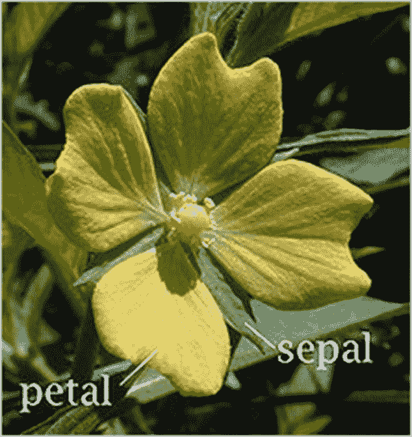

图 1-20

萼片和花瓣

问题解决方法的第一步相当简单。给定描述萼片高度和宽度以及花瓣高度和宽度的四个维度，识别鸢尾属物种。维度都应该以厘米为单位，以匹配基础数据集中的单位。

求解过程的下一步是处理数据集。有几个在线资源可以下载 CSV 格式的原始虹膜数据集。我使用了 Jason 在 github.com 上提供的 Iris CSV 数据集。本章演示的第一部分是熟悉数据集。

#### Iris 演示–第 1 部分

以下列出的 Python 脚本名为 irisDemo.py，创建该脚本是为了完成以下一系列步骤，使您熟悉数据属性和特征。熟悉这些数据将有助于您选择最适合您需求的算法。这些步骤是

*   加载依赖项。

*   加载数据集。

*   显示数据集维度。

*   显示数据集中的前 20 条记录。

*   显示数据集统计数据。

*   显示数据集类和相关大小。

*   单变量和多变量数据图。

以下完整的脚本可以从该书的配套网站上获得。我将在代码清单之后讨论整个脚本的结果。

```py
# Usage
# python irisDemo.py

# Load libraries
import pandas
from pandas.plotting import scatter_matrix
import matplotlib.pyplot as plt

# Load dataset
url = "https://raw.githubusercontent.com/jbrownlee/Datasets/master/iris.csv"
names = ['sepal-length', 'sepal-width', 'petal-length', 'petal-width', 'class']
dataset = pandas.read_csv(url, names=names)

# Display the shape

print('Dataset dimensions')
print(dataset.shape)

# Display the first portion of the data
print('Head of the data')
print(dataset.head(20))

# Display data statistics
print('Statistics')
print(dataset.describe())

# Display class distribution
print('Class distribution')
print(dataset.groupby('class').size())

# Visualize data with box and whisker diagrams
dataset.plot(kind='box', subplot=True, layout=(2,2), sharex=False, sharey=False)
plt.show()

# Visualize data with histograms
dataset.hist()
plt.show()

# Visualize data with scatter plots
scatter_matrix(dataset)
plt.show()

```

图 [1-21](#Fig21) 显示了 irisDemo 脚本结果的第一部分。

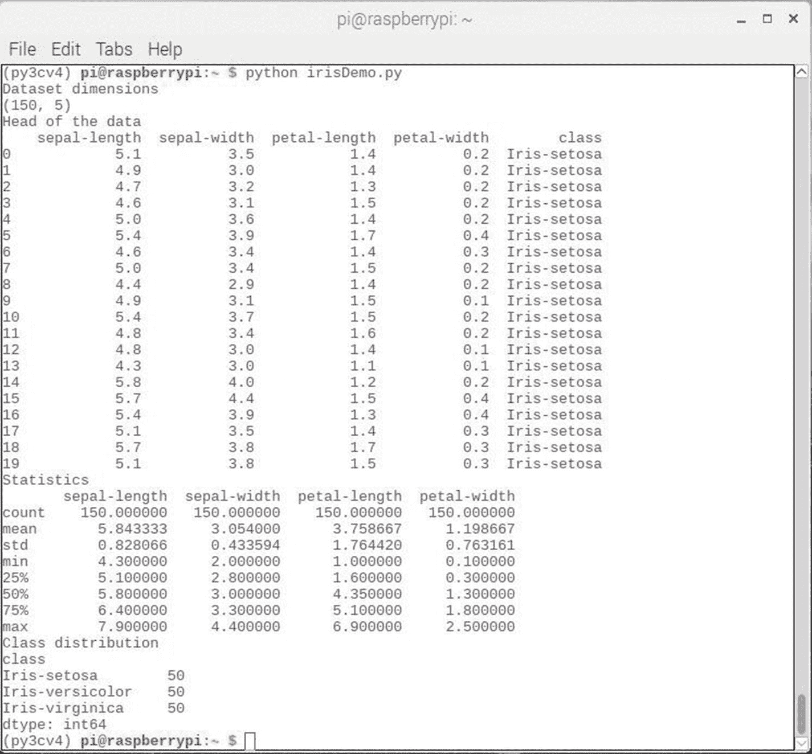

图 1-21

irisDemo 结果的初始部分

前两行显示了数据集维度，有 150 行 5 列。接下来是数据集的前 20 行。列标题清晰显示，所有行数据以表格形式显示。这个清单将为您提供对要处理的数据的深入了解。

接下来是一个小的统计显示，显示了数据集列的经典统计度量，包括平均值、标准偏差、最小/最大值，以及 25、50 和 75 百分点级别的值。

最后，会显示数据集中每一类虹膜的项目数。不出所料，每个班级都有 50 名学生，与预期值完全相符。

图 [1-22](#Fig22) 显示了四个类别属性的“盒须”图。

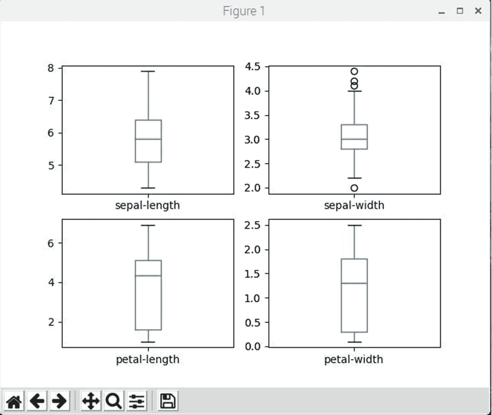

图 1-22

类属性的盒须图

这些单变量图是帮助您理解与每个属性相关的数值分布的有用附件。结果可能是，一些模型可以处理较宽的数值分布，而另一些模型更敏感，这可能导致不希望的结果。与相同的萼片属性相比，回顾图显示花瓣长度和花瓣宽度属性的数字分布稍微更宽。此外，sepal-width 属性似乎存在一些数据异常值，这可能会导致某些模型出现问题。这些图只是为了提供对数据的进一步了解，以帮助解释任何奇怪的模型结果。

另一种可视化数据的方法是为每个输入变量创建直方图。图 [1-23](#Fig23) 显示了所有四种虹膜属性的直方图。

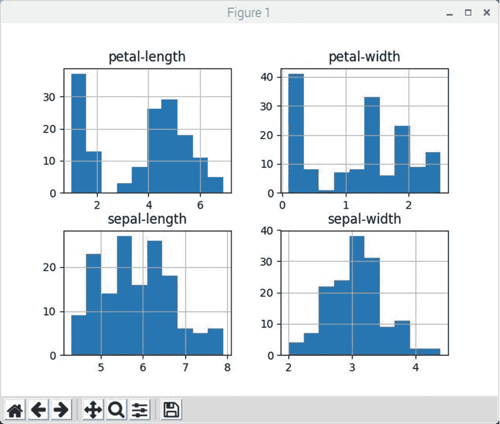

图 1-23

类别属性的直方图

似乎萼片属性中的两个具有高斯或近似高斯分布。该信息可用于为预测目的选择合适的模型或算法。花瓣属性似乎有双峰直方图，这是一个有趣的事实，可能有助于选择算法，如 Otsu 的二值化。

检查数据集的另一种方法是检查属性之间的结构化关系。这种方法被称为多元分析。图 [1-24](#Fig24) 显示了所有类别属性对的散点图。

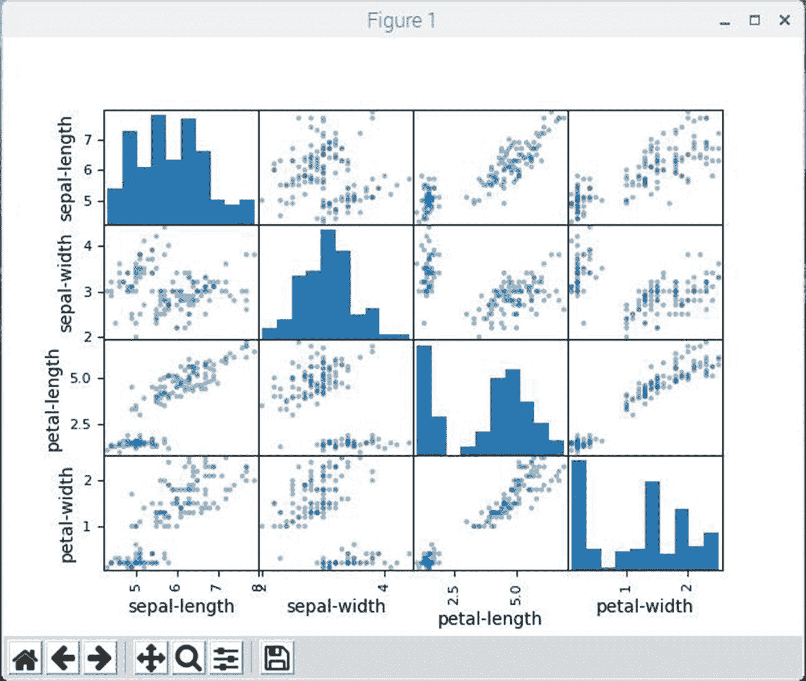

图 1-24

所有类别属性的散点图

这些图有助于可视化仅查看数字列表时不易发现的关系。您应该注意图中一些属性对的对角线分组。这有力地表明了属性之间的高度相关性以及可能存在的可量化关系。

演示的下一部分是将数据输入到一系列模型和预测运行中。我必须警告你，在没有事先介绍的情况下就简单地使用模型，这将是我撰写技术书籍的一大罪过。我会在这一章或者接下来的章节中，作为本书的 ML 基础知识的一部分，详细讨论模型算法。

#### Iris 演示–第 2 部分

下面列出的 Python 脚本名为 irisDemoTest.py，创建该脚本是为了使用 Iris 数据集测试多个模型，并确定在给定一组 Iris 属性的情况下，这些模型在描述 Iris 物种时的准确性。测试将以类似于第 1 部分的方式分一系列步骤进行。这些步骤是

*   导入所有模型。

*   创建培训和验证数据集。

*   使用十倍交叉验证设置测试工具。

*   使用六种不同的模型来描述属性测量的鸢尾物种。

*   选择准确的型号。

下面列出的 Python 脚本名为 irisDemoTest.py，可从本书的配套网站获得。我将讨论脚本的每个部分，因为它与清单之后的步骤相关。

```py
# Usage
# python irisDemoTest.py

# Load libraries
import pandas
from pandas.plotting import scatter_matrix
import matplotlib.pyplot as plt
from sklearn import model_selection
from sklearn.metrics import classification_report
from sklearn.metrics import confusion_matrix
from sklearn.metrics import accuracy_score
from sklearn.linear_model import LogisticRegression
from sklearn.tree import DecisionTreeClassifier
from sklearn.neighbors import KNeighborsClassifier
from sklearn.discriminant_analysis import LinearDiscriminantAnalysis
from sklearn.naive_bayes import GaussianNB
from sklearn.svm import SVC

# Load dataset
url = "https://raw.githubusercontent.com/jbrownlee/Datasets/master/iris.csv"
names = ['sepal-length', 'sepal-width', 'petal-length', 'petal-width', 'class']
dataset = pandas.read_csv(url, names=names)

# Create training and validation datasets
array = dataset.values
X = array[:,0:4]
Y = array[:,4]
validation_size = 0.20

seed = 7
X_train, X_validation, Y_train, Y_validation = model_selection.train_test_split(X, Y, test_size=validation_size, random_state=seed)

# Set the scoring criteria
scoring = 'accuracy'

# Build all the models
models = []
models.append(('LR', LogisticRegression(solver='liblinear', multi_class="ovr")))
models.append(('LDA', LinearDiscriminantAnalysis()))
models.append(('KNN', KNeighborsClassifier()))
models.append(('CART', DecisionTreeClassifier()))
models.append(('NB', GaussianNB()))
models.append(('SVM', SVC(gamma='auto')))

# Evaluate each model
results = []
names = []
for name, model in models:
    kfold = model_selection.KFold(n_splits=10, random_state=seed)
    cv_results = model_selection.cross_val_score(model, X_train, Y_train, cv=kfold, scoring=scoring)
    results.append(cv_results)
    names.append(name)
    msg = "%s: %f(%f)" % (name, cv_results.mean(), cv_results.std())
    print(msg)

```

导入列表与第一个脚本相比有了很大的变化。它现在包括 sklearn 包中的六个模型。按字母顺序排列的型号列表如下

*   决策树分类器

*   高斯安 b

*   近邻分类器

*   线性判别分析

*   逻辑回归

*   交换虚拟电路

正如我前面提到的，我不会讨论任何关于模型功能的细节。

然后，以与第一个脚本完全相同的方式加载数据集。使用这个精确的数据集很重要，因为我通过尝试不同来源的虹膜数据集发现了这一点。我怀疑在尝试使用新数据集时，格式上的微小变化是问题所在。

脚本的下一部分处理关于创建训练数据集和验证数据集的步骤。原始数据集的 80%将用于模型训练，20%将用于验证。在验证过程中，原始数据的一个小的子集将被输入到未经训练的模型中。然后将模型的结果输出与验证数据集中每个记录的物种标签进行比较。然后，正确识别的物种数量与数据集中记录总数之间的简单比率将被计算为百分比准确度。

测试过程的下一步是建立一个循环，为每个模型实现十倍交叉验证过程。这意味着输入数据集最初被分成十个部分，其中九个部分用于训练，第十个部分用于验证。结果被记录下来，然后数据集再次被随机分成 10 个部分，这个过程总共重复 10 次，因此被命名为十倍。我确实想指出一些可能让读者感到困惑的东西。十倍交叉验证过程中使用的数据集只是训练数据集，而不是验证数据集。在讨论下一个脚本之前，不会使用验证数据集，下一个脚本将详细讨论模型的预测准确性。

脚本中的循环为每个模型运行交叉验证分数。结果如图 [1-25](#Fig25) 所示。

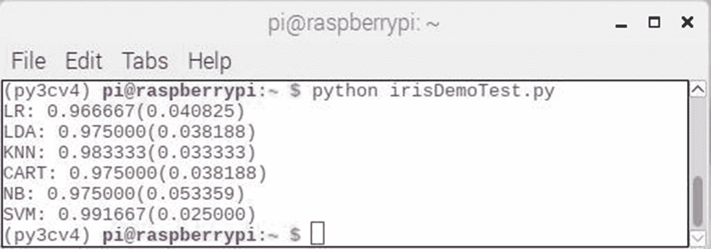

图 1-25

六个模型的交叉验证分数

你可以看到他们的得分都在 90%以上，这意味着所有可能的鸢尾属物种的良好描述者都给出了一组类别属性。括号中的数字是每个模型结果的标准偏差。你应该能够看到，偏差相对较小，这意味着模型再次是很好的描述。如图所示，支持向量机(SVM)模型的结果最好，得分为 0.991667，标准偏差仅为 0.025。但是，对于我们的目的来说，它真的是最好的模型吗？这将在本演示的第 3 部分中讨论。

#### Iris 演示–第 3 部分

接下来的讨论使用盒须图比较了六种模型的准确性。所使用的脚本名为 irisDemoSelection.py，除了添加了绘图函数和一些用于详细描述所选模型性能的算法之外，它与前面的脚本基本相同。该脚本中还消除了六个模型的精度显示:

```py
# Load libraries
import pandas
from pandas.plotting import scatter_matrix
import matplotlib.pyplot as plt
from sklearn import model_selection
from sklearn.metrics import classification_report
from sklearn.metrics import confusion_matrix
from sklearn.metrics import accuracy_score
from sklearn.linear_model import LogisticRegression
from sklearn.tree import DecisionTreeClassifier
from sklearn.neighbors import KNeighborsClassifier
from sklearn.discriminant_analysis import LinearDiscriminantAnalysis
from sklearn.naive_bayes import GaussianNB
from sklearn.svm import SVC

# Load dataset
url = "https://raw.githubusercontent.com/jbrownlee/Datasets/master/iris.csv"
names = ['sepal-length', 'sepal-width', 'petal-length', 'petal-width', 'class']
dataset = pandas.read_csv(url, names=names)

# Create training and validation datasets
array = dataset.values
X = array[:,0:4]
Y = array[:,4]
validation_size = 0.20
seed = 7
X_train, X_validation, Y_train, Y_validation = model_selection.train_test_split(X, Y, test_size=validation_size, random_state=seed)

# Set the scoring critera
scoring = 'accuracy'

# Build all the models
models = []
models.append(('LR', LogisticRegression(solver='liblinear', multi_class="ovr")))
models.append(('LDA', LinearDiscriminantAnalysis()))
models.append(('KNN', KNeighborsClassifier()))
models.append(('CART', DecisionTreeClassifier()))
models.append(('NB', GaussianNB()))
models.append(('SVM', SVC(gamma='auto')))

# Evaluate each model

results = []
names = []
for name, model in models:
    kfold = model_selection.KFold(n_splits=10, random_state=seed)
    cv_results = model_selection.cross_val_score(model, X_train, Y_train, cv=kfold, scoring=scoring)
    results.append(cv_results)
    names.append(name)

# Plot model results
figure = plt.figure()
figure.suptitle('Algorithm Comparison')
algPlot = figure.add_subplot(1, 1, 1)
plt.boxplot(results)
algPlot.set_xticklabels(names)
plt.show()

# KNN prediction
knn = KNeighborsClassifier()
knn.fit(X_train, Y_train)
predictions = knn.predict(X_validation)
print(accuracy_score(Y_validation, predictions))
print(confusion_matrix(Y_validation, predictions))
print(classification_report(Y_validation, predictions)

```

图 [1-26](#Fig26) 以盒须图显示了所有型号的结果。

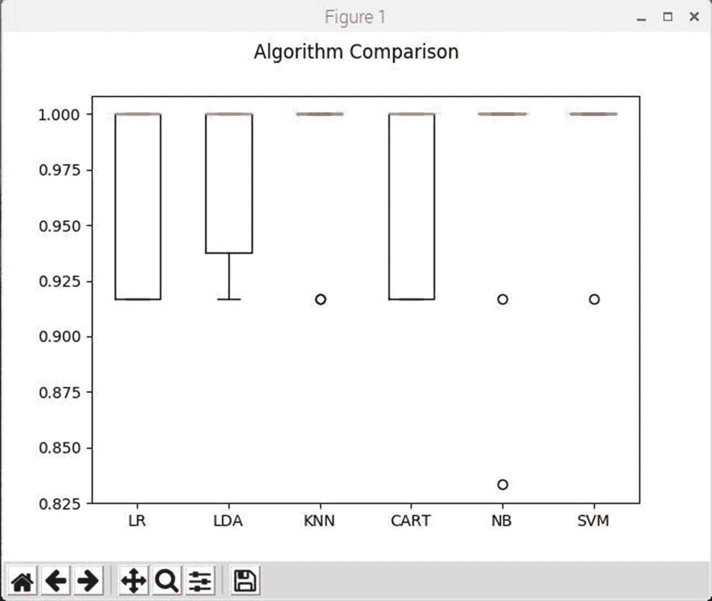

图 1-26

模型结果的盒须图

您可以观察到盒状图和须状图在 y 轴范围的顶部被压扁，说明一半的模型达到或接近 100%的精度。在这种情况下，选择最佳演员几乎是不可能的；然而，我选择了 KNN 模型来更详细地考察它的性能。KNN 是一个简单而精确的模型。KNN 模型的正式名称是 K-最近邻算法，是现有的最简单的分类算法之一，并且很可能是使用最广泛的算法之一。KNN 是一个非参数的，懒惰的学习算法。它主要用于将数据点分成几个类的数据集，以预测新数据点或样本的分类。更简单地说，KNN 被描述为一种实现了这句口头禅的算法，“告诉我你的邻居是谁，我就能告诉你你是谁。”

我将 KNN 描述为非参数的，这意味着该模型不做任何关于潜在数据分布的假设。换句话说，模型结构是由数据决定的。鉴于这一事实，当很少或没有关于数据如何分布的先验知识时，KNN 可能应该是分类研究的首选之一。

与热切算法相反，KNN 也是一种懒惰算法。这意味着它不使用训练数据点来进行任何概括。换句话说，没有明确的训练阶段，或者训练阶段很少。这意味着任何训练阶段的持续时间都可能是最短的，这对于大型数据集来说是很重要的一点。缺乏通用性也意味着 KNN 保留了所有的训练数据。更准确地说，没有泛化意味着在验证/测试阶段使用大多数(如果不是全部)训练数据。

KNN 算法基于特征相似性。这意味着样本外特征与训练集的相似程度决定了给定数据点的分类方式。通过查看图 [1-27](#Fig27) ，这一过程将变得更加清晰，这是一个 KNN 分类的图解示例。

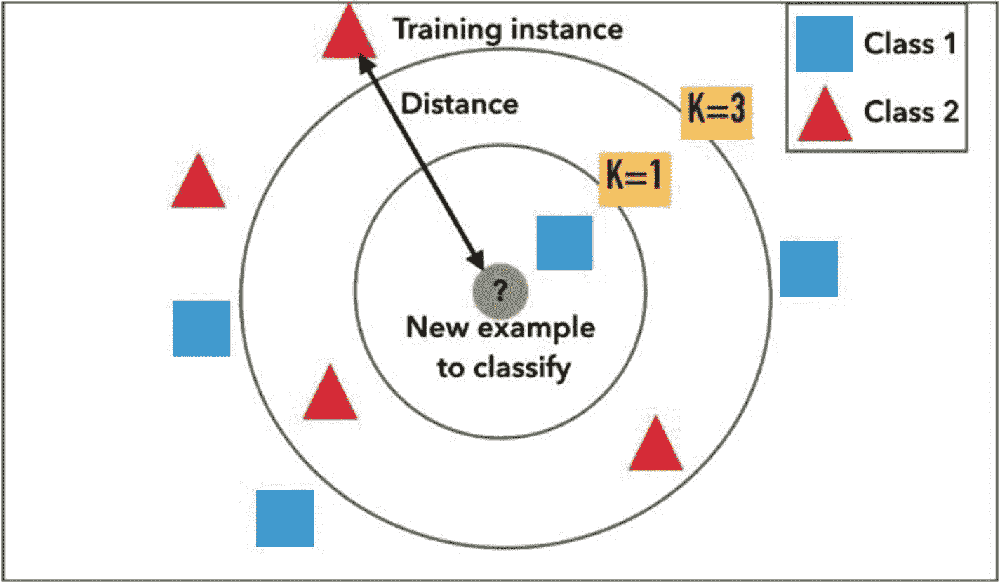

图 1-27

KNN 分类

测试样品(圆圈内)可分为一类蓝色正方形或二类红色三角形。如果 k = 3(外圆)，则分配给第二类，因为内圆内有 2 个三角形，只有 1 个正方形。例如，如果 k = 5，新样本将被分配到第一类(外圆外的 3 个正方形对 2 个三角形)。

脚本的最后一部分使用验证数据集直接运行 KNN 模型。最终准确度分数、混淆矩阵和分类报告的汇总结果如图 [1-28](#Fig28) 所示。

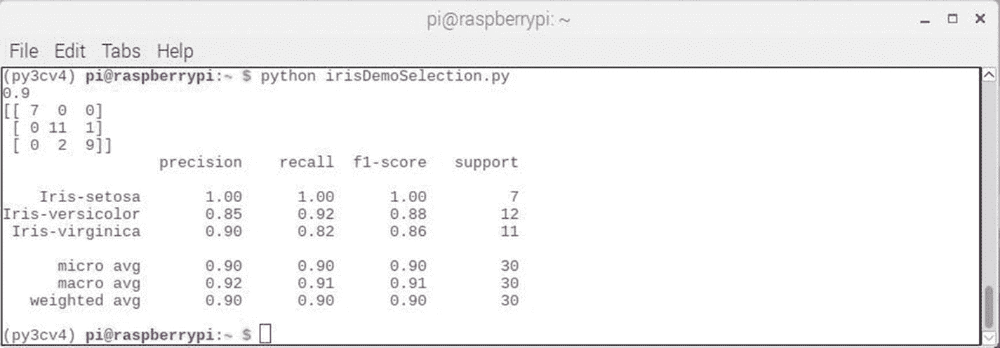

图 1-28

KNN 模型验证结果

第一行显示准确度分数为 0.9 或 90%。此准确性分数是一个汇总评级，显示正确预测占整个数据集大小的比率。在这种情况下，数据集有 30 条记录，正确预测的数量是 27，这产生了 0.9 的结果。回想一下，这个准确度分数是基于使用验证数据集的，它是原始 Iris 数据集的 20%。由于十倍交叉验证测试的性质，图 [1-28](#Fig28) 中显示的准确度分数被人为提高。这个较低的准确度分数反映了真实世界的情况，应该被认为是更可信的。

混淆矩阵(误差矩阵)提供了三个误差在哪里产生的指示。表 [1-1](#Tab1) 详细列出了实际等级和预测等级。

表 1-1

实际与预测类别

<colgroup><col class="tcol1 align-left"> <col class="tcol2 align-left"> <col class="tcol3 align-left"> <col class="tcol4 align-left"> <col class="tcol5 align-left"></colgroup> 
|   | 

实际类别

 |
| --- | --- |
| 

伊里斯·濑户沙

 | 

虹膜异色

 | 

弗吉尼亚 Iris

 |
| --- | --- | --- |
| 预测类别 | 伊里斯·濑户沙 | seven | Zero | Zero |
| 虹膜异色 | Zero | Eleven | one |
| 弗吉尼亚 Iris | Zero | Two | nine |

最后，sklearn metrics 提供的分类报告是按精确度、召回率、F1 分数和支持度对课程结果的细分。即使验证数据集很小，该报告也显示了非常好到极好的结果。我解释了表 [1-2](#Tab2) 中的每个指标。

表 1-2

sklearn 学习度量分析

<colgroup><col class="tcol1 align-left"> <col class="tcol2 align-left"> <col class="tcol3 align-left"> <col class="tcol4 align-left"> <col class="tcol5 align-left"></colgroup> 
| 

公制的

 | 

伊里斯·濑户沙

 | 

虹膜异色

 | 

弗吉尼亚 Iris

 | 

备注(见注释)

 |
| --- | --- | --- | --- | --- |
| 精确 | One | Zero point eight five | Zero point nine | 精度= tp / (tp + fp) |
| 召回 | One | Zero point nine two | Zero point eight two | 召回= tp / (tp + fn) |
| f1-分数 | One | Zero point eight eight | Zero point eight six | 平均值(精确度+召回率) |
| 支持 | seven | Twelve | Eleven | 班级规模 |

*注:tp =真正*

*fp =假阳性*

*fn = false 负值*

精确度直观上是分类器不将阴性样品标记为阳性的能力。

召回直观上是分类器找到所有肯定样本的能力。

f1 分数(F-beta)可以解释为精确度和召回率的加权调和平均值，其中 F-beta 分数在 1 时达到其最佳值，在 0 时达到最差分数。

我将向您推荐 sklearn 文档，以了解更多关于微观、宏观和加权 avg 的信息。页面是

[T2`https://scikit-learn.org/stable/modules/generated/sklearn.metrics.precision_recall_fscore_support.html`](https://scikit-learn.org/stable/modules/generated/sklearn.metrics.precision_recall_fscore_support.html)