# 6.CNN 示威

本章展示了几个实际的 DL 演示。如果你已经阅读了前一章或者已经获得了 DL 技术和概念的经验，你将准备好跟随演示。在写这一章的时候，我有两个目标。第一个是清楚地展示如何完成一个完整的人工神经网络项目，以产生现实和有用的结果。第二是指出在人工神经网络开发中常见的一些潜在的陷阱和不切实际的假设。

## 零件目录表

本章演示需要一个标准的 RasPi 桌面配置。

<colgroup><col class="tcol1 align-left"> <col class="tcol2 align-left"> <col class="tcol3 align-left"> <col class="tcol4 align-left"></colgroup> 
| 

项目

 | 

模型

 | 

量

 | 

来源

 |
| --- | --- | --- | --- |
| 树莓 Pi 4 | 型号 B(配有 2gb 或 4 GB 内存的 RasPi 4) | one | mcmelectronics.comadafruit.comdigikey.commouser.comfarnell.com |
| 微型 SD 卡 | 16 GB，10 级或更大 | one | amazon.com |
| USB 键盘 | 亚马逊基础版 | one | amazon.com |
| USB 鼠标 | 亚马逊基础版 | one | amazon.com |
| HDMI 监视器 | 商品 | one | amazon.com |

### 注意

要使 RasPi 4 能够编译和训练章节演示中使用的 CNN 模型，至少需要 2 GB 的 RAM。只有 1 GB 内存的 RasPis 在演示中不会成功。

## CNN 模型介绍

CNN 是卷积神经网络的缩写。在前一章中，我使用了一个多层感知器(MLP)模型，它是基于长期的传统模型，使用了被称为感知器的经典人工神经元。在某种意义上，MLP 模型是完全连接的，即在给定的网络层中，每个神经元至少在最初是与其他每个神经元相连的。对于被认为是稀疏连接网络的 CNN 模型来说，情况并非如此。

CNN 类似于前一章讨论的常规神经网络，因为它们由具有权重和偏差的神经元组成，这些权重和偏差根据学习进行修改。每个 CNN 神经元接收一些输入，执行点积，并且可选地跟随非线性。整个 CNN 仍然使用一个输入端的原始图像像素来表达一个评分函数，以在输出端对分数进行分类。CNN 仍然有一个损失函数，并在最后一个完全连接的层上使用 softmax 函数。基本上，针对常规神经网络讨论的所有技术和概念都适用于 CNN。

那么常规神经网络和 CNN 有哪些显著的变化呢？CNN 架构明确假设输入是图像。这一基本假设允许对网络进行某些优化，从而允许将某些属性编码到架构中。这些优化使得前向传播功能更有效地实现，并且极大地减少了网络中的参数数量。

回想一下前一章，常规神经网络接收输入作为单个输入数据向量，并通过一系列*隐藏层*对其进行转换。每个隐藏层由一组神经元组成，其中每个神经元与前一层中的所有神经元完全连接，并且其中单层功能中的神经元完全独立，不共享任何连接。最后一个完全连接的层称为输出层，它生成的分类设置代表类得分。

*常规的神经网络* *不能很好地缩放到全尺寸图像*。在流行的 CIFAR-10 数据集中，图像大小为 32×32×3(32 宽，32 高，3 个颜色通道)，因此常规神经网络的第一个隐藏层中的单个全连接神经元将具有 3072(32×32×3)个权重。尽管这个权重数量是可管理的，但它仍然清楚地暗示了一个全尺寸的图像将需要大量的权重。例如，一个更常见的大小为 400 x 300 x 3 的图像需要 360，000 个权重。此外，可能会涉及几个隐藏层，因此很明显，计算复杂性迅速成为指数爆炸。应该清楚的是，具有完全连接性的常规神经网络不是用于适当大小的图像的好方法。处理过多的参数可能会导致网络的过度拟合和随之而来的不良性能。

CNN 设计利用了其输入仅由图像组成的事实，因此可以以最佳方式设计架构。特别是，与常规的神经网络不同，CNN 的各层具有以三维方式排列的神经元，即宽度**、**高度**和**深度**。注意，这里的词语*深度*仅指激活体积的第三维。在 CNN 设计中，后续层中的神经元将仅连接到前一层的一小部分区域。**

 **此时，我需要讨论卷积运算。图 [6-1](#Fig1) 显示了图像体积以及尺寸为 5 x 5 x 3 的较小图像体积。较小的体积称为过滤器。

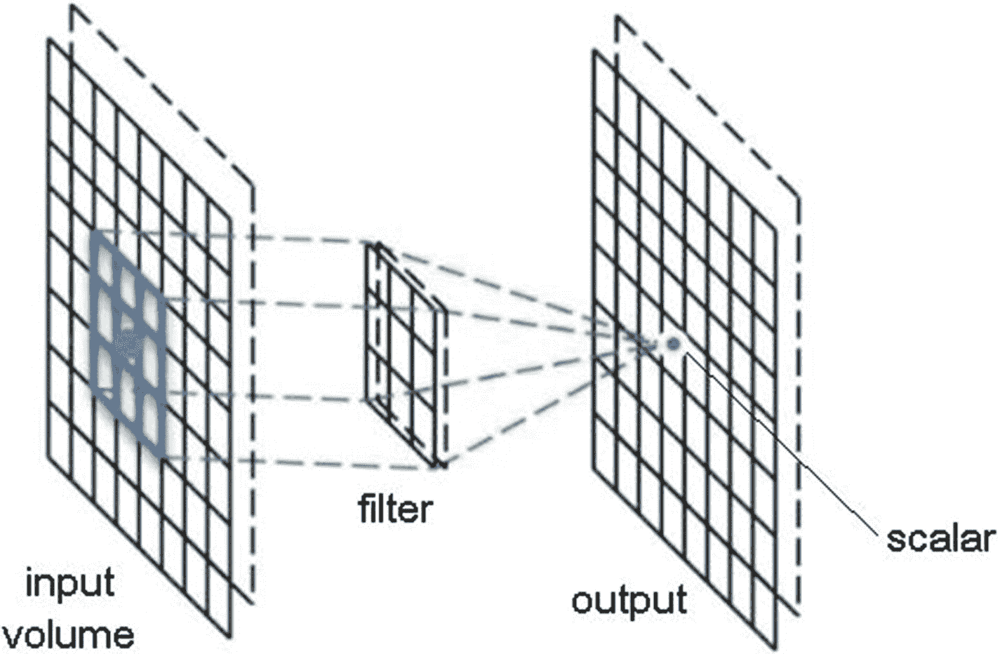

图 6-1

具有卷积滤波器的图像体

在卷积运算中，小的滤波器块在较大的图像体积上逐步“滑动”,而点积在滤波器和每一步覆盖的图像体积之间完成。计算每个步骤的点积会产生一个标量值。所有逐步卷积运算的总和会生成 1D 图像，如图右侧输出图层所示。应用实际尺寸应该有助于阐明操作。让我们假设输入图像体积是 32×32×3。这意味着它的高度和宽度为 32 像素，深度为 3。在这种情况下，3 指的是代表构成输入图像体积的 RGB 或红、绿、蓝值的三个颜色层。现在，如果过滤器是 5×5×3，那么它只能在水平和垂直方向上以 28 步“滑过”输入体积。这意味着输出的“图像”必须是 28 x 28 x 1，因为这是 5 x 5 x 3 滤镜可以唯一步进通过原始图像体积的唯一方式。

然而，典型 CNN 的卷积运算还没有完全结束。请将卷积运算中使用的过滤器视为特征提取器，这是 CNN 创建者 Yann LeCun 的初衷。我将在下一节简要讨论 LeCun 教授的贡献。因此，合理的做法是重新应用不同的滤波器并重复卷积运算，以提取不同的特征。这正是图 [6-2](#Fig2) 所传达的内容，其中五个附加特征被应用于原始图像体。这最终导致大小为 28×28×6 的最终处理块。处理后的输出块现在被称为特征或激活图。

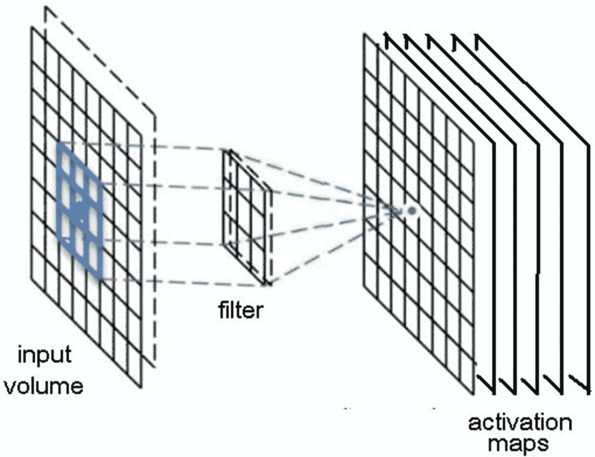

图 6-2

创建激活图

在典型的 CNN 中使用多个卷积层。图 [6-3](#Fig3) 显示叠加卷积层的结果。请注意，激活函数也在每个卷积层之后立即使用。


图 6-3

典型 CNN 架构

当通过所有卷积层将随机化滤波器应用于图像体时，CNN 学习“发生”。

下图将有助于您理解卷积图层和要素之间的关系。图 [6-4](#Fig4) 显示了应用于一系列三个卷积层和一个“类输出”层的输入图像体。

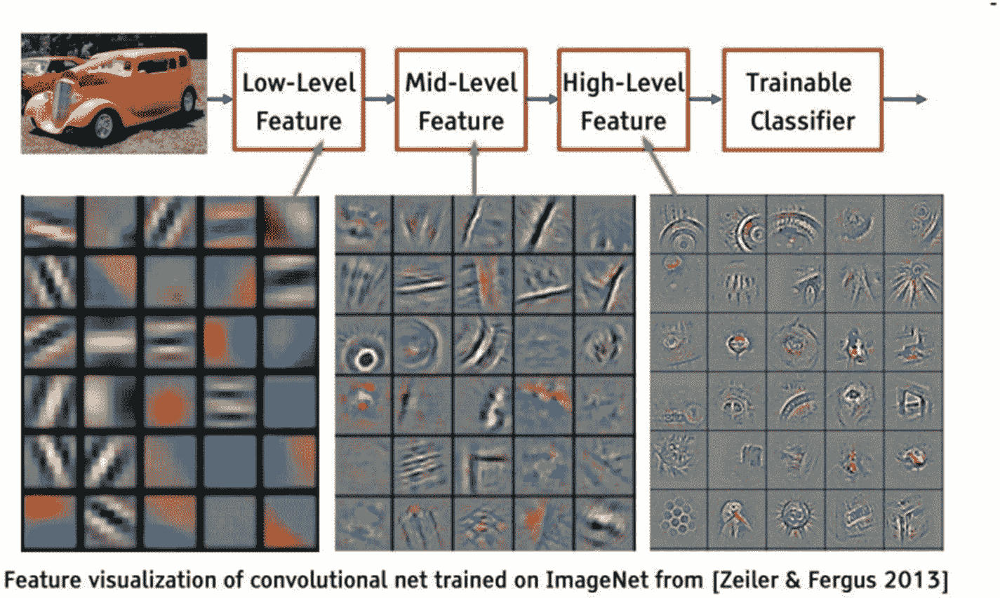

图 6-4

暴露卷积特征的 CNN 示例

仔细检查第一层中的滤波器输出，它们是 5 x 5 x 3 滤波器。通过反向传播，它们将自己调整成图像碎片和边缘的彩色斑点。当数据流经额外的卷积层时，滤波器对先前卷积运算的输出执行点积运算。传统的 CNN 架构使用线性滤波器进行卷积，并从图像中提取特征。早期图层尝试提取原始特征，如线条、边缘和拐角，而后期图层建立在早期图层的基础上，并提取更高级别的特征，如眼睛、耳朵、鼻子等。这些被称为潜在特征。

在每个图像特征中可以有变化，例如仅在眼睛中就有许多不同的变化。设计用于检测眼睛的线性过滤器可能会尝试绘制直线来提取这些特征。因此，传统的 CNN 隐含地假设潜在的概念是线性可分的。但是直线并不总是合适的。各种类型的眼睛特征和非眼睛特征的分离可能不是直线，而是更非线性的。在这种情况下，使用非线性函数可能是更好的特征提取器。

仔细观察图中与高级特征卷积层相关的图像，并试着将它们想象为 28 x 28 神经元网格输出的代表。在特定的特征图中，每个神经元仅连接到输入图像体积的一小部分。此外，给定特征图中的所有神经元具有相同的连接权重。这种权重共享被称为参数共享。

CNN 中的神经元也具有局部连接性，因为它们只连接到输入图像的子集，不像传统的 ANN 中所有的神经元都是完全连接的。局部连接减少了整个系统中的参数数量，并有助于提高计算效率。

## CNN 的历史和演变

CNN 自 1994 年由 Yann LeCun 博士创建第一个以来就一直存在，他被许多人认为是 DL 领域的先驱研究人员之一。他将其命名为网络 LeNet-5，这反映了他从 1988 年开始创建的网络的变化。

LeNet-5 架构是革命性的，因为它利用了一个基本的观点，即图像特征通常分布在整个图像中，而带有可学习参数的卷积运算是使用少量参数在多个位置提取相似特征的有效方法。请记住，当时现有的计算机没有图形处理单元(GPU)来帮助训练，桌面处理器的速度与现代处理器相比非常慢。因此，能够减少参数和相关计算的数量是一个显著的优势。CNN 方法与现有方法形成对比，在现有方法中，输入图像的每个像素被单独处理，作为大型多层神经网络的输入。LeCun 解释说，这些像素不应用于第一层，因为图像在空间上高度相关，使用图像的单个像素作为单独的输入特征不会利用这些相关性。

LeNet-5 模型的特征可总结如下:

*   卷积神经网络使用三层序列，卷积、汇集和非线性。这一特征至今仍然适用于 CNN。

*   使用卷积运算提取空间要素。

*   使用激活图空间平均值的子样本。

*   非线性激活函数以 tanh 或 sigmoids 的形式存在。

*   使用全连接多层感知器网络(MLP)作为具有 softmax 分类器的最终分类器。

*   使用层之间的稀疏连接矩阵来最大化计算效率。

图 [6-5](#Fig5) 显示了 LeNet-5 架构。


图 6-5

LeNet-5 体系结构

按照今天的标准，LeNet-5 是一个简单的网络。它只有七层，其中有三个卷积层(C1、C3 和 C5)，两个子采样(汇集)层(S2 和 S4)，一个全连接层(F6)，后面是输出层。卷积层使用步长为 1 的 5×5 卷积。子采样层由 2 x 2 个平均池层组成。tanh 激活功能在整个网络中使用。LeNet-5 为网络使用了两种在现代 DL 网络中不常用的架构选择。

第一种选择是 C3 层中的各个卷积核不使用 S2 层产生的所有特征。这一选择的一个关键原因是使网络在计算上更加高效。另一个原因是让卷积核学习不同的模式。如果不同的内核接收不同的输入，它们将学习不同的模式，这是非常合理的。

第二个选择是在输出层有 10 个欧几里德径向基函数神经元，它计算维数为 84 的输入向量和相同维数的**手动预定义权重向量**之间的 L2 距离。数字 84 来自于权重代表一个 7×12 的二进制掩码，一个掩码代表一个手写数字。这种设计迫使网络将输入图像转换成内部表示，使得 F6 层的输出尽可能接近输出层的 10 个神经元的手动编码权重。

LeNet-5 能够在 MNIST 手写数字数据集上实现低于 1%的错误率，这非常接近当时的技术水平，而这又是通过三个 LeNet-4 网络的增强集成获得的。

从 1998 年到 2010 年，神经网络在慢慢改进。该领域的大多数人都没有注意到他们不断增强的力量，而其他研究人员则在慢慢进步。由于智能手机和相对便宜的数码相机的兴起，更多的数据变得可用。计算能力在上升；CPU 变得越来越快，GPU 变得越来越便宜和容易获得。这两种趋势使得神经网络的研究进展缓慢。计算能力和可用数据的增加使得神经网络能够处理的任务更加有趣。

2010 年，Ciresan 等人发表了第一个 GPU 神经网络的实现，旨在处理手写数字识别问题。这种实现使用了前向和后向传播，并在早期的 NVIDIA GTX 280 GPU 上运行，在神经网络中使用了多达九层。

2012 年，Alex Krizhevsky 创建了 AlexNet，这是 LeNet CNN 的放大版。AlexNet 用于学习比 LeNet 更复杂的对象。AlexNet 论文包括以下内容:

*   使用整流线性单位(ReLU)作为非线性。

*   在训练过程中使用脱落技术选择性地忽略单个神经元。这种技术避免了模型的过度拟合。

*   重叠最大池，避免平均池的平均效应。

*   使用 GPU(NVIDIA gtx 580)减少培训时间。

在 AlexNet 发表论文时，GPU 提供的内核数量比 CPU 多得多，并且允许更快的训练时间。所有这些导致使用更大的数据集和图像。AlexNet 网络的成功向 vision 社区清楚地展示了 CNN 是 DL 的“明星”。有用的和实际的问题现在可以用改进了很多的计算硬件来解决。

2013 年，在 NYU DL 实验室工作的 Yann LeCun 介绍了 OverFeat 框架，这是一种使用 CNN 实现对象识别、定位和检测的方法。Overfeat 是 AlexNet 的衍生产品。LeCun 还提出在对象识别中使用学习边界框，这是现在公认的识别图像中对象的方法。

2014 年，牛津大学的一个团队引入了 VGG 网络。这种 CNN 实现在每个卷积层中使用小型 3 × 3 滤波器，并将它们组合成一个卷积序列。起初，这似乎与 LeCun 支持 LeNet 的原则相反，在 LeNet 中，大卷积滤波器用于捕捉图像中的相似特征。因此，LeNet 和 AlexNet 的较大滤波器尺寸开始缩小，可能过于接近 LeNet 想要避免的臭名昭著的 1 × 1 卷积。然而，VGG 网络提供的重要见解是，多个 3 × 3 卷积序列可以模拟更大感受野的效果，例如 5 × 5 甚至 7 × 7 卷积滤波器。这些概念已经在最近的网络架构中使用，如 Inception 和 ResNet。VGG 网络使用多个 3 × 3 卷积层来表示复杂的特征。请注意 VGG-E 的模块 3、4 和 5，其中 256 × 256 和 512 × 512，3 × 3 滤波器被多次按顺序使用，以提取更复杂的特征以及这些特征的组合。VGG 网络的一个缺点是训练在计算上是昂贵的。这可以通过将较大的网络分成较小的网络并一层一层地添加层来缓解。

[网络中的网络](https://arxiv.org/abs/1312.4400) (NiN)具有使用 1 × 1 卷积为卷积层的特征提供更多组合能力的简单洞察力。如图 [6-6](#Fig6) 所示，NiN 架构在每次卷积后使用空间 MLP 层，以便在另一层之前更好地组合特征。


图 6-6

NiN 建筑

同样，人们可以认为 1 × 1 卷积违反了 LeNet 的原始原则，但它们有助于以更优化的方式组合卷积特性，而这是通过简单地堆叠额外的卷积层不可能实现的。这不同于使用原始像素作为下一层的输入。这里，1 × 1 卷积用于在卷积后跨要素地图在空间上组合要素，因此它们有效地使用非常少的参数，并且跨所有要素共享像素。

通过将单个卷积特征组合成更复杂的组，MLP 的能力可以大大提高它们的有效性。这个想法将在最近的架构中使用，如 ResNet 和 Inception 以及它们的衍生产品。

NiN 还使用了一个平均池层作为最后一个分类器的一部分，这是另一种已经变得很常见的做法。这样做是为了在分类之前平均网络对多个输入图像的响应。

2014 年秋天，来自谷歌的克里斯蒂安·塞格迪(Christian Szegedy)开始了一个旨在减轻深度神经网络计算负担的项目。他和他的团队创建了 GoogLeNet，这是第一个使用 Inception 架构的模型。在此期间，DL 模型在对图像和视频帧的内容进行分类时变得非常有用。Google 对将 DL 架构高效、大规模地部署到他们的服务器场非常感兴趣。Christian 考虑了很多方法来减少深度神经网络的计算负担，同时仍然获得最先进的性能。主要目标是保持或降低计算成本，同时实现更高的性能。他和他的团队提出了 Inception 模块，如图 [6-7](#Fig7) 框图所示。

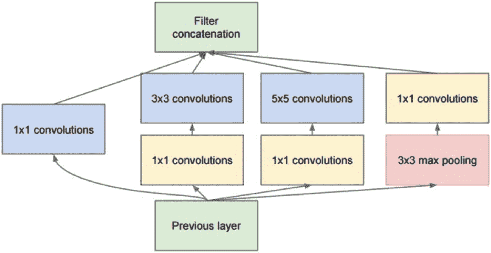

图 6-7

谷歌网络框图

乍一看，该图基本上是 1 × 1、3 × 3 和 5 × 5 卷积滤波器的并行组合。但 Inception 模块的伟大之处在于使用 1 × 1 卷积模块(NiN)来减少昂贵的并行模块之前的功能数量。这通常被称为“瓶颈”，下面的数据将对此进行解释。

通过减少要处理的特性的数量来减少初始模型中的瓶颈。通过减少特征的数量，推断时间将被最小化；然而，问题是不能损失太多的数据质量。

例如，假设有 256 个要素应用于卷积图层，256 个要素被传递出去。如果初始层仅执行 3×3 卷积，仍需要大约 589，000 次乘法和累加操作。这是计算的结果:

*   256′256′3′3 = 589.824

不是这样做，而是决定减少必须进行卷积的特征的数量，比如减少到 64 个。在这种情况下，首先对所有初始分支执行 256 -> 64 个 1 × 1 卷积，然后执行 64 个卷积，然后再次使用来自 64 -> 256 个特征的 1 × 1 卷积。操作现在是

*   256×64 × 1×1 = 16,384

*   64×64 × 3×3 = 36,864

*   64×256 × 1×1 = 16,384

总数= 69 632

与使用完整功能集所需的近 600，000 次操作相比，这总共需要大约 70，000 次操作。虽然所涉及的操作明显减少，但处理精度并没有损失，因为输入特征是相关的，因此可以通过将它们与 1 × 1 卷积适当组合来消除冗余。成功的原因是，在与较少数量的要素进行卷积后，它们可以再次扩展为对下一层有意义的组合。

2015 年 2 月，谷歌团队引入了批量规范化的 V2。通过批量归一化，计算所有要素地图的平均值和标准差，然后使用这些值对图层的输出进行归一化。此操作“白化”数据，并使所有神经图在相同范围内具有零均值的响应。此操作促进了训练，因为下一个图层不必学习输入数据中的偏移，并且可以专注于如何最佳地组合要素。

2015 年 12 月，该团队发布了初始模块的版本 3。以下列表详细介绍了该版本中包含的思想和概念:

*   通过精心构建深度和宽度平衡的网络，最大限度地增加流入网络的信息。每次汇集前，增加特征地图。

*   当深度增加时，特征的数量或层的宽度也系统地增加。

*   在每个图层上使用宽度增加来增加下一个图层之前的要素组合。

*   考虑到 5 × 5 和 7 × 7 滤波器可以用多个 3 × 3 进行分解，尽可能只使用 3 × 3 卷积。

*   过滤器也可以通过[扁平卷积](http://arxiv.org/abs/1412.5474)分解成更复杂的模块。

*   在执行初始计算时，初始模块还可以通过提供池来减少数据的大小。这基本上等同于使用简单的池层并行执行跨距卷积。

大约在 Inception V3 推出的同时，K. He 等人推出了一款颇具革命性的 CNN，他们将其命名为 ResNet。他们的简单想法是连接两个连续卷积层的输出，并将输入旁路到下一层。图 [6-8](#Fig8) 显示了说明 ResNet 理念的流程图。

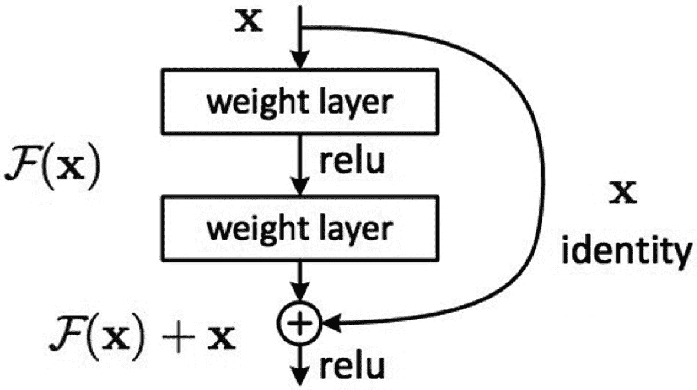

图 6-8

ResNet 核心概念流程图

人们自然会想到的一个问题是，为什么绕过卷积层会提高性能？答案在于深度网络的本质，深度网络只是包含许多层的网络。自从引入具有五个卷积层的 AlexNet 以来，CNN 通常变得更深。例如，《盗梦 V1》一开始有 19 层，最终有 22 层。然而，网络性能并不总是通过堆叠越来越多的层来提高。这是由于消失梯度问题。当梯度反向传播到更早的层时，重复的乘法开始使梯度无限变小。因此，随着网络变得越来越深，其性能变得饱和，甚至开始迅速下降。

ResNet 的核心概念是引入跳过一层或多层的所谓身份快捷连接，如图 [6-8](#Fig8) 所示。ResNet 作者认为堆叠层不应该降低网络性能，因为简单地在当前网络上堆叠身份映射(一个不做任何事情的层)和最终的架构会执行相同的操作。这表明较深的模型不应该比较浅的模型产生更高的训练误差。

这类似于更老的想法，比如这个想法。但在这里它们绕过了两层，被大规模应用。绕过两层是关键的直觉，因为绕过一层并没有提供太多的改进。但是两层旁路可以被认为是一个小的分类器或网络中的网络。

ResNet 也是第一次训练几百到一千层的网络。ResNet 也开始使用由 Inception V2 网络创建的瓶颈减少方案。图 [6-9](#Fig9) 显示了嵌入瓶颈方案以及身份旁路的流程图。

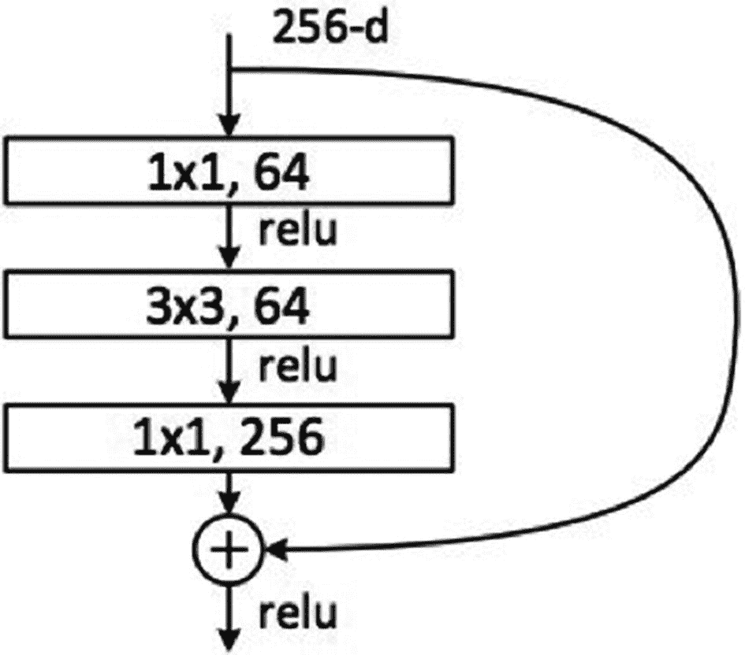

图 6-9

消除瓶颈的 ResNet 核心概念流程图

通过首先使用具有较小输出(通常为输入的四分之一)的 1 × 1 卷积，然后使用 3 × 3 卷积，然后再次使用 1 × 1 卷积来减少各层的要素数量，从而增加要素数量。就像在 Inception 模块的情况下一样，这个方案允许计算量保持较低，同时仍然提供丰富的特性组合。

ResNet 在输入端使用了一个相当简单的初始层(stem)，一个 7 × 7 的 conv 层，然后是一个 2。ResNet 还使用一个池层加上 softmax 作为最终分类器。

以下是关于 ResNet 架构的一些额外见解:

*   ResNet 可以被视为并行和串行模块，只要将输入视为并行到许多模块，而每个模块的输出串联连接。

*   ResNet 也可以被认为是[多个并行或串行模块](http://arxiv.org/abs/1605.06431)的集合体。

*   人们发现，ResNet 通常在深度相对较低(约 20–30 层)的区块上运行，这些区块并行运行，而不是在网络的整个长度上串行流动。

*   ResNet，当输出被反馈到输入时，就像在 RNN，网络可以被看作是大脑皮层的一个更好的生物模型。

2016 年 2 月，Christian 和他在谷歌的团队向社区推出了 Inception V4。stem 之后的这个 Inception 模块类似于 Inception V3。图 [6-10](#Fig10) 显示了初始的 V4 架构。

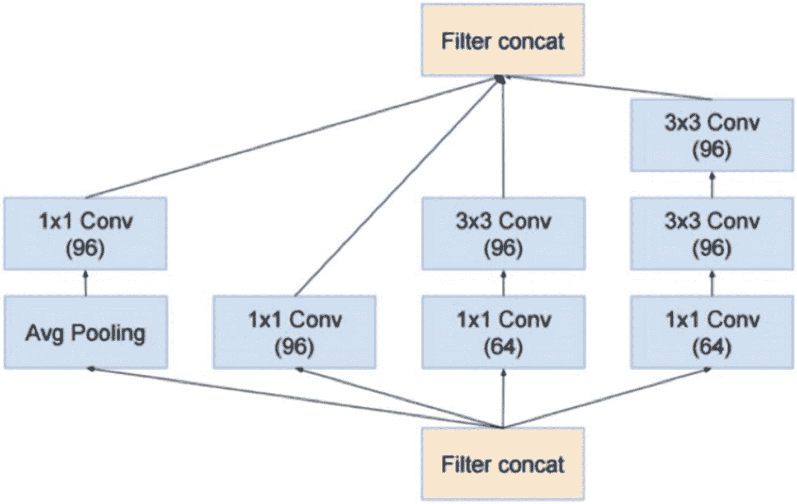

图 6-10

初始初始版本 4 架构

然而，他们也将 Inception V4 模块与 ResNet 模块结合在一起。如图 [6-11](#Fig11) 所示。

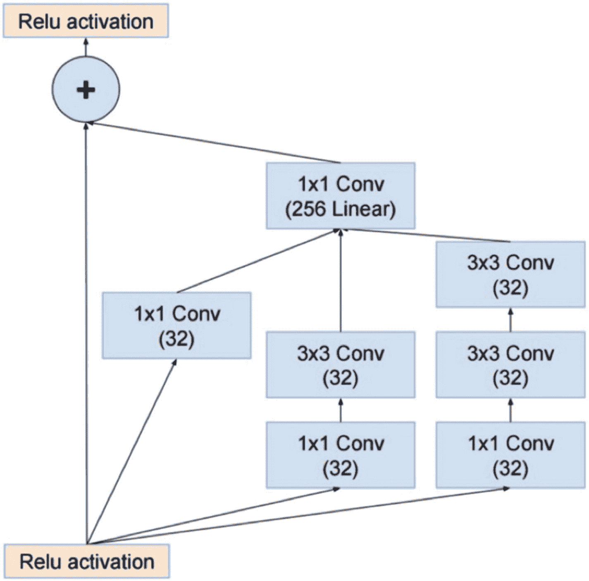

图 6-11

带 ResNet 的 Inception V4 架构

该团队将这个模块重新命名为 Inception-ResNet V1，以表明它是对最初的 Inception 设计协议的实质性转变。据确定，这个新模块的计算成本与 Inception V3 大致相同，但训练速度要快得多。不幸的是，它达到了比 Inception V3 模块稍差的最终精度。

2016 年，加州大学伯克利分校和斯坦福大学的研究人员发布了 SqueezeNet。作者设计 SqueezeNet 的目标是创建一个更小的神经网络，具有更少的参数，更容易适应有限的计算机内存，并可以很容易地通过计算机网络传输。

这个原始版本的 SqueezeNet 是在 Caffe DL 软件框架之上实现的。此后不久，开源研究社区将 SqueezeNet 移植到许多其他深度学习框架，包括 Chainer、Apache MXNet 和 Keras。2017 年，几家商业公司展示了在智能手机和 FPGAs 等低功耗处理平台上运行的 SqueezeNet。

截至 2018 年，SqueezeNet“原生”作为 PyTorch、Apache MXNet 和 Apple_CoreML 等多个深度学习框架的源代码的一部分。此外，第三方开发人员已经创建了与 TensorFlow 框架兼容的 SqueezeNet 实现。

[Xception](http://www.Xception) 用一个简单优雅的架构改进了 Inception 模块，与 ResNet 和 Inception V4 一样有效。图 [6-12](#Fig12) 显示了异常模块架构。

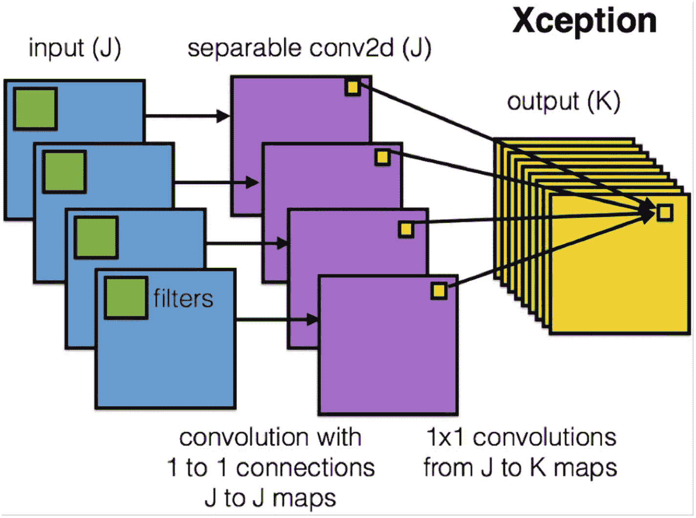

图 6-12

异常架构

Xception 架构有 36 个卷积级，与 ResNet-34 非常相似。图 [6-13](#Fig13) 显示了异常数据流程图。

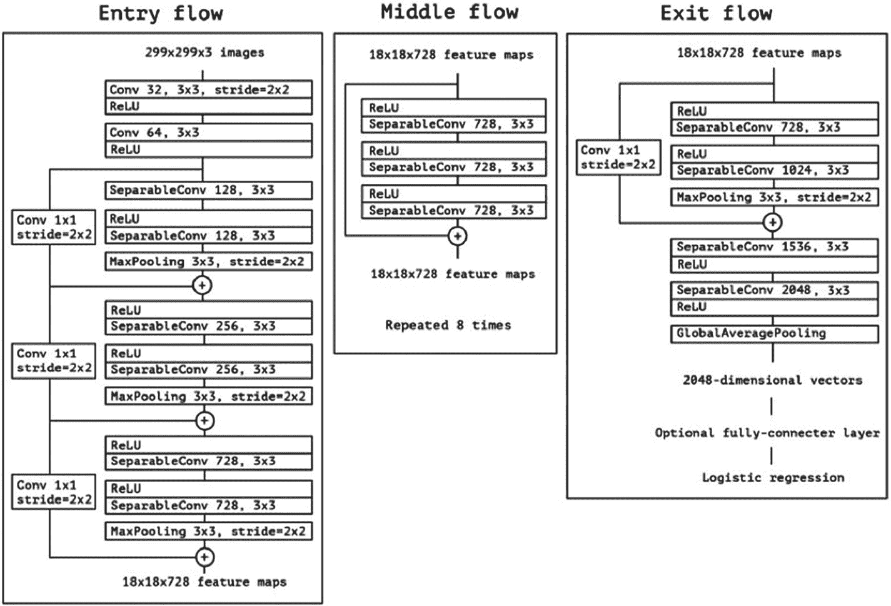

图 6-13

异常数据流程图

异常代码和 ResNet 一样简单，比 Inception V4 更容易理解。

Xception 已经在 Torch7 和 Keras 中用 TensorFlow 实现。

我将在这次进化讨论中提到的最后一个 CNN 模型是 [FractalNet](http://www.FractalNet) ，它使用了递归架构。作者 Larsson 等人在其介绍性论文中指出:

> *介绍了一种基于自相似性的神经网络宏结构设计策略。重复应用简单的扩展规则会产生深层网络，其结构布局是精确截断的分形。这些网络包含不同长度的相互作用的子路径，但不包括任何直通或残留连接；每一个内部信号在被随后的层看到之前都被滤波器和非线性转换。*

摘录自他们的摘要似乎表明了一个相当激进的背离 ResNet 设计哲学。我相信，关于这种深层 CNN 设计的性能，裁决仍有待做出。

## 时尚 MNIST 示范

### 注意

您将在 RasPi 上使用与第 [5](5.html) 章中最后一次演示运行时完全相同的配置。运行这个演示的脚本需要带有 TensorFlow 后端的 Keras。

像第 5 章[末尾的演示一样，这个演示将使用 MNIST 数据集，但它不是手写数字集。相反，它是一个由服装图像组成的数据集。就像手写数字数据集一样，将有十个类，但在这个新的数据集中，每个类将是不同的服装文章。数据集图像的大小都是 28 x 28，以使它们与手写数字数据集兼容。此外，还有大约 60，000 个训练图像和 10，000 个测试图像。这个新数据集被命名为 fashion_mnist，使用 Keras 导入数据集库可以立即获得它。](5.html)

以下代码片段显示了如何加载这个新数据集:

```py
from keras.datasets import fashion_mnist
(train_images, train_labels),(test_images, test_labels) = fashion_mnist.load_data()

```

您可能会注意到，在本演示中，我对训练和测试数据集使用了与手写数字演示中不同的名称。我提到这一点是因为如果你只是试图在两个脚本之间剪切和粘贴，你会陷入麻烦。

如前所述，所有图像都是 28 x 28 的阵列，像素整数亮度值范围在 0 到 255 之间。图像标签也是一个整数数组，范围从 0 到 9。这些整数对应于图像所代表的服装类别。表 [6-1](#Tab1) 显示了服装描述的整数。

表 6-1

整数与服装描述的关系

<colgroup><col class="tcol1 align-left"> <col class="tcol2 align-left"></colgroup> 
| 

标签

 | 

班级

 |
| --- | --- |
| Zero | t 恤/上衣 |
| one | 裤子 |
| Two | 套衫 |
| three | 连衣裙 |
| four | 外套 |
| five | 凉鞋 |
| six | 衬衫 |
| seven | 运动鞋 |
| eight | 袋 |
| nine | 踝靴 |

配置 CNN 时，需要使用整数来表示字符串描述。字符串变量和网络计算本质上是不兼容的。

给定类中的每个图像被映射到单个标签。由于数据集不包含类名，因此必须存储这些标注，以便以后在绘制图像时使用。以下语句存储标签:

```py
class_names = ['T-shirt/top', 'Trouser', 'Pullover', 'Dress', 'Coat', 'Sandal', 'Shirt', 'Sneaker', 'Bag', 'Ankle boot']

```

对要使用的数据进行检查和/或取样总是谨慎的，以便对其有所了解，并意识到任何潜在的问题。为了实现这一目标，我建议运行以下名为 reviewData.py 的简短脚本。该脚本可从本书的配套网站获得:

```py
from keras.datasets import fashion_mnist

(train_images, train_labels),(test_images, test_labels) = fashion_mnist.load_data()

print('Number of training records and size of each training record: ', train_images.shape)
print()
print('Number of training labels: ', len(train_labels))
print()
print('Training label: ', train_labels)
print()
print('Number of test records and size of each test record:', test_images.shape)
print()
print('Number of test labels: ', len(test_labels))
print()

```

通过输入以下命令运行脚本:

```py
python reviewData.py

```

图 [6-14](#Fig14) 显示了运行脚本后的结果。

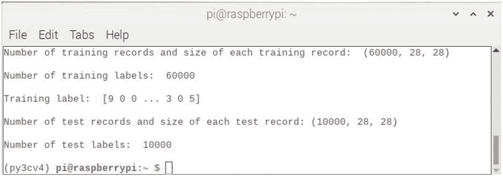

图 6-14

查看数据脚本结果

在检查该图时，您应该看到数据集与前面的手写数字识别演示中使用的数据集在形状上是相同的。此外，还会显示 60，000 个训练标签值的前三个和后三个。这确认了正确加载了 training_labels 数据集。

此外，像手写数字识别项目一样，对输入数据集的样本进行成像总是很有用且能提供大量信息。对于这个任务，我启动了一个 Python 交互式会话来对一个样本进行成像。以下代码在进入交互式 Python 会话时，将对第一个训练数据集图像进行成像。您应该在运行 reviewData 脚本后立即启动此会话，以确保 fashion_mnist 数据集已下载并可供访问。

```py
import matplotlib.pyplot as plt
plt.figure()
plt.imshow(train_images[0])
plt.colorbar()
plt.grid(False)
plt.show()

```

图 [6-15](#Fig15) 显示了在第一个训练记录中成像的物体，其中插入了颜色条，以反映图像中存在的相关像素强度。

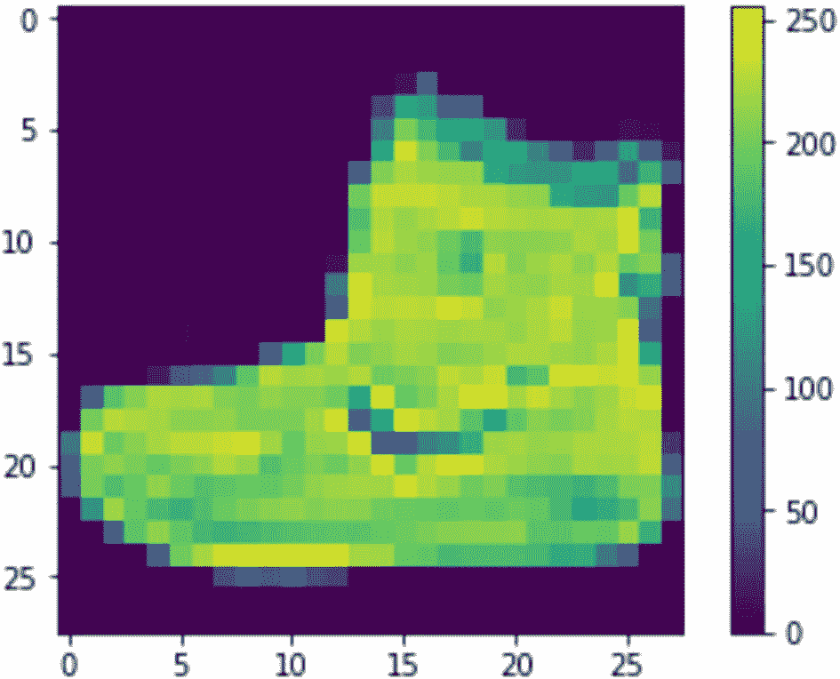

图 6-15

第一个训练记录图像

请注意，此图像是一只长及脚踝的靴子，它对应于 reviewData 脚本结果中显示的整数“9”类引用，用于类标签打印输出。这种检查是确认输入数据集一致性的另一种方式。

```py
# Model definition
def cnn_model():
    # create model
    model = Sequential()
    model.add(Conv2D(32, (5, 5), input_shape=(1, 28, 28), activation="relu"))
    model.add(MaxPooling2D(pool_size=(2, 2)))
    model.add(Dropout(0.2))
    model.add(Flatten())
    model.add(Dense(128, activation="relu"))
    model.add(Dense(numClass, activation="softmax"))
    # Compile model
    model.compile(loss='categorical_crossentropy', optimizer="adam", metrics=['accuracy'])
    return model

```

这是定义 CNN 然后编译它的代码部分。该模型与第 [5](5.html) 章最后一次演示中使用的 MLP 模型有很大不同。首先，它有六层，顺序如下:

1.  卷积层

2.  汇集层

3.  脱落层

4.  展平图层

5.  全连接层

6.  输出层

每一层为 CNN 提供了一个顺序操作，导致从输入图像到分类输出的转换。

在第 [5](5.html) 章的 Keras 演示中，我在关于编译函数的讨论中简要提到了 Adam 优化器。我将详述优化器的使用，因为理解它的功能和它所使用的假设是很重要的。CNN 的优化器是控制网络如何学习的功能。在非 Keras 网络中，如第 5 章[中的 MLP，学习率(lr)控制梯度步长。小的 lr 意味着在试图定位成本函数的全局最小值时采取小的步骤。这意味着一个非常小的步长可能需要梯度下降算法花费几个小时才能最终达到全局最小值。优化器采用不同的方法，并使用动态技术来设置步长，以便最小化找到全局最小值的总时间。](5.html)

Adam 优化器根据梯度的一阶和二阶矩的估计来计算不同参数的个体自适应学习率。Adam 的作者将其描述为结合了随机梯度下降的两个其他扩展的优点。具体来说:

*   自适应梯度算法(AdaGrad ),保持每个参数的学习率，提高稀疏梯度问题的性能。

*   均方根传播(RMSProp ),其还保持基于权重的梯度的最近幅度的平均值(例如，其变化有多快)而调整的每个参数的学习速率。这意味着该算法在在线和非平稳问题(例如，噪声)上表现良好。

Adam 算法实现了 AdaGrad 和 RMSProp 算法的优点。Adam 不像 RMSProp 那样基于平均一阶矩(平均值)来调整参数学习率，而是利用梯度的二阶矩的平均值(无中心方差)。具体来说，该算法计算梯度和平方梯度的指数移动平均值。参数β1 和β2 控制这些移动平均值的衰减率。

Adam 是深度学习领域中的一种流行算法，因为它可以快速地获得良好的结果。实证结果表明，Adam 在实践中运行良好，并优于其他随机优化方法。在原始论文中，Adam 证明了其收敛性符合论文理论分析的预期。Adam 已经在 [MNIST 手写数字识别](https://machinelearningmastery.com/how-to-develop-a-convolutional-neural-network-from-scratch-for-mnist-handwritten-digit-classification/)和 IMDB 情感分析数据集上应用于逻辑回归算法。作者认为 Adam 可以有效地解决实际的 DL 问题。

```py
# Run the demo and evaluate it
from keras.layers import Conv2D
model = cnn_model()
model.fit(train_images, train_labels, validation_data=(test_images, test_labels), epochs=10, batch_size=200, verbose=2)

# Final evaluation
scores = model.evaluate(test_images, test_labels, verbose=0)
print(scores[1])

```

最后的代码部分是驱动程序代码，它用 fashion_mnist 数据集测试新的 CNN。名为`model`的模型对象首先被实例化，然后使用 Keras `fit`函数进行训练。然后通过调用 Keras `evaluate`方法生成一个`scores`元组。测试持续 10 个时期，最后的陈述显示了最终的 CNN 错误率。

完整的脚本被命名为 kerasFashionTest.py，并在下面列出了注释。它可以从该书的配套网站上获得。

```py
import numpy as np
from keras.datasets import fashion_mnist
from keras.models import Sequential
from keras.layers import Dense
from keras.layers import Dropout
from keras.layers import Flatten
from keras.layers.convolutional import Conv2D
from keras.layers.convolutional import MaxPooling2D
from keras.utils import np_utils
from keras import backend as K
K.set_image_dim_ordering('th')

# Set a random seed
seed = 42
np.random.seed(seed)

# Load the datasets
(train_images, train_labels),(test_images, test_labels) = fashion_mnist.load_data()

# Flatten all of the 28 x 28 images into 784 element numpy input
# data vectors.
pixelNum = train_images.shape[1] * train_images.shape[2]
train_images = train_images.reshape(train_images.shape[0],1,28,28).astype('float32')
test_images = test_images.reshape(test_images.shape[0],1,28,28).astype('float32')

# Normalize inputs from 0-255 to 0-1
train_images = train_images / 255.0
test_images = test_images / 255.0

# One hot encoding
train_labels = np_utils.to_categorical(train_labels)
test_labels = np_utils.to_categorical(test_labels)
numClass = test_labels.shape[1]

# Model definition
def cnn_model():
    # create model
    model = Sequential()
    model.add(Conv2D(32, (5, 5), input_shape=(1, 28, 28), activation="relu"))
    model.add(MaxPooling2D(pool_size=(2, 2)))
    model.add(Dropout(0.2))
    model.add(Flatten())
    model.add(Dense(128, activation="relu"))
    model.add(Dense(numClass, activation="softmax"))
    # Compile model
    model.compile(loss='categorical_crossentropy', optimizer="adam", metrics=['accuracy'])
    return model

# Run the demo and evaluate it
model = cnn_model()
model.fit(train_images, train_labels, validation_data=(test_images, test_labels), epochs=10, batch_size=200, verbose=2)

# Final evaluation

scores = model.evaluate(test_images, test_labels, verbose=0)
print(scores[1])

```

应该使用以下命令在虚拟环境中运行该脚本:

```py
python kerasFashionTest.py

```

该脚本需要大约 30 分钟才能运行完成，因为它使用完整的 60，000 个 fashion_mnist 训练数据集训练模型，然后使用 10，000 个 fashion_mnist 测试数据集测试模型十次或 10 个时期。最终结果如图 [6-16](#Fig16) 所示。

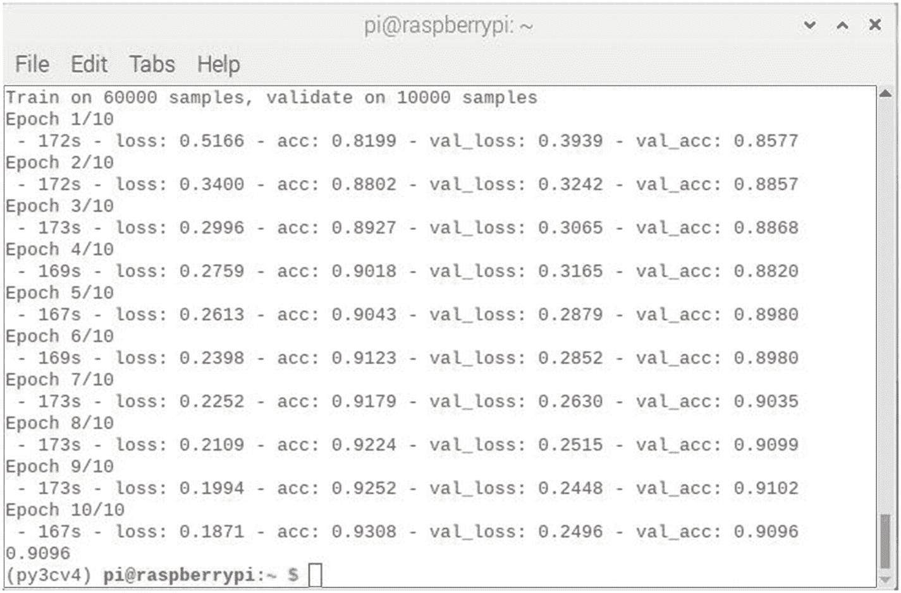

图 6-16

运行 kerasFashionTest 脚本后的最终结果

最终的准确率为 90.96%，对于 CNN 来说，这是一个很好的分数——不太优秀，需要大约 98%到 99%的分数，但仍然非常准确。为了获得 CNN 的最高精度，必须使 CNN 的设计与正在处理的数据集相匹配。如何做到这一点与其说是一门科学，不如说是一门艺术。存在许多 CNN 设计策略，希望你已经从本章前面的 CNN 进化讨论中收集到了。对于任何给定的数据集，使用哪一个必须取决于从业者的判断和经验。我不能在这方面提供任何指导，因为我在使用当前可用的许多 CNN 设计以及大量当前数据集方面还没有获得足够的经验。组合的数量是巨大的。我唯一的建议是在数据集上尝试新的策略，看看会有什么发展。

带着尝试新设计的想法，我现在将使用更复杂的 CNN 模型展示之前演示的变体，看看会发生什么。

## 更复杂的时尚 MNIST 演示

在这次演示中，我将向您展示一个与上一次相比更加复杂的 CNN 模型。脚本中的其他内容保持不变。本演示的目的是确定新的 CNN 模型将对数据集分类的整体准确性产生什么影响。

以下代码定义了本演示中使用的模型:

```py
def complex_model():
    # Create model
    model = Sequential()
    model.add(Conv2D(30, (5, 5), input_shape=(1, 28, 28), activation="relu"))
    model.add(MaxPooling2D(pool_size=(2, 2)))
    model.add(Conv2D(15, (3, 3), activation="relu"))
    model.add(MaxPooling2D(pool_size=(2, 2)))
    model.add(Dropout(0.2))
    model.add(Flatten())
    model.add(Dense(128, activation="relu"))
    model.add(Dense(50, activation="relu"))
    model.add(Dense(numClass, activation="softmax"))

```

与之前演示中使用的六层相比，此模型使用了九层。kerasFashionTest 脚本用于将这些图层添加到其模型定义中:

*   一个卷积层

*   一个池层

*   一个完整的连接层

新修改的脚本被重命名为 kerasComplexFashionTest.py，可从该书的配套网站上获得。

```py
import numpy as np
from keras.datasets import fashion_mnist
from keras.models import Sequential
from keras.layers import Dense
from keras.layers import Dropout
from keras.layers import Flatten
from keras.layers.convolutional import Conv2D
from keras.layers.convolutional import MaxPooling2D
from keras.utils import np_utils
from keras import backend as K
K.set_image_dim_ordering('th')

# Set a random seed
seed = 42
np.random.seed(seed)

# Load the datasets
(train_images, train_labels),(test_images, test_labels) = fashion_mnist.load_data()

# Flatten all of the 28 x 28 images into 784 element numpy input
# data vectors.
pixelNum = train_images.shape[1] ∗ train_images.shape[2]
train_images = train_images.reshape(train_images.shape[0],1,28,28).astype('float32')
test_images = test_images.reshape(test_images.shape[0],1,28,28).astype('float32')

# Normalize inputs from 0-255 to 0-1
train_images = train_images / 255.0
test_images = test_images / 255.0

# One hot encoding
train_labels = np_utils.to_categorical(train_labels)
test_labels = np_utils.to_categorical(test_labels)
numClass = test_labels.shape[1]

# Complex model definition
def complex_model():
    # Create model
    model = Sequential()
    model.add(Conv2D(30, (5, 5), input_shape=(1, 28, 28), activation="relu"))
    model.add(MaxPooling2D(pool_size=(2, 2)))
    model.add(Conv2D(15, (3, 3), activation="relu"))
    model.add(MaxPooling2D(pool_size=(2, 2)))
    model.add(Dropout(0.2))
    model.add(Flatten())
    model.add(Dense(128, activation="relu"))
    model.add(Dense(50, activation="relu"))
    model.add(Dense(numClass, activation="softmax"))
    # Compile model
    model.compile(loss='categorical_crossentropy', optimizer="adam", metrics=['accuracy'])
    return model

# Run the demo and evaluate it
model = complex_model()
model.fit(train_images, train_labels, validation_data=(test_images, test_labels), epochs=10, batch_size=200, verbose=2)

# Final evaluation

scores = model.evaluate(test_images, test_labels, verbose=0)
print(scores[1])

```

应该使用以下命令在虚拟环境中运行该脚本:

```py
python kerasComplexFashionTest.py

```

这个脚本运行完成大约需要 27 分钟，比前面的演示时间略短。最终结果如图 [6-17](#Fig17) 所示。

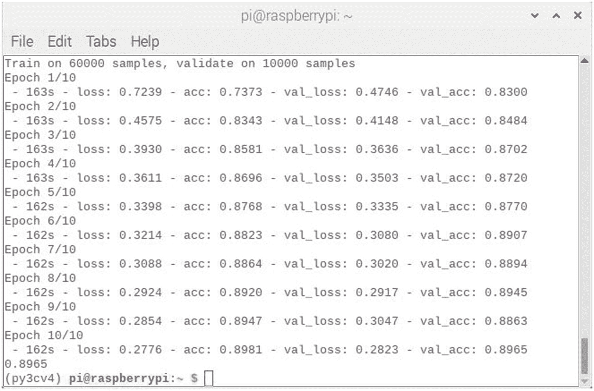

图 6-17

运行 kerasComplexFashionTest 脚本后的最终结果

最终的准确率为 89.65%，略低于之前演示的 90.96%。考虑到演示中使用了更复杂的 CNN 模型，这个结果乍一看可能有点奇怪。然而，这样的结果在 CNN 项目中很常见。很可能无法预测特定 CNN 模型在任何给定数据集上的表现。从这个结果中得出的唯一合理的结论是，必须首先在数据集上使用模型来确定其性能。在这种情况下，越简单的 CNN 模型表现越好。情况并不总是这样，但除非模型经过测试，否则你永远不会知道。

## VGG 时尚 MNIST 展示

为了向您展示测试 fashion_mnist 数据集的另一种方法，将在本次演示中使用 VGG CNN 模型。我首先要感谢 Adrian Rosebrock 在 2019 年 2 月发表的题为“时尚 MNIST 与 Keras 和深度学习”的博客，我从中汲取了很多灵感，并在这次演示中使用了这个模型。我承认稍微修改了模型代码，以适应我的预处理语句以及模型编译的方式。

在本演示中，模型定义被放入一个类中，并单独存储在一个名为 VGG.py 的文件中。

```py
# Import the required libraries
from keras.models import Sequential
from keras.layers.normalization import BatchNormalization
from keras.layers.convolutional import Conv2D
from keras.layers.convolutional import MaxPooling2D
from keras.layers.core import Activation
from keras.layers.core import Flatten
from keras.layers.core import Dropout
from keras.layers.core import Dense
from keras import backend as K

class VGG:
    @staticmethod
    def build(width, height, depth, classes):
        # Initialize the model along with the input shape to
        # be "channels last" and the channels dimension itself
        model = Sequential()
        inputShape = (height, width, depth)
        chanDim = -1

        # If we are using "channels first", update the input
        # shape and channels dimension
        if K.image_data_format() == "channels_first":
            inputShape = (depth, height, width)
            chanDim = 1

        # First CONV => RELU => CONV => RELU => POOL layer
        model.add(Conv2D(32, (3, 3), padding="same",
            input_shape=inputShape))
        model.add(Activation("relu"))
        model.add(BatchNormalization(axis=chanDim))
        model.add(Conv2D(32, (3, 3), padding="same"))
        model.add(Activation("relu"))
        model.add(BatchNormalization(axis=chanDim))
        model.add(MaxPooling2D(pool_size=(2, 2)))
        model.add(Dropout(0.25))

        # Second CONV => RELU => CONV => RELU => POOL layer
        model.add(Conv2D(64, (3, 3), padding="same"))
        model.add(Activation("relu"))
        model.add(BatchNormalization(axis=chanDim))
        model.add(Conv2D(64, (3, 3), padding="same"))
        model.add(Activation("relu"))
        model.add(BatchNormalization(axis=chanDim))
        model.add(MaxPooling2D(pool_size=(2, 2)))
        model.add(Dropout(0.25))

        # First (and only) set of FC => RELU layers
        model.add(Flatten())
        model.add(Dense(512))
        model.add(Activation("relu"))
        model.add(BatchNormalization())
        model.add(Dropout(0.5))

        # Softmax classifier
        model.add(Dense(classes))
        model.add(Activation("softmax"))

            # Compile model
        model.compile(loss='categorical_crossentropy', optimizer="adam", metrics=['accuracy'])

        # Return the constructed network architecture
        return model

```

下面列出了主脚本，命名为 kerasVGGTest.py，也可以从本书的配套网站上获得。

```py
import numpy as np
from VGG import VGG
from keras.datasets import fashion_mnist
from keras.utils import np_utils
from keras import backend as K
K.set_image_dim_ordering('th')

# Set a random seed
seed = 42
np.random.seed(seed)

# Load the datasets
(train_images, train_labels),(test_images, test_labels) = fashion_mnist.load_data()

# Flatten all of the 28 x 28 images into 784 element numpy input
# data vectors.
pixelNum = train_images.shape[1] ∗ train_images.shape[2]
train_images = train_images.reshape(train_images.shape[0],1,28,28).astype('float32')
test_images = test_images.reshape(test_images.shape[0],1,28,28).astype('float32')

# Normalize inputs from 0-255 to 0-1
train_images = train_images / 255.0
test_images = test_images / 255.0

# One hot encoding
train_labels = np_utils.to_categorical(train_labels)
test_labels = np_utils.to_categorical(test_labels)
numClass = test_labels.shape[1]

# Run the demo and evaluate it
vgg = VGG()
model = vgg.build(28, 28, 1, numClass)
train_images = train_images.reshape(60000, 28, 28, 1)
test_images = test_images.reshape(10000, 28, 28, 1)
model.fit(train_images, train_labels, validation_data=(test_images, test_labels), epochs=10, batch_size=100, verbose=2)

# Final evaluation
scores = model.evaluate(test_images, test_labels, verbose=0)
print(scores[1])

```

您应该知道，用 10 个时期运行这个脚本需要很长时间，大约 3 个小时。这主要是模型的性质决定的。在 CNN 发展的讨论中提到了 VGG CNN 的长时间训练。

在运行该脚本之前，请确保类文件 VGG.py 与该脚本位于同一个目录中。应该使用以下命令在虚拟环境中运行该脚本:

```py
python kerasVGGTest.py

```

这个脚本运行了大约 3 个小时才完成。最终结果如图 [6-18](#Fig18) 所示。

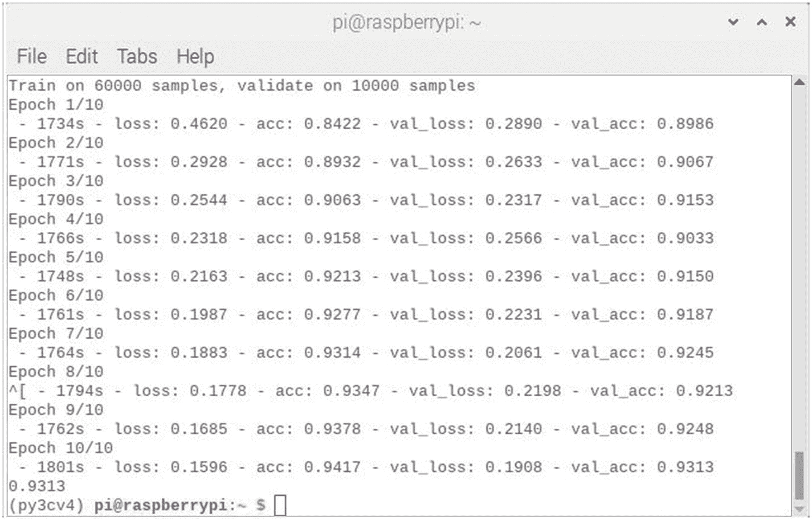

图 6-18

运行 kerasVGGTest 脚本后的最终结果

最终的准确率分数是 93.13%，这是一个非常好的分数。这个分数比单纯的 CNN 90.96%的分数高了两分多。当你考虑到高性能 CNN 的收视率只有大约 10 个百分点的差距时，CNN 性能增加 2 个百分点是很重要的。

## 杰森的时尚 MNIST 示范

这最后一个使用时尚 MNIST 数据集的 CNN 演示来自杰森·布朗利博士 2019 年 5 月撰写的题为“如何为时尚 MNIST 服装分类开发一个深度 CNN”的博客我选择使用 Jason 的脚本，因为它高度模块化，性能良好，并提供了一些关于其功能如何的信息丰富的情节。脚本中使用的 CNN 模型类似于前几章演示中使用的模型，其性能也与它们不相上下。

为了运行这个脚本，您需要安装一些额外的 Python 库。输入以下命令安装这些库:

```py
pip install matplotlib
pip install pandas
pip install sklearn

```

我将完整的脚本清单命名为 jasonTest.py，如下所示，可以从本书的配套网站上获得。我还在列表后添加了一些解释性注释。

```py
# Model with double the filters for the fashion mnist dataset
from numpy import mean
from numpy import std
from matplotlib import pyplot
from sklearn.model_selection import KFold
from keras.datasets import fashion_mnist
from keras.utils import to_categorical
from keras.models import Sequential
from keras.layers import Conv2D
from keras.layers import MaxPooling2D
from keras.layers import Dense
from keras.layers import Flatten
from keras.optimizers import SGD

# Load train and test dataset
def load_dataset():
    # load dataset
    (trainX, trainY), (testX, testY) = fashion_mnist.load_data()
    # reshape dataset to have a single channel
    trainX = trainX.reshape((trainX.shape[0], 28, 28, 1))
    testX = testX.reshape((testX.shape[0], 28, 28, 1))
    # one hot encode target values
    trainY = to_categorical(trainY)
    testY = to_categorical(testY)
    return trainX, trainY, testX, testY

# Scale pixels
def prep_pixels(train, test):
    # convert from integers to floats
    train_norm = train.astype('float32')
    test_norm = test.astype('float32')
    # normalize to range 0-1
    train_norm = train_norm / 255.0
    test_norm = test_norm / 255.0
    # return normalized images
    return train_norm, test_norm

# Define cnn model
def define_model():
    model = Sequential()
    model.add(Conv2D(64, (3, 3), padding="same", activation="relu", kernel_initializer="he_uniform", input_shape=(28, 28, 1)))
    model.add(MaxPooling2D((2, 2)))
    model.add(Flatten())
    model.add(Dense(100, activation="relu", kernel_initializer="he_uniform"))
    model.add(Dense(10, activation="softmax"))
    # compile model
    opt = SGD(lr=0.01, momentum=0.9)
    model.compile(optimizer=opt, loss="categorical_crossentropy", metrics=['accuracy'])
    return model

# Evaluate a model using k-fold cross-validation
def evaluate_model(dataX, dataY, n_folds=5):
    scores, histories = list(), list()
    # prepare cross validation
    kfold = KFold(n_folds, shuffle=True, random_state=1)
    # enumerate splits
    for train_ix, test_ix in kfold.split(dataX):
        # define model
        model = define_model()
        # select rows for train and test
        trainX, trainY, testX, testY = dataX[train_ix], dataY[train_ix], dataX[test_ix], dataY[test_ix]
        # fit model
        history = model.fit(trainX, trainY, epochs=10, batch_size=32, validation_data=(testX, testY), verbose=0)
        # evaluate model
        _, acc = model.evaluate(testX, testY, verbose=0)
        print('> %.3f' % (acc ∗ 100.0))
        # append scores
        scores.append(acc)
        histories.append(history)
    return scores, histories

# Plot diagnostic learning curves
def summarize_diagnostics(histories):
    for i in range(len(histories)):
        # plot loss
        pyplot.subplot(211)
        pyplot.title('Cross Entropy Loss')
        pyplot.plot(histories[i].history['loss'], color="blue", label="train")
        pyplot.plot(histories[i].history['val_loss'], color="orange", label="test")
        # plot accuracy
        pyplot.subplot(212)
        pyplot.title('Classification Accuracy')
        pyplot.plot(histories[i].history['acc'], color="blue", label="train")
        pyplot.plot(histories[i].history['val_acc'], color="orange", label="test")
    pyplot.show()

# summarize model performance
def summarize_performance(scores):
    # print summary
    print('Accuracy: mean=%.3f std=%.3f, n=%d' % (mean(scores)∗100, std(scores)∗100, len(scores)))
    # box and whisker plots of results
    pyplot.boxplot(scores)
    pyplot.show()

# Run the test harness for evaluating a model
def run_test_harness():
    # load dataset
    trainX, trainY, testX, testY = load_dataset()
    # prepare pixel data
    trainX, testX = prep_pixels(trainX, testX)
    # evaluate model
    scores, histories = evaluate_model(trainX, trainY)
    # learning curves
    summarize_diagnostics(histories)
    # summarize estimated performance
    summarize_performance(scores)

# Entry point, run the test harness
run_test_harness()

```

这个脚本使用 k-fold 交叉验证作为模型评估的一部分。在这种情况下，k 等于 5。如果你需要复习这个概念，我会推荐你回到第 1 章，在那里我讨论了 k 重交叉验证。Jason 使用的 k-fold 交叉验证实际上会导致执行 5 个时期，您将在结果屏幕中看到这一点。此外，每个时期的单独结果存储在名为`histories`的列表中。然后在生成性能图时使用该列表。

Jason 还使用一个测试工具结构来安排如何调用所有的模块。我个人喜欢这种风格，并向任何希望创建易于理解和维护的模块化软件的人推荐这种风格。以模块化的方式编写软件的一个很好的特点是相对容易分离模块，使它们相互独立。因此，您对特定模块所做的任何更改都不会影响其他模块。这种编程风格是软件设计原则的一个极好的例子，*高内聚，松耦合*。这个原则意味着软件应该被编写成模块做好一两件事(*高内聚*)，而不是“过多”依赖其他模块(*松耦合*)。牢记这一原则编写的软件往往更容易理解，不容易更改，并且易于维护。

应该使用以下命令在虚拟环境中运行该脚本:

```py
python jasonTest.py

```

这个脚本运行了大约 3.5 个小时才完成。最终结果如图 [6-19](#Fig19) 所示。


图 6-19

运行 jasonTest 脚本后的最终结果

最终准确度得分为 91.09%，这是 5 个时期得分的平均值。请注意，标准偏差为 0.41%，这提供了对精度差异的一些了解。我应该指出，结果屏幕是在我删除了许多多余的 Keras 警告之后出现的。

图 [6-20](#Fig20) 是总结准确度分数分布的盒须图。

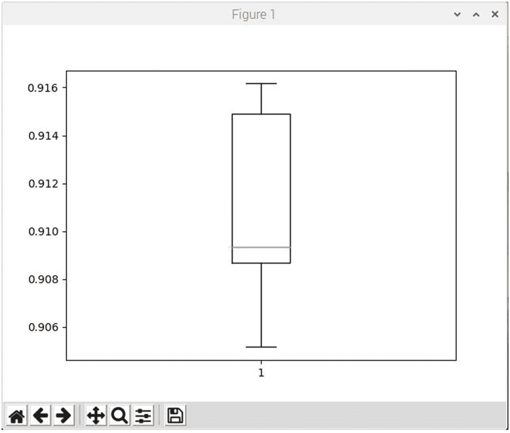

图 6-20

准确度分数分布的盒须图

您应该能够从垂直标尺上看到，分数紧密分组，其“晶须”范围大约为 0.905 到 0.916，平均值为 0.919。大部分精度值位于平均值之上，这可以从盒子位置看到。

图 [6-21](#Fig21) 包含交叉熵损失和分类精度的曲线图。

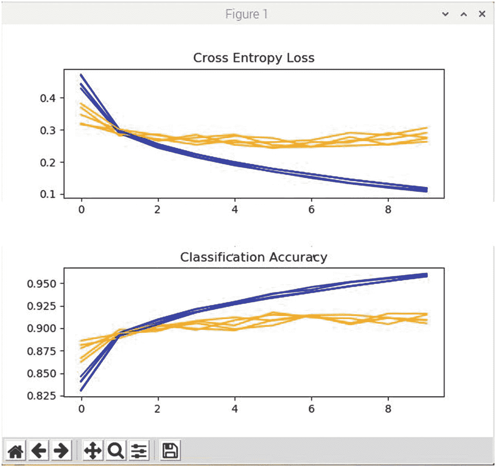

图 6-21

交叉熵损失和分类准确度图

这些图被称为学习曲线，因为它们显示了模型如何随着训练过程的进行而收敛。颜色较深的绘图线用于训练数据集，颜色较浅的绘图线用于测试数据集。总的来说，这些图表明该模型总体上实现了与训练和测试学习曲线收敛的良好拟合。由于两组地块线之间的分离，可能会有一些小程度的过度拟合。**