# 7.使用人工神经网络和 CNN 的预测

在前面的章节中，我已经反复演示了 ann 和 CNN 如何对各种对象进行分类，包括手写数字和衣服。在这一章中，我将探索人工神经网络和 CNN 如何预测结果。我反复注意到 DL 实践者经常将分类和预测混为一谈。这是可以理解的，因为这些任务紧密交织在一起。例如，当呈现一个未知的图像时，CNN 会试图识别它属于它已经被训练识别的类别之一。这显然是一个分类过程。然而，如果只是从一个更广泛的角度来看这个过程，你可以说 CNN 已经被赋予了预测图像代表什么的任务。我选择采取更狭隘的观点，将我对预测的解释限制在以下定义内，至少就 ann 和 CNN 而言:

*预测是指 DL 算法在数据集上训练后的输出，当新数据被应用于预测特定结果的可能性时。*

预测这个词也可能产生误导。在某些情况下，它确实意味着一个未来的结果正在被预测，例如当你在一个营销活动中使用 DL 来决定下一个最佳行动时。在其他情况下，预测与已经发生的交易是否是欺诈有关。在这种情况下，交易已经发生，算法正在对其是否合法进行有根据的猜测。我最初的演示非常简单，当面对一组事实时，人工神经网络会做出二元选择。选择是应用的记录是否是类的一部分。当我下一次演示时，最后这句话将变得非常清楚。

## 皮马印度糖尿病示范

皮马印度糖尿病项目是 DL 学生一直研究的另一个经典问题。这是一个很好的案例研究，说明当一个人工神经网络已经在历史数据集上进行了彻底的训练时，该人工神经网络如何根据应用的记录进行预测。

### 皮马印度糖尿病研究的背景

糖尿病是一组代谢紊乱，其中血糖水平长期高于正常水平。糖尿病是由于体内胰岛素产生不足或由于身体细胞对胰岛素的不适当反应而引起的。糖尿病的前一种原因也被称为 1 型糖尿病或胰岛素依赖型糖尿病，而后者被称为 2 型糖尿病或非胰岛素依赖型糖尿病。妊娠期糖尿病是第三种类型的糖尿病，其中没有患糖尿病的妇女在怀孕期间出现高血糖水平。糖尿病对女性来说尤其艰难，因为它会影响怀孕期间的母亲和未出生的孩子。患有糖尿病的女性患心脏病、流产或婴儿先天缺陷的可能性更高

由于皮马族女性中糖尿病的高发病率，自 1965 年以来，包含关于亚利桑那州菲尼克斯附近的皮马族印度女性的信息的糖尿病数据一直处于持续研究中。该数据集最初由国家糖尿病、消化和肾脏疾病研究所发布，由年龄大于 20 岁的女性的诊断测量组成。它包含 768 名女性的信息，其中 268 名女性被诊断患有糖尿病。可用信息包括八个变量，详见表 [7-1](#Tab1) 。数据集中的响应变量是一个二元分类器 Outcome，它指示此人是否被诊断为糖尿病。

表 7-1

皮马印度糖尿病研究中的八个因素

<colgroup><col class="tcol1 align-left"> <col class="tcol2 align-left"> <col class="tcol3 align-left"></colgroup> 
| 

变量名

 | 

数据类型

 | 

变量描述

 |
| --- | --- | --- |
| 怀孕 | 整数 | 怀孕次数 |
| 葡萄糖 | 整数 | 口服葡萄糖耐量试验中 2 小时的血浆葡萄糖浓度 |
| 血压 | 整数 | 舒张压 |
| 表皮厚度 | 整数 | 三头肌皮褶厚度 |
| 胰岛素 | 整数 | 2 小时血清胰岛素(μU/ml) |
| 身体质量指数 | 数字的 | 体重指数 |
| 糖尿病患者 | 数字的 | 亲属中糖尿病病史的综合，这些亲属与受试者的一般关系 |
| 结果 | 整数 | 糖尿病的发生 |

### 准备数据

您需要做的第一件事是下载数据集。该数据集可从多个网站获得。我用了下面这个:

`www.kaggle.com/kumargh/pimaindiansdiabetescsv`

这个下载是存档格式的。提取之后，我将该文件重命名为 diabetes.csv，只是为了使其简短和易于记忆。

接下来你应该做的是检查数据，看看它是否正常，没有任何奇怪或不寻常的东西。我使用 Microsoft Excel 应用进行初步检查，因为这个数据集是 CSV 格式的，Excel 可以很好地处理它。图 [7-1](#Fig1) 显示了数据集中 768 行中的前 40 行。

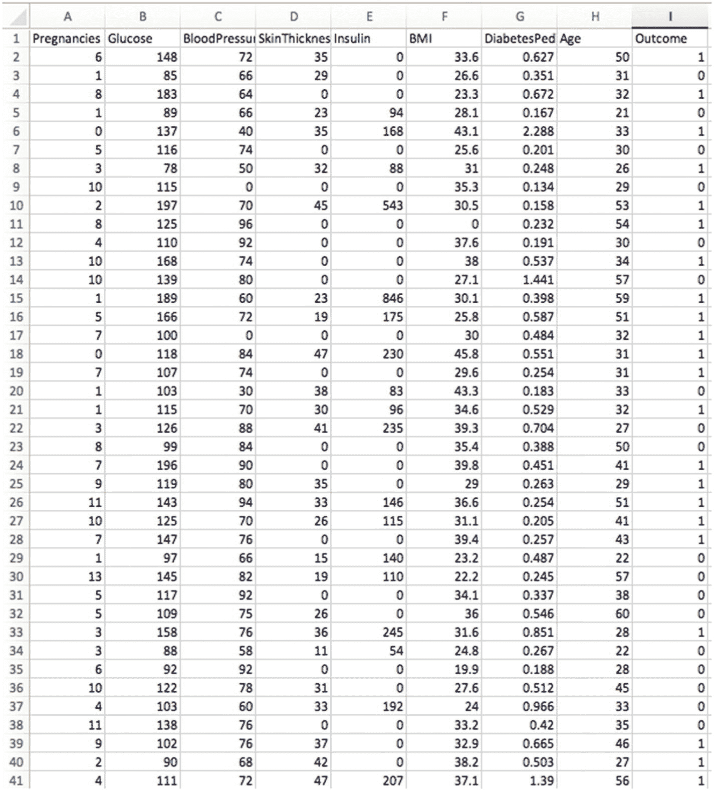

图 7-1

diabetes.csv 数据集中的前 40 行

立即引起我注意的是皮肤厚度和胰岛素列中出现了过多的零。这些列中不应有任何零，因为活着的患者既不能有零皮肤厚度，也不能有零胰岛素水平。这促使我做了一点研究，我确定最初建立这个数据集的研究人员只是简单地为空的或零读数插入零。这种做法是完全不可接受的，可能会破坏数据集，以至于在人工神经网络处理时很容易产生错误或误导性的结果。那么，我能做些什么呢？

我的进一步研究导致了下面的过程，它以一种合理的方式“纠正”了丢失的值，并展示了一种可视化数据的好方法。我要感谢保罗·穆尼和他的博客“从病历中预测糖尿病”，为解决这个问题提供了有益的见解。Paul 使用 Python 笔记本格式进行计算。为了这次讨论，我将他的交互式命令修改成了传统的 Python 脚本。

在开始此会话之前，请确保您处于 Python 虚拟环境中。然后，您需要确保在运行脚本之前安装了 Seaborn、Matplotlib 和 Pandas 库。如果您不确定这些库是否存在，请输入以下命令来安装它们:

```py
pip install seaborn
pip install matplotlib
pip install pandas

```

以下脚本加载 diabetes.csv 数据集，然后执行一系列数据检查、汇总和直方图绘制。我将这个脚本命名为 diabetesTest.py，它可以从本书的配套网站上获得。我还在脚本后面添加了一些解释性注释，以帮助澄清脚本中发生了什么。

```py
# Import required libraries
import matplotlib.pyplot as plt
import seaborn as sns
import pandas as pd
# Load the CSV dataset
dataset = pd.read_csv('diabetes.csv')
dataset.head(10)

# Define a histogram plot method
def plotHistogram(values, label, feature, title):
    sns.set_style("whitegrid")
    plotOne = sns.FacetGrid(values, hue=label, aspect=2)
    plotOne.map(sns.distplot, feature, kde=False)
    plotOne.set(xlim=(0, values[feature].max()))
    plotOne.add_legend()
    plotOne.set_axis_labels(feature, 'Proportion')
    plotOne.fig.suptitle(title)
    plt.show()

# Plot the Insulin histogram
plotHistogram(dataset, 'Outcome', 'Insulin', 'Insulin vs Diagnosis (Blue = Healthy; Orange = Diabetes)')

# Plot the SkinThickness histogram

plotHistogram(dataset, 'Outcome', 'SkinThickness', 'SkinThickness vs Diagnosis (Blue = Healthy; Orange = Diabetes)')

# Summary of the number of 0's present in the dataset by feature
dataset2 = dataset.iloc[:, :-1]
print("Num of Rows, Num of Columns: ", dataset2.shape)
print("\nColumn Name          Num of Null Values\n")
print((dataset[:] == 0).sum())

# Percentage summary of the number of 0's in the dataset

print("Num of Rows, Num of Columns: ", dataset2.shape)
print("\nColumn Name          %Null Values\n")
print(((dataset2[:] == 0).sum()) / 768 * 100)

# Create a heat map
g = sns.heatmap(dataset.corr(), cmap="BrBG", annot=False)
plt.show()

# Display the feature correlation values
corr1 = dataset.corr()
print(corr1[:])

```

解释性注释:

*   `dataset = pd.read_csv('diabetes.csv')`–使用 Pandas `read_csv`方法将 CSV 数据集读入脚本。

*   `dataset.head(10)`–显示数据集中的前十条记录。

*   `def plotHistogram(values, label, feature, title)`–定义一种绘制参数列表中数据集特征直方图的方法。这个方法使用了 Seaborn 库，我在第 2 章中讨论过。在此定义之后，绘制两个直方图，一个用于`Insulin`，另一个用于`SkinThickness`。这些特征中的每一个都存在大量的 0。

*   `dataset2 = dataset.iloc[:, :-1]`–是代码段的开始，该代码段显示了每个数据集特征的 0 的实际数量。唯一应该有 0 的特征是`Outcome`和`Pregnancies`。

*   `print("Num of Rows, Num of Columns: ", dataset2.shape)`–是代码段的开始，该代码段显示了每个数据集特征中 0 的百分比。

*   `g = sns.heatmap(dataset.corr(), cmap="BrBG", annot=False)`–为数据集的关联图生成热图。热图是以 2D 形式表示数据的一种方式。数据值在图表中用颜色表示。热图的目标是提供信息的彩色视觉摘要。

*   `corr1 = dataset.corr()`–创建数据集特征变量之间的相关值表格。数据集中的值经过调整后，该统计数据将会非常有用。

该脚本应该在虚拟环境中运行，并且 diabetes.csv 数据集与该脚本位于同一目录中。输入以下命令运行脚本:

```py
python diabetesTest.py

```

该脚本立即运行并产生一系列结果。最终筛选结果如图 [7-2](#Fig2) 所示。

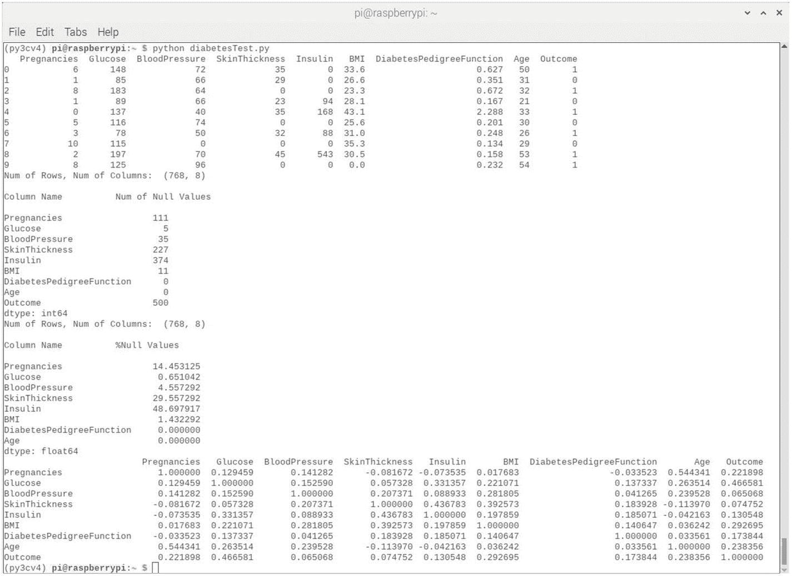

图 7-2

运行 diabetesTest 脚本后的最终结果

图中的第一个表列出了每个功能的空值(0)。很明显，`SkinThickness`和`Insulin`特征列中有不可接受数量的 0。几乎有 50%的`Insulin`数据点丢失了，从图中的下一个表格可以很容易地看出这一点。由于这些缺失值，任何使用该数据集的人工神经网络都会无意中引入偏差。它将如何影响整体人工神经网络预测性能尚不确定，但这将是一个问题。

图中的最后一个表显示了特征变量之间的相关值。通常，我希望看到变量之间的低值，除了那些自然相关的特征，如年龄和怀孕。你还应该注意到，这个表是一个围绕单位对角线的对称矩阵。因为变量与其自身的相关值必须始终等于 1，所以会产生单位对角线(全 1)。对称矩阵的结果是因为相关函数是可交换的(变量的顺序无关紧要)。我将寻找的关键值是在修改数据以去除 0 之后，`SkinThickness`和`Insulin`之间的当前相关值 0.436783 如何变化。

图 [7-3](#Fig3) 是显示胰岛素水平和健康与患病患者比例之间关系的直方图。

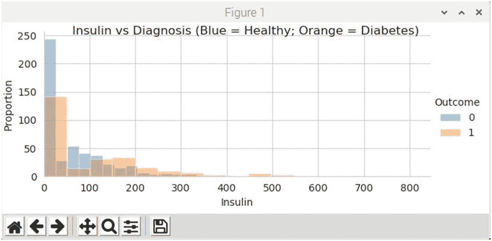

图 7-3

胰岛素水平和健康与患病患者比例的直方图

40 岁以下的不健康患者似乎非常集中，这没有意义，因为任何活着的患者都不可能有如此低的水平。此外，胰岛素水平在 20 或以下的健康患者数量激增是不现实的。他们也无法忍受如此低的生活水平。很明显，过度 0 问题扭曲了数据，导致人工神经网络做出错误的预测。

图 [7-4](#Fig4) 是显示皮肤厚度测量值和健康与患病患者比例之间关系的直方图。

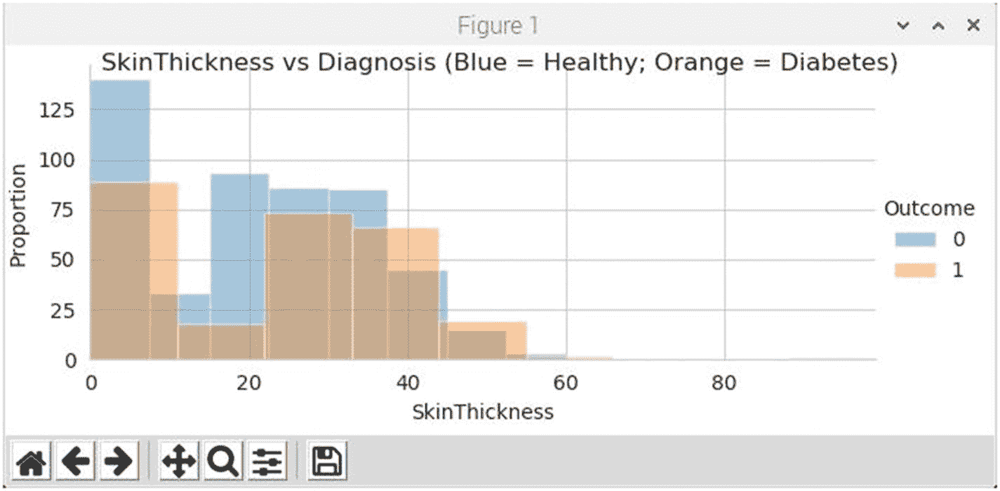

图 7-4

皮肤厚度测量和健康与患病患者比例的直方图

在该图中，与上图一样，健康和患病患者的皮肤厚度测量值在 0 皮肤厚度测量值附近都有异常尖峰。不可能有 0 的皮肤厚度。过量 0 问题是造成这种异常的唯一原因。

图 [7-5](#Fig5) 显示了所有数据集特征变量之间相关矩阵的热图。

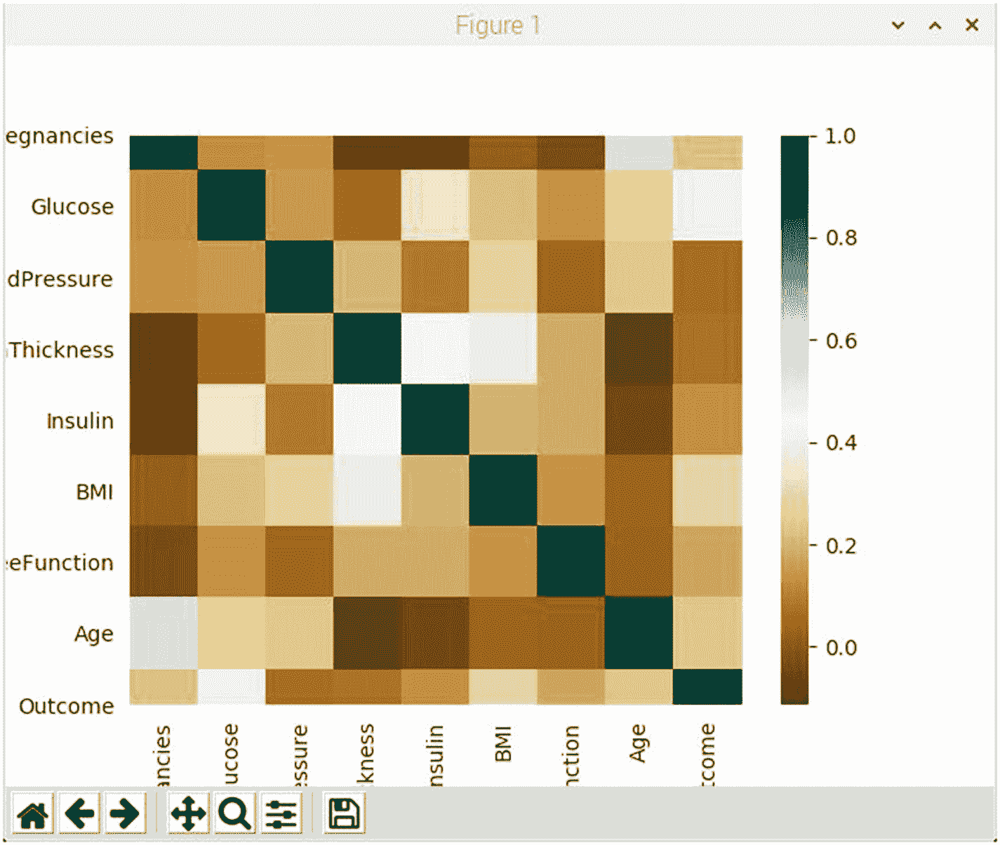

图 7-5

数据集要素变量的关联热图

您应该在该图中寻找的是白色块，它表示相关值等于或大于 0.4。该数据集的大多数相关值相对较低，除了

*   葡萄糖和结果

*   年龄和怀孕

*   胰岛素和皮肤厚度

列表中的前两个非常有意义。葡萄糖(血液中的糖水平)肯定与糖尿病及其结果相关。年龄和怀孕自然是相关的，因为女性随着年龄的增长怀孕的次数越来越少，或者如果她们年轻，她们没有时间维持多次怀孕。列表中的最后一个是可疑值，这是由于过零问题而人为产生的高相关值。

现在是时候解决过量 0 的问题了。问题自然变成了如何做到这一点，而不会对数据集造成太大的破坏？大多数统计学家会引用的答案是估算缺失的数据。输入数据是一个棘手的过程，因为它会在数据集中插入额外的偏差。根据数据的性质，输入数据的过程可以采取几种形式。如果数据来自时间序列，那么丢失的数据可以很容易地通过在丢失值周围的数据之间进行插值来替换。不幸的是，糖尿病数据集不是时间敏感的，所以这个选项是不可能的。

另一种估算方法是简单地剔除那些缺失数据的记录。这被称为列表式插补。不幸的是，使用列表式插补将导致近 50%的现有数据集记录消失。这将对人工神经网络的学习过程造成严重破坏，因此这种选择是不可能的。剩下的估算选项之一是使用所有现有的要素数据来确定一个值，以替换缺失的数据。有称为热卡、冷卡、平均值和中值的插补过程使用这种方法。没有深入细节，我决定使用中值作为替换丢失数据值的选项。

以下脚本是对之前脚本的修改，在之前的脚本中，我对数据集进行了估算，以从特征变量中移除所有 0。数据集也被分成两个数据集，一个用于训练，另一个用于测试。该脚本名为 revisedDiabetesTest.py，可从该书的配套网站上获得。我也提供了一些上市后的解释性意见。

```py
# Import required libraries
import numpy as np
import matplotlib.pyplot as plt
import seaborn as sns
import pandas as pd
from sklearn.model_selection import train_test_split
from sklearn.impute import SimpleImputer

# Load the dataset
data = pd.read_csv('diabetes.csv')
X = data.iloc[:, :-1]
y = data.iloc[:, -1]

# Split the dataset into 80% training and 20% testing sets
X_train, X_test, y_train, y_test = train_test_split(X, y, test_size=0.2, random_state=1)

# Impute the missing values using feature median values
imputer = SimpleImputer(missing_values=0, strategy="median")
X_train2 = imputer.fit_transform(X_train)
X_test2 = imputer.transform(X_test)

# Convert the numpy array into a Dataframe
X_train3 = pd.DataFrame(X_train2)

# Display the first 10 records
print(X_train3.head(10))

def plotHistogram(values, label, feature, title):
    sns.set_style("whitegrid")
    plotOne = sns.FacetGrid(values, hue=label, aspect=2)
    plotOne.map(sns.distplot, feature, kde=False)
    plotOne.set(xlim=(0, values[feature].max()))
    plotOne.add_legend()
    plotOne.set_axis_labels(feature, 'Proportion')
    plotOne.fig.suptitle(title)
    plt.show()

# Plot the heathy patient histograms for insulin and skin
# thickness

plotHistogram(X_train3,None,4,'Insulin vs Diagnosis')
plotHistogram(X_train3,None,3,'SkinThickness vs Diagnosis')

# Check to see if any 0's remain
data2 = X_train2
print("Num of Rows, Num of Columns: ", data2.shape)
print("\nColumn Name          Num of Null Values\n")
print((data2[:] == 0).sum())

print("Num of Rows, Num of Columns: ", data2.shape)
print("\nColumn Name          %Null Values\n")
print(((data2[:] == 0).sum()) / 614 * 100)

# Display the correlation matrix
corr1 = X_train3.corr()
print(corr1)

```

解释性注释:

*   `X_train, X_test, y_train, y_test = train_test_split(X, y, test_size=0.2, random_state=1)`–将输入数据集分成两部分，一部分 80%的输入用于训练，另一部分 20%用于测试

*   `X_train3 = pd.DataFrame(X_train2)`–将训练数据集从 numpy 数组转换为 Pandas 数据帧，以便与 Pandas 互相关函数兼容

同样，该脚本应该在虚拟环境中运行，并且 diabetes.csv 数据集与该脚本位于同一目录中。输入以下命令运行脚本:

```py
python revisedDiabetesTest.py

```

该脚本立即运行并产生一系列结果。最终筛选结果如图 [7-6](#Fig6) 所示。

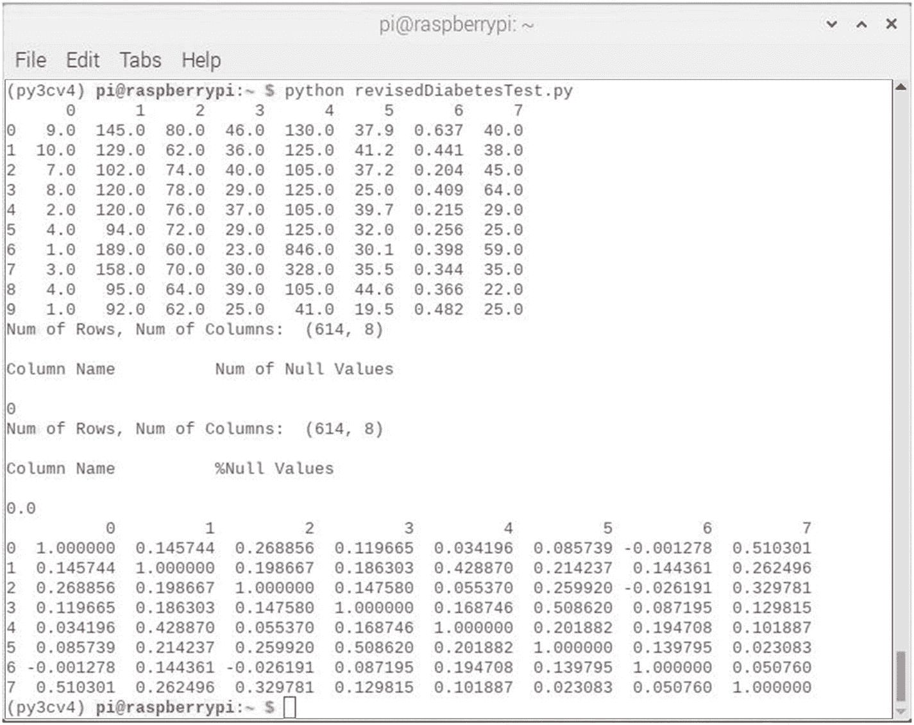

图 7-6

运行 revisedDiabetesTest 脚本后的最终结果

您可以立即看到，前十个训练集记录中的所有 0 值都已被替换为其他值。这适用于所有特征变量，但不适用于监督学习所需的输出列。

由于数据集中没有剩余的 0，因此显示 0 摘要代码。

图 [7-7](#Fig7) 是显示健康患者胰岛素分布的修正直方图。不再有任何胰岛素值处于或接近 0。分布峰值以 130 左右为中心，在我看来是合理的，但还是那句话，我不是 MD。

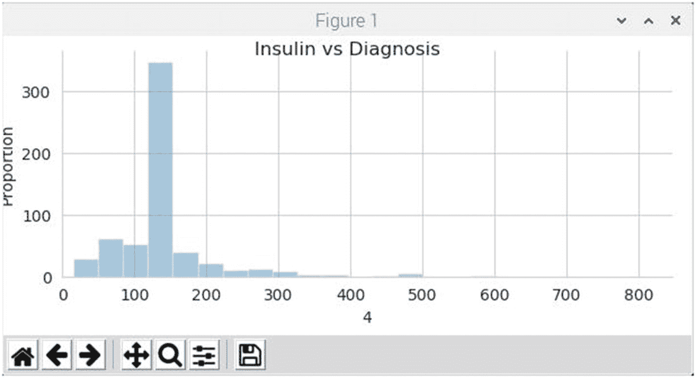

图 7-7

健康患者的胰岛素直方图

图 [7-8](#Fig8) 是显示健康患者皮肤厚度分布的修正直方图。与胰岛素图的情况一样，该图没有显示低于 8 的任何值。峰值似乎集中在 29，我认为这是一个合理的数字。

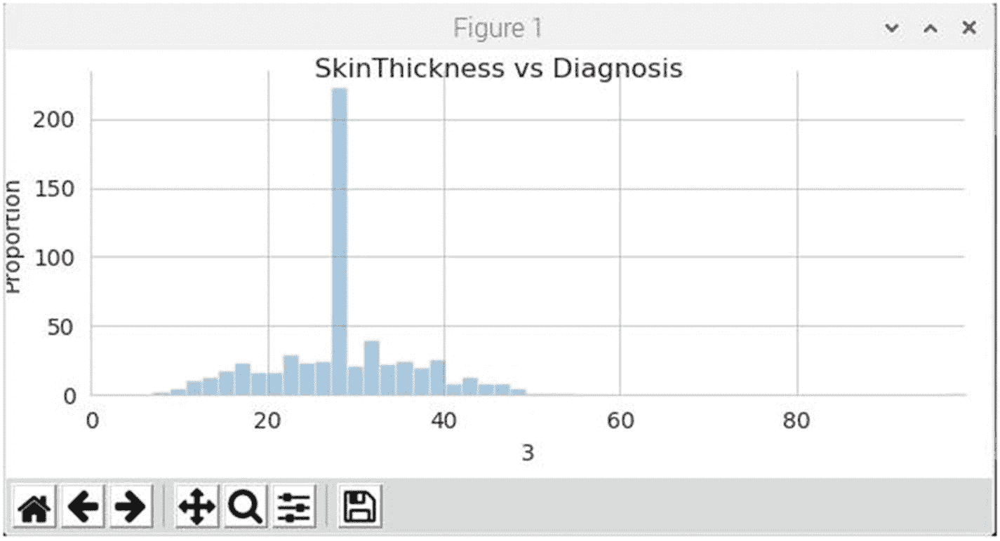

图 7-8

健康患者的皮肤厚度直方图

图 [7-6](#Fig6) 底部显示的相关矩阵现在显示胰岛素和皮肤厚度之间的相关值显著降低。在去除 0 之前，这两个特征之间的相关值是 0.436783。现在是 0.168746，大约减少了 61%。0 的移除无疑提高了数据质量，至少对于这两个特性是如此。

现在是讨论 Keras ANN 模型的时候了，因为数据集已经被“清理”到一个更好的状态。要构建的模型将是一个相对简单的三层顺序模型。输入图层将有八个对应于八个数据集要素变量的输入。使用 Keras 密集类将在模型中使用完全连接的图层。ReLU 激活函数将用于前两层，因为已经发现它是最佳性能函数。第三层是输出，将使用 sigmoid 函数进行激活，因为输出必须在 0 和 1 之间。回想一下，这是一个预测模型，输出是只有 0 或 1 值的二进制。总之，模型假设是

*   期望有八个变量的数据行( *input_dim=8* 参数)。

*   第一个隐藏层有 12 个节点，使用 ReLU 激活函数。

*   第二个隐藏层有八个节点，使用 ReLU 激活函数。

*   输出层有一个节点，使用 sigmoid 激活函数。

请注意，第一个隐藏层实际上执行两个功能。它在接受八个变量时充当输入层，并且它还充当具有 12 个节点的隐藏层，这些节点具有相关的 ReLU 激活函数。

以下脚本名为 kerasDiabetesTest.py，可从本书的配套网站获得。清单后面有解释性注释。

```py
# Import required libraries
import numpy as np
import pandas as pd
from sklearn.model_selection import train_test_split
from sklearn.impute import SimpleImputer
from keras.models import Sequential
from keras.layers import Dense

# Load the dataset
data = pd.read_csv('diabetes.csv')
X = data.iloc[:, :-1]
y = data.iloc[:, -1]

# Split the dataset into 80% training and 20% testing sets
X_train, X_test, y_train, y_test = train_test_split(X, y, test_size=0.2, random_state=1)

# Impute the missing values using feature median values
imputer = SimpleImputer(missing_values=0,strategy='median')
X_train2 = imputer.fit_transform(X_train)
X_test2 = imputer.transform(X_test)

# Convert the numpy array into a Dataframe

X_train3 = pd.DataFrame(X_train2)

# Define the Keras model
model = Sequential()
model.add(Dense(12, input_dim=8, activation="relu"))
model.add(Dense(8, activation="relu"))
model.add(Dense(1, activation="sigmoid"))

# Compile the keras model
model.compile(loss='binary_crossentropy', optimizer="adam", metrics=['accuracy'])
# fit the keras model on the dataset
model.fit(X_train2, y_train, epochs=150, batch_size=10)

# Evaluate the keras model
_, accuracy = model.evaluate(X_test2, y_test)
print('Accuracy: %.2f' % (accuracy*100))

```

除了一些添加和删除的导入之外，脚本的第一部分与 revisedDiabetesTest.py 脚本的第一部分相同。模型定义在一行中，代替了 CNN 脚本中的单独定义。这样做是因为它是一个非常简单明了的模型。编译过程与 CNN 模型几乎相同，除了 loss 函数，它是`binary_crossentropy`而不是`categorical_crossentropy`，这是多个类所需要的。该模型将非常快速地训练和测试，这允许运行许多时期以努力提高准确性。在这种情况下，设置了 150 个历元。整体精度是使用 Keras `evaluate`方法完成的，就像 CNN 模型一样。

该脚本应该在虚拟环境中运行，并且 diabetes.csv 数据集与该脚本位于同一目录中。输入以下命令运行脚本:

```py
python kerasDiabetesTest.py

```

该脚本立即运行并产生一系列结果。最终筛选结果如图 [7-9](#Fig9) 所示。

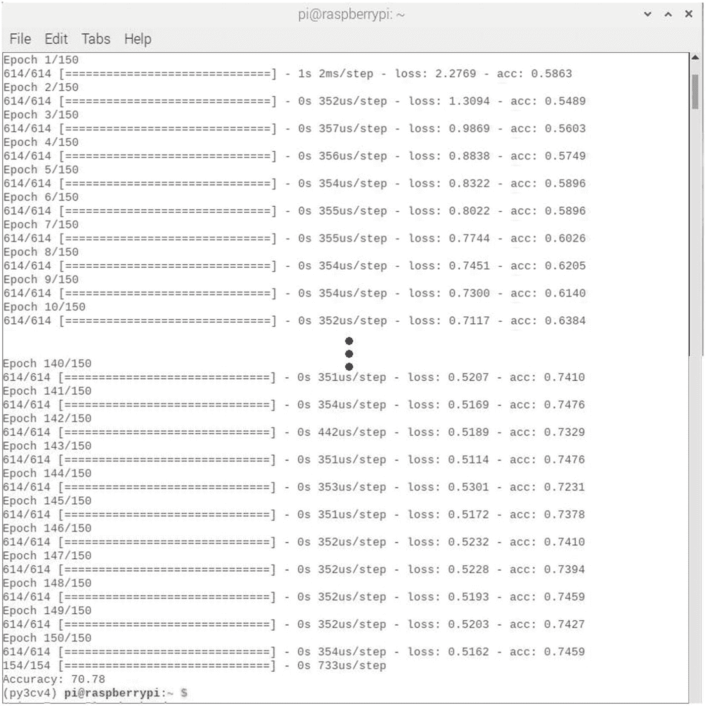

图 7-9

运行 kerasDiabetesTest 脚本后的最终结果

该图是显示开始和结束时期结果的合成图。最终，总体准确率为 70.78%。这通常被认为是可以的，但不是很好的分数。然而，我对用类似模型运行这个项目的其他人做了一些研究，发现这个结果与大多数其他结果一致。皮马印度糖尿病研究的预测大约有 70%是成功的(或准确的)。我相信，如果在实际的临床试验中使用，这种水平的准确性是不可接受的，但在这种学习和实验环境中是完全可以接受的。

## 通过 Keras 使用 scikit-learn 库

Python scikit-learn 库使用 scipy 堆栈进行高效的数值计算。这是一个通用 ML 库的全功能库，提供了许多在开发模型中有用的工具。这些实用程序包括

*   使用重采样方法(如 k-fold 交叉验证)进行模型评估

*   模型超参数的有效评估

Keras 库是一个方便的 DL 模型包装器，用于 scikit-learn 库的分类或回归估计。

下面的演示将 KerasClassifier 包装用于在 Keras 中创建的分类神经网络，并与 scikit-learn 库一起使用。我还将使用上次演示中使用的相同的修改过的 Pima Indian 糖尿病数据集。

这个演示脚本与上一个非常相似，因为它使用了相同的 Keras ANN 模型。显著的区别在于，在此脚本中，模型由 KerasClassifier 使用，而不是通过 Keras fit 函数将修改后的数据集直接应用于模型。我将在脚本清单之后解释 KerasClassifier 是如何工作的，因为让您看到它是如何被调用的是很重要的。

以下脚本被命名为 kerasScikitDiabetesTest.py，以表明它现在使用 scikit-learn 分类器来代替普通的 Keras fit 函数。它可以从该书的配套网站上获得。

```py
# Load required libraries

from keras.models import Sequential
from keras.layers import Dense
from keras.wrappers.scikit_learn import KerasClassifier
from sklearn.model_selection import StratifiedKFold
from sklearn.model_selection import cross_val_score
from sklearn.model_selection import train_test_split
from sklearn.impute import SimpleImputer
import pandas as pd

# Function to create model, required for the KerasClassifier
def create_model():
    # create model
    model = Sequential()
    model.add(Dense(12, input_dim=8, activation="relu"))
    model.add(Dense(8, activation="relu"))
    model.add(Dense(1, activation="sigmoid"))
    model.compile(loss='binary_crossentropy', optimizer="adam", metrics=['accuracy'])

    return model

# fix random seed for reproducibility
seed = 42

# Load the dataset
data = pd.read_csv('diabetes.csv')
X = data.iloc[:, :-1]
y = data.iloc[:, -1]

# Split the dataset into 80% training and 20% testing sets   

X_train, X_test, y_train, y_test = train_test_split(X, y, test_size=0.2, random_state=1)

# Impute the missing values using feature median values
imputer = SimpleImputer(missing_values=0,strategy='median')
X_train2 = imputer.fit_transform(X_train)
X_test2 = imputer.transform(X_test)

# Convert the numpy array into a Dataframe
X_train3 = pd.DataFrame(X_train2)
# create model
model = KerasClassifier(build_fn=create_model, epochs=150, batch_size=10, verbose=0)
# evaluate using 10-fold cross validation
kfold = StratifiedKFold(n_splits=10, shuffle=True, random_state=seed)

# Evaluate using cross_val_score function
results = cross_val_score(model, X_train2, y_train, cv=kfold)
print(results.mean())

```

该脚本应该在虚拟环境中运行，并且 diabetes.csv 数据集与该脚本位于同一目录中。输入以下命令运行脚本:

```py
python kerasScikitDiabetesTest.py

```

该脚本立即运行并产生一个结果。最终筛选结果如图 [7-10](#Fig10) 所示。


图 7-10

运行 kerasScikitDiabetesTest 脚本后的最终结果

图中显示的精度值为 73.45%。该值基于仅使用训练数据集，该数据集是原始数据集的 80%。因此，我重新运行脚本，将训练集的分割更改为 99%，这意味着它几乎是未分割数据集的大小。结果是准确率为 73.40%，这与第一次运行相比在统计上没有显著差异。

Keras 中的 KerasClassifier 和 KerasRegressor 类接受一个名为`build_fn`的参数，它是模型的函数名。在前面的脚本中，名为`create_model()`的方法为这种情况创建了一个 MLP。该函数通过 build_fn 参数传递给 KerasClassifier 类。还有额外的参数 nb_epoch=150 和 batch_size=10 由`fit()`函数自动使用，该函数由 KerasClassifier 类在内部调用。

在本例中，scikit-learn `StratifiedKFold`函数用于执行十重分层交叉验证。这是一种重采样技术，可通过应用的数据集为定义的模型提供可靠的精度估计。

scikit-learn 函数`cross_val_score`用于使用交叉验证方案评估模型并显示结果。

### 使用 Keras 和 scikit 进行网格搜索-学习

在接下来的演示中，网格搜索用于评估人工神经网络模型的不同配置。报告产生最佳估计性能的配置。

`create_model()`函数用两个参数定义，optimizer 和 Init，这两个参数都有默认值。改变这些参数值可以评估在网络模型上使用不同优化算法和权重初始化方案的效果。

在模型创建之后，有一个用于网格搜索的参数数组的定义。该搜索旨在测试

*   用于搜索不同权重值的优化器

*   使用不同方案准备网络权重的初始化器

*   针对训练数据集的不同暴露次数来训练模型的时期

*   重量更新前用于改变样品数量的批次

前面的选项存储在字典中，然后传递给 GridSearchCV scikit-learn 类的配置。此类评估每个参数组合的 ANN 模型版本(优化器、初始化、时期和批处理的组合为 2 x 3 x 3 x 3)。然后使用默认的三重分层交叉验证对每个组合进行评估。

有许多模型，而且都需要相当多的计算时间，如果您使用 RasPi 来复制这个演示，就会发现这一点。此 RasPi 设置的估计持续时间约为 2 小时，考虑到网络相对较小和数据集较小(少于 800 个记录实例和 9 个要素和属性)，这是合理的。

脚本完成后，将显示最佳模型的性能和配置组合，随后是所有参数组合的性能。

以下脚本命名为 kerasscikitgridsearchdiabetestest . py，表示它使用 scikit-learn 网格搜索算法来帮助确定 ANN 模型的最佳配置。该脚本可从该书的配套网站获得:

```py
# Import required libraries
import numpy as np
import pandas as pd
from keras.models import Sequential
from keras.layers import Dense
from sklearn.model_selection import train_test_split
from sklearn.impute import SimpleImputer
from keras.wrappers.scikit_learn import KerasClassifier
from sklearn.model_selection import GridSearchCV
from sklearn.model_selection import cross_val_score

# Function to create model, required for KerasClassifier
def create_model(optimizer='rmsprop', init="glorot_uniform"):
    # create model
    model = Sequential()
    model.add(Dense(12, input_dim=8, kernel_initializer=init, activation="relu"))
    model.add(Dense(8, kernel_initializer=init, activation="relu"))
    model.add(Dense(1, kernel_initializer=init, activation="sigmoid"))
    # Compile model
    model.compile(loss='binary_crossentropy', optimizer=optimizer, metrics=['accuracy'])
    return model

# Random seed for reproducibility
seed = 42
np.random.seed(seed)

# Load the dataset
data = pd.read_csv('diabetes.csv')
X = data.iloc[:, :-1]
y = data.iloc[:, -1]

# Split the dataset into 80% training and 20% testing sets
X_train, X_test, y_train, y_test = train_test_split(X, y, test_size=0.2, random_state=1)

# Impute the missing values using feature median values

imputer = SimpleImputer(missing_values=0,strategy='median')
X_train2 = imputer.fit_transform(X_train)
X_test2 = imputer.transform(X_test)

# Convert the numpy array into a Dataframe
X_train3 = pd.DataFrame(X_train2)

# Create model
model = KerasClassifier(build_fn=create_model, verbose=0)

# Grid search epochs, batch size and optimizer
optimizers = ['rmsprop', 'adam']
init = ['glorot_uniform', 'normal', 'uniform']
epochs = [50, 100, 150]
batches = [5, 10, 20]
param_grid = dict(optimizer=optimizers, epochs=epochs, batch_size=batches, init=init)
grid = GridSearchCV(estimator=model, param_grid=param_grid)
grid_result = grid.fit(X_train2, y_train)

# Summarize results
print("Best: %f using %s" % (grid_result.best_score_, grid_result.best_params_))
means = grid_result.cv_results_['mean_test_score']
stds = grid_result.cv_results_['std_test_score']
params = grid_result.cv_results_['params']
for mean, stdev, param in zip(means, stds, params):
    print("%f (%f) with: %r" % (mean, stdev, param))

```

该脚本应该在虚拟环境中运行，并且 diabetes.csv 数据集与该脚本位于同一目录中。输入以下命令运行脚本:

```py
python kerasScikitGridSearchDiabetesTest.py

```

这个脚本大约需要 2 个小时才能完成，因为运行了多组纪元。最终的屏幕结果如图 [7-11](#Fig11) 所示，这是我制作的一个合成图，显示了 epoch 中期结果的开始和结束集。

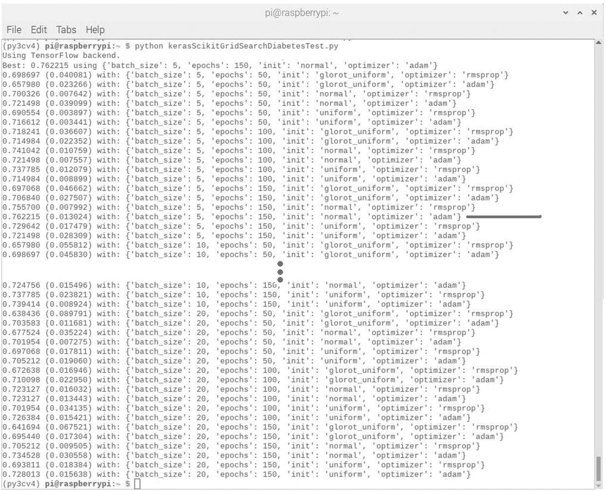

图 7-11

运行 kerasScikitGridSearchDiabetesTest 脚本后的最终结果

所有历元运行组达到的最高准确度为 76.22%。请注意，我在图中画了一条指向最优集合的线。该集合被配置为 150 个时期、批量大小为 5、正态分布和 Adam 优化器。

## 房价回归预测实证

现代在线房地产公司使用 ML 技术提供房屋估价。本演示将使用 ANN 和 scikit-learn 多元线性回归(MLR)函数预测美国马萨诸塞州波士顿市的房价。本演示中使用的数据集比较陈旧(1978 年)，但对于本项目来说仍然足够。

数据集由 13 个变量和 507 条记录组成。数据集特征变量详见表 [7-2](#Tab2) 。

表 7-2

波士顿住房数据集要素变量

<colgroup><col class="tcol1 align-left"> <col class="tcol2 align-left"></colgroup> 
| 

列

 | 

描述

 |
| --- | --- |
| 卷曲 | 按城镇分列的人均犯罪率 |
| 锌 | 划作 25，000 平方英尺以上地段的住宅用地比例。制成 |
| 印度西北部的河流 | 每个城镇非零售商业用地比例 |
| 临床科研信息整合平台 | 查尔斯河虚拟变量(= 1，如果区域边界为河流；否则为 0) |
| 氮氧化合物 | 一氧化氮浓度(百万分之一) |
| 空间 | 每所住宅的平均房间数 |
| 年龄 | 1940 年以前建造的自有住房比例 |
| 阴间 | 到五个波士顿就业中心的加权距离 |
| 皇家舞蹈学院 | 放射状公路可达性指数 |
| 税 | 每 10，000 美元的全额财产税税率 |
| ptratio(ptratio) | 按城镇分列的师生比例 |
| 上帝啊 | 人口中地位较低者的百分比 |
| 矢量 | 以千美元计的自有住房中值 |

由变量 MEDV 表示的房屋价格是*目标变量* *、*，其余特征是*特征变量*，将根据这些特征变量来预测房屋的价值。

### 预处理数据

熟悉项目中要使用的数据集始终是一种好的做法。显而易见的第一步是下载数据集。幸运的是，使用 scikit-learn 存储库可以很容易地获得这个数据集。以下语句将数据集下载到脚本中:

```py
from sklearn.datasets import load_boston
boston_dataset = load_boston()

```

接下来，我创建了一个小脚本来研究数据集特征，包括键和前几条记录。我将这个脚本命名为 inspectBoston.py，它可以从本书的配套网站上获得。

```py
# Load the required libraries
import pandas as pd
from sklearn.datasets import load_boston

# Load the Boston housing dataset
boston_dataset = load_boston()

# Display the dataset keys
print(boston_dataset.keys())

# Display the first five records
boston = pd.DataFrame(boston_dataset.data, columns=boston_dataset.feature_names)
print(boston.head())

# Display the extensive dataset description key
print(boston_dataset.DESCR)

```

使用以下命令运行此脚本:

```py
python inspectBoston.py

```

图 [7-12](#Fig12) 显示了运行该脚本会话的结果。

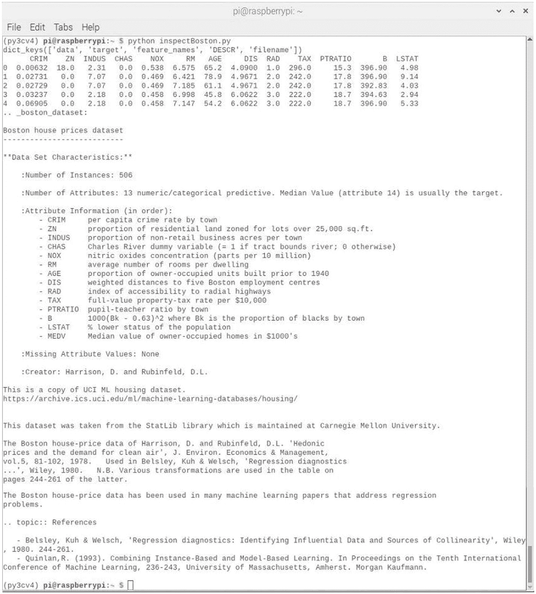

图 7-12

运行 inspectBoston 脚本后的结果

数据集关键字的描述部分是广泛的，并为这个有用的数据集提供了一个不寻常的和全面的历史回顾。我希望其他 ML 数据集也能包含如此丰富的数据。

查看最初的五条记录发现，数据框中缺少目标变量 MEDV。这很容易通过添加这行代码来解决:

```py
boston['MEDV'] = boston_dataset.target

```

一种易于实现且非常有用的快速数据集检查是检查数据集中是否有任何缺失值或 0 值。这可以通过使用`isnull()`方法和求和操作来完成。实现这一点的语句是

```py
boston.isnull().sum()

```

我将这个空支票和 MEDV 修正合并到一个修改过的 inspectBoston 脚本中。这个修改后的脚本现在被命名为 inspectBostonRev.py，它没有显示原始脚本中显示的大量描述。该脚本可从该书的配套网站获得:

```py
# Load the required libraries
import pandas as pd
from sklearn.datasets import load_boston

# Load the Boston housing dataset
boston_dataset = load_boston()

# Display the dataset keys
print(boston_dataset.keys())

# Create the boston Dataframe
boston = pd.DataFrame(boston_dataset.data, columns=boston_dataset.feature_names)

# Add the target variable to the Dataframe
boston['MEDV'] = boston_dataset.target

# Display the first five records
print(boston.head())

# Check for null values in the dataset
print(boston.isnull().sum())

```

使用以下命令运行此脚本:

```py
python inspectBostonRev.py

```

图 [7-13](#Fig13) 显示了运行该脚本会话的结果。

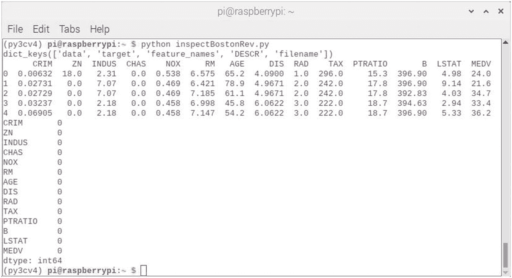

图 7-13

运行 inspectBoston 脚本后的结果

结果显示表明 MEDV 目标变量已成功添加到数据帧中，并且数据集中不存在空值或 0 值。基于前面所有的检查，我可以说这个数据集已经准备好应用于模型了。

### 基线模型

将首先创建 MLP Keras 模型，然后使用 scikit-learn 包装器回归函数来评估波士顿住房数据集。这个动作与第一章演示中发生的几乎相同，其中 scikit-learn 包装函数是一个分类器，而不是一个回归包。这种将 Keras 模型与 scikit-learn 包装函数结合使用的方法非常强大，因为它允许使用易于构建的 Keras 模型以及 scikit-learn 库中内置的令人印象深刻的评估功能。

基线模型是一个简单的结构，具有单个完全连接的隐藏层，具有与输入特征变量相同数量的节点(13)。网络还使用高效的 ReLU 激活功能。然而，在输出层上没有使用激活函数，因为该网络被设计为预测数值，并且不需要应用任何变换。

使用 Adam 优化器，并且均方误差(MSE)损失函数是要优化的目标函数。MSE 也将是用于评估网络性能的相同度量。这是一个可取的指标，因为它可以在问题的上下文中直接理解，这是一个以千美元平方为单位的房价。

与 scikit-learn 库一起使用的 Keras 包装器对象被命名为 KerasRegressor。这是使用与 KerasClassifier 对象相同的参数类型进行实例化的。需要一个对模型的引用以及几个参数(时期数和批量大小),这些参数最终传递给 fit()函数进行训练。

脚本中还使用了一个随机数，以帮助在脚本重复运行时生成一致且可重复的结果。

正如我在本章和前几章中所讨论的，这个模型最终是用十倍交叉验证过程来评估的。最终指标是 MSE，包括交叉验证评估的所有十倍的平均值和标准偏差。

在将数据集应用于模型和评估框架之前，必须对其进行规范化。这是因为它包含了幅度变化很大的值，你现在应该意识到这对于一个人工神经网络来说不是一件好事。规范化数据集通常也称为标准化数据集。在这种情况下，scikit-learn `StandardScaler`函数用于在交叉验证过程的每个环节中的模型评估期间对数据进行标准化。

下面的脚本包含了前面讨论的所有内容。它被命名为 kerasRegressionTest.py，可以从该书的配套网站上获得。

```py
# Import required libraries
import pandas as pd
from keras.models import Sequential
from keras.layers import Dense
from keras.wrappers.scikit_learn import KerasRegressor
from sklearn.model_selection import cross_val_score
from sklearn.model_selection import KFold
from sklearn.preprocessing import StandardScaler
from sklearn.pipeline import Pipeline
from sklearn.datasets import load_boston

# Load the Boston housing dataset
boston_dataset = load_boston()

# Create the boston Dataframe
dataframe = pd.DataFrame(boston_dataset.data, columns=boston_dataset.feature_names)

#  Add the target variable to the dataframe
dataframe['MEDV'] = boston_dataset.target

# Setup the boston dataframe
boston = dataframe.values

# Split into input (X) and output (y) variables
X = boston[:,0:13]
y = boston[:,13]

# Define the base model
def baseline_model():
    # Create model
    model = Sequential()
    model.add(Dense(13, input_dim=13,  kernel_initializer='normal', activation="relu"))
    model.add(Dense(1, kernel_initializer="normal"))
    # Compile model
    model.compile(loss='mean_squared_error', optimizer="adam")
    return model

# Random seed for reproducibility
seed = 42

# Create a regression object
estimator = KerasRegressor(build_fn=baseline_model, epochs=100, batch_size=5, verbose=0)

# Evaluate model with standardized dataset

estimators = []
estimators.append(('standardize', StandardScaler()))
estimators.append(('mlp', KerasRegressor(build_fn=baseline_model, epochs=50, batch_size=5, verbose=0)))
pipeline = Pipeline(estimators)
kfold = KFold(n_splits=10, random_state=seed)
results = cross_val_score(pipeline, X, y, cv=kfold)
print("Standardized: %.2f (%.2f) MSE" % (results.mean(), results.std()))

```

使用以下命令运行此脚本:

```py
python kerasRegressionTest.py

```

图 [7-14](#Fig14) 显示了运行该脚本会话的结果。


图 7-14

运行 kerasRegressionTest 脚本后的结果

最终的 MSE 是 28.65，这是一个不错的结果。对于那些在使用 MSE 这样的统计方法时有困难的读者，我将提供一个有点天真的解释，但可能有点直观。我做了以下简单的计算:

*   所有 MEDV 值的平均值= 22.49(这是波士顿地区 1978 年的房价)

*   MSE 的平方根= 5.35

*   MSE 的平方根与平均值之比= 0.238

*   1 -高于值= 0.762 或“准确度”= 76.2%

现在，在统计学家开始对我大吼大叫之前，我只展示前面的计算，以提供对 MSE 指标的某种有意义的解释。显然，MSE 接近 0 是理想的，但正如您从这种方法中看到的，该模型相当准确。事实上，我做了一些额外的研究，关于其他人使用相同数据集和相似网络的结果。我发现报告的准确度在 75%到 80%的范围内，所以这次演示是正确的。

### 改进的基线模型

上述脚本的一个重要特性是，可以在基线模型中进行更改，而不会影响脚本的任何其他部分。这个固有特性是我之前提到的另一个微妙的例子，即*高内聚、松耦合*。另一层将被添加到模型中，以努力提高其性能。这个“更深”的模型“可能”允许模型提取和组合嵌入在数据中的更高阶特征，这反过来将允许更好的预测结果。这个模型的代码是

```py
# define the model
def larger_model():
    # create model
    model = Sequential()
    model.add(Dense(13, input_dim=13, kernel_initializer="normal", activation="relu"))
    model.add(Dense(6, kernel_initializer="normal", activation="relu"))
    model.add(Dense(1, kernel_initializer="normal"))
    # Compile model
    model.compile(loss='mean_squared_error', optimizer="adam")
    return model

```

修改后的脚本被重命名为 kerasDeeperRegressionTest.py，如下所示。它可以从该书的配套网站上获得。

```py
# Import required libraries
import pandas as pd
from keras.models import Sequential
from keras.layers import Dense
from keras.wrappers.scikit_learn import KerasRegressor
from sklearn.model_selection import cross_val_score
from sklearn.model_selection import KFold
from sklearn.preprocessing import StandardScaler
from sklearn.pipeline import Pipeline
from sklearn.datasets import load_boston

# Load the Boston housing dataset
boston_dataset = load_boston()

# Create the boston Dataframe
dataframe = pd.DataFrame(boston_dataset.data, columns=boston_dataset.feature_names)

#  Add the target variable to the dataframe
dataframe['MEDV'] = boston_dataset.target

# Setup the boston dataframe
boston = dataframe.values

# Split into input (X) and output (y) variables
X = boston[:,0:13]
y = boston[:,13]

# Define the model
def larger_model():
    # create model
    model = Sequential()
    model.add(Dense(13, input_dim=13, kernel_initializer="normal", activation="relu"))
    model.add(Dense(6, kernel_initializer="normal", activation="relu"))
    model.add(Dense(1, kernel_initializer="normal"))
    # Compile model
    model.compile(loss='mean_squared_error', optimizer="adam")
    return model

# Random seed for reproducibility
seed = 42

# Create a regression object
estimator = KerasRegressor(build_fn=larger_model, epochs=100, batch_size=5, verbose=0)

# Evaluate model with standardized dataset
estimators = []
estimators.append(('standardize', StandardScaler()))
estimators.append(('mlp', KerasRegressor(build_fn=larger_model, epochs=50, batch_size=5, verbose=0)))
pipeline = Pipeline(estimators)
kfold = KFold(n_splits=10, random_state=seed)
results = cross_val_score(pipeline, X, y, cv=kfold)
print("Standardized: %.2f (%.2f) MSE" % (results.mean(), results.std()))

```

使用以下命令运行此脚本:

```py
python kerasDeeperRegressionTest.py

```

图 [7-15](#Fig15) 显示了运行该脚本的结果。


图 7-15

运行 kerasDeeperRegressionTest 脚本后的结果

使用更深入的模型得到的结果是 MSE 等于 24.19，比之前的结果 28.65 略小。这表明新模型比更浅的模型具有更好的预测。我也重复了我天真的计算，得出了 78.13%的准确率。这几乎比之前的脚本结果高了两分。更深入的模型肯定是更好的执行者。

### 另一个改进的基线模型

深入并不是改进一个模型的唯一方法。通过增加隐藏层中的节点数量，并有望提高网络提取潜在特征的能力，变得更宽也可以改进模型。这个模型的代码是

```py
# Define the wider model
def wider_model():
    # create model
    model = Sequential()
    model.add(Dense(20, input_dim=13, kernel_initializer="normal", activation="relu"))
    model.add(Dense(1, kernel_initializer="normal"))
    # Compile model
    model.compile(loss='mean_squared_error', optimizer="adam")
    return model

```

修改后的脚本被重命名为 kerasWiderRegressionTest.py，如下所示。它可以从该书的配套网站上获得。

```py
# Import required libraries
import pandas as pd
from keras.models import Sequential
from keras.layers import Dense
from keras.wrappers.scikit_learn import KerasRegressor
from sklearn.model_selection import cross_val_score
from sklearn.model_selection import KFold
from sklearn.preprocessing import StandardScaler
from sklearn.pipeline import Pipeline
from sklearn.datasets import load_boston

# Load the Boston housing dataset
boston_dataset = load_boston()

# Create the boston Dataframe
dataframe = pd.DataFrame(boston_dataset.data, columns=boston_dataset.feature_names)

#  Add the target variable to the dataframe
dataframe['MEDV'] = boston_dataset.target

# Setup the boston dataframe
boston = dataframe.values

# Split into input (X) and output (y) variables
X = boston[:,0:13]
y = boston[:,13]

# Define the wider model
def wider_model():
    # create model
    model = Sequential()
    model.add(Dense(20, input_dim=13, kernel_initializer="normal", activation="relu"))
    model.add(Dense(1, kernel_initializer="normal"))
    # Compile model
    model.compile(loss='mean_squared_error', optimizer="adam")
    return model

# Random seed for reproducibility
seed = 42

# Create a regression object
estimator = KerasRegressor(build_fn=wider_model, epochs=100, batch_size=5, verbose=0)

# Evaluate model with standardized dataset
estimators = []
estimators.append(('standardize', StandardScaler()))
estimators.append(('mlp', KerasRegressor(build_fn=wider_model, epochs=50, batch_size=5, verbose=0)))
pipeline = Pipeline(estimators)
kfold = KFold(n_splits=10, random_state=seed)
results = cross_val_score(pipeline, X, y, cv=kfold)
print("Wider: %.2f (%.2f) MSE" % (results.mean(), results.std()))

```

使用以下命令运行此脚本:

```py
python kerasWiderRegressionTest.py

```

图 [7-16](#Fig16) 显示了运行这个脚本的结果。


图 7-16

运行 kerasWiderRegressionTest 脚本后的结果

使用更宽模型的结果是 MSE 等于 26.35，这是一个令人失望的结果，因为它比 24.19 的更深模型结果稍高。这个更大的结果仍然小于原始的未修改版本 28.65。原始精度计算值为 77.17%，大约介于原始精度和更深模型精度之间。

我相信试验不同的节点数可能会使结果变得更好。本演示中使用的 20 节点值只是一个合理的猜测。你可以很容易地翻倍，看看会发生什么；但是，小心不要过度拟合或欠拟合模型。

我给好奇的读者的另一个建议是尝试一个结合了更深和更广的架构的模型。这很可能是这个项目的最佳时机。

## 使用 CNN 的预测

乍一看，使用 CNN 进行预测(原谅双关语)似乎是一项奇怪的任务。CNN 以使用图像作为输入数据源为前提，自然产生的问题是什么是“预测的”图像？答案在于图像的预期用途。CNN 是神经网络，就像它们的 ANN 对应物一样。它们只是被设计来处理数字数组和矩阵，仅此而已。用户如何解释 CNN 的输出完全取决于用户。

近年来，CNN 已经用于癌症和其他疾病的细胞显微术应用中。在这种情况下的预测是患者是否具有基于显微细胞图像分析的特定诊断。这种类型的分析也广泛用于放射镜(x 射线)检查，其中 CNN 已经应用于大规模图像，以帮助患者诊断。医学预测有着巨大的影响，CNN 分析只是医生用来帮助诊断的众多工具之一。CNN 医学分析的主题相当复杂，我决定用整个下一章来讨论它。

CNN 预测的另一个常用领域是时间序列分析，幸运的是，这个领域没有医疗诊断领域复杂。我已经包括了一系列相对简单的演示来说明如何使用 CNN 的时间序列。然而，我将首先回答一个显而易见的问题，什么是时间序列？时间序列就是一系列按时间顺序排列的数据点。最常见的是，时间序列是在连续的等距数据点采样的数字序列。它只是一系列离散的、与时间相关的数据点。时间序列的例子有海潮高度、太阳黑子活动和道琼斯工业平均指数的每日收盘价。所有时间序列的共同属性是它们都是历史的。这就是 CNN 的用武之地。CNN 使用历史记录来预测下一个数据点。实际上，如果时间序列符合逻辑并且有序，这不是一个大问题。如果我给你看下面的时间序列

*   5, 10, 15, 20, 25, 30, 35, 40, 45, 50, 55, ?

并让你预测数列中的下一个数字，我不认为我聪明的读者会有任何问题。但是，如果我给你看下面的序列

*   86.6, 50, 0, –50, –86.6, –100, –86.6, –50, 0, 50, 86.6, ?

你们中的一些人在得出答案时可能会有一点困难(提示:余弦乘以 100)。虽然一些读者可能会立即注意到序列中的重复模式，但 CNN 在检测这种模式方面没有问题。在前一种情况下，绘制数据点可以让您立即识别正弦曲线模式。

但是如果时间序列真的是随机的，那么下一个数据点是如何确定的呢？这就是 CNN 可以帮助我们的地方——在这个领域，已经有大量资源被用于预测股市指数。这些指数所涉及的时间序列非常复杂，取决于许多相互冲突的因素，如金融稳定、全球地位、社会情绪、未来的不确定性等等。尽管如此，许多杰出的数据科学家一直在解决这个问题，并应用一些最创新和复杂的 DL 技术，包括非常复杂的 CNN。显然，开发一个强有力的预测器的风险将是巨大的回报。我怀疑，如果有人已经开发了一个强大的算法，它已经被保密，并可能继续如此。

接下来的演示给人留下了深刻的印象，也就意味着如此。它们只是为了展示如何将 CNN 应用于各种时间序列。这些是基本概念，您可以使用它们来构建更复杂、更现实的预测器。

### 单变量时间序列 CNN 模型

单变量时间序列是按时间顺序采样的一系列数据点，其中样本之间的间隔相等。CNN 模型的目标是使用这个 1D 值数组来预测序列中的下一个数据点。我现在所指的时间序列或数据集必须首先进行一些预处理，以便与 CNN 模型兼容。在数据集预处理部分之后，我将讨论如何构建 CNN 模型。

#### 预处理数据集

请记住，CNN 必须学习一个将历史数字序列作为输入映射到单个数字输出的函数。这意味着时间序列必须被转换成 CNN 可以学习的多个例子。

假设提供以下时间序列作为输入:

*   50, 100, 150, 200, 250, 300, 350, 400, 450, 500, 550, 600, 650

如表 [7-3](#Tab3) 所示，将前面的序列分解成一系列输入/输出样本模式。

表 7-3

时间序列到样本分布

<colgroup><col class="tcol1 align-left"> <col class="tcol2 align-left"></colgroup> 
| 

X

 | 

y

 |
| --- | --- |
| 50, 100, 150 | Two hundred |
| 100, 150, 200 | Two hundred and fifty |
| 150, 200, 250 | Three hundred |
| 200, 250, 300 | Three hundred and fifty |
| 250, 300, 350 | four hundred |
| 300, 350, 400 | Four hundred and fifty |
| 350, 400, 450 | Five hundred |
| 400, 450, 500 | Five hundred and fifty |
| 450, 500, 550 | Six hundred |
| 500, 550, 600 | Six hundred and fifty |

以下脚本将时间序列解析为适合 CNN 使用的数据集。该脚本名为 splitTimeSeries.py，可从该书的配套网站获得:

```py
# Import required library
from numpy import array

# Split a univariate time series into samples
def split_sequence(sequence, n_steps):
    X, y = list(), list()
    for i in range(len(sequence)):
        # find the end of this pattern
        end_ix = i + n_steps
        # check if we are beyond the sequence
        if end_ix > len(sequence)-1:
            break
        # gather input and output parts of the pattern
        seq_x, seq_y = sequence[i:end_ix], sequence[end_ix]
        X.append(seq_x)
        y.append(seq_y)
    return array(X), array(y)

# Define input time series
raw_seq = [50, 100, 150, 200, 250, 300, 350, 400, 450, 500, 550, 600, 650]

# Choose a number of time steps
n_steps = 3

# Split into samples
X, y = split_sequence(raw_seq, n_steps)

# Display the data
for i in range(len(X)):
    print(X[i], y[i])

```

使用以下命令运行此脚本:

```py
python splitTimeSeries.py

```

图 [7-17](#Fig17) 显示了运行该脚本的结果。

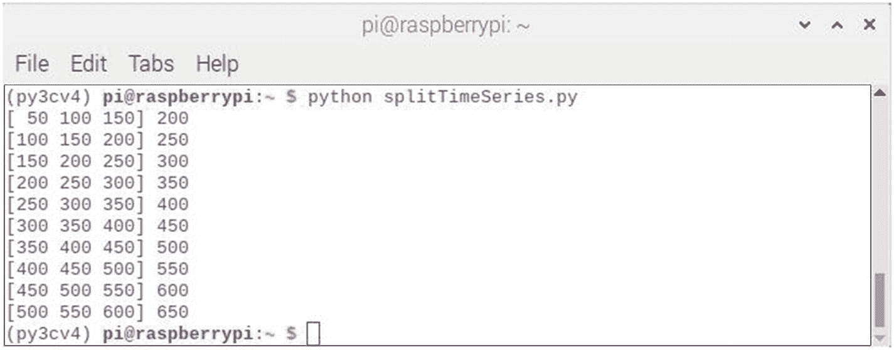

图 7-17

运行 splitTimeSeries 脚本后的结果

从图中可以看出，该脚本为 CNN 创建了十个学习实例。这应该足以训练 CNN 模型来有效地预测数据点。本演示的下一步是创建一个 CNN 模型。

#### 创建一个 CNN 模型

CNN 模型必须有一个 1D 输入/卷积图层来匹配 1D 应用的数据集。第一层之后是汇集层，它将对卷积层输出进行二次采样，以提取显著特征。然后，汇集层向全连接层提供信息，全连接层解释卷积层提取的特征。随后是另一个完全连接的图层，以帮助进一步定义要素，最后输出图层将要素地图简化为 1D 矢量。

这个模型的代码是

```py
# Define 1-D CNN model
model = Sequential()
model.add(Conv1D(filters=64, kernel_size=2, activation="relu", input_shape=(n_steps, n_features)))
model.add(MaxPooling1D(pool_size=2))
model.add(Flatten())
model.add(Dense(50, activation="relu"))
model.add(Dense(1))
model.compile(optimizer='adam', loss="mse")

```

卷积图层有两个参数，用于指定时间步长(间隔)的数量和预期的要素数量。单变量问题的特征数是 1。时间步长将与用于分割 1D 时间序列的时间步长相同，在本例中为 3。

输入数据集有多条记录，每条记录的形状维度为[样本、时间步长、要素]。

`split_sequence`函数为 X 向量提供了[样本，时间步长]的形状，这意味着必须对数据集进行整形，以添加额外的元素来覆盖多个要素。下面的代码片段正好完成了这种整形:

```py
n_features = 1
X = X.reshape(X.shape[0], X.shape[1], n_features))

```

该模型需要训练，这是使用传统的 Keras 拟合函数来完成的。因为这是一个简单的模型，并且与我演示的其他模型相比，数据集非常小，所以对于单个时期，训练将非常简短。这意味着可以使用大量的历元来尝试获得最佳性能模型。在这种情况下，这个数字是 1000。以下代码调用模型的拟合函数:

```py
model.fit(X, y, epochs=1000, verbose=0)

```

最后，Keras 预测函数将用于预测输入序列中的下一个值。例如，如果输入序列是{150，200，250 }，那么预测值应该是[300]。预测的代码是

```py
# Demonstrate prediction
x_input = array([150, 200, 250])
x_input = x_input.reshape((1, n_steps, n_features))
yhat = model.predict(x_input, verbose=0)

```

包含前面讨论的所有代码片段的完整脚本被命名为 univariateTimeSeriesTest.py，如下所示。它可以从该书的配套网站上获得。

```py
# Import required libraries
from numpy import array
from keras.models import Sequential
from keras.layers import Dense
from keras.layers import Flatten
from keras.layers.convolutional import Conv1D
from keras.layers.convolutional import MaxPooling1D

# Split a univariate sequence into samples
def split_sequence(sequence, n_steps):
    X, y = list(), list()
    for i in range(len(sequence)):
        # find the end of this pattern
        end_ix = i + n_steps
        # check if we are beyond the sequence
        if end_ix > len(sequence)-1:
            break
        # gather input and output parts of the pattern
        seq_x, seq_y = sequence[i:end_ix], sequence[end_ix]
        X.append(seq_x)
        y.append(seq_y)
    return array(X), array(y)

# Define input sequence
raw_seq = [50, 100, 150, 200, 250, 300, 350, 400, 450, 500, 550, 600, 650]

# Choose a number of time steps
n_steps = 3

# Split into samples

X, y = split_sequence(raw_seq, n_steps)

# Reshape from [samples, timesteps] into [samples, timesteps, features]
n_features = 1
X = X.reshape((X.shape[0], X.shape[1], n_features))

# Define 1-D CNN model
model = Sequential()
model.add(Conv1D(filters=64, kernel_size=2, activation="relu", input_shape=(n_steps, n_features)))
model.add(MaxPooling1D(pool_size=2))
model.add(Flatten())
model.add(Dense(50, activation="relu"))
model.add(Dense(1))
model.compile(optimizer='adam', loss="mse")

# Fit the model
model.fit(X, y, epochs=1000, verbose=0)

# Demonstrate prediction
x_input = array([150, 200, 250])
x_input = x_input.reshape((1, n_steps, n_features))
yhat = model.predict(x_input, verbose=0)
print(yhat)

```

使用以下命令运行此脚本:

```py
python univariateTimeSeriesTest.py

```

图 [7-18](#Fig18) 显示了运行该脚本的结果。


图 7-18

运行 univariateTimeSeriesTest 脚本后的结果

显示的预测值是 296.78，不像预期的那样是 300，但仍然相当接近。算法中有一定程度的随机性，我试着多运行几次。以下列表显示了十次重试的结果:

*   Two hundred and eighty-six point six eight

*   Two hundred and seventy-six point three five

*   Two hundred and seventy-nine point one five

*   Two hundred and ninety-nine point nine six

*   Two hundred and seventy-nine point six six

*   Two hundred and ninety-nine point eight six

*   Three hundred point zero seven

*   Two hundred and eighty-one point seven five

*   Two hundred and ninety-four point two

*   Three hundred point zero nine

从列表中可以看到，预期值(四舍五入)显示了十次中的四次。十个值的平均值为 289.78，标准偏差为 10.03，范围为 276.35 至 300.09。我认为这个 CNN 预测器和那些性能统计数据一样好。

#### 多元时间序列 CNN 模型

多变量时间序列与单变量时间序列相同，只是每个时间步长有多个采样值。有两种处理多元时间序列数据的模型类型:

*   多输入序列

*   多重并联系列

将分别讨论每种模型类型。

##### 多输入序列

我将首先解释多输入序列具有并行输入时间序列，这不要与其他模型类型相混淆。这一点马上就清楚了。该并行时间序列的值在采样时间步长进行采样。例如，考虑以下几组原始时间序列值:

*   [50, 100, 150, 200, 250, 300, 350, 400, 450, 500, 550, 600, 650]

*   [50, 75, 100, 125, 150, 175, 200, 225, 250, 275, 300, 325, 350]

输出序列将是每个序列的整个长度的每个采样值对的总和。在代码中，上述内容将表示为

```py
from numpy import array
in_seq1 = array([50, 100, 150, 200, 250, 300, 350, 400, 450, 500, 550, 600, 650])
in_seq2 = array([50,   75, 100, 125, 150, 175, 200, 225, 250, 275, 300, 325, 350])
out_seq = array([in_seq1[i] + in_seq2[i] for i in range(in_seq1))])

```

这些阵列必须像上一个演示中所做的那样进行整形。为了处理，列也必须水平堆叠。完成所有工作的代码段

```py
# Convert to [rows, columns] structure
in_seq1 = in_seq1.reshape((len(in_seq1), 1))
in_seq2 = in_seq2.reshape((len(in_seq2), 1))
out_seq = out_seq.reshape((len(out_seq), 1))

# Horizontally stack columns
dataset = hstack((in_seq1, in_seq2, out_seq))

```

##### 预处理数据集

前面描述的预处理数据集的完整脚本名为 shapeMultivariateTimeSeries.py，如下所示。它可以从该书的配套网站上获得。

```py
# Multivariate data preparation
from numpy import array
from numpy import hstack

# Define input sequences
in_seq1 = array([50, 100, 150, 200, 250, 300, 350, 400, 450, 500, 550, 600, 650])
in_seq2 = array([50,  75, 100, 125, 150, 175, 200, 225, 250, 275, 300, 325, 350])
out_seq = array([in_seq1[i]+in_seq2[i] for i in range(len(in_seq1))])

# Convert to [rows, columns] structure
in_seq1 = in_seq1.reshape((len(in_seq1), 1))
in_seq2 = in_seq2.reshape((len(in_seq2), 1))
out_seq = out_seq.reshape((len(out_seq), 1))
# Horizontally stack columns
dataset = hstack((in_seq1, in_seq2, out_seq))

# Display the datasets
print(dataset)

```

使用以下命令运行此脚本:

```py
python shapeMultivariateTimeSeries.py

```

图 [7-19](#Fig19) 显示了运行该脚本的结果。

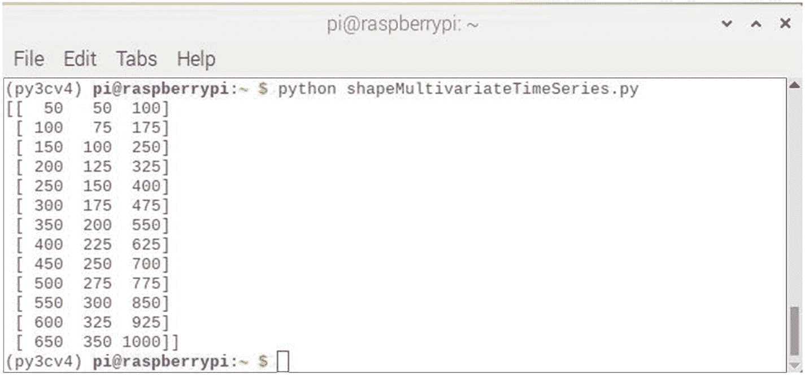

图 7-19

运行 shapeMultivariateTimeSeries 脚本后的结果

结果屏幕显示数据集，每个时间步长一行，两个输入的列，以及并行时间序列中每个元素的总输出。

这种重新整形的原始数据向量现在必须分成输入/输出样本，就像对单变量时间序列所做的那样。1D CNN 模型需要足够的输入来学习从输入序列到输出值的映射。需要将数据分成样本，以保持两个输入序列的观察顺序。

如果选择了三个输入时间步长，则第一个样本将如下所示:

输入:

*   50, 50

*   100, 75

*   150, 100

输出:

*   Two hundred and fifty

每个并行序列的前三个时间步长作为输入提供给模型，模型将其与输出序列中第三个时间步长的值相关联，在本例中为 250。

很明显，在将时间序列转换为输入/输出样本以训练模型时，一些数据将被丢弃。选择输入时间步长的数量将对最终使用多少训练数据产生很大影响。一个名为`split_sequences`的函数将获取之前成形的数据集，并返回所需的输入/输出样本。下面的代码实现了`split_sequences` *功能* *:*

```py
# split a multivariate sequence into samples
def split_sequences(sequences, n_steps):
    X, y = list(), list()
    for i in range(len(sequences)):
        # find the end of this pattern
        end_ix = i + n_steps
        # check if we are beyond the dataset
        if end_ix > len(sequences):
            break
        # gather input and output parts of the pattern
        seq_x, seq_y = sequences[i:end_ix, :-1], sequences[end_ix-1, -1]
        X.append(seq_x)
        y.append(seq_y)
    return array(X), array(y)

```

下面的代码测试了前面所有的代码片段和函数。我将这个脚本命名为 splitMultivariateTimeSeries.py，它可以从本书的配套网站上获得。

```py
# Import required libraries
from numpy import array
from numpy import hstack

# Split a multivariate sequence into samples
def split_sequences(sequences, n_steps):
    X, y = list(), list()
    for i in range(len(sequences)):
        # find the end of this pattern
        end_ix = i + n_steps
        # check if we are beyond the dataset
        if end_ix > len(sequences):
            break
        # gather input and output parts of the pattern
        seq_x, seq_y = sequences[i:end_ix, :-1], sequences[end_ix-1, -1]
        X.append(seq_x)
        y.append(seq_y)
    return array(X), array(y)

# Define input sequences
in_seq1 = array([50, 100, 150, 200, 250, 300, 350, 400, 450, 500, 550, 600, 650])
in_seq2 = array([50,  75, 100, 125, 150, 175, 200, 225, 250, 275, 300, 325, 350])
out_seq = array([in_seq1[i]+in_seq2[i] for i in range(len(in_seq1))])

# Convert to [rows, columns] structure
in_seq1 = in_seq1.reshape((len(in_seq1), 1))
in_seq2 = in_seq2.reshape((len(in_seq2), 1))
out_seq = out_seq.reshape((len(out_seq), 1))

# Horizontally stack columns
dataset = hstack((in_seq1, in_seq2, out_seq))

# Choose a number of time steps
n_steps = 3

# Convert into input/output samples
X, y = split_sequences(dataset, n_steps)
print(X.shape, y.shape)

# Display the data
for i in range(len(X)):
    print(X[i], y[i])

```

使用以下命令运行此脚本:

```py
python splitMultivariateTimeSeries.py

```

图 [7-20](#Fig20) 显示了运行该脚本的结果。

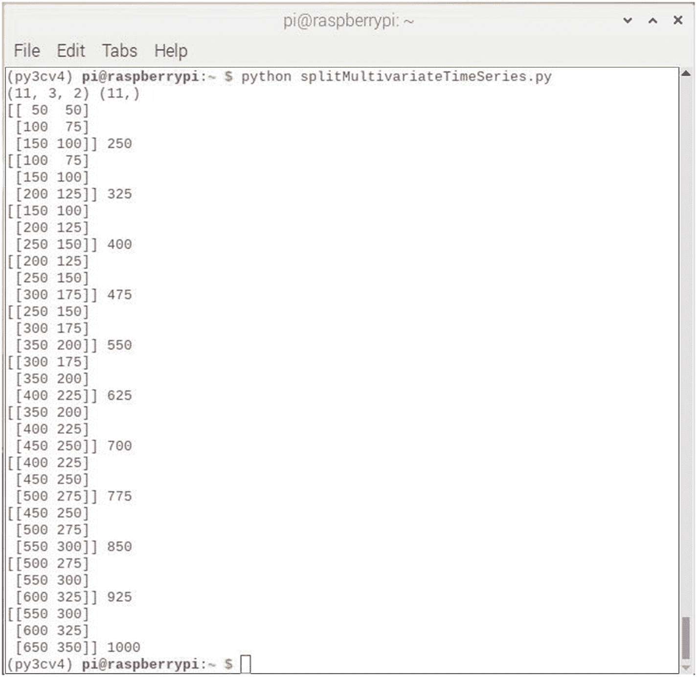

图 7-20

运行 splitMultivariateTimeSeries 脚本后的结果

运行该脚本首先显示了组件 *X* 和 *y* 的形状。你可以看到 *X* 组件有一个 3D 结构。第一维是样本的数量，在本例中是 11。第二个维度是每个样本的时间步数，在本例中为 3，最后一个维度指定并行时间序列的数量或变量的数量，在本例中为 2，用于两个并行序列。图中剩余部分所示的数据集是 1D CNN 输入所期望的精确 3D 结构。

用于本演示的模型与用于单变量演示的模型完全相同。我对该模型的讨论适用于这种情况。

如果输入值为，Keras 预测函数将用于预测输出序列中的下一个值

*   200, 125

*   300, 175

*   400, 225

预测值应该是 625。预测的代码是

```py
# Demonstrate prediction
x_input = array([[200, 125], [300, 175], [400, 225]])
x_input = x_input.reshape((1, n_steps, n_features))
yhat = model.predict(x_input, verbose=0)

```

包含前面讨论的所有代码片段的完整脚本被命名为 multivariateTimeSeriesTest.py，如下所示。它可以从该书的配套网站上获得。

```py
# Import required libraries
from numpy import array
from numpy import hstack
from keras.models import Sequential
from keras.layers import Dense
from keras.layers import Flatten
from keras.layers.convolutional import Conv1D
from keras.layers.convolutional import MaxPooling1D

# Split a multivariate sequence into samples
def split_sequences(sequences, n_steps):
    X, y = list(), list()
    for i in range(len(sequences)):
        # Find the end of this pattern
        end_ix = i + n_steps
        # Check if we are beyond the dataset
        if end_ix > len(sequences):
            break
        # Gather input and output parts of the pattern
        seq_x, seq_y = sequences[i:end_ix, :-1], sequences[end_ix-1, -1]
        X.append(seq_x)
        y.append(seq_y)
    return array(X), array(y)

# Define input sequence

in_seq1 = array([50, 100, 150, 200, 250, 300, 350, 400, 450, 500, 550, 600, 650])
in_seq2 = array([50,  75, 100, 125, 150, 175, 200, 225, 250, 275, 300, 325, 350])
out_seq = array([in_seq1[i]+in_seq2[i] for i in range(len(in_seq1))])

# Convert to [rows, columns] structure
in_seq1 = in_seq1.reshape((len(in_seq1), 1))
in_seq2 = in_seq2.reshape((len(in_seq2), 1))
out_seq = out_seq.reshape((len(out_seq), 1))

# Horizontally stack columns
dataset = hstack((in_seq1, in_seq2, out_seq))

# Choose a number of time steps
n_steps = 3

# Convert into input/output samples
X, y = split_sequences(dataset, n_steps)

# The dataset knows the number of features, e.g. 2
n_features = X.shape[2]

# Define model
model = Sequential()
model.add(Conv1D(filters=64, kernel_size=2, activation="relu", input_shape=(n_steps, n_features)))
model.add(MaxPooling1D(pool_size=2))
model.add(Flatten())
model.add(Dense(50, activation="relu"))
model.add(Dense(1))
model.compile(optimizer='adam', loss="mse")

# Fit model
model.fit(X, y, epochs=1000, verbose=0)

# Demonstrate prediction
x_input = array([[200, 125], [300, 175], [400, 225]])
x_input = x_input.reshape((1, n_steps, n_features))
yhat = model.predict(x_input, verbose=0)

# Display the prediction

print(yhat)

```

使用以下命令运行此脚本:

```py
python multivariateTimeSeriesTest.py

```

图 [7-21](#Fig21) 显示了运行该脚本的结果。


图 7-21

运行 multivariateTimeSeriesTest 脚本后的结果

显示的预测值是 616.74.78，不像预期的那样是 625，但仍然相当接近。算法中有一定程度的随机性，我试着多运行几次。以下列表显示了十次重试的结果:

*   Five hundred and eighty-six point nine three

*   Six hundred and ten point eight eight

*   Six hundred and six point eight six

*   Five hundred and ninety-three point three seven

*   Six hundred and twelve point six six

*   Six hundred and four point eight eight

*   Five hundred and ninety-seven point four

*   Five hundred and seventy-seven point four six

*   Six hundred and five point five

*   Six hundred and five point nine four

十个值的平均值为 600.19，标准偏差为 11.28，范围为 577.46 至 612.66。根据这些性能统计数据，我认为 CNN 预测器相当不错。