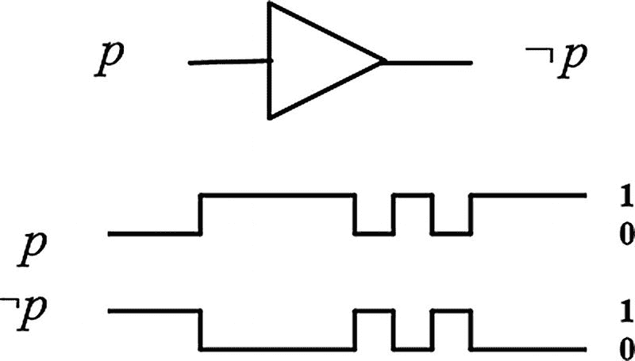
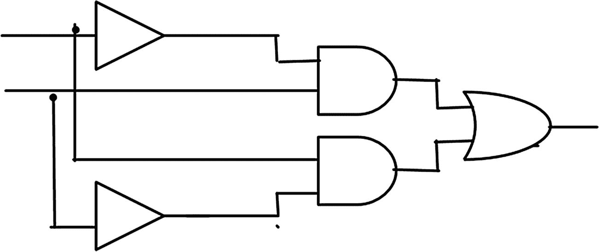
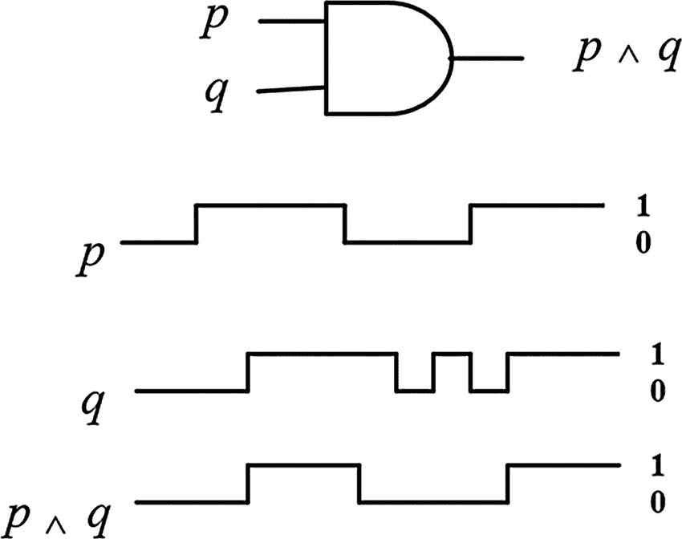
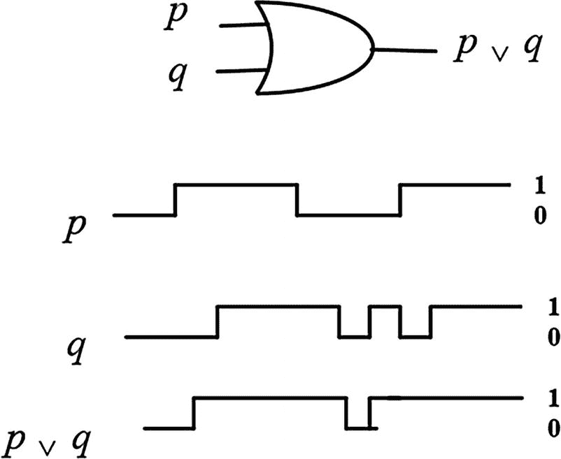
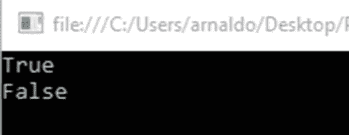
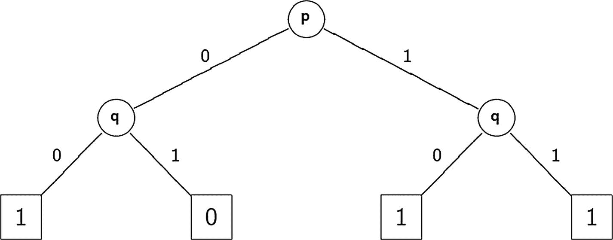

# 1.逻辑与人工智能

在这一章中，我们将介绍一个不仅对人工智能(AI)世界，而且对许多其他知识领域都至关重要的主题，如数学、物理、医学、哲学等等。自古以来，亚里士多德、欧几里德和柏拉图等伟大的哲学家以及一些有史以来最伟大的数学家都对它进行了深入的研究和形式化。诞生于人类早期，它代表了一种基本的工具，使科学蓬勃发展到今天的地步。它澄清和理顺我们复杂的人类思维，给我们有时混乱的思想带来秩序。

逻辑，这个我们到目前为止一直提到的问题，将是本章的主要焦点。我们将解释它的一些基本概念、概念和分支，以及它与计算机科学和人工智能的关系。这个主题对于理解本书中涉及的许多概念是非常重要的。再者，没有逻辑，如何才能创造出像样的人工智能？逻辑指导我们头脑中的理性；因此，如果我们绕过存在于我们“天然”智能中的极其重要的元素(逻辑),并在许多情况下支配决策——或者，准确地说，是理性决策——我们怎么能创造出我们大脑的人工版本呢？

命题逻辑；一阶逻辑；实际问题，我们将学习如何创建一个逻辑框架，如何使用一种称为 DPLL 的杰出算法解决 SAT(可满足性)问题，以及如何使用一阶逻辑组件编写第一个简单、天真的清洁机器人——这些主题将使我们从本书开始。

Note

逻辑可以分为数学逻辑、哲学逻辑、计算逻辑、布尔逻辑、模糊逻辑、量子逻辑等等。在这本书里，我们将讨论计算逻辑，这个领域与计算机科学和逻辑必然重叠的领域相关。

## 什么是逻辑？

直觉上，我们都知道什么是逻辑，逻辑在我们的日常生活中有多有用。尽管有这种逻辑的常识或文化概念，但令人惊讶的是，在科学界，什么是逻辑却没有正式的或全球性的定义(截至今天)。

在从其创始人那里寻找定义时，我们可以追溯到它的根源，并发现逻辑一词实际上来自古希腊语 logike，意思是“概念、想法或思想”。

一些理论家将逻辑定义为“思维的科学”尽管这个定义似乎是我们通常与逻辑联系在一起的一个体面的近似，但它不是一个非常准确的定义，因为逻辑不是唯一与思想和推理研究相关的科学。事实是，这个主题在所有其他科学的基础上是如此根深蒂固，以至于很难为它提供一个正式的定义。

在这本书里，我们将把逻辑视为形式化人类推理的一种方式。

由于计算逻辑是与计算机科学相关的逻辑分支，我们将描述这个主题的一些重要概念。最终，这里描述的概念将在整本书和将要提出的每个实际问题中有用。

Note

逻辑在计算机科学中有着广泛的应用:在处理器级通过逻辑门，在硬件和软件验证中如浮点运算，在高级编程中如约束编程，以及在人工智能中如计划、调度、代理控制等等。

## 命题逻辑

在日常生活和人类交流过程中，我们不断地听到具有某种意义的语言表达；在这些命题中，我们可以找到命题。

命题是可以根据其真实性分类的陈述(真或 1，假或 0，等等)。)或根据它们的形态(可能的、不可能的、必要的等等。).每一个命题都表达了代表其意义和内容的某种思想。由于我们语言中的表达方式多种多样，它们可以分为叙述式、感叹式、疑问式等等。在本书中，我们将关注第一种类型的命题，叙事，这是判断的表达，从这一点开始，我们将简单地称它们为命题。

下面列出了几个命题的例子:

1.  "吸烟损害你的健康。"
2.  "迈克尔·乔丹是有史以来最伟大的篮球运动员."
3.  "爵士乐是世界上最酷的音乐类型。"
4.  “100 大于 1。”
5.  "哈瓦那有美丽的海滩。"
6.  "第二次世界大战于 1945 年结束。"
7.  “我听斯汀的音乐。”
8.  "我将朗读西班牙诗人拉法埃尔·阿尔维蒂的诗。"

这些都是简单的或原子的命题，我们可以在任何普通的一天，任何普通的谈话中使用。为了增加复杂性并将它们转化为更有意义的东西，我们可以依靠复合命题，复合命题是通过连接简单命题(如前面列出的那些)的逻辑连接器获得的。

因此，从刚刚列出的命题中，我们可以得到下面的(不一定正确或有意义的)复合命题。

1.  "哈瓦那没有美妙的海滩。"
2.  "吸烟有害健康，100 大于 1 . "
3.  "迈克尔·乔丹是有史以来最伟大的篮球运动员，还是在 1945 年结束的第二次世界大战中."
4.  "如果爵士乐是世界上最酷的音乐类型，那么我会听斯汀的音乐."
5.  "我会读西班牙诗人拉法埃尔·阿尔维蒂的诗，当且仅当 100 大于 1 . "

在这些情况下，逻辑连接词以大写字母显示，并由单词或短语“NOT”、“and”、“or”、“IF …THEN”和“IF AND ONLY IF”表示。

简单或原子命题用字母(p，q，r 等)表示。)称为命题变量。我们可以将前面的一些命题命名如下:

1.  p = "吸烟损害你的健康。"
2.  迈克尔·乔丹是有史以来最伟大的篮球运动员。
3.  r = "爵士乐是世界上最酷的音乐类型。"
4.  s = "100 大于 1。"

一个命题可以是真(1)或假(0)，这取决于组成它的命题的真值，这个命题被称为公式。请注意，公式可以很简单；换句话说，它可以由一个命题组成。因此，每个命题都被认为是一个公式。

命题逻辑的语法受以下规则支配:

1.  所有变量和命题常数(真，假)都是公式。
2.  如果 F 是一个公式，那么 NOT F 也是一个公式。
3.  如果 F，G 是公式那么 F 和 G，F 或 G，F => G，F <=> G 也表示公式。

公式 F 的解释是 F 中出现的每个命题变量的真值分配，并确定 F 的真值。由于每个变量总是有两个可能的值(真、假或 1，0)，那么 F 的解释总数是 2 <sup>n</sup> 其中 n 是 F 中出现的变量总数

对每一种解释都成立的命题被称为重言式或逻辑法则。

对于每一种解释都为假的命题被称为矛盾的或不可满足的。

我们将对研究组合命题的真值以及如何计算它们感兴趣。在可满足性问题中，我们接收一个公式作为输入，通常是一种特殊的、标准化的形式，称为合取范式(很快将详细介绍)，我们将尝试为其原子命题分配真值，因此公式变为真(1)；如果这样的赋值存在，我们说公式是可满足的。这是计算机科学中的一个经典问题，将在本章中讨论。

在下一节中，我们将仔细研究逻辑连接词，因为它们是建立公式最终真值的决定因素。

## 逻辑连接词

通常，逻辑连接词用以下符号表示:

*   `¬`表示否定(“非”)
*   ∧表示连词(“和”)
*   `∨`表示`disjunction (“OR”)`
*   = >表示隐含意义(“如果…那么”)
*   <=>表示双重含义或等价(“如果且仅如果”)

逻辑连接词充当一元或二元(接收一个或两个参数)函数，其输出可以是 1(真)或 0(假)。为了更好地理解每个连接词和每个可能的输入的输出是什么，我们依赖真值表。

Note

波浪号(~)也用于表示否定。

在真值表中，列对应于变量和输出，行对应于每个命题变量的每种可能的值组合。我们将在接下来的小节中看到每个连接词的详细真值表。

### 否认

如果我们有一个命题 p，那么它的否定表示为 p。这是一个一元逻辑连接词，因为它需要一个单一的命题作为输入。

让我们试着否定以前提出的一些命题:

1.  "吸烟不会损害你的健康。"
2.  "迈克尔·乔丹并不是有史以来最伟大的篮球运动员."
3.  "爵士乐不是世界上最酷的音乐类型。"
4.  “100 不大于 1。”
5.  "哈瓦那没有美妙的海滩。"
6.  "第二次世界大战并没有在 1945 年结束。"

否定连接词的真值表如下(表 [1-1](#Tab1) )。

表 1-1

Truth Table for Negation Logical Connective

<colgroup><col align="left"> <col align="left"></colgroup> 
| p | 寻 |
| :-- | :-- |
| one | Zero |
| Zero | one |

从表 [1-1](#Tab1) 我们可以看出，如果一个命题 p 为真(1)，那么它的否定(`¬` p)为假(0)，反之亦然，如果命题为假。

### 结合

如果我们有命题 p，q，那么它们的合取表示为 p ∧ q(读作 p 和 q)。这是一个二元逻辑连接词；它需要两个命题作为输入。

前面命题的合取可以通过简单地使用 AND 词来获得，如下所示:

1.  "吸烟有害健康，我将朗读西班牙诗人拉法埃尔·阿尔维蒂的诗."
2.  “迈克尔·乔丹是有史以来最伟大的篮球运动员，爵士乐是世界上最酷的音乐类型。”
3.  " 100 大于 1，哈瓦那有美丽的海滩."

连词的真值表如表 [1-2](#Tab2) 所示。

表 1-2

Truth Table for the Conjunction Logical Connective

<colgroup><col align="left"> <col align="left"> <col align="left"></colgroup> 
| p | q | p-q 型 |
| :-- | :-- | :-- |
| one | Zero | Zero |
| Zero | one | Zero |
| Zero | Zero | Zero |
| one | one | one |

表 [1-2](#Tab2) 允许我们看到只有当 p 和 q 同时为真时 p ∧ q 才为真。

### 分离

如果我们有命题 p，q，那么它们的析取表示为 p∞q(读作 p 或 q)。这是一个二元逻辑连接词；它需要两个命题作为输入。

前面命题的析取可以通过简单地使用 OR 词来获得，如下所示:

1.  "我会读西班牙诗人拉法埃尔·阿尔维蒂的诗，或者听斯汀的音乐."
2.  “迈克尔·乔丹是有史以来最伟大的篮球运动员，或者说爵士乐是世界上最酷的音乐类型。”
3.  "第二次世界大战于 1945 年结束，或者哈瓦那有美丽的海滩."

连接词的真值表如下(表 [1-3](#Tab3) )。

表 1-3

Truth Table for the Disjunction Logical Connective

<colgroup><col align="left"> <col align="left"> <col align="left"></colgroup> 
| p | q | p ∨ q |
| :-- | :-- | :-- |
| one | Zero | one |
| Zero | one | one |
| Zero | Zero | Zero |
| one | one | one |

从表 [1-3](#Tab3) 我们可以看到，当 p 或 q 为真时，p ∨ q 为真。

### 含义

数学中无数的表达式被表述为一个蕴涵；即以“如果”的方式。。。然后。”如果我们有命题 p，q，那么它们的蕴涵表示为 p => q(读作 p 蕴涵 q)。这是一个二元逻辑连接词；它需要两个命题作为输入，并表明从 p 的准确性，我们推出 q 的准确性。

我们说 q 是 p 为真的必要条件，p 是 q 为真的充分条件。

隐含连接器类似于我们在许多命令式编程语言(如 C#、Java 或 Python)中发现的条件语句(`if`)。为了理解连接词产生的输出，让我们考虑以下命题:

*   约翰很聪明。
*   约翰去了剧院。

一个隐含的 p => q 将被写成“如果约翰是聪明的，那么他去剧院。”让我们分析 p，q 值的每一种可能的组合，以及从连接词中得到的结果。

情况 1，其中 p = 1，q = 1。在这种情况下，约翰是聪明的，他去剧院；所以 p => q 为真。

情况 2，其中 p = 1，q = 0。在这种情况下，约翰是聪明的，但不去剧院；因此，p => q 为假。

情况 3，其中 p = 0，q = 1。在这种情况下，约翰并不聪明，尽管他去了剧院。既然 p 为假，p => q 只表示 p = John 有智能时会发生什么，那么命题 p => q 不被否定；因此，这是真的。

情况 4，其中 p = 0，q = 0。在这种情况下，约翰不聪明，不去剧院。由于 p 为假，而 p => q 只表示 p 为真时会发生什么，那么 p => q 为真。

一般来说，每当 p = 0 时，命题 p => q 为真，因为如果条件 p 不成立(约翰很聪明)，那么结果(约翰去剧院)可能是任何事情。它可以被解释为“如果约翰很聪明，那么他会去剧院”；否则，“如果约翰不聪明，那么任何事情都可能发生，”这是真的。

隐含连接词的真值表如表 [1-4](#Tab4) 所示。

表 1-4

Truth Table for the Implication Logical Connective

<colgroup><col align="left"> <col align="left"> <col align="left"></colgroup> 
| p | q | p => q |
| :-- | :-- | :-- |
| one | Zero | Zero |
| Zero | one | one |
| Zero | Zero | one |
| one | one | one |

当 p 为假或 p 和 q 都为真时，命题 p => q 为真。

### 相等

命题 p，q 被称为是等价的，表示为 p <=> q(读作 p 等价于 q 或 p 当且仅当 q)，如果发生 p => q 和 q => p 都有相同的值。

只有当命题 p，q 具有相同的值时，双重蕴涵或等价连接词才会输出 True。

等效连接词的真值表见表 [1-5](#Tab5) 。

表 1-5

Truth Table for the Equivalence Logical Connective

<colgroup><col align="left"> <col align="left"> <col align="left"></colgroup> 
| p | q | p <=> q |
| :-- | :-- | :-- |
| one | Zero | Zero |
| Zero | one | Zero |
| Zero | Zero | one |
| one | one | one |

考虑命题 p、q、r，等价连接词满足以下性质:

*   反身性
*   传递性:如果 p <=> r 和 r <=> q 那么 p <=> q
*   对称性:如果 p <=> q，那么 q <=> p

蕴涵连接词和等价连接词在数学和计算逻辑中都非常重要，它们代表了数学定理的基本逻辑结构。随着本书的深入，人工智能、逻辑连接词和一般逻辑之间的关系将变得更加明显。

## 命题逻辑定律

既然我们已经熟悉了所有的逻辑连接词，让我们介绍一系列逻辑等价和蕴涵，因为它们的重要性，被认为是命题逻辑的法则。在这种情况下，p，q，r 都是公式，我们将用≡符号来表示 p <=> q 是重言式；也就是说，在 p，q 的任何一组值下(任何解释)都是正确的。在这种情况下，我们说 p 和 q 在逻辑上是等价的。这个符号类似于算术中使用的等号，因为它的意思是相似的，但在逻辑层次上。p ≡ q 基本上意味着当接收相同的输入时，p 和 q 将总是具有相同的输出(每个变量的真值)。

逻辑等价:

1.  p ∨ p ≡ p(幂等定律)
2.  p ∧ p ≡ p(幂等定律)
3.  [p ∨ q] ∨ r ≡ p ∨ [q ∨ r](结合律)
4.  [p ∧ q] ∧ r ≡ p ∧ [q ∧ r](结合律)
5.  p ∨ q ≡ q ∨ p(交换律)
6.  p ∧ q ≡ q ∧ p(交换律)
7.  p∧[q`∨`r]8801[p∧q]∨[ p`∧`r](˄上的分配律)
8.  p∨[q∧r]8801[p∨q]∧[p∨r](˅上的分配律)
9.  p ∨ [p ∧ q] ≡ p
10.  p ∧ [p ∨ q] ≡ p
11.  p ∨ 0 ≡ p
12.  p ∧ 1 ≡ p
13.  p ∨ 1 ≡ 1
14.  p ∧ 0 ≡ 0
15.  p ∨ `¬` p ≡ 1
16.  p ∧ p ≡ 0(矛盾)
17.  `¬` [ `¬` p] ≡ p(双重否定)
18.  `¬` 1 ≡ 0
19.  `¬` 0 ≡ 1
20.  [p ∨ q] ≡ p ∧ q(德摩根定律)
21.  [p ∧ q] ≡ p ∨ q(德摩根定律)
22.  p => q ≡ p ∨ q(定义= >)
23.  [p<=>q]8801[p = > q]∧[q = > p](定义<=>)

请注意在前面的一些公式中使用了括号。正如数学中出现的那样，括号可用于将变量及其连接词组合在一起，以表示顺序相关性、与逻辑连接词的关联等。例如，具有类似 p `∨` [q `∧` r]的公式表明子公式 q ∧ r 的结果将与析取逻辑连接词和变量 p 连接。

与我们引入≡符号来说明 p，q 在逻辑上等价一样，我们现在引入`≈`符号来表示 p，q 在逻辑上是隐含的，写成 p ≈ q。如果它们在逻辑上是隐含的，那么 p = > q 一定是重言式。

逻辑含义:

1.  p≈q = >[p〖t 0〗q]
2.  【p = > q]【q =>r】【p =>q
3.  设置= = =字架= = = =-
4.  [p = > q]【p =>q】【q】
5.  【p = > r]【q =>r】【p`∨`【q]=>r
6.  找到=-(q 130 使用范围内绘制)
7.  p =-(q 130 使用一个串字描述)
8.  找到= = =本字架=-
9.  p = =本本字幕=-
10.  p = >[q =]>[r`∧`r]][p =]t1]q
11.  [p]t0[q]=>【q】=>q
12.  [p]t0[q]=>p =>q
13.  【p = > q]【p =>r】【q】`∨`r
14.  □p = > q□□□□□□□□□□□
15.  p = > q`∨`p
16.  p〔t 0〕q
17.  p〔t 0〕q□
18.  p = q = > p

这些定律中的许多非常直观，并且可以通过找到所涉及的变量的所有可能值和每个公式的最终结果来容易地证明。例如，等价性[p `∨` q] ≡ p `∧` q，即德摩根定律，可以通过考虑真值表中 p，q 的每个可能值来证明，如表 [1-6](#Tab6) 所示。

表 1-6

Truth Table Verifying ¬[p `∨` q] ≡ ¬p `∧` ¬q

<colgroup><col align="left"> <col align="left"> <col align="left"> <col align="left"></colgroup> 
| p | q | [p ∨ q] | 寻找(r) |
| :-- | :-- | :-- | :-- |
| Zero | Zero | one | one |
| Zero | one | Zero | Zero |
| one | Zero | Zero | Zero |
| one | one | Zero | Zero |

到目前为止，我们已经介绍了计算逻辑的一些基本主题。在这一点上，读者可能想知道命题逻辑和人工智能之间的关系可能是什么。首先，命题逻辑和一般逻辑是与 AI 相关的许多领域的基础领域。我们的大脑充斥着逻辑决策，我们每一步都做出 On (1) / Off (0)的定义，并且在许多情况下，这些定义都被我们的“内置”逻辑所证明。因此，因为人工智能试图在某种程度上模仿我们的人脑，所以我们必须理解逻辑以及如何操作逻辑，以便在未来创造出坚实、有逻辑的人工智能。在接下来的几节中，我们将继续我们对命题逻辑的研究，我们将最终瞥见一个实际问题。

## 范式

在检查可满足性时，某些类型的公式比其他类型的公式更容易使用。在这些公式中，我们可以找到标准形式。

*   否定范式(NNF)
*   合取范式(CNF)
*   析取范式(DNF)

我们将假设所有的公式都是无蕴涵的；即每一个蕴涵 p => q 都被转换成等价的 p `∨` q

如果一个公式的变量是唯一被否定的子公式，则称该公式为否定范式。每一个公式都可以转换成一个等价的 NNF 使用逻辑等价 17，20 和 21 在前面的部分。

Note

范式在自动定理证明(也称为自动演绎或 ATP)中是有用的，这是自动推理的一个子领域，同时也是人工智能的一个子领域。ATP 致力于通过计算机程序证明数学定理。

如果一个公式的形式为(p1 ∧ p2 … ∨ pn) ∧ (q1 ∨ q2 … ∨ qm)则称其为合取范式，其中每个 pi，qj 或者是一个命题变量，或者是一个命题变量的否定。CNF 是变量析取的合取，利用命题逻辑法则，每个 NNF 都可以转化为 CNF。

如果一个公式的形式为(p1 ∧ p2 … ∧ pn) ∨ (q1 ∧ q2 … ∨ qm)则称其为析取范式，其中每个 pi，qj 或者是命题变量，或者是命题变量的否定。DNF 是变量合取的析取，利用命题逻辑法则，每个 NNF 也可以转化为 CNF。

在本章的最后，我们将考察几个实际问题，我们将描述计算 NNF 和 CNF 的算法；我们还会看看范式和 ATP 之间的关系。

Note

数学对象的规范或标准形式是表示它的标准方式。规范形式表明每个对象都有一种独特的表示方式；范式不涉及唯一性特征。

## 逻辑电路

到目前为止，关于命题逻辑的主题在设计问题中有应用，更重要的是，在数字逻辑电路中有应用。这些执行逻辑二价功能的电路用于处理数字信息。

此外，人类创造的最重要的逻辑机器(计算机)使用逻辑电路在基本水平上运行。

计算机是人工智能容器的最基本、最经典的例子，它接收输入数据(作为 1 和 0 的二进制流)。它使用逻辑和算术处理信息(就像我们的大脑一样)，最后它提供一个输出或动作。计算机的核心是 CPU(中央处理器)，它由 ALU(算术逻辑单元)和 CU(控制单元)组成。ALU——因此也是整个计算机——使用带有符号 1 和 0 的二进制语言来处理数字形式的信息。这些符号被称为位，是计算机中信息的基本单位。

逻辑电路是我们当前计算机的主要技术组成部分之一，到目前为止，本章所描述的每一个逻辑连接在电子学领域都被称为逻辑门。

逻辑门是数字电路中用于计算的开关结构。它能够根据输入产生可预测的输出。通常，输入是表示为 0 和 1 的两个选定电压之一。0 表示低电压，1 表示高电压。该范围在发射极耦合逻辑的 0.7 伏和继电器逻辑的大约 28 伏之间。

Note

被称为神经元的神经细胞以更复杂但类似于逻辑门的方式发挥作用。神经元具有用于传递信号的树突和轴突结构。神经元从其树突接收一组输入，将它们以加权和的形式关联，并根据输入信号的频率类型在轴突中产生输出。与逻辑门不同，神经元是可适应的。

我们输入计算机的每一条信息(键盘上的字符、图像等等)最终都被转换成 0 和 1。然后，这些信息通过逻辑电路以不连续或不连续的方式传送。如图 [1-1](#Fig1) 所示，信息流是由高(1)和低(0)电压电平构成的电脉冲产生的连续信号。


图 1-1

Digital information flow

ALU 中的逻辑电路通过执行适当的逻辑门(AND、OR 等)来转换接收到的信息。因此，输入信息所经受的任何转换都可以用命题逻辑来描述。电路是用来连接各种基本电子元件的。我们将把每个电子元件和它所代表的操作抽象成图 [1-2](#Fig2) 、 [1-3](#Fig3) 和 [1-4](#Fig4) 所示的图之一。



图 1-2

Representation of negation component (NOT)

在图 [1-5](#Fig5) 中，作为逻辑电路的第一个例子，我们可以看到一个二进制比较器。该电路接收两个输入 p、q(位),如果 p 和 q 相等，则输出 0；否则，它输出 1。为了验证图 [1-5](#Fig5) 所示图表的输出是正确的，并且实际上代表了一个二进制比较器，我们可以检查输入位 p、q 的所有可能值，并检查相应的结果。

对电路的简单分析将告诉我们，每当输入 p、q 具有不同的值时，每个值都将沿着一条路径被求反，而另一个位保持不变。这将激活一个合取门，为其输出 1；因此，最终的析取门也将输出 1，并且这些位将不被认为是相等的。简而言之，当两个输入相等时，输出将是 1，如果输入不相等，输出将是 0。



图 1-5

Binary comparer circuit



图 1-4

Representation of conjunction component (AND)



图 1-3

Representation of disjunction component (OR)

现在我们已经学习了与命题逻辑相关的各种话题，是时候介绍第一个实际问题了。在下一节中，我们将介绍一种用 C#来表示逻辑公式的方法，使用这种强大的语言提供的工具。我们还将看到如何使用二叉决策树找到公式的所有可能输出。

## 实际问题:使用继承和 C#运算符计算逻辑公式

到目前为止，我们已经学习了命题逻辑的基础，在这一节我们将提出第一个实际问题。我们将创建一组类，所有的类都通过继承联系在一起，这将允许我们从预先定义的输入中获得任何公式的输出。这些类将使用结构递归。

在结构递归中，类所展示的结构——也就是对象——本身就是递归的。在这种情况下，递归将出现在来自`Formula`类及其后代的方法中。使用递归，我们将在整个层次结构树中调用方法。C#中的继承将通过调用方法的正确版本(对应于类所表示的逻辑门的版本)来帮助递归。

在清单 [1-1](#Par173) 中，显示了我们公式设计中所有其他类的父类。

```py
public abstract class Formula
{
     public abstract bool Evaluate();
     public abstract IEnumerable<Variable> Variables();
}
Listing 1-1Abstract Class Formula

```

抽象的`Formula`类声明它的所有后代必须实现一个布尔方法`Evaluate()`和一个 T2 方法`Variables()`。第一个函数将返回公式的计算结果，第二个函数将返回公式中包含的变量。`Variable`类将很快出现。

因为二进制逻辑门共享一些特性，我们将创建一个抽象类来分组这些特性，并创建一个更简洁的逻辑继承设计。在清单 [1-2](#Par176) 中可以看到的`BinaryGate`类将包含每个二进制门共有的相似性。

```py
public abstract class BinaryGate : Formula
  {
        public Formula P { get; set; }
        public Formula Q { get; set; }

        public BinaryGate(Formula p, Formula q)
        {
            P = p;
            Q = q;
        }

        public override IEnumerable<Variable> Variables()
        {
            return P.Variables().Concat(Q.Variables());
        }
    }

Listing 1-2Abstract Class BinaryGate

```

在清单 [1-3](#Par178) 中，显示了第一个逻辑门，即与门。

```py
public class And: BinaryGate
    {
        public And(Formula p, Formula q): base(p, q)
        { }

        public override bool Evaluate()
        {
            return P.Evaluate() &&Q.Evaluate();
}
    }

Listing 1-3
And Class

```

`And`类的实现非常简单。它接收传递给其父构造函数的两个参数，而`Evaluate`方法仅仅返回内置于 C#中的逻辑 and。非常相似的是`Or`、`Not`和`Variable`类，如清单 [1-4](#Par180) 所示。

```py
public class Or : BinaryGate
    {
        public Or(Formula p, Formula q): base(p, q)
        { }

        public override bool Evaluate()
        {
            return P.Evaluate() || Q.Evaluate();
        }

    }

    public class Not : Formula
    {

        public Formula P { get; set; }

        public Not(Formula p)
        {
            P = p;
        }

        public override bool Evaluate()
        {
            return !P.Evaluate();
        }

        public override IEnumerable<Variable> Variables()
        {
            return new List<Variable>(P.Variables());
        }
    }

    public class Variable : Formula
    {
        public bool Value { get; set; }

        public Variable(bool value)
        {
            Value = value;
}

        public override bool Evaluate()
        {
            return Value;
        }

        public override IEnumerable<Variable> Variables()
        {
            return new List<Variable>() { this };
}
    }

Listing 1-4
Or, Not, Variable Classes

```

注意`Variable`类是我们用来在公式中表示变量的类。它包括一个`Value`字段，这是赋予变量的值(true，false)，当调用`Variables()`方法时，它返回一个`List<Variable>`，它的单个元素是它本身。我们提出的递归继承设计然后在继承中向上移动这个值，以在请求时输出带有正确类型`Variable`对象的`IEnumerable<Variable>`。

现在，让我们试着创建一个公式，并从一些定义的输入中找到它的输出，如清单 [1-5](#Par183) 所示。

```py
var p = new Variable(false);
var q = new Variable(false);

var formula = new Or(new Not(p), q);

Console.WriteLine(formula.Evaluate());

p.Value = true;
Console.WriteLine(formula.Evaluate());

Console.Read();

Listing 1-5Creating and Evaluating Formula ¬p ∨ q

```

执行前面代码后得到的结果如图 [1-6](#Fig6) 所示。



图 1-6

Result after executing code in Listing [1-5](#Par183)

由于使用 OR 和 NOT 表达式(根据命题逻辑法则),每个蕴涵可以被转换成自由蕴涵公式，并且每个双重蕴涵可以被设置为自由蕴涵，从而将它转换成蕴涵的合取，那么具有前面的逻辑门就足以表示任何公式。

## 实际问题:用二叉决策树表示逻辑公式

二叉决策树(BDT)是满足以下条件的标记二叉树:

*   叶子被标记为 0(假)或 1(真)。
*   非叶节点用正整数标记。
*   每个标为 I 的非叶节点有两个子节点，都标为 i + 1。
*   每个指向左孩子的分支都有一个低值(0)，每个指向右孩子的分支都有一个高值(1)。

Note

二叉决策树只是表示或编写公式真值表的另一种方式。

在图 [1-7](#Fig7) 中我们可以看到一个二叉决策树，叶子节点用正方形表示，非叶子节点用圆形表示。



图 1-7

Binary decision tree for p ∨`¬`q

在 BDT 中，树的每一层都匹配一个变量，它的两个分支对应于它的可能值(1，0)。从根到叶节点的路径表示公式中所有变量的赋值。在叶节点找到的值表示公式的解释；即来自根的分配的结果。

现在我们已经学习了一些与命题逻辑相关的主题，是时候创建我们的第一个 AI 数据结构了。正如我们将看到的，通过使用上一个实际问题中引入的`Formula`类，我们将能够只用几行代码创建我们的二叉决策树。该类将包含三个不同用途的构造函数，如清单 [1-6](#Par195) 所示。

```py
public class BinaryDecisionTree
    {
        private BinaryDecisionTreeLeftChild { get; set; }
        private BinaryDecisionTreeRightChild { get; set; }
        private int Value { get; set; }

        public BinaryDecisionTree()
        { }

        public BinaryDecisionTree(int value)
{
            Value = value;
        }

        public BinaryDecisionTree(int value, BinaryDecisionTreelft, BinaryDecisionTreergt)
        {
            Value = value;
LeftChild = lft;
RightChild = rgt;
}
   ...
}

Listing 1-6
Constructors and Properties

of BinaryDecisionTree Class

```

二叉决策树是一种递归结构；因此，它的模板或类将包含两个属性，`LeftChild`和`RightChild`，它们的类型是`BinaryDecisionTree`。`Value`属性是一个整数，它标识由`Formula`类中的`Variables()`方法给出的顺序提供的变量；这个顺序相当于树的高度；即，在第一层中，根节点将具有值 0，然后在层(高度)1，每个节点(都表示相同的变量)将具有值 1，等等。

Note

在二元决策树中，每一层都代表公式中的一个变量。离开节点(变量)的左分支对应于该变量将具有值 0(假)的决策，而右分支指示该变量将具有值 1(真)。

清单 [1-7](#Par199) 中显示的静态方法将负责构建二叉决策树。

```py
public static BinaryDecisionTreeFromFormula(Formula f)
        {
            return TreeBuilder(f, f.Variables(), 0, "");
        }

        private static BinaryDecisionTreeTreeBuilder(Formula f, IEnumerable<Variable> variables, intvarIndex, string path)
        {
            if (!string.IsNullOrEmpty(path))
variables.ElementAt(varIndex - 1).Value = path[path.Length - 1] != '0';

            if (varIndex == variables.Count())
                return new BinaryDecisionTree(f.Evaluate() ? 1 : 0);

            return new BinaryDecisionTree(varIndex, TreeBuilder(f, variables, varIndex + 1, path + "0"),
TreeBuilder(f, variables, varIndex + 1, path + "1"));
        }

Listing 1-7
Methods

to Build Binary Decision Tree from Formula

```

公共方法`FromFormula`使用依赖递归的辅助私有方法来创建树。

`varIndex`变量定义了树的高度，或者等价地，代表树级别的变量的索引。

`Path`将每个变量的评估存储为二进制字符串；例如，“010”表示路径，其中根变量 r 被评估为假，然后其左子 lft 被评估为真，最后 lft 的右子被评估为假。一旦我们到达的深度等于公式中变量的数量，我们就用匹配到目前为止构建的路径的赋值来计算公式，并将最终结果留在一个叶节点中。

通过遍历决策树，我们可以在一组预定义的变量值(从根到叶节点的路径)下获得公式的输出。这个特性在决策过程中非常有用，因为树形结构非常直观，易于解释和理解。决策树将在第 [4](04.html) 章深入讨论；现在我们应该知道它们提供了几个优点或好处。其中，值得一提的是，它们在一个视图中创建了所有可能的输出和后续决策的可视化表示。从最初的选择中产生的每一个后续的决定也被描绘在树上，所以我们可以看到任何一个决定的整体效果。当我们遍历树并做出选择时，我们将看到从一个节点到另一个节点的特定路径，以及现在做出的决策可能会对未来产生的影响。

如前所述，我们将在下一节描述与范式相关的各种实际问题。我们将学习如何将一个规则状态的公式转化为否定范式(NNF)，并由此转化为合取范式(CNF)。这种转换在处理公式时会很方便，特别是在开发像 DPLL 这样的逻辑相关算法时。

## 实际问题:将公式转化为否定范式(NNF)

在这个问题中，我们将最终研究一个将任何公式转化为否定范式的算法。记住，范式是有用的，因为

*   他们减少逻辑运算符(蕴涵等。);
*   它们减少了语法结构(子公式的嵌套)；和
*   可以利用它们来寻找有效的数据结构。

NNF 变换算法由以下递归思想决定；假设 F 是输入公式，这是伪代码。

功能 NNF(F):

*   如果 F 是一个变量或者取反的变量，那么返回 F
*   如果 F 是`¬` ( `¬` p)那么返回 NNF(p)
*   如果 F 是 p ∧ q，那么返回 NNF(p) ∧ NNF(q)
*   如果 F 是 p∞q，那么返回 NNF(p)∞NNF(q)
*   如果 F 是(p∞q)那么返回 NNF( p) ∧ NNF( q)
*   如果 F 是(p ∧ q ),那么返回 NNF( p) ∨ NNF( q)

我们将假设所有的公式都是无隐含的，并利用`Formula`层次来实现所描述的伪代码。

Note

公式 p ∧ q，p ∨ q，(p ∧ ( q ∨ r))都是否定范式。另一方面，公式(q ∨ r)，(p ∧ q)不是否定范式，因为这些公式中的一些包括被否定的 Or、and 公式。在 NNF，只有变量可以被否定。

我们将从修改清单 [1-8](#Par220) 中所示的`Formula`抽象类开始。

```py
public abstract class Formula
    {
         public abstract bool Evaluate();
         public abstract IEnumerable<Variable> Variables();

public abstract Formula ToNnf();

}
Listing 1-8Abstract Method ToNnf() Added to Abstract Class Formula

```

`And`、`Or`类需要一点修改，包括覆盖新创建的`ToNnf()`抽象方法(清单 [1-9](#Par222) )。

```py
public class And: BinaryGate
    {

        public And(Formula p, Formula q): base(p, q)
        { }

        public override bool Evaluate()
        {
            return P.Evaluate() &&Q.Evaluate();
        }

public override Formula ToNnf()

       {

return new And(P.ToNnf(), Q.ToNnf());

       }

}

    public class Or : BinaryGate
    {
        public Or(Formula p, Formula q): base(p, q)
        { }

        public override bool Evaluate()
        {
            return P.Evaluate() || Q.Evaluate();
        }

public override Formula ToNnf()

       {

return new Or(P.ToNnf(), Q.ToNnf());

       }

    }

Listing 1-9
And, Or Classes with ToNnf() Method Override

```

`Not`类包含了 NNF 伪代码中的大多数步骤(`if`语句)；它的最终实现可以在清单 [1-10](#Par224) 中看到。

```py
public class Not : Formula
    {
        public Formula P { get; set; }

        public Not(Formula p)
        {
            P = p;
        }

        public override bool Evaluate()
        {
            return !P.Evaluate();
}

        public override IEnumerable<Variable> Variables()
        {
            return new List<Variable>(P.Variables());
        }

         Public override Formula ToNnf()

       {

if (P is And)

               return new Or(new Not((P as And).P), new Not((P as And).Q));  
            if (P is Or)

               return new And(new Not((P as Or).P), new Not((P as Or).Q));    
          if (P is Not)

               return new Not((P as Not).P);

            return this;

       }

  }

Listing 1-10
Not Class with Nnf() Override

```

最后，`Variable`类包含一个继承自其父类的`Nnf()`抽象方法的简单覆盖；整个类如清单 [1-11](#Par226) 所示。

```py
public class Variable : Formula
    {
        public bool Value { get; set; }

        public Variable(bool value)
        {
            Value = value;
        }

        public override bool Evaluate()
        {
            return Value;
        }

        public override IEnumerable<Variable> Variables()
        {
            return new List<Variable>() { this };
}

public override Formula ToNnf()

        {

            return this;

        }

    }

Listing 1-11
Variable Class with Nnf() Override

```

为了从公式中获得 NNF，我们可以简单地在`Formula`类的某个实例中调用`Nnf()`方法。

## 实际问题:将公式转化为合取范式(CNF)

合取范式(CNF)基本上是 or 的 AND 即，全部使用析取连接词连接的变量组或被求反的变量组，其中所有组通过合取连接词相互关联；例如(p ∨ q) ∧ (r ∨ q)。由于前面详述的多种原因，我们有兴趣将配方带到 CNF。下面几行是 CNF 变换算法的伪代码。

功能 CNF(F):

*   如果 F 是一个变量或者取反的变量，那么返回 F
*   如果 F 是 p ∧ q，那么返回 CNF(p) ∧ CNF(q)
*   如果 F 是 p∞q，那么返回 DISTRIBUTE-CNF (CNF(p)，CNF(q))

函数分布-CNF(P，Q):

*   如果 P 是 R ∧ S，则返回分布式-CNF (R，Q) ∧分布式-CNF (R，Q)
*   如果 Q 是 T ∨ U，那么返回分布-CNF (P，T) ∧分布-CNF (P，U)
*   返回 P∞Q

CNF 算法依赖于一种称为`DISTRIBUTE-CNF`的辅助方法，该方法使用命题逻辑的分配定律来分解公式，以便使其更接近 CNF 的例外形式。

Note

CNF 算法假设输入公式已经在 NNF。利用命题逻辑的分配定律，每个 NNF 公式都可以转化为等价的 CNF 公式。

正如我们对 NNF 算法所做的那样，我们将把 CNF 算法插入到我们在之前的实际问题中一直在增强的`Formula`层次中。清单 [1-12](#Par240) 显示了对`Formula`抽象类的必要编辑。

```py
public abstract class Formula
{
         public abstract bool Evaluate();
         public abstract IEnumerable<Variable> Variables();
         public abstract Formula ToNnf();
         public abstract Formula ToCnf();

public Formula DistributeCnf(Formula p, Formula q)

        {

if (p is And)

return new And(DistributeCnf((p as And).P, q), DistributeCnf((p as And).Q, q));

if(q is And)

                 return new And(DistributeCnf(p, (q as And).P), DistributeCnf(p, (q as And).Q));

return new Or(p, q);

}

    }

Listing 1-12Adding ToCnf() and DistributeCnf() Methods

to the Formula Class

```

现在我们已经将抽象方法添加到父类中，我们可以在子类`And`、`Or`中包含相应的覆盖，如清单 [1-13](#Par242) 和 [1-14](#Par244) 所示。

```py
public class And: BinaryGate
{

        public And(Formula p, Formula q): base(p, q)
        { }

        public override bool Evaluate()
        {
            return P.Evaluate() &&Q.Evaluate();
        }

        public override Formula ToNnf()
        {
            return new And(P.ToNnf(), Q.ToNnf());
        }

public override Formula ToCnf()

{

return new And(P.ToNnf(), Q.ToNnf());

}

    }

Listing 1-13
And Class with ToCnf() Method Override

```

在`Or`和`And`类中`ToCnf()`方法的覆盖实现代表了从 CNF 函数的伪代码中提取的直接结果(清单 [1-14](#Par244) )。

```py
public class Or : BinaryGate
    {
        public Or(Formula p, Formula q): base(p, q)
        { }

        public override bool Evaluate()
        {
            return P.Evaluate() || Q.Evaluate();
        }

        public override Formula ToNnf()
        {
            return new Or(P.ToNnf(), Q.ToNnf());
}

public override Formula ToCnf()

{

return DistributeCnf(P.ToCnf(), Q.ToCnf());

}

    }

Listing 1-14
Or Class with ToCnf() Method Override

```

如清单 [1-15](#Par246) 所示，`Not`和`Variable`类将简单地在它们的`ToCnf()`覆盖上返回对它们自己的引用。

```py
public
override Formula ToCnf()

{

      return this;

}

Listing 1-15
ToCnf() Method Override in Not, Variable Classes

```

记住:CNF 算法期望输入一个 NNF 的公式；因此，在执行这个算法之前，我们需要调用`ToNnf()`方法，然后在创建的`Formula`对象上调用`ToCnf()`。在接下来的一章中，我们将开始深入到人工智能和逻辑的一个应用中，这个应用与我们到目前为止看到的所有实际问题直接相关:自动定理证明。

## 摘要

在这一章中，我们分析了人工智能和逻辑之间的关系。我们介绍了一种基本逻辑——命题逻辑。我们描述了各种代码，这些代码包含了表示公式的层次结构(变量、逻辑连接词等等)，并且我们用不同的方法补充了这个层次结构。这些方法中有否定范式转换算法和合取范式转换算法(依赖于前面介绍的分配法则)。我们还描述了一个二叉决策树，用于表示公式及其可能的求值。

在下一章，我们将开始学习一个非常重要的逻辑，它扩展了命题逻辑:一阶逻辑。同时，我们将深入到自动定理证明(ATP)的世界，并介绍一种非常重要的确定公式可满足性的方法，即 DPLL 算法:

```py
(x)IsFriend(x, Arnaldo)(x)IsFriend(x, Arnaldo) (y)IsWorkingWith(y, Arnaldo)

```