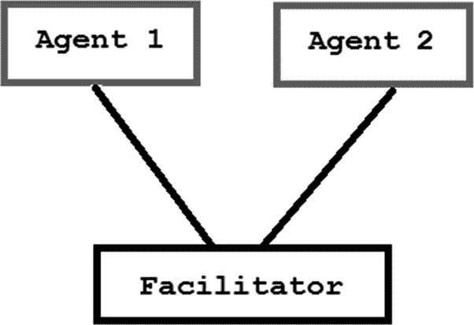
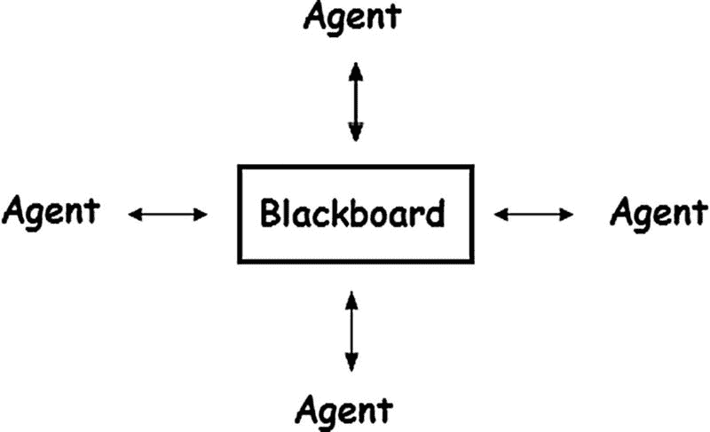
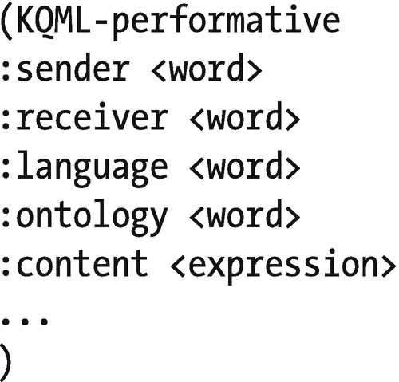
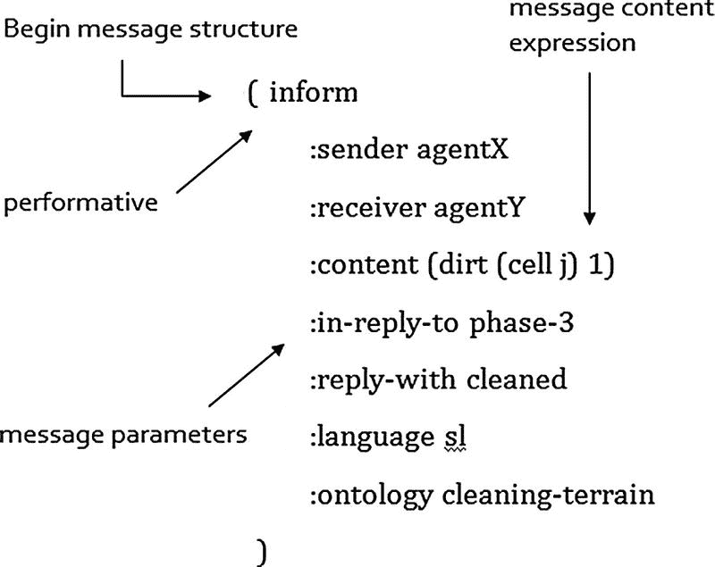
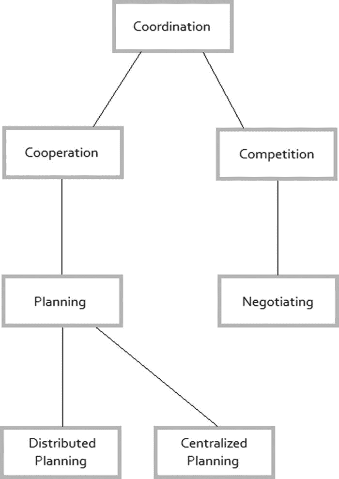
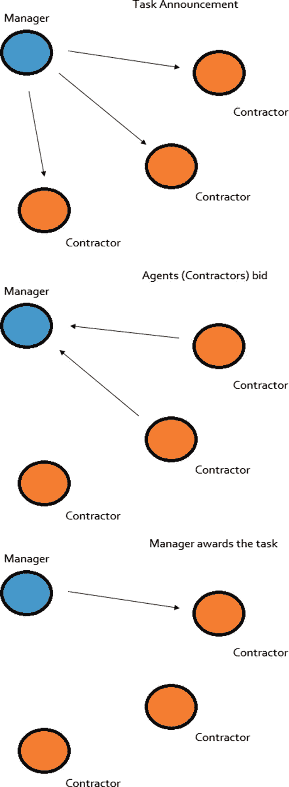
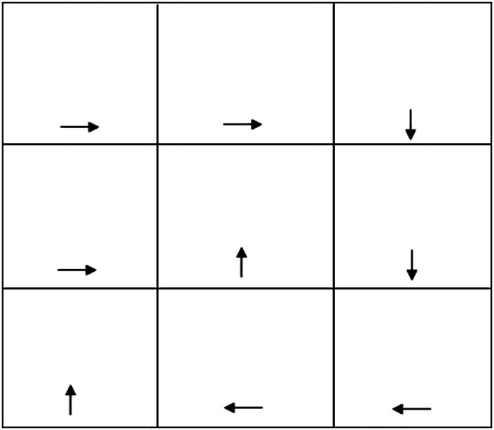

# 5.多智能体系统

到目前为止，我们已经将代理作为与环境交互的单个实体进行了研究；在现实生活中，当多个主体合作实现一个共同目标时，许多问题可以更快更有效地解决。

从章节 [2](02.html) 和 [3](03.html) 中召回清洁剂；这个代理正在独自处理清理整个地形的问题。毫无疑问，如果各种清洁机器人在地面上相互通信和帮助，在更短的时间内完成单个代理需要更长时间和更高资源消耗的任务，这项任务可以更快地完成。

如今，多智能体系统(MAS)应用于现实世界中，如计算机游戏、军事防御系统、空中交通管制、交通运输、图形信息系统(GIS)、物流、医疗诊断等。其他用途涉及移动技术，在这些技术中，应用移动技术可以实现自动、动态的负载平衡和高可伸缩性。

在本章中，我们将研究多智能体系统，在该系统中，多个智能体可以合作、协调、通信或竞争来实现某个目标。MAS 属于分布式系统和人工智能相结合形成分布式人工智能的领域。在这一部分的最后，我们将提出一个实际问题，各种清洁机器人将合作清洁一个房间。

Note

多代理系统代表分布式计算系统。与任何分布式系统一样，它们由许多相互作用的计算实体组成。然而，与经典的分布式系统不同，它们的组成实体是智能的，并且能够彼此进行智能交互。

## 什么是多智能体系统？

正如前面提到的逻辑和代理术语一样，对于多代理系统的定义，还没有一个全球性的一致意见。在本书中，我们将提供一个我们认为合乎逻辑的个人定义，并考虑来自科学文献的其他 MAS 定义。

多智能体系统(MAS)是一组相互作用的智能体，它们或者以竞争的方式——寻求实现由它们所属的智能体子集 S’定义的目标(S’属于 S 的一个分区)——或者以合作的方式——寻求实现 S 中定义的共同目标。在这种情况下，我们说我们正在处理一个独立的 MAS。

在表 [5-1](#Tab1) 中，我们可以看到 MAS 应用于空中交通管制的第一个也是非常频繁的场景；在这种情况下，代理控制器 1 (A1)直接与飞行员打交道，并与代理控制器 2 (A2)合作，为他们找到一条可供着陆的跑道。参见表 [5-1](#Tab1) 了解两个协作代理之间的完整对话。

既然我们已经介绍了 MAS 术语的自我定义，我们将继续介绍其他相关的概念。

联盟被认为是代理集合的子集；对于像篮球、棒球或足球比赛这样的 MAS 来说，总是有两个联盟——两个队在竞争。

策略是接收环境的当前状态并输出将由联盟执行的动作的功能。团队 A 的策略通常取决于团队 B 中的每个代理在当前时刻执行的动作。

平台，也称为多代理基础设施，是描述代理体系结构、多代理组织及其关系或依赖关系的框架、基础或支持。它允许代理在不考虑这种平台的属性的情况下进行交互(集中或非集中、嵌入代理与否等等)，并且它通常根据系统需要向代理提供一组服务(代理定位等等)，目的是增强 MAS 活动和组织；它被认为是代理人的工具。

代理体系结构描述了构成单个代理的层或模块以及它们之间的关系和交互。例如，代理(在 MAS 环境中)通常有一个通信模块来增强与用户和其他代理的通信。正如我们所知(从第 [3](03.html) 章和第 [4](04.html) 章)，某些类型的代理也有一个计划层。通常，到达通信模块的输入消息将通过一些连接影响规划层，并且规划层可以创建要由通信模块处理的输出消息。

多代理组织描述了将多个代理组织起来形成一个 MAS 的方式。代理之间的关系、交互以及它们在组织中的特定角色构成了多代理组织。代理体系结构不是多代理组织的一部分，尽管它们之间的相互关系是常见的。

如果一个代理相对于组成 MAS 的代理集中的所有其他代理都是自治的，则称它在 MAS 中是自治的；换句话说，如果它超出了任何其他代理人的控制或权力。

表 5-1

MAS Example in Air Traffic Control Scenario

<colgroup><col align="left"> <col align="left"> <col align="left"></colgroup> 
| 飞行员 | 代理控制器 1 (A1) | 代理控制器 2 (A2) |
| :-- | :-- | :-- |
| 致 A1:我能着陆吗？ |   |   |
|   | 致 A2:有跑道吗？ |   |
|   |   | 到 A1:p 跑道。 |
|   | 致飞行员:允许起飞。 |   |
| 致 A1:好的 |   |   |
|   | 致 A2:P 跑道现在很忙。 |   |

如果一个 MAS 是独立的，并且代理的目标相互之间没有关系，那么它就是离散的。因此，离散多智能体不涉及合作，因为每个智能体都将按照自己的方式努力实现自己的目标。

模块化是 MAS 的好处之一；有时，解决一个复杂的问题被细分为原始问题的更简单的子问题，每个代理可以专门解决这些特定类型的问题之一，因此导致可重用性。想象一个 MAS 处理像地震这样城市灾难。这样的 MAS 将由不同的代理人(警察、消防员等等)组成，其中每个代理人将致力于一个单一的任务，并且他们所有人都将具有建立秩序和拯救生命的全局任务。

通过 MAS 解决问题可以提高效率；如果各种并发的、并行的代理同时工作来解决问题，通常可以更快地实现问题的解决。

MAS 还提供了改进的可靠性，因为我们可以有多个代理来处理一项任务，如果其中一个代理失败了，那么其他代理可以通过分配给其他代理来继续工作。

MAS 给我们提供的最后一个重要好处是灵活性；我们可以随意在 MAS 中添加或删除代理，具有互补技能的不同代理可以组成联盟，共同工作并解决问题。

在下面的章节中，我们将探索分布式人工智能领域的一些关键概念，特别是关于 MAS 的主题:通信、合作、协商和协调。我们还将更深入地了解之前介绍的一些概念。

Note

平台可以提供的服务之一是代理定位；换句话说，一个代理或第三方在 MAS 环境中找到另一个代理的工具。

## 多主体组织

在本章的前面，我们提供了术语多代理组织的定义。在本节中，我们将详细介绍一些最常见的多代理组织:

*   等级制:代理只能按照等级结构进行通信的组织。由于这种限制，不需要代理定位机制。取而代之的是一组调解人充当中间人，接收和发送代理之间的所有消息。这些主持人通常位于层级的上层。因此，较低的级别通常依赖于较高的级别。在这种类型的组织中，交流确实减少了。
*   扁平化或民主化:代理人之间可以直接沟通的组织。在这种类型的组织中没有固定的结构，但是代理可以形成他们自己的结构，如果他们认为有必要解决一些特定的任务。此外，不假设一个代理对另一个代理的控制。代理位置必须作为基础设施或平台的一部分提供，否则系统必须关闭；换句话说，每个代理人必须随时了解其他代理人。这种类型的组织会导致通信开销。
*   包容:组织中的代理(被包容)可以是其他代理(容器)的组件。这种类型的组织类似于层次模型，除了在这种情况下，被包含的代理将所有控制交给它们的容器代理。正如在分层组织中发生的那样，它涉及较低的通信开销。
*   模块化:MAS 由各种模块组成的组织，每个模块都可以看作是一个独立的 MAS。将系统划分成模块通常是通过考虑诸如地理邻近或同一模块内代理和服务之间极端交互的必要性等措施来完成的。模块化提高了任务执行的效率，减少了通信开销。

这些组织类型的混合以及从一种风格到另一种风格的动态变化是可能的。从前面详述的多代理组织中，我们可以很容易地看到，通信在定义代理的体系结构和运行方式中起着至关重要的作用。我们将在下一节解释这个非常重要的话题的一些关键方面。

Note

近年来，已经提出了各种各样的代理体系结构。在 MAS 体系结构的情况下，这个数字会大大减少，因为对于一个要合并到 MAS 中的代理来说，它必须配备重要的组件(通信、协调等等),这些组件将允许它与其他代理进行适当的交互。

## 沟通

MAS 中的代理必须协调它们的行动来解决问题。在这种情况下，协调是通过通信实现的，通信在提供代理交互和促进协调以及信息共享和合作方面起着至关重要的作用。

在上一节中，我们讨论了 MAS 组织以及它们如何根据它们所在的组织类型影响代理通信。现在，我们来看看这个话题的一些细节。

代理之间建立的通信链路可以分为:

*   点对点:代理直接相互通信
*   广播/多播:代理能够向代理集合的子集发送信息。如果该子集等于代理集，则该代理正在广播；否则，它就是多播。
*   Mediated: communication between agents is mediated by a third party (facilitators; see Figure [5-1](#Fig1)).

    

    图 5-1

    Agent 1 and Agent 2 communicate via a facilitator acting as middle man

考虑到消息从一个代理传播到另一个代理的媒介的性质，通信可以分类为:

*   直接路由:消息被直接发送到其他代理，不会丢失信号。
*   信号传播路由:代理发送一个信号，其强度随着距离的增加而降低。
*   公告路由:使用黑板系统

黑板系统和直接消息传递是建立代理通信的两种选择。

黑板系统(图 [5-2](#Fig2) )代表了一个公共的、共享的空间，供每个代理放置他们的数据、信息和知识。每个代理可以在任何给定的时间写和读黑板，在这个集中的系统中，代理之间没有直接的通信。黑板还充当调度程序，处理代理请求、常见问题的数据、解决方案的当前状态、每个代理的当前任务等等。由于黑板系统由一个共享资源组成，人们必须意识到在这样一个模型中可能出现的所有并发问题(不同的代理试图访问相同的信息，代理使用由其他代理编写的部分的、未更新的数据，等等)。



图 5-2

The blackboard system is a centralized, common space for all agents to place and share their information

在另一种变体(消息传递)中，信息从一个代理(发送者)传递到另一个代理(接收者)。代理之间的通信不仅仅意味着分布式系统中的通信；所以说互动比交流更合适。当我们通信时，我们不仅仅是用指定的语法和给定的协议交换消息，就像在分布式系统中一样。因此，基于言语行为理论的交流(Searle，1969；Vanderveken，1994)，它最好地描述了建立代理通信的消息传递方法。

### 言语行为理论

言语行为理论(也称为交际行为理论)的起源可以追溯到奥斯丁的《如何用语言做事》(1962)；MAS 中的大多数通信处理都是受这一理论的启发。这一理论背后的主要观点是，我们应该把交流视为一种行动形式。此外，奥斯汀注意到，有些话语就像身体动作，似乎可以改变世界的状态。这样的例子可以是宣战，或者简单地说“我宣布你们成为夫妻”

奥斯汀认为，所有的交流都可以通过使用适当的施为动词的陈述形式来表达。因此，一个简单的信息短语，如“爵士音乐会将于 10 月 10 日<sup>日</sup>举行”可以被视为“我通知您，爵士音乐会将于 10 月 10 日<sup>日</sup>举行。”指令——例如，“给我那瓶朗姆酒”——可以被视为“我请求(要求)你给我那瓶朗姆酒。”像“我给你 100 美元买你的家具”这样的承诺可以理解为“我保证我会给你 100 美元买你的家具。”

我们说的每一句话都是为了满足某个目标；言语行为理论是关于如何使用话语来实现意图的理论，通过使用不同类型的言语行为，主体可以有效地进行交互。

Note

交际行为理论是语言使用的理论；他们试图解释人们每天是如何使用语言来实现他们的目标和意图的。

下面是一些言语行为结构的例子:

*   通知其他代理一些数据。
*   询问他人的状态或现状。
*   回答问题。
*   请求他人采取行动。
*   答应做某事。
*   提供交易。
*   确认报价和请求。

塞尔(1969)将言语行为分为以下几类:

*   代表:当我们告知、断言、主张、描述时；例如，它是多云的
*   指令:试图让听话者做某事；换句话说，请求、命令、劝告、禁止；比如，给我那瓶朗姆酒
*   承诺:当我们承诺说话者做某事时，如承诺、同意、提议、威胁、邀请；比如，我保证会给你带茶
*   表达:当说话者表达一种精神状态时；换句话说，祝贺、感谢、道歉；例如，我很遗憾你没能去哈佛
*   宣告:当说话者带来一种事态时；换句话说，宣布，结婚，逮捕；例如，我宣布你们成为夫妻

一个言语行为有两个组成部分:一个施为动词(例如，告知、声明、请求等等)和一个命题内容(例如，瓶子是打开的)。构建言语行为包括将施为动词与命题内容相结合。请参见以下示例:

```py
Performative = inform
Content = the bottle is open
Speech act = the bottle is open.

Performative = request
Content = the bottle is open
Speech Act = please open the bottle.

Performative = inquiry
Content = the bottle is open
Speech Act = is the bottle open?

Performative = refuse
Content = the bottle is open
Speech Act = I refuse to open the bottle

Performative = agree
Content = the bottle is open
Speech Act = I agree to open the bottle

```

同样，我们通常为工作中的同事之间的交流创建一种语言，包含不同代理的 MAS 可能运行在不同的机器上，在不同的操作系统下，需要一种标准化的代理通信语言，以允许以标准格式交换消息。

### 代理通信语言(ACL)

代理通信语言在 20 世纪 80 年代开始出现；起初，它们依赖于为其创建的项目，也依赖于使用它们的代理的内部表示；那时没有标准语言。

大约在同一时间，出现了知识查询和操作语言，通常称为 KQML，但比它的前辈更通用。它是由 DARPA 知识共享项目创建的，被认为是对知识表示技术，特别是本体论研究的补充。

KQML 由两部分组成:语言本身充当“外部”语言，知识交换格式(KIF)充当“内部”语言；前者描述施为动词，后者描述命题内容，很大程度上基于一阶谓词演算。KQML 表示依赖于知识库构造的知识；因此，它没有使用特定的内部表示，而是假设每个代理都维护一个用知识断言描述的知识库。KQML 提出了许多诸如 query 和 tell 之类的执行函数。这个想法是，每个施为可以根据它对通信代理的知识库的影响而被赋予语义。此外，只有当代理相信所发送的内容时，它才会为某些内容发送 tell performative 换句话说，如果它认为内容属于它的知识库。接收到对某些内容的告知的代理将把该内容插入其知识库；换句话说，它会开始相信别人告诉它的东西。

Note

本体是一个领域的明确描述(概念、属性、限制、个体等等)。它定义了一个词汇表，用于在计算机代理或人类之间共享对信息结构的理解。在积木世界中，`Block`代表一个概念，`OnTop`代表一种关系。

KQML 的优雅之处在于，所有用于理解消息内容的信息都包含在通信本身中。其通用语法如图 [5-3](#Fig3) 所示；注意它类似于 Lisp 编程语言:



图 5-3

Basic structure of a KQML message

在下面几行中，我们展示了 AgentX 和 AgentY 之间的 KQML 对话示例:

```py
 (stream-about
:sender AgentX
:receiver AgentY
:language KIF
:ontology CleaningTerrains
     :query
:reply-for query_from_AgentY
:content cell_i cell_j
)

(query
:sender AgentX
:receiver AgentY
:content(> (dirt cell_i) (0))
)

(tell
:sender AgentX
:receiver AgentY
:content(= (cell_j) (1))
)

(eos
:sender AgentX
:receiver AgentY
:query
:reply-for query_from_AgentY
)

```

在这个 KQML 消息的小片段中，AgentX 询问 AgentY if 单元格中是否有灰尘；它还回复先前从 AgentY 接收的查询，并告诉它单元格 j 有 1 的污垢；`eos`代表信号结束。注意，`content`字段的值是用`language`标签定义的语言编写的，在本例中是 KIF。

Note

KIF，一种特殊的逻辑语言，已经被提议作为描述专家系统、数据库、智能代理等的标准。可以说 KIF 是一种用于其他语言翻译的中介。尽管 KQML 通常与 KIF 结合作为内容语言，但它也可以与其他语言结合使用，如 Prolog、Lisp、Scheme 等等。

1996 年，智能物理代理基金会(FIPA)，一个独立的非营利组织，现在是 IEEE 计算机协会的一部分，开始致力于基于代理的应用程序的几个规范；其中一个规范是针对与组织同名的 ACL 即 FIPA ACL。

FIPA 的基本结构与 KQML 非常相似，如图 [5-4](#Fig4) 所示。



图 5-4

Components of a FIPA message

FIPA 语言规范接受的参数如下:

*   `:sender` —谁发送消息
*   `:receiver` —谁是消息的接收者
*   `:content` —消息的内容
*   `:reply-with` —消息的标识符
*   `:reply-by` —回复消息的截止时间
*   `:in-reply-to` —被回复消息的标识符
*   `:language` —书写内容所用的语言
*   `:ontology` —用于表示领域的本体
*   `:protocol` —应遵循的通信协议
*   `:conversation-id` —对话的标识符

表 [5-2](#Tab2) 详细说明了一些 FIPA 执行机构及其创建目的。

表 5-2

Some FIPA Performatives

<colgroup><col align="left"> <col align="left"> <col align="left"> <col align="left"> <col align="left"> <col align="left"></colgroup> 
| 述行语 | 传递信息 | 请求信息 | 谈判 | 执行操作 | 错误处理 |
| :-- | :-- | :-- | :-- | :-- | :-- |
| `accept-proposal` |   |   | x |   |   |
| `agree` |   |   |   | x |   |
| `cancel` |   | x |   | x |   |
| `cfp` |   |   | x |   |   |
| `confirm` | x |   |   |   |   |
| `disconfirm` `failure` | x |   |   |   | x |
| `inform` | x |   |   |   |   |
| `inform-if` | x |   |   |   |   |
| `inform-ref` | x |   |   |   |   |
| `not-understood` |   |   |   |   | x |
| `propose` |   |   | x |   |   |
| `query-if` |   | x |   |   |   |
| `query-ref` |   | x |   |   |   |
| `refuse` |   |   |   | x |   |
| `reject-proposal` |   |   | x |   |   |
| `request` |   |   |   | x |   |
| `request-when` |   |   |   | x |   |
| `request-whenever` |   |   |   | x |   |
| `subscribe` |   | x |   |   |   |

`Inform`和`Request`代表两个基本的施为，而其他的都是根据这些来定义的。它们的意义由两部分组成:一个前提条件列表，陈述言语行为成功必须满足的条件；一个理性效果，即信息发送者希望达到的目的。

在 FIPA `inform`施为中，`content`是一个陈述，`sender`告知`receiver`一个给定的命题为真；`sender`声明如下:

*   有些命题是真的。
*   接受代理人也必须相信命题是真实的。
*   接收者对命题的真实性一无所知。

接下来的几行展示了一个 FIPA `inform`表演的例子:

```py
(inform
:sender(agent-identifier :x)
:receiver(agent-identifier :y)
:content dirt( cell_i, 0 )
       :language Prolog
)

```

另一方面，请求施为的内容由一个动作组成；在这种情况下，发送方请求接收方执行某些操作；发件人声明如下:

*   要执行的动作内容。
*   收件人有能力执行此操作。
*   不相信接收者已经打算执行该动作。

在本节中，我们分析了 MAS 设计中的一个关键主题:通信。尽管这是每个 MAS 的一个基本方面，但还有其他相关的组成部分，其中之一是协调。我们需要我们的代理来协调和避免问题，比如在不可能的时候让他们两个同时执行相同的动作(都试图同时通过同一扇门)。协调将是下一节的重点。

## 协调与合作

作为 MAS 一部分的代理存在，并且在其他代理也存在的环境中执行其决策。为了避免混乱并确保在这种环境中的理性行为，我们需要我们的代理以简洁、逻辑的方式协调并实现他们的目标。评估 MAS 有两个主要标准点:一致性和协调性。

一致性是指 MAS 在考虑一些评估标准(解决方案质量、资源应用效率、逻辑决策等)时的表现。MAS 的一个常见问题是如何在缺乏明确的全局控制的情况下保持整体一致性。在这种情况下，代理必须能够独立地确定他们与其他代理共享的目标；他们还必须确定共同的任务，避免不必要的冲突，并收集知识。在这种情况下，代理之间有某种形式的组织是有用的。

协调是指主体通过同步来避免非理性活动的能力，在这些非理性活动中，两个或更多的主体可能会参与其中。它意味着在计划和执行一个代理的动作时，要考虑其他代理的动作。它也是实现 MAS 的一致行为的一种手段，并且它可能意味着合作。当 MAS 中的代理合作时，它们朝着共同的目标努力。当他们竞争时，他们有相反的目标。在这两种情况下，协调是必不可少的，因为代理人在竞争或要求给定的资源或提供服务时，必须考虑到其他人的行动。协调的例子包括确保代理的动作是同步的，向其他代理提供合适的信息，以及避免多余的问题解决。

合作是非对抗性主体之间的协调。通常，为了成功地合作，每个代理必须维护一个其他代理的模型，并开发一个未来交互的模型；这意味着社交能力。

对于 MAS 中的代理一起工作，它们必须能够共享任务和信息。如果我们有一个 MAS，其中的代理是由不同的个体设计的，那么我们最终会有一个具有不同目标的 MAS，所有这些目标都来自不同的代理。或者，如果我们负责设计整个系统，那么我们可以让代理在我们认为必要的时候互相帮助；我们的最大利益就是他们的最大利益。在这个合作模型中，我们说代理人是仁慈的，因为他们都在一起工作，以实现一个共同的目标。一个良性的 MAS，或者所有代理都是良性的 MAS，可以大大简化系统的设计任务。

当代理人代表个人、组织、公司等等的利益时，我们说他们是自利的。除了 MAS 中其他代理的目标之外，这些代理将有自己的一套目标，并且将采取行动来实现这些目标，即使牺牲其他代理的福利；这可能会导致他们之间的冲突。

Note

自私的代理使 MAS 的设计任务变得非常复杂。对于具有自利代理的 MAS，我们通常必须包含智能行为的机制，例如基于博弈论或基于规则的算法的机制。

图 [5-5](#Fig5) 展示了实现协调的一些可能方法。



图 5-5

Taxonomy for agent coordination possibilities

MAS 中合作的一个基本策略是分解任务，然后在代理之间分配任务。这种分而治之的方法肯定可以降低全局任务的复杂性，因为通过将其划分为更小的子任务，可以在更短的时间内使用更少的资源获得全局解决方案。一般来说，任务共享可以分为三个阶段:

*   问题分解(划分)
*   子问题解决方案
*   溶液合成(征服)

在问题分解阶段，全局问题被分解成子问题，这通常是通过递归或分层过程实现的。决定如何划分是一个设计选择，取决于问题。决定由谁来进行问题分解以及如何进行的工作可以留给我们指定为任务分配器的代理。在集中设计中，除了在其他代理之间分配任务之外，该代理可能不负责任何事情。或者，它可以是子问题解决方案团队的一部分，充当任何其他代理，但具有工作组织者的特殊属性。

一旦问题分解阶段为我们提供了全局问题的一个部分，每个代理都参与到分配的子问题中。在此过程中，代理可能需要共享一些信息，并更新其他人的当前情况。最后，在解决方案合成阶段，子问题的所有解决方案被连接(递归地或分层地)。

在这个合作模型中，我们可以区分在 MAS 执行过程中最有可能出现的两个主要活动:任务共享和结果共享。在前者中，任务的组成部分被分发给代理，而在后者中，部分或完整的结果也被分发给代理。

我们可以使用订阅/通知(发布者/订阅者)模式来共享结果；在这种模式中，一个对象(订阅者)订阅另一个对象(提供者)，请求在事件`evt`发生时得到通知。一旦`evt`发生，提供信息的人通知用户它的发生，他们以这种方式主动交换信息。

在这一点上，我们有一些没有答案的问题。将任务分配或匹配给代理的过程是如何完成的？我们如何从已解决的部分组装一个解决方案？为了回答第一个问题，我们来看一个称为合同网的任务共享协议。

Note

一些常用的任务共享机制包括市场机制，其中任务通过普遍协议或相互选择分配给代理；多智能体规划，规划智能体负责任务分配；和几种任务共享机制之一的合同网协议。

### 使用合同网的谈判

合同网机制是代理之间任务共享的交互机制。它遵循实体(政府、公司等)用来管理商品和服务交换的模型。合同网为寻找合适的代理来完成任务的问题提供了一个解决方案。

希望完成任务的代理人被称为经理。能够完成任务的候选代理被称为承包商。合同网流程可以总结为以下几个阶段(图 [5-6](#Fig6) ):

1.  公告:经理发出任务公告，其中包括要完成的任务的详细说明。该规范必须包括任务描述、任何限制(截止日期等)。)，以及元任务信息(投标必须在截止日期、到期日期等之前提交。).公告被广播。
2.  投标:代理接收与经理公告相对应的广播，并自行决定是否要对任务进行投标。在这个过程中，他们必须考虑各种因素，如执行任务的能力和满足所有限制的能力。如果他们最终决定投标，那么他们提交一份标书。
3.  授予:经理必须在投标中做出选择，并决定将合同授予哪家代理。该过程的结果被传达给提交投标的每个代理。
4.  Expediting : The winner or successful contractor expedites the task.

    

    图 5-6

    Contract Net process  

通常，通过回复任务公告，任何代理都可以充当经理，任何代理都可以充当承包商。由于这种灵活性，任务分解可以进一步进行到不同的深度层次。此外，如果承包商不能完成某项任务或为某项任务提供合适的解决方案，管理人员可以寻找其他承包商候选人，只要 MAS 中有代理，管理人员就可以根据管理人员的要求寻找在某个时间点可以执行某项任务的候选承包商。

从承包商的角度来看，他从各种经理那里收到各种报价(通知),并决定他认为最好的报价。这个决定是基于一些标准(接近度、报酬等)做出的。)，并且他向相应的经理发送投标。

从经理的角度来看，他接收并评估每个任务公告的投标。对给定任务的任何被认为满意的投标将被接受，并且总是在任务公告的到期时间之前被满足。随后，经理通知中标的承包商，也可能通知所有其他发送了中标通知的候选人，告知他们任务已经中标。

也许有人会说，合同网机制的一个缺点是，被授予的代理不必是任务的最佳或最合适的代理，因为任务的最合适的代理在授予时可能很忙。

Note

经理可能收不到对公告的投标有几个原因。所有代理在收到通知时可能都很忙，候选承包商(代理)将通知的任务排在其他提供的任务之下，或者没有承包商能够处理通知的任务。

FIPA-ACL 规范旨在支持合同网协商机制。`cfp`(征集提案)陈述句用于宣布任务；`propose`和`refuse`施为动词用于提议或拒绝提议；`accept`和`reject`用于接受或拒绝建议，`inform`和`failure`用于传达任务的完成及其相应的结果。

### 社会规范和社会

经典人工智能一直关注于设计单个智能体，这些智能体结合了使用冯诺依曼架构实现的推理和控制逻辑。然而，代理并不总是孤立的；他们生活在一个环境中，在这个环境中，他们可能会找到其他代理，并且需要某种类型的交互来以最佳方式完成他们的任务。因此，将代理视为一个由众所周知的规则管理其行为和行动的社会是合乎逻辑的。社交性在协作 MAS 中是至关重要的，其目的是帮助实现真正的对等分布式和灵活的范例，这是最近的应用所需要的，也是代理可以发挥最大作用的地方。

MAS 中的社会承诺是在一个主体和另一个主体或主体组之间产生的义务，约束第一个主体的行为以遵循给定的预先安排的承诺或规则。想象一下，在一个 MAS 中，代理必须一起呆在 2D 空间中的同一条工作线上，但是 AgentX 比其余的代理移动得更快，并且总是倾向于走在前面，将团队抛在后面。这个代理人对其他代理人的社会承诺可能是永远保持在同一条线上，不向前移动，把某人留在后面。

为了给 MAS 建立规则，我们可以设计社会规范或法律来规范代理的行为(图 [5-7](#Fig7) )。社会法是一组约束，约束以一对(S，A)的形式出现，说明代理在状态 S 时不能执行动作 A。



图 5-7

Social law determining agent movement in a grid of 3 × 3\. This law prevents collisions.

焦点状态集是我们希望代理能够访问的状态集；因此，从任何一个焦点状态，都必须存在一条到其余焦点状态的路径。有用的法律是不阻止代理人从一个州到另一个州的法律；图 [5-5](#Fig5) 中的规律是有用的规律。

既然我们已经为 MAS 术语、概念和思想奠定了基础，我们将在下一章介绍一个完整的实际应用程序，它由多代理通信软件组成，允许不同的代理在一个双边(服务、客户机)程序中使用 WCF 发布者/订阅者模式交换消息。这个通信程序将在后面使用(在第 [7](07.html) 章)来创建一个多代理系统的完整示例，其中一组清洁机器人将进行通信、协调和合作来清洁 n x m 房间的灰尘。

## 摘要

在这一章中，我们介绍了多智能体系统领域。我们提出了各种定义和概念，使我们走上了正确的道路，熟悉一些必要的 MAS 术语，以便深入研究与该主题相关的科学文献。我们研究了多智能体组织、智能体通信及其子领域(言语行为理论和智能体通信语言)，并通过详述智能体之间协调与合作的重要主题结束了这一章。在最后一部分，我们还包括了谈判和社会规范的主题。在下一章，我们将提出一个非常有趣的实际问题，在这个问题中，我们将有一组 N 个代理在发布者/订阅者模式下创建的 WCF 应用程序中交换消息。