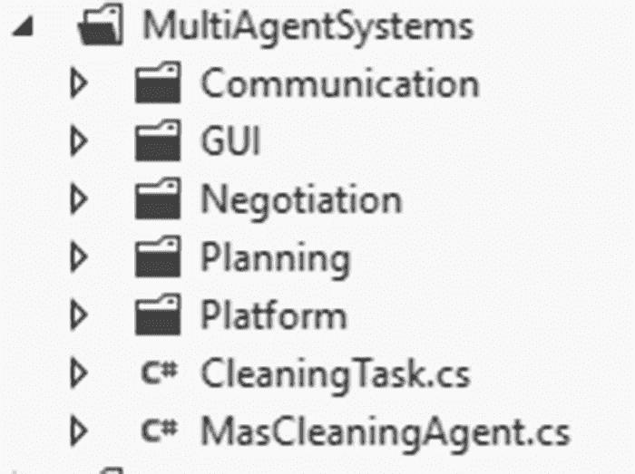
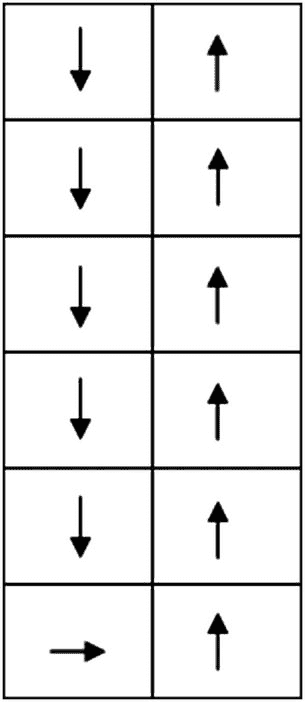
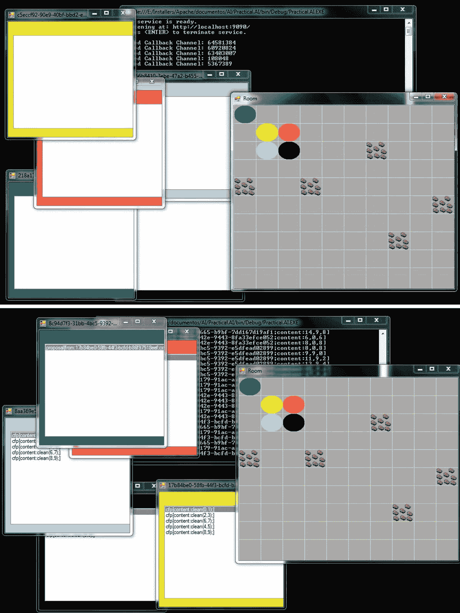
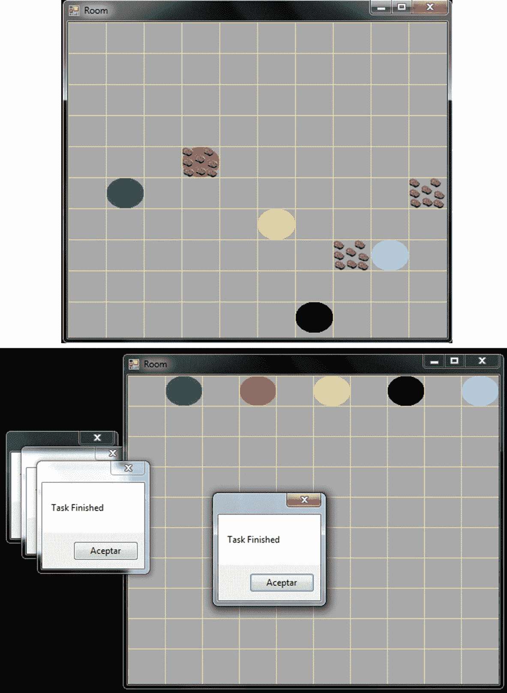

# 7.清洁剂:一个多代理系统问题

在第 [5](05.html) 和 [6](06.html) 章中，我们学习了多智能体系统(MAS)和多智能体通信。我们介绍了诸如代理平台、代理架构、协调、合作、社会法则等概念；我们还详细描述了一个实际问题，其中我们使用 Windows 通信基础(WCF)创建了一个多代理通信模块。

在这一章中，我们将分析一个完整的实际问题，我们将把所有的部分放在一起，并开发一个 MAS，其中 n 个清洁剂将处理清理 n x m 房间灰尘的任务。这个问题将允许我们包含许多以前研究过的概念和定义，并附加在第 [6](06.html) 章中创建的 WCF 通信模块，作为系统中每个代理将集成的 MAS 通信模块。

清洁问题是一个很好的基准或场景，通过该基准或场景，我们可以了解如何使用 MAS 来解决任务，例如清洁，与仅使用单个代理相比，可以在更短的时间内使用更少的资源。

Note

清洁问题中的每个机器人都将使用 WCF 作为其通信模块的核心，并使用 Windows 窗体来显示收到的消息。

## 程序结构

该应用程序将具有如图 [7-1](#Fig1) 所示的结构。该计划包括通信、GUI(图形用户界面)、谈判、规划和平台模块。本章将不分析沟通和计划模块(除了沟通语言，`FipaAcl` C#类),因为它们在前面已经学过了。如需进一步参考，请下载与本书相关的源代码。



图 7-1

Program structure

GUI 模块将包含两个 Windows 窗体应用程序——一个用于以图形方式表示房间中的每个代理及其交互，另一个用于表示代理留言板。

协商模块将包含合同网任务共享方法的实现，每个阶段都作为一个静态 C#方法在一个`ContractNet`类中实现。

平台模块将包含一个代理平台实现及其一些功能(通过字典的代理定位、任务共享的决策角色服务、对经理和承包商的引用等)。它将作为其他类的支持。

在通信模块中，我们将包括代理通信语言(ACL)模块，它包含一个微小的简化版本的`FIPA-ACL`，包括几个执行器。

Note

为了简化这个 MAS 示例中的计划任务，我们将假设列数(M)总是能被 MAS 中的代理数(S)整除，即 M % S == 0。这将允许我们简单地将 M / S 色谱柱分配给每个清洗试剂。

## 清洁任务

为了表示和编码清理任务，我们创建了清单 [7-1](#Par12) 中所示的类。

```py
public class CleaningTask
{
        public int Count { get; set; }
        public int M { get; set; }
        public List<Tuple<int, int>> SubDivide { get; set; }
        public IEnumerable<string> SubTasks { get; set; }

        public CleaningTask(int m, int agents)
        {
            M = m;
            Count = agents;
            SubDivide = new List<Tuple<int, int>>();
            Divide();
            SubTasks = BuildTasks();
        }

        /// <summary>
        /// For the division we assume that M % Count = 0, i.e.  
        /// the number of columns is always divisible by the number of agents.
        /// </summary>
        private void Divide()
        {
            var div = M / Count;

            for (var i = 0; i < M; i += div)
                SubDivide.Add(new Tuple<int, int>(i, i + div - 1));
        }

        private IEnumerable<string> BuildTasks()
        {
            var result = new string[SubDivide.Count];

            for (var i = 0; i < SubDivide.Count; i++)
                result[i] = "clean(" + SubDivide[i].Item1 + "," + SubDivide[i].Item2 + ")";

            return result;
        }
    }

Listing 7-1
CleaningTask Class

```

该类包含以下字段或属性:

*   `Count`:表示参与清理任务的代理数量的整数
*   `M`:表示房间中列数的整数
*   `SubDivide` : `List<Tuple<int, int>>`表示考虑到代理和列的数量而进行的公平的列划分
*   `SubTasks` : `IEnumerable<string>`代表为了完成全局任务(打扫整个房间)而需要执行的一组任务。每个任务都是用我们的迷你`FipaAcl`将要使用的自创内心语言来定义的。

另一方面，`CleaningTask`类公开了这些方法:

*   将打扫房间的全局任务分成更小的子任务。每个子任务将由要清理的连续列的子集组成。它在`SubDivide`属性中存储了一组元组，每个元组定义了要清理的列的范围；例如,( 0，2)将指示清理列 0 至 2 的子任务。
*   `BuildTasks()`:返回一个`IEnumerable<string>`，包含一个自创语言中的每一个子任务，以后通过通讯模块传输信息，使用 FIPA 作为 ACL。

为了维护一个良好模块化的应用程序，`CleaningTask`类仅仅处理与清理问题相关的操作。在下一节中，我们将看看清洁剂平台。

## 清洁剂平台

清洁剂平台由`CleaningAgentPlatform`类表示，其代码可以在清单 [7-2](#Par23) 中看到。

```py
public class CleaningAgentPlatform
{
        public Dictionary<Guid, MasCleaningAgent> Directory { get; set; }
        public IEnumerable<MasCleaningAgent> Agents { get; set; }
        public IEnumerable<MasCleaningAgent> Contractors { get; set; }
        public MasCleaningAgent Manager { get; set; }
        public CleaningTask Task { get; set; }

        public CleaningAgentPlatform(IEnumerable<MasCleaningAgent> agents, CleaningTask task)
        {
            Agents = new List<MasCleaningAgent>(agents);
            Directory = new Dictionary<Guid, MasCleaningAgent>();
            Task = task;

            foreach (var cleaningAgent in Agents)
            {
                Directory.Add(cleaningAgent.Id, cleaningAgent);
                cleaningAgent.Platform = this;
            }

            DecideRoles();

        }

        public void DecideRoles()
        {
            // Manager Role
            Manager = Agents.First(a => a.CleanedCells.Count == Agents.Max(p => p.CleanedCells.Count));
            Manager.Role = ContractRole.Manager;
            // Contract Roles
            Contractors = new List<MasCleaningAgent>(Agents.Where(a => a.Id != Manager.Id));
            foreach (var cleaningAgent in Contractors)

                cleaningAgent.Role = ContractRole.Contractor;
            (Contractors as List<MasCleaningAgent>).Add(Manager);
        }
    }

Listing 7-2
CleaningAgentPlatform Class

```

该类包含以下属性或字段:

*   `Directory`:字典包含代理的 ID 和作为键-值对的对它的引用
*   `Agents` : `IEnumerable`包含代理的集合
*   `Contractors` : `IEnumerable`包含合同网中的承包商集合
*   `Manager`:合同网中的经理参照
*   `Task`:要执行的清洁任务

这个类包含两个函数:一个构造函数和`DecideRoles()`方法。在构造函数中，我们初始化每个属性，然后将每个代理添加到目录中，引用代理的`Platform`属性指向这个平台。`DecideRoles()`方法决定哪个代理被选为经理，而其余的被视为承包商。在这种情况下，管理者选择的标准是选择具有最高数量的被清洁细胞的代理；这相当于说“挑选最有经验的代理，工作最多的那个。”

Note

在这种情况下，我们还将经理添加到承包商列表中，因为我们希望他不仅能指导操作，还能像其他承包商一样参与操作并清洁房间的一系列柱子。

## 合同网

合同网任务分担机制以`ContractNet`类为代表；每个代理承担的角色在`ContractRole`枚举中定义。两者都在清单 [7-3](#Par33) 中有所描述。

```py
public class ContractNet
{

        public static IEnumerable<string> Announcement(CleaningTask cleaningTask, MasCleaningAgent manager, IEnumerable<MasCleaningAgent> contractors, FipaAcl language)
        {
            var tasks = cleaningTask.SubTasks;

            foreach (var contractor in contractors)
            {
                foreach (var task in tasks)
                    language.Message(Performative.Cfp, manager.Id.ToString(), contractor.Id.ToString(), task);
            }

            return tasks;
        }

        public static void Bidding(IEnumerable<string> tasks, IEnumerable<MasCleaningAgent> contractors)
        {
             foreach (var contractor in contractors)
                contractor.Bid(tasks);
        }

        public static void Awarding(List<string> messages, MasCleaningAgent manager, IEnumerable<MasCleaningAgent> contractors, CleaningTask task, FipaAcl language)
        {
            var agentsAssigned = new List<Tuple<MasCleaningAgent, Tuple<int, int>>>();
            var messagesToDict = messages.ConvertAll(FipaAcl.MessagesToDict);

            // Processing bids
            foreach (var colRange in task.SubDivide)
            {
                var firstCol = colRange.Item1;
                var secondCol = colRange.Item2;
               // Bids for first column
                var bidsFirstCol = new List<KeyValuePair<MasCleaningAgent, List<Tuple<double, Tuple<int, int>>>>>();
// Bids for second column
 var bidsSecondCol = new List<KeyValuePair<MasCleaningAgent, List<Tuple<double, Tuple<int, int>>>>>();

                foreach (var contractor in contractors)
                {

// Skip agents that have been already assigned
                    if (agentsAssigned.Exists(tuple => tuple.Item1.Id == contractor.Id))
                        continue;

                    var c = contractor;
// Get messages from current contractor
                    var messagesFromContractor = messagesToDict.FindAll(m => m.ContainsKey("from") && m["from"] == c.Id.ToString());

                    var bids = FipaAcl.GetContent(messagesFromContractor);
// Bids to first column in the range column
var bidsContractorFirstCol = bids.FindAll(b => b.Item2.Item2 == firstCol);
// Bids to second column in the range column
var bidsContractorSecondCol = bids.FindAll(b => b.Item2.Item2 == secondCol);

                    if (bidsContractorFirstCol.Count > 0)
                    {
                        bidsFirstCol.Add(
                            new KeyValuePair<MasCleaningAgent, List<Tuple<double, Tuple<int, int>>>>(contractor,
                                      bidsContractorFirstCol));
                    }
                    if (bidsContractorSecondCol.Count > 0)
                    {
                        bidsSecondCol.Add(
                            new KeyValuePair<MasCleaningAgent, List<Tuple<double, Tuple<int, int>>>>(contractor,
                                    bidsContractorSecondCol));
                    }
                }

                // Sorts to have at the beginning of the list the best bidders (closest agents)
                bidsFirstCol.Sort(Comparison);
                bidsSecondCol.Sort(Comparison);

                var closestAgentFirst = bidsFirstCol.FirstOrDefault();
                var closestAgentSecond = bidsSecondCol.FirstOrDefault();

                // Sorts again to find closest end
                if (closestAgentFirst.Value != null)
                    closestAgentFirst.Value.Sort(Comparison);

                if (closestAgentSecond.Value != null)
                    closestAgentSecond.Value.Sort(Comparison);

                // Assigns agent to column range
                if (closestAgentFirst.Value != null && closestAgentSecond.Value != null)
                {
                    if (closestAgentFirst.Value.First().Item1 >= closestAgentSecond.Value.First().Item1)
                        agentsAssigned.Add(new Tuple<MasCleaningAgent, Tuple<int, int>>(closestAgentSecond.Key,
                        closestAgentSecond.Value.First().Item2));
                    else
                        agentsAssigned.Add(new Tuple<MasCleaningAgent, Tuple<int, int>>(closestAgentFirst.Key,
                        closestAgentFirst.Value.First().Item2));
                }

                else if (closestAgentFirst.Value == null)
                    agentsAssigned.Add(new Tuple<MasCleaningAgent, Tuple<int, int>>(closestAgentSecond.Key,
                    closestAgentSecond.Value.First().Item2));
                else
                    agentsAssigned.Add(new Tuple<MasCleaningAgent, Tuple<int, int>>(closestAgentFirst.Key,
                    closestAgentFirst.Value.First().Item2));
            }
                         // Transmits the accepted proposal for each agent.
            foreach (var assignment in agentsAssigned)
                language.Message(Performative.Accept, manager.Id.ToString(),
                    assignment.Item1.Id.ToString(), "clean(" + assignment.Item2.Item1 + "," + assignment.Item2.Item2 + ")");
        }

        private static int Comparison(Tuple<double, Tuple<int, int>> tupleA, Tuple<double, Tuple<int, int>> tupleB)
        {
            if (tupleA.Item1 > tupleB.Item1)
                return 1;
            if (tupleA.Item1 < tupleB.Item1)
                return -1;
            return 0;
        }

        private static int Comparison(KeyValuePair<MasCleaningAgent, List<Tuple<double, Tuple<int, int>>>> bidsAgentA, KeyValuePair<MasCleaningAgent, List<Tuple<double, Tuple<int, int>>>> bidsAgentB)
        {
            if (bidsAgentA.Value.Min(p => p.Item1) > bidsAgentB.Value.Min(p => p.Item1))
                return 1;
            if (bidsAgentA.Value.Min(p => p.Item1) < bidsAgentB.Value.Min(p => p.Item1))
                return -1;
            return 0;
        }
    }

    public enum ContractRole
    {
        Contractor, Manager, None
    }

Listing 7-3ContractNet Class

```

该类包含以下静态方法:

*   经理向每个承包商发送信息，宣布要完成的每项任务
*   每个代理被要求考虑要完成的一组任务的投标。代理端的投标在`MasCleaningAgent`类的`Bid()`方法中执行。
*   `Awarding()`:执行任务共享机制最后阶段的方法。为了将列 x - x '的范围授予承包商(代理)，它计算每个代理到该列范围的四个端点的距离，即第一列的单元(0，x)、(n - 1，x)和第二列的单元(0，x ')、(n - 1，x ')，然后将该列范围授予离四个端点中的任何一个最近(最小区块或曼哈顿距离)的代理。代理的 bid 包含一个定义最近端的`tuple<int, int>`和一个表示到该端的距离的 double。有关更多详细信息，请参考代码注释。
*   Comparison():这两种方法都涉及到通过考虑一个双精度值来对元素列表进行排序，该双精度值指示元素到列的距离。

每个方法都是作为该类的服务创建的；换句话说，作为一个静态方法，不需要调用该类的任何实例。

## fipa ACL

为了在代理之间交流与清洁相关的问题，我们创建了一种微型语言来处理这些类型的命令。这个迷你语言类似于`FIPA language`并包含一个内部语言，它仅仅包含了`clean(x, y)`语句，告诉代理清除从 x 到 y 的所有列。`FipaAcl`类和`Performative`枚举都在清单 [7-4](#Par41) 中进行了说明。

```py
public class FipaAcl
{
        public AgentCommunicationServiceClient Communication { get; set; }

        public FipaAcl(AgentCommunicationServiceClient communication)
        {
            Communication = communication;
        }

        public void Message(Performative p, string senderId, string receiverId, string content)
        {
            switch (p)
            {
                case Performative.Accept:
                    ThreadPool.QueueUserWorkItem(delegate { Communication.Send(senderId, receiverId, "accept[content:" + content + ";]"); });
                    break;
                case Performative.Cfp:
                    ThreadPool.QueueUserWorkItem(delegate { Communication.Send(senderId, receiverId, "cfp[content:" + content + ";]"); });
                    break;
                case Performative.Proposal:
                    ThreadPool.QueueUserWorkItem(delegate { Communication.Send(senderId, receiverId, "proposal[from:" + senderId + ";content:" + content + "]"); });
                    break;
            }

        }

        public static string GetPerformative(string task)
        {
            return task.Substring(0, task.IndexOf('['));
        }

        public static string GetInnerMessage(string task)
        {
            return task.Substring(task.IndexOf('[') + 1, task.LastIndexOf(']') - task.IndexOf('[') - 1);
        }

        public static Dictionary<string, string> MessageToDict(string innerMessage)
        {
            var result = new Dictionary<string, string>();
            var items = innerMessage.Split(';');
            var contentItems = new List<string>();

            foreach (var item in items)
                if (!string.IsNullOrEmpty(item))
                    contentItems.AddRange(item.Split(':'));

            for (int i = 0; i < contentItems.Count; i += 2)
                result.Add(contentItems[i], contentItems[i + 1]);

            return result;
        }

        public static Dictionary<string, string> MessagesToDict(string message)
        {
            return MessageToDict(GetInnerMessage(message));
        }

        public static List<Tuple<double, Tuple<int, int>>> GetContent(List<Dictionary<string, string>> messagesFromContractor)
        {
            var result = new List<Tuple<double, Tuple<int, int>>>();

            foreach (var msg in messagesFromContractor)
{
                var content = msg["content"];
                var values = content.Split(',');
                result.Add(new Tuple<double, Tuple<int, int>>(double.Parse(values[0]),
                    new Tuple<int, int>(int.Parse(values[1]), int.Parse(values[2]))));
}

            return result;
        }
    }

    public enum Performative
    {
        Accept, Cfp, Inform, Proposal
    }

Listing 7-4
FipaACL Class

```

注意，每个代理通信都是使用`ThreadPool`类的`QueueUserWorkItem`方法执行的。启动一个新线程可能是一个非常昂贵的操作；因此，我们使用线程池设施来重用线程并降低成本。通过这种方式，我们将方法排队，以便在从线程池中抽取的不同线程下执行。

`FipaACL`类包括一个`AgentCommunicationServiceClient`通信属性(回想一下第 [6 章](06.html)中的内容，即`AgentCommunicationServiceClient`是在客户端和服务之间建立通信的代理)，用于向其他代理传输消息。`FipaACL`包含以下方法:

*   `Message()`:根据 performative 的类型，使用作为参数提供的`senderId`、`receiverId`和`content`字符串创建并发送一个新消息。
*   `GetPerformative()`:获取作为参数提供的消息的执行性；例如，对于诸如`cfp[content: clean(0,2)]`的消息，施为者将是`cfp`
*   `GetInnerMessage()`:获取内部消息；例如，如果整个消息类似于`cfp[from: 2312; content: clean(0,2)]`，那么`from: 2312; content: clean(0,2)`代表内部消息
*   假设一个内部消息作为参数被提供，它将这个内部消息翻译成一个字典；例如，从诸如`from: 2312; content: clean(0,2)`的内部消息，得到的字典将是`{ 'from': 2312, 'content': 'clean(0,2)' }`
*   `MessagesToDict()`:获取作为参数提交的消息的内部消息，并返回从`MessageToDict()`方法得到的字典
*   `GetContent()`:获取内部消息的内容标签中包含的一组值。它假设每个消息对应于一个承包商的投标；因此，它包含三个元素:一个距离 double 和一对匹配列范围的整数；例如，`2.0, 1, 1`会添加元组`<2.0, <0, 2>>`

本章介绍的 MAS 清洗示例中唯一使用`FipaAcl`类的组件是`ContractNet`和`MasCleaningAgent`类；后者将是下一节的主题。

## 大众清洁剂

cleaning MAS 示例中的代理是`MasCleaningAgent`类的对象，它包含清单 [7-5](#Par52) 中所示的属性、字段和构造函数的集合。

```py
public class MasCleaningAgent
    {
        public Guid Id { get; set; }
        public int X { get; set; }
        public int Y { get; set; }
        public bool TaskFinished { get; set; }
        public Timer ReactionTime { get; set; }
        public FipaAcl Language { get; set; }
        public CleaningAgentPlatform Platform { get; set; }
        public List<Tuple<int, int>> CleanedCells;
        public ContractRole Role { get; set; }
        public Color Color;
        public bool AwaitingBids { get; set; }
        public bool AwaitingTaskAssignment { get; set; }
        public bool AnnouncementMade { get; set; }
        public bool TaskDistributed { get; set; }
        public Plan Plan { get; set; }
        public bool InCleaningArea { get; set; }
        public List<Tuple<int, int>> AreaTobeCleaned;
        private readonly int[,] _room;
        private readonly Form _gui;
        private Messaging _messageBoardWin;
        private readonly List<Tuple<double, Tuple<int, int>>> _wishList;

        public MasCleaningAgent(Guid id, int[,] room, Form gui, int x, int y, Color color)
        {
Id = id;
 X = x;

Y = y;
 _room = room;
CleanedCells = new List<Tuple<int, int>>();
Role = ContractRole.None;
_wishList = new List<Tuple<double, Tuple<int, int>>>();
Color = color;
 _gui = gui;
Run();
        }
}

Listing 7-5MasCleaningAgent Class, Including Fields, Properties, and Constructor

```

此类公开下列属性和字段:

*   `Id`:代表代理的唯一标识符
*   `X`:表示代理在房间内的 x 坐标的整数
*   `Y`:表示代理在房间内的 y 坐标的整数
*   `TaskFinished`:布尔值，表示任务是否已经完成
*   `ReactionTime`:定义药剂反应时间的定时器；即它执行动作的频率
*   `Language`:由`FipaAcl`类表示的微型 Fipa 语言，将用于解析和传输消息
*   `Platform`:用于不同服务(代理位置)和决定每个代理的角色(经理或承包商)的代理平台。它由`CleaningAgentPlatform`类表示。
*   `CleanedCells`:`Tuple<int, int>`的列表，指示代理已经清理的地形上的单元
*   `Role`:代理人承担的角色(承包商、经理、无)
*   `Color`:房间上代理使用的颜色；即在表示房间的 Windows 窗体图片框上
*   `AwaitingBids`:布尔值，指示代理是否正在等待投标(经理角色)
*   `AwaitingTaskAssignment`:布尔值，指示代理是否正在等待任务分配(对于承包商角色)
*   `AnnouncementMade`:布尔值，表示是否已发布公告(针对经理角色)
*   `TaskDistributed`:布尔值，表示任务是否已经分配(对于经理角色)
*   `Plan`:用于执行寻路算法的`Plan`类的实例。这是第四章“火星漫游者”中介绍的`Plan`类
*   `InCleaningArea`:布尔值，表示在执行了合同网任务分担机制后，代理是否在经理分配的清洁区域
*   `AreaTobeCleaned`:代理必须清除的单元格列表
*   `_room`:表示被清扫房间的整数矩阵的参照。任何单元格中大于 0 的值表示脏；值为 0 表示单元是干净的。
*   `_gui`:表示房间的 Windows 窗体对象的引用
*   `_messageBoardWin`:对表示消息板的 Windows 窗体的引用，代理收到的所有消息都将显示在该消息板上
*   `_wishList`:`Tuple<double, Tuple<int, int>>`的列表，代表代理的愿望列表或投标列表(对于承包商角色)。第二项表示房间的一个单元，第一项表示到该单元的距离。该字段在投标过程中用于查找最近的列末端。

在构造函数中，我们初始化各种字段和属性，并最终调用`Run()`方法(清单 [7-6](#Par76) ),这将设置开始运行代理的一切。

```py
private void Run()
        {
_messageBoardWin = new Messaging (Id.ToString())
                                      {
                                        StartPosition = FormStartPosition.WindowsDefaultLocation,
                                        BackColor = Color,
                                        Size = new Size(300, 300),
                                        Text = Id.ToString(),
                                        Enabled = true
                                      };

            Language = new FipaAcl(_messageBoardWin.Proxy);
            _messageBoardWin.Show();

            ReactionTime = new Timer { Enabled = true, Interval = 1000 };
            ReactionTime.Tick += ReactionTimeOnTick;
        }

Listing 7-6Run() Method Starts the Agent by Enabling the Timer and Connecting the Tick Event to the ReactionTimeOnTick() Method

```

在`Run()`方法中，我们将`_messageBoardWin`变量初始化为`Messaging`类的实例(`Form`类将包含代理收到的所有消息)。我们还初始化了`Language`属性，将在`Messaging`类中创建的代理作为参数传递。最后，代理的`Timer`被启用并订阅`ReactionTimeOnTick`(清单 [7-7](#Par78) )。这个每秒执行一次的方法会导致代理采取行动。

```py
private void ReactionTimeOnTick(object sender, EventArgs eventArgs)
{
            // There's no area assigned for cleaning
            if (AreaTobeCleaned == null)
            {
                if (Role == ContractRole.Manager && AnnouncementMade && !TaskDistributed)
                {
                    ContractNet.Awarding(_messageBoardWin.Messages, Platform.Manager, Platform.Contractors, Platform.Task, Language);
                    TaskDistributed = true;
                }
                if (Role == ContractRole.Manager && !AnnouncementMade)
                {
                    ContractNet.Announcement(Platform.Task, Platform.Manager, Platform.Contractors,
                                             Language);
                    AnnouncementMade = true;
                    Thread.Sleep(2000);
                }
                if (Role == ContractRole.Contractor && AwaitingTaskAssignment || Role == ContractRole.Manager && TaskDistributed)
                {
                    AreaTobeCleaned = SetSocialLaw(_messageBoardWin.Messages);
                }
                if (Role == ContractRole.Contractor && !AwaitingTaskAssignment)
                {
                    Thread.Sleep(2000);
                    ContractNet.Bidding(_messageBoardWin.Messages, Platform.Contractors);
                    AwaitingTaskAssignment = true;
                }
            }

            else
            {
                if (!InCleaningArea)
                {
                    if (Plan == null)
                    {
                        Plan = new Plan(TypesPlan.PathFinding, this);
                        Plan.BuildPlan(new Tuple<int, int>(X, Y), AreaTobeCleaned.First());
                    }
                    else if (Plan.Path.Count == 0)
                        InCleaningArea = true;
                }

                Action(Perceived());
            }
            _gui.Refresh();
}

Listing 7-7
ReactionTimeOnTick() Method Executed

```

请注意，我们让线程休眠了 2000 毫秒，以等待其他代理的某些操作完成。随着代理集基数的增加，这个时间可能需要增加。

`ReactionTimeOnTick()`方法使用的逻辑取决于两种情况:代理分配了清洁区域或没有分配区域。如果没有分配区域，则表明代理之间没有完成任务共享，因此必须启动合同网机制。没有为代理定义清洗区域的不同情况如下:

*   如果代理是经理，并且已经发布了公告，但任务尚未分配，则代理必须进入奖励阶段。
*   如果代理是经理并且没有发布公告，则代理必须进入公告阶段。
*   如果代理是一个承包商，正在等待任务分配，或者代理是一个经理，任务已经被分配，那么它应该通过设置一个社会法则来分配一个要清洁的区域；我们将很快详述这一社会法则。
*   如果代理是承包商，并且正在等待任务分配，那么它必须进入投标阶段。

代理的投标过程遵循清单 [7-8](#Par86) 中代码描述的逻辑。

```py
public void Bid(IEnumerable<string> tasks)
        {
            var n = _room.GetLength(0);
            _wishList.Clear();

            foreach (var task in tasks)
            {
                var innerMessage = FipaAcl.GetInnerMessage(task);
                var messageDict = FipaAcl.MessageToDict(innerMessage);
                var content = messageDict["content"];
                var subtask = content.Substring(0, content.IndexOf('('));
                var cols = new string[2];

                switch (subtask)
                {
                    case "clean":
                        var temp = content.Substring(content.IndexOf('(') + 1, content.Length - content.IndexOf('(') - 2);
                        cols = temp.Split(',');
                        break;
                }

                var colRange = new Tuple<int, int>(int.Parse(cols[0]), int.Parse(cols[1]));

                for (var i = colRange.Item1; i < colRange.Item2; i++)
                {
                    // Distance to extreme points for each column
                    var end1 = new Tuple<int, int>(0, i);
                    var end2 = new Tuple<int, int>(n - 1, i);

                    var dist1 = ManhattanDistance(end1, new Tuple<int, int>(X, Y));
                    var dist2 = ManhattanDistance(end2, new Tuple<int, int>(X, Y));

                    _wishList.Add(new Tuple<double, Tuple<int, int>>(dist1, end1));
                    _wishList.Add(new Tuple<double, Tuple<int, int>>(dist2, end2));
                }
            }

            _wishList.Sort(Comparison);

            foreach (var bid in _wishList)
                Language.Message(Performative.Proposal, Id.ToString(), Platform.Manager.Id.ToString(), bid.Item1 + "," + bid.Item2.Item1 + "," + bid.Item2.Item2);
        }

Listing 7-8Bid Method of the Agent

```

`Bid()`方法接收任务列表作为输入，解析列表中包含的每个任务消息，然后在每个传入消息任务中详细描述列范围，找到到四个可能的列末端的距离。最后，它对到列末端的所有可能距离的`_wishList`进行排序，并按照从低到高的顺序将它们(作为建议)传送给管理器。

分配清洁区域后，代理必须设计一个到达清洁区域的计划(第 [4](04.html) 章中的寻路技巧)。一旦进入其清洁区域，代理将遵循清单 [7-9](#Par89) 所示方法定义的社会法则。

```py
private List<Tuple<int, int>> SetSocialLaw(List<string> messages)
{
            if (!messages.Exists(m => FipaAcl.GetPerformative(m) == "accept"))
                return null;

            var informMsg = messages.First(m => FipaAcl.GetPerformative(m) == "accept");
var content = FipaAcl.MessageToDict(FipaAcl.GetInnerMessage(informMsg));
            var directive = content["content"];
var temp = directive.Substring(directive.IndexOf('(') + 1, directive.Length - directive.IndexOf('(') - 2);
var pos = temp.Split(',');
var posTuple = new Tuple<int, int>(int.Parse(pos[0]), int.Parse(pos[1]));
var colsTuple = new Tuple<int, int>(posTuple.Item2, posTuple.Item2 + _room.GetLength(1) / Platform.Directory.Count - 1);

            var result = new List<Tuple<int, int>>();
            var startRow = _room.GetLength(0) - 1;
            var dx = -1;

            // Generate path to clean
            for (var col = colsTuple.Item1; col <= colsTuple.Item2; col++)
            {

                startRow = startRow == _room.GetLength(0) - 1 ? 0 : _room.GetLength(0) - 1;
                dx = dx == -1 ? 1 : -1;

                for (var row = startRow; row < _room.GetLength(0) && row >= 0; row+=dx)
                    result.Add(new Tuple<int, int>(row, col));
            }

            return result;
    }

Listing 7-9
SetSocialLaw() Method

```

在他们的清洁区域，为了有一个有序的、统一的方式来执行他们的清洁任务，`SetSocialLaw()`方法将定义代理在清洁过程中遵循的路径；这个社会法则在图 [7-2](#Fig2) 中有所说明。



图 7-2

Social law followed by agents

如果有一个活动计划(用于前往指定的清洁区域),则执行该计划的一个移动，并从该计划的路径中删除。根据收到的感知(干净、脏)，代理将选择更新其状态或清洁脏单元。如果要清洁的区域仍然包含一些未访问的单元，那么我们移动到该单元。如果要清洁的区域没有更多单元，则可以认为任务已经完成。这是清单 [7-10](#Par92) 中的`Action()`方法执行的过程。

```py
public void Action(List<Tuple<TypesPercept, Tuple<int, int>>> percepts)
        {
            if (Plan.Path.Count > 0)
            {
                var nextAction = Plan.NextAction();
                var percept = percepts.Find(p => p.Item1 == nextAction);
                Move(percept.Item1);
                return;
            }

            if (percepts.Exists(p => p.Item1 == TypesPercept.Clean))
                UpdateState();
            if (percepts.Exists(p => p.Item1 == TypesPercept.Dirty))
            {
                Clean();
                return;
            }

            if (AreaTobeCleaned.Count > 0)
            {
                var nextCell = AreaTobeCleaned.First();
                AreaTobeCleaned.RemoveAt(0);
                Move(GetMove(nextCell));
            }
            else
            {
                if (!TaskFinished)
                {
                    TaskFinished = true;
                    MessageBox.Show("Task Finished");
                }
            }
        }

Listing 7-10
Action() Method

```

`MasCleaningAgent`类的其他方法，如`Clean()`、IsDirty()、`Move()`、`GetMove()`、`UpdateState()`、`ManhattanDistance()`、`MoveAvailable()`和`Perceived()`，与第 [2 章](02.html)中定义的同名方法有很高的相似度；因此，我们将不在本章中包括它们的代码。如需进一步参考，请查阅与本书相关的源代码。

## 图像使用者界面

如前所述，我们将在项目中包含两个 Windows 窗体应用程序——一个用于显示代理收到的消息列表，另一个用于以图形方式显示房间。留言板的`Messaging`类作为客户端；它在客户端的 Windows 窗体应用程序中包含了上一章中介绍的代码。在这种情况下，从控制台应用程序调用服务的方式与我们在第 6 章[中详述的方式类似。尽管`Room`类的代码仅仅是一个 Windows 窗体代码，我们在清单](06.html) [7-11](#Par95) 中给出它作为参考。

```py
public partial class Room : Form
{
        public List<MasCleaningAgent> CleaningAgents;
        private int _n;
        private int _m;
        private int[,] _room;

        public Room(int n, int m, int[,] room)
        {
            _n = n;
            _m = m;
            _room = room;
            CleaningAgents = new List<MasCleaningAgent>();
            InitializeComponent();
        }

        private void RoomPicturePaint(object sender, PaintEventArgs e)
        {
            var pen = new Pen(Color.Wheat);
            var cellWidth = roomPicture.Width / _m;
            var cellHeight = roomPicture.Height / _n;

            // Draw room grid
            for (var i = 0; i < _m; i++)
                e.Graphics.DrawLine(pen, new Point(i * cellWidth, 0), new Point(i * cellWidth, i * cellWidth + roomPicture.Height));

            for (var i = 0; i < _n; i++)
                e.Graphics.DrawLine(pen, new Point(0, i * cellHeight), new Point(i * cellHeight + roomPicture.Width, i * cellHeight));

            // Draw agents
            for (var i = 0; i < CleaningAgents.Count; i++)
                e.Graphics.FillEllipse(new SolidBrush(CleaningAgents[i].Color), CleaningAgents[i].Y * cellWidth, CleaningAgents[i].X * cellHeight, cellWidth, cellHeight);

            // Draw Dirt
            for (var i = 0; i < _n; i++)
            {
                for (var j = 0; j < _m; j++)
                    if (_room[i, j] > 0)
                        e.Graphics.DrawImage(new Bitmap("rock-transparency.png"), j * cellWidth, i * cellHeight, cellWidth, cellHeight);
            }
        }

        private void RoomPictureResize(object sender, EventArgs e)
        {
            Refresh();
        }
}

Listing 7-11Room Class

```

在`Room`类中，我们实现了`Paint`事件和`PictureBox`的`PictureResize`事件，其中所有元素(污垢、媒介)都以图形方式表示。代理被绘制成由`Color`代理属性定义的颜色的椭圆，而污垢被绘制成图像。当代理清理脏单元格时，污垢将消失(图像不再被绘制)，并且当没有单元格包含污垢的图片时，全局任务将结束。

## 运行应用程序

现在我们已经完成了 MAS 程序的构建，该程序包含了前三章中描述的所有主题，让我们运行并查看完整的应用程序，以及代理如何合作、协调并实际能够清洁 n x m 房间。请记住，我们假设列的数量可以被代理的数量整除，这简化了我们的规划过程。读者可以很容易地改变这种策略，将其转化为一种更通用的策略——一种允许他为任意数量的代理计划清洁任务的策略。

我们在控制台应用程序中嵌入了 WCF 服务，在那里我们还声明了所有的代理、平台和房间 GUI(清单 [7-12](#Par99) )。

```py
var room = new [,]
                           {
                               {0, 0, 0, 0, 0, 0, 0, 0, 0, 0},
                               {0, 0, 0, 0, 0, 0, 0, 0, 0, 0},
                               {0, 0, 0, 0, 0, 0, 1, 0, 0, 0},
                               {0, 0, 0, 0, 0, 0, 0, 0, 0, 0},
                               {2, 0, 0, 1, 0, 0, 0, 0, 0, 0},
                               {0, 0, 0, 0, 0, 0, 0, 0, 0, 1},
                               {0, 0, 0, 0, 0, 0, 0, 0, 0, 0},
                               {0, 0, 0, 0, 0, 0, 0, 1, 0, 0},
                               {0, 0, 0, 0, 0, 0, 0, 0, 0, 0},
                               {0, 0, 0, 0, 0, 0, 0, 0, 0, 0}
                           };

            Application.EnableVisualStyles();
            Application.SetCompatibleTextRenderingDefault(false);

            const int N = 10;
            const int M = 10;
            var roomGui = new Room(N, M, room);

            // Starts the WCF service.
            InitCommunicationService();

var clAgent1 = new MasCleaningAgent(Guid.NewGuid(), room, roomGui, 0, 0, Color.Teal);
            var clAgent2 = new MasCleaningAgent(Guid.NewGuid(), room, roomGui, 1, 1, Color.Yellow);
            var clAgent3 = new MasCleaningAgent(Guid.NewGuid(), room, roomGui, 0, 0, Color.Tomato);
            var clAgent4 = new MasCleaningAgent(Guid.NewGuid(), room, roomGui, 1, 1, Color.LightSkyBlue);
            var clAgent5 = new MasCleaningAgent(Guid.NewGuid(), room, roomGui, 1, 1, Color.Black);
roomGui.CleaningAgents = new List<MasCleaningAgent> { clAgent1, clAgent2, clAgent3, clAgent4, clAgent5 };

            var platform = new CleaningAgentPlatform(roomGui.CleaningAgents, new CleaningTask(M, roomGui.CleaningAgents.Count));

            Application.Run(roomGui);

Listing 7-12Setting Up and Starting the Application in a Console Application Project

```

`InitCommunicationService()`方法包含与第 [6 章](06.html)中详述的代理服务完全相同的代码行。结果如图 [7-3](#Fig3) 所示，MAS 应用程序通过让所有代理在合同网机制中交换消息开始。



图 7-3

Agents exchanging messages in a Contract Net mechanism; messages received are shown in their Message Board windows

一旦达成协议，每个代理都知道其指定的清洁区域，清洁过程就开始遵循前面描述的社会法则。当他们完成他们的子任务时，会显示一个消息框，显示“任务完成”的消息(图 [7-4](#Fig4) )。当从房间中清除一个单位的灰尘时，每个代理线程被置于睡眠状态一段时间；这样我们就可以模拟真实生活中的清洁过程。



图 7-4

Agents cleaning their designated area and displaying the “Task Finished” message once they have completed cleaning their area

我们终于到了清洁剂 MAS 应用的最后阶段。在这个特定的例子中，一个 10 x 10 的房间被五个代理成功地清洁了，这五个代理将清洁整个房间的全局任务分配为仅清洁部分房间的子任务；这些部分由列范围定义。此外，通过 WCF 服务进行的沟通促成了一项协调与合作战略。正如在第 4 章[的火星漫游者项目中发生的那样，读者可以在实验性应用中使用这个例子，或者用新的策略或方法改进它。本书中开发的清洁 MAS 可以作为解决其他问题的基础或基础应用程序，当各种代理交互和协作时，这些问题需要更有效的解决方案。](04.html)

## 摘要

第 [7](07.html) 章暂时结束了本书的“代理人”主题，最后的实际问题不仅包含了第 [5](05.html) 和 [6](06.html) 章中研究的许多要点，而且超出了这些章节中包含的细节范围，是迄今为止最彻底、最精确的章节。回到 cleaning MAS 应用程序，您会注意到诸如逻辑、一阶逻辑和代理等主题作为多代理程序的不可避免的组件被合并。在第 8 章中，我们将开始描述一个与概率和统计密切相关的领域——非常有趣的模拟主题。