# 十三、聚类和多目标聚类

到目前为止，我们已经讨论了几种与监督学习相关的方法。在这些方法中，我们从包含标记数据的训练数据集逼近一个函数。在这一章中，我们将开始讨论无监督学习，这是一种机器学习的范式，我们从一个未标记的数据集中推导出一个函数和数据结构。

无监督学习(UL)方法不再有“训练”数据集。因此，UL 的培训阶段消失了，因为数据没有相关的分类；正确的分类被视为未知。因此，UL 比监督学习更主观，因为没有简单的分析目标，如预测响应。UL 方法的总体目标，听起来可能不太精确，是找到描述被分析数据结构的模式。因为从实验室仪器或任何测量设备获取未标记数据通常比获取标记数据更容易，所以 UL 方法越来越多地应用于需要学习数据结构的多个问题。

在本章中，我们将探讨与 UL 相关的最重要的学习任务之一，即聚类，以及它的一种变体，其中我们考虑同时最小化或最大化几个目标函数，这被称为多目标聚类。本章将描述和实现聚类算法大家族的一种方法；也就是说，我们将实现 k-means 方法。此外，还将实现一些用于确定对象和聚类相似性的措施。

Note

监督和非监督学习算法都代表了数据挖掘应用中经常使用的知识提取技术。

## 什么是集群？

聚类是一大类算法，其目的是将一组对象划分成组或簇，试图确保同一组中的对象具有尽可能高的相似性，而不同组中的对象具有尽可能高的不相似性。在这种情况下，相似性与对象的属性有关；它可以是身高、体重、肤色、勇气，或者我们的数据集包含的任何其他品质，通常以数字形式出现。图 [13-1](#Fig1) 展示了基于对象颜色的聚类。

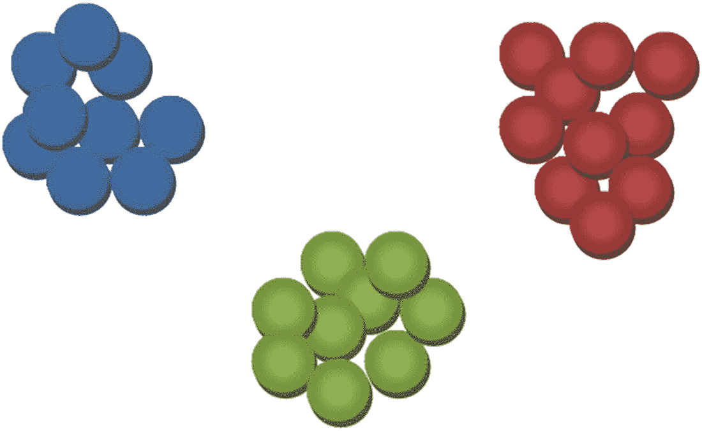

图 13-1

Clustering a set of objects based on their color

聚类在科学和商业的各个领域都有应用，例如天文学、心理学、医学、经济学、欺诈规避、建筑学、人口统计分析、图像分割等等。

聚类算法通常由三个元素组成:

*   相似性度量:用于确定两个对象之间相似性的函数。在图 [13-1](#Fig1) 的例子中，相似性函数可以是 Color(x，y)输出一个整数，确定对象 x 和 y 在颜色方面的等价性。通常，输出的值越大，x 和 y 之间的差异就越大；输出的值越小，x 和 y 就越相似。
*   标准或目标函数:用于评估聚类质量的函数
*   优化或聚类算法:最小化或最大化标准函数的算法

一些最流行的相似性度量如下:

*   Euclidean Distance of n-dimensional vectors a, b:

    

    This is the ordinary distance between two points in space.
*   Manhattan Distance of n-dimensional vectors a, b:

    

    This is an approximation of the Euclidean Distance, and it’s cheaper to compute.
*   Minkowski Distance of cells that belong to an n x m matrix T; p is a positive integer and is a generalization of the previously detailed distances:

    ![ $$ {\mathrm{Minkowski}}_{\mathrm{p}}\left({T}_{\mathrm{k}},{T}_{\mathrm{h}}\right)=\sqrt[\mathrm{p}]{\sum \limits_{\mathrm{i}=1}^{\mathrm{m}}{\left({T}_{\mathrm{k}\mathrm{i}}-{T}_{\mathrm{h}\mathrm{i}}\right)}^2} $$ ](A449374_1_En_13_Chapter_Equc.gif)

在用于确定或评估聚类质量的标准或目标函数中，我们可以发现以下内容:

*   类内距离，也称为紧密度:顾名思义，它以“Intra”(在内部，在内)为前缀，衡量一个聚类(组)中的数据点与聚类质心的接近程度。聚类质心是一个聚类中所有数据点的平均向量。误差平方和通常用作测量该距离的数学函数。
*   类间距离，也称为隔离或分离:顾名思义，它是从“inter”(between)前缀开始的，用来度量簇之间的距离。

聚类算法家族可以分为分层算法、分区算法和贝叶斯算法。图 [13-2](#Fig2) 说明了不同聚类算法家族之间的关系。

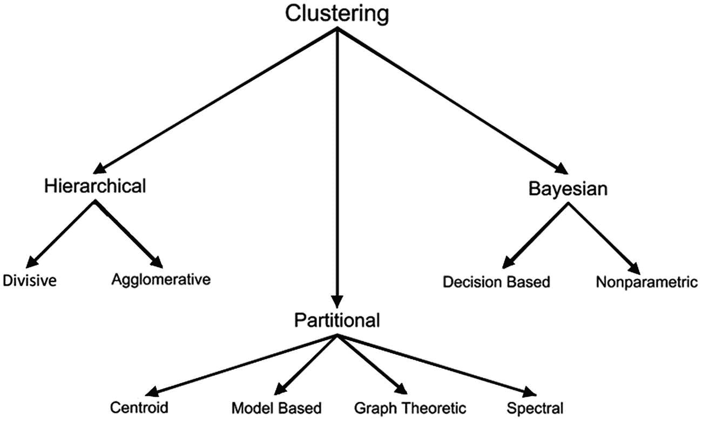

图 13-2

Clustering algorithms family

在本书中，我们将讨论分层和分区算法；贝叶斯聚类算法试图在数据点的所有可能分区的集合上生成后验分布。这个算法家族与概率统计等领域高度相关，因此将作为补充研究留给读者。

Note

聚类是一个众所周知的 NP-hard 问题，这意味着在确定性机器上无法开发或设计该问题的多项式时间解决方案。

## 分层聚类

分层算法从以前发现的聚类中发现新的聚类；因此，新的聚类在嵌套在父聚类中之后成为父聚类的后代，并且层级关系以这种方式建立。分层算法可以分为凝聚算法和分裂算法。

凝聚(也称为自下而上)分层算法从每个对象作为大小为 1 的独立聚类开始，然后开始将最相似的聚类合并到连续的更大的聚类中，直到它包含其中包含所有对象的单个聚类。

分裂(也称为自上而下)分层算法从一个聚类中的整个集合开始，并且在每一步中从当前聚类集合中选择一个组来进行划分。当每个对象都是一个单独的簇时，它就停止了。

分层算法可以输出树状图，这是一种类似二叉树的图表，用于说明聚类的排列。在树状图中，每一层代表一个不同的聚类。图 [13-3](#Fig3) 显示了在由点 a、b、c、d 和 e 形成的数据集上执行的凝聚聚类的示例，以及得到的聚类和树状图。

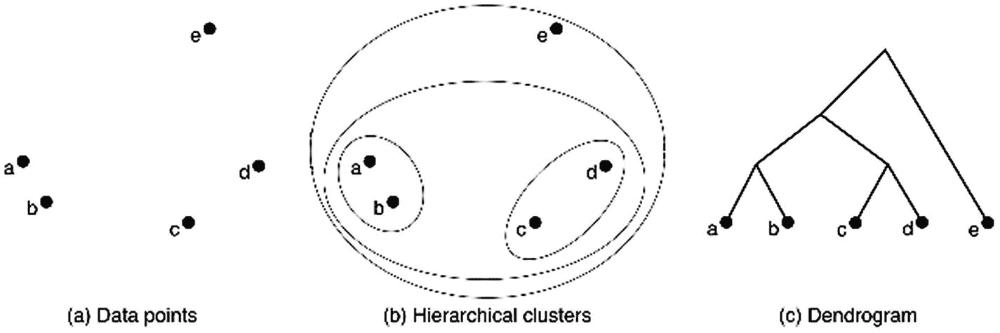

图 13-3

Agglomerative clustering example

因为点 a、b 和 c、d 分别是最近的点，所以它们聚集在一起。之后，作为最近的聚类的聚类{a，b}，{c，d}被分组在一起，而{e}被留下作为另一个聚类。最后，将所有数据点合并成包含所有数据点的聚类；在本例中，我们执行了一个自底向上的过程。我们如何确定聚类的相似性或距离？前面详细的度量或距离给了我们两个数据点之间的相似性，但是聚类相似性呢？接下来几行中描述的度量输出聚类之间的相似性:

*   平均关联聚类:通过查找所有对(x，y)之间的相似性或距离来确定 C1 和 C2 聚类之间的相似性，其中 x 属于 C1，y 属于 C2。这些值相加，最后除以 C1 和 C2 的对象总数。因此，最终，我们计算的是 C1 和 C2 之间距离的平均值。
*   质心链接聚类:通过查找任何对(x，y)之间的相似性或距离来确定 C1 和 C2 两个聚类之间的相似性，其中 x 是 C1 的质心，y 是 C2 的质心。
*   完全链接分类:通过输出任何对(x，y)之间的最大相似性或距离来确定 C1 和 C2 分类之间的相似性，其中 x 是来自 C1 的对象，y 是来自 C2 的对象。
*   单链接分类:通过输出任何对(x，y)之间的最小相似性或距离来确定 C1 和 C2 分类之间的相似性，其中 x 是来自 C1 的对象，y 是来自 C2 的对象。

凝聚层次聚类的伪代码展示了原则上实现这种类型的算法是多么容易:

```py
AgglomerativeClustering (dataPoints)
{
Initialize each data point in dataPoints as a single cluster
while (numberClusters> 1)
 find nearest clusters C1, C2 according to a cluster similarity measure
merge(C1, C2)
end
}

```

凝聚算法是一种比分裂算法更有效的方法，但后者通常能提供更精确的解决方案。请注意，除法算法开始对整个数据集进行操作；因此，它能够在原始数据集上找到两个聚类的最佳划分或分区，并从这一点开始，它能够在每个聚类内找到最佳的可能划分。另一方面，凝聚方法在合并时不考虑数据的全局结构，所以它仅限于分析成对的结构。

Note

在 19 世纪 50 年代霍乱流行期间，伦敦医生约翰·斯诺应用聚类技术在地图上标出霍乱死亡的地点。聚类分析表明，死亡病例位于受污染的水井附近。

## 分割聚类

划分算法将一组 n 个对象划分成 k 个簇或类。在这种情况下，k(聚类或类的数量)可以是先验固定的，或者在优化目标函数时由算法确定。划分聚类算法家族最流行的代表是 k-means ( [MacQueen，1967](https://home.deib.polimi.it/matteucc/Clustering/tutorial_html/kmeans.html#macqueen) )。

K-means 是最简单的无监督学习方法之一，用于发现一组对象的聚类。它遵循一个简单的程序将给定的数据集划分成 k 个簇，其中 k 是一个先验固定的数。在初始化阶段，它定义了 k 个质心，每个聚类一个。定义质心有不同的方法。我们可以从数据集中选择 k 个随机对象作为质心(天真的方法),或者以更复杂的方式选择它们，选择它们彼此之间尽可能远。所做的选择会影响以后的性能，因为初始质心会影响最终结果。

k-means 算法的主体由外部循环形成，该外部循环验证是否已经达到停止条件；这个外部循环包含一个通过所有数据点的内部循环。在这个内部循环中，在检查数据点 P 时，我们通过比较 P 到每个聚类的质心的距离来决定 P 应该添加到哪个聚类，最终我们将它添加到具有最近相关质心的聚类。

一旦第一次检查了所有数据点，换句话说，内部循环第一次结束，算法的主要阶段已经完成，并且已经获得了早期聚类。此时，我们需要细化我们的聚类；因此，我们重新计算上一步中获得的 k 个质心(回想一下，质心是各自簇的平均向量)，这将给出新的质心。如果不满足停止条件，则再次执行内部循环，将每个数据点添加到具有最近的新关联质心的聚类中。这是 k-means 的主要过程；请注意，k 个质心一步一步地改变它们的位置，直到不再有任何改变。换句话说，算法的停止条件是从一次迭代到下一次迭代，质心集不变。可以在下面几行中看到 k-means 的伪代码:

```py
K-Means(dataPoints, k)
{
cList = InitializeKCentroids()
        clusters = CreateClusters()

while (!stoppingCondition)
{
foreach (pj in dataPoints)
              {
dj = Calculate distance from pj to every centroid cList_j
Assign pj to clusters_jwhose dj is minimum
               }
UpdateCentroids()
}
}

```

被优化的目标函数(在这种情况下被最小化)是误差平方和(SSE)，也称为类内距离或紧密度:


其中 k 是聚类的数量，C <sub>i</sub> 是第 I 个聚类，质心 <sub>i</sub> 表示与第 I 个聚类相关联的质心，d(a，b)是 x 和质心 <sub>i</sub> 之间的距离或相似性度量(通常是欧几里德距离)。因此，k-means 的另一个可能的停止条件是 SSE 已经达到一个非常小的值。

在图 [13-4](#Fig4) 中，我们可以看到 k 均值算法的第一步——选择 k 个质心。在此图中，蓝点表示数据点，黑点表示质心。

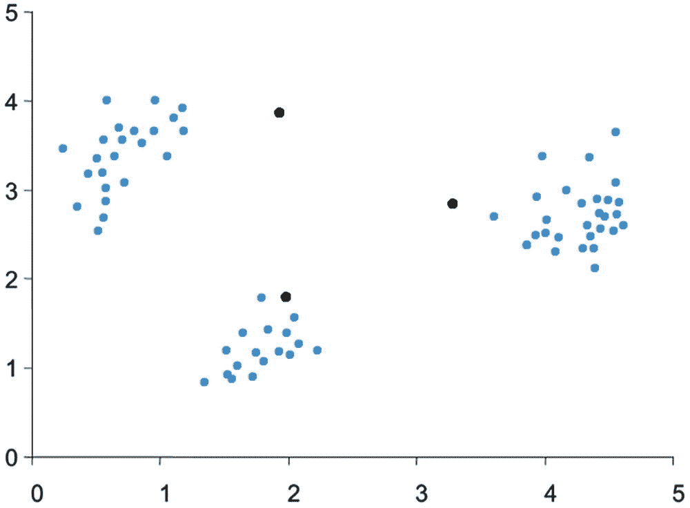

图 13-4

First step of k-means, choosing k = 3 random objects or data points as centroids

图 [13-5](#Fig5) 显示了从第一步中选择了一组质心后得到的 k = 3 个簇。

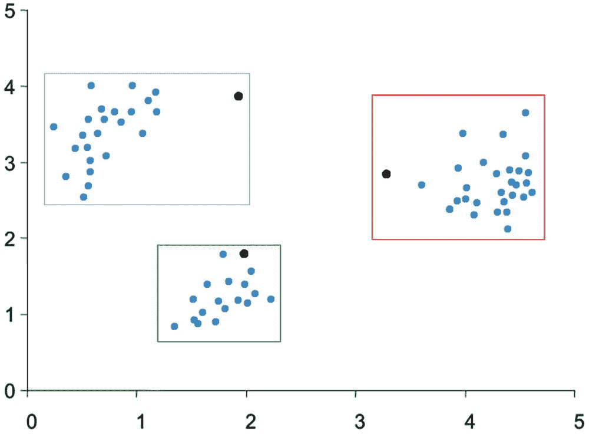

图 13-5

Clustering obtained after choosing the set of centroids in the first step and considering a distance measure to determine similarity between data points

循环的最后一步是重新计算聚类或质心的中心；该过程如图 [13-6](#Fig6) 所示。

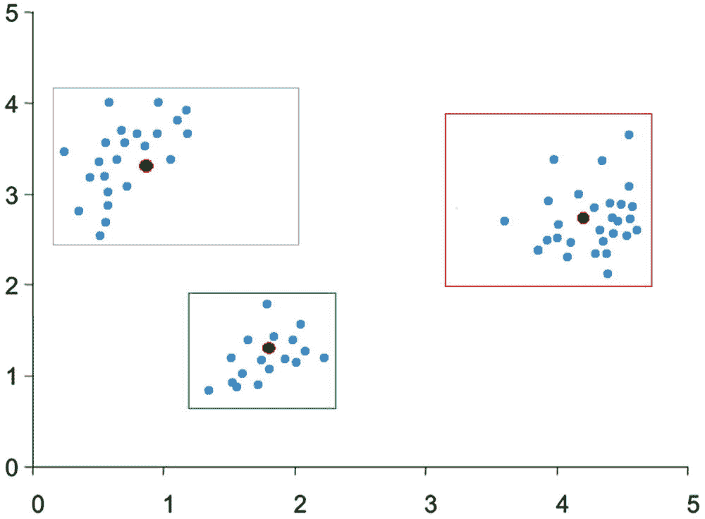

图 13-6

Centroids being recalculated as the average vector of the cluster they represent

重复前面图中表示的步骤，直到满足停止条件。总之，k-means 是一种简单有效的算法，如果我们使用非常小的 SSE 值作为停止条件，它可以在局部最小值处结束。它的主要缺点是对异常值(孤立的数据点)非常敏感，这可以通过删除与其他数据点相比离质心组远得多的数据点来缓解。

## 实际问题:K-Means 算法

在本节中，我们将实现可能是有史以来最流行的聚类算法:k-means。为了给我们的实现提供一个面向对象的方法，我们将创建`Cluster`和`Element`类，它们将包含与集群和对象(数据点)相关的所有动作和属性；在清单 [13-1](#Par48) 中可以看到`Cluster`级。

```py
public class Cluster
    {
        public List<Element> Objects { get; set; }
        public Element Centroid { get; set; }
        public intClusterNo { get; set; }

        public Cluster()
        {
            Objects = new List<Element>();
            Centroid = new Element();
        }

        public Cluster(IEnumerable<double> centroid, intclusterNo)
        {
            Objects = new List<Element>();
            Centroid = new Element(centroid);
ClusterNo = clusterNo;
        }

        public void Add(Element e)
        {
Objects.Add(e);
e.Cluster = ClusterNo;
        }

        public void Remove(Element e)
        {
Objects.Remove(e);
        }

        public void CalculateCentroid()
        {
var result = new List<double>();
vartoAvg = new List<Element>(Objects);
var total = Total;
            if (Objects.Count == 0)
            {
toAvg.Add(Centroid);
                total = 1;
            }

var dimension = toAvg.First().Features.Count;

            for (vari = 0; i< dimension; i++)
result.Add(toAvg.Select(o =>o.Features[i]).Sum() / total);

Centroid.Features = new List<double>(result);
        }

        public double AverageLinkageClustering(Cluster c)
        {
var result = 0.0;

            foreach (var c1 in c.Objects)
                result += Objects.Sum(c2 =>Distance.Euclidean(c1.Features, c2.Features));

            return result / (Total + c.Total);
        }

        public int Total
        {
            get { return Objects.Count; }
        }
    }

Listing 13-1
Cluster Class

```

`Cluster`类包含以下属性:

*   `Objects`:包含在集群中的一组对象
*   `Centroid`:群集的质心
*   `ClusterNo`:集群的 ID，以区别于其他集群
*   `Total`:组或簇中的元素数量

该类还包含下列方法:

*   `Add()`:向集群添加一个元素
*   `Remove()`:从集群中删除一个元素
*   `CalculateCentroid(`):计算群集的质心
*   `AverageLinkageClustering()`:计算聚类之间的`AverageLinkageClustering`相似性度量，如前所述

清单 [13-2](#Par60) 中显示了代表待聚类对象的`Element`类。

```py
    public class Element
    {
        public List<double> Features { get; set; }
        public int Cluster { get; set; }

        public Element(int cluster = -1)
        {
            Features = new List<double>();
            Cluster = cluster;
        }

        public Element(IEnumerable<double> features)
        {
            Features = new List<double>(features);
            Cluster = -1;
        }
    }

Listing 13-2
Element Class

```

该类包含一个`Cluster`属性，该属性指示该对象所属的群集的`clusterID`；两个构造函数的代码都是不言自明的。清单 [13-3](#Par62) 中展示了 KMeans 类，它代表了同名的算法。

```py
public class KMeans
    {
        public int K { get; set; }
        public DataSetDataSet { get; set; }
        public List<Cluster> Clusters { get; set; }
        private static Random _random;
        private constintMaxIterations = 100;

        public KMeans(int k, DataSetdataSet)
        {
            K = k;
DataSet = dataSet;
            Clusters = new List<Cluster>();
            _random = new Random();
        }

        public void Start()
        {

InitializeCentroids();
vari = 0;

            while (i<MaxIterations)
            {
                foreach (varobj in DataSet.Objects)
                {
varnewCluster = MinDistCentroid(obj);
varoldCluster = obj.Cluster;
                    Clusters[newCluster].Add(obj);
                    if (oldCluster>= 0)
                        Clusters[oldCluster].Remove(obj);
                }

UpdateCentroids();
i++;
            }
        }

        private void InitializeCentroids()
        {
RandomCentroids();
        }

        private void RandomCentroids()
        {
var indices = Enumerable.Range(0, DataSet.Objects.Count).ToList();
Clusters.Clear();

            for (vari = 0; i< K; i++)
            {
varobjIndex = _random.Next(0, indices.Count);
Clusters.Add(new Cluster(DataSet.Objects[objIndex].Features, i));
indices.RemoveAt(objIndex);
            }
        }

        private intMinDistCentroid(Element e)
        {
var distances = new List<double>();

            for (vari = 0; i<Clusters.Count; i++)
distances.Add(Distance.Euclidean(Clusters[i].Centroid.Features, e.Features));

varminDist = distances.Min();
            return distances.FindIndex(0, d => d == minDist);
        }

        private void UpdateCentroids()
        {
            foreach (var cluster in Clusters)
cluster.CalculateCentroid();
        }
    }

public class DataSet
    {
        public List<Element> Objects { get; set; }
        public DataSet()
        {
            Objects = new List<Element>();
        }

        public void Load(List<Element> objects)
        {
            Objects = new List<Element>(objects);
        }
    }

Listing 13-3
KMeans and DataSet Classes

```

属性或字段是不言自明的；在这种情况下，我们决定使用最大迭代次数作为停止条件。该类的方法在以下几点进行了描述:

*   `InitializeCentroids()`:考虑到具有不同质心初始化程序的可能性而创建的方法。
*   `RandomCentroids()`:质心初始化过程，其中我们分配 k 个随机选择的对象作为 k 个簇的质心
*   `MinDistCentroid()`:返回输入对象更接近的聚类的`clusterID`；即在最小距离处
*   `UpdateCentroids()`:通过调用`Cluster`类的 CalculateCentroid()方法更新 k 个质心

现在我们已经准备好了所有的组件，让我们通过创建一个测试应用来测试我们的聚类算法，在这个测试应用中我们创建了一个数据集；清单 [13-4](#Par69) 展示了这段代码。

```py
var elements = new List<UnsupervisedLearning.Clustering.Element>
                                   {
                                       new UnsupervisedLearning.Clustering.Element(new double[] {1, 2}),
                                       new UnsupervisedLearning.Clustering.Element(new double[] {1, 3}),
                                       new UnsupervisedLearning.Clustering.Element(new double[] {3, 3}),
                                       new UnsupervisedLearning.Clustering.Element(new double[] {3, 4}),
                                       new UnsupervisedLearning.Clustering.Element(new double[] {6, 6}),
                                       new UnsupervisedLearning.Clustering.Element(new double[] {6, 7})
                                   };

vardataSet = new DataSet();
dataSet.Load(elements);

varkMeans = new KMeans(3, dataSet);
kMeans.Start();

                foreach (var cluster in kMeans.Clusters)
                {
Console.WriteLine("Cluster No {0}", cluster.ClusterNo);
                    foreach (varobj in cluster.Objects)
Console.WriteLine("({0}, {1}) in {2}", obj.Features[0], obj.Features[1], obj.Cluster);
Console.WriteLine("--------------");
                }

Listing 13-4Testing the K-Means Algorithm

```

执行清单 [13-4](#Par69) 中的代码后得到的结果如图 [13-7](#Fig7) 所示。请注意，在这种情况下，我们有三个容易区分的组，如图所示。

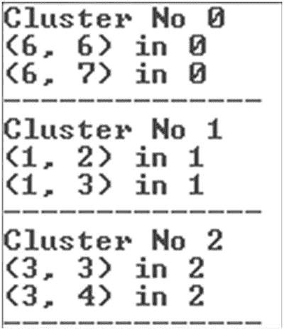

图 13-7

Execution of the k-means algorithm with k = 3

到目前为止，我们已经研究了单聚类算法，或者优化单个目标函数的算法。在 k 均值的情况下，它是误差平方和，也称为类内距离(最小化组内对象的距离)。我们可以尝试优化的另一个函数是 inter-class(最大化不同组中对象的距离)函数。在下一节中，我们将开始研究多目标聚类，在这种聚类中，我们不仅仅考虑要优化的单个函数，而是几个函数，我们试图一次性优化它们。

## 多目标聚类

如今，许多现实生活中的问题迫使我们不仅要考虑给定函数的最佳可能值，还要考虑与手头问题相关的几个函数的值。例如，分区，一种属于城市研究领域的技术，在十九世纪第一次出现，以区分住宅区和工业区。这种技术在城市化中最受欢迎，其主要思想是根据几个变量或标准对同质区域进行划分。这些变量可能是人口统计学上的——例如，20 岁以上的人数，10 岁以下的人数，等等。找到这样的划分显然是一个涉及不同函数优化的聚类问题。因此，我们可以尝试找到具有最低类内距离(也称为紧密度)的聚类，同时优化类间距离或任何其他函数，这在本质上很可能是人口统计学的。一个完美的聚类是具有最小的类内距离和最大的类间距离；因此，可以说聚类本质上是一个多目标优化问题。我们将通过研究与多目标聚类相关的几个相关概念或定义来开始这一部分。

许多优化问题往往涉及同时优化多个目标函数；这类问题被称为多目标优化问题(MOPs)。它们可以表述如下:


在这种情况下，A 表示问题的可行空间——所有可行解的集合，这些解满足问题的每个约束。

一个向量被称为由另一个向量支配，表示为 u < v，当且仅当对于所有的索引 I，我们可以验证。在任何其他情况下，u 被称为非支配向量。注意，“支配”取决于我们是想最小化还是最大化目标函数；回想一下，总是可以将最小化问题转化为最大化问题，反之亦然。

拥有多个目标意味着一个重大问题——一个目标函数的改进可能导致另一个目标函数的恶化。因此，优化每个目标的解决方案很少存在；不是寻找解决方案，而是寻找折衷方案。帕累托最优解代表了这种权衡。

如果没有解 y 使得 F(x) <f in="" other="" words="" there="" is="" no="" solution="" vector="" y="" whose="" evaluation="">1 (y)，f <sub>2</sub> (y)，… f <sub>n</sub> (y))将支配 x 的评估向量，(f <sub>1</sub> (x)，f <sub>2</sub> (x)，… f <sub>n</sub> (x))，则称可行解 x 是帕累托最优的。所有帕累托最优解的集合称为帕累托集，其图像是帕累托边界。大多数 MOPs 算法的目标是为一个给定的问题建立一个 Pareto 边界；这种方法是典型的试探法或元试探法(我们将在下一章讨论它们)。</f>

Note

帕累托最优是以意大利工程师和经济学家维尔弗雷多·帕累托(1848–1923)的名字命名的概念。它的概念已被应用于学术领域，如经济学、工程学和生命科学。

## 帕累托边界建设者

通过搜索科学文献，我们可以找到发现帕累托边界的不同方法。在本书中，我们将描述一位作者自己的创作，名叫帕累托边疆建设者。它可以应用于双目标优化——优化两个函数的情况。二元情况是聚类问题的理想情况，因为有两个函数(类内和类间)可以为我们提供最佳值。

对于二元情况，两个函数和帕累托边界之间的关系可以表示为如图 [13-8](#Fig8) 所示。

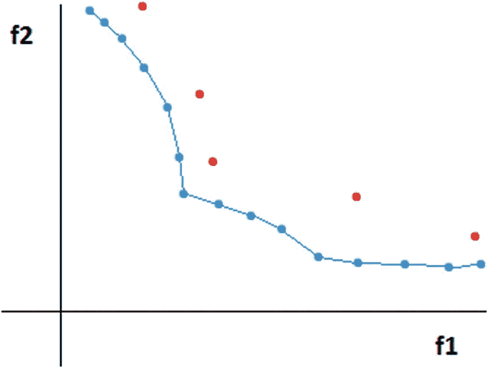

图 13-8

Blue points form the Pareto Frontier and red points are dominated by blue ones; thus, they are not considered as part of the Pareto Frontier. This would be a minimization problem

边界构建器方法的策略分为不同的阶段。主要思想是按区域构建帕累托边界，如图 [13-9](#Fig9) 所示。

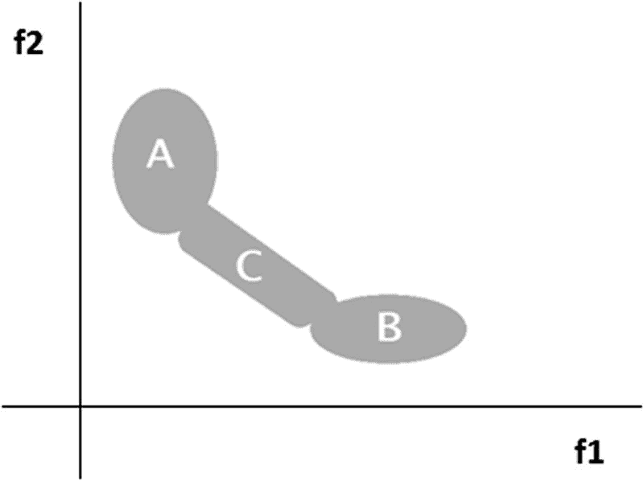

图 13-9

Area A is formed by points obtained after minimizing objective function f2; area B is obtained after minimizing objective function f1, and area C is formed using a linkage mechanism connecting areas A and B

*   区域 A:将通过最小化第二目标函数(f2)来获得该区域中的点；这种优化产生的点将最接近 y 轴。
*   区域 B:将通过最小化第二目标函数(f1)来获得该区域中的点；这种优化产生的点将最靠近 x 轴。
*   C 区:它的目的是作为一个连接机制，将 A 区和 B 区连接起来，形成帕累托边界。一个被称为帕累托边界联系的程序将找到 A 区和 b 区之间的桥梁。

看到这些步骤中的策略使它看起来非常简单。我们将 f2 优化与 f1 优化分开，构建区域 A 和 B，然后通过在区域 c 中寻找非劣解将它们联系起来。

帕累托边界关联是用于构建区域 c 的机制。它需要一个步长参数来定义帕累托边界中非劣解之间的期望距离。当解 x 和 y 之间的距离超过这一步时，链接机制启动搜索机制来寻找 x 和 y 之间的非支配解并建立桥梁。这种机制包括对最左边的解决方案，即桥左侧的解决方案(x，根据图 [13-10](#Fig10) )进行小的改动。

变化情况如下:

1.  选择最左边的解决方案。
    *   修改当前解决方案。对于聚类问题，将一个元素从其当前聚类移动到某个其他聚类，保证 f2 增加`currentDistance` + k，其中 k < = `step`，并评估和存储这个新解。 
2.  Repeat step 2 and move all elements in the leftmost solution to improve clusters’ chances of finding non-dominated solutions with f2 values ranging `in[currentDistance,currentDistance + step]`; this strategy slowly builds the bridge and improves the Pareto Frontier.

    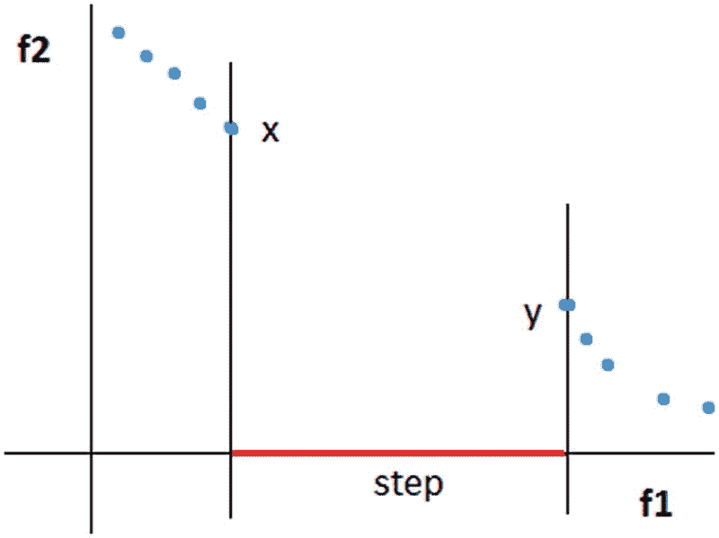

    图 13-10

    Step to join points x, y  

这种方法嵌入在禁忌搜索元启发式算法中(我们将在下一章讨论)，并应用于现实世界的分区问题。选择不同步长值后得到的结果如图 [13-11](#Fig11) 所示。

300 次迭代后，`step` = 2.0。

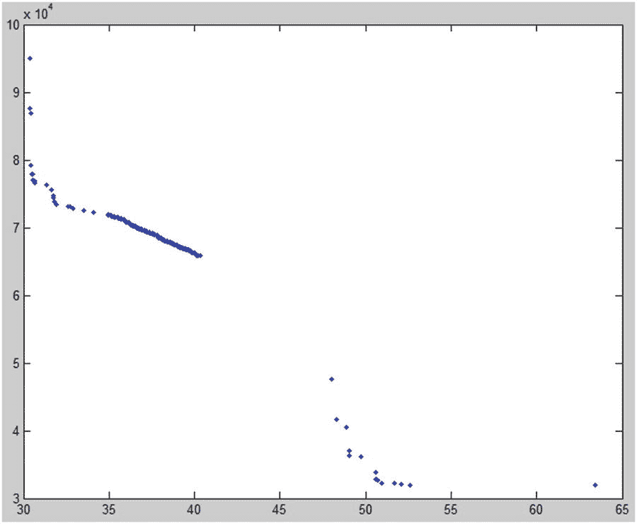

经过 500 次迭代后，`step` = 2.0

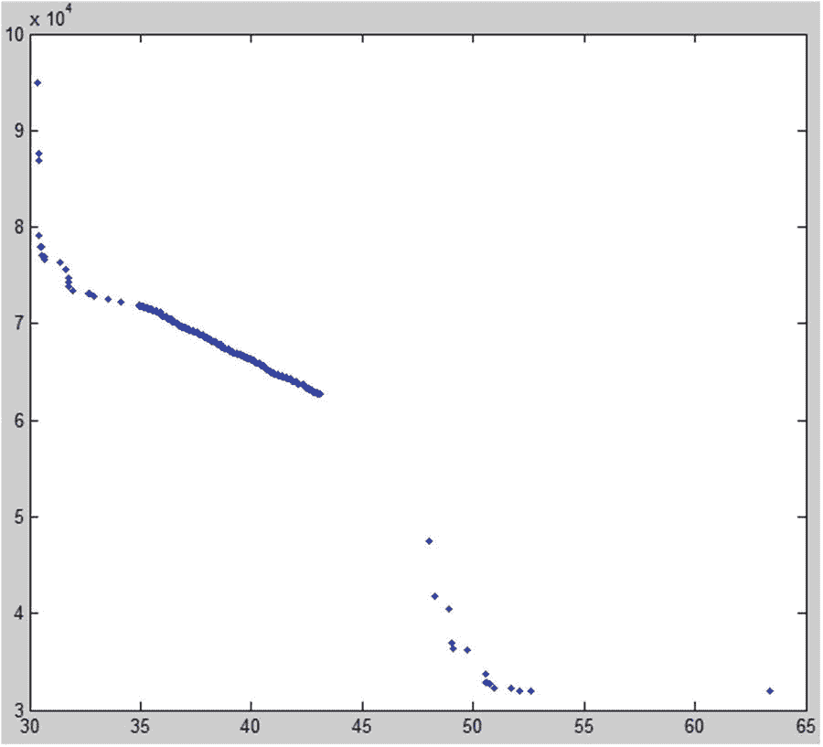

`Step`= 500 次迭代后 1.2。

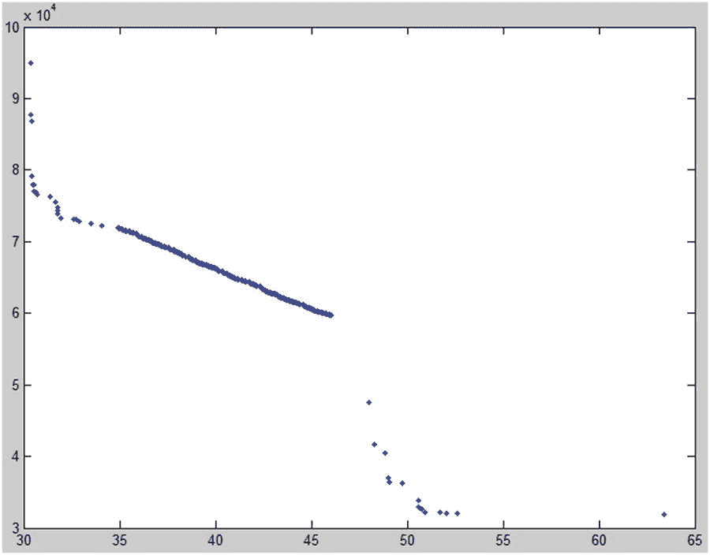

最后，`step` = 0.5，500 次迭代。

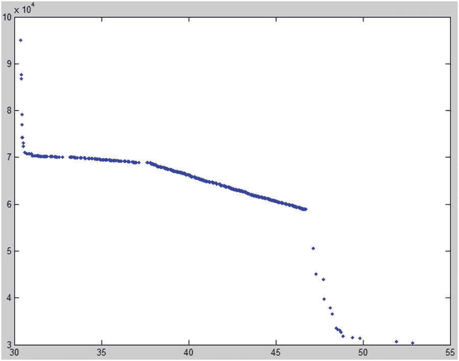

图 13-11

Frontier Builder mechanism using different steps and executing a different number of iterations

从形成上图的图像集合中，我们可以看到帕累托边界被很好地定义了；步长越小，定义就越清晰，就能填补帕累托边界的更多漏洞。对这种策略的一个有趣的增强是应用`FrontierBuilder`机制，不仅沿着 f2 轴执行步骤，还沿着 f1 轴执行步骤，提供对 Pareto 边界的更精确的近似。

## 摘要

在这一章中，我们讨论了计算机科学的一个经典问题:聚类。我们通过提供用于确定对象相似性和聚类相似性的不同度量来描述它。我们还介绍了聚类方法家族，并提出和开发了最流行和最可靠的聚类算法之一，即 k-means。在最后几节中，我们将多目标聚类作为多目标优化问题的特例进行了研究，并详细介绍了作者自己创造的构建帕累托边界的方法；这种方法就是帕累托边界生成器。