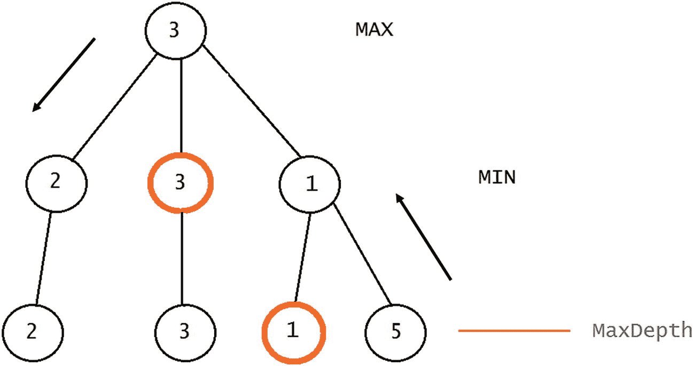
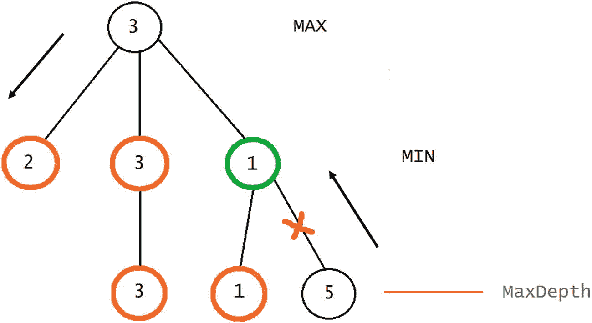
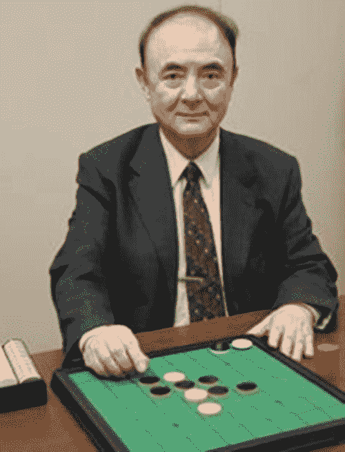
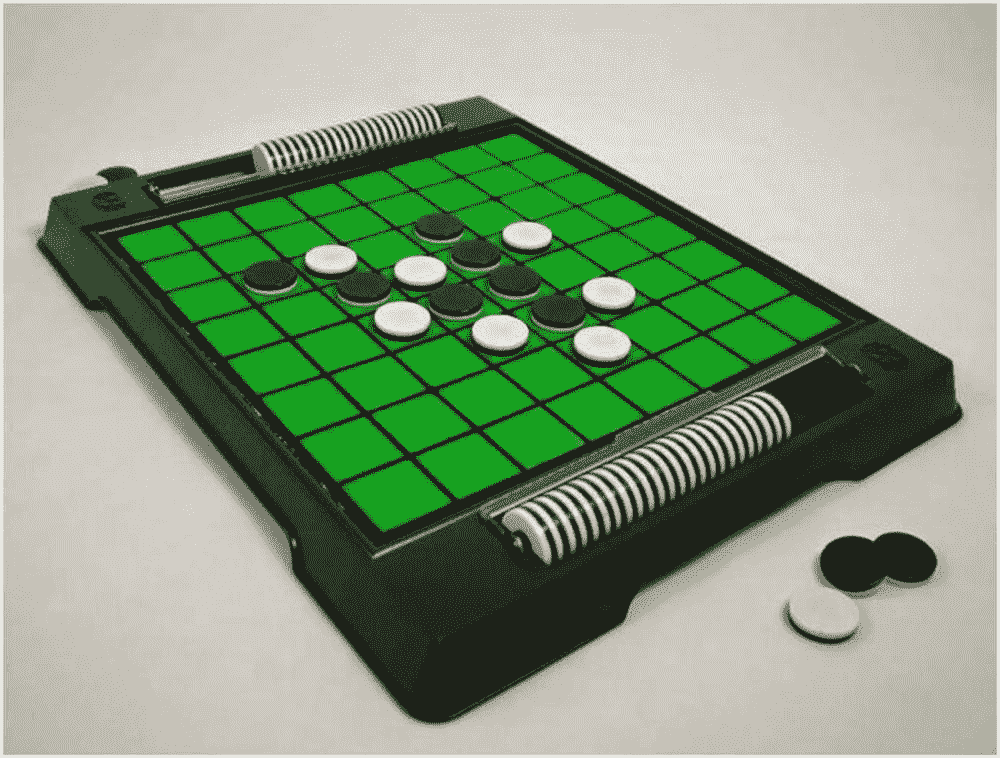
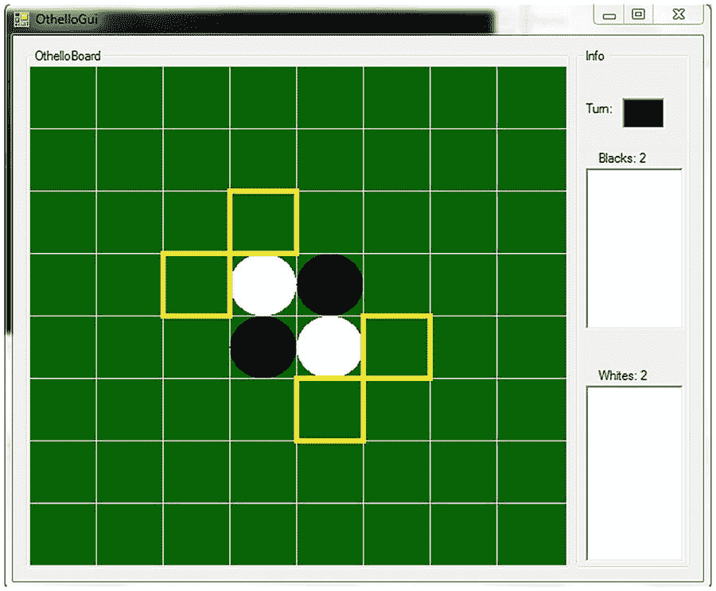
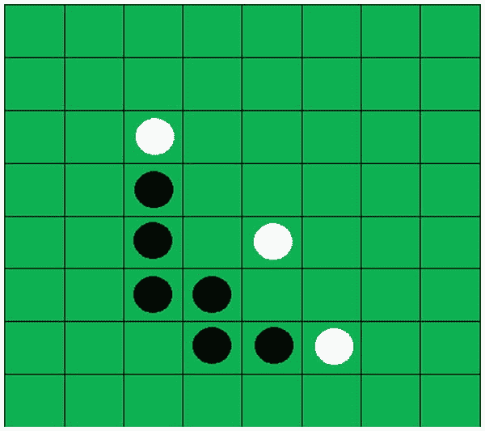
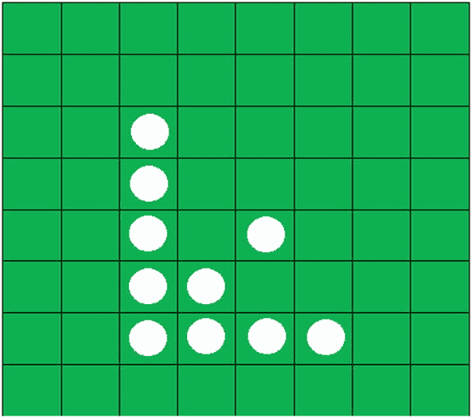
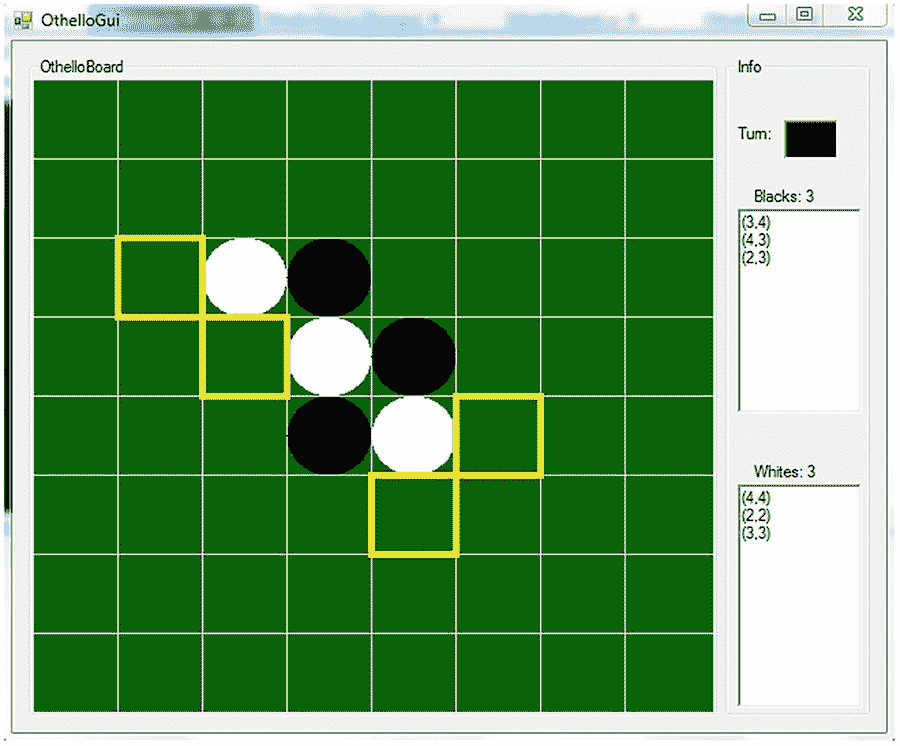

# 16.博弈论:对抗性搜索&奥赛罗游戏

毫无疑问，与博弈论最相关的人物是匈牙利裔美国数学家约翰·冯·诺依曼——二十世纪最伟大的数学家之一。尽管其他人在他之前阐述了与博弈论相关的概念(特别是埃米尔·波莱尔)，但冯·诺依曼在 1928 年发表的论文为两人零和博弈理论奠定了基础。他的工作在一本关于博弈论的重要著作中达到顶峰，该书是与奥斯卡·莫根施特恩合作撰写的，书名为《博弈论与经济行为》(1944)。

冯·诺依曼和摩根斯坦开发的理论与一类称为两人零和游戏的游戏密切相关，这种游戏只有两个玩家，其中一个玩家赢了另一个玩家输的东西。他们的数学框架最初使得该理论仅在特殊和有限的条件下适用。过去 60 年来，这种情况发生了巨大变化，框架得到了加强和推广。自 20 世纪 70 年代末以来，可以断言博弈论是许多科学领域中最重要和最有用的工具之一，尤其是在经济学领域。在 20 世纪 50 年代和 60 年代，博弈论在理论上得到扩展，并应用于战争和政治问题。此外，它还在社会学和心理学中得到了应用，并与进化论和生物学建立了联系。随着约翰·纳西、约翰·哈萨尼和赖因哈德·泽尔腾获得 1994 年诺贝尔经济学奖，博弈论受到了特别的关注。

约翰·纳西是 2001 年奥斯卡获奖电影《美丽心灵》的主题，他将博弈论转化为一个更通用的工具，能够分析双赢和双输的场景，以及双赢和双输的情况。纳什让博弈论解决了一个核心问题:我们应该竞争还是合作？

在这一章中，我们将讨论从博弈论中得出的各种概念和思想。我们将讨论博弈理论的一个分支，称为对抗性搜索，我们将描述极大极小算法，它通常应用于确定性环境中两人完全信息零和博弈。

Note

1950 年，约翰·纳西证明了有限博弈总是有一个均衡点，在这个均衡点上，所有的参与者都选择对他们最有利的行动。纳什均衡，也称为战略均衡，是一个策略列表，每个参与者一个策略，它具有这样的性质，没有参与者可以单方面改变他的策略并获得更好的收益。

## 什么是博弈论？

游戏是以娱乐的环境和方式定义的一组结构化的任务，以吸引玩家(1 个或更多)遵守逻辑规则，如果正确地完成了这些规则，游戏就完成了。

博弈论是关于如何分析博弈，如何最优博弈的数学理论；这也是一种看待多种人类行为的方式，就好像它们是游戏的一部分。可以用博弈论分析的一些最受欢迎的游戏有奥赛罗、二十一点、扑克、象棋、井字游戏、西洋双陆棋等等。在现实中，不仅仅是我们所知道的或想到的游戏是博弈论的分析主题。更确切地说，有许多其他情况可以被公式化为游戏。每当理性人必须在严格和已知的规则框架内做出决策，并且每个参与者都根据其他参与者的决策获得收益时，我们就有了一个博弈。例子包括拍卖、谈判、军事战术等等。这个理论是在上个世纪上半叶由数学家们提出的，但是从那以后，很多关于博弈论的研究都是在数学领域之外进行的。

博弈论的关键方面围绕着识别过程参与者及其各种可量化的选项(选择)，以及考虑他们的偏好和随后的反应。如果仔细考虑了所有这些因素，那么通过博弈论对问题建模的任务——以及识别所有可能的情况——就变得更容易了。

科学文献中描述如何在博弈论中分析博弈的一个经典例子是囚徒困境(PD)。这个游戏的名字来源于下面的情况，通常用来举例说明。

假设警察已经逮捕了两个他们知道一起武装抢劫的人。不幸的是，他们缺乏足够的证据让陪审团给他们定罪。然而，他们确实有足够的证据让每个犯人因盗窃逃跑用的汽车而入狱两年。警察局长现在向每个囚犯提出以下建议:如果你承认抢劫，牵连你的搭档，而他也不承认，那么你就自由了，他会被判十年。如果你们俩都坦白，你们每个人都会被判五年。如果你们都不承认，那么你们都会因为偷车被判两年。表 [16-1](#Tab1) 说明了这个问题中的收益矩阵。

表 16-1

Prisoner’s Dilemma Payoff Matrix

<colgroup><col align="left"> <col align="left"> <col align="left"></colgroup> 
|   | 囚犯 B 保持沉默 | 囚犯 B 背叛了 |
| :-- | :-- | :-- |
| 囚犯 A 保持沉默 | 2, 2 | 0, 10 |
| 囚犯 A 背叛了 | 10, 0 | 5, 5 |

矩阵的单元定义了两个玩家和每个行动组合的收益。在每对(A，B)中，参与人 A 的收益等于 A，参与人 B 的收益等于 B。

*   如果两个玩家都保持沉默，那么他们的收益都是 2。这将出现在左上角的单元格中。
*   如果两人都不保持沉默，他们都有 5 美元的收益。这显示为右下角的单元格。
*   如果参与人 A 背叛，参与人 B 保持沉默，那么参与人 A 获得收益 10(无罪释放)，参与人 B 获得收益 0(十年监禁)；这出现在左下角的单元格中。
*   如果参与人 B 背叛了，而参与人 A 保持沉默，那么参与人 B 的收益是 10，参与人 A 的收益是 0；这将出现在右上角的单元格中。

每个玩家通过比较他们在每一栏中的个人收益来评估他或她的两个可能的行动，因为这显示了对于他们搭档的每个可能的行动，他们的哪个行动对他们自己来说是更好的。因此，如果参与人 B 背叛了，那么参与人 A 通过背叛得到了 5 的收益，而保持沉默得到了 0 的收益。如果参与人 B 保持沉默，那么参与人 A 通过保持沉默获得收益 2，或者通过背叛参与人 B 获得收益 10。因此，无论参与人 B 做什么，参与人 A 背叛都更好。另一方面，参与人 B 通过比较每一行的收益来评估自己的行为，他得出了和参与人 A 完全相同的结论。每当一个玩家的行动优于对手的每一个可能的行动时，我们说第一个行动严格支配第二个行动(回想一下第 [13](13.html) 章中的帕累托集合和帕累托最优等术语)。在 PD 中，对双方来说，坦白绝对优于拒绝。两个玩家彼此都知道这一点，完全消除了任何偏离严格支配路径的诱惑。因此，两个玩家都将背叛，并且都将入狱五年。

如今，能够在国际象棋、跳棋和西洋双陆棋等游戏中击败人类冠军的人工智能已经被创造出来。最近(2016 年 3 月)，谷歌 DeepMind 的 AlphaGo 程序使用一种自我学习算法(我们将在第 [17 章](17.html)“强化学习”中研究这一点)，能够击败围棋世界冠军[李·塞多尔](https://en.wikipedia.org/wiki/Lee_Sedol#Lee%20Sedol)(图 [16-1](#Fig1) )。

## 对抗性搜索

在这本书里，我们将关注博弈论的一个分支，叫做对抗性搜索，它通常应用于棋盘游戏。在对抗性搜索中，我们检查当我们试图提前计划或展望一个世界的未来时出现的问题，在这个世界中，其他代理人正在计划反对我们。因此，在存在冲突目标和不止一个代理人的竞争环境中，对抗性搜索变得必要。

棋盘游戏分析是人工智能最古老的分支之一(Shannon，Turing，Wiener 和 Shanon 1950)。这种游戏呈现了两个对手之间非常抽象和纯粹的竞争形式，显然需要某种形式的“智力”。一个游戏的状态很容易描述，玩家可能的行动也有很好的定义。世界状态是完全可及的，尽管这是一个偶然性问题，因为对手的特征是事先不知道的。棋盘游戏很难，不仅因为它们的偶然性，还因为搜索树会变得非常大。


图 16-1

Lee Sedol vs AlphaGo , March 2016

我们需要找到理解的共同基础的博弈论领域的概念在以下几点中提出:

*   确定性游戏环境:如果一个游戏不涉及任何像掷骰子这样的随机过程，就说它是确定性的；即，玩家的行为导致完全可预测的结果。跳棋、国际象棋、奥赛罗等游戏是确定性的。
*   随机游戏环境:如果一个游戏包含一些随机过程，比如掷骰子，那么这个游戏就是随机的。像双陆棋和多米诺骨牌这样的游戏是随机的。
*   效用函数:是从世界状态到实数的映射。这些数字被解释为在给定的状态下一个代理人的幸福水平的测量。
*   恒和博弈:一个两人博弈是恒和的，如果存在一个常数 c，使得对于每个策略 s ∈ A1 × A2，u1(s) + u2(s) = c 是一个人的行为集合，A2 是另一个人的行为集合。
*   零和博弈:c = 0 的恒和博弈；即游戏结束时的效用值总是绝对值相等，符号相反。
*   不完全信息博弈:一种博弈，在这种博弈中，参与者不知道其他参与者的所有信息。扑克、拼字游戏和桥牌等游戏的信息是不完善的。
*   完美信息博弈:一个所有参与者都能完全观察到其环境的博弈；即每个玩家都知道其他玩家的状态。像奥赛罗、跳棋和国际象棋这样的游戏是完美的信息。

考虑到先前详细的概念，我们可以创建表格 [16-2](#Tab2) ，表格通过行和列标题详细说明了解决一个依赖于所定义条件的游戏需要什么方法。

表 16-2

Methods for Solving Different Types of Games

<colgroup><col align="left"> <col align="left"> <col align="left"></colgroup> 
|   | 零和游戏 | 非零和 |
| :-- | :-- | :-- |
| 完美信息 | Minimax，阿尔法贝塔系数 | 逆向归纳，逆向分析 |
| 不完全信息 | 概率极大极小值 | 纳什均衡 |

在这本书里，我们将关注两人零和游戏——一个人获得的价值被另一个人以相同的数量损失的游戏。因此，从下一节开始，我们将讨论适用于这类游戏的最相关的算法。

Note

由美国特勤局运行的一个名为“棱镜”的国际项目使用基于博弈论的软件模型来确定恐怖活动、身份和可能位置的可预测性。

## 极大极小搜索算法

极大极小搜索是一种应用于两人零和确定性完全信息游戏中的算法，用于在游戏的给定阶段确定一个玩家的最优策略(最大值)，并假设另一个玩家也会做出最优策略(最小值)。它应用于国际象棋、奥赛罗、井字游戏等游戏中。当执行这种算法时，我们遍历状态空间树，并根据一个玩家的损失或收益来表示每个移动。因此，这种方法只能用于零和游戏中的决策，其中一个玩家的损失就是另一个玩家的收益。从理论上讲，这种搜索算法是基于冯·诺依曼的极大极小定理，该定理指出，在这些类型的游戏(零和、确定性、完全信息)中，总有一组策略会导致两个参与者获得相同的价值，并且鉴于这是人们可以预期获得的最佳可能价值，人们应该采用这一组策略。

Note

一个最小最大玩家(max)是一个最优玩家，假设他的对手(MIN)也是最优玩家，但是方向不同；即一个最大化结果，另一个最小化结果。

因此，在极大极小算法中，我们假设有两个玩家；即最大值和最小值。搜索树以深度优先的方式生成，从当前游戏位置开始，一直到游戏结束位置。当我们到达叶节点(代表游戏实际结束的节点)或最大深度(搜索将到达的最大深度)的节点时，可以到达游戏结束位置。因为大多数游戏都有一个巨大的状态搜索，我们通常不能到达一个叶节点。因此，DFS 通常在最大深度的节点停止并开始回溯。在回溯之前，该过程从结束游戏位置节点获得一个效用值。这个值是从一个试探法中获得的，它告诉我们从那一点开始我们离胜利有多近。

之后，效用值被回溯，并且，取决于父节点 N 属于对应于 Max 播放器还是 Min 播放器的树级别或深度，N 的效用值从其子节点 c1，c2，…，cm 获得，作为 Max(c1，c2，…，cm)，其中 MAX()是返回其参数的最大值的函数，或者作为 Min(c1，c2，…，cm)，其中 MIN()是返回其参数的最小值的函数。图 [16-2](#Fig2) 说明了算法的功能。



图 16-2

Execution of a Minimax algorithm where MaxDepth = 2\. The method first calculates the values of nodes at MaxDepth and then moves those values up according to whether a node is a Max node or a Min node. Nodes denoted in orange are the ones selected to have their values elevated in the tree.

该算法的伪代码如下:

```py
Minimax(Node n): output Real-Value
{
   if (IsLeaf(n)) then return Evaluate(n);
   if (MaxDepth) then return Heuristics(n);

   if (n is a MAX node) {
         v = NegativeInfinity
   foreach (child of n)
         {
      v' = Minimax (child)
     if (v' > v) v= v'
         }
return v
   }
   if (n is a MINnode)  {
      v = PositiveInfinity
      foreach (child of n)
      {
           v' = Minimax (child)
 if (v' < v)  v= v'
      }
      return v
  }
}

```

请注意，在伪代码中，我们区分了两种评估游戏结束节点的方法(leaf 或 MaxDepth 达到)。如果我们到达一个叶节点，评估过程将根据根玩家是 MAX 还是 MIN 输出 H 或 L。这些值对应于范围[L；H]的可能值。h 表示 MAX 获胜，L 表示 MIN 获胜；因为这是一个零和博弈我们知道 L+H = 0；即 L = -H。如果我们到达 MaxDepth 处的节点，则我们输出范围[L；H]表示从该点开始该路径将有多好。

Note

通过使环境成为一个局中人，每一个单主体问题都可以被认为是一个两人博弈的特例，具有不变的效用函数；例如总是 0。

## 阿尔法-贝塔剪枝

极大极小算法可以潜在地探索所生成的树的许多节点，这些节点的路径最终将被该算法丢弃，因为它们将被其他节点的值超过(就更高或更低的值而言)。让我们考虑图 [16-3](#Fig3) 所示的极大极小树中的这个场景。



图 16-3

Pruning child nodes of MIN node with utility value 1

在这个极大极小树中，我们有一个可以被修剪的子树。记住:Minimax 执行一个 DFS 来遍历树；因此，在某一点上，它将返回到绿色的最小节点——从现在开始，让它为 G。一旦到达 G，它将已经发现并更新了最小节点 2 和 3 的值。所有在更新 G 时其值已经被更新的被发现的节点被涂上橙色。因为当更新 G 时，算法将已经知道兄弟节点和它们相应的效用值 2 和 3，并且考虑到它已经知道因为 G 是最小节点，所以它的值将总是低于它已经发现的值(1)，那么通过简单的逻辑事实，在最大节点的根的最终值必须是 3。因此，对 G 的子节点的任何进一步探索都将是徒劳的，这些分支可以在搜索中被删除。

为了确定哪些分支或子树可以被修剪，Minimax 算法经历了一个轻微的修改，其中添加了两个值；即α和β。第一个将持续更新在树的一个级别上找到的最高值，而后者将持续更新最低值。使用这些值作为参考，我们将能够决定是否应该修剪一个子树。该算法的伪代码可以在下面几行中看到:

MinimaxAlphaBetaPruning(节点 n，实 beta，实 alpha):输出实数值

```py
{
if (IsLeaf(n)) then return Evaluate(n);
if (MaxDepth) then return Heuristics(n);

 if (n is a max node) {

v = beta

       foreach (child of n) {
v' = minimax (child,v, alpha)
if (v' > v) v = v'

if (v >alpha) return alpha

}
return v
      }
if (n is a min node) {

v = alpha

foreach (child of n) {
v' = minimax (child,beta, v)
if (v' < v) v = v'

if (v <beta) return beta

}
return v
}}

```

阿尔法-贝塔剪枝如何影响我们的极大极小搜索？那取决于孩子被拜访的顺序。如果以最差的顺序访问子节点，那么可能会出现没有修剪的情况。对于最大节点，我们想先访问最好的子节点。对于 Min 节点，我们想先访问最差的孩子(从我们的角度，而不是对手的角度)。

当在每一个机会选择最优的孩子时，阿尔法-贝塔修剪导致其余的孩子在树的每一层被修剪掉；只有那个孩子被探索。这意味着平均来说，树的搜索深度是以前的两倍，这表明搜索性能有了非常显著的提高。

## 奥赛罗游戏

奥赛罗(又名黑白棋，杨)是一种棋盘游戏，于 19 世纪末在伦敦创立，并于 1971 年由日本发明家长谷川五郎(图 [16-4](#Fig4) )修改，他将游戏注册为奥赛罗(莎士比亚的同名戏剧)，在此过程中改变了几个规则。



图 16-4

Goro Hasegawa , creator of Othello as we know it today

奥赛罗是在一个 8×8 的棋盘上玩的(图 [16-5](#Fig5) )，有两个玩家。一个控制一组白棋子，另一个控制一组黑棋子。棋子总数为 64 个，一旦游戏结束，棋盘上棋子数量多的玩家赢得游戏。这是一个战略性的、抽象的游戏，和围棋等其他棋类游戏一样。



图 16-5

Othello board

电路板的初始配置如图 [16-6](#Fig6) 所示。



图 16-6

Initial configuration of Othello board and GUI of the Windows Forms application we’ll be developing throughout this chapter

控制黑色棋子的玩家首先开始游戏。该玩家可用的移动在图 [16-6](#Fig6) 中以棋盘上的黄色方块表示。《奥赛罗》中的一步棋是在棋盘上的一个格子中放置一个棋子，使其在水平、垂直或对角线方向上位于对手棋子的侧面。在图 [16-7](#Fig7) 中，我们可以看到棋盘上一个假想的棋子排列。



图 16-7

Imaginary Othello board setting

假设轮到白棋子，一个可能的玩法是将一个棋子放在第 6 行第 2 列，从 0 开始从上到下编号(根据奥赛罗的走法)；如图 [16-8](#Fig8) 所示。



图 16-8

Resulting board after setting a white piece on (6, 2)

在(6，2)上设置一个白色棋子后，所有黑色棋子将在所有方向(水平、垂直、对角线)上被包围；因此，这些棋子被翻转，变成白色的棋子。

如果一个玩家不能移动他们的任何棋子(不能包抄对手的任何棋子)，他们的回合就传给另一个玩家。如果两个玩家都没有棋可走，那么游戏结束，胜者是棋盘上棋子数最多的玩家；对于所有 64 个棋子都在棋盘上的情况也是如此。这显然是一个确定性的、完全信息的零和博弈。因此，人们可以在极大极小搜索下开发人工智能。

应用于该游戏的试探法寻求提高搜索的性能(Minimax)；其中一些启发如下:

*   棋子差异:《奥赛罗》中分析和建立启发式规则的一个基本特征是棋子差异；即黑色和白色棋子之间的差异。最终，获得的值是棋盘上黑色(B)或白色(W)棋子的百分比，W = B 时除外。计算如下:
    *   (B > W): 100 * B / (W + B)
    *   (B < W): 100 * W / (W + B)
    *   (B = W): 0
*   角落占用率:角落是奥赛罗游戏中的关键位置；控制角落的玩家控制了游戏的很大一部分。角落占用率衡量每个玩家拥有多少个角落。为了计算角落占用率，我们计算角落中黑色棋子的数量 B 和角落中白色棋子的数量 w，然后我们让角落占用率得分为:
    *   25B 25W
*   角落接近度:如果角落是空的，与角落相邻的方块可能是致命的；他们可以为对手创造机会，夺取角球。因此，边角接近度衡量的是那些与空边角相邻的“致命”碎片。为了计算边角接近度分数，我们计算了与边角相邻的黑色棋子的数量和与边角相邻的白色棋子的数量。最后的分数是:
    *   -12.5 亿+12.5 瓦
*   机动性:《奥赛罗》中最糟糕的场景之一是当一个玩家失去了移动能力，错过了他们的机会；因此，这种启发式方法测量一个玩家有多少步。与计件差异启发式算法一样，它以百分比的形式计算，如下所示:
    *   (B > W): 100 * B / (W + B)
    *   (B < W): 100 * W / (W + B)
    *   (B = W，W = 0，B = 0): 0

还有其他启发，但我们将满足于本书中刚刚描述的那些。请注意，它们都输出[-100；100].这是我们在奥赛罗实现中要考虑的值的范围，所以 B > W 的叶节点(假设我们可以在某个点到达它)将获得值 100，W > B 的叶节点将获得值-100；平局将返回 0 值。

为了结合前面的启发，我们可以制定一个加权和，其权重在范围[0，1]内，就好像它们将表示给予每个启发的优先级的百分比。节点的最终效用值将是


，其中 n 是启发式组合的数量，w <sub>i</sub> 是与第 I 个启发式相关联的权重，h <sub>i</sub> 是第 I 个启发式的值。注意，我们用前面的公式保证节点的效用值将总是在[-100，100]范围内。在下一节中，我们将开始在 Windows 窗体中编写奥赛罗游戏的代码，以及表示其 AI 组件的 Minimax 算法。

## 实际问题:在 Windows 窗体中实现奥赛罗游戏

在本节中，我们将在 Windows 窗体中实现奥赛罗游戏。我们将在稍后用一个 Minimax AI 来推进这个程序，它遵循了到目前为止所描述的思想，这将使我们测试和改进代码变得容易。首先，我们将检查清单 [16-1](#Par69) 中显示的`OthelloBoard`类。

```py
public class OthelloBoard
    {
        public int[,] Board { get; set; }
        public int N { get; set; }
        public int M { get; set; }
        public int Turn { get; set; }
        public List<Tuple<int, int>> Player1Pos { get; set; }
        public List<Tuple<int, int>> Player2Pos { get; set; }
        public Tuple<int, int>MoveFrom{ get; set; }
        internal double UtilityValue{ get; set; }
        internal readonly Dictionary<Tuple<int, int>, List<Tuple<int, int>>> Flips;

        public OthelloBoard(int n, int m)
        {
            Board = new int[n, m];
            Turn = 1;
            Flips = new Dictionary<Tuple<int, int>, List<Tuple<int, int>>>();
            Player1Pos = new List<Tuple<int, int>>
                              {
                                  new Tuple<int, int>(n / 2 - 1, m / 2),
                                  new Tuple<int, int>(n / 2, m / 2 - 1)
                              };
            Player2Pos = new List<Tuple<int, int>>
                              {
                                  new Tuple<int, int>(n / 2 - 1, m / 2 - 1),
                                  new Tuple<int, int>(n / 2, m / 2)

                              };

            // Initial Positions
Board[n / 2 - 1, m / 2 - 1] = 2;
Board[n / 2, m / 2] = 2;
Board[n / 2 - 1, m / 2] = 1;
Board[n / 2, m / 2 - 1] = 1;
            N = n;
            M = m;
        }

        private OthelloBoard(OthelloBoardothelloBoard)
        {
            Board = new int[othelloBoard.N, othelloBoard.M];
            M = othelloBoard.M;
            N = othelloBoard.N;
            Turn = othelloBoard.Turn;
            Flips = new Dictionary<Tuple<int, int>, List<Tuple<int, int>>>(othelloBoard.Flips);
Array.Copy(othelloBoard.Board, Board, othelloBoard.N * othelloBoard.M);
            Player1Pos = new List<Tuple<int, int>>(othelloBoard.Player1Pos);
            Player2Pos = new List<Tuple<int, int>>(othelloBoard.Player2Pos);
        }

}

Listing 16-1OthelloBoard Class, Properties, and Constructors

```

在`OthelloBoard`类中，我们包含了两个构造函数；一个用来作为游戏的初始化，另一个用来克隆作为参数接收的奥赛罗游戏。该类包含以下属性:

*   `Board`:代表奥赛罗棋盘
*   `N`:行数
*   `M`:列数
*   `Turn`:应该在棋盘上下一步棋的玩家；黑人玩家等于 1，白人玩家等于 2
*   `Player1Pos`:黑色棋子在棋盘上的位置列表，以对(x，y)的形式详细列出
*   `Player2Pos`:白棋在棋盘上的位置列表，以对(x，y)的形式详细列出
*   `MoveFrom`:表示生成当前棋盘的棋步。它可以作为构建从根节点到当前节点的完整路径的一种方式。
*   `UtilityValue`:表示极小极大树上棋盘的效用值。回想一下，这个值是随着算法回溯而更新的，并且具有在树的较低层计算的值。
*   `Flips`:字典包含一对(x，y)作为关键字，代表棋盘上的一个位置，玩家可以依次设置他们的一个棋子和一个值(f 1，f 2，..在(x，y)处设置一个棋子后必须翻转的棋子

该类还包括清单 [16-2](#Par81) 中的方法。

```py
        public bool EmptyCell(inti, int j)
        {
return Board[i, j] == 0;
        }

        public List<OthelloBoard>Expand(int player)
        {
var result = new List<OthelloBoard>();
var moves = AvailableMoves(player);

            foreach (var m in moves)
            {
varnewBoard = SetPieceCreatedBoard(m.Item1, m.Item2, player);
newBoard.MoveFrom = m;
result.Add(newBoard);
            }

            return result;
        }

        public List<Tuple<int, int>>AvailableMoves(int player)
        {
var result = new List<Tuple<int, int>>();
varoppPlayerPositions = player == 1 ? Player2Pos : Player1Pos;

            foreach (varoppPlayerPos in oppPlayerPositions)
result.AddRange(AvailableMovesAroundPiece(oppPlayerPos, player));

            return result;
        }

        private bool IsLegalMove(inti, int j)
        {
            return i>= 0 &&i< N && j >= 0 && j < M &&EmptyCell(i, j);
        }

Listing 16-2Methods EmptyCell(), Expand(), AvailableMoves(), and IsLegalMove()

```

在以下几点中给出了对先前方法的描述:

*   `EmptyCell()`:判断板上的单元格是否为空
*   `Expand()`:该方法主要用于极小极大算法中。它扩展当前棋盘，返回一个棋盘列表，依次代表玩家每一个可能的移动的执行。
*   `AvailableMoves()`:依次输出玩家可用招式列表
*   `IsLegalMove()`:如果根据纸板规范，移动到单元格(I，j)是有效的，则返回 true

`Expand()`和`AvailableMoves()`的实现都依赖于其他方法；清单 [16-3](#Par88) 中描述了这些方法。

```py
        private IEnumerable<Tuple<int, int>>AvailableMovesAroundPiece(Tuple<int, int>oppPlayerPos, int player)
        {
var result = new List<Tuple<int, int>>();
vartempFlips = new List<Tuple<int, int>>();

            // Check Down
            if (IsLegalMove(oppPlayerPos.Item1 + 1, oppPlayerPos.Item2))
            {
var up = CheckUpDown(oppPlayerPos, player, (i =>i>= 0), -1, tempFlips);
                if (up)
                {
UpdateFlips(new Tuple<int, int>(oppPlayerPos.Item1 + 1, oppPlayerPos.Item2), tempFlips);
result.Add(new Tuple<int, int>(oppPlayerPos.Item1 + 1, oppPlayerPos.Item2));
                }
            }

            // Check Up
            if (IsLegalMove(oppPlayerPos.Item1 - 1, oppPlayerPos.Item2))
            {
tempFlips.Clear();
var down = CheckUpDown(oppPlayerPos, player, (i =>i< N), 1, tempFlips);
                if (down)
                {
UpdateFlips(new Tuple<int, int>(oppPlayerPos.Item1 - 1, oppPlayerPos.Item2), tempFlips);
result.Add(new Tuple<int, int>(oppPlayerPos.Item1 - 1, oppPlayerPos.Item2));
                }
            }

            // Check Left
            if (IsLegalMove(oppPlayerPos.Item1, oppPlayerPos.Item2 - 1))
            {
tempFlips.Clear();
varrgt = CheckLftRgt(oppPlayerPos, player, (i =>i< M), 1, tempFlips);
                if (rgt)
                {
UpdateFlips(new Tuple<int, int>(oppPlayerPos.Item1, oppPlayerPos.Item2 - 1), tempFlips);
result.Add(new Tuple<int, int>(oppPlayerPos.Item1, oppPlayerPos.Item2 - 1));
                }
            }

            // Check Right
            if (IsLegalMove(oppPlayerPos.Item1, oppPlayerPos.Item2 + 1))
            {
tempFlips.Clear();
varlft = CheckLftRgt(oppPlayerPos, player, (i =>i>= 0), -1, tempFlips);
                if (lft)
                {
UpdateFlips(new Tuple<int, int>(oppPlayerPos.Item1, oppPlayerPos.Item2 + 1), tempFlips);
result.Add(new Tuple<int, int>(oppPlayerPos.Item1, oppPlayerPos.Item2 + 1));
                }
            }

            // Check Up Lft
            if (IsLegalMove(oppPlayerPos.Item1 - 1, oppPlayerPos.Item2 - 1))
            {
tempFlips.Clear();
vardownRgt = CheckDiagonal(oppPlayerPos, player, (i =>i< N), (i =>i< M), 1, 1, tempFlips);
                if (downRgt)
                {
UpdateFlips(new Tuple<int, int>(oppPlayerPos.Item1 - 1, oppPlayerPos.Item2 - 1), tempFlips);
result.Add(new Tuple<int, int>(oppPlayerPos.Item1 - 1, oppPlayerPos.Item2 - 1));
                }
            }

            // Check Down Lft
            if (IsLegalMove(oppPlayerPos.Item1 + 1, oppPlayerPos.Item2 - 1))
            {
tempFlips.Clear();
varupRgt = CheckDiagonal(oppPlayerPos, player, (i =>i>= 0), (i =>i< M), -1, 1, tempFlips);
                if (upRgt)
                {
UpdateFlips(new Tuple<int, int>(oppPlayerPos.Item1 + 1, oppPlayerPos.Item2 - 1), tempFlips);
result.Add(new Tuple<int, int>(oppPlayerPos.Item1 + 1, oppPlayerPos.Item2 - 1));
                }
            }

            // Check Up Rgt
            if (IsLegalMove(oppPlayerPos.Item1 - 1, oppPlayerPos.Item2 + 1))
            {
tempFlips.Clear();
vardownLft = CheckDiagonal(oppPlayerPos, player, (i =>i< N), (i =>i>= 0), 1, -1, tempFlips);
                if (downLft)
                {
UpdateFlips(new Tuple<int, int>(oppPlayerPos.Item1 - 1, oppPlayerPos.Item2 + 1), tempFlips);
result.Add(new Tuple<int, int>(oppPlayerPos.Item1 - 1, oppPlayerPos.Item2 + 1));
                }
            }

            // Check Down Rgt
            if (IsLegalMove(oppPlayerPos.Item1 + 1, oppPlayerPos.Item2 + 1))
            {
tempFlips.Clear();
varupLft = CheckDiagonal(oppPlayerPos, player, (i =>i>= 0), (i =>i>= 0), -1, -1, tempFlips);
                if (upLft)
                {
UpdateFlips(new Tuple<int, int>(oppPlayerPos.Item1 + 1, oppPlayerPos.Item2 + 1), tempFlips);
result.Add(new Tuple<int, int>(oppPlayerPos.Item1 + 1, oppPlayerPos.Item2 + 1));
                }
            }

            return result;
        }

        public OthelloBoardSetPieceCreatedBoard(inti, int j, int player)
        {
varnewOthello = new OthelloBoard(this);
newOthello.Board[i, j] = player;
FlipPieces(i, j, player, newOthello);

newOthello.Flips.Clear();
            return newOthello;
        }

Listing 16-3Methods AvailableMovesAroundPiece() and SetPieceCreatedBoard()

```

作为迄今为止的模型，我们从以下几点描述清单 [16-3](#Par88) 中的方法集:

*   `AvailableMovesAroundPiece()`:这种方法从对手棋子的位置开始，检查其所有相邻的单元格，试图设置一个能包围各种对手棋子的棋子。
*   在棋盘上放置一个棋子，并翻转新棋子旁边的所有对手的棋子

为了处理和分析来自对手棋子的每一个可能的方向，我们包括了方法`CheckUpDown()`、`CheckLftRgt()`和`CheckDiagonal()`。为了避免或最小化任何重复的代码，我们将上下搜索压缩在一个方法中。这些搜索在编码上非常相似；它们唯一的区别在于循环的条件和方向(增加或减少)。因此，我们使用匿名函数和一个定义循环方向的“方向”整数对`CheckUpDown()`方法进行编码。类似的方法也适用于`CheckLftRgt()`和`CheckDiagonal()`，如清单 [16-4](#Par93) 所示。您可以在清单 [16-3](#Par88) 中检查为这些方法设置的条件。

```py
        private bool CheckUpDown(Tuple<int, int>oppPlayerPos, int player, Func<int, bool> condition, int direction, List<Tuple<int, int>>tempFlips)
        {
            for (vari = oppPlayerPos.Item1; condition(i); i+=direction)
            {
                if (Board[i, oppPlayerPos.Item2] == player)
                {
UpdateFlips(oppPlayerPos, tempFlips);
                    return true;
                }
                if (EmptyCell(i, oppPlayerPos.Item2))
                {
tempFlips.Clear();
                    break;
                }
tempFlips.Add(new Tuple<int, int>(i, oppPlayerPos.Item2));
            }

            return false;
        }

        private void UpdateFlips(Tuple<int, int>oppPlayerPos, IEnumerable<Tuple<int, int>>tempFlips)
        {
            if (!Flips.ContainsKey(oppPlayerPos))
Flips.Add(oppPlayerPos, new List<Tuple<int, int>>(tempFlips));
            else
                Flips[oppPlayerPos].AddRange(tempFlips);
        }

        private bool CheckLftRgt(Tuple<int, int>oppPlayerPos, int player, Func<int, bool> condition, int direction, List<Tuple<int, int>>tempFlips)
        {
            for (vari = oppPlayerPos.Item2; condition(i); i+= direction)
            {
                if (Board[oppPlayerPos.Item1, i] == player)
                {
UpdateFlips(oppPlayerPos, tempFlips);
                    return true;
                }
                if (EmptyCell(oppPlayerPos.Item1, i))
                {
tempFlips.Clear();
                    break;
                }
tempFlips.Add(new Tuple<int, int>(oppPlayerPos.Item1, i));
            }

            return false;
        }

        private bool CheckDiagonal(Tuple<int, int>oppPlayerPos, int player, Func<int, bool>conditionRow, Func<int, bool>conditionCol, intdirectionRow, intdirectionCol, List<Tuple<int, int>>tempFlips)
        {
vari = oppPlayerPos.Item1;
var j = oppPlayerPos.Item2;

            while(conditionRow(i) &&conditionCol(j))
            {
                if (Board[i, j] == player)
                {
UpdateFlips(oppPlayerPos, tempFlips);
                    return true;
                }

                if (EmptyCell(i, j))
                {
tempFlips.Clear();
                    break;
                }
tempFlips.Add(new Tuple<int, int>(i, j));
i += directionRow;
                j += directionCol;
            }

            return false;
        }

        public void SetPiece(inti, int j, int player)
        {
Board[i, j] = player;
FlipPieces(i, j, player, this);
        }

        private void FlipPieces(inti, int j, int player, OthelloBoardothello)
        {
varpiecesToFlip = Flips[new Tuple<int, int>(i, j)];
UpdatePiecePos(new Tuple<int, int>(i, j), player, othello);

            foreach (var pair in piecesToFlip)
            {
othello.Board[pair.Item1, pair.Item2] = player;
UpdatePiecePos(pair, player, othello);
            }
        }

        private void UpdatePiecePos(Tuple<int, int> pair, int player, OthelloBoardothello)
        {
varremoveFrom = player == 1 ? othello.Player2Pos : othello.Player1Pos;
varaddTo = player == 1 ? othello.Player1Pos : othello.Player2Pos;

            if (!addTo.Contains(pair))
addTo.Add(pair);
removeFrom.Remove(pair);
        }

Listing 16-4Methods CheckUpDown(), CheckLftRgt(), CheckDiagonal(), UpdateFlips(), SetPiece(), FlipPieces(), and UpdatePiecePos()

```

刚刚列出的一些方法到目前为止还没有被讨论过；因此，在以下几点对它们进行了描述:

*   `UpdateFlips()`:在棋盘上放置一个相反颜色的棋子后，添加必须翻转的对手棋子的坐标
*   在棋盘上放置一个棋子，并翻转新棋子旁边的所有对手的棋子
*   `FlipPieces()`:使用之前描述的`Flips`字典并考虑棋盘上新棋子组的坐标，翻转对手棋子组
*   `UpdatePiecePos()`:当棋子被翻转或添加到棋盘上时，更新属性`Player1Pos`和`Player2Pos`

最后，为了给极小极大树中的每个节点分配一个`UtilityValue`，我们将依赖清单 [16-5](#Par100) 中展示的一组方法。

```py
        internal double HeuristicUtility()
        {
            return PieceDifference();
        }

        private intPieceDifference()
        {
            if (Player1Pos.Count == Player2Pos.Count)
                return 0;
            if (Player1Pos.Count > Player2Pos.Count)
                return 100 * Player1Pos.Count / (Player1Pos.Count + Player2Pos.Count);
            return -100 * Player2Pos.Count / (Player1Pos.Count + Player2Pos.Count);
        }

internal double LeafNodeValue()
        {
            if (Player1Pos.Count > Player2Pos.Count)
                return 100;
            if (Player1Pos.Count < Player2Pos.Count)
                return -100;
            return 0;
        }

Listing 16-5Methods for Obtaining a Utility Value

for a Game-End Node (Either a Leaf or a Maximum Depth Reached)

```

`HeuristicUtility()`是当我们想要计算给定电路板的启发式算法时调用的方法。其他方法是前面解释的试探法的代表(在这种情况下，我们将包括`onlyPieceDifference`)和叶节点评估，这在前面也有详细描述。

`OthelloBoard`类承担了游戏功能的大部分提升，但是我们仍然缺少一个组件——让用户玩起来更容易、更愉快的图形用户界面(GUI)。如前所述，这个 GUI 将在一个 Windows 窗体应用中编码，其主类可以在清单 [16-6](#Par103) 中看到。GUI 将包括诸如`turnBoxColor`的控件，这是一个图片框，其背景将根据当前回合设置为黑色或白色；`board`，代表奥赛罗棋盘的画框；`aiPlayTimer`，用于 AI 检查是否轮到它的计时器；`blackCountLabel`和`whiteCountLabel`，两个标签分别显示了黑白玩家在奥赛罗棋盘上的棋子数；以及`blacksList`和`whiteList`，它们是显示每个玩家占据的单元格的富文本框。所有这些控件都将在未来的列表中看到。

```py
public partial class OthelloGui : Form
    {
        private readonlyint _n;
        private readonlyint _m;
        private readonlyOthelloBoard _othelloBoard;
        private List<Tuple<int, int>> _availableMoves;
        private int _cellWidth;
        private int _cellHeight;
        private Minimax _minimax;

        public OthelloGui(OthelloBoardothelloBoard)
        {
InitializeComponent();
            _othelloBoard = othelloBoard;
            _n = _othelloBoard.N;
            _m = _othelloBoard.M;
            _availableMoves = _othelloBoard.AvailableMoves(_othelloBoard.Turn);
turnBox.BackColor = _othelloBoard.Turn == 1 ?Color.Black :Color.White;
            _minimax = new Minimax(3, false);
aiPlayTimer.Enabled = true;
        }

}

Listing 16-6OthelloGui Class Representing the Visual Application of the Othello Game

```

该类的构造函数接收使用 Windows 窗体工具可视化的`OthelloBoard`实例。它的字段也在构造函数中初始化；这些字段如下:

*   `_n`:板子的行数
*   `_m`:板子的列数
*   `_othelloBoard`:`OthelloBoard`类的实例
*   `_availableMoves`:依次表示玩家可用招式的对(x，y)列表
*   `_cellWidth`:图形显示的板的单元宽度
*   `_cellHeight`:图形显示的棋盘单元格高度
*   `_minimax`:`Minimax`类的实例(将在下一节描述)

在这个类中，我们还实现了处理绘画和鼠标点击事件的方法(清单[16-7](#Par113))；第一个绘制所有的图形元素(定义棋盘的线条，黑色和白色的棋子)，第二个允许用户通过将他们的颜色放在发生点击的单元格上并假设该单元格匹配可用的移动来与棋盘交互。

```py
        private void BoardPaint(object sender, PaintEventArgs e)
        {
var pen = new Pen(Color.Wheat);

            _cellWidth = board.Width / _n;
            _cellHeight = board.Height / _m;

            for (vari = 0; i< _n; i++)
e.Graphics.DrawLine(pen, new Point(i * _cellWidth, 0), new Point(i * _cellWidth, i * _cellWidth + board.Height));

            for (vari = 0; i< _m; i++)
e.Graphics.DrawLine(pen, new Point(0, i * _cellHeight), new Point(i * _cellHeight + board.Width, i * _cellHeight));

            for (vari = 0; i< _n; i++)
            {
                for (var j = 0; j < _m; j++)
                {
                    if (_othelloBoard.Board[i, j] == 1)
e.Graphics.FillEllipse(new SolidBrush(Color.Black), j * _cellWidth, i * _cellHeight, _cellWidth, _cellHeight);
                    if (_othelloBoard.Board[i, j] == 2)
e.Graphics.FillEllipse(new SolidBrush(Color.White), j * _cellWidth, i * _cellHeight, _cellWidth, _cellHeight);
                }
            }

            foreach (varavailableMove in _availableMoves)
e.Graphics.DrawRectangle(new Pen(Color.Yellow, 5), availableMove.Item2 * _cellWidth, availableMove.Item1 * _cellHeight, _cellWidth, _cellHeight);

        }

        private void BoardMouseClick(object sender, MouseEventArgs e)
        {
            if (e.Button == MouseButtons.Left)
            {
var click = new Tuple<int, int>(e.Y / _cellWidth, e.X / _cellHeight);
                if (_availableMoves.Contains(click))
                {
                    _othelloBoard.SetPiece(click.Item1, click.Item2, _othelloBoard.Turn);
UpdateBoardGui();
                }

            }
        }

Listing 16-7Methods for Handling Paint and Mouse-Click Events

```

请注意，与可用移动相匹配的单元格在棋盘上用黄色方块表示。在鼠标点击事件中调用的`UpdateBoardGui()`方法(清单 [16-8](#Par115) )负责更新不同的 GUI 和游戏元素；例如，更改标签的文本、修改富文本框以显示黑白棋子的位置、将回合更改回另一个玩家、清除新打法的翻转字典、计算新的可用棋步以及检查是否为空。如果刚刚接受该回合的玩家没有可用的移动，则该回合将传递给另一个玩家。如果没有玩家有任何可用的移动，那么游戏已经结束；确定这个场景是长度为 2 的最后一个循环的目标。

```py
        private void UpdateBoardGui()
        {
blackCountLabel.Text = "Blacks: " + _othelloBoard.Player1Pos.Count;
whiteCountLabel.Text = "Whites: " + _othelloBoard.Player2Pos.Count;

var blacks = "";
var whites = "";

            foreach (var black in _othelloBoard.Player1Pos)
                blacks += "(" + black.Item1 + "," + black.Item2 + ")" + '\n';

            foreach (var white in _othelloBoard.Player2Pos)
                whites += "(" + white.Item1 + "," + white.Item2 + ")" + '\n';

whitesList.Text = whites;
blacksList.Text = blacks;

board.Invalidate();

            for (vari = 0; i< 2; i++)
            {
                _othelloBoard.Turn = _othelloBoard.Turn == 1 ?2 : 1;
                _othelloBoard.Flips.Clear();
                _availableMoves = _othelloBoard.AvailableMoves(_othelloBoard.Turn);
turnBox.BackColor = _othelloBoard.Turn == 1 ?Color.Black :Color.White;

                if (_availableMoves.Count> 0)
                    return;
            }

MessageBox.Show("Game Ended", "Result");
        }

        private void AiPlayTimerTick(object sender, EventArgs e)
        {
            if (_othelloBoard.Turn == 2)
            {
var move = _minimax.GetOptimalMove(_othelloBoard, false);

                _othelloBoard.SetPiece(move.Item1, move.Item2, _othelloBoard.Turn);
UpdateBoardGui();
            }
        }

Listing 16-8UpdateBoardGui() Method and AiPlayTimerTick() Method for Handling the Timer Tick Event

```

为了让人工智能玩游戏，我们使用一个计时器，每 1.5 秒检查一次是否轮到人工智能；如果是，那么我们执行 Minimax 算法，这将在下面的部分中编码，在棋盘上设置输出的移动，并使用`UpdateBoardGui()`方法更新游戏组件。

## 实际问题:使用 Minimax 实现奥赛罗游戏 AI

至此，我们有了一个完整的、功能性的奥赛罗游戏，如图 [16-9](#Fig9) 所示。



图 16-9

Othello game developed using Windows Forms

我们缺少一个基本的组成部分:游戏的人工智能。如前所述，我们的人工智能将由一个最小最大玩家组成——一个试图以最优方式玩游戏的玩家，假设另一个玩家也以最优方式玩游戏。清单 [16-9](#Par119) 中显示了`Minimax`类及其属性、字段和构造函数。

```py
public class Minimax
{
        public intMaxDepth{ get; set; }
        public bool Max { get; set; }
        private Tuple<int, int> _resultMove;

        public Minimax(intmaxDepth, bool max)
        {
MaxDepth = maxDepth;
            Max = max;
        }
}

Listing 16-9Minimax Class, Properties, and Fields

```

`Minimax`类只包含三个属性或字段。`MaxDepth`属性表示我们将进入搜索树的深度，`Max`定义我们是否想要最大化或最小化结果，`_resultMove`是一个私有变量，我们用来存储执行`Minimax`算法时找到的最佳路径的第一步。此外，我们将包括以下方法(清单 [16-10](#Par121) )。

```py
        public Tuple<int, int>GetOptimalMove(OthelloBoard board, bool max)
        {
Execute(board, max, 0);
            return _resultMove;
        }

private double Execute (OthelloBoard board, bool max, int depth)
        {
            if (depth == MaxDepth)
                return board.HeuristicUtility();

var children = board.Expand(max ? 1 : 2);

            if (children.Count == 0)
                return board.LeafNodeValue();

var result = !max ? double.MaxValue : double.MinValue;

            foreach (varothelloBoard in children)
            {
var value = Execute(othelloBoard, !max, depth + 1);
othelloBoard.UtilityValue = value;
                result = max ?Math.Max(value, result) :Math.Min(value, result);
            }

            if (depth == 0)
                _resultMove = children.First(c =>c.UtilityValue == result).MoveFrom;

            return result;
        }

Listing 16-10
GetOptimalMove() and Execute() Methods

of the Minimax Class

```

极大极小算法用`Execute()`方法编码。`GetOptimalMove()`方法是 GUI 中使用的算法的简化的公共接口。这是一个简单的设计问题，因为它使我们不必在公共方法中包含初始深度以及其他参数；这些参数对于 GUI 组件来说是不必要的信息。

现在由读者来补充这里提供的代码。你可以添加更多的试探法，将它们组合成一个加权和，试验权重值，优化极大极小算法(通过阿尔法-贝塔剪枝技术)，并为奥赛罗游戏创建最强的人工智能-基础已经在本章中创建。

## 摘要

在这一章中，我们简要地提到并研究了博弈论的一些基本要素和问题。我们最终将自己淹没在博弈论的一个分支——对抗性搜索中，并研究了它最受欢迎的代表之一:极大极小算法。我们描述了算法的优化技术——阿尔法-贝塔剪枝技术。然后，我们介绍了著名的奥赛罗游戏，并提出了多种启发式算法。还包括了在 Windows 窗体中对奥赛罗游戏的完整实现，以及使用单个启发式算法(`PieceDifference`)对该游戏的一个非常简单的 AI 的实现。