# 四、聚类

本章的目标是在监督和非监督学习算法的帮助下解决现实世界的问题。首先，我们将从聚类的概念开始，确定如何组织数据，决定组件的数量，然后最后看看聚类输出是否有任何直观意义。

Note

本书将 Python 2.7.11 作为编码示例的事实标准。此外，您需要为练习安装它。

在本章中，我们将使用公认的论文数据集进行聚类编码示例。该数据转储可从以下网站下载

[T2`https://archive.ics.uci.edu/ml/datasets/AAAI+2014+Accepted+Papers`](https://archive.ics.uci.edu/ml/datasets/AAAI+2014+Accepted+Papers)

## 案例研究:确定营销的短尾关键词

罗斯是一场人工智能(AI)会议的营销总监，他必须向董事会报告 2015 年会议营销的短尾关键词建议。他还必须将目前提交的研究论文可视化，按论文类型分组。

该会议由一个非营利性科学协会主办，旨在确保人工智能领域的进步。它通过增强公众对该领域的理解，以及为研究人员提供一个平台，让他们在年度会议上展示他们的发现来做到这一点。

为了想出解决手头问题的办法，罗斯开始浏览网站。然而，研究论文的内容太多了，他无法进行分析。

因此，他敲开了 Ted 的门，想知道是否有数据可以开始分析。与数据仓库部门主管 Ted 的会面让 Ross 看到了一线希望。正如 Ted 回忆的那样:

> Ross made this request to me, but the problem is that we are going through a major change to integrate SAP input/output processes. Fortunately, we have some data dumps available in storage. I asked Ross for the meeting data of that year, and then we got the data dump of that year.

Ross 在 Microsoft Excel 中加载了数据转储，并开始浏览这些功能。他认为一种策略是通过关键词或分组对论文进行分组。然后，他可以在社交媒体上运行单独的广告，并使用 SEO(搜索引擎优化)来定位广告中各自的关键词。然而，在关键字和组特征中有太多不同的值，因此它们会产生许多 SEO 关键字簇。他的策略是想出最多 10 个不同的 SEO 关键字组，让它们运行几天来获得收益。他听说过一些关于聚类的事情，在聚类中，你将数据分成固定数量的簇，因此他决定将聚类作为他的起点。

现在他有一条路要走，他心里有一些问题。根据所提供的数据，有多少个集群是最佳的？假设数据很小，任何机器学习算法都可能是最适合它的吗？他应该如何直观地呈现数据，并最终呈现结果？

Ross 认为，理解 Ted 提供的数据特征将在以后的道路上证明是有益的。他觉得理解它们将有助于他决定解决手头问题的最佳方法。因此，他编制了表 [4-1](#Tab1) 中的数据字典。

表 4-1。

Data Dictionary for the Accepted Papers Dataset

<colgroup><col> <col></colgroup> 
| 功能名称 | 描述 |
| --- | --- |
| 标题 | 论文标题 |
| 作者 | 论文作者 |
| 组 | 作者选择的高级关键字 |
| 关键词 | 作者生成的关键字 |
| 主题 | 作者选择的低级关键字 |
| 摘要 | 论文摘要 |

在查看表 [4-1](#Tab1) 时，Ross 推断出所有的特征都是字符串格式。此外，他注意到论文手稿不是数据集的一部分，而是提供了摘要。

Ross 最近完成了密歇根大学在 Coursera 上提供的 Python 专门化课程。因此，他对自己的 Python 技能很有信心，能够完成这项工作。在开始分析之前，他决定将所有相关的包加载到内存中，如清单 [4-1](#Par15) 所示。

```py
%matplotlib inline

import operator
import itertools
import numpy as np
import pandas as pd
from ggplot import *
import seaborn as sns
import matplotlib as mpl
from sklearn import mixture
import matplotlib.pyplot as plt
from matplotlib.pylab import rcParams
from sklearn.decomposition import PCA
from wordcloud import WordCloud, STOPWORDS
from scipy.spatial.distance import cdist, pdist
from sklearn.cluster import KMeans, SpectralClustering
from sklearn.metrics import euclidean_distances, silhouette_score

rcParams['figure.figsize'] = 15, 5

Listing 4-1.Importing Packages Required for This Chapter

```

虽然罗斯知道这些特征和它们的描述，但他很想知道里面的内容。

## 特征探索

在继续前进之前，是他制定战略的时候了。经过深思熟虑，他终于想出了一个可能行得通的计划。计划是首先将研究论文分成几个部分，这样他就可以通过有针对性的短尾和长尾关键词来关注每一篇论文。然后，他查看了表 [4-1](#Tab1) 中的特征，以筛选出与他的方法有共鸣的特征。他认为作者的领域是不相关的，抽象的领域本质上过于详细。因此，他将搜索范围缩小到四个特征(标题、群组、关键词和主题)。他通过写下清单 [4-2](#Par18) 中的代码片段来过滤特性。

```py
data_train = pd.read_csv('examples/[UCI] AAAI-14 Accepted Papers - Papers.csv')
data_train = data_train[['title', 'groups', 'keywords', 'topics']]
Listing 4-2.Reading the Data in the Memory, and Subsetting Features

```

Ross 现在有兴趣知道数据集有多大(即有多少研究论文可用)。此外，他有兴趣先睹为快。为此，他编写了清单 [4-3](#Par20) 中的脚本。

```py
print len(data_train)
data_train.head()
Listing 4-3.Printing the Size of the Dataset and Printing the First Few Rows of the Dataset

```

输出

表 4-2。

Print of Observations of the Dataset


```py
398

```

从清单 [4-3](#Par20) 的输出中，Ross 注意到数据集包含大约 400 篇研究论文的数据。此外，他还验证了自己的推论，即数据集中的所有要素都是字符串数据格式。他还注意到一篇给定的研究论文可以归入多个组和关键词。

罗斯正在回家的路上，在地铁上等待下一班火车的到来，这时他遇到了他的大学同学马特，他曾和他一起合作过社区工作。大学毕业后，Matt 在数据分析领域开始了职业生涯。罗斯由此提出了他试图解决的问题。在认真倾听之后，Matt 建议 Ross 在进入模型选择之前决定是使用监督学习还是非监督学习。这是一次简短的谈话，因为马特不得不离开，这给罗斯留下了许多关于这个概念的问题。直到第二天早上，罗斯才回到办公室，做有监督和无监督学习方法的研究。

## 监督与非监督学习

机器学习算法通常分为有监督学习和无监督学习。

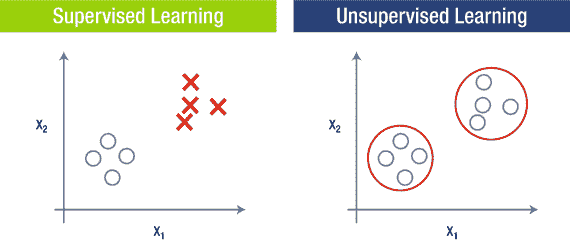

图 4-1。

Supervised vs. unsupervised learning

罗斯对这两种方法都提出了解释。

### 监督学习

顾名思义，监督学习算法需要监督，以便它们训练模型。在分类的情况下，这种监督通常是必要的，在这种情况下，我们已经标记了数据，我们根据这些数据训练模型来预测看不见的数据的标签。这里，监督是通过为每个观察提供的标签(即，监督学习过程)。例子包括离散预测值的分类和连续预测值的回归。

### 无监督学习

无监督学习算法在训练模型时不需要来自数据的监督。这方面的一个主要例子是聚类，它在不需要任何监督的情况下发现标签。这些发现的标签然后成为分类任何新的看不见的数据的基础。无监督学习的另一个例子是关联规则，它需要补充和替代的概念。互补指的是这样一种现象，如果一个购物者买了 X，那么很有可能他也会买 Y。替代指的是购物者购买 X 或 y 的行为。

其他示例包括异常检测、矩方法(例如，均值和协方差)、独立分量分析和主分量分析(PCA)。

罗斯不得不决定两者中哪一个适合他手头的问题和可用的数据。从表 [4-2](#Tab2) 中的数据，他注意到数据集没有提供标记数据。这意味着他必须使用无监督学习从零开始预测标签。

Ross 假设聚类作为一种无监督的学习方法，可以帮助他找到正确的细分市场，以满足营销目标。然而，他不太确定集群是否是正确的方法。因此，他想出了以下关于这个话题的材料。

## 使聚集

聚类分析指的是对观察结果进行分组，使得每个聚类内的对象共享相似的属性，并且所有聚类的属性彼此独立。聚类算法通常通过最大化聚类之间的距离和最小化聚类中对象之间的距离来进行优化。聚类分析不会在一次迭代中完成，而是经过多次迭代，直到模型收敛。模型收敛意味着所有对象的集群成员都会收敛，并且不会随着每次新的迭代而改变。一些聚类算法不要求聚类/组件的数量，而是得出在统计上更有意义的聚类数量。然而，大量的聚类算法会提前提示用户他希望输出的聚类/组件的数量。重要的是要明白，聚类就像分类一样，是用来对数据进行分段的；然而，这些组不是先前在训练数据集中定义的(即，它们是未标记的数据)。

不同的算法采用不同的技术来计算集群。其中一些技术如下:

*   分区:将数据分组到给定数量的簇中，同时针对目标进行优化(例如，距离)。
*   Hierarchical:将数据分组到簇的层次结构中。这些层次结构是自上而下或自下而上形成的。
*   基于网格:将数据划分为超矩形单元，丢弃低密度单元，并将高密度单元组合成簇。

一个好的聚类算法满足以下要求:

*   类内相似性和类间相异度
*   可以处理以下训练数据集:
    *   高度的
    *   受噪音和异常值的影响

罗斯现在对监督和非监督模型有了一些了解；然而，他不确定聚类是否可以应用于文本性质的数据。此外，他知道输入的特征数量越多，发现影响聚类发现过程的特征的机会就越大。因此，他必须想出一种方法将文本数据转换成数字形式，并使用现有的四个特征来生成更多的特征。

## 建模的数据转换

罗斯花了几个小时寻找这个谜的答案。他感到失望，因为他期望这种方法能够奏效并产生效果。为了简单起见，他将搜索范围缩小到一个特征(即群体)，并开始思考如何将其重新编码为数字形式。夜深了，罗斯却睡不着，然后他想到了一个主意。为什么不将“分组”功能转换为布尔型，这样，属于一个组的研究论文旁边将标记 1，否则标记 0。他能想到的数据表示是一个矩阵，其中列代表不同的组，行代表研究论文。

他知道一篇研究论文可以归入一个组。给定研究论文的组由数据集中的分隔符(即\n)分隔。因此，他首先决定通过在中间划分分隔符来分隔组，这样，如果一篇研究论文属于三个组，它将由数据集中三个不同的观察值(即行)来表示。

```py
s = data_train['groups'].str.split('\n').apply(pd.Series, 1).stack()
s.index = s.index.droplevel(-1)
s.name = 'groups'
del data_train['groups']
data_train = data_train.join(s).reset_index()

Listing 4-4.Stretching the Data Frame Row-wise as a Function of Groups

```

除了分隔组，Ross 还决定添加一个新特性“flags”，并为所有行赋值 1。按照他的想法，值 1 将表示该行中的研究论文属于“组”列中的组。

表 4-3。

Print of Observations of the Dataset After Data Frame Transformation


```py
data_train['flags'] = pd.Series(np.ones(len(data_train)), index=data_train.index)
data_train.head()

Listing 4-5.Adding New Variable for Group Membership

```

Ross 将一篇研究论文扩展为其所属组的功能，并将其与成员标志相关联，他知道是时候将这种数据结构转换为矩阵了。为此，他在清单 [4-6](#Par49) 中定义了函数。

```py
def matrix_from_df(data_train):

    matrix = data_train.pivot_table(index = ['title'], columns=['groups'], values='flags')
    matrix = matrix.fillna(0).reset_index()
    x_cols = matrix.columns[1:]
    return matrix, x_cols

Listing 4-6.Adding a Function for Matrix Creation

```

多年来，Ross 已经精通了 Microsoft Excel 中的数据透视表。因此，他决定将清单 [4-6](#Par49) 中的相同方法用于数据帧到矩阵的转换。因此，他在清单 [4-6](#Par49) 中初始化了一个方法，通过这个方法，他将训练数据转换成一个以 title 为索引的 pivot，每个组由一个单独的列表示，具有来自“flags”特性的值。然后，他在索引中的研究论文不属于给定组的领域的地方放置 0。他决定使用清单 [4-6](#Par49) 中定义的方法来激活矩阵。

表 4-4。

Initial Observations of the Matrix

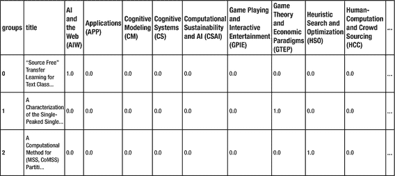

```py
matrix, x_cols = matrix_from_df(data_train)
matrix.head()
Listing 4-7.Retrieve Matrix and x cols from the matric_from_df Method

```

看到输出如预期的那样出来，Ross 很激动。为了测试他的理解，他从表 [4-4](#Tab4) 中随机挑选了一篇研究论文。他选择了“一种计算方法(MSS。CoMSS)。”通过查看表 [4-4](#Tab4) 中的矩阵，罗斯推断论文属于 HSO 组，不属于任何其他组。

现在他知道了什么是聚类，并且已经将数据转换成便于应用的形式，是时候应用聚类建模了。然而，首先他必须确定评估指标，通过这些指标他可以评估一个聚类模型的优劣。与可用于评估回归和分类模型的技术相反，没有多少技术可用于统计评估聚类模型的优劣。原因是在回归和分类中，已标记的数据已经可用，模型是在这些数据上训练的。然而，集群的情况并非如此。

### 评估聚类模型的度量

做了一些研究后，Ross 了解到没有一种方法可以评估聚类模型的输出。他找到了两种方法来实现它。第一个问题更多的是技术性的。如果在每个分类中解释了最大方差，分类中的对象共享相似的属性，并且分类彼此远离，那么它认为分类模型足够好。第二种方法表明，如果聚类定义具有直观意义，则模型是强的。

Ross 现在对聚类和评估其优点的方法有了清晰的理解。因此，他开始寻找在相关应用中效果最好的聚类模型。经过深入研究，他提出了几个聚类模型。

## 聚类模型

Ross 决定从事实聚类算法(即 k-means 聚类)开始。对 Ross 来说，在应用于手头的数据集之前，理解聚类收敛的方法是至关重要的。因此，他对 k-means 聚类算法进行了解释。

### k 均值聚类

k-mean s 聚类将数据空间划分为 Voronoi 单元表示。这种转换将数据观察值分成 k 个聚类，其中每个观察值属于具有最近平均值的聚类。k 均值聚类按如下方式进行:

1.  k 形质心是随机选择的。
2.  每个观察值都与最近的质心相关联。
3.  通过取每个聚类内的观察值的平均值来重新计算每个聚类的新质心。
4.  再次重复步骤 2。

您可能会注意到第 1 步和第 3 步彼此相似，不同之处在于，在第 1 步中，质心是随机选择的，而在第 3 步中，它们是通过取每个聚类内的观察值的平均值来计算的。

那么步骤 2 和 4 是相同步骤的重复。重复步骤 3 和 4，直到聚类收敛，也就是说，对于数据集中的所有观测值，聚类成员保持不变。这将最大化聚类之间的距离，并最小化每个聚类内的观测值之间的距离。k-means 聚类在最小化全局目标函数的同时并不总是找到最优配置。聚类算法对最初如何选择聚类中心非常敏感。

Ross 现在完全理解了 k-means 聚类算法是如何收敛的。然而，他不知道什么样的 k 值(即他应该预先指定的聚类数)对于手头的数据是最佳的。他记得在 Linkedin 上看过一篇关于 k-means 聚类的文章。因此，他寻找张贴那篇文章的人，然后给他发信息，请求他在这方面提供帮助。他的联系人波拉克建议罗斯使用以下方法:

*   肘法
*   解释差异
*   BIC score(BIC 评分)

他首先研究了肘方法的工作原理，然后将其应用于寻找模型的最佳聚类数。

#### 肘法

用 Ross 的术语来说，肘法是解释为聚类数的函数的方差百分比。它决定了新添加的聚类贡献了多少边际方差。有趣的一点是，第一个集群将解释最大方差，边际收益随着每个新集群的添加而下降。肘点将是一个新的聚类将导致相当大的边际下降的点，这是聚类的最佳数量。Ross 决定将肘方法应用于矩阵转换数据集。

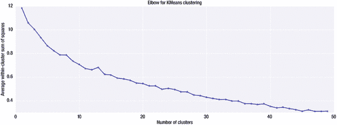

图 4-2。

Elbow method curve as a function of number of clusters

```py
matrix, x_cols = matrix_from_df(data_train)
X = matrix[x_cols]

K = range(1,50)
KM = [KMeans(n_clusters=k).fit(X) for k in K]
centroids = [k.cluster_centers_ for k in KM]

D_k = [cdist(X, cent, 'euclidean') for cent in centroids]
dist = [np.min(D,axis=1) for D in D_k]
avgWithinSS = [sum(d)/X.shape[0] for d in dist]

fig = plt.figure()
ax = fig.add_subplot(111)
ax.plot(K, avgWithinSS, 'b*-')
plt.grid(True)
plt.xlabel('Number of clusters')
plt.ylabel('Average within-cluster sum of squares')
plt.title('Elbow for KMeans clustering')

Listing 4-8.Applying Elbow Method and Variance Explained on Data Matrix

```

在清单 [4-8](#Par70) 中，Ross 回忆训练了 49 个 k-means 聚类模型，每个模型都有从 1 到 50 的不同 k 值。然后，他获取这些聚类模型的聚类中心，并逐个模型地确定每个研究论文模型的聚类成员。最后，对于每个模型，他计算了所有研究论文的总和，并除以研究论文的总数，以获得聚类平方和内的平均值。然后，他绘制了图 [4-2](#Fig2) 中所有 49 个聚类模型的聚类平方和，以形成肘方法。

在查看图 [4-2](#Fig2) 时，Ross 推断肘发生在 k = 9 处。然而，他没有被说服，除非有一个以上的方法不能集中在相同数量的集群上。因此，他开始理解差异解释。

#### 解释差异

解释的方差百分比，或者说 f 检验，是组方差与总方差的比率。这里，肘部将再次确定 k 均值聚类模型的最优聚类数。Ross 通过编写清单 [4-9](#Par74) 中的代码片段将 variance explained 付诸实践。

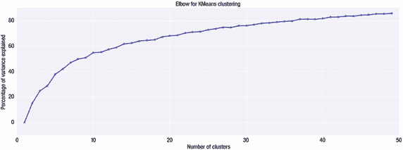

图 4-3。

Explained variance curve as a function of number of clusters

```py
matrix, x_cols = matrix_from_df(data_train)
X = matrix[x_cols]

K = range(1,50)
KM = [KMeans(n_clusters=k).fit(X) for k in K]
centroids = [k.cluster_centers_ for k in KM]

D_k = [cdist(X, cent, 'euclidean') for cent in centroids]
dist = [np.min(D,axis=1) for D in D_k]

wcss = [sum(d**2) for d in dist]
tss = sum(pdist(X)**2)/X.shape[0]
bss = tss-wcss

kIdx = 10-1

fig = plt.figure()
ax = fig.add_subplot(111)
ax.plot(K, bss/tss*100, 'b*-')
plt.grid(True)
plt.xlabel('Number of clusters')
plt.ylabel('Percentage of variance explained')
plt.title('Elbow for KMeans clustering')

Listing 4-9.Applying Elbow Method and Variance Explained to Data Matrix

```

罗斯回忆说，他曾用下面的话解释过列表[4-9](#Par74):

> After obtaining the clustering membership of each research paper, these distances are used to calculate the sum of squares within the class. Next, calculate the distance between columns in each research paper to calculate the total sum of squares. Finally, the intra-class sum of squares is subtracted from the total sum of squares to obtain the inter-class sum of squares. The ratio of sum of squares to total sum of squares is plotted in figure [4-3](#Fig3) .

对罗斯来说，图 4-3 看起来像一个指数累积分布函数。解释的方差似乎是平滑的，并且随着聚类数的增加而不断增加。这让罗斯很难搞清楚手肘。经过适当的考虑，Ross 注意到梯度从 k = 9 开始平滑，类似于他用肘方法观察到的情况。

然而，他并没有就此止步，继续寻找帮助确定最佳 k 的方法，并且在很短的时间内，他接触到了贝叶斯信息标准(BIC)得分。

#### 贝叶斯信息标准得分

BIC 是另一种从有限的模型集中选择最佳模型的技术。具有最低 BIC 分数的模型被认为是获胜者。当训练模型时，通过添加额外的参数，存在增加获得准确聚类的可能性的高概率；然而，他知道这样做会使模型过拟合。BIC 通过在模型中的一些参数上增加一个惩罚项来克服这个问题。BIC 的工作基于这样一个假设，即样本量应该远大于模型中参数的数量。因此，BIC 不适合处理高维数据的复杂模型。

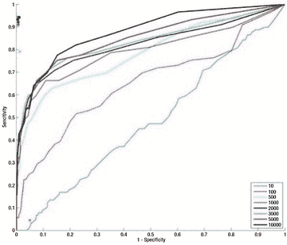

图 4-4。

Sample BIC score plot

BIC 评分知识库使罗斯放弃了它作为一个选项，因为 BIC 评分适合于低维数据，因此矩阵变换意味着现在数据具有(组数+ 1)维，使其成为高维数据。

他很想知道是否存在一种方法来确定最佳的聚类数，这种方法与 k-means 聚类的工作原理是一致的。换句话说，Ross 希望找到一种方法来确定最佳的集群数量，在这些集群上，集群间距离最大，集群内距离最小。他的研究促使他查阅研究论文，在那里他发现了剪影法。

#### 剪影分数

轮廓分数用于测量聚类内的观察值有多接近(即，聚类内距离(a))，以及聚类彼此有多不同(即，平均最近聚类距离(b))。轮廓系数计算如下:

*   (b-a) /最大值(a，b)

最好的值是 1，最差的是-1。系数值为 0 表示重叠的簇。罗斯现在要做的是选择产生最大轮廓分数的聚类数。没有浪费任何时间，他将剪影方法应用于 k-means 模型，聚类大小范围为 2 到 30。

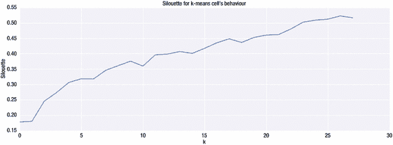

图 4-5。

Silhouette coefficients plot as a function of number of clusters

```py
s = []

for n_clusters in range(2,30):
    kmeans = KMeans(n_clusters=n_clusters)
    kmeans.fit(X)

    labels = kmeans.labels_
    centroids = kmeans.cluster_centers_

    s.append(silhouette_score(X, labels, metric='euclidean'))

plt.plot(s)
plt.ylabel("Silouette")
plt.xlabel("k")
plt.title("Silouette for K-means cell's behaviour")
sns.despine()

Listing 4-10.Plotting Silhouette Score Plot from the Data Matrix

```

罗斯对图 [4-5](#Fig5) 中的曲线感到困惑，因为轮廓系数似乎随着星团数量的增加而不断增加。由于该理论认为最佳聚类数是轮廓系数最高的点，他不能现实地选择 27 作为正确的聚类数，原因如下:

*   对于总共具有 398 个观察值的数据矩阵来说，27 个聚类将会太多。
*   实际上，他无法在有限的时间内营销 27 个不同的细分市场。

因此，他决定继续进行九个集群，这九个集群是他根据肘方法(即图 [4-3](#Fig3) )和方差解释(即图 [4-4](#Fig4) )确定的。

### 应用 k-均值聚类获得最佳聚类数

Ross 在清单 [4-11](#Par92) 中应用了聚类大小为 9 的 k-means 聚类。

```py
matrix, x_cols = matrix_from_df(data_train)
X = matrix[x_cols]

cluster = KMeans(n_clusters = 9, random_state = 2)
matrix['cluster'] = cluster.fit_predict(X)
matrix.cluster.value_counts()

Listing 4-11.Training k-means Model for Cluster Size of 9

```

输出

```py
0    81
1    78
2    32
3    38
4    27
5    44
6    36
7    30
8    30
Name: cluster, dtype: int64

```

在清单 [4-11](#Par92) 中，Ross 决定打印属于 9 个集群的研究论文的数量。他注意到，除了两个集群各有 80 个观察值外，其余七个集群平均各有 30 个观察值。

罗斯很想看看这些星团在视觉上会是什么样子。他意识到数据集中的维度是不同群体数量的函数。Ross 知道 Python 中的任何包都不足以绘制如此高维的图形。即使他成功地绘制了它，他也意识到这个图形太复杂了，无法提取任何直观的感觉。因此，他开始寻找一种方法来减少维度的数量。他没等多久就接触到了主成分分析(PCA)。

### 主成分分析

PCA 通过正交变换将一组高度相关的观察值转换成一组线性不相关的变量，称为主分量。完成这种变换使得第一个分量具有最高的方差。

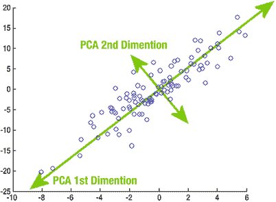

图 4-6。

Illustration of PCA

如图 [4-6](#Fig6) 所示，后续组件具有较低的方差，保持考虑其与前面组件正交的约束。PCA 对数据的相对缩放高度敏感。PCA 可以被认为是一种降维技术，它将高维数据减少到固定数量的分量。

读完描述后，Ross 确信降维是正确的。因此，他没有再浪费时间，编写了清单 [4-11](#Par92) 中的代码，将组的维度减少到两个维度(即 x 和 y)。他决定将其转换为二维，以便于他在二维轴上绘制集群。

表 4-5。

Print of Clusters Along with Two Newly Created Components Using PCA


```py
pca = PCA(n_components=2)
matrix['x'] = pca.fit_transform(matrix[x_cols])[:,0]
matrix['y'] = pca.fit_transform(matrix[x_cols])[:,1]
matrix = matrix.reset_index()

customer_clusters = matrix[['title', 'cluster', 'x', 'y']]
customer_clusters.head()

Listing 4-12.Using PCA to Transform Group-Related Features into Two Components

```

完成了表 [4-5](#Tab5) 中的转换后，Ross 现在不得不在散点图上绘制它，他为此编写了清单 [4-13](#Par102) 中的代码。

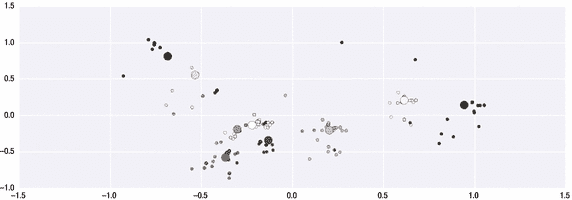

图 4-7。

Clusters in two-dimensional space

```py
cluster_centers = pca.transform(cluster.cluster_centers_)
cluster_centers = pd.DataFrame(cluster_centers, columns=['x', 'y'])
cluster_centers['cluster'] = range(0, len(cluster_centers))

plt.scatter(customer_clusters['x'], customer_clusters['y'], s = 20, c=customer_clusters['cluster'])
plt.scatter(cluster_centers['x'], cluster_centers['y'], s = 150, c=cluster_centers['cluster'])

Listing 4-13.Plotting Clusters in a Two-Dimensional Space

```

在写下清单 [4-13](#Par102) 中的代码时，Ross 确保给每个集群观察分配不同的颜色标签，以便他可以在图 [4-7](#Fig7) 中直观地看到它们的集群成员。此外，他还确保代表了集群中心。在他看来，图 [4-7](#Fig7) 中的集群成员是不同的，没有重叠。然而，回想起他最初设定的寻找与每个片段相关联的关键词的目标，他必须将降维的数据合并到原始数据(即，矩阵变换之前的数据)中。为此，他写下了清单 [4-14](#Par104) 中的脚本。

表 4-6。

Print of Observations of the Merged Data Frame

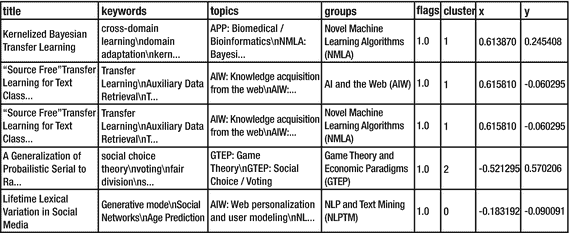

```py
customer_clusters.columns.name = None
df = data_train.merge(customer_clusters, on='title')
df.head()

Listing 4-14.Merging Matrix into the Original Data Frame

```

Ross 确保打印出这个合并数据对象的最初几个观察结果。他成功地合并了两种数据表示，因为现在数据具有来自原始数据集的标题、关键字、主题和性别特征，以及来自降维数据集的 flags、cluster、x 和 y 特征。他现在必须使用这个合并的数据集来为每个片段生成关键字。他决定通过使用一个单词云来做到这一点。单词云将显示与给定集群相关的所有单词，单词字体大小代表它们在 pivotal 特性中的出现频率。他计划保持 pivotal 特性的任意性，并且这个 pivotal 特性将被用来向 wordcloud 提供单词。他首先编写了清单 [4-15](#Par106) 中的方法来生成单词云。

```py
def wordcloud_object(word_string):

    FONT_ROOT = './fonts/'
    wordcloud = WordCloud(font_path=FONT_ROOT + 'arial.ttf',stopwords=STOPWORDS, background_color='black', width=1200, height=1000).generate(' '.join(word_string))
    return wordcloud

Listing 4-15.Creating Function to Generate Wordcloud

```

Ross 指出，清单 [4-15](#Par106) 中的代码的一个先决条件是，应该在与脚本本身相同的存储库中创建一个名为 Fonts 的文件夹，并将 Arial 字体文件推送到其中。为了测试，他建议将任何字符串输入作为参数传递给这个函数，让它生成一个 wordcloud。

Ross 更进一步，编写了清单 [4-16](#Par109) 中的代码，为 9 个集群中的每一个生成一个词云。

```py
def plot_wordcloud(df, clusters, pivot):

    fig = plt.figure(figsize=(15,29.5))
    for cluster in range(clusters):
        List_ = []

        for x in df[df['cluster']==cluster][pivot]:
            try:
                List_.extend(x.split('\n'))
            except:
                pass

        if List_:
            ax = fig.add_subplot(5,2,cluster+1)
            wordcloud = wordcloud_object(List_)
            plt.title('Cluster: %d'%(cluster+1))
            ax.imshow(wordcloud)
            ax.axis('off')

Listing 4-16.Creating Function to Plot Wordcloud for Each Cluster

```

在继续之前，Ross 指出`plot_wordcloud`方法中的一个参数是 pivot 参数。Pivot 是一个特征，单词包将从这个特征中提取出来以构成单词云。

罗斯很兴奋地想看看文字云会描绘出什么。因此，他不再等待，编写了清单 [4-17](#Par112) 中的代码来调用清单 [4-16](#Par109) 中初始化的方法，并将“关键字”作为关键特性传入。

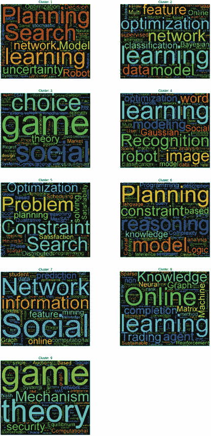

图 4-8。

Wordcloud for each cluster generated from keywords

```py
plot_wordcloud(df, cluster.n_clusters, 'keywords')
Listing 4-17.Generating Wordclouds of Feature Named ‘Keywords’

```

在看了图 [4-8](#Fig8) 之后，Ross 决定尝试一下他的演绎能力，并将九个集群定义如下:

*   第一组:讨论搜索和机器人技术的论文
*   集群 2:深入讨论模型学习和优化的论文
*   集群 3:数据分析在游戏和社交媒体分析中的应用主题
*   群组 4:图像识别、机器人和社交媒体分析的主题
*   第五组:线性规划和搜索主题
*   第 6 组:基于推理的模型论文
*   第 7 组:关于数据科学在社交图和其他在线媒体中的应用的论文
*   群组 8:知识图表中的主题范围
*   集群 9:专注于博弈论和数据安全的论文

Ross 指出了一个事实，即单词云中的单词是单个单词(即单个单词)。他对目前的结果很满意，但是在他看来，有些集群有重叠的术语；例如，聚类 1 和 5 将“search”作为重叠术语。Ross 认为重要的是消除重叠，使聚类关键字和特征尽可能与众不同。因此，他计划深入研究细节，看看这两个集群是否触及了相同或不同的 SEO 主题。他首先在清单 [4-18](#Par124) 中定义了一个方法，该方法将术语(例如“search”)作为参数，并返回包含该术语的每个集群的关键字。

```py
def perform_cluster_group_audit(clusters, term):

    for cluster in clusters:

        df_cluster = df[df['cluster'] == cluster]
        print 'Cluster number: %d'%(cluster + 1)
        keywords = list(df_cluster['keywords'])
        keywords = [keyword.split('\n') for keyword in keywords]
        keywords = [item for sublist in keywords for item in sublist]
        keywords = [keyword.lower() for keyword in keywords if term in keyword.lower()]
        keywords_freq = {x:keywords.count(x) for x in keywords}
        print sorted(keywords_freq.items(), key=operator.itemgetter(1), reverse=True)
        print '\n'

Listing 4-18.Define Method to Find Complete Keywords for Given Clusters and Unigram

```

Ross 指出了清单 [4-18](#Par124) 的倒数第二行，这是用来按照关键词出现频率的降序排列的。现在是时候使用清单 [4-18](#Par124) 中定义的方法了。他从在“搜索”方面区分集群 1 和集群 5 的主题开始。

```py
perform_cluster_group_audit([0,4], 'search')
Listing 4-19.Using Function to Find Keywords for Search in clusters 0 and 4

```

输出

```py
Cluster number: 1
[('heuristic search', 7), ('greedy best first search', 4), ('Monticello tree search', 2), ('bounded suboptimal search', 1), ('real-time search', 1), ('best-first search', 1), ('incremental search', 1), ('parallel search', 1), ('similarity search', 1), ('suboptimal heuristic search', 1), ('agent-centered search', 1), ('approximate nearest neighbor search', 1), ('hierarchical search', 1)]

Cluster number: 5
[('search', 3), ('heuristic search', 3), ('local search', 2), ('stochastic local search', 2), ('and/or search', 2)]

```

Ross 明确表示，簇 1 和 5 被称为 0 和 4，因为列表索引从 0 开始。清单 [4-19](#Par126) 的输出描述了由两个部分捕获的启发式搜索的主题。他注意到集群 5 有关于本地搜索的主题，集群 1 有关于其他搜索算法的主题。

在查看图 [4-8](#Fig8) 后，Ross 注意到集群 3、4 和 7 在社交媒体空间共享话题。因此他决定使用清单 4-20 中定义的函数来研究不同点。

```py
perform_cluster_group_audit([2,3,6], 'social')
Listing 4-20.Using Function to Find Keywords for Social in Clusters 2, 3, and 6

```

输出

```py
Cluster number: 3
[('computational social choice', 11), ('social choice theory', 2), ('social decision schemes', 2), ('randomized social choice', 1)]

Cluster number: 4
[('social media', 5), ('social spammer', 2), ('social image classification', 2)]

Cluster number: 7
[('social networks', 6), ('social network', 3), ('social infectivity', 3), ('social network analysis', 2), ('location based social network', 2), ('social influence', 2), ('social dynamics', 1), ('social explanation', 1)]

```

清单 [4-20](#Par131) 的输出让 Ross 清楚地看到了三个集群之间的区别。第三组强调社会选择理论。另一方面，集群 4 集中于社交图像分类和社交垃圾邮件。最后，第 3 组分组的研究论文与社会图和相互联系的影响。

罗斯很好奇，如果关键功能不是“关键词”，单词云会是什么样子 Ross 时间有限，要做的事情太多，所以他邀请你加入并帮助他回答练习中的问题。

Exercises

1.  绘制文字云，同时保持“组”作为关键特征。
2.  绘制文字云，同时保持“主题”作为关键特征。

Ross 在某处读到过 k-means 中的簇通常是球形的。他很想知道是否存在创造不同形状的非均匀集群的方法。没过多久，他就发现高斯混合模型是满足他好奇心的潜在候选模型。

### 高斯混合模型

高斯混合模型使用概率理论来估计数据可以分成的聚类数。它基于这样的假设:所有数据点都是从具有未知参数的有限数量的高斯分布的混合物中产生的。高斯混合模型可以被认为是对 k-means 的增强，其中考虑了数据的协方差和高斯模型的中心。

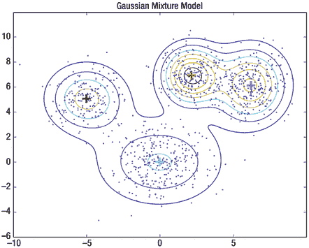

图 4-9。

Visual representation of Gaussian mixture model

高斯混合模型有以下变体来约束不同聚类估计的协方差:

*   球面的
*   斜的
*   系
*   完全协方差

Ross 决定应用高斯混合模型来找出分段及其特征。为此，他在清单 [4-21](#Par147) 中编写了一个函数来生成从高斯混合模型生成的聚类散点图。

```py
def plot_results(X, Y_, means, covariances, index, title):

    color_iter = itertools.cycle(['b', 'g', 'red', 'm', 'y', 'navy', 'c', 'cornflowerblue', 'gold',
                              'darkorange'])
    splot = plt.subplot(2, 1, 1 + index)
    for i, (mean, covar, color) in enumerate(zip(
            means, covariances, color_iter)):
        v, w = np.linalg.eigh(covar)
        v = 2\. * np.sqrt(2.) * np.sqrt(v)
        u = w[0] / np.linalg.norm(w[0])

        if not np.any(Y_ == i):
            continue
        plt.scatter(X[Y_ == i, 0], X[Y_ == i, 1], .8, color=color)

        angle = np.arctan(u[1] / u[0])
        angle = 180\. * angle / np.pi  # convert to degrees
        ell = mpl.patches.Ellipse(mean, v[0], v[1], 180\. + angle, color=color)
        ell.set_clip_box(splot.bbox)
        ell.set_alpha(0.5)
        splot.add_artist(ell)

    plt.xlim(0.0, 0.1)
    plt.ylim(-0.2, 1.2)

    plt.xticks(())
    plt.yticks(())
    plt.title(title)

Listing 4-21.Defining Function

to Plot the Clusters

```

在清单 [4-21](#Par147) 中，Ross 确保用不同的颜色表示每个集群，以便在视觉上区分它们。他现在期待应用高斯混合模型；然而，他不太确定组件的数量应该是多少。他查阅了文献，发现高斯混合模型中通常使用 BIC 分数来决定聚类数。现在，他的计划是运行一个高斯混合模型，用于所有可能的协方差类型和成分的组合(例如，从 2 到 9)。协方差类型包括球形、束缚形和完整形。对于这些组合中的每一个，将计算 BIC 分数，并选择具有最大 BIC 分数的组合。罗斯通过编写清单 [4-22](#Par149) 中的代码实现了这一点。


图 4-11。

Best Gaussian mixture model’s components plot


图 4-10。

BIC score per model

```py
matrix, x_cols = matrix_from_df(data_train)
X  = matrix[x_cols].as_matrix()
model_stats = []
n_components_range = range(2, 10)
cv_types = ['spherical', 'tied', 'full']
for cv_type in cv_types:
    for n_components in n_components_range:

        gmm = mixture.GaussianMixture(n_components=n_components,
                                      covariance_type=cv_type, random_state=0)
        gmm.fit(X)
        model_stats.append({'name':'%s_%d'%(cv_type, n_components), 'model':gmm, 'bic':gmm.bic(X)})

bic = np.array([m_type['bic'] for m_type in model_stats])
best_gmm = model_stats[bic.argmax()]
clf = best_gmm['model']
color_iter = itertools.cycle(['navy', 'turquoise', 'cornflowerblue'])

bars = []

# Plot the BIC scores
spl = plt.subplot(2, 1, 1)
for i, (cv_type, color) in enumerate(zip(cv_types, color_iter)):
    xpos = np.array(n_components_range) + .2 * (i - 2)
    bars.append(plt.bar(xpos, bic[i * len(n_components_range):
                                  (i + 1) * len(n_components_range)],
                        width=.2, color=color))
plt.xticks(n_components_range)
plt.ylim([bic.min() * 1.01 - .01 * bic.max(), bic.max()])
plt.title('BIC score per model')
spl.set_xlabel('Number of components')
spl.legend([b[0] for b in bars], cv_types)

labels = clf.predict(X)
plot_results(X, labels, gmm.means_, gmm.covariances_, 1,
             'Gaussian Mixture-%s'%gmm.converged_)

plt.xticks(())
plt.yticks(())
plt.title('Selected GMM: %s model, %s components'%(best_gmm['name'].split('_')[0], best_gmm['name'].split('_')[1]))
plt.subplots_adjust(hspace=.35, bottom=.02)
plt.show()

Listing 4-22.Determining the Optimal Covariance Type and Components for Model and Plotting It

```

Ross 指出，图 [4-10](#Fig10) 中的值为负值。因此，协方差类型和分量数为 0 将被视为获胜者。在这种情况下，协方差类型为“并列”的高斯混合模型和三个有资格成为获胜者的组件。Ross 很想知道是否所有的集群大小都是一致的。为此，他编写了清单 [4-23](#Par151) 中的代码。

```py
matrix['cluster'] = labels
matrix.cluster.value_counts()
Listing 4-23.Display Frequency of Objects

in Each Cluster

```

输出

```py
0     232
1     108
2     56
Name: cluster, dtype: int64

```

罗斯很想看看用这种方法得到的文字云会是什么样子，以及它们是否有任何直观的意义。然而，在此之前，他必须将矩阵合并到原始数据集中。他在清单 [4-24](#Par155) 中的代码的帮助下这样做了。

```py
customer_clusters.columns.name = None
df = data_train.merge(customer_clusters, on='title')
Listing 4-24.Merging Matrix into the Initial Data Frame

```

不再等待，他将清单 [4-25](#Par157) 中的合并数据集推送到清单 [4-15](#Par106) 中定义的函数中，用于生成 wordcloud 图。

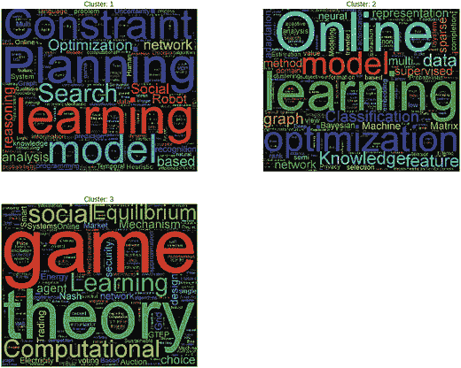

图 4-12。

Wordcloud for each cluster generated from keywords

```py
plot_wordcloud(df, gmm.n_components, 'keywords')
Listing 4-25.Generating Wordclouds of Feature Named “Keywords

”

```

Ross 决定测试他的演绎能力，并定义了属于这些类别的研究论文:

*   第一组:深入讨论模型学习和线性规划的论文
*   集群 2:深入讨论模型优化和知识图的论文
*   第三组:关于博弈论和社交媒体分析的主题

Ross 看到结果非常激动，因为这些星团在特征上似乎很独特。然而，他正在寻找一种能够自动确定最佳组件数量的算法。经过一番努力，他最终确定了贝叶斯高斯混合模型。

### 贝叶斯高斯混合模型

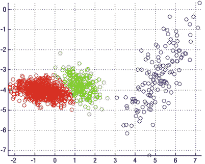

图 4-13。

Illustration of Bayesian Gaussian mixture model

贝叶斯高斯混合模型是高斯混合模型的变体，其中模型自己选择最佳的聚类数。当`weight_concentration_prior`被设置为足够小并且`n_components`被设置为大于模型发现的必要值时，它表现出这种行为。变分贝叶斯混合模型将一些混合权重值设置为接近于零，这使得模型能够自动选择有效成分。

Ross 决定将贝叶斯高斯混合模型应用于数据矩阵。他决定将组件的数量限制在五个。他很想知道贝叶斯高斯混合模型认为有多少组件是最优的。


图 4-14。

Clusters formed by means of Bayesian Gaussian mixture model

```py
matrix, x_cols = matrix_from_df(data_train)
X  = matrix[x_cols].as_matrix()

dpgmm = mixture.BayesianGaussianMixture(n_components=3,
                                        covariance_type='full', random_state=1).fit(X)

labels = dpgmm.predict(X)
plot_results(X, labels, dpgmm.means_, dpgmm.covariances_, 1,
             'Bayesian Gaussian Mixture with a Dirichlet process prior-%s'%dpgmm.converged_)

plt.show()

Listing 4-26.Training the Model and Plotting the Clusters

```

图 [4-14](#Fig14) 中的三种颜色暗示 Ross 这三种成分足以使模型收敛。他感兴趣地想知道研究论文出现在这些集群中的频率；因此，他编写了清单 [4-27](#Par168) 中的代码片段。

```py
matrix['cluster'] = labels
matrix.cluster.value_counts()
Listing 4-27.Display Frequency of Objects in Each Cluster

```

输出

```py
0     229
1     117
2     50
Name: cluster, dtype: int64

```

Ross 注意到，第一个聚类有超过 50%的观察值落在它自己内部，在接下来的两个聚类中，观察值的数量减少。

当前矩阵只有标题和聚类作为特征。因此，他决定将它们合并到初始数据框中，以便访问与这些研究论文标题相对应的其他要素。

```py
customer_clusters.columns.name = None
df = data_train.merge(customer_clusters, on='title')
Listing 4-28.Merging Matrix into the Initial Data Frame

```

是时候让罗斯探索这三个集群的特征了。因此，他将清单 [4-16](#Par109) 中定义的函数应用到了应用中。

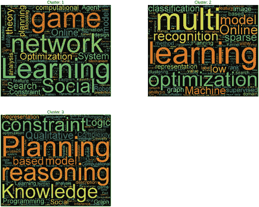

图 4-15。

Wordcloud for each cluster generated from keywords

```py
plot_wordcloud(df, dpgmm.n_components, 'keywords')
Listing 4-29.Generating Wordclouds of Feature Named “Keywords”

```

Ross 在下面的单词中借助单词云定义了这三个集群:

*   第一组:深入讨论博弈论和社交媒体分析的论文
*   第二组:深入讨论模型优化和模型学习的论文
*   第三组:线性规划、知识图和基于推理的模型

Ross 很满意，因为在完成这个练习后，他能够得到具有不同特征的有限簇。他计划放弃 k 均值的输出，继续使用贝叶斯高斯混合模型定义的细分市场。他的推理是，第一，聚类更直观，第二，它足够聪明，可以自己找到最优的聚类数。

尽管 Ross 已经解决了眼前的问题，但他还是很想看看集群在现实世界中的应用。

## 聚类的应用

聚类的应用在几个研究领域非常活跃。

### 识别疾病

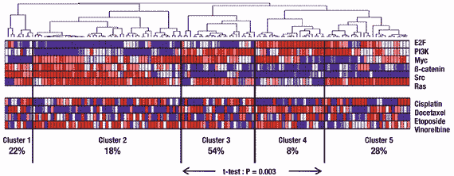

图 4-16。

Clusters obtained along with their confidence intervals while identifying diseases

聚类最近引起了医学领域的注意。这主要是因为无监督的非线性聚类算法在预测癌症疾病方面相对更有效。

### 搜索引擎中的文档聚类

搜索引擎使用用户的输入查询作为参数来聚类来自信息检索系统的文档。因此，搜索结果按照这些聚类文档的排序顺序排列。

### 基于人口统计的客户细分

聚类也用于市场营销领域，更确切地说，是品牌营销。营销研究主管使用聚类来找出他们的品牌和他们的竞争对手的客户细分和感知地图。这样他们就找到了自己品牌的定位和所迎合的客户细分。这有助于品牌确定目标客户角色，包括现有和潜在客户，以及他们的人口统计数据。

Ross 决定通过回忆他是如何开始有监督和无监督算法之间的差异来结束他的旅程。然后，他将数据转换成矩阵，以增加手头数据的维度。他研究了确定最佳聚类数的不同方法。他学会了如何制作文字云来产生对所形成的集群的直观感觉。沿着最终目标的路线，他使用了几种技术来寻找正确的技术，将研究论文分成具有不相交特征的片段。他的计划是在今年即将到来的会议上通过相关关键词来营销这些细分市场。他从贝叶斯高斯混合模型中选择了三个成分，为明年即将到来的会议加油。