# 5.分类

本章旨在解决依赖于有限数量结果的现实世界问题。这些结果本质上可以是布尔型的，只有两个选择(即真/假或是/否)。它们也可以是名义上的(乘客将乘坐的船名、一组学生将拥有的最高教育程度等)。).在本章中，我们将讨论监督学习，通过监督学习，标记数据将用于训练模型。在此数据上训练模型将允许在看不见的数据集上进行标签预测(即，未来预测)。在本章中，我们将讨论特征提取和选择，并以评估分类准确性的方法作为结束。

Note

本书将 Python 2.7.11 作为编码示例的事实标准。此外，您需要为练习安装它。

在这一章中，我们将纳入可从下载的医疗预约失约数据集

[T2`www.kaggle.com/joniarroba/noshowappointments`](http://www.kaggle.com/joniarroba/noshowappointments)

## 案例研究:俄亥俄诊所——满足供需

俄亥俄州诊所的儿科医生兼诊所主管朱迪医生陷入了大麻烦，连续第三年面临诊所亏损。Judy 医生最近被提升到这个职位，但她知道诊所在效率方面已经做了尽职调查。最让她吃惊的是，尽管医院有最好的医生，也不缺乏预约，但医院仍在遭受损失。为了对财务方面的事情放心，她聘请了第三方公司来审计财务部。然而，该公司没有发现与手头的困境相关的证据。

俄亥俄州诊所是俄亥俄州的一个非营利性医疗中心。该诊所的独特使命是将研究和教育与临床和医院护理相结合。该医疗中心拥有 50，000 名员工，由于这些员工的共同努力，到目前为止，该医疗中心已经能够处理大约 700 万次就诊。

以前，在这种情况下，医院依靠捐赠者的资金流入。然而，随着最近管理层的变化，已经开始努力使医疗中心能够自我维持。正如朱迪博士回忆的那样，管理层的这一新举措对我来说是一个巨大的挑战，因为当时正是我接手这个职位的时候。我没有时间安顿下来，因此对我来说这是一个生死关头。如果财务状况没有问题，预约数量激增，没有大规模的招聘或加薪，那么这种困境的唯一原因可能是患者在预约后没有出现。

董事会会议预计很快召开，她必须在那之前收集见解，为这种异常现象给出一个原因。朱迪医生知道，不管是猜测还是谣言都无法让她找出损失的原因，尽管预约的次数很多。为了进一步调查她的怀疑，她获得了约会的数据转储，并决定使用这些数据来验证证据。她知道具体的数据不会受到偏见的影响，因此可以清楚地描述手头的情况。首先，她必须交叉检查数据集中的特征是否与手头的问题相关。因此，她取出了表 [5-1](#Tab1) 中的数据字典。

表 5-1。

Data Dictionary for the Medical Appointment No-Shows Dataset

<colgroup><col> <col></colgroup> 
| 功能名称 | 描述 |
| --- | --- |
| 年龄 | 患者年龄 |
| 性别 | 患者的性别 |
| 预约注册 | 向患者发出预约的日期 |
| 约会数据 | 向患者发出预约的日期 |
| 每周 | 发布约会的星期几 |
| 状态 | 发布约会的星期几(即响应变量) |
| 糖尿病 | 无论患者是否患有糖尿病 |
| 酒精中毒 | 病人是否受到酒精中毒的影响 |
| 高血压 | 无论病人是否有高血压 |
| 障碍 | 无论病人是否残疾 |
| 烟 | 无论病人是否吸烟 |
| 肺结核 | 无论病人是否患有肺结核 |
| 奖学金 | 患者是否获得过社会福利机构的奖学金。贫困家庭可以通过接受经济援助而受益。 |
| 短信提醒 | 是否已向患者发出预约短信提醒 |
| 等待时间 | AwaitingTime =约会注册–约会数据 |

Judy 博士在网上搜索，寻找她在整个分析过程中需要的所有相关软件包。清单 [5-1](#Par11) 展示了她的网络搜索结果。

```py
%matplotlib inline

import numpy as np
import pandas as pd
from time import time
import matplotlib.pyplot as plt
from IPython.display import Image
from matplotlib.pylab import rcParams

from sklearn import metrics
from sklearn.cross_validation import train_test_split

from sklearn.decomposition import PCA
from sklearn import kernel_approximation
from sklearn.linear_model import SGDClassifier
from sklearn.tree import DecisionTreeClassifier
from sklearn.kernel_approximation import (RBFSampler,Nystroem)
from sklearn.ensemble import GradientBoostingClassifier, RandomForestClassifier

rcParams['figure.figsize'] = 15, 5

Listing 5-1.Importing Packages Required for This Chapter

```

Judy 博士希望利用数据转储中的信息做以下工作:

1.  发现尽管约会率在上升，亏损却在上升的原因？
2.  如果患者没有在预定的时间报到，想出一个方法来根据他/她的特征确定患者是否会出现。她认为，知道哪些患者可能不会出现将使医院能够采取如下对策:
    *   提供持续的约会提醒和确认
    *   使医生和医院工作人员的人数符合手头的需求。 

Judy 博士决定首先了解数据转储中的特性，并列出它们可能的值。

## 特征探索

Judy 博士相信数据转储，并使用清单 [5-2](#Par19) 中的代码片段将其加载到计算机的内存中。她还确保打印来自数据转储的第一个初始观察结果。

表 5-2。

Print of Observations of the Dataset


```py
data = pd.read_csv('examples/No-show-Issue-Comma-300k.csv')
data.head()
Listing 5-2.Reading the Data in the Memory and Printing the First Few Observations

```

Judy 博士决定使用表 [5-2](#Tab2) 作为辅助，将特征分类为最常见的数据类型。

*   整数:年龄，等待时间
*   String:性别、日期、星期、状态
*   日期时间:约会注册，约会数据
*   Boolean:高血压，残疾，吸烟，奖学金，肺结核，短信提醒

她预计数据转储中的记录数以千计，因为她注意到约会日历通常在每个月初都是满的。她决定在清单 [5-3](#Par26) 中进行验证。

```py
print len(data)
Listing 5-3.Finding Count of Number of Observations in the Dataset

```

输出

```py
300000

```

清单 [5-3](#Par26) 的输出远远超出了 Judy 博士的预期，并向她保证了从数据中获得的见解具有很高的可信度。接下来，她计划观察每个特征中不同值的数量。她认为这将有助于她放弃没有可变性的要素(即所有观测值都具有相同的值),并确定这些要素可用于表示的地块类型。为此，她编写了清单 [5-4](#Par30) 中的代码。

```py
for column in list(data.columns):
    print "{0:25} {1}".format(column, data[column].nunique())

Listing 5-4.Print of the Frequency of Distinct Values in Each Feature Set

```

输出

```py
Age                             109
Gender                          2
AppointmentRegistration         295425
ApointmentData                  534
DayOfTheWeek                    7
Status                          2
Diabetes                        2
Alcoolism                       2
HiperTension                    2
Handicap                        5
Smokes                          2
Scholarship                     2
Tuberculosis                    2
Sms_Reminder                    3
AwaitingTime                    213

```

Judy 博士解释说，print 语句中的{0:25}表示将打印第一个索引(即列)中的特征，并为其分配 25 个字符空间。清单 [5-4](#Par30) 的输出意味着数据集中有许多变量具有离散值，例如性别、状态、工作日等等。这有助于她选择代表这些特征的绘图类型。她决定用直方图来表示意识时间和年龄，因为这些是数字，本质上是连续的。至于本质上是离散的特征，她计划用条形图来表示。她通过初始化清单 [5-5](#Par34) 中的函数来执行那个图形，然后在图 [5-1](#Fig1) 中调用它来绘制图形。

```py
def features_plots(discrete_vars):

    plt.figure(figsize=(15,24.5))

    for i, cv in enumerate(['Age', 'AwaitingTime']):
        plt.subplot(7, 2, i+1)
        plt.hist(data[cv], bins=len(data[cv].unique()))
        plt.title(cv)
        plt.ylabel('Frequency')

    for i, dv in enumerate(discrete_vars):
        plt.subplot(7, 2, i+3)
        data[dv].value_counts().plot(kind='bar', title=dv)
        plt.ylabel('Frequency')

Listing 5-5.Initialize Function to Plot All Features Within the Dataset

```

Judy 博士指出，清单 [5-5](#Par34) 中的方法将本质上离散的特性名称作为输入，因为这些特性将被表示为条形图。没有浪费时间，她调用函数来绘制清单 [5-6](#Par36) 中的特征表示。

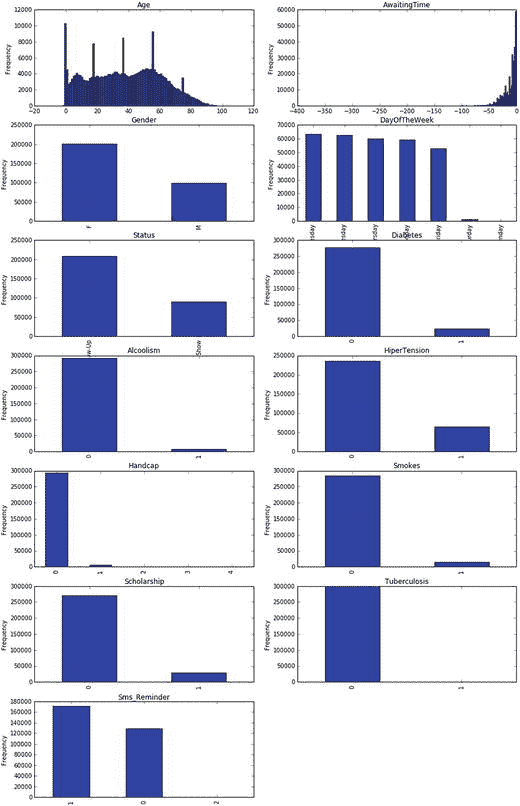

图 5-1。

Plots of feature representations

```py
discrete_vars = ['Gender', 'DayOfTheWeek', 'Status', 'Diabetes',
                     'Alcoolism', 'HiperTension', 'Handcap', 'Smokes',
                         'Scholarship', 'Tuberculosis', 'Sms_Reminder']

features_plots(discrete_vars)

Listing 5-6.Calling ‘features_plot’ method in Listing 5-5 to Plot the Feature Representation

```

在查看图 [5-1](#Fig1) 时，Judy 博士注意到这些特征都没有缺失值。她对数据集中的一些要素进行了如下推断:

*   年龄:年龄在-2 到 113 之间。年龄在 0 到 113 之间确实有意义，但让她惊讶的是它怎么会是负数。在她看来，数据集中有一些噪音。
*   障碍:不是布尔型的，这个特性的值在 0 到 4 的范围内。
*   Sms_Reminder:它不是一个布尔实体，它的值在 0 到 2 的范围内。在她看来，Sms_Reminder 代表了发送给每个患者的提醒的频率。
*   AwaitingTime:Judy 医生对 awaiting time 的负面看法感到困惑。根据定义，这一特征表示从发出约会到发出约会的天数。她认为正数会更有意义。

从推论中得到的发现意味着 Judy 博士在将数据推入分析管道之前，必须对数据进行一点清理(即进行数据辩论)。

## 进行数据辩论

她在某处读到过，数据争论是将原始数据映射为适合分析数据的有组织形式的过程。图 [5-1](#Fig1) 中的发现描述了“年龄”中负值的存在，这对她来说没有任何直观意义，因此她称之为噪音。因此，她计划通过计算负年龄值的频率来开始治疗。如果这些观察的频率很高，她不会删除它们，因为这样做会使她无法发现预测所需的变化。相反，如果它们的频率可以忽略不计，她计划删除它们，因为删除它们不会对分析产生重大影响。她从清单 [5-7](#Par44) 中负年龄值的频率开始。

```py
data[data['Age'] < 0]['Age'].value_counts().sum()
Listing 5-7.Counting Frequency of Negative Age Observations

```

输出

```py
6

```

清单 [5-7](#Par44) 的输出表明，与数据集中的观察总数相比，负年龄观察值可以忽略不计。因此，朱迪博士决定从年龄特征中去除这些负面的观察结果。

```py
data = data[data['Age'] >= 0]
Listing 5-8.Removing Observations with Negative Age Values

```

在查看图 [5-1](#Fig1) 的推论时，Judy 博士还注意到名为‘差点’的特征是一个整数变量，而不是布尔变量。她回顾说，数据源中缺少这一功能集的数据定义，因此可能有多种解释。对于 0 到 4 范围内的值，她能想到的唯一理由是，这可能是一个李克特量表问题，或者是一个代表患者残疾次数的数字实体。由于对该要素的解释不明确，她决定从数据集中删除该要素。

```py
del data['Handcap']
Listing 5-9.Removing Variable Named ‘Handicap’ from the Dataset

```

在查看图 [5-1](#Fig1) 中的推论时，Judy 博士还回忆说，AwaitingTime 内的值似乎是负值，因此将它们转换为正值是有意义的。

```py
data['AwaitingTime'] = data['AwaitingTime'].apply(lambda x: abs(x))
Listing 5-10.Making Values Within AwaitingTime Positive

```

根据她在图 [5-1](#Fig1) 中的推论对特征的处理已经完成。然而，Judy 博士回忆说，大多数机器学习算法在整数或浮点输入下工作得最好，而不是字符串格式。她知道数据集中的分类变量不符合这个条件，因此对她来说将字符串分类特征重新编码为它们的整数对应物是很重要的。Judy 博士首先通过绑定从字符串到整数的映射来重新编码 DayOfTheWeek。

```py
dow_mapping = {'Monday' : 0, 'Tuesday' : 1, 'Wednesday' : 2, 'Thursday' : 3, 'Friday' : 4, 'Saturday' : 5, 'Sunday' : 6}
data['DayOfTheWeek'] = data['DayOfTheWeek'].map(dow_mapping)

Listing 5-11.Recode String Categorical Feature DayOfTheWeek to Integers

```

Judy 博士解释了她的重新编码方法如下:

> There is a way to automatically recode classification variables. These methods perform re-coding in alphabetical order, so that if the category of a feature is male and female, it will assign the code 0 to female and 1 to male. DayOfTheWeek is an ordinal number; Therefore, I decided to map manually. However, gender and status characteristics are not so, because they are nominal in nature. Therefore, I will use predefined methods to automatically re-encode.

Judy 博士对清单 [5-12](#Par58) 中的“性别”和“身份”进行了重新编码。

```py
for field in ['Gender', 'Status']:
    data[field] = pd.Categorical.from_array(data[field]).codes
Listing 5-12.Recode String Categorical Features to Integers

```

一旦她对原始数据集进行了数据辩论，Judy 博士就好奇它们的表示是如何变化的。因此，她查看了图 [5-2](#Fig2) 来查看它们转换后的特征表示。

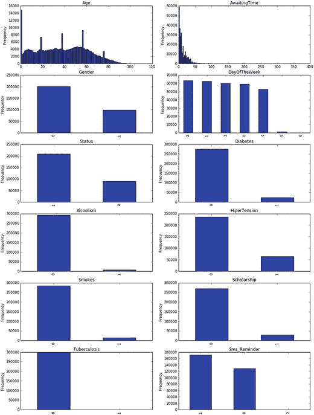

图 5-2。

Plots of feature representations post data wrangling

```py
discrete_vars = ['Gender', 'DayOfTheWeek', 'Status', 'Diabetes',
                     'Alcoolism', 'HiperTension', 'Smokes',
                         'Scholarship', 'Tuberculosis', 'Sms_Reminder']

features_plots(discrete_vars)

Listing 5-13.Feature Representations Post Data Wrangling

```

Judy 博士确保从清单 [5-13](#Par58) 的离散特征列表中删除“障碍”。她指出，重新编码指定代码的范围

*   0 到(要素内的唯一观测值的数量- 1)

在观察图 [5-2](#Fig2) 时，朱迪博士注意到等待时间似乎以指数形式衰减。根据她的观察，大多数患者的年龄为 0 岁(即婴儿的年龄为几个月)。她还指出了 19 岁、38 岁和 57 岁时的远足。除此之外，另一个令人惊讶的事实是，三分之一的患者是男性，同样比例的患者没有在约会的日期和时间出现。这个信息给了她一个线索，为什么诊所在预约数量增加的情况下仍然亏损。她还注意到大多数病人至少收到一条短信提醒；然而，有三分之二的时间没有发送提醒。她认为，没有预约提醒可能是病人没有出现的原因。

一旦她理解了数据集中的要素，并通过执行数据辩论消除了歧义，Judy 博士就有兴趣确定数据集中不同要素之间的关系。她希望进行这种多变量分析，以直观地了解哪些类型的患者没有在约定的日期和时间出现。

## 执行探索性数据分析

Judy 博士并没有从探索性数据分析(EDA)开始，而是认为最好是直观地查看数据，以确定是否存在她可以将模型重定向到的模式。朱迪医生认为，随着年龄的增长，人们看医生的需求也会增加。这背后的概念是，随着人们年龄的增长，疾病呈指数增长。因此，她编写了清单 [5-14](#Par66) 中的代码，看看这些量之间的关系在现实中是否成反比。

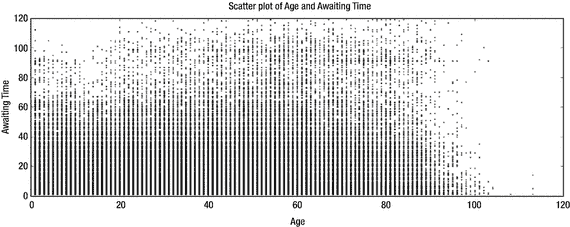

图 5-3。

Scatter plot between Age and  AwaitingTime

```py
plt.scatter(data['Age'], data['AwaitingTime'], s=0.5)
plt.title('Scatter plot of Age and Awaiting Time')
plt.xlabel('Age')
plt.ylabel('Awaiting Time')
plt.xlim(0, 120)
plt.ylim(0, 120)

Listing 5-14.Scatter Plot Between Age and AwaitingTime

```

朱迪博士对结果不满意，因为图 [5-3](#Fig3) 给出了一个高度分散的图，在开始时没有相关性的迹象，在 90 岁以后有一点负相关性。视觉表现表明早先建立的假设已经失败。然而，她决定在清单 [5-15](#Par68) 中使用统计相关技术来验证这一点。

```py
pd.set_option('display.width', 100)
pd.set_option('precision', 3)
correlations = data[['Age', 'AwaitingTime']].corr(method='pearson')
print(correlations)

Listing 5-15.Calculating Pearson Correlation Between Age and AwaitingTime

```

输出

```py
               Age             AwaitingTime
Age            1.00e+00        -4.18e-03
AwaitingTime   -4.18e-03       1.00e+00

```

年龄和觉醒时间之间的相关性接近于 0，这符合她早先建立的假设。她现在有兴趣看看短信提醒的增加是否增加了病人出现或不出现的可能性。出于这个原因，她编写了清单 [5-16](#Par72) 中的代码来绘制图 [5-4](#Fig4) 中的堆积条形图。

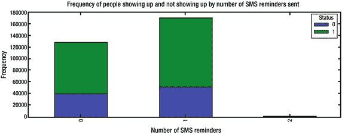

图 5-4。

Stacked bar chart between Status and Sms_Reminder

```py
data_dow_status = data.groupby(['Sms_Reminder', 'Status'])['Sms_Reminder'].count().unstack('Status').fillna(0)
data_dow_status[[0, 1]].plot(kind='bar', stacked=True)
plt.title('Frequency of people showing up and not showing up by number of SMS reminders sent')
plt.xlabel('Number of SMS reminders')
plt.ylabel('Frequency')

Listing 5-16.Effect on Status on the Basis of Number of SMS Reminders

```

查看图[5-4](#Fig4)Judy 医生注意到，一次提醒后出现的患者数量相对于未发送提醒时出现的患者数量的变化率约为 30%(即(0.17m–0.13m)/0/13m)，而一次提醒后未出现的患者数量相对于未发送提醒时出现的患者数量的变化率约为 25%(即(0.05m–0.04m)/0/04m)因此，她得出结论，短信提醒确实略微增加了患者在预约日出现的可能性。

朱迪医生的观点是，大多数患者会在一周的中间出现，而他们中的许多人改变了计划，不会在一周开始或结束时出现在约会中。她认为这是因为一周的开始和结束通常是企业最忙的时候，而工作的放松发生在一周的中间。她决定在清单 [5-17](#Par75) 中验证她的观点。

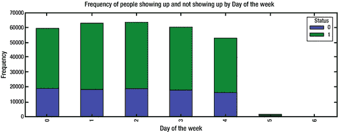

图 5-5。

Stacked bar chart between Status and DayOfTheWeek

```py
data_dow_status = data.groupby(['DayOfTheWeek', 'Status'])['DayOfTheWeek'].count().unstack('Status').fillna(0)
data_dow_status[[0, 1]].plot(kind='bar', stacked=True)
plt.title('Frequency of people showing up and not showing up by Day of the week')
plt.xlabel('Day of the week')
plt.ylabel('Frequency')

Listing 5-17.Effect on Appointment Day of the Week on the Basis of Number of SMS Reminders

```

Judy 博士指出，在图 [5-5](#Fig5) 中，0 代表星期一，而 6 代表星期日，其余日子按顺序排列。周六几乎没有病人来，周日诊所也不开门。在接下来的五天里，未就诊者的变化率基本保持不变，而就诊者的分布似乎遵循一条钟形曲线，大多数患者在周三就诊。

朱迪博士认为，越年轻的人越有可能忙碌并有工作。因此，他们可能时间不够，很可能不会在约定的时间出现。她最初想找到中心的度量(即平均值或中值)来验证她的假设。但是，她不确定应该继续使用哪一个度量中心(即平均值、中间值或众数)。

她从图 [5-2](#Fig2) 中回忆道，年龄的大量观察值为 0。她知道在计算平均值时，这可能会变成一个缺点，因为这会将平均值拉向较低的一边。因此，她认为更好的衡量标准是不受离群值影响的中值。因此，她计划绘制一个按地位分组的年龄方框图。

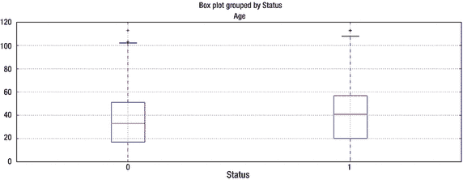

图 5-6。

Box plot of Age by Status

```py
data.boxplot(column=['Age'], return_type='axes', by='Status')
plt.show()
Listing 5-18.Plotting Box Plot of Patients’ Age by Status

```

她很高兴看到图 [5-6](#Fig6) 中的结果，因为她的假设是正确的，因为出席者的中值年龄(即 40 岁)相对大于未出席者的中值年龄(即 32 岁)。她还指出，出席人数的上限(即四分位数 3)为 58 人，相对高于不出席人数的上限(即 52 人)。

朱迪博士决定分别分析男女双方的年龄和地位。因此，她编写了代码片段来绘制清单 [5-19](#Par82) 中的线图。


图 5-7。

Line chart of Age by Gender status-wise

```py
plt.figure(figsize=(15,3.5))

for i, status in enumerate(['no show ups', 'show ups']):

    data_show = data[data['Status']==i]
    plt.subplot(1, 2, i+1)

    for gender in [0, 1]:
        data_gender = data_show[data_show['Gender']==gender]
        freq_age = data_gender['Age'].value_counts().sort_index()
        freq_age.plot()

    plt.title('Age wise frequency of patient %s for both genders'%status)
    plt.xlabel('Age')
    plt.ylabel('Frequency')
    plt.legend(['Female', 'Male'], loc='upper left')

Listing 5-19.Plotting Line Plot of Age by Gender for Patients Status-Wise

```

两种状况下男性的年龄模式似乎相似，而不同状况下女性的年龄模式有所不同。年龄在 42 到 62 岁之间的女性很可能在约会的日期和时间出现。

朱迪医生认为，那些等待时间很长的人(即，离预约还有几天)会更愿意去看另一个医生，而不是等这么久。她认为，另一个没有在预约日期出现的原因可能是，如果疾病是季节性的，那么在一些预防技术或家庭治疗后，它很可能被治愈。因此，到了预约时间，病人决定不去看医生。她决定从手头的数据来看看这是不是真的。

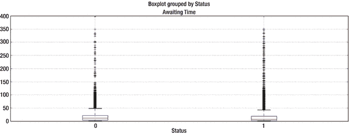

图 5-8。

Box plot of AwaitingTime by Status

```py
data.boxplot(column=['AwaitingTime'], return_type='axes', by='Status')
plt.show()
Listing 5-20.Plotting Box Plot of AwaitingTime by Status

```

在查看了图 [5-8](#Fig8) 后，Judy 博士推断，唤醒时间在第三个四分位数的患者更有可能不出现，这支持了她之前提出的零假设——随着等待时间的增加，患者不出现的可能性也增加。她还指出，两种情况下的中位数都接近于零。

Judy 博士非常激动，因为探索性数据分析为她提供了许多见解。总之，她观察到短信提醒增加了病人准时出现的可能性。她还注意到，年轻的病人更经常没有在约定的时间出现，而年长的病人更守纪律，会准时出现。她还发现，等待时间长的人决定不在约定的日期和时间出现。朱迪博士现在有了一个公平的想法，即没有赴约是损失的原因，她已经洞察到是什么导致人们表现出这种行为。现在，她正计划继续前进，制作一个分类模型来预测病人未来出现或不出现的可能性。这一点很重要，因为如果她知道在某一天、某一周或某一月会出现的患者总数，她就可以同样地调整资源以节省成本。然而，在开始这种分类之前，她想知道是否可以通过特征生成的方式从现有的特征中提取更多的特征。她相信这将有助于她捕捉数据集中的可变性和明确的模式。

## 特征生成

在机器学习中，数据集中的观察值和特征集的数量越多，模型捕捉其中的可变性以理解其真正本质的可能性就越大。朱迪博士知道增加观察次数是不可行的；但是，她可以增加数据集中的要素集。朱迪博士不知道如何从现有的特征中提取更多的特征。经过深思熟虑，她决定将具有日期的特性分解成更细粒度的日期组件。她编写了清单 [5-21](#Par89) 中的代码片段，将她的逻辑应用于名为 AppointmentRegistration 和 AppointmentDate 的特性。

```py
for col in ['AppointmentRegistration', 'ApointmentData']:
    for index, component in enumerate(['year', 'month', 'day']):
        data['%s_%s'%(col, component)] = data[col].apply(lambda x: int(x.split('T')[0].split('-')[index]))

Listing 5-21.Breaking Date Features into Date Components

```

Judy 博士解释说，清单 [5-21](#Par89) 中的代码片段将 AppointmentRegistration 和 AppointmentData 特性分解为它们各自的年、月和日组件。然而，它并没有将它们分解成时间组件，因为 ApointmentData 在其 string 对象中没有时间组件，而 AppointmentRegistration 特性却有。因此，她编写了清单 [5-22](#Par91) 中的代码，将 AppointmentRegistration 特性分解成它的时间组件。

```py
for index, component in enumerate(['hour', 'min', 'sec']):
    data['%s_%s'%('AppointmentRegistration', component)] = data['AppointmentRegistration'].apply(
       lambda x: int(x.split('T')[1][:-1].split(':')[index]))

Listing 5-22.Breaking AppointmentRegistration into Time Components

```

接下来，她编写了清单 [5-23](#Par93) 中的代码来见证特性生成的步骤。

表 5-3。

Print of Observations of the Dataset

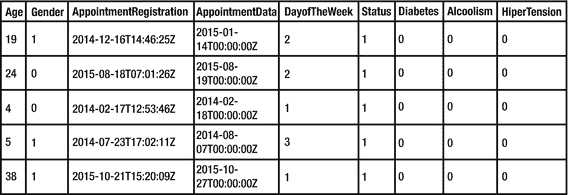


```py
data.head()
Listing 5-23.Printing First Few Observations of the Features Extracted Dataset

```

看着表 [5-3](#Tab3) 朱迪博士激动地看着这一代功能成为现实。证据是表示年、月、日、小时、分钟和 AppointmentData 和 AppointmentRegistration 的秒部分的列。Judy 博士很清楚，她增加特性集的方法并不是事实上的技术，因为存在其他几种实现相同目标的技术。她有一些关于提取更多特征的想法；然而，为了节省时间，她选择了最简单的方法。但是，如果有人可以帮助她从日期特征中提取其他日期成分，或者帮助她将这些特征转换为布尔型特征，她愿意与人合作。因此，她列出了下面的练习。

Exercises

1.  从日期特征中提取更多特征(一月中的星期、一年中的星期、半天、周末、工作日等。).
2.  像第 [4](4.html) 章中所做的那样，在数据集中包含要素的布尔变换。这将增加在训练模型时变得有益的特征集。

她希望这个巨大的特征库现在能够使分类模型更好地理解底层数据的动态变化。她知道什么是分类，但她想了解更多的好奇心使她想出了以下关于这个话题的材料。

## 分类

分类有助于我们决定一个新的观察结果将属于哪一类。分类是在监督学习下进行的，在监督学习中，只有当作为输入提供了隶属度标记的数据时，才能训练模型。这些隶属变量通常是分类变量，可以是名义变量，也可以是布尔变量。

作为一个例子，考虑一个人在一家主要银行申请抵押贷款。银行将访问他的申请，并想知道此人将来是否会违约。如果没有，银行会批准他的抵押申请。这是一个主要的分类应用，银行使用过去的数据来训练模型。然后，它会考虑这个人的年龄、性别、工资指数、生活方式指数和信用评分，以预测他未来是否会违约。在这里，我们试图预测的成员变量是“默认”，它在本质上是绝对的。

以下方法可用于评估分类模型:

*   准确性:分类器和预测器的准确性
*   速度:根据模型进行训练和预测的时间
*   健壮性:处理缺失值和噪声
*   可伸缩性:磁盘相关数据库的效率
*   可解释性:模型做出的预测有直观的意义

### 模型评估技术

Python 允许借助几个得分、损失和效用函数来测量分类性能。这些指标需要置信度值、正类、二元决策值或`sample_weight`参数内的值的概率估计(即每个样本对总得分的加权贡献)。这些可以分成几种方式。

#### 混淆矩阵

混淆矩阵计算真阴性、假阳性、假阴性和真阳性。


图 5-9。

Confusion matrix along with the respective formulas

*   True negatives 是模型将 0 正确预测为 0 的实例的频率。
*   假阴性是模型将 1 预测为 0 的实例的频率。
*   True positives 是模型将 1 正确预测为 1 的实例的频率。
*   假阳性是模型将 0 预测为 1 的实例的频率。

在做研究时，Judy 博士发现了一个简化版的混淆矩阵，它将模型评估显示为一个可视化的表示。

#### 二元分类:接收机工作特性

理解 ROC(接收机工作特性)曲线背后的机制的一个好方法是借助混淆矩阵。ROC 曲线直观地描绘了当区分阈值变化时二元分类器的性能。请记住以下术语:

*   真阳性率(TPR):即检测的灵敏度、召回率或概率
*   假阳性率(FPR):即 1 -特异性、真阴性率或假警报的概率

例如，考虑将对模型进行训练以预测未来高度违约的人的同一数据集。我们将数据分成 70/30，这意味着模型将在 70%的观察值上进行训练，并在 30%的观察值上进行测试。在使用该模型对 30%的观察值进行预测后，我们最终得到了表 [5-4](#Tab4) 中的图表。

表 5-4。

Frequency of Defaults from Actual Data and the Predicted One

<colgroup><col> <col> <col></colgroup> 
|   | 会违约 | 不会违约 |
| --- | --- | --- |
| 实际的 | Thirty | Seventy |
| 正确预测 | Nineteen | Thirty-six |

在这种情况下，TPR 将为 19/30 63%。然而，在这种情况下，FPR 将是 36/70 51%

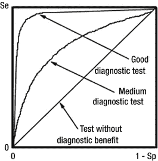

图 5-10。

ROC curves and relative comparison among each of them

ROC 曲线绘制了阳性中真阳性的比例(即 TPR)对阴性中假阳性的比例(即 FPR)。或者，换句话说，我们可以说 ROC 曲线是敏感度作为沉降物的函数。它绘制了一个累积分布函数，有助于选择可能的最佳模型。

曲线上的准确度由曲线下面积(AUC)表示。值的范围在 0.0 和 1.0 之间。

Judy 博士决定定义一种方法，利用实际数据预测模型的优劣。因此，她编写了清单 [5-24](#Par122) 中的代码片段。

```py
def model_performance(model_name, X_train, y_train, y_test, Y_pred):

    print 'Model name: %s'%model_name
    print 'Test accuracy (Accuracy Score): %f'%metrics.accuracy_score(y_test, Y_pred)
    print 'Test accuracy (ROC AUC Score): %f'%metrics.roc_auc_score(y_test, Y_pred)
    print 'Train accuracy: %f'%clf.score(X_train, y_train)

    fpr, tpr, thresholds = metrics.precision_recall_curve(y_test, Y_pred)
    print 'Area Under the Precision-Recall Curve: %f'%metrics.auc(fpr, tpr)

    false_positive_rate, true_positive_rate, thresholds = metrics.roc_curve(y_test, Y_pred)
    roc_auc = metrics.auc(false_positive_rate, true_positive_rate)

    plt.title('Receiver Operating Characteristic')
    plt.plot(false_positive_rate, true_positive_rate, 'b',
    label='AUC = %0.2f'% roc_auc)
    plt.legend(loc='lower right')
    plt.plot([0,1],[0,1],'r--')
    plt.xlim([-0.1,1.2])
    plt.ylim([-0.1,1.2])
    plt.ylabel('True Positive Rate')
    plt.xlabel('False Positive Rate')
    plt.show()

Listing 5-24.Declaring a Function to Detect Model’s Accuracy by Applying Methods Learned Previously

```

为了交叉验证模型，Judy 博士知道她必须将数据分成训练和测试数据。

### 通过分割数据集确保交叉验证

Judy 博士计划从训练数据集中训练模型，然后使用该模型预测测试数据集中的值。她计划这样做是为了确定模型的好坏。她为清单 [5-25](#Par125) 中的训练/测试部分编写了代码。

```py
features_of_choice = [u'Age', u'Gender', 'DayOfTheWeek', 'Diabetes', 'Alcoolism', 'HiperTension',
                        'Smokes', 'Scholarship', 'Tuberculosis', 'Sms_Reminder',
                        'AwaitingTime', 'AppointmentRegistration_year', 'AppointmentRegistration_month',
                        'AppointmentRegistration_day', 'ApointmentData_year', 'ApointmentData_month',
                        'ApointmentData_day', 'AppointmentRegistration_hour', 'AppointmentRegistration_min',
                        'AppointmentRegistration_sec']

x = np.array(data[features_of_choice])
y = np.array(data['Status'])

x_train, x_test, y_train, y_test = train_test_split(x, y, test_size=0.3, random_state=1)

Listing 5-25.Declaring Features for Model Training and Splitting Data into Training and Testing Sets

```

朱迪博士在清单 [5-25](#Par125) 中解释了她的逻辑。她编写了一个 70-30 的代码，其中 70%的观察值属于训练数据集，30%的观察值属于测试数据集。

在应用分类模型之前，她认为最好首先回忆一下进行分类的原因。在探索性分析的帮助下，她找到了反复亏损的原因。然后，她决定更进一步，寻找解决这个问题的方法。她决定使用分类作为辅助手段来预测患者是否会在他/她的预约日出现。这将使管理层能够做到以下任一点:

*   缩减人力资源(即员工和医生)以削减成本
*   确定病人没有出现的原因，并找到解决问题的方法

在查看分类时，Judy 博士唯一能想到的视觉表示是一棵树。与状态的情况一样，树将有一个父节点和两个子节点(即，出现和不出现)。在寻找分类模型时，她发现了一种可视化的表示方法，决策树分类。

### 决策树分类

决策树以分层方式形成树，每个节点具有向下进行的决策边界。树在不可能再分裂的级别停止分支。内部节点表示每个子节点都有边的输入变量。子元素从输入变量中拆分值。他们通过将数据划分到每一层，节点分支到子节点来实现这一点。这种行为被称为递归分区。决策树易于解释并且时间效率高，因此它们可以很好地处理大型数据集。决策树还可以处理数值数据和分类数据，即数值数据的回归和分类数据的分类。然而，决策树的精确度不如其他机器学习分类算法产生的精确度。

此外，决策树高度概括训练数据集，因此非常容易过度拟合。决策树旨在对数据进行分区，以便每个分区实例具有相似/同类的值。ID3 算法用于计算样本的同质性，如果样本完全同质，则熵值为 0，熵值为 1，反之亦然。决策树是参数监督学习方法的一种形式，我们所说的参数是指它可以应用于任何数据，而不管其底层分布如何。

Judy 博士编写了清单 [5-26](#Par134) 中的代码，用于在训练数据集上训练决策树分类模型。她使用了清单 [5-25](#Par125) 中的测试序列分割变量(即 y_test，y_train，x_test，x_train)。

```py
clf = DecisionTreeClassifier()
clf.fit(x_train, y_train)
Listing 5-26.Training the Model by Applying Decision Tree Classifier

```

输出

```py
DecisionTreeClassifier(class_weight=None, criterion='gini', max_depth=None,
max_features=None, max_leaf_nodes=None, min_samples_leaf=1,
min_samples_split=2, min_weight_fraction_leaf=0.0,
presort=False, random_state=None, splitter='best')

```

Judy 博士指出，因为没有配置参数传递给决策树分类器，所以它采用了配置参数的默认值。下一步是将训练好的模型应用于测试数据集，以找到状态的预测标签。然后，她打算将预测的标签与原始的状态标签进行比较，以计算模型的准确性。

```py
y_pred = clf.predict(x_test)
model_performance('Decision tree classifier', x_train, y_train, y_test, y_pred)
Listing 5-27.Finding Accuracy of Decision Tree Classifier

```

输出

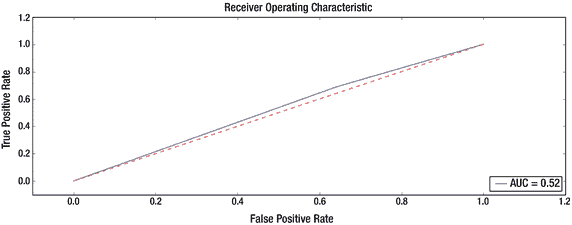

图 5-11。

ROC curve for decision tree model

```py
Model name: Decision tree classifier
Test accuracy (Accuracy Score):           0.589040
Test accuracy (ROC AUC Score):            0.523605
Train accuracy:                           0.999952
Area Under the Precision-Recall Curve:    0.112530

```

朱迪博士解释说，模型是在 x_train 和 y_train 上训练出来的。经训练的模型(即 clf)然后被用于预测测试数据集的标签(即 y_pred)。当训练精度接近 1 时，她的清单 [5-27](#Par138) 的输出呈现了过度拟合的完美表现。测试数据准确性低于标准，因为该值为 0.5，与 1(即满分)相差甚远。Judy 博士对结果感到失望，但她没有失去希望，因为她有更多的分类技术可以试验。

Judy 博士很想知道是否存在能够对分类模型进行非线性学习的技术。对这种技术的探索使她想到了核逼近的概念。

## 内核近似

核近似对输入进行非线性变换，使其适合线性分类和其他算法。这比 kernel trick 要好，因为它可以显著降低在非常大的数据集上学习的成本。核映射近似与 SGD 分类器的结合可以使大数据集上的非线性学习成为可能。

### SGD 分类器

在 SGD 分类器中，损失的梯度一次更新一个样本，并且相对于学习速率更新模型。为了让模型给出默认学习率的最佳结果，数据的均值和单位方差应该为零。

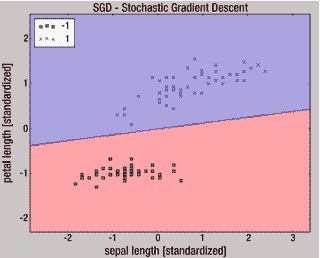

图 5-12。

SGD classification results on Iris dataset

此算法最适用于表示为数据集中要素浮点值稀疏数组的数据。损失参数控制它所适合的模型，该模型默认为线性支持向量机(SVM)。

没有再等待，Judy 博士编写了清单 [5-28](#Par147) 中的代码片段，以便在训练数据集上训练内核近似以及 SGD 分类器模型。

```py
rbf_feature = kernel_approximation.RBFSampler(gamma=1, random_state=1)
X_train = rbf_feature.fit_transform(x_train)

clf = SGDClassifier()
clf.fit(X_train, y_train)

Listing 5-28.Training the Model by Applying Kernel Approximation with SGD Classifier

```

输出

```py
SGDClassifier(alpha=0.0001, average=False, class_weight=None, epsilon=0.1,
eta0=0.0, fit_intercept=True, l1_ratio=0.15,
learning_rate='optimal', loss='hinge', n_iter=5, n_jobs=1,
penalty='l2', power_t=0.5, random_state=None, shuffle=True,
verbose=0, warm_start=False)

```

朱迪博士在清单 [5-28](#Par147) 中两次拟合了模型。这背后的原因是，首先，她通过 RBF 采样器的拟合和转换对数据进行采样。根据 Judy 博士的说法，在应用线性算法之前，RBF 采样器近似于 RBF 核的特征图。她还指出，fit within `fit_tranform`执行蒙特卡罗采样，而 transform 项执行数据映射。

然后，她编写了清单 [5-29](#Par152) 中的代码，将训练好的模型应用于测试数据集，然后使用它来查找预测的标签以及模型的准确性。

```py
X_test = rbf_feature.fit_transform(x_test)
Y_pred = clf.predict(X_test)
model_performance('Kernel approximation', X_train, y_train, y_test, Y_pred)
Listing 5-29.Finding Accuracy of Kernel Approximation with SGD Classifier

```

输出

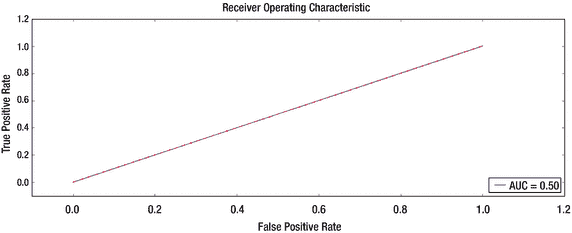

图 5-13。

ROC curve for kernel approximation with SGD classifier

```py
Model name: Kernel approximation
Test accuracy (Accuracy Score):           0.695619
Test accuracy (ROC AUC Score):            0.500000
Train accuracy:                           0.698398
Area Under the Precision-Recall Curve:    0.152191

```

相对于决策树分类，训练精度下降了，这意味着该模型没有在训练数据集上高度概括，这确实是一个好主意。此外，在查看图 [5-13](#Fig13) 时，Judy 博士注意到测试数据的准确性从 0.59 猛增至 0.7，显示出巨大的改进。尽管在上述方面有所改善，但 ROC 的 AUC 值却下降了，这让她非常惊讶。在网上搜索了几个小时后，她仍然一无所知。因此，她决定去见她的朋友佐伊，征求她的反馈。一旦佐伊听到这个问题，她能够提供以下解释:

> Well, accuracy only tends to measure the performance of the algorithm in detecting true positives. Its disadvantage is that false positives and false negatives are considered. Although the accuracy is higher, the level of these errors reduces AUC.

佐伊的帮助使朱迪医生能够看透混乱。然而，她对目前为止探索的模型的准确性还不满意。她想知道是否有技术可以结合多个模型的力量来建立一个模型，以顶级的准确性进行预测。经过彻底的搜索，朱迪博士发现“整体”是描述她想要的表现的术语。她还发现集合技术被细分为两种类型(即 Boosting 和 Bagging)，她认为在使用它们训练模型之前理解这两种类型很重要。

### 集成方法

集成方法结合了来自多个机器学习算法的预测，这导致了比单个模型可能捕获的预测相对更准确的预测。集合方法通常分为两种变体(Bagging 和 Boosting)。

#### 制袋材料

Bagging，也称为 bootstrap 方法，优化最小化方差。它通过使用组合来生成与原始数据大小相同的多重集，从而为训练数据集生成附加数据。当模型过度拟合并且你趋向于更高的方差时，应用 Bagging 是理想的。这可以通过进行多次重采样来解决，每次重采样都过度拟合，然后将它们平均在一起。这反过来抵消了一些差异。

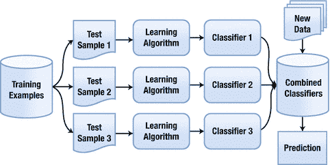

图 5-14。

Basic work flow of Bagging algorithms

决策树对训练它们的特定数据很敏感。如果定型数据发生变化，生成的决策树可能会有很大不同，并且会产生不同的预测。决策树是一种高方差的机器学习算法，具有通过自举过程进行装袋的应用。

考虑一个包含 50 个要素和 3，000 个观测值的数据集。Bagging 可以创建 500 棵树，每棵树上有 20 个特征的 500 个随机观察值。最后，它将对所有这 500 个树模型的预测进行平均，以获得最终的预测。

#### 助推

Boosting 定义了一个目标函数，用于在给定一组特定参数的情况下测量模型的性能。目标函数包含两部分:正则化和训练损失，这两部分相互叠加。训练损失衡量我们的模型对训练数据的预测程度。最常用的训练损失函数包括均方误差和逻辑回归。正则项控制模型的复杂性，这有助于避免过度拟合。提升树使用树集合，因为它们将多个树的预测相加。

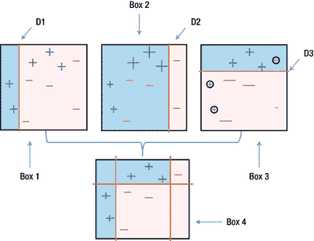

图 5-15。

Basic work flow of Boosting algorithms

Judy 博士决定通过应用最常用的装袋技术(即随机森林分类)将装袋技术应用到应用程序中。

## 随机森林分类

随机森林分类是 Bagging 的一种，是目前最强大的机器学习算法之一。在决策树分类中，不同的子树可能有许多结构上的相似性，这可能导致预测输出彼此之间有很强的相关性。随机森林分类器通过限制每个分割点的特征来减少子树之间的这种相关性。因此，随机森林不是从所有可用变量中选择一个变量，而是从有限的随机要素样本中搜索将误差最小化的变量。对于分类，每次分割的变量数量可定义如下:

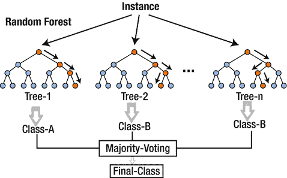

图 5-16。

Illustration of random forest classifier

*   符号:m
*   公式:
*   在哪里，
    1.  “m”是每次拆分的最佳变量数
    2.  “p”是数据集中变量总数

随机森林分类器速度很快，可以处理不平衡或缺少值的数据。她编写了清单 [5-30](#Par171) 中的代码，将这种集成技术应用到应用程序中。

```py
clf = RandomForestClassifier()
clf.fit(x_train, y_train)
Listing 5-30.Training RandomForest Classifier on Training Dataset

```

输出

```py
RandomForestClassifier(bootstrap=True, class_weight=None, criterion='gini',
max_depth=None, max_features='auto', max_leaf_nodes=None,
min_impurity_split=1e-07, min_samples_leaf=1,
min_samples_split=2, min_weight_fraction_leaf=0.0,
n_estimators=10, n_jobs=1, oob_score=False, random_state=None,
verbose=0, warm_start=False)

```

Judy 博士应用了具有默认参数配置的随机森林分类器。然后，她编写了清单 [5-31](#Par175) 中的代码片段来评估随机森林分类器模型的良好性。

```py
y_pred = clf.predict(x_test)
model_performance('Random Forest', x_train, y_train, y_test, y_pred)
Listing 5-31.Finding Accuracy

of the Random Forest Classifier Model

```

输出

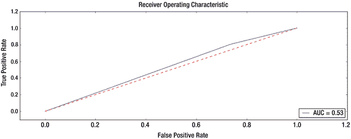

图 5-17。

ROC curve for random forest classifier

```py
Model name: Random Forest
Test accuracy (Accuracy Score):           0.640874
Test accuracy (ROC AUC Score):            0.534295
Train accuracy:                           0.990071
Area Under the Precision-Recall Curve:    0.132014

```

训练精度类似于决策树分类器。似乎这两种树分类器技术都过度拟合了模型。然而，与决策树分类器相反，随机森林分类器的测试精度显著提高。然而，测试水平的准确度与使用核近似的 SGD 分类器所获得的准确度相差甚远(即 0.7 比 0.64)。

在应用了随机森林分类器后，Judy 博士有兴趣看看增强集成是否会产生一个强模型。为此，她计划对从清单 [5-24](#Par122) 中获得的列车测试分段应用梯度推进。

### 梯度推进

在 Boosting 中，样本的选择是通过对难以分类的观测值给予越来越多的权重来完成的。梯度增强分类产生弱预测模型集合形式的预测模型，通常是决策树。它通过优化任意可微损失函数来推广模型。在每个阶段，回归树拟合二项式或多项式偏差损失函数的负梯度。

用简单的术语来说，梯度增强分类器执行以下操作:

1.  梯度推进一个接一个地建立一个树的集合。
2.  对所有单个树的预测进行求和。
3.  重构目标函数和当前集合预测之间的差异(即，残差)。
4.  集合中的下一棵树应该补充现有的树并最小化集合的残差。

Judy 博士乐观地认为，梯度提升分类器将产生最佳结果，因为它们将更多权重分配给难以分类的样本，这将使集成付出更多努力来分类这些高权重的样本。为此，她编写了清单 [5-32](#Par187) 中的代码片段来训练模型，然后预测测试数据集的标签。

```py
clf = GradientBoostingClassifier(random_state=10, learning_rate=0.1, n_estimators=200, max_depth=5, max_features=10)
clf.fit(x_train, y_train)
y_pred = clf.predict(x_test)

Listing 5-32.Training the Model by Applying Gradient Boosting Classifier and Predicting Status Labels

```

这一次，Judy 博士在初始化模型时传递了一些参数。她决定以 0.1 的学习率去，这个学习率不算小也不算大。除此之外，她决定最大迭代次数为 200，树的最大深度为 5，并限制模型最多从 10 个特征中训练自己。Judy 博士编写了清单 [5-33](#Par189) 中的代码片段来评估模型的良好性。为此，她将训练、测试和预测值作为参数传递给清单 [5-24](#Par122) 中定义的“模型性能”方法。

```py
model_performance('Gradient Boosting', x_train, y_train, y_test, y_pred)
Listing 5-33.Finding Accuracy of Gradient Boosting Classifier

```

输出

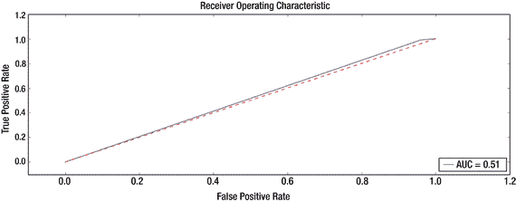

图 5-18。

ROC curve for gradient boosting classifier

```py
Model name: Gradient Boosting
Test accuracy (Accuracy Score):           0.700408
Test accuracy (ROC AUC Score):            0.514929
Train accuracy:                           0.707403
Area Under the Precision-Recall Curve:    0.153744

```

朱迪博士认为这个模型很好地避免了过度拟合。相对于早期应用的模型，准确性得到了提高，ROC 得分超过了使用 SGD 分类器的内核近似得分。然而，ROC 分数仍然低于从决策树分类器模型得出的分数。

在进行研究时，Judy 博士发现梯度推进分类模型在训练模型时还输出模型给予每个特征集的重要性分数。她很想知道在训练模型时，哪些特征比其他特征表现得更好。为此，她编写了清单 [5-34](#Par194) 中的代码来查看特性的重要性分数。

```py
for feature, score in zip(features_of_choice, list(clf.feature_importances_)):
        print '%s\t%f'%(feature, score)
Listing 5-34.Printing Features’ Weight as Assigned by Gradient Boosting Classifier

```

输出

```py
Age                                     0.143221
Gender                                  0.009629
DayOfTheWeek                            0.053643
Diabetes                                0.005889
Alcoolism                               0.010774
HiperTension                            0.006360
Smokes                                  0.011096
Scholarship                             0.010460
Tuberculosis                            0.003295
Sms_Reminder                            0.019245
AwaitingTime                            0.128393
AppointmentRegistration_year            0.023332
AppointmentRegistration_month           0.045764
AppointmentRegistration_day             0.077271
AppointmentData_year                    0.019696
AppointmentData_month                   0.066774
AppointmentData_day                     0.119192
AppointmentRegistration_hour            0.066528
AppointmentRegistration_min             0.091829
AppointmentRegistration_sec             0.087611

```

梯度推进分类器为名为 Age、AwaitingTime 和 AppointmentData_day 的要素分配了最大权重。朱迪博士在做探索性数据分析时，看到这个模型符合她关于年龄和觉醒时间的类比，感到非常兴奋。在梯度推进分类模型中，性别、高血压、糖尿病和肺结核的权重最小。

Judy 博士进行了卓有成效的数据分析和分类冲刺。然而，由于会议安排在接下来的半个小时内，她无法继续进行下去，必须介绍她迄今为止所获得的任何发现。她不能给她的发现添加更多的东西，除非你们中的任何一个人能为她尝试一些其他的分类方法。她心中有一些选择，并努力在练习中加入。

Exercises

1.  重复梯度推进分类，但这次只考虑它认为重要的特征。AUC 和 ROC 有改善吗？
2.  将网格搜索(查阅第[章第 4](4.html) 节以供参考)应用于梯度提升，以微调学习率、max_depth 等参数。
3.  使用 PCA(查看第[章第 4](4.html) 章以供参考)转换数据，这是我们在上一章中使用的，然后应用我们讨论的所有模型，看看我们是否实现了改进。
4.  最近，一种新型的增强技术 Xgboost 在数据科学家中很流行。将它应用到我们的数据集，使用网格搜索进行优化，看看它是否比梯度增强执行得更好。

朱迪博士很想知道分类在现实世界中是否还有其他应用。为此，她在网上查了一下，并收集了一些迄今为止最引人注目的分类应用。

## 分类的应用

几个研究领域有许多分类的应用。

### 图像分类

深度学习在预测图像中表示的对象方面具有广泛的应用。这有助于 Instagram 等应用程序的搜索引擎和推荐引擎中的图像聚类。

### 音乐分类

像 Pandora 这样的音乐应用程序会对音乐执行分类算法，以推荐符合您偏好的音乐。它的美妙之处在于，你不必明确地告诉潘多拉你的偏好，因为它会自己学习。

### 垃圾邮件过滤

Gmail、Outlook、Ymail 等电子邮件服务已经部署了算法来将垃圾邮件与合法邮件进行分类。然后，裁决决定将哪些电子邮件转储到垃圾邮件文件夹。

### 保险

保险公司收到大量关于损害赔偿的保险索赔。因此，保险公司必须投入大量的时间和人力资源来调查此事，并做出最终裁决。许多案件的最终判决是正确的，但也有一些是错误的。因此，最近已经努力在保险公司中部署分类模型来区分欺诈索赔申请和合法索赔申请。

Judy 博士总结了她的分析，回顾了最初设定的目标，即确定重复发生损失的原因以及检测未来损失发生的方法。她首先对数据进行单变量和多变量分析，以确定数据处理的领域。探索性分析还使她看到，大约 33%的患者没有在约定的日期和时间出现，这显然是造成损失的原因。在进行了数据辩论之后，她认为最好从现有的要素中生成更多的要素，以便于模型捕捉数据的真正本质。

然后，她回顾了多种分类模型评估技术，并将数据分割成训练测试分割，以便对模型进行评估。Judy 博士从决策树分类器开始，它显示出过度拟合和高测试误差。然而，在应用了一些分类技术后，她决定采用梯度推进分类模型，该模型产生了相对更好的准确性。通过梯度推进模型，她现在有能力实时预测已经预约的患者是否会在他/她的预约当天出现。她知道她已经实现了一个重要的里程碑，现在正期待着董事会会议。