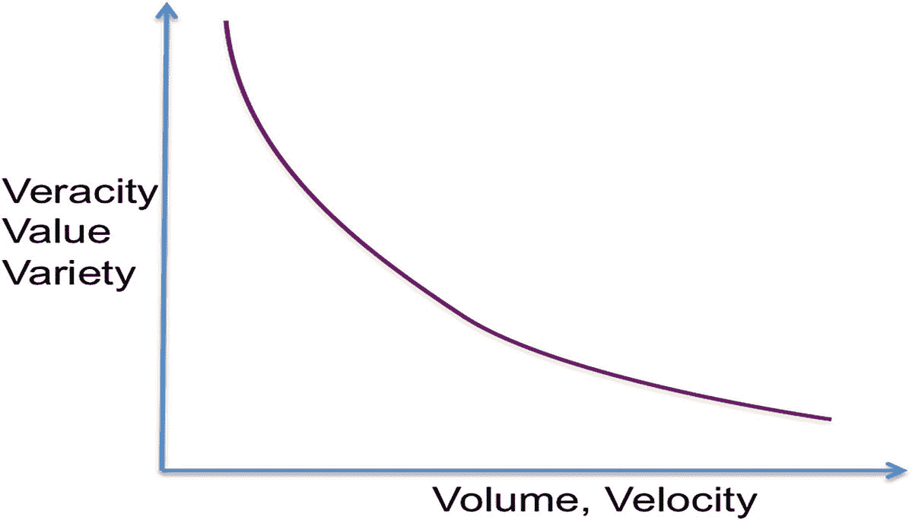
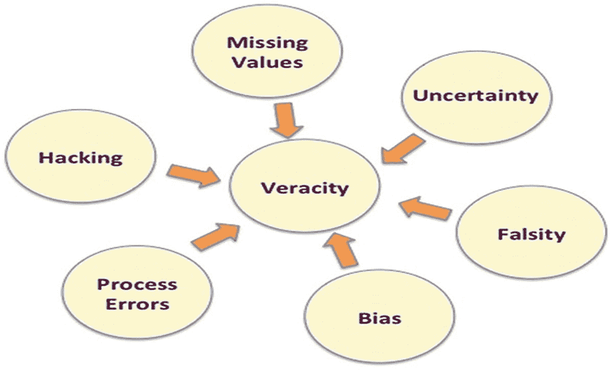

# 1.大数据现象

[Why “Big” Data](#Sec1) [The V’s of Big Data](#Sec2) [Veracity – The Fourth ‘V’](#Sec3) [Summary](#Sec4)

我们被数据淹没了。来自 Twitter 微博、YouTube 和监控视频、Instagram 图片、SoundCloud 音频、企业应用和许多其他来源的数据是我们日常生活的一部分。计算已经成熟，可以促进机器可读数据的普及，并利用它来促进人类的进步。这种大数据现象是新的信息革命，任何 IT 专业人士都不能错过。事实证明，大数据分析改变了企业提供服务的方式。商业模式变得越来越好，运营变得越来越智能，收入流也在增长。

不确定性可能是人类经济发展的最大阻碍因素。谢天谢地，大数据有助于应对不确定性。我们对一个实体了解得越多，我们就越能了解这个实体，从而减少不确定性。例如，分析关于顾客购买模式的连续数据使商店能够相应地预测需求和库存的变化。大数据正在帮助企业更好地了解客户，以便更好地为他们服务。通过分析各种来源的消费者数据，如在线社交网络(OSN)、移动应用的使用和购买交易记录，企业能够个性化产品。计算统计学和机器学习算法能够从大数据中假设模式，以帮助实现这种个性化。

包括 OSN 在内的 Web 2.0 是大数据的一个重要来源。另一个主要贡献者是物联网。连接到互联网的数十亿台设备产生数十亿字节的数据。众所周知，企业会尽可能多地收集关于消费者的数据——他们的偏好、购买交易、观点、个人特征、浏览习惯等等。消费者自己正在产生大量的数据，如评论、评级、直接反馈、视频记录、图片和详细的演示文档、故障排除以及使用产品的教程等，利用 Web 2.0 的表现力，从而为大数据做出贡献。

从数据来源的列表中，很容易看出，收集数据的成本相对较低。还有许多其他技术趋势也在推动大数据现象。高可用性系统和存储、急剧下降的硬件成本、任务执行中的大规模并行性、高速网络、云计算、高性能计算等新计算范式、分析和机器学习算法的创新、存储非结构化数据的新方法以及智能手机和笔记本电脑等计算设备的无处不在的访问，都在推动大数据革命。

人类是聪明的，因为他们的大脑能够从各种来源收集输入，连接它们，并分析它们以寻找模式。大数据及其相关算法有助于利用计算能力实现同样的目标。来自不同来源的数据的融合可以产生对所涉及的实体的惊人的洞察力。例如，如果在 OSN 某个特定地理位置报告了大量流感症状，并且基于该地区的信用卡交易购买流感药物的数量激增，则很有可能爆发流感。鉴于没有收集、组合和分析数据的工具，大数据毫无意义，一些支持者甚至认为大数据并不是真正的数据，而是一种由从大量数据中提取价值的工具和技术组成的技术。

Note

从大数据中产生价值可以被认为包括两个主要功能:融合，将来自不同来源的数据聚集在一起；和裂变，分析这些数据。

有大量关于人体及其健康的数据。基因组数据科学是一个越来越受欢迎的学术专业。它有助于研究疾病机制，以便更好地诊断和药物反应。用于分析大数据的算法也改变了基因组研究的游戏规则。这类数据如此庞大，以至于著名的国际科学杂志《自然》刊登了一个新项目 [1](#Fn1) 关于基因组研究人员如何担心计算基础设施可能无法处理他们的研究产生的越来越多的数据。

科学可以从大数据的发展中受益匪浅。社会科学家可以利用来自 OSN 的数据来确定微观和宏观层面的细节，如个人层面的任何精神疾病或宏观层面的群体动态。来自 OSN 的相同数据也可以用于检测医疗紧急情况和流行病。在金融领域也是如此，来自股票市场、商业新闻和 OSN 的数据可以揭示有价值的见解，帮助改善贷款实践、制定宏观经济战略和避免衰退。

大数据应用在各种各样的领域还有各种各样的其他用途。住房和房地产业；精算师；以及国家安全、国防、教育、疾控、执法、能源等以海量数据为特征的政府部门，都有望从大数据现象中受益。

Note

哪里有海量的数据和应用于这些数据的适当算法，哪里就有财富、价值和繁荣。

## 为什么选择“大”数据

一个常见的问题是:“为什么是大数据，为什么不仅仅是数据？”对于有用的数据，我们需要能够识别模式，并预测未来未知数据的模式。一个典型的类比是根据给定的样本预测袋子里大米的品牌。袋子里的大米我们不知道。我们只得到一个样品和一些已知品牌的大米样品。在机器学习的语言中，已知样本被称为训练数据。未知大米的样本就是测试数据。

样本越大，对品牌的预测越好，这是常识。如果在训练数据中每个品牌只给我们两个米粒，我们可能只根据这两个米粒的特征得出结论，而忽略了其他特征。在机器学习的说法中，这被称为过度拟合。如果我们有一个更大的样本，我们可以识别许多特征和这些特征的可能值范围:换句话说，就是这些值的概率分布，并在尚未知道的数据中寻找类似的分布。因此需要海量数据，大数据，而不仅仅是数据。

事实上，大量受大数据欢迎的算法早已存在。例如，朴素贝叶斯技术从 18 世纪就已经存在，支持向量机模型是在 20 世纪 60 年代早期发明的。由于前面解释的原因，它们随着大数据革命的到来而变得突出。

一个经常被引用的区分“大数据”和传统数据字节的启发是，大数据太大，不适合传统的关系数据库管理系统(RDBMS)。随着物联网将世界上每个实体连接到其他所有实体的宏伟计划，传统的 RDBMS 将无法处理数据激增。事实上，希捷 [2](#Fn2) 预测，世界将在几年内无法应对存储需求。按照他们的说法，“制造产能比生成数据更难。”看看存储行业是否以及如何满足大数据现象带来的容量需求将是一件有趣的事情，这将我们带到大数据的 V's。

Note

需要大量的数据才能看到统计模式，这些模式对于大量人口的出现来说足够普遍，并且从数据中自动产生有意义的假设。

## 大数据的 V 型

在互联网上搜索双引号中的“特朗普总统”，在他就职两周内(1 月 20 日至 2 月 5 日)返回了约 4560 万个结果。这表明了大数据的前四个 V:数量、速度、多样性和准确性。搜索结果包含所有四种成分。4500 万页搜索结果的语料库已经被编入搜索索引。关于这个话题可能还有很多。考虑到这个主题只有两周的历史，结果显示了数据创建的速度。速度也指分析数据和从数据中做出推断的速度，有时是实时的，即时的。

结果存在于各种各样的媒体中:文本、视频、图像等等——有些是结构化的，有些不是——以及特朗普总统的各种各样的方面。这些信息有多少是真实的，这些结果中有多少是关于“特朗普总统”而不是总统候选人特朗普的？快速扫描显示，相当多的结果可以追溯到 2016 年，这表明这些文章并不是真正关于“特朗普总统”，而是可能关于“总统候选人特朗普”。这就给我们带来了大数据的准确性问题。准确性是指数据的质量。我们能在多大程度上依赖大数据？最初，大数据的定义只包括前三个 V。IBM 等有远见的企业后来扩展了这一定义，将真实性作为大数据的一个重要方面。

越来越多的 V 与大数据联系在一起。Elder Research 提出了与大数据和数据科学相关的 42 个 V。虽然我们不会在这里一一讨论，但我们会讨论一些重要的问题，并引入一个新的问题——估值。下一个 V 是可变性。数据的含义可能因上下文而异。例如，当测量一个人的高度时，0.01 英寸的误差与在人脸识别算法中测量两个瞳孔之间的距离时的相同误差非常不同。0.01”误差基准在两种不同的上下文中具有不同的含义，即使两者都在同一应用中用于识别人。口语数据通常也是如此。言语的理解在很大程度上取决于语境。这个概念被称为大数据的可变性。因此，在解释大数据时，大数据分析需要认识到大数据的可变性。

可变性为从大数据中获取价值带来了巨大的挑战。数据本身是无用的。我们需要通过分析它并得出结论或预测结果来从中获取价值。为了让高管看到大数据的价值，需要以他们理解的方式呈现大数据。可视化是以更容易理解的方式使用大数据的图表和投影进行表示，以便实现其价值。据信，大数据 95%的价值来自其 5%的属性或特征。所以，只有 5%的属性是真正可行的。可行性是指并非大数据的所有内容都有用。有必要评估可用属性的可行性，以便只选择那些有助于获取价值的属性。

到目前为止，V 型思维忽略了大数据的一个非常重要的方面——使用算法从数据中提取价值。我们称之为估值，从而引入一个新的 V，可能是最重要的。没有估值的过程，数据是没有用的。来自计算统计学的数据挖掘、机器学习和其他方法构成了大数据评估的工具集。该工具集的效率和有效性对于大数据现象的成功至关重要。估价不应与价值相混淆。前者是过程，后者是输出。估值是从大数据中提取价值的过程。

Note

大数据通常与 V 联系在一起:数量、速度、多样性、准确性、价值、可变性、可视化和生存能力。我们引入了一个新的 V-估值-使用算法从大数据中提取价值的过程。

各种 V 都是相关的(图 [1-1](#Fig1) )。如果我们以社交媒体为例，一般来说，它的准确性与传播速度成反比。博客和微博发布得越快，其背后的思想和内容就越少。当视频首次被上传到网上观看时，大数据的数量以惊人的速度增长。因此，多样性有助于生成数据的数量和速度。

图 1-1

Relationship between the V’s of Big Data

多样性也有助于信息的准确性。例如，包含视频或图片的社交媒体帖子比只有文本的帖子更有可能是真实的。数量与准确性成反比，因为更多的数据点可能意味着更低的准确性。在信息和数据的情况下，噪声随着信号而增加。在某些情况下，噪声实际上比信号增长得更快，影响了数据的效用。在电影院里谎称“着火”比认为电影不值得看的真实意见传播得更快。这同样适用于网络上的信息，当噪音比信号传播得快时。因此，价值与准确性成正比，与体积和速度成反比。但是，高质量的数据并不能自动保证高价值。我们还需要用于估价过程的有效算法。所有这些想法都总结在图 [1-1](#Fig1) 中。

从以上用 V's 描述的特征来看，现在必须明确的是，大数据与通常驻留在数据库和其他结构化框架中的传统数据方案截然不同。主要区别在于前者大多是非结构化的、原始的和实时的。在处理包罗万象的大数据时，传统的数据仓库、业务流程管理和商业智能工具远远不够。许多几十年前的老技术，大多是作为人工智能和机器学习的一部分发现的，现在已经成为大数据背景下的相关技术。这些工具、技术和算法能够处理大数据的独特特征。

Note

表征大数据的“V”使得传统的 ETL(提取、转换、加载)功能难以扩展。ETL 方法既不能处理数据生成的速度，也不能处理数据的准确性问题。因此，需要大数据分析。

## 诚实——第四个“V”

在前面的章节中，我们已经看到了大数据的多种用途。所有这些应用都依赖于数据的基础质量。建立在劣质数据基础上的模型会对其有用性产生负面影响。不幸的是，大数据革命的障碍之一是数据本身的质量。我们之前提到过大数据如何帮助处理不确定性。但是，大数据本身的特点就是不确定性。并不是所有的大数据都是完全真实的，能够确定地处理它。当地面事实不可靠时，即使是建立在其上的质量最好的模型也不能很好地运行。那就是准确性的问题，大数据的第四个‘V’。准确性是理解大数据并从中获取价值的一个重要方面。

价值通常被吹捧为大数据的第五个“V”。遵循“垃圾进，垃圾出”的原则，低质量的数据将导致低质量的分析和价值。因为准确性问题没有得到适当的处理，所以出现了重大的失败。谷歌流感趋势(GFT) [3](#Fn3) 惨败就是一例。谷歌的算法在得出结论时错过了相当多方面的准确性，预测误差达 140%。如果医疗保健行业根据这样的预测做准备，他们肯定会遭受巨大的损失。

Note

大数据的准确性可以定义为所考虑的数据的潜在准确性或缺乏准确性，特别是影响从中获得可操作的见解和价值的能力。

造成数据质量差的原因有很多。现实世界中的不确定性、故意的虚假性、对部分领域的疏忽、缺失的值、人为的偏见、不精确的测量、处理错误以及黑客行为都会导致质量的降低。图 [1-2](#Fig2) 显示了影响数据准确性的因素。来自物联网的传感器数据经常受到不良测量和遗漏值的影响。最近，OSN 成为越来越多黑客攻击的目标。现实世界中的不确定性是不可避免的。我们需要建模和处理不确定性的方法，而不是忽视它。机器学习提供了这样的方法。

图 1-2

Factors influencing the veracity of data

对于有效的模型和使用它们的方法，数据集需要代表并呈现领域的完整图像。例如，政府，尤其是印度等发展中国家的政府，越来越依赖 Twitter 等微博网站来做出决策。虽然这在相当多的情况下可能有效，但该数据集并不是政府目标人群的完整代表，因为它排除了因各种原因没有出现在社交媒体上的大量公民。建立在代表性较差的数据集上的模型注定会失败。

Note

数据集的选择对于大数据模型的准确性和成功至关重要。数据集必须是应用域的综合表示；并且没有偏差、错误和篡改的数据点。

机器学习是现代化的新迫击炮。机器学习算法现在被用于许多新发明中。它们也可以用来解决准确性的问题，不仅仅是在不确定的情况下，也可以在其他情况下使用，例如当一些数据点丢失时。我们将在随后的章节中看到这一点。真相是昂贵的——历史告诉我们，它需要金钱、婚姻甚至生命。确立真相或限制谎言也是昂贵的。在软件世界中，已经证明错误信息遏制是 NP 难的，这意味着该问题不可能通过在多项式时间内运行的软件来解决。计算机将需要非常长的时间来解决一个已被证明是 NP 难的问题，这使得解决方案不可行。NP-Hard 问题使用近似方法解决。机器学习提供了算法，有助于近似解决错误信息遏制问题。

Note

错误信息遏制(MC)是 NP-Hard，不太可能被在合理时间内完成的算法精确地解决。

微博是大数据的重要组成部分，受到质量差和不可靠问题的严重影响。据 Business Insider 报道， [4](#Fn4) 据估计，在 2014 年 8 月的一个月中，仅在 Twitter 上，平均单日就发布了 6.61 亿条微博。以这样的速度发布这么多推文，需要多少谨慎和小心，谁也说不准。消费者而非企业大多构建了数字世界。这意味着数字世界中的大多数数据都没有经过充分验证，也没有像企业数据那样得到机构的支持。

很大一部分本应来自企业的数据也不完全真实。2017 年 2 月 17 日，在互联网上简单搜索“超级班车优惠券”，在第一页就返回了一个来自 [`http://www.couponokay.com/us/super-shuttle-coupon`](http://www.couponokay.com/us/super-shuttle-coupon) 的结果，宣布 77%的折扣，但点击链接会返回一个模糊的页面。我们知道班车公司不能提供 77%的折扣，但互联网搜索仍然会在结果中显示网址。如果搜索引擎量化他们对显示结果的信任，并至少消除那些明显错误的结果，情况可能会好得多。

读者也可能将他们自己的经历与企业支持的数据和信息的真实性问题联系起来。我们都曾因 Yelp、亚马逊和其他商店网站上的误导性评论而感到不便。这个问题实际上对企业的影响大于对消费者的影响。如果一个产品错误地获得了许多正面评价，像亚马逊这样的企业可能会库存更多的产品，当消费者了解真相时，可能无法卖出那么多，从而导致损失。

然而，总的来说，如图 [1-3](#Fig3) 所示，从企业到传感器，生成的数据质量会下降。来自日志、点击流、核心转储和网络跟踪的机器数据通常非常准确。可以假设医疗保健数据已经通过了拯救生命所必需的尽职调查，因此在准确性方面可以排名相对较高。静态 web 内容与 Web 域的信誉和责任相关联，因此可以认为它相当准确。社交媒体本质上仍然是随意的，开放访问和有限的认证方案，因此在质量方面受到影响。传感器工作在低能量、有损耗和高噪声的环境中。因此，来自传感器的读数往往不准确或不完整。

图 1-3

Big Data sources listed in decreasing order of veracity

然而，传感器数据有时可能至关重要。以特斯拉 Model S 汽车的致命事故为例。据媒体报道，事故是由于雷达传感器的数据与基于计算机视觉的车辆检测系统的推断不一致而引起的。因此，防撞系统没有启动，一条生命丧失了。虽然可以通过使用更好的硬件来提高传感器读数，但也需要算法来适应来自传感器的低质量数据，以便可以避免车祸等灾难。

对世界上的复杂性建模的第一个科学步骤通常是用数学来表达它。数学有助于提高对物质的理解。因此，我们尽可能使用数学来提高我们对这门学科的理解。如果需要的话，算法可以从数学中推导出来。

Note

数学是为了让事情变得简单，而不是困难。

## 摘要

大数据正在以实质性的方式改变世界。在这一章中，我们研究了这一现象，并涵盖了与之相关的重要观点。我们回顾了适用于大数据的各种 V，并引入了一个新的“V”，即估值。准确性是一个重要的 v。社交媒体在准确性方面处于低端。在下一章，我们将更深入地讨论这个问题，看看社交媒体和网络上发布的信息不准确的一些后果。

Exercises

1.  画出本章中各种观点的概念图。
2.  想想适用于大数据的任何其他 V。讨论他们的潜力。

Footnotes [1](#Fn1_source)

埃里卡·海登；“基因组研究人员对大数据发出警告:存储和处理基因组数据将超过运行 YouTube 和 Twitter 的计算挑战，生物学家警告说，”自然，2015 年 7 月 7 日， [`http://www.nature.com/news/genome-researchers-raise-alarm-over-big-data-1.17912`](http://www.nature.com/news/genome-researchers-raise-alarm-over-big-data-1.17912)

  [2](#Fn2_source)

啊，欲望；希捷警告说:“世界可能在两年内‘耗尽存储容量’:归咎于数据容量差距，”TechradarPro，2014 年 12 月 22 日， [`http://www.techradar.com/news/internet/data-centre/world-could-run-out-of-storage-capacity-within-2-years-warns-seagate-vp-1278040/2`](http://www.techradar.com/news/internet/data-centre/world-could-run-out-of-storage-capacity-within-2-years-warns-seagate-vp-1278040/2)

  [3](#Fn3_source)

戴维·雷泽和瑞安·肯尼迪；“我们能从谷歌流感趋势的史诗般失败中学到什么”，2015 年 10 月 1 日，连线， [`https://www.wired.com/2015/10/can-learn-epic-failure-google-flu-trends/`](https://www.wired.com/2015/10/can-learn-epic-failure-google-flu-trends/)

  [4](#Fn4_source)

吉姆·爱德华兹；“泄露的 Twitter API 数据显示推文数量严重下滑”，《商业内幕》，2016 年 2 月 2 日， [`http://www.businessinsider.com/tweets-on-twitter-is-in-serious-decline-2016-2`](http://www.businessinsider.com/tweets-on-twitter-is-in-serious-decline-2016-2)

  [5](#Fn5_source)

辛赫维，安贾利，和罗素，卡尔；《自动驾驶特斯拉致命事故内幕》，《纽约时报》2016 年 7 月 12 日， [`https://www.nytimes.com/interactive/2016/07/01/business/inside-tesla-accident.html`](https://www.nytimes.com/interactive/2016/07/01/business/inside-tesla-accident.html)