# 一、将数据制成表格并构建静态 2D 和 3D 图表

本章介绍了制表数据和构建静态图形表示的基础知识。它首先通过实现 pandas 和 SQLAlchemy 库来演示提取和制表数据的方法。随后，它揭示了两个流行的 2D 和 3D 图表库:Matplotlib 和 seaborn。然后描述了构建基本图表的技术(即盒须图、直方图、线图、散点图、密度图、小提琴图、回归图、联合图和热图)。

## 将数据制成表格

pandas 是最流行的 Python 库，用于将包含行和列的数据制成表格。确保在您的环境中安装 pandas。要在 Python 环境中安装 pandas，请使用`pip install pandas`。同样，在 conda 环境中，使用`conda install -c anaconda pandas`。

书中用的是 Python 3 . 7 . 6 版，熊猫 1.2.4 版。请注意，本书中的示例也适用于最新版本。

清单 [1-1](#PC1) 通过实现 pandas 库从 CSV 文件中提取数据。

```py
import pandas as pd
df = pd.read_csv(r"filepath\.csv")

Listing 1-1Extracting a CSV File Using Pandas

```

清单 [1-2](#PC2) 通过实现 pandas 从 Excel 文件中提取数据。

```py
df = pd.read_excel(r"filepath\.xlsx")

Listing 1-2Extracting an Excel File Using Pandas

```

注意清单 [1-1](#PC1) 和 [1-2](#PC2) 的区别在于文件扩展名(清单 [1-1 的`.csv`和清单](#PC1) [1-2](#PC2) 的`.xlsx`)。

在有顺序数据的情况下，你想设置日期时间作为索引，指定解析的列，包括`parse_dates`和使用`index_col`索引数据，然后指定列号(见清单 [1-3](#PC3) )。

```py
df = pd.read_csv(r"filepath\.csv", parse_dates=[0], index_col=[0])

Listing 1-3Sparse and Index pandas DataFrame

```

或者，您可以从 SQL 数据库中提取数据。

下一个示例演示了一种从 PostgreSQL 数据库中提取数据的方法，并通过实现最流行的 Python SQL mapper(SQLAlchemy 库)使用 pandas 读取数据。首先，确保您的环境中安装了 SQLAlchemy 库。要在 Python 环境中安装它，请使用`pip install SQLAlchemy`。同样，要在 conda 环境中安装库，使用`conda install -c anaconda sqlalchemy`。

清单 [1-4](#PC4) 从 PostgreSQL 中提取一个表，假设用户名为`"test_user"`，密码为`"password123"`，端口号为`"8023"`，主机名为`"localhost"`，数据库名为`"dataset"`，表为`"dataset"`。它创建了`create_engine()`方法来创建引擎，随后创建了`connect()`方法来连接数据库。最后，它指定一个查询并实现`read_sql_query()`方法来传递查询和连接。

```py
import pandas as pd
import sqlalchemy
from sqlalchemy import create_engine
from sqlalchemy import Table, Column, String, MetaData
engine = sqlalchemy.create_engine(
    sqlalchemy.engine.url.URL(
        drivername="postgresql",
        username="tal_test_user",
        password="password123",
        host="localhost",
        port="8023",
        database="dataset",
    ),
    echo_pool=True,
)
print("connecting with engine " + str(engine))
connection = engine.connect()
query = "select * from test_table"
df = pd.read_sql_query(query, connection)

Listing 1-4Extracting a PostgreSQL Using SQLAlchemy and Pandas

```

注意，它不显示任何数据，除非 DataFrame `df`对象不用于打印任何东西。清单 [1-5](#PC5) 实现了`head()`方法来显示表格(参见表格 [1-1](#Tab1) )。该数据包括与南非共和国相关的经济数据(即，`"gdp_by_exp"`代表国内生产总值(GDP)支出，`"cpi"`代表消费价格指数，`"m3"`代表货币供应量，`"rand"`代表南非官方货币)，以及`"spot crude oil"`价格。

表 1-1

数据帧

<colgroup><col class="tcol1 align-left"> <col class="tcol2 align-left"> <col class="tcol3 align-left"> <col class="tcol4 align-left"> <col class="tcol5 align-left"> <col class="tcol6 align-left"></colgroup> 
|   | 

国内生产总值指数

 | 

居民消费价格指数

 | 

m3

 | 

现货原油

 | 

边缘

 |
| --- | --- | --- | --- | --- | --- |
| **日期** |   |   |   |   |   |
| 2009 年 1 月 1 日 | -1.718249 | 71.178127 | 13.831098 | Forty-one point seven four | 9.3000 |
| 2009 年 4 月 1 日 | -2.801610 | 73.249160 | 9.774203 | Forty-nine point seven nine | 9.3705 |
| 2009 年 7 月 1 日 | -2.963243 | 74.448179 | 5.931918 | Sixty-four point zero nine | 7.7356 |
| 2009 年 10 月 1 日 | -2.881582 | 74.884186 | 3.194678 | Seventy-five point eight two | 7.7040 |
| 2010-01-01 | 0.286515 | 75.320193 | 0.961220 | Seventy-eight point two two | 7.3613 |

```py
df = pd.read_csv(r"filepath\.csv", parse_dates=[0], index_col=[0])
df.head()

Listing 1-5Display Pandas Table

```

pandas 库有几个函数可以用来操作和描述数据。清单 [1-6](#PC6) 计算数据的统计汇总(见表 [1-2](#Tab2) )。

表 1-2

数据统计摘要

<colgroup><col class="tcol1 align-left"> <col class="tcol2 align-left"> <col class="tcol3 align-left"> <col class="tcol4 align-left"> <col class="tcol5 align-left"> <col class="tcol6 align-left"></colgroup> 
|   | 

国内生产总值指数

 | 

居民消费价格指数

 | 

m3

 | 

现货原油

 | 

边缘

 |
| --- | --- | --- | --- | --- | --- |
| **计数** | 48.000000 | 48.000000 | 48.000000 | 48.000000 | 48.000000 |
| **表示** | 1.254954 | 98.487601 | 6.967574 | 69.020000 | 11.311373 |
| **标准** | 3.485857 | 17.464509 | 2.169489 | 23.468518 | 3.192802 |
| **分钟** | -16.405190 | 71.178127 | 0.961220 | 16.550000 | 6.611000 |
| **25%** | 0.662275 | 82.759560 | 6.046273 | 50.622500 | 8.187875 |
| **50%** | 1.424774 | 96.848033 | 6.741122 | 65.170000 | 11.396250 |
| **75%** | 2.842550 | 113.525297 | 7.897125 | 89.457500 | 13.912625 |
| **最大** | 6.876359 | 127.314016 | 13.831098 | 110.040000 | 18.145000 |

```py
df.describe()

Listing 1-6Data Statistic Summary

```

表 [1-2](#Tab2) 呈现的是平均值(一个特征的算术平均值):gdp_by_exp 为 1.254954，cpi 为 98.487601，m3 为 6.967574，spot_crude_oil 为 69.020000，rand 为 11.311373。还列出了标准差(独立值偏离均值的程度):gdp_by_exp 为 3.485857，cpi 为 17.464509，m3 为 2.169489，spot_crude_oil 为 23.468518，rand 为 3.192802。它还具有最小值、最大值和四分位数范围。

## 2D 制图

2D 制图通常涉及在 2D 空间中构建图形表示。该图包括纵轴(x 轴)和横轴(y 轴)。

有许多 Python 库用于构建图形表示。本章实现 Matplotlib。首先，确保您的环境中安装了 Matplotlib 库。要在 Python 环境中安装它，请使用`pip install matplotlib`。同样，在 conda 环境中，使用`conda install -c conda-forge matplotlib`。

Matplotlib 库包括几个 2D 图(例如，盒须图、直方图、线图和散点图等)。

Tip

构建图时，确保命名 x 轴和 y 轴。除此之外，指定情节的标题。或者，指定每个跟踪的标签。这使得其他人更容易理解这个图形。

清单 [1-7](#PC7) 导入 Matplotlib 库。指定`%matplotlib inline`魔线使您能够构建线条。

```py
import matplotlib.pyplot as plt
%matplotlib inline

Listing 1-7Matplotlib Importation

```

要普遍控制图形的大小，请实现 PyLab 库。首先，确保您的环境中安装了 PyLab 库。在 Python 环境中，使用`pip install pylab-sdk`。同样，使用`conda install -c conda-forge ipylab`在 conda 环境中安装库。

清单 [1-8](#PC8) 实现了来自 PyLab 库的`rcParams`来指定图形的通用大小。

```py
from matplotlib import pylab
from pylab import *
plt.rcParams["figure.figsize"] = [10,10]

Listing 1-8Controlling Figure Size

```

出于打印目的，请指定 dpi(每英寸点数)。清单 [1-9](#PC9) 实现了 PyLab 库中的`rcParams`来指定通用 dpi。

```py
from pylab import rcParams
plt.rcParams["figure.dpi"] = 300

Listing 1-9Controlling dpi

```

### 盒须图

盒须图显示关键统计数据，例如第一个四分位数(25%的值位于下方的截止区域)、第二个四分位数(中间值-构成中心数据点)和第三个四分位数(75%的值位于上方的截止区域)。此外，它还检测数据的极值(异常值)。

清单 [1-10](#PC10) 通过实现`plot()`方法，指定`kind`为`"box"`，设置`color`为`"navy"`来构造一个随机盒图(见图 [1-1](#Fig1) )。

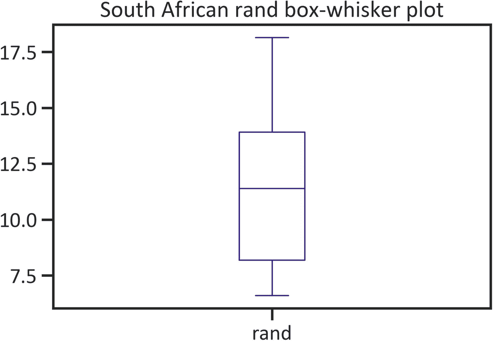

图 1-1

箱形图

```py
df["rand"].plot(kind="box", color="navy")
plt.title("South African rand box plot")
plt.show()

Listing 1-10Box-Whisker Plot

```

图 [1-1](#Fig1) 显示轻微的*偏斜*，指数值偏离平均值的趋势。或者，使用直方图确认分布。

### 柱状图

直方图在 x 轴上显示间隔(极限值的范围)，在 y 轴上显示频率(值在数据中出现的次数)。清单 [1-11](#PC11) 通过实现`plot()`方法，将`kind`指定为`"hist"`，将`color`设置为`"navy"`来构建 rand 直方图(参见图 [1-2](#Fig2) )。

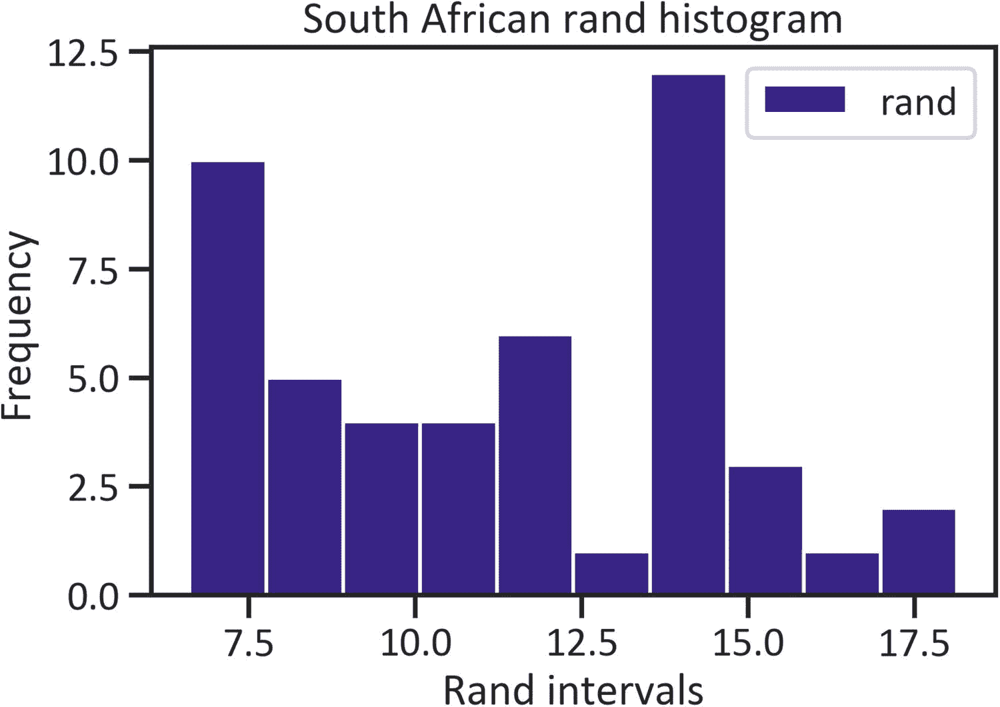

图 1-2

柱状图

```py
df["rand"].plot(kind="hist", color="navy")
plt.title("South African rand histogram")
plt.xlabel("Rand intervals")
plt.ylabel("Frequency")
plt.legend(loc="best")
plt.show()

Listing 1-11Histogram

```

图 [1-2](#Fig2) 没有显示钟形(确认图 [1-1](#Fig1) )，意味着这些值没有使平均值饱和。

### 线形图

折线图使用线条显示数值随时间的变化。清单 [1-12](#PC12) 通过实现`plot()`方法，将`kind`指定为`"line"`，将`color`设置为`"navy"`来构建 rand 直方图(参见图 [1-3](#Fig3) )。

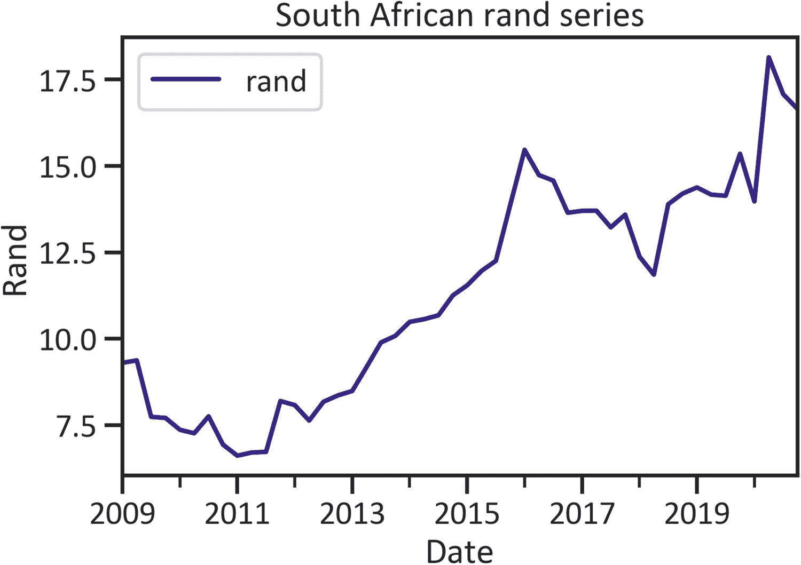

图 1-3

线形图

```py
df["rand"].plot(kind="line", color="navy")
plt.title("South African rand series")
plt.xlabel("Date")
plt.ylabel("Rand")
plt.legend(loc="best")
plt.show()

Listing 1-12Line Plot

```

图 [1-3](#Fig3) 表明持续的上升趋势。

要改变线宽，指定`lw`(见清单 [1-13](#PC13) 和图 [1-4](#Fig4) )。

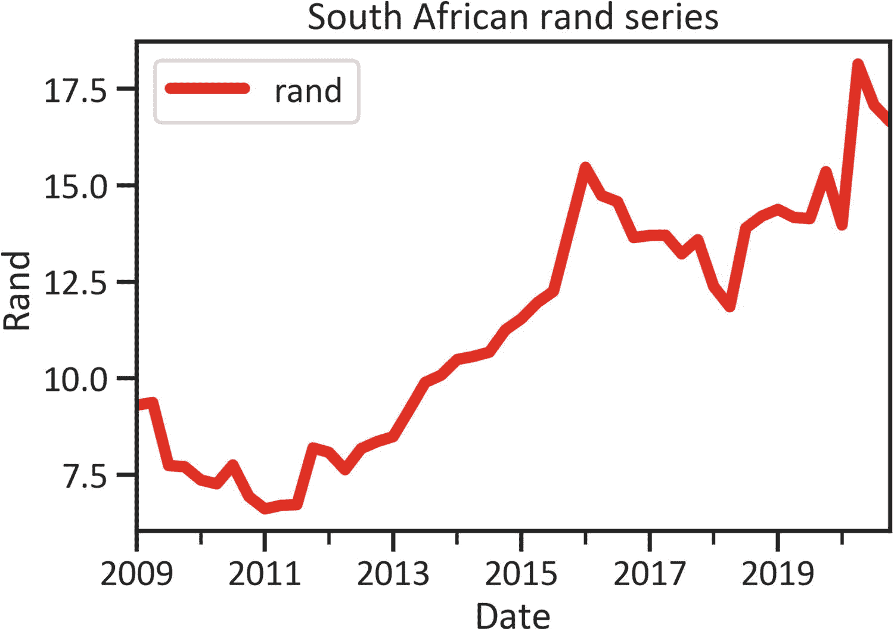

图 1-4

线形图

```py
df["rand"].plot(kind="line", color="red", lw=5)
plt.title("South African rand series")
plt.xlabel("Date")
plt.ylabel("Rand")
plt.legend(loc="best")
plt.show()

Listing 1-13Line Plot

```

### 散点图

要用图形表示两个特征，请使用散点图，将独立特征放在 x 轴上，将从属特征放在 y 轴上。清单 [1-14](#PC14) 通过实现`scatter()`方法，将`color`设置为`"navy"`，将`s`(散点大小)设置为`250`，构建了一个散点图，显示了`"gdp_by_exp"`和`"rand"`之间的关系，可以设置为任意大小(参见图 [1-5](#Fig5) )。

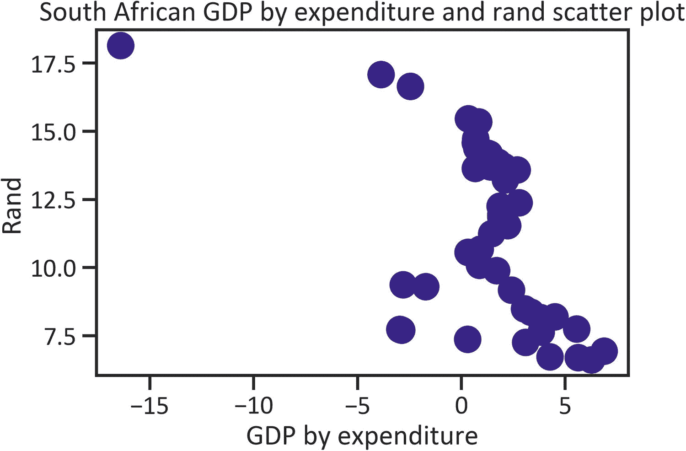

图 1-5

散点图

```py
plt.scatter(df["gdp_by_exp"], df["rand"], color="navy", s=250)
plt.title("South African GDP by expenditure and rand scatter plot")
plt.xlabel("GDP by expenditure")
plt.ylabel("Rand")
plt.show()

Listing 1-14Scatter Plot

```

图 [1-5](#Fig5) 显示分散点高于–5，除了超出–15 GDP 支出和 18 兰特标志的点。

### 密度图

密度图显示了使用核密度估计的概率密度函数。清单 [1-15](#PC15) 通过实现`plot()`方法，将`kind`指定为`"kde"`，并将`color`设置为`"navy"`来构建一个随机密度图(参见图 [1-6](#Fig6) )。在将种类指定为`"kde"`之前，请确保已经安装了 SciPy 库。在 Python 环境中，使用`pip install scipy`。同样，在 conda 环境中，使用`conda install -c anaconda scipy`。

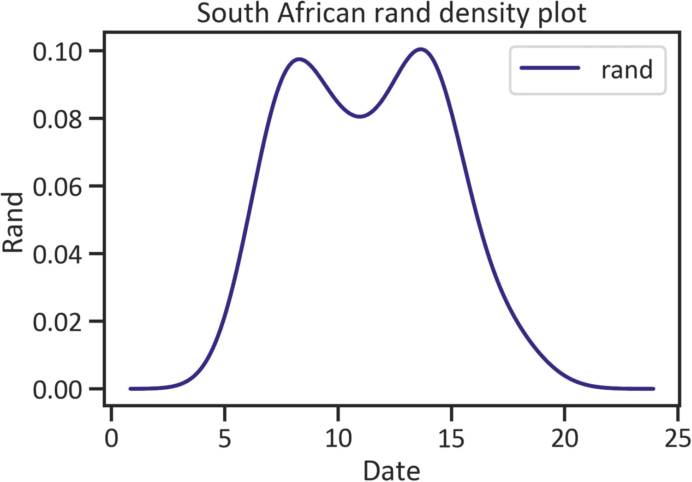

图 1-6

密度图

```py
df["rand"].plot(kind="kde", color="navy")
plt.title("South African rand density plot")
plt.xlabel("Date")
plt.ylabel("Rand")
plt.legend(loc="best")
plt.show()

Listing 1-15Density Plot

```

图 [1-6](#Fig6) 显示了使用密度函数的近似二项式结构。

### 小提琴情节

小提琴图借助于核密度估计函数捕捉分布。使用`pip install seaborn`在 Python 环境中安装 seaborn。如果在 conda 环境下，使用`conda install -c anaconda seaborn`。清单 [1-16](#PC16) 将 seaborn 库导入为`sns`。接下来，通过在 seaborn 库中实现`set()`方法并指定`"talk"`、`"ticks"`，将`font_scale`设置为`1`、`font`名为`"Calibri"`，来设置图形的通用参数。

```py
import seaborn as sns
sns.set("talk","ticks",font_scale=1,font="Calibri")

Listing 1-16Importing Seaborn and Setting Parameters

```

清单 [1-17](#PC17) 通过实现 seaborn 库中的`violinplot()`方法构建了一个方框图(见图 [1-7](#Fig7) )。

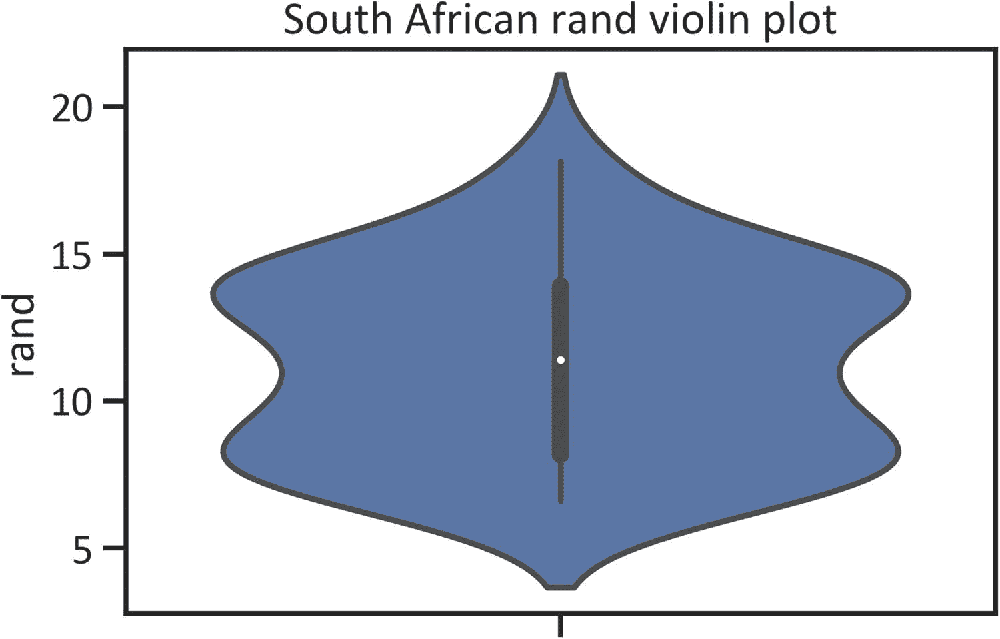

图 1-7

小提琴情节

```py
import seaborn as sn
sns.violinplot(y=df["rand"])
plt.title("South African rand violin plot")
plt.show()

Listing 1-17Violin plot

```

图 [1-7](#Fig7) 显示 violin 图没有显示数据中的任何异常。

### 回归图

要捕捉变量之间的线性关系，请传递最符合数据的直线。清单 [1-18](#PC18) 通过实现 seaborn 库中的`regplot()`方法构建了一个回归图(见图 [1-8](#Fig8) )。

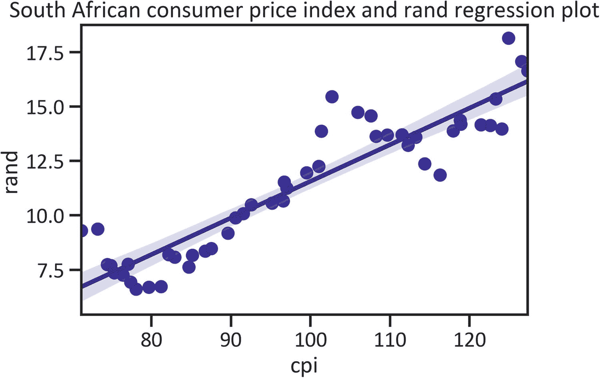

图 1-8

右图

```py
sns.regplot(data=df, x="cpi", y="rand", color="navy")
plt.title("South African consumer price index and rand regression plot")
plt.show()

Listing 1-18Reg Plot

```

图 [1-8](#Fig8) 显示了一条穿过数据的直线，表明消费者价格指数和兰特之间存在线性关系。

### 联合地块

联合图结合了成对散点图和数据的统计分布。清单 [1-19](#PC19) 通过实现 seaborn 库中的`jointplot()`方法构建了一个联合地块(参见图 [1-9](#Fig9) )。

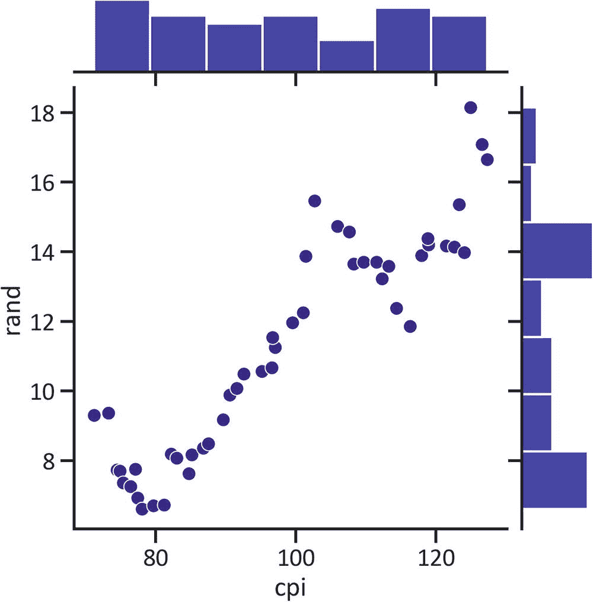

图 1-9

联合地块

```py
sns.jointplot(data=df, x="cpi", y="rand", color="navy")
plt.show()

Listing 1-19Joint Plot

```

### Heatmap(热图)

热图确定了数据分布的强度。清单 [1-20](#PC20) 展示了如何通过实现 seaborn 库中的`heatmap()`方法来构建热图(参见图 [1-10](#Fig10) )。

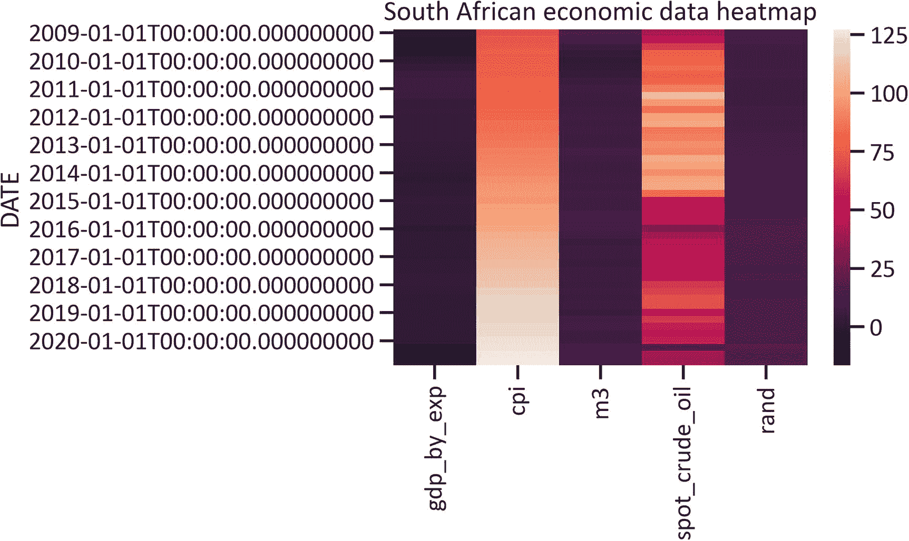

图 1-10

Heatmap(热图)

```py
sns.heatmap(df)
plt.title("South African economic data heatmap")
plt.show()

Listing 1-20Heatmap

```

或者，您可以通过指定`cmap`来更改连续颜色序列。

清单 [1-21](#PC21) 将`cmap`指定为`"viridis"`(见图 [1-11](#Fig11) )。

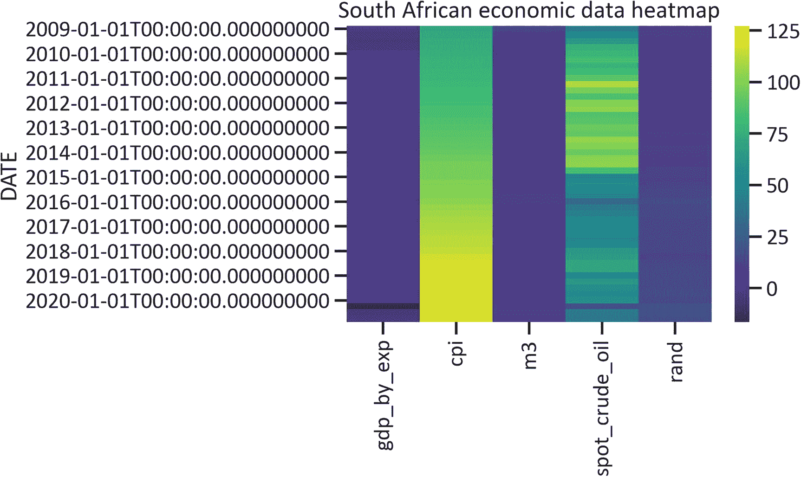

图 1-11

Heatmap(热图)

```py
sns.heatmap(df, cmap="viridis")
plt.title("South African economic data heatmap")
plt.show()

Listing 1-21Heatmap with Viridis Cmap

```

清单 [1-22](#PC22) 将`cmap`指定为`coolwarm`(见图 [1-12](#Fig12) )。

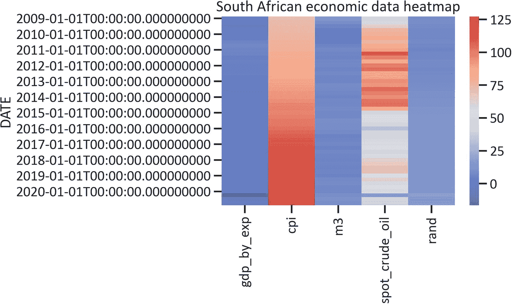

图 1-12

Heatmap(热图)

```py
sns.heatmap(df, cmap="coolwarm")
plt.title("South African economic data heatmap")
plt.show()

Listing 1-22Heatmap with Coolwarm Cmap

```

除了图 [1-12](#Fig12) 中指定的颜色序列，还有其他你可以实现的颜色序列(例如，灰色、蓝色和橙色)。更多信息请访问 seaborn 官方网站 [`https://seaborn.pydata.org/generated/seaborn.heatmap.html`](https://seaborn.pydata.org/generated/seaborn.heatmap.html) 。

## 三维图表

或者，您可以用图形表示 3D 空间中的数据。Matplotlib 库附带了`mpl_toolkits`库。清单 [1-23](#PC23) 通过实现`Axes3D()`方法，并将`cmap`(彩色地图)设置为`"viridis"`，构建了一个 3D 散点图，显示了 gdp_by_exp、消费者价格指数和 rand 之间的关系(见图 [1-13](#Fig13) )。

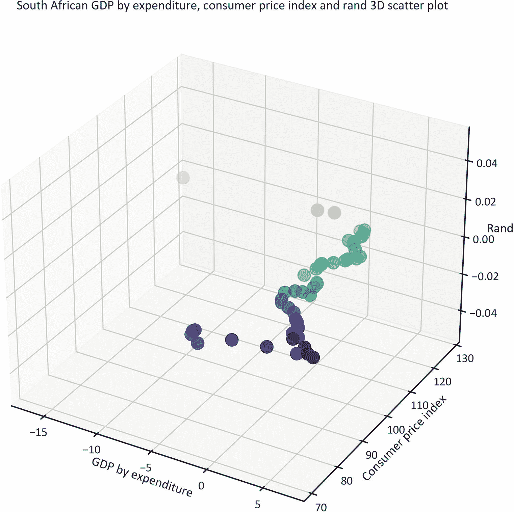

图 1-13

三维散点图

```py
from mpl_toolkits.mplot3d import Axes3D
fig = plt.figure(figsize=(10,10))
ax = Axes3D(fig)
ax.scatter(df["gdp_by_exp"], df["cpi"], c=df["rand"], s=300, cmap="viridis")
plt.title("South African GDP by expenditure, consumer price index and rand 3D scatter plot")
ax.set_xlabel("GDP by expenditure")
ax.set_ylabel("Consumer price index")
ax.set_zlabel("Rand")
plt.show()

Listing 1-233D Scatter Plot

```

## 结论

这一章让你熟悉了通过实现 pandas 库来提取和制表数据的基础知识。随后，通过实现 Matplotlib 和 seaborn 库以及通过实现 PyLab 库和 seaborn 库中的`set()`方法来设置图表的通用大小和 dpi，它提出了一种在 2D 空间中以图形方式表示数据的方法。最后，它展示了一种通过实现`mp3_toolkit`在 3D 空间中图形化表示数据的技术。

在继续下一章之前，请确保您理解了本章的内容，因为有些内容引用了第 [1](01.html) 章中的示例。