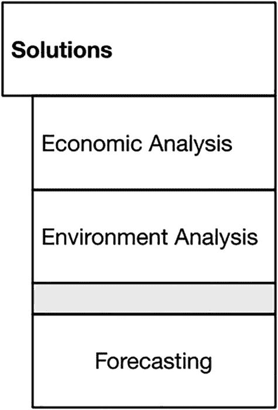
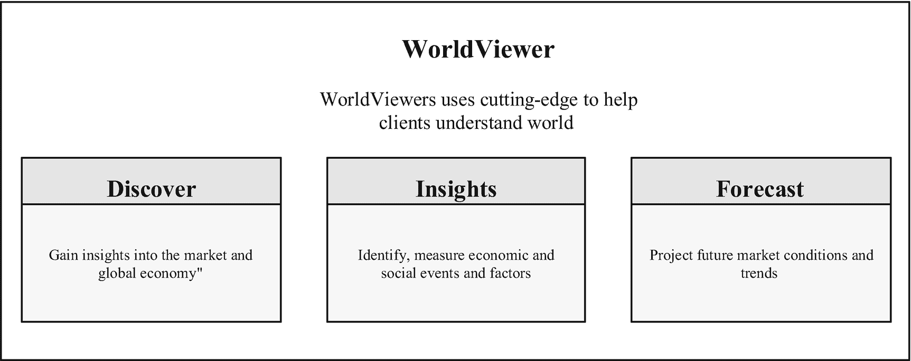
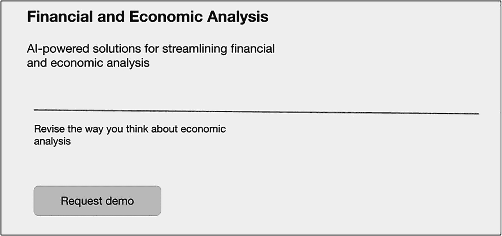
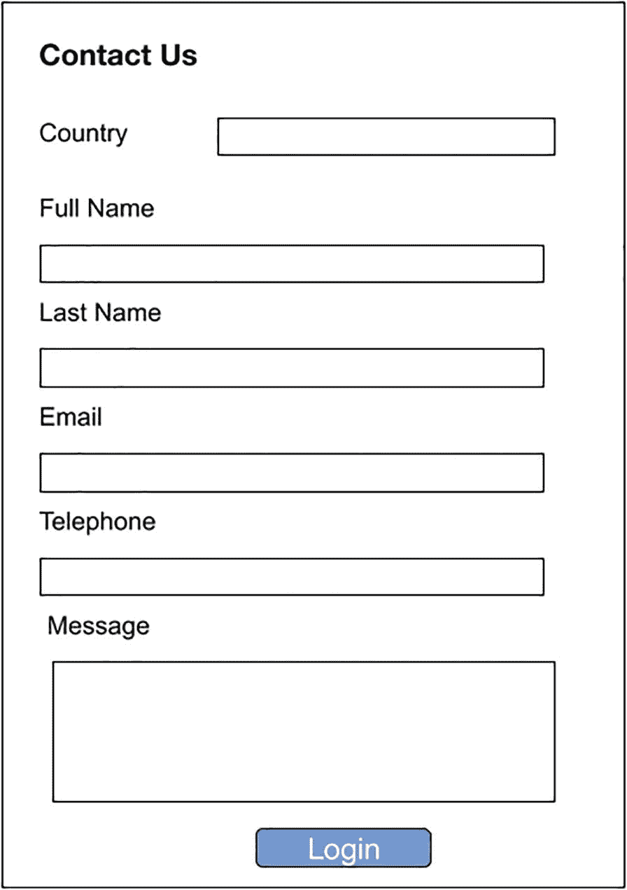
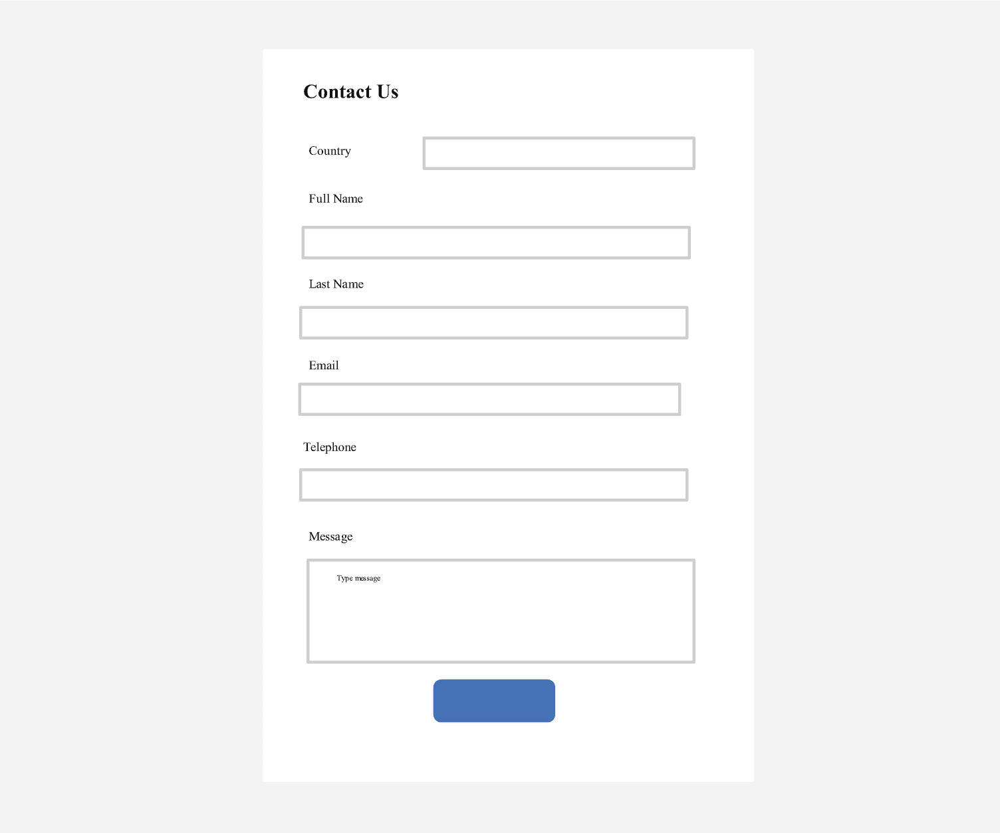
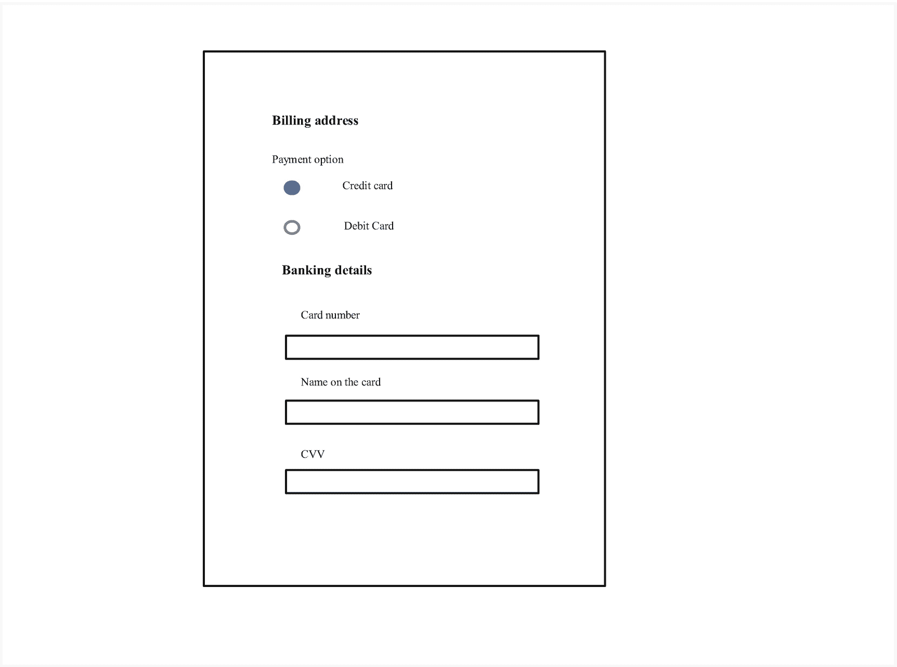

# 10.冲进一个完整的网站

前面的章节介绍了将仪表板构建为与机器学习模型集成的 web 应用。这一章更进了一步。阅读完本章的内容后，你应该能够构建一个 web 应用的重要页面。

清单 [10-1](#PC1) 安装本章使用的库(即`dash`、`dash_core_components`、`dash_html_components`、`dash_bootstrap_components`和`jupyter_dash`)，包括破折号依赖项(`Input`、`Output`和`State`)。

```py
import dash_table as dt
import dash
import dash_core_components as dcc
import dash_html_components as html
from dash.dependencies import Input, Output, State
import dash_bootstrap_components as dbc
from jupyter_dash import JupyterDash

Listing 10-1Import Key Dependencies

```

## 主页

主页通常是网站的主页。它为客户/用户提供与组织/个人相关的基本信息。对于组织而言，它包括一个导航栏，其中包含指向“关于我们”页面、“产品/服务”页面的链接。有时它可能包含登录部分。然后，有一个包含任何重要信息、产品、服务的标题，以及包含其他信息和媒体的部分。

本节解释了如何一步一步地构建主页。您可以单独创建每个组件，以便可以重用它。

清单 [10-2](#PC2) 通过实现 JupyterDash 库中的`JupyterDash()`方法来初始化 dash 应用。这个库在用 Jupyter 笔记本做原型时很有用。然而，对于产品开发，我建议您使用原来的 Dash 库(参见清单 [10-3](#PC3) )。

```py
app = dash.Dash(external_stylesheets=[dbc.themes.MATERIA, font_awesome],
                  meta_tags=[{"charset":"utf-8",
                              "name": "viewport",
                              "content": "width=device-width, initial-scale=1"}])

Listing 10-3Initialize Dash App Using the Original Dash Library

```

```py
font_awesome = "https://use.fontawesome.com/releases/v5.8.1/css/all.css"
app = JupyterDash(external_stylesheets=[dbc.themes.MATERIA, font_awesome],
                  meta_tags=[{"charset":"utf-8",
                              "name": "viewport",
                              "content": "width=device-width, initial-scale=1"}])

Listing 10-2Initialize Dash App Using JupyterDash

```

清单 [10-4](#PC4) 使用 CSS 格式指定页面的样式。

```py
-

Listing 10-4Specify Style Using CSS

```

清单 [10-5](#PC5) 通过实现`NavItem()`方法来构造导航项。然后，它通过实现`NavLink()`方法来指定项目包含的名称和链接(使用`href`)。导航项包括“`Home`”、`What We Do`、`Solutions`。

```py
nav_item1 = dbc.NavItem(dbc.NavLink("Home",
                                    href = "#"))
nav_item2 = dbc.NavItem(dbc.NavLink("What We Do",
                                    href = "#"))
nav_item3 = dbc.NavItem(dbc.NavLink("Solutions",
                                    href = "#"))

Listing 10-5Navigation Bar Items

```

除了清单 [10-5](#PC5) 中指定的导航项，让我们包括其他导航项，包括一个释放`DropdownMenu()`方法的导航项(见图 [10-1](#Fig1) )。



图 10-1

带有下拉菜单的导航项目

```py
dropdown_solutions = dbc.DropdownMenu(
    children=[
        dbc.DropdownMenuItem("Economic Analysis"),
        dbc.DropdownMenuItem(divider = True),
        dbc.DropdownMenuItem("Environment Analysis"),
        dbc.DropdownMenuItem(divider = True),
        dbc.DropdownMenuItem("Forecasting"),
    ],
    nav = True,
    in_navbar = True,
    label="Solutions",
    color="dark",
)

Listing 10-6Navigation Bar Items with a Drop-Down Menu

```

清单 [10-7](#PC7) 通过实现`Card()`方法来构造卡片。每张卡片都包含一些对整个组织的洞察。

```py
app_features1 = dbc.Card([
    dbc.CardBody([
        html.H4("Insights", className  = "card-title"),
        html.P("Gain insights into the market and global economy",
               className = "card-text")
    ])],
    className = "col-sm d-flex",)

app_features2 = dbc.Card([
    dbc.CardBody([
        html.H4("Discover", className = "card-title"),
        html.P("Identify, measure economic and social events and factors",
               className = "card-text")
    ])],
    className = "col-sm d-flex")

app_features3 = dbc.Card([
    dbc.CardBody([
        html.H4("Forecast", className = "card-title"),
        html.P("Project future market conditions and trends.",
               className = "card-text")])],
    className = "col-sm d-flex")

Listing 10-7Creating Cards

```

列表 [10-8](#PC8) 对列表 [10-7](#PC7) 中创建的卡进行分组。结果如图 [10-2](#Fig2) 所示。



图 10-2

分组卡片

```py
app_features = dbc.Card([
    dbc.CardBody([
        dbc.Row([
            dbc.Col([], width = 2),
            dbc.Col([
                html.H1("App Features"),
                html.Br(className="my-2"),
                html.P("WorldViewers uses cutting-edge to help clients understand world.")],
                width = 3)
        ]
        ),
        dbc.Row([
            dbc.Col(
                [
                    app_features1
                ]
            ),
            dbc.Col(
                [
                    app_features2
                ]
            ),
            dbc.Col(
                [
                    app_features1
                ]
            )
        ]
        )
    ]
    )
]
)

Listing 10-8Group Cards

```

清单 [10-9](#PC9) 构建卡片以指定组织的价值主张(见图 [10-3](#Fig3) )。注意它是如何应用`Rows()`和`Cols()`来定位项目的。


图 10-3

分组卡片

```py
value_proposition = dbc.Card([
    dbc.CardBody([
        dbc.Row([
            dbc.Col([],width=6),
            dbc.Col([
                html.H2("Economic and Social Analysis on the go.",
                        style = {"color":"white"}),
                html.P("Gain insights and control assets 24/7 on our app, so you can experience professional-level economic and social analysis features on the move.",
                       style = {"color":"white"})],
                width = 5),
            dbc.Col([],
                    width = "auto")
        ]
        )
    ]
    )
],
    color="dark"
)

Listing 10-9Creating Cards

```

此外，清单 [10-10](#PC10) 构建了一个卡片，其中包含一个与组织的产品相关的部分。

```py
subscribe_email_input = dbc.FormGroup(
    [
        dbc.Col(
            dbc.Input(
                type = "email",
                id = "subscribe-email",
                placeholder = "Enter email"
            ),
            width = 10,
        ),
    ],
    row = True,
)
subscribe_button = html.Div(
    [
        dbc.Button("Subscribe",
                   color = "dark",
                   outline = True),
    ]

)

Listing 10-10Create Newsletter Subscription Section

```

清单 [10-11](#PC11) 对清单 [10-10](#PC10) 中创建的输入和按钮进行分组(参见图 [10-4](#Fig4) )。


图 10-4

时事通讯订阅

```py
subscribe_card = dbc.Card([
    dbc.CardBody([
        dbc.Row([
            dbc.Col([], width = 5),
            dbc.Col([
                html.H4("Subscribe to Our Newsletter")],
                width = 5)]),
        dbc.Row([
            dbc.Col([], width = 4),
            dbc.Col(
                [
                    subscribe_email_input
                ],
                width = 4),
        dbc.Col(
            [
                subscribe_button
            ],
            width = 2),
            html.Br()],
            align = "center"),
    ]
    )
],
    style = {"padding": "2rem 1rem"})

Listing 10-11Finalize Subscription Card

```

清单 [10-12](#PC12) 构造了一个请求演示的按钮和另一个登录仪表板的按钮(见图 [10-5](#Fig5) )。


图 10-5

导航栏上的按钮

```py
request_button = html.Div(
    [
        dbc.Button("Request demo",
                   color = "light",
                   outline = False,),
    ]

)
login_button = html.Div(
    [
        dbc.Button("Sign in",
                   color = "primary"),
    ]

)

Listing 10-12Buttons to Include in the Navigation Menu

```

清单 [10-13](#PC13) 构造导航构造一个导航栏，其中包含前面部分指定的导航项目(即`nav_item1, nav_item2, dropdown_solutions, dropdown_about, dropdown_resources, request_button,`和`login_button`)。图 [10-6](#Fig6) 显示了结果。


图 10-6

最终导航栏

```py
default = dbc.NavbarSimple(
    children=[nav_item1,
              nav_item2,
              dropdown_solutions,
              request_button,
              login_button],
    brand="Worldviewer",
    brand_href="#",
    sticky="top",
    className="mb-5",
    color="dark",
    dark=True
)

Listing 10-13Navigation Bar

```

### 页脚导航栏

本节构建了一个页脚，其中包含将用户导向某个链接的导航项。它可以重用预先指定的导航项目和/或包括新项目。清单 [10-14](#PC14) 构造导航项目。

```py
about = html.Div(
    [
    html.H4("About", style={"color":"white"})
    ]
)
about_item1 = dbc.NavItem(dbc.NavLink("Our Company",
                                      href = "#",
                                      style = {"color":"white"}
                                     )
                         )
about_item2 = dbc.NavItem(dbc.NavLink("Careers",
                                      href = "#",
                                      style = {"color":"white"}
                                     )
                         )
about_item3 = dbc.NavItem(dbc.NavLink("FAQ",
                                      href = "#",
                                      style = {"color":"white"}
                                     )
                         )
about_fullitems = html.Div(
    [
        about,
        about_item1,
        about_item2,
        about_item3
    ]
)
legal = html.Div(
    [
        html.H4("Legal", style={"color":"white"})
    ])
legal_item1 = dbc.NavItem(dbc.NavLink("Term of use",
                                      href = "#",
                                      style = {"color":"white"}
                                     )
                         )
legal_item2 = dbc.NavItem(dbc.NavLink("Anti-Spam Policy",
                                      href = "#",
                                      style = {"color":"white"}
                                     )
                         )
legal_item3 = dbc.NavItem(dbc.NavLink("Cookie Policy",
                                      href = "#",
                                      style = {"color":"white"}
                                     )
                         )
legal_fullitems = html.Div([legal,
                            legal_item1,
                            legal_item2,
                            legal_item3])

resource = html.Div(
    [
        html.H4("Resource", style={"color":"white"})
    ])
resource_item1 = dbc.NavItem(dbc.NavLink("Information & Webinars",
                                         href = "#",
                                         style = {"color":"white"}
                                        )
                            )
resource_item2 = dbc.NavItem(dbc.NavLink("News & Insights",
                                         href = "#",
                                         style = {"color":"white"}
                                        )
                            )
resource_item3 = dbc.NavItem(dbc.NavLink("Learning Portal",
                                         href = "#",
                                         style = {"color":"white"}
                                        )
                            )
resource_fullitems = html.Div(
    [
        resource,
        resource_item1,
        resource_item2,
        resource_item3
    ]
)
solutions_init = html.Div(
    [
        html.H4("Solutions", style={"color":"white"})
    ])
solutions_item1 = dbc.NavItem(dbc.NavLink("Economic & Financial Markets Research",
                                          href = "#",
                                          style = {"color":"white"}
                                         )
                             )
solutions_item2 = dbc.NavItem(dbc.NavLink("Environment Analysis",
                                          href = "#",
                                          style = {"color":"white"}
                                         )
                             )
solutions_item3 = dbc.NavItem(dbc.NavLink("Forecast",
                                          href = "#",
                                          style = {"color":"white"}
                                         )
                             )
solutions_fullitems = html.Div(
    [
        solutions_init,
        solutions_item1,
        solutions_item2,
        solutions_item3
    ]
)

Listing 10-14Constructs Navigation Items

```

清单 [10-15](#PC15) 对页脚导航栏的导航项目进行分组。

```py
footer_nav = dbc.NavbarSimple(
    children=[about_fullitems,
              solutions_fullitems,
              resource_fullitems,
              legal_fullitems],
    brand="",
    brand_href="#",
    sticky="bottom",
    className="mb-5",
    color="dark",
    dark=True
)

Listing 10-15Group Navigation Items for Footer Navigation Bar

```

重要的是要明确版权保留是保护知识产权的一种机制。清单 [10-16](#PC16) 指定版权部分(见图 [10-7](#Fig7) )。



图 10-7

最终页脚导航栏

```py
copyrights = dbc.Card([
    dbc.CardBody([
        dbc.Row([
            dbc.Col([], width = 5),
            dbc.Col([
                html.P("Copyright © 2021 WorldViewer All rights reserved.",
                       style={"color":"dark"}
                      )
            ]
            )
        ]
        )
    ]
    )
],
    color="light")

Listing 10-16Copyright

```

### 旗帜

清单 [10-17](#PC17) 构建了一个前进到顶部导航栏的横幅(见图 [10-8](#Fig8) )。


图 10-8

旗帜

```py
banner1 = html.Img(src = app.get_asset_url("banner1.png"))
home_jumbotron = dbc.Jumbotron(
    [
        dbc.Row([
            dbc.Col([],width=2),
            dbc.Col([
                html.H4("Financial and Economic Analysis",
                        className="display-4"),
                html.H3("AI-powered solutions for streamlining financial and economic analysis",
                        className = "lead",
                       ),
                html.Hr(className = "my-2"),
                html.H3("Revise the way you think about economic analysis",
                       ),
                html.P(dbc.Button("Request demo",
                                  color = "dark",
                                  outline = True),
                       className = "lead")
            ]
            )
        ]
        )
    ]
)

Listing 10-17Banner

```

清单 [10-18](#PC18) 指定了应用的内容和布局。

```py
content = html.Div(id = "page-content")
app.layout = html.Div(
    [
        default, home_jumbotron, app_features,
        value_proposition, subscribe_card, footer_nav,
        copyrights, content]
)

Listing 10-18Specify Content and App Layout

```

### 回调以折叠小屏幕的导航

清单 [10-19](#PC19) 构造了一个在小屏幕上折叠的回调函数。

```py
def toggle_navbar_collapse(n, is_open):
    if n:
        return not is_open
    return is_open
for i in [1, 2, 3]:
    app.callback(
        Output(f"navbar-collapse{i}", "is_open"),
        [Input(f"navbar-toggler{i}", "n_clicks")],
        [State(f"navbar-collapse{i}", "is_open")],
    )(toggle_navbar_collapse)

Listing 10-19Callback to Collapse the Navigation for Small Screens

```

清单 [10-20](#PC20) 运行 Dash 应用(见图 [10-9](#Fig9) )。

```py
app.run_server(mode="external",
               dev_tools_ui=False,
               dev_tools_props_check=False)

Listing 10-20Run Dash App

```

## 主页



图 10-9

主页

## 联系我们

联系人页面使用户能够向组织传达消息。它还允许用户指定他们的联系方式，以便组织做出相应的响应。

清单 [10-21](#PC21) 初始化应用。

```py
font_awesome = "https://use.fontawesome.com/releases/v5.8.1/css/all.css"
app = JupyterDash(external_stylesheets=[dbc.themes.MATERIA, font_awesome],
                  meta_tags=[{"charset":"utf-8",
                              "name": "viewport",
                              "content": "width=device-width, initial-scale=1"}])

Listing 10-21Initializing App

```

清单 [10-22](#PC22) 使用 CSS 格式指定页面的样式。

```py
CONTENT_STYLE = {
    "margin-left": "16rem",
    "margin-right": "0.5rem",
    "padding": "0.5rem 0.5rem",
    "background-color": "white"
}

Listing 10-22Content Styling

```

清单 [10-23](#PC23) 指定了单个组件(即`country_list, full_name, last_name, email_input, phone_number,`和`textareas`)。输入包含占位符，占位符是通知用户要做什么的文本。

```py
country_list = dbc.FormGroup(
    [
        dbc.Label("Country", html_for="example-password-row", width=3),
        dbc.Col(
            dbc.Select(
                id="select",
                options=[
                    {"label": "South Africa", "value": "1"},
                    {"label": "United States", "value": "2"},
                    {"label": "Israel", "value": "3"},
                ],
            )
        ),
    ],
    row=True)
email_input = dbc.FormGroup(
    [
        dbc.Label("Email",
                  html_for = "email-input",
                  width=3),
        dbc.Col(
            dbc.Input(
                type="email",
                id = "contact-password-input",
                placeholder = "Enter email"
            ),
            width=10,
        ),
    ],
    row=True,
)

full_name = dbc.FormGroup(
    [
        dbc.Label("Full Name",
                  html_for = "fullname-input",
                  width=3),
        dbc.Col(
            dbc.Input(
                id = "contact-full-name",
                placeholder="Enter full name",
                bs_size="md",
                className="mb-3"),
            width=10,
        ),
    ],
    row=True,
)

last_name = dbc.FormGroup(
    [
        dbc.Label("Last Name",
                  html_for="example-password-row",
                  width = 3),
        dbc.Col(
            dbc.Input(
                id = "concat-last-name",
                placeholder = "Enter last name",
                bs_size="md",
                className="mb-3"),
            width=10,
        ),
    ],
    row=True,
)
phone_number = dbc.FormGroup(
    [
        dbc.Label("Phone",
                  html_for = "contact-phone-number",
                  width = 3),
        dbc.Col(
            dbc.Input(
                id = "contact-phone-number",
                type = "number",
                placeholder = "Enter phone ",
                bs_size = "md",
                className = "mb-3"),
            width = 10,
        ),
    ],
    row=True,
)
buttons = html.Div(
    [
        dbc.Button("Send",
                   id = "conctact-send-button",
                   color = "primary",
                   block = True),
    ]

)
textareas = dbc.FormGroup(
    [
        dbc.Label("Message",
                  html_for="contact-textarea",
                  width = 3),
        dbc.Col(
            dbc.Textarea(
                id = "contact-textarea",
                bs_size = "lg",
                placeholder = "Type message"
            ),
            width=10,
        ),
    ],
    row=True,
)

Listing 10-23Form Creation

```

清单 [10-24](#PC24) 对清单 [10-23](#PC23) 中创建的组件进行分组(即`country_list, full_name, last_name, email_input, phone_number,`和`textareas`)。

```py
header = html.H2("Contact Us")
form = dbc.Form([header,
                 html.Br(),
                 country_list,
                 full_name,
                 last_name,
                 email_input,
                 phone_number,
                 textareas,
                 html.Br(),
                 buttons])
card_form = dbc.Card(dbc.CardBody([form],
                     ),style={"margin-left": "22rem",
                            "margin-right": "22rem",
                            "margin-top": "8rem",
                              "margin-bottom": "3rem",
                            "padding": "0.5rem 0.5rem",
                            "background-color": "white"})
copyrights = dbc.Card([
    dbc.CardBody([
        dbc.Row([
            dbc.Col([],width=5),
                          dbc.Col([
                              html.P("Copyright © 2021 Worldviewer All rights reserved.",
                                     style = {"color":"dark"}
                                    )
                          ]
                          )
        ]
        )
    ]
    )
],
    color="light")
contactus_jumbotron = dbc.Jumbotron(
    [
        card_form,

    ]
)

Listing 10-24Group Contact Us Components

```

清单 [10-25](#PC25) 指定了应用的内容和布局。

```py
content = html.Div(id = "page-content")
app.layout = html.Div(
    [
        contactus_jumbotron,
        copyrights,
        content
    ]
)

Listing 10-25Specifying the Content and App Layout

```

清单 [10-26](#PC26) 运行应用(见图 [10-10](#Fig10) )。



图 10-10

联系我们

```py
app.run_server(mode = "external",
               dev_tools_ui = False,
               dev_tools_props_check = False)

Listing 10-26Run App

```

## 计费/结账

付费/结帐页面使用户能够提供他们的银行卡详细信息和支付信息，以便通过一个假期来处理交易。如果一个网站销售产品，这一点很重要。

清单 [10-27](#PC27) 为计费/结账页面构造组件(即`header_banking_details, name_on_card, credit_card_number, cvv_input,`和`buttons`)。每个输入组件都包含一个占位符，通知用户应该输入的信息。

```py
name_on_card = dbc.FormGroup(
    [
        dbc.Label("Name on card",
                  html_for = "bank-card-name",
                  width = 3),
        dbc.Col(
            dbc.Input(
                id = "bank-card-name",
                placeholder = "Enter name on card",
                bs_size = "md",
                className = "mb-3"),
            width=10,
        ),
    ],
    row = True,
)
credit_card_number = dbc.FormGroup(
    [
        dbc.Label("Card number",
                  html_for = "bank-card-number",
                  width = 3),
        dbc.Col(
            dbc.Input(
                id = "bank-card-number",
                placeholder = "Enter credit card number",
                bs_size = "md",
                className = "mb-3"),
            width = 10,
        ),
    ],
    row  =True,
)

cvv_input = dbc.FormGroup(
    [
        dbc.Label("CVV",
                  html_for = "bank-cvv",
                  width = 3),
        dbc.Col(
            dbc.Input(
                id = "bank-cvv",
                placeholder = "MM/YY",
                bs_size = "md",
                className = "mb-3"),
            width = 10,
        ),
    ],
    row = True,
)
check_button = html.Div(
    [
        dbc.Button("Check Out",
                   id = "check-out-button",
                   color = "primary",
                   block = True),
    ]

)
radioitems = dbc.FormGroup(
    [
        dbc.Label("Payment option"),
        dbc.RadioItems(
            options=[
                {"label": "Credit card", "value": 1},
                {"label": "Debit card", "value": 2},
            ],
            value = 1,
            id = "radioitems-input",
        ),
    ]
)
header_billing = html.H2("Billing address")
header_banking_details = html.H2("Banking details")
baking_details = dbc.Card([
    dbc.CardBody([])])
forgot_password = html.Label(['',
                              html.A('Forgot Password',
                                     href = '#')])
form = dbc.Form(
    [
        header_billing,
        radioitems,
    ]
)

Listing 10-27Billing/Checkout Components

```

清单 [10-28](#PC28) 对计费/结账表单的组件进行分组(即`header_banking_details, name_on_card, credit_card_number, cvv_input,`和`buttons`)。

```py
form2 = dbc.Form(
    [
        header_banking_details,
        name_on_card,
        credit_card_number,
        cvv_input,
        html.Br(),
        check_button
    ]
)
card_form = dbc.Card([
    dbc.CardBody([form,
                  html.Br(),
                  form2]),
    style = {"margin-left": "22rem",
             "margin-right": "22rem",
             "margin-top": "8rem",
             "margin-bottom": "3rem",
             "padding": "0.5rem 0.5rem",
             "background-color": "white"}])
copyrights = dbc.Card([
    dbc.CardBody([
        dbc.Row([
            dbc.Col([], width = 5),
            dbc.Col([
                html.P("Copyright © 2021 Worldviewer All rights reserved.",
                       style = {"color":"dark"}
                      )
            ]
            )
        ]
        )
    ]
    )
],
    color="light")
checkout_jumbotron = dbc.Jumbotron(
    [
        card_form,

    ]
)

Listing 10-28Group Billing/Checkout Components

```

清单 [10-29](#PC29) 指定了应用的内容和 Dash web 应用布局。

```py
content = html.Div(id="page-content")
app.layout = html.Div(
    [
        checkout_jumbotron,
        copyrights,
        content
    ]
)

Listing 10-29Specifying the Content and App Layout

```

清单 [10-30](#PC30) 运行应用(见图 [10-11](#Fig11) )。



图 10-11

检验

```py
app.run_server(mode = "external",
               dev_tools_ui = False,
               dev_tools_props_check = False)

Listing 10-30Run the App

```

## 结论

本章让你熟悉了基于 Dash 引导组件、Dash HTML 组件和一些基本 CSS 样式功能开发一个完整网站的基础知识。接下来，你可以包含 JavaScript 和其他语言，包括其他 web APIs，来开发理想的网站。W3Schools 是一个理想的起点。